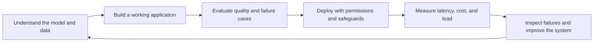
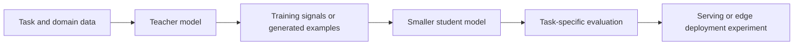
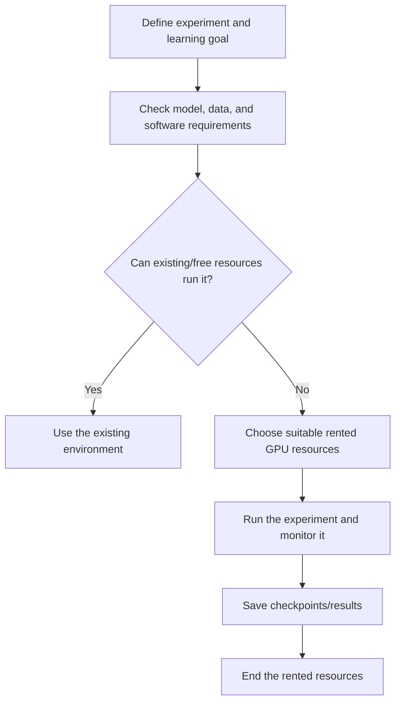
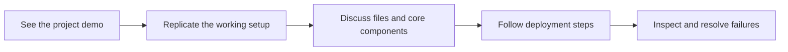

# 🚀 Class 1: Induction and the Research-to-Production Roadmap
### 📋 Production AI / LLM Engineering | Krish Naik Academy

**🎙️ Mentors:** Krish Naik; Sourangshu Pal (Paul); Divesh Jadhwani  
**⏱️ Duration:** ~5 hours 14 minutes | **📅 Session:** Day 1 (19 July 2026)

---

## 📰 Quick Updates

This was the induction session for the **Advanced Route: Production AI and LLM Engineering—Frontier AI from Research to Production** bootcamp. Krish introduced the course and learning platform; Paul discussed the curriculum, projects, learning expectations, and most of the extended Q&A. Divesh introduced himself and helped monitor questions. The [course resources hub](https://krishnaikacademy.notion.site/Production-AI-Engineering-3a8eba9593d080d7b876e8ced7d541f1) confirms the mentor names used above.

| Item | Arrangement described during induction |
|---|---|
| Live sessions | Saturdays and Sundays, beginning at 8 PM IST |
| Teaching window | Advertised around 8–11 PM; Paul allowed that teaching could run later, followed by Q&A |
| Expected course length | Roughly 7–8 months, with possible extension depending on concepts, projects, and interruptions |
| Live platform | Zoom, accessed through the dashboard's Workshop section or the emailed invitation |
| Recordings | Course dashboard; the team aimed for upload within 24 hours after processing, often sooner |
| Dashboard access | Two years for the course as described; a possible additional six months was explicitly conditional, not guaranteed |
| Transcripts | Planned alongside recordings for this cohort; older batches might not have them |
| Certification | Krish said the academy would emphasize demonstrated project work rather than issue a completion certificate |
| Assignments | Coding tasks with test cases, grading, and deadlines; exact scheduling was still being finalized |
| Hackathons | A separate platform and approximately monthly events were planned after suitable modules |
| Additional expenses | API, cloud, and GPU use could add costs beyond enrollment; no single compulsory spending total was established |

The academy dashboard was the main communication and learning location. Krish initially discouraged scattered unofficial groups. Later, Paul described plans for a dedicated course Discord with controlled access to paper/model updates and discussion channels. Read these as evolving communication plans: the induction did not establish that an arbitrary WhatsApp or public Discord group was the official course channel.

The curriculum shown in the session had **16 modules, five capstone projects, and roughly 25 or more linked papers**. A student mentioned an earlier document with 24 modules; Paul said an earlier draft had been revised before launch. Use the current course page and announcements rather than assume that a prelaunch draft determines the final scope.

---

## 🏗️ The Course Goal: Understand and Operate the Whole System

Krish distinguished a working local demonstration from an application ready to serve real users. Generating an agent's code, getting one input/output example to work, and running it on a laptop are useful steps. They do not answer the production questions: how it is deployed, how it behaves under load, how failures are detected, how permissions work, and how its output is evaluated.

The roadmap therefore connected model knowledge with software and operational concerns. The intended projects would include modular code, containers, deployment workflows, evaluations, observability, guardrails, and security boundaries. Scaling demonstrations and load tests were planned, with example targets such as thousands of users. Those targets were part of the course's planned experiments; no application was load-tested during induction.

The teaching team's career and enterprise-readiness claims were ambitious expectations, not guaranteed job, salary, or production outcomes.

The distinction matters throughout these notes: **the induction explained the learning journey and its scope; it did not deliver the later implementation lessons.** Technical terms below are the subjects Paul planned to cover, accompanied by the limited intuition he gave for why they matter.

---

## 🧭 Prerequisites and How to Close Gaps

Python was the clearest prerequisite. Learners needed to read and work with functions, classes, libraries, type hints, and docstrings, and understand a project's general flow. Paul expected some familiarity with APIs and databases as part of normal development practice. The course would not spend its main teaching time on introductory Python syntax.

Basic deep-learning knowledge was also expected. In repeated Q&A, Paul made that more concrete: know what a neural network, activation function, loss, and optimizer do; have some intuition for training and backpropagation; and preferably have tried a small CNN, RNN, or LSTM exercise. Deep-learning expertise was not required, but arriving without any understanding of these components would make the early modules harder.

PyTorch was the framework intended for the foundational implementations and assignments. Students who knew deep learning through Keras could still join, but were encouraged to become familiar with PyTorch. Paul proposed a poll in the next class to decide whether a refresher was needed. At induction, this was a proposal—not a refresher already taught.

The practical preparation sequence was:

1. Make sure you can read Python functions and classes and run a small script.
2. Review the main components of a neural-network training task.
3. Work through a small PyTorch example and inspect how the model, loss, and optimization fit together.
4. Change one component, such as an activation function, and observe the effect.
5. Review the course prerequisite links and ask about a specific gap rather than try to learn every term in the syllabus at once.

Paul favored official documentation, with videos and starter repositories as supplements. Older examples may need dependency/API updates.

Classical ML was useful but not the immediate prerequisite bottleneck for this transformer-focused path. Its importance—and that of statistics—still depends on the target role/task.

Several learners asked whether they should change courses because they did not know PyTorch. Paul distinguished a limited framework gap from a missing foundation. A developer with the underlying concepts could begin closing the PyTorch gap. Someone seeking a complete zero-to-foundations path might prefer a beginner course; a requested enrollment change would be discussed separately with the academy. No student transfer was carried out during this class.

---

## 📚 The Roadmap at a Glance

Paul expected the early model-oriented part to be the most demanding and to occupy a substantial share of the course. Later RAG and agent topics were described as easier for this cohort to adopt because they build applications around model capabilities. This was a pacing judgment; production retrieval and agent systems still require engineering, evaluation, and operational work.

The table preserves the actual order and subject groups of the walkthrough without inventing a fixed week-by-week calendar or assigning uncertain module numbers.

| Roadmap block | Planned coverage | Why Paul placed it there |
|---|---|---|
| AI foundations / Transformers 101 | Embeddings, attention, self-attention, multi-head attention, tokenization, transformer implementation | Establish the underlying computation before studying newer model variations |
| Prompts to programs | Prompt basics, structured output, Instructor, Outlines, DSPy | Make model interactions more controllable and useful in later pipelines |
| Transformer architectures and efficient attention | Encoder/decoder families, introductory adaptation, KV cache, attention variants, scaling laws | Connect foundation architecture to memory, compute, and serving behavior |
| Fine-tuning landscape | Data preparation, continued training concepts, PEFT, SFT, preference alignment, tooling, serving preparation | Build and assess adapted models rather than only call hosted APIs |
| Mixture-of-experts and small models | Architecture ideas, SLM design, pruning/compression topics | Explore models suited to specific workloads and resource budgets |
| Knowledge distillation | Teacher/student methods, data generation, evaluation | Transfer useful capabilities into a smaller model |
| Multimodal and speech systems | Vision transformers, vision-language models, speech-to-text, Whisper-related architecture | Extend the model perspective beyond text |
| Representation learning and embeddings | Domain adaptation, Matryoshka representations, embedding evaluation | Build the representations needed by retrieval applications |
| RAG systems | Basic/hybrid/advanced retrieval, document parsing, multimodal and graph approaches, caching, security | Build applications grounded in a knowledge source |
| Agent systems and protocols | LangGraph, PydanticAI, tool calling, MCP, A2A, production orchestration | Use model capabilities in controlled workflows |
| Context and harness engineering | Context assembly/pruning, tool execution, sandboxing | Manage what the application supplies to and permits the model |
| LLMOps, cloud, and security | Tracing, evaluations, budgets, caching, AWS deployment, RBAC, identity/security topics | Operate and assess the complete application |

Framework and model choices were explicitly flexible. A listed model family or tool could be replaced if support, compatibility, the task, or new research made another option more appropriate. The concepts and learning objectives were more stable than every item in the proposed stack.

---

## 🧠 Foundations, Tokenization, and Efficient Attention

The first conceptual sequence was intended to start with embeddings and the attention mechanism, develop the matrix operations by hand, and then connect them to **[Attention Is All You Need](https://arxiv.org/abs/1706.03762)**. Paul referred to the original machine-translation task and planned a PyTorch implementation from the underlying blocks. The induction itself did not derive attention or supply that implementation.

Tokenization would receive a dedicated deep dive. Paul highlighted byte-pair encoding and SentencePiece and emphasized that tokenization choices differ among models. Later lessons would examine the actual schemes instead of assuming a tokenizer solely from a model-family name.

The architecture block would compare encoder-oriented, decoder-oriented, and encoder–decoder models. Familiar model families such as BERT, GPT-style models, and T5 were presented as useful starting points for introductory adaptation before moving into more recent architectures.

Paul then previewed **KV caching and memory calculations**, including the decoding problem, multi-head/grouped-query/multi-query/multi-head-latent attention, FlashAttention, and paged serving approaches. The motivation was to understand how model architecture affects memory and runtime. His example allocation of a portion of GPU memory to a cache was a personal configuration illustration, not a universal percentage required for every model.

FlashAttention was grouped with efficient-attention techniques, but its important distinction is that it computes exact attention with an IO-aware implementation rather than simply approximate attention. The [original paper](https://arxiv.org/abs/2205.14135) supports that clarification. The induction did not benchmark implementations or select a kernel for a real workload.

Scaling laws, including Chinchilla-related compute/data considerations and newer RL work, were planned paper discussions. Future research trends were Paul's expectations, not established predictions.

Two cache-related topics appeared in the roadmap: the internal model KV cache and provider-facing prompt-cache features/billing. They should not be treated as the same configuration problem. The course would later examine their details; the induction supplied no exact provider limit or current universal billing rule.

---

## 🛠️ Prompts to Programs and Controllable Outputs

Paul positioned the prompts-to-programs block early because later data-generation and application pipelines need predictable interfaces. The goal was not to collect prompt tricks in isolation. It was to turn a model interaction into a component whose output and behavior can be checked and used by another part of a program.

Instructor, Outlines, and DSPy were named as intended tools. Structured outputs and prompt/program optimization would support later synthetic-data and application work. This class did not define a schema, configure constrained decoding, run a DSPy optimizer, or supply code for these libraries.

He also mentioned context engineering, harness engineering, and emerging “loop engineering” terminology. The roadmap used them to describe increasingly broad concerns around model use: the prompt, the context supplied, and the surrounding workflow that makes a model useful. These names were not presented as a rigorously standardized sequence that every application must follow.

A framework-vulnerability question did not identify an advisory/version or receive a verified assessment. The exchange cannot establish that a whole framework is free of vulnerabilities.

---

## 🧪 Fine-Tuning: Data, Objectives, and Tooling

Fine-tuning was described as a major and potentially lengthy part of the course. Paul emphasized that preparing useful data is often harder than launching the training operation. Domain selection, annotation, cleaning, the model's expected format, and evaluation all influence whether a training run produces a useful result.

The planned progression included foundational/continued-training ideas, supervised fine-tuning, parameter-efficient methods such as LoRA/QLoRA and variants, preference alignment, quantization, adapter handling, and serving. PPO, GRPO, DPO, and other alignment methods were mentioned as future topics. Reinforcement learning would be covered as needed for those tasks, not as a complete standalone RL curriculum.

The terminology needs one important clarification. **SFT is a training objective/workflow; PEFT describes a way to adapt a model while training fewer parameters. They can be used together.** They are not obligatorily separate sequential stages called “first PEFT, then SFT.” The [PEFT documentation](https://huggingface.co/docs/peft/index) and [TRL SFT Trainer documentation](https://huggingface.co/docs/trl/sft_trainer) explicitly support supervised adapter training. Similarly, DPO is a preference-learning approach with a different formulation from a PPO-style RL loop; the [DPO paper](https://arxiv.org/abs/2305.18290) explains that distinction.

Gaurav's question clarified a practical scope boundary. The capstone would begin with a **pretrained foundation model**, then adapt it to the selected task. It was not a promise to pretrain a frontier-scale model from random initialization. The live terminology around “full fine-tuning,” adapters, and an “own model” was not perfectly consistent, so the exact trainable-parameter recipe remained something to establish in the later project. The clear commitment was a usable adapted artifact and an end-to-end workflow.

Paul planned datasets larger than 100,000 examples for several demonstrations and sometimes mentioned around 300,000. Those were proposed project sizes. They are **not a universal minimum below which fine-tuning has no value**. The appropriate amount depends on the model, task, data quality, training method, and evaluation target. Official TRL examples demonstrate adaptation workflows without prescribing that blanket threshold.

Axolotl was Paul's preferred intended framework. Hugging Face Transformers/TRL, Unsloth, and LlamaFactory were discussed as alternatives. He explained that a framework's support and compatibility affect the workflow and welcomed equivalent implementations using another stack. His preference did not mean that every method is supported by every version of his chosen framework.

Managed fine-tuning services, including Together AI and AWS SageMaker, were acknowledged, but Paul wanted learners to see more of the preparation and execution process. A managed service can simplify the operational steps; the teaching plan favored inspecting the pipeline rather than making a dataset upload the whole exercise.

---

## 🧬 Small Models, Distillation, and Multimodal Learning

The roadmap moved from broader architecture ideas toward **small language models** and **knowledge distillation**. Paul viewed domain-specific smaller models as a more practical project scale than attempting to construct a trillion-parameter general-purpose model for a course or ordinary organization.

Mixture-of-experts was an intended architecture topic, along with related research mentioned in passing. It should not be read as a statement that every current language model uses MoE. Models and architectures differ, and the course would examine the actual design of its selected examples.

For distillation, Paul used the teacher/student picture: use a more capable model to help transfer useful behavior into a smaller model, then evaluate what the student has retained. He described a possible larger teacher and a student below roughly four billion parameters. These were selection examples, not a model pair fixed during induction.

Distillation was linked with synthetic data, and a later catastrophic-forgetting demonstration was promised. Uninvestigated allegations about company training data are not treated as established facts.

The multimodal block would introduce the shift from CNN-based examples toward vision transformers and vision-language models. Speech-to-text and Whisper-related architecture were also planned. Paul expected this portion to mix conceptual explanation with selected practical work and said that large multimodal training could require substantial GPU resources.

Research students also asked about world models. Paul suggested exploring modern vision/transformer and language-model research, but said world-model/JEPA/SSM material was not a major committed part of this cohort. A course roadmap is a starting point for studying existing work; it is not a PhD thesis proposal or a guarantee of research novelty.

---

## 🗃️ Embeddings and RAG: Build the Information Pipeline

The representation-learning block would study custom/domain embedding models, embedding evaluation, and **Matryoshka representations**, where a representation can be useful at multiple supported dimensions. Paul named embedding benchmarks/leaderboards as part of model selection. The induction did not train an embedding model, establish a required dataset size, or prove that every embedding model uses that approach.

RAG coverage would begin with familiar frameworks such as LangChain and LlamaIndex, then move through basic and hybrid retrieval, reranking, corrective/advanced approaches, and scaling concerns. Paul preferred learners to understand the underlying components so they could eventually build or modify a system beyond a high-level wrapper.

Document ingestion would cover layout detection, OCR, parsing, chunking, multimodal representations/reranking, and single-/dual-stage parsing. Azure Document Intelligence, AWS Textract, Google Document AI, and LlamaParse were possibilities. Salman was told OCR was already included.

Graph-based retrieval and structured/vectorless document approaches were also planned. Paul described their relevance to certain structured financial/legal documents and allowed that the database/framework choice might change. These were intended experiments, not a demonstration that one retrieval method is best for every corpus.

RAG security, PII masking, input/output guardrails, prompt-injection concerns, normal/semantic caches, vector quantization, and large-corpus behavior were part of the later roadmap. No universal vector-count threshold was established at which quantization suddenly becomes useful; the class's large-scale example motivated the topic rather than define its applicability.

A late chat question asked why fine-tuning remains useful if RAG exists. Paul's decision intuition was that frequently updated external information often favors retrieval, while a more stable domain task may justify adapting a model. The accurate conclusion is **a tradeoff to evaluate on the actual task**, not a guarantee that an SLM always has lower hallucination or higher accuracy than RAG. The [original RAG paper](https://arxiv.org/abs/2005.11401) itself combines parametric and retrieved information and reports task-specific improvements, demonstrating why blanket rankings are inappropriate.

Atharva's existing project provided a practical preparation example. A working ingestion/retrieval pipeline is only part of a mature application. Paul suggested inspecting latency, data volume, retrieval choices, permissions, guardrails, and evaluation, and being able to explain the underlying concepts. RRF and RSF were mentioned as examples of hybrid-search knowledge a learner should be able to discuss; they were not derived during induction.

---

## 🤝 Agents, Context, and the Harness Around the Model

LangGraph and PydanticAI were the two main intended agent frameworks. Paul liked the Pydantic ecosystem's validation, evaluation, and Logfire-related tooling, and wanted substantial work to stay within a coherent stack. His opinions about framework complexity and adoption were personal experience, not measured market-share findings from this session.

The planned protocol work included custom MCP servers, gateways, and A2A. Their roles are worth distinguishing: **MCP connects AI applications to tools/data and external systems; A2A supports communication and interoperability between independent agent systems.** The [MCP introduction](https://modelcontextprotocol.io/docs/getting-started/intro) and [official A2A overview](https://a2a-protocol.org/latest/) support that distinction. They are related pieces of the roadmap, not interchangeable names for every multi-agent interaction.

Function/tool calling and multi-agent workflow structures would appear in the application work. In Swati's discussion, Paul described a coordinator checking work from several agents and possible sub-agents. The design would be chosen for the task; adding more agents was not itself the objective.

Context engineering would examine how to assemble, transform, prune, or compress the information supplied to a model. Paul noted that a large context window is still finite and that bigger capacity can add cost and computation. His favored context sizes were personal choices, not guarantees that every task fits a particular token budget.

Harness engineering was described as the surrounding system that makes the model useful. Coding agents were the easiest familiar examples, but the concept was not limited to code generation. Tool execution, workflow control, and sandbox environments were planned topics. The class did not install a sandbox or configure a production agent harness.

Portable framework-based application design and cloud-managed agent services were contrasted. Paul favored understanding a workflow that could be moved rather than committing the entire design to one vendor's specialized service. This was a design preference; the actual migration effort depends on the implementation and its dependencies.

---

## 🔍 Evaluation, Observability, Deployment, and Security

Krish's initial production emphasis reappeared in the final roadmap blocks. A deployed system needs evidence about what it does, where its time and cost go, and how it responds to undesirable or invalid input. Planned tools included Ragas, Phoenix, Inspect AI or other evaluation frameworks, and tracing platforms such as Langfuse, LangSmith, and Logfire.

Self-hosting, span-level traces, token/cost budgets, and caching were planned. AWS was primary, with Azure/GCP for possible services; suitable alternatives and Terraform/Pulumi/CloudFormation were accepted.

Docker and Kubernetes were tools the course intended to use for relevant deployment work, not complete standalone subjects to teach from first principles. Paul said deployment documentation and commands would accompany projects. Learners were encouraged to know the basics, inspect logs, and understand the steps they were executing. A short command list is useful preparation but should not be confused with complete operational proficiency.

Enterprise security planning included RBAC, guardrails, and SAML/identity-related concepts. Nazan asked specifically about identities for multi-agent governance. Paul did **not** commit to a full vendor-specific Auth0/Okta implementation for the cohort; he favored accessible, often open-source tools and said future product choices could be revisited. This limitation belongs alongside the security roadmap, rather than implying every identity system would be taught.

Issac's healthcare question made evaluation requirements concrete. He wanted to reduce hallucinations and assess an existing chatbot/application. Paul said evaluation would be covered across model, RAG, and agent systems, and highlighted data preparation, annotations, and metadata errors as possible contributors to poor output. No particular healthcare system was audited in this class.

The discussion used very high accuracy figures to illustrate the seriousness of healthcare work. There is **no universal single accuracy percentage that establishes clinical safety or acceptance**. Assessment has to match the intended use, population, failure consequences, and relevant validation. The [FDA's good machine-learning-practice principles](https://www.fda.gov/medical-devices/artificial-intelligence-enabled-medical-devices/good-machine-learning-practice-medical-device-development-guiding-principles) frame medical-device development across the product lifecycle; that is a more appropriate reference than turning a classroom example into a clinical threshold.

---

## 🧱 The Five Planned Capstone Projects

These were **proposed end-to-end projects**, not products completed during induction. Paul said the stack, model family, and ordering could change, and estimated that an individual large project might occupy several sessions or weeks.

| Project | Planned outcome | Important scope details |
|---|---|---|
| Domain-specific model / **MedScript AI** | Adapt a pretrained model using a medical-domain dataset, evaluate it, and serve it | Intended to connect data preparation, adaptation/alignment, checkpoints, serving with vLLM or a compatible alternative, and self-hosted cloud deployment |
| Small reasoning model and edge deployment | Use distillation and compression/quantization to make a smaller model usable in a constrained serving setup | Teacher/student learning, experiment tracking, GGUF/llama.cpp-related export, and possible LM Studio/Ollama use were discussed; exact model/hardware was not fixed |
| Legal multimodal RAG / **LexisGraph** | Build retrieval over legal material with production-oriented controls | A RAG/agent application with ingestion, multimodal/graph-related components, security, and RBAC refinements |
| Agentic/hybrid RAG system | Combine retrieval and agent workflows in a larger application | Described as distinct from the legal RAG project; the transcript did not clearly preserve a separate branded project title |
| Large-scale synthetic instruction-data factory | Generate and prepare reusable domain training data through a configurable pipeline | Quality filtering, deduplication, multiple model/data formats, data-engineering integration, and an intended open-source contribution workflow |

The synthetic-data factory could feed the model projects; the RAG/agent projects were separate application examples.

An eventual public contributor project was planned; no repository or contributor count was established here.

Ashok Perumal asked whether synthetic examples are automatically equivalent to real data. Paul wanted generated data checked and mixed with original examples, and suggested an illustrative 50:50 split. That ratio was not validated as a universal requirement. Generated examples need task-appropriate verification; generation volume alone does not establish quality, realism, or suitability.

For data engineers, this project was especially relevant. The course would involve cleaning, transforming model-specific formats, orchestration, filtering, and preparing data for downstream training. Airflow/Prefect-style orchestration was mentioned as a possibility. None was implemented during the induction.

---

## 💻 Hardware, APIs, and Spending: Plan for the Workload

The ordinary local-development target mentioned in Q&A was around **16GB RAM**. Paul did not require every learner to own a powerful GPU. The intended demanding training demonstrations would use rented GPU environments; the laptop could remain the interface to the code and remote machine.

Vast.ai, Thunder Compute, Lightning AI, cloud instances, and several other providers were discussed. The invariant was a suitable Linux/Ubuntu environment with the needed GPU resources, not one permanently required vendor. Provider pricing, available machines, region, internet performance, and managed setup convenience could affect the decision.

Paul's planned fine-tuning demonstrations often targeted A100/H100-class machines and around 80GB VRAM or more. This was **his intended workload scale**, not the minimum memory needed for every possible fine-tuning exercise. Students with consumer GPUs could reduce the workload or use a parameter-efficient approach where supported. Memory capacity and computational throughput both matter; neither a GPU model name nor VRAM alone predicts the whole training runtime.

Single- and multi-GPU execution were options. The timing illustrations did not establish linear speedup; a suitable GPU could come from any provider.

Google Colab and Kaggle were options for early exercises. Paul anticipated needing a more controlled environment for larger codebases, deployment/container workflows, and the demanding model work. This did not mean every learning experiment requires paid infrastructure.

API access and coding agents were separate concerns from GPU rental. Paul encouraged inexpensive access when the task did not need an expensive model, and allowed existing OpenAI, Anthropic, Copilot, or other supported workflows. The session's quoted promotional prices and model rankings are historical examples, not current purchasing guidance. Model origin alone does not determine task suitability, and corporate restrictions or model licenses still apply to the learner's context.

For synthetic data, check generation volume, API support, usage terms, limits, and token consumption. A coding subscription does not imply unlimited arbitrary API use.

Students could study the pipeline or run a smaller workload. Suggested budgets reflected Paul's learning preference, not a compulsory experience-based spending schedule.

---

## 🧑‍💻 How Classes, Projects, and Assignments Would Work

There was no fixed theory/practical ratio for every session. Transformers could need several conceptual explanations followed by a separate implementation class; RAG topics could combine explanation and code more closely within the same session. Class length and module pace would follow the material rather than a rule such as two modules every month.

Dishant asked how project delivery would work. Paul described a sequence: first demonstrate the completed behavior, help learners get the same project running, discuss the files and components, and then move into deployment and troubleshooting. Code and data would be shared through GitHub, with learners supplying their own environment variables and service access as needed.

Concept assignments were distinct from merely running the capstone. Paul mentioned a possible first task involving backpropagation calculations in Python. Test cases and Git/CI-style submission were planned. A deadline before the next Saturday was an example under consideration, not a finalized deadline for every future assignment.

AI coding assistance was allowed. Salman and Swati asked directly whether assignments and code study should be manual. Paul's requirement was to understand the result: what a function/class does, which components matter, and whether the behavior is correct. An agent can solve syntax friction or help explore a codebase, but passing tests does not by itself establish conceptual understanding.

Learners were not expected to copy tens of thousands of source lines during a live lecture. Instead, study the important components deliberately, reproduce key calculations or small implementations, and inspect the code shared after class. Interview preparation may still require writing short pieces of code unaided; that is a separate practice goal from transcribing a large project line by line.

Krish suggested around 6–7 hours of weekend class time plus roughly **10–12 hours of weekday practice**. These were study expectations rather than a claim that everyone reaches the same skill level after the same number of hours. The repeated request was to attend consistently, complete exercises, and keep working when a concept or deployment step becomes difficult.

---

## 🌱 Portfolio Building, Career Fit, and Research Direction

Krish used his own teaching/consulting journey to argue for sharing work publicly. He described gaining opportunities after he started communicating what he knew, and encouraged learners to post useful explanations, experiments, and demos rather than leave all the learning private.

> “Share knowledge before it becomes meaningless.”

The point was timely, useful communication—not a claim that foundational knowledge loses all value as soon as it ages. A portfolio can show what was built, why a decision was made, which tests were run, and what changed after an experiment. 

The extended Q&A gave a more nuanced view of career fit than the opening promotional language. Paul repeatedly asked learners to define a goal and connect it to their current experience.

| Background or objective | Direction discussed | Qualification to retain |
|---|---|---|
| Backend/software developer | Model/RAG/agent application development after closing Python/deep-learning gaps | Existing software experience helps, but it does not substitute for the model foundations |
| Data engineer | Training-data and synthetic-data pipelines, document ingestion, formatting, quality checks | The course covers some overlap; a whole data-engineering role is not replaced by a new title |
| DevOps/SRE/DevSecOps | AI platform engineering, model hosting, deployment, observability, security | A more model-development-focused switch needs additional model/data practice |
| Mobile developer | Smaller-model/edge integration and application performance | A transition toward model engineering requires learning beyond the mobile UI layer |
| Senior architect | Decisions spanning data, models, and operations | One course alone does not cover every expectation of a broad AI architect role |
| Student seeking an internship | RAG/agent projects, fundamentals, measurable implementation understanding | No mandatory years-of-experience rule for all employers was established |
| Prospective research student | Read relevant papers, investigate a specific question, evaluate newer architectures | A research goal and thesis contribution must be developed separately |

Paul's discussion of forward-deployed engineering was explicit about limitations: some relevant foundations were included, while more infrastructure, inference, and other role-specific work could be needed. Remarks about typical experience or hiring patterns were his observations, not universal eligibility requirements.

Scope excluded complete beginner data science, dedicated full-length RAG training, every agent framework, full inference engineering/RL, quantum computing, and substantial world-model/SSM/JEPA specialization. Related fundamentals could still appear.

---

## 🗺️ What's Next

- The next live meeting was planned for the following Saturday at 8 PM IST.
- Paul intended to take a poll to assess the cohort's familiarity with PyTorch, coding agents, and relevant foundations.
- A starter repository and additional prerequisite material were proposed in response to requests for clearer preparation guidance. Their actual contents were not supplied in this induction transcript.
- The first main topic would be the motivation for transformers and attention, followed by the foundational implementation sequence.
- Access to the dedicated course Discord channels was planned for a later session, with paper/model updates to follow.
- Hardware selection would be explained with the actual GPU-requiring lessons; learners did not need to rent a training GPU immediately after induction.

---

## 💬 Live Q&A Highlights

| Question | Answer |
|---|---|
| **Anupam Mishra:** Are the listed prerequisites enough if much of the syllabus is unfamiliar? | Python and deep-learning fundamentals were the starting requirements. PyTorch familiarity could grow through the course, and a poll/refresher was proposed. |
| **Albert V, Venkat Reddy, Ashok Kumar Rajpoot, Janani K, Dileep Kumar Chilukuru:** What should a learner from another background review first? | Python, neural-network components, activation/loss/optimization ideas, and a small PyTorch exercise. Official documentation and prerequisite resources were recommended; deep-learning expertise was not required. |
| **Venkat Reddy:** How soon would coding begin? | Paul expected implementation within the early weeks and advised beginning PyTorch preparation promptly. The precise class calendar remained flexible. |
| **Bheem Sen Yadav:** Does “Python prerequisite” mean first completing NumPy/Pandas and all ML? | Paul focused on reading Python, APIs/databases, and basic deep learning rather than requiring a whole introductory data-science sequence first. This was preparation for this course, not a universal role requirement. |
| **Bheem Sen Yadav:** Is this a zero-to-complete-AI course? | No. It is advanced and assumes some foundations; a beginner-oriented course would cover the missing base separately. |
| **Prashant Yadav:** How should a DevOps engineer prepare to move toward development? | Start with PyTorch and model/deep-learning foundations, then the relevant NLP/application work. Existing infrastructure experience remains useful, but a development-focused transition requires deeper model work. |
| **Salman:** Is OCR excluded from the RAG scope? | No. OCR and document-parsing topics were already included in the syllabus walkthrough. |
| **Sudhir Varanasi:** Will there be a coding-agent setup session or prior resource? | Paul proposed polling the cohort before choosing a demonstration and mentioned Mayank's resource. No fixed setup session or exact resource URL was established here. |
| **Salman:** Can coding agents be used for assignments? | Yes. The learner still needs to understand the code and satisfy the task/test requirements. Manual implementation was also acceptable. |
| **Swati Gupta:** Must every line of a large project be written and understood during class? | Paul planned component/function/class explanations rather than live transcription of a huge codebase. Learners should practice important small implementations separately and understand the core behavior. |
| **Swati Gupta:** Are multi-agent architectures and system design included? | Multi-agent workflow designs would be discussed where the chosen task needs them. The course does not imply that every AI engineer builds the same agent architecture. |
| **Swati Gupta:** Should Docker/Kubernetes be mastered before the project? | Basic familiarity was useful, and project deployment instructions would be provided. The objective was to use the tools for the AI project, not teach their entire ecosystems. |
| **Swati Gupta:** Are transcripts available? | Transcripts were planned for this cohort; availability differed across older batches. |
| **Nazan:** Will vendor-specific agent identity/governance systems be taught? | Paul did not commit to a full Auth0/Okta-style implementation for the cohort and preferred accessible tools. Later choices could be revisited. |
| **Albert V:** What if company restrictions prevent using a particular model family? | Alternatives could be selected; the course did not mandate one model origin. Actual organizational restrictions and license terms still govern the learner's use. |
| **Albert V:** Will LangChain and LangGraph be taught? | Yes, within the stated curriculum, alongside the broader model/application scope. |
| **Salman:** Is a particular paid/local model required, and is Phoenix included? | Model access was flexible; existing suitable API access could be used. Phoenix was acknowledged among the evaluation/observability options. |
| **Rahul Chouhan:** Is a local GPU required, and which cloud must be known? | No local high-end GPU was required; demanding work would use cloud resources. Be comfortable with one suitable cloud; AWS was the intended primary teaching cloud. |
| **robhatna:** How does this overlap with the dedicated agent course? | Paul described overlap in RAG/agent application topics, with this cohort putting more emphasis on model engineering. Exact overlap percentages were approximate. |
| **Gaurav Garg:** Does the first capstone pretrain a new foundation model from scratch? | No. It starts from pretrained weights and adapts them. The precise adapter/full-parameter recipe was not settled unambiguously in this induction exchange. |
| **Gaurav Garg:** Can resulting checkpoints be hosted on Hugging Face? | Checkpoint creation and sharing were part of the planned workflow. Nothing was uploaded during induction. |
| **Gaurav Garg:** Will a fixed number of modules finish each month? | No. The conceptual and practical difficulty determines the pace; fine-tuning could take substantially longer than some application blocks. |
| **Gaurav Garg:** Can Oracle/cloud and Copilot access already held be used? | Yes, suitable existing resources were accepted. The course did not require every learner to replicate Paul's vendors. |
| **Saurabh Agrawal:** How is this relevant to data engineering? | The synthetic-data factory involves cleaning, transformation, formats, quality checks, and possible orchestration. Those are useful connections to the existing role. |
| **Amrita Trivedi:** Are free cloud accounts enough for everything? | Early work might use free resources, but the proposed large training and deployment tasks can incur costs. A rented GPU was an option; students could also study or reduce a workload rather than repeat every expensive run. |
| **Amrita Trivedi:** Must everyone use an A100/H100? | Those were Paul's planned demonstration resources. Any suitable provider/hardware could be used for a chosen experiment; this was not a universal minimum for all exercises. |
| **Prashanth Nayak:** Does this fully prepare someone for an FDE role? | Some relevant material is included, but additional role-specific infrastructure/inference and other skills may be necessary. Paul offered to discuss an exact target separately. |
| **Alok Anand:** Are eight H100s always required? | No. Device count depends on the task. Paul could use a single GPU or a larger setup when throughput needs justified it; timing examples were illustrative. |
| **Alok Anand:** Can learners select their own SLM use cases or use a consumer GPU? | Yes, with a suitable dataset and configuration. Hardware limits may require smaller or parameter-efficient experiments. |
| **Rahul Soni:** Can a data engineer combine current skills with AI applications? | Paul pointed to dataset-formatting, quality, ingestion, and decision/automation components. The useful overlap should be defined by a concrete pipeline problem rather than only a new title. |
| **Rahul Soni:** Will extra topic references and agent implementation be available? | University/documentation/book references were discussed, and agent implementation was in the syllabus. No complete new reading list was produced in the exchange. |
| **Dishant:** Is theory mixed with code in every class? | It depends on the topic. Transformer theory and implementation could be in separate sessions; RAG explanation and practical work could be interleaved. |
| **Dishant:** How will project code be delivered and explained? | GitHub code/data, a working demo, replication, component discussion, and deployment troubleshooting were the planned sequence. |
| **Dishant:** Are assignments just completing the project scaffold? | No. Assignments would test concepts; a backpropagation task was mentioned. Capstone code was intended to be runnable with the learner's own configuration. |
| **Nandan:** Should urgent agent learning wait for the late course modules? | Paul suggested parallel self-study of a relevant framework through documentation and experiments. Buying another course was not necessary merely to learn one overlapping module. |
| **Nandan:** Are existing Claude/Codex subscriptions acceptable? | Yes, useful existing access could be retained. Whether its allowance suffices depends on actual use and the product's terms. |
| **Saurabh:** How can a mobile developer use the course? | Smaller-model/edge deployment and app integration were potential directions. A shift into model engineering requires learning the actual model stack, not only mobile presentation. |
| **Ashok Perumal:** Can synthetic data replace original domain data, and is 50:50 required? | Paul wanted original data and verified generated examples together, using 50:50 as an illustration. The class did not validate that ratio or prove generated examples equivalent to real data. |
| **Ranjeev Tiwari:** Is another course needed if deep learning was learned before? | Paul recommended refreshing the relevant foundations/PyTorch rather than automatically enrolling elsewhere. |
| **Ranjeev Tiwari:** How large would project datasets be, and could a 24GB GPU help? | Paul proposed more than 100,000 examples for major demonstrations. A smaller/local configuration could be attempted with a reduced workload; dataset size and GPU runtime were not universal rules. |
| **Ranjeev Tiwari:** Will there be preparation resources before modules? | Existing prerequisite links and later articles/Discord updates were planned. A complete fixed prerequisite pack for every future class was not supplied. |
| **Atharva:** What should a student with a RAG project do next? | Inspect retrieval concepts, latency, data volume, security, guardrails, and evaluation, and make sure the underlying design can be explained. Paul offered more focused follow-up. |
| **Atharva:** Is an overview of an AI-generated project enough? | No. The core concepts must be understood well enough to reproduce/explain important calculations and debug the system. |
| **Ashwin George:** How much mathematics is needed? | Basic training/backpropagation intuition and small worked calculations were useful. Some research formulas would need focused explanation; no comprehensive advanced-math prerequisite was specified. |
| **Ashwin George:** Could this support an internal fintech SLM journey? | That was aligned with the planned data/model adaptation work, provided suitable enterprise data and foundations were available. His actual system was not assessed live. |
| **Ashwin George:** Will there be breakout rooms or guided peer practice? | Assignments were definite plans; Discord/voice-channel possibilities would depend on participation and moderation. Dedicated breakout/voice arrangements were not guaranteed. |
| **Sanjay Bhati:** What is a plausible direction from DevOps architecture? | Paul suggested AI platform engineering as a close use of existing skills. A broad AI architect role also needs strong data/model/operations decisions; this course is one part of that preparation. |
| **Sanjay Bhati:** Is this primarily a dedicated agent course? | No. It emphasizes model/LLM building and adaptation first, with RAG/agents later. It would teach selected frameworks rather than survey every agent stack. |
| **Sanjay Bhati:** Does learning the fine-tuning workflow mean the next role will assign fine-tuning work? | No such role assignment was promised. Paul distinguished specialist training work from platform responsibilities and asked learners to consider their existing experience. |
| **Phanindra:** Is RAG/agent depth the same as a dedicated six-month RAG cohort? | No. That dedicated course can explore its narrower subject further. This cohort balances models, retrieval, and agents; focused additional resources could be discussed. |
| **Janani K:** Is a small neural-network review plus PyTorch hands-on enough to begin? | Paul accepted it as a starting foundation. It was not a guarantee of readiness for every MLOps interview question such as drift or classical algorithms. |
| **Nikhil:** Where are live lectures hosted? | Zoom, with dashboard/email access to the meeting. |
| **Sudarsan:** What differs from the Modern Route? | Paul highlighted prompt automation, attention/cache depth, SLMs, distillation, custom embeddings, security, and different projects. He had not reviewed every other mentor lecture, so the exact fine-tuning comparison was uncertain. |
| **Sudarsan:** Is deep-learning expertise necessary? | Foundations were required; expertise was not. Prior course experience could provide a useful base while unfamiliar concepts were reviewed. |
| **Jeet Agrawal:** Should the batch be changed if PyTorch is missing? | A framework gap can be addressed with practice. If broader foundations are missing, a beginner path may fit better; define the goal and discuss an enrollment change separately. |
| **Prabu, displayed as Nilan Electronicist:** Which existing courses should a legacy developer review? | Choose prerequisite/foundation resources according to the goal; topic-specific RAG or agent recordings were options. Older recordings might not include transcripts. |
| **Prabu:** Does long legacy experience directly qualify someone for AI architect work? | No direct qualification was established. Data pipelines, modeling, operations, and system-design decisions still need study; a tailored path requires a clearer target. |
| **Herender:** How should a prospective higher-studies student use the course? | Develop a specific research interest and explore relevant language-model, attention, efficiency, and RL literature. The course is an advanced learning path rather than an automatically defined thesis. |
| **Herender:** Are the original transformer/GPT papers enough for modern research direction? | They provide foundations, while newer relevant literature also needs study. AI-assisted explanations can help break down unfamiliar papers; the research question still comes from the learner. |
| **Dileep Kumar Chilukuru:** Can data-engineering experience support a transition without current LLM knowledge? | Yes as a starting point, while closing Python/deep-learning prerequisite gaps. Completing the course does not select a job role automatically. |
| **Athira P T:** Does LLM study determine a world-model PhD direction? | No. Paul suggested considering modern vision/transformer work and developing a research question from prior study. A world-model specialization was not a committed course outcome. |
| **Srini K:** Can five projects plus senior SAP experience prepare every AI/architect role? | No. Paul explicitly said this course covers one part of the wider data/model/operations stack. Role-specific gaps, including deeper inference work, can remain. |
| **Srini K:** Does the course fully cover FDE preparation? | Only some relevant components; additional skills would be required for the exact role. |
| **Sudhanshu Kumar:** Is it a complete GenAI architect package, and must ML/RL also be learned? | The needed breadth depends on the target project. RL has applications in generative-model alignment, while classical ML remains useful for suitable tasks; one course does not settle every specialization. |
| **Issac Abraham:** Will evaluation/guardrails help improve a healthcare chatbot? | Evaluation across model/RAG/agent systems was planned, with attention to data and metadata quality. No actual clinical validation or universal 100%/99.9% acceptance threshold was established. |
| **Issac Abraham:** Could hallucination problems come from the data pipeline? | Paul mentioned annotation, preparation, and incorrect metadata as things to inspect. The actual application was not diagnosed during the class. |
| **Hemant Pawar:** Can preparation topics be listed ahead of class? | Paul proposed a cohort poll and a starter repository, with additional prerequisite material if needed. Those deliverables were still planned. |
| **Arun Karnik:** Can GPU/cloud choices be included in the starter material? | Paul said selection criteria would be explained with the GPU lessons. Early transformer work could use existing/free resources; renting a large GPU was not an immediate task. |
| **Vijay, in chat:** Should statistics and DSA be part of preparation? | Their importance depends on the role and employer. Paul described interview examples, but the session did not establish a universal first-round format or that statistics is unnecessary for GenAI. |
| **Sanu/Anupinder, in chat:** Why study adaptation when RAG can supply knowledge? | Retrieval and adaptation address different needs. Frequency of data changes was one consideration; quality and hallucinations need task-specific evaluation rather than a blanket ranking. |

---

## 🔑 Key Pointers to Remember

- Induction establishes the roadmap and expectations; it does not count as the implementation lesson for every term mentioned.
- The course assumes Python and basic deep learning and plans to build PyTorch familiarity through practice.
- Read functions/classes and the flow of data; do not rely only on copying a large codebase.
- Model foundations come before the broad retrieval/agent/production application work.
- A pretrained starting point and an adapted model are different from frontier-scale pretraining from scratch.
- SFT and PEFT can be combined; they describe different aspects of adaptation.
- Data preparation and validation are central to both model adaptation and synthetic-data projects.
- Project dataset sizes and 80GB-class GPU examples describe planned workloads, not universal lower bounds.
- Use a suitable existing or rented environment and choose spending according to the experiment.
- MCP and A2A have different integration roles.
- RAG and model adaptation have task-dependent benefits and failure modes; evaluate the actual system.
- Deployment is not the end of the work: latency, cost, permissions, observability, and quality matter afterward.
- Assignments permit AI assistance, while the learner remains responsible for understanding and correctness.
- Scope, exact stacks, pacing, and future research additions were flexible.
- Course completion, public posting, or a capstone does not guarantee a job, salary, clinical safety, or research outcome.
- Define the role or use case you want, then close the relevant gaps across data, models, software, and operations.

---

## ✅ Action Items After Class 1

- [ ] Confirm dashboard access and locate Workshop, Courses, Feed, and community messages.
- [ ] Locate the current curriculum and linked research-paper list rather than use an older draft.
- [ ] Plan time for weekend classes and regular weekday implementation/review.
- [ ] Review the prerequisite Python and deep-learning resources for the concepts you have not used.
- [ ] Work through a small PyTorch example and inspect model, loss, activation, and optimizer behavior.
- [ ] Review Git basics and how to run a repository with a project-specific environment.
- [ ] Decide on a concrete learning target: a model task, retrieval application, agent workflow, platform skill, or research question.
- [ ] List gaps between that target and your current experience instead of selecting a role only from a course title.
- [ ] Keep existing suitable model/cloud access; postpone large GPU rental until there is a defined workload.
- [ ] Start a portfolio of useful experiments, decisions, and measured results, keeping company/private data within its permitted use.
- [ ] Attend the next session for the cohort poll, preparation guidance, and start of the transformer sequence.
- [ ] When assignments arrive, follow their actual submission deadline and test requirements.
- [ ] Use the course forum for specific questions and follow official announcements for later resource/community access.

---

*📝 Notes compiled from the full Class 1 transcript — “19 July Day - 1 induction Session,” Production AI / LLM Engineering, Krish Naik Academy — with mentor names checked against the course resources hub.*

*Primary source: [Class 1 recording page](https://learn.krishnaikacademy.com/web/courses/6a16f8935e281281cd6b1128?chapter=6a5d4b077296ab39d924f5b8). Original transcript filename: `GMT20260719-141510_Recording.transcript.vtt`. All eight transcript parts, including the extended late Q&A, were read. No supplementary class PDF or code notebook was supplied. No code implementation has been reconstructed from the roadmap. Caption speaker labels remain “Krish Naik” through much of Paul's handed-over discussion; attribution follows the explicit handoff and conversational context. Official documentation/paper links clarify nuanced claims without implying those later methods were implemented in induction.*
