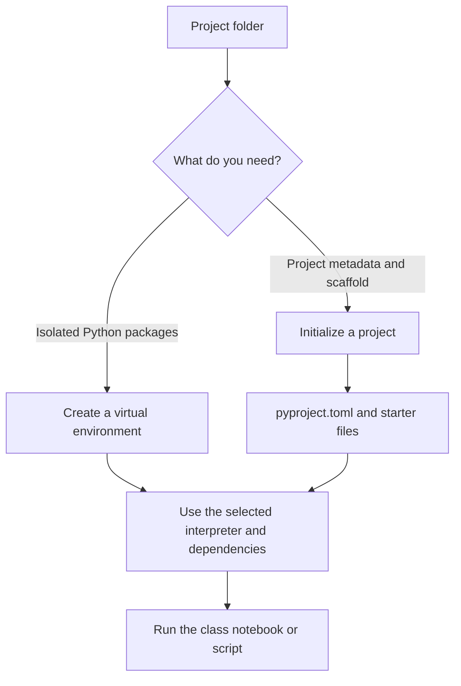
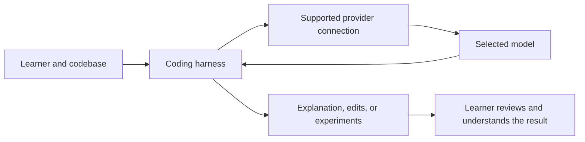
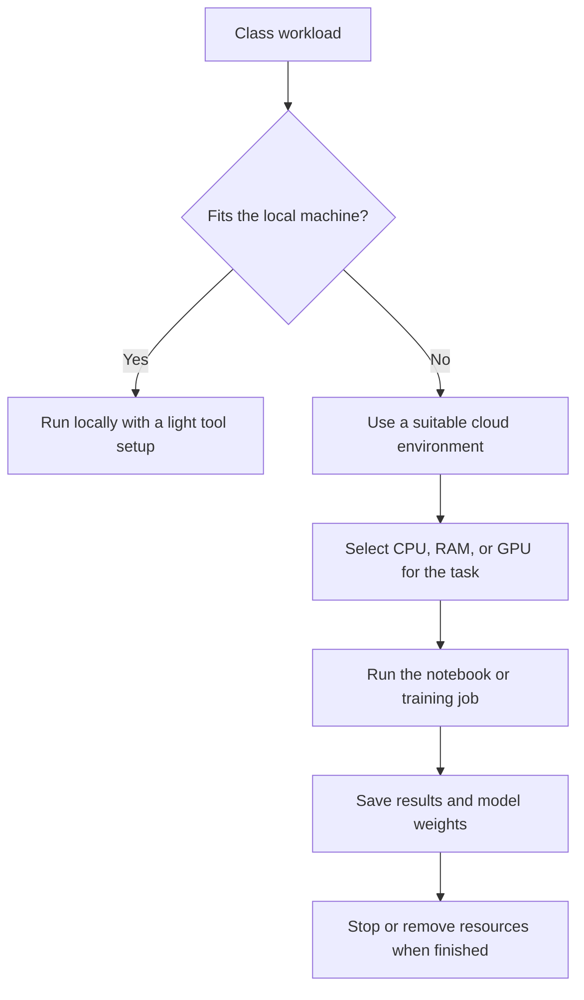
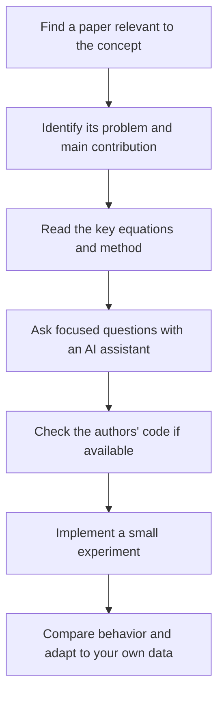

# 🛠️ Class 2: Software Setup and the Engineering Workflow
### 📋 Production AI / LLM Engineering | Krish Naik Academy

**🎙️ Mentor:** Sourangshu Pal (addressed as Paul in the transcript)  
**⏱️ Duration:** ~3 hours 41 minutes (3hr 41min 23s) | **📅 Session:** Day 2 (25 July 2026)

---

## 📰 Quick Updates

- The previous induction recording was available through the course dashboard. The dashboard also contained the course Notion link, which was intended to be the ongoing home for notes, resources, code links, and workshop information.
- Paul shared the public Discord server invitation. Access to the course's private channels was planned for the following week; joining the public server did not immediately grant access to those channels. The planned channels included research papers, model releases, and relevant news, and were intended to remain available after the course.
- An embedded Docker cheat sheet was failing to load during the session. Paul refreshed its embedding and added a direct documentation link as an alternative.
- A cohort poll assessed Python, PyTorch, Git/GitHub, cloud usage, deployment experience, paper reading, and study availability. It was a planning exercise rather than a test. The responses led Paul to schedule a PyTorch refresher for the next class before beginning Transformers 101.
- This session primarily established the development setup. It did **not** teach PyTorch, transformers, Docker deployment, Kubernetes, or fine-tuning in depth; these appeared as preparation advice and future-course context.

---

## 🧭 What You Need Now—and What Comes Later

The class included a broad tour of tools, but the immediate setup was small. Paul repeatedly returned to the same practical outcome: have Python available, be able to create an isolated environment, open notebooks or source files, use a terminal, and work with GitHub. Familiar tools were acceptable. Matching every application in his personal setup was unnecessary.

The accompanying [Software & Tools Checklist](https://krishnaikacademy.notion.site/Software-Tools-Checklist-1f0eba9593d0804a8ab2cf17762d2b1b) lists Python, an IDE, Git/Git Bash, Docker, and the AWS CLI as course requirements. It labels Warp and Postman as optional, treats pip as the major package-management route, uv as optional, and Conda as less frequently used. Paul's live emphasis was more specific: **Python and uv were the first installation steps**, while Docker and AWS work would become relevant later. Those statements describe different stages of preparation rather than a requirement to run the whole stack on day one.

| Layer | Purpose | Session guidance |
|---|---|---|
| Python interpreter | Executes Python scripts and notebook code | Required; Paul's preferred line was Python 3.12 |
| Environment/package management | Keeps each project's dependencies together | uv was his preferred workflow; pip, native venv, or an existing Conda workflow could also work |
| Git and GitHub | Version control, code distribution, assignments, contributions | Install Git and have a GitHub account |
| IDE/editor | Reads and edits files; opens notebooks | VS Code was sufficient; Cursor, PyCharm, or another familiar editor was acceptable |
| Terminal | Executes commands, scripts, and later cloud workflows | One working terminal was enough; native and integrated terminals were accepted |
| Coding agent/harness | Helps inspect, explain, modify, and explore codebases | Useful for independent learning; no particular paid subscription was compulsory |
| Docker | Packages applications for reproducible execution and deployment | In the broader checklist; substantial use was deferred to project work |
| AWS CLI | Performs AWS operations from the command line | Install when preparing the broader stack; account/user configuration was not needed in this class |
| GPU/cloud environment | Handles workloads beyond the local machine | Needed for specific later experiments rather than every session |

Velu's request for a tool-category table exposed the main source of confusion: editors, terminals, coding agents, and model providers were being discussed together. They perform different jobs. An application may combine several of them, but the roles still matter when configuring a project or troubleshooting an error.

The organizing principle was Paul's reminder that a developer's established workflow should remain usable. Keep a working setup, add the capabilities the course needs, and install project-specific dependencies when the corresponding code arrives.

---

## 🐍 Choosing and Installing Python

Paul opened the Python release information and discussed the tradeoff between a stable interpreter and compatibility with newer libraries. His own preferred version for the course was **Python 3.12.9**, with the **3.12 or 3.13 lines** recommended to new joiners. Students who already had a functioning 3.10 or 3.11 setup were not asked to replace it immediately. A student on 3.14 was told to use an older project environment if a later library failed to support that version.

The lesson is to choose Python according to the actual project stack. Being the newest interpreter does not guarantee that a specialized training library already publishes compatible packages for it. Paul specifically anticipated possible integration friction in later work with fine-tuning tools such as Unsloth and Axolotl. He did not demonstrate a failure with either tool in this session, so this was compatibility planning rather than a verified incompatibility matrix.

Python's lifecycle labels also need careful interpretation. A security-only release line still receives applicable security fixes, but that does not mean every bug has been eliminated. End-of-life means upstream support has ended. **For later readers:** Python 3.10 reached end-of-life in October 2026; the session's acceptance of an existing 3.10 installation should not be read as a current recommendation for new environments. Check the [official Python version-status table](https://devguide.python.org/versions/) when selecting a supported interpreter.

Two installation routes were discussed:

1. **Direct Python installation:** obtain the interpreter through the Python distribution appropriate to your operating system.
2. **A distribution or environment manager:** an existing Anaconda installation could supply Python; uv could also manage Python versions and environments.

The requirement was usable Python, not a particular brand of distribution. Paul personally had moved away from Anaconda and intended to use uv throughout the course. That preference was intended to simplify his teaching workflow, not to establish that a Conda-based Python interpreter cannot execute the material.

For beginners, the live recommendation was straightforward: install Python first, then uv. More experienced users could manage Python through uv itself. The [uv Python-version documentation](https://docs.astral.sh/uv/concepts/python-versions/) confirms that uv can locate a compatible interpreter and download a managed Python version when one is unavailable, unless automatic downloads are disabled.

---

## ⚡ uv: A Small Command Set for Everyday Work

uv was introduced as a Python package and project manager written in Rust. Paul favored it for speed and for a workflow that made interpreter selection, environment creation, and dependency management convenient. The course was not intended to become a complete uv tutorial: he expected learners to use a few recurring operations and refer to the documentation when needed.

Install uv using the instructions for the actual operating system and shell. Paul demonstrated on macOS and a Linux-based cloud environment; Windows students were directed to the PowerShell instructions on the [official installation page](https://docs.astral.sh/uv/getting-started/installation/). Installation through pip was accepted too, although the standalone tool was his preference.

The spoken commands, with obvious caption errors normalized, were:

| Command | Meaning in the session |
|---|---|
| `uv --version` | Checks that the uv executable is available and reports its version |
| `uv self update` | Updates a standalone-installer uv installation |
| `uv venv` | Creates the default `.venv` environment in the current project location |
| `uv venv .venv` | Makes the environment name explicit |
| `uv venv --python 3.11` | Requests a particular Python version for an environment |
| `uv init` | Initializes project metadata and starter files |

The update command depends on how uv was installed. When a package manager installed it, use that package manager's update mechanism instead of assuming self-update will work. This distinction is documented in the [uv installation guide](https://docs.astral.sh/uv/getting-started/installation/).

When participant **136** reported an error after trying an additional pip installation, Paul narrowed the task: first check that uv itself reports its version. Successfully installing uv was the immediate requirement. An unrelated extra installation was not a necessary step in verifying that uv worked.

A useful troubleshooting habit emerges from that exchange: verify one layer at a time. Establish that the tool runs before adding project dependencies. Otherwise, an error in a later operation may be mistaken for a failed installation of the earlier tool.

---

## 📦 Virtual Environments, Project Initialization, and Dependency Files

Paul demonstrated creating a project folder and then creating a virtual environment inside it. An environment isolates the packages needed by one project from those used by other projects or the operating system. The conventional name `.venv` also makes it easy to exclude the environment directory from Git.

Two related uv operations were discussed, and Sameer explicitly asked whether creating an environment should produce `pyproject.toml`. The precise distinction is:

- **`uv venv` creates an environment.** It does not, by itself, initialize the project's metadata file.
- **`uv init` initializes a project.** It creates `pyproject.toml` and starter files. The exact generated layout can vary with uv version and options.
- **Project commands manage the environment and resolved dependencies.** The project workflow creates or updates the environment as required; the live demo's `main.py` was an example of the scaffold Paul had at the time, not a universal filename guaranteed by every later version.

These distinctions are confirmed in the [uv environment guide](https://docs.astral.sh/uv/pip/environments/) and [project guide](https://docs.astral.sh/uv/guides/projects/).



Paul used a personal shell alias named `activate`. That shorthand belonged to his own configuration. Students should use the activation mechanism for their shell rather than expect a command named `activate` to exist everywhere. The following exact example is supplied by the **course checklist**, not reconstructed from an unseen terminal screen:

```bash
uv venv myenv
source myenv/bin/activate
uv pip install -r requirements.txt
deactivate
```

This activation example is for a compatible macOS/Linux shell. Windows uses scripts under the environment's `Scripts` directory; the script differs between PowerShell and Command Prompt. The [Python venv documentation](https://docs.python.org/3/library/venv.html) explains the platform-specific activation paths and confirms that environments should be recreated from their requirements rather than copied between machines.

The same checklist supplies a native Python alternative:

```bash
python -m venv myenv
source myenv/bin/activate
deactivate
```

It also gives these project/dependency operations:

```bash
uv sync
uv add -r requirements.txt
```

Treat the two lines as distinct operations rather than a compulsory sequence for every class. `uv sync` synchronizes the project's environment; importing a requirements file with `uv add -r requirements.txt` adds those requirements to the project workflow. The provided project instructions determine which route to use.

Paul said he would share either **`requirements.txt` or `pyproject.toml`** with the codebase. Installing every framework mentioned in the future syllabus was unnecessary. Use the dependency definition supplied with the actual exercise.

The companion checklist includes the familiar pip operations below:

```bash
pip freeze
pip freeze > requirements.txt
pip list
pip list --format=freeze > req.txt
pip install -r file_name.txt
```

Here, `file_name.txt` is the checklist's placeholder for the actual dependency file. Listing packages and exporting package versions are useful for inspecting or recording an environment; installing from a file is a different operation. The terminal's working directory, the active interpreter, and the chosen file all matter.

A student whose uv environment was using Anaconda Python was advised to simplify the setup. The actionable diagnostic is to select the intended interpreter deliberately and understand which environment is active. Removing an entire distribution is not a prerequisite for understanding the environment-selection issue: uv recognizes activated virtual and Conda environments, as described in its [environment-discovery documentation](https://docs.astral.sh/uv/pip/environments/).

---

## 🌿 Git, GitHub, and Reproducible Sharing

Git and GitHub were more important to the course workflow than the choice of editor. Paul intended to distribute code through GitHub, use it for assignments, and accept useful learner contributions. A local Git installation and a GitHub account therefore belonged in the basic setup.

Students unfamiliar with Git were advised to learn the small set of operations needed to initialize a repository, make a commit, and push changes. Paul did not attempt a full Git lesson. GUI tools such as GitHub Desktop were acceptable, although he personally used command-line tools, including the GitHub CLI.

The environment folder should not become part of the code contribution. Paul preferred `.venv` partly because it could be consistently excluded through `.gitignore`; a custom environment name was fine if it was excluded too. When a learner asked whether broadly adding a folder would pick up everything, the useful distinction was between the files Git tracks and files deliberately ignored by the repository. Check the repository's ignore rules before staging dependencies or local environment directories.

Code and dependency definitions serve different purposes. Sharing the code tells another learner what to run; sharing its requirements tells them what environment to recreate. The environment itself is a local artifact that can be rebuilt.

Coding agents were linked to this workflow too. If a learner explored a notebook, found a useful improvement, or implemented an additional feature, an agent could help inspect and modify the code before a pull request. Paul still expected the learner to understand the contribution. The point was to make experimentation practical, not to eliminate responsibility for the code.

---

## 🖥️ Picking an Editor and a Terminal

An editor helps when reading several files, modifying a function, or opening a Jupyter notebook. A terminal executes the scripts and commands. Paul intended to be strongly **CLI-centric**, so learners needed to be comfortable with the terminal even when their editor included one.

For the editor, **VS Code was sufficient**. Cursor was acceptable, and students already using it did not need another editor. Paul also mentioned PyCharm and other editors or VS Code-derived products. His memory-related advice was to keep the setup light on a constrained laptop; a large IDE was an option when the machine had sufficient resources. These were his practical preferences rather than benchmarked minimum memory requirements for every application.

For notebook work, Ankit's combination of VS Code, a Jupyter extension, and Copilot was accepted. There was no special paid integration required to connect Python, uv, Git, GitHub, and the editor. Install the components, select the appropriate Python environment, and use the project instructions.

Paul recommended **Warp** to beginners for its command history and completion experience. He personally used several terminals and could edit files from some of them. The tour included native terminals, integrated terminals, WezTerm, Ghostty, and other tools whose names were sometimes unclear in the captions. This was a tour of alternatives, not a list of things everyone needed to install.

Several students asked whether a separate terminal was necessary when VS Code already had one. His answer was ultimately that an integrated or native terminal was fine. A familiar terminal and keyboard shortcuts were useful assets. There was no need to copy his habit of keeping terminal applications separate from the IDE.

For an 8GB MacBook, Himani was specifically advised to keep the setup light and use the default terminal if that worked. The same principle applies to the entire toolkit: convenience features should improve the experience without consuming resources needed by the exercise.

Warp's terminal functionality and its AI agent were also separated. A student reporting exhausted credits was told that conversational AI use could consume the agent allowance. Running ordinary shell commands was the workflow intended for class. Product plans change, so the session's pricing comments are historical observations rather than current plan guarantees.

---

## 🤖 Coding Agents, Harnesses, Providers, and BYOK

The coding-agent discussion introduced a useful separation between **the application that works on code** and **the model it calls**. Paul used the term *harness* for the surrounding application that makes the LLM useful in a coding workflow. Albert asked what that meant, and Paul explained it as using the model's capabilities through an application.

| Term | Meaning in this discussion | Examples discussed |
|---|---|---|
| Editor/IDE | Displays and edits the codebase | VS Code, Cursor, PyCharm |
| Coding harness/agent | Provides a workflow for an LLM to inspect or change code | Claude Code, Codex, OpenCode, Copilot, and other agents |
| Model | Produces the reasoning or generated content | Different model families offered by providers |
| Provider | Supplies access to models | A direct vendor or a multi-model service |
| API key and base URL | Authentication and endpoint configuration for supported API access | Credentials configured in a compatible harness |
| BYOK | Bring your own key | Use supported provider credentials with the chosen application |
| Subscription | A product's access plan and usage allowance | Plan-specific model access; not necessarily interchangeable with API credits |



This separation explains several repeated questions. Buying an editor subscription is not the same action as purchasing arbitrary API access. Using a model-provider key does not guarantee that every harness supports every provider or every feature. A cheap plan may require using that provider's own application, while another product may allow a supported subscription connection or BYOK.

Paul discussed OpenCode as an open-source option and compared it with closed-provider workflows. OpenRouter was mentioned as a place to explore models from multiple providers. Students who already had Claude Code, Codex, Cursor, or Copilot could use their existing setup. A learner without a coding-agent subscription could still run the supplied code; a particular paid service was not compulsory.

The role of the agent was to help with independent exploration of codebases that could contain thousands of lines. Paul expected to explain a function's purpose and the surrounding concepts, not narrate every source line. The learner therefore still needed enough Python to read a function, understand its inputs and outputs, and recognize what the agent had changed.

Sameer raised image input as a potential limitation. Paul warned that a model's multimodal capability and a harness's ability to accept an image are separate compatibility questions. Check the specific model, product, and workflow rather than infer image support from a model-family name.

---

## 💸 Match Model Cost to the Task

Paul's main purchasing advice was to spend modestly while learning. He felt the course's routine coding and experimentation did not require everyone to buy an expensive top-tier subscription. Existing access was acceptable; learners considering a new service were encouraged to begin with a small allowance and expand only when their actual usage justified it.

He quoted examples such as a roughly **$1 entry plan** from a service transcribed as **Command Code**, and an **OpenCode Go first-month promotion around $5**, followed by a higher recurring charge. These were session-specific examples. The exact Command Code URL was not captured, and model lists, introductory pricing, renewal terms, quotas, and supported harnesses can change. The [OpenCode Go documentation](https://opencode.ai/docs/go/) is the appropriate place to inspect that product's current terms.

The durable cost questions were:

- What task will the model perform, and how much quality does that task need?
- What are the input and output token charges or plan limits?
- Does the service expose the model through the harness you want to use?
- Does it support required features such as images or tool calls?
- How frequently will you use it, and will a small allowance be enough?

Paul used different models for different stages of his work: a more capable option for planning, research, and brainstorming, and a cheaper option for routine implementation where it met the task's needs. This was a workflow preference, not a guarantee that every lower-cost model is equally suitable for every coding task.

Generating synthetic data changes the cost calculation. A learner running occasional exercises may use relatively little API capacity. Producing hundreds of thousands of samples can consume substantial input and output tokens, so the budget must reflect the volume. His recurring point was that more generation means more consumption; a subscription label alone does not describe the full economics.

The discussion included many model-family and version names, along with personal quality judgments. These notes retain the selection principles rather than turn those rapidly changing rankings into a permanent recommended-model list.

---

## ☁️ Local Hardware, Cloud Machines, and GPU Work

Paul discussed RAM, processors, storage, and GPUs in response to many different machines. His preferred comfortable development target was around **32GB RAM**, while **16GB or 24GB** could handle much of the ordinary work. Students with **8GB** were not told to stop taking the course or immediately buy a replacement laptop. They were told to use fewer heavy applications and move demanding exercises to a cloud machine.

These numbers were practical class guidance, not a universal capacity formula. A notebook's requirements depend on what it loads, whether a model runs locally, and what other applications are open. CPU capability matters for CPU-intensive work; additional system RAM does not replace the GPU resources needed by a GPU-intensive training run.

Rahul Soni's question made the cloud alternative concrete. A remote machine provides the CPU, memory, and possibly GPU that the local laptop lacks. The laptop becomes the interface to that environment. Paul mentioned Lightning AI, ordinary cloud instances, and dedicated GPU providers; he intended to demonstrate the specific services when the course needed them.



The final steps matter to the class workflow. Paul described renting the hardware for a bounded task, bringing the resulting weights back, and closing the remote environment. Dedicated hardware was not needed permanently merely because a later exercise required a powerful GPU for a few hours.

Managed environments trade some infrastructure control for convenience. In md toufik's exchange, Paul contrasted a platform with ready editors, containers, and easy CPU/GPU switching against a cheaper provider that could require more manual setup. Choose according to both the hardware requirement and the setup effort you can handle.

Amlan asked whether recurring cloud instances could install the same tools automatically. Paul suggested a startup/bootstrap script: obtain the code, install the needed software and project dependencies, then begin work. No actual startup script was supplied during the class, so these notes do not invent one.

Google Colab was acceptable for simple notebooks and scripts. Paul expected its usefulness to diminish when the course reached larger codebases, container workflows, and fine-tuning workloads needing a more controlled GPU environment. His timeline was a course plan, not a claim that Colab cannot run any fine-tuning experiment.

Storage advice varied because different workloads were being discussed. Paul initially suggested substantial free space and later accepted a student's smaller allocation for the early work. There was no measured dataset or complete storage estimate in this class. Large model weights, environments, container images, and data determine the actual requirement; a single free-space number should not be treated as a guarantee for the full course.

---

## 🐳 Docker, AWS, and Windows Compatibility

Docker would matter when an application had been built and was ready for packaging or deployment. The initial Python and notebook exercises did not need to begin with containerization. The AWS CLI was included because Paul expected much of the cloud work to use AWS and intended to perform operations such as repository creation and image publishing through the command line. Azure or GCP tools would be introduced if those platforms became relevant.

He emphasized using the **Docker CLI** instead of relying on the Desktop GUI. The underlying architecture is important: the CLI sends requests to a Docker daemon/Engine, which builds and runs containers. That daemon can be local or remote. Docker Desktop bundles the client and engine-related components; installing only a client does not, on its own, provide a local container runtime. See the [official Docker architecture overview](https://docs.docker.com/get-started/docker-overview/).

Kubernetes installation was not required at this stage. Paul mentioned a later project involving EKS, but no Kubernetes implementation was taught in this class.

Windows, macOS, and Linux were all acceptable course platforms. Paul's demonstrations were primarily macOS/Linux, so learners needed to recognize differences in shell syntax, paths, and environment activation. WSL was an option for Windows users rather than a mandatory first-day install.

For later GPU work, **WSL 2 does support CUDA on compatible NVIDIA hardware and supported drivers**, with documented limitations. A general concern raised in the live discussion should therefore be interpreted as workload-specific compatibility caution, not as a blanket statement that Windows or WSL cannot run Linux GPU applications. The [NVIDIA CUDA on WSL guide](https://docs.nvidia.com/cuda/wsl-user-guide/) documents support and constraints. Consumer NVIDIA GPUs can be useful for AI experiments too; whether one is suitable depends on model size, memory, and runtime requirements.

Sugan Gowtham reported a Windows launch failure described as **LoadLibrary error 87** after installing Warp. Paul suggested investigating the local software/driver setup and mentioned graphics drivers as a possible cause. This remained a troubleshooting hypothesis; no diagnosis was confirmed and no successful fix was demonstrated. Using a working native terminal was an acceptable way to continue the class while investigating the application issue.

---

## 📚 Reading Research Papers as an Engineer

Research papers were a substantial part of the open discussion. Paul pointed learners toward arXiv, Hugging Face papers, and the course's linked paper list. He distinguished broad discovery from learning a concept: finding many new papers is useful, but the immediate task is to understand what a relevant paper contributes and how that contribution affects an implementation.

For a paper, look for the problem it addresses, the central method, the comparison baselines, and the evidence in its experiments or benchmarks. Those elements help determine whether the result is relevant to the data and system you are building. A paper is not useful merely because its title contains a fashionable term.

For beginners following this course, Paul eventually gave a concrete starting point: **[Attention Is All You Need](https://arxiv.org/abs/1706.03762)**, after establishing basic deep-learning knowledge. He showed that the course syllabus already included paper links for the concepts it would teach, including attention and later topics such as FlashAttention and mixture-of-experts methods. Those topics were linked for future study, not taught during the setup class.

Kalyan asked specifically about agentic-AI papers. Paul suggested arXiv's relevant computer-science categories, including artificial intelligence and machine learning, and described the possibility of filtering recent papers with a small program. The proposed paper-monitoring program was not written during the class.

The engineering reading workflow Paul described was:



He sometimes used a Markdown representation of a paper as the input to a coding agent with relevant skills installed. The transcript does not preserve a complete conversion URL or reproducible command, so appending an unexplained suffix to a paper link is not included as an instruction here. The useful idea is to obtain readable structured text and analyze it step by step rather than assume that uploading a PDF produces understanding by itself.

NotebookLM was accepted as a tool for theoretical questions and beginner exploration. Paul personally used Claude or GPT for more implementation-oriented discussion. These were learning preferences. In every case, ask concrete questions about the paper and then test the implementation.

Ankit asked how to handle formulas that are difficult to understand intuitively. Paul's first coding step was **NumPy**: can the equation be represented in a small numerical experiment? Once the operation and shapes make sense, moving the implementation into PyTorch or another numerical framework becomes easier. He described trying several experiments and adjusting the implementation to the actual data rather than expecting the first translation to be final.

Pandian clarified whether the course would recreate all the listed papers. Paul said the goal was to teach the central concept and relevant mathematics, use implementations and frameworks where appropriate, and let learners read the surrounding literature further. It was not a commitment to repeat every research experiment. Some papers do not release code, and a paper's related-work comparisons can be much longer than the few pages needed for a particular class concept.

---

## 🧠 Foundations: Why PyTorch Still Matters

The poll suggested that many learners had heard of PyTorch but had little practical experience. Paul consequently changed the next session to a refresher. It would cover the fundamentals needed by this course, not produce complete PyTorch mastery in a few hours.

Debajyoti asked why deep PyTorch knowledge was useful when many industry solutions appear to be RAG or agent systems. Paul's answer focused on what happens below a high-level library: debugging model behavior, understanding a network, and modifying an implementation are difficult if its underlying operations are unfamiliar. The planned learning path included PyTorch, Hugging Face Transformers, and later training-oriented frameworks such as TRL.

The framework comparison should be understood accurately. PyTorch provides automatic differentiation through `torch.autograd`; a training loop typically invokes the forward computation, loss, backward gradient calculation, and optimizer update. Learners do not ordinarily hand-code every derivative in a normal PyTorch training loop. Keras also allows custom training loops and custom training steps, despite its convenient high-level interfaces. See the [PyTorch autograd tutorial](https://docs.pytorch.org/tutorials/beginner/basics/autogradqs_tutorial.html) and [Keras custom-loop guide](https://keras.io/guides/writing_a_custom_training_loop_in_tensorflow/). Paul's practical emphasis was learning to inspect and control the computation, not a universal limitation of the other frameworks.

For learners from mathematics backgrounds, he suggested a concrete preparation exercise: take a simple two-layer neural network, work out its forward pass and backward pass on paper, and then translate the calculation into code. Review the chain rule and derivatives if needed. The exercise was assigned as foundational practice; an exact network, dataset, or worked code solution was not supplied in this session.

Deep learning is part of machine learning, and most modern LLM-based generative systems build on deep-learning models. An agent application often consumes model capabilities through an API rather than training a new model itself. That relationship creates substantial overlap between agent research, model research, and engineering—but it does not make every solution a neural-network problem. Paul's broader decision principle was to inspect the use case and data before choosing a method. Unstructured data does not categorically rule out all non-deep-learning methods.

---

## 🍎 Local Models, Apple Silicon, and Quantization

Ollama and LM Studio were discussed as ways to experiment with local models. Paul clarified that his earlier Ollama reference was to the local setup, while also acknowledging cloud options. He did not intend to run substantial local models on his own laptop during the course because they could compete with the rest of his development environment for resources.

Billy, who had a high-memory Mac, asked about using Apple-oriented model stacks instead of NVIDIA/CUDA. Paul discussed MLX, Metal/MPS support, and unified memory. Apple's [MLX overview](https://opensource.apple.com/projects/mlx/) describes MLX as optimized for the unified-memory architecture of Apple silicon. That architecture is useful, but available memory alone does not guarantee that a particular training framework, operation, or model is supported.

The discussion also distinguished original weights from alternative formats and lower-precision variants. **GGUF is a model file format**, not itself a promise of a particular bit width or a fixed quality loss. It supports multiple tensor types, including floating-point and quantized types, as shown in the [Hugging Face GGUF documentation](https://huggingface.co/docs/hub/gguf). Model size, precision, runtime support, and the task all affect what can run locally. There is no universal rule that every quantized model loses exactly a fixed percentage of performance.

Billy observed different response quality from local and hosted versions of apparently similar models. Paul suggested that a provider's surrounding inference stack could matter. No controlled comparison was performed, so these notes do not assign a confirmed cause. A fair comparison would need to establish that weights, precision, prompts, and generation configuration really match before drawing a conclusion about hosting.

For the course's later training demonstrations, Paul preferred temporary access to capable NVIDIA GPUs because class time was limited. A slow run that takes many hours may be technically possible but awkward to demonstrate live. He mentioned A100/H100/H200-class hardware as options for his own demonstrations; this was not a requirement that every learner own such a GPU. H100s can serve inference as well—the recommendation to use temporary access for fine-tuning reflected the learning opportunity, not a hardware restriction.

---

## 🧩 Applying the Course: Small Models, RAG, and Architecture Decisions

The final Q&A broadened the setup discussion into how learners could use the course. Paul described the initial model foundations as useful even for architects who guide teams rather than spend every day writing model code. Better system decisions come from understanding the options, testing them on the actual data, and explaining why a particular approach is appropriate.

For an existing enterprise system, he discussed adding retrieval over internal knowledge bases, using models for domain-specific tasks, and introducing agents where a workflow can usefully call tools or automate repeated work. These were examples of possible applications, not guarantees of an automation percentage or a promised job outcome.

Atharva had already built a custom RAG project but was dissatisfied with generation quality. Paul suggested investigating **parsing and chunking** and briefly inspected the repository's organization. He did not establish a complete root cause, and the detailed review was deferred. The learning point is to examine how information enters the retrieval pipeline before assuming model fine-tuning is the first remedy. Atharva was also reminded to understand the code and core concepts behind a project generated with AI assistance, particularly when explaining it in an interview.

For a student seeking an internship sooner than the end of the course, Paul suggested building on RAG and exploring agents. He named LangGraph and PydanticAI as starting points and offered to share a project reference separately. The promised repository link was not present in the transcript, so no substitute project has been invented here.

Dishant asked whether small, fine-tuned models could handle narrow tasks such as intent classification, query decomposition, or tool selection rather than calling a large reasoning model for everything. Paul said the course would include foundational model work and classification/Q&A examples, with distilled model families discussed later. This was future scope. The session did not provide a specialist-model training pipeline.

When Dishant mentioned temporary access to one or two H100s, Paul suggested experimenting with fine-tuning, including multimodal/vision-language models using available datasets, and looking at Hugging Face, Unsloth notebooks, or Axolotl configuration-based workflows. The important prerequisite in his response was **data**: hardware access becomes useful when there is a defined task and a suitable dataset. No exact model/dataset recipe was selected live.

For highly specific career-transition or advanced mathematics questions, Paul requested more background or an exact topic list before giving tailored advice. These exchanges ended with a request for follow-up rather than a complete individualized roadmap. Course completion alone was not presented as mastery; sustained implementation and experimentation remained necessary.

---

## 🗺️ What's Next

- **Next class:** a PyTorch refresher, including installation and the course-relevant basics. Learners were not required to install PyTorch independently before that demonstration.
- **Following week:** Transformers 101. Paul expected to build intuition for attention and the motivation behind the transformer paper before moving into the paper itself.
- **After the initial conceptual sessions:** practical transformer implementation. The exact pacing was flexible; he did not promise that every topic or project would finish within a fixed number of classes.
- **Later course work mentioned explicitly:** model training/fine-tuning, Hugging Face Transformers and TRL-related workflows, specialist/small-model applications, RAG, agents, AWS deployment, and a project involving EKS/Kubernetes. These were future plans, not completed content from Class 2.

---

## 💬 Live Q&A Highlights

The table includes questions from the setup discussion and the extended open floor. Repeated setup questions are consolidated; named follow-ups are preserved where they add a different issue.

| Question | Answer |
|---|---|
| **Akarshan, Amlan:** What is the minimum setup for the first few weeks? | Python, a way to manage an isolated environment, an editor that can open notebooks, Git/GitHub, and a working terminal. Paul preferred uv; a specific paid tool or special cross-tool integration was not compulsory. |
| **Nithin Sharma:** Should every future library be installed immediately? | No. Paul would share `requirements.txt` or `pyproject.toml` with the relevant code. Install the dependencies for the actual exercise rather than every framework in the syllabus. |
| **Shashank, in chat:** Can newly learned AI skills be included when transitioning roles? | Paul accepted listing relevant skills, while emphasizing that claimed experience must be supported by the actual work, responsibilities, and projects the learner can explain. The hiring role determines which skills matter. |
| **Aditya and other chat questions:** Is an existing newer or older Python installation acceptable? | A working setup could be retained, with a compatible environment created for a project when needed. Paul's new-install preference was 3.12/3.13; current support status should be checked separately. |
| **Vivek Joshi:** Must the environment have a custom name? | No. `.venv` was Paul's convention. A custom name was acceptable if the directory was excluded from Git. |
| **Sameer Nandan:** Does creating a virtual environment also create `pyproject.toml`? | Environment creation and project initialization are separate. Use `uv venv` for an environment and `uv init` for project metadata and scaffold. |
| **Participant 136:** uv reports a version, but a later pip step fails—is installation incomplete? | Paul confirmed that reporting the uv version satisfied the immediate uv check. The extra pip step was not required to verify uv's installation. |
| **Saravana, in chat:** Why did the uv environment use Anaconda Python? | The active/discovered interpreter affects environment selection. Paul wanted a simpler uv-centered setup; deliberately selecting the intended interpreter is the key diagnostic. |
| **Krishna Chaitanya:** Are uv projects and Docker projects alternatives? | They serve different purposes. uv manages Python projects/environments; Docker packages an application for execution and deployment. Docker usage was planned for later projects. |
| **Aman, in chat:** Will a broad Git add operation include the environment folder? | Check the repository's ignore rules before staging. Paul preferred excluding `.venv` through `.gitignore`; custom environment names need equivalent handling. |
| **Dishant Ghai:** Does OpenCode require its own subscription, or can it use other credentials? | Paul discussed supported BYOK and subscription connections. Nothing was compulsory to buy; the exact connection options depend on the product/provider. |
| **Dishant Ghai:** Does the quoted OpenCode Go plan include model access, or require a second API payment? | In Paul's described plan, access was included through that subscription with usage limits. The quoted promotion and allowance were historical; inspect the current product terms before purchasing. |
| **Sameer Nandan:** Is BYOK the same as a Claude subscription? | No. BYOK configures supported API credentials; a product subscription gives the models and allowances of that product. Paul preferred flexible provider access, but accepted existing subscriptions. |
| **Prashant Yadav:** Are the low-cost provider and the coding agent the same thing? | A provider supplies model access, while a harness uses that access in a coding workflow. Some products bundle both; their supported model list still needs checking. |
| **Prashant Yadav:** Would the quoted low-cost plan give OpenAI models? | Paul did not claim that. He had used the entry plan and had not verified the higher-tier plan being asked about; he directed the learner to its actual model list. |
| **Albert V:** What is a coding harness? | The application that makes the LLM useful for the coding workflow—Paul described it as harnessing the model's capabilities. It is distinct from the model itself. |
| **Akarshan:** Why use a coding agent if an editor already opens the files? | To explore a larger codebase, investigate a function, try an improvement, and prepare useful contributions. The editor remains useful for reading and reviewing the code. |
| **Ankit Anand:** Must we use models from the lower-cost providers discussed? | No. Paul's motive was to keep student costs low. An existing VS Code/Copilot setup was accepted. |
| **Raghav Joshi and subscription questions:** Is a large monthly plan needed to learn? | Paul thought modest access was enough for ordinary exercises. Actual usage, model cost, and task complexity should determine spending; synthetic-data generation can increase consumption. |
| **Pritham/Rita Mandal:** Why use a different model for planning and implementation? | Paul preferred more capable models for research and planning, then a cheaper model for routine implementation when it met the task's needs. |
| **Sameer Nandan:** Does a multimodal model automatically mean image paste works in the CLI? | No. Harness support and model support are separate. Paul advised checking the particular workflow and relevant product issues. |
| **Sameer Nandan:** Was the Ollama reference to local Ollama or its cloud service? | He clarified that he meant local Ollama, while explaining that he did not plan to run substantial models locally on his own laptop. |
| **Smruti Dash, in chat:** Must coding agents have a VS Code plugin? | Paul favored terminal use and did not require an editor plugin. Use the interface supported by the chosen agent. |
| **Akarshan, Prashant Yadav, Ankit Anand:** Is a separate terminal mandatory? | No. A native or integrated terminal was acceptable. Paul's separate-terminal preference was about his own developer experience. |
| **Himani:** Should an 8GB MacBook install Warp just because it was recommended? | No. Keep the machine light and use the default terminal if it works; Warp was a convenience option. |
| **Sugan Gowtham:** How should Warp's Windows LoadLibrary error 87 be handled? | Paul suggested investigating the local installation and drivers, with graphics-driver problems as one possibility. No confirmed cause or successful fix was established. |
| **Sugan Gowtham:** What terminal alternative was suggested? | WezTerm was named, and a working native terminal remained acceptable. Python/uv and the editor were sufficient to continue preparing for the next class. |
| **Rahul Soni:** How does cloud execution help an 8GB laptop? | The remote environment supplies the memory/CPU/GPU; the laptop accesses it. Rent resources for the demanding practical rather than assume a new laptop is necessary. |
| **Albert V:** Does 64GB system RAM solve GPU-intensive work? | It helps local CPU-oriented workloads but does not replace the required GPU capability. Paul would use a cloud GPU where the exercise needed one. |
| **Bhaskar, in chat:** Can access to a DGX Spark help when the laptop is modest? | Paul regarded the external machine as useful for local model work, especially inference, while warning that training runtime can differ from a larger datacenter GPU. The class did not establish a benchmark or validate a particular model configuration. |
| **md toufik:** Are a 16GB Mac or Ryzen 7/24GB machine usable? | Paul accepted them for ordinary code execution. Dedicated GPU work would be handled separately when required. |
| **md toufik:** How difficult is moving beyond Colab to a GPU provider? | Paul planned to demonstrate it. Managed platforms simplify setup and switching; cheaper infrastructure may require more manual configuration. |
| **Amlan:** Can existing AWS credits be used for the cloud environment? | Yes, a suitable CPU or GPU instance could be used. The hardware and configuration should match the exercise. |
| **Amlan:** Can every new instance install the same development tools automatically? | Paul suggested a startup/bootstrap script to obtain the code and install requirements. He did not provide the script in this class. |
| **Amlan:** Would a separate small local computer run models? | It depends on the exact model and hardware. Paul mentioned Ollama, LM Studio, and direct Transformers loading, but did not validate an unspecified device/model combination. |
| **Gaurav Garg:** Is a smaller storage allocation or WSL enough? | Early work could proceed, while later GPU work might use a common cloud platform. No full-course storage benchmark was established; WSL 2's actual GPU support is documented by NVIDIA. |
| **Kamlesh Patel:** Is Windows acceptable instead of Mac/Linux? | Yes. Any of those operating systems was acceptable; a compatible cloud environment was the fallback for a workload that would not run locally. |
| **Sudhanshu Kumar:** Can Colab be used for practice? | Yes, for simple notebooks and scripts. Paul expected a more controlled GPU environment for larger codebases, Docker-related work, and later fine-tuning. |
| **Nilesh, in chat:** Why install the AWS CLI? | Paul intended to perform AWS operations from the command line, including later repository/image workflows. User/account setup was deferred. |
| **Vijay, in chat:** Is Kubernetes required now? | No. It was mentioned for a later EKS-related project. |
| **Ankit Anand:** Is VS Code with notebook support, Copilot, and its integrated terminal enough? | Yes. Paul accepted the familiar setup and did not require a switch to every tool he used. |
| **Pratyush Singh Kushwah:** Is there a beginner paper starter list? | That early exchange did not produce a specific starter list. Later, Phanindhar's question led to the course-linked paper list and *Attention Is All You Need* as a starting point after the prerequisites. |
| **PHANINDHAR GOLLA:** Which paper should a beginner start with for this course? | *Attention Is All You Need*, after reviewing deep-learning fundamentals. Paul showed that paper links were already attached to the syllabus. |
| **Kalyan Rad:** Where can agentic-AI papers be found? | arXiv's relevant CS categories and paper-discovery pages were suggested. Paul also proposed filtering recent papers programmatically, without writing that program live. |
| **Kalyan Rad:** Is there a skill/workflow to get a paper's crux first? | Paul described converting it to readable Markdown and analyzing it with a coding agent and relevant skills. The transcript did not preserve a reproducible conversion instruction. |
| **Kalyan Rad:** How do agent papers intersect with ML/deep-learning papers? | Modern agents often consume generative-model capabilities built on deep learning. The overlap is substantial, while method selection still depends on the use case and data. |
| **Ankit Anand:** How can difficult paper mathematics become understandable? | Translate an equation into a small NumPy experiment, inspect the behavior, and then move toward the framework implementation. AI assistants can help ask focused questions, but experimentation remains necessary. |
| **Pandian G:** Will the course recreate all of the listed papers? | No. Paul planned to explain core ideas, mathematics, and relevant implementations, not reproduce every experiment or related-work comparison. |
| **Pandian G:** Does every paper include code? | No. Author implementations are useful when released, but publication of a paper does not guarantee a public codebase. |
| **Pandian G:** Which Stanford course did Paul mention? | CS231n. He also mentioned other university lectures as supplementary resources and said he would provide topic-specific references during teaching. |
| **Debajyoti Mukhopadhyay:** Why learn PyTorch when the target is RAG/agents? | Understanding the underlying model operations helps when high-level frameworks fail or need modification. The next refresher would build those course-relevant foundations. |
| **shivamkumar:** How should the weekdays be used to prepare? | Explore PyTorch if unfamiliar; if deep-learning basics are solid, begin looking at transformers. The next class would handle the refresher. |
| **shivamkumar:** What mathematics should be reviewed? | Derivatives, the chain rule, and backpropagation. Paul suggested manually calculating a simple two-layer network's forward and backward passes, then coding it. |
| **Prabu Manickam:** Is Python practice a sensible starting point from a legacy background? | Yes. Python was the initial priority because the coming PyTorch work depended on it; Python and environment setup were the immediate steps. |
| **Velu, Sudhanshu Kumar:** How should beginners handle the unfamiliar jargon? | Paul said concepts would be developed step by step with references, especially through the early foundations. Learners were encouraged to ask about unfamiliar terms and allow time for practice. |
| **Billy:** Can a high-memory Mac use MLX/MPS instead of CUDA? | Apple-oriented workflows can be useful when the specific stack supports them. Paul's later training demonstrations would favor capable cloud NVIDIA GPUs for runtime and compatibility reasons. |
| **Billy:** Are GGUF and original model weights the same capacity requirement? | No. Format and precision matter. Quantized variants may use less memory, but GGUF supports multiple types and does not imply a fixed accuracy loss. |
| **Billy:** Why can local and hosted responses differ? | Paul suggested differences in the surrounding inference stack, but no controlled test established the cause. Treat the observation as a comparison to investigate. |
| **Manoranjan Pani:** How does this help a senior Java/solutions architect? | Foundations can improve choices about retrieval, domain-specific models, agents, and deployment. Paul emphasized experiments and informed team guidance rather than a role determined solely by course completion. |
| **Manoranjan Pani:** Is a MacBook Air sufficient? | It could be used for the development work, with temporary cloud resources for the demanding training tasks. |
| **Amlan:** How should a domain architect become more hands-on? | Paul requested fuller background before giving a tailored path. The exchange did not produce a complete individualized roadmap. |
| **Atharva Pagar:** What can help with an internship before the course ends? | Paul suggested building on RAG and exploring agents, rather than waiting for the whole syllabus. This was learning advice, not a guarantee of placement. |
| **Atharva Pagar:** Should poor RAG generation immediately lead to fine-tuning? | Paul first suspected parsing/chunking issues and requested a fuller review of the repository. The cause remained unconfirmed. |
| **Atharva Pagar:** Is an AI-generated project with only a general overview enough? | The learner still needs to understand the core concepts and implementation well enough to debug and explain it. |
| **Atharva Pagar, Gurminder Singh Malhotra:** Where should agent learning begin? | Paul suggested LangGraph; PydanticAI was another option for Atharva. He referred to tutorials/documentation and shared a LangGraph learning link in class, whose exact URL is not preserved here. |
| **Gurminder Singh Malhotra:** How should someone start with Claude Code? | Paul referred to Mayank's webinar/resource and official documentation, focusing on useful plugins and skills. The exact webinar URL was not captured. |
| **Dishant Ghai:** Will narrow models for intent, Q&A, or tool-related tasks be covered? | Paul said foundational/classification model work and distilled-model examples were part of the course plan. This session did not build that pipeline. |
| **Dishant Ghai:** What should temporary H100 access be used for? | Paul suggested fine-tuning experiments, potentially with a vision-language model and an available dataset, using a suitable framework. No exact model/dataset recipe was selected. |
| **Dishant Ghai:** Are Hugging Face and framework tutorials relevant preparation? | Yes, especially because the course would use Transformers. Paul also pointed toward Unsloth's notebooks and Axolotl's configuration-oriented workflow. |
| **Dishant Ghai:** Which resources cover manifolds and high-dimensional geometry? | Paul requested an exact topic/domain list before recommending math-heavy material. The discussion did not settle on a specific geometry resource. |

---

## 🔑 Key Pointers to Remember

- The first objective is a working Python development workflow; every tool mentioned is not an immediate installation requirement.
- Follow the dependency file for the exercise instead of installing the future syllabus in advance.
- `uv venv` and `uv init` have different purposes: environment creation versus project initialization.
- `.venv` is a convention that helps keep local environments out of Git; custom names are acceptable with correct ignore rules.
- Paul's `activate` command was a personal alias. Activation syntax depends on the shell and platform.
- Preserve a familiar editor and terminal when they already do the job.
- A coding harness, a model, a provider, and a subscription are distinct layers.
- BYOK support and multimodal support must be checked for the actual product/model combination.
- Buy model access according to usage and task needs; promotional prices quoted in class are not permanent terms.
- System RAM, GPU memory, software support, and runtime are different constraints.
- Use cloud hardware when a task outgrows the laptop; save artifacts and end the resource when finished.
- Docker's client needs access to an engine/daemon to build and run containers.
- WSL 2 can support CUDA; evaluate the documented constraints rather than reject it categorically.
- Read papers for their problem, main contribution, evidence, and relevance to your data.
- Turn difficult equations into small experiments before scaling the implementation.
- Learn the underlying PyTorch computation so high-level framework failures are easier to investigate.
- Before fine-tuning for RAG quality, inspect the ingestion and retrieval pipeline and establish the actual cause.
- AI assistance makes experimentation faster, but you still need to understand and review the code.

---

## ✅ Action Items After Class 2

- [ ] Locate the course Notion page and the previous recording through the dashboard.
- [ ] Verify that a suitable supported Python interpreter is available; use the course project's version requirements when supplied.
- [ ] Install or verify uv if following Paul's workflow, using the instructions for your operating system and shell.
- [ ] Practice creating one isolated environment and distinguish that operation from initializing a uv project.
- [ ] Confirm that your editor can open a notebook and use the intended Python environment.
- [ ] Install Git, have a GitHub account, and review the basic commit/push workflow if unfamiliar.
- [ ] Check that the environment directory is excluded from the project repository.
- [ ] Keep one working terminal; avoid adding several applications merely because they were demonstrated.
- [ ] If using a coding agent, test it on a small code-reading task and review its explanation. Reuse existing access or begin with a modest allowance if new access is needed.
- [ ] Bookmark the project's dependency instructions rather than installing all later libraries now.
- [ ] Review derivatives, the chain rule, and a small network's forward/backward calculation if those foundations are unfamiliar.
- [ ] Prepare for the next PyTorch session; let that session establish its installation and exercise requirements.
- [ ] Locate the syllabus's paper links and begin *Attention Is All You Need* after reviewing the required foundations.
- [ ] Identify a suitable cloud fallback if local RAM, GPU resources, or software support become limiting.
- [ ] Treat Docker/AWS CLI as the broader preparation checklist, with configuration and deeper usage following the relevant project sessions.

---

*📝 Notes compiled from the full Class 2 transcript — “25 July Software Requirements & Tools Installation,” Production AI / LLM Engineering, Krish Naik Academy — and the course-linked Software & Tools Checklist.*

*Primary class source: [Class 2 course recording page](https://learn.krishnaikacademy.com/web/courses/6a16f8935e281281cd6b1128?chapter=6a651ae9893a14772ed56f79). Original transcript filename: `GMT20260725-142803_Recording.transcript.vtt`. The transcript includes the entire setup discussion and late open-floor Q&A; no supplementary PDF or class code notebook was supplied for this session. Exact command blocks above come from the companion checklist. Documentation links clarify nuanced behavior; they do not imply those additional documentation examples were executed in class.*
