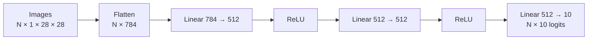
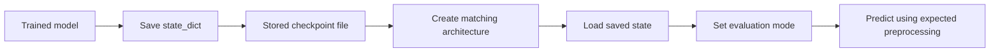
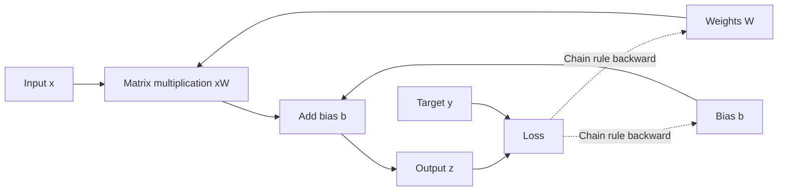
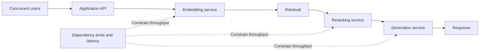

# 🔥 Class 3: PyTorch Fundamentals — From Data to a Trained Model
### 📋 Production AI / LLM Engineering | Krish Naik Academy

**🎙️ Mentor:** Sourangshu Pal (addressed as Paul in the transcript)  
**⏱️ Duration:** ~4 hours 27 minutes (4hr 26min 56s) | **📅 Session:** Day 3 (26 July 2026)

**Class recording:** [26 July PyTorch Fundamentals](https://learn.krishnaikacademy.com/web/courses/6a16f8935e281281cd6b1128?chapter=6a668f79893a14772e6b1318)  
**Primary source:** `GMT20260726-143017_Recording.transcript.vtt`

---

## 📰 Quick Updates

- The agenda displayed “Transformers 101,” but Paul explicitly changed this session to a **PyTorch refresher**, based on the previous class’s poll. Transformer theory was deferred to the following week.
- The live walkthrough used the official PyTorch **Learn the Basics** notebooks in Google Colab. The instructor also shared his [PyTorch primer repository](https://github.com/sourangshupal/pytorch-primer) for practice.
- Recordings and the course Notion resource page were available through the course dashboard. The team aimed to upload recordings within 12 hours, with a stated maximum window of 24 hours.
- There was **no formal assignment for this week**. The immediate expectation was revision, executing the notebooks, and building several small neural networks.
- Colab’s available T4 GPU was sufficient for this demonstration. Paul did not require a paid Colab subscription at this stage; available GPU time depends on the service and account.

The examples below are drawn from the full transcript and the matching notebooks in the course repository. Repository excerpts are labeled as companion code; their toy examples and helper functions should not be confused with the exact live notebook or its numerical results.

---

## 🧭 Why This Course Starts With PyTorch

The central reason for this session was preparation for **implementing Transformers and understanding model training**. An attention block is ultimately a collection of tensor operations and trainable parameters. Knowing what data enters the block, how its output is computed, and how gradients update its parameters makes the later implementation easier to follow.

Paul distinguished two kinds of work during the discussion:

| Work being done | Why PyTorch knowledge matters |
|---|---|
| Calling an existing LLM through an API | You can build many applications without writing a neural network |
| Implementing a Transformer component | You need a framework for tensor calculations and model parameters |
| Training or fine-tuning a model | You need forward passes, losses, gradients, and parameter updates |
| Debugging a training run | You need to recognize shape, device, data, and optimization problems |
| Serving an application at scale | You also need infrastructure and dependency-level performance knowledge |

He emphasized PyTorch’s explicit programming model: define a class, specify its layers, write the forward computation, and control the training loop. This exposes steps that a high-level training API can package behind a shorter call.

The introductory comparison also touched on TensorFlow, Keras, JAX, the older Lua-based Torch project, and ONNX. Paul showed a framework comparison paper to motivate the choice of PyTorch, but the transcript does not identify the paper precisely enough to reproduce its adoption percentages or performance claims as general facts. A benchmark reflects its particular model, hardware, versions, and settings.

**A useful framework distinction:** Keras offers a convenient high-level API, while PyTorch makes the class’s lower-level workflow especially visible. Modern Keras also supports TensorFlow, JAX, and PyTorch backends, custom layers, and custom training loops. The comparison is therefore about the workflow chosen for this course, rather than an inability to customize Keras. [Keras 3 overview](https://keras.io/keras_3/)

**Inference** means running a model to obtain predictions. It can happen locally, inside a notebook, or in a deployed service, and it can operate on one sample or many. Deployment is not part of the definition.

---

## 🛠️ Setting Up a Working Environment

Paul demonstrated both a local installation and a hosted notebook environment so participants could choose a practical route.

### Local workflow

The local sequence was:

1. Create or clone the project directory.
2. Create a virtual environment with UV.
3. Activate the environment.
4. Install the required packages for the chosen platform.
5. Import PyTorch and inspect its version.
6. Check which hardware is available before running the model.

The class’s important habit was **isolating each project’s dependencies**. A repository’s packages should be installed in its own environment, rather than assuming that whatever happens to be installed globally is suitable.

The installation selector on PyTorch’s website varies by operating system, package manager, and compute platform. The exact version numbers spoken in the transcript are not reliable installation targets: use the command appropriate to your machine and project rather than copying a historical number from the captions.

The current course repository documents this quick start:

```bash
uv sync
uv run main.py
uv run jupyter lab notebooks/
```

*Companion code source: [repository README](https://github.com/sourangshupal/pytorch-primer/blob/main/README.md). Run these from the cloned repository; its configuration supplies the dependencies.*

### Colab workflow

For the live Quickstart, Paul opened the tutorial in Colab, changed the runtime to a **T4 GPU**, connected the runtime, and inspected the hardware. The notebook environment already had PyTorch available, so checking the installed package came before considering any upgrade.

The GPU report was useful for inspecting the model of GPU, available memory, driver, and CUDA information. Those details matter when a local installation fails or a package build does not match the intended accelerator. A hosted GPU session also has a lifecycle: disconnecting or deleting the runtime can remove its in-memory model and other temporary state.

### Choose a device, then use it consistently

The session focused on CPU, NVIDIA CUDA, and Apple MPS. PyTorch also supports other accelerators, including supported Intel GPUs through XPU; hardware support depends on the device and installed build. [PyTorch Intel GPU guide](https://docs.pytorch.org/docs/2.14/notes/get_start_xpu.html)

Paul repeatedly returned to the same operational rule: **the model and the tensors used in its computation must be on compatible devices**. Detecting a GPU is only the first step. The model, input features, and labels must then be moved appropriately.

The repository’s GPU notebook describes the practical changes clearly: select a device, move the model to it, and move each batch’s features and labels to that device inside the loop. Simply selecting a GPU in Colab does not relocate every tensor automatically.

---

## 🧺 The First Full Example: FashionMNIST

The first notebook covered an entire model workflow before the class revisited its components individually.


### Dataset facts and why this example is manageable

FashionMNIST contains **60,000 training images and 10,000 test images**, with ten categories of clothing and accessories. Each image is **28 × 28 pixels with one grayscale channel**.

The class labels are T-shirt/top, trouser, pullover, dress, coat, sandal, shirt, sneaker, bag, and ankle boot. Integer labels map to those names; they are not the image pixels themselves.

Paul used the small image resolution to make the dimensions easy to reason about. He also briefly introduced MNIST, CIFAR-10, CIFAR-100, and COCO as familiar datasets for experiments and benchmarking. This was background context, not a lesson implementing object detection or segmentation.

### What the imports contribute

| Component | Role in the example |
|---|---|
| `torch` | Tensor operations and core PyTorch functionality |
| `torch.nn` | Layers, model building blocks, and loss functions |
| `torch.utils.data.DataLoader` | Iteration and batching over a dataset |
| `torchvision.datasets` | The provided FashionMNIST dataset implementation |
| `torchvision.transforms.v2` | Converting and preprocessing images |

TorchVision is a vision package in the PyTorch ecosystem. Its transforms overlap in purpose with some Pillow and OpenCV image operations, but it is not simply another name for OpenCV.

### Loading the two splits

The demonstrated dataset arguments had separate jobs:

- **`root="data"`:** where the dataset is stored.
- **`train=True`:** select the dataset’s training split.
- **`train=False`:** select its test split.
- **`download=True`:** download the files when needed.
- **`transform`:** a callable applied to each image.

The `train` argument here selects data. It does **not** set the model’s training mode and does **not** enable or disable gradients.

The matching repository notebook contains:

```python
training_data = datasets.FashionMNIST(
    root="data",
    train=True,
    download=True,
    transform=v2.Compose([v2.ToImage(), v2.ToDtype(torch.float32, scale=True)]),
)

test_data = datasets.FashionMNIST(
    root="data",
    train=False,
    download=True,
    transform=v2.Compose([v2.ToImage(), v2.ToDtype(torch.float32, scale=True)]),
)
```

*Companion excerpt: [10_official_quickstart.ipynb](https://github.com/sourangshupal/pytorch-primer/blob/main/notebooks/10_official_quickstart.ipynb). It depends on the imports in that notebook.*

The live discussion stressed consistent preprocessing across training and prediction. An image presented to the trained model should use the expected size, channel arrangement, numeric representation, and scaling.

---

## 📐 Batches, Labels, and the Shape You Must Understand

The batch size used in the Quickstart was **64**. A batch contains a group of examples processed together; it does not change the total number of categories in the dataset.

The printed feature shape was **`[64, 1, 28, 28]`**, following the **N, C, H, W** arrangement:

| Position | Meaning | Value in the demo |
|---|---|---|
| N | Number of examples in this batch | 64 |
| C | Channels per image | 1 |
| H | Image height | 28 |
| W | Image width | 28 |

The corresponding label shape was **`[64]`**. There is one target label for each of the 64 images. There are still only **ten possible categories**; “64 labels in a batch” does not mean “64 unique classes.”

Paul used repeated shape checks to show why these details must become familiar. A batch size, an image’s pixel dimensions, and the number of output classes answer different questions and cannot be substituted for one another.

### Choosing batch size

Batch size is a **hyperparameter**. Hardware memory, model size, input size, throughput, and training behavior all influence a sensible choice. Paul recommended experimenting with familiar powers of two such as 32, 64, and 128.

That is a practical starting convention, not a PyTorch requirement. A batch of 51 is valid; `DataLoader` does not automatically turn it into 64 examples padded with zeros. Its `batch_size` argument specifies the number of samples to load. [DataLoader reference](https://docs.pytorch.org/docs/2.14/data.html)

A loader can also produce a smaller final batch when the dataset size is not divisible by the batch size. The companion data-loader notebook demonstrates this explicitly with five examples and a batch size of two.

### Feature and label types differ

The image transform uses `float32`. The class-index labels in this example use `int64`, also called `long`.

These types are part of the model’s interface. In particular, `CrossEntropyLoss` requires long integer targets when labels are supplied as class indices; changing them to `int8` or `int16` for speed would break that contract. [CrossEntropyLoss reference](https://docs.pytorch.org/docs/2.14/generated/torch.nn.CrossEntropyLoss.html)

### Print before guessing

When a shape looks unclear, inspect the actual object, its shape, its dtype, and its device. Paul’s repeated debugging advice was to print the variable rather than infer its meaning only from its name.

This habit later helps distinguish:

- a single image from a batch;
- image features from target labels;
- a CPU tensor from an accelerator tensor;
- an input-width mismatch from an output-class mismatch.

---

## 🧱 Defining the Neural Network

The live model was a **fully connected network**, not a CNN. Using images as the dataset does not require convolution or pooling; this example flattens each image and feeds its pixels to linear layers.

Paul explained the model through a Python class inheriting from `nn.Module`:

- **`__init__` defines the components** that belong to the model.
- **`forward` defines the computation** performed on input data.
- **`nn.Sequential` chains modules** in order.
- **`model.to(device)` places the model** on the chosen device.

The matching course notebook contains:

```python
class NeuralNetwork(nn.Module):
    def __init__(self):
        super().__init__()
        self.flatten = nn.Flatten()
        self.linear_relu_stack = nn.Sequential(
            nn.Linear(28 * 28, 512),
            nn.ReLU(),
            nn.Linear(512, 512),
            nn.ReLU(),
            nn.Linear(512, 10),
        )

    def forward(self, x):
        x = self.flatten(x)
        return self.linear_relu_stack(x)
```

*Companion excerpt: [10_official_quickstart.ipynb](https://github.com/sourangshupal/pytorch-primer/blob/main/notebooks/10_official_quickstart.ipynb).*

### Follow the dimensions through the network



The product **28 × 28 = 784** gives the feature width for each grayscale image. The batch dimension remains separate.

A generic RGB image of 30 × 30 pixels would contain **30 × 30 × 3 = 2,700 values** when flattened per image. Paul used this separate example to explain the multiplication; it was not the input size of the FashionMNIST model.

The default `nn.Flatten()` begins at dimension 1, preserving the batch axis. It does not collapse the entire batch into one long vector. Also, **`unsqueeze` is a different operation**: it inserts a dimension of size one rather than merging dimensions. [Flatten reference](https://docs.pytorch.org/docs/2.14/generated/torch.nn.modules.flatten.Flatten.html), [unsqueeze reference](https://docs.pytorch.org/docs/2.14/generated/torch.unsqueeze.html)

### Linear layers and hidden widths

“Dense” and “fully connected” commonly refer to the kind of layer represented by `nn.Linear`. A hidden layer describes its position in a network; it is not always a synonym for a linear layer.

For the first linear layer, 784 is the input feature width and 512 is the output feature width. The next linear layer accepts the previous layer’s 512 outputs. The last layer outputs ten scores because the dataset has ten categories.

The hidden width of 512 is a hyperparameter. It can be changed, provided that adjacent dimensions remain compatible. A larger width adds parameters and generally increases computation and memory requirements.

### ReLU and logits

Activation functions introduce **nonlinearity**. The ReLU layers keep positive inputs and map negative inputs to zero. Dropout serves a different purpose; it is not the explanation for this nonlinearity.

The final layer returns **logits**, which are raw scores. They need not be positive or add up to one. The class’s multiclass cross-entropy loss accepts logits directly, so a separate softmax should not be added before that loss. [CrossEntropyLoss reference](https://docs.pytorch.org/docs/2.14/generated/torch.nn.CrossEntropyLoss.html)

### How `forward` actually gets called

Sumanth asked why the code did not explicitly invoke the forward method. The precise answer is that calling **`model(X)`** uses `nn.Module`’s call machinery to invoke the defined forward computation. Calling the module instance is the standard approach and also handles registered hooks. Merely defining a method inside a Python class would not, by itself, make it run automatically. [nn.Module reference](https://docs.pytorch.org/docs/2.14/generated/torch.nn.Module.html)

---

## 🔁 Training: Loss, Backpropagation, and Parameter Updates

Paul framed the training setup around four ingredients: **data, model, loss function, and optimizer**.

For the live multiclass problem, the selected loss was **cross entropy**, and the optimizer was **stochastic gradient descent (SGD)**. Adam and RMSprop were mentioned as alternatives; the class did not compare them experimentally.

### A batch-level training step

The loop performed these operations for each batch:

1. Put the model in training mode.
2. Obtain features and labels from the loader.
3. Move both to the selected device.
4. Run the model on the features to obtain predictions.
5. Compare predictions with labels using the loss function.
6. Compute gradients through backpropagation.
7. Let the optimizer update the model’s parameters.
8. Clear old gradients for the next update.

Here is the exact inner-loop order in the repository’s FashionMNIST Quickstart:

```python
pred = model(X)
loss = loss_fn(pred, y)

loss.backward()
optimizer.step()
optimizer.zero_grad()
```

*Companion excerpt: [10_official_quickstart.ipynb](https://github.com/sourangshupal/pytorch-primer/blob/main/notebooks/10_official_quickstart.ipynb); `X` and `y` have already been moved to the selected device.*

The companion toy training notebook uses the equally familiar arrangement of clearing gradients **before** calling `backward`. The essential condition is that gradients intended for a fresh update do not accidentally include the preceding update.

### Keep these three operations separate

| Operation | What it does |
|---|---|
| `loss.backward()` | Computes gradients of the loss with respect to relevant parameters |
| `optimizer.step()` | Uses those gradients to update the parameters |
| `optimizer.zero_grad()` | Clears the stored gradients; it does not reset learned weights |

The optimizer needs the gradients to make its update. Backpropagation computes them; it does not independently perform the optimizer’s update.

This distinction resolves Vidyasagar’s question about continuing training. Learned parameters remain in memory after an update. Clearing gradients allows new derivatives to be computed from the current parameter values. Continuing with the existing model instance therefore continues from its learned weights, while restarting the runtime can lose that state.

By default, repeated backward calls **accumulate** gradients. In ordinary minibatch training, clearing is done for each optimizer update, not merely once at the end of an epoch. Deliberate gradient accumulation is also a valid technique, including for large models; it must be an intentional loop design. [PyTorch guide to zeroing gradients](https://docs.pytorch.org/tutorials/recipes/recipes/zeroing_out_gradients.html)

### What “loss” and “learning rate” mean here

Loss measures how predictions compare with the targets under a chosen mathematical objective. Cross entropy is not simply “actual minus predicted”; the subtraction analogy in class was a high-level explanation of error, rather than its formula.

The learning rate controls the scale of the optimizer’s update. Paul warned that an excessively high value can make training unstable. A smaller value may require more updates, but a larger value does not guarantee faster convergence or better results.

The goal is to reduce the objective while retaining useful behavior on unseen data. An optimizer is not guaranteed to discover a global minimum in a neural network’s nonconvex loss landscape.

### Epochs, steps, and printed losses

An **epoch** is a pass through the training dataset. A **step** normally processes one minibatch and performs one update. An epoch can therefore contain many forward/backward/update steps.

The condition involving `batch % 100` controlled **logging frequency**. Several printed losses in one epoch do not mean several epochs occurred, nor do they mean the dataset was divided into only ten training steps.

The live run used **five epochs**. Paul observed decreasing loss and improving test accuracy, starting around 50% accuracy in the first epoch. He had not fixed a random seed, so participants were not expected to reproduce exactly the same values.

---

## 🧪 Evaluation, Argmax, and Reading Results

The evaluation loop served a different purpose from training: measure performance using the current parameters, without updating them.

Paul used two controls together:

- **`model.eval()`** selects evaluation behavior for modules such as dropout and batch normalization.
- **`torch.no_grad()`** prevents the enclosed operations from being recorded for gradient computation.

These are independent mechanisms. Evaluation mode does not switch off autograd by itself. The simple linear/ReLU model has no dropout or batch-normalization layer, so changing the mode does not alter those particular layers’ behavior, but it remains a useful practice for models that later gain them. [nn.Module reference](https://docs.pytorch.org/docs/2.14/generated/torch.nn.Module.html)

### Argmax returns a position

Paul paused over a ten-score example to make one point clear: **argmax returns the index of the largest score, not the largest score itself**.

If the greatest score is at the last position of a ten-element vector, its zero-based index is **9**. That index can then be mapped to the corresponding class name.

For a prediction tensor arranged as batch × classes, `argmax(1)` chooses one class index per example. Comparing those indices with the labels gives the number of correct predictions.

Softmax and argmax are not interchangeable. Softmax converts scores into normalized class probabilities; argmax chooses the winning index. The repository also demonstrates that argmax over logits produces the same winning class as argmax after softmax.

### Loss and accuracy tell different parts of the story

The live output reported both **accuracy** and **average loss**. The tutorial averaged batch losses and divided the count of correct predictions by the number of examples.

Paul’s practical check was to look for loss falling and accuracy improving. A sudden spike prompted questions about the learning rate, data quality, mislabeled examples, or the architecture.

That observation is a starting point for investigation, not proof that a model is robust. More epochs are a hyperparameter choice rather than an automatic improvement. A perfect result is a reason to inspect the evaluation setup and task difficulty; 100% accuracy is not inherently impossible, and zero loss is not the definition of 100% accuracy.

The live tutorial checked the provided test split repeatedly to illustrate the loop. The repository’s training notebook adds the practical separation: use a **validation split** for tuning and reserve the test split for final evaluation. Avoid choosing settings by repeatedly optimizing against the final test results.

### One correct sample is a demonstration

After saving and reloading the model, Paul predicted the first test image. The reported predicted and actual label were both **ankle boot**.

He explicitly cautioned that the model was still basic and could make mistakes. Correctly predicting one image shows that the save/load/predict path works; it does not establish dependable performance across the task.

---

## 💾 Saving, Loading, and Resuming a Model

Paul emphasized that a usable trained model needs both:

1. **Architecture:** the layers and computation that define the model.
2. **Learned state:** the trained parameter values, plus relevant persistent buffers.

For the workflow demonstrated, the saved object was a **state dictionary**, which is loaded into an instance of the matching architecture.



The matching repository code is:

```python
torch.save(model.state_dict(), "model.pth")
print("Saved PyTorch Model State to model.pth")

model = NeuralNetwork().to(device)
model.load_state_dict(torch.load("model.pth", weights_only=True))
```

*Companion excerpt: [10_official_quickstart.ipynb](https://github.com/sourangshupal/pytorch-primer/blob/main/notebooks/10_official_quickstart.ipynb).*

The “all keys matched” message indicated that the stored entries fit the receiving model. A different output width or changed parameter names can cause loading to fail. The companion saving notebook deliberately demonstrates an architecture mismatch.

### File extensions are conventions

**`.pt` and `.pth`** are common PyTorch filename extensions. They do not, by themselves, specify whether a file contains a state dictionary, a general checkpoint, or another serialized object.

Saving a state dictionary is a recommended workflow, not an automatic rule that every PyTorch save contains only weights. A state dictionary can also contain registered buffers, such as batch-normalization statistics. PyTorch serialization uses pickle machinery internally even when a file has a `.pth` extension. [Saving and loading guide](https://docs.pytorch.org/tutorials/beginner/saving_loading_models.html)

### Checkpointing makes interrupted training recoverable

Vikki asked about training stopping midway. Paul described periodically saving checkpoints—for example, after every five, ten, or twenty epochs—and retaining a limited set of recent checkpoints.

Saving every epoch is possible, but storage and saving overhead influence the chosen frequency. The retention count and interval are policies to choose, not fixed requirements.

For **resuming training**, preserve more than an inference-only state dictionary: optimizer state and the current epoch/step are important, along with other training state where applicable. Restoring only weights does not necessarily recreate the same optimization trajectory. [Saving and loading guide](https://docs.pytorch.org/tutorials/beginner/saving_loading_models.html)

The repository’s saving notebook also demonstrates `map_location` for loading state saved on one device onto another. This is useful when a training-server checkpoint is later opened on a CPU laptop.

Netron and TorchViz were mentioned for inspecting models. Safetensors and other checkpoint/export formats were acknowledged, but the class did not implement those formats.

---

## 🧮 Returning to Tensor Fundamentals

After completing the end-to-end example, Paul revisited tensors and their operations. This ordering was deliberate: first see the whole model workflow, then understand the structures that support it.

A **tensor** is a multidimensional numeric structure. A scalar has rank zero, a vector rank one, a matrix rank two, and higher-rank tensors add axes. A tensor’s **rank** is the number of axes; its **shape** gives the size along each axis. For example, shape `(2, 3)` is more informative than merely saying “two-dimensional.”

PyTorch tensors support accelerator execution and automatic differentiation. They also work on CPUs; a tensor does not become a tensor only after being moved to a GPU.

### Ways the session created tensors

| Operation | Purpose |
|---|---|
| `torch.tensor(data)` | Construct a tensor from supplied Python data |
| `torch.from_numpy(array)` | Create a tensor linked to a compatible NumPy array |
| `torch.ones` / `torch.zeros` | Create a specified shape filled with ones or zeros |
| `torch.rand` | Create random values with a specified shape |
| A “like” constructor | Use another tensor’s shape and appropriate properties |

The discussion used small 2 × 2 and 2 × 3 examples to inspect the results. Those shapes were teaching examples; real model tensors can be much larger.

The companion tensor notebook gives this dtype demonstration:

```python
tensor1d = torch.tensor([1, 2, 3])
print(tensor1d.dtype)          # torch.int64

floatvec = torch.tensor([1.0, 2.0, 3.0])
print(floatvec.dtype)          # torch.float32
```

*Companion excerpt: [02_tensors.ipynb](https://github.com/sourangshupal/pytorch-primer/blob/main/notebooks/02_tensors.ipynb).*

**Precision terminology:** float16, float32, and float64 describe the number of **bits** in the representation, not the number of digits after the decimal point. Precision, supported operations, memory use, and hardware performance must be considered together. Smaller types are not universally interchangeable or faster. [Tensor attributes reference](https://docs.pytorch.org/docs/2.14/tensor_attributes.html)

### Inspect three attributes

Paul focused on **shape, dtype, and device**. These tell you the dimensions, numeric type, and location of the tensor. The tensor notebook was run on a CPU runtime because its small operations did not need a GPU.

### Indexing, slicing, and concatenation

The session then inspected rows and columns using NumPy-like indexing, selected portions with slicing, and joined tensors using **`torch.cat`**. Understanding which axis is being selected or concatenated matters more than memorizing an isolated result.

Matrix multiplication was highlighted as particularly relevant to upcoming attention implementations. It is a different operation from elementwise multiplication; the input shapes must satisfy the chosen operation.

### NumPy sharing is a CPU bridge

Compatible CPU tensors and NumPy arrays can share underlying storage, so modifying one can affect the other. That is the important meaning of the “bridge” shown in the tutorial. [PyTorch tensor tutorial](https://docs.pytorch.org/tutorials/beginner/basics/tensorqs_tutorial.html)

It does not mean ordinary NumPy arrays execute CUDA kernels, nor does it mean transferring data from CPU to a separate GPU requires no copying. CPU-to-GPU transfers remain a real part of the workflow and can cost time. [CUDA semantics](https://docs.pytorch.org/docs/stable/notes/cuda.html)

Ajinkya’s practical question was when to use `from_numpy`: use it when the existing data is a NumPy array. If starting directly from Python data or PyTorch operations, that conversion step may not be necessary. The distinction between `torch.tensor` and `as_tensor` concerns copying and reuse of storage where possible; the required dtype and device also affect what happens. [as_tensor reference](https://docs.pytorch.org/docs/2.14/generated/torch.as_tensor.html)

---

## 🗃️ Dataset and DataLoader: Two Different Responsibilities

Paul returned to data loading in a separate notebook because this interface is needed when working with your own training data.

**Dataset answers:** “What is the example at this index, and what is its label?”

**DataLoader answers:** “How should examples be selected, grouped into batches, and supplied to the loop?”

Downloading a dataset, representing its samples, and moving a batch to a GPU are distinct operations.

### The custom dataset contract

The class examined a directory of images and an annotation file that maps image names to labels. The key methods were:

| Method | Responsibility |
|---|---|
| `__init__` | Store paths, annotation data, and transform callables |
| `__len__` | Return the dataset’s number of samples |
| `__getitem__` | Load and return one sample and its target for a supplied index |

Annotations can be simple classification labels. In other vision tasks they may include bounding boxes or more detailed structures. The implementation must match the actual task and annotation schema.

For the illustrated file-backed dataset, the companion notebook’s item loader is:

```python
def __getitem__(self, idx):
    # Loads and returns exactly one (image, label) pair, given an index.
    img_path = os.path.join(self.img_dir, self.img_labels.iloc[idx, 0])
    image = decode_image(img_path)
    label = self.img_labels.iloc[idx, 1]
    if self.transform:
        image = self.transform(image)
    if self.target_transform:
        label = self.target_transform(label)
    return image, label
```

*Companion excerpt: [12_official_datasets_and_dataloaders.ipynb](https://github.com/sourangshupal/pytorch-primer/blob/main/notebooks/12_official_datasets_and_dataloaders.ipynb). This is a method from its dataset class, not a standalone function. The notebook explicitly says that the example requires your own image directory and annotation file.*

### Data quality becomes a shape problem

Paul gave several examples of real training failures:

- A predominantly RGB collection contains a few grayscale images.
- A few images have unexpected width or height.
- Some images have the wrong orientation.
- Samples contain duplicates or unsuitable content.
- An annotation is wrong or points to the wrong sample.

If a fixed-shape model or a batch-stacking operation receives incompatible shapes, training can fail. Collecting resolution, channel count, and other sample information during inspection makes debugging easier.

A grayscale image can be converted or replicated into a three-channel representation as part of preprocessing, but simply editing the stated channel count does not create missing color information. The transformation and model interface must agree.

### Iterate over batches rather than requiring everything in GPU memory

Paul connected data loaders with iterators, generators, and lazy loading. The useful principle is to prepare and process data in manageable portions.

A loader does not guarantee that every dataset is lazy: a dataset may already hold tensors in memory, or its `__getitem__` may read from disk on demand. The benefit comes from the combined dataset/loading design.

The expression **`next(iter(train_dataloader))`** obtains one batch for inspection. An ordinary loop can also iterate over the loader; iteration is not forbidden just because a dataset is large.

The class briefly mentioned `num_workers` and pinned memory. Worker count affects data-loading processes and should be tuned to the task and hardware. Pinned-memory use was deferred rather than demonstrated in depth.

---

## 🎨 Transforms: Prepare Features and Targets Deliberately

Transforms make raw data suitable for the model. Paul discussed resizing, cropping, zooming, and the broader topic of augmentation, without teaching a complete augmentation strategy.

A resize can increase or decrease an image’s dimensions. It is not automatically a pooling operation; pooling is a separate model operation with its own purpose.

### Two transform interfaces

- **`transform` modifies the feature**, such as an image.
- **`target_transform` modifies the label**, such as converting an integer category into a vector.

For the FashionMNIST images, the important sequence was:

1. Convert the image to the image-tensor representation.
2. Convert it to `float32` and scale its pixel range.

For the usual uint8 images in this example, **`v2.ToDtype(torch.float32, scale=True)`** converts the 0–255 representation to 0–1. This is dtype-based image scaling, not fitting a min/max scaler separately to each dataset. `v2.ToImage()` performs the image representation conversion; it does not supply that scaling itself. [ToDtype reference](https://docs.pytorch.org/vision/stable/generated/torchvision.transforms.v2.ToDtype.html)

### One-hot encoding was a separate demonstration

The transforms notebook showed a target label becoming a ten-element vector containing a one at the category’s index and zeros elsewhere. A lambda transform supplied the label conversion.

That does not mean the Quickstart’s integer labels should be replaced blindly. The main training example used class-index labels with cross entropy. Target representation, output shape, and loss function must be compatible.

Cross entropy can also accept properly formed floating-point class-probability targets, but that is a different target interface from the integer-index case used in the live model. [CrossEntropyLoss reference](https://docs.pytorch.org/docs/2.14/generated/torch.nn.CrossEntropyLoss.html)

### Fixed shape is a property of the demonstrated architecture

The linear model requires 784 features per example after flattening. Standardizing the image dimensions therefore makes sense for this model.

This should not be generalized into “no neural network can accept dynamic shapes.” PyTorch supports dynamic dimensions in appropriate models and export workflows; the permitted shapes still depend on the architecture and operations. [Dynamic shapes in torch.export](https://docs.pytorch.org/docs/stable/export.html)

Paul briefly revisited the “Build Model” notebook, noting that much of it repeated the architecture already explained and added print statements for inspection. A deeper optimization notebook and extensive hyperparameter tuning were deferred.

---

## 🧠 Autograd and the Computational Graph

The final technical topic was **automatic differentiation**. Paul treated backpropagation as foundational to training and urged participants to work through at least a small example by hand.

The class’s simple model was expressed as:

**z = xW + b**

Here, x is the input, W the weights, b the bias, and z the output of that affine operation. The loss compares the model output with target y. “Parameters” in this discussion referred primarily to weights and biases.



### What requires_grad enables

Setting **`requires_grad=True`** on relevant tensors allows PyTorch to record their differentiable computations. Trainable `nn.Module` parameters normally already have gradient tracking enabled.

For a training pass, the forward computation both calculates results and builds the operation history that the later backward pass needs. Gradients are computed during backward, but **the training forward pass must still be tracked**. Wrapping the training forward pass in `no_grad` would remove the history required to differentiate it. [Autograd tutorial](https://docs.pytorch.org/tutorials/beginner/basics/autogradqs_tutorial.html)

This is the precise distinction behind the class’s discussion of “gradients during backward” and “no gradients for prediction.”

### grad_fn, backward, and grad

The session inspected gradient-related objects and then called `loss.backward()`. The computation graph records how results were obtained, allowing the chain rule to propagate derivatives backward.

- **`grad_fn`** identifies the tracked operation that produced a non-leaf result.
- **`backward()`** initiates derivative computation.
- **`W.grad` and `b.grad`** hold gradients for relevant leaf parameters after backward.
- The optimizer then uses those values to update the parameters.

PyTorch creates these graphs dynamically as operations run. The computation graph is a record of a particular computation; it is related to the model’s implementation, but it is not simply another name for every persistent model object.

### Disable tracking when the task calls for it

The class introduced three related ideas:

| Mechanism | Intended meaning |
|---|---|
| `requires_grad` | Whether a tensor participates in gradient tracking |
| `torch.no_grad()` | Disable tracking for operations within a block |
| `detach()` | Obtain a tensor detached from the existing autograd history |

Paul demonstrated no-grad use for evaluation and mentioned detach without developing a practical use case. The deeper Jacobian-product material was explicitly skipped.

Autograd saves substantial implementation work, but understanding the chain rule still helps diagnose training. The instructor’s expectation was that participants should be able to explain a small forward pass, loss calculation, derivative, and weight update rather than treat a training call as an unexplained event.

---

## 🏗️ The Open-Floor Discussion: SLMs, RAG, and Production Scale

The dedicated Q&A expanded beyond PyTorch into why the course emphasizes model engineering.

### Specialized models and hybrid systems

Paul described adapting an existing model to a **domain-specific task**, including specialized tool calling. Good task data is a prerequisite: for a tool-selection model, examples need to connect queries with the appropriate tool or response.

He argued that a specialized model can sometimes reduce repeated use of a general-purpose model and simplify part of a system. Those benefits need to be established for the actual workload. Small-model size does not automatically guarantee adequate quality, low total cost, or fewer reasoning tokens.

The conversation also explicitly included **hybrid systems**: a RAG pipeline can retrieve information and call a self-hosted specialized model. An SLM and RAG do not have to be alternatives.

The model families mentioned for future practical work included Qwen, Llama, and Microsoft Phi. The instructor intended to use models that fit the available compute, rather than train a frontier-scale model from scratch. Parameter-count and dollar figures in the discussion were rough illustrations, not hardware-sizing formulas.

### Retrieval quality and dependency bottlenecks

Shashank, Amit, and Nilesh explored the limits of RAG. Paul’s useful systems point was that a RAG application involves several components: retrieval/storage, embedding, optional reranking, generation, and possibly extra validation.

If retrieval returns the wrong context, a larger generator alone may not repair the answer. More processing stages can also add latency. The instructor described metadata filtering and tenant separation as ways he had seen larger document collections managed; he did not give a universal document-count limit.

Anuragh then asked what production-grade means beyond deploying to a cloud. Paul emphasized testing the **whole dependency chain**.



An application accepting 10,000 concurrent requests is not sufficient if a downstream service only permits a fraction of that traffic. Load tests must operate within actual capacity and rate limits. Locust was mentioned as a testing tool; caching and semantic caching were acknowledged, but not implemented.

### Continual updates, freezing, and retained capability

Vijayadevan asked how an enterprise model stays current and whether fine-tuning can damage its existing language ability. Paul proposed periodic retraining and freezing some parameters while updating others.

Freezing is a real mechanism, but **there is no universal 80:20 layer rule** and no guarantee that fine-tuning preserves all previous capabilities. Catastrophic forgetting has been observed during continual fine-tuning, so evaluate both the new domain behavior and capabilities you need to retain. [Empirical study of forgetting during continual fine-tuning](https://arxiv.org/abs/2308.08747)

His follow-up asked whether a layer can be identified as containing “sports knowledge” and then selectively excluded when training a finance model. The practical answer is that layers are not a neat catalog of domains. However, locating and editing factual associations is an existing research area, so this is a nuanced interpretability question rather than an unexplored impossibility. [ROME research project](https://rome.baulab.info/)

These were conceptual Q&A discussions. The session did not train an SLM, build RAG, implement load balancing, or demonstrate continual learning.

---

## 🗺️ What's Next

Paul said the **following week would begin Transformer theory**, with the theoretical explanation likely taking at least two sessions. Coding would follow after that theory.

Participants were encouraged to read **Attention Is All You Need** ahead of time and strengthen PyTorch and deep-learning fundamentals during the interval.

The broader roadmap he described was an initial emphasis on model/LLM engineering, followed by consumption through RAG, agentic RAG, agents, and security. These were future course topics, not work completed in this class.

---

## 💬 Live Q&A Highlights

The table includes in-flow clarifications and the extended open-floor discussion. Closely related questions are combined. One speaker labeled “Vidyasagar Sasumana” later introduced themselves as “Ritika”; the attribution below preserves that uncertainty.

| Question | Answer |
|---|---|
| **Abhishek: What is inference?** | Running a model to obtain predictions. It does not require deployment and can process one sample or a batch. |
| **Kalyan: Is TorchVision connected to OpenCV?** | They have overlapping vision capabilities, but TorchVision is its own package. The class also discussed Pillow/PIL image handling. |
| **Abhilash: What does scale=True do?** | In the demonstrated uint8-to-float image conversion, it rescales pixels from 0–255 to 0–1. It is distinct from fitting a statistical scaler. |
| **Salman: Does train=False disable gradients?** | It selects the dataset’s test split. Model mode and autograd controls are separate. |
| **Chat: What does [64, 1, 28, 28] mean?** | Batch size, channels, height, and width. Labels have shape [64] because each image has one target; the dataset still has ten categories. |
| **Priya: How do input size and batch size differ?** | Input size reflects each example and the architecture’s expected features. Batch size specifies how many examples are processed together. |
| **Chat: Why flatten before the linear stack?** | This model takes each 28 × 28 grayscale image as 784 features, while preserving the batch axis. Unsqueeze does not perform the same operation. |
| **Chat: Why 512 and why ten outputs?** | 512 is a tunable hidden width. Ten outputs correspond to ten target categories. Adjacent feature widths must match. |
| **Rushi: Why no pooling?** | The example is a fully connected baseline. Pooling is not required to demonstrate this workflow; a CNN would be a separate architecture. |
| **Sumanth K: Why is forward not called explicitly?** | Calling model(X) invokes nn.Module’s forward machinery. Use the module instance so PyTorch also handles its hooks. |
| **sunny: Can we cover vanishing/exploding gradients?** | Paul deferred these to deep-learning prerequisite study; they were raised but not explained in this session. |
| **Thomas: Why multiple losses per epoch and a modulo condition?** | An epoch contains many batch steps. The modulo condition selects which steps print progress; it does not define the number of epochs. |
| **Vidyasagar: Why zero_grad during training, and are learned weights retained?** | Clear stored derivatives between fresh optimizer updates. It does not erase weights, so continuing with the existing model retains learning; restarting the runtime can lose in-memory state. |
| **Abhilash / Rushi: zero_grad versus no_grad?** | zero_grad clears stored gradients for subsequent training updates. no_grad prevents recording operations in a block, typically for inference/evaluation. |
| **Gaurav: What if accuracy plateaus or loss becomes unstable?** | Inspect the loss behavior, learning rate, data, labels, and affected batches before changing settings. Switching an activation is an experiment, not an automatic remedy. |
| **Chat: Why do participants get different results?** | Paul had not fixed a random seed. Random initialization and other randomness can produce different metrics. |
| **Himani Dadem: Why PyTorch in a production LLM course?** | Transformer implementations and training need a framework for tensors and parameters. The initial modules expose these mechanics; later higher-level tooling builds on them. |
| **Raj: What is autograd?** | Automatic differentiation computes derivatives through the recorded operations using the chain rule. Other major deep-learning frameworks also provide automatic differentiation. |
| **Akhil: Can architecture be saved too?** | Yes, there are multiple persistence/export workflows. The demonstrated state-dictionary approach keeps the architecture definition and learned state separate. |
| **Ajinkya: When use from_numpy?** | When the starting data is a NumPy array. If data is created directly as tensors, that conversion may not be needed. |
| **Raj Raghur: tensor versus as_tensor?** | tensor constructs a copy; as_tensor reuses storage or the existing tensor when possible, subject to dtype/device requirements. |
| **MBI Pramod Kumar: Will these concepts help train/debug LLMs?** | Yes. Transformers are neural networks, and the tensor, training, and debugging foundations carry into LLM work. |
| **Gaurav Garg: Transformer theory or implementation next?** | Theory first, expected to take at least two sessions, followed by coding. Paul recommended using the intervening time to strengthen fundamentals. |
| **S Anoop: Are GPU and VRAM the same, and is 80 GB always needed?** | A GPU is the processor; VRAM is its device memory. The amount needed depends on the model and task, not a universal 80 GB requirement. |
| **Nilan Electronicist: Why local VS Code/UV if today uses Colab?** | Both routes are useful. The repository can run locally or in Colab, and later remote-GPU workflows may use SSH. |
| **Vikki: Can interrupted training resume, and how often save?** | Use checkpoints at a chosen frequency. Save appropriate training state and retain checkpoints according to storage/recovery needs; saving every epoch is possible but costs resources. |
| **Vidyasagar / self-identified Ritika: Are dropout, normalization, and skip connections available?** | Yes. PyTorch provides common layers and supports residual connections. LocalResponseNorm also remains available, even though it was not used here. [LocalResponseNorm](https://docs.pytorch.org/docs/2.14/generated/torch.nn.LocalResponseNorm.html) |
| **Vidyasagar / Ritika: Why researchers choose PyTorch despite extra code?** | Paul emphasized control over blocks, tensor operations, and the training process. Modern Keras also supports customization, so assess the concrete workflow. |
| **Shashank Gajawada: What can model engineering add beyond RAG?** | Specialized models may improve parts of a domain workload or reduce dependencies. Paul emphasized retrieval latency and scaling costs; actual quality/cost gains need experiments. |
| **Shashank: Can a custom model replace GPT in a RAG pipeline?** | A suitable specialized model can be the generator, and hybrid RAG-plus-SLM designs are possible. Match the model to the task rather than assume parity. |
| **Shashank: How much RAG is in the course?** | The roadmap includes both model engineering and RAG, with model foundations/fine-tuning prioritized first. Complex document structure affects RAG implementation difficulty. |
| **Shashank: Which open models will be fine-tuned?** | Paul mentioned Qwen, Llama, and Phi families within practical compute limits. The session did not establish a benchmark-matched substitute for any proprietary frontier model. |
| **Sai Kiran Akula: How are initial weights/biases chosen?** | Initialization schemes supply initial parameter values; Xavier and He/Kaiming were mentioned. Consult the layer’s actual initialization and test relevant choices. |
| **Sai Kiran: Where are initialization references?** | Paul shared a resource on initialization techniques. The precise paper/link is not recoverable from the transcript. |
| **Nilesh: How build deeper understanding with an application background?** | Combine theory with repeatedly training models and resolving actual failures. Paul suggested prerequisite material, MIT deep-learning resources, and Hands-On Machine Learning. |
| **Nilesh: Is autonomous-vehicle work the same stack?** | It includes vision/sensor pipelines and multiple engineering units. Deep-learning foundations carry over, but prepare for the specific role’s visual-computing and systems needs. |
| **Nilesh: What about physical AI and hardware-level roles?** | Hardware/robotics requirements can differ substantially from application work. Inspect the responsibilities in the job description rather than infer them from a broad title. |
| **Nilesh: What is a forward-deployed engineer?** | The discussion framed it around helping customers adopt and scale solutions. Paul emphasized that the actual job description matters more than the title. |
| **Kalyan Rad: Are vision Transformers simply the next CNN?** | They are another architecture family and were identified as a future syllabus topic. This class did not teach either architecture in detail or establish that CNN research has ended. |
| **Kalyan: Where start with LiDAR/point-cloud work?** | Paul suggested visual-computing foundations and resources such as Stanford CS231n, then more specialized courses. No point-cloud dimensionality lesson was developed. |
| **Kalyan: Why export for a CPU deployment/container?** | ONNX was discussed as a deployment option. ONNX Runtime supports CPU, GPU, and other providers; an export is not automatically faster, so benchmark the actual configuration. [Execution providers](https://onnxruntime.ai/docs/execution-providers/) |
| **Kalyan: Can inference be accessed outside Python, including JavaScript?** | The answer acknowledged deployment/inference tooling but did not demonstrate a JavaScript implementation. The exact integration remained unspecified in the session. |
| **Kalyan: How does LLM engineering relate to complex agents?** | The course emphasizes building/adapting models as well as consuming them. A specialized tool-calling model can become an agent component; voice agents also have interruption/context-handling problems. |
| **Amit Kumar: What should an organization consider before choosing an SLM?** | Start with usable task data, then evaluate quality, hosting/training cost, maintenance, and the intended time horizon. Paul favored a long-term view; savings are workload-dependent. |
| **Amit: Can SLM hosting be on-premises or private cloud?** | Yes, those are possible deployment choices. The discussion’s SLM examples concerned self-hosted models. |
| **Amit / Nilesh: Can RAG and a specialized model be combined?** | Yes. A retrieval pipeline can call the specialized model; complex or broader tasks may still need a larger model or additional components. |
| **Nilesh: Why did small local models fail at routing/tool calls?** | Task-specific training data and evaluation matter. A small pretrained model does not automatically know the organization’s tools or routing rules. |
| **Nilesh: Is RAG limited to a few hundred PDFs?** | No universal limit was given. Paul described much larger systems using tenancy and metadata filtering, while noting growing retrieval/correctness/latency challenges. |
| **Amit: How choose a generator for RAG?** | Run experiments against the use case. Paul offered rough parameter-count heuristics, but retrieval correctness, context handling, output quality, and measured constraints should drive selection. |
| **AG / Anuragh: What is an efficient route to model-engineering intuition?** | Implement several important papers or models, understand training and inference, then choose one to scale and deploy. Select the NLP or vision direction that matches the intended work. |
| **AG / Anuragh: How does Paul learn new technology?** | Track relevant papers and releases, test promising GitHub projects, and assess their specific benefit to an existing solution rather than adopt them solely because they trend. |
| **AG / Anuragh: Does production mean scaling and load testing too?** | Yes. Tests must cover real dependencies and their quotas. Locust can generate load, but it cannot remove service limits or infrastructure bottlenecks. |
| **AG / Anuragh: Can caching solve scale, and how describe projects in interviews?** | Caching can help some requests, but the full pipeline still needs measured capacity. State the concurrency tested, subscriptions/limits, and actual user requirements rather than claim unsupported scale. |
| **Nilesh: GPU alternatives to free Colab?** | Paul mentioned Kaggle. The session did not compare current quotas or pricing. |
| **Vijayadevan Rajendiran: How keep a specialized model’s knowledge current?** | Paul proposed periodic continual training on a chosen schedule. The appropriate update strategy depends on the use case and must be evaluated. |
| **Vijayadevan: Can fine-tuning harm grammar or earlier capability?** | Freezing some parameters can constrain updates, but retained capability is not guaranteed. Evaluate for catastrophic forgetting as well as domain improvement. |
| **Vijayadevan: Can we isolate a layer’s sports/finance knowledge?** | There is no simple one-domain-per-layer map. Interpretability and model-editing research exists, but selecting layers and measuring effects remains more nuanced than reading a layer’s label. |

Komal and Sanket did not contribute a separate substantive unanswered question. LD McCoy’s dashboard/resource-access question is reflected in Quick Updates; audio checks and repeated requests to be unmuted are omitted.

---

## 🔑 Key Pointers to Remember

- Understand the full path: dataset → transform → batch → model → loss → backward → optimizer → evaluation.
- FashionMNIST uses 28 × 28 grayscale images, ten categories, 60,000 training examples, and 10,000 test examples.
- N, C, H, W describes the image batch; label count and unique class count are different.
- Batch size, learning rate, epoch count, and hidden widths are choices to test.
- The class’s fully connected model flattens each image to 784 features and returns ten logits.
- Default nn.Flatten preserves the batch dimension; unsqueeze adds an axis instead.
- Cross entropy accepts logits; integer class-index targets require long/int64.
- Backward computes gradients, the optimizer updates parameters, and zero_grad clears stored derivatives.
- Clear gradients for fresh optimizer updates; deliberate accumulation is a separate strategy.
- The training forward pass records the history needed by backward.
- eval controls layer behavior; no_grad controls autograd recording.
- Argmax returns an index, which is then mapped to a class.
- More epochs or a single correct prediction does not establish generalization.
- A saved state dictionary needs a compatible receiving architecture.
- Training recovery needs appropriate checkpoint state, including the optimizer when resuming its trajectory.
- Tensor dtype numbers describe bits, not decimal places.
- CPU NumPy/tensor memory sharing does not remove CPU-to-GPU transfer costs.
- Inspect shape, dtype, device, labels, and data quality before guessing at a training error.
- RAG and specialized models can be combined; benchmark the complete workload.
- Production throughput depends on the whole service chain, including downstream limits.
- Fine-tuning quality includes retained capabilities as well as newly learned behavior.

---

## ✅ Action Items After Class 3

- [ ] Run the official Quickstart or the matching course repository notebook from beginning to end.
- [ ] Verify your environment, package availability, and detected device.
- [ ] Print a feature batch and label batch; explain every axis, their dtypes, and their devices.
- [ ] Trace 28 × 28 → 784 → 512 → 512 → ten outputs through the demonstrated model.
- [ ] Explain model(X), loss.backward(), optimizer.step(), and optimizer.zero_grad() in your own words.
- [ ] Build at least **five small network variants**, as Paul suggested, while keeping layer dimensions compatible.
- [ ] Experiment with a few hidden widths, batch sizes, learning rates, or epoch counts and record observations.
- [ ] Use a validation split for choosing settings and retain a final test split for evaluation.
- [ ] Save a state dictionary, recreate its architecture, reload it, and predict several samples.
- [ ] Inspect the custom dataset example using your own file paths before attempting to run it.
- [ ] Work through one small forward/backward calculation on paper.
- [ ] Review Python classes, indexing, iterators, generators/yield, NumPy basics, and deep-learning prerequisites where needed.
- [ ] Revisit the notebooks two or three times during the week; prioritize repetition and experiments.
- [ ] Read Attention Is All You Need before the upcoming Transformer theory sessions.

---

*📝 Notes compiled from the full Class 3 transcript — “26 July PyTorch Fundamentals,” Production AI / LLM Engineering, Krish Naik Academy — and matching companion notebooks in Sourangshu Pal’s PyTorch primer repository. Original transcript: `GMT20260726-143017_Recording.transcript.vtt`. No supplementary PDF was supplied for this class. Official documentation and research links clarify technical nuances; examples added from repository companions are identified in place.*
