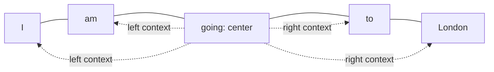
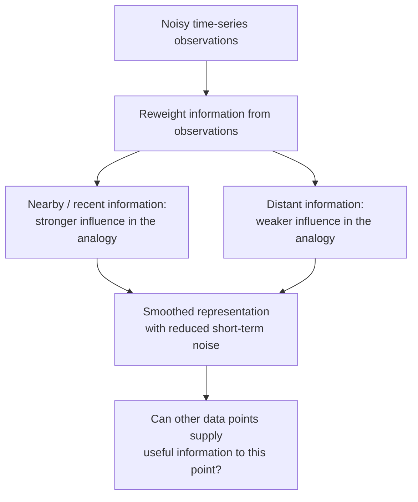
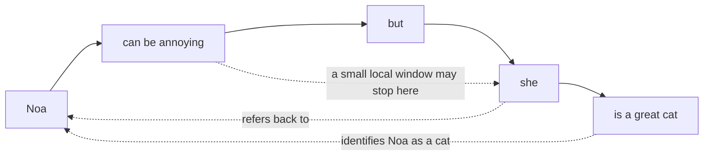
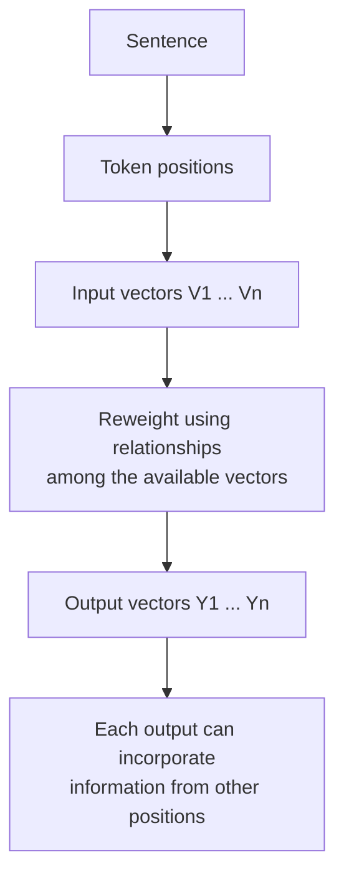
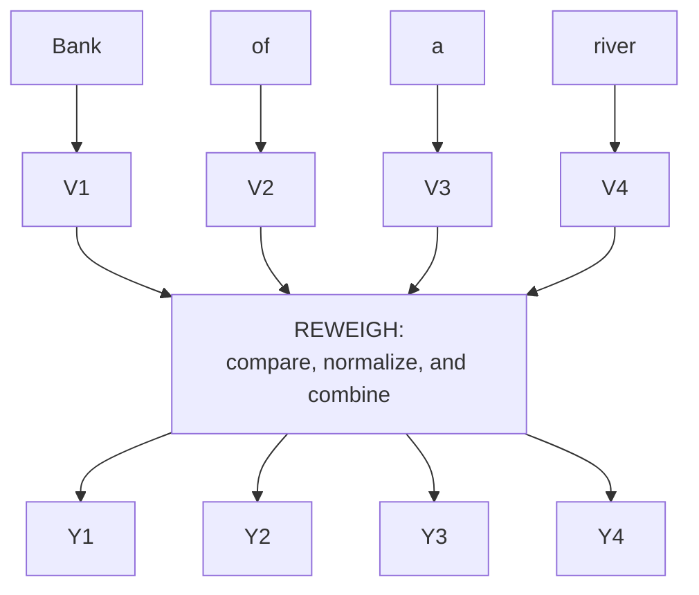
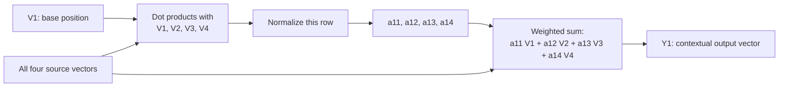

# 🧠 Class 04: Transformers 101, Part 1 — Embeddings, Context, and Self-Attention Intuition
### 📋 Production AI / LLM Engineering | Krish Naik Academy

**🎙️ Mentor:** Sourangshu Pal (addressed as Paul in the transcript)  
**⏱️ Duration:** 4 hours 11 minutes 34 seconds | **📅 Session:** Day 4 (1 August 2026)

**Class recording:** [1 Aug Transformers 101](https://learn.krishnaikacademy.com/web/courses/6a16f8935e281281cd6b1128?chapter=6a6e6a8149d9f2e46cc7a3d5)

This session builds the intuition for turning isolated numerical representations into representations that incorporate surrounding information. Paul starts with familiar NLP representations, uses exponential smoothing as an analogy for reweighting, explores embedding visualizations, and works through a four-token self-attention calculation. The substantial open-floor discussion revisits the distinction between calculated attention coefficients and learned model parameters.

The full Transformer architecture was **not** completed in this class. Query/key/value projections, multi-head attention, and the research-paper walkthrough were left for subsequent sessions. The calculation here is deliberately a simplified, parameter-free illustration; the notes distinguish its properties from those of a trained Transformer.

---

## 📰 Quick Updates

- The course dashboard contains live recordings; the course Notion page holds the syllabus, handwritten notes, and supporting links. Paul recommended bookmarking Notion so resources are easier to revisit.
- A Discord discussion space was opened for the batch, with separate areas for general discussion, paper drops, model drops, and news. Course-related doubts could be raised there or through the dashboard.
- The handwritten PDF for this session was uploaded under the 1 August entry at the end of class. The supplied companion, **Note.pdf**, contains the whiteboard diagrams used below.
- Earlier software-installation and PyTorch sessions remain the starting prerequisites. Paul emphasized that the first Transformer lessons would move slowly to establish the concepts before the practical implementation.

---

## 🔢 From Word IDs to Useful Numerical Representations

Machines operate on numbers, so text needs a numerical representation before a model can process it. Paul began with the simplest possible assignment: give words such as **dog**, **car**, **house**, and **bus** integer labels. This identifies the words, but the labels do not themselves describe what the words mean.

If dog receives ID 1 and car receives ID 2, the numerical gap between those IDs is an arbitrary consequence of the lookup table. It does not establish that a dog is semantically closer to a car than to a bus. Changing the IDs would change that numerical gap without changing any meaning. This becomes a poor basis for semantic comparison as the vocabulary grows.

The useful distinction is between **an identifier** and **a representation**:

| Object | What it tells us | What it does not establish by itself |
|---|---|---|
| Token ID | Which vocabulary entry is present | Semantic similarity to another vocabulary entry |
| One-hot vector | Which entry is active in a shared vocabulary space | Graded semantic relationships between different words |
| Count or TF-IDF vector | Which terms occur and how strongly they are weighted | The complete meaning or word order of a sentence |
| Learned dense embedding | A compact numerical representation learned from data | A guarantee that each coordinate has an obvious human label |
| Contextual representation | A representation informed by the particular surrounding sequence | A complete model prediction without further processing |

The whiteboard contrasts discrete IDs with decimal-valued representations, then shows one-hot encodings for a small vocabulary. For three distinct entries, the illustrated vectors are **dog = [1, 0, 0]**, **cat = [0, 1, 0]**, and **car = [0, 0, 1]**. Each word is distinguishable, but the representation supplies no special shared feature for dog and cat.

Paul's broader objective was to move toward a continuous vector space in which numerical operations can capture useful relationships. This does **not** mean that discrete IDs disappear from modern models: IDs remain the usual way to select vectors from an embedding table. PyTorch explicitly separates the dictionary size from the size of each retrieved embedding. [PyTorch embedding documentation](https://docs.pytorch.org/docs/2.14/generated/torch.nn.Embedding.html)

### The prerequisite techniques revisited

The discussion surveyed older approaches rather than deriving each algorithm:

| Technique | Place in the class discussion |
|---|---|
| One-hot encoding, or OHE | The basic sparse representation; useful for understanding vocabulary-based encoding, and sometimes for a small set of target classes |
| Bag of Words | A count-based text representation that improves on arbitrary labels but loses ordering information |
| TF-IDF | A lexical weighting method Paul highlighted as still useful; BM25 was mentioned as another established lexical-retrieval approach |
| N-grams | Local combinations of consecutive words, used to introduce how adding neighboring words can reveal more information |
| Co-occurrence matrices | Representations based on which words appear together in a corpus |
| Word2Vec | A familiar learned representation, with CBOW and Skip-gram named as its two variants |
| GloVe and fastText | Additional established word-representation methods discussed by the class |
| ELMo | Mentioned as part of the movement toward contextual representations, beyond the simpler classical techniques |

CBOW and Skip-gram were treated as complementary directions: the surrounding words can be used to predict a center word, or a center word can be used to predict surrounding words. Their training objectives were not implemented here. Likewise, the lecture did not reproduce the GloVe algorithm; its official project describes learning from aggregated global word-word co-occurrence statistics. [Stanford GloVe project](https://nlp.stanford.edu/projects/glove/)

A recurring clarification was that **a vector is a mathematical form**, while an embedding is a particular use of that form to represent an item. Merely converting text into numbers does not guarantee that the numbers encode rich semantics. For this class, Paul asked learners to accept that suitable input vectors already existed and concentrate on the operation that combines their information.

---

## 🪟 Sequences, Sliding Windows, and the Limits of Local Context

Language is sequential: order helps determine meaning. Paul illustrated this with **“My name is Paul”** and a rearrangement of the same words. The vocabulary stays the same, while the sentence's grammatical interpretation changes. This is why identifying words alone does not solve language understanding.

He then used **“I am going to London”** to explain local context. From the full sentence, one can answer **who** is going and **where** they are going. A question about **when** cannot be answered from the sentence because no date or time is supplied. This small example ties context to the information that is actually present, rather than to information a reader might assume.

Choose **going** as a center word and examine neighboring positions. Looking left and right produces a bidirectional neighborhood; looking in one direction produces a unidirectional neighborhood. A **sliding window** moves that center through the sequence, so the next center might be **to**, followed by **London**.

The PDF's sketch has arrows from the center word toward its neighbors:

The class used **window size 2** for two positions on each side. Conventions differ across implementations, so always check whether a window parameter means a radius around the center or a total number of positions. An n-gram is also a different object: a bigram contains two consecutive tokens; a center plus two neighbors on each side is not, by definition, a bigram.

### Why adding nearby words helps, but is not enough

One neighboring word may leave an expression ambiguous. Expanding a window can supply a subject, a qualifier, or an object that makes the phrase easier to interpret. Paul asked the class to consider progressively larger windows and stressed that there is no universally perfect window size.

The limitation is that an important dependency may lie outside the chosen neighborhood. Increasing the window helps only until the relevant information is included, and a fixed local rule cannot know in advance which distant word will matter most. The lesson's main direction is therefore to **connect representations using relevance**, rather than to rely only on physical adjacency in the sentence.

The discussion of two-, three-, and larger-word neighborhoods should be retained as intuition, not as a rule that three is always optimal for GloVe or for language modeling. A useful window depends on the corpus, objective, and representation method.

### The same idea across other data types

Paul briefly compared modalities to make the meaning of “sequence” concrete:

- **Time series:** observations have a temporal order. Changing their order changes the process being described.
- **Audio:** sound evolves over time. A mel spectrogram was shown as a way of visualizing time-frequency information, and earlier CNN-based audio classification was mentioned as an example of working with that visual representation.
- **Video:** the order of frames matters; a frame can be treated as an image, but the video adds a temporal sequence.
- **Images:** the whiteboard divides an image into patches, with several pixels inside each patch. This emphasizes spatial structure rather than an inherent reading order like a sentence.

For precision, images **can** be represented as a sequence of patches in a vision Transformer; the fact that an image starts as a spatial grid does not prohibit a sequence representation. [Hugging Face glossary: image patches](https://huggingface.co/docs/transformers/glossary#image-patch)

The modality discussion was a conceptual bridge. No audio-processing, vision, or time-series model was implemented in this session.

---

## 🌊 Exponential Smoothing as an Analogy for Reweighting

Before moving to attention, Paul introduced a familiar time-series operation: use weighted information from current and past observations to form a smoother representation. The idea is that a data point need not be interpreted entirely in isolation; previous information can affect the value used to describe the current state.

The formula actually written in the companion PDF is:

$$
s_t = \beta x_t + (1-\beta)s_{t-1}
$$

Here:

- \(x_t\) is the current observation.
- \(s_{t-1}\) is the previous smoothed value.
- \(s_t\) is the new smoothed value.
- \(\beta\) determines the balance between current and previous information.

With the board's example **β = 0.9**, the current term receives a coefficient of 0.9 and the previous smoothed term receives 0.1. Increasing one coefficient reduces the other because the two add to one. This is the “control” intuition: choose how strongly each source influences the result.

The class referred to exponential weighted averages, exponential moving averages, and simple exponential smoothing. The important object here is the recurrence shown above; a plain moving average is a related smoothing idea but uses a different weighting rule.

### What the noisy-curve sketch was intended to show

The PDF draws a noisy time series, an intermediate bell-shaped weighting illustration, and a final curve with less noise. Nearby points are described as receiving stronger influence, while far-away points receive weaker influence. Paul repeatedly made clear that the bell-shaped result was an **assumed illustration**, not a claim that arbitrary time-series data becomes normally distributed after smoothing.

The arrows reproduce the whiteboard's teaching structure: noisy observations → reweighting → a smoother representation → a question about context. They are not a new algorithm or a guarantee about the final shape of the data.

In response to questions, Paul also explained that the time-series process moves from past observations toward the present and future. The recurrence above uses the previous smoothed state; it does not revise the past using an unseen future observation. The bidirectional arrows in the broader whiteboard analogy should not be confused with that causal recurrence.

### The bridge to NLP

The transferable idea is **weighted influence**. If one representation contributes to another representation, the latter can contain information that was absent when it was considered alone. The time-series example offers an intuitive way to see that mechanism before dealing with a sentence's vectors.

The proximity rule does not transfer unchanged to language. A word close to the center may be less informative than a distant word. Paul explicitly returned to this distinction: in NLP, the useful relation can span a large gap. Attention must be able to express that relation rather than automatically suppress it because of distance.

---

## 🐈 Long-Range Context: “Noa Can Be Annoying, but She Is a Great Cat”

The central language example in the handwritten notes is **“Noa can be annoying, but she is a great cat.”** It creates a useful ambiguity: the beginning and the pronoun **she** do not by themselves establish what kind of entity Noa is. The final word **cat** supplies the answer.

Paul first chose **annoying** as a base word and expanded its neighborhood. A fragment such as **“be annoying but”** tells us little. A larger fragment such as **“can be annoying but she”** tells us more, and including still more of the sentence continues to reveal structure. Yet a narrow local window can still fail to connect **Noa** at the start with **cat** at the end.

The PDF's dependency arrows connect the center with its nearby words and also highlight the distant subject and the final identifying phrase:

This example explains **why distance matters to a local method**. The needed evidence is present, but a short neighborhood may exclude it. A system working only with a fragment might treat the pronoun as referring to a person or to a generic female entity. Reading the complete sentence resolves that interpretation.

The point is not that every classical NLP method is incapable of representing a long dependency. It is that a fixed local representation has a limited information path, and simply enlarging a window does not provide a learned rule for which relationships deserve emphasis.

### The proposed transformation

Paul converted the conceptual sentence into tokens and then into vectors, using the notation **V₁, V₂, …**. He proposed a reweighting operation that would produce **Y₁, Y₂, …**, where each output is intended to carry more information about the surrounding sequence.

The supplied PDF shows this as parallel token/vector columns feeding a reweighting block and continuing to contextual output vectors. Its token columns are schematic, so the number of drawn columns should not be treated as the exact output of a real tokenizer.

This is a **forward transformation**, not yet an account of training. The class has not introduced a prediction target, a loss function, an optimizer step, or learned query/key/value projections. Its question is narrower: given vectors, how can a calculation mix information between positions?

Tokenization was deliberately simplified to one word per token in the examples. Real tokenizers may emit whole words, subwords, punctuation, or special tokens, so neither “one word is always one token” nor a fixed characters-per-token estimate is a general definition. [Hugging Face tokenization algorithms](https://huggingface.co/docs/transformers/tokenizer_summary)

---

## 🌌 Exploring Embedding Spaces and Reading Their Visualizations

Paul paused the whiteboard explanation to show what numerical representations look like when projected into a form humans can inspect. The demonstration is useful because “vectors are close” is otherwise easy to repeat without understanding what is being compared.

### Word2Vec data in a 3D projector

One example used roughly **10,000 word vectors with 200 dimensions**. The screen allowed the class to rotate a 3D view, zoom, and select words. Paul looked at geographical terms, numbers, related words, and alternative spellings to see whether their neighborhoods appeared sensible.

There are two separate quantities:

| Quantity | Meaning in the demonstration |
|---|---|
| Number of points | How many represented items are displayed: approximately 10,000 words |
| Original vector dimension | How many coordinates describe each item: 200 |
| Display dimension | How many coordinates the plotted view uses: two or three |

A 200-dimensional vector does not become a three-coordinate original representation merely because the browser displays it in 3D. The view is a projection. Paul stressed that a dense cloud of points is difficult to interpret without selecting items and examining their nearest neighbors.

### Familiar words make relationships easier to inspect

Another visualization used examples such as **husband**, **wife**, **father**, **mother**, **daughter**, **son**, **prince**, and **princess**. Selecting husband returned a neighborhood containing several family and relationship terms. The class compared such neighbors with a word such as **computer**, whose context is different from the family examples.

The lesson is to ask whether a neighborhood is useful for the represented task, not merely whether two labels look close on the screen. A projected gap between prince and princess does not necessarily contradict a nearest-neighbor result computed in the original space.

The display also included axes with labels such as age and a residual direction. These were visualization choices; they do not establish that every learned embedding comes with a clearly named semantic coordinate. The later king/queen drawing uses named attributes as a teaching analogy, not as a recovered list of the model's actual dimensions.

### PCA, t-SNE, and UMAP

Paul changed the projection method from PCA to t-SNE and discussed the different visual density. UMAP was also mentioned. They are useful ways to explore high-dimensional data, but t-SNE is not simply an “advanced version of PCA,” and a denser-looking plot is not proof that the underlying embeddings improved.

PCA uses a linear projection. t-SNE emphasizes local neighborhoods and does not explicitly preserve global structure; its appearance also depends on its settings. A 2D or 3D view should therefore support inspection, while the original vectors and their chosen similarity measure remain the basis for numerical comparisons. [Scikit-learn manifold-learning documentation](https://scikit-learn.org/stable/modules/manifold.html#t-distributed-stochastic-neighbor-embedding-t-sne)

### An atlas of an entire dataset

The Apple Embedding Atlas demonstration moved beyond individual word labels to a large wine-review dataset, with approximately **160,000 points**. The class inspected metadata such as country, province, and price. Coloring points by price let Paul observe that much of the displayed data fell in the 10–100 range. This was an observation about that demo dataset, not a conclusion about wine prices generally.

An atlas combines a projected embedding map with the ability to inspect the original items and their metadata. It can reveal regions worth exploring without requiring the viewer to read the full dataset line by line. The official Apple project supports this general workflow of visualizing embeddings, exploring subsets, and examining individual points. [Apple Embedding Atlas](https://apple.github.io/embedding-atlas/)

Paul also mentioned Nomic Atlas as another route for building such a view and suggested that learners could start with an available embedding model rather than train one from scratch. No atlas-building code was supplied in this class.

### The leaderboard discussion

The class briefly looked at the MTEB leaderboard and model dimensions including **128**, **768**, and **4096**, with **1536** mentioned by students as another familiar size. These are examples of differing model outputs, not a universal minimum or a rule that larger vectors always perform better. Leaderboard entries and rankings are time-dependent; the session's comparison should not be treated as a current ranking.

The practical exercise is to compare the **representation dimension**, the **task**, and the **quality of the resulting neighborhoods**. Dimension describes capacity and resource use; it does not directly tell a learner how much useful context a model captured.

**Class companion resources:** The course's [Transformers 101 resource page](https://krishnaikacademy.notion.site/Transformers-101-3afeba9593d0804fa8e1e301f12ae2ff) supplies the [Embedding Projector](https://projector.tensorflow.org/), [Apple Embedding Atlas examples](https://apple.github.io/embedding-atlas/examples/), and [MTEB leaderboard](https://huggingface.co/spaces/mteb/leaderboard). The [TensorBoard projector guide](https://www.tensorflow.org/tensorboard/tensorboard_projector_plugin) explains the visualization workflow. These companion links recover useful resources whose exact URLs were not retained in the transcript.

---

## ⚖️ Generating Reweighting Coefficients from the Vectors Themselves

Returning to the PDF, Paul compared vectors for **king** and **queen**. The drawing labels possible shared attributes such as family, royalty, power, history, and gender. The purpose is to explain why two words can have a useful relationship even when they are not next to one another in a sentence.

The numbers in a learned vector are not normally a hand-written checklist of these attributes. The named features make the intuition accessible: related concepts can share patterns in their numerical representations, and those patterns can be compared.

Instead of introducing an unrelated external coefficient, Paul proposed deriving a score from two available vectors through their **dot product**. The board illustrates this for king and queen, then develops the same idea for each pair of token vectors in a short sentence.

### Keep the two meanings of “weight” separate

This distinction became the most repeated clarification in the session:

| Term | How it is obtained | Role |
|---|---|---|
| Calculated attention coefficient | Computed from the current input representations and then normalized | Determines how strongly one position contributes to an output |
| Trainable model parameter | Initialized or loaded, then adjusted through training when unfrozen | Defines transformations such as embedding lookup and linear projections |

Paul initially used **W** for the calculated coefficients. Students understandably associated this with the weights and biases of a neural network and began asking about Xavier or He initialization. He changed the notation to **A** to emphasize that the letter was arbitrary and that **this toy calculation was not initializing or updating parameters**.

A calculated coefficient can change when the input changes, even when all model parameters remain fixed. Conversely, during training, a model can update the parameters that help produce those coefficients. These are connected ideas, but they describe different parts of the computation.

The class's distinction should not be extended into the claim that real self-attention has no trainable parameters. A standard Transformer uses learned projections to create the representations used for attention. [Attention Is All You Need, model architecture](https://arxiv.org/html/1706.03762v7#S3)

### A dot product produces a scalar score

For two equal-length vectors, the dot product multiplies corresponding coordinates and sums them. Its result is a **scalar**. That scalar can then scale a vector; the scaled result is again a vector. Summing several such scaled vectors produces the final output vector.

The class uses these operations in two distinct places:

1. **Compare two input vectors** to obtain one score.
2. **Multiply a normalized scalar coefficient by a vector**, then add the contributions.

Although the spoken explanation sometimes uses “vector multiplication” broadly, these are not all the same operation. In particular, the dot product is not a cross product, and scalar-vector multiplication is not a second vector-vector dot product.

### Dot product versus cosine similarity

Several students asked whether the calculated score was cosine similarity. Paul directed them to the denominator of the cosine formula. A dot product supplies the numerator; cosine similarity additionally divides by the product of the vector lengths:

$$
\operatorname{cosine}(u,v)=\frac{u\cdot v}{\|u\|\,\|v\|}
$$

Thus, an ordinary dot product can reflect both direction and magnitude, while cosine similarity removes the magnitude factor. They coincide when the compared vectors have unit norm. Numerical implementations also protect against a zero denominator. [PyTorch cosine-similarity documentation](https://docs.pytorch.org/docs/2.14/generated/torch.nn.functional.cosine_similarity.html)

Cosine similarity was discussed as a familiar tool for embedding comparison and retrieval. It is not the definition of semantic search, and it is not the exact operation used at every stage of attention. The present example is about producing and using attention coefficients.

---

## 🏦 The Complete Four-Token Walkthrough: “Bank of a River”

To reduce the amount of writing, Paul replaced the longer cat example with **“Bank of a river.”** Here the surrounding words can help resolve the meaning of **bank**. The whiteboard maps the four words to four vectors and sends them through a block labeled **REWEIGH**, producing four contextual outputs.

| Position | Word in the teaching example | Input representation | Output representation |
|---|---|---|---|
| 1 | Bank | V₁ | Y₁ |
| 2 | of | V₂ | Y₂ |
| 3 | a | V₃ | Y₃ |
| 4 | river | V₄ | Y₄ |

### Step 1: Fix the first base vector and compare it with all positions

For V₁, the board calculates:

$$
s_{11}=V_1\cdot V_1,\quad
s_{12}=V_1\cdot V_2,\quad
s_{13}=V_1\cdot V_3,\quad
s_{14}=V_1\cdot V_4
$$

The board calls these unnormalized values **W₁₁, W₁₂, W₁₃, W₁₄**. Here, the letter **s** makes it easier to distinguish the raw scores from the final normalized coefficients. This is a notation clarification of the same calculation, not a separate implementation.

The first index identifies the position whose output is being formed. The second index identifies the position that may contribute information. Every row holds a different base position fixed.

Including V₁·V₁ is allowed. In an unmasked self-attention example, the current position is one of the available sources. It is not excluded merely because its information might also be present elsewhere in the calculation.

### Step 2: Normalize the scores for that base position

Paul wrote that the final row of coefficients should **sum to one**. With the normalized coefficients denoted by a₁₁ through a₁₄:

$$
a_{11}+a_{12}+a_{13}+a_{14}=1
$$

The normalization is performed for each base position's row. It does not mean that every coefficient equals one, and it does not mean that the entire matrix has a single total sum of one.

The class used “normalization” broadly and mentioned min-max scaling during Q&A. For actual scaled dot-product attention, the standard operation is **softmax across the source positions**, which gives nonnegative coefficients summing to one. Ordinary min-max scaling alone does not impose that sum-to-one property. Scaling and normalization support the numerical behavior of attention; they do not simply make matrix multiplication cheaper because the numbers lie between zero and one. [PyTorch scaled dot-product attention](https://docs.pytorch.org/docs/2.14/generated/torch.nn.functional.scaled_dot_product_attention.html)

### Step 3: Use the coefficients to combine the vectors

The first output is the weighted sum shown in the PDF:

$$
Y_1=a_{11}V_1+a_{12}V_2+a_{13}V_3+a_{14}V_4
$$

Each coefficient scales the corresponding source vector, and the scaled vectors are added. The result is one output vector for the first position. It can therefore incorporate information from **river**, rather than represent **bank** in isolation.

The score calculation and the weighted sum serve different purposes. The first determines **how much** a source should contribute; the second carries the source vector's actual numerical information into the output. This answers the repeated question of why a score is calculated and then multiplied by a vector again.

### Step 4: Repeat with each other base vector

Next, hold V₂ fixed, obtain its coefficients, and form Y₂. Repeat for V₃ and V₄:

$$
\begin{aligned}
Y_2 &= a_{21}V_1+a_{22}V_2+a_{23}V_3+a_{24}V_4 \\
Y_3 &= a_{31}V_1+a_{32}V_2+a_{33}V_3+a_{34}V_4 \\
Y_4 &= a_{41}V_1+a_{42}V_2+a_{43}V_3+a_{44}V_4
\end{aligned}
$$

The last line on the handwritten board repeats the label Y₃; the four-output calculation and surrounding explanation establish that this final row corresponds to **Y₄**.

The coefficients are **not randomly assigned to source vectors**. For output row i, aᵢⱼ multiplies source Vⱼ. Changing that association would change the operation. This is the indexing issue Paul clarified when students asked about W₂₁ and whether it should multiply V₁ or V₂.

The raw toy scores have a useful mathematical nuance: V₁·V₂ and V₂·V₁ are equal. Their normalized coefficients need not be equal, because the two rows can have different normalization denominators. In a full model, different learned query and key projections add another reason that attention need not be symmetric.

### What the outputs do, and what they do not yet do

Y₁ through Y₄ are **intermediate representations**. They are not a translation, a next-token probability, or an answer to a question. Other blocks and a task-specific objective are needed to turn those representations into a trained system's output.

Paul used “more context” to describe the intended result: an output includes a mixture of available information rather than only its original vector. That is a structural property of the calculation. It does not prove that arbitrary input vectors will produce a correct semantic interpretation. For example, mutually orthogonal one-hot vectors do not automatically reveal that **it** refers to **animal** in a sentence.

This is why the toy example is valuable as a mechanism while still leaving learned representation quality and the rest of the Transformer architecture for later lessons.

---

## 🧩 Understanding the Four Whiteboard Observations Correctly

After the calculation, Paul wrote four observations: no weights had been trained, order had no influence, proximity had no influence, and the calculation was shape independent. They summarize the intended toy example, but each needs a precise scope.

| Whiteboard observation | Meaning for this class's simplified calculation | Boundary to remember |
|---|---|---|
| “I have not trained any weights” | The coefficients were calculated from supplied vectors; no optimization step was performed | A real model can contain learned embeddings and learned attention projections |
| “Order has no influence” | No positional information was supplied to the bare all-to-all calculation | Full language models require a way to represent order; changing word order can change meaning |
| “Proximity has no influence” | A position is not restricted to its immediate neighbors in the illustrated unmasked block | Allowed connections depend on the attention mask and architecture; access does not imply equal importance |
| “Shape independent” | Combining equal-width vectors can preserve the vector width in the output | Dimensions must still be compatible; intermediate tensors do not all have the same shape |

### Order independence is a property of the bare operation

The all-to-all toy block has no instruction saying “this word is first” or “this word is ten positions away.” Reordering its inputs therefore reorders the associated outputs rather than creating a representation of grammar on its own. The technical term is **permutation equivariance**.

Paul's answer to Kalyan made a useful distinction between that small block and a complete network trained on ordered language. For a full Transformer, positions still matter. The original architecture explicitly adds positional information because attention without recurrence or convolution otherwise lacks sequence order. [Attention Is All You Need, positional encoding](https://arxiv.org/html/1706.03762v7#S3.SS5)

A model's ability to cope with a slightly scrambled phrase is not evidence that language order is irrelevant. It may use other clues to recover an interpretation.

### All-to-all access does not mean all sources receive the same weight

The distant **cat** can contribute to the representation of **Noa** because the illustrated block lets the positions interact. A nearby function word can receive less weight than a more informative distant word. The removal of a fixed locality restriction is the point; the model still needs to decide the importance of allowed sources.

For an autoregressive decoder, future positions are masked. “Every position can see every other position” applies to the unmasked teaching example, not to every attention layer used in production. [PyTorch attention-mask behavior](https://docs.pytorch.org/docs/2.14/generated/torch.nn.functional.scaled_dot_product_attention.html)

### Shape preservation does not erase dimensional constraints

If all four source vectors have d coordinates, scaling and summing them produces another d-coordinate vector. But the collection of four vectors, the table of pairwise scores, and one individual vector are different objects. A scalar coefficient is also different from a vector.

A token vector is not a matrix merely because it has many features; stacking several token vectors creates a matrix. Likewise, vocabulary size and embedding width need not be equal. Vocabulary size controls the number of entries in a lookup table; embedding width controls the length of each entry. [PyTorch embedding shapes](https://docs.pytorch.org/docs/2.14/generated/torch.nn.Embedding.html)

There is no general rule requiring a width to be a power of two. Paul mentioned 128, 256, and related values as common practical choices, but model design and implementation determine the actual constraints.

---

## 🛠️ Training, Batches, and the Boundary of Today's Example

Many open-floor questions concerned training, fine-tuning, multiple attention blocks, and very large corpora. Paul kept returning to the session's limited objective: understand one reweighting operation before adding the full network.

### Calculating a representation is different from training a model

The toy block takes existing vectors and produces new vectors. No parameter update happens in that demonstration. Training introduces an objective and updates trainable parameters to improve it. Backpropagation computes gradients for that process; it is not something that must run whenever an already trained model processes a prompt.

This distinction matters for Swati Gupta's example, **“The animal did not cross the road because it was tired.”** The sentence supplies context, and a forward attention computation can mix that information. A trained model's ability to use the relation meaningfully depends on learned representations and transformations. A parameter-free calculation can be executed without backpropagation, but that fact alone does not establish correct pronoun resolution.

Paul also used a RAG analogy: an existing vector representation can retrieve a relevant chunk without retraining the model for each retrieval. Retrieval and model training are separate operations. This was an analogy in the Q&A, not a RAG implementation or a demonstration that raw, untrained vectors understand the sentence.

### Batches, steps, and epochs

For a dataset too large to fit into memory at once, Paul explained breaking work into batches. Processing one batch is a step; completing a pass over the training dataset is an epoch. His simple illustration divides a dataset into ten batches, requiring ten steps for one pass.

An epoch, however, does not create direct attention links across separately processed examples. It exposes the model to the dataset through parameter updates. For a particular forward pass, a token can attend only to positions included in the permitted input sequence. Gaurav's question about a dependency in a much later chunk therefore concerns input construction and context handling as well as batching; that solution was not worked through in this lesson.

### Sentence boundaries and context windows

Paul mentioned start/end markers and punctuation while explaining how multiple sentences can be represented. Real tokenizers and models have their own special tokens, and punctuation is not automatically a reserved special token. A delimiter indicates a boundary; the attention mask determines which connections are permitted. Multiple sentences can share a sequence and interact when the architecture allows it. [Hugging Face glossary: token IDs and attention masks](https://huggingface.co/docs/transformers/glossary)

A model's context capacity constrains the token sequence it can process. It should not be confused with the width of an individual vector or with the number of examples in a training batch. The session did not implement long-context processing, cross-chunk memory, or a cache.

### What to watch during training

Swati Deepak Kumar asked whether loss alone could decide when to stop or whether to continue fine-tuning. Paul advised tracking loss over successive epochs, looking for a plateau, and also examining validation loss and validation accuracy. A decreasing training loss can coexist with disappointing validation behavior, so the model's actual task performance still matters.

He mentioned incorrect annotations and an unsuitable learning rate as possible explanations for problematic results. His practice was to inspect early training behavior and decide whether the configuration looked promising. The discussion did not establish a universal number of epochs, a requirement that loss reach zero, or a single criterion suitable for every task.

### GPU execution and recurrent models

The hand calculation writes pairwise operations one after another so a learner can follow them. Matrix-based implementations can express many of those operations together, and GPUs are designed to execute such numerical work efficiently. The point is about the hardware and the matrix formulation, not about self-attention “helping the GPU.”

In response to a question about LSTMs and GRUs, Paul distinguished their recurrent gates from the attention calculation. He also said that he still considers recurrent models for smaller-data problems. His example data-size thresholds were personal heuristics, not architecture-selection rules. The useful principle is to consider the task and available data instead of assuming that the newest architecture is always required.

---

## 🗺️ What's Next

Paul said the next class would begin by revising this self-attention calculation, then move toward **multi-head attention** and attention as part of the larger architecture. He also intended to begin the **Attention Is All You Need** paper walkthrough and introduce the **query/key/value** idea using a database analogy.

He mentioned learned linear layers as the point at which actual model weights and biases would enter the explanation. Detailed implementation was planned after the initial conceptual sessions. The transcript did not complete those topics here; diagrams suggesting additional attention blocks were briefly sketched and then set aside to keep this class focused.

The Illustrated Transformer and the 3Blue1Brown attention explanation were mentioned as supporting material. The course's [Transformers 101 resource page](https://krishnaikacademy.notion.site/Transformers-101-3afeba9593d0804fa8e1e301f12ae2ff) supplies [The Illustrated Transformer](https://jalammar.github.io/illustrated-transformer/) as further reading. The exact 3Blue1Brown video link was not preserved in the transcript or this resource entry.

---

## 💬 Live Q&A Highlights

The table covers both in-flow questions and the extended open floor. Near-duplicate doubts are merged, while substantive follow-ups are retained. Speaker names follow the transcript; **Urna** also identified herself orally as **Udnaya**, and **136** and **iPhone** are transcript display labels.

| Question | Answer |
|---|---|
| **Pralad:** What makes a window “sliding”? | The chosen center advances through the sequence, and its neighborhood changes with it. A window's width and the movement of its center are separate ideas. |
| **Question relayed in chat; name unclear:** Can a mel spectrogram be converted to an embedding? | Yes, with an appropriate representation model for that input. Paul distinguished this from directly applying a normal text embedding pipeline; the audio example was only a conceptual illustration. |
| **Kulkarni, first name unclear / Manoj:** Where do V₁ and V₂ come from? | For the toy calculation, assume an agreed numerical representation produced by a vectorization method. The class did not implement the conversion; useful semantic vectors and arbitrary numeric encodings are not interchangeable in quality. |
| **Sai:** How can high-dimensional embeddings be shown in 3D? | Reduce or project them into three display coordinates, then plot them. Paul mentioned Plotly and Matplotlib; the display does not retain every relationship of the original high-dimensional space. |
| **Shiv Prakash:** Is reweighting the same as gradient descent or backpropagation? | No. Reweighting is the forward combination of available representations; gradient-based training changes trainable parameters. |
| **Nandan:** Is importance based on Euclidean distance, and does reweighting edit the vector directly? | The class's attention example derives dot-product scores and uses normalized coefficients to scale source vectors. Similarity or distance choices depend on the representation and task; the lecture did not establish a universal metric. |
| **Vivek:** Does semantic search mean using contextual vectors? | Contextual representations can support semantic retrieval, but semantic search is a retrieval objective rather than a synonym for one vector type or for cosine similarity. |
| **Ritam / Kalyan Rad / Urna:** How can order be irrelevant when language needs order? | The bare calculation has no position input and connects the available vectors without a local ordering rule. A complete Transformer still represents positions; Kalyan's follow-up distinguished the small block from the full network. |
| **Shiva:** Is this logistic regression? | No. The demonstrated operation calculates pairwise scores and weighted sums to produce contextual vectors; it does not fit a logistic-regression classifier. |
| **Umesh:** Where is the query vector? | Query/key/value projections had not yet been taught. Paul asked learners to understand the mixing operation first and deferred that terminology. |
| **Bansur / Shivam Kumar:** Are the coefficients normalized, and is that min-max scaling? | The final coefficients in each output row are intended to sum to one. Standard attention uses softmax; min-max scaling alone does not guarantee that sum. |
| **Durga Rao:** How many attention blocks should be used? | The number is an architectural choice or hyperparameter. Paul did not select an optimum here and removed the multi-block sketch before teaching it in detail. |
| **Sarita / Athira:** Do these W values require Xavier or He initialization? | No initialization occurs for the calculated coefficients in this illustration. Initialization concerns trainable parameters; Paul switched the coefficient notation from W to A to reduce the confusion. |
| **Prem / Praveen Kumar:** Are vectors multiplied randomly? | No. The chosen base position is compared with every permitted source, and each coefficient remains matched to its source vector. The written calculation follows a consistent indexing scheme. |
| **Question relayed in chat; name unclear:** Why multiply a calculated coefficient by a vector again? | The pairwise score estimates a contribution, while the subsequent weighted sum carries source information into the output. These are different stages of the attention operation. |
| **Hemanth / S Anoop / Sridhar K:** Is the operation a cross product or cosine similarity? | It is a dot product for scoring. Cosine similarity includes vector-length normalization in its denominator; the weighted output is a sum of scalar-scaled vectors. |
| **Anusha:** Is including V₁'s contribution to Y₁ redundant? | A position can attend to itself as well as to other allowed positions. Self-information is a valid source; repeated information is not a reason to omit it automatically. |
| **Chandhruv:** Could the vectors simply be added instead? | The illustrated mechanism uses data-dependent coefficients, which an unweighted sum would not provide. Addition is nevertheless essential in the final weighted sum and is used elsewhere in neural networks. |
| **Anoop / Ritam Ghosh:** Is the result of a dot product a scalar or a vector? | The pairwise dot product is a scalar. Multiplying that scalar by a source vector gives a vector, and adding the scaled vectors produces Yᵢ. GPU use does not change these mathematical object types. |
| **Shivam:** Is there a metric that says how much context was captured? | No such metric was defined in class. Paul treated “more context” as intuition for the mixed representation; assessing usefulness requires a task and an evaluation method. |
| **Manoj / Shivam Kumar / RANJEEV TIWARI:** What is attention versus self-attention? | The class treated self-attention as the first attention block to understand. Precisely, self-attention relates positions within the same input; attention is the broader mechanism and can also connect different sources. |
| **Sachin Srivastava:** How should prerequisites be revised, and are paper drops implemented in class? | Paul pointed to the supplied deep-learning prerequisites and the ordered syllabus. Shared research papers do not automatically imply an in-class implementation; an implementation also depends on released material and session scope. |
| **Sachin Srivastava:** How can a learner pursue LLM research? | Paul said a useful recommendation needs the learner's background and did not give a specific research roadmap during this exchange. |
| **Kalyan Rad:** Do additional attention blocks explain next-word prediction or modern reasoning behavior? | Paul deferred the question to the complete architecture and its objective. One self-attention block is insufficient to explain a trained language model's entire behavior. |
| **Sridhar K:** What prerequisites are enough to get started? | Paul referred to the earlier PyTorch class and the shared prerequisite repository. The current lesson was the first actual Transformer-intuition session. |
| **Nitish Singh:** What information does each Y vector contain? | Each output mixes source information with its own row of coefficients. Different outputs can emphasize different sources; the complete collection is more informative than interpreting one coefficient as the entire sentence. |
| **Nitish Singh / Aishwarya:** Are these Y vectors already what gets stored in a vector database? | They are intermediate outputs in today's model illustration. An embedding visualization, an internal hidden state, and a vector-database entry serve different roles; no storage pipeline was demonstrated. |
| **Nitish Singh:** How can the same word, such as apple, have different meanings? | Surrounding words supply disambiguating context. Paul deferred the fuller account to later attention and representation lessons rather than treating the isolated word as sufficient. |
| **Nitish Singh / Sumit Mamtani:** What determines a vector's dimension? | The representation method or model defines its width. Vocabulary-based one-hot width depends on vocabulary size, while a learned embedding's width is a separate design choice; vectors compared by the dot product need compatible lengths. |
| **Vikas Gupta / Praveen:** Does a token mean a word, four characters, or three-quarters of a word? | A word was used as a token in the teaching example. Actual tokenization is model-dependent and may produce words, subwords, punctuation, and special tokens; average length estimates are not definitions. |
| **136:** Does “close points amplified, far points filtered” apply equally to time series and NLP? | It was introduced through the smoothing analogy. In language, a distant word may be crucial, and a nearby word may be less informative; the proximity heuristic is not the attention rule. |
| **Urna:** What does “no trained weights” mean? | No neural-network training or parameter update was performed in the toy block. The inputs were supplied, and the coefficients were derived from them. |
| **Urna:** Does shape preservation also apply beyond this example? | The current weighted sum preserves the common source-vector width. Later architecture must maintain compatible shapes, but intermediate projections and score matrices can have different dimensions. |
| **Ritam Ghosh / S Anoop:** Must input stop at one sentence, and must a 15-word sentence be split? | Fifteen words was treated as a very small example. Inputs can span sentences or paragraphs within model limits; the paper's translation setting was discussed as a dataset of paired sequences. |
| **Sameer Nandan:** How would medical or finance fine-tuning alter the model? | Fine-tuning was deferred until the actual trainable architecture was introduced. The current coefficient calculation is not a fine-tuning procedure. |
| **Sameer Nandan:** What is downloaded with a pretrained model? | The learned parameters are a central part of the checkpoint. The class did not inspect a checkpoint's files or loading code. |
| **Ilesh:** Are the example sentences a training dataset or input features? | They are inputs used to explain the transformation; no end task or training objective was defined in the demonstration. |
| **Ilesh:** Are V₁, V₂, and so on related to a model's context window? | They represent token positions within a supplied sequence. Context length concerns how many token positions can be processed, whereas an individual vector's width is a different quantity. |
| **Gaurav Garg:** What happens when a huge corpus does not fit in memory? | Paul explained batches, steps, and epochs. Processing the dataset in batches permits training, but an epoch does not directly connect tokens in separate examples through attention. |
| **Gaurav Garg:** How does a first chunk obtain context from a much later chunk? | The concern was raised, but no cross-chunk method was demonstrated. Input construction, memory, retrieval, or another architecture choice would be needed; batching alone does not answer it. |
| **RANJEEV TIWARI:** Are W₁₂ and W₂₁ the same, and which vector gets multiplied? | Raw dot products are symmetric in this toy case, but separately normalized coefficients can differ. For row 2, the coefficient associated with source 1 multiplies V₁; the base/source indices must stay consistent. |
| **RANJEEV TIWARI:** Can one vector represent several words, and do word counts cause different shapes? | A vector may represent a token, sentence, or larger item depending on the system. In this walkthrough each token uses the same width; text length and representation width are different concepts. |
| **RANJEEV TIWARI:** Does a larger vector guarantee all coordinates are useful? | No. Paul used the possibility of unused or less useful features to introduce pruning as a future topic. The class did not measure coordinate usefulness or establish a minimum training-data threshold. |
| **Swati Deepak Kumar:** Can forward and backward propagation be calculated manually? | Paul suggested revisiting deep-learning fundamentals and using a small two-layer network for a pen-and-paper exercise. Such a calculation was not performed in this class. |
| **Swati Deepak Kumar:** Is falling loss enough to decide when to stop or fine-tune? | Track its trend and also inspect validation loss and task metrics. Paul mentioned plateaus, annotation problems, and learning rate as factors; no universal stopping rule was established. |
| **iPhone:** Does self-attention help GPUs process faster, and how does it differ from LSTM/GRU? | GPUs efficiently execute parallel numerical operations; the attention calculation can use matrix operations. Recurrent models use a different gated, sequential structure, and their suitability still depends on the problem. |
| **Sai:** Are two sentences always processed in isolation? | Paul discussed boundary markers. More precisely, special tokens indicate structure, while masks and input construction control interaction; multiple sentences can share attention when allowed. |
| **Phanindhar Golla:** How does near/far influence work in the smoothing sketch? | The explanation concerned the sequential use of past information in exponential smoothing. Distant observations influence the present through the recurrence; the sketch was an intuition, not a literal instruction to delete distant points. |
| **Phanindhar Golla:** How were papers converted to Markdown for AI-assisted reading? | Paul referred to the Hugging Face paper-reading workflow he had used earlier and said other PDFs may need conversion. No conversion command or exact page link was preserved here. |
| **Subbu:** Will bias or linear layers be added later? | Yes, Paul planned to introduce a linear-layer block and its learned parameters later. The current calculation contains no learned linear transformation; whether a specific layer includes bias is configurable. [PyTorch linear layer](https://docs.pytorch.org/docs/2.14/generated/torch.nn.Linear.html) |
| **Arun Karnik:** What does “proximity has no influence” mean? | The Noa/cat example shows that a relevant distant token can contribute when all permitted positions are compared. The illustrated block is not restricted to a short neighboring window. |
| **Swati Gupta:** Are the input vectors necessarily learned embeddings? | The toy demonstration accepts numerical vectors and does not train their source. Actual models can use learned or pretrained embeddings; a simple encoding is mathematically usable without guaranteeing semantic quality. |
| **Swati Gupta:** Must pronoun resolution run backpropagation every time? | No parameter update is required for a forward pass or retrieval. Learned representations can still be crucial to meaningful resolution; the animal/road example did not demonstrate that arbitrary untrained vectors solve it. |
| **Swati Gupta:** Does today's Y already encode the final, exact importance of every word? | No. Paul emphasized that it is a mixed intermediate representation and that more of the architecture remained to be taught. The demonstration supplies no final task-level validation. |
| **Harsh:** Do embedding values learn during training or remain fixed? | It depends on whether the embedding parameters are trainable or frozen. Today's example performed neither case's training; it assumed available input vectors. |
| **Question relayed in chat:** How can papers be prioritized for reading? | Paul used adoption as a practical signal when selecting papers to read. This was his prioritization heuristic; the session did not develop a broader literature-review method. |

---

## 🔑 Key Pointers to Remember

- A token ID identifies an item; its arbitrary numerical value is not its meaning.
- A vector's width, the vocabulary size, the sequence length, and the training batch size are different quantities.
- A sliding window exposes neighboring positions; a useful dependency may still lie outside it.
- “Noa … great cat” demonstrates why a distant word can be essential context.
- Exponential smoothing introduces weighted influence; its proximity intuition is not a universal NLP rule.
- A 2D or 3D embedding plot is a projection of the original representation.
- Named attributes such as royalty or gender are teaching aids, not guaranteed labels for individual embedding coordinates.
- A pairwise dot product produces a scalar score.
- A normalized coefficient scales a source vector; the weighted sum produces an output vector.
- Each output row has its own coefficients and normalization.
- Attention coefficients calculated for an input are different from parameters learned during training.
- Self-attention is attention within the same sequence; its definition does not depend on the absence of learned weights.
- Bare attention has no position information; complete Transformers still need to represent order.
- Access to every allowed position does not assign every position equal importance.
- Y₁ through Yₙ are intermediate contextual representations, not final predictions.
- Processing an epoch does not create direct attention across separate chunks.
- Backpropagation is part of parameter learning; inference does not require updating weights for every input.
- The next lesson must add the missing architecture before training and model behavior can be understood fully.

---

## ✅ Action Items After Class 04

- [ ] Bookmark the course Notion page and locate the 1 August handwritten notes and resource links.
- [ ] Revise OHE, Bag of Words, TF-IDF, co-occurrence representations, CBOW, and Skip-gram where needed.
- [ ] Draw a sliding window over “I am going to London,” marking the center separately from its neighbors.
- [ ] Recreate the Noa/cat dependency sketch and explain which fact a short window can miss.
- [ ] Rewrite the PDF's exponential-smoothing recurrence and explain what β = 0.9 means under that notation.
- [ ] Reproduce all four rows of the bank/river calculation, keeping base and source indices consistent.
- [ ] Mark raw dot-product scores as scalars, final coefficients as normalized scalars, and Y outputs as vectors.
- [ ] Check that every coefficient row sums to one and that each coefficient scales the intended source vector.
- [ ] Explore an embedding projector: select a word, inspect its neighbors, and compare the projected view with the original representation dimension.
- [ ] Write a short explanation of the difference between a calculated attention coefficient and a trainable model parameter.
- [ ] Review the four whiteboard observations with their scopes, especially positional information and shape compatibility.
- [ ] Bring remaining doubts to the next revision session before moving into query/key/value and multi-head attention.

---

*📝 Notes compiled from the full Class 04 transcript — **GMT20260801-143026_Recording.cutfile.20260801214748976.transcript.vtt** — and the accompanying **Note.pdf**, for “[1 Aug Transformers 101](https://learn.krishnaikacademy.com/web/courses/6a16f8935e281281cd6b1128?chapter=6a6e6a8149d9f2e46cc7a3d5),” Production AI / LLM Engineering, Krish Naik Academy. All 13 PDF pages were visually inspected; the final page is blank. The diagrams above translate the supplied whiteboard structures. No executable class code or notebook was provided for this session, so no reconstructed code is presented. Linked primary documentation supplies concise technical clarifications where the live explanation was simplified.*
