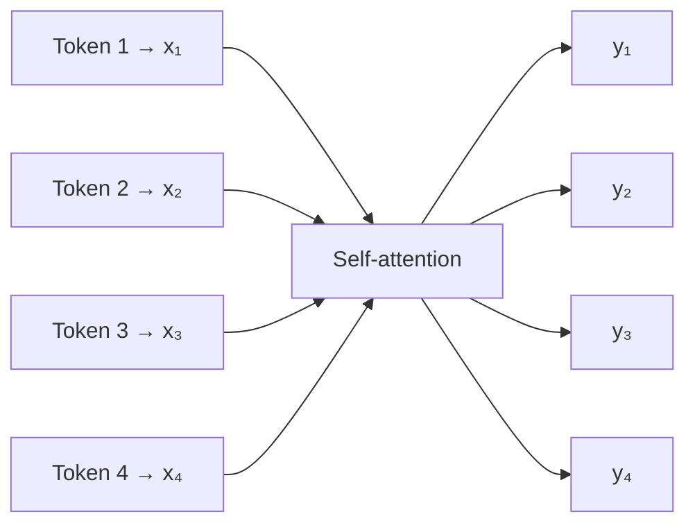
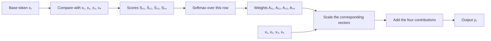
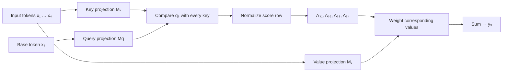
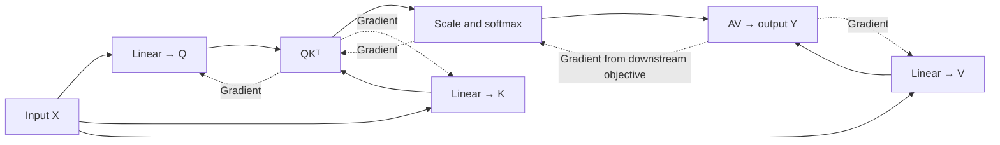

# 🔎 Class 5: Transformers 101, Part 2 — Queries, Keys, Values, and Contextualized Vectors
### 📋 Production AI / LLM Engineering | Krish Naik Academy

**🎙️ Mentor:** Sourangshu Pal (Paul)  
**⏱️ Duration:** ~3 hours 46 minutes (3hr 45min 39s) | **📅 Session:** Day 5 (2 August 2026)

**Class recording:** [2 Aug Transformers 101](https://learn.krishnaikacademy.com/web/courses/6a16f8935e281281cd6b1128?chapter=6a6fb7c0c43020b1fd512819)  
**Primary transcript:** `GMT20260802-143040_Recording.cutfile.20260802213313073.transcript.vtt`  
**Companions:** the six-page whiteboard PDF `self2.pdf` and [Attention → Contextualized Vectors notebook](https://colab.research.google.com/drive/1jLgUqimlbbTc4xCDn28OjBG5w8K_M4Fy?usp=sharing)  
**Course resources and assignment:** [Transformers 101 Notion page](https://krishnaikacademy.notion.site/Transformers-101-3afeba9593d0804fa8e1e301f12ae2ff?pvs=25)

The transcript’s instructor turns are labeled “Krish Naik,” but participants address the lecturer as Paul. These notes use the course instructor’s name, Sourangshu Pal.

---

## 📰 Quick Updates

- The session began with a recap of the previous class’s self-attention intuition, then introduced **query/key/value projections** and demonstrated them in NumPy and PyTorch.
- A course hackathon announcement was shared for interested participants. The transcript does not preserve a usable announcement URL.
- Discord was designated the main channel for discussion, paper drops, and model drops. The course dashboard links to Notion, where the whiteboard notes and notebook were added.
- Loop engineering and graph engineering were mentioned as additions for the later agentic portion of the course, not as topics taught today.
- A practical assignment was set: replace the notebook’s initial embeddings with **GloVe or Word2Vec**, examine cosine similarities, and share a viewable Colab link with the instructor.
- Multi-head attention received a **brief preview and a one-head library demonstration**. Its detailed explanation and the full Transformer architecture were deferred to the following week.

The notebook contains untrained embeddings and untrained projection matrices. Its numerical examples demonstrate how the mechanism works; they do not establish that every output vector has better semantic meaning.

---

## 🧭 The Goal: Give Each Token Information About Its Context

Paul started with a simple question: how can a vector for one word incorporate information about the other words in its sentence?

A static lookup assigns a vector to a word. If the same lookup table is used twice, the word **bank** starts with the same vector in both:

- “bank of the river”
- “bank account has money”

The surrounding words differ, so the desired representation should reflect a different context. Attention provides a way to create an output for each token by combining information from the sequence.

The first whiteboard page shows four token vectors entering one self-attention block and four vectors emerging. The diagram below preserves that structure:



*Based on the token-to-vector-to-attention sketch in self2.pdf, page 1.*

There is still one output per input position. This operation does not automatically reduce the sentence to one vector. Each output is a new token representation.

Paul’s repeated phrase was that the outputs are **more contextualized**: their calculation depends on other tokens. Whether that context improves a particular task also depends on learned parameters, the training objective, and evaluation.

### Vectorization comes before the attention calculation

The class deliberately separated “convert words to numbers” from “use a sophisticated embedding model.” To study the mechanics, numbers can come from a random lookup table or an untrained embedding layer. Pretrained Word2Vec or GloVe vectors can be substituted later.

One-hot encoding and TF-IDF were mentioned as other numerical representations. Their properties differ from dense learned embeddings, but all serve the broader purpose of representing text numerically.

This matters for reading the example: the calculation is valid on the toy numbers even when those numbers have not learned a linguistic relationship.

---

## 📚 Vocabulary Size, Sequence Length, and Embedding Width

A substantial live discussion concerned dimensions. Keeping three quantities separate resolves the confusion:

| Quantity | Meaning | Notebook example |
|---|---|---|
| Vocabulary size | Number of entries in the lookup table | 8 |
| Sequence length | Number of tokens in the current sentence | 4 |
| Embedding width, d_model | Number of numeric features for each token | 8 |

The vocabulary contains **bank, of, the, river, account, money, has, today**. Only four of these occur in the first sentence.

The example happens to use eight vocabulary entries and eight features per vector. **Those two eights are independent choices.** Raising the embedding width to 16 does not require a vocabulary with 16 words.

A dense embedding table has shape **vocabulary size × embedding width**. Looking up four tokens gives a matrix with shape **4 × embedding width**. PyTorch names the two independent constructor arguments `num_embeddings` and `embedding_dim`. [Embedding reference](https://docs.pytorch.org/docs/2.14/generated/torch.nn.Embedding.html)

### Why one-hot encoding can create confusion

A one-hot vector over a vocabulary has one coordinate per vocabulary entry. Its width therefore equals the vocabulary size.

Dense embeddings do not follow that rule. A vocabulary of 10,000 words can have a 300-feature vector per word. Sauvik’s later question used exactly this separation: a 10,000-word vocabulary with a 300-dimensional representation is compatible with projections that consume 300 input features.

The statement is not a difference between “old” and “new” NLP. Word2Vec and GloVe also use dense widths chosen separately from vocabulary size. The GloVe project, for example, publishes different vector widths for the same vocabulary. [GloVe project](https://nlp.stanford.edu/projects/glove/)

### What the code actually stacks

The notebook’s `np.stack` collects four individual token vectors into **X**, a matrix with shape **(4, 8)**. It does not merge their information or create a single pooled sentence embedding at this step.

The number of rows follows the sentence; the number of columns follows the embedding width. This distinction is the basis for every later shape check.

---

## 🔄 Recapping the Parameter-Free Attention Intuition

The first part revisited the previous class’s simplified calculation. For each token, compare it with all tokens, turn its scores into normalized weights, and use those weights to combine the token vectors.

Paul changed the notation from the previous session’s `W` to **S** and **A**, because students had confused attention weights with trainable neural-network weights:

- **Sᵢⱼ:** an unnormalized compatibility score for token i attending to token j.
- **Aᵢⱼ:** the normalized attention weight obtained from those scores.
- **yᵢ:** the output created from the weighted combination.

These are different stages of the computation.

### Four tokens produce sixteen scalar scores

With four inputs, each token compares with all four. The score matrix therefore has shape **4 × 4** and contains sixteen scalar entries.

For a pair of vectors, the inner product gives **one scalar**. Stacking many vectors into matrices and multiplying the appropriate matrices gives **a matrix of pairwise scalar scores**.

This was an important live clarification: Ayesha/Ayush and Sauvik questioned the use of “vector” for the intermediate result. Paul later explicitly distinguished a vector dot product from a matrix product.

| Operation | Result |
|---|---|
| Inner product of two equal-length vectors | One scalar score |
| Elementwise multiplication of two equal-length vectors | A vector of products |
| Q @ K.T for token matrices | A matrix of pairwise scores |
| Scalar attention weight × a value vector | A scaled vector |
| Sum of scaled value vectors | One output vector |

An elementwise product is not the same as an inner product. The inner product includes summation over the feature dimension.

### Normalize a row, then form one output

For token 1, the simplified output is:

**y₁ = A₁₁x₁ + A₁₂x₂ + A₁₃x₃ + A₁₄x₄**

The same process applies to token 2, token 3, and token 4. A complete matrix implementation performs these calculations together.



*Based on the score, normalization, and weighted-sum sketches across self2.pdf, pages 1–3.*

The weight assigned to a token is not necessarily largest when it attends to itself. In the projected example, relevance depends on different query and key representations; the notebook’s own rows demonstrate that another token can receive the largest weight.

### Four properties from the recap, stated precisely

Paul summarized the earlier toy system as requiring no training, not depending directly on proximity or order, and being shape-independent.

For this session’s **parameter-free toy calculation**, that means:

- It has no newly introduced projection parameters to optimize.
- Every token can directly compare with every other token.
- No explicit distance or position information is supplied.
- The same calculation can be applied to different sequence lengths, provided the feature widths and operations remain compatible.

Standard Transformer self-attention **is trainable**. The earlier property described the simplified starting point, not all self-attention mechanisms.

Without positions or masks, reordering the input tokens reorders corresponding outputs rather than teaching the operation their original order. Positional encoding was identified as the future solution for injecting order information. Its implementation was deferred.

---

## 🔑 Queries, Keys, and Values: Three Roles for the Same Input

Paul first introduced Q, K, and V as names for three roles in the calculation, then made those roles trainable with projections.

### Query: the token requesting information

In the whiteboard example, **token 3** was selected as the base token. Its query is compared with all keys to decide how strongly its output should use each value.

Selecting token 3 was a drawing convenience. In the full calculation, every token produces a query and receives its own output.

### Key: the representation used for matching

Each token contributes a key. Query–key compatibility determines the attention scores.

The database analogy gives intuition: a query is matched against keys. The calculation is a soft numerical matching operation, not a database lookup that selects only one exact record.

### Value: the information that can be passed onward

Each token also contributes a value. After computing the attention weights, the output combines those values.

The query and key decide **how much to use**; the value supplies **what gets combined**. That separation explains why a value projection is useful.

In self-attention, all three originate from the **same input sequence**, but their projections generally differ. Q, K, and V are not three unrelated sentences, nor are they generated one after another as a pipeline Q → K → V.

The following diagram translates the single-query drawing in the PDF:



*Based on self2.pdf, pages 4–5. The base token is x₃ here; the full computation repeats the role for all positions.*

### Values exist before they are aggregated

Phani and Ranjeev both asked why V is calculated from the original input when the drawing shows value contributions near the end.

There are **two distinct operations**:

1. Create the projected values: **V = XWᵥ**.
2. Aggregate those values using the normalized attention weights: **Y = AV**.

The second operation depends on the attention weights. The first does not. The arrows near the end of the diagram represent using values in the weighted sum, not generating values from A.

---

## 🧱 Making the Block Trainable With Projection Matrices

The original toy calculation reused the token vectors directly. Paul introduced matrices **Mₖ, Mq, Mᵥ**, later written in code as **W_k, W_q, W_v**, to create trainable transformations.

Using row-oriented token vectors:

**Q = XW_q**  
**K = XW_k**  
**V = XW_v**

The same query matrix is applied across the tokens, and likewise for the key and value matrices. There is not a separate independent W_q for each vocabulary word.

### Linear layers supply parameters

In PyTorch, the class implemented these projections as three `nn.Linear` modules. The modules hold parameters and provide the corresponding linear transformations.

A linear layer can change feature width; a square matrix is only one case. Paul used square projections to keep the example easy to inspect:

**(1 × 8) @ (8 × 8) → (1 × 8)**

For the whole four-token sentence:

**(4 × 8) @ (8 × 8) → (4 × 8)**

More generally, an input width d_model can be projected to d_k for queries/keys or d_v for values. Query and key feature widths must match for their dot product. The final weighted-sum width follows the value width.

The individual scores do **not** retain the embedding width: they are scalars, and the full score matrix is sequence length × sequence length.

### A layer is not its activation

The notes on the PDF use “hidden,” “linear,” “fully connected,” and “dense” together to identify the projection layer. Here, dense/fully connected describes the kind of transformation. A hidden layer is a layer’s position in a network, not a guarantee that it is linear.

`nn.Linear` applies an affine transformation and does not insert ReLU automatically. The notebook set `bias=False`, so the demonstrated Q/K/V projections have no additive bias. [Linear reference](https://docs.pytorch.org/docs/2.14/generated/torch.nn.Linear.html)

The attention computation still has nonlinearity through softmax. A separate activation after every projection is not a condition for making its parameters trainable.

### What training would change

The gradient arrows on PDF page 5 show information flowing backward through the normalized scores and the value aggregation toward the projection layers.



*Based on the forward arrows and backward gradient arrows in self2.pdf, page 5. Scaling is shown because it is used by the accompanying notebook.*

The parameter values would be learned under a task objective, such as a loss for named-entity recognition or question answering. Dimensions and head count are **hyperparameters**; numerical projection weights are **parameters**.

The session explained this possibility but did **not train the attention block**. It supplied no complete task dataset, target labels, optimizer loop, or loss-driven update in the demonstrated attention notebook.

---

## 🧮 NumPy Walkthrough: Build X, Q, K, and V

Paul then moved from the whiteboard to the supplied notebook. NumPy was used to expose the operations directly before replacing them with PyTorch layers.

### Create one reproducible vector per vocabulary entry

The notebook begins with a four-word sentence and a small d_model of eight. It builds the lookup table with this actual code:

```python
def build_embeddings(vocab_words, d_model, seed=0):
    # Toy embedding table: one random vector per unique word.
    # Shape returned: (len(vocab_words), d_model)
    rng = np.random.default_rng(seed)
    vocab = sorted(set(vocab_words))
    table = {w: rng.normal(size=d_model) for w in vocab}
    return table
```

*Source: supplied attention notebook, cell 4.*

The set removes duplicate vocabulary entries, sorting makes the order stable, and each word receives a random vector. The sentence is lowercased when looking up its entries.

The output X has shape **(4, 8)**. The vocabulary can contain words absent from this sentence; those unused entries do not create extra rows in X.

The seeds are used for reproducibility. Importantly, the explicit generators are initialized with their own seeds; a global NumPy seed and the generator’s seed are distinct settings.

### Initialize three projection matrices

```python
d_k = d_model  # keep same dim for simplicity (common choice for single-head)

rng = np.random.default_rng(1)
W_q = rng.normal(scale=0.5, size=(d_model, d_k))
W_k = rng.normal(scale=0.5, size=(d_model, d_k))
W_v = rng.normal(scale=0.5, size=(d_model, d_k))

Q = X @ W_q   # (seq_len, d_k)
K = X @ W_k   # (seq_len, d_k)
V = X @ W_v   # (seq_len, d_k)
```

*Source: supplied attention notebook, cell 6.*

The `@` operator performs matrix multiplication. In this example, each projection matrix is **(8, 8)**, and each projected token matrix is **(4, 8)**.

The `normal` call samples from a Gaussian distribution. **`scale=0.5` is the distribution’s standard deviation**, not a min/max normalization step applied after sampling. [NumPy normal generator](https://numpy.org/doc/stable/reference/random/generated/numpy.random.Generator.normal.html)

Although the values are stored in matrices corresponding to trainable projections, NumPy does not train them here. They remain fixed sampled numbers during the demonstrations.

### Read shapes at every stage

Paul repeatedly asked participants to inspect printed values. A useful shape check should answer:

- Which axis indexes tokens?
- Which axis indexes features?
- Is this a parameter matrix or a representation matrix?
- Does the operation’s inner dimension match?
- Is the result a token vector, a scalar score, or all pairwise scores?

These checks are more reliable than inferring shape from a label such as “embedding,” “vector,” or “weight.”

---

## ⚖️ Scores, Scaling, and Row-Wise Softmax

The single-head calculation implemented in class is:

**scores = QKᵀ / √d_k**  
**A = softmax(scores), across each row**  
**Y = AV**

For the four-token example, Q is **4 × 8**, Kᵀ is **8 × 4**, and the score matrix is therefore **4 × 4**.

### Why transpose K?

Each row of Q is one query. Each row of K is one key. Transposing K aligns the feature dimension for multiplication, so the product contains one query–key comparison for every pair of token positions.

Row i corresponds to the **query token**; column j corresponds to the **key token it attends to**. Different query and key projections also mean the resulting score matrix need not be symmetric.

### Why divide by √d_k?

The live explanation described scaling as helpful for stable training and left a fuller paper discussion for later. The paper’s rationale is more specific: dot products tend to grow in magnitude as query/key width increases, which can push softmax into regions with very small gradients. Dividing by the square root of the key width counteracts that growth. [Attention Is All You Need, section 3.2.1](https://arxiv.org/html/1706.03762v7)

This scale factor is separate from the random generator’s standard deviation. It also is not the step that makes the attention weights sum to one; **softmax** performs that normalization.

### One softmax step, not normalization followed by softmax

Several questions treated “normalization” and “softmax” as two operations. Paul clarified that in this diagram the normalization box is implemented **by softmax**.

For each score row, softmax produces nonnegative weights adding to one. A min/max scaler or standard scaler is not an interchangeable substitute merely because it is also called normalization.

The exact notebook function is:

```python
def softmax(x, axis=-1):
    x = x - np.max(x, axis=axis, keepdims=True)
    e = np.exp(x)
    return e / np.sum(e, axis=axis, keepdims=True)

scores = Q @ K.T / np.sqrt(d_k)          # (seq_len, seq_len)
attn_weights = softmax(scores, axis=-1)  # (seq_len, seq_len), rows sum to 1
```

*Source: supplied attention notebook, cell 8.*

Subtracting the row maximum improves numerical stability without changing the mathematical softmax result. The last axis contains the keys for a given query, so `axis=-1` normalizes over that axis.

The PDF’s handwritten probability example illustrates the sum-to-one property. Its chosen values are illustrative, rather than an exact numerical softmax calculation for the written input list.

### Read the recorded attention matrix correctly

The supplied notebook records:

| Query ↓ / attends to → | Bank | of | the | river |
|---|---:|---:|---:|---:|
| Bank | 0.215 | 0.251 | 0.388 | 0.145 |
| of | 0.074 | 0.255 | 0.161 | 0.509 |
| the | 0.004 | 0.129 | 0.029 | 0.838 |
| river | 0.071 | 0.223 | 0.450 | 0.256 |

The notebook prints unrounded row sums of **1.0**. The displayed three-decimal entries can sum slightly differently because of rounding.

The heatmap shows this same matrix: the vertical axis is the query and the horizontal axis is the token attended to. It is a visualization of the calculation, not a separate model.

For Bank, the largest recorded weight is on **the**, not river or Bank itself. With random untrained projections, the weights should not be read as reliable linguistic relevance.

---

## 🧩 Compute the Outputs: Project Values, Then Mix Them

The final matrix multiplication is:

```python
Y = attn_weights @ V   # (seq_len, d_k)  <-- this is y1, y2, y3, y4 stacked
```

*Source: supplied attention notebook, cell 11.*

The attention matrix is **4 × 4** and V is **4 × 8**, so Y is **4 × 8**.

For one token:

**yᵢ = Aᵢ₁v₁ + Aᵢ₂v₂ + Aᵢ₃v₃ + Aᵢ₄v₄**

Each A entry is a scalar that scales a value vector. Adding those contributions gives an eight-feature output.

### Raw input vectors versus projected values

The earlier whiteboard recap mixed the raw vectors directly. The notebook makes the distinction explicit:

- **General projected calculation:** Y = AV, where V = XW_v.
- **Literal simplified formula:** Y_literal = AX.

The simplified version corresponds to using the original representations as values, or an identity value projection. It is helpful intuition but should not obscure the learned V projection in the implemented block.

### Matrix multiplication equals the expanded weighted sum

The notebook verifies the simplified first output both ways:

```python
Y_literal = attn_weights @ X   # exactly y_i = sum_j w_ij * x_j, matching the image

y1_manual = (attn_weights[0,0]*X[0] + attn_weights[0,1]*X[1]
             + attn_weights[0,2]*X[2] + attn_weights[0,3]*X[3])
```

*Source: supplied attention notebook, cell 13.*

The recorded first three values are **[0.3247, 0.5943, 0.2543]** for both forms, and `np.allclose` returns **True**.

This equality check compares the manual formula with the corresponding matrix formula. It does not say AX and AV are equal for an arbitrary W_v.

Also, `allclose` checks elementwise agreement **within a tolerance**, rather than exact bit-for-bit equality. [NumPy allclose](https://numpy.org/doc/stable/reference/generated/numpy.allclose.html)

### Parallelizable does not mean dependency-free

All queries can be processed together through matrix operations, making the implementation suitable for efficient tensor computation. Q, K, and V projections can be formed from the same input.

The later operations still depend on earlier results: scores need Q/K, softmax needs scores, and the weighted sum needs weights/V. Matrix parallelism does not erase those dependencies.

---

## 🏦 The “Bank” Experiment: Context Dependence Versus Semantic Quality

The next part asked whether the new vectors were better than the starting vectors. Paul used cosine similarity and two sentences to inspect this quantitatively.

For nonzero vectors, cosine similarity ranges from **−1 to 1**. A value of one indicates the same direction; it is not a general “probability of matching meaning.”

The supplied function is:

```python
def cosine(a, b):
    return float(a @ b / (np.linalg.norm(a) * np.linalg.norm(b)))
```

*Source: supplied attention notebook, cell 15.*

### The first comparison does not show an improvement

The recorded outputs are:

| Comparison | Recorded cosine |
|---|---:|
| Raw x_bank versus raw x_river | −0.5045 |
| Projected/contextual y_bank versus raw x_river | −0.6063 |

The second value is **lower**, so this particular output does not support a claim that Bank moved closer to river.

There is an additional interpretive issue: y_bank has passed through a value projection, while x_river is in the original input space. Equal vector lengths do not establish that their coordinate systems preserve semantic cosine comparisons.

Paul noted that random numbers did not provide learned relationships and turned this limitation into the homework. The appropriate takeaway is to inspect the actual evidence rather than accept a surrounding claim of improvement. Some notebook narrative labels describe the intended effect more strongly than these recorded numbers support.

### The two-sentence comparison isolates context dependence

The reusable function uses the same embedding table and projection matrices for both sentences:

```python
def attention(sentence_words, embedding_table, W_q, W_k, W_v):
    X = np.stack([embedding_table[w.lower()] for w in sentence_words])
    Q, K, V = X @ W_q, X @ W_k, X @ W_v
    scores = Q @ K.T / np.sqrt(W_q.shape[1])
    weights = softmax(scores, axis=-1)
    Y = weights @ V
    return X, Y, weights
```

*Source: supplied attention notebook, cell 18.*

The recorded comparison of the first token, bank, is:

| Check | Recorded result |
|---|---|
| Raw bank vectors equal across the sentences? | True |
| Cosine between the raw bank vectors | 1.0 |
| Contextual bank vectors equal across the sentences? | False |
| Cosine between contextual bank vectors | 0.3625 |

The raw similarity of **1.0 is expected**: both sentences retrieve the same word entry from the same table. This would also happen with a shared static Word2Vec or GloVe lookup, not only with random numbers.

The contextual vectors differ because their weights and value mixtures depend on different surrounding tokens. That is evidence of **context dependence**.

It is not by itself proof that the block has correctly separated two meanings. An untrained random transformation can also change outputs when inputs change.

### The additional recorded similarities reveal the limitation

The notebook also records:

| Contextual bank vector | Similarity to raw river | Similarity to raw money |
|---|---:|---:|
| From “bank of the river” | −0.6063 | 0.6502 |
| From “bank account has money” | −0.2282 | 0.3902 |

The river-context output is more similar to raw money than raw river under this calculation. The plotted bars visualize those values; their title should not be treated as proof that each output has moved toward the intended meaning.

The useful experiment separates three questions:

1. **Does attention change a token’s output when context changes?** Yes, this example demonstrates that.
2. **Do the inputs already carry trained linguistic relationships?** Not in the random lookup version.
3. **Do the attention projections improve a semantic task?** No training or task evaluation here establishes that.

Replacing embeddings with pretrained vectors addresses the second question. Untrained projection matrices remain a limitation for the third.

---

## 🔥 PyTorch: The Same Calculation With Trainable Modules

Paul repeated the calculation using an embedding layer and linear layers. This version makes the parameters available to PyTorch’s training machinery while keeping the same operations visible.

The supplied notebook defines the vocabulary mapping and lookup as follows:

```python
vocab = ["bank", "of", "the", "river", "account", "money", "has", "today"]
word2idx = {w: i for i, w in enumerate(vocab)}

d_model = 8
embedding = nn.Embedding(num_embeddings=len(vocab), embedding_dim=d_model)

sentence = ["bank", "of", "the", "river"]
idx = torch.tensor([word2idx[w] for w in sentence])   # shape: (seq_len,)
X = embedding(idx)                                     # shape: (seq_len, d_model)
```

*Source: supplied attention notebook, cell 23. The preceding lines import torch/nn/F and set torch.manual_seed(0).*

The integer IDs select rows from the lookup table; they are not themselves the final embedding features. The result has shape **(4, 8)**.

A newly created `nn.Embedding` is a trainable lookup table with randomly initialized values. Using that layer does not automatically give the toy words better learned meanings than the NumPy random table. Pretrained state or training is needed for that claim. [Embedding reference](https://docs.pytorch.org/docs/2.14/generated/torch.nn.Embedding.html)

### Three linear projections

```python
d_k = d_model

W_q = nn.Linear(d_model, d_k, bias=False)
W_k = nn.Linear(d_model, d_k, bias=False)
W_v = nn.Linear(d_model, d_k, bias=False)

Q = W_q(X)   # (seq_len, d_k)
K = W_k(X)   # (seq_len, d_k)
V = W_v(X)   # (seq_len, d_k)

scores = Q @ K.T / (d_k ** 0.5)          # (seq_len, seq_len)
attn_weights = F.softmax(scores, dim=-1)  # rows sum to 1
Y = attn_weights @ V                      # (seq_len, d_k)  <- y1..y4 stacked
```

*Source: supplied attention notebook, cell 24.*

Here, `W_q` names a **module**, whereas the NumPy version’s `W_q` names a numerical array. Calling the module on X applies its stored transformation. The meaning of the variable follows the code context.

`F` is the alias for `torch.nn.functional`, used here for softmax. The exponent **0.5** computes the same square-root scaling as the NumPy version.

The printed shapes again are:

- Q, K, V: **(4, 8)**
- attention weights: **(4, 4)**
- Y: **(4, 8)**

The values differ from the NumPy run because the parameter initializations differ. Equivalent algorithms do not require independently initialized runs to produce identical numbers.

### The second bank comparison

Using the same embedding and projection modules for both sentences, the PyTorch example records:

- raw bank vectors equal: **True**;
- cosine between the two contextual bank outputs: **0.814038…**.

The same limitation applies: outputs depend on context, but a high or low cosine from untrained parameters is not a validated measure of sense disambiguation.

The function in this notebook uses the input width in its denominator because d_k equals d_model in the demonstrated configuration. If changing projection widths, the scale should continue to follow the **query/key width**.

---

## 🧰 A Library Demonstration: One-Head MultiheadAttention

The class showed PyTorch’s built-in module after the manual implementation:

```python
mha = nn.MultiheadAttention(embed_dim=d_model, num_heads=1, bias=False, batch_first=True)

X_batched = X.unsqueeze(0)   # (batch=1, seq_len, d_model) - nn.MultiheadAttention wants a batch dim
Y_mha, attn_weights_mha = mha(X_batched, X_batched, X_batched)  # self-attention: Q=K=V=X
```

*Source: supplied attention notebook, cell 26. The comment reflects the notebook’s chosen batched example; the API also supports unbatched inputs.*

The recorded shapes are:

| Quantity | Shape |
|---|---|
| Input X_batched | (1, 4, 8) |
| Output Y_mha | (1, 4, 8) |
| Returned attention weights | (1, 4, 4) |

The leading one is the **batch size**, not the number of heads or tokens. `unsqueeze(0)` adds that axis; it does not flatten the sentence.

With `batch_first=True`, batched input follows **batch, sequence, features**. Batch size and head count are independent. [MultiheadAttention reference](https://docs.pytorch.org/docs/2.14/generated/torch.nn.MultiheadAttention.html)

### Why pass X three times?

For this self-attention call, query, key, and value input come from the same sequence. The module applies its internal projections. Passing the same tensor does not mean its internal projected Q, K, and V must be identical.

The MHA module is an independent demonstration. Later comparison cells use the manually defined W_q/W_k/W_v modules, not Y_mha.

### Built-in output is not automatically the manual output

The built-in module has independently initialized parameters and includes an **output projection** after combining heads. Even with one head, numerical equality with the preceding manual **AV** output should not be expected without matching the parameters and accounting for that projection.

The notebook calls the examples architecturally equivalent to convey the attention pattern. For an exact equivalence check, the full parameterization matters.

### A batching detail to carry forward

The hand-written examples use two-dimensional matrices. They should not be made batched merely by changing X to three dimensions and leaving every `.T` unchanged.

For a higher-rank NumPy array, a plain transpose reverses all axes by default. Batched attention needs the **last two key axes** swapped while preserving the batch axis. The rest of the broadcasting and matrix shapes must agree. [NumPy transpose reference](https://numpy.org/doc/stable/reference/generated/numpy.transpose.html)

This is a practical clarification to the notebook’s concluding shape note, not an additional batched implementation taught in class.

---

## 👥 Multi-Head Attention: What Was Previewed, What Was Deferred

Near the end, Paul drew multiple parallel linear representations and introduced **head count** as a hyperparameter. The final whiteboard page sketches four parallel heads.

The intended intuition is that several attention calculations can run in parallel using different learned projections. **A head is a complete attention path**, including Q/K/V and the score/weight/value calculation; it is not simply any extra linear layer.

Four stacked attention blocks also are not the same as four heads. Stacking refers to depth; multiple heads operate in parallel within a block.

The session did not fully derive head splitting, concatenation, and the output projection. Those were for the next class.

### Choosing head count

Paul mentioned common choices such as 8, 16, and 32 and emphasized experimentation. Powers of two are conventions, not a universal head-count rule.

The original paper’s base configuration used eight heads. In PyTorch’s standard MHA arrangement, the model width is divided across the heads, so choose a head count compatible with that width. [Attention Is All You Need](https://arxiv.org/html/1706.03762v7), [MultiheadAttention reference](https://docs.pytorch.org/docs/2.14/generated/torch.nn.MultiheadAttention.html)

More heads do not automatically mean a proportionate increase in parameters or cost when total model width is held fixed. The actual width, sequence length, implementation, and configuration matter.

### What to learn before changing a pretrained model

Debajyoti asked where this granularity becomes useful in real projects. Paul’s answer was that application projects often consume the whole model, while model work may require understanding or modifying its internal blocks.

Changing the number of heads in a pretrained model is an architecture change, not merely a routine fine-tuning setting. Check how its parameters and operations will remain compatible; unfreezing layers alone does not solve every such change.

This class provides the mechanics needed to reason about those decisions. It does not supply a complete recipe for changing an existing model’s architecture.

---

## 🧪 Assignment: Replace the Initial Embeddings and Examine the Evidence

The assignment was recorded both in the live discussion and on the course Notion page:

1. Start from the shared attention notebook.
2. Replace the random/untrained initial embedding source with **GloVe or Word2Vec**.
3. Run the attention calculation and inspect the cosine similarities.
4. Share a **Google Colab view link** with the instructor at **app@krishnaik.in**.

This is the instructor’s submission instruction. These notes do not perform the assignment or send anything.

Paul asked participants to retain the rest of the experiment. That means preserve the conceptual pipeline while updating dimensional dependencies where necessary. If the selected pretrained vectors have width 300, the input/projection shapes must consume that width; leaving hard-coded eights throughout is not compatible.

### What to record for a useful submission

- The embedding source and actual vector width.
- Whether each toy vocabulary word is present in that source.
- The shapes of X, projection matrices, Q/K/V, scores, A, and Y.
- The attention matrix and its row sums.
- The raw bank comparison across the two sentences.
- The contextual bank comparison and the other cosine checks.
- Which parameters remain untrained.

The raw bank vectors should still be identical across contexts when they come from a shared static lookup. Pretrained static word vectors supply better starting relationships, but the remaining random attention projections do not guarantee a semantic improvement.

Report the actual results, including a result that conflicts with the expected narrative. The point of the exercise is to inspect how the representation behaves, not force a similarity to a predetermined value.

---

## 🗺️ What's Next

Paul said the following week would cover **multi-head attention in detail**, followed by the **Attention Is All You Need paper** and construction of the full Transformer architecture.

Positional encoding had been identified as the mechanism for adding order information, but its details were not implemented in this session.

For revision, he recommended spending regular daily time on the notebook and foundational material. Books mentioned included **Hands-On Large Language Models** and **Build a Large Language Model (From Scratch)** by Sebastian Raschka. The discussion also referred to 3Blue1Brown’s neural-network material and deep-learning refresher lectures.

The prerequisites he emphasized were matrix operations, shapes, activation functions, optimizers, and the broad training process. A complete CNN revision was not required for this immediate attention topic.

---

## 💬 Live Q&A Highlights

The table covers the full transcript, including all substantive speakers in the final two parts and their follow-ups. Similar in-flow doubts are combined.

| Question | Answer |
|---|---|
| **Ayesha/Ayush / Sauvik: Does a vector dot product return a scalar?** | Yes. Each pairwise inner product gives one score; multiplying the stacked token matrices gives a matrix of those scores. Elementwise multiplication is a different operation. |
| **Chat: Where does A come from S?** | A is the row-wise softmax of the score matrix. The diagram’s normalization box is implemented by softmax, not by a second separate scaler. |
| **Manan: How are weights introduced?** | The Q/K/V projections add parameter matrices. PyTorch linear layers store and apply them; attention weights computed for an input are different from those persistent parameters. |
| **Athira: What dimensions should the linear layers have?** | Match their input width to the embeddings and choose compatible output widths. The demo keeps widths at eight; score-matrix axes instead follow sequence length. |
| **Athira: What do projection weights learn?** | Under task training, gradients would change them to improve the objective. The session’s demonstration did not perform that learning. |
| **Ayush Mishra / Rushi: Why linear projections, and where is nonlinearity?** | Linear layers implement the projections; softmax is nonlinear. The class did not add an activation after each Q/K/V layer. |
| **Shivam / Subrahmanyam: Why is only V3 shown as the query?** | It is the chosen example token in the drawing. Every position supplies a query in the full matrix calculation. |
| **Ashwa / Sai Kiran / Swati Gupta: Who initializes the matrices?** | Initialization provides starting values. NumPy samples them explicitly here; PyTorch modules initialize their own parameters unless configured otherwise. |
| **Thomas: How is this parallelized?** | Matrix operations compute many token comparisons together. Later stages still depend on earlier results; parallelism does not remove the score→softmax→aggregation chain. |
| **Subhash: Why dot product rather than another comparison?** | It is the compatibility function used by this calculation and supports efficient matrix operations. Other attention formulations exist; this class implements scaled dot-product attention. |
| **Aryan Parekh: Which side is the query?** | The base token seeking information supplies the query. The row of QKᵀ represents that query compared with all keys. |
| **Shiv Prakash: Why three matrices; can one matrix do it?** | The standard roles have distinct projections. They can be combined in a larger packed projection that still produces distinct Q/K/V representations. [PyTorch packed projections](https://docs.pytorch.org/tutorials/intermediate/transformer_building_blocks.html) |
| **S Anoop: What is the V1…VN column at the left?** | It denotes the collection of input token vectors feeding the block, not another learned matrix or an additional layer. |
| **Nithin: Can we derive the full backward pass by hand?** | Paul recommended starting with a smaller network/example because a full attention derivative is lengthy. No complete attention backward derivation was performed. |
| **Bhavani Shankar: What is NER above the stacked block?** | Named-entity recognition was an example downstream NLP task. QA and other objectives were also mentioned; no task head was implemented. |
| **Phani Kulkarni: Why are values connected to the initial input if used later?** | V is projected from the same original input. Its later use is the separate weighted aggregation AV. |
| **Chat: Does d_model have to equal vocabulary size?** | No. The toy example has eight entries and width eight by choice. Dense embedding width is independent of vocabulary size; one-hot width follows the vocabulary. |
| **Chat: Why is the score shape 4 × 4 rather than 4 × 8?** | Each query is compared with four keys. The feature dimension is summed out in each dot product, producing sixteen scalar scores. |
| **Pradhav: Is normalization done before softmax as another step?** | No additional min/max or standard scaling occurs in that box. The scores are scaled by √d_k, then row-wise softmax provides the normalized weights. |
| **Ankit / CS: Should the numerical weights show obvious word relationships or self-attention dominance?** | Not with the untrained random parameters used here. A token need not assign itself the largest attention weight. |
| **Nithin: Y_literal versus Y_manual?** | They compute the same raw-vector weighted sum, once by matrix multiplication and once by spelling out the terms. allclose confirms approximate numerical agreement. |
| **Vidyasagar: What changes if the embedding width changes?** | Adapt the projections and other dimensional dependencies. Width and vocabulary size are separate; the hard-coded demo widths are not a universal rule. |
| **Kalyan Rad: Does a smaller cross-context cosine show attention brings meaning?** | It shows that output representations changed with context. Untrained weights and the contradictory recorded similarities prevent treating this alone as proven semantic improvement. |
| **Gaurav Garg: Why Q/K/V, and could there be fourth/fifth representations?** | These are the conventional roles in the attention mechanism being taught. Renaming them does not change the algorithm; additional architectural components would need their own definition. |
| **Gaurav: Is this already in PyTorch, and why break it down?** | Yes, built-in modules exist. The manual breakdown explains the mechanics before later work uses higher-level functions. |
| **sridhar k: Are the matrices hyperparameters?** | Their numerical values are learned parameters. Their sizes, the architecture, and head count are hyperparameters selected as part of model design. |
| **sridhar: Does cosine around 0.8 imply river and money are related?** | It indicates geometric closeness under this particular untrained calculation, not a reliable linguistic relationship. The assignment asks for a more meaningful embedding source. |
| **Debajyoti Mukhopadhyay: Where does this help beyond an API/RAG project?** | Whole models are commonly consumed in applications. Internal knowledge helps with model analysis, customization, and debugging; changing a pretrained architecture needs more than a simple fine-tuning switch. |
| **Sai Kiran Akula: NumPy or PyTorch—and was Pandas used?** | The examples used NumPy and PyTorch. NumPy exposes the operations; PyTorch supplies trainable modules and built-in implementations. Pandas was not part of this notebook. |
| **Sai Kiran: Is multi-head attention only for batching?** | No. Batch size counts sequences; heads are parallel attention paths. The added leading axis demonstrates batching independently of the one-head configuration. |
| **Sai Kiran: Should we focus on softmax and both frameworks?** | Understand the operation and shapes first, then how the libraries express them. This attention calculation specifically normalizes scores with softmax. |
| **Sauvik Chattopadhyay: With vocabulary 10,000 and width 300, do projections follow width?** | Yes. A token supplies 300 features, so the projection input width is 300. A square 300 × 300 projection is one valid choice, not a consequence of vocabulary size. |
| **LearnMath: Does the course lead to agentic or deep-learning work?** | Paul described coverage of LLM/NLP model work, fine-tuning, RAG, and agents. He also identified limits in GPU optimization and reinforcement-learning depth. |
| **LearnMath: How do job opportunities differ by location?** | Paul shared his observations about agent/RAG demand and model-engineering roles. These were class-time opinions, not a current job-market survey or guaranteed transition. |
| **Kalyan: Does the original paper specify head count?** | Yes, its base model used eight heads. That configuration is not a universal standard; choose compatible settings and evaluate them. |
| **Kalyan: What does forward-deployed engineering involve?** | The discussion emphasized solution architecture, latency, scalability, fault tolerance, integration with legacy systems, and the application lifecycle. Coverage depends on the actual role. |
| **Kalyan: What should I revise with limited time?** | Prioritize deep-learning foundations such as optimizers, activations, and matrix operations. Paul suggested a focused refresher rather than revisiting every CNN topic now. |
| **Kalyan: Which teaching resources should I use?** | Paul mentioned several lectures and books and advised using a resource whose explanation works for you. The core concepts matter more than a particular teacher. |
| **Kalyan: What value does dictation add to coding-agent work?** | Paul uses it for long explanations, examples, and frequent text entry. He said its usefulness depends on the amount and kind of typing in the workflow. |
| **Adithyan Ramesh: Is softmax in the paper or only a teaching choice?** | It is part of the scaled dot-product attention formula. The class’s normalization box corresponds to it. |
| **Adithyan: Why the square-root divisor?** | The explanation connects it to stable training; the paper specifies controlling dot-product magnitude so softmax gradients do not become extremely small. |
| **Adithyan: Which math/video prerequisites help?** | Matrix multiplication, dimensions, and activation functions were emphasized. The 3Blue1Brown channel was mentioned; a precise video URL was not retained in the transcript. |
| **Ranjeev Tiwari: Should V be computed from attention weights instead of X?** | No. V = XW_v forms value representations; Y = AV then uses normalized weights to mix them. These two multiplications have distinct purposes. |
| **Narayan Jena: Will the course teach MLOps?** | Paul explicitly excluded general machine-learning operations, while stating that deployment related to LLM models and RAG/AI systems would be taught. |

AI learner was invited to speak but did not provide a substantive question. Requests for links, microphone checks, and dashboard navigation are represented in Quick Updates where useful.

---

## 🔑 Key Pointers to Remember

- Attention creates one context-dependent output per token; it does not automatically pool a sentence.
- Vocabulary size, sequence length, and embedding width are independent.
- A vector inner product yields one scalar; QKᵀ collects all pairwise scalar scores.
- Attention weights A are input-dependent outputs, not the persistent projection parameters.
- Q/K/V originate from the same sequence in self-attention but have different roles.
- The query requests information, keys support matching, and values supply content.
- The projection matrices are shared across token positions within a block.
- Values are projected before aggregation; the final operation is AV.
- Square projections preserve width in the demo; other compatible widths are possible.
- Projection weights are parameters; dimensions and head count are hyperparameters.
- scale=0.5 in the random generator is a standard deviation.
- √d_k scales compatibility scores; softmax makes each attention row sum to one.
- Normalize across the key dimension for each query.
- AX is the simplified raw-vector mixture; AV uses projected values.
- allclose checks tolerance-based agreement.
- A shared static bank lookup naturally has cosine one across the two sentences.
- A changed contextual vector proves context dependence, not automatic semantic quality.
- Newly created nn.Embedding and nn.Linear modules are untrained.
- Compare the numerical outputs with the claim being made; some notebook narrative labels overstate the recorded evidence.
- Batch size and head count are different concepts.
- Built-in MultiheadAttention has its own projections, including an output projection.
- Batched attention needs the correct key-axis transpose.
- Multi-head attention and the full Transformer architecture were deferred for fuller treatment.
- Replacing embeddings in the assignment requires updating incompatible hard-coded widths.

---

## ✅ Action Items After Class 5

- [ ] Reproduce the four-token X → Q/K/V → scores → softmax → Y calculation.
- [ ] Explain the difference between an inner product, elementwise multiplication, and matrix multiplication.
- [ ] Draw the single-query x₃ example from the whiteboard and identify its keys, weights, and values.
- [ ] Print every intermediate shape and identify its token/feature axes.
- [ ] Check the attention row sums and read the heatmap’s row/column meanings.
- [ ] Compare Y_literal with the manual first-row formula using allclose.
- [ ] Run both bank sentences with one shared table and the same projection parameters.
- [ ] Record the actual cosine results and separate context dependence from semantic improvement.
- [ ] Replace the embedding source with **GloVe or Word2Vec**, as assigned.
- [ ] Update d_model and projection shapes to the pretrained vector width.
- [ ] Note missing vocabulary entries and any preprocessing changes in the notebook.
- [ ] Inspect the PyTorch version and the independent one-head MHA example.
- [ ] Distinguish the added batch dimension from the number of heads.
- [ ] Prepare a **viewable Google Colab link** for the instructor’s requested submission to **app@krishnaik.in**.
- [ ] Review matrix operations, activation functions, optimizers, and training foundations before the next class.
- [ ] Continue with the detailed multi-head attention and Transformer-paper discussion next week.

---

*📝 Notes compiled from the full Class 5 transcript, all six pages of the accompanying self2.pdf, and all 29 cells of the supplied attention notebook — “2 Aug Transformers 101,” Production AI / LLM Engineering, Krish Naik Academy. Code excerpts and recorded numerical results come from that notebook. Mermaid diagrams translate the class’s actual whiteboard processes. Official documentation and the original paper clarify mathematical/API details and the limitations of the untrained experiment.*
