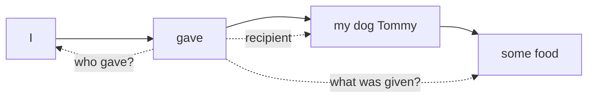
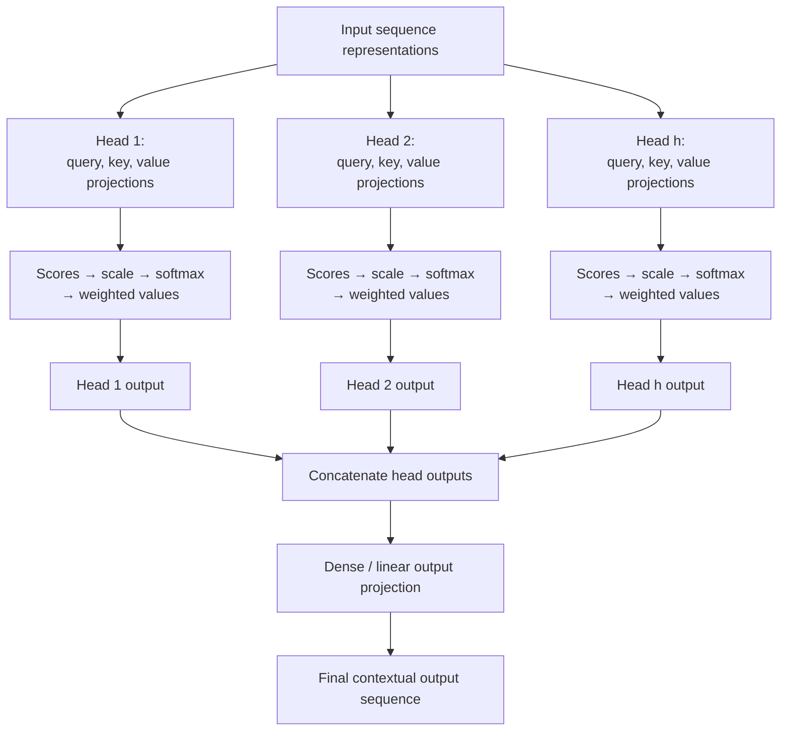
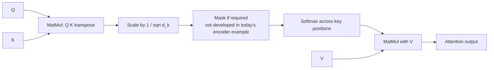
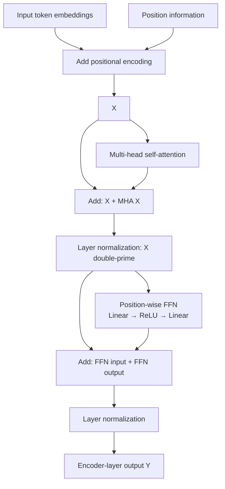
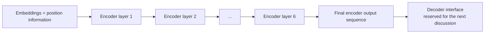

# 🎛️ Class 06: Multi-Head Attention and the Transformer Encoder
### 📋 Production AI / LLM Engineering | Krish Naik Academy

**🎙️ Mentor:** Sourangshu Pal (Paul in the transcript)  
**⏱️ Duration:** 4 hours 1 minute 50 seconds | **📅 Session:** Day 6 (8 August 2026)

**Class recording:** [8 Aug Transformers 101](https://learn.krishnaikacademy.com/web/courses/6a16f8935e281281cd6b1128?chapter=6a77978f4c8953aff8c50efa)

This class extends the previous query/key/value explanation into **multi-head attention**, connects the handwritten diagrams to **Attention Is All You Need**, and builds the encoder block from attention, residual connections, layer normalization, and a position-wise feed-forward network. Paul also demonstrates an older Tensor2Tensor attention visualizer and uses its colored connections to distinguish heads from layers.

The session reaches the encoder's output. Detailed positional-encoding calculations, the internals of layer normalization, decoder masking, and the complete decoder are reserved for later discussion. The substantial closing Q&A revisits dimensions, parallel computation, concatenation, and both residual additions.

---

## 📰 Quick Updates

- The opening poll favored **explanations of prepared functional code blocks** over typing every line live. Paul intended to share notebooks in advance so learners could inspect them before the practical sessions.
- Learners who found the earlier coding difficult were asked to revise NumPy and PyTorch foundations, especially array operations and matrix shapes.
- The course Notion page remains the resource and assignment reference. The current assignments were ungraded; an automated, Git-based assessment workflow with passing tests was planned for later.
- A refreshed Discord invitation was shared. Paul encouraged discussion in the batch's general-discussion channel and asked students to check Notion for resource updates.
- One of the following weekend's sessions would be a holiday; the exact choice was still undecided during this class.
- Paul emphasized spending time after class exploring the examples and answering one's own smaller foundational questions, rather than relying only on attendance.

---

## 🔁 Recap: From Context Mixing to Trainable Attention

The recap begins with the familiar sequence: **words → tokens → numerical vectors → contextual output vectors**. Self-attention combines information between positions so that a representation need not describe its token in isolation.

In the earliest toy calculation, scores were obtained directly from supplied vectors. The following lesson introduced learned query, key, and value transformations. In this session, Paul treats those transformations as **linear layers** whose parameter matrices can be trained.

The same input representation supplies three different roles:

| Role | Question it answers in the class's database analogy |
|---|---|
| Query | What information is this position looking for? |
| Key | How should an available position be compared with that query? |
| Value | What numerical information will the position contribute? |

The input is reused along three paths; it is not three unrelated datasets. A linear projection transforms it differently for each role. The calculated attention coefficients then determine how value information is mixed.

### Scores are scalars; score tables are matrices

Paul recalls comparing four positions with all four positions. That creates **16 pairwise scores**, arranged in a 4 × 4 table. It does not create 16 new token vectors. Each individual dot product is a scalar, while the collection of such scalars is a score matrix.

After normalizing each query's row, the coefficients multiply the corresponding value vectors. The result is one contextual output vector for each query position. The distinction between **trainable projection parameters** and **coefficients calculated for a particular input** remains essential: both are sometimes called weights, but they are different objects.

### Why K is transposed

For an input sequence with n positions and a query/key width dₖ, both Q and K can be represented with shape **n × dₖ**. Transposing K gives **dₖ × n**, allowing the inner dimensions to match:

$$
QK^T:\quad (n\times d_k)(d_k\times n)\rightarrow n\times n
$$

Each resulting entry compares one query with one key. The general multiplication rule is **columns of the first matrix = rows of the second**. Equal-shaped matrices are not inherently impossible to multiply—for example, square matrices can be multiplied—but QKᵀ expresses the intended pairwise comparison of row vectors.

Paul also distinguished three operations that should not be conflated: vector dot products, matrix multiplication, and elementwise multiplication. The matrix formulation packages many dot products into one operation; it does not change what each pairwise score represents.

The recap's earlier “no order” observation is scoped to attention without position information. This class explicitly identifies **positional encoding** as the component needed to supply order to the full Transformer.

---

## 🐕 Why More Than One Attention Head?

The whiteboard sentence is **“I gave my dog Tommy some food.”** Paul uses it to identify several relationships: **who** gave, **to whom** something was given, **what** was given, and the relation between **dog** and **Tommy**.

The PDF draws multiple attention arcs over that one sentence. Their purpose is to show that the same input can contain several useful relations:



A single attention head produces one pattern of contributions for each query. Some connections may receive substantial weight; others may receive very little. If the representation must support several kinds of relations simultaneously, one pattern may be a restrictive way to mix them.

Paul's recurring question was:

> “Do we have enough attention?”

Multiple heads supply multiple learned projections and attention patterns. One head may emphasize one relation while another emphasizes something different. The combined output can retain several perspectives instead of forcing every useful relation through a single weighted mixture.

### The CNN filter analogy

Paul compared heads with the use of several CNN filters. A model designer does not normally know in advance which exact filter will capture every useful feature. Multiple filters create opportunities to learn different patterns, though some may prove redundant.

The analogy is about **parallel learned views**. An attention head is not literally a CNN kernel, and it is not assigned a named grammatical job by the developer. The dog/food/subject arcs are an illustration of possible relationships, not proof that particular trained heads always specialize in those roles.

Increasing capacity also introduces trade-offs. More heads do not guarantee unique, nonoverlapping behavior, perfect generalization, stable optimization, or loss approaching zero. The practical question is whether the chosen architecture improves the task's measured results.

---

## 🛤️ Building Multi-Head Attention from the Single-Head Diagram

Paul redraws the prior diagram with three branches: input vectors go through **key**, **query**, and **value** linear transformations. Query and key outputs feed the first matrix multiplication, its scores are normalized, and the normalized coefficients combine the value outputs through a second multiplication.

To extend this to multiple heads, he draws several projection blocks along each branch. The notation **h** identifies the number of heads. For every head, the calculation produces its own score table, normalized attention coefficients, and output vectors.

The supplied diagram labels the raw scores Sᵢⱼ and the normalized coefficients Aᵢⱼ, with superscripts to distinguish heads. Those superscripts are identifiers, not exponentiation of the scores.



This translates the actual whiteboard's structure: replicated Q/K/V paths → per-head computations → several output sequences → **Concat** → **Dense** → final output. The scaling and softmax labels make explicit the later paper explanation of the board's original **NORM** block.

### Concatenation and output projection are separate steps

Concatenation joins the heads' output features along an existing dimension. It does not add corresponding values, average the heads, or select a single winning word. Stacking, in contrast, introduces another axis. These differences matter when checking shapes. [NumPy concatenation documentation](https://numpy.org/doc/stable/reference/generated/numpy.concatenate.html)

After concatenation, the learned output projection mixes the joined information and produces the width required by the next component. Paul called this a dense, fully connected, or linear layer. In this context, those names refer to the same kind of learned projection; “hidden layer” describes where a layer sits in a network rather than a different operation.

The linear projection itself is an affine transformation and does not supply a nonlinear activation automatically. ReLU appears later in the separate feed-forward sublayer. [PyTorch linear-layer documentation](https://docs.pytorch.org/docs/2.14/generated/torch.nn.Linear.html)

### A head is a computation, not just one linear layer

The lecture sometimes uses a projection block as shorthand for a head. More precisely, one head includes its Q/K/V projections and its attention calculation. Implementations can package the parameters into a small number of larger linear modules, then reshape their outputs into heads. Counting calls to a linear-layer constructor therefore does not reveal the head count by itself.

---

## 🎨 How Heads Differ: Initialization, Learning, and Visualization

Students asked why Sᵢⱼ from head 1 would differ from Sᵢⱼ from head 2. Paul traced the difference back to each head's learned projection parameters. Different initial values create different starting transformations, and training adjusts those transformations based on the loss.

The **number of heads** and the **initialization strategy** are separate choices. Xavier/Glorot and He initialization were mentioned as familiar strategies; changing h does not define a new initialization algorithm. The exact defaults depend on the layer implementation being used.

During training, gradients propagate through the final output projection, the heads' weighted mixtures, and their projection parameters. An optimizer uses those gradients to update trainable parameters. Multiple heads participate in that same network optimization; they are not separately retrained models.

Different learned parameters permit different behavior but do not prove that every head discovers a unique semantic relation. Heads can overlap or become redundant. The class's central claim is the opportunity to attend through multiple representation subspaces, rather than a guarantee of complete information preservation.

### The Tensor2Tensor demonstration

Paul opened the older [Tensor2Tensor hello_t2t notebook](https://colab.research.google.com/github/tensorflow/tensor2tensor/blob/master/tensor2tensor/notebooks/hello_t2t.ipynb) and went directly to its attention display. The example sentence is **“The animal didn't cross the street because it was too tired.”** He selected words such as **animal** and **cross**, changed the chosen layer, and hid or showed colored head connections.

Three controls describe different things:

| Control or display | What it means |
|---|---|
| Input-to-input attention | Connections between positions on the source side; the encoder view used in the demonstration |
| Layer selector | Which depth in the model is being inspected |
| Colored head toggles | Which attention heads are visible within that selected layer |

A layer can contain several heads. Thus, selecting layer 3 is not selecting head 3, and the number of layers need not equal the number of heads. The notebook's stored display uses layer indices **0–5**, which correspond to six choices; the numeral 5 does not establish that the network has only five layers.

The colors expose different patterns of attention strength. Hiding a color hides that head's visualization; it does not retrain the model or remove a head from its architecture. Paul used “activation” conversationally for switching visible heads on and off, not for adding an activation-function layer.

The verified visualization cell collects the attention arrays and passes them to the display:

```python
enc_atts, dec_atts, encdec_atts = get_att_mats()

call_html()
attention.show(inp_text, out_text, enc_atts, dec_atts, encdec_atts)
```

These are exact lines from the linked notebook, shown to identify what supports the demonstrated view. They depend on the notebook's earlier model, input, and helper setup. Its legacy TensorFlow APIs were explicitly described in class as outdated; this session did not migrate or execute a modern replacement. The notebook's unrelated MNIST training sections were not taught. [Original notebook source](https://github.com/tensorflow/tensor2tensor/blob/master/tensor2tensor/notebooks/hello_t2t.ipynb)

---

## 📄 Reading the Original Paper: What Changed in 2017?

Paul next opens **Attention Is All You Need** and reads its abstract before dissecting the architecture. The starting term is **sequence transduction**: transform an input sequence into another sequence. Machine translation is the central example—an English sequence is mapped to a corresponding sequence in another language.

Encoder–decoder models and attention existed before the Transformer. Paul references the earlier **Sequence to Sequence Learning with Neural Networks** paper, which uses LSTMs, and discusses attention connecting an encoder to a decoder. The important historical change is the architecture's removal of recurrence and convolution from the sequence-processing backbone, while relying on attention to connect positions.

The sequence-to-sequence reference was published in 2014; its arXiv submission is September, rather than the April date spoken in the transcript. Its purpose here is historical context, not an implementation exercise. [Original sequence-to-sequence paper](https://arxiv.org/abs/1409.3215)

### Why parallelizable does not mean every step is independent

The heads within one multi-head operation can be computed in parallel: head 2 does not need the output of head 1. This differs from serial depth, where the next encoder block needs the previous block's output. The Transformer also reduces the recurrent dependency across input positions.

GPU matrix execution benefits from that formulation, but hardware alone does not explain the architecture's improvement. Paul discussed both hardware and architecture while estimating historical training costs. His informal GPU and dataset-size guesses are not measurements from the paper.

### The reported results, kept in their task context

| Paper example discussed in class | Reported result |
|---|---|
| WMT 2014 English-to-German translation | 28.4 BLEU; more than two BLEU above earlier best results, including ensembles |
| WMT 2014 English-to-French translation | The abstract reports 41.8 BLEU for a single model |
| Hardware and training duration | Eight NVIDIA P100 GPUs; the big-model run used about 3.5 days |
| Another evaluated task | English constituency parsing with large and limited training data |

These figures describe the original experiments, not current model rankings. **Single model** does not mean **single GPU**, and “including ensembles” refers to earlier systems used for comparison. English–German and English–French BLEU scores should not be subtracted as though they measure an improvement on the same task. [Attention Is All You Need](https://arxiv.org/html/1706.03762v7)

BLEU was introduced here as a translation evaluation metric rather than derived in detail. Paul emphasized that a seemingly modest benchmark gain can be meaningful. There is no universal ceiling such as 65 or 70 imposed on the metric, and its score must be interpreted against the dataset, references, and evaluation setup. WMT is the machine-translation benchmark/workshop context; the session did not establish a single download size for all its language pairs.

The class also distinguished broad model families: BERT uses an encoder backbone, GPT-style language models use a causal decoder backbone, and the original Transformer combines an encoder and decoder. Detailed architecture selection belongs to the task; many popular generative LLMs are decoder-based, but that does not describe every language model.

---

## 📐 Scaled Dot-Product Attention, One Operation at a Time

Paul takes the paper's formula into the handwritten notes:

$$
\operatorname{Attention}(Q,K,V)=
\operatorname{softmax}\left(\frac{QK^T}{\sqrt{d_k}}\right)V
$$

The equation is the familiar two-multiplication workflow with two distinct steps in between. It is best read from the inside outward:

1. **QKᵀ:** compare queries with keys to create scores.
2. **Divide by √dₖ:** scale those scores.
3. **Softmax:** turn each query's score row into normalized coefficients.
4. **Multiply by V:** form a weighted combination of value information.



The mask box is shown because it appears in the paper's figure, but Paul set decoder masking aside for this session. Encoder attention can still require a padding mask; “optional” does not mean masks are unnecessary in every encoder input.

### Why scaling comes before softmax

The whiteboard illustrates a row with one larger score and several smaller scores, using numbers such as **[8, 1, 1, 1]**. Large gaps can make softmax concentrate most of its weight on a small number of positions. Very saturated softmax outputs have small derivatives, making useful gradient-based adjustment harder.

The role of **1/√dₖ** is to control the score scale as query/key width grows. It does not guarantee equal attention and does not specify a fixed percentage reduction in variance. Also, a high output probability does not automatically mean a large softmax gradient; saturation can make its derivative small. The official attention implementation applies scaling before softmax and value aggregation. [PyTorch scaled dot-product attention](https://docs.pytorch.org/docs/2.14/generated/torch.nn.functional.scaled_dot_product_attention.html)

### What dₖ measures

dₖ is the **query/key feature width used for one head's dot products**. It is not the number of words in the sentence, the batch size, or necessarily the full model width. Query and key feature widths must match for those dot products. Value width dᵥ can be a separate choice; the original paper's base setting uses dᵥ = dₖ.

The lecture initially used illustrative dimensions interchangeably, then arrived at the paper's actual per-head value of 64. That distinction resolves the later notebook question about dividing by a query-projection width versus a key width: compatible query and key widths are equal, even if their numbers of positions differ.

Softmax coefficients are normalized **per query row**. The sum is one for that row, not “at most one” and not one across the entire score table. No additional normalization turns them into learned parameters; they are computed values that depend on inputs and projection parameters.

---

## 🧮 Head Width, Projection Matrices, and the 512 ÷ 8 Calculation

The paper's multi-head expression, copied into MHA.pdf, is:

$$
\operatorname{MultiHead}(Q,K,V)=
\operatorname{Concat}(\operatorname{head}_1,\ldots,\operatorname{head}_h)W^O
$$

$$
\operatorname{head}_i=
\operatorname{Attention}(QW_i^Q,KW_i^K,VW_i^V)
$$

Wᵢᴽ, Wᵢᴷ, and Wᵢⱽ are the head's learned projection matrices. Wᴼ is the learned projection after concatenation. The **ℝ** in the paper's matrix notation indicates real-valued entries, and the superscripts identify the matrix's role.

Paul then calculates the original base-model dimensions:

| Quantity | Base-model value | Interpretation |
|---|---:|---|
| d_model | 512 | Width at the encoder block's input and output |
| h | 8 | Number of heads within one multi-head attention operation |
| dₖ = dᵥ = d_model / h | 64 | Feature width of each head's query/key/value representation |
| Concatenated output width | 8 × 64 = 512 | Features joined from the eight head outputs |
| Feed-forward inner width | 2048 | Wider intermediate representation inside the later FFN |

The per-head projection matrices therefore have the base setting **512 × 64**. The whiteboard's earlier **512 × 512** estimate was explicitly labeled rough; it is not the per-head base-model matrix after dividing the width among eight heads.

### This is learned projection, not a visualization algorithm

Each head projects the **full input representation** into its own smaller feature space. It does not receive only one sentence fragment or only 64 selected raw coordinates. UMAP and t-SNE do not perform this transformation. An efficient implementation may reshape projected features into head axes, but that is different from slicing the original embedding as the explanation of learned head content.

The reduction in per-head width keeps the total concatenated width manageable. At fixed d_model and the usual equal-width head arrangement, changing h does not multiply the projection parameter count by h, because each head becomes correspondingly narrower. More independently full-width heads would be a different design with different costs. [PyTorch multi-head attention dimensions](https://docs.pytorch.org/docs/2.14/generated/torch.nn.MultiheadAttention.html)

### The trade-off illustrated on the board

| Fixed model width | Heads | Width per head |
|---:|---:|---:|
| 512 | 8 | 64 |
| 512 | 16 | 32 |
| 512 | 32 | 16 |
| 768 | 12 | 64 |

More heads at a fixed total width mean narrower individual views. Increasing the total model width can preserve a wider per-head view, but increases other resource costs. Paul recommended keeping the width around 50 or above as a personal practical heuristic. It is not a mathematical minimum, a guarantee against forgetting, or a substitute for evaluation.

The number of heads is an architecture hyperparameter. It stays fixed for a constructed model; the model does not automatically add heads when a user supplies a longer paragraph. A common implementation also requires the total width to divide evenly across heads. Twelve heads and 768 dimensions show why a power-of-two count is not a general requirement.

---

## 🧱 The Position-Wise Feed-Forward Network

After attention, the paper applies a feed-forward network at every position. Paul points to **ReLU**, **512**, and **2048** in the paper to connect familiar deep-learning concepts with its notation.

The formula discussed is:

$$
\operatorname{FFN}(x)=\max(0,xW_1+b_1)W_2+b_2
$$

The base-model flow is **512 → 2048 → 512**: one learned linear transformation expands the feature width, ReLU supplies nonlinearity, and another learned transformation returns it to the model width. Calling the whole FFN simply “one linear layer” hides that two-stage structure.

**Position-wise** means that the same FFN is applied separately to each position. Within one encoder layer, its parameters are shared across token positions. Different encoder layers have their own parameters. Attention mixes information across positions; this FFN then transforms each position's already contextual representation.

Paul also reads the paper's comparison with two kernel-size-one convolutions. That describes an equivalent position-wise mapping, not the return of recurrent sequence processing to the architecture.

The output width returns to 512 so that the residual path and the next encoder layer can remain compatible. The layer's inner width, the number of heads, and the number of tokens are separate choices; the repeated discussion of 2048 does not introduce 2048 additional tokens.

---

## 🔀 Residual Connections and the Two “Add & Norm” Steps

Paul isolates the encoder side of the paper's figure and follows its arrows. At the input, token embeddings are added to positional encodings. Both have compatible dimensions, so this is an addition operation, not head concatenation. Detailed sinusoidal values are not calculated in this class.

The resulting representation travels in two directions: through the multi-head attention sublayer and along a shortcut to its **Add & Norm** block. The shortcut preserves the sublayer's input for addition to the sublayer's output.

The residual expression is:

$$
x+f(x)
$$

For the first sublayer, f(x) is the attention transformation. For the second, it is the feed-forward transformation. Paul connects this pattern to the [ResNet paper](https://arxiv.org/abs/1512.03385), where layers learn a residual transformation relative to their inputs. The idea supports optimization of deeper networks; it does not guarantee that every possible gradient problem disappears.

### First residual path: around attention

Treat the embeddings-plus-position information as X:

$$
X' = X + \operatorname{MHA}(X)
$$

$$
X'' = \operatorname{LayerNorm}(X')
$$

The board's X′ and X″ distinguish addition from its normalized result. The bypassed input is the current input to the attention sublayer, not a stale earlier training example.

### Second residual path: around the feed-forward network

The next transformation uses X″:

$$
X'''=\operatorname{FFN}(X'')
$$

$$
Y=\operatorname{LayerNorm}(X''+X''')
$$

The second addition uses the input to **that** sublayer, X″. It does not add the attention output to itself. During the closing Q&A, Rajeswari and Ashwin asked about this exact sequence, prompting Paul to rewrite the final addition and normalization explicitly.



This reproduces the shortcut structure visible in MHA.pdf. It is the original paper's **normalization after the residual addition** layout. Other variants exist, but they were not the subject of this session.

Layer normalization is distinct from the softmax normalization inside attention and from batch normalization. Paul corrected the batch-normalization wording when a student asked and deferred the layer-normalization calculation to the next lesson. This class explains **where** it is applied, rather than deriving its mean, variance, and learned scale/shift.

---

## 🏗️ Encoder Depth: What “N×” Actually Repeats

The large outer rectangle in the paper's encoder figure encloses the attention sublayer, its residual addition and normalization, the FFN, and the second residual addition and normalization. **N×** indicates repeating that block in a stack.

The original paper uses six encoder layers. They have the same structure but separate learned parameter values. Embeddings and positional information are supplied at the start; the next encoder layer receives the previous layer's output rather than starting again from the original words.



Two counts must remain separate:

- **h = 8:** parallel heads inside one multi-head attention sublayer.
- **N = 6:** encoder layers arranged serially in the stack.

This yields 48 encoder head computations across six layers, not 48 heads operating together as one layer. It also does not include the decoder's attention components in that count.

Repeating the block is not repeating an epoch or retraining a model six times. It is a deeper sequence of transformations in one forward pass. Increasing N can increase representation capacity, computation, and optimization challenges; better generalization is not guaranteed merely by adding depth.

The final encoder output is a sequence of contextual representations. It goes to the decoder side in the original encoder–decoder architecture; no averaging or winner selection across encoder layers was introduced here. Encoder and decoder depths can be chosen separately, so their counts do not inherently have to match.

---

## 🗺️ What's Next

Paul planned to use **The Illustrated Transformer** to consolidate the architecture, then examine the decoder side. He also said the next discussion would explain **layer normalization** and later the details of **positional encoding**. Cross-attention and decoder masking remained future topics.

He shared [Understanding Transformers and Attention Mechanisms: An Introduction for Applied Mathematicians](https://arxiv.org/abs/2604.00965), dated 1 April 2026, as optional supporting reading. The paper was recommended, not worked through in this session; its later topics should not be counted as material taught today.

The original [Transformer paper](https://arxiv.org/pdf/1706.03762), [ResNet paper](https://arxiv.org/pdf/1512.03385), [2014 sequence-to-sequence paper](https://arxiv.org/pdf/1409.3215), and Tensor2Tensor notebook were added or referenced through the course resources. Practical implementation was planned after the architecture foundations.

---

## 💬 Live Q&A Highlights

The dedicated open floor continues through the end of the recording. All substantive questioners in the last two transcript parts are represented below; Vineet explicitly said he had no question and is therefore not given an invented exchange. Names follow the transcript's display labels, including **Attention Seeker**.

| Question | Answer |
|---|---|
| **Dhruv / Aishwarya P.S.V.S.:** Can extra heads or repeated operations overfit a small dataset? | Yes, overfitting remains a concern. Repeated numerical values or overlapping head behavior are not the same as duplicated training examples; evaluate the chosen capacity against held-out results. |
| **Divya / Gaurav:** Is head count fixed, and does a longer input cause more heads? | Head count is a design hyperparameter, then stays fixed for the constructed model. Sequence length changes the amount of attention computation, not the architecture's head count automatically. |
| **S Anoop:** Is concatenation the same operation as a dense layer? | No. Concatenation joins head outputs; the learned output projection subsequently transforms them. Neither is ordinary elementwise addition of corresponding head values. |
| **Sridhar / Anirudh / Pavan, name unclear:** Why do separate heads produce different outputs? | They have separate learned projection parameters and can learn different attention patterns. Different initialization and training permit diversity, but do not guarantee completely unique roles. |
| **Abhishek / Rajeswari, in chat:** Is initialization controlled by h? | Initialization strategy and head count are different choices. Parameters are initialized when the model is constructed and adjusted during training; changing h is not itself an initialization method. |
| **Kunal / Mohan, names relayed unclearly:** Where does learning happen? | The learned projection matrices and other trainable layers are updated through gradient-based optimization. S and A are computed score/attention arrays rather than independently optimized parameters for each sentence. |
| **Varun:** What are Sᵢⱼ and Aᵢⱼ? | S denotes the raw score associated with a query–key pair; A denotes its normalized coefficient. The superscript used for a head identifies that head's version. |
| **Bhaskar, in chat:** Does the order of the two matrix operations matter? | Yes. First compute and normalize query–key scores, then use those coefficients to combine values. Swapping their roles changes the intended operation. |
| **Vivesh:** Which loss function is used? | It depends on the task and output. Cross-entropy was mentioned for classification or token prediction; regression and other objectives require their own appropriate losses. No training loss was implemented here. |
| **Neeraj:** Why the names query, key, and value? | Paul used a database lookup analogy: ask with a query, compare against keys, and return a mixture of value information. Variable names can differ, but the roles should remain clear. |
| **Abhishek:** Does “feed-forward” mean an RNN remains in the architecture? | No. The original Transformer removes recurrence. Its position-wise FFN is a different component consisting of learned linear transformations with an activation between them. |
| **Sivasai, in chat:** What do layer selection and colored “activations” mean in the visualizer? | Layers are model depth; colors represent heads within the selected layer. Hiding a color changes what is displayed, not the trained architecture or an activation-function layer. |
| **Gaurav:** Why use 1/√dₖ as the scale? | It controls dot-product magnitude as head width grows and reduces the tendency toward saturated softmax behavior. It is not an arbitrary fixed percentage reduction or a function of sentence length. |
| **Athira P.:** Is Add & Norm using batch normalization? | The paper uses layer normalization. Paul corrected the wording and referred to the original normalization reference; its detailed calculation was deferred. |
| **Manoj:** What does “512 reduced to 64 per head” represent? | Sixty-four is the width of one head's projected representation, not its number of tokens. All heads use the sequence; their learned views are combined, giving 8 × 64 = 512 features before the output projection. |
| **Manoj:** Is the input split into sentences or distributed as a paragraph? | Attention operates on the token sequence supplied to the model. A paragraph can contain several sentences; tokenization and boundaries describe its structure, while masks govern permitted interactions. |
| **Attention Seeker:** Does N× multiply the encoder result? | No. It means N encoder layers arranged serially. The layers repeat the architecture and transform the previous layer's output; it is not scalar multiplication or repeating training epochs. |
| **Attention Seeker:** Why repeat the block, and which output is final? | Extra depth provides successive learned transformations and opportunities to represent more complex information. The final layer's output is passed to the decoder in the original architecture; no layer-average was demonstrated. |
| **Pandian G:** Are encoder layers serial while heads are parallel? | Yes. Each encoder layer needs the previous layer's output; heads within its attention sublayer can compute their own outputs in parallel. |
| **Pandian G:** Was positional encoding already derived? | No. Only its role and addition to compatible input embeddings were introduced. The sinusoidal calculation remained a later topic. |
| **Aishwarya P.S.V.S.:** Can duplicated values make the embedding dimension exceed 512? | No. The dimension specifies the number of coordinates, which remains fixed in that representation. Duplicate coordinate values do not add coordinates, and vocabulary size is a separate quantity. |
| **Bhaskar:** How does scaling affect backpropagation? | It changes the logits entering softmax, helping avoid highly saturated distributions with small derivatives. Backpropagation then differentiates the full computation; a high attention probability does not by itself imply a high gradient. |
| **Sivasai Bhavanasi:** Why not start with a 64-dimensional representation and send it to every head? | That is a different architecture and needs an experiment. The original design gives each head a learned projection of the richer common input; repeating a smaller representation is not automatically equivalent. |
| **Sivasai Bhavanasi:** Is the 512 → 64 transformation a slicing algorithm? | The conceptual transformation is a learned linear projection. Implementations can reshape projected features into heads, but literal slices of the raw embedding do not explain the paper's learned head projections. |
| **Sivasai Bhavanasi:** How many attention blocks and heads are there with N encoder layers? | Each encoder layer has its own multi-head self-attention sublayer. With N = 6 and h = 8, there are six such sublayers containing eight heads each; N and h are separate hyperparameters. |
| **Sivasai Bhavanasi:** Does each encoder need its own paired decoder, or equal decoder depth? | No. The encoder stack produces a representation sequence for the decoder interface. Encoder and decoder layer counts can be selected independently. |
| **Rajeswari:** What exactly happens after the first Add & Norm? | Its normalized output enters the FFN; that FFN output is added to the FFN's input and normalized again. The second residual path bypasses the FFN, not the entire earlier sequence indiscriminately. |
| **Ashwin George:** Why did the earlier notebook scale with a query-projection shape rather than dₖ? | Paul said the example used matching dimensions and confirmed dₖ as the intended scaling quantity. Query and key feature widths must match for their dot product, even if their sequence lengths differ; inspect the notebook's actual axes before reusing a shape expression. |
| **Ashwin George:** Was the final normalization omitted in the handwritten notation? | He noticed that addition alone had initially been written as the final Y. The encoder sequence requires normalization after that residual sum in the paper's original layout, and Paul restated that step. |
| **Shubham Goel:** Do heads choose a correct word, and do extra encoders increase opportunities? | Attention produces representations rather than selecting one final word. Additional heads and depth provide more learned views; they create capacity, not a guaranteed increase in prediction correctness. |
| **Sunny Singh:** When should encoder-only, decoder-only, or encoder–decoder models be used? | Paul framed the choice around the task and available context: bidirectional encoders for whole-input understanding or masked-token tasks, causal decoders for generation, and encoder–decoder systems for sequence-to-sequence mappings such as translation. These are useful design patterns, not exclusive capability boundaries. |
| **Gaurav Garg:** Why concatenate rather than average or multiply head outputs? | The original architecture preserves the head features through concatenation and learns how to combine them with an output projection. Paul did not cite a direct experiment ruling out every alternative; averaging heads is a distinct design choice, not a universally invalid NLP operation. |
| **Gaurav Garg:** Must encoder depth be controlled? | Yes. Depth is an architectural hyperparameter affecting capacity, cost, and optimization. The class did not derive an automatic selection rule. |
| **Navin Khilnani:** Does joining the heads recover the actual context perfectly? | It restores the required feature width and combines learned views. Paul emphasized the aim of a better contextual representation rather than proof of exact, complete semantic recovery. |
| **Sibasis:** How should a new learner catch up? | Revisit the earlier recordings and foundational examples, then locate the assignments in Notion. Paul advised taking time with the smaller calculations before working with much deeper architectures. |

---

## 🔑 Key Pointers to Remember

- Multi-head attention provides several learned views of the same sequence.
- A head includes Q/K/V projections and attention; it is not simply one linear layer.
- S is a raw score table; A is a normalized attention table; each pairwise score is scalar.
- QKᵀ compares query rows with key rows, using matching feature widths.
- Softmax normalizes a query row across the allowed key positions.
- Scaling controls logit magnitude before softmax; saturated probabilities can have small derivatives.
- dₖ refers to the per-head query/key width, not the token count.
- In the base paper: d_model = 512, h = 8, and dₖ = dᵥ = 64.
- Per-head representations come from learned projections of the full input.
- Concatenation joins features; the output projection mixes them and restores the required width.
- More heads at fixed model width mean narrower heads, not automatically h times as many projection parameters.
- The FFN is Linear → ReLU → Linear, with base widths 512 → 2048 → 512.
- Encoder attention mixes positions; the FFN operates separately at each position.
- Each encoder layer has two residual additions and two layer-normalization steps.
- Residual paths add a sublayer's input to that sublayer's output.
- N× describes serial encoder depth; h describes parallel heads within attention.
- Six layers with eight heads do not constitute a single 48-head layer.
- Visualization controls reveal stored attention behavior; they do not modify model training.
- Complete decoder mechanics, positional formulas, and layer-normalization internals were not finished today.

---

## ✅ Action Items After Class 06

- [ ] Revisit the prior single-head example and label queries, keys, values, raw scores, coefficients, and outputs separately.
- [ ] Draw the Tommy/food relationships and explain why several learned attention patterns may be useful.
- [ ] Recreate the PDF's three projection branches, head outputs, Concat block, and final linear projection.
- [ ] Check the multiplication shapes for QKᵀ and the later weighted-value calculation.
- [ ] Explain the scaled dot-product formula from the inside outward without memorizing it as one opaque expression.
- [ ] Calculate per-head widths for the board's 512/8, 512/16, 512/32, and 768/12 examples.
- [ ] Distinguish reshaping projected outputs into heads from slicing raw input features.
- [ ] Inspect the Tensor2Tensor visualization as a historical teaching resource, identifying layer controls and head colors correctly.
- [ ] Trace the encoder's two residual paths and include normalization after each addition.
- [ ] Reproduce the FFN's 512 → 2048 → 512 flow and identify exactly where ReLU appears.
- [ ] Read the relevant Transformer-paper attention and encoder sections alongside the handwritten notes.
- [ ] Bring remaining questions about layer normalization, position information, and decoder interfaces to the next class.

---

*📝 Notes compiled from the full Class 06 transcript — **GMT20260808-143032_Recording.transcript.vtt** — the accompanying **MHA.pdf**, and matching course-linked resources for “[8 Aug Transformers 101](https://learn.krishnaikacademy.com/web/courses/6a16f8935e281281cd6b1128?chapter=6a77978f4c8953aff8c50efa),” Production AI / LLM Engineering, Krish Naik Academy. All ten PDF pages were inspected visually. Mermaid diagrams translate the actual attention paths, head combination, encoder shortcuts, and stack structure. The only code excerpt reproduces verified visualization lines from the original Tensor2Tensor notebook; the prior week's custom notebook was discussed but not supplied with this class, so its implementation was not reconstructed. Primary-source links provide concise clarifications of live simplifications.*
