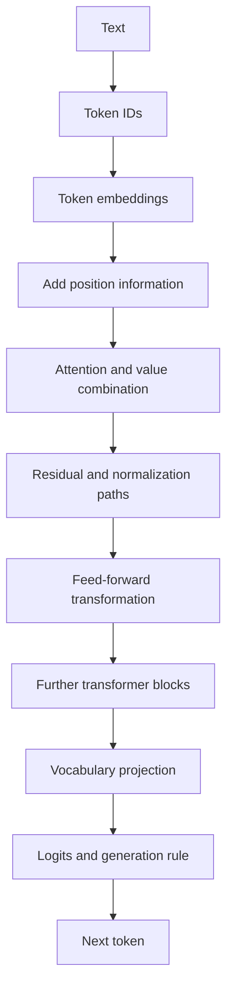
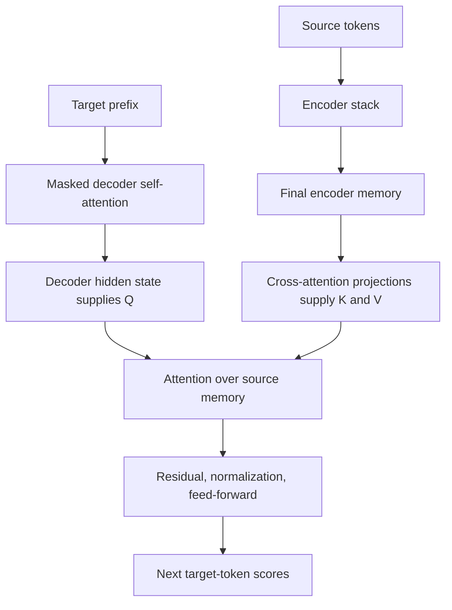

# 🧩 Class 7: Decoder Masking, Positional Encoding, and Cross-Attention
### 📋 Production AI / LLM Engineering | Krish Naik Academy

**🎙️ Mentor:** Sourangshu Pal (Paul)  
**⏱️ Duration:** ~4 hours 19 minutes (4hr 19min 27s) | **📅 Session:** Day 7 (9 August 2026)

---

## 📰 Quick Updates

- Paul reshared the course Discord invitation. Learners watching recordings who had missed access were asked to contact him through the established course channel.
- The class completed the remaining conceptual pieces of the original transformer: causal decoder attention, positional encodings, encoder–decoder cross-attention, and the vocabulary/output path. It also used two interactive visualizations to revisit the full flow.
- The **Annotated Transformer** resource was shared ahead of the planned implementation sessions so learners could review it during the week.
- A late poll supported holding the next week's single class on **15 August**, with **no class on 16 August**. This was the decision announced in this session; subsequent scheduling announcements would govern any later changes.
- The supplied materials for these notes are the full transcript, the ten-page handwritten **Note 2.pdf**, and the seven-cell **Mask.ipynb** notebook. The notebook contains masking/attention demonstrations and a partial inference example; it is not a complete standalone transformer.

---

## 🗺️ Start with the Architecture You Are Actually Looking At

Paul began with [Transformer Explainer](https://poloclub.github.io/transformer-explainer/) and then [Brendan Bycroft's LLM Visualization](https://bbycroft.net/llm). The first used a GPT-2-style model; the second let the class inspect a small GPT-style network and larger variants. These are different from the original paper's complete encoder–decoder machine-translation architecture.

This distinction was corrected explicitly during the walkthrough. Paul initially spoke of encoder blocks, then noticed the masked attention in the visualization and clarified that it was **decoder-only**. The useful reading habit is to inspect the computation, masking, and information path rather than assume that a box labeled “transformer” contains both stacks.

| Example | Dimensions/structure discussed | What to compare |
|---|---|---|
| Original transformer base model | Width 512, feed-forward width 2048, six encoder and six decoder layers | The encoder–decoder translation design |
| Transformer Explainer | Width 768, feed-forward width 3072, 12 heads and 12 decoder blocks, vocabulary 50,257 | A GPT-2-style next-token model |
| Small GPT visualization | Smaller width/head/layer choices; three blocks shown in the tiny example | The same kinds of operations with a different configuration |

The numbers are configuration choices, not interchangeable meanings. **Model width** is the size of a token's hidden vector; **feed-forward width** is an intermediate expansion; **vocabulary size** is the number of token scores the output head produces; **head count** and **layer count** describe different aspects of the architecture.

The visualizations were valuable because each made a different part visible. Paul asked learners to change heads, hover over values, inspect connections, and follow the tensor shapes. Seeing a number in a diagram is most useful when you can explain which axis or operation it belongs to.

---

## 🔄 The Full Token-to-Output Flow

The input text becomes token IDs, then learned token embeddings. Token IDs and embeddings are different objects: an ID selects a vocabulary entry; its embedding is a vector used by the model. Position information is combined with those vectors before they enter the stack in the original architecture.

The attention blocks form query/key/value projections, calculate attention distributions, and combine values. Feed-forward transformations, residual connections, and normalization then update the token representations. Stacked blocks repeat these operations with their own parameters. Finally, the output head maps the hidden representation to vocabulary scores.



A residual addition requires compatible shapes. For example, an MLP may expand 768 features to 3072 internally, but it projects back to the residual stream's width before the residual addition. Do not read an expanded intermediate tensor as being added directly to an unexpanded tensor merely because a visualization places them nearby.

Similarly, normalization placement can vary. Paul contrasted the original paper's Add & Norm presentation with a GPT-style visualization that applied normalization before attention. These are architecture variants. The important task was to follow the actual sequence of operations, not assume every model uses the same ordering.

Residual paths help information and gradients flow through a deep stack; they do not prove that every vanishing-gradient or optimization problem is eliminated. Dropout was discussed as a training-time regularization mechanism, again as part of the model's generalization behavior rather than a guarantee of improved quality in every configuration.

---

## 🎲 Logits, Temperature, Top-k, and Top-p

The output projection in the first visualization produced **50,257 logits** for a token position. That large number came from vocabulary size, not from concatenating attention heads. A logit is a score. Applying a suitable softmax turns scores into a normalized distribution over candidate tokens.

Paul used the prompt “Data visualization empowers users to” and inspected candidates such as “visualize,” “see,” “create,” and “make.” Similar context can make several continuations plausible. The visualization's highest-probability candidate is not a proof that only that continuation is linguistically valid.

For temperature \(T>0\), the familiar scaling is:

\[
p_i = \frac{\exp(z_i/T)}{\sum_j \exp(z_j/T)}.
\]

At \(T=1\), the logits are unchanged by this scaling. Lower positive temperatures sharpen the distribution; higher temperatures flatten it. The session's initial “0 to 1” description was a simplified range, not a universal API restriction—positive temperatures above one are meaningful too. A literal zero is not used in the division formula; an API may interpret it specially or provide a separate greedy-decoding mode.

| Control | What it keeps | Why the candidate count can change |
|---|---|---|
| Top-k | The k highest-scoring/probability tokens | k is a fixed requested count, subject to the vocabulary and implementation |
| Top-p / nucleus sampling | The smallest high-probability set reaching the chosen cumulative probability mass | The number depends on how concentrated the distribution is |

Top-p is **not** “keep each token whose individual probability is above p.” It is a cumulative-mass criterion. If the selected set is sampled from, its probabilities must be interpreted over that retained set. Top-k filtering before a softmax also yields a normalized distribution over the retained candidates; normalization is not exclusive to top-p. These definitions are documented in the [Hugging Face generation reference](https://huggingface.co/docs/transformers/main_classes/text_generation).

Paul changed k and p in the visualization to show their different effects. His personal preference for top-k was a task preference, not evidence that top-k always improves reasoning. **Sampling** can select a candidate according to its probability; **greedy decoding** chooses the highest-scoring candidate. They should not be merged into one rule saying that a model always emits the most probable token.

---

## 🚫 Why the Decoder Needs a Causal Mask

The original decoder predicts a target token using an already-known target prefix. During training, the whole target example may be present in memory, but the model must not use later target tokens to predict the current one. During ordinary autoregressive inference, those future tokens have not yet been generated.

Paul illustrated the rule with four or five token positions: the first position can attend to itself; the second can attend to itself and the first; the third can attend to the first three; and so on. This creates a lower-triangular allowed region. The correct term is **causal**, despite the captions repeatedly rendering it as “casual.”

For the causal self-attention used here:

\[
Q=XW^Q,\qquad K=XW^K,\qquad V=XW^V
\]

\[
\operatorname{Attention}(Q,K,V)
=\operatorname{softmax}\!\left(\frac{QK^T}{\sqrt{d_k}}+M\right)V.
\]

\(M\) has zero for permitted positions and \(-\infty\) for future positions. The ten-page PDF shows this exact progression: project Q/K/V, calculate and scale scores, construct a mask, apply it before softmax, and finally combine V.


The essential purpose is **preventing information leakage**. A decoder that sees the answer token through future context during training can learn a shortcut unavailable at generation time. The mask makes the training computation respect the intended conditional prediction task.

“Mask” is broader than “causal decoder mask.” Encoders and cross-attention can use padding or other masks too. In this lesson, the specific mask separating past from future was the decoder's causal mask; the presence of any mask whatsoever does not prove an architecture is decoder-only.

---

## 🧮 Why Minus Infinity Is Applied Before Softmax

The masked scores must become zero **probabilities**, not merely zero raw logits. Softmax exponentiates scores, and \(e^0=1\). Replacing a forbidden raw score with zero would therefore leave it capable of receiving probability mass.

In contrast, \(e^{-\infty}=0\). Adding \(-\infty\) to a finite score suppresses that position before the distribution is calculated. A very negative finite value is often used as a practical sentinel in demonstration code.

Paul's first worked row was:

\[
[1,2,3,4]+[0,-\infty,-\infty,-\infty]
=[1,-\infty,-\infty,-\infty].
\]

Its softmax is \([1,0,0,0]\). His second row left scores 5 and 6 visible and the two future positions blocked. With the actual softmax calculation, the distribution is approximately:

\[
\operatorname{softmax}([5,6,-\infty,-\infty])
=[0.26894,0.73106,0,0].
\]

The live 0.4/0.6 values were a rough illustration of the normalization property, not the exact softmax of 5 and 6. The notes retain the same source example with its calculated values.

A mathematical detail in the boardwork also needs precision: a finite value **plus** negative infinity tends to negative infinity; subtracting negative infinity is a different operation. The attention path uses addition of the mask, which is the operation relevant here.

Masking after softmax is not automatically equivalent. If disallowed probabilities are zeroed afterward, the remaining values generally need renormalization to recover the same distribution. The class notebook's score-mask-before-softmax order avoids that ambiguity.

---

## 🧑‍💻 The Supplied Mask Notebook: Read Its Conventions Carefully

The [Mask notebook](https://colab.research.google.com/drive/16OdOBEbZGqIG6LOmLZgsQVP2M8-j39OL?usp=sharing) begins with the exact lower-triangular construction below:

```python
import torch

# Example sequence length
seq_len = 5
mask = torch.tril(torch.ones(seq_len, seq_len))  # Lower triangular mask

mask
```

Its output is:

```text
tensor([[1., 0., 0., 0., 0.],
        [1., 1., 0., 0., 0.],
        [1., 1., 1., 0., 0.],
        [1., 1., 1., 1., 0.],
        [1., 1., 1., 1., 1.]])
```

The next cell changes this to a **blocked-position Boolean mask**:

```python
mask = mask == 0
mask # Convert to boolean mask (True for positions to mask)
```

Now True means “future position to block.” A later `subsequent_mask(size)` demonstration builds an upper triangle, converts it to Boolean, then inverts it. That function returns the **allowed-position** convention: True on/below the diagonal, False above it. Both are useful representations, but they mean opposite things.

The third cell demonstrates a large negative value:

```python
seq_len = 5
mask = torch.tril(torch.ones(seq_len, seq_len))
mask = mask.masked_fill(mask == 0, -1e9)
mask
```

Here `-1e9` means negative one billion. It is not “e to the power minus nine,” and it is not a small number close to zero. Its **exponential contribution to softmax** is tiny. This demonstration leaves allowed entries at 1; an additive mask that preserves existing allowed scores would normally use 0 there, as Paul's boardwork did. The actual attention function below instead overwrites blocked scores and preserves allowed ones.

From the notebook's attention cell:

```python
def attention(query, key, value, mask=None, dropout=None):
    "Compute 'Scaled Dot Product Attention'"
    d_k = query.size(-1)
    scores = torch.matmul(query, key.transpose(-2, -1)) / (d_k ** 0.5)
    if mask is not None:
        scores = scores.masked_fill(mask == 0, -1e9)
    p_attn = F.softmax(scores, dim=-1)
    if dropout is not None:
        p_attn = dropout(p_attn)
    return torch.matmul(p_attn, value), p_attn
```

The source cell imports `torch.nn.functional as F` before this function. It expects an **allowed-position mask**: zero/False gets blocked. Passing the earlier blocked-position Boolean mask into this function without inversion would hide the wrong positions.

The convention is API-specific. PyTorch's functional scaled-dot-product attention treats Boolean True as allowed, while `nn.MultiheadAttention`'s Boolean attention/padding masks use True for blocked positions. Check the [functional API](https://docs.pytorch.org/docs/stable/generated/torch.nn.functional.scaled_dot_product_attention) and [MultiheadAttention API](https://docs.pytorch.org/docs/stable/generated/torch.nn.MultiheadAttention) before transferring a mask between implementations.

The notebook also logs a multi-head shape example with batch 2, sequence length 10, width 512, and eight heads:

| Stage | Logged shape |
|---|---|
| Input Q/K/V | `(2, 10, 512)` |
| Projected, split, and transposed Q/K/V | `(2, 8, 10, 64)` |
| Attention weights | `(2, 8, 10, 10)` |
| Per-head output | `(2, 8, 10, 64)` |
| Recombined output | `(2, 10, 512)` |

These are source-recorded outputs, not newly executed results. Head projection is a learned transformation of the input; a head is not permanently assigned a named raw feature such as “water” or “height.”

Two source limitations matter before using the notebook as implementation code. Its `clones` helper repeats the **same module object**, so the Q/K/V/output projection entries share parameters; the canonical Annotated Transformer creates independent copies. Also, the final inference cell references helpers such as `make_model` and `show_example` that are not defined in the seven supplied cells. Its saved traceback records **`NameError: name 'make_model' is not defined`** at the start of the first inference test. Study the snippets for the demonstrated mechanics; the file alone does not establish a successful complete transformer run.

---

## ⏱️ Parallel Training and Sequential Generation Are Different

The class repeatedly asked whether masking makes the entire computation sequential. The distinction is between **the dependency of predictions** and **how known training positions are computed**.

With a complete training example available, target inputs can be shifted and all their positions processed in a matrix operation. The causal mask makes each prediction depend only on its permitted prefix. Multiple heads and batches can be processed in parallel; the mask does not require a Python loop over every target position during training.

At ordinary autoregressive generation time, the next token must be selected before it can be part of the prefix for the following prediction. That outer generation loop is sequential, even though the neural-network operations inside each step are highly parallel.

| Stage | Available target information | Main computation |
|---|---|---|
| Supervised training | The reference target sequence is known | Shift it, mask future target positions, predict known labels in parallel |
| Autoregressive inference | Start token/prompt plus generated prefix | Predict a next token, append it, repeat |

This also explains Athira's question about **outputs shifted right**. Shifting and masking solve related but different parts of leakage prevention. The input at a target prediction position is the earlier token rather than the token being predicted; the causal mask prevents access to later positions. The [Annotated Transformer](https://nlp.seas.harvard.edu/annotated-transformer/) explicitly combines both.

Multi-token prediction was briefly previewed in response to a question about current models. It was not taught in this class. The fact that some later methods predict or propose multiple tokens does not invalidate the ordinary autoregressive workflow being studied here.

---

## 📍 Positional Encoding: Separate Token Position from Vector Dimension

The original transformer contains neither recurrence nor convolution to supply the same kind of sequence order as an RNN or CNN. Content-based self-attention alone does not provide the original architecture with a full position representation. Paul therefore returned to the paper's addition of positional information at the bottom of both stacks.

Two independent indices must be kept separate:

- **`pos`** is the token's place in the sequence: 0, 1, 2, and so on.
- **The feature coordinate** chooses one component of the positional vector. Sine/cosine alternate across those coordinates.
- **`i` in the paired formula** indexes a sine/cosine pair: coordinates `2i` and `2i+1` share a frequency.

It is not “use sine for an even token position and cosine for an odd token position.” **Every token position gets a complete vector**, containing both kinds of coordinates.

The formulas shown in the PDF and original paper are:

\[
PE(pos,2i)=\sin\!\left(\frac{pos}{10000^{2i/d_{model}}}\right)
\]

\[
PE(pos,2i+1)=\cos\!\left(\frac{pos}{10000^{2i/d_{model}}}\right).
\]

For a four-dimensional model, the coordinate pairs are `(0,1)` and `(2,3)`. Their pair indices are 0 and 1, so their exponents are 0 and 1/2. The denominators are consequently 1 and 100.

| Feature coordinate | Pair index i | Function | Exponent `2i/4` |
|---|---|---|---|
| 0 | 0 | sine | 0 |
| 1 | 0 | cosine | 0 |
| 2 | 1 | sine | 1/2 |
| 3 | 1 | cosine | 1/2 |

Paul revisited this pairing after the break because many students were mixing token position, feature coordinate, and exponent. The second explanation correctly emphasized shared wavelengths within a pair. Keep the pair index above to avoid double-counting the factor of two in the exponent.

---

## ✏️ The Four-Dimensional Worked Example

At token position zero, every angle is zero. The resulting positional vector is:

\[
PE(0)=[\sin(0),\cos(0),\sin(0),\cos(0)]=[0,1,0,1].
\]

Paul's illustrative token embedding was `[0.6, 0.7, 0.8, 0.9]`. Adding the position vector gives `[0.6, 1.7, 0.8, 1.9]`. The operation is elementwise addition, preserving model width.

At position one:

\[
PE(1)=[\sin(1),\cos(1),\sin(0.01),\cos(0.01)]
\]

\[
\approx[0.841471,0.540302,0.010000,0.999950].
\]

Angles here are in **radians**. The last value is approximately 0.99995; the classroom's rough 0.995/0.0995 annotations should not be treated as exact evaluations. With the same formula, positions two, three, and later can be calculated without changing the pair exponents.

For width 512, this construction supplies 256 sine coordinates and 256 cosine coordinates per token position. Even widths are convenient for complete pairs and are common in transformer configurations. They are not a universal mathematical requirement for all embeddings: PyTorch's [Embedding documentation](https://docs.pytorch.org/docs/stable/generated/torch.nn.Embedding) includes an ordinary width-three example.

The fixed sinusoidal encoding needs no separately trained neural network to produce these numbers. Learned position embeddings are an alternative, typically represented by trainable parameters/lookup vectors; they do not inherently require a separate complete model dedicated to “learning positions.”

---

## 🌊 Why Sine and Cosine Come in Frequency Pairs

The encoding supplies multiple scales of position variation. Lower-index pairs vary faster; later pairs have larger denominators and slower variation. The paper describes geometrically spaced wavelengths. The base 10,000 is the chosen scale in that design, not a maximum allowed sequence index.

Paul used the angle-addition identities to motivate relative-position behavior:

\[
\sin(a+b)=\sin(a)\cos(b)+\cos(a)\sin(b)
\]

\[
\cos(a+b)=\cos(a)\cos(b)-\sin(a)\sin(b).
\]

For a fixed position offset, each same-frequency sine/cosine pair can be transformed into the pair for the shifted position with a linear operation whose coefficients depend on that offset. This is the reason the pair is useful: absolute-position vectors retain a structured relationship between positions.

The original design hypothesized that this helps attention learn relative-position relationships. It does not mean that adding sinusoidal numbers automatically teaches language grammar or guarantees extrapolation to arbitrary lengths. The formula can be evaluated beyond the training positions; the model's quality on longer sequences still needs evaluation.

The class's explanation that 10,000 was selected after testing specific smaller/larger bases was not accompanied by evidence for those experiments. Retain the paper's documented design and motivation rather than treat those unstated experimental details as an established derivation.

RoPE, ALiBi, and learned position methods were previewed as later alternatives. They are other ways of supplying/managing positional structure—not evidence that modern models universally lack position information. Their detailed mechanisms and comparisons were deferred.

---

## 🔗 Cross-Attention: Decoder Queries Read Encoder Memory

Self-attention gets Q/K/V from the same sequence representation. In encoder–decoder cross-attention, the decoder's current hidden representation supplies queries and the final encoder representation supplies keys and values through the cross-attention layer's learned projections.

For translation, Paul used an English source and German/French target. The encoder contextualizes the source. The decoder uses its target prefix and attends to that source information while predicting the next target token.



“Encoder–decoder attention” and “inter-sequence attention” were other names used in the class. “Fusion” described the decoder incorporating information from another sequence; it does **not** imply that the encoder's internal K/V matrices are added to the decoder's internal K/V matrices.

This distinction resolves the long questions from Sanket, Manoj, and Prithwi. The encoder output is not a container that preserves separately labeled Q, K, and V from all earlier layers. It is the final contextual hidden tensor after the encoder's attention, feed-forward, residual, and normalization paths. The decoder's cross-attention derives its K/V projections from that tensor. The preceding decoder self-attention used its own Q/K/V to produce the decoder state; that state then supplies cross-attention queries.

The attention operation itself remains scaled dot-product attention. With a target length \(T\), source length \(S\), and shared projected query/key width \(d_k\), \(QK^T\) has shape \(T\times S\). Multiplying its attention distribution by source V yields one output vector per target position. **Source and target lengths need not match.** Compatible feature projections and correct masks matter; translation sentences can have different token counts.

The original architecture supplies encoder memory to every decoder layer's cross-attention. Each such layer has its own projections. There is no requirement to add a new “K-to-K fusion formula” or manually transpose arbitrary dimensions until shapes happen to fit. The [Annotated Transformer decoder implementation](https://nlp.seas.harvard.edu/annotated-transformer/) shows the source-attention call using decoder state plus encoder memory.

Cross-attention over the source generally does not require the target's future-token causal triangle, because the source sentence is available. It can still require a **source padding mask** or another task-specific mask. “No causal target mask” is more precise than “cross-attention never uses masking.”

---

## 🏁 Encoder–Decoder Inference and Decoder-Only Models

During supervised translation training, source and reference target examples are both known. The target prefix is supplied in shifted form, and predictions are compared with reference tokens. Training teaches the projections and representations how source information relates to the target task; an untrained cross-attention block does not already know a translation mapping.

At translation inference, the **encoder still runs on the new source**, and the decoder still uses its memory through cross-attention. Paul initially described the cross-attention flow as training-specific, then clarified in Kalyan's Q&A that it also operates during inference. The supplied notebook's inference function supports the clarified account: it encodes `src` into `memory`, then passes that memory to `test_model.decode` inside the token-generation loop.

A frozen encoder is not a removed encoder. “Frozen” usually describes whether parameters are updated during training; the module can still perform its forward computation. Deleting the source path of a trained encoder–decoder translation system does not automatically turn it into an equivalent GPT-style decoder-only model. Manoj's proposed decoupling experiment led to an uncertain discussion and a suggested follow-up, not a demonstrated transformation preserving translation quality.

A decoder-only language model instead uses its causal stack to process a prompt and continuing prefix. It can answer questions because the prompt/response behavior is learned through its training, not because each inference necessarily contains a separate encoder or because multi-token prediction is required to explain question answering.

KV caching was briefly discussed as a later efficiency topic. In ordinary decoder inference, caching can reuse computed keys/values for earlier prefix positions rather than recompute them at every step. It is not freezing every future token's K/V to one shared value, and it is not the same thing as turning off parameter updates. The details were deferred to later modules.

The specific text examples should also not be generalized to “attention only works for text.” Attention can operate over suitable non-text representations; image-patch sequences are one prominent example, documented in the [Vision Transformer paper](https://arxiv.org/abs/2010.11929). Image preprocessing and representations differ, while the attention idea remains relevant.

---

## 🧪 Experimentation and Questions Beyond the Architecture

Aishwarya asked how to choose head counts, widths, layers, and training settings from a paper. Paul described experimentation: start with a manageable subset, monitor behavior, compare configurations, and scale only after the smaller run is informative. Learning rate, gradients, loss, and resource use were examples of signals to inspect.

There is an important distinction between choosing an architecture **before training from scratch** and adapting an existing pretrained model. The latter already has structural dimensions encoded in its weights. Changing head count or model width is not the same operation as changing a fine-tuning learning rate or choosing LoRA target modules. The future adaptation lessons would make that distinction practical.

Paul's suggested numbers of trials/epochs described his approach, not a universal quota. A stable or decreasing training loss is useful evidence but not the only goal: the chosen evaluation needs to assess the actual task and generalization. Hyperparameter names and supported choices come from the selected framework's documentation.

The class ended with some career/research questions. Umaid was encouraged to consider graduate study or an R&D path for a research-focused goal. Asante's existing software experience was discussed as relevant to a transition, without a guaranteed senior job or salary outcome. M P was advised to study existing dedicated RAG material rather than wait several months for that part of the current course.

Paul also mentioned arXiv endorsement. Its exact eligibility rules depend on the endorsement domain; there is no universal “two or three papers” rule for every potential endorser. The [official endorsement guidance](https://info.arxiv.org/help/endorsement.html) explains that endorsement is a submission/community mechanism, not peer review or proof of research quality.

---

## 🗺️ What's Next

- The next class was planned to begin the **Annotated Transformer** practical: construct the encoder–decoder model, run a small training task, save weights, and use them for prediction with limited resources.
- Review the shared implementation resource and this class's masking/position examples during the week.
- Encoder-only, decoder-only, and encoder–decoder model examples were planned for later, including BERT/DistilBERT-like, GPT/DistilGPT-like, and T5/BART/translation families.
- RoPE/ALiBi, KV caching, multi-token prediction, and detailed fine-tuning were mentioned as later topics; they were not implemented in this class.

---

## 💬 Live Q&A Highlights

| Question | Answer |
|---|---|
| **Prem Kumar, in chat:** Is the explainer showing encoder or decoder blocks? | Inspecting its masked attention prompted Paul to clarify that it was GPT-style decoder-only. Its configuration differs from the original encoder–decoder paper. |
| **Swati and mask questions:** What is the final attention step after masking? | Mask the scores, apply row-wise softmax, then multiply that distribution by V. The mask makes forbidden attention probabilities zero. |
| **Anunna, in chat:** If future tokens are known in training, why hide them? | They are unavailable during normal generation. Allowing them while predicting an earlier target token leaks information and changes the learning task. |
| **Mask/parallelism questions:** Is causal attention sequential or parallel? | Known training positions can be computed in parallel with the mask. Ordinary autoregressive generation still appends one selected token at a time. |
| **Athira, in chat:** Why shift decoder inputs right if masking is already applied? | The question was not resolved clearly in that initial exchange. Shifting excludes the label from its own input position; causal masking excludes later positions—both are used in the reference architecture. |
| **Alok and positional-index questions:** Why do neighboring coordinates share an exponent? | They form a same-frequency sine/cosine pair. For width four, coordinates0/1 use pair index0, and coordinates2/3 use pair index1; the exponents are0 and1/2. |
| **Position questions:** Does sinusoidal encoding require training another network? | No. Its values are fixed by the formula. Learned position vectors are an alternative, not part of this fixed calculation. |
| **Nitesh, in chat:** Which problem is cross-attention addressing here? | It lets the decoder use the encoder's source representation while forming target predictions. It is an information path rather than a separate output-comparison operation. |
| **Phani Kulkarni:** Does each head focus on a predetermined set of raw features? | Head projections offer learned representation subspaces; their semantic roles are not fixed beforehand. They are not permanent manual assignments of named features. |
| **Phani Kulkarni:** Is cross-attention comparing directly with the final target output? | No. It combines the decoder's current query with source-memory keys/values. The training loss separately compares predictions with labels. |
| **Kalyan Rad:** Is cross-attention used during encoder–decoder inference too? | Yes. Paul clarified that it must be present to bring new source information to the decoder. The encoder processes the source and the decoder reads its memory during generation. |
| **Kalyan Rad:** Is the same flow relevant to summarization/Q&A? | Encoder–decoder versions of those tasks use the same source-memory/target-prefix pattern. The actual selected architecture matters. |
| **Sanket:** Are the decoder's own keys/values merged with the encoder's? | The self-attention and cross-attention sublayers use different sources. Decoder self-attention builds its state; cross-attention projects Q from that state and K/V from encoder memory. |
| **Savan Jain:** How can English source context help generate German? | Paired supervised training teaches the whole system the relationship. Source and target examples both participate; cross-attention is not already a language translator before training. |
| **Vidyasagar Sasumana:** Where is added positional information used without a separate processing unit? | It changes the vectors passed into the stack, so learned projections and subsequent layers receive it as part of their input. A separate position-processing unit is not required. |
| **Vidyasagar Sasumana:** What if positions are omitted from the shown model? | Its content-only attention lacks the explicit position signal being added here. Alternatives can encode position differently; do not conclude that every model must use this exact sinusoidal addition. |
| **Sridhar K:** How do encoding and decoding work for a long translation? | Training can use complete paired examples with causal target masking. Generation computes source memory and produces a target prefix step by step; practical length limits still matter. |
| **Sridhar K:** Does decoder-only mean an encoder has already done the work? | No separate encoder is implied. A decoder-only model processes its prompt/prefix through a causal stack. |
| **Sridhar K:** Where does the next token come from? | The output head scores the vocabulary, then the configured decoding rule chooses a token. Context influences those scores; the result is not restricted to copying the input words. |
| **Sridhar K:** What gets tuned for an organization's SLM? | Begin with pretrained parameters and adapt using relevant data and a chosen method. Paul's partial-unfreezing example was illustrative; the exact method/settings were deferred. |
| **Gaurav Garg:** Does a wrong or disordered sequence still produce output? | It may, but correctness is not guaranteed. The model predicts from the representation supplied, including its order. |
| **Gaurav Garg:** Can mathematical/scientific material be processed? | Textual forms such as LaTeX can be inputs to an appropriately trained text model. Screenshot/image input requires a model/interface that supports that modality. |
| **Gaurav Garg:** Is the transformer decoder an RNN? | No. Earlier encoder–decoder systems could contain RNNs, but the transformer studied here does not use recurrence. |
| **Gaurav Garg:** Are encoders replaced by decoder-only models for every task? | No. Architecture choice depends on the task; bidirectional and causal representations have different roles. Later examples would compare the families. |
| **Manoj:** What is the mathematical formula for merging encoder and decoder K/V? | Paul requested a follow-up after an uncertain discussion. The reference computation has no extra K-to-K merge: cross-attention uses decoder Q and projections of encoder memory as K/V. |
| **Manoj:** Can the trained translation encoder be frozen/removed and only the decoder used? | Freezing does not remove forward computation. Deleting the source path is not an equivalent conversion; the suggested decoupling idea was not demonstrated or validated in class. |
| **Manoj:** How will decoder-only training be handled? | Paul said a GPT-style task would be covered later with a suitable dataset/use case. No full decoder-only training recipe was supplied here. |
| **Mangesh Khandare:** Why discuss KV caching for inference rather than just freezing K/V in training? | Training recomputes activations under the current parameters; inference can reuse prior-prefix K/V to save work. Caching is not making all K/V identical or disabling model learning. |
| **Aishwarya P.S.V.S:** How are architecture/training hyperparameters chosen? | Compare experiments on the actual data, starting small. Monitor loss, gradients, learning rate/resource behavior and task evaluations; there is no fixed rule or compulsory trial count. |
| **Aishwarya P.S.V.S:** Where are the supported fine-tuning options listed? | In the chosen Transformers/TRL/framework documentation. Architecture changes and ordinary fine-tuning settings should be distinguished. |
| **Prithwi, including the repeated late follow-up:** Does the feed-forward output reach the decoder, and how does it become K/V? | The final encoder memory includes the encoder's completed transformations. Cross-attention applies learned K/V projections to that memory; it is not recovering separate internal K/V objects preserved inside the feed-forward output. |
| **Charan Teja:** Is attention only for text? | The class focused on text, but attention also applies to other representations, including image patches. Input representation/preprocessing changes; the attention mechanism is not text-exclusive. |
| **Bhaskar:** Must source and target sequences have the same shape? | Their token lengths may differ. Projected Q/K feature widths and valid matrix/mask shapes must be compatible; incorrect dimensions can produce errors. |
| **Umaid Jawed:** How should an AI engineer move toward research? | Paul suggested graduate study or an R&D route for that goal. This was career guidance, not a universal degree requirement or guaranteed research placement. |
| **Asante Richard:** Will the course lead directly to a high-end job? | Paul asked about prior experience and discussed it as relevant to the transition. No specific senior role or salary outcome was guaranteed. |
| **M P:** Should existing dedicated RAG material be studied now or only when this course reaches RAG? | Paul advised using the available material now, especially the later projects, rather than waiting. Exact compatibility of old code still needs checking. |

---

## 🔑 Key Pointers to Remember

- Identify whether a diagram is encoder-only, decoder-only, or encoder–decoder before comparing its numbers.
- Token IDs, hidden width, MLP expansion, vocabulary size, head count, and layer count are different quantities.
- Causal masking hides later **target positions**; padding masks can appear in other attention layers too.
- Zero logits are not zero probabilities. Mask forbidden scores before softmax with a suitable negative sentinel.
- Boolean mask meaning depends on the API and the implementation using it.
- Training positions can be computed in parallel while generation remains dependent on the growing prefix.
- Shifted target input and causal masking both prevent target leakage.
- `pos` is token position; `2i`/`2i+1` are paired feature coordinates.
- Each token gets the whole positional vector, containing both sine and cosine.
- At width four, pair exponents are0 and1/2; `PE(0)=[0,1,0,1]`.
- The position-one last coordinate is approximately0.99995, not0.0995.
- Fixed sinusoidal vectors are generated from a formula; learned positions and newer position methods are alternatives.
- Cross-attention projects decoder Q and encoder-memory K/V; it does not add the two stacks' internal K/V matrices.
- Source and target lengths can differ; the attention matrix is target-length by source-length.
- Encoder–decoder inference still uses encoder memory and cross-attention.
- KV caching, freezing parameters, and removing a module are different operations.
- The supplied notebook shares projection module references and has undefined final helpers; its complete standalone execution is not established.
- Choose configurations through task-specific experiments and evaluate more than training-loss stability alone.

---

## ✅ Action Items After Class 7

- [ ] Use both visualization resources and follow token embedding, attention, MLP, residual, and vocabulary paths.
- [ ] Label every tensor axis in the eight-head notebook example.
- [ ] Inspect the notebook's allowed-mask and blocked-mask conventions before connecting cells together.
- [ ] Work through the four-token masked-score example and verify that rows normalize over permitted positions.
- [ ] Calculate `PE(0)` and `PE(1)` at width four, using radians and the correct pair indices.
- [ ] Explain why sine/cosine coordinates in a pair share a frequency.
- [ ] Trace an encoder–decoder layer: target self-attention, cross-attention over source memory, then feed-forward work.
- [ ] Distinguish source/target token counts from projected feature widths.
- [ ] Explain the training versus generation difference without calling the whole process either entirely sequential or entirely parallel.
- [ ] Review the Annotated Transformer before the next practical session.
- [ ] Keep the mask notebook's shared-module/undefined-helper limitations in mind before treating it as a full implementation.

---

*📝 Notes compiled from the full Class 7 transcript, the ten-page Note 2.pdf, and all seven cells of Mask.ipynb — “9 Aug Transformers 101,” Production AI / LLM Engineering, Krish Naik Academy.*

*Primary source: [Class 7 recording page](https://learn.krishnaikacademy.com/web/courses/6a16f8935e281281cd6b1128?chapter=6a78ef06835acfc8a5203730). Original transcript: `GMT20260809-143044_Recording.transcript.vtt`. Companion [Mask notebook](https://colab.research.google.com/drive/16OdOBEbZGqIG6LOmLZgsQVP2M8-j39OL?usp=sharing). All transcript parts and PDF pages were reviewed; quoted code comes from the supplied notebook. Numeric examples correct rough classroom arithmetic using the same source inputs. The complete model-training practical remained future work in this session.*
