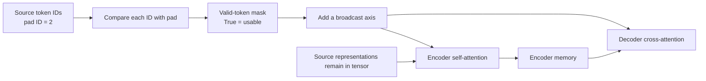
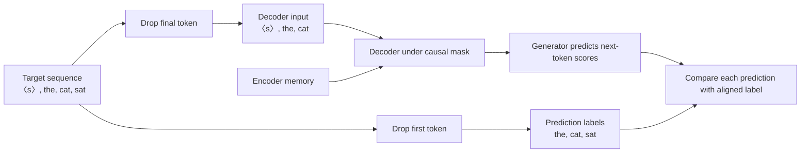

# 🏗️ Class 8: Annotated Transformer Implementation — Designing the Encoder and Decoder
### 📋 Production AI / LLM Engineering | Krish Naik Academy

**🎙️ Mentor:** Sourangshu Pal (Paul)  
**⏱️ Duration:** ~3 hours 44 minutes (3hr 44min 8s) | **📅 Session:** Day 8 (16 August 2026)

**Class recording:** [16 Aug Transformer practical](https://learn.krishnaikacademy.com/web/courses/6a16f8935e281281cd6b1128?chapter=6a828b92ec908cbc02f344c8)  
**Primary transcript:** `GMT20260816-143020_Recording.cutfile.20260817041629504.transcript.vtt`  
**Companions:** [instructor’s Annotated Transformer notebook](https://colab.research.google.com/drive/1gvIGksp7ujaAT7HvDc7lVWRVboFO9SYa#scrollTo=e1e641e0) and `Annotated TF.pdf`

---

## 📰 Quick Updates

- The class moved from Transformer theory to **implementing its components**. Paul divided the practical into architecture design first, then model assembly, data, and training.
- The main reference was Harvard NLP’s **The Annotated Transformer**, with a small set of instructor changes for the environment and dependencies.
- The notebook had been shared in Notion in advance. Participants were asked to read it before class and revisit it afterward, especially the next ten to fifteen cells.
- The live walkthrough reached **positional encoding**. Full model assembly, initialization, inference examples, and training were deferred to the next session.
- A paid GPU was not required for studying the component definitions. GPU-utilization and distributed-training imports were introduced as future infrastructure, rather than used for a distributed run today.
- Discord invite issues were handled through the instructor’s email. No additional formal assignment was announced; the immediate task was to study and execute the relevant notebook content.

The supplied notebook contains later training code and saved results. Those sections were read for coverage, but they are not presented as demonstrations completed in this class. The PDF also includes target-shifting sketches from the later practical stage; they are used below only as labeled companion clarification of questions raised today.

---

## 🔗 Cross-Attention: Connect Decoder Queries to Encoder Memory

Paul began by revisiting the relationship between the encoder and decoder in a translation model.

In **decoder self-attention**, queries, keys, and values originate from decoder-side representations. A causal mask prevents each position from using later target positions.

In **encoder–decoder cross-attention**:

- the decoder-side representation supplies the **query input**;
- the encoder output supplies the **key and value inputs**;
- source padding must remain hidden during that matching operation.

The scaled dot-product formula remains the same. What changes is the origin of the query and key/value inputs.

| Attention operation | Query source | Key/value source | Mask used in this implementation |
|---|---|---|---|
| Encoder self-attention | Encoder input/state | Same encoder input/state | Source padding mask |
| Decoder self-attention | Decoder input/state | Same decoder input/state | Target padding plus causal mask |
| Decoder cross-attention | Decoder state | Encoder memory | Source padding mask |

### Memory is an encoder representation, not a mask

The notebook calls the encoder’s output **memory**. It is a tensor containing contextual source representations.

The cross-attention module then applies its own projections to its inputs. Thus, passing memory for both key and value does not mean that the final K and V tensors must be identical. They receive different learned transformations.

Similarly, the encoder does not simply export its last self-attention module’s local K/V pair as the entire memory. The memory is the encoder stack’s output, which the decoder uses as the source of its cross-attention keys and values.

The variable **m** in `src_attn(x, m, m, src_mask)` means memory. It is not a shorthand for a mask.

### Decoder-only architectures

Paul contrasted the translation architecture with an ordinary decoder-only language model. A standard decoder-only model uses causal self-attention and has no encoder–decoder cross-attention block to connect to an encoder.

That comparison explains why this full encoder–decoder example is a useful foundation: it exposes both self-attention and attention to a separate memory sequence. It should not be generalized into a claim that every possible decoder or multimodal design has the same structure.

---

## 🎭 Padding Masks and Causal Masks Have Different Jobs

The source/target masks occupied a large part of the class because they turn the theoretical architecture into a practical batched implementation.

Paul used a short sequence such as **Hello World** inside a four-position example. Two additional slots contain padding so that the tensor can be stacked with other examples.

Padding is a data-representation choice, not meaningful language. The attention calculation needs to know which token positions are real.

### Source mask

The source mask marks valid positions in the source sequence. It is used:

1. in encoder self-attention;
2. again in decoder cross-attention over the encoder memory.

The second use matters even if the encoder also received the mask. A mask does not physically delete tensor positions. Cross-attention still receives memory with those positions present, so it must avoid selecting padded source keys.

The PDF’s first page demonstrates a padding ID of **2**, rather than assuming every pad token is zero:

| Source IDs | Valid-position mask |
|---|---|
| [1, 3, 2, 4] | [True, True, False, True] |
| [2, 8, 1, 0] | [False, True, True, True] |

The exact IDs are just the companion’s example. The important rule is **compare with the configured pad ID**.



*Based on the source-mask comparison and (batch, length) → (batch, 1, length) sketch in Annotated TF.pdf, page 1, together with the live explanation of its two uses.*

### Target mask

The target mask has **two jobs**:

- ignore target padding positions;
- prevent a decoder query from attending to future target positions.

Source padding and target padding belong to different sequences. Knowing which English positions are padded does not identify padded positions in the corresponding German sequence.

For this class’s language example, source meant English and target meant German. The later supplied data-loading example is configured in the reverse translation direction; the generic source/target roles work in either direction.

### A causal mask is not the only kind of mask

The phrase “masking is only in decoders” applies here to **causal masking**, not to padding masks generally. The class’s own source-mask implementation is used by the encoder.

A padding token also can receive an embedding lookup, and positional encoding may be added to it. In this notebook, `nn.Embedding` is not constructed with a special `padding_idx` argument. A pad entry is therefore not automatically a neutral zero vector that attention can safely ignore.

### Sequence length is not an automatic chunking policy

The four-slot illustration explained shape compatibility. In practice, a batch can be padded to an appropriate selected length, such as its longest example; it need not always be padded to the model’s maximum context capacity.

For a sequence longer than the chosen limit, truncation, chunking, or another strategy must be selected explicitly. Dividing six tokens into a four-token chunk and a padded two-token chunk is one illustration, not an automatic rule of every Transformer.

---

## 🧭 The EncoderDecoder Wrapper: Map the Overall Data Flow

The notebook first defines the top-level object before implementing all its components.

Its constructor accepts:

- an encoder stack;
- a decoder stack;
- source embedding machinery;
- target embedding machinery;
- a generator.

The embedding modules later combine learned token embeddings with positional encoding. At the wrapper stage, those objects are passed in as components.

The actual forward path is:

```python
def forward(self, src, tgt, src_mask, tgt_mask):
    "Take in and process masked src and target sequences."
    return self.decode(self.encode(src, src_mask), src_mask, tgt, tgt_mask)

def encode(self, src, src_mask):
    return self.encoder(self.src_embed(src), src_mask)

def decode(self, memory, src_mask, tgt, tgt_mask):
    return self.decoder(self.tgt_embed(tgt), memory, src_mask, tgt_mask)
```

*Exact excerpt from the supplied notebook, cell 14.*

Read it from the inside out:

1. Embed the source and encode it with its mask.
2. Take the resulting memory into the decoder.
3. Embed the decoder’s target-side input.
4. Decode using memory, source mask, and target mask.

The return value is the **decoder representation**. The wrapper’s `forward` does not call the generator automatically.

### Why the decoder needs an input sequence

Several students associated “target” only with the desired answer. In this wrapper, **tgt is the sequence supplied to the decoder**.

During training, that is typically the shifted target sequence: known preceding target tokens are inputs, and following target tokens are prediction labels.

During autoregressive inference, the full correct target is not available. The decoder starts with a beginning token and then consumes the generated prefix. The prefix is still a target-side input; it is not the unknown complete answer.

### Companion clarification: shifted inputs and labels

Sridhar asked how “outputs shifted right” in the paper’s diagram starts decoding. The later notebook/PDF make the distinction concrete:



*Companion clarification based on Annotated TF.pdf, pages 2–5, and the supplied notebook’s later Batch implementation. Building that Batch object was deferred rather than completed live in Class 8.*

A position can include its current **input** token while predicting the next token. The shift is what prevents the correct next-token label from becoming that same position’s input.

---

## 🎯 Generator: Decoder Features to Vocabulary Scores

Paul identified the paper’s final linear transformation and output distribution as the **generator**.

The actual notebook implementation is:

```python
class Generator(nn.Module):
    "Define standard linear + softmax generation step."

    def __init__(self, d_model, vocab):
        super(Generator, self).__init__()
        self.proj = nn.Linear(d_model, vocab)

    def forward(self, x):
        return log_softmax(self.proj(x), dim=-1)
```

*Source: supplied notebook, cell 15.*

The linear layer maps a decoder feature vector of width d_model to one score per **target vocabulary entry**.

A practical detail worth retaining: the code returns **log-softmax values**, not ordinary softmax probabilities. The lecture often used “softmax” as a high-level description of this output step.

For a batched decoder representation shaped **B × T × d_model**, the generator returns **B × T × target_vocab_size**.

The generator’s output width follows the vocabulary; its input width follows the model representation. Those are different quantities.

The later notebook’s loss and decoding routines call this module explicitly. That later usage does not change what the wrapper returns.

---

## 🧬 Cloning Stacks Without Sharing Every Parameter

The paper describes repeated encoder and decoder layers. The class used a helper to create the repetitions:

```python
def clones(module, N):
    "Produce N identical layers."
    return nn.ModuleList([copy.deepcopy(module) for _ in range(N)])
```

*Source: supplied notebook, cell 19.*

The deep copies are separate module instances with separate parameter storage. They can learn independently.

“Identical” refers to the repeated structure. A deep copy initially also copies the parameter values; it does not itself generate new random values. Subsequent initialization or independent training updates can make the values different.

Reusing one module object repeatedly would intentionally share its parameters across uses. That is a different architecture choice, rather than an equivalent way to construct this stack.

### Encoder stack

The encoder loops through its N layers, passing **x and the source mask** to each, then applies a final normalization.

The first pass creates a new x representation, which becomes the input to the next layer. The mask still describes source-token positions, so it follows the data through the stack.

### Decoder stack

The decoder loop carries additional inputs:

- current target representation x;
- encoder memory;
- source mask;
- target mask.

Each decoder layer therefore can perform masked self-attention and cross-attention. A final normalization is applied after the stack.

### Two distinct kinds of cloning

The session used cloning at different scales:

| Clone operation | What is repeated |
|---|---|
| N encoder/decoder layers | Complete blocks in the stack |
| Two encoder sublayer connections | Residual/normalization wrappers for attention and FFN |
| Three decoder sublayer connections | Wrappers for masked attention, cross-attention, and FFN |
| Four linear modules inside MHA | Q projection, K projection, V projection, output projection |

The number of sublayer wrappers is not the number of attention heads.

---

## 🧪 Layer Normalization: Statistics, Scale, and Shift

Paul paused to connect the implementation to normalization papers. The calculation uses the mean and standard deviation of an input representation, with an epsilon for numerical stability and learnable scale/shift parameters.

The supplied class is:

```python
class LayerNorm(nn.Module):
    "Construct a layernorm module (See citation for details)."

    def __init__(self, features, eps=1e-6):
        super(LayerNorm, self).__init__()
        self.a_2 = nn.Parameter(torch.ones(features))
        self.b_2 = nn.Parameter(torch.zeros(features))
        self.eps = eps

    def forward(self, x):
        mean = x.mean(-1, keepdim=True)
        std = x.std(-1, keepdim=True)
        return self.a_2 * (x - mean) / (std + self.eps) + self.b_2
```

*Source: supplied notebook, cell 22.*

### What each part means

- **`mean(-1)` and `std(-1)`:** compute statistics along the feature axis.
- **`keepdim=True`:** retain a singleton feature axis so broadcasting works.
- **`a_2`:** learnable scale, corresponding to gamma, initialized to ones.
- **`b_2`:** learnable shift, corresponding to beta, initialized to zeros.
- **epsilon:** avoids dividing by an unstable very small denominator.

For **B × L × d_model**, the statistics have shape **B × L × 1**. Each token representation is normalized across its features in this implementation.

Layer normalization and batch normalization do not become the same operation merely because both use statistics and affine parameters. Their normalization axes and behavior differ. Layer norm is also not softmax: it does not convert a token’s features into probabilities summing to one.

### Manual implementation versus built-in LayerNorm

The code should be read exactly as written. It is not numerically identical to current `nn.LayerNorm` in every detail:

- this custom class adds epsilon to the **standard deviation**;
- the built-in formula uses the square root of **variance plus epsilon**;
- `torch.std` defaults to a sample correction of one, while built-in layer norm uses the biased variance estimator.

The pedagogical structure is similar, but replacing one with the other can change values. [LayerNorm reference](https://docs.pytorch.org/docs/2.14/generated/torch.nn.LayerNorm.html), [torch.std reference](https://docs.pytorch.org/docs/2.14/generated/torch.std.html)

The notebook preserves the annotated implementation rather than silently rewriting its mathematics.

---

## ➕ Residual Connections, Dropout, and Pre-Norm

The sublayer wrapper is reused for different operations. Its forward method is:

```python
def forward(self, x, sublayer):
    "Apply residual connection to any sublayer with the same size."
    return x + self.dropout(sublayer(self.norm(x)))
```

*Source: supplied notebook, cell 24.*

Follow the actual sequence:

1. Normalize x.
2. Run the selected sublayer on that normalized representation.
3. Apply dropout to the sublayer output.
4. Add the original x through the residual path.

The residual addition requires matching shapes. This explains the architecture’s consistent d_model width.

### Pre-norm and post-norm are different placements

The live explanation compared pre-norm with post-norm, but swapping the order of the two operands in an addition is not what distinguishes them.

Ignoring dropout for this comparison:

| Arrangement | Structure |
|---|---|
| Pre-norm, used by this code | x + Sublayer(LayerNorm(x)) |
| Post-norm | LayerNorm(x + Sublayer(x)) |

Moving normalization changes the computation and gradient path. Current PyTorch exposes this placement through `norm_first`; it is not merely a naming preference for identical arithmetic. [TransformerEncoderLayer reference](https://docs.pytorch.org/docs/2.14/generated/torch.nn.TransformerEncoderLayer.html)

The supplied notebook itself notes that the norm is placed first for code simplicity, while the surrounding paper prose describes post-norm.

### Why the residual path matters

Paul connected residual connections with the difficulty of training deeper networks. The original input has a direct route around a sublayer, which helps information and gradients pass through the stack.

The lecture’s numerical percentages for vanishing versus exploding gradients were illustrative and are not reproduced as measured rates. Residual connections help optimization; they do not guarantee that every gradient or training problem disappears.

### Dropout is a probability, not a Boolean switch

The example commonly uses **0.1**, meaning a probability of zeroing elements during training. Choosing **0.0** disables that effect.

During evaluation, `nn.Dropout` acts as the identity. During training, it also scales surviving outputs appropriately. `model.train()` and `model.eval()` therefore matter once these layers exist. [Dropout reference](https://docs.pytorch.org/docs/2.14/generated/torch.nn.Dropout.html)

Dropout regularizes the model; it does not change the tensor’s shape.

---

## 🧱 Encoder and Decoder Layers: Read the Three Attention Inputs

The encoder layer contains two sublayers: self-attention and the position-wise feed-forward network.

Its forward method is:

```python
def forward(self, x, mask):
    "Follow Figure 1 (left) for connections."
    x = self.sublayer[0](x, lambda x: self.self_attn(x, x, x, mask))
    return self.sublayer[1](x, self.feed_forward)
```

*Source: supplied notebook, cell 26.*

The lambda captures the mask while letting the reusable residual wrapper supply its normalized x. Passing x three times provides the input sources for query, key, and value; internal projections make the projected representations distinct.

The intermediate attention/residual output becomes the FFN input. These operations have an order; they are not all simultaneous.

### Decoder: three sublayers

The decoder layer adds encoder–decoder attention between masked self-attention and FFN:

```python
def forward(self, x, memory, src_mask, tgt_mask):
    "Follow Figure 1 (right) for connections."
    m = memory
    x = self.sublayer[0](x, lambda x: self.self_attn(x, x, x, tgt_mask))
    x = self.sublayer[1](x, lambda x: self.src_attn(x, m, m, src_mask))
    return self.sublayer[2](x, self.feed_forward)
```

*Source: supplied notebook, cell 30.*

| Decoder sublayer | Role |
|---|---|
| 0 | Causal self-attention over the target-side input |
| 1 | Cross-attention: current decoder query input attends to encoder memory |
| 2 | Position-wise feed-forward transformation |

The source mask protects source padding in sublayer 1. The target mask handles target padding and future positions in sublayer 0.

### Memory dimensions need not match target sequence length

For cross-attention, target queries can have length T while source memory has length S. The score matrix has **T × S** positions per head.

The feature widths must be compatible with their projection layers, but translation does not require the source and target sentences to contain the same number of tokens.

---

## 🔺 Build a Causal Mask, Then Apply It to Scores

The notebook’s helper constructs an allowed-position mask:

```python
def subsequent_mask(size):
    "Mask out subsequent positions."
    attn_shape = (1, size, size)
    subsequent_mask = torch.triu(torch.ones(attn_shape), diagonal=1).type(
        torch.bool
    )
    return subsequent_mask == 0
```

*Source: supplied notebook, cell 32.*

The strictly upper triangle marks future positions. Comparing it with zero inverts it, leaving the lower triangle **including the diagonal** allowed.

For a four-token sequence:

| Query position ↓ / key position → | 0 | 1 | 2 | 3 |
|---|---|---|---|---|
| 0 | True | False | False | False |
| 1 | True | True | False | False |
| 2 | True | True | True | False |
| 3 | True | True | True | True |

The rows are query positions, not separate sentences. The last row can attend to all positions because none lies in its future.

A direct lower-triangular construction can express the same allowed set. Upper/lower triangle choices are not interchangeable without paying attention to the diagonal, inversion, and mask polarity.

### Mask polarity depends on the function

In this **custom attention function**, zero/False means blocked. Current `nn.MultiheadAttention` Boolean masks instead use True to mean blocked for their padding/attention-mask interfaces. A mask should not be moved between APIs without checking its meaning. [MultiheadAttention reference](https://docs.pytorch.org/docs/2.14/generated/torch.nn.MultiheadAttention.html)

### The attention implementation

```python
def attention(query, key, value, mask=None, dropout=None):
    "Compute 'Scaled Dot Product Attention'"
    d_k = query.size(-1)
    scores = torch.matmul(query, key.transpose(-2, -1)) / math.sqrt(d_k)
    if mask is not None:
        scores = scores.masked_fill(mask == 0, -1e9)
    p_attn = scores.softmax(dim=-1)
    if dropout is not None:
        p_attn = dropout(p_attn)
    return torch.matmul(p_attn, value), p_attn
```

*Source: supplied notebook, cell 37.*

The last two key axes are swapped while batch and head axes remain in place. The compatibility scores are scaled, blocked entries receive a large negative penalty, and softmax is applied over the key positions.

The exact supplied code uses **−1e9**, a finite penalty, rather than literal minus infinity. It is preserved here. Rows with no valid keys require special handling; the simple helper does not define that edge case safely merely by applying the same finite penalty everywhere.

Dropout is applied after softmax. During training, the returned post-dropout attention values need not retain an exact row sum of one.

---

## 👥 Multi-Head Attention: Project, Split, Attend, Merge

This was the session’s densest shape walkthrough. Paul repeatedly decomposed the compact line that projects and reshapes query/key/value tensors.

The constructor checks:

**d_model % h == 0**

Then:

**d_k = d_model // h**

For the original base example:

**512 = 8 heads × 64 features per head**

The implementation assumes d_v equals d_k. That is this module’s design, not a mathematical requirement that every attention mechanism use equal key and value widths.

### Four linear modules

The module makes four linear transformations:

1. query projection;
2. key projection;
3. value projection;
4. output projection after merging heads.

Those four modules are not four heads. Head count is h.

A learned linear layer also is not the identity function. Even if input/output widths match and no activation follows, its stored weight matrix and bias can change the values.

### The projection line

```python
query, key, value = [
    lin(x).view(nbatches, -1, self.h, self.d_k).transpose(1, 2)
    for lin, x in zip(self.linears, (query, key, value))
]
```

*Source: supplied notebook, cell 41.*

For each input, the operations happen in this order:

| Stage | Shape |
|---|---|
| Input and linear output | B × L × d_model |
| view into heads | B × L × h × d_k |
| transpose(1, 2) | B × h × L × d_k |

After the view, axes 1 and 2 are **sequence and heads**. This transpose swaps those axes, not sequence with d_k or batch.

The **−1** in the view asks PyTorch to infer the sequence dimension from the other sizes. It is part of maintaining the element count.

`nbatches = query.size(0)` reads the **batch size** for the current input tensor. It is not the total number of batches in an epoch.

### Broadcasting a mask across heads

A source mask may start as **B × 1 × S**. Adding axis 1 makes it **B × 1 × 1 × S**, compatible with per-head scores **B × h × L × S**.

The causal/target mask similarly can use a singleton head axis. Broadcasting lets the same allowed-position rules apply to all heads.

The mask’s token axes follow sequence lengths. It is not a “512-feature mask” split into chunks of 64 when embeddings are split into heads.

### Merge the heads

```python
x = (
    x.transpose(1, 2)
    .contiguous()
    .view(nbatches, -1, self.h * self.d_k)
)
```

*Source: supplied notebook, cell 41.*

The output changes from:

**B × h × L × d_k → B × L × h × d_k → B × L × d_model**

The final linear module then mixes the merged features.

`transpose` changes how axes are accessed. `contiguous` provides the appropriate contiguous memory layout when needed; `view` changes shape while retaining element count. Contiguous is not itself the shape-selection operation. [Tensor view](https://docs.pytorch.org/docs/2.14/generated/torch.Tensor.view.html), [Tensor contiguous](https://docs.pytorch.org/docs/2.14/generated/torch.Tensor.contiguous.html)

Deleting the local query/key/value variable names at the end does not guarantee that all their storage disappears immediately. Autograd or other references may still retain tensors needed for computation.

---

## 🧮 Position-Wise Feed-Forward Network

After attention, each token passes through the same two-layer FFN within its block.

The base widths were:

**512 → 2048 → 512**

The implementation is:

```python
class PositionwiseFeedForward(nn.Module):
    "Implements FFN equation."

    def __init__(self, d_model, d_ff, dropout=0.1):
        super(PositionwiseFeedForward, self).__init__()
        self.w_1 = nn.Linear(d_model, d_ff)
        self.w_2 = nn.Linear(d_ff, d_model)
        self.dropout = nn.Dropout(dropout)

    def forward(self, x):
        return self.w_2(self.dropout(self.w_1(x).relu()))
```

*Source: supplied notebook, cell 44.*

The first linear expands features, ReLU introduces nonlinearity, dropout regularizes the intermediate result, and the second linear returns to d_model.

“Position-wise” means the same transformation is applied separately to each token’s feature vector. It does not introduce another token-to-token attention operation.

The parameters are shared across positions within that FFN instance. Different Transformer layers have separate instances.

Paul mentioned GELU as a possible later experiment. The supplied code remains the ReLU version being studied. An architecture change should be described and tested rather than silently substituted into the original explanation.

---

## 🔢 Embeddings and Sinusoidal Positional Encoding

The embedding class wraps a learned lookup and scales its output:

```python
def forward(self, x):
    return self.lut(x) * math.sqrt(self.d_model)
```

*Source: supplied notebook, cell 46.*

This multiplies embeddings by **√d_model**. It is different from dividing attention scores by **√d_k**.

spaCy is used later in the notebook for **tokenization**—splitting text into tokens. The learned vector lookup in this architecture is `nn.Embedding`. The spaCy language models are not the source of these trainable embedding vectors. [spaCy tokenization documentation](https://spacy.io/usage/linguistic-features#tokenization)

### Positions are added to token features

The sinusoidal encoding must have the same feature width as the embeddings so that they can be added.

The supplied implementation constructs:

- a positional table **max_len × d_model**;
- positions **max_len × 1**;
- a frequency/divisor vector over alternating feature coordinates;
- a leading singleton batch dimension.

The exact construction is:

```python
pe = torch.zeros(max_len, d_model)
position = torch.arange(0, max_len).unsqueeze(1)
div_term = torch.exp(
    torch.arange(0, d_model, 2) * -(math.log(10000.0) / d_model)
)
pe[:, 0::2] = torch.sin(position * div_term)
pe[:, 1::2] = torch.cos(position * div_term)
pe = pe.unsqueeze(0)
self.register_buffer("pe", pe)
```

*Source: supplied notebook, cell 48.*

Even **embedding coordinates** receive sine; odd embedding coordinates receive cosine. These are not “sine for even-numbered tokens and cosine for odd-numbered tokens.” Every token position receives a complete vector.

For d_model = 512, there are 256 sine/cosine pairs using the paired frequency structure.

### What the forward pass adds

The positional table is sliced to the current sequence length, added to x, and passed through dropout.

With the default max_len of 5000, the stored table has shape **1 × 5000 × d_model**. For a current input **B × L × d_model**, the selected **1 × L × d_model** slice broadcasts across the batch.

The fixed sinusoidal entries are not learned by backpropagation in this example.

### Why register a buffer?

A registered buffer is **non-parameter module state**. It can move with the module between devices and, by default, appears in the state dictionary.

This is why positional encoding belongs there: it needs to follow the model’s device and saved state but is not an optimizer-updated parameter. The purpose is not a special slower memory tier or a requirement caused simply by having 5000 positions. [nn.Module buffer reference](https://docs.pytorch.org/docs/2.14/generated/torch.nn.Module.html)

Paul ended the architecture walkthrough here. Constructing the final model from these components was left for the next class.

---

## 🗺️ What's Next

The next session was to assemble the complete model, inspect its initialization, and move into forward/inference examples and training using the same notebook.

Paul asked participants to examine the next **ten to fifteen cells**, including the full-model and training material, before that session.

Later plans included replacing the spaCy tokenization route with a learned subword tokenizer such as BPE, exploring larger configurations/datasets, and then studying encoder-only and decoder-only models. BERT/DistilBERT and a nanoGPT-style implementation were mentioned as future directions.

The broader course emphasis remained model/SLM work first, followed later by RAG and agents. The class-time estimate for those later modules was roughly four to five months into the course; it was a roadmap statement, not a new dated schedule.

---

## 💬 Live Q&A Highlights

The table includes the extended final discussion and substantive in-flow doubts. The detailed Hindi/English exchange with Sachin is condensed around its actual question about causal masking during inference.

| Question | Answer |
|---|---|
| **Chat: What changes from self-attention to cross-attention?** | Decoder states supply queries; encoder memory supplies key/value inputs. The scaled score→softmax→weighted-value formula remains the same. |
| **Shiv Prakash: What happens to decoder K/V?** | Decoder self-attention uses its own projected K/V. Cross-attention is a separate module using encoder memory; local variables being used differently is not a general statement that decoder KV is never retained. |
| **Chat: Does a decoder-only model need encoder cross-attention?** | An ordinary decoder-only language model has no encoder memory connection. It still requires causal self-attention semantics. |
| **Chat: Why source masking if padded embeddings have no meaning?** | Padding positions can still receive numeric representations and influence attention. The mask identifies which source keys should not contribute. |
| **Gaurav: Why was padding absent from the theory diagram?** | The practical must support variable-length sequences in batches. The diagram simplified that detail; the implementation makes it explicit. |
| **Mohammed / Chat: Source versus source mask?** | Source is the token sequence. The mask is separate information identifying valid positions; it does not replace the sequence. |
| **Manuj / Rushi: Why does the decoder receive the source mask again?** | Cross-attention sees encoder memory at source positions, including padded slots. It must ignore those slots independently of target padding. |
| **Chat: Why target input in forward if target is the output?** | Here tgt means the decoder input sequence. Training uses shifted target prefixes; inference uses a beginning token and the generated prefix. |
| **Chat: Is memory a mask or cached K/V?** | In this wrapper memory is the encoder output tensor. Cross-attention projects it into keys and values. It is distinct from src_mask/tgt_mask. |
| **Vivek: Decoder-only inputs would omit encoder memory/source mask?** | For the ordinary decoder-only case, the encoder connection is absent. The notebook’s full encoder–decoder wrapper is the translation example. |
| **Jatindra: Is there usually a causal mask in cross-attention?** | Not for the standard full-source translation cross-attention here. The causal constraint applies to decoder self-attention; source padding remains masked. |
| **Pranal: Can the forward pass be mapped to the architecture?** | The inner encode produces memory; decode consumes it plus target input and both masks. The generator is a separate later output step. |
| **Ritham Ghosh: What is “layer” in the stack?** | It is a repeated Transformer block with sublayers. Encoder blocks have attention/FFN; decoder blocks add cross-attention. |
| **Chat: Why deep rather than shallow copies?** | Independent module instances have separate parameter storage. Deep copy itself preserves initial values; repeating a shared module would tie parameters. |
| **Sivasai: Is layer normalization the same as softmax?** | No. Layer norm uses feature statistics and learned scale/shift; softmax converts scores into normalized weights. |
| **Yogesh / Chat: Why pass x three times?** | The self-attention module derives query/key/value projections from the same sequence. The three input sources are the same; projected Q/K/V can differ. |
| **Srini Jagadeesh: How does x reach the FFN?** | The attention/residual sublayer returns an updated x, which is then passed to the second residual/FFN sublayer. |
| **Gaurav: Are the two sublayer clones the attention heads?** | No. They are residual/normalization wrappers for attention and FFN. Head count is set inside the attention module. |
| **Chitrash: self_attn versus src_attn in the decoder?** | self_attn attends within target-side states under tgt_mask. src_attn is cross-attention to encoder memory under src_mask. |
| **Mohan Rao: Why x, m, m?** | x supplies query input, while m supplies key/value input from encoder memory. Each goes through the cross-attention module’s corresponding projection. |
| **Chat: What do residual connections do?** | They add the original representation around a sublayer and help optimization/information flow. The lecture did not establish numerical rates for gradient pathologies. |
| **Anirudh / Chat: Upper triangle versus lower triangle?** | Match the final allowed set. This helper creates the future upper triangle and inverts it, yielding the lower triangle including the diagonal. |
| **Yogesh: Does the “last sentence” have all values?** | It is the last mask row, corresponding to the final query position. It can attend to all earlier/current positions. |
| **Supriyo Chakraborty: Why transpose −2 and −1?** | Swap the key’s token/feature axes for QKᵀ while preserving leading batch/head dimensions. |
| **Chat: Why d_model divisible by heads?** | This implementation splits the representation evenly into h heads of width d_model/h. The default 512/8 produces 64. |
| **Una / Chat: Why mask.unsqueeze(1)?** | It adds a singleton head axis so the token-position mask broadcasts over all attention heads. The mask is not split along embedding features. |
| **Aayush / Chat: What does view do?** | It presents the same element count with compatible new dimensions. After projection, it separates the head and per-head feature axes. |
| **Chat: What does contiguous add when merging heads?** | It provides a compatible contiguous layout after transposing, so the subsequent view can merge head features. |
| **Chat: Can we use GELU in the FFN?** | Paul allowed later experiments. The demonstrated notebook uses ReLU; changing it is a modification to evaluate. |
| **Chat: Why register_buffer for positions?** | Store fixed positional state with the module, enabling device movement and checkpoint persistence without treating it as a trainable parameter. |
| **Sai Kiran Akula: Is this only a translation architecture?** | It follows the encoder–decoder translation paper. Many component ideas carry to other models; ordinary decoder-only designs omit the encoder/cross-attention path. |
| **Sai Kiran: Will decoder-only/BERT practicals follow?** | Paul mentioned later BERT/DistilBERT use and a nanoGPT-style decoder-only implementation. They were not built today. |
| **Kumar Shantanu: Can prerequisites be more specific before class?** | Paul said he would share the actual upcoming notebook/content rather than an exhaustive list of functions. He asked for preparation and six to eight hours of weekly revision. |
| **Sachin Srivastava: Why causal masking at inference if future generated tokens do not exist?** | Causal behavior is needed when a prefix is processed in parallel, including prompt/prefill positions. A one-token step with only valid past/current cached keys may satisfy that constraint without the same explicit square mask; inference still must preserve causality. |
| **sridhar k: How does shifted-right decoder input begin?** | Training supplies the beginning token and prior ground-truth tokens; inference starts with the beginning token and grows a generated prefix. The later companion sketches show the input/label alignment. |
| **Navin K: How does this help an AI engineer building RAG?** | Internal model knowledge is directly useful for building/adapting models. An external API RAG application generally cannot edit that model’s internal weights; its own retrieval, context, and generation setup remain separate debugging surfaces. |
| **Navin: If RAG answers are wrong, does internal attention knowledge fix them?** | It does not grant access to modify an API model. Diagnose the actual pipeline and use case; this session’s architecture work targets a different level of model development. |
| **Navin: Are organizations building SLMs, and are they cheaper?** | Paul expressed a preference for longer-term model-cost analysis. Adoption and savings were discussed as his experience; no universal cost comparison was demonstrated. |
| **sridhar: Does adapting a base model still require experiments?** | Yes. Paul described trying candidate base models and tuning them against the available data and task. Freezing alone does not choose the best model. |
| **Durga Rao Pillam: How should I prioritize SLM/vision learning?** | The class follows its curriculum. For an existing vision project, Paul asked for a concrete input→output statement, tested models, data/benchmark results, and the specific failure. |
| **Durga: Which fine-tuning/platform tooling should I explore?** | Axolotl, TRL, and Unsloth were mentioned as preferences. Paul acknowledged limited direct exploration of Vertex AI; no comparative platform benchmark was provided. |
| **Durga: What about a restaurant-camera multimodal task?** | Clarify the exact prediction and evaluation problem before choosing improvements. The discussion did not supply a full solution or validate a model for that deployment. |
| **nitish singh: When will RAG, agents, and evaluation be covered?** | Later in the course, after the initial model-engineering emphasis, with an estimate around four to five months. The syllabus rather than today’s practical defines that scope. |
| **Sanket: Is a small model’s quality necessarily due to distillation?** | Distillation/synthetic-data generation was discussed, but the specific model’s training method was not verified. Quality or origin alone does not establish it. |
| **Sanket: Does paying an API make distillation unrestricted?** | No blanket permission follows from payment. Provider terms can restrict training competing models; the particular agreement and use matter. [Example: Anthropic Commercial Terms, D.4](https://www.anthropic.com/legal/commercial-terms) |
| **Sanket: Is API data generation cheaper than training from scratch?** | API calls can help create training data, but a student model still must be trained. The class did not calculate the combined data-generation/training cost. |
| **Sai Kiran: What career direction—RAG or SLM—and why PyTorch?** | The roadmap includes both, with models first. PyTorch supports the model work and underlies many higher-level model workflows; API consumption alone may not require custom PyTorch code. |
| **Ashok Dadhich: How start Transformer/diffusion super-resolution research?** | Paul advised narrowing the problem with the supervisor and reading relevant papers. ESRGAN and diffusion-based approaches were mentioned, but no specific research implementation was taught. |
| **suman: Where does Transformer knowledge fit into NLP/SLM work?** | The base model being adapted has an architecture; understanding it helps explain, modify, and debug model behavior. The lesson concerns that underlying model layer. |
| **Nithin: Where does a referenced Z after masked attention/layer norm come from?** | The notation was not clear enough in the final chat exchange for Paul to resolve it. No definite answer is invented here. |

---

## 🔑 Key Pointers to Remember

- Encoder self-attention, decoder self-attention, and decoder cross-attention have different input sources.
- Memory is the encoder output; it is not a mask or simply the last encoder K/V pair.
- The source mask is needed by encoder attention and decoder cross-attention.
- Target masking combines padding exclusion and causal constraints.
- Masking blocks contributions; it does not necessarily remove tensor rows.
- Pad IDs are configurable and are not always zero.
- Decoder input is a prefix; the unknown complete target is not required at inference.
- EncoderDecoder.forward returns decoder features; the generator is called separately.
- This generator returns log probabilities.
- Deep copies provide independent parameter storage but initially copy values.
- Layer norm uses feature statistics; it is not softmax.
- The custom LayerNorm differs numerically from built-in nn.LayerNorm.
- Pre-norm and post-norm differ in placement, not in addition order.
- Dropout probability and training/evaluation mode control its effect.
- The notebook’s Boolean mask uses True for allowed positions.
- The causal diagonal is allowed for the shifted-input next-token task.
- Keys transpose along the last two axes, retaining batch/head axes.
- Four MHA linears are Q/K/V/output projections, not four heads.
- Projection → view → transpose produces B × h × L × d_k.
- Masks broadcast over heads using token axes, not embedding-feature partitions.
- Merge heads with transpose → contiguous → view, then output projection.
- The position-wise FFN returns to d_model for residual shape compatibility.
- Token embeddings multiply by √d_model; attention scores divide by √d_k.
- Sine/cosine alternate across feature coordinates, not across token positions.
- Positional buffers are non-parameter model state.
- Full assembly and training were deferred; saved notebook results do not show work completed live today.

---

## ✅ Action Items After Class 8

- [ ] Trace the top-level encode→memory→decode path and identify all four forward inputs.
- [ ] Explain why source masking is passed to the decoder as well as the encoder.
- [ ] Compare padding masks with causal masks, including their Boolean polarity.
- [ ] Inspect the PDF’s pad-ID example and confirm that pad need not be zero.
- [ ] Trace one encoder layer’s attention and FFN through their residual wrappers.
- [ ] Trace the decoder’s self-attention, cross-attention, and FFN paths.
- [ ] Explain x, m, m without treating memory as a mask.
- [ ] Read the custom LayerNorm and distinguish its formula from built-in LayerNorm.
- [ ] Write out the pre-norm and post-norm structures.
- [ ] Construct and inspect the four-position subsequent mask.
- [ ] Follow all head-splitting shapes for 512 features, eight heads, and width 64.
- [ ] Follow the mask broadcasting shapes and head-merging operations.
- [ ] Identify the Q/K/V and output projection modules separately.
- [ ] Inspect the 512→2048→512 FFN and its ReLU/dropout placement.
- [ ] Trace positional table construction, slicing, addition, and registered-buffer state.
- [ ] Study the next **ten to fifteen notebook cells** before the continuation.
- [ ] Revisit the content during the week, including the six to eight hours of preparation/revision discussed in Q&A.
- [ ] Continue into full model construction and training in the next session.

---

*📝 Notes compiled from the full Class 8 transcript, the supplied 124-cell Annotated Transformer notebook, and all five pages of Annotated TF.pdf — “16 Aug Transformer practical,” Production AI / LLM Engineering, Krish Naik Academy. The notebook was read in full, but only the components taught and clearly labeled companion clarifications are included. Later notebook/PDF training material is distinguished from the live session. Code blocks reproduce source excerpts; official documentation clarifies implementation/API nuances.*
