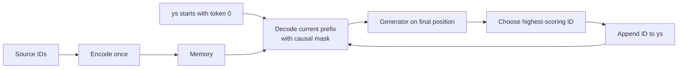
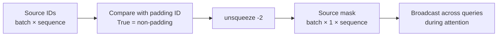
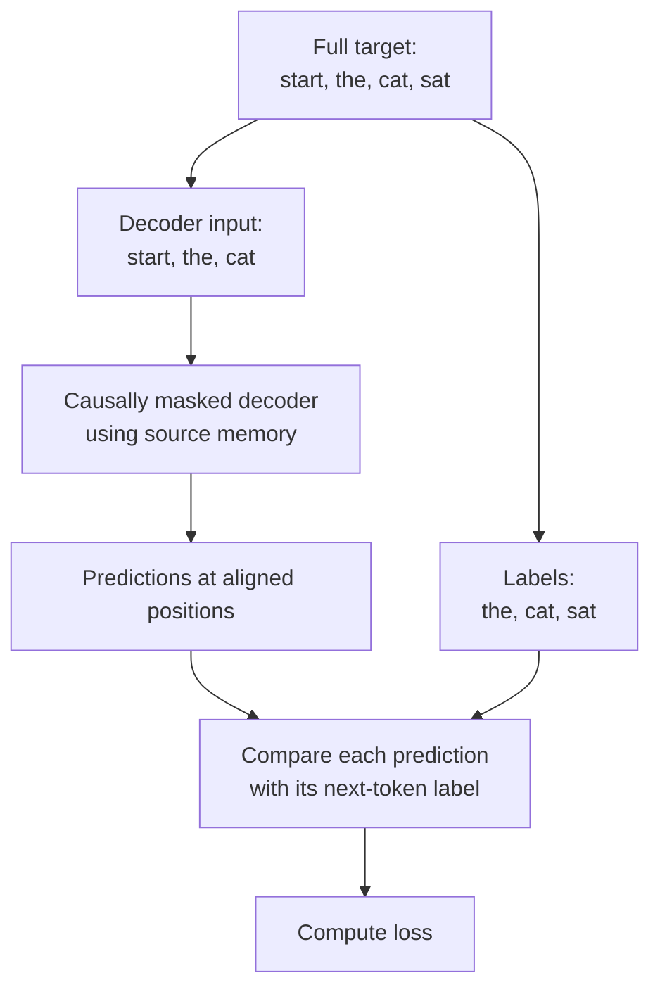

# 🏋️ Class 09: Assembling and Training a Transformer from Scratch
### 📋 Production AI / LLM Engineering | Krish Naik Academy

**🎙️ Mentor:** Sourangshu Pal (Paul in the transcript)  
**⏱️ Duration:** 3 hours 21 minutes 49 seconds | **📅 Session:** Day 9 (22 August 2026)

**Class recording:** [22 Aug Transformer practical](https://learn.krishnaikacademy.com/web/courses/6a16f8935e281281cd6b1128?chapter=6a8a82223ba992c9d997bfcd)

This session connects the previous class's components into an encoder–decoder model, checks its forward path with untrained greedy decoding, constructs batch masks and shifted target labels, and explains the training loop and learning-rate schedule. The longest discussion concerns aligning decoder inputs with next-token labels through two slices of the same target.

The lesson stops at the warmup schedule, before detailed label smoothing and real dataset training. The companion notebook contains later sections and stored results; their presence does not mean they were taught or rerun today.

---

## 📰 Quick Updates

- Paul shared an updated Annotated Transformer notebook, including an inference cell with extra print statements. The exact 22 August version supplies the code below: [class notebook](https://drive.google.com/file/d/1y9MZUINtAG3a3SwcfnKrPHro18uUpvEe/view?usp=sharing).
- Learners were asked to inspect shapes, masks, data types, and intermediate outputs while debugging. Repeated reading and small experiments were presented as the way to make scratch code familiar.
- Graded assignments would start after tokenization. A later task would replace the current tokenizer with a subword approach and work toward the larger WMT task.
- A transition to the academy's Forward Deployment Engineering course was discussed for learners whose goals favored consulting and adoption work over implementation depth. Eligibility and logistics belong with the academy.
- GPU-provider and API-credit discussions remained exploratory. The class did not establish a guaranteed credit allocation, a universal cheapest provider, or a measured runtime for the proposed larger training job.

---

## 🧩 Reconnecting the Earlier Components

Paul starts with the architecture code. The encoder processes source tokens; the decoder processes target-side tokens while attending to the encoder output, called **memory**. The generator converts decoder features into target-vocabulary scores.

| Component | Responsibility |
|---|---|
| Source embedding and position information | Represent source IDs as position-aware vectors |
| Encoder stack | Produce the source representation sequence |
| Decoder stack | Combine target-prefix information with source memory |
| Target embedding and position information | Represent the decoder's input IDs |
| Generator | Project features to vocabulary scores and apply log-softmax |
| Source mask | Exclude padded source positions from attention |
| Target mask | Combine target padding and causal restrictions |

The **generator** is a neural-network module, not Python's lazy-iteration generator. Its actual forward method uses log-softmax, so it returns **log-probabilities**, rather than raw logits or ordinary probabilities.

The encoder has two sublayers: self-attention and feed-forward. The decoder has three: masked self-attention, source attention, and feed-forward. **Source attention** is the implementation's name for cross-attention: queries come from the decoder, while keys and values come from source memory. These counts explain why the encoder and decoder have different numbers of residual sublayer connections.

### Deep copies preserve separate layer objects

The cloning helper uses deepcopy and a ModuleList. Repeated structure should not unintentionally reuse one mutable parameter set. Deep copies begin with copied values but have separate parameter objects that can subsequently learn independently.

The code also differs from the paper's pictured normalization order. Its SublayerConnection normalizes before the sublayer, then adds the residual. The notebook explicitly says this is for code simplicity. Reading the forward method is more reliable than assuming its “residual followed by layer norm” docstring describes execution order.

In the recap, Paul identifies layer normalization's learned scale and shift, initially ones and zeros, and epsilon for stable division. Normalization does not generally place all features between zero and one. Similarly, the sine/cosine recap concerns alternating **feature dimensions**, rather than even and odd token positions.

---

## 🏭 The Factory Function: Constructing the Model

The make_model function assembles the previously defined components. Paul calls it a **factory function**: configuration values go in, and a connected model object comes out.

The exact class source is:

```python
def make_model(
    src_vocab, tgt_vocab, N=6, d_model=512, d_ff=2048, h=8, dropout=0.1
):
    "Helper: Construct a model from hyperparameters."
    c = copy.deepcopy
    attn = MultiHeadedAttention(h, d_model)
    ff = PositionwiseFeedForward(d_model, d_ff, dropout)
    position = PositionalEncoding(d_model, dropout)
    model = EncoderDecoder(
        Encoder(EncoderLayer(d_model, c(attn), c(ff), dropout), N),
        Decoder(DecoderLayer(d_model, c(attn), c(attn), c(ff), dropout), N),
        nn.Sequential(Embeddings(d_model, src_vocab), c(position)),
        nn.Sequential(Embeddings(d_model, tgt_vocab), c(position)),
        Generator(d_model, tgt_vocab),
    )

    # This was important from their code.
    # Initialize parameters with Glorot / fan_avg.
    for p in model.parameters():
        if p.dim() > 1:
            nn.init.xavier_uniform_(p)
    return model
```

The short name c means **deep copy**; c(attn) does not mean cross-attention. The decoder receives two independent attention copies, one for target self-attention and one for source attention. Source and target embeddings use their respective vocabulary sizes.

| Argument | Default | Meaning |
|---|---:|---|
| N | 6 | Depth used for both stacks by this factory |
| d_model | 512 | Common representation width |
| d_ff | 2048 | Feed-forward inner width |
| h | 8 | Attention head count |
| dropout | 0.1 | Configured dropout probability |
| src_vocab / tgt_vocab | Supplied | Number of entries in each vocabulary |

The paper's **base** and **big** configurations were mentioned. They are not the encoder versus decoder halves, and they are not the names of the smaller Multi30k versus larger WMT datasets. Architecture scale and data choice are separate experimental decisions.

### What the initialization condition checks

The condition p.dim() > 1 checks the number of **axes** of a parameter tensor. It does not check whether an embedding width is greater than one or reject a “zero-dimensional model.” Matrix-like parameters receive Xavier initialization; one-dimensional parameters, such as many biases and normalization coefficients, keep their earlier initialization.

Paul suggested experimenting with other initializations. Their impact is not universally restricted to a tiny change in a final decimal: initialization can materially affect optimization. The practical lesson is to inspect and test the selected scheme.

---

## 🧪 Untrained Inference: Checking the Wiring

Before loading actual data, Paul tests whether the components can process an input and produce an output. This is a **structural check**, not a translation-quality test or proof that the model has learned to copy numbers.

The example uses vocabulary sizes 11 and 11, stack depth two, and source IDs 1 through 10. Torch's long type is the integer representation needed for token indices; the retrieved embedding vectors have a different, floating-point representation.

The source mask contains ones because this sample has no padded positions. Its shape is **1 × 1 × 10**; it is not merely a flat ten-item vector. Its singleton axis supports attention broadcasting.

The actual test is:

```python
def inference_test():
    test_model = make_model(11, 11, 2)
    test_model.eval()
    src = torch.tensor([[1, 2, 3, 4, 5, 6, 7, 8, 9, 10]], dtype=torch.long)
    src_mask = torch.ones(1, 1, 10)

    memory = test_model.encode(src, src_mask)
    ys = torch.zeros(1, 1).type_as(src)

    for i in range(9):
        out = test_model.decode(
            memory, src_mask, ys, subsequent_mask(ys.size(1)).type_as(src.data)
        )
        prob = test_model.generator(out[:, -1])
        _, next_word = torch.max(prob, dim=1)
        next_word = next_word.data[0]
        ys = torch.cat(
            [ys, torch.full((1, 1), next_word, dtype=ys.dtype)], dim=1
        )

    print("Example Untrained Model Prediction:", ys)
```

Paul adds a second version with print statements to expose every step. Both versions and their outputs are preserved in the class notebook.

### One start symbol, then a growing prefix

The initial ys contains one zero. In **this test**, ID 0 acts as a start symbol supplied by the program. It is not predicted. Special-token IDs are vocabulary choices, so zero is not a universal starting requirement.

The encoder produces memory once. The decoder then receives that memory and the current prefix. Its final position goes through the generator, the highest-scoring ID is selected, and that ID is appended. The next pass consumes the expanded prefix.



The printed example starts **[0] → [0, 9] → [0, 9, 1]** and continues growing. Those particular IDs come from untrained random parameters, not useful facts to memorize. The outer test creates a model ten times, so new initial parameters can yield different outputs.

### The last position is not the last vocabulary word

The decoder returns a representation for each prefix position. The slice out[:, -1] selects its final **position**, used to predict the next token. It does not imply that the last vocabulary entry has the highest probability.

Log-softmax preserves the ranking of probabilities, so selecting the largest log-probability chooses the same ID as selecting the largest probability. Torch's max operation along a dimension returns both a maximum value and its index; this code discards the value and keeps the index. The older data[0] expression selects the first batch element.

This is **greedy decoding**: choose one best-scoring candidate at each step. The test runs nine iterations and contains no end-token stopping condition. That range is a demonstration choice, not a universal output length.

### Evaluation mode and gradient recording

Evaluation mode changes modules such as dropout; it does not itself disable autograd. The provided test has no no-grad or inference-mode context, so it is not an optimized inference implementation. These are separate PyTorch controls. [Module evaluation mode](https://docs.pytorch.org/docs/2.14/generated/torch.nn.Module.html#torch.nn.Module.eval), [autograd modes](https://docs.pytorch.org/docs/2.14/notes/autograd.html#locally-disabling-gradient-computation)

---

## 📦 The Batch Object: Data, Masks, and Token Counts

The next section constructs a batch manually. Besides source IDs, training needs decoder input IDs, next-token labels, and masks specifying allowed attention connections.

The exact class implementation is:

```python
class Batch:
    """Object for holding a batch of data with mask during training."""

    def __init__(self, src, tgt=None, pad=2):  # 2 = <blank>
        self.src = src
        self.src_mask = (src != pad).unsqueeze(-2)
        if tgt is not None:
            self.tgt = tgt[:, :-1]
            self.tgt_y = tgt[:, 1:]
            self.tgt_mask = self.make_std_mask(self.tgt, pad)
            self.ntokens = (self.tgt_y != pad).data.sum()

    @staticmethod
    def make_std_mask(tgt, pad):
        "Create a mask to hide padding and future words."
        tgt_mask = (tgt != pad).unsqueeze(-2)
        tgt_mask = tgt_mask & subsequent_mask(tgt.size(-1)).type_as(
            tgt_mask.data
        )
        return tgt_mask
```

The optional target permits source-only construction. When a target exists, the object prepares the decoder input, its labels, the combined mask, and a non-padding label count.

### Padding is a selected ID

For this example, **pad = 2**. The comparison src != pad returns True for real tokens and False for padding. Paul draws the Boolean result before discussing its shape:

| Source row in the PDF | Comparison with pad = 2 |
|---|---|
| [1, 3, 2, 4] | [True, True, False, True] |
| [2, 8, 1, 0] | [False, True, True, True] |

Under that rule, zero is not padding. The chosen vocabulary and padding configuration must agree; changing one alone changes which positions are excluded.

### Unsqueeze inserts an axis

The PDF follows a **(2, 4)** array through unsqueeze(-2) to **(2, 1, 4)**. Its values do not change. A singleton axis is inserted at the second-from-last position so the mask can broadcast across query positions.



This translates the source-mask sketch in **Annotated TF (1).pdf**. The comparison supplies Boolean information; unsqueeze supplies shape compatibility. They are separate operations.

### Why count non-padding labels?

The ntokens field counts labels that should contribute to loss and reporting. Padding supports compatible batch shapes but is not a real prediction target in this setup. Including padding in the denominator would make batch comparisons misleading.

The count comes from tgt_y, the shifted **labels**, not just the source or unshifted target. Paul revisits this during the loop explanation: the useful count is the number of non-padding target tokens.

---

## ↔️ Target Shifts: Predict the Next Token

The class spends substantial time on:

```python
self.tgt = tgt[:, :-1]
self.tgt_y = tgt[:, 1:]
```

These slices create two aligned sequences from the **same full target**. The first excludes the last token and supplies decoder input; the second excludes the first token and supplies the next-token label at each position.

The whiteboard's two-row numerical example is:

| Full target | Decoder input | Next-token labels |
|---|---|---|
| [1, 2, 3, 4] | [1, 2, 3] | [2, 3, 4] |
| [5, 6, 7, 8] | [5, 6, 7] | [6, 7, 8] |

At the first output position, the model should predict the label following the first input token. At the second position, it predicts the next label. Causal masking prevents inspection of later target inputs.

The PDF also uses **[start, the, cat, sat]**. Decoder input becomes **[start, the, cat]**, and labels become **[the, cat, sat]**. The token offset is the point, rather than any particular numerical IDs.



This preserves the whiteboard's input-versus-label structure while clarifying its occasional loose use of “encoder phase.” These slices change target-side decoder inputs and labels; they do not shift the encoder's source sentence.

### More than shape matching

Both slices have equal length, permitting comparison. Their offset also defines the objective: **given preceding target context, predict the next target token**. Aligning each token with itself would change the task.

Paul uses **“I love …” → “dogs”** as an analogy. The prediction must be compared with the actual next word in the dataset. Another ground-truth word changes the loss; a plausible example is not automatically a correct model output.

This is **teacher forcing**: during training, true preceding target tokens are supplied. During free-running inference, the prefix contains the model's own generated tokens. The fill-in-the-blank analogy does not make this causal next-token objective identical to BERT-style masked language modeling.

Ground truth means the intended labels in the data. The model produces a distribution over candidates, and loss evaluates that distribution against aligned labels; loss is not limited to comparing two lists of argmax IDs.

With a causal mask, training can compute predictions for all target positions together while respecting the permitted context at each position. Generation still extends a prefix one token at a time. Keeping those two procedures distinct resolves much of the confusion in this section.

---

## 🎭 Combining Padding and Causal Restrictions

The target mask requires an allowed source position on the target side to be both **non-padding** and **not in the future** relative to the query. The Boolean tensor AND operation combines those restrictions. Paul explicitly distinguishes it from addition.

The helper constructs future locations using an upper triangle and returns their complement:

```python
def subsequent_mask(size):
    "Mask out subsequent positions."
    attn_shape = (1, size, size)
    subsequent_mask = torch.triu(torch.ones(attn_shape), diagonal=1).type(
        torch.bool
    )
    return subsequent_mask == 0
```

Its final True values form a lower triangle, including the diagonal. “Upper triangular” refers to locations identified for blocking, not the final allowed positions.

The target padding mask starts at **batch × 1 × target length**. Combining it with the causal mask supplies restrictions for query/key pairs. The attention code later expands it for heads and suppresses blocked scores before softmax.

The static make_std_mask method uses explicit target and padding arguments without needing instance state. It belongs to the class namespace and can be called through the class without passing self.

Masking does not itself replace IDs with zero or generate tokens. It restricts attention. Tokenization, special-token IDs, target alignment, and attention masks remain separate responsibilities.

---

## 🔄 The Epoch Loop: Forward, Loss, Backward, Update

Paul next reads TrainState and run_epoch. The state records processed batches, examples, tokens, and optimizer updates. Increasing those counters is bookkeeping, not a weight update.

Each batch passes through the complete model. The custom loss helper returns:

- **loss:** a detached reporting quantity for totals.
- **loss_node:** a differentiable tensor attached to the graph for backward propagation.

These are notebook-specific names, not required dual outputs of every PyTorch criterion. Its later helper confirms the relationship: it returns sloss.data multiplied by the token count, and sloss itself. The first supports totals; the second is the token-normalized differentiable loss.

The actual inner training block is:

```python
out = model.forward(
    batch.src, batch.tgt, batch.src_mask, batch.tgt_mask
)
loss, loss_node = loss_compute(out, batch.tgt_y, batch.ntokens)
# loss_node = loss_node / accum_iter
if mode == "train" or mode == "train+log":
    loss_node.backward()
    train_state.step += 1
    train_state.samples += batch.src.shape[0]
    train_state.tokens += batch.ntokens
    if i % accum_iter == 0:
        optimizer.step()
        optimizer.zero_grad(set_to_none=True)
        n_accum += 1
        train_state.accum_step += 1
    scheduler.step()
```

This excerpt removes only outer indentation for display; it remains the code inside the batch loop.

| Action | Responsibility |
|---|---|
| backward | Differentiate the graph and accumulate gradients |
| optimizer step | Change parameters using those gradients |
| zero_grad | Clear gradient storage |
| scheduler step | Advance the learning-rate schedule |

Paul connects backward to automatic differentiation and the chain rule. **Autograd** is PyTorch's name for that machinery, not an alternative to automatic differentiation. The optimizer performs updates after gradients exist.

In the function's eval mode, its training branch is skipped, so it does not call backward or the optimizer. That string does not independently call model.eval or disable graph recording; callers handle those controls.

---

## 🧠 Gradient Accumulation: Intent and Actual Loop Behavior

Accumulation processes several smaller microbatches before updating parameters. It can approximate a desired larger batch when that batch's activations do not fit in GPU memory simultaneously.

The intended cycle is: forward/backward on successive microbatches → retain gradient contributions → update at the chosen boundary → clear gradients for the next group. It does not require retaining a separate old model for each microbatch.

The count is configurable. More accumulation changes update frequency and effective-batch behavior; it is not automatically faster or mandatory for every task. Loss scaling and scheduler step units must be specified consistently.

### Read the supplied example literally

Its code differs in several ways from a simple “update after four batches” description:

1. Enumeration starts at **i = 0**, so the condition is true for the first batch. With accumulation count four, updates occur at indices **0, 4, 8, …**; the first update includes only one batch.
2. Division of loss_node by accum_iter is commented out. Gradients are summed, not automatically averaged over equally weighted microbatches.
3. The scheduler advances every training batch, outside the less frequent optimizer-update boundary.
4. No explicit final incomplete-group flush appears. Remaining gradients can persist into another call if surrounding code does not clear them.

These are observations from the exact companion source. Check them before reusing the teaching function as a precise large-batch implementation. No repaired code is substituted for the original.

### None versus zero gradients

The set_to_none=True option clears gradient fields to **None**, not zero-filled tensors. PyTorch documents possible memory benefits and behavioral differences for parameters without gradients. “Clear gradient storage” is the accurate description. [PyTorch zero_grad documentation](https://docs.pytorch.org/docs/2.14/generated/torch.optim.Optimizer.zero_grad.html)

Deleting local loss variables removes references, but does not guarantee immediate release of all GPU allocations if other references or allocator caches remain.

---

## 📊 Progress Reporting: What the Counters Mean

Paul reads the loop's loss, token throughput, elapsed time, and current-learning-rate logging. Several counters describe different quantities:

| Counter | Meaning |
|---|---|
| Batch step | Batches processed |
| Accumulation/update step | Optimizer updates under the selected boundary logic |
| Samples | Examples seen |
| Tokens | Non-padding target labels seen |
| Epoch | A pass through the selected training data iterator |

Large jobs often emphasize steps, but epochs still make sense when data traversal is defined. Neither concept is restricted to a particular model size.

The actual logging condition is **i % 40 == 1**, giving printed indices 1, 41, 81, and so on. The number is a reporting choice; odd-numbered logging intervals are not invalid.

The epoch returns **total reporting loss divided by total non-padding tokens**, along with TrainState. Interpreting that average requires knowing the criterion and the helper's normalization.

Stored later Multi30k logs demonstrate the eventual report format, but the transcript does not show that dataset-training section being taught or rerun today. This lesson prepares the machinery needed for it.

---

## 📈 Adam and the Warmup Schedule

The final topic translates the paper's learning-rate formula into code. The referenced Adam settings are **β₁ = 0.9**, **β₂ = 0.98**, and **ε = 10⁻⁹**. Epsilon should not be read as 10.9.

The schedule is:

$$
\operatorname{lr}(s)=d_{model}^{-0.5}
\min\left(s^{-0.5},\ s\,w^{-1.5}\right)
$$

The original warmup length w is **4000 steps**. The lecture briefly says 400 before returning to 4000; the source and plotted original configuration establish the intended value.

The first branch decreases with inverse square root of the step number. The second grows linearly while warmup length remains fixed. Their minimum produces an initial rise, a peak at the warmup boundary, and decay afterward.

Warmup begins at a **small** rate and raises it. It does not mean starting with the maximum rate or running a separate pretraining phase before training.

The exact helper is:

```python
def rate(step, model_size, factor, warmup):
    """
    we have to default the step to 1 for LambdaLR function
    to avoid zero raising to negative power.
    """
    if step == 0:
        step = 1
    return factor * (
        model_size ** (-0.5) * min(step ** (-0.5), step * warmup ** (-1.5))
    )
```

The zero-step guard avoids a negative power of zero. Factor scales the curve. Model size also changes the overall scale and should not be ignored because it sits outside the minimum.

Paul compares **512:4000**, **512:8000**, and **256:4000** configurations. Longer warmup delays the peak; model width changes the scale. The curve is predetermined by steps, rather than an automatic detector of convergence or a local minimum.

LambdaLR multiplies the optimizer's initial rate by the returned factor. In the plotting example, base lr=1 makes the numerical multiplier equal the displayed rate. Another base rate changes the actual rate. [PyTorch LambdaLR](https://docs.pytorch.org/docs/2.14/generated/torch.optim.lr_scheduler.LambdaLR.html)

---

## 🖥️ Moving from the Teaching Model to Larger Jobs

The closing hardware discussion emphasizes choosing compatible resources and considering the total job cost. Paul discusses local hardware, hosted notebooks, A100/H100-class resources, and task-based serverless execution.

The reusable decisions are to distinguish **system RAM from VRAM**, check the code's supported backend, and compare the cost of completion. An hourly price alone omits duration, billing increments, storage, and teardown behavior.

Serverless execution was proposed to avoid retaining an instance after a job completes and its outputs are saved. It is not guaranteed cheaper for every workload. Historical provider prices, rankings, and unmeasured runtime estimates are therefore not turned into current purchasing recommendations here.

The final substantive questions arrive after an initial goodbye. Sai Kiran asks whether this full pipeline is universal practice; Paul identifies it as a paper-oriented teaching implementation whose optimization differs from production systems. Prabu asks why local tools were installed if execution is remote; editing and environment management still matter, and compatible local hardware can also execute the work.

The future WMT English–German task uses approximately **4.5 million sentence pairs**, not the five-billion figure spoken near the end. The companion's later configured Multi30k pipeline actually uses **German source and English target**, although some live explanations describe English-to-German. Check the actual language pipelines rather than assuming the direction.

---

## 🗺️ What's Next

Paul planned to resume with **label smoothing** and KL-divergence-based loss, then work through synthetic data, reusable greedy decoding, data loading, and Multi30k training.

Label smoothing received only an introduction: avoid concentrating the target entirely on one class. Its implementation was deferred. The remaining probability mass concerns other vocabulary classes, not necessarily neighboring words in the sentence.

Tokenization would follow, including BPE, SentencePiece, and WordPiece. Learners would then revisit this architecture, replace parts of its tokenizer/data setup, and attempt a larger task. Larger-scale training and post-training projects remained future work.

---

## 💬 Live Q&A Highlights

Most doubts were relayed through chat. Arsha spoke during the break; **Sai Kiran Akula** and **Prabu Manickam** asked the final open-floor questions after the first sign-off. All substantive late follow-ups are retained.

| Question | Answer |
|---|---|
| **Debal:** Is the practical teaching another attention idea? | It implements the earlier concepts and connects their components. Shapes, data flow, masking, and training machinery add the practical detail. |
| **Yogesh:** What is Xavier uniform? | A parameter initialization scheme used here for multi-axis tensors. The factory's condition checks rank, and later experiments can compare initialization choices. |
| **Kuman, name unclear:** Why exclude dim ≤ 1? | The selected scheme targets matrix-like parameters. One-dimensional biases and normalization coefficients retain their earlier initialization; this is not a check that a model has no features. |
| **Uday / Udna, name unclear:** Why do repeated IDs appear? | The model is untrained, so repetition has no demonstrated semantic meaning. Each chosen ID extends the current prefix; recreating parameters may change the output. |
| **Yogesh:** Does the last word have the highest probability? | The final decoder position predicts the next token. The winning vocabulary ID depends on the distribution, not its place at the end of a vocabulary. |
| **Nithin:** What do the final loop lines do? | They extract the selected ID and append it to ys. The next call sees that larger prefix and a matching causal mask. |
| **Sarvichith:** Why does padding ID 2 become False? | The comparison excludes IDs equal to the configured padding value. Another tokenizer can assign a different ID. |
| **Chat question:** What changes with unsqueeze(-2)? | A singleton axis is inserted: the board's (2, 4) becomes (2, 1, 4). Values and Boolean meanings stay the same. |
| **Gaurav:** Why use both target slices? | Excluding the last token creates decoder input; excluding the first creates next-token labels. Their offset defines the prediction alignment. |
| **Thomas:** Is one shift for forward and one for backward? | Both prepare the forward input/label relation. Backward begins after differentiable loss is computed. |
| **Ganesh:** Is this teacher forcing? | During training the decoder receives true preceding targets. During generation it instead extends its own selected prefix. |
| **Anhu / Paritosh:** Why a static mask method? | It uses the arguments supplied directly and does not require instance state. It can be invoked through the class namespace. |
| **Navalita, name unclear:** Are steps only for large networks? | Steps describe loop work or updates, while epochs describe data passes. Both are useful across model sizes. |
| **Chat questions:** Why accumulate gradients? | To process a larger effective batch as memory-fitting microbatches. Update boundaries, scaling, and scheduler units must match the intended training behavior. |
| **Gaurav:** What does the scheduler control? | Learning rate according to a selected schedule. The shown function follows steps, not a loss-based convergence detector. |
| **Satha, name unclear:** How should a paper be read? | Paul suggested component breakdown, comparison with alternatives, and benchmark inspection before deeper reading. This was his workflow rather than a universal rule. |
| **Arsha:** How can missed classes be caught up? | Recordings and resources are organized in Notion. Revisit theory and code, then practice tracing and debugging small examples. |
| **Rushi and hardware questions:** Why serverless? | Paul wanted execution and teardown after outputs were saved. The actual cost advantage depends on the workload and provider. |
| **Arun:** Can local hardware run the job? | Yes, if resources and the supported backend are suitable. Clarify RAM versus VRAM; the mentioned Intel hardware was not validated in class. |
| **Chat questions:** Must everyone use one provider or eight GPUs? | No common provider was required, and students were not asked to rent an eight-GPU cluster for the upcoming task. Plan around the actual job. |
| **Sai Kiran Akula:** Is every production pipeline like this notebook? | It is a research teaching implementation. Production systems can package and optimize the responsibilities differently; it is not a universal standard. |
| **Prabu Manickam:** Why install local VS Code and uv for cloud training? | Local development and environment work remain useful. Execution can be local with suitable hardware or remote when that fits the task. |

---

## 🔑 Key Pointers to Remember

- A factory connects existing modules; c(attn) means deep copy here.
- N is stack depth; h is head count; vocabulary size is another quantity.
- The companion's residual helper normalizes before its sublayer.
- The generator returns log-probabilities over target vocabulary entries.
- Untrained inference checks wiring, not task quality.
- The start ID is specific to the vocabulary and demonstration.
- Memory is encoder output; the decoder extends its prefix.
- Last decoder position does not mean last vocabulary word.
- Padding comparisons create Booleans; unsqueeze adds an axis.
- Target input and label slices define a next-token offset.
- Those slices do not shift the encoder's source.
- AND combines padding and causal restrictions.
- Non-padding labels supply the meaningful loss denominator.
- Backward calculates gradients; the optimizer changes parameters.
- The shown zero-based accumulation condition triggers on the first batch.
- Accumulation scaling and schedule step units require inspection.
- Clearing gradients to None is distinct from setting zero tensors.
- Warmup rises from a low rate before inverse-square-root decay.
- LambdaLR's factor multiplies the optimizer's base rate.
- Detailed regularization and dataset training were deferred.

---

## ✅ Action Items After Class 09

- [ ] Open the exact class notebook and separate today's cells from later examples.
- [ ] Trace the factory from vocabulary sizes to each major module.
- [ ] Print prefix, output shape, and mask size at successive decoding steps.
- [ ] Explain why untrained outputs cannot validate translation quality.
- [ ] Recreate the PDF's padding comparison and shape change.
- [ ] Apply both target slices to its numerical and text examples.
- [ ] Trace a target position's permitted context and next-token label.
- [ ] Inspect the final causal mask, including the diagonal.
- [ ] Separate reporting loss, differentiable loss, backward, update, and clearing.
- [ ] Trace optimizer indices for accumulation count four.
- [ ] Check loss scaling, incomplete groups, and scheduler batch/update units.
- [ ] Read the warmup function alongside all three plotted configurations.
- [ ] Revise before the next label-smoothing and data-training lesson.

---

*📝 Notes compiled from the full Class 09 transcript — **GMT20260822-143017_Recording.cutfile.20260823051524431.transcript.vtt** — the accompanying **Annotated TF (1).pdf**, and the exact [22 August notebook](https://drive.google.com/file/d/1y9MZUINtAG3a3SwcfnKrPHro18uUpvEe/view?usp=sharing), for “[22 Aug Transformer practical](https://learn.krishnaikacademy.com/web/courses/6a16f8935e281281cd6b1128?chapter=6a8a82223ba992c9d997bfcd),” Production AI / LLM Engineering, Krish Naik Academy. All eight transcript parts, all 125 notebook cells, and all five PDF pages were read or inspected fully. Code preserves actual companion source; only outer indentation is removed from the loop excerpt. PDF structures supply the mask and target-alignment diagrams. No training was performed while compiling the notes; stored outputs are not represented as a new run.*
