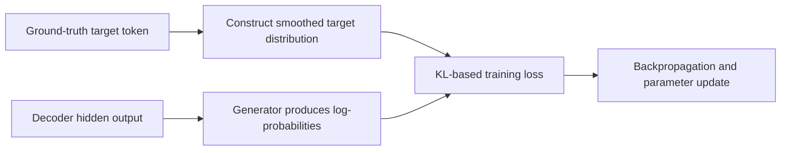
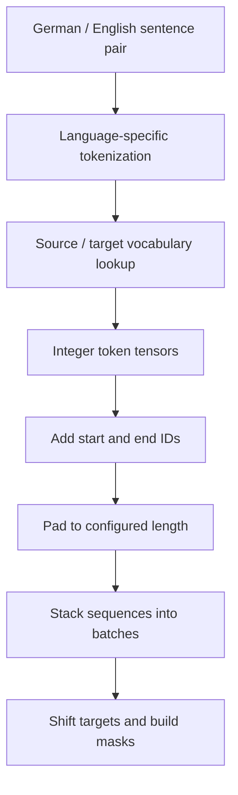
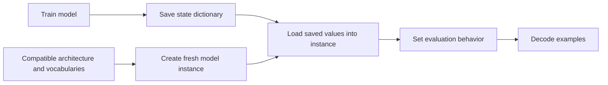

# 🧪 Class 10: Training and Evaluating the Transformer Translation Model
### 📋 Production AI / LLM Engineering | Krish Naik Academy

**🎙️ Mentor:** Sourangshu Pal (Paul)  
**⏱️ Duration:** ~3 hours 35 minutes (3hr 34min 57s) | **📅 Session:** Day 10 (23 August 2026)

---

## 📰 Quick Updates

- The session completed the current **Annotated Transformer** practical sequence: regularization/loss, a synthetic copy-task check, real translation data, training/checkpointing, and qualitative inference results.
- Missing meeting emails could be bypassed by using the dashboard's Workshop section. Expired Discord invitations could be renewed through the course's established contact channel.
- Paul asked learners to reserve regular weekday revision time. The immediate practice task was to compare **10-, 20-, and 30-epoch** translation runs; optional extensions were modular Python code and Weights & Biases logging.
- The next topic would be tokenization, followed by an upgraded implementation. The architecture built here was a small encoder–decoder trained from scratch, **not** fine-tuning an existing pretrained LLM.
- These notes use the entire class transcript, all four pages of **AT 2.pdf**, and the complete 124-cell shared annotated-transformer notebook. Only its class-matching material is incorporated below. Saved notebook outputs are source evidence, not new executions performed while compiling these notes.

---

## 🏗️ The Architecture Is Ready—Now Train Its Parameters

Paul first revisited the components assembled in the earlier practicals. `EncoderDecoder` connects source embeddings/encoder memory to target embeddings/decoder output. `Generator` turns a final hidden vector into vocabulary scores and log-probabilities. `make_model` is the factory function that constructs this network; the **returned instance** is the model, rather than the function itself being a model object.

| Component revisited | Role in this class's training pipeline |
|---|---|
| Encoder/decoder layers | Transform source and target-prefix representations |
| Residual and normalization wrappers | Connect each sublayer with its input representation |
| Self/source attention | Respect target causality and let the decoder use source memory |
| Token/position embeddings | Convert token IDs to model-width vectors with positional information |
| Generator | Project decoder vectors to target-vocabulary log-probabilities |
| Batch | Hold source, shifted target inputs/labels, masks, and non-padding token count |
| Loss compute object | Turn generated log-probabilities and labels into a differentiable loss |
| Optimizer/scheduler | Update parameters and set the learning rate |

The source uses width 512, eight attention heads, feed-forward width 2048, and six layers per stack for the real translation model. The smaller copy example uses two layers. These are architectural choices, not hard limits on transformer depth.

Paul emphasized that the backbone can already produce numbers before training. That is a wiring check, not evidence that it has learned translation. Training changes the parameters so that those numbers become useful conditional predictions.

The supplied notebook explicitly uses a normalization-before-sublayer wrapper for implementation simplicity. Its surrounding prose also describes the original paper's Add & Norm ordering. Read the **actual function** when following the code; this practical is an educational adaptation of the paper, not a claim that every detail is an identical benchmark reproduction.

---

## 📏 Perplexity and BLEU Measure Different Things

Paul used two metrics to frame the next discussion. **Perplexity** concerns how much probability the model gives to reference tokens. **BLEU** compares generated translations with reference translations using lexical sequences. Neither is simply a synonym for “the model is correct.”

| Metric | Better direction in a comparable evaluation | What to retain from the class |
|---|---|---|
| Perplexity | Lower | The reference continuation is less surprising under the model |
| BLEU | Higher | More reference-compatible n-gram precision, with length effects accounted for |

Perplexity is the exponential of average negative log-likelihood. It uses the assigned probabilities, not only whether the most probable token happened to be correct. Tokenization and available context affect comparisons; a score is meaningful only with its evaluation setup. The [Hugging Face perplexity guide](https://huggingface.co/docs/transformers/perplexity) gives the formal definition and explains these dependencies.

The PDF contrasted lower/higher perplexity and lower/higher BLEU, then used the short example “The cat eats fish” versus “The cat is eating fish.” Paul used the overlap to build intuition. The complete BLEU metric uses **modified n-gram precision and a brevity penalty**, rather than only a count of individual overlapping words. See the [original BLEU paper](https://aclanthology.org/P02-1040/).

This distinction becomes important in the later output examples: a sentence can share many words with its reference while changing who did what, substituting a location, or producing an implausible event. A high-looking word overlap is not a guarantee of semantic fidelity or natural language quality.

ROUGE and METEOR were mentioned as other comparison metrics, but were not implemented. They should not be treated as merely stricter versions of one identical BLEU formula. In the final Q&A, Paul explicitly said **no full metric evaluation had been performed in this notebook**. The displayed translations were inspected qualitatively; no measured BLEU, perplexity, or “50% accuracy” result was established during this session.

---

## 🎯 Label Smoothing Softens the Target Distribution

Ordinary hard labels assign all target mass to one correct class. Label smoothing replaces that hard target with a softer training distribution. It discourages the model from fitting every training label with extreme confidence and can act as regularization.

Paul's three-class example was:

| Target | Cat | Dog | Bird |
|---|---|---|---|
| Hard label |1|0|0|
| Smoothing 0.1, distributed over the other classes |0.9|0.05|0.05|

The important correction is **where the change occurs**. The implementation does not examine the model's highest predicted probability and deduct 10% from that prediction. It constructs a new distribution around the **ground-truth target token** and compares the model with it. The predicted argmax can be wrong; the smoothing operation still uses the known label.



The paper used smoothing 0.1. The visualization in this notebook used 0.4 to make the distribution easier to see, while the copy-task check used 0.0. These settings serve different demonstrations. Paul's suggested small practical range was a heuristic, not a framework law requiring every task to remain below 15% or to use label smoothing at all.

The original paper reports that smoothing **hurt perplexity while improving accuracy/BLEU** in its experiments: softer confidence can worsen a likelihood-based metric while helping another task measure. “Hurts perplexity” should not be read as “makes perplexity lower.” The benefit is an empirical tradeoff to evaluate, not a guarantee that smoothing improves every metric.

---

## 🧮 KL Divergence and the Generator's Log-Probabilities

The notebook implements smoothing using `nn.KLDivLoss`. KL divergence compares distributions in a directed way; it is not a symmetric distance. The generator returns **log-probabilities**, matching the loss's expected model input.

From the supplied notebook:

```python
class Generator(nn.Module):
    "Define standard linear + softmax generation step."

    def __init__(self, d_model, vocab):
        super(Generator, self).__init__()
        self.proj = nn.Linear(d_model, vocab)

    def forward(self, x):
        return log_softmax(self.proj(x), dim=-1)
```

`nn.Linear` produces logits; `log_softmax` gives the log of their normalized distribution. Although the class often called these “probabilities,” the distinction matters when choosing a loss function. Passing ordinary probabilities into a function expecting log-probabilities changes the calculation.

The [PyTorch KLDivLoss documentation](https://docs.pytorch.org/docs/stable/generated/torch.nn.modules.loss.KLDivLoss.html) specifies log-space model input and, by default, probability-space targets. In mathematical terms, this call evaluates target-versus-model divergence. `reduction="sum"` sums the loss elements; it does **not** force the scalar loss to equal one. The sum-to-one property belongs to a valid non-padding target distribution.

The class contrasted KL divergence with cross-entropy. That was motivation for this implementation, not proof that cross-entropy accepts only hard one-hot labels. PyTorch's [CrossEntropyLoss](https://docs.pytorch.org/docs/stable/generated/torch.nn.CrossEntropyLoss.html) supports class-probability targets and label smoothing too. What matters is matching each loss's input format and normalization to the intended objective.

`criterion` was the convention used for the loss object. It could refer to KL divergence, cross-entropy, MSE, or another appropriate objective; the variable name itself does not select the mathematics.

---

## 🧑‍💻 Read the LabelSmoothing Forward Pass in Order

The exact supplied implementation is:

```python
class LabelSmoothing(nn.Module):
    "Implement label smoothing."

    def __init__(self, size, padding_idx, smoothing=0.0):
        super(LabelSmoothing, self).__init__()
        self.criterion = nn.KLDivLoss(reduction="sum")
        self.padding_idx = padding_idx
        self.confidence = 1.0 - smoothing
        self.smoothing = smoothing
        self.size = size
        self.true_dist = None

    def forward(self, x, target):
        assert x.size(1) == self.size
        true_dist = x.data.clone()
        true_dist.fill_(self.smoothing / (self.size - 2))
        true_dist.scatter_(1, target.data.unsqueeze(1), self.confidence)
        true_dist[:, self.padding_idx] = 0
        mask = torch.nonzero(target.data == self.padding_idx)
        if mask.dim() > 0:
            true_dist.index_fill_(0, mask.squeeze(), 0.0)
        self.true_dist = true_dist
        return self.criterion(x, true_dist.clone().detach())
```

The sequence of operations explains the design:

1. Check that the prediction's vocabulary axis equals `size`.
2. Clone a tensor with the required shape, then overwrite its values with the uniform smoothing amount.
3. Place `confidence` at the **target-label index** using `scatter_`.
4. Zero the padding class's column.
5. Zero entire rows whose **ground-truth label** is padding, excluding them from loss.
6. Compare the model's log-probabilities with the detached target distribution.

The clone initially copies values as well as shape; the subsequent fill/scatter operations replace them. Detaching the target ensures this constructed supervision is not itself optimized through the prediction graph. The source's use of `.data` is part of the provided implementation, not an additional modern autograd pattern introduced by these notes.

Why `size - 2`? In this particular construction, the smoothing mass goes to all vocabulary classes except the correct class and the padding class. For a five-class vocabulary, padding index 0, correct class 2, and smoothing 0.1:

\[
q=[0,\;0.1/3,\;0.9,\;0.1/3,\;0.1/3].
\]

The non-padding row sums to one. If a task truly has no padding class, a corresponding different construction could distribute mass over four incorrect classes. Merely having no padding **positions in one batch** does not remove the padding class from this implementation's vocabulary or change its denominator automatically.

A padding label is different from a model accidentally predicting padding for a real target word. The former is deliberately excluded; the latter remains a prediction error. EOS is also distinct from padding: EOS marks sequence termination, while padding fills a batched representation.

---

## 🎨 The Saved Distribution Visualization

Paul walked through the example with vocabulary 5, padding index 0, smoothing 0.4, and labels `[2,1,0,3,3]`. The correct class receives 0.6 and each of the three other non-padding classes receives approximately 0.13333.

| Target label | Class 0 / pad | Class 1 | Class 2 | Class 3 | Class 4 |
|---|---|---|---|---|---|
|2|0|0.13333|0.6|0.13333|0.13333|
|1|0|0.6|0.13333|0.13333|0.13333|
|0 / padding|0|0|0|0|0|
|3|0|0.13333|0.13333|0.6|0.13333|
|3|0|0.13333|0.13333|0.6|0.13333|

These values agree with the notebook's recorded chart data. The dark padding column and all-zero padding-label row are different effects. The colored correct-class cells follow the labels, not the model's highest predicted score.

The separate confidence-penalization chart was not developed further; Paul said it was not needed for this walkthrough. The focus was the target distribution used by the translation loss.

---

## 🧱 Synthetic Copy Data: Check the Pipeline Before Translation

The first training task used a small integer vocabulary. It did not yet require German/English text or spaCy. The source generator was:

```python
def data_gen(V, batch_size, nbatches):
    "Generate random data for a src-tgt copy task."
    for i in range(nbatches):
        data = torch.randint(1, V, size=(batch_size, 10))
        data[:, 0] = 1
        src = data.requires_grad_(False).clone().detach()
        tgt = data.requires_grad_(False).clone().detach()
        yield Batch(src, tgt, 0)
```

`batch_size` counts sequences per batch; `nbatches` counts how many batches the generator yields. Each sequence has ten positions. `torch.randint(1,V,...)` uses an exclusive upper bound, so generated IDs range from 1 toV-1. The first column is overwritten with 1 as the demo's start convention.

Source and target are copies because the task is to reproduce the input symbols. Integer input data is not a learned parameter; gradients train the network processing it. `yield` makes batches available incrementally rather than requiring the function to construct one giant result list.

The copy-model function used vocabulary 11, two stack layers, batch 80, and a nominal 20-epoch loop. It checked training and evaluation passes with the previously defined loss/optimizer/scheduler helpers. Paul began the run, saw loss/logging activity, and stopped it once the wiring check was satisfied. The saved notebook records a **KeyboardInterrupt**, so it does not establish that this copy run completed all 20 epochs or produced the final expected copy output.

---

## 🔢 Vocabulary: Text In, Token IDs Through the Model, Text Out

The real task was **German-to-English**. The source dataset was loaded through `bentrevett/multi30k`; German and English spaCy tokenizers split the text. This is the word/token-level preparation used in the demonstration, not the BPE implementation planned for the next topic.

The custom `Vocab` object replaced vocabulary utilities used in an earlier version of the tutorial. Paul explained its two mappings as dictionaries:

- **`stoi`: string to index.** Convert a token into its numeric vocabulary ID.
- **`itos`: index to string.** Convert a generated ID back into a readable token.
- **Default index:** return the unknown-token ID when an input token is absent from the vocabulary.

The callable method converts a whole token sequence to IDs; `__getitem__` performs a lookup; `__len__` reports vocabulary size. These are normal Python protocol methods used to make the data path convenient.

| Reserved token | ID in this notebook | Purpose |
|---|---|---|
|`<s>`|0|Beginning of sequence|
|`</s>`|1|End of sequence|
|`<blank>`|2|Padding|
|`<unk>`|3|Unknown input token|

Reserved tokens count toward vocabulary size. Their IDs are a notebook convention, not universal IDs for every model. The separate source and target vocabularies may have different sizes; an English output index must be interpreted through the target vocabulary.

The recorded vocabulary sizes were **19,953 German/source tokens and 11,158 English/target tokens**. They are built from the tokenized dataset, not fixed sizes inherited from spaCy's language models. spaCy supplies the tokenization behavior; the counters and vocabulary code construct this experiment's mapping.

The notebook stores the mappings in `vocab.pt` and reuses them if that file exists. A model's embedding/output weights depend on those mappings; keeping compatible vocabularies is part of reproducible reload, not an optional display detail.

---

## 📚 From Sentence Pairs to Padded Batch Tensors

The dataset split sizes shown were 29,000 training examples,1,014 validation examples, and 1,000 test examples. `Multi30kDataset` exposes one German/English pair by index. Materializing its data as a list makes example indexing straightforward; that is different from the token-to-ID lookup inside `Vocab`.

`collate_batch` turns a list of those pairs into tensors. For each side, it tokenizes the sentence, maps tokens to IDs, creates an integer tensor, prepends the start ID and appends the EOS ID, and pads to the configured length. Finally, `torch.stack` combines the sequences into a batch.



The helper's default padding length was 128. **The final training configuration overrode it to 72.** Similarly, a large default batch-size argument in a helper was not the batch size actually used by the run. Follow the values passed from the final config, not only the defaults in function definitions.

The `Batch` wrapper then takes `tgt[:, :-1]` as decoder inputs and `tgt[:, 1:]` as labels. Its source mask hides source padding, and its target mask combines padding exclusion with the causal triangle. `ntokens` counts non-padding target labels for loss normalization.

Padding makes tensor shapes compatible for batching; masking prevents those filler positions from being treated as ordinary evidence or target supervision. This code uses a fixed length, so long examples also need deliberate handling. The supplied padding call is not an unlimited-length document-processing strategy.

---

## 🔥 Loss Computation Connects the Forward Pass to Backpropagation

The class defined a callable loss helper so the training loop could treat it like a function:

```python
class SimpleLossCompute:
    "A simple loss compute and train function."

    def __init__(self, generator, criterion):
        self.generator = generator
        self.criterion = criterion

    def __call__(self, x, y, norm):
        x = self.generator(x)
        sloss = (
            self.criterion(
                x.contiguous().view(-1, x.size(-1)), y.contiguous().view(-1)
            )
            / norm
        )
        return sloss.data * norm, sloss
```

The decoder output is first passed through the generator. Flattening combines batch and target-position axes so each row is a vocabulary distribution, while the labels become a matching flat list of target IDs. The criterion sums contributions, and division by `norm` gives a per-non-padding-token loss.

The two returned values have different jobs. The detached/raw value multiplied back by token count supports aggregate logging; the differentiable `sloss` stays connected to the computation graph so `backward()` can calculate parameter gradients.

Generation does not require a reference label or loss to choose the next token. **Validation can still calculate loss without updating parameters**, because reference examples are available there. “No optimizer update during evaluation” is not the same as “evaluation never computes loss.” The notebook's validation pass does compute it.

`model.train()` and `model.eval()` select module behavior such as dropout. Neither, by itself, disables autograd. A no-grad/inference context separately avoids recording unnecessary gradients, as explained in [PyTorch's autograd guide](https://docs.pytorch.org/docs/stable/notes/autograd). This matters when comparing saved checkpoints through the reload helpers.

---

## 📈 Optimizer, Warm-Up, and Gradient Accumulation

The tutorial uses Adam with beta values 0.9/0.98 and epsilon 1e-9, plus a schedule based on model width and step number. Although the live recap initially described starting with a high learning rate, the actual schedule **increases linearly during warm-up, then decays with inverse square root of step**.

The source function is:

```python
def rate(step, model_size, factor, warmup):
    """
    we have to default the step to 1 for LambdaLR function
    to avoid zero raising to negative power.
    """
    if step == 0:
        step = 1
    return factor * (
        model_size ** (-0.5) * min(step ** (-0.5), step * warmup ** (-1.5))
    )
```

The step-zero guard avoids raising zero to a negative power. The original paper's warm-up was 4,000; the real demonstration's config used 3,000. `LambdaLR` applies the function to the optimizer's base rate, so a config label such as `base_lr=1.0` does not mean every observed training step uses learning rate 1.

Gradient accumulation was introduced to obtain an update from several smaller microbatches when processing one larger batch at once would use too much memory. Each backward pass contributes gradients; the optimizer updates on the chosen schedule, then clears the accumulated gradients. This is distinct from simply saying “one update for every batch.”

However, **inspect the supplied loop before treating it as a general accumulation template**. It uses `i % accum_iter == 0`, which also triggers at the first zero-indexed batch. Its loss division by `accum_iter` is commented out, and its scheduler advances per loop iteration. Those choices affect update timing/scaling when `accum_iter>1`; they are source behavior rather than a newly verified equivalent-large-batch implementation.

A well-controlled comparison should keep update accounting and loss normalization consistent. Paul's conceptual memory-saving explanation is useful, but it does not make every loop labeled “accumulation” mathematically identical to one large-batch run.

---

## 🖥️ The Real Training Worker and Its Configuration

The worker detects CUDA, places the model/criterion on the selected device, obtains training/validation loaders, and invokes `run_epoch`. Each epoch is followed by validation. This reveals whether improving training loss is accompanied by useful held-out behavior.

The recorded run used:

| Config entry | Value in the supplied notebook |
|---|---|
|`batch_size`|32|
|`distributed`|False|
|`num_epochs`|8|
|`accum_iter`|10|
|`base_lr`|1.0|
|`max_padding`|72|
|`warmup`|3,000|
|`file_prefix`|`multi30k_model_`|

Paul sometimes referred to “seven epochs” while discussing the examples. The code runs indices 0 through 7: **eight epochs**. The saved output confirms those eight labeled runs. Likewise, the final config says accumulation 10 even when a different rough interval was spoken during the log walkthrough.

The notebook contains a distributed branch with `DistributedSampler`, process initialization, DDP, and NCCL, but **the demonstration used one GPU**. The distributed path was explained, not established as an executed multi-GPU result.

In data parallelism, each worker has a model replica and a data shard, and gradients are synchronized across workers. Rank 0 is used here for main-process duties such as writing a checkpoint; it does not alone calculate every worker's gradient update. The [PyTorch DDP overview](https://docs.pytorch.org/docs/main/notes/ddp.html) documents the replica/communication behavior. GPU count and interconnect affect runtime, but no exact speedup or equal-dollar-cost rule was demonstrated.

The source includes `print(..., flush=True)`, GPUtil reporting, and `torch.cuda.empty_cache()`. Their purposes differ:

- **`flush=True`** flushes the text output stream so logs appear promptly. It does not flush GPU tensors. See [Python's print documentation](https://docs.python.org/3/builtins/functions.html#print).
- **GPUtil** reports GPU activity/memory observations; the displayed values are measurements of that recorded run.
- **`empty_cache()`** releases unused cached allocator memory, not the memory of live model tensors. See [PyTorch's cache documentation](https://docs.pytorch.org/docs/main/generated/torch.cuda.memory.empty_cache.html).

The “Tokens / Sec” field in this training loop measures processed training tokens over elapsed time. It should not be reported as the model's autoregressive inference-generation speed just because inference systems use a similarly named metric.

---

## 💾 Checkpoints: Save Weights, Recreate the Network, Then Load

The worker saves `module.state_dict()` after epochs and writes `multi30k_model_final.pt` when finished. The state dictionary contains parameters/buffers; the Python architecture is recreated by `make_model` when loading.



Matching widths, stack structure, source/target vocabulary sizes, and token-ID mappings is essential. Loading numbers into a different architecture or vocabulary does not automatically reproduce the same translation system.

`load_trained_model` checks whether the final file exists. If it does, it loads it instead of training again. This matters for the assigned epoch experiment: **changing `num_epochs` alone may do nothing if the old final checkpoint is reused**. Keep distinct run artifacts/configurations so 10-, 20-, and 30-epoch results actually correspond to their respective runs.

The inference helper shown loads the state dictionary to CPU, allowing a trained GPU model's parameters to be used in a CPU-side instance. The source example separates this model instance from its saved weights, making the distinction visible instead of relying on an opaque hosted API.

---

## 🗣️ Greedy Decoding and What the Translations Showed

The source greedy decoder encodes the source once, starts a target sequence with `start_symbol`, and repeatedly decodes the current prefix. It takes the last target-position representation, sends it through the generator, chooses `torch.max`'s index, and appends it.

```python
def greedy_decode(model, src, src_mask, max_len, start_symbol):
    memory = model.encode(src, src_mask)
    ys = torch.zeros(1, 1).fill_(start_symbol).type_as(src.data)
    for i in range(max_len - 1):
        out = model.decode(
            memory, src_mask, ys, subsequent_mask(ys.size(1)).type_as(src.data)
        )
        prob = model.generator(out[:, -1])
        _, next_word = torch.max(prob, dim=1)
        next_word = next_word.data[0]
        ys = torch.cat(
            [ys, torch.zeros(1, 1).type_as(src.data).fill_(next_word)], dim=1
        )
    return ys
```

The variable `prob` contains generator log-probabilities. Their argmax is the same as the underlying probabilities' argmax, so choosing the index this way is valid. The start symbol is an argument; in the translation vocabulary it is 0, rather than zero being an immutable rule for every decoder.

This loop runs to `max_len`; it does not itself break upon EOS. The display helper later splits decoded text at the EOS marker. That difference matters when interpreting the hard-coded 72-token limit and inference cost.

| Reference meaning/example | Recorded model behavior | What Paul highlighted |
|---|---|---|
| A person with long blue hair standing behind a large crowd of people | “A person with a long blue hair stands behind a large crowd.” | Fairly close content despite omitted/changed wording |
| A man in the distance by a Buddhist temple | The location became “a movie store” | Substantial meaning changed despite overlap |
| A couple talking while a woman walks a dog in the background | The output said the woman “is a dog” | Similar words can form a different, incorrect relation |
| A couple and two girls looking over a clear railing | The railing became “stone” | An unsupported attribute was introduced |
| A man making shish kabob | The output involved “spinning a pair of cookies” | A recognizable sentence pattern did not preserve the action/object |

The goal achieved was an end-to-end model that performed recognizable translation after a small educational training run. It was **not** a benchmark-quality claim. Paul specifically asked learners to compare more training rather than assume these outputs were fully correct.

Attention visualizations were available after the examples, but were treated as optional exploration. They expose matrices by layer/head; they do not by themselves score translation correctness.

---

## 🔎 Source Details to Check Before Controlled Experiments

The notebook is useful precisely because its mechanics are visible. Several details need attention before treating its outputs as a rigorous model comparison:

- The vocabulary builder counts tokens from train, validation, **and test** splits. A strict evaluation protocol should isolate preprocessing decisions from held-out data rather than silently inherit that demonstration choice.
- The accumulation loop's boundary/scaling behavior needs review when increasing `accum_iter`, as described above.
- The translation reload helper creates a fresh model but does not explicitly call `eval()` or enter no-grad mode before the displayed decode calls. Dropout/evaluation behavior and graph tracking should be controlled for repeatable checkpoint comparisons.
- The helpers' default arguments differ from the final config. Record the values actually passed.
- The final-checkpoint existence check can skip a requested retraining run.
- The qualitative sample output contains genuine errors, and the notebook does not compute a full BLEU/perplexity evaluation.

These are concrete properties of the provided source, not hypothetical failures or a rewritten implementation. No new replacement code is invented here. They explain why reproducing a demonstration and measuring a model carefully are different tasks.

---

## 📚 Revision Resources and the Assigned Experiments

Paul advised revising the **three annotated-transformer practical sessions**, not only this final day. The goal was to connect the original model explanation to its tensor operations, data path, loss, and trained behavior.

He also showed two author-maintained code repositories: [Hands-On Large Language Models](https://github.com/HandsOnLLM/Hands-On-Large-Language-Models), associated with Jay Alammar and Maarten Grootendorst, and [LLMs from Scratch](https://github.com/rasbt/LLMs-from-scratch), associated with Sebastian Raschka. He described the former as a more accessible high-level application resource and favored the latter for deeper from-scratch study. These were supplementary reading suggestions, not implementations completed in this session.

The immediate experiment was to train the same model for 10, 20, and 30 epochs, save the weights, reload them, and compare outputs. Keep the data/architecture/preprocessing and inference settings fixed enough that differences can be interpreted. More epochs do not guarantee better held-out performance; monitor both training and validation and inspect translations.

Optional tasks followed in priority order: convert the notebook into modules in a GitHub repository, then try Weights & Biases tracking if time allowed. Paul said logging integration would also be discussed later; these notes do not supply an unseen logging implementation.

---

## 🗺️ What's Next

- **Tokenization** was the next planned subject, including byte-pair encoding, WordPiece, and SentencePiece-related schemes and visualizations.
- After tokenization, learners would revisit/upgrade the current data path, replacing the spaCy-based tokenizer and considering a more paper-like dataset assignment.
- A nanoGPT-style decoder-only implementation was planned after the tokenizer foundations.
- RoPE, newer attention variants, scaling-law discussions, controlled generation libraries, and model adaptation would follow according to course pacing.
- BPE, beam search, and model averaging were acknowledged as additional components; they were not implemented during this class's main training walkthrough.
- An inference-engineering/RL extension was discussed as a possibility depending on later interest. It was not a committed additional module delivered here.

---

## 💬 Live Q&A Highlights

| Question | Answer |
|---|---|
| **Suryhir and early questions:** Is today's task fine-tuning? | No. The class assembled and trained a small encoder–decoder from scratch. Later adaptation work would begin from pretrained foundation weights. |
| **Swati, learning-rate discussion:** Should this schedule start high or low? | The implemented warm-up begins small, rises linearly, then decays. Follow the source schedule/logs rather than the initial simplified “high first” explanation. |
| **Paritosh:** What is the purpose of label smoothing? | Construct a softer target distribution so training discourages excessive confidence. The amount is a task-dependent setting;0.1 was the paper's example. |
| **Reduction questions / Abhijay:** Does `reduction="sum"` make the loss sum to one? | No. It sums loss elements. A target probability row sums to one; token normalization is a separate division in `SimpleLossCompute`. |
| **Smoothing/padding questions:** Which class gets the confidence mass? | The ground-truth label index, not whichever class the model currently predicts most strongly. |
| **Vivek:** What if several target positions are padding? | Their ground-truth padding rows are zeroed and excluded from loss. The padding class column is also zero in non-padding target distributions. |
| **Rushi and non-padding questions:** Is every zero-probability cell a padding token? | No. A vocabulary class/ID and its probability are different. The designated padding ID determines exclusion. |
| **No-padding question:** Would the smoothing denominator change? | A different vocabulary without a padding class could use the other-class count. No padding positions in one batch does not automatically change this implementation's `size-2`. |
| **Arun:** Are start/end markers used only for targets? | This notebook adds them on both source and target sequences. That is the supplied data-processing convention, not a universal requirement for every architecture. |
| **Manish, in chat:** When is validation performed? | The worker validates after each training epoch, allowing held-out behavior to be monitored through the run. |
| **Mangesh Khandare:** Where should the practical revision start? | Review all three annotated-transformer implementation sessions and the shared notebook, including the earlier architecture/training pieces. |
| **Mangesh Khandare:** Will open-weight models be adapted later? | Paul named suitable Qwen/Llama/Liquid-family possibilities. Exact model selection would depend on the later task/support. |
| **Nilesh:** Why six encoder/decoder layers? | The educational configuration followed the paper's six-layer stacks. Depth is a hyperparameter that can be explored with controlled experiments. |
| **Nilesh:** Does doubling depth guarantee better optimization or translation? | No guarantee was established. More depth changes compute/capacity/optimization behavior; compare actual loss and task evaluation under the chosen budget. |
| **Swati Gupta:** Is this AI engineering or LLM engineering? | This early from-scratch block is model/LLM-oriented, with broader RAG/agent applications later. Completing one block does not automatically establish a role qualification. |
| **Swati Gupta:** How does Paul follow updates? | He described his use of X, Substack, and relevant subreddits. This was his information workflow, not a verified list of mandatory sources. |
| **Swati Gupta:** How is meaning checked when word overlap looks high? | The displayed examples showed overlap's limits. No full metric evaluation was computed here; a task-appropriate evaluation must examine fidelity beyond surface matches. |
| **Swati Gupta:** Is the next topic independent, and how can backlog be managed? | Tokenization can be studied as its own topic but is still part of the first module and will feed the upgraded model. Use the coming sessions to catch up with the practical sequence. |
| **Prabu Manickam:** Must this be aligned with Databricks/Azure service wrappers? | The current lesson teaches the model/data mechanics directly. Those services could supply infrastructure or other workflows, but were not prerequisites for this implementation. |
| **Prabu Manickam:** Could a service's coding assistant generate the implementation? | Paul accepted experimentation with it but had not tested that assistant for the task. Generated code does not replace understanding the pipeline. |
| **Mangesh Khandare, final follow-up:** Do organizations normally pretrain or adapt an existing model? | It depends on the role/task. Paul expected most learners' domain work to start from a base model and use adaptation/post-training rather than repeat frontier-scale pretraining. |
| **Mangesh Khandare:** Must a domain task begin from an already domain-specific base model? | Paul preferred a relevant base as an option. A general model is not categorically incapable of domain adaptation; compare candidate models and data against the actual task. |
| **Pavani and interview questions:** Must the entire source be memorized? | Paul advised revisiting/running the practical and understanding components. Interview formats vary; no universal full-transformer coding question or guaranteed outcome was established. |
| **Anirudh:** What does “build an SLM” mean in the later course plan? | Paul clarified that he often means adapting an existing base/foundation model. This class's small scratch translation model is a different learning exercise. |
| **Deraraj, RAG/SLM discussion:** When might retrieval be preferred over adaptation? | Data-update frequency was one consideration Paul gave. It is a decision input, not a blanket rule that either approach is always cheaper or better. |

---

## 🔑 Key Pointers to Remember

- This practical trains an educational encoder–decoder from scratch; later foundation-model adaptation is a different task.
- Perplexity uses reference-token probabilities; BLEU uses reference n-gram matching with length effects.
- Overlapping words do not guarantee that the translated meaning is correct.
- Label smoothing changes the ground-truth target distribution, not the model's argmax output after generation.
- KLDivLoss expects log-space model input in this implementation.
- `reduction="sum"` sums loss values; it does not make the loss equal one.
- Padding labels are excluded from training loss; a wrong padding prediction for a real word is not automatically ignored.
- EOS and padding have different meanings.
- The copy generator has an exclusive randint upper bound and yields one batch at a time.
- German is the source and English is the target for the supplied Multi 30k run.
- Preserve vocabulary mappings together with compatible model weights.
- Default helper arguments can differ from the config actually passed.
- Warm-up begins small, rises, and then decays; a base rate is not the observed rate at every step.
- Check accumulation boundaries/scaling before claiming equivalence to a larger batch.
- `.eval()`, no-grad, log flushing, and releasing unused CUDA cache are separate operations.
- Epoch indices 0–7 mean eight epochs, not seven.
- A saved final checkpoint may bypass retraining when comparing changed epoch counts.
- Greedy decoding chooses an argmax; its displayed `prob` variable contains log-probabilities.
- The source's qualitative translations are imperfect and do not establish a measured benchmark score.

---

## ✅ Action Items After Class 10

- [ ] Revisit the three annotated-transformer practicals and trace the complete data/model/loss path.
- [ ] Work through the five-class smoothing example and distinguish class-column padding from padding-label rows.
- [ ] Check that generator outputs match the KL loss's required representation.
- [ ] Trace target shifting, causal/padding masks, and the non-padding token count.
- [ ] Record the actual config passed to the real run, including batch 32, padding 72, warm-up 3,000, and accumulation 10.
- [ ] Review the source accumulation and evaluation-mode details before conducting controlled comparisons.
- [ ] Run the assigned 10-, 20-, and 30-epoch experiments when resources permit, keeping distinct checkpoints/results.
- [ ] Compare validation behavior and example translations rather than assume more epochs always help.
- [ ] Preserve the exact vocabularies/token IDs used by each checkpoint.
- [ ] If time remains, convert the notebook into Python modules and share the work through the course GitHub workflow.
- [ ] Optionally explore Weights & Biases logging; the course would revisit this later.
- [ ] Prepare for tokenization and the later upgraded/decoder-only implementation.

---

*📝 Notes compiled from the full Class 10 transcript, all four pages of AT 2.pdf, and the complete shared annotated-transformer notebook—“23 Aug Transformer practical,” Production AI / LLM Engineering, Krish Naik Academy.*

*Primary source: [Class 10 recording page](https://learn.krishnaikacademy.com/web/courses/6a16f8935e281281cd6b1128?chapter=6a8bde0020b08f689d47d6ac). Original transcript: `GMT20260823-143137_Recording.cutfile.20260824060017362.transcript.vtt`. The exact excerpts use the course-linked 16 August [AnnotatedTransformer.ipynb](https://colab.research.google.com/drive/1gvIGksp7ujaAT7HvDc7lVWRVboFO9SYa#scrollTo=e1e641e0), supplied locally as `annotated_transformer_class08.ipynb`, from the [Annotated Transformers course hub](https://krishnaikacademy.notion.site/Annotated-Transformers-3bfeba9593d080f881b6dec3fe17aec7). All 124 cells were read; the relevant training/helper code also matches the supplied 22 August version. The notebook derives from [The Annotated Transformer](https://nlp.seas.harvard.edu/annotated-transformer/). Exact code blocks come from that supplied source. Saved outputs and source limitations are described without claiming a new execution or a computed translation benchmark.*
