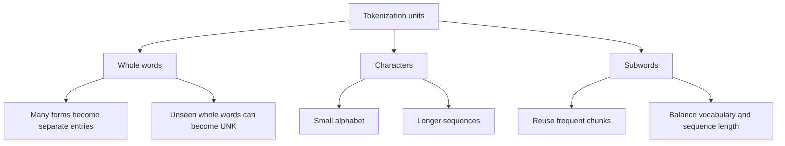
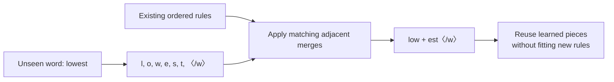
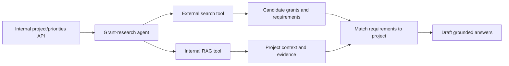

# 🧩 Class 11: Tokenization Foundations — BPE, Bytes, and Model Compatibility
### 📋 Production AI / LLM Engineering | Krish Naik Academy

**🎙️ Mentor:** Sourangshu Pal (Paul)  
**⏱️ Duration:** ~5 hours 18 minutes (5hr 17min 55s) | **📅 Session:** Day 11 (29 August 2026)

**Class recording:** [29 Aug Tokenization - 1](https://learn.krishnaikacademy.com/web/courses/6a16f8935e281281cd6b1128?chapter=6a93c924568d1b8c7bf73265)  
**Primary transcript:** `GMT20260829-143104_Recording.cutfile.20260830060933765.transcript.vtt`  
**Companions:** `Token.pdf` and [BPE Explained notebook](https://colab.research.google.com/drive/1qICL7sEYR4B1EMYajIFTfi0GbxlqKY7m?usp=sharing)

---

## 📰 Quick Updates

- The class began the tokenization module after the annotated Transformer practical. Paul checked whether participants had experimented with the earlier training/epoch assignment and asked them to share their work.
- The main topic actually covered was **BPE**, from intuition and whiteboard examples to plain Python, tiktoken, and a small Hugging Face Tokenizers example.
- WordPiece and a fuller SentencePiece discussion were planned but deferred. SentencePiece was introduced as a library that supports different tokenization models.
- Participants were encouraged to practice several merges by hand, test a non-English language with the supplied tokenizer examples, and inspect the BLT paper.
- A larger corpus, custom tokenizer training, and publishing a tokenizer to Hugging Face were proposed for upcoming sessions. No production tokenizer was completed or published in this class.
- A historical batch-transfer announcement set the following day as the final transfer date. That was session administration, not an ongoing deadline.
- The extended Q&A included model/tokenizer compatibility, domain knowledge, costs, RAG design, grants agents, evaluation, and using coding agents responsibly.

These notes preserve the demonstrations while clarifying several distinctions that became blurred in the live discussion: tokenizer fitting versus model training, unseen words versus unrepresentable symbols, and algorithm similarity versus compatible token IDs.

---

## 🧭 Where Tokenization Fits in the Model Pipeline

Tokenization determines the units in which a model receives text. Those units are assigned integer IDs, which select learned embedding vectors. The model then processes the vectors and predicts outputs in its own token vocabulary.


Paul repeatedly separated **tokenization** from **embedding**. Word2Vec creates word representations; it is not the BPE algorithm being studied.

TF-IDF also produces numerical features. A TF-IDF implementation can contain a tokenization stage, but TF-IDF weighting itself is not synonymous with tokenization.

### Four terms to keep separate

| Term | Meaning |
|---|---|
| Token piece | A unit of text/bytes represented by a vocabulary entry |
| Token ID | The integer assigned to that entry in a particular tokenizer |
| Vocabulary | The supported entries and their ID mapping |
| Embedding | The model’s numeric vector associated with an ID |

IDs are not universal Unicode numbers or semantic scores. Different tokenizers can assign different IDs to the same visible piece, and the same numeric ID can mean different pieces in different vocabularies.

The model’s embedding width also is not its vocabulary size. The lookup has one row per vocabulary entry, with a separately chosen feature width.

A Transformer can process varying sequence lengths within its implementation limits. The fixed vocabulary/feature interfaces do not imply that every input sentence must have exactly the same length.

---

## 🌳 Word, Character, and Subword Tokenization

The first whiteboard page classified tokenizers into three levels and described their tradeoffs.



*Based on the tokenizer taxonomy and vocabulary/OOV sketch in Token.pdf, page 1.*

### Whole-word tokenization

Splitting “The car is running” into words is straightforward. The difficulty is the number of distinct forms: run, ran, running, low, lower, lowest, and many other variations.

A whole-word vocabulary can grow large while still missing a new spelling, name, or technical term. A tokenizer with an unknown-token mechanism may replace an unsupported word with **UNK**, losing its exact identity.

### Character tokenization

A character-level tokenizer breaks cat into c, a, t. It can represent a new word if its characters are supported, but usually needs more positions than a subword tokenizer.

The tradeoff is sequence length and the learning burden of composing characters. Character/byte models are not inherently unable to learn meaning. Models such as ByT5 demonstrate competitive byte-level approaches, with explicit compute/speed tradeoffs. [ByT5 paper](https://arxiv.org/abs/2105.13626)

A limited character alphabet also does not guarantee coverage of every writing system. Coverage depends on the supported alphabet or fallback mechanism.

### Subword tokenization

Subwords reuse pieces such as low and est instead of requiring every whole-word variant to be a separate entry.

Paul called this a **“LEGO blocks”** idea: construct a useful sequence from reusable smaller pieces.

BPE learns frequent combinations statistically. It is not given an English grammar rule saying that est is a suffix. A learned piece can resemble a prefix/suffix, a whole word, punctuation, or an arbitrary fragment.

WordPiece remains an available tokenizer algorithm used by models such as BERT. T5/SentencePiece also are not universally deprecated merely because BPE is popular. The important choice is the tokenizer designed for the model and task. [Hugging Face tokenizer overview](https://huggingface.co/docs/transformers/main/tokenizer_summary)

---

## 🔤 Unicode, UTF-8 Bytes, and Tokens Are Different Representations

Paul demonstrated Python’s `ord` and `bytearray` before the BPE implementation.

### Unicode code points

The notebook includes:

```python
text = "Today, I want to start my day with a cup of coffee"

result = [(char, ord(char)) for char in text]

for char, token_id in result:
  print(f"Character: {char}, Token ID: {token_id}")
```

*Source: supplied notebook, cell 17.*

The printed label says “Token ID,” but the value here is a **Unicode code point** returned by ord. It is not an ID produced by a learned BPE vocabulary.

For the ASCII characters in this example, T maps to 84, a comma to 44, and a space to 32. ord supports Unicode characters beyond ASCII as well. [Python ord documentation](https://docs.python.org/3/builtins/functions.html#ord)

### UTF-8 bytes

The later example creates:

```python
text = "This is some text"
byte_ary = bytearray(text, "utf-8")
print(byte_ary)
```

*Source: supplied notebook, cell 18.*

Converting that bytearray to a list produces byte values. The ASCII-only example records **17 characters and 17 bytes**, so the counts happen to agree.

That does not establish a one-character/one-byte rule. Non-ASCII Unicode characters can require several UTF-8 bytes, and a visible grapheme can contain multiple code points.

### Why bytes help coverage

A byte-oriented tokenizer can start from the 256 possible byte values and merge frequent byte sequences. This base can represent arbitrary valid UTF-8 text without requiring every word or character to have a separate learned whole-piece entry.

A learned token can span several bytes, while a token also can stop inside a multi-byte character. This becomes important when inspecting the Bengali/emoji outputs later.

The session’s rough Unicode character counts were illustrative. They are not tokenizer vocabulary limits or a current Unicode inventory.

---

## 🔁 BPE on the Whiteboard: Maintain Segmentation and Vocabulary

Paul used several interactive examples—hello world, lower/low/lowest, a short sentence, and “The quick brown fox”—then wrote the process explicitly.

The whiteboard sequence was:

1. Initialize base symbols.
2. Represent the current text as a sequence of those symbols.
3. Count pair frequencies.
4. Merge a selected pair into a new symbol.
5. Update the segmentation and learned vocabulary/rules.
6. Repeat under a stopping criterion.

The PDF emphasizes **current segmentation** and **vocabulary status** as distinct states.


*Based on the initialize→segment→count→merge→repeat sketches in Token.pdf, pages 2–5.*

### Pair means adjacent symbols

BPE combines **two consecutive symbols in the current segmentation**. At first, those symbols may be characters. Later, a symbol may already be a multi-character piece.

For example:

- t + h → th;
- th + e → the;
- q + u → qu;
- qu + i → qui, if that pair is selected.

This does not permit merging arbitrary non-neighboring characters while skipping intervening content.

The live examples discussed arbitrary choices when frequencies tie. That freedom concerns **which equally frequent adjacent pair is selected**, not whether adjacency is required. [BPE explanation](https://huggingface.co/learn/llm-course/chapter6/5)

### A token can contain many characters

Merging two symbols does not restrict the resulting token to two characters. A pair such as new + est can create a longer piece because both inputs can already be merged symbols.

Conversely, BPE is not obliged to choose the longest visible subword at every training step. Its frequent-pair objective and learned rule order determine the result.

### Recompute after each merge

After a merge, some adjacent pairs disappear and new adjacent pairs arise. The next selection uses the **updated pair statistics**.

There is no separate standard rule saying “finish this entire word before moving to another word.” The notebook repeatedly computes the best pair across the current corpus.

The small visualizer sometimes continued until a sentence was reconstructed. Real tokenizer fitting ordinarily uses a controlled vocabulary/merge budget; it is not required to merge every training sentence into one token.

### Order and boundaries still matter

Tokenization is not semantic attention, but it does preserve and inspect an ordered sequence. Adjacent pairs, whitespace, punctuation, and boundary rules influence its output.

Whitespace handling depends on the tokenizer’s preprocessing and representation. The class’s spaces/underscore illustrations should not be read as a universal rule that every BPE tokenizer merges across all word boundaries.

---

## 🐍 Plain-Python Example: A Corpus With Word Frequencies

The supplied notebook uses:

| Word | Corpus frequency |
|---|---:|
| low | 5 |
| lower | 2 |
| newest | 6 |
| widest | 3 |

These counts mean the word occurs that many times in the imagined corpus. They are not the number of letters in the word.

Each word starts as characters plus an end-of-word marker:

```python
def word_to_symbols(word):
    return list(word) + ["</w>"]

# vocab maps: tuple-of-symbols -> frequency
# e.g. ('l', 'o', 'w', '</w>') -> 5
vocab = {tuple(word_to_symbols(word)): freq for word, freq in corpus.items()}
```

*Source: supplied notebook, cell 4.*

The marker in the actual code is **`</w>`**, not a slash-w character literal. The transcript’s spoken notation is simplified.

### What the marker does here

The marker records the end of each pre-separated word. A piece such as est</w> can distinguish a word-final occurrence from an internal fragment.

The helper already processes each word separately, so it does not merge one word’s last symbol with the next word’s first symbol. The end marker reinforces useful boundary information.

This marker is a teaching convention, not mandatory syntax for all BPE implementations. Byte-level tokenizers and other implementations use their own boundary/pre-tokenization rules.

### Count weighted adjacent pairs

```python
def get_pair_frequencies(vocab):
    """
    Look at every word in the vocabulary and count how many times each
    ADJACENT pair of symbols occurs, weighted by that word's frequency.

    Example: if ('n','e','w','e','s','t','</w>') has frequency 6,
    then the pair ('e','w') gets +6, the pair ('w','e') gets +6, etc.
    """
    pair_counts = defaultdict(int)
    for symbols, freq in vocab.items():
        for i in range(len(symbols) - 1):
            pair = (symbols[i], symbols[i + 1])
            pair_counts[pair] += freq
    return pair_counts
```

*Source: supplied notebook, cell 5; the cell imports defaultdict from collections.*

The word’s frequency contributes to every adjacent pair it contains. If a pair appears multiple times in a word, each occurrence is counted.

For e + s:

**newest contributes 6, widest contributes 3 → total 9**

For l + o:

**low contributes 5, lower contributes 2 → total 7**

Ignoring these weights and counting only the two dictionary entries would change the algorithm’s choice.

`defaultdict(int)` gives a missing pair a default **count value of zero**. It does not require the dictionary key to be zero. [Python defaultdict documentation](https://docs.python.org/3/library/collections.html#collections.defaultdict)

The range stops at length−1 because the final symbol has no next symbol to form a pair with.

---

## 🛠️ Apply a Merge Everywhere, Then Record the Rule

The merge helper scans each word and either combines the selected adjacent pair or copies the next symbol unchanged.

```python
merged_symbol = "".join(pair_to_merge)
vocab_out = {}
for symbols, freq in vocab_in.items():
    new_symbols = []
    i = 0
    while i < len(symbols):
        # If the current position matches the pair we're merging, combine them
        if i < len(symbols) - 1 and (symbols[i], symbols[i + 1]) == pair_to_merge:
            new_symbols.append(merged_symbol)
            i += 2  # skip both symbols we just merged
        else:
            new_symbols.append(symbols[i])
            i += 1
    vocab_out[tuple(new_symbols)] = freq
return vocab_out
```

*Exact body excerpt from merge_pair_in_vocab in supplied notebook cell 5. It belongs inside that function and is not a standalone script.*

The bounds check avoids reading past the sequence. After a successful merge, the index advances by two because both input symbols have been consumed. Otherwise, it advances by one.

The word-frequency value is retained. Changing the segmentation does not invent additional occurrences of the word.

### Select the best pair

The training loop’s selection is:

```python
# Pick the single most frequent adjacent pair across the whole corpus
best_pair = max(pair_counts, key=pair_counts.get)
best_pair_freq = pair_counts[best_pair]

# Apply that merge everywhere in the vocabulary
current_vocab = merge_pair_in_vocab(best_pair, current_vocab)
merge_history.append(best_pair)
```

*Source: supplied notebook, cell 6.*

The rules are appended in order. Later pieces can depend on earlier pieces, so keeping the order is necessary for encoding new text.

### Ties are not random in this notebook

The initial maximum count is nine for **e+s, s+t, and t+</w>**. The first selected pair is e+s because it is the first tied maximum encountered in the dictionary traversal.

Python’s max returns the first maximal item encountered. No random generator is called in this implementation. A different implementation may define a different tie break and therefore learn different rules. [Python max documentation](https://docs.python.org/3/builtins/functions.html#max)

The class’s visualizer observations do not establish that all BPE fitting randomly selects pairs.

---

## 📊 Eight Recorded Merges and the Final Segmentation

The supplied notebook’s eight-merge run records:

| Step | Selected pair | New piece | Weighted count |
|---:|---|---|---:|
| 1 | e + s | es | 9 |
| 2 | es + t | est | 9 |
| 3 | est + </w> | est</w> | 9 |
| 4 | l + o | lo | 7 |
| 5 | lo + w | low | 7 |
| 6 | n + e | ne | 6 |
| 7 | ne + w | new | 6 |
| 8 | new + est</w> | newest</w> | 6 |

The resulting word segmentations are:

| Original word | Current symbols after eight merges |
|---|---|
| low | low, </w> |
| lower | low, e, r, </w> |
| newest | newest</w> |
| widest | w, i, d, est</w> |

The notebook’s variable `current_vocab` maps segmented word tuples to corpus frequencies. It is not itself a complete production token-to-ID dictionary.

### Merge budget and stopping

The example sets **num_merges = 8**. Paul increased it live to inspect later merges, including a run that stopped early when no pairs remained.

That is a useful experiment. In production, vocabulary size or merge count is a meaningful budget controlling compactness, coverage, and model interface size. Removing every limit is not inherently more optimal.

The tokenizer can retain base symbols and intermediate merged entries even when the current segmentation no longer uses each one separately.

### Statistical fitting is still tokenizer training

No neural-network weights are optimized in this BPE loop. It fits a statistical tokenizer by learning merge rules.

Calling this **tokenizer training** is appropriate. It is distinct from training/fine-tuning an LLM’s parameters, but “training” is not restricted to neural networks.

---

## 🆕 New Words Reuse Existing Rules

The next experiment applied the learned rules to **lowest** and **newer**, which were absent from the training corpus.

The recorded result is:

| New word | Output pieces |
|---|---|
| lowest | low, est</w> |
| newer | new, e, r, </w> |

The word is first represented as base symbols plus its end marker, then the existing rules are applied in learned order.



*Based on the class’s reconstruction/reuse explanation and the supplied notebook’s second example.*

This is the practical benefit: a new whole word does not need to be a single vocabulary entry if it can be represented by existing smaller units.

### Encoding does not automatically extend the vocabulary

Applying the tokenizer to a new word does not append new training merges. The output uses the existing rules and available base representation.

If a base symbol is unsupported in a character-based tokenizer, a production implementation may use an unknown token or another fallback. The toy `apply_bpe` helper returns symbol strings and does not implement a complete token-ID/UNK policy.

A byte-level tokenizer with full byte coverage avoids this particular unknown-character problem for valid text.

### Tokenizable does not mean known by the model

An unfamiliar medicine name can be represented as subword/byte pieces even if the model has never learned what the medicine is.

There are separate questions:

1. Can the tokenizer represent the spelling?
2. How many tokens does it need?
3. Does the model know the term’s meaning?
4. Can supplied context, retrieval, or model adaptation provide needed information?

A missing **whole-word token** does not prove the LLM is blind to that word. An actual UNK replacement does lose identity, but ordinary subword decomposition does not.

---

## 🔬 Research Detour: Byte Latent Transformer

Paul introduced Meta’s **Byte Latent Transformer (BLT)** as a research direction beyond fixed subword tokenization.

BLT is a **byte-level language-model architecture**, not merely a separately trained tokenizer that produces a one-time tokenization file. It groups bytes into dynamically sized patches using predicted next-byte entropy, then allocates computation to those patches. [BLT paper](https://arxiv.org/abs/2412.09871)

The lecture connected familiar encoder/decoder/attention components with this architecture and showed scaling/benchmark material at a high level.

The appropriate takeaway was an alternative way to handle raw bytes and variable computation units. The class did not implement BLT, prove that it solves every BPE limitation, or compare it under a production deployment.

It also does not eliminate model training or guarantee that every benchmark improves. Paul invited interested students to read the paper as optional exploration.

SentencePiece was discussed separately: it is a library supporting BPE and Unigram models, including training directly from raw text without mandatory whitespace-based pre-tokenization. This is useful for languages whose word boundaries are not reliably represented by spaces. [SentencePiece repository](https://github.com/google/sentencepiece)

---

## 🧮 tiktoken: Compare Existing Encodings

The notebook then compared **cl100k_base** with **o200k_base** using OpenAI’s tiktoken.

It loaded existing encodings, encoded each sample, and printed IDs/pieces. This was **encoding with pretrained tokenizer rules**, not learning new rules from the sample.

The recorded results include:

| Sample | cl100k_base count | o200k_base count |
|---|---:|---:|
| tokenization | 2 | 2 |
| unhappiness | 3 | 3 |
| lowest newest | 2 | 2 |
| বাংলা | 7 | 2 |
| 👋 | 3 | 2 |

The recorded vocabulary counts were **100,277** and **200,019**, including each encoding’s defined entries. Names such as “100k” are convenient labels, not an assertion that every vocabulary has exactly that integer count.

For “tokenization,” both runs printed token + ization. For “lowest newest,” the second piece included a leading space. Such whitespace grouping is part of the encoding.

### Select the model’s encoding

For the class’s named model family, official OpenAI documentation maps GPT-4o/GPT-4o-mini to **o200k_base**, and the GPT-4/GPT-3.5 examples to cl100k_base. Use model-specific selection rather than treating all GPT versions as the same tokenizer. [OpenAI tiktoken guide](https://developers.openai.com/cookbook/examples/how_to_count_tokens_with_tiktoken)

Larger vocabulary alone does not guarantee fewer tokens for every string. The table shows improvements for particular non-English/emoji inputs, with no change for some English inputs.

### The replacement-character output is not proof of failed tokenization

The sample printing code decodes each individual token separately:

```python
ids = enc.encode(s)
pieces = [enc.decode([i]) for i in ids]
```

*Source: supplied notebook, cell 13.*

For Bengali and the emoji, some token pieces were printed as **�** because a token can contain only part of a UTF-8 character. Decoding that incomplete byte sequence alone can be lossy.

To inspect one token safely, tiktoken provides `decode_single_token_bytes`. Decode the **complete token sequence** when checking the original string. The issue here is not resolved merely by installing a language font or treating � as an UNK token. [OpenAI decoding guidance](https://developers.openai.com/cookbook/examples/how_to_count_tokens_with_tiktoken)

The newer encoding remains byte-based; the change in its vocabulary does not mean GPT-4o removed byte-level representation.

### Counting and cost

Paul connected token counts with cost estimation and routing. Input/output rates depend on the selected model and provider, and total cost also depends on how much output is generated.

A plain-text token count is not automatically the complete billed request count: message structure, tools, multimodal inputs, and model-specific formatting can add tokens. Provider-reported usage and supported request-counting APIs resolve those details. [OpenAI token-counting documentation](https://developers.openai.com/api/docs/guides/token-counting)

No class-time price is reproduced as a current quote.

---

## 🧰 A Tiny Hugging Face BPE Tokenizer

The next demonstration used **Hugging Face Tokenizers** to fit BPE on a small text corpus.

The supplied code configures:

```python
hf_bpe = Tokenizer(BPE(unk_token="[UNK]"))
hf_bpe.pre_tokenizer = Whitespace()
trainer = BpeTrainer(
    special_tokens=["[UNK]", "[PAD]", "[CLS]", "[SEP]"],
    vocab_size=120,
    min_frequency=1,
    show_progress=False,
)
hf_bpe.train([CORPUS_PATH], trainer)
```

*Source: supplied notebook, cell 14. The same cell imports the required Tokenizers classes and writes tiny_corpus.txt.*

The corpus contains low, lower, newest, widest, lowest, newer, unhappiness, and tokenization.

The recorded output vocabulary size is **54**, although the requested budget is 120. The tiny corpus cannot produce an unlimited supply of distinct useful merges.

### What the components mean

| Component | Role |
|---|---|
| BPE model | Defines the subword algorithm and unknown-token behavior |
| Whitespace pre-tokenizer | Splits the input into preliminary chunks |
| BpeTrainer | Fits vocabulary/merge rules from the corpus |
| Special-token list | Reserves entries for configured control symbols |
| vocab_size | Requested vocabulary budget |
| min_frequency | Minimum frequency criterion used during fitting |
| encode | Apply the trained tokenizer to new text |

Whitespace is a **pre-tokenization strategy**, not an “unknown data” mechanism. The BPE model’s unk_token supplies that behavior.

The listed CLS/SEP/PAD symbols are chosen for this example. They are not automatically a universal GPT special-token set.

### Recorded IDs belong to this fitted tokenizer

| Piece | Recorded ID |
|---|---:|
| lower | 45 |
| newest | 46 |
| unhappiness | 52 |
| tokenization | 53 |

These IDs are categorical indexes, not random embedding values and not semantic scores.

The fitted vocabulary/merges and configuration must be saved with the model that uses them. The next class was to expand this exercise toward a larger corpus and portfolio artifact.

---

## 🔒 The Extended Compatibility Discussion: Same Algorithm Is Not Enough

Rachit, Murtuza, Debajyoti, Abhishek, Anunay, Dishant, and Prashanth explored whether custom tokenizers could be used with existing models.

The key rule is **preserve the model’s interpretation of token IDs**.

A model trained with token ID 100 representing one piece does not suddenly understand ID 100 as a different piece merely because both tokenizers use BPE or have the same number of entries.

### Why arbitrary replacement fails

Tokenizer/model compatibility includes:

- the token-to-ID mapping;
- special IDs and their roles;
- preprocessing/normalization and merge rules;
- embedding and output-vocabulary dimensions;
- the learned interpretation of those IDs.

The same vocabulary size is necessary for some tensor interfaces, but it does not establish semantic compatibility.

Training a new BPE tokenizer on the same type of algorithm can change IDs and segmentation. Swapping it into a pretrained model can therefore cause much more than a minor efficiency difference.

### What controlled vocabulary extension involves

For an editable model, added tokens require matching model support. Hugging Face documents adding tokens and resizing the model’s embedding matrix accordingly. New representations also need suitable learning; changing only a JSON file does not supply it. [Tokenizer extension documentation](https://huggingface.co/docs/transformers/main_classes/tokenizer)

PEFT can participate in adaptation, but an ordinary LoRA configuration does not automatically train every newly added embedding row. Methods that explicitly train selected token embeddings can be combined with LoRA. [PEFT Trainable Tokens](https://huggingface.co/docs/peft/package_reference/trainable_tokens)

The class did not demonstrate a complete compatible pretrained-model vocabulary migration. Its custom tokenizer example was standalone.

### Domain data does not always require a new tokenizer

A byte/subword tokenizer can often represent technical text using more pieces. First measure fragmentation, coverage, task quality, and cost.

A glossary or relevant retrieved context can explain an unfamiliar term without retraining the tokenizer. Tokenizer efficiency and a model’s knowledge are different issues; tokenizing a term successfully does not teach its definition.

For a hosted proprietary API, a local tokenizer file does not replace the server model’s tokenizer. Local counting/preprocessing and the provider’s model interface must be distinguished.

### Deploy the matching artifacts together

Prashanth asked whether uploading an updated tokenizer changes the public original. Creating a separate model/tokenizer repository does not itself merge changes into the upstream model.

Keep a compatible model and tokenizer revision together. Repository visibility and authorized access determine who can obtain the uploaded artifacts. Publishing a tokenizer alone does not make an unrelated pretrained model compatible with its IDs.

---

## 🏢 The Open-Floor Systems Discussion

The later discussion widened into application architecture. These were conceptual exchanges, not implementations added to the BPE notebook.

### Costs and routing

Mangesh asked about showing users a cost estimate. Paul described maintaining model pricing and recording usage at a gateway or observability layer.

Debajyoti asked whether routing depends only on prompt length. Paul also considered task complexity and whether reasoning/decomposition was needed.

The transferable idea is to choose routing criteria against workload quality, latency, and cost. The class did not establish that every short prompt should use one named model or that every long prompt should use another.

### Parsing before document-aware chunking

Sachin asked about replacing a generic recursive splitter with document-aware chunking. Paul emphasized first extracting structure: headings, paragraphs, tables, formulas, images, and other layout elements.

A layout-aware parser can supply that structure; chunking can then respect it. The selected tool depends on the document and compute constraints. Several parsers were mentioned, without a live comparison.

### Swati’s organization-wide RAG system

Swati described starting with a grant-writing team, combining keyword and semantic retrieval, and planning to add other departments.

Paul supported incremental rollout and emphasized:

- department/project metadata;
- collection/tenant structure;
- routing queries to the appropriate data;
- separately testing retrieval, reranking, and generation.

The purpose of metadata filters is to restrict the candidate search space. A numeric threshold such as “one billion vectors” is not a universal point at which all systems fail; the actual index, filters, hardware, and query workload determine behavior.

### Vector quantization is different from model quantization

The discussion recommended exploring compression of **stored embedding vectors**. Swati initially understood this as quantizing the LLM, so Paul explicitly distinguished the two.

Vector quantization can reduce storage and accelerate search, while introducing approximation and potential recall loss. Compare retrieval quality and resource use for the chosen database/configuration. [Qdrant quantization guide](https://qdrant.tech/documentation/manage-data/quantization/)

### An agent for external grants and internal project details

The proposed grant-research workflow combined:

1. internal project priorities via an API;
2. external web research;
3. retrieval of detailed internal project documentation;
4. matching grant questions with grounded project information.

Paul described exposing the RAG system as an agent tool. He suggested drawing the blocks and connections before selecting a large framework, and considering FAQ-style project summaries as entry points into deeper documents.



*Based on Swati’s stated use case and the tool connections explained in the live exchange.*

AWS AgentCore was discussed because her organization used AWS. It is a set of deployment/services capabilities that can work with frameworks such as LangGraph; these are not necessarily mutually exclusive alternatives. [AWS AgentCore overview](https://docs.aws.amazon.com/bedrock-agentcore/latest/devguide/what-is-bedrock-agentcore.html)

### Evaluation and coding-agent validation

Swati asked about generated evaluation references and multiple LLM judges. Paul described multi-model review and voting/averaging.

Generated references still need validation: agreement among judges is not proof of factual ground truth. Models from one family also can share errors.

Ragas is not just a BLEU comparison against an expected answer. Different metrics assess retrieval, faithfulness, relevancy, correctness, and other aspects, with different required inputs. [Ragas metric overview](https://docs.ragas.io/en/stable/concepts/metrics/overview/)

For coding-agent output, the session emphasized software-engineering validation as well as AI evaluation: check logic, failure cases, integrations, concurrency, and adherence to the organization’s design conventions.

---

## 🗺️ What's Next

Paul proposed continuing with **WordPiece**, the **SentencePiece library**, and more detailed custom tokenizer construction.

A larger corpus, comparison of general versus domain-specific tokenizer behavior, and saving/uploading a tokenizer to Hugging Face were discussed for upcoming work. The exact timing shifted between “tomorrow” and the following Saturday during Q&A; these remained future plans.

The annotated Transformer’s spaCy tokenizer was to be revisited using BPE. Andrej Karpathy’s tokenizer-building material was also identified as a forthcoming practice/reference route.

BLT remained optional research reading. Domain-specific tokenizer/model adaptation, fine-tuning, and later RAG projects were future course work rather than completed deliverables today.

---

## 💬 Live Q&A Highlights

The table includes the full open-floor segment, with special attention to Dishant, Prashanth, Sachin, and Swati’s extended exchanges in the last two transcript parts.

| Question | Answer |
|---|---|
| **Abhishek / Anirudh: Is Word2Vec another tokenizer?** | No. It creates word embeddings; tokenization determines the units and IDs that representation/model stages consume. |
| **Chat: Does character-level input make semantic learning impossible?** | No. Longer sequences can increase cost and learning burden, but character/byte models can learn meaning. |
| **Swati: Must a merge choose the longest subword?** | No. BPE fitting selects a maximum-frequency adjacent pair in the current segmentation. |
| **Gaurav: Can three characters be merged at once?** | The operation merges two symbols. One can already contain several characters, so th+e is a two-symbol merge producing three characters. |
| **Chat: Must pairs be neighbors?** | Yes, in standard BPE. An arbitrary tie choice still selects among adjacent pairs; it does not permit skipping intervening symbols. |
| **Chat: How are merges stored?** | The example records an ordered Python list. A production tokenizer also needs its vocabulary/IDs and full configuration. |
| **Phani: Can tokens across a space be combined?** | Boundary behavior depends on preprocessing and the tokenizer. The plain-Python notebook handles each word separately; the visualizer’s space behavior is not universal. |
| **Omkar: Can any combination of pieces become a token?** | Only selected adjacent pairs are merged under the fitting rules/budget. Having pieces available does not permit arbitrary recombination during encoding. |
| **Vishwan: Why positional encoding after tokenization?** | Tokenization creates an ordered ID sequence. Embeddings and positional information are model-side stages with different jobs. |
| **Chat: Does defaultdict start with key zero?** | No. defaultdict(int) supplies a missing pair’s count value as zero. The keys here are symbol-pair tuples. |
| **Chat: Why are e+s counts nine rather than two?** | Counts are weighted by the word frequencies: newest six plus widest three. Counting distinct word types alone would give a different objective. |
| **Chat: Are tied best pairs selected randomly?** | This code selects the first maximal pair encountered by max. Other implementations can have different tie rules; randomness is not required. |
| **Chat: When does BPE fitting stop?** | The notebook uses a merge budget or stops if no pairs remain. Real fitting generally controls vocabulary/merge size rather than endlessly merging full sentences. |
| **Rachit: Does an unseen word get added to the rules automatically?** | No. Encoding applies existing rules. A new whole word can use existing smaller pieces; unsupported base symbols require fallback handling. |
| **Rushi: Is strawberry→straw/berry an unavoidable semantic failure?** | A split does not force the model to interpret the pieces as two separate meanings. The tokenizer preserves the spelling; the model must reason over its pieces. No universal error rate was established. |
| **Sarvajase: Is there training without a neural network here?** | Yes, fitting BPE merge statistics is tokenizer training. It does not update an LLM’s neural parameters. |
| **Paritosh: When create our own vocabulary?** | Measure whether a domain/language benefits from a new tokenizer and whether the model can support it. General subword/byte decomposition often already represents technical terms. |
| **Arun: Can a custom tokenizer replace a pretrained model’s tokenizer?** | Not arbitrarily. Keep the ID mapping and model interface compatible or perform a planned tokenizer/model adaptation. The BPE algorithm alone is insufficient. |
| **Rachit Shah: If a medicine name is not a whole token, is the model blind?** | Not necessarily: it can be decomposed into supported pieces. Representability is different from whether the model knows the medicine’s meaning. |
| **Rachit: What if an actual UNK replacement occurs?** | The exact spelling is lost at that stage. External context/tools may help an application, but a model does not automatically perform a web search just because a tokenizer emits UNK. |
| **Rachit: Does keeping the same tokenizer algorithm ensure model compatibility?** | No. Exact IDs, entries, preprocessing, special tokens, and embeddings matter. Use the model’s matching tokenizer unless adaptation is deliberately implemented. |
| **Mangesh Khandare: How show an upfront token cost?** | Count relevant input with the appropriate encoding, estimate output, and apply the selected model’s rates. Gateway/observability layers can record usage; final billing includes provider-specific details. |
| **Mangesh: Can routing save cost?** | Paul described lighter/heavier model routing. Validate routing against task quality and latency as well as price. |
| **Ramakrishna: What to study for a vision-focused master’s?** | Paul suggested Stanford CS231n and relevant visual-computing literature. Edge deployment constraints were discussed; no current model/course ranking was established. |
| **Murtuza Saifee: Can OpenAI BPE rules be used directly with Qwen/Kimi?** | Not as a compatible replacement for pretrained weights merely because both use BPE. The token ID mapping and learned model state must align. |
| **Murtuza: Are tokenizer internals always separately released?** | Inspect the actual model/tokenizer artifacts. A separate tokenizer-library project is not required if the release includes the necessary vocabulary, merges, and configuration. |
| **Murtuza: Does BLT retain context during its tokenization?** | BLT is a neural byte-level model using adaptive patches, not the same standalone preprocessing stage as fixed BPE. Context processing and patch selection belong to that architecture. |
| **Ranjeev Tiwari: Deeper engineering course or broad FDE overview?** | Paul contrasted implementation depth with a faster holistic overview and advised matching study goals/time to intended work. These were class-specific course comparisons. |
| **Ranjeev: How should a data engineer move toward AI work?** | Build on data/cloud experience with model/application design, deployment, and measured POCs. Paul emphasized systems and architecture understanding. |
| **Ranjeev: Why read papers rather than only implementations?** | Papers explain design choices needed for informed customization. Start with the relevant abstract, implementation, and evidence rather than treating every paper as equally necessary. |
| **Ranjeev: Are encoder k/v just key/value labels?** | K and V are the conventional attention roles. Cross-attention derives them from encoder memory; they are not target labels and expected answers. |
| **Sai Kiran Akula: Where was the 3D embedding visualizer?** | Paul identified the TensorFlow Embedding Projector and shared it again. It is separate from the tokenization algorithm. |
| **Debajyoti Mukhopadhyay: Can training an o200k tokenizer locally alter hosted GPT-4o?** | A local tokenizer does not replace the hosted API model’s tokenizer. Domain adaptation and provider-supported model operations are separate from a local fitting exercise. |
| **Debajyoti: Would a self-hosted fine-tuned model need serving?** | Yes, an adapted model can be served through an inference service. The class did not deploy one or establish a specific cloud configuration. |
| **Debajyoti: Does routing depend only on prompt length?** | Paul also considered task complexity and reasoning needs. Character count, token count, and semantic difficulty are different inputs to routing. |
| **Abhishek: How know a model understands a domain term?** | Evaluate its behavior on representative tasks. Token presence or successful encoding alone does not prove knowledge or detect hallucination. |
| **Abhishek: Could we explain the term in text instead of fine-tuning?** | Yes, supplying a definition/context can help without changing tokenizer rules. Prompt/context augmentation and statistical tokenizer fitting should not be conflated. |
| **Abhishek: Does changing a corpus require retraining the tokenizer?** | Not whenever text is added to an application prompt or retrieval corpus. Retraining is relevant when deliberately fitting a new tokenizer; existing encoders can process new text. |
| **Anunay: Is custom tokenization “tokenizer on tokenizer” in an embedding model?** | An embedding model already uses a matching tokenizer. Do not pre-tokenize with unrelated IDs and expect compatibility; choose or adapt the complete text-to-model pipeline. |
| **Anunay: Can we edit tokenizer.json freely?** | The file is editable, but edits must preserve or deliberately adapt model compatibility. File access does not make arbitrary changes valid. |
| **Anunay: How handle German/Italian classification or embeddings?** | Choose representations/tokenizers supporting those languages and evaluate the actual classification task. TF-IDF is one feature baseline, not a tokenizer algorithm. |
| **Anunay: Is language detection mandatory before every multilingual tokenizer?** | No. Many multilingual tokenizers handle mixed-language text directly. Detection/routing is an optional design depending on the pipeline. |
| **Anunay: Which multilingual embedding model?** | Paul pointed to multilingual evaluation resources and checking the specific language coverage. No model was selected/tested for the stated task. |
| **Prabu Manickam: Which recordings help with missing prerequisites?** | Paul suggested the provider’s deep-learning material for foundations and separate RAG/agent recordings for those application topics. |
| **Dishant Ghai: Is the model trained only on individual tokens?** | It learns patterns over sequences and can process/generate new combinations of supported tokens. Vocabulary coverage and learned sequence knowledge are distinct. |
| **Dishant: Must a new domain word lead to new tokenizer training?** | Not automatically. It may already decompose into pieces; definitions, retrieval, and model adaptation can address knowledge without changing the vocabulary. |
| **Dishant: Can a new tokenizer be used with full fine-tuning or PEFT?** | Both can participate in a planned adaptation, but preserve IDs or explicitly adapt embeddings/output state. LoRA alone does not guarantee compatibility with a newly remapped vocabulary. |
| **Dishant: Must old token IDs remain stable?** | Preserving them is central to reusing learned weights. Replacing “unused” entries at the same IDs is not harmless merely because vocabulary size stays fixed. |
| **Dishant: Does adapter training learn newly added tokens automatically?** | Only if the necessary token representations/modules are made trainable or otherwise adapted. The class did not demonstrate that complete setup. |
| **Prashanth Nayak: Is tokenizer work relevant to a private specialized model?** | It can be relevant, but the tokenizer and model should be designed/adapted together. Paul proposed a later general-versus-domain comparison. |
| **Prashanth: Does uploading my revision override the public model?** | A separate repository/revision is its own artifact, not an automatic upstream merge. Deploy the compatible model and tokenizer together. |
| **Prashanth: Who can access the uploaded artifacts?** | Repository visibility and granted access control availability. Keep the chosen configuration aligned with the organization’s requirements. |
| **Sachin Srivastava: Which book/course sequence should I follow?** | Paul preferred Sebastian Raschka’s foundations before more advanced reasoning material, and suggested CS336/other lectures selectively. These were personal study preferences. |
| **Sachin: How avoid spending days on every paper?** | Triage by relevance, abstract, implementation, and benchmarks; prioritize a small set tied to current work. Use assistance to explain details after inspecting the source. |
| **Sachin: Generic splitter or custom heading/table chunking?** | Extract document layout/content first, then choose document-aware/hierarchical chunking as appropriate. The data and compute budget determine the approach. |
| **Sachin: What advantage remains when nontechnical founders use coding agents?** | Paul emphasized product architecture, intent, maintainability, integration, and validation. Tool use does not remove those engineering responsibilities. |
| **Swati: Is starting with one department and expanding sensible?** | Paul supported staged rollout. Plan metadata, collections/tenancy, routing, and separate evaluation as departments/data grow. |
| **Swati: Must embeddings be separated by department?** | Separate collections or filtered shared collections are design choices. Ensure routing and metadata enforce the intended search scope. |
| **Swati: Where does quantization apply—LLMs or vectors?** | The recommendation concerned stored embedding vectors in the vector database. Measure compression/speed versus retrieval quality. |
| **Swati: Adopt PipesHub or build everything ourselves?** | Paul valued its connector capabilities for distributed sources, while advising a longer-term maintainability view. No production review or endorsement audit was performed. |
| **Swati: How connect grant research with internal project details?** | Expose internal priorities/API access and RAG as tools, then use external search to gather candidates and requirements. Draw the workflow before implementing it. |
| **Swati: Could RAG be an agent tool?** | Yes. Retrieve project evidence conditionally when a grant question requires it, rather than loading all internal context into every step. |
| **Swati: AWS AgentCore or LangGraph?** | They can serve different layers and work together. AgentCore supports open frameworks; pick an initial POC and deployment design suited to the actual AWS workflow. |
| **Swati: How start implementing the agent?** | Begin with the smallest complete tool workflow, verify connections, and expand. Paul mentioned lightweight frameworks as POC options. |
| **Swati: How generate questions and fetch technical project context?** | Analyze recurring grant questions and consider FAQ summaries linked to deeper documents. Retrieve evidence for each actual requirement. |
| **Swati: Should we inspect coding-agent output line by line?** | Verify critical logic, tests, validations, integrations, and design conventions. Boilerplate assistance is useful, but maintain engineering ownership of the result. |
| **Swati: Is RAG evaluation enough for software correctness?** | No. AI-task metrics and software/integration/failure tests answer different questions; retrieval, reranking, and generation also need separate checks. |
| **Swati: How generate evaluation references at scale?** | Paul described model-generated candidates reviewed by several judges. Validate those references; a generated label is not automatically ground truth. |
| **Swati: Does Ragas simply use BLEU against reference answers?** | No. Its metrics cover different retrieval/generation properties and can require different inputs. Inspect the metric selected. |
| **Swati: Can three LLMs vote on answers?** | Multi-judge review is a possible method. Agreement can still share systematic errors, so measure judge reliability rather than treating votes as proof. |
| **Swati: Anthropic versus DeepSeek/other families?** | Paul shared task/version-dependent preferences for complex planning and implementation. The session did not provide a controlled benchmark or current pricing comparison. |
| **Dishant, follow-up: What exactly fails if we swap two BPE tokenizers?** | IDs and segmentations can change, so the pretrained model can read different pieces than intended. This is a compatibility problem, not just a small speed/benchmark penalty. |
| **Dishant: Do open weights include enough tokenizer details?** | Inspect the release. Tokenizer files may include merges/vocabulary/configuration without a standalone tokenizer project; no blanket claim covers every release. |
| **Dishant: Can future classes begin with the “what/why/where” picture?** | Paul acknowledged the request to connect detailed operations with the final objective. Repeated study and relating layers of the pipeline were emphasized. |

---

## 🔑 Key Pointers to Remember

- Tokenization, token IDs, embeddings, and semantic knowledge are different.
- Vocabulary size differs from embedding width and sequence length.
- BPE fitting merges adjacent symbols, including previously merged pieces.
- Count occurrences weighted by corpus word frequency.
- Recompute pair statistics after each merge.
- This notebook’s tied choices are deterministic, not random.
- The merge history is ordered because later rules depend on earlier ones.
- The end-of-word marker belongs to the toy implementation, not every BPE tokenizer.
- A vocabulary/merge budget is a real design choice.
- Statistical tokenizer fitting is training, but not neural-model fine-tuning.
- New words can reuse existing pieces without changing tokenizer rules.
- A missing whole-word entry does not necessarily produce UNK.
- Full byte coverage can encode valid text without unknown-word fallback.
- Unicode code points, UTF-8 bytes, and learned token IDs are not interchangeable.
- Decoding one token can show � when its bytes do not form a complete character.
- Bigger vocabularies can change token counts, but do not guarantee every string becomes shorter.
- WordPiece remains distinct from BPE; SentencePiece is a library supporting multiple models.
- BLT is a language-model architecture using adaptive byte patches.
- Same BPE algorithm or vocabulary size does not establish model compatibility.
- Keep token IDs, special-token meaning, embeddings, and output dimensions aligned.
- Adding entries requires matching model adaptation; editing JSON alone is insufficient.
- Domain knowledge can be supplied through context/retrieval without changing a tokenizer.
- Plain-text token counts may omit request-format/tool/multimodal overhead.
- Retrieval, reranking, generation, and software correctness require different evaluation.
- Vector quantization and LLM quantization are different operations.
- Multiple model judges can help review; their agreement is not automatically truth.

---

## ✅ Action Items After Class 11

- [ ] Trace text → pieces/IDs → embedding → model → output IDs → decoding.
- [ ] Practice a few BPE merges by hand using the low/lower/newest/widest corpus.
- [ ] Calculate weighted counts and identify the initial tied maximum pairs.
- [ ] Run the supplied pure-Python functions and inspect current segmentation after each merge.
- [ ] Change the merge budget and observe where/how the run stops.
- [ ] Apply learned rules to lowest, newer, and other unseen words.
- [ ] Keep tokenizer fitting separate from applying a fitted tokenizer.
- [ ] Compare cl100k_base and o200k_base on a language you know **other than English**, as Paul requested.
- [ ] Check full encode/decode behavior and inspect bytes when individual pieces show �.
- [ ] Run the tiny Hugging Face BPE example and distinguish requested from actual vocabulary size.
- [ ] Identify the pre-tokenizer, model, trainer, special tokens, vocabulary, and rules.
- [ ] For any pretrained-model experiment, first inspect its matching tokenizer and ID mapping.
- [ ] Avoid treating a standalone custom tokenizer as a compatible drop-in replacement.
- [ ] Read BLT optionally and distinguish its architecture from conventional BPE preprocessing.
- [ ] Review the planned WordPiece/SentencePiece and larger-corpus work before the continuation.
- [ ] If using the RAG/agent Q&A for your project, sketch the tools/data flow and define measurable test cases first.

---

*📝 Notes compiled from the full Class 11 transcript, all six pages of Token.pdf, and all 21 cells of the BPE Explained notebook — “29 Aug Tokenization - 1,” Production AI / LLM Engineering, Krish Naik Academy. Code/results come from the supplied notebook; the plain-Python merge outputs were independently reproduced. Mermaid diagrams translate the whiteboard’s tokenizer taxonomy and BPE process, plus the explicitly discussed application workflow. Primary documentation clarifies byte decoding, tokenizer/model compatibility, and the extended systems questions.*
