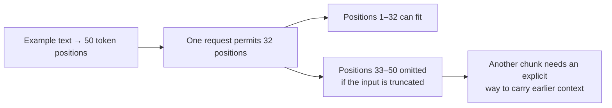
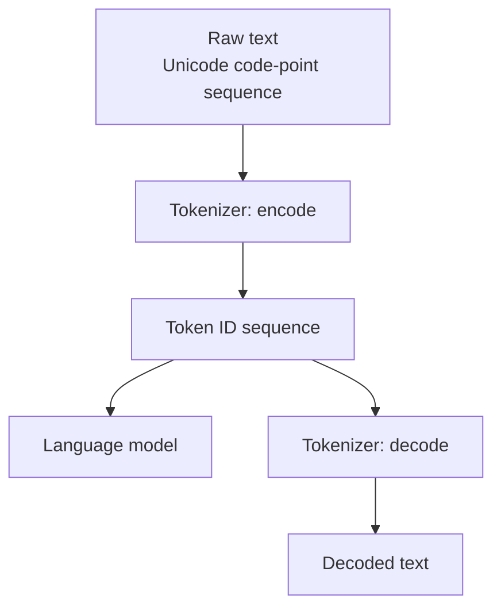
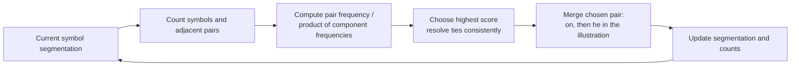

# 🧬 Class 12: Byte-Level BPE, WordPiece, and SentencePiece
### 📋 Production AI / LLM Engineering | Krish Naik Academy

**🎙️ Mentor:** Sourangshu Pal (Paul)  
**⏱️ Duration:** 3 hours 22 minutes 51 seconds | **📅 Session:** Day 12 (30 August 2026)

**Class recording:** [30 Aug Tokenization - 2](https://learn.krishnaikacademy.com/web/courses/6a16f8935e281281cd6b1128?chapter=6a9494ce2d26b133ba162b1d)

The class revisits BPE merges, separates Unicode characters from UTF-8 bytes, demonstrates why a complete byte alphabet avoids missing-character failures, works through WordPiece-style pair scores, and trains SentencePiece Unigram and BPE tokenizers. It finishes with vocabulary-size experiments, sampled segmentations, evaluation questions, and a network-packet example.

The notes use the full transcript, **Token Continues .pdf**, and all four matching notebooks. A transcript label changes from PAUL to Krish Naik after a reconnection, while students continue addressing the instructor as Paul; the teaching flow is treated as one continuous session.

---

## 📰 Quick Updates

- Paul switched the BPE visualization tool after finding inconsistent behavior in the earlier tool. He compared its results with the algorithm's actual frequency rule rather than treating every animation as authoritative.
- Comparison notebooks for character/byte BPE, Unicode/byte representation, and SentencePiece were shared through the course resources.
- The next practical session would train a tokenizer on custom data, probably healthcare text, and discuss why it cannot simply replace a pretrained model's original tokenizer.
- Schedule and course-transfer options were discussed, but no class-time change was finalized. Dates, access, and administrative requests should be checked in the course dashboard and Notion.

---

## 🔁 BPE Recap: The Merge Engine Stays Familiar

Paul starts with a small corpus containing words such as **low**, **lower**, **lowest**, and **wide**. The initial representation consists of atomic symbols. The algorithm counts adjacent pairs, merges the highest-frequency pair into a new symbol, updates the segmentation, and repeats.

The visible example has ties: **l + o** and **o + w** can have the same frequency. Either can be selected under the implementation's tie-breaking rule. If l + o is selected first, **lo + w** can subsequently form low. If o + w is selected first, **l + ow** can form the same word.

Different tie choices can produce different learned merge orders and sometimes different final segmentations. The important requirement is that the selected pair obey the frequency criterion and a consistent tie policy, not that every demonstration tool show identical intermediate steps.

The class also discusses visible boundary symbols. A marker used by a visualizer should be interpreted according to that tool's convention; it is not automatically a literal newline or a universal tokenizer delimiter.

### Training merges and inference are distinct

During training, the corpus supplies pair statistics and new pieces are added. During inference, a fixed tokenizer applies its learned segmentation scheme to new text. It does not normally retrain its vocabulary or add a fresh merge rule for every prompt.

The companion comparison notebook illustrates this with a frequency-weighted corpus:

| Word | Frequency |
|---|---:|
| low | 5 |
| lower | 2 |
| newest | 6 |
| widest | 3 |

Its first merges are **e + s → es**, **es + t → est**, **l + o → lo**, and **lo + w → low**. Those counts differ from the opening live visualizer because the supplied examples are not the same corpus. The lesson is to calculate from the actual input, including word frequencies.

Stopping rules also differ. A requested vocabulary size, a merge-count limit, and lack of remaining adjacent pairs are possible controls. “Stop when no pair appears more than once” is a teaching rule, not a universal requirement; the supplied engine itself stops for no remaining pairs or the requested merge count.

---

## 🔤 Unicode, UTF-8, Bytes, and Tokens Are Different Units

Paul uses ordinary English, accented Latin text, Hindi, Japanese, emojis, a flag, and mathematical symbols to make the representation distinction concrete.

**Unicode** assigns code points to text elements. **UTF-8** encodes those code points into byte sequences. A byte has eight bits and 256 possible values, from **0 through 255**. A **token** is a tokenizer's unit, which can correspond to one byte, several bytes, a character, or a larger text piece depending on its vocabulary.

| Quantity | What is being counted |
|---|---|
| Python string length | Unicode code points in that string |
| UTF-8 byte length | Bytes used to encode those code points |
| Token count | Pieces/IDs emitted by a particular tokenizer |
| Vocabulary size | Number of token entries available to that tokenizer |

The distinction is especially visible in **café**. The exact companion experiment is:

```python
word = "café"

# ---------- Unicode character view ----------
print("UNICODE CHARACTERS")
print("Characters:", list(word))
print("Count     :", len(word))
print()

# ---------- Raw byte (UTF-8) view ----------
utf8_bytes = word.encode("utf-8")
print("RAW BYTES (UTF-8 encoded)")
print("Bytes     :", list(utf8_bytes))
print("Count     :", len(utf8_bytes))
```

Its output gives four code points and five bytes:

| Text element | UTF-8 bytes |
|---|---|
| c | 99 |
| a | 97 |
| f | 102 |
| é | 195, 169 |

The transcript briefly says 167 before returning to 169; the supplied code and output establish the latter for é. Raw bytes are **more numerous** than code points here. Byte-level representation does not automatically shorten a sequence; learned merges are what group byte sequences into larger tokens.

The India flag in the notebook has eight UTF-8 bytes and is composed of two regional-indicator code points. A visible symbol is therefore not necessarily one code point or one token. Emoji sequences and combining marks make “character” an ambiguous counting unit.

The useful distinction is a trained tokenizer's character alphabet versus the Unicode standard itself. An emoji can be valid Unicode while absent from the alphabet learned from an English-only corpus. UTF-8 is a Unicode encoding, so switching to bytes does not mean abandoning Unicode. [Python Unicode HOWTO](https://docs.python.org/3/howto/unicode.html)

---

## 📏 Sequence Length and Vocabulary Size Create Different Costs

The whiteboard presents two concerns: a representation can generate many positions, and a vocabulary can make the model's final output projection large.

The example assumes **50 token positions** and a model window of **32**. If processing truncates to the first 32, positions 33–50 are omitted. Splitting the remaining text into a fresh request does not automatically transfer the first request's information; some explicit method must preserve or resupply it.



This translates the supplied PDF's 50-versus-32 example. The exact counts are assumptions for teaching, not measurements of a particular model. Overflow behavior can also be an error or an application-level truncation policy, rather than a model silently reading the first 32 every time.

Vocabulary size creates another cost: a vocabulary-level output vector has a score for every candidate token. A larger vocabulary increases the width of that output and affects embedding/output-projection storage and computation.

The discussion's rough Unicode-character totals illustrate a large alphabet, but a character-level tokenizer does not have to allocate an entry for every Unicode code point. It can use a selected corpus alphabet, with an unknown or fallback policy. Assigned characters, possible code points, scripts, and languages are different counts.

There is a trade-off: larger learned vocabularies can shorten many sequences, but cost more model storage and vocabulary-level computation. Neither “always maximize vocabulary” nor “always minimize it” is an adequate design rule.

---

## 🧱 Byte-Level BPE: Change the Atoms, Keep the Pair Merges

The comparison notebook runs the **same BPE engine** twice. In one run, atomic symbols are Unicode characters. In the other, they are individual UTF-8 bytes.

The exact transformation used in the byte run is:

```python
def word_to_bytes_symbols(word):
    '''
    THIS is the one-line algorithmic difference between byte-level and
    character-level BPE. Instead of list(word) [-> characters], we do:
    '''
    utf8_bytes = word.encode("utf-8")          # str -> raw bytes
    return [bytes([b]) for b in utf8_bytes]    # split into single-byte symbols
```

The next stages still count adjacent pairs, choose the frequent pair, concatenate its two symbols, and update the sequences. The toy English corpus produces similar merges because ASCII letters occupy single bytes.

| Property in the experiment | Character atoms | Byte atoms |
|---|---|---|
| Initial unit | One Unicode code point | One byte |
| Base alphabet | Characters included from the corpus | All 256 byte values |
| Unseen emoji | May be unavailable in the trained alphabet | Its bytes remain representable |
| Larger learned pieces | Character sequences | Byte sequences |
| Merge counting mechanism | Adjacent-pair frequency | Adjacent-pair frequency |

**256 is the base alphabet, not the complete final BPE vocabulary.** Learned merged pieces and special tokens add entries. Full token IDs can exceed 255 even though an individual byte value cannot.

### The unseen-symbol experiment

The character run can encode **lowest** as low + est, but the simulated encoder rejects **low🙂** because the emoji was not in its base character set. In this notebook, that branch prints an unknown warning and returns None; it illustrates an unknown-token policy rather than inserting a literal UNK ID.

The byte run emits:

**[b'low', b'\xf0', b'\x9f', b'\x99', b'\x82']**

The learned merge covers low, while the unseen emoji remains individual bytes. Joining them and decoding UTF-8 recovers the original string. With a complete byte alphabet, valid UTF-8 text has this representation route even when its character was absent from tokenizer training.

This avoids the specific missing-character representation failure. It does **not** guarantee that the language model understands every script, emoji, or binary payload, or that tokenization can never encounter other errors.

---

## 🔌 The Tokenizer–Model Boundary and Byte Decoding

Paul emphasizes that the language model receives the token sequence supplied by its tokenizer. It does not normally receive a Python text string and independently choose a new encoding scheme.

The Tokenization reference notebook includes an explanatory image with **raw Unicode text**, a **Tokenizer**, a **token sequence**, and the **LLM**. Its actual structure is:



Byte-oriented pieces are still mapped to token IDs. Their vocabulary entries retain the corresponding byte sequences. At decoding, those sequences can be joined and interpreted as UTF-8.

Individual pieces need not contain a complete UTF-8 character. The supplied tiktoken example shows an emoji split into byte chunks that are not each printable text independently. The full sequence can decode correctly even when a single piece cannot.

The comparison notebook's actual inspection lines are:

```python
token_ids = enc.encode(text)
token_pieces = [enc.decode_single_token_bytes(t) for t in token_ids]
```

The tiktoken encoding in that experiment is cl100k_base. The shown IDs and grouping belong to that particular encoding; another trained vocabulary can group the same bytes differently.

Model parameters are learned after or alongside the choice of representation. Stable UTF-8 byte encoding establishes recoverable text information; it does not by itself teach its meaning. A model can process the resulting IDs while still performing poorly on an unfamiliar language or task.

---

## 🧮 WordPiece-Style Scoring: Frequency Is Not the Only Priority

The next whiteboard example uses **“the cat sat on the mat”**. Paul switches from choosing the most frequent pair to a normalized pair score:

$$
\operatorname{score}(a,b)=
\frac{\operatorname{freq}(a,b)}
{\operatorname{freq}(a)\operatorname{freq}(b)}
$$

The numerator counts the adjacent pair; the denominator contains the separate frequencies of its two components. A pair can score well when its components occur mainly together, even if another pair has a larger raw frequency.

The PDF counts t five times, h twice, e twice, and five spaces. Its initial hand calculations are:

| Pair | Pair count | First-symbol count | Second-symbol count | Score |
|---|---:|---:|---:|---:|
| t, h | 2 | 5 | 2 | 2/(5×2) = 0.2 |
| h, e | 2 | 2 | 2 | 2/(2×2) = 0.5 |
| o, n | 1 | 1 | 1 | 1/(1×1) = 1 |
| c, a | 1 | 1 | 3 | 1/3 |
| s, a | 1 | 1 | 3 | 1/3 |
| m, a | 1 | 1 | 3 | 1/3 |

Under this illustrative rule, o + n becomes **on** first. After updating the segmentation and counts, h + e is a high-scoring next pair and becomes **he**. Later comparisons include c + a. Paul repeats the cycle rather than changing the score definition after each step.



The PDF's screenshots label changing sets as “vocabulary.” For accuracy, distinguish the **pieces currently used in the example segmentation** from a retained tokenizer vocabulary: adding a merged piece does not inherently require deleting its component entries.

The table also contains repeated pair rows and a jump to a final whole-word segmentation. It is an illustration of the scoring process, not a complete verified production merge trace. The reliable hand-worked comparisons above are sufficient to explain the mechanism.

Hugging Face's official course presents the same score in its WordPiece reconstruction and notes that the original training internals are not fully public. Thus “likelihood score” here is a teaching description, not proof that the ratio itself is a calibrated probability. Runtime WordPiece segmentation also differs from BPE merge replay. [WordPiece explanation](https://huggingface.co/learn/llm-course/en/chapter6/6)

### Statistical pieces are not guaranteed linguistic morphemes

Paul tests strawberry-related words in both visualizers. Some outputs look meaningful; others split at places a human would not prefer. Both algorithms select pieces from statistics, not from a guarantee of linguistically correct boundaries.

Byte coverage solves representability, not every spelling, character-counting, or segmentation-quality problem. WordPiece does not automatically solve a “strawberry” reasoning example either. The observed output depends on the corpus, preprocessing, vocabulary, and training rules.

---

## 🧰 Algorithms, Libraries, and Matching Tokenizers to Models

The class distinguishes **an algorithm** from **a library that implements algorithms**:

| Name | Role in the discussion |
|---|---|
| BPE | A pair-merging subword algorithm |
| Byte-level BPE | BPE with byte atoms and a complete byte base alphabet |
| WordPiece | A subword scheme associated with models such as BERT |
| Unigram language model | A probabilistic segmentation model over candidate pieces |
| SentencePiece | A library supporting Unigram, BPE, character, and word modes |
| tiktoken | A BPE tokenizer library with named OpenAI-related encodings |

SentencePiece is not another name for WordPiece. Its Unigram model is also not merely “WordPiece with another label”: its candidate selection and probabilistic segmentation differ.

Paul recommends concentrating on BPE and compares tiktoken's byte approach with SentencePiece's character-oriented approach. The useful precise distinction is that SentencePiece can also be configured with **byte fallback** for unknown characters. The supplied Tokenization notebook explicitly enables this option.

SentencePiece's official options confirm that fallback can decompose out-of-vocabulary characters into UTF-8 byte pieces. Its use is not confined to models made by one company. Choose the tokenizer configuration belonging to the model, rather than replacing it based solely on the publisher's name. [SentencePiece options](https://github.com/google/sentencepiece/blob/master/doc/options.md)

Tiktoken supports named trained BPE encodings. Hugging Face's tokenizer interfaces support several algorithms; they are not universally byte-level merely because they share a library. [tiktoken repository](https://github.com/openai/tiktoken)

Changing a pretrained tokenizer changes the meaning of input IDs and the mapping of output IDs back to text. Matching vocabulary sizes alone does not preserve those meanings. Any intentional vocabulary adaptation must also address the model's embedding/output parameters and learned token associations.

---

## 🏗️ SentencePiece Practical: Train, Save, Load, Encode, Decode

Paul next uses SentencePiece directly on **botchan.txt**, an English corpus used in the project's examples. The library learns from raw text rather than requiring a language-specific word tokenizer first.

Its supported model types are **unigram**, **bpe**, **char**, and **word**. Unigram is the default. The class focuses on Unigram and BPE, while the simpler modes are left largely as notebook references.

The exact saved Unigram training cell is:

```python
spm.SentencePieceTrainer.train(
    input=corpus_path,
    model_prefix="unigram_model",
    vocab_size=5500,
    model_type="unigram",
    character_coverage=1.0,
)
```

The requested size was changed repeatedly during the live demonstration. The final saved code shows 5500; some older cell outputs still show 2000. Those stale outputs should not be treated as a synchronized execution of the final notebook.

| Argument | Meaning |
|---|---|
| input | Corpus file used to learn pieces |
| model_prefix | Prefix of saved tokenizer artifacts |
| vocab_size | Requested vocabulary size |
| model_type | Algorithm/mode selection |
| character_coverage | Coverage of characters in the training corpus |

The model prefix is an output filename choice, not the algorithm selector. Character coverage 1.0 concerns the observed training corpus; it does not promise representation of all characters in every future input.

### Two output files have different purposes

- **.model:** serialized tokenizer configuration, vocabulary, and segmentation information used by the processor.
- **.vocab:** readable pieces and scores useful for inspection.

The model file is essential for loading the learned tokenizer; it is not disposable because it is less human-readable. The readable file can show negative **scores**. Those are different from token IDs and are not a minus sign used merely to render whitespace.

The processor is loaded with the model file, then the sample **“I saw a girl with a telescope.”** is encoded as pieces and as integer IDs. The exact source uses:

```python
pieces = sp_unigram.encode(sample_sentence, out_type=str)
ids = sp_unigram.encode(sample_sentence, out_type=int)
```

For the stored sample, telescope is split into several pieces. Its precise IDs depend on the learned vocabulary, so they should not be memorized as universal constants.

The decoding check is:

```python
decoded = sp_unigram.decode(ids)
print("Decoded IDs back to text:", decoded)
print("Matches original?        ", decoded == sample_sentence)
```

It succeeds for the displayed example. Round-trip testing is more meaningful than judging pieces only by appearance.

---

## ␣ Whitespace, Special Tokens, and Text Alignment

SentencePiece makes spaces visible with **▁**, the U+2581 lower-one-eighth-block character. It is not an ordinary underscore. A prefix such as ▁with indicates a space-bearing piece.

A leading marker can also come from the library's **dummy-prefix** convention, so it does not prove that the original text began with a literal space. Other tokenizers use different visible conventions; a GPT-style Ġ is not interchangeable with every whitespace scheme.

The default IDs shown in the notebook are unknown = 0, beginning = 1, end = 2, and padding = -1, meaning disabled. These are the example configuration's settings; other models may override them.

Whitespace markers help reconstruct text, but exact original-byte recovery depends on normalization and unknown handling. The default normalization can alter compatible forms and collapse extra spaces. The supplied broader Tokenization notebook shows identity normalization and preserved extra whitespace as explicit options when those properties are desired. [SentencePiece normalization options](https://github.com/google/sentencepiece/blob/master/doc/options.md)

The SentencePiece notebook also includes an offset-mapping reference. It maps pieces back to spans in the original input, useful for highlighting, annotations, or entity boundaries. The exact cell requests:

```python
text = "I saw a girl with a telescope."
result = sp_unigram.encode(text, return_type="offset_mapping")
```

The official Python API documents that return format. This was mentioned briefly rather than developed into an annotation application. [SentencePiece Python API](https://github.com/google/sentencepiece/blob/master/python/README.md)

---

## ⚖️ Comparing Algorithms and Vocabulary Sizes

The BPE training cell uses the same corpus but requests **5000** pieces, while the saved Unigram cell requests **5500**. The comparison therefore does not isolate algorithm choice perfectly.

Stored examples show:

| Example | Unigram tokens | BPE tokens |
|---|---:|---:|
| I saw a girl with a telescope. | 13 | 11 |
| Tokenization is the first step of any NLP pipeline. | 18 | 19 |
| Mixed English/Japanese example | 22 | 20 |

BPE is shorter in one example and longer in another. A single short result does not establish that one algorithm always compresses better.

The Japanese surface text appears as an unknown span in the printed piece output of this English-trained setup. Seeing that text printed as a piece does not prove its original content survives when converted to unknown **IDs** and decoded. Test the IDs and round trip, especially when byte fallback is not enabled.

### Vocabulary granularity experiment

Paul separately trains Unigram models of sizes 300, 1000, and 4000. For the sentence about an NLP pipeline, the saved outputs are:

| Vocabulary size | Tokens emitted |
|---:|---:|
| 300 | 27 |
| 1000 | 24 |
| 4000 | 18 |

Larger vocabularies can retain longer pieces, reducing positions for familiar text. Smaller vocabularies force more splitting. This says something about segmentation, not a universal runtime guarantee.

The class's discussion of “more or fewer merges” should be scoped to the algorithm. Unigram does not train by the same repeated merge sequence as BPE; it selects a probabilistic piece vocabulary. A larger target BPE vocabulary generally requires more learned vocabulary additions, even if encoding later yields fewer pieces.

The live request for a very large vocabulary produced a size-limit error. The corpus must contain enough candidate pieces for the requested size under the trainer's settings. The official hard-vocabulary-limit option explains this condition; it is not a universal ceiling of 8000 for Unigram. [SentencePiece training limits](https://github.com/google/sentencepiece/blob/master/doc/options.md)

---

## 🎲 Subword Regularization: Several Valid Segmentations

The final practical experiment samples **telescope** several times with the Unigram tokenizer. The saved loop is:

```python
for i in range(5):
    pieces = sp_unigram.encode(word, out_type=str, enable_sampling=True, alpha=0.15, nbest_size=-2)
    print(f"  sample {i+1}: {pieces}")
```

The samples can use different pieces while reconstructing the same word. This gives downstream training varied segmentations of the same text, similar in purpose to data augmentation.

The alpha value is a sampling parameter, not literally “15% of characters,” and nbest_size does not mean the number of words in the input. The saved experiment uses -2; the official examples commonly show a negative value to permit broader sampling.

Deterministic encoding returns its chosen segmentation; sampling introduces variation on purpose. Regularization does not change a fixed pretrained model's ID meanings. It changes which valid sequences from the same tokenizer vocabulary are seen during training.

Unigram is not deprecated merely because Paul gives BPE higher priority. SentencePiece also supports BPE-dropout for sampled BPE segmentation, so stochastic segmentation is not exclusive to Unigram in every implementation. [SentencePiece sampling support](https://github.com/google/sentencepiece)

---

## 🧪 Evaluating a Tokenizer and the Network-Packet Question

Vinay asks how to measure the quality of a custom tokenizer. Paul recommends an evaluation set relevant to its intended corpus, including inputs that expose unknown-character behavior, and comparisons between tokenization schemes on the same data.

He particularly emphasizes **compression efficiency**. The reference notebook calculates:

```python
print("tokens length:", len(tokens))
print("ids length:", len(ids))
print(f"compression ratio: {len(tokens) / len(ids):.2f}X")
```

In that experiment, the numerator counts original UTF-8 bytes and the denominator counts merged token IDs. It is a **bytes-per-token ratio**, not a file-size compression measurement including storage cost of IDs and vocabulary tables.

Higher ratio can indicate fewer model positions for a given text, but does not alone prove semantic quality, multilingual fairness, or better downstream accuracy. Define the measurement before applying a rule such as “greater than one is good.”

Vinay follows up with downstream model A/B testing. Tokenizer-only properties and language-model task performance are both useful, but they answer different questions. Downstream comparisons must account for training and model compatibility rather than attributing every result to the tokenizer alone.

### Hex dumps are not the same as internal byte tokenization

Prem asks about a PCAP file, IP headers, and percent-encoded URL payloads such as **%2F**. Paul distinguishes the textual representation of hexadecimal data from bytes used inside a text tokenizer.

Typing a hex dump into a prompt supplies text characters representing bytes. It is not the same input as supplying the decoded structure. Token count may increase substantially, and byte coverage does not establish that a general model can interpret the network protocol.

Paul recommends parsing or decoding to a useful representation before analysis and testing the result on real examples from the task. Specialized models trained on packet or hex representations may behave differently. The session does not demonstrate a PCAP analysis pipeline or prove that all general models fail such inputs.

---

## 🗺️ What's Next

The next class would create a tokenizer on a custom dataset, probably healthcare data, compare it with an existing tokenizer, and discuss how to adapt a model without blindly swapping token IDs.

Paul planned to save the tokenizer through Hugging Face for later project use. Training was described as CPU work, with runtime depending on corpus and available cores; it was not a demonstrated guarantee that every job finishes in four or five hours.

Prompt engineering and structured-output tooling such as Instructor and Outlines were mentioned as subsequent topics. For revision, he recommended BPE from scratch, followed by a library implementation, and optional tokenizer-building material from Andrej Karpathy and Sebastian Raschka.

---

## 💬 Live Q&A Highlights

The late open floor includes Rajeswari, Vinay, Swati, Prem, Savan, and Vivek. Muhammad Arslan's exchange concerns access and course logistics, so it is summarized in the resource updates rather than given a technical question.

| Question | Answer |
|---|---|
| **Nitish:** If a tied BPE run starts with ow instead of lo, what happens next? | The merge order changes; l + ow can still form low. Follow the actual statistics and tie policy rather than expecting one universal animation. |
| **Sivasai / chat questions:** Why distinguish Unicode from UTF-8? | Unicode code points identify text; UTF-8 encodes them as bytes. Missing tokenizer characters are a trained-alphabet issue, not a failure of Unicode to represent a valid emoji. |
| **Tom:** Can an LLM simply use two context windows for one overflowing input? | Separate chunks or requests are possible, but context transfer must be supplied explicitly. A fresh request does not automatically include an earlier omitted chunk. |
| **Shantang:** Is byte-level tokenization model quantization? | No. Token representation and model parameter precision are different operations. |
| **Vivek:** Can one character require different numbers of bytes? | UTF-8 uses variable-length byte sequences. Token pieces can then group or split those bytes according to learned merges. |
| **Dishant:** Can encoded byte data be read directly, and can Hindi use more positions? | Decoding recovers text; raw pieces are often less readable. Multi-byte scripts can use more byte positions before merging, but actual token counts depend on the vocabulary. |
| **Prabu Manickam:** How are byte/token boundaries known? | Learned pieces have byte sequences and IDs. Tokenization determines the pieces; decoding joins their bytes and interprets the resulting text. |
| **Yogesh / Rajit:** Does the LLM know to switch to raw-byte decoding? | The tokenizer supplies the IDs and their representation scheme. The model does not independently select a new encoding for an unknown character during the forward pass. |
| **Aishwarya, name transcribed unclearly:** Is vocabulary size fixed for each language? | A trained tokenizer has its own vocabulary and ID mapping. Another tokenizer or custom corpus can yield a different vocabulary; there is no universal language-specific size. |
| **Rashmi:** Does the WordPiece-style score indicate symbols that tend to occur together? | The ratio favors pair frequency relative to separate component frequency. It is a ranking rule in the teaching example, not a calibrated next-token probability. |
| **Chat question:** Is SentencePiece an algorithm? | It is a library. Unigram, BPE, character, and word modes are separate options; WordPiece is another tokenization scheme. |
| **Rajeswari:** What happens when a learned byte merge does not cover an emoji? | With a complete byte alphabet, the representation can use individual UTF-8 byte pieces. The emoji's exact code-point sequence has a stable byte encoding. |
| **Vinay Pallerla:** How can a custom tokenizer be evaluated? | Use a relevant held-out corpus, compare segmentations, count unknowns, test round trips, and define compression measurements. Domain coverage matters when interpreting another dataset's results. |
| **Vinay:** Is compression ratio the benchmark? | Paul used it as an efficiency indicator. In the provided reference it means original byte count divided by merged token count; it is not sufficient proof of overall tokenizer quality. |
| **Vinay:** Should downstream language models be compared too? | Controlled downstream tests can assess task effects, while tokenizer-only checks isolate representation behavior. Other model/training factors must be accounted for. |
| **Swati Gupta:** What is the best revision path? | Paul recommended a BPE scratch implementation, then a library implementation, plus reusable personal notes that explain the same concepts in one's own words. |
| **Prem Kumara:** Will a PCAP or hex dump cause token explosion? | It may produce many textual tokens; the session did not measure a PCAP example. Parsing to a useful representation first was suggested. |
| **Prem:** What about percent-encoded URLs and IP-header hex values? | Textual hex/percent encodings differ from a tokenizer's internal byte pieces. Decode or parse deliberately, and test the representation appropriate to the network-analysis task. |
| **Prem:** Could a specialized model understand hex directly? | A domain-specific training corpus can change performance. Byte representability alone does not establish protocol understanding in a general model. |
| **Savan Jain:** Is the advanced course appropriate for a program manager with prior AI study? | Paul framed the choice around existing foundations, study time, and whether the learner needs implementation-level judgment for their own or their team's work. The broader course provides less depth. |
| **Savan:** Will coding complexity continue increasing sharply? | Paul said many later topics would use higher-level frameworks, although mixture-of-experts and distillation would still require study. This was a course-plan answer, not a technical property of tokenizers. |
| **Vivek Chetanbhai Chavda:** Can someone revise earlier foundations alongside this course? | Paul emphasized available time and the ability to connect new material with prior concepts, recommending the references where prerequisites need review. |

---

## 🔑 Key Pointers to Remember

- Unicode code points, UTF-8 bytes, token IDs, and vocabulary entries are different units.
- Café has four code points and five UTF-8 bytes.
- The byte alphabet has 256 values; the learned BPE vocabulary can be much larger.
- Byte atoms change the starting representation, not the core pair-frequency merge loop.
- Unknown learned characters are different from invalid or unsupported text representation.
- Byte coverage preserves information without guaranteeing language-model understanding.
- Individual token byte sequences may split a UTF-8 character.
- Sequence length and vocabulary size create different model costs.
- Tied training pairs can produce different merge orders.
- WordPiece-style scoring compares pair frequency with component frequencies.
- Training-time pair selection and runtime segmentation are separate procedures.
- Statistical subwords need not match human linguistic boundaries.
- SentencePiece is a library with several algorithms, and supports optional byte fallback.
- A .model file is needed to use the learned tokenizer; .vocab aids inspection.
- Negative piece scores are not negative token IDs.
- Whitespace marker ▁ is not an ordinary underscore.
- Normalization can affect exact original-text recovery.
- Larger vocabularies often shorten familiar inputs, but increase other costs.
- Sampling changes valid segmentation, not a fixed vocabulary's ID meanings.
- A pretrained model and tokenizer must retain compatible token associations.
- Compression efficiency is one evaluation dimension, not the whole objective.
- A textual hex dump is different from internal byte-level tokenization.

---

## ✅ Action Items After Class 12

- [ ] Reproduce a tied BPE merge and explain the tie-breaking behavior.
- [ ] Compare code-point counts, raw-byte counts, and token counts for the notebook's scripts and emojis.
- [ ] Run the character-versus-byte comparison on low🙂 and inspect its round trip.
- [ ] Separate byte values 0–255 from learned token IDs above that range.
- [ ] Recalculate th, he, on, and ca scores in the whiteboard sentence.
- [ ] Distinguish current segmentation pieces from the retained tokenizer vocabulary.
- [ ] Train/load the SentencePiece examples and inspect both saved artifact types.
- [ ] Verify each example's actual current vocabulary size rather than trusting stale labels.
- [ ] Test integer-ID round trips for out-of-corpus scripts and whitespace cases.
- [ ] Compare vocabulary sizes on the same held-out text and report the measurement definition.
- [ ] Sample telescope repeatedly and compare with deterministic encoding.
- [ ] Create an evaluation set covering ordinary domain text, uncommon symbols, and unknown handling.
- [ ] Keep the pretrained tokenizer/model compatibility issue in view before the custom-tokenizer lesson.

---

*📝 Notes compiled from the full Class 12 transcript — **GMT20260830-143125_Recording.cutfile.20260830203953777.transcript.vtt** — the accompanying **Token Continues .pdf**, and all four matching notebooks: [SentencePiece tutorial](https://colab.research.google.com/drive/1boq04-MpkYJeYNcmQuQFj_qAkO0-D7nK), [character/byte BPE comparison](https://colab.research.google.com/drive/1Ao2EYc35MI9d8sEXpVJgz7MhSrtc0vzK), [Unicode/byte examples](https://colab.research.google.com/drive/1cer2LwOWDfn4SEcjyy7KfJGlCU4M7BwO), and [Tokenization reference](https://colab.research.google.com/drive/1y0KnCFZvGVf_odSfcNAws6kcDD7HsI0L), for “[30 Aug Tokenization - 2](https://learn.krishnaikacademy.com/web/courses/6a16f8935e281281cd6b1128?chapter=6a9494ce2d26b133ba162b1d),” Production AI / LLM Engineering, Krish Naik Academy. All seven PDF pages and the reference notebook's tokenizer/LLM diagram were visually inspected. All code/Markdown cells were read, including recovery of ranges obscured by an embedded image payload. Excerpts reproduce actual notebook source; stored outputs are identified as examples rather than a new execution.*
