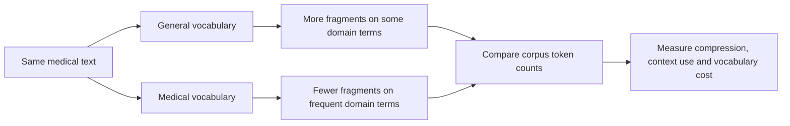
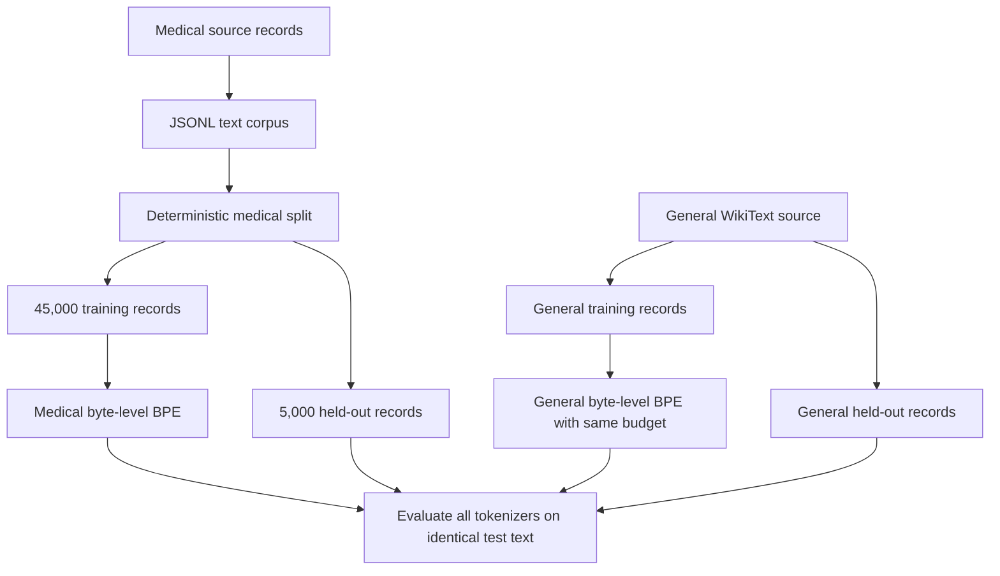
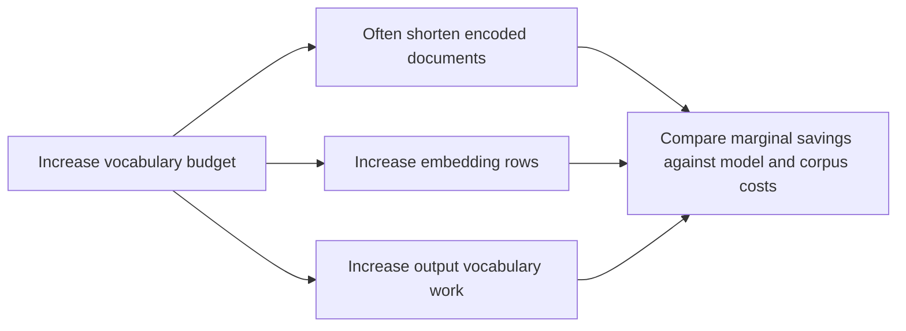
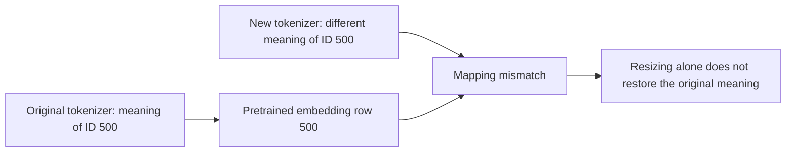

# 🧬 Class 13: Custom Domain Tokenization and Vocabulary Trade-offs
### 📋 Production AI / LLM Engineering | Krish Naik Academy

**🎙️ Mentor:** Sourangshu Pal (Paul)  
**⏱️ Duration:** 3 hours 54 minutes 16 seconds | **📅 Session:** Day 13 (5 September 2026)

---

## 📰 Quick Updates

Paul shared two practical projects for investigating domain tokenization: the initial medical-versus-general comparison in **tokener**, followed by the larger controlled experiment in **tokenization-explainer**, on its **vocab-size-sweep** branch. The branch matters because the vocabulary sweep and its supporting files are part of this session’s exercise.

The class continued beyond the originally expected tokenization coverage. The final decision framework, Hugging Face packaging and upload, and a closer walkthrough of the training script were carried into the following class. Prompt engineering was planned after those remaining topics; it was not taught here. Paul also invited volunteers to help administer the course Discord and said most earlier track-switch issues had been resolved.

The session’s central question was practical: **when does a tokenizer trained on your own domain save enough tokens to justify its vocabulary and model costs?** The demonstrations trained and evaluated tokenizers. They did not train a medical language model or establish clinical accuracy.

---

## 🔍 Why a Domain Tokenizer Can Matter

The same text can require very different numbers of tokens depending on the vocabulary and segmentation rules. General text training exposes a tokenizer to frequent everyday fragments. Medical abstracts repeatedly contain specialized drug names, conditions, biochemical terms, and units. A tokenizer trained on those abstracts can spend its vocabulary budget on pieces that occur often in that domain.

Paul began with this contrast rather than treating medical terminology as inherently impossible for a general tokenizer. A general tokenizer can usually represent a long technical word through multiple subword pieces. The cost is that it consumes more sequence positions. A word split into eight pieces is not an invalid word, and the model can still learn relationships involving those pieces. The experiment measures fragmentation and compression, not a direct inability to understand medicine.

With a fixed model context limit, fewer tokens can let more of the original document fit into the input. Fewer positions may also reduce parts of training and inference work. Those benefits must be weighed against a larger vocabulary, which increases the embedding table and output vocabulary computation. Token count alone does not determine total latency, memory, quality, or price.



The domain examples in the class are a method you can transfer to finance, legal documents, code, or another specialized corpus. The correct starting point is representative text from the intended application. A medical result does not establish what happens on financial abbreviations, Hindi clinical notes, or a mixed-language corpus.

---

## 🛠️ Repositories, Environments, and the Actual Data

The first project is [tokener on its master branch](https://github.com/sourangshupal/tokener/tree/master). It compares GPT-2 and BioGPT tokenizers and includes a small tokenizer-training experiment. The second is [tokenization-explainer on vocab-size-sweep](https://github.com/sourangshupal/tokenization-explainer/tree/vocab-size-sweep), which adds equal-size controls, curated probes, held-out evaluation, and several vocabulary budgets.

The live setup followed the familiar sequence of getting the repository, entering its project directory, and synchronizing its environment with uv. Several problems came from the surrounding environment rather than the tokenization algorithm:

- The terminal must be in the directory containing the project configuration before synchronizing dependencies.
- A notebook must use the project’s Python environment as its kernel. An installed package in one environment is not automatically available in another kernel.
- Paul’s personal activation shortcut was an alias, not a universal command students could assume existed.
- Some students needed notebook-kernel support; others encountered corporate restrictions on GitHub or Hugging Face access.
- A copied command used the wrong output option. The second project’s training script accepts **`--out`**, not `--output`. The first project’s own CLI uses a different interface, so its options should not be mixed with the second project’s scripts.

Public Hugging Face resources may be accessible without an access token. Gated resources can require an accepted agreement and authorized access. Authentication can also affect access limits; this does not mean every tokenizer download requires credentials.

The first experiment used **PubMed abstracts** from the scientific-papers dataset for medical text and **WikiText-2** for general text. Its companion notebook uses 2,000 medical texts for the initial metric table, 5,000 for training a custom tokenizer, and a separate 1,500 for held-out medical evaluation, with a shuffle seed of 42. The distinction between these slices is essential: evaluating on tokenizer-training text makes the custom artifact’s result less informative.

The larger lab used roughly **50,000 medical records**, divided into **45,000 training records and 5,000 held-out records**, and a corresponding general-text control based on WikiText-103. The live discussion briefly used other rounded training counts; the supplied split script establishes the 45,000/5,000 arrangement for a 50,000-record input.

Paul referred to NIH/PubMed downloading during the session. The **current companion downloader** first reads a Hugging Face dataset and can fall back to NCBI compressed XML files, converting title and abstract text into JSONL records. It should not be described as proof that the original PubMed FTP format is Parquet. That source behavior is visible in the [supplied downloader](https://github.com/sourangshupal/tokenization-explainer/blob/vocab-size-sweep/scripts/download_pubmed_sample.py).



These are record counts, not vocabulary sizes or encoded-token counts. An abstract may contain many whitespace words and more subword tokens. Keeping those units separate becomes especially important in the later corpus-size discussion.

---

## 🧩 Reading Tokens, IDs, and Boundary Markers

The tokenizer turns text into token pieces and integer IDs. A language model subsequently uses those IDs to look up learned embedding rows. The tokenizer artifact and the neural model weights are separate objects. Learning a BPE vocabulary is not the same process as learning model embeddings or fine-tuning a transformer.

The visible token strings contained several boundary conventions:

| Representation | Meaning in the demonstrated tokenizer |
|---|---|
| `Ġ` in GPT-style byte-level BPE | A displayed representation associated with a preceding space. |
| `</w>` in BioGPT’s vocabulary | A word-ending marker used by its BPE representation. |
| `##` in BERT WordPiece | A continuation piece within a word. |
| A leading underscore-like marker in SentencePiece examples | A displayed word/space-boundary convention in that tokenizer family. |

These marks are not typographical noise to delete from tokenizer internals. The decoder uses the tokenizer’s corresponding rules to reconstruct the text. Read the pieces to understand segmentation; verify the decoded string to check the round trip.

In the first example, the sentence about **amoxicillin-clavulanate**, **community-acquired pneumonia**, and **echocardiography** took **28 GPT-2 pieces** and **18 BioGPT pieces** in the supplied comparison notebook, with special tokens excluded. BioGPT retained larger medical pieces, including echocardiography as a word-sized unit, while GPT-2 fragmented several specialist terms.

That example establishes a local difference. It does not establish that every medical term receives one token, that every general tokenizer loses on every medical sentence, or that a shorter segmentation necessarily yields better downstream answers.

---

## 📊 Fertility and the First Medical-versus-General Comparison

**Fertility** in this class means:

\[
\text{fertility} = \frac{\text{total encoded tokens}}{\text{total whitespace-separated words}}
\]

A fertility of 1.4 means approximately 1.4 tokenizer pieces per whitespace word across the evaluated corpus. The calculation aggregates token and word totals. It is not necessarily the unweighted average of each document’s individual ratio. Whitespace word counting is a convenient convention here, not a language-independent definition of a word.

The class also used token count per character budget. The first project reports **tokens per 1,000 characters**; the second reports **tokens per 100 characters**. A tenfold difference in units should not be mistaken for a tenfold change in tokenizer quality.

Paul emphasized a crossover test: evaluate both tokenizers on both domains. If a medical tokenizer compresses medical text better but needs more pieces on ordinary prose, that helps reveal its specialization. The supplied first notebook’s saved results are:

| Tokenizer | PubMed fertility | WikiText-2 fertility |
|---|---:|---:|
| GPT-2 | 1.337 | 1.167 |
| BioGPT | 1.134 | 1.298 |

The medical tokenizer wins on the medical corpus; the general tokenizer wins on the general corpus. This is the domain-mismatch effect the lesson was illustrating. These are saved companion results, not a newly rerun benchmark. Details such as data version, filtering, tokenizer files, and evaluation sample affect the values.

The same notebook’s separate held-out medical slice gives:

| Tokenizer | Held-out PubMed fertility |
|---|---:|
| GPT-2 | 1.345 |
| BioGPT | 1.137 |
| Custom BPE trained on 5,000 abstracts | 1.183 |

The small custom tokenizer recovered much of the compression gap in this particular experiment. The held-out slice was excluded from **this custom training run**. It is not established that none of the pretrained baselines encountered the same documents during their original training.

Lower fertility is useful for compression comparisons, but there is no universal ideal value that makes every tokenizer good. Language, punctuation, domain terms, normalization, and word-count conventions affect it. A smaller fertility score alone does not rank model accuracy. This distinction also matches the research paper [Tokenization Is More Than Compression](https://arxiv.org/abs/2402.18376), which investigates why minimizing token count does not by itself establish improved downstream performance.

---

## 🏷️ A Medical Model Does Not Automatically Have a Medical Vocabulary

Paul compared BERT-family tokenizers to make a subtle but useful point: a model can acquire medical knowledge through domain pretraining while retaining a general-purpose vocabulary.

The supplied notebook compares:

- **bert-base-cased**, the general BERT vocabulary;
- **Bio_ClinicalBERT**, a model adapted to clinical text;
- **BiomedBERT/PubMedBERT**, using a vocabulary created for biomedical text.

Its saved vocabulary equality check shows BioClinicalBERT’s vocabulary matches bert-base-cased’s vocabulary. The tokenization example fragments **myocardial infarction** into eight WordPiece components with those vocabularies, while the demonstrated biomedical vocabulary represents it with two word-sized tokens. The notebook loads the actual biomedical model identifier `microsoft/BiomedNLP-BiomedBERT-base-uncased-abstract-fulltext`; the informal “PubMedBERT” label should not obscure the artifact being used.

The decision to retain an existing vocabulary is not automatically a mistake. It preserves compatibility with pretrained embedding rows and lets a model continue learning from domain text without replacing its token-ID system. Retraining the vocabulary introduces other work and risks. Inspect the tokenizer’s actual files and behavior rather than inferring vocabulary changes from the model name.

This comparison also helps separate **medical pretraining**, **medical vocabulary construction**, and **task fine-tuning**. They affect different parts of the system, and this class primarily investigated the second.

---

## 🧪 The Small Colab Experiment: Three Tokenizers on One Sentence

The separately supplied [Idea_Exploration notebook](https://colab.research.google.com/drive/18w8B-hRM0HOtCvUwjDKXFrWObT-MZl7E?usp=sharing) loaded two already-published custom medical artifacts, GPT-2, and BioGPT. It did not create those published medical vocabularies from scratch inside this notebook.

The test sentence was: **Acetylcholinesterase inhibitors are used in Alzheimer's disease treatment.** Its saved outputs show:

| Tokenizer/artifact | Vocabulary size | Encoded pieces in this notebook |
|---|---:|---:|
| `ashutran63/medical-bpe-16k` | 16,000 | 15 |
| `paulvision/medical-bpe-pubmed` | 16,000 | 15 |
| GPT-2 | 50,257 | 17 |
| `microsoft/biogpt` | 42,384 | 12, including an initial special token |

The two custom artifacts produced the same pieces and IDs for this sentence. That observation does not establish that all files or all possible tokenizations in their repositories are identical.

The custom tokenizer represented **Acetylcholinesterase** using three components, `A`, `cetyl`, and `cholinesterase`; GPT-2 used eight. However, the custom tokenizer fragmented **Alzheimer** more than GPT-2. It improved one specialist term while losing on another. Inspecting the entire sentence prevents cherry-picking a single favorable word.

The BioGPT output includes `</s>` at the start because the encoding call adds its special token. Its 12-piece count therefore should not be treated as a perfectly controlled comparison to the other calls without aligning special-token handling. The first repository’s comparison deliberately avoids this difference.

Loading BioGPT required **sacremoses**, supporting its Moses-based tokenization behavior. This was a tokenizer dependency issue, not a requirement to train a PyTorch model. The scripts can perform tokenization experiments without transformer weight training.

Each custom artifact successfully decoded its IDs back to the original sentence. That round-trip check verifies reconstruction for the tested string; it does not evaluate the quality of a language model attached to those IDs.

---

## 📏 `model_max_length` Is Metadata, Not a New Context Window

The custom tokenizer reported an enormous value near \(10^{30}\) for `model_max_length`. Paul investigated it and saved a corrected tokenizer configuration. That value is a **sentinel for an unspecified limit**, not evidence of a functioning trillion-token context window. Hugging Face documents the default as a very large integer when an associated limit is not supplied. [Tokenizer reference](https://huggingface.co/docs/transformers/main_classes/tokenizer).

The supplied Colab notebook contains this exact configuration example:

```python
from transformers import PreTrainedTokenizerFast
tok = PreTrainedTokenizerFast.from_pretrained("paulvision/medical-bpe-pubmed")
tok.model_max_length = 2048   # or 2048, 8192 — whatever your model uses
tok.save_pretrained("./my-medical-model-tokenizer")
```

The value must be chosen to match the intended model and application. Assigning 2,048 in the tokenizer configuration controls relevant preprocessing metadata; it does not train positional behavior, change the model architecture, or extend a pretrained model’s supported context.

Chitresh’s follow-up focused on synchronizing these limits. The practical sequence is to identify the model’s supported input length, configure tokenization and truncation accordingly, save the tokenizer artifact, and verify the reloaded settings. A tokenizer trained independently has no neural model whose context limit it can automatically infer.

---

## ⚙️ What Training Byte-Level BPE Actually Learns

The class trained new tokenizers on domain text and then inspected their segmentation. The process begins with byte-level pieces and learns useful merges from repeated patterns. It constructs vocabulary entries and token IDs. It does not optimize transformer attention weights, learn the embedding values used by a future LM, or create a trained SLM simply because a tokenizer JSON file now exists.

The first comparison notebook provides the real configuration used for its 30,000-token experiment:

```python
med_tokenizer = Tokenizer(BPE())
med_tokenizer.pre_tokenizer = ByteLevel(add_prefix_space=False)  # match GPT-2's own setting
med_tokenizer.decoder = ByteLevelDecoder()     # must pair with the ByteLevel pre-tokenizer

trainer = BpeTrainer(
    vocab_size=30000,
    min_frequency=2,
    initial_alphabet=pre_tokenizers.ByteLevel.alphabet(),  # all 256 bytes -> lossless decoding
    special_tokens=["<|endoftext|>"],
    show_progress=True,
)
```

This is an excerpt from the supplied notebook, which imports these classes and trains from `medical_train_texts` in the surrounding cell. It is not a standalone script. Its byte-level pre-tokenizer and decoder work together; seeding the complete byte alphabet supports representation of rare characters. Any preprocessing or normalization still needs consideration when assessing exact round trips.

The larger lab uses the same general byte-level BPE idea, with an initial alphabet and **two special tokens**, `<|endoftext|>` and `<pad>`. Its training script reads either text lines or JSONL `text` records and writes `tokenizer.json`. The 16,000 budget is a target vocabulary size, not a promise that any tiny corpus can produce 16,000 useful merges.

The minimum-frequency requirement can stop expansion before the requested budget. A tiny corpus may not contain enough eligible repeated pairs. The official [BPE trainer reference](https://huggingface.co/docs/tokenizers/v0.23.2/api/trainers) documents vocabulary size, minimum frequency, special tokens, and initial alphabet as distinct controls.

This matters for Ranjeev’s late debugging report: his actual vocabulary was only **258** despite a much larger request. In this implementation, 256 byte symbols plus two special tokens explain why 258 is a meaningful clue: little or no additional learned vocabulary was present. The live class did not establish the cause. An empty or wrong corpus, restrictive training settings, or an unexpected artifact requires inspection; the notes should not claim one of those possibilities was confirmed.

---

## 🧫 A Stronger Experiment: Domain Control, Probes, and Held-out Evaluation

The second lab compares four tokenizer columns:

| Column | Role |
|---|---|
| `cl100k` | General-purpose tiktoken baseline. |
| `o200k` | Another larger general-purpose tiktoken baseline. |
| `custom-med` | Medical byte-level BPE, initially at a 16,000 vocabulary budget. |
| `general-bpe` | General-text byte-level BPE with the same 16,000 budget and algorithm. |

The equal-budget control is particularly helpful. Comparing custom-med only against much larger pretrained vocabularies mixes domain, corpus, and budget differences. Comparing it against general-bpe keeps the algorithm and requested vocabulary budget aligned while changing the training corpus. Differences in the resulting held-out segmentation give more direct evidence about the benefit of domain matching.

Paul first examined **20 curated medical probes**. The probes expose the mechanism: which terms fragment, where punctuation and doses add tokens, and where the medical vocabulary helps. They are not enough to establish a broad pass criterion because they were selected for illustration and may overlap with training text.

The saved companion lab shows a mixture of wins, ties, and losses. For **acetylcholinesterase inhibitor**, custom-med uses three pieces against seven for cl100k, six for o200k, and ten for general-bpe. On **empagliflozin 10 mg daily**, custom-med ties cl100k at ten while o200k uses nine. Other strings favor a general baseline. The class explicitly examined these exceptions rather than assuming every drug receives a single token.

A count of strings won and a corpus average are different statistics. A tokenizer can win on more selected phrases yet lose the average because another tokenizer saves more pieces on the remaining phrases. Likewise, a phrase-level fertility result does not substitute for the held-out corpus result.

The lab reserves **5,000 medical records** as a held-out file. The current saved notebook evaluates the **first 2,000 held-out records** for its displayed medical table. That difference matters: reserving 5,000 is not the same as evaluating every one of them in every companion output. Its saved 2,000-record results are:

| Tokenizer | Medical fertility | General fertility |
|---|---:|---:|
| cl100k | 1.470 | 1.176 |
| o200k | 1.439 | 1.166 |
| custom-med, 16k | 1.381 | 1.575 |
| general-bpe, 16k | 1.759 | 1.207 |

These values belong to the supplied **current notebook’s saved run**. The live discussion and other repository tables show slightly different values; they are not silently combined into one run. In the session, the medical custom score was around **1.375**, with the same directional lesson: medical training improves compression on medical held-out text, while the general control does better on general prose.

The effect concerns the selected corpora. A crossover is useful evidence of specialization, but a tokenizer that wins in both domains is not automatically contaminated or invalid. Corpus size, algorithm choices, and preprocessing may create broader improvements. Evaluate the controls rather than turning an expected pattern into a universal rule.

---

## 🎯 Single-Token Rate: A Coverage Probe, Not an Accuracy Score

The lab separately measures the fraction of selected domain terms that encode as exactly one piece:

\[
\text{single-token rate} = \frac{\text{terms encoded as one piece}}{\text{number of tested terms}}
\]

Its 20-term test produced a **10% rate for custom-med**, corresponding to two terms, **hemoglobin** and **lymphocyte**, and 0% for the displayed general baselines. This test uses isolated terms, rather than counting complete abstracts that happen to contain some whole-word pieces.

A 0% rate means none of those 20 isolated strings was encoded as a single token under that call. It does not mean the model fails on all 20 terms or understands 0% of medicine. A multi-piece representation remains usable. A single vocabulary entry is also not an automatically correct or clinically reliable concept embedding.

Boundary context matters. A word at the beginning of a string can be segmented differently from the same word after a space. Case, punctuation, plural forms, and normalization also affect the result. Evaluate the exact strings used by the application, and define whether a leading space or special tokens are included.

Paul returned to this metric in Gaurav’s late question about unlimited GPU resources. He suggested checking fertility and single-token coverage across vocabulary sizes, then balancing them against cost. The remarks about higher coverage were guidance for additional experiments; the class did not present a complete sweep of downstream LM quality or prove that a larger vocabulary always improves this rate.

---

## 📉 Vocabulary Sweep: Diminishing Returns on Compression

The next experiment held the medical training corpus fixed and compared requested budgets of **16k, 32k, 50k, 64k, and 100k**. This separates the vocabulary-budget question from the earlier domain-selection question.

The instructor’s accompanying PDF, **Token Domain.pdf**, records the live comparison:

| Requested vocabulary | Average tokens per document | Change versus previous budget |
|---|---:|---:|
| 16k | 188.8 | — |
| 32k | 177.2 | −6.2% |
| 50k | 173.1 | −2.3% |
| 64k | 171.5 | −0.9% |
| 100k | 169.7 | −1.1% |

The percentages are the displayed experiment’s rounded values. Recomputing from already-rounded averages can give a slightly different final decimal. The saved newer notebook has a different sequence, **186.3, 174.8, 170.8, 169.2, 167.4**, and a fallback worked example uses **1250, 1050, 980, 960, 950**. Those are separate examples; the fallback table is not a PubMed measurement to substitute for the live result.

The largest first gain is the jump from 16k to 32k. Later budget increases buy progressively smaller reductions in sequence length. The final 64k-to-100k jump increases the requested vocabulary substantially for about a one-percent improvement relative to the previous row.

“Versus previous” and “versus 16k” answer different questions. The first measures the marginal gain from the latest increase. The second measures the cumulative improvement from the starting budget. Do not add relative percentages as though they were absolute token counts.

The experiment also reports actual vocabulary size. If the corpus and minimum-frequency setting cannot support more merges, a request for 100k can yield less than 100k. The actual artifact is what determines its usable token IDs and embedding-row requirement.

---

## 💾 The Other Side of the Sweep: Embedding and Output Cost

The PDF pairs the compression table with an embedding-cost calculation using a fixed hidden width of **1,024**:

\[
\text{embedding parameters} = V \times d_{model}
\]

| Vocabulary | Parameters in one embedding table | Relative to 16k |
|---|---:|---:|
| 16,000 | 16,384,000 | 1× |
| 32,000 | 32,768,000 | 2× |
| 50,000 | 51,200,000 | 3.125× |
| 64,000 | 65,536,000 | 4× |
| 100,000 | 102,400,000 | 6.25× |

Increasing vocabulary size adds **rows**, while the width of each row stays fixed in this comparison. It does not make every token embedding wider. The calculation counts parameters, not bytes: storage also depends on datatype, and training memory includes gradients, optimizer state, and other model components.

A language model’s output head also covers the vocabulary. Input embeddings and output weights may be tied, so it is not universally correct to double the table’s parameter count. Even with tied weights, evaluating a larger output vocabulary has computation implications.

Paul’s practical concern was that the 100k table is 6.25 times the 16k table, while the last step saves relatively few sequence positions. That is the trade-off: shorter sequences versus more vocabulary-related parameters and work. It is not enough to ask which row has the lowest tokens per document.



For a small model, vocabulary tables can represent a large share of total parameters. For a larger model, the same absolute table increase may be easier to accommodate. The session used a fixed width to make the cost visible; it did not calculate a complete end-to-end training budget for every candidate architecture.

---

## ⚖️ The Knee Rule, Corpus Size, and the Unfinished Decision

One helper chooses the **smallest vocabulary whose average encoded length is within 2% of the best tested result**. This is an experiment-selection heuristic, not a universal optimum theorem.

For the live table, the best displayed average is 169.7. A 2% allowance gives:

\[
169.7 \times 1.02 = 173.094
\]

The **64k row at 171.5** clearly qualifies, as does 100k. The **50k row at 173.1** is borderline and very slightly outside when only those rounded numbers are used. Paul explored that boundary during the discussion. Use the unrounded experiment values for a strict automated decision; do not declare the rounded 50k value definitely inside the threshold. The supplied notebook’s own helper reports a 64k compression knee for its saved run.

The second consideration was the size of the training corpus. The class discussed roughly **6.3 million corpus units**, which the current script counts as **whitespace-separated words**. It is a proxy for corpus scale, not a vocabulary of 6.3 million unique entries, not 6.3 million abstracts, and not necessarily 6.3 million encoded tokens under every tokenizer.

Dividing that rounded corpus count by vocabulary size yields:

| Vocabulary budget | 6.3 million ÷ budget |
|---|---:|
| 16k | 393.75 |
| 32k | 196.875 |
| 50k | 126 |
| 64k | 98.4375 |
| 100k | 63 |

The ratio indicates how corpus scale compares with vocabulary capacity. It does **not** mean a single token compresses 394 words. It does not guarantee every vocabulary item appears 394 times either: frequencies are highly uneven, and the numerator uses a different unit from actual subword occurrence counts.

The corpus-size guidance in the lab suggests smaller vocabularies for smaller corpora and larger budgets for very large pretraining corpora. Treat its bands and tenfold rule-of-thumb discussion as classroom heuristics requiring validation. The class’s papers do not establish one exact ratio as a universally sufficient condition for stable vocabulary learning.

This produced a genuine tension: the compression-only rule favored a larger budget, whereas the small-corpus and embedding-cost considerations favored a smaller one. Ranjeev raised that conflict explicitly. Paul said the final balancing framework was not yet complete and would continue next class. He identified **32k and 50k** as practical candidates to investigate, rather than declaring one irrevocable winner for every corpus.

More data also did not yield identical numbers on every student machine. The discussion included runs with different fertility scores after changing the sample count. Extra records can change frequencies and merge choices; they do not mathematically guarantee improvement on a particular test set. Reproducibility requires the same input records, filtering, split, training settings, tokenizer artifact, and metric calls. In the current sweep script, existing artifacts can be reused, so a changed corpus does not necessarily retrain an already-existing tokenizer automatically.

The two research readings were [How Good is Your Tokenizer?](https://arxiv.org/abs/2012.15613) and [Tokenization Is More Than Compression](https://arxiv.org/abs/2402.18376). Paul introduced them as deeper background for the continuation, rather than teaching all their experiments in this session.

---

## 🔗 Tokenizer Compatibility with Pretrained Models and APIs

The most consequential deployment clarification was that a custom tokenizer is not interchangeable with a pretrained model’s tokenizer. Token IDs index learned embedding rows. If a new tokenizer assigns a different meaning to ID 500, a model trained with the old mapping still interprets row 500 according to its original training.



Keeping the original mapping and **adding selected new tokens** is a different operation from replacing the entire vocabulary. Added tokens require compatible embedding dimensions and a training strategy for their new rows. Hugging Face documents the need to resize token embeddings after vocabulary extension. LoRA applied only to attention layers is not an automatic training solution for newly added embedding rows; selective embedding training or another appropriate configuration must be considered. [Tokenizer reference](https://huggingface.co/docs/transformers/main_classes/tokenizer), [PEFT troubleshooting](https://huggingface.co/docs/peft/en/developer_guides/troubleshooting).

The supplied lab includes this compatibility warning, but the complete model-adaptation process was not implemented here. A full replacement tokenizer can be paired with a new model trained accordingly; adapting existing weights is a more involved task than changing a filename.

Shantan’s API question concerned sending custom token IDs to a closed model service. A locally trained tokenizer does not change the service’s internal vocabulary or billing tokenizer. Where an API accepts text, the service encodes that text using its own model-compatible tokenization. Compressing the text under your local vocabulary does not make the remote model reinterpret its embedding rows.

Likewise, an SLM or agent does not inherently require a custom tokenizer. Debajyoti asked whether every SLM workflow had to pass through this step. Paul clarified that this exercise was a domain-specific experiment, trained from scratch, not an operation that appended medical terms to a general vocabulary. Reusing the model’s existing tokenizer is the sensible starting point when it already serves the application well.

---

## 🗺️ What's Next

Paul explicitly carried forward the vocabulary-selection balance between compression, corpus size, and embedding cost. The remaining practical steps were to wrap the tokenizer in a Hugging Face-compatible format, upload it to each learner’s own repository, reload and test it in Colab, and inspect the main medical-tokenizer training script more closely.

Prompt-engineering basics, including chain-of-thought concepts, were planned after completing that work. The class ended before those lessons. The discussion of medical data for a future fine-tuning project was a course plan, not evidence that a medical LM had been trained during this session.

---

## 💬 Live Q&A Highlights

| Question | Answer |
|---|---|
| Why use a medical tokenizer when a general one can encode the text? | Repeated medical patterns can need fewer pieces with a domain vocabulary. Evaluate compression and model costs; multiple general subwords are still valid representations. |
| Does training the tokenizer train embeddings or an LLM? | No. It learns vocabulary and segmentation artifacts. Neural embedding values and transformer weights require model training. |
| Why does BioGPT need sacremoses? | Its demonstrated tokenizer uses Moses-style preprocessing and BPE. Installing that dependency resolves the tokenizer-loading requirement shown here. |
| What are `Ġ`, `</w>`, and `##`? | Display conventions for spaces, word endings, or subword continuation in different tokenizer families. Keep the matching decoder rules. |
| Is a medical model guaranteed to have a medical vocabulary? | No. The supplied BioClinicalBERT comparison retains BERT’s vocabulary, whereas the demonstrated biomedical vocabulary differs. Inspect the artifact. |
| What does fertility mean, and is a lower value always better? | It measures encoded tokens per whitespace word here. Lower means fewer pieces under that convention; it does not alone establish downstream accuracy. |
| Why not decide from one impressive medical sentence? | A selected probe can favor one vocabulary. Test representative held-out medical text and general-text controls as well. |
| Why do token-count-per-character results look different across the projects? | One uses 1,000 characters and the other 100. Align the units before comparing. |
| **Pravat Mishra:** Can this approach work for finance? | Yes as an experiment on a representative finance corpus. Measure the relevant abbreviations and text rather than assuming medical results transfer unchanged. |
| **Chitresh Kaushik / Deepak:** How should tokenizer maximum length relate to the model? | Read the model’s supported length and configure preprocessing accordingly. The tokenizer’s huge unspecified sentinel is not a real context window. |
| Does assigning `model_max_length = 2048` extend the model? | No. It saves tokenizer metadata; the model’s architecture and learned context behavior are separate. |
| **shantan.talla:** Can a custom tokenizer reduce token use in a closed API by sending its own IDs? | A local vocabulary cannot replace the service model’s token-ID mapping. Remote tokenization and billing follow the service’s model. |
| **Gaurav Garg:** Can custom tokenizers be attached to niche SLMs? | Tokenizer and model mappings must remain compatible. Specific model examples and full adaptation details were deferred. |
| **sridhar k:** Is replacement equivalent to resizing during fine-tuning? | No. Resizing adds capacity; replacing meanings of existing IDs breaks compatibility. Training new rows and preserving the mapping are separate considerations. |
| Can fewer input tokens automatically make the cheapest model suitable? | Compression can help costs, but model capability, output quality, latency, and the vocabulary computation still matter. |
| **Rushi:** What about English and Hindi medical text? | Use a representative multilingual corpus and test both languages. A custom tokenizer is not, by itself, a trained multilingual model. |
| **Shashank:** Do cloud-platform concepts transfer between Azure Foundry and Bedrock? | Many architecture concepts transfer, while service-specific interfaces still need study. This was guidance, not a hiring guarantee. |
| Why compare two BPE tokenizers with the same 16k budget? | It controls the algorithm and budget while changing training domain, making the domain effect easier to assess. |
| Why do some medical probes tie or favor a general tokenizer? | Frequency, vocabulary allocation, punctuation, case, and prior coverage differ. Specialization does not imply winning every string. |
| What does a 10% single-token rate mean? | Two of the 20 tested isolated terms encoded as one piece. It is not a 10% medical accuracy score. |
| How can a tokenizer win more phrases yet lose the average fertility comparison? | Win counts and aggregate token totals measure different things; savings on individual phrases can have different magnitudes. |
| Why can actual vocabulary be smaller than the requested size? | Training can exhaust eligible merges under corpus and minimum-frequency constraints. Inspect actual vocabulary size. |
| Why did a student’s larger corpus produce a different fertility result? | Dataset selection, preprocessing, artifacts, settings, and evaluation calls can differ. More records do not guarantee a particular score. |
| **Harsh / Manish:** What is the sweep comparing? | Encoded length on the same evaluated documents across vocabulary budgets, alongside the separate increase in embedding cost. |
| Does a 100k vocabulary make each embedding vector larger? | It adds rows at the fixed hidden width used in the example. Width and vocabulary size are separate dimensions. |
| What is the 2% knee rule? | Choose the smallest tested vocabulary whose encoded length is within 2% of the best result. It is a compression heuristic, not the complete decision. |
| Is 50k definitely within 2% in the live rounded table? | It is borderline: 173.1 is slightly above 169.7 × 1.02. Use unrounded values for a strict choice; 64k clearly qualifies. |
| **Alok:** Does the corpus-to-vocabulary ratio mean 394 words become one token? | No. It compares a corpus-scale proxy with vocabulary capacity. It neither represents one-token compression nor guarantees uniform frequency per entry. |
| **RANJEEV TIWARI:** Why does the knee favor 64k/100k while corpus scale favors less? | They optimize different considerations. Paul deferred the final balance and named 32k/50k as practical candidates requiring further experiments. |
| **RANJEEV TIWARI:** Why is my actual vocabulary only 258? | The cause was not resolved live. In this trainer, 256 initial byte symbols plus two special tokens explain the clue; inspect the corpus, settings, and loaded artifact. |
| **Gaurav Garg:** If GPU budget is unlimited, will a larger vocabulary guarantee better quality? | No. Check fertility and domain coverage, then account for parameter and training-time costs. The session did not measure downstream LM quality across the sweep. |
| **Gaurav Garg:** What exactly is a single token in that metric? | The implemented test encodes a selected term as exactly one piece. Define term boundaries and leading-space behavior consistently. |
| **Rushi:** Can we publish the trained tokenizer? | Packaging into the Hugging Face format was the remaining step. The full upload and reload exercise was scheduled for the following class. |
| **DEBAJYOTI MUKHOPADHYAY:** Must every SLM or SLM agent build a custom tokenizer? | No. Start with a compatible general tokenizer unless domain evidence justifies additional work. The medical exercise trained a new tokenizer rather than appending terms. |
| **DEBAJYOTI MUKHOPADHYAY:** Which no-API-key test-data-generation framework had been mentioned earlier? | Paul could not identify the remembered tool. Names discussed in the exchange were possibilities, not a confirmed answer to that requirement. |
| **DEBAJYOTI MUKHOPADHYAY:** The actual need is test data inferred from GitHub PySpark/Python joins—how to approach it? | Paul suggested a coding-agent skill that reads the relevant code and generates data, followed by independent checks or multiple judges. This was an architectural suggestion, not a working demonstrated pipeline. |
| **DEBAJYOTI MUKHOPADHYAY:** Could Copilot be used for that code-driven workflow? | Paul said a coding agent could be used. No specific local-only, key-free framework was established or tested during the exchange. |

---

## 🔑 Key Pointers to Remember

- Domain matching changes segmentation efficiency; it does not automatically establish model or clinical quality.
- Tokenizer vocabulary learning, embedding learning, domain pretraining, and task fine-tuning are different operations.
- Use actual tokenizer files and IDs rather than assuming a model’s domain label implies a custom vocabulary.
- Report fertility with its exact word-count convention and token-per-character metrics with their units.
- Curated probes explain mechanisms; held-out corpora test whether the pattern persists.
- Hold algorithm and vocabulary budget constant when testing the training-domain effect.
- A single-token rate is defined over selected strings and boundaries, not over model correctness.
- Requested vocabulary size can exceed the number of merges the data supports.
- A vocabulary increase adds embedding rows; it does not automatically increase hidden width.
- The compression knee, corpus scale, and embedding cost can favor different choices.
- The roughly 6.3 million count is a corpus-scale proxy, not the number of unique vocabulary items.
- Preserve tokenizer-to-embedding ID compatibility with any pretrained model.
- An enormous `model_max_length` sentinel does not establish a real long-context capability.
- The final selection and publishing walkthrough were deferred, and the no-key test-data framework question remained unresolved.

---

## ✅ Action Items After Class 13

- [ ] Open the exact class repository and branch, and select the project environment as the notebook kernel.
- [ ] Reproduce the GPT-2/BioGPT comparison with consistent special-token handling and a round-trip check.
- [ ] Inspect a medical model’s actual vocabulary before assuming it differs from its base tokenizer.
- [ ] Keep training and held-out records separate; record the dataset, split, seed, and filtering used.
- [ ] Compare custom-med against both the general baselines and an equal-budget general BPE control.
- [ ] Report probe wins, held-out fertility, tokens per character budget, and single-token rate as separate measures.
- [ ] Check the actual vocabulary count and the actual artifact loaded, especially if the result is only 258 entries.
- [ ] Run or inspect the vocabulary sweep on the same evaluation text and calculate marginal savings alongside V × d_model.
- [ ] Identify cached artifacts before assuming a changed corpus triggered retraining.
- [ ] Record a provisional vocabulary choice and the evidence for it; revisit the final balancing framework next class.
- [ ] Match tokenizer length metadata to the intended model and verify it after saving and reloading.
- [ ] Read the two tokenizer papers for their research questions, without treating classroom heuristics as universal formulas.

---

*📝 Notes compiled from the full Class 13 transcript — “5 Sept Tokenization - 3,” Production AI / LLM Engineering, Krish Naik Academy. Primary recording: [Class 13 course page](https://learn.krishnaikacademy.com/web/courses/6a16f8935e281281cd6b1128?chapter=6a9cf34c57524d8c54ee138f); original transcript: `GMT20260905-143109_Recording.cutfile.20260906050040470.transcript.vtt`. Companions: all three pages of `Token Domain.pdf`; the complete [Idea_Exploration Colab notebook](https://colab.research.google.com/drive/18w8B-hRM0HOtCvUwjDKXFrWObT-MZl7E?usp=sharing); the supplied [tokener comparison notebook](https://github.com/sourangshupal/tokener/blob/master/notebooks/medical_tokenizer_comparison.ipynb) and [pipeline](https://github.com/sourangshupal/tokener/blob/master/src/tokener/pipeline.py); and the full [custom-versus-general lab notebook](https://github.com/sourangshupal/tokenization-explainer/blob/vocab-size-sweep/notebooks/04_custom_vs_general.ipynb), README, student guide, and matching trainer, comparison, downloader, split, sweep, and wrapper sources. Current companion outputs are identified separately from the live tables. No notebook or repository code was executed to create these notes.*
