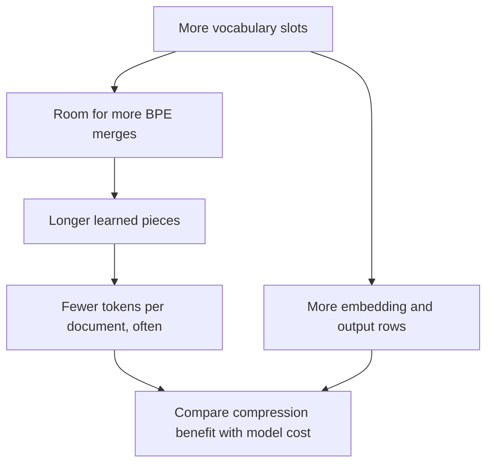
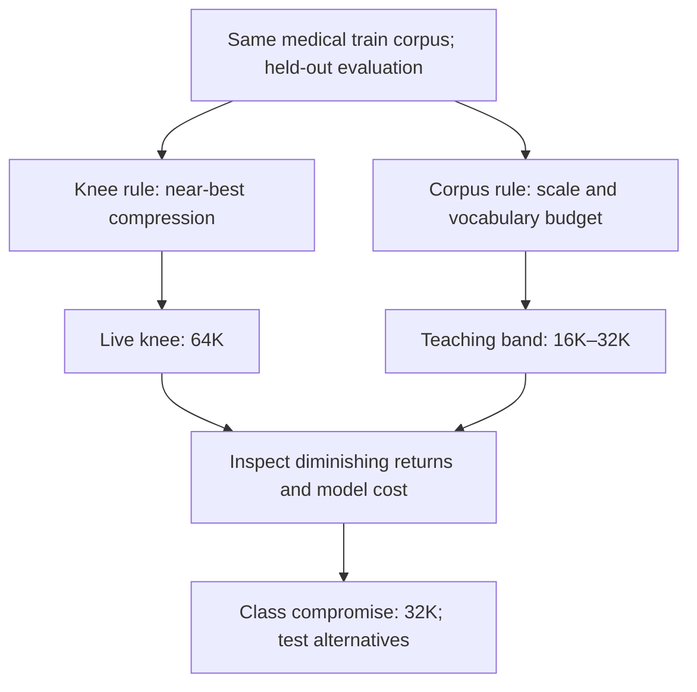

# 🧭 Class 14: Offset Mapping, Custom BPE Decisions, and Prompting Foundations
### 📋 Production AI / LLM Engineering | Krish Naik Academy

**🎙️ Mentor:** Sourangshu Pal (Paul)  
**⏱️ Duration:** ~3 hours 23 minutes (3hr 22min 54s) | **📅 Session:** Day 14 (6 September 2026)

**Class recording:** [6 Sept Tokenization-4 & Prompting](https://learn.krishnaikacademy.com/web/courses/6a16f8935e281281cd6b1128?chapter=6a9df1e98623f011527d222c)  
**Primary transcript:** `GMT20260906-143212_Recording.cutfile.20260906230543410.transcript.vtt`  
**Companions:** `Token Domain 2.pdf`; [offset-mapping notebook](https://colab.research.google.com/drive/1c_JdOVPuwymMcDNKK_SqywKVRMsDZive?usp=sharing); [medical tokenizer lab](https://github.com/sourangshupal/tokenization-explainer/tree/vocab-size-sweep); [prompt foundations notebook](https://github.com/sourangshupal/prompt-engineering-notebooks/blob/master/01_prompt_foundations.ipynb).

---

## 📰 Quick Updates

- The session completed the custom-tokenizer discussion before beginning prompting. The practical sequence was vocabulary-size decisions, wrapping and publishing an already trained tokenizer, reading its trainer, and then the first prompting notebook.
- Students uploaded their tokenizer directories to Hugging Face and shared repository links for inspection. Paul checked the files and tested medical text; the exercise was also framed as the beginning of a Hugging Face portfolio.
- The supplied offset notebook isolates two trainer settings: trimming character offsets and including the complete byte alphabet.
- Only `01_prompt_foundations.ipynb` was taught. Reasoning/output control and advanced prompting were left for the following Saturday.
- The module assignment was to replace the earlier annotated Transformer's spaCy tokenization with custom BPE. Students were also encouraged to repeat the medical experiment with a larger sample, working toward 500K–1M abstracts if resources permitted.
- SFT and alignment were mentioned as future project work. No SFT, GRPO, or language-model training was implemented here.

The numerical examples below preserve the live board values. Current repository outputs sometimes differ because they come from another saved run; they are identified separately rather than blended into the lecture's experiment.

---

## 📉 Choosing Vocabulary Size: Compression Has a Cost

A vocabulary budget determines how much room BPE has for learned pieces. Small vocabularies may split a recurring technical term into several pieces; a larger budget can retain additional merges and longer pieces. This often reduces sequence length, but the saving must be compared with the cost of additional model vocabulary rows.

The board's intuition was:



This reproduces the chain drawn in the supplied PDF. It is a useful trend for a controlled sweep, not a guarantee that every individual string becomes shorter. All candidates should use the same corpus, pre-tokenization, special tokens, and evaluation texts.

The live sweep compared these displayed averages:

| Requested vocabulary | Average tokens per document | Change from previous size, as discussed |
|---|---:|---:|
| 16K | 188.8 | Baseline |
| 32K | 177.2 | About −6.2% |
| 50K | 173.1 | About −2.3% |
| 64K | 171.5 | About −0.9% |
| 100K | 169.7 | About −1.1% |

The major first saving was moving from 16K to 32K: **11.6 tokens per document**. Across 1,000 documents with the same average lengths, that is about **11,600 fewer tokens**. Using the rounded displayed numbers gives a 6.14% reduction; the lecture's 6.2% is an approximate figure. Later jumps still improve compression, but the improvement per added vocabulary row falls.

Paul used a medical compound to explain the mechanism: a smaller tokenizer may retain pieces such as `acetyl` and `cholinesterase`; with additional suitable merges, a longer term can become one piece. The illustration explains why bigger budgets can help. It does not mean every medical word must become atomic before the tokenizer is useful.

For a model with width `d_model`, one vocabulary matrix has approximately:

**vocabulary parameters = V × d_model**

The companion uses `d_model=1024` to make the scale visible:

| Vocabulary | Parameters in one V × 1024 matrix |
|---|---:|
| 16K | 16,384,000 |
| 32K | 32,768,000 |
| 50K | 51,200,000 |
| 64K | 65,536,000 |
| 100K | 102,400,000 |

A separate output projection introduces another vocabulary-sized matrix when input and output weights are untied. Tied weights share parameters, so do not count two independent matrices automatically. The decision is therefore broader than “the largest vocabulary has the smallest token count.”

---

## ⚖️ The Knee Rule and Corpus Rule Can Disagree

The session revisited two practical selection rules. They answer different questions, so disagreement between them is expected.

**The knee rule** asks: what is the smallest tested vocabulary whose average sequence length is close to the best observed length? The class used a 2% tolerance:

- Best displayed average: 169.7 tokens/document at 100K.
- Two percent of 169.7: 3.394.
- Near-best threshold: 169.7 × 1.02 = **173.094** tokens/document.
- 64K at 171.5 is within that threshold and uses fewer rows than 100K.

The board rounded the threshold to 173.1. The displayed 50K value also rounds to 173.1, so its exact inclusion cannot be decided from rounded numbers alone. The helper compares unrounded averages; the instructor's selected knee was **64K**.

The current repository expresses the rule directly in `sweep_vocab_size.py`. This is a source excerpt, with `Sequence` and `KNEE_THRESHOLD` defined earlier in that script:

```python
def recommend_vocab(
    rows: Sequence[tuple[int, float]],
    threshold: float = KNEE_THRESHOLD,
) -> int:
    """Smallest vocab whose avg tokens/doc is within threshold of the best (lowest)."""
    if not rows:
        raise ValueError("rows must be non-empty")
    best = min(avg for _, avg in rows)
    near = [(size, avg) for size, avg in rows if avg <= best * (1.0 + threshold)]
    return min(size for size, _ in near)
```

The **corpus rule** asks whether the training material and model budget justify that many vocabulary entries. The live corpus contained about **6.3 million whitespace words**, drawn from approximately 45,000 training abstracts. That is neither 6.3 million abstracts nor 6.3 million unique vocabulary terms.

The board divided this proxy corpus count by candidate vocabulary sizes:

| Vocabulary | 6.3M whitespace words ÷ V |
|---|---:|
| 16K | 393.75 |
| 32K | 196.875 |
| 50K | 126 |
| 64K | 98.4375 |
| 100K | 63 |

Paul described the ratio as average examples per vocabulary “slot.” Interpret it as a rough measure of corpus scale relative to budget. It does **not** show that every learned token was observed that many times. Frequencies are uneven, a whitespace word can contain several BPE pieces, and some frequent substrings receive many more observations than rare terms.

The teaching repository places a corpus of this scale in a **16K–32K band**. Its bands and the spoken “10× vocabulary” suggestion are exploratory heuristics, not universal laws for stable tokenization. The lecture also switched between character counts, whitespace words, and model tokens while estimating data requirements; those units must be recorded separately in an experiment.

A worked correction matters here: 16,000 × 10 is **160,000**, not 1.6 million. Likewise, 200 tokens/document × roughly 3 characters/token × 1,000 documents gives 600,000 characters only as a rough length estimate. It is not a tokenizer quality test or a reliable conversion for every language.

The decision chain drawn across the PDF can be condensed as:



The class chose **32K as a practical middle ground**, retaining the large first compression gain while limiting matrix size. This was an experimental choice for that corpus. It was not a proof that 32K is optimal for every medical model.

The current companion notebook stores another sweep: 186.3, 174.8, 170.8, 169.2, and 167.4 tokens/document for the five sizes. Its knee helper also selects 64K. Keep that run separate from the board table above. The notebook additionally has synthetic fallback values for missing artifacts; a fallback caption is not a measured PubMed result.

---

## 🌱 More Documents Do Not Automatically Require More Tokens

The instructor initially connected larger datasets with larger vocabulary budgets, then refined the point: **what matters is whether the new material introduces useful recurring patterns**.

Imagine a tokenizer trained on 500K documents using an 8K budget. If another 500K documents repeat essentially the same terminology, doubling the document count alone does not establish a need for 16K vocabulary. If the new collection contains many recurring drug names, procedures, or new technical forms, it becomes sensible to test a larger budget.

The class suggested comparing old and new collections by:

- identifying newly occurring terms;
- measuring their frequency rather than treating every new spelling equally;
- checking whether existing byte-level pieces already represent them efficiently;
- repeating held-out fertility and sequence-length comparisons.

Spoken examples such as “30% new terms” or “less than 1% change” were decision illustrations. They were not validated universal thresholds. A rare word appearing once and a recurring term appearing thousands of times place very different demands on BPE's frequency-driven merges.

This also resolved a production-input question. You know the corpus used to train a tokenizer; you need not know every future user message in advance. A properly configured byte-level tokenizer can represent unseen valid UTF-8 text through its byte alphabet. Representation coverage and useful compression are separate: a term can be encodable yet require many pieces.

Changing a tokenizer is also a model change. Newly assigned IDs may no longer refer to the embedding rows a pretrained model learned. Do not publish a new `tokenizer.json`, attach it to old weights, and assume compatibility. Controlled vocabulary extension is possible, but requires preserving existing IDs, resizing the relevant matrices, and training the new rows; a completely changed vocabulary needs an appropriate adaptation or training strategy. The instructor's “retraining” remark conveyed this coupling, not a mandatory calendar schedule.

---

## 🧪 Evaluating a Domain Tokenizer Fairly

The session ordered the goals as **domain fertility first**, **single-token rate second**, and a **general-text check third**.

**Fertility** in this lab is total token pieces divided by total whitespace words over the evaluated collection. It answers how much text fragmentation the tokenizer produces. Evaluate on held-out material, not the training subset.

The source metric uses corpus totals:

```python
def fertility(pieces_per_text: Sequence[list[str]], texts: Sequence[str]) -> float:
    """Mean tokens / whitespace-words."""
    token_n = sum(len(p) for p in pieces_per_text)
    word_n = sum(n_words(t) for t in texts)
    return token_n / word_n
```

This excerpt comes from `compare_tokenizers.py`; `n_words` is the script's whitespace-count helper. The ratio of totals is word-weighted; it is not the arithmetic mean of each document's separate fertility ratio.

**Single-token rate** is the fraction of selected probe terms that encode as exactly one piece. It is useful for seeing whether important terms gained vocabulary entries, but it depends on the probe set, spelling, capitalization, and leading-space convention. A zero score does not mean the model cannot represent or understand the term.

**General-text evaluation** measures the tradeoff. The medical tokenizer's English compression may regress because a limited merge budget favors medical patterns. The live discussion briefly reversed “high” and “low” fertility, then clarified that lower is desirable on medical data. A higher general-text fertility was an observed specialization tradeoff. Deliberately making general English worse is not a required objective or proof of a good domain tokenizer.

The instructor mentioned an aspirational domain fertility around 1–1.5. Treat that as a preference for this English medical experiment. Whitespace words, punctuation, languages without space-delimited words, and special-token handling change what a comparable number means.

The lab compared four tokenizers:

| Tokenizer | Role |
|---|---|
| `custom-med` | Byte-level BPE trained on medical text |
| `general-bpe` | Same requested 16K budget and algorithm, trained on general text |
| `cl100k_base` | Existing general-purpose reference |
| `o200k_base` | Another existing general-purpose reference |

The equal-size general BPE is the useful control. It helps separate a corpus-domain effect from vocabulary size. Both training and evaluation setup still matter; the tokenizers do not differ only in a single abstract word called “domain.”

The current notebook's saved example illustrates the lesson:

| Tokenizer | Medical held-out fertility | General held-out fertility |
|---|---:|---:|
| custom-med | 1.381 | 1.575 |
| general-bpe | 1.759 | 1.207 |
| cl100k | 1.470 | 1.176 |
| o200k | 1.439 | 1.166 |

These are stored companion results, not a fresh rerun. The code evaluates **up to 2,000 documents**, although some surrounding markdown mentions the full 5,000-document held-out split. The ordinary-English 40-sentence spot-check produces another custom-med value, about 1.711; it is a different evaluation set.

Do not interpret a tokenizer fertility win as “a medical LLM beat GPT-4.” No medical question-answering model was trained or evaluated. Also, the held-out split is disjoint from this lab's custom training set; the lab cannot verify that proprietary reference tokenizers never encountered related public material during their original training.

Paul revisited several probe strings through the notebook's colored token chips. The saved `acetylcholinesterase inhibitor` example uses 3 pieces for custom-med, 7 for cl100k, and 10 for the equal-size general BPE. Conversely, `empagliflozin 10 mg daily` ties custom-med and cl100k at 10 pieces. A good aggregate result can include losses or ties on individual examples.

---

## 📦 Wrapping, Publishing, and Testing the Tokenizer

A raw Hugging Face Tokenizers `tokenizer.json` contains the trained vocabulary, merges, and pipeline configuration. The Transformers wrapper supplies the interface and special-token configuration needed to load it through `PreTrainedTokenizerFast`.

The class's practical sequence was:

1. Locate the correct trained artifact; a sweep may have created several directories.
2. Wrap that `tokenizer.json` into a Transformers-compatible directory.
3. Configure a Hugging Face token with permission to create or upload to the intended repository.
4. Upload the wrapped directory.
5. Open the Hub repository, inspect its files, and load/tokenize a medical example.

The following command is taken from the companion student guide and verified against the actual wrapper's arguments:

```bash
uv run python scripts/wrap_medical_tokenizer.py \
  --tokenizer-json artifacts/medical-bpe-pubmed/tokenizer.json \
  --out artifacts/medical-bpe-pubmed-hf
```

The live upload showed `tokenizer.json` and `tokenizer_config.json`. Exact saved files can vary with the Transformers version and configuration. Upload the complete output directory rather than relying on a fixed two-file count.

The wrapper's core is:

```python
    hf_tok = PreTrainedTokenizerFast(
        tokenizer_file=str(tokenizer_json),
        bos_token=None,
        eos_token=eos_token,
        pad_token=pad_token,
        unk_token=None,
    )
    output_dir.mkdir(parents=True, exist_ok=True)
    hf_tok.save_pretrained(output_dir)
```

This is an indented excerpt inside `wrap_tokenizer`, not a standalone script. Its defaults are EOS `<|endoftext|>` and padding `<pad>`; the trainer reserves those same strings. The byte alphabet supplies ordinary text coverage, while special tokens carry designated control roles. Merely listing EOS in the vocabulary does not by itself prove that every encode call appends EOS.

The source push command is:

```bash
uv run python scripts/push_to_hub.py \
  --tokenizer-dir artifacts/medical-bpe-pubmed-hf \
  --repo-id YOUR_HF_USERNAME/medical-bpe-16k
```

`YOUR_HF_USERNAME` is a placeholder to replace. The repository name must describe the artifact actually uploaded; do not call a 32K tokenizer “16k” without changing its documentation. The push script reads `HF_TOKEN` from the environment or the repository's `.env`, creates/verifies a model repository, then calls `upload_folder`. It also supports `--private`.

A read-only token cannot perform an upload. The lecture recommended a write token after students hit permission errors. Fine-grained tokens are also valid when their resource scope grants the required write permissions; they are not categorically incompatible. [Hugging Face's access-token documentation](https://huggingface.co/docs/hub/security-tokens) defines these scopes.

The guide's post-upload check is:

```python
from transformers import PreTrainedTokenizerFast

tok = PreTrainedTokenizerFast.from_pretrained("YOUR_HF_USERNAME/medical-bpe-16k")
print(tok.tokenize("acetylcholinesterase inhibitor"))
```

This verifies loading and segmentation. It does not create a language model. The wrapper makes an API-compatible tokenizer, not a tokenizer that is automatically weight-compatible with every Hugging Face model.

The live lesson also stressed directory consistency. Training, wrapping, and uploading must refer to the same selected artifact. An old default output path can silently make a student inspect a different tokenizer than the one just trained.

---

## 🔬 Reading the Byte-Level BPE Trainer

The main trainer was then unpacked from paths and generators down to the Tokenizers configuration. The exact matching source is [train_medical_tokenizer.py on the vocab-size-sweep branch](https://github.com/sourangshupal/tokenization-explainer/blob/vocab-size-sweep/scripts/train_medical_tokenizer.py).

**Paths and arguments.** The repository root comes from the script location. The default input is `data/medical_corpus.txt`, and the default output is `artifacts/medical-bpe/tokenizer.json`. Defaults are starting values, not proof that the PubMed run used the tiny authored corpus. Command-line arguments override them. The actual output flag is **`--out`**, not an older spoken or copied `--output`.

The verified arguments are `--corpus`, `--out`, `--vocab-size`, and `--min-frequency`. `expanduser()` expands a home-directory shorthand; `resolve()` obtains a resolved path. The arrow in `def find_root() -> Path` is a **return type annotation**, not a lambda.

**Batches.** `iter_corpus_batches` yields lists of up to 64 nonempty texts, then yields the final shorter batch if one remains. It opens the file as UTF-8, strips line edges, and skips blank lines. If a line looks like JSON, it attempts to extract the object's `text` field; malformed JSON falls back to raw text. `strip()` removes leading/trailing whitespace, not all repeated spaces inside a document.

This lets `train_from_iterator` consume documents incrementally. The separate nonempty-line count provides a progress length. It is not the number of unique words or BPE merges.

**Tokenizer pipeline.** The source builder is:

```python
def build_byte_level_bpe() -> Tokenizer:
    """Empty byte-level BPE with GPT-style pretokenizer/decoder."""
    tokenizer = Tokenizer(models.BPE())
    tokenizer.pre_tokenizer = pre_tokenizers.ByteLevel(add_prefix_space=False)
    tokenizer.decoder = decoders.ByteLevel()
    tokenizer.post_processor = processors.ByteLevel(trim_offsets=True)
    return tokenizer
```

An empty BPE object initially lacks learned vocabulary and merge rules. The ByteLevel pre-tokenizer supplies byte representations and boundaries. `add_prefix_space=False` avoids artificially inserting a space before an input that does not already start with one. Existing spaces remain part of the representation. The matching decoder reconstructs text from those byte representations.

The supplied offset demo instead calls `ByteLevelPreTokenizer()` with defaults, so its first token is displayed as `ĠMy`. That first-token appearance is not evidence that the medical trainer used the same prefix-space setting.

**Trainer.** Inside `train_byte_level_bpe`, the source configuration is:

```python
    trainer = trainers.BpeTrainer(
        vocab_size=vocab_size,
        min_frequency=min_frequency,
        special_tokens=SPECIAL_TOKENS,
        initial_alphabet=pre_tokenizers.ByteLevel.alphabet(),
        show_progress=True,
    )
```

`min_frequency=2` means a candidate pair must meet a count threshold before it can be merged. It is a hyperparameter, not a grammatical rule about “plural” words. Raising it changes which low-frequency patterns can enter the learned vocabulary. The target budget includes the initial alphabet and special tokens; training can finish below a requested size if no eligible merges remain. [The versioned Tokenizers trainer reference](https://huggingface.co/docs/tokenizers/v0.23.2/api/trainers) confirms the parameter meanings.

Finally, the code calls `train_from_iterator`, creates the output parent directory, and saves the trained JSON. Corpus acquisition, splitting, wrapping, comparisons, and Hub upload are separate helper scripts. The session briefly reviewed them, but the current downloader's implementation should not be retroactively described as the exact NIH FTP operation used in an earlier live demonstration.

---

## 📍 Offset Mapping: Token Pieces and Text Spans Are Different

A token string is the tokenizer's representation. An **offset** is the span in the original input that corresponds to that piece. For the English examples, the pair `(start, end)` uses a start-inclusive, end-exclusive convention, so `text[start:end]` retrieves the original span.

ByteLevel uses visible symbols to represent byte values. The common `Ġ` marker represents a leading space. It is not an unexplained letter G inserted into a patient's name, and it should not be stripped from a model's token vocabulary.

The offset notebook trains a tiny BPE on “My name is John.”, “John likes AI.”, and “Hello world.” It then encodes **“My name is John.”** with and without offset trimming. Its stored output is:

| Token | Without trimming | Extracted text | With trimming | Extracted text |
|---|---|---|---|---|
| ĠMy | (0, 2) | `My` | (0, 2) | `My` |
| Ġname | (2, 7) | ` name` | (3, 7) | `name` |
| Ġis | (7, 10) | ` is` | (8, 10) | `is` |
| ĠJohn | (10, 15) | ` John` | (11, 15) | `John` |
| . | (15, 16) | `.` | (15, 16) | `.` |

The lesson's key correction is **`trim_offsets=True` changes the offsets, not the visible token string or token ID**. Both runs still display `ĠJohn`; the extracted span changes from space-plus-name to the name itself. [Hugging Face's ByteLevel post-processor reference](https://huggingface.co/docs/tokenizers/v0.23.2/api/post-processors) describes whitespace trimming of offsets.

The actual comparison is a short repeatable notebook experiment:

```python
# WITHOUT trimming
tokenizer.post_processor = ByteLevelProcessor(trim_offsets=False)
enc = tokenizer.encode(text)

for token, (start, end) in zip(enc.tokens, enc.offsets):
    if "John" in token:
        print("WITHOUT trim_offsets")
        print("Token :", token)
        print("Offset:", (start, end))
        print("Extracted Span:", repr(text[start:end]))

# WITH trimming
tokenizer.post_processor = ByteLevelProcessor(trim_offsets=True)
enc = tokenizer.encode(text)

for token, (start, end) in zip(enc.tokens, enc.offsets):
    if "John" in token:
        print("\nWITH trim_offsets")
        print("Token :", token)
        print("Offset:", (start, end))
        print("Extracted Span:", repr(text[start:end]))
```

This is cell 2 of the supplied notebook and depends on its earlier imports, trained `tokenizer`, and `text`. It is not a complete tokenizer implementation.

Offsets matter when downstream predictions must be mapped back to the user's text: named entities, an extractive QA answer, highlighting, or annotation alignment. An entity label belongs to an original span, not to the decorative marker in a displayed token. Offsets are useful for many tokenizer types; they are not needed only when `Ġ` appears.

When moving beyond the ASCII examples, inspect the fast tokenizer's documented alignment behavior and test Unicode inputs. UTF-8 byte length, Python string indexing, and token counts are different quantities. The visible byte alphabet is an encoding mechanism, not a claim that the text is “outside Unicode.”

---

## 🔤 Why Include the Complete Byte Alphabet?

The second offset-notebook experiment trains two tiny tokenizers on English-only text and tests **“Hello 😊 中”**. One trainer starts from only the symbols observed in its corpus; the other explicitly includes `ByteLevel.alphabet()`.

Without the full initial alphabet, the stored output contains `[UNK]` pieces for byte symbols missing from training. With it, the emoji and Chinese character are represented by sequences of byte-level symbols, and the example contains no `[UNK]`.

The setting taught is:

```python
trainer_with = BpeTrainer(
    vocab_size=100,
    special_tokens=["[UNK]"],
    initial_alphabet=pre_tokenizers.ByteLevel.alphabet()
)
```

This is an exact excerpt from cell 3. The helper returns the **256 visible symbols corresponding to byte values**, including bytes that never appeared in the English training strings. That behavior is documented in [the ByteLevel pre-tokenizer API](https://huggingface.co/docs/tokenizers/v0.23.2/api/pre-tokenizers).

There is a deliberate tiny-demo wrinkle: **100 vocabulary entries cannot hold all 256 byte symbols plus a special token**. The alphabet requirement dominates that requested budget, leaving little or no merge budget. That is why the full-alphabet example also splits “Hello” into small pieces rather than preserving `ĠHello`. In a real experiment, set a vocabulary budget large enough for the mandatory base alphabet and special tokens, then inspect the actual saved size.

The no-unknown result demonstrates representability, not equal efficiency across languages or semantic competence. Four byte pieces for an emoji still consume four tokens if no learned merges combine them. Conversely, a language model trained appropriately can learn from subword or byte representations; a technical term split into several pieces does not necessarily cause a wrong answer. [ByT5's byte-to-byte study](https://arxiv.org/abs/2105.13626) provides a concrete research example of capable models using byte inputs.

This distinction was central to Gaurav's final question. Fragmentation can increase sequence length and affect learning or task performance, but only an end-to-end evaluation can establish whether the model actually fails. A missing learned vocabulary entry is different from an unrecoverable unknown symbol.

---

## 🧱 Prompt Anatomy: Give the Model the Task, Context, Input, and Format

The session then moved from tokenizer code to the first prompting notebook. Its provider setup reads one of `OPENAI_API_KEY`, `GROQ_API_KEY`, or `GEMINI_API_KEY` from `.env`. The source priority is **OpenAI → Groq → Gemini** when several keys are present. It uses the OpenAI-compatible client interface and alternate base URLs for the latter two providers.

Students were told to clone the repository, create the environment, configure a key, and execute setup before the examples. If dependencies were already installed through `uv sync`, Paul said not to rerun the install cell unnecessarily. A “compare is not defined” error in the live example was resolved by executing the earlier helper setup.

The repository's stored model IDs and package versions are companion configuration, not guaranteed current provider availability. The live discussion itself noticed an older Gemini model ID. Select an available model supported by the chosen provider and record it when comparing results.

The first teaching pattern labels four components:

| Component | Purpose |
|---|---|
| Instruction | The action to perform |
| Context | Background, audience, and relevant constraints |
| Input | The actual message, code, document, or question |
| Output format | The requested structure of the answer |

Paul contrasted a vague request such as “Help customer” with a support reply that explains the situation and expected response. The notebook's example concerns a SaaS customer on a free plan who reaches a monthly API limit shortly before reset and sees 429 errors before a demo.

The stronger request supplies the company/plan context, the customer's actual message, and four output requirements: acknowledge the problem, explain its cause, offer two concrete options, and close reassuringly. That helps the model produce a reply for the intended situation rather than generic support prose. It still cannot invent product policy or promise an upgrade option the company does not offer; the context must supply any facts needed for those claims.

Two further examples made the same pattern concrete:

- **Code explanation:** explain a memoized Fibonacci function to a beginner who knows variables, loops, and functions but not recursion or dynamic programming. The output asks for a plain-English summary, at most five walkthrough steps, a `fib(4)` trace, and one gotcha. The mutable default dictionary in the supplied function is an appropriate issue to notice; the lesson was prompt construction, not a recommendation to copy that implementation into production.
- **Document summarization:** provide the earnings paragraph, identify a reader unfamiliar with financial jargon, and request a headline plus specified positives, negatives, and a concluding sentence. The paragraph is notebook input, not independently verified financial reporting.

The anatomy is a checklist, not a requirement to add four redundant headings to every trivial prompt. Its practical purpose is to supply the information a model needs and make success observable.

The connection to RAG was **context assembly**: retrieved passages must be placed into a request alongside the task and answer requirements. Prompt structure improves how evidence is presented; it cannot repair missing or irrelevant retrieval.

Students were given a notebook exercise to rewrite “Write an email about the project delay” by specifying sender, recipient, reason, duration, tone, and structure.

---

## 🎯 Zero-Shot, One-Shot, and Few-Shot Examples

A **shot** is an input/output example included in the prompt. It is not a training epoch, parameter update, or separate fine-tuning job.

| Prompt strategy | Examples supplied |
|---|---|
| Zero-shot | None |
| One-shot | One |
| Few-shot | A small number of examples |
| Many-shot | A larger example collection; the notebook uses 6+ as its classroom label |

The lesson compared sentiment classification for the same mixed product review: a long-lasting battery but a poor camera. The zero-shot version names the allowed labels. The one-shot version demonstrates a mixed review. The few-shot version supplies positive, negative, and mixed cases before the target review.

The purpose is to show the expected mapping and format. More examples consume more input tokens, and example selection matters. Adding arbitrary or conflicting demonstrations does not guarantee a better answer; choose representative examples and compare results on held-out cases. “Few-shot is always better” and a fixed universal five-example cutoff are stronger claims than the demonstration supports.

Next came **entity extraction**. The notebook supplies examples with entity types such as Person, Organization, Location, Date, and Money. Its output pattern uses explicitly marked entity/type fields. The target paragraph mentions Apple, Tim Cook, Munich, Germany, a date, and an investment amount. Examples make the intended schema clearer than the open-ended instruction “Extract all named entities.”

This is a demonstration of format guidance. The target paragraph and its corporate details are sample input. Generated extraction must still be checked against that text, especially for missing entities, wrong types, or hallucinated values. A high-capacity model can handle the example while a smaller one may miss details; compare actual outputs rather than rely on a provider ranking.

The third example is **code generation**. Examples demonstrate type hints, docstrings, validation, and error handling, then request an email-validation function in the same style. The model is learning a pattern from context. The generated function still requires review and testing; reproducing a docstring style is different from proving correctness.

The notebook's support-ticket exercise asks for zero-shot and few-shot prompts for Bug, Feature Request, Billing, Account Access, and Other. The test ticket combines a duplicate charge with account lockout, exposing ambiguity about whether one or multiple categories should be returned. A useful prompt should make that decision explicit.

The session also mentioned prompt versioning through observability tools such as LangSmith and Langfuse. Prompts should be reassessed when the model or task changes. Temperature zero can reduce sampling variation but is not a general guarantee of identical responses or valid structure.

The companion contains precise percentage claims about format compliance and an 800-token system-prompt cutoff without a verified primary experiment. Those numbers are not treated as general rules here. The underlying taught ideas—clear task boundaries, useful examples, and measured evaluation—remain the practical takeaways.

---

## 🎭 System Prompts, Roles, and Multi-Turn Conversation

The final notebook section made the assistant's role explicit. Paul recommended setting persona, audience, tone, constraints, and default output. These are instructions about desired behavior; a persona does not create new knowledge, grant professional credentials, or automatically activate every coding-agent skill.

The tutor example compares “You are a helpful assistant” with **CodeMentor**, a beginner-friendly Python tutor. The crafted version defines its audience, asks for encouraging language, explains jargon, includes a runnable example, and ends with a practice task. The legal-review example requests plain-language risk analysis for nonlawyers. That is a role/format demonstration, not legal advice validated by the class.

Constraints narrow an otherwise open-ended request. Examples discussed included a word limit, an academic audience, and a particular tone. When requirements are incomplete, asking the assistant to request clarification can help planning, but the user still supplies and checks core facts.

The last experiment uses **Chef Marco** across three turns:

1. Ask for the secret to a good carbonara.
2. Ask whether bacon can replace guanciale.
3. Ask the assistant to forget the chef role and become a normal assistant.

The notebook sends the system message on the first call and keeps it in the accumulated `conversation` list. Each assistant response is appended before the next user message, so subsequent requests include the earlier context. This is conversation state supplied by the application, not magical persistence after discarding the messages.

In the live result, the assistant retained the Chef Marco persona even after the user's third request. The intended lesson is that higher-priority role instructions can govern multiple turns. One successful persona test is not a security proof. System instructions are not a secrecy mechanism, and prompt-level “guardrails” do not imply that every attempted override is impossible.

OpenAI's [prompt-engineering documentation](https://developers.openai.com/api/docs/guides/prompt-engineering) explains role priority, example-based prompting, and the need to evaluate behavior across model changes. Current OpenAI guidance uses developer instructions for application behavior; the class notebook uses its providers' system-message convention. Follow the specific model/API's supported roles.

Gaurav also asked about extracting a provider's hidden system prompt. Paul discussed leaks and protective layers, but no extraction was demonstrated. The broad aside that assembly language can “hack anything” is not a technical guarantee. The useful distinction is between application instructions, model behavior, and actual access controls.

Coding-agent **skills** were mentioned alongside persona design. The instructor highlighted brainstorming and debugging workflows in [obra/superpowers](https://github.com/obra/superpowers). A skill is a reusable set of workflow instructions integrated with a compatible agent. Its installation and activation depend on the tool; simply saying “you are an expert” is not equivalent to loading that skill. Star counts, personal rankings, and claims that every developer uses it are incidental to the lesson.

---

## 🗺️ What's Next

The instructor explicitly deferred `02_reasoning_and_output.ipynb` and `03_advanced_strategies.ipynb` to the next session. Chain-of-thought and step-back prompting were named as upcoming topics, but were not implemented here.

Instructor, Outlines, and DSPy were also named for the following week's applied work. Outlines was connected with the later synthetic-data project; DSPy was introduced as a way to build and optimize language-model programs. This class did not implement those libraries.

Continue the tokenizer experiment during the intervening week: increase corpus size if practical, compare the same held-out metrics, and inspect whether gains justify vocabulary/model cost. The first major post-training project was described as beginning with SFT and then alignment; pretraining was not part of this session's task.

---

## 💬 Live Q&A Highlights

Names follow the transcript where clear. Short chat clarifications are combined when they address the same issue; all substantive open-floor questions and follow-ups are included.

| Question | Answer |
|---|---|
| **Gaurav: Why can larger vocabulary reduce token count?** | More vocabulary capacity can retain additional useful merges and longer pieces. Measure the effect on the same held-out set and weigh it against matrix cost. |
| **Vignesh: Is “2.3 million” the corpus-token count?** | The cited figure referred to available abstract rows in that dataset snapshot. The approximately 6.3M figure was the lab's whitespace-word proxy. |
| **Gaurav: Future user input size is unknown; how can a tokenizer be designed?** | Start from a known representative training corpus. The complete byte alphabet handles unseen valid text; compression and domain coverage must still be measured. |
| **Gaurav, Prashant, and chat: Should vocabulary grow whenever documents grow?** | Compare newly recurring terminology and frequency. More documents with the same patterns do not automatically require a larger vocabulary. |
| **Bhavesh, as read from chat: Are we building the tokenizer for unknown input data?** | Training data supplies the starting distribution; future messages can contain unseen words that byte-level encoding represents. Keep coverage separate from new merge allocation. |
| **Krishna, as read from chat: How do we inspect vocabulary size?** | Inspect the actual tokenizer artifact or its API-reported size. Do not assume that the requested trainer budget was completely reached. |
| **Siva: Does increasing the sample mean increasing abstracts? What about their lengths?** | Yes, those sample counts were document/abstract counts. Length affects average tokens/document; compare like-for-like evaluation texts rather than mixing size units. |
| **Sravan and chat: Where did 6.3M come from? What is divided by 64K?** | It is an estimated whitespace-word count divided by vocabulary budget. The resulting ratio is a scale proxy, not measured frequency for each learned entry. |
| **Nitish: Important terms appear, but increasing V saves little. What should we do?** | Inspect term frequency, compression, and cost together. If all larger candidates offer only minor savings, retaining the smaller starting candidate can be reasonable. |
| **Nitish: What does the 6.2% reduction mean?** | The 16K→32K jump removes about 11.6 average tokens/document in the live table. It is a token-length change, not an accuracy improvement. |
| **Chat: Are corpus, knee, and 2% three rules?** | The 2% tolerance is part of the knee helper. The other discussion concerns corpus scale and vocabulary cost. |
| **Chat: Does the “98 per slot” number describe 16K?** | About 98 comes from 6.3M÷64K; 16K gives about 394. The board corrected its denominators, and the ratio should not be read as uniform per-token support. |
| **Sai Durga and Raj: Should fertility be high or low?** | Lower is desirable on the target domain. The class's medical tokenizer had a general-text regression; worse general-text scores are not a universal success requirement. |
| **Supriyo: Can one or two new technical words be added manually?** | Byte-level encoding already represents unseen spellings. Manual vocabulary extension is possible, but it changes token IDs/embedding requirements and is not the same as rerunning BPE training. |
| **Chat: How big must the corpus be?** | The class offered rough starting heuristics and corrected multiplication errors. There is no size-only guarantee; clean representative data and held-out metrics decide whether the tokenizer is useful. |
| **Sidhams, as read from chat: Where is the training notebook?** | The core trainer being explained was a script. The exploration notebook loads the trained artifacts and provides comparisons and visual displays. |
| **Gaurav and Shantanu: What is the Hub task and where are the commands?** | Use the student guide: wrap the chosen artifact, upload the resulting folder, and test loading. Match every command to the actual artifact and current argument names. |
| **Chat: Why does Hub upload fail with an access token?** | Check that the token grants write access to the intended repository. Fine-grained permissions can work; a read-only scope cannot upload. |
| **Chat: What does the arrow in a Python function declaration mean?** | A return type annotation, used for type hints. It is not a lambda expression. |
| **Raj: Must minimum frequency depend on vocabulary size?** | They are separate trainer choices. The example uses a pair-frequency threshold of 2; increasing it can reduce eligible merges and actual vocabulary size. |
| **Shantanu: Repeat prompting setup. Is one API key enough?** | Clone the repo, prepare its environment, configure one provider key in `.env`, then run setup/helpers before the examples. |
| **Miraj, as read from chat: Advice on freelancing specifically for MCP/agents?** | Paul said he lacked direct experience in that particular niche; he did not supply a validated freelancing roadmap. |
| **Chat: Must production applications always use OpenAI?** | No. The notebook demonstrates a common client interface; provider/model selection depends on the task and measured results. |
| **Gaurav: Can a hidden provider system prompt be extracted?** | No extraction was demonstrated. Paul mentioned published/leaked examples and protective layers; ordinary prompt requests do not establish access to protected instructions. |
| **Nitish Singh: RAG for multiple legacy microservice codebases—how should it be designed?** | First parse and filter the repositories carefully. Code relationships can justify graph retrieval; documentation can use vector search, and a hybrid may be appropriate. Evaluate the chosen design on real questions. |
| **Nitish Singh: How does this compare with Copilot or passing the entire codebase to Claude?** | Repeatedly sending a whole large repository can be costly and impractical. A search tool can retrieve the relevant code context first, then pass that context to the assistant; no benchmark against those products was performed. |
| **Sridhar K: How can updated policies replace old vector-store content?** | Track source-document versions and map documents/chunks to stable IDs. Paul suggested a relational store such as Postgres for change tracking. |
| **Sridhar K: Do we need another vector database?** | No. A relational database can hold version/change records. Keep the retrieval index associated with that source-of-truth metadata. |
| **Sridhar K: How do context-based queries map back to the changed document?** | Store document/version/chunk identifiers as metadata on indexed chunks. Use that mapping to filter or remove obsolete chunks and insert replacements. |
| **Sridhar K: What about deleted sections, links, or just deleting the whole document?** | Deletions require locating affected chunks. Paul gave no dedicated reference link; deleting/reindexing the document was the simpler but costlier fallback. Filtering alone does not physically delete stale vectors. |
| **Rajeswari: What does Superpowers do, and can it work with Claude Code?** | It provides reusable workflows such as brainstorming and debugging for compatible coding agents. Check the repository's integration instructions; the class did not perform an installation. |
| **Gaurav Garg: Does subword splitting guarantee wrong answers or only higher cost?** | Paul emphasized domain-learning difficulty, while Gaurav reported correct outputs despite splitting. Fragmentation can affect cost and performance but does not necessarily make a model wrong; evaluate the actual task with compatible tokenizer/model weights. |

Amad and Chakri were invited to speak, but the transcript records no substantive audible question from them. Requests for shared links and upload-success acknowledgments are captured in the resource/practical sections.

---

## 🔑 Key Pointers to Remember

- A tokenizer compression improvement is not a language-model accuracy result.
- The knee rule uses unrounded held-out averages; rounded boundary values can mislead.
- Corpus words, characters, document counts, token pieces, and unique vocabulary entries are different units.
- The 32K decision was a compromise for the lab, not a universal domain-model default.
- A byte alphabet supplies representability; learned merges supply compression.
- `Ġ` represents a space byte. Offset trimming changes spans, not token identity.
- The complete 256-byte alphabet needs a sufficient vocabulary budget.
- Wrapping a tokenizer changes its loading interface, not compatibility with arbitrary model weights.
- `--out` is the verified trainer/wrapper output flag.
- Prompt anatomy makes requirements visible; examples show the desired input/output pattern.
- Persona and system-message tests guide behavior, but one successful test does not establish security or determinism.
- RAG source versions must map to indexed chunk metadata if outdated content is to be removed reliably.

---

## ✅ Action Items After Class 14

- [ ] Reproduce the vocabulary sweep with one fixed held-out set; record requested and actual vocabulary sizes.
- [ ] Recalculate the knee using full-precision values and explain any conflict with corpus/model cost.
- [ ] Record fertility, tokens/document, tokens/100 characters, and single-token probe rate separately.
- [ ] Repeat a general-text check and state the actual compression tradeoff without requiring failure on general English.
- [ ] Compare larger clean corpus samples if practical, focusing on new recurring terms rather than document count alone.
- [ ] Wrap the chosen tokenizer, publish it as instructed in class, and verify loading/segmentation from its Hub repository.
- [ ] Run both supplied offset experiments; explain why `ĠJohn` stays visible while its span changes.
- [ ] Check actual vocabulary size when including a full byte alphabet; test an emoji and non-English text.
- [ ] Complete the module assignment: integrate custom BPE into the annotated Transformer, matching vocabulary dimensions, special tokens, encoding, and decoding.
- [ ] Rewrite the project-delay email prompt using task, context, input, and output requirements.
- [ ] Compare zero-shot and representative few-shot prompts on the same support-ticket examples.
- [ ] Test a system persona across several turns while explicitly retaining the conversation history.
- [ ] Prepare the reasoning/output and advanced-strategies notebooks for the next class.

---

*📝 Notes compiled from the full Class 14 transcript, all nine pages of `Token Domain 2.pdf`, the complete supplied offset-mapping notebook, and matching medical-tokenizer and prompt-foundations source code — “6 Sept Tokenization-4 & Prompting,” Production AI / LLM Engineering, Krish Naik Academy. Current repository excerpts are companion verification; saved outputs and live board values are labeled separately.*

