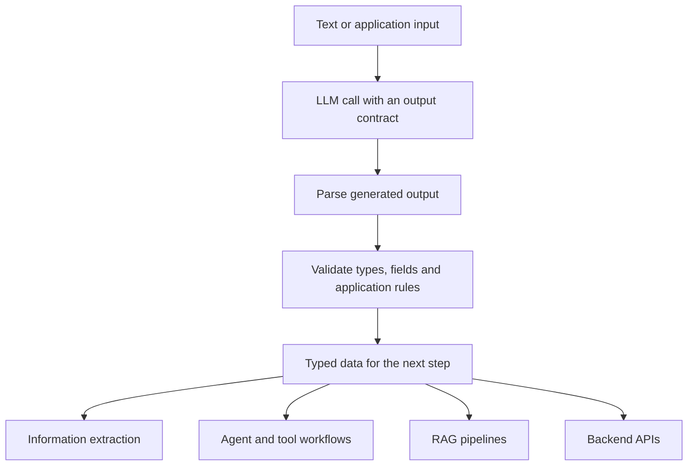
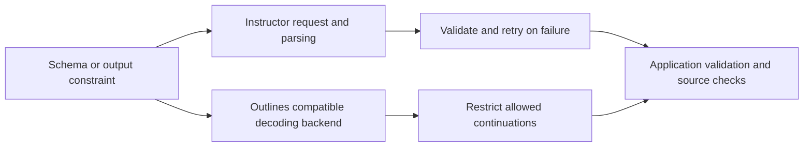
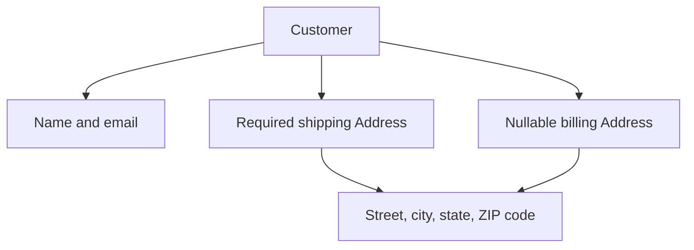
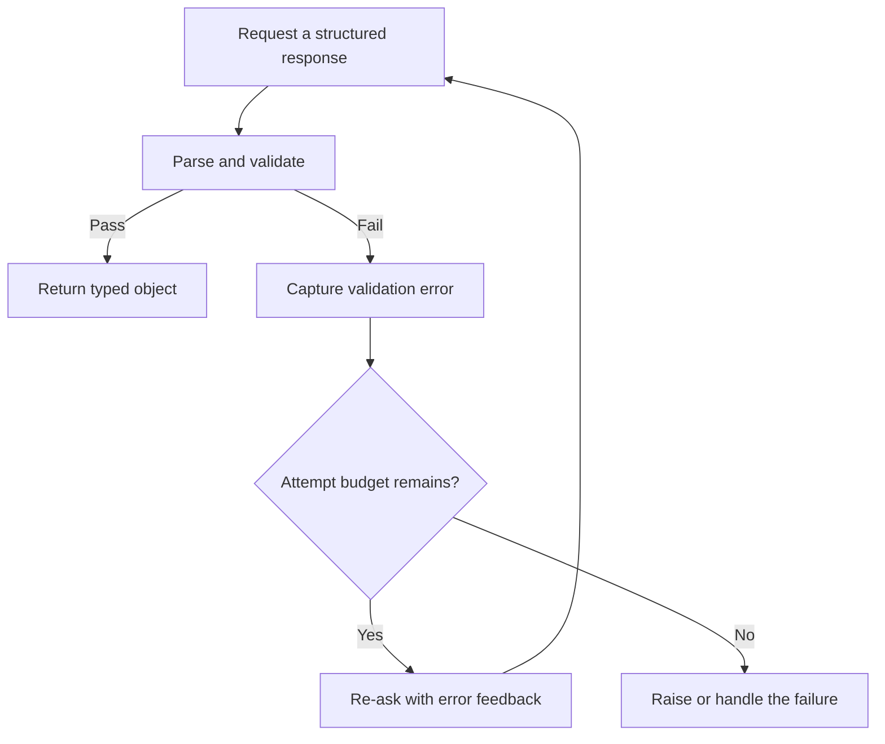
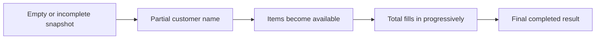
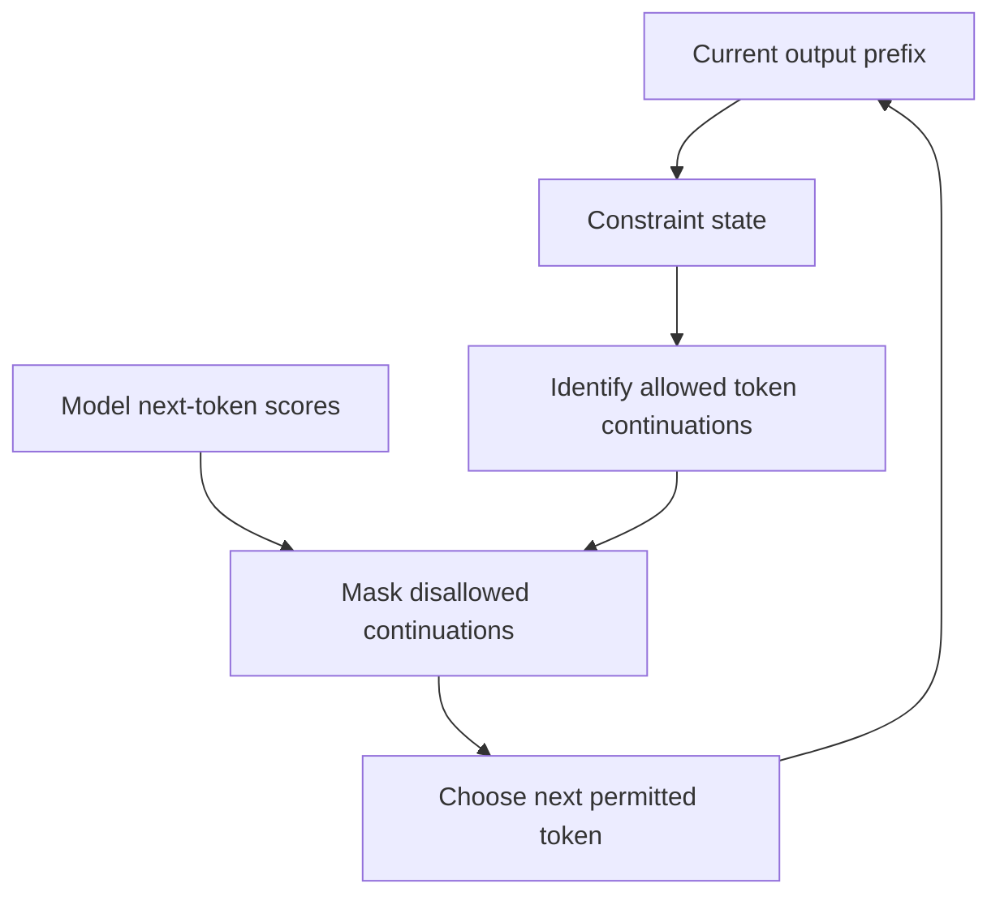

# 🧱 Class 16: Structured Generation with Instructor and Outlines
### 📋 Production AI / LLM Engineering | Krish Naik Academy

**🎙️ Mentor:** Sourangshu Pal (Paul)  
**⏱️ Duration:** 3 hours 24 minutes 41 seconds | **📅 Session:** Day 16 (13 September 2026)

---

## 📰 Quick Updates

The session moved from the previous class’s prompting exercises to **structured generation**: producing machine-readable outputs that applications can parse, validate, and use. Paul covered all four Instructor notebooks and the first two Outlines notebooks in the [structured-llm-notebooks repository](https://github.com/sourangshupal/structured-llm-notebooks).

The repository had received provider-configuration changes, so existing users were asked to update their checkout. OpenAI, Anthropic, Gemini, Groq, and local Ollama configurations appeared in the examples, though Paul said his main prior testing had been with OpenAI. Students using other providers exposed differences during the class.

The remaining Outlines notebooks, covering context-free grammars and vision extraction, were deferred. **DSPy was introduced as the next major topic, not implemented in this class.** Its notebooks were initially missing from the shared repository because of an ignore configuration; Paul addressed that during the closing discussion. A separate serverless fine-tuning webinar was also mentioned, but its demonstration was outside this session.

---

## 🎯 The Goal: Outputs an Application Can Reliably Consume

An LLM’s free-form answer can be useful to a person while being awkward for software. A backend might need a customer name, an age, a ticket category, or an invoice total in predictable fields. Extra explanations, missing keys, inconsistent types, or malformed JSON can break the next processing step.

Paul’s opening whiteboard put **valid JSON** at the center and connected it with Pydantic typing, validation, retries, and client wrappers. He listed information extraction, agent workflows, RAG pipelines, tool calling, and APIs around LLMs as places where this matters. The two-page companion PDF, **Note 6.pdf**, captures that structure.



Three different properties should be distinguished:

| Property | What it establishes |
|---|---|
| Valid JSON syntax | A parser can read the serialization. |
| Schema and rule compliance | The expected fields, types, allowed values, and implemented rules are satisfied. |
| Correct extraction or decision | The values faithfully reflect the source and the intended task. |

The class repeatedly showed why the third property does not follow automatically from the first two. A category can belong to an allowed list while being the wrong category. A positive price can pass a numeric constraint while contradicting the input. A `redacted_text` string can exist while still containing sensitive information.

Structured generation makes the **output contract** explicit. It does not remove all task instructions: the examples still send messages such as “extract this invoice” or “classify this ticket.” Paul’s advice to reduce dependence on prompts meant replacing fragile format instructions with programmatic contracts where appropriate, rather than literally eliminating every instruction to the model.

---

## 🧰 Two Mechanisms: Validate After Generation or Constrain During It

**Instructor** wraps a provider client, translates a response model into the appropriate request, parses the response, applies Pydantic validation, and can re-ask with error feedback. Its convenient call site returns a typed object when the operation succeeds.

**Outlines** supports constrained output types, including JSON schemas, Pydantic schemas, regular expressions, and fixed choices. With a compatible local backend, it can restrict which token continuations are allowed during decoding. With a hosted backend, enforcement depends on the endpoint’s supported structured-output behavior.



The class’s “guaranteed” language should be read in this precise sense: supported structural constraints can be enforced by the compatible decoding system. It does not guarantee a successful network request, an untruncated response, support for every JSON Schema feature, or factually correct values. A constraint only protects what it actually expresses and the backend actually enforces.

Instructor also performs post-generation validation. The explicit `model_validate_json` call in the Outlines examples is therefore **not an exclusive double-check feature that Instructor lacks**. It is the application’s Pydantic parsing and validation step. Instructor normally supplies that step through its wrapper. Its official architecture describes both the validation and re-ask paths, including an exception when retries are exhausted. [Instructor architecture](https://python.useinstructor.com/architecture/).

The choice between these libraries depends on the needed output types, backend support, retry behavior, and application requirements. Paul expressed a preference for Outlines in some workflows and for Instructor’s straightforward client integration in others. His preference was not a measured universal ranking.

---

## ⚙️ Configuration: Provider, Model, Key, and Endpoint Must Agree

The examples share `src/config.py`, which reads environment settings and creates the relevant clients. The important settings include provider selection, API credentials, small-model selection, local Ollama mode, and endpoint overrides.

A recurring debugging lesson was simple: **a provider selection and a model name must describe a compatible request**. Choosing Gemini or Groq in the environment does not make a hardcoded OpenAI model name valid on that provider. Some early cells contain hardcoded model strings, so the configuration helper alone does not make every cell automatically portable.

Paul asked students to inspect their error before pasting it into the chat. The practical checks were:

- Is the intended provider selected?
- Is the credential for that provider present?
- Does the call use a model that the selected endpoint supports?
- Is the notebook kernel using the project environment?
- Does the backend support the required schema features and request mode?

The supplied configuration uses **Groq**, despite caption spellings such as “Grok.” Gemini model-version strings in the captions and companion configuration should be treated as historical example settings, not a current list of available models. The notes do not turn those strings or the README’s free-tier and price estimates into present-day guarantees.

The repository’s current configuration also contains an outer retry wrapper for transient provider errors. That is separate from re-asking because a response failed Pydantic validation. A network failure and an invalid output are different failure categories, even if both eventually cause another API call.

A student asked whether one router could cover all providers. Paul said this would need a gateway or custom routing logic. The shared configuration illustrates centralized selection; it is not a complete load-balancing, failover, or production gateway implementation.

---

## 👤 Instructor Basics: Define the Data You Want

The first notebook begins with a Pydantic `BaseModel` for a user and requests an extraction from a short sentence about John Smith. The response contains a name, an integer age, and an email string. Instructor returns an instance of that model, so application code can access attributes such as `user.name` directly.

The response model is a **Pydantic data model**, not the neural model being queried. These two uses of “model” refer to different objects: one defines the data contract, while the other generates the candidate values.

Paul then removed field descriptions to show that simple extraction can work without them. Descriptions provide additional context; they are not the only reason the wrapper can extract data. Their value grows when field names are ambiguous or a complex task needs clearer interpretation.

The product-review example adds richer fields and constraints. This exact schema excerpt comes from the supplied core-extraction notebook:

```python
class ProductReview(BaseModel):
    """Extract structured data from a product review."""

    product_name: str = Field(description="Name of the product being reviewed")
    rating: int = Field(ge=1, le=5, description="Star rating from 1 to 5")
    pros: list[str] = Field(description="List of positive aspects mentioned")
    cons: list[str] = Field(description="List of negative aspects mentioned")
    would_recommend: bool = Field(description="Whether the reviewer would recommend this product")
```

`ge` means **greater than or equal to**, and `le` means **less than or equal to**. The interval here includes 1 and 5. `gt` and `lt`, used elsewhere, are strict inequalities. The descriptions explain what the fields mean, while the bounds supply machine-checkable constraints.

The headphone review yielded the product name, positive aspects, negative aspects, a recommendation flag, and a five-star rating. Paul acknowledged that the source did not explicitly state a numeric star rating: the model inferred it from favorable language. That is a useful demonstration of **classification or inference**, but it should not be mislabeled as extraction of an explicitly stated number.

A string annotation alone does not validate an email address’s real-world existence. A rating interval does not prove that the inferred rating is justified. Design the response model to express the application’s actual contract, including a missing or unknown value when the task requires one.

---

## 🪆 Nested Models, Optional Values, and Type Safety

The customer example uses an `Address` model inside a `Customer` model. Shipping address is required; billing address can be absent. The address includes a regular-expression check for a five-digit ZIP code with an optional four-digit extension. Passing the parent customer model includes the nested address schema in the expected structure.



Students using Groq reported failures around the nested ZIP-code pattern. Paul suggested testing another model or isolating the pattern constraint, and students reported differing outcomes. The class did not establish one definitive root cause for all provider failures. Removing a constraint can help isolate incompatibility, but it also weakens the contract; it is not proof that the original schema has been successfully enforced.

The contact example introduces email, phone, and company fields that may be missing. Alice’s company can be populated without a phone number; Bob can have a phone but no company; Charlie can have none of the optional details.

Pydantic V2 distinguishes **nullable** from **omittable**:

- `str | None` allows a string or null but, without a default, still requires the field.
- `str | None = None` additionally supplies a default, allowing omission at the Pydantic model boundary.

The Instructor contact example uses defaults. The Outlines contact example uses required nullable fields to match its hosted structured-output path. These are deliberate differences in schema shape, not contradictory Python behavior. [Pydantic field defaults](https://docs.pydantic.dev/latest/concepts/fields/).

The typed customer object also improves IDE completion and permits static type checking. A function annotated to accept `Customer` can access its nested attributes in a clear way. Python type hints alone do not enforce every function argument at runtime; Pydantic validation and a static checker such as mypy serve different purposes. The class’s function consumes an already-constructed model.

One print label in the notebook equates an absent billing address with “billing same as shipping.” The actual condition only checks whether billing address is `None`; it does not prove the addresses are the same. Missing information should not silently become a factual equivalence.

---

## ✅ Field Validators: Express Rules in Python

The second Instructor notebook moves beyond basic types to custom validation. Its email-address model checks whether the address contains `@`, lowercases it, and verifies that the separately supplied domain matches the part after `@`.

This is a small teaching validator, not a complete specification of valid email syntax or evidence that a mailbox exists. Its purpose is to show how ordinary Python conditions can reject an LLM-generated value.

The code deliberately constructs an invalid address without `@`. Pydantic raises a `ValidationError` containing the custom message. The important division of responsibilities is:

1. The model generates a candidate value.
2. Pydantic runs local validation logic.
3. Instructor handles the failure and can communicate relevant error feedback in another request.
4. The LLM generates a revised candidate.

It is not necessary to send a custom Python validator’s executable function body to the remote model. Built-in schema information can be serialized into the request, while local Python rules run in the application and their error messages can be used in the re-ask path.

Paul used a URL example to demonstrate the correction loop. The supplied validator is:

```python
class StrictURL(BaseModel):
    url: str

    @field_validator("url")
    @classmethod
    def must_be_https(cls, v):
        if not v.startswith("https://"):
            raise ValueError(f"URL must start with https://, got: {v}")
        return v
```

The rule accepts only values beginning with `https://`. It does not establish whether the destination exists or whether its content is safe. The narrow rule is exactly what this example validates.

In Paul’s live description, earlier candidates failed before the HTTPS value was accepted. Other students succeeded on the first call or saw a different number of attempts. The companion’s saved trace shows its own calls and should not be treated as proof that every learner made the same number of requests.

Pydantic performed the check; the LLM supplied the corrected output. Validators can themselves transform data when programmed to do so, as the email validator’s lowercasing demonstrates. The claim that “Pydantic never changes anything” would therefore be too broad. Here, the URL validator only rejects or returns the value; it does not rewrite HTTP into HTTPS.

---

## 🔁 Validation Retries, Exhaustion, and Backoff

The examples specify a bounded retry setting. A successful first response finishes immediately; a maximum setting does not force three calls on every input. The retry mechanism can also fail to obtain an acceptable value within its configured budget.



Instructor’s parameter naming and retry-count behavior should be interpreted with the installed version. The underlying concept is a bounded number of attempts, not endless self-correction. When retries are exhausted, Instructor exposes an error rather than manufacturing a successful typed result. [Instructor error handling](https://python.useinstructor.com/architecture/).

Every extra model request can add latency and token usage. A schema can reduce unwanted free-form output, but transmitting the schema and re-asking after failures also have costs. The class did not measure a universal cost reduction from adding structured output.

Paul introduced **Tenacity** to avoid repeatedly hitting a busy service without delay. The notebook wraps extraction with this exact decorator and function header:

```python
@retry(stop=stop_after_attempt(3), wait=wait_exponential(multiplier=1, min=4, max=10))
def resilient_extract(text: str):
    return client.chat.completions.create(
        model="gpt-4o-mini" if not USE_OLLAMA else "ollama/llama3.1",
        response_model=EmailAddress,
        messages=[{"role": "user", "content": text}],
    )
```

The surrounding notebook imports `retry`, `stop_after_attempt`, and `wait_exponential`. This configuration stops after three outer attempts and uses bounded exponential waiting. It does not continue for twenty or thirty minutes by default, and `wait_exponential` does not itself add random jitter. Tenacity documents separate jitter strategies for spreading retries from concurrent clients. [Tenacity waiting and retry controls](https://tenacity.readthedocs.io/en/latest/).

An outer resilience retry can wrap an inner validation-retry loop, so total provider requests may exceed the outer attempt count. Choose the total budget and error categories deliberately. A malformed credential or unsupported model is not normally fixed by repeatedly making the same request.

---

## 📅 Model Validators and Relationships Between Fields

A field validator checks a specified value. A model validator can inspect the constructed object and apply rules involving multiple fields. Paul used an event with a name, start date, and end date.

The supplied rule parses the date strings and rejects an end date earlier than the start date. Its actual condition is `end < start`, so **equal dates are accepted**, despite the error message using “after.” This is a useful reminder to read the condition when deciding whether the rule is strict or inclusive.

`mode="before"` and `mode="after"` describe stages of **Pydantic parsing and validation**. They do not mean before or after the remote API call. A before model validator sees raw input before instantiation; an after validator sees the validated model instance and should return it. [Pydantic validators](https://docs.pydantic.dev/latest/concepts/validators/).

Cross-field rules become valuable in invoices, bookings, and application records. The schema can constrain each field individually while a Python validator checks relationships between them. Even then, a locally consistent record can be factually wrong; consistency and source fidelity require distinct checks.

Paul also highlighted structured synthetic-data generation. A schema can make generated examples easier to consume. However, the utilities actually used in this repository to create sentiment samples and invoices are **local Python generators drawing from templates and random choices**. The later LLM call classifies or extracts from those samples. The existence of a helper named `generate_sentiment_data` is not evidence that an LLM generated its dataset.

---

## 🌊 Partial Objects: Streaming Structured Data to a UI

The third Instructor notebook demonstrates a progressively filled object rather than waiting for the complete extraction. An order contains customer, items, total, and status. `create_partial` yields snapshots while the response is arriving.

The saved output starts with missing values, then a partial customer name, the complete customer name, one item, two items, and finally the total. The number itself appears first as **429** and later as **4298** and **4298.0**. That example makes the danger of treating an early value as final especially clear.



The snapshots are updates from a streaming response. They are not one independent API request for every printed line. Providers and parsers can deliver different chunk sizes, so another student may see “John Doe” appear together rather than “John” followed by “John Doe.” Model speed is one influence, but buffering and parsing also affect visible updates.

A UI can show useful progress, provided it keeps updating the displayed fields. Early snapshots can be incomplete, and an initially visible number can change as more characters arrive. The class’s important design warning was to avoid taking an intermediate snapshot and freezing it as the final answer.

The notebook uses truthy fallbacks such as a total value “or” a placeholder. In that display expression, a legitimate zero total would also look missing. The code illustrates streaming behavior; it is not a complete handling of every business value.

Paul used a Gradio interface to connect the generator to a live display. The generator serializes each current partial model and yields it to the UI. The input in class was small, so the update sequence sometimes completed too quickly to be visually obvious. A larger schema or response can make the progression easier to observe, though it can also increase latency.

For a background batch job, streaming may add little value. For a user waiting on a long answer, earlier visible progress can improve perceived responsiveness. It does not inherently reduce total model generation time.

---

## 📚 Iterable Streaming and Async Batch Calls

`create_iterable` addresses a different output shape: a series of items such as invoice line items. The demo extracts a MacBook, AirPods, and a cable as successive typed entries. This is useful when an application can process completed entries as they arrive instead of displaying a progressively changing single object.

Partial-object streaming and iterable streaming should not be conflated. One revises the fields of an incomplete object; the other yields entries from a collection. Select the output contract according to whether the application needs one evolving record or multiple records.

The notebook also includes asynchronous extraction of several user descriptions. Its batch helper builds tasks and awaits `asyncio.gather`, so these calls can overlap rather than being processed one at a time. They are ordinary async structured calls in that cell; the cell does not itself demonstrate partial streaming of each document.

Python’s async syntax permits concurrent waiting on I/O. It is not automatically CPU parallelism, and using `await` in a sequential loop alone would not make every call concurrent. The actual `gather` construction is what makes the supplied batch example relevant.

Provider clients differ in their underlying request and response formats. Instructor’s adapter supplies a similar extraction call site, but provider setup and supported parameters still matter. The class’s matching OpenAI and Anthropic sample objects show the same selected fields on one simple input; they do not prove every provider produces identical values on every request.

---

## ⏱️ The Streaming Benchmark—and the Counterexample

The notebook compares a completed non-streaming result with the first visible title field in a **separate** streaming request. Its saved example reports:

| Measurement | Saved time |
|---|---:|
| Non-streaming complete result | 1.79 seconds |
| Streaming first visible field | 1.10 seconds |

This gives earlier usable display information in that run. It does not measure the total time to finish the streaming response because the benchmark breaks out once the title is visible. It also measures a parsed field, which is not necessarily the first raw token received from the server.

Ranjeev shared a contrary result: the non-streaming request completed around **2.18 seconds**, while the first streaming field appeared around **2.36 seconds** in one reported run. Re-execution produced varying values, and the class did not resolve the provider-specific cause. Paul said he would inspect the implementation later.

There is no contradiction in separate requests having those times. Different queueing, network conditions, buffering, reasoning behavior, generation lengths, and parser behavior can affect independent calls. Within one particular response, its first token precedes completion of that same response; that does not impose an ordering on two separate requests.

A robust interpretation is therefore: streaming can improve time to visible progress, but **measure that benefit for the actual provider, model, and interface**. The session’s single-run ratio is an illustration, not a guaranteed speedup.

Ranjeev also tried a two-person input against a one-person schema. Paul explained why only one person appeared: the response model described one object. Streaming does not change the cardinality of the output contract. Multiple people require an appropriate collection or iterable shape.

---

## 🦙 Local Structured Extraction with Ollama

The fourth Instructor notebook points an OpenAI-compatible client at a local Ollama endpoint and applies the same typed extraction approach. The supplied default endpoint is **`http://localhost:11434`**, with the compatible API path under `/v1`.

Paul demonstrated the command concepts: list downloaded models, pull a model, run it interactively, and exit the chat. His Docker analogy concerned the familiarity of “pull” and “run” commands. Ollama is a model runner; the analogy does not mean its models are Docker images.

The supplied notebook creates the local client this way:

```python
# Connect to Ollama via OpenAI-compatible API
ollama_client = OpenAI(base_url=f"{OLLAMA_BASE_URL}/v1", api_key="ollama")
client = instructor.from_openai(ollama_client)
```

The API-key value in this local example is a placeholder accepted by the client interface, not a paid cloud credential. The compatibility surface is documented by [Ollama](https://docs.ollama.com/api/openai-compatibility).

An `ollama list` result establishes which models are in the local inventory; it is not a complete server-health check. The model name in the actual request must match an available local artifact. Endpoint compatibility does not guarantee that a small model follows every extraction task well.

The simple person extraction succeeded. Other calls were slow on Paul’s laptop, and the sentiment benchmark was interrupted. Although the notebook heading refers to 50 examples, the actual code requests **20** samples. Its saved output contains a `KeyboardInterrupt`, so there is no completed local-accuracy result to report from that run.

The class included suggestions to use small models and to consider Apple-oriented inference tooling. **MLX is an Apple-silicon array and machine-learning framework**, not a generic model-file format that can automatically be substituted into every Ollama call. The session did not demonstrate an MLX backend or a successful conversion. [Apple MLX project](https://opensource.apple.com/projects/mlx/).

Hardware, model size, quantization, and inference implementation affect speed. A local model is not guaranteed to be faster than a hosted API simply because sufficient hardware exists. The class offered possibilities to test, not a controlled local-versus-cloud speed comparison.

The notebook’s zero-dollar local-cost example omits electricity, hardware amortization, operations, and opportunity cost. Its API cost is a classroom estimate, not a current quote. Local inference removes per-call cloud billing in the configured local path, but that is different from having no operating cost.

---

## 🔐 Local Processing Did Not Guarantee Successful Redaction

The local pipeline included a PII extraction and redaction example. It supplied fields for names, emails, phone numbers, addresses, and redacted text, and asked that sensitive information be redacted. The source contained a social-security-number example explicitly marked for redaction.

The lighter model returned a structurally usable object but **retained the sensitive number**. Paul noticed the failure live and said the result was not correct. The saved notebook likewise includes the number in `redacted_text`. This is a failed redaction demonstration, not proof that the example provides a privacy-protection layer.

Keeping a request on a genuinely local endpoint can avoid sending that input to a hosted provider. Redaction accuracy is a separate property. A field named `redacted_text` and a valid schema do not check whether the intended information was removed.

Paul mentioned dedicated PII masking tools and guardrail services as related approaches. The class did not install or benchmark them. Its lesson is to verify the redaction outcome, including the exact sensitive categories the application intends to remove, rather than treating the existence of an extraction object as success.

RunPod and a production-compatible endpoint were present as commented guidance in the notebook. Paul skipped that deployment path because the class did not have an endpoint to use. There was no serverless deployment completed in this session.

---

## 🔒 Outlines: Schemas, Regex, and Allowed Choices

The first Outlines notebook uses a hosted schema path for JSON examples and a **local Transformers model** for regular-expression and choice examples. This distinction matters more than whether the machine is physically local: a compatible server can expose guided decoding, while an ordinary remote text API may not expose arbitrary logits control.

Constrained decoding applies rules to the candidate next-token scores. It can rule out continuations that cannot lead to a permitted output. This is an inference-time operation; it does not inherently rewrite the model’s learned output-layer weights or require retraining.

A finite-state automaton is a useful way to understand regex-compatible constraints. The current output prefix determines a state, and that state limits valid continuations. Context-free grammar support can express other structures, but the implementation notebook for that topic was deferred. The class introduced the terms without deriving all the algorithms.



Outlines offers several backend integrations and output types. The exact supported combinations differ by backend; the official model documentation lists this capability distinction. It is too broad to say regex masking is possible only through Ollama, or that every hosted backend has the same guarantees. The class’s regex cells specifically load Transformers directly. [Outlines model integrations](https://dottxt-ai.github.io/outlines/1.0.0/features/models/).

The support-ticket JSON example limits priority and category to named choices, bounds the summary length, and includes an escalation flag. The returned JSON is then parsed with Pydantic. Another example passes a raw JSON Schema with properties, required fields, and `additionalProperties: false`, showing that the library need not start with a Pydantic class in every case.

The profile-generation example supplied a name and age but also produced an illustrative email and tags. That was generated profile content, not verified extraction of an email absent from the input.

For regex generation, the code loads **`Qwen/Qwen2.5-0.5B-Instruct`** and constrains a phone number to a particular international-style pattern. The saved phone output matches the source. The date and ID prompts did not provide actual source values, so their generated strings should not be interpreted as extracted facts. The saved UUID-like output is incomplete; it does not establish a successful complete UUID result.

The fixed-choice example constrains the category to a list, but the tiny model chose **account** for “My payment failed.” Paul expected billing and identified the semantic error. The output obeyed the allowed vocabulary while failing the intended classification. “Zero hallucination” in this narrow example can at most mean that an out-of-list category is prevented; it does not establish zero classification errors.

Python’s `Literal` is a typing construct for specified values. Pydantic uses it to validate allowed values and represent them in a schema. It is not a runtime list or an independent enforcement mechanism merely because it appears in a type hint. [Python Literal reference](https://docs.python.org/3/library/typing.html#typing.Literal).

---

## 🧾 Outlines Pipelines: Nested Invoices, Dangerous Corrections, and Throughput

The second Outlines notebook builds invoices with line items, subtotal, tax rate, total, and payment status. It also demonstrates deeper nesting: company → departments → employees → addresses. Passing the parent schema defines the nested structure; the application then validates and accesses the result as typed data.

The most revealing experiment changed a product’s input price and quantity to negative values while the output schema required a positive price and a nonnegative quantity. Paul watched the model make values fit the range, sometimes by changing the sign or choosing a nearby allowed value. The supplied notebook’s saved output changes **$−2** into approximately **$0.0651** and **−10** into **0**.

That output satisfies the numeric ranges but **does not faithfully extract the source values**. The class called this risky. A constraint can pressure generation toward an allowed value rather than expressing that the source itself violates the rule. The task contract must specify whether invalid source data should be rejected, reported, or corrected under an explicit policy.

Field and model validators can express additional application checks, but they do not automatically recover the original text or prove source fidelity. A validator checking `price > 0` still accepts an invented positive price. A source-aware check or an explicit invalid-input outcome is needed for that concern; no complete production implementation of this policy was supplied in class.

The invoice adherence comparison checked how often outputs passed the selected Pydantic model. Paul and the saved notebook got **10/10 for Outlines and 10/10 for raw prompting**. Students reported other combinations, including failures under both approaches. These small counts do not establish a general failure rate or universal improvement.

The current code also hardcodes a raw model while resolving the Outlines model through configuration, so the two paths need not use the same underlying model. It strips a JSON code fence before validating some raw outputs. The demonstrated count is therefore a small application-validity check, not a rigorously controlled accuracy benchmark.

The batch example requests **20 invoices**, despite the section heading referring to 100. It extracts them in a normal sequential loop. Its saved output reports **42.4 seconds** and **0.5 invoices per second**. That corresponds to about **2.12 seconds per invoice**, not half a second per invoice. Throughput and time per item are reciprocal measures.

The helper creates invoice text locally from random templates. Some associated metadata fields are selected independently from their displayed-text counterparts, so those helper records should not automatically be treated as a clean correctness label set. The class’s adherence loop does not compare every extracted value with ground truth anyway.

The useful lesson is to measure schema adherence, extraction correctness, latency, throughput, and provider failures separately. A single “success” counter hides which property was checked.

---

## 🧭 Engineering Choices and the Closing Discussion

During the break, Paul discussed choosing libraries according to the requirement and dependency footprint. He prefers lightweight direct integrations in many RAG workflows and described larger orchestration frameworks as a personal trade-off. RAG can be assembled from retrieval, chunking, storage, and model calls without adopting one particular orchestration framework; the class did not prove that all framework use is unsuitable for production.

He also mentioned the Pydantic ecosystem, observability options, and self-hosting as considerations. These were engineering preferences and course context, not a deployment or a comparative performance study in this session.

Sridhar’s brokerage SLM question received a high-level starting workflow: inspect representative datasets, use a suitable training format such as JSONL, evaluate a base model, and explore PEFT approaches and existing cookbooks. JSONL is a file representation, while an Alpaca-style instruction/input/output arrangement is an example schema. Neither selects the right financial task or guarantees a useful model.

Gaurav asked about watermarking an SLM’s output and protecting it from copying. Paul said he had read about watermarking but had not implemented it. The topic was not part of the planned syllabus. **Text watermarking and cryptographic document signatures are different mechanisms**: watermarking can alter statistical patterns in generated text for later detection, whereas a signature authenticates a signed artifact under a particular key. Neither establishes universal AI-text detection or complete prevention of copying. [A Watermark for Large Language Models](https://arxiv.org/abs/2301.10226).

The session offered no implementation of either mechanism. The watermarking exchange should be preserved as a research discussion with acknowledged limits, rather than turned into a tested feature of every generated document.

---

## 🗺️ What's Next

Paul deferred the remaining Outlines **CFG/code-and-SQL generation** and **vision structured-output** notebooks to the following class. DSPy’s programming and optimization workflow was the next major planned topic.

The later course sequence was to cover lighter transformer fine-tuning exercises, including DistilBERT/DistilGPT-style tasks, before moving further into architecture and inference upgrades. Mangesh’s KV-cache question was answered as part of that future sequence; KV-cache implementation was not taught in this session.

Paul also said he would investigate the streaming benchmark behavior reported by students using Gemini. The cause remained unresolved when the class ended.

---

## 💬 Live Q&A Highlights

| Question | Answer |
|---|---|
| **Abhishek:** What is the actual target for a translation model’s loss? | The ground-truth target-language sequence, aligned with the predicted target positions. This was a recap, not a new training exercise. |
| What is structured generation for? | It produces outputs under an explicit contract for extraction, APIs, RAG, and tool or agent workflows. Structure and factual correctness remain different properties. |
| Is a field description the same as a function docstring? | No. Field descriptions explain schema fields and can inform the model’s task interpretation. A function docstring documents the function. |
| Must descriptions exist for extraction to work? | No. Paul removed them in a simple example and still obtained values; descriptions can add useful context for harder cases. |
| What is `response_model`? | The Pydantic data contract that Instructor uses to request, parse, and validate the response. It is separate from the LLM’s model name. |
| Why does the model infer a five-star rating? | The source review was favorable but did not explicitly provide a star number. The value was inferred within the allowed range, not extracted as a stated fact. |
| Why does a selected provider reject the model name? | The call may still hardcode a model from another provider. Provider, endpoint, credentials, and call-level model must agree. |
| Can one router serve all model providers? | A gateway or custom router can centralize that behavior. The shared configuration is not a full production routing system. |
| Why did some nested ZIP-code examples fail on Groq? | Provider/model/schema behavior differed. Students tested another model or isolated the pattern. No single cause for every failure was confirmed. |
| Does removing the ZIP-code constraint fix the complete contract? | It can isolate the issue but also removes the check. It does not prove the original pattern was enforced. |
| **JP:** Does the product schema capture all reviews automatically? | The demo sends one review. Multiple reviews require an appropriate input/output flow, such as repeated calls or a collection contract. |
| How should missing contact data be handled? | Use nullable fields and suitable defaults; do not invent a phone or company merely to fill the object. |
| **Vivek:** Where did the customer function’s Jane Doe value come from? | The earlier nested-customer extraction created the object. The typed function then reads its attributes. |
| Are Python annotations alone runtime type checks? | No. Static type checking and Pydantic model validation are separate mechanisms. The example consumes an already-validated model. |
| **Karthik:** How are token usage and costs tracked? | Inspect provider usage information and the actual calls, including retries. This class did not measure a universal reduction from structured generation. |
| Why not put the HTTPS requirement only in a prompt? | A prompt can request it; the local validator also supplies an explicit acceptance check and a re-ask path on failure. |
| Did Pydantic or the LLM repair the URL? | In this example Pydantic rejected invalid values, Instructor managed feedback, and the LLM supplied the new URL. The validator did not rewrite it. |
| Does a maximum of three attempts force three requests? | No. A successful first attempt finishes. Failure can consume the configured budget and ultimately raise an error. |
| **Abhishek:** What do before and after validators mean? | Before and after Pydantic parsing/model validation, not before and after the remote API call. |
| Why add Tenacity? | It offers bounded retry and waiting policies for resilience. The supplied exponential wait is capped and has no random jitter by itself. |
| Can structured data support synthetic datasets or distillation? | Yes as a pattern, but quality and cost still need evaluation. The class’s dataset helpers generate template samples locally. |
| Must a production solution avoid LangChain or LlamaIndex? | Paul prefers lightweight direct integrations in some workflows. This was a design preference, not a universal prohibition. |
| **Paritosh:** Can observability use Logfire or another tool? | Paul discussed that ecosystem and his preference for self-hosted options. No observability implementation was demonstrated here. |
| What is the benefit of partial streaming? | A UI can display progress before the final object is ready. Intermediate fields may be incomplete and must continue updating. |
| **Chavan:** How do earlier partial values stay current? | Consume successive snapshots and update the UI; do not freeze an intermediate object as the final result. |
| Are printed partial snapshots separate LLM calls? | No. They can be updates from a single streaming request. Separate batch requests and retries are different operations. |
| Why do some users skip intermediate names or item counts? | Chunking, buffering, parsing, and model behavior vary. The visible snapshot sequence need not match across providers. |
| Does streaming guarantee a faster complete answer? | No. It can improve time to visible progress; total completion and separate-request latency must be measured. |
| **RANJEEV TIWARI:** Why was my first streaming field slower than a non-streaming result? | The two measurements came from separate calls and measured different milestones. The live cause was not resolved, and Paul planned further inspection. |
| **RANJEEV TIWARI:** Why does a two-person input yield one person? | The schema described one person. Use a collection or iterable output contract for multiple people. |
| **Naveen:** What does Ollama do? | It downloads and runs supported models through local interfaces. The request still needs the correct model and endpoint. |
| **Anirudh:** Are MLX and MPS the same thing? | No. MLX is an Apple-silicon framework; MPS is a backend used by frameworks such as PyTorch. The class did not demonstrate an MLX pipeline. |
| **Dishant:** Can local inference be faster with better hardware? | It can be, but that is workload-dependent. The class did not establish a controlled speed comparison. |
| Did the local sentiment benchmark complete? | No. Its actual 20-sample loop was interrupted, and there is no completed accuracy result to report. |
| Did the local PII example redact the SSN? | No. Paul observed the failure, and the saved output retains the number. A valid object did not guarantee redaction. |
| Does Outlines only work with local models? | No. It has hosted and server integrations. Arbitrary constraint support and enforcement depend on the backend; the class’s regex/choice cells used local Transformers. |
| What does token masking change? | Allowed next-token continuations during inference. It does not inherently retrain or rewrite output-layer weights. |
| **Saurabh:** What was the extra `model_validate_json` check? | Explicit application-side Pydantic parsing/validation of the returned JSON. Instructor also validates through its wrapper. |
| Why did Choice return account instead of billing? | It selected an allowed but semantically wrong option. Restricting the list does not guarantee correct classification. |
| Why did negative price/quantity values become positive or zero? | The model generated values that fit the schema. That can violate source fidelity; do not silently treat range compliance as correct extraction. |
| Does the 10/10 invoice result prove Outlines is always better? | No. Both paths passed in the instructor’s run, students differed, and the current code can use different underlying models. |
| Was the invoice batch parallel, and was it half a second per invoice? | The supplied loop is sequential. About 0.5 invoices per second means about two seconds per invoice in the saved run. |
| **sridhar k:** How should a brokerage SLM hackathon start? | Define the task and representative data, inspect suitable sample formats and base-model cookbooks, then evaluate a PEFT workflow. This was guidance, not a completed financial model. |
| **Gaurav Garg:** Can an SLM output be watermarked? | Paul said the literature supports watermarking but he had not implemented it. No method was demonstrated. |
| **Gaurav Garg:** Does watermarking prevent copying, and will it be covered? | It does not automatically prevent copying. Watermarking and artifact signatures differ; the topic was outside the planned syllabus. |
| **Jatinder Bali:** Where is the separate fine-tuning workshop notebook? | Paul shared a separate example link in chat. It was not the structured-generation repository’s implemented lesson. |
| **Jatinder Bali:** Why was the DSPy workbook absent? | Paul said it had been excluded by an ignore configuration and addressed publishing it. DSPy implementation remained for the next class. |
| **MANGESH KHANDARE:** When will KV cache be covered relative to fine-tuning? | After the lighter transformer fine-tuning exercises in the later sequence. It was not implemented here. |
| **Sai Kiran Akula:** Was today mainly about structured LLM outputs? | Yes: schemas, validation, streaming, and the demonstrated Instructor/Outlines extraction patterns. |
| **Sai Kiran Akula:** Is Ollama Docker? | The analogy only concerned pull/run command familiarity. Ollama’s model-running role is distinct. |
| **Sagar:** What were the SLM starting resources and data formats? | Paul recapped Hugging Face datasets, JSONL, Alpaca-style examples, and fine-tuning cookbooks. JSONL is a format, not a complete training method. |

---

## 🔑 Key Pointers to Remember

- Valid JSON, schema compliance, and correct source extraction are separate checks.
- Instructor validates parsed outputs and can re-ask with error feedback; attempts can still be exhausted.
- Outlines can constrain generation through a compatible backend; supported output types differ by backend.
- A schema does not eliminate all task instructions or automatically reduce total cost.
- Custom Python validator logic runs locally; relevant error feedback can guide a subsequent request.
- `ge`/`le` include the boundary, while `gt`/`lt` exclude it.
- Pydantic V2 nullable fields remain required unless a default permits omission.
- Before/after validation modes describe Pydantic processing stages.
- Partial snapshots are provisional; a changing number should not be committed as final data.
- Time to a visible parsed field is different from first-token latency and total completion time.
- Separate streaming and non-streaming requests have no guaranteed latency ordering.
- The local sentiment benchmark was interrupted and the redaction example failed.
- A fixed Choice list prevents out-of-list values, not incorrect in-list decisions.
- Range constraints can produce source-inconsistent “corrections.”
- The batch result was about 0.5 invoices per second, using a sequential loop.
- CFG, vision, DSPy, and KV-cache implementation were future topics.

---

## ✅ Action Items After Class 16

- [ ] Select the intended provider and ensure the model name, endpoint, key, and kernel agree in each cell.
- [ ] Reproduce the user, review, nested-address, and optional-contact examples, distinguishing extracted from inferred values.
- [ ] Read the actual field bounds and conditions, including the event validator’s acceptance of equal dates.
- [ ] Test an invalid value and inspect the local validation error and any re-ask attempts.
- [ ] Set a bounded request budget and distinguish validation retries from transient API resilience retries.
- [ ] Consume partial snapshots as UI updates and validate the completed result before downstream use.
- [ ] Compare first visible field and total completion latency across repeated runs with clear measurement definitions.
- [ ] Inspect local model availability and endpoint behavior before running the Ollama cells.
- [ ] Verify whether the intended sensitive strings were actually removed in the redaction example.
- [ ] Compare structural adherence and semantic correctness separately for the Outlines examples.
- [ ] Test contradictory source values and define an explicit invalid-input outcome instead of silently accepting invented replacements.
- [ ] Read benchmark loops and actual sample counts rather than relying on notebook headings.
- [ ] Review the deferred CFG and vision notebooks when their class is delivered, then continue to DSPy.

---

*📝 Notes compiled from the full Class 16 transcript — “13 Sept Promoting,” Production AI / LLM Engineering, Krish Naik Academy. Primary recording: [Class 16 course page](https://learn.krishnaikacademy.com/web/courses/6a16f8935e281281cd6b1128?chapter=6aa70820d8217ed78f434df5); original transcript: `GMT20260913-143152_Recording.transcript.vtt`. Companions: both pages of `Note 6.pdf`; the complete README, all four [Instructor notebooks](https://github.com/sourangshupal/structured-llm-notebooks/tree/main/notebooks/01_instructor), the first two [Outlines notebooks](https://github.com/sourangshupal/structured-llm-notebooks/tree/main/notebooks/02_outlines), and matching `src/config.py` and `src/datasets.py` from the main branch of [the instructor’s repository](https://github.com/sourangshupal/structured-llm-notebooks). Saved outputs, interrupted runs, and unresolved live behavior are identified explicitly. No notebook code, API call, model download, or repository example was executed to produce these notes.*
