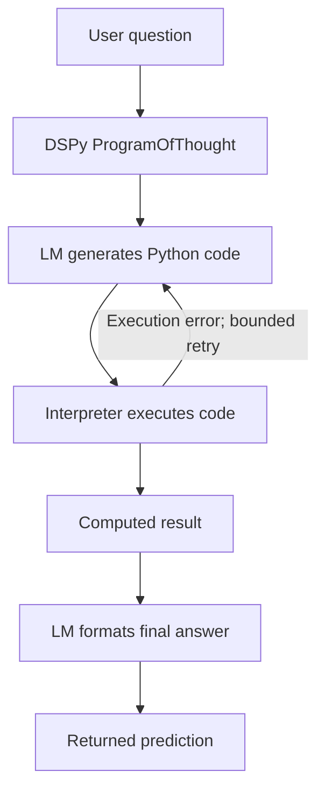
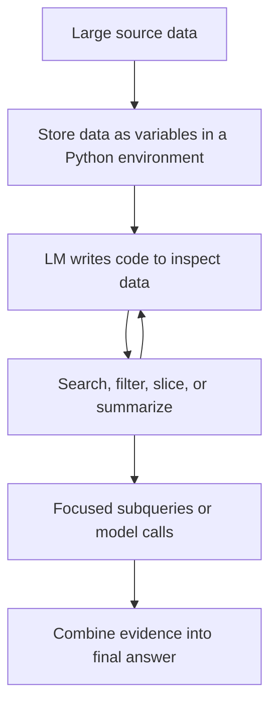

# 🧠 Class 17: DSPy Part 1 — Signatures, Modules, and Code Execution
### 📋 Production AI / LLM Engineering | Krish Naik Academy

**🎙️ Mentor:** Sourangshu Pal (Paul)  
**⏱️ Duration:** ~3 hours 30 minutes (3hr 29min 53s) | **📅 Session:** Day 17 (19 September 2026)

**Class recording:** [19 Sept DSPY Part - 1](https://learn.krishnaikacademy.com/web/courses/6a16f8935e281281cd6b1128?chapter=6aaf5841e3af737a79b8f2d1)  
**Primary transcript:** `GMT20260919-143307_Recording.cutfile.20260920035021608.transcript.vtt`  
**Companions:** `DSPY.pdf`; [structured LLM teaching repository](https://github.com/sourangshupal/structured-llm-notebooks/tree/main); [course DSPy resource page](https://krishnaikacademy.notion.site/DSPY-3e1eba9593d080c1932bf14dd648ce64).

---

## 📰 Quick Updates

- The first part completed the remaining Outlines notebooks: grammar-constrained code/SQL generation and image-to-structured-output extraction. DSPy began after the break.
- Students were asked to update the existing repository rather than clone an unrelated codebase. The matching paths are `notebooks/02_outlines/03_cfg_codegen.ipynb`, `04_vision_structure.ipynb`, and `notebooks/06_dspy/01_signatures_modules.ipynb`.
- Paul introduced [Archify](https://github.com/tt-a1i/archify) as a diagram-generating agent skill and showed diagrams for the teaching repository. It was a resource suggestion, not a coding-agent installation exercise.
- Experimental typed-output models and alternative model architectures were briefly discussed as research interests. No replacement Transformer architecture was built during the session.
- DSPy coverage stopped after signatures, basic module examples, code-execution details, and a conceptual RLM preview. Optimizers, RAG, and ReAct implementations were deferred.
- In response to Mangesh's calendar question, Paul stated that classes would run through 1 November and that 7–8 November would be a Diwali break. This was the schedule announced in this recording, not an independently updated calendar.
- The dedicated Q&A explored migrating complex prompts, integrating DSPy with LangGraph/vLLM, maintaining business rules, and separating program execution from gateway routing.

These notes preserve the live implementations while distinguishing format constraints, task correctness, and program optimization. Source excerpts are from the current matching companion notebooks; version differences are called out where they affect reproducibility.

---

## 🔒 Outlines CFG: Constrain the Next Token During Generation

A **context-free grammar**, or CFG, defines which strings belong to a language. In the class, the grammar was a generation blueprint: arithmetic expressions, a small SQL subset, or a custom query DSL.

The Outlines demonstration loaded a small local instruction model so the generation pipeline could directly control logits:

```python
import outlines
import torch
from outlines.types import CFG
from transformers import AutoModelForCausalLM, AutoTokenizer
import warnings

warnings.filterwarnings("ignore")

# CFG constraints require token-level masking, so they need a LOCAL model —
# hosted APIs (OpenAI etc.) only support JSON-schema constraints.
# First run downloads ~1 GB (Qwen2.5-0.5B); it's cached afterwards.
LOCAL_MODEL = "Qwen/Qwen2.5-0.5B-Instruct"
tokenizer = AutoTokenizer.from_pretrained(LOCAL_MODEL)
hf_model = AutoModelForCausalLM.from_pretrained(LOCAL_MODEL, dtype=torch.float32)
model = outlines.from_transformers(hf_model, tokenizer)
```

This is the notebook's setup cell, including its original comments. The broad hosted-API comment is a limitation of that example's path, not a universal current rule. A small model still needs enough system memory and supported dependencies; “0.5B” does not guarantee that every laptop will run it comfortably.

**Token masking** means assigning disallowed next tokens no usable probability before sampling. The decoder tracks the generated prefix and the grammar's possible continuations. It selects from tokens whose decoded content can continue that valid prefix.

This differs from completing a wrong output and then repeatedly asking the model to regenerate it. The live explanation sometimes used “regeneration,” but the central benefit is preventing invalid continuations during decoding. Outlines' [logits-processor documentation](https://dottxt-ai.github.io/outlines/latest/features/advanced/logits_processors/) describes this inference-time control.

Token boundaries and character boundaries need not match. A single token may contain several characters, punctuation, or whitespace. The constraint implementation must relate the tokenizer's decoded pieces to the grammar; application code does not simply compare one token with one grammar character. That is the technical issue behind Uttam's “character misalignment” question.

The previous class's FSM discussion is useful for regular constraints. A general CFG can require parsing state and a stack; an ordinary finite-state automaton alone does not recognize every context-free language. The relevant backend supplies the appropriate constraint machinery.

Grammar validation also has practical limits: unsupported constructs, an invalid grammar, truncation, or an inference failure can prevent a complete result. Once a supported constrained generation completes successfully, syntactic membership still does not prove factual or task correctness.

---

## ➗ Arithmetic Grammar: A Valid Expression Can Miss the Requested Meaning

The notebook's arithmetic example begins with `start: expr`. Expressions permit addition/subtraction; terms permit multiplication/division; factors permit numbers or parenthesized expressions.

```python
# A simple arithmetic grammar in Lark format
arithmetic_grammar = r"""
    start: expr
    expr: expr "+" term
        | expr "-" term
        | term
    term: term "*" factor
        | term "/" factor
        | factor
    factor: NUMBER
          | "(" expr ")"
    NUMBER: /[0-9]+(\.[0-9]+)?/
"""

result = model("Write a mathematical expression for compound interest:", CFG(arithmetic_grammar))

print(f"Generated expression: {result}")
print("✅ Always syntactically valid arithmetic")
```

The stored result is the numeric string **1.105436875697257636**. Paul used it to show that the model's response stays within the supplied output language even when the natural-language request asks for something the grammar cannot express fully.

One clarification matters: the grammar does **not** allow only a single number. Its start rule also permits compound arithmetic expressions and parentheses. However, it contains no identifiers such as principal, rate, or time, and no exponentiation operator. It therefore cannot express the usual symbolic compound-interest formula with named variables. The generated number is one permitted arithmetic expression, not a computed answer to a fully specified finance problem.

Likewise, `NUMBER: /[0-9]+(\.[0-9]+)?/` accepts digits **0 through 9**, followed by an optional decimal part. It does not restrict values to the interval zero to one.

The example separates three questions:

| Question | What this demo establishes |
|---|---|
| Does the response fit the grammar? | The stored numeric string does. |
| Does the grammar express the requested concept? | It lacks the variables/operators needed for a general symbolic formula. |
| Is the response a correct numerical answer? | No principal/rate/time inputs were supplied, so the class did not establish that. |

The later Python-expression grammar required a number followed by one or more operator/number pairs. For “three plus four,” the stored response was **3+4.0**. That is a generated expression; it is not automatically an evaluated result of 7. The class was demonstrating syntax control, not running an arithmetic evaluator.

The useful design rule is to define an output language that actually includes the forms your task needs. A strict but incomplete grammar can force a clean-looking wrong answer.

---

## 🗃️ SQL and a Custom DSL: Syntax Is Only One Layer

The first SQL grammar was intentionally small:

```python
simple_sql_grammar = r"""
    start: "SELECT " columns " FROM " table_name
    columns: "*" | column ("," column)*
    column: /[a-z_]+/
    table_name: /[a-z_]+/
"""
```

It permits a SELECT clause, either a star or comma-separated column names, and a table name containing lowercase letters/underscores. The stored example generated **SELECT * FROM users**.

The next version added an optional WHERE condition, comparisons using `=`, `>`, and `<`, and numeric or single-quoted values. “Users older than 18” produced **SELECT * FROM users WHERE age>18**.

These examples do not constitute a complete SQL grammar. They exclude joins, grouping, aggregate syntax, subqueries, many identifier forms, dialect-specific features, and most operators. Their regex also does not establish that a generated table or column exists in a real database.

The multi-prompt example is especially instructive. It uses the **simple grammar**, even for requests about filtered orders and counting by status. Saved outputs include long invented names such as a table identifier that narrates an “orders” requirement. The string can satisfy the demo grammar while failing the request and the actual database schema.

The notebook labels this section a raw-versus-CFG syntax-error comparison, but the supplied cell shows only the constrained generation loop. It does not execute a matching raw baseline, parse each result against a real SQL dialect, or report measured accuracy/error-rate statistics. Do not turn its “100%” print statement into a performance benchmark.

Next came a small **domain-specific language**:

```python
# Define a simple query DSL
query_dsl = r"""
    start: query
    query: "FIND " entity (" WHERE " condition)?
    entity: "users" | "products" | "orders"
    condition: field "=" value
    field: "name" | "status" | "price" | "date"
    value: /[a-zA-Z0-9_]+/
"""
```

This is a custom `FIND` language, not SQL. The stored response was **FIND products WHERE status=ACTIVE**. Entity and field choices are constrained; the value regex still admits many arbitrary strings. Whether `ACTIVE` is a valid business value depends on the receiving system.

Paul emphasized internal tools or custom languages for which an organization already has a grammar. The same principle can also help ordinary language subsets when reliable syntax matters; it is not restricted to compiler researchers or proprietary frameworks.

**Grammar size is separate from prompt size.** A decoding grammar may be compiled and enforced outside the model's text context. A large grammar file does not automatically need to be inserted into the prompt, and it does not imply that switching to RLM is the only solution. Grammar complexity instead affects backend support, compilation time, memory, and generation overhead. RLM was a later conceptual discussion about large input data.

---

## 🌐 Local Models, Serving Frameworks, and Version-Sensitive APIs

The class distinguished a model running in an accessible inference environment from a hosted service whose logits the application cannot directly edit. A web frontend does not itself supply low-level decoding control; it can call a backend that performs constrained generation.

vLLM and SGLang were introduced as serving frameworks. The notebook's final vLLM example was an illustrative string containing an OpenAI-compatible client and `guided_grammar`, not a live server deployment. The instructor deferred deeper serving internals to later modules.

Two current compatibility details should accompany that historical example:

- vLLM's documentation says the old `guided_json`, `guided_regex`, `guided_choice`, and `guided_grammar` fields were removed in v0.12.0. Current integrations use `structured_outputs` and an appropriate supported backend. Copying the notebook's old request unchanged can fail. [vLLM structured-output reference](https://docs.vllm.ai/en/latest/features/structured_outputs/).
- The lecture's blanket statement that proprietary APIs cannot support CFG is too broad. OpenAI currently supports grammar-constrained custom-tool inputs on compatible models/APIs, including supported Lark syntax. That is provider-side constraint enforcement, not arbitrary client access to logits. It does not prove that the class's Outlines wrapper supports every such capability. [OpenAI function-calling guide](https://developers.openai.com/api/docs/guides/function-calling).

Outlines itself documents that output-type support varies by model/backend. Select the backend according to the required constraints rather than assuming JSON-schema, regex, CFG, and multimodal behavior are interchangeable. [Outlines output types](https://dottxt-ai.github.io/outlines/latest/features/core/output_types/).

The notebook's comment that one serving version used Outlines “under the hood” belongs to that version. Modern serving backends can differ. No particular hosting framework is universally required for production, and no universal claim that Transformers is only suitable for teaching follows from this demonstration.

---

## 🖼️ Vision Inputs to Structured Python Objects

The final Outlines notebook changed the input modality from text to images while keeping the output schema explicit. It used `Chat` and `Image`, Pillow to load images, and a configured vision-capable model.

The invoice schema was:

```python
class LineItem(BaseModel):
    description: str
    quantity: float
    price: float


class Invoice(BaseModel):
    vendor: str
    invoice_number: str
    date: str
    currency: str
    line_items: list[LineItem]
    total: float
```

This excerpt depends on the notebook's earlier `BaseModel` import. It declares a nested line-item list, but plain `str` and `float` types do not establish a valid currency code, an actual calendar date, nonnegative quantities, or arithmetic consistency.

The generation/parsing sequence is:

```python
prompt = Chat(
    [
        {"role": "system", "content": "Extract structured data from document images."},
        {"role": "user", "content": ["Extract the itemized table from this bill:", Image(img)]},
    ]
)

result = model(prompt, Invoice)
invoice = Invoice.model_validate_json(result)
```

This is an excerpt from the image cell, after `img`, `model`, and the schemas are defined. Outlines returns structured text in this path; `model_validate_json` converts it into a validated Python object. A syntactically correct object can still contain a mistaken reading.

The live **Green Tangerine restaurant bill** demonstrated that limitation. The class compared descriptions, quantities, prices, currency, and the total, noticing inconsistent interpretations of handwriting and trailing zeros. Students using other vision models reported different values. The discrepancy was useful evidence that a structure guarantee cannot recover information the model misreads.

Paul then sought a clearer digital invoice. Several attempts appeared to keep producing the synthetic widget invoice. The underlying issue was the **file/path and fallback condition**: if the requested file does not exist, the notebook generates a stand-in. Changing a filename without checking what image actually loaded can make an apparent model test compare the wrong input.

The current notebook's first image path points to `sample.png`, and its stored output is a different invoice from the original restaurant bill. It lists six line items at 100 each but a total of 440. That saved inconsistency further illustrates the need for business validation; it should not be silently “fixed” in notes as if the model had produced a correct total.

The class briefly attributed a failure to WebP. The recorded debugging did not establish a universal WebP prohibition; supported formats depend on the vision provider and image wrapper, and the fallback/path problem was also active. Check the loaded image and the actual error before changing formats.

A second example extracted an **energy-safety chart**. Its schema included chart type, title, axis labels, unit, source, and typed label/value points. The saved response recognized a bar chart and extracted multiple death-rate/emissions series, but some labels and the title were inferred or rephrased. The purpose was chart-to-schema extraction; the energy statistics were not an independent scientific claim established by this lecture.

Base64 was explained as a reversible way to transport binary image bytes through a text field. Encoding does not improve image quality, perform OCR, or supply semantic understanding. In the raw provider call, the Base64 content was placed in an image data URL.

---

## ✅ Format Validation, Extraction Accuracy, and Batch Processing

The raw vision comparison asked for JSON without the Outlines schema path. Its stored answer arrived inside Markdown code fences; calling `json.loads` directly on that whole string failed. That is a **format-parsing failure**, separate from whether the extracted invoice values were correct.

The constrained path gave predictable structure, but both paths could misread the same low-quality image. This creates two independent evaluation axes:

| Axis | Example check |
|---|---|
| Structural validity | Is the JSON complete and compatible with the required fields/types? |
| Extraction accuracy | Do vendor, currency, amounts, quantities, and descriptions match the image? |

For production document work, the session suggested comparing fields with OCR output. Additional natural checks include required-field completeness, arithmetic consistency, and rules from the business domain. OCR can also misread text; an OCR layer is another source of evidence to evaluate, not a guarantee of correctness.

Paul preferred an OCR stage when documents were complex or image quality was poor, and direct vision extraction when the format was simple and stable. The examples support testing that tradeoff on representative scans. They do not establish a universal cost multiplier for vision calls or that every OCR system is cheaper/better in every workload.

The batch cell scans three matching sample filenames and applies the extraction schema to each. **The actual source runs a normal synchronous `for` loop**. It is sequential, despite the live discussion describing parallel calls. Batch processing means processing a collection; it does not by itself imply concurrency.

The document schema allows `total_amount: float | None`, useful for documents such as purchase orders that may not carry a total. The saved results include two invoices and a historical purchase-order confirmation. A null value records absent information more honestly than inventing an amount, although the model must still identify absence correctly.

The exercise was to test a good-quality invoice from students' own examples, keep the schema comparable, and check the values. The class did not measure a large extraction benchmark or deploy an asynchronous service.

---

## 🧩 DSPy's Three Parts: Signatures, Modules, and Optimizers

DSPy introduces a programmatic way to express language-model tasks. The instructor's three-part map was:

| Part | Main question |
|---|---|
| Signature | What is the task, what goes in, and what comes out? |
| Module | How should the task execute? |
| Optimizer | How can prompts/demonstrations or other supported program parameters improve against a metric? |

Older materials may call optimizers **teleprompters**. That terminology still appears in some package paths; it is not a fourth conceptual component.

The session described DSPy as “programming, not prompting.” The useful interpretation is that you declare tasks and compose reusable modules rather than manually maintain every prompt string. **The model still receives prompts/messages internally.** DSPy's adapter formats instructions, fields, and examples into requests and parses outputs back into typed values. [Official adapter explanation](https://dspy.ai/current/diving-deeper/adapters/).

This is visible in the supplied notebook's saved execution history: it contains system/user messages, field markers such as `[[ ## question ## ]]`, generated code, and final-answer instructions. A Python docstring is Python syntax, but DSPy also uses its content as task instructions for the LM.

That distinction answers Thomas's in-class challenge and Phani's open-floor follow-up. Programs provide a better interface for composition and optimization; they do not eliminate the need to communicate a task to the model.

The class used the common `dspy.LM` integration and discussed LiteLLM as the provider layer. The repository's `get_dspy_lm` helper selects provider-prefixed model identifiers and uses `.env` settings. The setup cell is:

```python
import dspy

from src.config import get_dspy_lm, print_config

print_config()

# Configure DSPy with our unified LM
lm = get_dspy_lm()
dspy.configure(lm=lm)

print(f"\n✅ DSPy configured with: {lm.model}")
```

This assumes the repository and its dependencies are installed and its provider settings are configured. Defining a signature alone does not contact an LLM; invoking a configured predictor/module does.

The discussion included personal concerns about gateway reliability and past incidents. It did not establish a current security assessment of LiteLLM or alternative gateways. Keep gateway selection, authentication, routing, and observability responsibilities separate from the DSPy task program.

---

## 📝 Signatures: A Typed Task Contract

The PDF defines a signature as a **typed contract** containing three things:

1. **Task:** a concise description of what the LM should accomplish.
2. **Inputs:** named fields and their types.
3. **Outputs:** named fields and the expected forms of their values.

A class-based example was:

```python
# Class-based signature (recommended for production)
class QuestionAnswering(dspy.Signature):
    """Answer questions with short factual responses."""

    question: str = dspy.InputField()
    answer: str = dspy.OutputField(desc="A concise, factual answer")
```

The class inherits DSPy's signature behavior. `question` is input supplied by the caller; `answer` is output returned by the predictor. The docstring and field description tell the model what “answer” means.

Printing `QuestionAnswering.fields.keys()` shows both **question** and **answer**. The notebook labels that print as “Input,” but it is listing all fields, not claiming both are inputs.

The signature should state the task and useful rules, rather than accumulate a persona/role essay unrelated to it. Paul recommended class-based signatures because field types and descriptions remain clear. Multiple input fields are allowed: an actual workflow can supply a question, context, business rules, or other information separately.

An email/support-ticket triage illustration used typed text input and controlled urgency labels. The transcript suggested that a connector might supply the email; no Outlook or Gmail connector was implemented during this class. A signature describes processing the input it receives, not fetching mail automatically.

Python typing and parsing are valuable, but an output type does not prove business correctness. A string can still contain the wrong label unless the type/validation restricts it, and a concise factual-answer instruction cannot make an unknown fact true.

DSPy hides much of the explicit Pydantic setup in this interface; it does not mean that Pydantic concepts or internal typed validation vanish. Its [class-based signature guide](https://dspy.ai/current/getting-started/class-based-signatures/) explains the task/field pattern.

---

## 📞 Predict and ChainOfThought: Same Task, Different Execution

**Predict** is the simplest LM-backed module in the class. Instantiate it with a signature, then supply the input field values:

```python
# Basic prediction module
predictor = dspy.Predict(QuestionAnswering)

result = predictor(question="What is the capital of India?")
print("Question: What is the capital of India?")
print(f"Answer: {result.answer}")
```

The stored answer was **New Delhi**. This makes the division concrete: the signature defines the task, the module supplies the execution pattern, the input call provides the question, and the Prediction object exposes the answer.

“Predict” here is not the same operation as `predict()` on a trained XGBoost estimator. It invokes an LM program; it does not fit a conventional tabular model. LLMs themselves are trained machine-learning models, so the live aside that there is “no machine learning” should be understood as distinguishing the interfaces rather than excluding generative AI from machine learning.

**ChainOfThought** adds a generated reasoning field before the answer:

```python
# ChainOfThought automatically adds a 'reasoning' field (dspy 3.x renamed 'rationale')
cot = dspy.ChainOfThought(QuestionAnswering)

result = cot(question="If a train travels 60 km/h for 2.5 hours, how far does it go?")

print("Rationale:")
print(result.reasoning)
print(f"\nAnswer: {result.answer}")
```

The saved reasoning uses distance = speed × time, giving **150 kilometers**. The same QuestionAnswering signature is used; changing the module changes how the task is requested and the fields available in the returned result.

This is a generated explanation/rationale. It should not be equated with unrestricted access to a proprietary model's hidden internal reasoning. Nor does the extra field guarantee correct reasoning. Treat both explanation and final answer as outputs to evaluate. [ChainOfThought API](https://dspy.ai/current/api/modules/ChainOfThought/).

Paul connected such outputs with synthetic-data or fine-tuning workflows. That was a future-use suggestion. The class did not validate a reasoning dataset, train a student model, or establish that every generated explanation is appropriate training material.

Additional output text can increase token consumption and latency. Use ChainOfThought when the task benefits from explicit intermediate reasoning; do not assume that changing every Predict call to ChainOfThought improves a product.

---

## 🧮 ProgramOfThought: Generate Code, Execute It, Then Answer

ProgramOfThought introduced a different tool-assisted pattern. For an arithmetic task, the LM generates Python, an interpreter executes it, and the computed result is used to produce the final answer.

The supplied PDF's flow becomes:



The class example was the average of **45, 67, 89, and 23**. The source call is:

```python
# ProgramOfThought generates and executes Python code
pot = dspy.ProgramOfThought(QuestionAnswering)

result = pot(question="What is the average of 45, 67, 89, and 23?")

print(f"Answer: {result.answer}")
print("\nThis answer was computed by generated Python code, not guessed by the LLM.")
```

The stored answer is **56**, matching 224÷4. The notebook history records generated Python using `sum`, `len`, division, and a `SUBMIT` call to return an answer dictionary. That is evidence of the execution pipeline in the saved demonstration, not just a prompt asking for a numerical answer.

An LM generates text/code; it is the attached runtime that executes that code. The operation is not simply running arbitrary code inside the language model.

The live explanation suggested continuing until the code succeeds. The actual module has a **bounded iteration limit**; the current API's default `max_iters` is 3. It can terminate with an error instead of indefinitely repairing every program. A successfully executed program can also use the wrong formula or data, so execution is not a correctness proof. [ProgramOfThought reference](https://dspy.ai/current/api/modules/ProgramOfThought/).

A significant version note: current documentation marks **ProgramOfThought deprecated**, with removal planned in DSPy 3.5 and RLM preferred as its replacement. The session noticed CodeAct's deprecation but still taught ProgramOfThought. Preserve the historical example when studying the recording and check the installed version before implementing a new project.

---

## 🛠️ The Interpreter, Dependencies, and Inspecting Generated Code

The whiteboard moved from the high-level flow to **Deno**, `runner.js`, JSON-RPC, WebAssembly, and **Pyodide**.

The precise default-runtime picture is:

- DSPy's Python process communicates with a Deno subprocess.
- Deno hosts the runner.
- Pyodide executes Python within a WebAssembly environment.
- Messages and results cross the boundary through the interpreter protocol.

Deno is a JavaScript/TypeScript runtime; it is not itself a native Python compiler. The Python execution environment inside this stack is Pyodide. “Local” means it runs on the local host, not that it automatically shares the notebook kernel's modules and filesystem.

The default interpreter restricts host filesystem, environment, and network access. Explicit configuration or an appropriate custom interpreter is needed to expose those resources. The class's hypothetical “read sales.csv and compute an average” therefore requires access to that file or its content; a filename in a question does not magically mount the host file.

Paul used the CSV example to challenge an automatic dependency on pandas/Polars. For a simple average, Python's `csv` and built-in operations may suffice. If generated code imports an unavailable library, execution reports the error, and a bounded repair loop may produce another approach.

The live “pure Python only” claim is a practical restriction of the basic example, not a universal statement that Pyodide cannot use third-party packages. Pyodide supports compatible pure-Python and WebAssembly packages, while ordinary native-extension wheels and unrestricted host package installation are different matters. Availability depends on runtime setup and permissions. [DSPy PythonInterpreter](https://dspy.ai/current/api/tools/PythonInterpreter/), [Pyodide package loading](https://pyodide.org/en/stable/usage/loading-packages.html).

No Docker container was launched in this notebook. Docker can be part of a deployment strategy, but it is not what the shown default execution path required.

**Inspecting generated code** became a live correction. Paul initially thought the intermediate code was not exposed in the returned result. Sahil pointed to `dspy.inspect_history`, and the instructor added an example calling **`dspy.inspect_history(n=5)`**. The saved notebook contains both generation messages and the final-answer stage.

The return object's `answer` is not the entire execution trace. Inspecting LM history is the useful route shown here; do not treat a reasoning string as the exact executed program. The generated trace also contains runtime-provided helpers such as `SUBMIT`, so copying it into an unrelated Python interpreter without those helpers may fail.

In the side-by-side comparison, all three modules were asked to explain Transformer attention in one sentence. Paul pointed out that ProgramOfThought was a poor match: code execution adds overhead to a straightforward explanatory task. A clean answer from the extra module does not justify its additional calls.

---

## 🔁 RLM Preview: Explore Large Context Through a Program

The RLM discussion was conceptual. No RLM notebook was executed in this class.

The board imagined a **500MB document** or a codebase with more text than the LM can use in one request. Rather than place the whole collection in the prompt, keep the data in a Python environment, let the LM inspect it through code, and bring selected information back into the model's working context.

The actual sketch can be reconstructed as:



The critical idea is **external context plus iterative access**, not an unlimited context window. Python can select pieces, compute statistics, and help decompose a task. The LM still sees limited messages/results at each step and must decide which information to inspect.

The current DSPy implementation also supports sub-LM queries from its interpreter, explaining the “recursive” part. RLM is an inference-time program/strategy around an LM; it does **not** necessarily replace the underlying Transformer with a new neural architecture or require a different model family. [DSPy RLM explanation](https://dspy.ai/current/diving-deeper/rlm/).

Paul linked the discussion with “context rot”—quality can deteriorate as a prompt grows even before the nominal maximum context size is reached. The recommended [Chroma context-rot study](https://www.trychroma.com/research/context-rot) examines such length-related effects. It is motivation for careful context handling, not proof that RLM always finds every relevant detail.

The instructor mentioned text-to-SQL, RAG, and large custom codebases as possible applications. Those were directions to test, not implemented examples. Selection quality, runtime access, call budgets, and final validation still determine success.

CodeAct was shown as another code-and-tools module but skipped after the instructor saw its deprecation notice. Current [CodeAct documentation](https://dspy.ai/current/api/modules/CodeAct/) likewise points toward RLM. Other modules—BestOfN, MultiChainComparison, Parallel, Flex, and ReAct—were named or browsed; their implementations remained outside this class's scope.

---

## 🏷️ Inline Versus Class-Based Signatures

The last live exercise compared two sentiment definitions on **“This product is amazing!”**

The class-based version declared:

```python
# Class-based (recommended)
class SentimentClassification(dspy.Signature):
    """Classify the sentiment of the given text."""

    text: str = dspy.InputField()
    sentiment: str = dspy.OutputField(desc="positive, negative, or neutral")
    confidence: float = dspy.OutputField(desc="confidence score between 0 and 1")
```

The stored class-based output was **positive, confidence 0.95**. The simple inline version used `dspy.Predict("text -> sentiment, confidence")` and produced **positive, confidence high**.

The difference came from specification, not an inherent inability of inline signatures to express types. The first inline definition did not tell the parser that confidence must be a float. The notebook then built a richer `dspy.Signature` with typed outputs and instructions, and its saved inline result also gave 0.95.

Class-based syntax provides room for descriptions and explicit fields; inline syntax is convenient for rapid experiments. Choose a clear, sufficiently specified contract. A long signature is not automatically better.

Two further limits remain:

- `sentiment: str` with a description naming labels is less restrictive than an actual enum/Literal type.
- A float field with “between 0 and 1” in its description is not, by itself, a hard numeric bound.

The generated 0.95 is a model-reported confidence value, not a calibrated probability or measured 95% correctness. Evaluate confidence calibration separately if a product relies on it.

The notebook redefines `QuestionAnswering` in a later cell for code execution. When rerunning or experimenting out of order, watch which class binding subsequent modules receive. The class name staying the same does not mean the task instructions stayed unchanged.

---

## 🗺️ What's Next

Paul planned the following day for additional DSPy modules, optimizers, a RAG pipeline, and a ReAct agent. BootstrapFewShot, MIPROv2, and GEPA were named as upcoming optimizer work; none was compiled or benchmarked here.

RLM examples were promised for the follow-up. Fine-tuning integration was deliberately moved to the later fine-tuning module, where its place in the training workflow would be clearer.

The next course module was described broadly as research on Transformer improvements, attention/position-related changes, and other listed syllabus topics. The instructor checked scope informally and did not give a finalized implementation sequence in this recording.

---

## 💬 Live Q&A Highlights

All substantive dedicated questions and follow-ups from the last two transcript parts are included. Earlier chat questions are condensed where they introduced distinct implementation issues.

| Question | Answer |
|---|---|
| **Yogi: What does early access mean?** | Limited initial access, often through a waitlist. The mentioned experimental service was a resource aside, not part of the live implementation. |
| **Chat: Can CFG control run in a frontend or through any API?** | It needs an inference backend that supports the required constraints. The local demo exposes decoding control; provider-side grammar support and backend compatibility must be checked separately. |
| **Chitresh: Where did the generated compound-interest number come from?** | It was the model's permitted output, not an established calculation. The grammar allowed numeric arithmetic but lacked symbolic variables for the requested general formula. |
| **Sidhartha and chat: Can SELECT use columns instead of star?** | The grammar permits comma-separated column names; adjust the task and grammar for required forms. It does not validate names against a real database. |
| **Chat: Can CFG input be converted into arbitrary prose instead?** | This example uses CFG to restrict generated output. Grammar-to-text explanation is a different task, not what this constrained call demonstrated. |
| **Uttam: How is character/token misalignment handled?** | The decoding backend must map token pieces to grammar-valid continuations. The session did not implement that mechanism manually. |
| **Ashish and Vivek: When is CFG useful, and what about a huge grammar?** | Useful when explicit output syntax matters, including custom languages. Grammar support/compilation costs matter; grammar files need not be placed entirely in the prompt. |
| **Chat: Does using LangChain require writing such a grammar?** | No. A framework integration does not imply a CFG requirement; define constraints according to the output task and backend. |
| **Abhishek: Can rules restrict an if/else-style output?** | Yes, if the allowed output language is clearly expressible. Restricting syntax does not establish that the correct branch was selected. |
| **Ashwin and chat: Is vLLM the same as Azure Foundry?** | vLLM is an inference-serving framework. The class compared it with consuming already hosted model services; the full serving topic was deferred. |
| **Chat: Can this image path use a text-only model or audio directly?** | Use a vision-capable model for the shown image task. Audio could first pass through ASR, but no audio pipeline was implemented here. |
| **Chat: What is Base64?** | A reversible transport encoding for binary bytes. It does not perform OCR or improve an image. |
| **Chat: How can extracted document fields be validated in production?** | Define business checks and compare with source evidence, potentially including OCR. Schema parsing alone does not verify the readings or totals. |
| **Arun Kumar: Is DSPy an agent orchestration framework or a DSL?** | It is a Python framework for composing/optimizing LM programs. It can be used inside RAG/agent workflows; it does not replace all orchestration/state responsibilities. |
| **Chat: Is the LiteLLM integration safe given reported past incidents?** | Paul said the issue discussed had been addressed but could not predict future incidents. No current security assessment or alternative-gateway benchmark was performed. |
| **Chat: Can signatures have multiple input fields or images?** | Multiple fields are supported. Multimodal use also needs compatible types/adapters and a capable model; today's DSPy examples were text-based. |
| **Chat: Where are the LM and API key configured?** | In the separate repository config/LM setup, before predictor calls. The signature defines the task contract, not the provider credentials. |
| **Thomas: Why call this programming when instructions still reach the LM?** | DSPy provides signatures/modules as the programming interface. Its adapters still convert those definitions into model messages internally. |
| **Rishabh and Uttam: Can DSPy be used with domain tasks, RAG, and agents?** | Yes, as an LM-program component, with appropriate data, model, and integration checks. It does not guarantee quality merely by replacing a prompt. |
| **Chitresh: Can we supply functions or business logic?** | Task instructions/input fields can provide relevant rules. Callable tools and interpreter integrations are separate capabilities; a prose rule is not an executed Python function. |
| **Sahil: Can we inspect the Python ProgramOfThought generated?** | Yes, the class added `dspy.inspect_history(n=5)`. History reveals LM generation/answer stages; the final Prediction is not the whole trace. |
| **Chat: Can two signatures be used together?** | Compose separate modules/calls, passing one stage's results to another or running independent work appropriately. Multiple contracts need an explicit program structure. |
| **Alok, as read from chat: Can RLM help text-to-SQL with many tables?** | It can explore schema/context through code, but requires usable schema/relationship information and evaluation. No RLM SQL implementation was demonstrated. |
| **Mangesh Khandare: Which weekends are off for Diwali?** | Paul checked November and announced classes through 1 November and a 7–8 November break. Treat that as the recorded announcement. |
| **Saikiran: Why aren't Prometheus/Grafana listed, and what alternatives will be used?** | Paul said those exact tools were not compulsory and the later project's stack was not finalized. He deferred a concrete alternative to that module. |
| **Phani: Does Predict internally turn the signature/question into a prompt?** | Yes, the adapter assembles model messages from the signature and values. The live answer emphasized signatures; the notebook history and official docs clarify the internal prompt layer. |
| **Sridhar K: Better query-generation approaches after RAG/fine-tuning?** | Review text-to-SQL approaches and Spider-family benchmarks. Paul explicitly said he did not know the current leader and recommended checking recent results. |
| **Sridhar K: Is “text-to-SQL” a site or a model?** | It is a task/solution category: generating database queries from natural language. There are specialized models, systems, and benchmarks; it is not one particular tool. |
| **Chitresh Kaushik: Can DSPy handle email classes with overlapping descriptions/exceptions?** | Express task rules and compose logic as needed, then test real ambiguous cases. DSPy does not automatically resolve contradictory category definitions. |
| **Yogi: What about many questions or a large signature?** | Decompose into modules/signatures, sequence dependent work, and consider suitable module strategies. ChainOfThought was suggested; it is not a substitute for an explicit multi-stage program. |
| **Yogi: Is Predict comparable with ML predict/fit, or automatically faster/better?** | DSPy Predict makes an LM-backed call. Optimizers are the later feature for measured improvement; names shared with estimator APIs do not make the operations equivalent. |
| **Saurabh Lalwani: Where do business rules and complex solution logic go?** | Stable task instructions and field descriptions can hold rules; dynamic rules can be inputs. Split distinct stages across signatures and put deterministic control logic in the program. |
| **Gaurav Garg: Will DSPy train our SLM or be used in agents?** | Paul suggested using it for data generation or LM components within the larger project. This class did not train an SLM. |
| **Gaurav Garg: When prefer DSPy over Outlines?** | Paul preferred DSPy for more involved multi-step/optimization workflows and Outlines for output-structure tasks. Choose according to actual requirements rather than treat them as interchangeable. |
| **Pritam C: Is there automatic migration of complex production prompts?** | No automatic converter was shown. Analyze tasks/fields/rules, build signatures, compare expected behavior on representative cases, and migrate after evaluation. The suggested 50–100 cases was a starting sample, not a universal acceptance criterion. |
| **Arunkumar Abimanyu: Can a RunPod-hosted SQL model use DSPy within LangGraph?** | Yes, an LM-program call can fit inside a graph node. Adjust the call interface and map graph state to signature inputs and predictions back to state. |
| **Arunkumar Abimanyu: Does DSPy support our vLLM endpoint?** | Use an appropriate OpenAI-compatible LM/backend configuration pointing at the server. vLLM hosts inference; DSPy expresses the task above it. |
| **Arunkumar Abimanyu: Can dynamic few-shot examples be retained?** | Demonstrations and optimizers such as BootstrapFewShot are relevant; their implementation was deferred. Test example selection against the actual SQL workload. |
| **Arunkumar Abimanyu: Is DSPy stable, and will it improve latency/cost/accuracy?** | Paul reported favorable experience but did not benchmark this use case. Measure it; reasoning, execution retries, and optimization calls can increase cost and latency. |
| **Pritam C: Which layer selects models when a smart gateway exists?** | The gateway/router owns model selection; DSPy can call the chosen model through the integrated LM layer. Wire the layers explicitly so the program does not bypass the router. |
| **Pritam C: Should routing happen before DSPy's final model invocation?** | That was the agreed design for his scenario. The important distinction is routing policy versus task-program execution, not a mandatory single order for every architecture. |
| **Chat: Will optimizers and fine-tuning be completed next?** | Optimizers, RAG, and agent examples were planned for the next day. Fine-tuning integration was moved to the later fine-tuning module. |

For Sridhar's follow-up reading, [Spider 2.0's official project](https://spider2-sql.github.io/) is one relevant benchmark resource. The class did not choose or certify a current best text-to-SQL model.

---

## 🔑 Key Pointers to Remember

- A grammar restricts allowed syntax; it does not verify database identifiers, formulas, or facts.
- Decode-time masking prevents disallowed continuations; it is not ordinary post-generation retry.
- A grammar used by the decoder and source data used in a prompt have different size constraints.
- Hosted-API constraint support varies; the local notebook's limitations are not universal.
- A structured invoice can contain wrong readings and inconsistent totals.
- Inspect the actual loaded image before attributing a fallback result to model quality.
- The shown image batch is sequential.
- Signatures define tasks; modules define execution; optimizers seek improvement against metrics.
- DSPy still builds model messages internally.
- Predict is the simplest call; ChainOfThought adds generated reasoning; code-execution modules add a runtime.
- The default interpreter is Deno plus Pyodide/WASM, separate from the notebook kernel.
- Code execution and repair are bounded and do not guarantee task correctness.
- Current ProgramOfThought and CodeAct documentation marks them deprecated.
- RLM is a programmatic context-access strategy, not necessarily a new neural model architecture.
- Typed confidence is not calibrated confidence; production migrations need representative evaluations.

---

## ✅ Action Items After Class 17

- [ ] Update the structured-LLM repository and record installed library versions.
- [ ] Run the arithmetic grammar and explain which requested forms it cannot represent.
- [ ] Compare SELECT-only and WHERE-capable grammars on the same SQL requests.
- [ ] Check generated identifiers and task semantics separately from grammar membership.
- [ ] Test the vision extraction on a clear invoice, verifying the loaded file rather than a fallback.
- [ ] Compare schema validity and field accuracy; add checks for totals, currencies, and missing fields.
- [ ] Inspect the batch source and explain why it is sequential.
- [ ] Define a class-based signature with a clear task, explicit inputs, and explicit outputs.
- [ ] Run Predict and ChainOfThought on suitable tasks and compare useful output, token consumption, and latency.
- [ ] Inspect the saved ProgramOfThought history; identify code generation, interpreter output, and final-answer stages.
- [ ] Review current ProgramOfThought/CodeAct deprecation before selecting a module for a new project.
- [ ] Explain Deno, Pyodide, and WebAssembly roles, including the interpreter's access restrictions.
- [ ] Compare class-based and typed inline sentiment signatures; distinguish a typed score from a calibrated probability.
- [ ] Read the referenced context-rot material and prepare RLM/optimizer questions for the follow-up.
- [ ] If migrating an existing prompt, start with one bounded task and an evaluation set before changing the whole product.

---

*📝 Notes compiled from the full Class 17 transcript, all four pages of `DSPY.pdf`, and all cells/text outputs of the three matching Outlines/DSPy notebooks — “19 Sept DSPY Part - 1,” Production AI / LLM Engineering, Krish Naik Academy. Repository examples and current official compatibility notes are distinguished from work actually completed live.*

