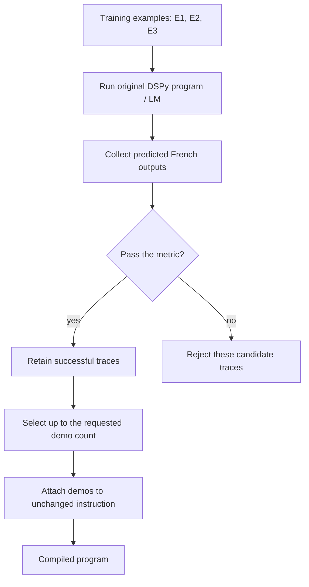
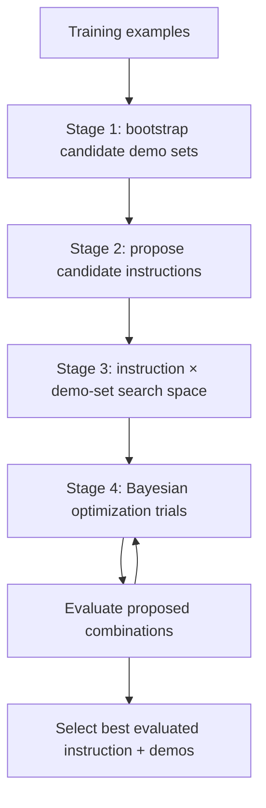
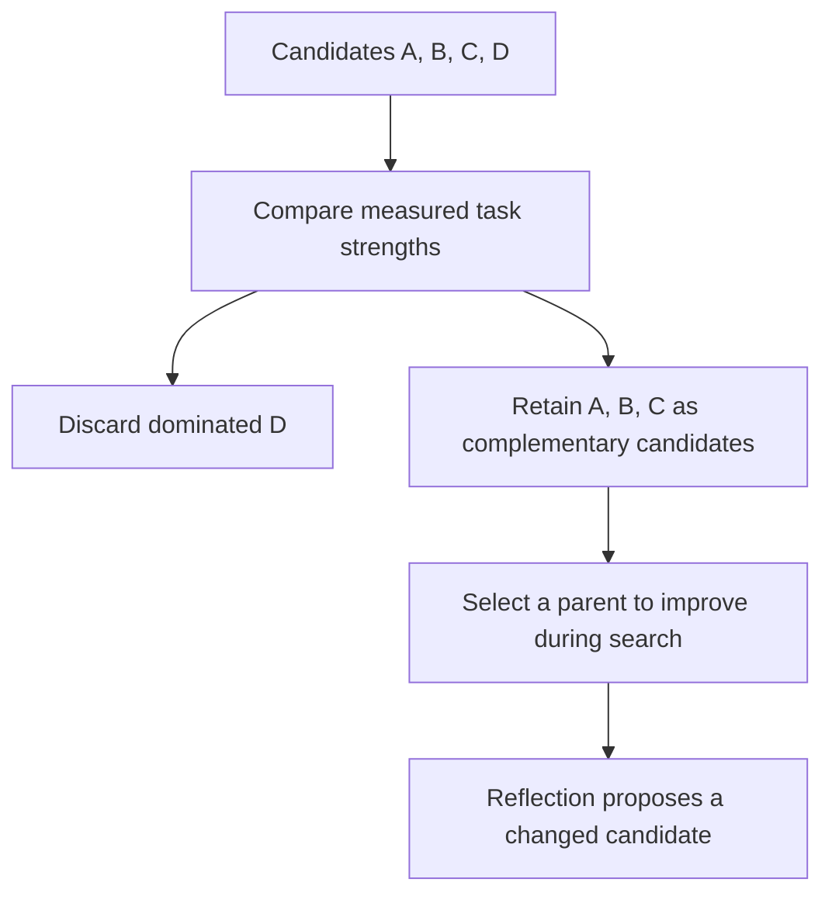
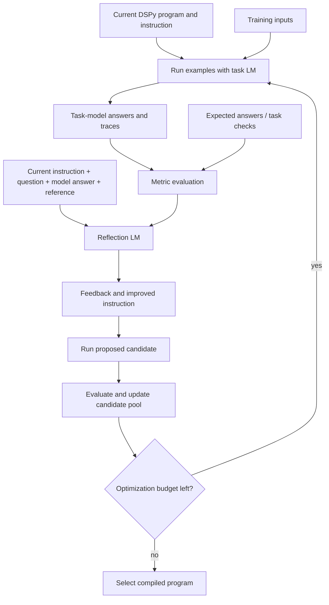

# 🧬 Class 18: DSPy Part 2 — Bootstrap, MIPROv2, and Reflective Prompt Evolution
### 📋 Production AI / LLM Engineering | Krish Naik Academy

**🎙️ Mentor:** Sourangshu Pal (Paul)  
**⏱️ Duration:** 4 hours 11 minutes 16 seconds | **📅 Session:** Class 18 — 20 September 2026  
**🔗 Recording:** [20 Sept DSPY Part - 2](https://learn.krishnaikacademy.com/web/courses/6a16f8935e281281cd6b1128?chapter=6ab0bf36a7be26461cd03267)

---

## 📰 Quick Updates

The class continued the [structured-llm-notebooks repository](https://github.com/sourangshupal/structured-llm-notebooks/tree/main). The practical core was Notebook 2's comparison of BootstrapFewShot and MIPROv2. Paul expanded the session into GEPA's research motivation, Pareto examples, and reflection workflow, then previewed other notebooks for independent exploration.

A feedback survey was shared to identify topics needing revision and possible extra sessions. Paul proposed a later poll for an additional DSPy session; this was a tentative plan rather than a confirmed weekday class.

The first major project discussed was MedScript AI, after the relevant fine-tuning module. SageMaker was being considered, but a final deployment choice was not made here. The next regular technical work would begin Transformer fine-tuning practice, followed by attention variants and KV cache.

The companion materials include the 13-page whiteboard PDF **Note (1).pdf** and the separately linked **Dspy2.pdf**. Their rendered pages contain the same diagrams. The figures below reconstruct those sketches, with implementation details clarified from the actual notebook sources and official references.

---

## 🎯 What DSPy Optimization Changes

The previous class established signatures and modules. This session asked what can improve **after the program structure is defined**.

A signature specifies inputs, outputs, and an instruction. In a class-based signature, the docstring provides the task instruction. Demonstrations supply examples of inputs and desired outputs, sometimes including the intermediate fields generated by a module.

Paul used a simple decomposition throughout:

\[
\text{prompt content} \approx \text{instruction} + \text{demonstrations}.
\]

This is a useful classroom model of the optimizable content. The actual adapter also renders input values, field descriptions, separators, and other formatting into the model request.

Different optimizers change different parts. BootstrapFewShot gathers demonstrations without rewriting the instruction. MIPROv2 searches over instructions and demonstration sets. GEPA uses feedback from execution traces to propose instruction changes and retain complementary candidates during search.

“Replace prompts with programs” therefore means expressing a task and workflow declaratively, then letting an optimizer manage some of the instruction and example choices. A language model still receives prompts. DSPy does not eliminate context, model calls, evaluation, or application design.

Optimization also assumes a task definition. If a mathematics system suddenly becomes a genetic-engineering system, its old examples and metric may no longer describe the intended behavior. Gaurav's early question brought out this boundary: an optimizer improves a specified task; it does not infer an entirely new specification merely because the surrounding business changes.

---

## 🏗️ Compilation: A Search Procedure With Inputs and a Budget

DSPy calls optimizer-driven program preparation **compilation**. For the prompt optimizers discussed here, compilation searches for better instructions or demonstrations while using the selected language model to run candidate programs.

Paul broke the process into six concrete ingredients:

1. Define a signature and module.
2. Prepare task examples.
3. Define what counts as a good prediction.
4. Measure the unoptimized baseline.
5. Compile with an optimizer.
6. Evaluate the compiled program and inspect what changed.

This is not the same as compiling Python source into machine code. It also is not neural-network training for these three prompt optimizers. Their ordinary runs change prompt-related program state while the underlying LM weights stay fixed.

The signature remains the task contract. The program remains the workflow. The dataset gives the search observations, and the metric supplies its objective. If the metric rewards the wrong thing, the optimizer can become better at the wrong thing.

Paul emphasized that a small API call can hide an extensive algorithm. A one-line `compile` invocation may make many model calls, collect traces, evaluate candidates, and consume a meaningful budget. Understanding the algorithm is necessary to interpret both the result and its cost.

The session's “run the program” language referred to calling the DSPy workflow and receiving model predictions. Python executes the orchestration and metric functions. The basic QA program does not execute arbitrary Python generated by the LM; that would require a different module or an attached execution tool.

---

## 🗃️ Dataset Preparation: Inspect the Generator Before Trusting Its Labels

The optimizer notebook requests 40 QA records, converts them to DSPy examples, and splits them into 28 training examples and 12 development examples:

```python
qa_data = generate_qa_pairs(40)

examples = [
    dspy.Example(question=d["question"], answer=d["expected"]).with_inputs("question")
    for d in qa_data
]

# Split: 70% train, 30% dev
split = int(len(examples) * 0.7)
trainset = examples[:split]
devset = examples[split:]
```

`with_inputs("question")` marks the question as the input. The answer stays in the record as the expected output for evaluation. Without distinguishing inputs from labels, an evaluator or optimizer cannot reliably know which fields to pass to the program.

The transcript sometimes described these records as LLM-generated. The shared source resolves the implementation: **this particular generator uses seeded Python sampling from fixed topic–definition pairs**. It makes no LLM call. The eight topics include RAG, DSPy, prompt engineering, fine-tuning, vector databases, chain-of-thought, attention, and Transformers.

Its central construction is:

```python
topic, context = random.choice(topics)
qa_pairs.append(
    {
        "id": i,
        "question": f"What is {topic}?",
        "context": context,
        "expected": context,
        "category": topic.lower().replace(" ", "_"),
        "difficulty": random.choice(["easy", "medium", "hard"]),
    }
)
```

Repeated topics produce repeated questions and answers. More generated rows therefore do not mean more distinct knowledge. The randomly assigned difficulty label does not turn the same definition question into a genuinely harder problem.

The live split is suitable for showing the mechanics, but duplicates can cross the train/development boundary. That limits what the resulting score says about unseen tasks. For a realistic evaluation, deduplicate or group related examples before splitting and include genuinely new cases.

Paul's practical advice was to validate expected answers, including when an LLM really is used to generate them. Human review, a reliable task checker, or a carefully evaluated judge can contribute. Synthetic generation is an economical starting point, not automatic ground truth.

---

## 📏 The Custom Metric: Word Coverage With a Pass Threshold

The metric receives an expected example and a prediction, normalizes both answers, and compares their word sets. The denominator is the number of unique expected words:

\[
\text{coverage} =
\frac{|\text{expected words} \cap \text{predicted words}|}
{|\text{expected words}|}.
\]

The exact current optimizer-notebook source is:

```python
def answer_metric(example, prediction, trace=None):
    """Check if predicted answer covers the expected answer's content.

    Word-overlap ratio (expected words found in prediction). A plain substring
    check scores 0 on paraphrases, which leaves optimizers with nothing to
    bootstrap from.
    """
    expected = set(example.answer.lower().split())
    predicted = set(prediction.answer.lower().split())
    if not expected:
        return 0.0
    return 1.0 if len(expected & predicted) / len(expected) >= 0.3 else 0.0
```

Paul discussed a **0.5** threshold during the session. The repository version above uses **0.3**; the later optimizer catalog still illustrates 0.5. Keep that difference visible when reproducing scores. A changed threshold changes the meaning of “pass,” even if the rest of the code is unchanged.

This metric checks overlap, not semantic correctness. It ignores word order and repeated words, treats punctuation-attached strings literally, and can reward shared function words. It can reject a correct paraphrase while accepting an incorrect statement containing enough reference words.

The stored optimizer output makes that limitation unusually concrete: a bootstrapped answer described DSPy as “tailored PyTorch for specific domain applications.” That is not the framework definition intended by the source label, yet the weak overlap criterion admitted it as a demonstration. **Metric success is not necessarily factual success.**

Paul stressed using a task-appropriate scoring function, possibly combining several checks. Code tasks may need syntax, runtime tests, and specification coverage. RAG tasks may need supported claims and completeness. Classification may need exact labels and balanced coverage.

Changing a threshold is valid when the acceptance rule is demonstrably miscalibrated. Lowering it merely to display improvement changes the target rather than proving better behavior. A strict metric can also be inappropriate if it penalizes valid paraphrases. The goal is a trustworthy objective, not maximum strictness or a pleasing percentage.

---

## 🧪 Testing the Metric Is Different From Evaluating the Model

Before optimization, Paul fabricated an example and a prediction to show that the metric function could be called. This triggered several questions about why a prediction was supplied manually.

A fabricated prediction tests **the checker**. If the expected answer and supplied answer agree, the score should reflect that. Changing the supplied answer tests whether the checker notices the change. No model needs to be called in this step.

A model evaluation does something additional: it passes each example's input to the program, receives a real prediction, and then calls the checker on that prediction.

These two activities answer different questions:

| Activity | Main question |
|---|---|
| Metric self-test | Does this scoring function behave as intended on known cases? |
| Baseline evaluation | How does the unoptimized program score on the chosen data? |
| Candidate evaluation | Does a proposed optimized program improve the objective? |
| Independent test | Does the selected program generalize to cases not used for selection? |

The class's simple self-test was useful but insufficient to validate the metric broadly. Include both valid and invalid answers, paraphrases, contradictions, and empty responses when testing a real checker.

A continuous score can be used instead of a binary result where the optimizer supports it. Cosine similarity, F1, programmatic constraints, and judge scores were discussed as possibilities. Applying sigmoid or softmax to a number does not itself make the result a calibrated probability of correctness; the semantics of the score still need defining.

---

## 🧩 The Baseline Program and Its Evaluation

The QA signature asks for a short factual answer. A custom `Module` contains a `ChainOfThought` predictor and forwards the incoming question to it:

```python
class QA(dspy.Signature):
    """Answer questions with short factual responses."""

    question: str = dspy.InputField()
    answer: str = dspy.OutputField()


class SimpleQA(dspy.Module):
    def __init__(self):
        super().__init__()
        self.generate = dspy.ChainOfThought(QA)

    def forward(self, question):
        return self.generate(question=question)
```

Paul related this syntax to PyTorch's module pattern. The analogy helps explain composition and `forward`, but this module's body orchestrates an LM call rather than a differentiable tensor computation. Calling the module invokes its forward behavior through the framework; constructing an object alone does not evaluate the dataset.

The evaluator receives the development set, the custom metric, and a concurrency setting:

```python
evaluator = Evaluate(devset=devset, metric=answer_metric, num_threads=4, display_progress=True)
baseline_score = evaluator(baseline).score
```

The live baseline was **58.33**, corresponding to approximately 7 passes out of 12 with the binary checker. That is the starting measurement, not a theoretical lower bound on the program's performance.

Students reported different scores. Provider/model choices, generated output variation, caching, source revisions, and metric settings can affect the comparison. Record those details before interpreting differences.

The thread count controls concurrent work in the evaluator. It should respect the provider's limits and the environment's practical capacity; more threads do not increase answer quality.

---

## 🌱 BootstrapFewShot: Add Successful Traces Without Rewriting Instructions

The first whiteboard sketch separates an unchanged instruction from examples added underneath it. Paul contrasted this with the normal query → prompt → LLM → answer path.

His English-to-French illustration uses training pairs E1→F1, E2→F2, and E3→F3. The program predicts translations, the metric accepts the first two and rejects the third, and accepted traces become demonstrations.



This preserves the actual structure of PDF pages 2–4. “Successful” means accepted by the supplied metric. It should be read with the earlier warning about metric quality.

The source initializes and compiles the optimizer as follows:

```python
teleprompter = BootstrapFewShot(metric=answer_metric, max_bootstrapped_demos=4)

optimized_bootstrap = teleprompter.compile(SimpleQA(), trainset=trainset)
```

`teleprompter` reflects the framework's historical terminology for an optimizer. The variable name does not add a separate component to the algorithm.

The transcript initially described stopping after the dataset had been processed, then Jatindra correctly noted that the run stopped early after reaching its demonstration target. Budget, rounds, successful-demo limits, errors, and dataset exhaustion all matter; it is not necessary to consume every example.

The basic BootstrapFewShot procedure is not a global ranking algorithm that evaluates every successful trace and sorts a top-N leaderboard. Its purpose is to gather acceptable demonstrations within configured limits. Random-search variants add a different search over candidate programs.

---

## 🔍 Demo Limits and Inspecting the Actual Prompt

The classroom parameter `max_bootstrapped_demos=4` limits **bootstrapped** demonstrations. It is not necessarily a four-example cap on the complete prompt.

The API also has `max_labeled_demos`, and it can combine labelled training examples with accepted bootstrapped traces. The official defaults shown in the reference are four bootstrapped and sixteen labelled demonstrations. The current notebook explicitly prints both categories. [BootstrapFewShot API](https://dspy.ai/current/api/optimizers/BootstrapFewShot/).

The supplied stored output reports **16 attached demonstrations**, including repeated topics. This does not contradict the four-bootstrap limit. It illustrates why inspecting the compiled artifact matters more than inferring its size from one constructor argument.

The demonstrations live on the inner `Predict` wrapped by `ChainOfThought`. The source retrieves them with:

```python
demos = optimized_bootstrap.generate.predict.demos
```

The unchanged instruction is accessible on that predictor's signature. To inspect what the LM actually sees, the notebook first invokes the compiled program and then prints recent history:

```python
optimized_bootstrap(question="What is Attention?")
dspy.inspect_history(n=1)
```

The history shows rendered field markers, examples, and the final query. It helps answer the recurring question “Where is the prompt?” The program state and adapter create it; a separate hand-written `prompt.py` file is not required.

The displayed `augmented=True` marker identifies a bootstrapped/augmented example. It is metadata about its origin, not an independent guarantee that its answer is correct or that instructions were rewritten.

Compilation is an explicit operation. The program does not automatically continue learning from every later production request. Save the compiled state and recompile deliberately when the task data or requirements justify it.

---

## 📈 Bootstrap's Live Improvement and What It Establishes

The notebook evaluated the compiled bootstrap program with the same evaluator used for the baseline. The live score rose from **58.33 to 83.33**, or approximately 7/12 to 10/12.

That is an improvement of **25 percentage points** on this development set. It is not a 25% relative improvement, and it is not a measured improvement on a large independent benchmark.

Paul demonstrated the accepted examples and saved state to show that the change was inspectable. The improvement came from demonstrations, while the initial instruction stayed the same.

There are several practical limits:

- The dataset contains repeated topic–definition pairs.
- Train and development slices can share equivalent questions.
- The checker rewards word overlap rather than establishing truth.
- Only twelve development rows determine the score.
- The compiled prompt may include more examples than the bootstrap-only parameter suggests.

These limitations do not erase the lesson. They define it: DSPy can automatically assemble a different prompt state, and the provided evaluator can measure its effect. Production claims require a stronger dataset, checker, and independent evaluation.

Paul recommended starting with bootstrap because it offers a simple, relatively economical entry point. More demonstrations can help explain the task, but they can also add irrelevant context, repeat errors, or increase inference tokens. “Few-shot” is a strategy, not a universal maximum number of examples mandated by the framework.

---

## 🔎 MIPROv2: Jointly Search Instructions and Demonstration Sets

The second optimizer changes the question from “Which examples should I include?” to “Which instruction and example combination works best?”

Paul read the MIPRO research motivation and emphasized downstream tasks such as classification, question answering, and summarization. The optimizer seeks better end-to-end behavior without requiring gradient access to the LM or labels for every intermediate module.

The paper separates free-form instructions and few-shot demonstrations and uses program/data-aware proposals plus a statistical search. Its reported results concern the paper's evaluated tasks and models; they do not promise that MIPROv2 will beat bootstrap on every application. The original paper used Llama-3-8B and reported wins on five of seven programs. [MIPRO paper](https://arxiv.org/abs/2406.11695).

The PDF divides the process into stages:



Different demo sets may contain different accepted examples. A proposal model writes multiple instruction variants using the task, program, and data context. The joint search then chooses combinations to evaluate.

The instruction proposer and task model can be configured differently. A stronger proposer may be useful, but the budget and task should guide that choice. Producing a candidate instruction does not itself prove that it is better; the subsequent evaluation supplies that evidence.

---

## 🧮 Bayesian Search and the Surrogate: Spend Calls Where They Are Useful

The whiteboard illustrates I1+D1, I1+D2, I2+D1, and other combinations. With several instruction candidates and demonstration sets, the number of possible combinations grows quickly.

Paul explained why exhaustive evaluation becomes costly. An optimizer uses earlier trial results to guide later trials instead of testing every possible configuration. The illustrative board scores—78%, 80%, 81%, and a later 85%—are hypothetical explanations, not class measurements.

The statistical **surrogate** models the relationship between configuration choices and their observed objective values. It supports choosing promising trials. It is not a second language model or merely a deep copy of the original program. Candidate programs may be copied for testing, but that operation and the search's statistical model play different roles.

The conceptual search space exists even if every configuration is not explicitly materialized or evaluated. Bayesian search does not imply a guarantee of finding the global optimum. The final result is the best candidate found under the chosen procedure, objective, and budget.

Separate trials are separate model requests. Their entire candidate pool is not inserted into one enormous LM context. Nevertheless, a single trial's instruction, demonstrations, input, and generated fields still need to fit the model's context constraints.

The primary MIPRO explanation establishes the surrogate as an approximation of the optimization objective. This is the more precise interpretation of the classroom copy analogy. [MIPRO methodology](https://arxiv.org/abs/2406.11695).

---

## ⚙️ MIPROv2 Parameters and the Actual Result

The source deliberately opts out of automatic budgeting and chooses a small manual search:

```python
mipro = MIPROv2(
    metric=answer_metric,
    auto=None,  # dspy 3.3: opt out of auto budget to set candidates/trials manually
    num_candidates=5,  # Reduced for cost
    init_temperature=1.0,
)

optimized_mipro = mipro.compile(
    SimpleQA(),
    trainset=trainset,
    num_trials=DSPY_OPTIMIZER_TRIALS,  # Configurable via .env
    valset=devset,
    minibatch=False,  # Small valset (12) — default minibatch size is 35
)
```

The notebook's configured trial count was ten. The candidate count bounds the proposal pools, and the initialization temperature supports proposal variation. Automatic light, medium, and heavy modes were also discussed as alternative budgeting choices.

`minibatch=False` fits this small twelve-example validation set. For larger validation data, minibatching can trade evaluation cost against a noisier estimate. It does not change the need for representative examples.

The live result was **83.33**, matching bootstrap rather than improving on it:

| Program | Class development score | Difference from baseline |
|---|---:|---:|
| Unoptimized SimpleQA | 58.33 | — |
| BootstrapFewShot | 83.33 | +25.00 percentage points |
| MIPROv2 | 83.33 | +25.00 percentage points |

Paul explicitly retained this lack of additional gain. Students reported cases where MIPROv2 improved, tied, or underperformed bootstrap. These were informal reports using differing models, not a controlled benchmark.

The optimized instruction expanded the short factual-answer instruction into a detailed workplace scenario asking for a concise informative technical response. The instruction visibly changed, but more text alone is not an improvement criterion. Its value has to come from the measured behavior.

---

## 💾 Saving, Reloading, and Keeping Evaluation Honest

The notebook inspects MIPRO's instructions and demonstrations separately, then saves the compiled state:

```python
optimized_mipro.save("optimized_qa.json")
print("✅ Saved to optimized_qa.json")

# Reload
loaded = SimpleQA()
loaded.load("optimized_qa.json")

# Verify it works
result = loaded(question="What is DSPy?")
print(f"\nReloaded program answer: {result.answer}")
```

Reloading restores prompt-related program state into a compatible program definition. This is different from saving newly trained language-model weights. Keep the program code, dependency versions, model configuration, metric, data split, and compiled artifact together for reproducibility.

The class used “dev,” “validation,” and “test” somewhat interchangeably. The code passes `devset` to MIPRO as its validation set, so that set participates in candidate selection. Its later reported score is a development score. A separate unseen test set is needed for a final generalization claim.

A baseline of 100% prompted a long discussion about weak metrics. A saturated result is a reason to examine the checker, duplicated data, task difficulty, and coverage. It is not proof that the metric must be wrong: an easy, correctly specified small task can genuinely be solved perfectly.

Likewise, prompt search can overfit its evaluation examples even though it does not update neural weights. The independent-test principle still applies. Avoid making the metric harsher solely to manufacture room for improvement; identify a real requirement that the existing evaluation misses.

---

## 🧰 Where DSPy Fits in RAG, Agents, and Data Generation

Paul briefly toured other repository notebooks to show how the same optimization ideas extend to application workflows. These were introductions and self-study pointers, not complete live production implementations.

The RAG source uses an in-memory keyword retriever. It collects passages, joins them into context, and calls a context/question→answer predictor:

```python
def forward(self, question):
    passages = self.retrieve(question).passages
    context = "\n".join(passages)
    return self.generate(context=context, question=question)
```

There is no vector database connection in that demonstration. A production retriever could be substituted while preserving the surrounding module contract. Paul encouraged relating DSPy to an existing retrieval stack rather than assuming an additional framework layer is mandatory.

The notebook also shows multiple retrieval hops, a length warning, and a basic grounding assertion. Its word-overlap assertion is an illustrative check, not proof that every answer claim is supported. Fuller grounding metrics were deferred to the RAG work.

The agent preview introduces a ReAct loop with tools. The companion source's search and weather functions return simulated strings; printing a tool definition is not the same as connecting an MCP server. Treat the notebook as a pattern for wiring capabilities, not as live current-information retrieval.

The fine-tuning preview generates answers with a DSPy program and exports instruction/input/output records in an Alpaca-style format. That source really does make LM calls to produce outputs, unlike the earlier fixed QA generator. The generated samples still require validation. No GPU fine-tuning result was established in today's lecture.

The additional catalogs cover modules, embeddings, adapters, evaluation, images, audio, history, and tools. Paul urged students to begin with prompt optimization before exploring the whole ecosystem. Dependency versions and experimental features should be checked before adopting later examples.

---

## 🧬 GEPA: Use Failure Feedback to Evolve Instructions

The final major topic was **GEPA, Genetic-Pareto**. Paul introduced it through the research paper and the idea that natural-language feedback can communicate much more than a pass/fail number.

A trace can contain the input, intermediate output, tool calls, tool results, and final answer. A reflection model reads the relevant traces and feedback, diagnoses failure patterns, and proposes an instruction change. The candidate is then tested rather than accepted because its explanation sounds convincing.

This differs from the earlier classroom comparison: bootstrap mainly collects acceptable examples, MIPRO searches candidate instructions and example combinations, and GEPA directly incorporates reflective feedback into proposed revisions. This is a distinction among the discussed methods, not a claim that no other optimizer uses reflection.

The paper first appeared in **July 2025**, with a later revision. Its abstract reports GEPA outperforming the evaluated GRPO setup by six points on average across six tasks, with larger gains on some tasks and up to 35 times fewer rollouts. Those are research-specific results, not a universal replacement for reinforcement learning or a promised saving on every project. [GEPA paper](https://arxiv.org/abs/2507.19457).

Prompt evolution and reinforcement-learning weight updates are different optimization targets. A prompt optimizer can be very effective on a fixed model while leaving its weights unchanged. The paper's comparisons should be read with their tasks, model choices, budgets, and metrics.

Paul recommended progressing from a baseline to bootstrap, then MIPROv2, then considering GEPA if the additional search addresses useful failure modes. This is his practical starting sequence, not a requirement to run all three before GEPA can be used.

---

## ⚖️ Pareto Tradeoffs: Retain Complementary Strengths

The PDF explains Pareto reasoning with four hypothetical laptops:

| Laptop | Price | Performance stars |
|---|---:|---:|
| A | 50K | 3 |
| B | 70K | 5 |
| C | 60K | 4 |
| D | 70K | 4 |

D is dominated by B: the price is the same and performance is worse. A, B, and C each offer a tradeoff. A is cheaper, B performs best, and C lies between them.

The instruction analogy then uses hypothetical math and coding scores:

| Prompt | Math score | Coding score | Classroom interpretation |
|---|---:|---:|---|
| A | 95 | 70 | Stronger at math |
| B | 80 | 95 | Stronger at coding |
| C | 90 | 90 | Balanced |
| D | 75 | 60 | Dominated; discard |

Keeping only the highest aggregate candidate too early can lose a useful specialist. Retaining complementary strengths gives later search more diversity.



This follows PDF pages 9–10. The price/performance and math/coding numbers are teaching examples, not measurements of hardware or prompts.

For GEPA's standard search, the frontier retains candidates with useful performance across evaluation instances. It is not automatically a price-versus-token-cost graph. Additional objectives can be explicitly incorporated, but the cost-quality plot in the companion GEPA notebook is labelled **simulated data**, not output from the class run.

“Keep all solutions” should therefore mean retain useful nondominated or complementary candidates under the chosen criterion. It does not mean storing every inferior candidate as an equally good production choice.

---

## 🔄 The Reflection Workflow and Its Stopping Budget

The final whiteboard starts with a normal DSPy program, training examples, execution of the current prompt, and a metric. The reflection model then examines the current instruction, question, original model answer, and correct answer to produce feedback.



This reconstructs PDF pages 11–12. The LM used for the task and the LM used for reflection are distinct **roles**. They can use different models, but the source also allows the same LM configuration to serve both roles.

The actual companion initialization illustrates that:

```python
gepa = GEPA(
    metric=math_metric,
    auto="light",  # dspy 3.3 budget presets: 'light' | 'medium' | 'heavy'
    reflection_lm=lm,  # dspy 3.3 requires an explicit reflection LM
)
```

The class explained GEPA conceptually; it did not establish a live GEPA score on this notebook. The more detailed companion notebook adds feedback-bearing metrics, explicit validation data, and recorded candidate statistics for self-study.

Feedback can say what failed rather than just returning zero. A specific format mismatch or failed calculation is more actionable than an undifferentiated score. However, incorrect feedback can drive the search in the wrong direction, just as a broken answer key can.

The loop stops under an explicit budget or stopping condition. Rewriting prompts over multiple iterations is not an always-running background improvement service. Light, medium, or heavy labels bound an optimization procedure; they are not universal dollar-price guarantees.

---

## 🚦 Optimization-Time Selection Versus Production Inference

Gaurav's closing question asked how GEPA chooses among prompts A, B, and C when a new request arrives. Sridhar then asked whether every simple request must pass through the refinement loop.

The key implementation distinction is that **GEPA selects parents from its frontier while optimizing**. Standard DSPy compilation ultimately returns the candidate with the best aggregate validation performance. Invoking that compiled program does not automatically classify each unseen request and select a different frontier prompt.

A production application may add a conditional router, maintain an ensemble, or deliberately perform an inference-time search. Those are separate designs with their own scoring and latency costs. They should not be inferred from the mere existence of a Pareto candidate pool.

The official overview distinguishes ordinary compilation from explicitly configured batch inference-time search and identifies the final return as the best validation candidate. [GEPA API and algorithm overview](https://dspy.ai/current/api/optimizers/GEPA/overview/).

This also resolves the saving question: compile and evaluate a program, save its state, and deploy the selected artifact when appropriate. Recompiling every request is often unnecessary. A simple task with a reliable fixed workflow may need no optimizer at runtime at all.

Paul's conditional-routing answer usefully emphasized proportionality: reserve expensive processing for cases that need it. The router itself must be designed; no automatic “genetic predictor” router was implemented in today's examples.

---

## 🗺️ What's Next

Paul planned to begin practical Transformer fine-tuning with a simpler pretrained model such as DistilBERT and NLP downstream tasks. Attention variants, KV cache, and serving concepts would follow in Module 3, before the broader fine-tuning work.

RAG and agents would revisit DSPy in concrete application pipelines. The additional module, optimizer, adapter, embeddings, and primitive notebooks were shared for self-study.

An extra DSPy session remained dependent on a later poll and scheduling. The class did not complete the full RAG, ReAct, GEPA implementation, or GPU fine-tuning curriculum.

---

## 💬 Live Q&A Highlights

| Question | Answer |
|---|---|
| **Gaurav, early chat:** Does optimization adapt to an entirely changed task? | Its examples and metric describe a task. A different domain or goal may require new data, signatures, workflow, and evaluation. |
| **Raj / Sandeep, relayed:** Where do the repeated QA examples come from? | The supplied shared generator samples fixed topic–definition templates. Repetition reflects that small pool; this generator has no LLM call. |
| **Urna / Sridhar / Sivas, relayed:** Why supply a prediction manually to the metric? | That cell tests the metric function. Later evaluation obtains real model predictions before scoring them. |
| **Alok / Thomas, relayed:** Can one metric combine several checks? | Yes. Define meaningful task checks and aggregate or threshold them deliberately; the optimizer needs an interpretable objective. |
| **Abhishek / Debajyoti, relayed:** Can the metric be continuous or probabilistic? | A continuous score is possible. A transformed score is not automatically a calibrated probability of correctness. |
| **Rushi, relayed:** Can examples include images? | DSPy has multimodal types and compatible-model paths. Today's optimizer demonstration used text. |
| **Thomas, relayed:** Can different models generate and evaluate outputs? | Yes, model roles can be configured separately. Their quality, bias, and cost still require evaluation. |
| **Komal, relayed:** When is `forward` called? | Calling a DSPy Module invokes its forward behavior. It wires the predictor call; constructing the module alone is different. |
| **Nitin, relayed:** What does the baseline evaluator compare? | It calls the unoptimized program on development inputs and compares its predictions with references using the chosen metric. |
| **Dhruvanka, relayed:** Can several optimizers be tried or chained? | Yes, compatible optimization stages or separate comparisons are possible. Compare the resulting programs with a consistent objective and independent final test. |
| **Vishu / Thomas, relayed:** Does bootstrap improve continuously after compilation? | No. Compilation is explicit. Re-run it when new data or changed requirements justify the budget. |
| **Jatindra, relayed:** Why did bootstrap stop before all 28 examples? | It can reach the configured successful-demo target early. Dataset exhaustion is not its only stopping condition. |
| **Ranjiv / Bhaskar, relayed:** What if labels are wrong or no ground truth is available? | Validate data and define a trustworthy evaluator. A task checker or calibrated judge can help; a misleading label or score misdirects optimization. |
| **Swathi, relayed:** What if no trace passes? | Inspect model failures, data, and the metric. Recalibrate a defective checker rather than relaxing it solely to obtain a higher score. |
| **Arun / Abhishek, relayed:** Are accepted demos added to the model context, and where are they stored? | Yes, they become predictor state rendered into prompts. Inspect `.demos` and the LM history, then save compiled state if needed. |
| **Shantal, relayed:** Why are demonstrations repeated? | The small synthetic dataset repeats topics. Duplicate rows can produce repeated demos and overlap across splits. |
| **Bhaskar / Sridhar, relayed:** Does optimization cost additional calls and tokens? | Yes. Compilation calls the program repeatedly, and extra demonstrations can increase later inference input tokens. |
| **Gaurav, relayed:** Does the overlap metric assess the full content meaning? | No. It is a simple coverage heuristic; the stored wrong DSPy definition shows why semantic validation matters. |
| **Abhishek, relayed:** How is this different from manually adding few-shot examples? | The effect is still examples in the prompt. DSPy automates trace collection and selection using the supplied evaluator. |
| **Sandeep, relayed:** Are proposed MIPRO instructions already evaluated in Stage 2? | Proposal generation creates candidates. Their joint performance with demonstration sets is measured during the search. |
| **Rushi, relayed:** Do all combinations overflow one context window? | No. Trials are separate calls. Each individual prompt must still fit its selected model's context limit. |
| **Abhishek, relayed:** What remains to optimize when the baseline is 100%? | Check coverage, duplicates, difficulty, and the metric. A genuinely solved easy task may need no optimization; do not change the objective merely to create improvement. |
| **Vivek / Sridhar, relayed:** Can DSPy be integrated into existing RAG and agents? | Yes, compatible modules can sit in the workflow. The class's RAG preview used keyword retrieval, with real vector retrieval left for later work. |
| **Gaurav Garg:** Does GEPA automatically select a frontier prompt for each new runtime question? | Standard compilation selects a program after search. Frontier parent selection occurs during optimization; per-request routing requires an explicit application design. |
| **Gaurav Garg:** What about requests spanning two specialties? | Define routing, ensemble, or scoring behavior if that is needed. The class did not implement an automatic mixed-topic router. |
| **Gaurav Garg:** Can a Java or other-language application use the result? | The demonstrated DSPy program is Python. An application can expose it through an integration boundary; no native Java implementation was demonstrated. |
| **Debajyoti Mukhopadhyay:** Where is the GEPA paper? | The paper is linked from the DSPy resources and is available as arXiv:2507.19457. |
| **Debajyoti Mukhopadhyay:** Does listing frameworks on a résumé establish project skill? | Paul emphasized explaining the problem, failed approaches, decisions, and measured outcome. Package names alone do not show that experience. |
| **sridhar k:** Is the instruction optional in GEPA, and should it be saved? | GEPA's reflective updates target instructions; examples can be carried by the program without being its main search target. Save the compiled state and inspect instructions when deploying. |
| **sridhar k:** Must each simple request run the whole refinement loop? | No. Invoke a saved compiled program where appropriate. Conditional routing or deliberate inference-time optimization is an additional design and cost choice. |
| **Arun Kumar RV:** Can GEPA fit a custom harness for a small language model? | A compatible adapter and program boundary can integrate it. Define data, evaluation, tools, and the harness behavior; optimization alone does not supply missing tools. |
| **Arun Kumar RV:** Does the harness still need tool and MCP access? | Yes, if the task needs those capabilities. They are separate from prompt optimization and should be wired explicitly. |
| **Arun Kumar RV:** How can a statistical-analysis module improve its failing coverage target? | The project details and metric were not available in class. Paul requested details for investigation; no specific fix or performance guarantee was given. |

---

## 🔑 Key Pointers to Remember

- A signature defines the task; an optimizer improves a specified program against a specified objective.
- Compilation can make many calls even when the invocation is one line.
- These prompt optimizers do not train the underlying LM's weights.
- Mark example inputs with `with_inputs`; keep labels available to the evaluator.
- The class QA generator is seeded template sampling, not LLM generation.
- Forty repeated rows do not equal forty distinct problems.
- Word overlap can admit factually wrong demonstrations.
- The live 0.5 threshold and current notebook's 0.3 threshold should not be silently conflated.
- Test the metric itself before treating its score as meaningful.
- Bootstrap preserves instructions and adds demonstrations.
- Four bootstrapped demos does not necessarily mean four total demos.
- Inspect the inner predictor state and the actual rendered request.
- Bootstrap can stop early when its target is reached.
- The class improvement was 25 percentage points on twelve development rows.
- MIPROv2 changed the instruction but did not beat bootstrap in the live run.
- A Bayesian surrogate models the search objective; it is not a cloned LLM.
- Validation data used to select candidates is not an untouched final test.
- Prompt optimization can overfit even with frozen neural weights.
- A 100% score warrants inspection, not an automatic declaration that the checker is wrong.
- GEPA learns from trace-grounded textual feedback while retaining complementary candidates during search.
- The task and reflection roles can use the same or different models.
- A Pareto pool does not automatically become a runtime request router.
- Save compiled state and re-optimize deliberately.

---

## ✅ Action Items After Class 18

- [ ] Read the actual QA generator and count distinct questions before reproducing the split.
- [ ] Deduplicate or group related cases when preparing a realistic training, validation, and test split.
- [ ] Define a metric that detects the important errors in your application, including plausible wrong answers.
- [ ] Self-test that metric on correct answers, paraphrases, contradictions, and empty outputs.
- [ ] Record provider, model, dependency version, threshold, and dataset when measuring the baseline.
- [ ] Compile with BootstrapFewShot, evaluate it, and inspect both labelled and bootstrapped demos.
- [ ] Print LM history after invoking the compiled program to understand the complete rendered prompt.
- [ ] Compare MIPROv2 against the same baseline and report development changes in percentage points.
- [ ] Save and reload the compiled program, keeping the compatible code and configuration.
- [ ] Use an independent final test before claiming generalization.
- [ ] Reproduce the laptop and math/coding Pareto examples by identifying dominated choices.
- [ ] Read the MIPRO and GEPA papers with attention to their specific models, tasks, budgets, and reported results.
- [ ] Explore GEPA's companion notebooks after understanding the simpler optimizer workflow.
- [ ] Keep compilation separate from serving requests unless deliberately designing inference-time search.
- [ ] Relate DSPy to one existing workflow and identify which module, data, metric, and artifact would change.

---

*📝 Notes compiled from the full Class 18 transcript — “20 Sept DSPY Part - 2,” Production AI / LLM Engineering, Krish Naik Academy. Original transcript: “GMT20260920-143155_Recording.cutfile.20260921052238565.transcript.vtt.” Whiteboards: “Note (1).pdf” and [Dspy2.pdf](https://drive.google.com/file/d/1CCcsgL_kAZy72GNtFLfTeDvVme0xgfCc/view?usp=sharing), with all 13 rendered pages reviewed. Companion code: Sourangshu Pal's [structured-llm-notebooks](https://github.com/sourangshupal/structured-llm-notebooks/tree/main), especially the optimizer notebook, shared datasets/metrics, and the GEPA/RAG/agent/fine-tuning previews. All matching notebook source cells were read; later implementation examples are distinguished from work actually demonstrated in this class.*
