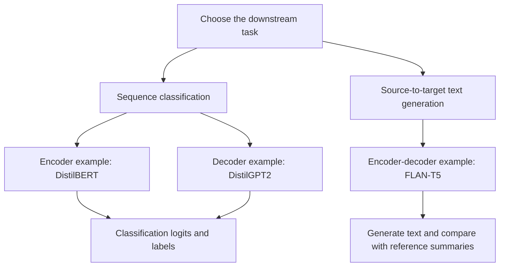
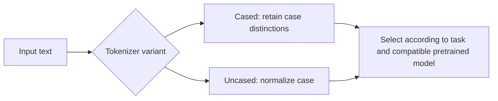
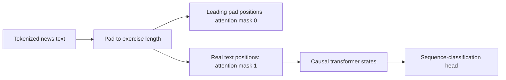
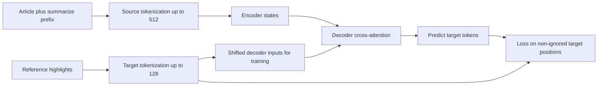

# 🏋️ Class 19: Fine-Tuning Encoder, Decoder, and Encoder-Decoder Models
### 📋 Production AI / LLM Engineering | Krish Naik Academy

**🎙️ Mentor:** Sourangshu Pal (Paul)  
**⏱️ Duration:** 2 hours 53 minutes 19 seconds | **📅 Session:** Day 19 (26 September 2026)

---

## 📰 Quick Updates

This class opened Module 3 with conventional **full fine-tuning using Hugging Face Transformers**. Paul positioned it as a practical revisit of earlier transformer concepts before the course’s later attention and inference upgrades.

The live work covered **DistilBERT sentiment classification** and **DistilGPT2 news classification**. Paul then introduced the **FLAN-T5 summarization notebook**, showed its architecture and saved results, and assigned the complete notebook for further study. It was not a third step-by-step live training walkthrough.

These exercises update the trainable model parameters directly. They do not implement LoRA, QLoRA, PEFT adapters, or a new alignment method. Advanced adaptation and serving topics remained for later sessions. Paul confirmed that additional DSPy notebooks had been shared after the earlier class.

Because Paul was unwell, he said the next class’s availability would be announced separately. The next technical agenda was naive decoding, KV cache, attention variants, and positional-encoding upgrades such as RoPE.

---

## 🧭 Three Architectures, Three Concrete Exercises

The opening whiteboard in **Transformers Pracs (1).pdf** groups the exercises by architecture. That distinction changes how input, target, attention, and inference are handled.

| Architecture | Actual supplied model | Exercise | Training interface | Output |
|---|---|---|---|---|
| Encoder only | `distilbert-base-uncased` | Three-class tweet sentiment | `Trainer` with a sequence-classification model | Three class logits. |
| Decoder only | `distilgpt2` | Four-class AG News topic classification | `Trainer` with a sequence-classification model | Four class logits. |
| Encoder and decoder | `google/flan-t5-large` | CNN/DailyMail summarization | `Seq2SeqTrainer` | Generated summary tokens. |



BERT-family encoders use bidirectional self-attention over visible input tokens. GPT-family decoders use causal self-attention: a position can attend to itself and earlier positions, while future positions are masked. Encoder-decoder models combine an encoder’s representation of the source with a decoder that generates the target and attends to that encoded source through cross-attention.

These are useful architecture tendencies, not absolute task prohibitions. A decoder can classify, as demonstrated here. Question answering can be formulated as span extraction with an encoder or as text generation; it does not always require an encoder-decoder model. A model’s head and task formulation matter alongside its backbone.

The two classification scores in this class **cannot rank encoder and decoder architectures fairly**. They use different datasets, label sets, sample counts, and batch sizes. A controlled architecture comparison would use the same task, data, and evaluation protocol.

---

## 🔬 Start Small, Inspect the Model, and Know What Is Being Updated

Paul chose distilled models to make the classroom runs manageable. DistilBERT and DistilGPT2 have fewer transformer blocks than their respective larger reference models, but distillation is more than simply deleting layers: the smaller models were pretrained using a teacher-guided process. The original [DistilBERT paper](https://arxiv.org/abs/1910.01108) reports efficiency and benchmark-retention results under its own evaluation, not a universal less-than-one-percent accuracy drop on every task.

The whiteboard mentioned BERT, DistilBERT, RoBERTa, ALBERT, ELECTRA, DeBERTa, sentence-oriented BERT models, and ModernBERT as architectures or related model families to explore. Its arrows organize the discussion; they should not be read as a literal genealogy in which every model was derived from the preceding one.

Paul’s preference was to establish a lightweight baseline, then test other variants if the task justified more complexity. Model popularity and download counts can help identify candidates, but they do not replace measurement on the intended data. A newer or larger model is not automatically the best deployment choice.

He demonstrated **Netron** as a way to inspect tensor names, shapes, and model components. Netron supports several formats, including safetensors, but what can be visualized depends on the artifact. A safetensors file stores tensors; it is not, by itself, the complete executable architecture. Hugging Face reloads the model using compatible code and configuration alongside those weights. [Netron project](https://github.com/lutzroeder/netron), [Safetensors documentation](https://huggingface.co/docs/safetensors/index).

The supplied models report:

| Model in its selected task form | Total parameters | Trainable parameters |
|---|---:|---:|
| DistilBERT, three-class classifier | 66,955,779 | 66,955,779 |
| DistilGPT2, four-class classifier | 81,915,648 | 81,915,648 |
| FLAN-T5-large summarizer | 783,150,080 | 783,150,080 |

The equality of total and trainable counts supports the class’s **full fine-tuning** description. There is no freezing or adapter-only configuration in these exercises. Attention projection weights, feed-forward layers, embeddings, normalization parameters, and the selected task head can all be updated where trainable.

Q, K, and V are activations computed from inputs and learned projections. Training updates the model parameters that produce those activations; it does not treat one fixed Q/K/V tensor as the permanent set of model weights.

---

## 🛠️ Environment, Devices, and Memory Choices

The examples use PyTorch models through Transformers, together with Datasets, Evaluate, NumPy, pandas, scikit-learn, and plotting tools. The runtime was checked before training, and `evaluate` was missing in some notebooks until installed. The summarization notebook also needed ROUGE and tokenization-related dependencies.

The saved notebook checks report a particular runtime, including Transformers 5.17.0 and Datasets 4.8.5. Those are recorded source outputs, not a promise that they are the current latest versions. Comments labeled “2026 standard” should not substitute for checking the actual installed interface.

The device helper permits CUDA, MPS, or CPU. Its supplied setting **forces CUDA**, so it does not automatically fall back when a GPU is unavailable. The fallback logic is reached only when the force setting is disabled. Model parameters and the tensor batches used by the model must be on compatible devices.

Paul discussed reducing batch size and using gradient accumulation to manage memory. Accumulation combines gradients across smaller microbatches before an optimizer update, letting an effective batch be larger than the physical batch. It does not remove the model’s parameter or optimizer-memory requirements and does not automatically improve quality.

The classifier notebooks do not explicitly enable accumulation; the FLAN-T5 notebook does. Its physical batch of **2** and accumulation factor of **8** give a nominal effective batch of **16 examples per optimizer update** on one device, apart from a final partial batch.

The source selects BF16 if a CUDA support check succeeds and otherwise FP16. A detail worth preserving is that `torch.cuda.is_bf16_supported` can include **emulation** in its support result. A true value is not proof of native BF16 hardware throughput or a guaranteed speed advantage over FP16. Use the actual device’s capabilities and a measured workload when deciding precision. [PyTorch BF16 support reference](https://docs.pytorch.org/docs/main/generated/torch.cuda.is_bf16_supported.html).

Similarly, the CUDA path selects fused AdamW, while the other paths use ordinary AdamW. Kernel support and workload affect the benefit. There is no universal rule that any one datatype or optimizer implementation is always fastest on every device.

GPU utilization and memory occupancy are also different measures. A UI memory figure does not by itself tell whether the compute cores are efficiently used. Paul mentioned monitoring tools and leaving headroom; his percentages were operational suggestions, not a theorem that every model must run at one exact utilization target.

---

## 🐦 DistilBERT Exercise: English Tweet Sentiment

The first notebook uses `cardiffnlp/tweet_sentiment_multilingual` with the **English** subset. Its existing splits contain:

| Split | Examples |
|---|---:|
| Training | 1,839 |
| Validation | 324 |
| Test | 870 |

The labels are **0 = negative, 1 = neutral, 2 = positive**. The training split is balanced at 613 examples per class; the saved test report contains 290 per class.

Paul inspected the dataset viewer, text and label columns, and class distribution. Converting a Datasets object to pandas is useful for familiar dataframe operations and visualization. It is an explicit representation change, not a requirement to train every Hugging Face dataset through pandas.

The notebook loads a Parquet export using `revision="refs/convert/parquet"` and a language directory. This is the supplied solution for that dataset layout and runtime. It is not a universal requirement that every dataset must be loaded with that revision string.

The actual configuration is:

| Setting | Value |
|---|---:|
| Learning rate | 0.00002 |
| Per-device batch size | 32 |
| Epochs | 3 |
| Weight decay | 0.01 |
| Maximum tokenized input length | 128 |

Weight decay is regularization in this setup. It is not a general-purpose mechanism for speeding up training or pushing an optimizer out of any plateau. Its value needs tuning with the optimizer, learning rate, data, and task.

The model is **uncased**, meaning its tokenizer normalizes case according to that artifact’s rules. Paul contrasted this with retaining capitalization, especially when capitalization gives clues for named entities. The companion PDF uses London/london to illustrate the lost signal. Lowercasing does not make NER universally impossible; it removes one potentially useful feature. Likewise, capitalization can sometimes matter in sentiment, even though this exercise uses an uncased baseline.



The class keeps the model’s original tokenizer. It does not retrain a vocabulary or create a custom tokenizer for this generic task.

---

## 🔤 Tokenization, Labels, and Masks Have Different Roles

The classification preprocessing tokenizes each split, truncates to at most 128 tokens, and pads to that fixed length. It removes the original text column, renames the target column to `labels`, and formats the selected data as PyTorch tensors.

| Field | Role |
|---|---|
| `input_ids` | Vocabulary IDs for token pieces and applicable special tokens. |
| `attention_mask` | Marks real input positions versus padding under the demonstrated convention. |
| `labels` | The supervised class target for the whole text in these classification exercises. |
| `token_type_ids`, when supported | Segment-related inputs used by some model architectures. |

A label mapping such as 0 → negative is **not tokenizer offset mapping**. Class IDs, vocabulary IDs, and character offsets are separate concepts. `id2label` and `label2id` let a prediction’s class index be interpreted and saved with the classifier configuration.

The BERT-style tokenizer example includes `[CLS]` and `[SEP]`; token ID 101 represents `[CLS]` in this selected vocabulary. Such numbers are artifact-specific, not universal IDs for all tokenizers.

The DistilBERT notebook’s saved dataset display includes a `token_type_ids` column. However, the actual DistilBERT architecture does not require segment IDs; its official documentation explicitly distinguishes it from original BERT on that point. Do not infer that every encoder must accept that field merely because a tokenizer or saved display includes it. Check the selected model’s input signature and runtime behavior. [DistilBERT notes](https://huggingface.co/docs/transformers/main/model_doc/distilbert).

An encoder can need a **padding mask** even though it does not use a causal future-token mask. The class revisited this distinction after students initially said encoders had no mask. Visible text positions have mask value 1 and padded positions 0 in these notebook examples. An all-ones prefix means that displayed prefix contains real positions, not that the entire architecture has no masking.

Setting `tokenizer.model_max_length = 128` records the exercise’s preprocessing choice. It does not change the pretrained architecture’s physical capacity. Fixed 128-token padding is also not mandatory for every transformer application; dynamic padding is demonstrated in the third notebook.

---

## 🧠 Attach the Classifier and Configure the Trainer

The first model is loaded as a **sequence classifier**, rather than as a masked-language-model head. This exact excerpt comes from the DistilBERT notebook:

```python
# Load model with classification head
model = AutoModelForSequenceClassification.from_pretrained(
    MODEL_NAME,
    num_labels=NUM_LABELS,
    id2label=id2label,
    label2id=label2id
)
```

The load report lists some pretraining-head parameters as unexpected and the new classifier parameters as missing. Those missing classifier parameters are newly initialized and need downstream training. This is expected for this deliberate task-head change; it should not lead to a blanket rule that every missing or unexpected key can be ignored.

`TrainingArguments` holds the hyperparameters, evaluation schedule, saving schedule, precision, optimizer, logging settings, and seed. `Trainer` combines those arguments with the model, tokenized training data, validation data, and metric function.

The selected metric function uses the argmax of class logits and computes accuracy, weighted F1, and macro F1. During training, `eval_dataset` refers to the **validation** split. The notebook later passes the test split explicitly to a separate evaluation call.

Both classifier notebooks evaluate and save each epoch and set `load_best_model_at_end=True`. Their checkpoint criterion is **weighted F1**, not minimum training loss or automatically minimum validation loss. The chosen metric determines what “best” means in this run.

The seed supports repeatable sampling and initialization, but it does not guarantee identical numerical results across all hardware, kernels, versions, and training settings.

The DistilBERT notebook prints 57 steps per epoch by using floor division. Its actual progress display shows **174 steps over three epochs**, corresponding to 58 batches per epoch when the final partial batch is included. Printed estimates and the actual dataloader need not match if the calculation drops the remainder.

Early stopping was discussed through a patience example: stop if the monitored metric does not improve for several evaluations and retain the best checkpoint. The supplied classifier run **does not add an early-stopping callback**. Do not describe that discussion as a feature already enabled in this notebook.

---

## 📊 DistilBERT Results: Read the Weak Class, Not Just Overall Accuracy

The saved training table gives these validation results:

| Epoch | Training loss | Validation loss | Validation accuracy | Weighted F1 |
|---|---:|---:|---:|---:|
| 1 | 1.0498 | 0.8737 | 0.6080 | 0.5529 |
| 2 | 0.8304 | 0.7226 | 0.6975 | 0.6881 |
| 3 | 0.6785 | 0.7117 | 0.6821 | 0.6736 |

Training loss decreases, but the selected F1 metric is highest at **epoch 2**. More epochs do not automatically improve the metric of interest. Paul suggested trying other hyperparameters or longer runs; those suggestions need validation rather than assuming seven epochs will necessarily win.

The supplied test output reports **accuracy 0.6598**, **weighted F1 0.6493**, **macro F1 0.6493**, and **loss 0.7470**. Its recorded training runtime is about **142 seconds** for that saved run; it is not a future runtime guarantee.

| Class | Precision | Recall | F1 |
|---|---:|---:|---:|
| Negative | 0.62 | 0.89 | 0.73 |
| Neutral | 0.57 | 0.43 | 0.49 |
| Positive | 0.80 | 0.66 | 0.73 |

The confusion matrix shows many neutral examples classified as negative: **128 out of 290** neutral examples land in the negative column. The neutral class’s weakness is obscured by looking only at a single overall number.

The notebook labels the diagonal divided by each true-class row total as “per-class accuracy.” In this multiclass setting that calculation is **recall for each class**. It is not a separate one-versus-rest accuracy including true negatives.

Macro F1 gives each class equal weight; weighted F1 uses class support. The values are equal here because test support is equal for all three classes. Neither metric is universally superior. Precision-versus-recall priorities depend on the cost of false positives and false negatives. Paul’s preference for recall was a preference, not a universal real-world rule.

The short custom examples also reveal mistakes. The model classified “Not impressed. Expected much better quality.” as positive with a score around 43%, and classified a mild “okay” statement as positive by a very narrow margin over neutral. The earlier correct examples should not erase those failures.

Validation and test numbers alone do not establish underfitting or overfitting from an arbitrary fixed threshold. Interpret learning curves, selected metrics, errors, and representative held-out data together.

---

## 🔮 Manual Inference and the High-Level Pipeline

The prediction helper tokenizes a new input, moves the input tensors to the selected device, switches the model to evaluation mode, and avoids gradient tracking. It applies softmax to the class logits, chooses the largest class score, and returns the label and scores.

This exact excerpt appears in the supplied inference function:

```python
    inputs = {k: v.to(device) for k, v in inputs.items()}

    # Predict
    model.eval()
    with torch.no_grad():
        outputs = model(**inputs)
        probs = torch.softmax(outputs.logits, dim=-1)
        pred_class = torch.argmax(probs, dim=-1).item()
        confidence = probs[0][pred_class].item()
```

**The `k` and `v` in that dictionary comprehension mean dictionary key and value. They are not the attention K and V tensors.** The line transfers each tokenizer-output tensor to the device. This distinction is essential: the function does not manually construct or retrieve an attention KV cache.

`model.eval()` affects behaviors such as dropout; `torch.no_grad()` disables gradient recording for the enclosed computation. They serve different purposes. Transformers models are PyTorch modules, so these calls are available on the loaded model; a custom helper is not required because Transformers somehow lacks evaluation mode.

The softmax score is the model’s assigned class score, not a calibrated guarantee that the classification is correct. A wrong prediction can have a high score. Examine all class scores, margins, and calibration if the application needs reliable confidence estimates.

The `pipeline("text-classification", ...)` example wraps tokenization and model inference in a convenient task interface. It still needs the appropriate model, tokenizer, and device. It is not another training algorithm or a replacement for evaluation.

---

## 📰 DistilGPT2 Exercise: Four-Class News Classification

The second notebook uses **`distilgpt2` as a sequence classifier**, with four classes: **World, Sports, Business, Sci/Tech**. It does not train a next-token news generator during this session.

The underlying `fancyzhx/ag_news` dataset has 120,000 training examples and 7,600 official test examples. The classroom subset uses **2,400 training**, **400 validation**, and **1,000 test** examples.

Its source code makes a detail clearer than the spoken walkthrough: the 2,400 training examples come from the original training split, while a balanced **1,400-example sample from the official test split** is shuffled and divided into 400 validation and 1,000 final test examples. Those latter subsets are disjoint. The official test benchmark has therefore been repurposed for both selection and final evaluation; this is not a pristine evaluation on the untouched full official test set.

The training sample is exactly balanced at 600 per class. The pooled 1,400 held-out sample is balanced before splitting, but the later random slices are not guaranteed to contain exactly 100 or 250 of every class. The saved final supports are **245, 250, 257, and 248**, despite the print labels showing the intended 250-per-class count.

The actual training configuration uses learning rate **0.00002**, batch size **16**, three epochs, weight decay **0.01**, and input cap **128**. The batch size differs from DistilBERT’s 32; comments saying the configurations are identical are therefore not literally accurate.

The selected model has six decoder blocks, 768-dimensional hidden states, a 50,257-entry token vocabulary, and a newly initialized four-output classification head. Its saved load report shows that new score-head weight rather than an already-trained news-classification head.

---

## ↔️ GPT Padding: Preserve the Actual Mechanism

The GPT-2 tokenizer in this exercise begins without a configured padding token. The notebook reuses `<|endoftext|>` as padding and chooses left padding. The supplied code is:

```python
# GPT FIX 1: Set pad token = EOS token
# GPT has no pad token by default, so we reuse the EOS token for padding.
tokenizer.pad_token = tokenizer.eos_token

# GPT FIX 2: Use left-padding
# This ensures the actual text ends at the last position (where GPT makes its prediction).
tokenizer.padding_side = "left"

tokenizer.model_max_length = MAX_LENGTH
```

The model configuration separately sets `pad_token_id` to match the tokenizer. In the saved example, the first 68 positions of a 128-token input are padding, with token ID **50256** and attention-mask value 0. The remaining positions carry content, with the last mask value 1.



A key correction to the broad classroom explanation is that **GPT2ForSequenceClassification can locate the last non-padding token when its padding ID is configured**. Therefore left padding is not an unconditional requirement for all GPT classification. Right padding need not force that implementation to classify a meaningless last padded position. GPT-2 also uses absolute position embeddings, so padding and position handling should be tested consistently. [GPT-2 classification documentation](https://huggingface.co/docs/transformers/main/model_doc/gpt2).

Reusing the EOS ID as the padding ID does not automatically append an EOS token to every text. The special-token settings and the actual encoded sequence are separate. Padding identity, causal masking, and the attention mask each have a different role.

Nor is every GPT-family tokenizer universally missing a pad token. This is the behavior of the selected artifact, with this task setup. Use the model’s actual tokenizer and configuration rather than applying the same fix blindly to every decoder.

The token-count plot has a median near **50**, with only about 0.5% of the sampled training examples at the 128 cap. A 50-token input padded to 128 has 78 padded positions. Reducing the cap can save work but may truncate longer texts. An example at the cap is not proof of how many original tokens were discarded; inspect pre-truncation lengths when quantifying information loss.

The single-input helper later uses `padding=True`, whereas training uses fixed 128-token padding. For a lone input, that need not yield the same number of padded positions. Because GPT-2’s position handling matters, this is a concrete consistency point to check when investigating custom-input errors. The class did not establish it as the cause of those errors.

---

## 📈 DistilGPT2 Results and What They Do—and Do Not—Show

The recorded validation table improves across the three epochs:

| Epoch | Validation loss | Accuracy | Weighted F1 |
|---|---:|---:|---:|
| 1 | 0.4915 | 0.8300 | 0.8288 |
| 2 | 0.4087 | 0.8650 | 0.8642 |
| 3 | 0.3754 | 0.8775 | 0.8769 |

The saved test output reports **loss 0.2710**, **accuracy 0.8980**, **weighted F1 0.8982**, and **macro F1 0.8984**. Its recorded training runtime is about **212 seconds** for the supplied run.

The matrix and per-class recall show Sports as the strongest class, around 96%. World is around 90.2%, while Business and Sci/Tech are around 86.4% and 86.7%. The matrix contains confusion between Business and Sci/Tech, a plausible boundary for this news-labeling task.

Custom headlines were a useful countercheck. The four-example test got **two correct and two wrong**. A football-match headline was labeled World with about **69.4%**, and an interest-rate headline was also labeled World. The pipeline’s SpaceX example likewise returned World. Those are saved observations, not successful examples merely because inference completed.

This contrast does not invalidate the measured benchmark score, but it limits what can be claimed about deployment behavior. Dataset-specific evaluation and the application’s actual inputs can differ. Four headlines are also too small to estimate a robust error rate; use them to identify failure patterns and design a larger representative evaluation.

Gaurav reported that increasing batch size increased both training and validation loss. Paul clarified that batch size is a hyperparameter and needs experimentation. More GPU memory permits a larger batch, but it does not make the larger batch automatically better. Larger batches also change update frequency and optimization behavior for a fixed epoch count.

Power-of-two batch sizes are convenient trial values, not a hard law that a batch size of 50 is invalid or necessarily unoptimized. Select by actual memory, throughput, and task metrics. The class supplied no controlled experiment establishing a universal best batch size.

---

## 💾 Save, Reload, and Publish with the Correct Artifact Contract

Both classifier notebooks save the trained model and the tokenizer to a local directory. The saved examples include weights in `model.safetensors`, model configuration, tokenizer files, and training-argument information. Reloading uses the correct task-specific AutoModel class and the corresponding tokenizer.

The reloaded examples demonstrate that the artifact can be loaded and run. They are smoke checks, not proof that the full model’s quality is preserved under every input or deployment setting. Save the label mappings and padding configuration with the model, and verify the reloaded settings.

The class also asked learners to publish their artifacts and share repository links. Students reported doing so; Paul did not complete every student’s publication on their behalf. The decoder and summarizer companions retain optional upload switches, while the sentiment companion’s saved source has publishing enabled.

A code-interface issue deserves attention before copying those publishing cells: **the first positional argument of `Trainer.push_to_hub` is a commit message**, not the repository ID. A repository-looking string passed in that position does not select that repository. The Trainer uploads to its configured `hub_model_id`; tokenizer/model Hub methods have their own signatures. Configure the intended destination deliberately and check the returned repository, rather than inferring it from a printed URL. [Trainer publishing reference](https://huggingface.co/docs/transformers/main_classes/trainer#transformers.Trainer.push_to_hub).

Hub storage and inference serving are separate. A repository can hold weights and configuration, while an API deployment needs a runtime that loads those artifacts and handles requests. Venu’s closing questions made that distinction explicit.

---

## 📝 Assigned Companion: FLAN-T5 Summarization

Paul introduced the third notebook after completing the two classifiers and asked learners to inspect it after class. The detailed steps below summarize the **provided companion**, whose complete source and saved outputs were reviewed; they should not be read as every line being executed live during this recording.

The actual checkpoint is **`google/flan-t5-large`**, not a small generic T5. The supplied configuration and model printout show **24 encoder layers and 24 decoder layers**, hidden width 1,024, and about 783 million trainable parameters. The larger parameter count, longer sequences, and generation-based evaluation make it substantially heavier than the two classifiers.

The CNN/DailyMail configuration is **3.0.0**, with article text as source and human-written highlights as target. The selected subsets contain **3,000 training articles, 400 validation articles, and 300 test articles** drawn separately from their original splits.

The notebook’s training articles average around **685 whitespace words**, but inputs are capped at **512 tokenizer tokens**. Those units differ. Truncation can remove information needed by the reference summary, so a shorter model input is not always a harmless efficiency change.

Targets are capped at **128 tokens**. The input uses the chosen task prefix **`summarize: `**. That prefix is the notebook’s consistent task formulation, not a claim that every FLAN-T5 request must always begin with the same string.



Source and target are tokenized separately. This exact excerpt is from the supplied preprocessing function:

```python
    inputs = [PREFIX + doc for doc in examples["article"]]
    model_inputs = tokenizer(inputs, max_length=MAX_SOURCE_LENGTH, truncation=True)

    # text_target= tokenizes the summaries; they become the decoder's labels
    labels = tokenizer(text_target=examples["highlights"], max_length=MAX_TARGET_LENGTH, truncation=True)

    model_inputs["labels"] = labels["input_ids"]
    return model_inputs
```

There is no fixed padding at that stage. The collator pads each batch to appropriate batch lengths and pads target labels with **−100**, which the loss ignores. Dynamic padding reduces unnecessary padding relative to a fixed global cap; it does not make padding work disappear entirely.

During training, T5 prepares right-shifted decoder inputs from the target labels when needed. It predicts the target sequence conditioned on the source and preceding target tokens. The source article itself is not the class label or a copy of the summary target. [T5 reference](https://huggingface.co/docs/transformers/main/model_doc/t5), [sequence-to-sequence collator](https://huggingface.co/docs/transformers/main_classes/data_collator).

The tokenizer’s saved vocabulary count is 32,100 while the model configuration has 32,128 embedding rows. Those two values need not be identical; the model can reserve additional rows. The saved load report also warns that its shared input weight and LM-head weight are not tied because the checkpoint values differ. Do not repeat the notebook’s generic “LM head is tied” comment as a verified fact about that loaded run.

---

## 📐 Summarization Training, ROUGE, and Generation

The companion uses batch size 2, accumulation factor 8, learning rate 0.00002, two epochs, and gradient checkpointing. Checkpointing trades activation storage for recomputation; its speed and memory effect depends on the workload. It is distinct from gradient accumulation.

Its optimizer-step estimate uses a ceiling calculation: 3,000 examples divided by an effective batch of 16 gives **188 steps per epoch**, or 376 across two epochs. It evaluates each epoch but uses **`save_strategy="no"`**, saving the final artifact manually. It does not use the classifiers’ best-checkpoint-loading configuration.

The saved warning disables training-time cache use because it conflicts with gradient checkpointing in that path. This is not a lesson that inference KV caching is universally undesirable. The class’s KV-cache lesson was still upcoming.

With **`predict_with_generate=True`**, evaluation runs generation to obtain summary-token IDs, decodes them, and compares the resulting text with references. Classification argmax accuracy is not the appropriate replacement for that evaluation.

The ROUGE function replaces ignored padding values with the real padding ID **before decoding**, for both predictions and labels in this supplied implementation. It attempts sentence splitting and falls back if the sentence-tokenizer resources are unavailable, then computes stemmed overlap scores.

| Metric | What it measures here |
|---|---|
| ROUGE-1 | Unigram overlap with reference summaries. |
| ROUGE-2 | Bigram overlap. |
| ROUGE-L | Longest-common-subsequence overlap. |
| ROUGE-Lsum | A summary-level variant using sentence-aware structure. |

ROUGE is an overlap measure, not a comprehensive factuality, fluency, or safety score. Similar wording can score well while a summary misstates a detail; different valid wording can score less well. Reading summaries remains necessary.

The saved companion test output reports **ROUGE-1 0.4224**, **ROUGE-2 0.1941**, **ROUGE-L 0.2944**, **ROUGE-Lsum 0.2943**, and loss **1.4824**. ROUGE-1 0.4224 may also be displayed on a 0–100 scale as 42.24; it is **not 42.24% classification accuracy**.

The notebook contains later saved evaluation and reload outputs, but its training progress display is partially captured and extends beyond two hours. It does not provide a clean completed-runtime metric to substantiate the cell’s 20–40-minute estimate. Its stored validation outputs also differ slightly between the progress table and a later text table. Treat them as preserved companion outputs rather than one freshly verified uniform run.

For inference, the helper calls `model.generate` with **four beams**, a 128-token maximum, length penalty 2.0, a repeated-three-gram restriction, and early stopping. These are decoding controls, not guarantees of the best factual summary. Generation can end at EOS or a configured limit; the saved third article’s summary ends mid-word at the cap.

A custom library-renovation paragraph produces a concise summary preserving the main budget, duration, and mayor’s statement. Other examples differ from the reference’s emphasis. The examples illustrate why automatic overlap scores and qualitative source checking answer different questions.

The companion uses a direct generation helper instead of `pipeline("summarization")`. The official Transformers V5 migration guide confirms removal of the older text-to-text/summarization pipeline classes. That change concerns the convenience interface, not removal of the underlying T5 models or their ability to summarize. [V5 migration guide](https://github.com/huggingface/transformers/blob/main/MIGRATION_GUIDE_V5.md#pipelines).

---

## ⚖️ Model Selection, Evaluation, Serving, and Data Quality

The open-floor questions extended beyond the notebook into practical design decisions. Paul recommended starting with an approved model family, then comparing manageable candidates on representative data and considering latency, hardware, and longer-term operating cost. Download counts and architecture names are starting signals, not acceptance criteria.

An organization’s permitted model families and deployment options can narrow the search. That does not mean any particular family is accepted by every organization, or that one self-hosting arrangement is always cheaper. The actual application, resource use, operational workload, and contracts determine the comparison.

For evaluation without paid LLM calls, the key distinction is **deterministic or statistical checks versus model-based judgments**. Custom metrics can compare known targets, validate schemas, check tool outcomes, or measure task-specific properties without a remote judge. Local model-based judges can avoid paid API token fees but still require compute and validation. A stronger judge is a useful hypothesis to test, not a guarantee that its judgments match human ground truth.

Venu asked how a saved SLM could be used by agents. The answer separated artifact storage from serving: a deployment needs an inference runtime or application process and an interface for requests. Frameworks such as vLLM or SGLang were discussed as serving options, subject to support for the selected architecture and task. They were not deployed here.

The scaling exchange discussed replicas, traffic routing, and infrastructure capacity. Adding replicas and load balancing can increase capacity, but throughput depends on model size, precision, context length, generated length, batching, hardware, and concurrency. The class did not establish that a named model can automatically handle 100,000 simultaneous users or that every serving framework enables an entire autoscaling system by default.

Thomas and Arun Kumar RV raised retention and financial-domain adaptation. Fine-tuning starts from pretrained weights, but it can still reduce previously learned capabilities. The fact that a task is English or broadly generic does not eliminate catastrophic-forgetting risk. Keeping and testing representative earlier tasks is part of assessing retention.

Changing language does not automatically require replacing the tokenizer; check language coverage and compatibility first. Replacing its ID mapping is a separate model-adaptation problem, revisiting the course’s earlier tokenizer lessons.

Arun’s longer discussion concerned adapting a FinBERT-related model to Indian-equity data and the difficulty of reliable labeling. The exact variant name is unclear in the captions. Paul discussed continued pretraining, supervised labels, assisted annotation, and possible reward-based approaches, but supplied no complete solution. **Continued pretraining can use unlabeled text, whereas supervised classification needs target labels or another explicit source of supervision.** Reward-based learning still needs a meaningful feedback signal; it does not automatically create accurate labels from nothing.

Arun reported that LLM-generated labels had many mistakes when manually inspected. That concern remained unresolved. Larger row counts alone do not guarantee a better model, and the class’s suggested sample counts are not universal minimums. A representative, reliable evaluation set can be valuable even when smaller than a training dataset.

Prasanna asked about reading claim forms directly with a multimodal model and DSPy instead of a separate OCR/RAG workflow. Paul said the approach could be tested when document complexity is manageable, with attention to parsing accuracy. DSPy optimization is not proof that every form field is correctly read. No replacement claim-form pipeline was implemented in this class.

---

## 🗺️ What's Next

Paul asked learners to complete the FLAN-T5 notebook, explore the saved summaries and metrics, and optionally reproduce the artifact-sharing exercise. He also suggested trying a decoder language-model head for actual text generation as an extension to the classification notebook; that extension was not implemented live.

The next planned lessons were **naive autoregressive decoding, KV caching, attention variants such as MHA/GQA and the later discussed DeepSeek-related changes, and positional encoding upgrades such as RoPE**. Serving concepts, including paged attention and deployment frameworks, were also part of the later course sequence. This class did not implement those optimizations.

---

## 💬 Live Q&A Highlights

| Question | Answer |
|---|---|
| Are these LoRA/PEFT exercises? | No. All listed model parameters are trainable in these full fine-tuning exercises. Adapter-based methods are later topics. |
| **Vrinda:** Does the BERT exercise have a decoder? | No. The selected DistilBERT classifier is encoder only. FLAN-T5 has both components. |
| Why start with distilled variants? | They make a useful lightweight baseline. Distillation does not guarantee one exact accuracy gap for every downstream task. |
| **Thomas:** Can a BERT-family model be used in production? | Yes if it meets the task and deployment requirements. The class’s exercise is a baseline, not a production qualification. |
| How can the architecture and parameter count be inspected? | Print the loaded module and count its parameters; Netron can help inspect supported artifacts. Safetensors stores weights rather than complete executable code. |
| Why use uncased text for sentiment but discuss cased text for NER? | Case can be a useful feature, especially for entities. The demonstrated sentiment baseline uses an uncased tokenizer; neither task imposes one universal choice. |
| Why are some loaded classifier weights missing? | A new task head is initialized when loading a pretrained backbone into a different task form. Verify the expected head change rather than ignoring every warning. |
| Does every encoder require `token_type_ids`? | No. DistilBERT does not use them, despite the saved dataset display showing a column. Check the chosen model’s supported inputs. |
| Are class label mappings the same as token offsets? | No. Class IDs, vocabulary token IDs, and character offsets serve different purposes. |
| **Vigneshwar:** Must data be moved to the device as well as the model? | Yes, tensors used in the forward computation must be on compatible devices. Trainer manages its batches; the manual helper moves tokenizer tensors. |
| Does the dictionary helper’s `k`/`v` calculate attention KV? | No. They are ordinary dictionary keys and values in a tensor-device transfer. Attention projections are computed inside the model. |
| Is BF16 always faster than FP16? | No. Hardware and kernels matter, and the support query may include emulation. Measure the selected workload. |
| **Thomas:** How should out-of-memory be handled? | Reduce physical batch size or sequence work and consider accumulation or other appropriate memory techniques. These settings do not automatically improve quality. |
| **Nithin:** Should model selection use loss or the computed metrics? | Define the metric that reflects the task. The supplied classifiers select the best checkpoint by weighted F1, while losses remain diagnostic. |
| **Arun:** Can training stop when improvement stalls? | An early-stopping callback with a chosen patience can do that. It was discussed but not enabled in these classifier runs. |
| **Abhishek:** How can trainable parameters be checked? | Count parameters whose `requires_grad` is true. Here the count equals the total, supporting full fine-tuning. |
| Is higher recall always better than higher precision? | No. The error costs determine the balance; Paul’s recall preference was contextual. |
| Why does the sentiment helper return a score for a wrong label? | Softmax scores reflect the model’s distribution, not guaranteed correctness or calibration. The supplied custom examples include mistakes. |
| What does the classification pipeline do? | It wraps preprocessing and inference for the task. It does not train or establish accuracy. |
| Why are validation and test separate? | Validation guides choices; the final test should remain disjoint and be interpreted under its actual sampling protocol. |
| Where did the AG News validation set come from? | The supplied code splits a shuffled 1,400-example sample of the official test split into 400 validation and 1,000 test examples. |
| Is the final AG News test exactly balanced? | No. The pooled sample is balanced, but the later slices have saved supports of 245/250/257/248. |
| Why assign the GPT tokenizer’s pad token to EOS? | The selected GPT-2 tokenizer has no configured padding token. Reusing an existing ID supplies one, with the corresponding model configuration. |
| Is left padding compulsory for all GPT classifiers? | No. The demonstrated choice is left padding; GPT2ForSequenceClassification can select the last non-pad token when the pad ID is set. Position handling also matters. |
| **Abhishek:** Could padding be omitted? | A batch still needs compatible tensor shapes or another supported batching strategy. One fixed global length is not mandatory for every application. |
| Does an encoder have any mask? | Yes, it can mask padding even without a causal future-token mask. The class revisited this explicitly. |
| Why is GPT vocabulary size around 50k? | The selected DistilGPT2 artifact has 50,257 entries. Other model tokenizers can have different counts. |
| Why does the first part of the GPT input contain 50256 repeatedly? | Those are the leading padding positions using the reused EOS ID, with attention-mask value 0. |
| **Aishwarya:** How should GPU use be checked? | Inspect device memory and actual utilization separately using the runtime or GPU-monitoring tools. A memory percentage alone does not prove efficient computation. |
| **Gaurav Garg:** Increasing batch size increased both losses—what was missing? | Batch size changes optimization and needs tuning. It is not guaranteed to improve metrics merely because it fits memory. |
| **Gaurav Garg:** Should production therefore always use the lower batch? | No. Compare candidate settings under the application’s quality, latency, and throughput requirements. |
| Does a power-of-two batch guarantee the best performance? | No. It is a convenient trial grid, not a universal hardware or quality requirement. |
| Why does the decoder score near 90% while the encoder scores near 66%? | The tasks and datasets differ. Those numbers do not establish an architecture ranking. |
| Was FLAN-T5 trained step by step in the live class? | No. Paul introduced it, inspected its heavier architecture and saved results, and assigned the complete notebook for further study. |
| Why does summarization need different targets and metrics? | It predicts a summary sequence from an article, with generation-based evaluation such as ROUGE rather than class argmax accuracy. |
| What is −100 doing in the summarizer labels? | It marks target padding that the loss ignores. It is replaced with a valid pad ID before decoding for metrics. |
| Does ROUGE establish faithful summaries? | No. It measures overlap. Read the generated text against the source and references, including capped or incomplete outputs. |
| Why not use the old summarization pipeline? | The supplied V5 path uses direct generation; the official migration guide removes the old text-to-text pipeline classes while retaining the models. |
| Does a repository-looking positional argument select the Trainer upload destination? | No. `Trainer.push_to_hub` takes a commit message first; its repository is configured through `hub_model_id`. |
| **sridhar k:** How should a custom classifier/SLM versus another system approach be chosen? | Compare task quality, latency, deployment conditions, and long-term operating cost. Paul suggested beginning with a smaller baseline and testing alternatives. |
| **sridhar k:** How can the many Hub models be narrowed down? | Filter by task and approved family, then inspect suitable checkpoints and evaluate candidates on a representative subset. Popularity is a starting signal only. |
| **Debajyoti Mukhopadhyay:** Can agent evaluation avoid paid judge tokens? | Custom non-LLM metrics can avoid remote judge calls. Local judges also avoid paid API fees but require compute and validation. |
| **Debajyoti Mukhopadhyay:** Should a free/local judge simply replace a stronger judge? | Judge quality must be checked against the task and human references. Paul favored a stronger judge, but strength alone does not establish reliable judgments. |
| **AISHWARYA P.S.V.S:** What drives SLM selection for an agent workflow? | First identify deployment hardware and latency needs, then compare a shortlist on the intended data and operating-cost assumptions. |
| **AISHWARYA P.S.V.S:** How are candidate models and judges compared? | Use a defined evaluation set and task metrics. Ground-truth examples help calibrate conclusions rather than relying on names or architecture alone. |
| **Rajeswari:** Is there one model-selection guide or link? | Paul did not provide a single bookmarked decision document. He discussed family approval, candidate selection, and application testing. |
| **Rajeswari:** How does enterprise approval affect model choice and interview reasoning? | Approved providers/families can narrow the choices before benchmarking. No family is guaranteed approval everywhere; state the actual organization’s constraints. |
| **Venu T:** Is saving a model on Hugging Face sufficient for agent calls? | Storage is separate from serving. A runtime/API needs to load the artifact and accept requests. |
| **Venu T:** Must only an organization afford inference hosting? | Local or self-hosted experiments and managed services are different options. Their actual costs and operational requirements determine suitability. |
| **Venu T:** What is inference, and will serving be covered? | Inference runs the trained model on new inputs; serving exposes that capability to callers. Deployment/serving topics were planned later. |
| **Debajyoti Mukhopadhyay:** Is a GPU needed only for training, or also for local execution? | CPU inference can be possible, while accelerators often improve feasible latency and throughput. Fit depends on model, precision, context, and hardware. |
| **Debajyoti Mukhopadhyay:** Can a tool help judge hardware fit? | A hardware-fit utility was suggested in chat. The class did not establish universal RAM/VRAM or tokens-per-second guarantees for every model. |
| **Thomas-IND-NH000010:** Can the DistilBERT result be improved without another architecture? | Tune and validate hyperparameters, inspect errors and data, and test changes. No setting was shown to guarantee a desired accuracy. |
| **Thomas-IND-NH000010:** Would retraining the tokenizer help? | This generic exercise retains the compatible pretrained tokenizer. Replacing the vocabulary changes the model-ID contract and is not an automatic improvement. |
| **Thomas-IND-NH000010:** Does full fine-tuning destroy all pretraining? | It need not, but retained abilities can degrade. Assess both the new task and relevant earlier capabilities. |
| **Thomas-IND-NH000010:** Must a language change force a tokenizer replacement? | No. Check existing coverage and the intended multilingual model first; preserve compatible IDs. |
| **Arunkumar Abimanyu:** How can a large model cope with more concurrent requests? | The discussion proposed replicas, traffic routing, and appropriate capacity. No concrete architecture or concurrency benchmark was supplied. |
| **Arunkumar Abimanyu:** Can containers/serverless workers scale up and down? | That is a deployment design option with platform-specific configuration. It is not automatically achieved merely by selecting an inference library. |
| **Arun Kumar RV:** Can a FinBERT-related model ingest newer Indian-equity data without losing prior learning? | Continued training was discussed, but retention is not guaranteed. The exact model tag and complete adaptation setup were not established. |
| **Arun Kumar RV:** What if raw data exists but labeling is expensive? | Supervised targets need reliable supervision. Assisted labeling or annotation teams were discussed; reward-based methods still need meaningful feedback. No finished labeling pipeline was provided. |
| **Arun Kumar RV:** Is a manually labeled evaluation subset the same as a training requirement? | No. Training-data needs and evaluation-set quality differ. There is no universal minimum row count established by the session. |
| **Arun Kumar RV:** LLM labels were biased and often wrong—what is the solution? | Paul suggested more domain-specific approaches and human validation, but the reliability problem remained unresolved. The class did not establish a guaranteed automated substitute. |
| **Arun Kumar RV:** Does U.S. data automatically suit Indian market requirements? | No. Data and labels must reflect the intended context. No suitable local dataset or compliance mapping was identified in the class. |
| **prasanna sivaneni:** Can a multimodal model plus DSPy populate claim-form fields without a separate OCR/RAG workflow? | It can be tested for manageable forms. Correct parsing and field-level evaluation remain necessary; no replacement workflow was implemented. |
| **prasanna sivaneni:** Can DSPy optimization remove OCR even for difficult forms? | Optimization does not guarantee perfect document reading. Paul tied the suggestion to complexity and recommended evaluating parsing behavior. |

---

## 🔑 Key Pointers to Remember

- These are full fine-tuning exercises, with all listed parameters trainable.
- The two classifiers use different tasks, so their scores do not compare architectures fairly.
- Model head, tokenizer, label mappings, and input contract must match the task.
- Class label IDs are different from vocabulary IDs and character offsets.
- DistilBERT does not require original BERT’s token-type inputs.
- Encoders can mask padding without using a causal mask.
- The dictionary variables `k` and `v` are unrelated to attention KV.
- Best-checkpoint selection follows weighted F1 in the classifier notebooks.
- Macro F1, weighted F1, precision, and recall answer different questions.
- Row-normalized confusion-matrix diagonals are class recall.
- Batch size, precision, and accumulation need measurement; they are not automatic quality upgrades.
- GPT-2’s configured pad ID lets its classifier find the last non-padding token.
- The AG News validation/test subsets both originate from the official test pool and are not individually exactly balanced.
- The custom inference outputs include incorrect predictions even with confident scores.
- The FLAN-T5 lesson was assigned companion study after a brief live introduction.
- Summarization needs source/target tokenization, ignored target padding, and generated-text evaluation.
- ROUGE is overlap, not a factuality guarantee.
- Saving a model is different from publishing it, and publishing is different from serving it.
- `Trainer.push_to_hub` takes a commit message before repository-selection configuration.
- Retention, annotation quality, hardware fit, and scaling remained design questions requiring application-specific evidence.

---

## ✅ Action Items After Class 19

- [ ] Reproduce the classifier workflow with an actual available device and recorded library versions.
- [ ] Verify dataset splits and label mappings before training or interpreting metrics.
- [ ] Inspect the selected model’s accepted tokenizer fields and head-load report.
- [ ] Preserve the model-compatible vocabulary and understand any padding changes.
- [ ] Compare validation metrics across epochs and identify the checkpoint selected by weighted F1.
- [ ] Read per-class errors and custom examples instead of relying only on aggregate accuracy.
- [ ] Test batch sizes with both quality and measured throughput; use accumulation when appropriate for memory.
- [ ] Verify inference preprocessing, model evaluation mode, and tensor-device alignment.
- [ ] Save model and tokenizer together, reload them, and test the restored configuration.
- [ ] If publishing, configure the intended Hub destination and use each method’s actual signature.
- [ ] Complete the assigned FLAN-T5 notebook, including dynamic padding, ignored target labels, generated evaluation, and qualitative summary checks.
- [ ] Record truncation effects and capped outputs; do not equate a ROUGE value with overall correctness.
- [ ] Build an application-specific comparison set before selecting a model, local judge, annotation approach, or deployment arrangement.
- [ ] Continue to the planned decoding and KV-cache lessons after completing these architecture exercises.

---

*📝 Notes compiled from the full Class 19 transcript — “26 Sept Fine-Tuning Transformer Architectures in Practice,” Production AI / LLM Engineering, Krish Naik Academy. Primary recording: [Class 19 course page](https://learn.krishnaikacademy.com/web/courses/6a16f8935e281281cd6b1128?chapter=6ab83a1981df1d0fe9bce716); original transcript: `GMT20260926-143141_Recording.cutfile.20260926213235637.transcript.vtt`. Companions: both pages of `Transformers Pracs (1).pdf`; all 60 cells of the [DistilBERT notebook](https://colab.research.google.com/drive/1oliWg-Mx_wPYDtYi99Vi9XY3LBk2XwWJ?usp=sharing), all 86 cells of the [DistilGPT2 notebook](https://colab.research.google.com/drive/14DPDU7ikgN-y50dDAmVjBX7mZmKg2Hpr?usp=sharing), and all 77 cells of the [FLAN-T5 notebook](https://colab.research.google.com/drive/1h22ftO5bYkXdXSiUicqdLnJO2eoV676R?usp=sharing), including saved metric tables and plots, linked through the course’s [fine-tuning resource page](https://krishnaikacademy.notion.site/Finetuning-Transformers-3e7eba9593d08030aedaeedd07002e65). Companion outputs are reported as supplied observations; unresolved discussions and limits are retained. No model training, model API call, credential use, or publication was performed to produce these notes.*
