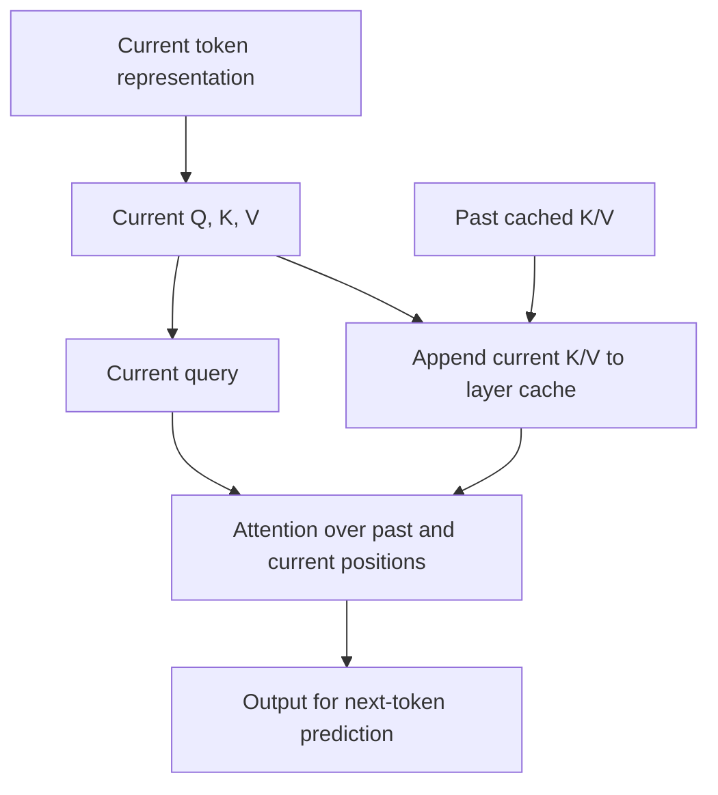
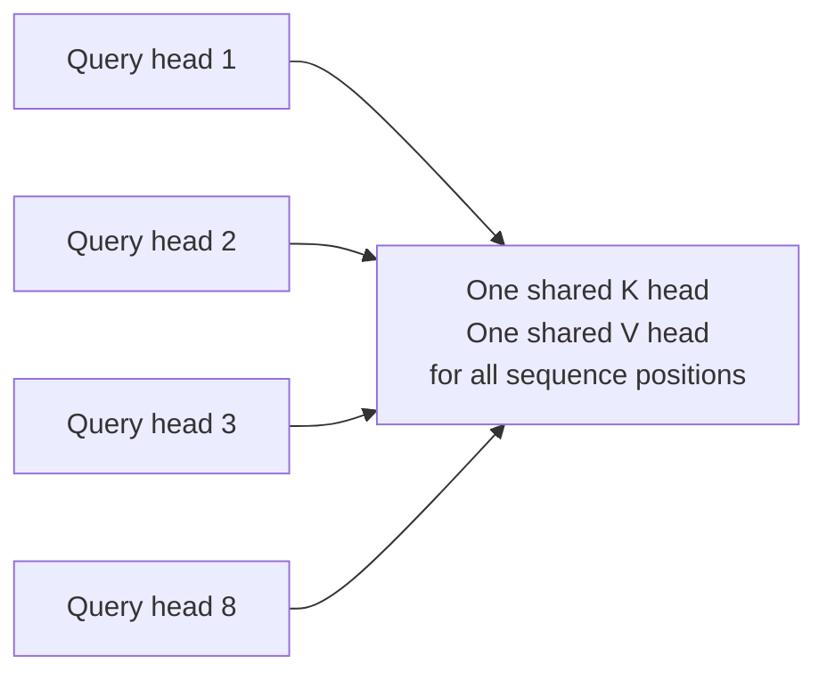

# ⚡ Class 20: KV Cache — Inference, Memory Math, and Multi-Query Attention
### 📋 Production AI / LLM Engineering | Krish Naik Academy

**🎙️ Mentor:** Sourangshu Pal (Paul)  
**⏱️ Duration:** ~3 hours 25 minutes (3hr 25min 10s) | **📅 Session:** Day 20 (3 October 2026)

**Class recording:** [3 Oct Kv cache](https://learn.krishnaikacademy.com/web/courses/6a16f8935e281281cd6b1128?chapter=6ac1d6e475542d6fe935b179)  
**Primary transcript:** `GMT20261003-143207_Recording.cutfile.20261004043252705.transcript.vtt`  
**Companions:** `KVCACHE.pdf`; [KV-cache and attention-variant repository](https://github.com/sourangshupal/kv-cache-attention-variants/tree/main); [KVCACHE-DEMO notebook](https://colab.research.google.com/drive/18O1pldhzzjxt802ysnom8X7mGu_vAlFR?usp=sharing); [MQA paper](https://arxiv.org/pdf/1911.02150).

---

## 📰 Quick Updates

- The class moved from the preceding fine-tuning work to inference engineering. Its main sequence was attention recap, naive decoding, prefill/decode, the memory wall, KV-cache sizing, MQA, and a cached-versus-uncached generation benchmark.
- The repository was added to the course Notion page. The instructor repaired links for earlier tokenizer resources and shared access information for newly joined participants.
- The first five teaching notebooks supply small calculations and attention wrappers. Their toy examples illustrate shapes and costs; they are not trained language models or production serving systems.
- The actual text-generation practical used SmolLM2-1.7B in Colab, with `use_cache=False` and `use_cache=True`.
- GQA and MLA were deferred to the following day. RoPE, PagedAttention, and a fuller prefix-caching discussion were named as later topics.
- A possible future cohort on scaling/inference was discussed as a plan, not an added requirement or a confirmed part of this class.

The notation below keeps **query-head count**, **KV-head count**, **per-head width**, and **total projection width** separate. The lecture sometimes used “heads” or “dimension” for more than one of these quantities; that distinction is essential for understanding MQA.

---

## 🧱 Attention Recap: What a Token Produces

The foundations notebook starts with a tiny vocabulary and a random embedding table. “The cat sat” becomes IDs `[0, 1, 2]` and three vectors of width 8. This is a hand-built word lookup, not BPE, WordPiece, or a tokenizer borrowed from GPT/BERT. The random vectors demonstrate indexing and shapes, not meaningful learned similarity.

Inside attention, representations are projected into:

- **Q, query:** what a position is looking for.
- **K, key:** the features against which queries are compared.
- **V, value:** information mixed into the attention output.

The correct operation order is:

**Attention(Q, K, V) = softmax(QKᵀ / √dₖ + mask) V**

Compute query/key scores, apply the relevant score mask, normalize across keys, then multiply the resulting weights by V. A masked score of negative infinity receives zero softmax weight. Ordinary elementwise multiplication by a zero/one mask is not interchangeable with this additive masking operation.

The source's small unmasked example is:

```python
scores = Q @ K.T / math.sqrt(d_k)
print("raw scores (3x3, one row per query token):\n", scores)

weights = torch.softmax(scores, dim=-1)
print("\nattention weights (each row sums to 1):\n", weights)
print("row sums:", weights.sum(dim=-1))

output = weights @ V
print("\noutput (3 tokens x d_k):\n", output)
```

This excerpt depends on the earlier imports and random Q/K/V tensors. It makes the score/softmax/value order visible without claiming that those random scores represent language understanding.

For causal self-attention, query position `i` can use positions `j ≤ i`. It cannot use future positions. Thus Q₀ may use K₀/V₀; Q₄ may use K₀/V₀ and K₄/V₄. The direction is **a query attending to keys/values**, not a key independently deciding to access another query.

The notebook's upper-triangular Boolean mask uses **True = blocked**. This convention belongs to that mask implementation; other APIs can use different Boolean meanings.

The lecture mentioned left padding for decoder-only batched generation. Left padding is common in that setting because generation continues from the last meaningful position, but **padding still needs an attention mask**. Causal masking and padding masking address different problems. Left padding does not make padding tokens harmless automatically. [Transformers text-generation guide](https://huggingface.co/docs/transformers/llm_tutorial).

---

## 🔁 Naive Autoregressive Decoding Repeats Prefix Work

Autoregressive decoding generates a continuation using the prompt plus already generated tokens. The simple greedy loop chooses the highest-scoring next token, appends it, and repeats.

Without a cache, the teaching implementation embeds and forwards the **whole prefix again**:

```python
    ids = prompt_ids
    for _ in range(max_new_tokens):
        x = embed(ids)  # recompute embeddings for the WHOLE sequence, every step
        hidden = model(x)  # recompute attention over the WHOLE sequence, every step
        next_id = lm_head(hidden[:, -1, :]).argmax(dim=-1, keepdim=True)
        ids = torch.cat([ids, next_id], dim=1)
    return ids
```

This is an excerpt inside `generate_naive` in `naive_decode.py`. The supplied attention block is a small pedagogical module; the initial foundations loop even uses an identity transform as a stand-in. Neither is a complete trained decoder with all normal Transformer components.

With a four-token prompt, the first five forwards process sequence lengths **4, 5, 6, 7, 8**. Each step repeats projections and attention for positions already handled.

The board illustrated this with a growing prefix beginning at BOS and continuing through “The capital of France is.” K and V for BOS and earlier words were repeatedly recalculated. A BOS token is meaningful input when the model's format uses it; it is not a substitute for padding. EOS is generally a stopping token, not something to append to an unfinished question merely to illustrate the next-token slot.

For a fixed prompt length P and N output-generation calls, the number of token positions processed by this naive loop is:

**P + (P+1) + … + (P+N−1) = NP + N(N−1)/2**

The class used **1+2+…+N = N(N+1)/2** as a simplified projection/repeated-position count: 8 gives 36, 32 gives 528, and 128 gives 8,256. That is quadratic growth, not exponential or logarithmic growth.

Be precise about what is counted. The notebook calls this “total attention work,” but its triangular sum is not a full FLOP count for dense attention. Recomputing every query against every key in each prefix has additional pairwise work. KV caching removes redundant **old-position processing**; it does not remove the need for the latest query to attend over history.

This was the motivation for caching: once a causal prefix has been processed under unchanged model settings, its past layer representations cannot depend on later tokens. Their projected K/V can be reused.

---

## 🧠 KV Cache: Store Past Keys and Values, Compute the New Position

A KV cache stores the attention **keys and values for processed positions**, usually separately for each layer.

At the next step:

1. Compute the current position's Q/K/V.
2. Append its K/V to the cached past K/V.
3. Compare the current query with the combined keys.
4. Mix the corresponding values.
5. Produce the representation used to predict the next token.

Old queries are not needed to answer a new position's query, so the ordinary cache stores K/V rather than the whole history of Q tensors or attention outputs. That does not mean Q is unimportant; the current Q drives the new attention calculation.

The per-layer data flow can be represented as:



The full source's MHA helper demonstrates the update:

```python
        if past_kv is not None:
            past_k, past_v = past_kv
            k = torch.cat([past_k, k], dim=2)
            v = torch.cat([past_v, v], dim=2)

        is_causal = past_kv is None  # single growing prompt: causal only on first pass
        out = torch.nn.functional.scaled_dot_product_attention(q, k, v, is_causal=is_causal)
        out = out.transpose(1, 2).reshape(x.shape[0], x.shape[1], -1)
        return self.out_proj(out), (k, v)
```

This is an excerpt inside the helper's `forward`, after Q/K/V projection and head splitting. The returned pair must be passed back into the next call.

A source limitation is worth preserving: **the cached path assumes one new token**. Disabling the causal mask is safe for that single latest query because all available keys are past/current. Passing multiple new tokens with a past cache would require an offset-aware mask within the new chunk. The helper does not implement that general case or padding masks.

Its repeated concatenation also copies/grows tensors. Production caches often use preallocated or paged storage; this simple source is a shape/behavior demonstration, not an optimized cache allocator.

The MHA notebook's example uses `d_model=32`, four heads, and per-head width 8:

| Stage | Input shape | Cached K shape |
|---|---|---|
| Five-token prefill | (1, 5, 32) | (1, 4, 5, 8) |
| One new token | (1, 1, 32) | (1, 4, 6, 8) |
| After five new-token steps | (1, 1, 32) for each step | (1, 4, 10, 8) |

V has the same layout in this example. A four-layer example stores a separate cache for every layer; all grow from three cached positions to five after two incremental steps.

Cached dense attention still reads/uses earlier keys and values. Per-step work for the latest query grows with history length, even though only one position's projections and feed-forward path are new. [Transformers' cache explanation](https://huggingface.co/docs/transformers/cache_explanation) documents per-layer reuse and the past-plus-current mask requirements.

---

## 📥 Prefill and Decode: Two Different Workloads

The supplied PDF divides inference into **prefill → decode → response**.

**Prefill** processes the prompt. Because the prompt is already known, its token positions can be processed together within each layer, while causal attention prevents future-position leakage. Layers remain dependent on earlier layers. Large prompts may be chunked by the serving implementation; “parallel” does not mean every token in every layer executes simultaneously.

Prefill builds the initial cache and computes logits from which the first continuation token can be selected. After that first token is chosen, it is fed back to compute the next one.

**Decode** continues the sequence. Ordinary autoregressive generation has a dependency between successive output tokens. Within a step, operations across heads, batches, and tensor dimensions can still run in parallel. Techniques such as speculative decoding can alter the execution schedule, but were not implemented here.

The board's flow becomes:


The instructor's analogy was reading a newspaper before writing a summary: processing the input and producing the answer have different workload shapes. A long prompt can make prefill expensive even when the answer is short. A short prompt with a long answer can make decoding dominate.

The cache contains processed **prompt and generated positions**, not just output tokens. At the instant generation stops, the very last sampled token may not have been forwarded again; cache accounting should use the number of positions actually processed.

The class concerns inference. During teacher-forced training, target tokens are known and causal computation can be parallelized across positions. Training still stores activations/intermediate values for differentiation; “nothing is saved during training” is not literally true. The persistent autoregressive cache discussed here is an inference mechanism, not a replacement for training activations.

---

## ⏱️ TTFT, TPOT, and Streaming

The session introduced three useful serving measurements:

| Metric | Meaning |
|---|---|
| TTFT | Time to first output token |
| TPOT | Time per subsequent output token, often summarized as an average |
| Tokens/second | Output rate; specify per request or aggregate throughput |

The two board scenarios were:

| Request | Prompt | Output | Likely dominant work |
|---|---:|---:|---|
| A | 10,000 tokens | 20 tokens | Prompt processing/prefill |
| B | 20 tokens | 10,000 tokens | Long sequential decode |

All else equal, A has more prompt work before the first token; B has many more continuation steps. These examples describe a workload tradeoff, not a measured latency guarantee.

TTFT includes more than prefill: queueing, routing/network time, scheduling, and model execution can contribute. TPOT varies with model, sequence length, batch, hardware, and serving policy. The class's approximate 20–30ms/token figures were illustrative observations; they are not universal constants.

Lower latency is desirable for both metrics. Paul emphasized the first visible response for an interactive product, but TTFT is not always more important than decode speed. A long report may be dominated by total completion time, whereas a brief conversational reply may make the initial delay more noticeable.

**Streaming** exposes generated tokens as they arrive. It lets users start reading earlier; it does not eliminate prefill or make the model compute every output token in parallel.

`max_new_tokens` controls an upper bound on continuation length. It differs from `top_k`/`top_p`, which guide token selection, and from the model/server's total supported context. EOS or other stopping criteria can end a response before that limit.

---

## 🚧 The Memory Wall: Fast Arithmetic Still Needs Data

Paul introduced the memory wall using a chef who can cook 100 dishes per second while the kitchen supplies ingredients for only 20. The chef's capability is not fully used because data supply is limiting.

The technical distinction is:

| Quantity | What it measures |
|---|---|
| Compute throughput | Arithmetic operations per second |
| Memory bandwidth | Bytes moved per second at a particular memory boundary |
| Memory capacity | How much data can be resident |
| Arithmetic intensity | Operations performed per byte accessed |

**FLOP** means a floating-point operation. **FLOPS** means operations per second. One **TFLOPS** is 10¹² floating-point operations/second; 1,000 TFLOPS is 10¹⁵, not 10⁹.

The board used hypothetical peak compute and a 2GB/s transfer rate, then compared more or fewer operations on the same amount of data. Its low/high arithmetic-intensity intuition is useful, but a large amount of free VRAM does not itself make arithmetic intensity high.

For example, 10 billion operations per decimal 1GB accessed gives about **10 operations/byte**. Increasing computation for the same traffic increases that ratio. To judge whether it is compute- or bandwidth-limited, compare it with the hardware's compute/bandwidth ratio and inspect actual execution.

**Memory bandwidth is not only CPU RAM → GPU transfer.** In GPU-resident inference, weights and cache can already be in device memory, while repeated movement from GPU memory toward its compute units still limits decoding. Host/device transfer is another boundary, with its own bandwidth.

Likewise, K/V projection normally executes on the device where the model's weights and tensors reside. In a GPU forward pass, Q/K/V are computed on the GPU; they are not necessarily computed on the CPU and copied into VRAM each token. The notebook's `.to(device)` establishes device placement.

MQA can reduce bytes read for cached K/V. It does not increase a GPU's physical bandwidth rating or peak FLOPS. The benefit is less traffic and a smaller persistent cache for the same query-head arrangement.

Software also matters: reuse, batching, tensor layout, kernel fusion, attention tiling, and cache allocation affect data movement/utilization. The live “software can do nothing” remark overstates the hardware limit. Hardware establishes ceilings; implementation determines how efficiently the workload approaches them. [NVIDIA's GPU performance guide](https://docs.nvidia.com/deeplearning/performance/dl-performance-gpu-background/index.html) explains arithmetic-intensity limits.

The lecture's 95% memory-use/5% headroom example was an operating heuristic. It is not a universal safe allocation and is not equivalent to 95% compute utilization. Model weights, cache, workspaces, temporary activations, framework reservations, and other processes all affect usable memory. Model weights do not universally occupy 40% of a GPU.

---

## 🧮 Deriving the KV-Cache Memory Formula

For ordinary full-attention caching with equal key/value head widths:

**Bytes per cached token = 2 × Hₖᵥ × dₕ × L × b**

**Total cache bytes = bytes/token × S × B**

Where:

| Symbol | Meaning |
|---|---|
| 2 | Store K and V |
| Hₖᵥ | Number of distinct cached KV heads per layer |
| dₕ | Width of one KV head |
| L | Number of relevant attention layers |
| b | Bytes per cached element |
| S | Number of cached sequence positions |
| B | Concurrent sequences for the equal-length example |

The cached-element precision matters. FP16 and BF16 use 2 bytes/element; FP32 uses 4; FP64 uses 8. These are **storage bytes per scalar**, not bytes per floating-point operation.

The PDF's hand calculation assumed **8 KV heads, width 64, 32 layers, FP16/BF16, batch 1**:

1. K: 8 × 64 = 512 scalar values per token per layer.
2. V: another 512 scalar values.
3. K+V: 1,024 values × 2 bytes = **2,048 bytes**, or 2KiB/token/layer.
4. Across 32 layers: **65,536 bytes**, or 64KiB/token.

The 32-layer choice is hypothetical; it is not the six-layer base model of the original Transformer paper. Width 64 comes from 512÷8 in the familiar teaching example.

The board wrote about 640MB for 10,000 tokens and 6.4GB for 100,000. Keeping binary and decimal units separate gives:

| Cached positions | Exact bytes | Decimal units | Binary units |
|---|---:|---:|---:|
| 1 | 65,536 | 65.536KB | 64KiB |
| 10,000 | 655,360,000 | 655.36MB | 625MiB |
| 100,000 | 6,553,600,000 | 6.5536GB | About 6.10GiB |

The approximate board values communicate scale, but should not be used as exact capacity calculations. **Cache grows linearly with S**, holding architecture, precision, and batch fixed. It does not grow exponentially.

FP32 doubles these values. A batch of ten equal-length sequences multiplies them by ten. With variable-length requests, sum their cached lengths; with paging/allocation granularity, rounding and metadata add overhead.

The companion's exact calculator returns:

```python
    per_token = 2 * num_kv_heads * head_dim * num_layers * dtype_bytes
    return per_token * seq_len * batch_size
```

This is the body of `kv_cache_bytes` in `memory_calc.py`. It estimates tensor payload under the stated assumptions, not total process VRAM. Weight memory, attention workspaces, allocator overhead, and temporary expanded tensors are additional.

The source's `human_bytes` divides by 1,024 while labeling results “KB/MB/GB.” Those output labels are binary quantities in these examples; the notes use KiB/MiB/GiB to avoid ambiguity.

---

## 📊 Model Configuration Matters More Than Parameter Count Alone

The repository supplies full-MHA examples at 4,096 cached positions, FP16, batch 1:

| Hypothetical configuration | Layers | KV heads | Head width | KV payload |
|---|---:|---:|---:|---:|
| 7B-ish | 32 | 32 | 128 | 2GiB |
| 13B-ish | 40 | 40 | 128 | 3.125GiB |
| 70B-ish full-MHA | 80 | 64 | 128 | 10GiB |

These are specified **teaching configurations**, not a guarantee of actual cache sizes for every model sold under those parameter labels. A real large model may use GQA or another representation, so its KV-head count must be read from the actual configuration.

Parameter count can grow through layer count, model width, feed-forward width, vocabulary size, experts, and other changes. It does not grow **only** by adding layers. Two models with the same total parameters can have different cache sizes.

The class looked for reducible factors in the formula:

- Sequence length and concurrency depend on the workload and serving limits.
- Layers and head dimensions are part of a fixed checkpoint's architecture.
- Cache precision may be reduced with a supported quantized-cache strategy.
- Distinct KV-head count can be reduced by an architecture designed to share K/V.

Paul postponed quantization to focus on attention-head sharing. That is this lesson's order, not a universal requirement that cache quantization must always be the last optimization.

Quantization and offloading can reduce memory but introduce their own tradeoffs. Cache precision need not be identical to weight precision; changing model-weight quantization does not automatically quantize its KV cache. Sliding-window or chunked layers also need different length accounting. [Transformers cache strategies](https://huggingface.co/docs/transformers/kv_cache) documents these variations.

---

## 🔗 MQA: Keep Query Heads, Share One KV Head

In MHA, each query head has its own projected key/value head. In **multi-query attention**, multiple query heads attend to **one shared K head and one shared V head** per layer.

The class's eight-head diagram becomes:



“One KV head” does not mean one vector for the entire prompt. It contains a K vector and V vector for **every cached position**, but eliminates the separate KV-head axis entries that MHA would keep for all query heads.

Use two counts:

| Architecture | Query heads Hq | KV heads Hkv |
|---|---:|---:|
| MHA | H | H |
| MQA | H | 1 |
| GQA, preview only | H | A compatible intermediate group count |

For `d_model=512`, Hq=8, and per-head width 64:

| Projection | MHA total width | MQA total width |
|---|---:|---:|
| Q | 8×64 = 512 | 8×64 = 512 |
| K | 8×64 = 512 | 1×64 = 64 |
| V | 8×64 = 512 | 1×64 = 64 |

**Per-query-head Q remains width 64**, not 512. The 512 is its total concatenated projection width. K still matches each query's dot-product width of 64. The aggregate K/V width shrinks by reducing the number of distinct KV heads, not by making an incompatible 512-dimensional query attend directly to a 64-dimensional key.

The paper/source keeps distinct learned K and V projections. Sharing them across query heads does not make **K identical to V**. Different Q projections can produce different attention distributions against the same keys; sharing K/V does not force identical attention patterns. Conversely, there is no mathematical guarantee that two heads can never coincidentally produce equal scores.

The current repository implements MQA as a one-group specialization of its shared attention helper. Its projections are:

```python
        self.q_proj = nn.Linear(d_model, num_heads * self.head_dim, bias=False)
        self.k_proj = nn.Linear(d_model, num_kv_groups * self.head_dim, bias=False)
        self.v_proj = nn.Linear(d_model, num_kv_groups * self.head_dim, bias=False)
        self.out_proj = nn.Linear(num_heads * self.head_dim, d_model, bias=False)
```

This is a constructor excerpt from the implementation used by the MQA wrapper, with `num_kv_groups=1`. It verifies today's MQA shapes; the general GQA lesson was deferred.

Its cache stays compact before the helper expands K/V for the attention calculation:

```python
        cached_kv = (k, v)  # this is what gets stored — num_kv_groups heads only
        k = k.repeat_interleave(self.group_size, dim=1)  # expand for attention math
        v = v.repeat_interleave(self.group_size, dim=1)
```

This excerpt explains persistent cache storage. `repeat_interleave` may materialize expanded tensors; a pedagogical expansion does not establish the same bandwidth efficiency as an optimized MQA-aware kernel.

The source shape comparison uses batch 1, sequence length 5, model width 32, Hq=4, dₕ=8:

- MHA cached K: **(1, 4, 5, 8)**.
- MQA cached K: **(1, 1, 5, 8)**.

V matches the corresponding shape. For fixed dₕ/L/S/B/precision, the KV payload reduction from MHA to MQA is **Hq-fold**: 8 query heads give 8×; 32 give 32×. This is not an H-fold reduction in total model memory or necessarily an H-fold speedup.

The notebook's “MQA cache size never changes when you change heads” exercise needs a qualifier. Its helper defines dₕ=`d_model/num_heads`; changing heads while holding d_model fixed also changes dₕ. MQA's payload is independent of Hq **only when per-head width and the other factors are held fixed**.

---

## ✍️ MQA Inference Reads Shared Values; Training Learns Shared Projections

Murtuza's open-floor question exposed a key confusion: if eight query heads share K/V, do they conflict while updating the same memory?

**During inference**, the shared K and V for a new position are computed once by the K/V projection paths, appended to the cache, and read by all query heads. The model is not training those weights on each request. Old cached values are not independently rewritten by Q₁, Q₄, or whichever head is selected.

The lecture briefly suggested that one query head could update the shared values first. A clearer implementation description is **one shared K projection and one shared V projection produce the values**. Query heads then consume them. No arbitrary query head owns the write.

**During training**, the shared projection parameters are learned through backpropagation. Gradient contributions from paths using those shared tensors are accumulated by the differentiation system. Sharing changes the architecture/parameterization; it does not preserve eight independently trained KV heads and merely erase seven at inference.

This connects to Arun's final question: an MHA checkpoint cannot become an MQA model by toggling `use_cache=True` or changing a tensor shape during generation. The checkpoint must have the appropriate architecture and learned weights, or undergo a deliberate conversion/adaptation procedure. Caching is an inference option; MQA is an attention design.

MQA reduces distinct KV subspaces, which can affect quality. The class called this lower attention diversity and clarified that “hallucination” is not the precise name for that architectural tradeoff. It also does not follow that every task becomes worse by a fixed percentage.

GQA was introduced as the next middle ground: several KV groups rather than one or a fully separate KV head for every query. Its implementation and results were left for the following class.

---

## 📚 What the MQA Paper Actually Shows

Paul opened Noam Shazeer's 2019 **Fast Transformer Decoding: One Write-Head is All You Need** and compared quality with inference benefit.

The paper's result tables report:

| Reported metric | MHA | MQA |
|---|---:|---:|
| Translation dev BLEU | 26.7 | 26.5 |
| Translation test BLEU, beam 1 | 27.7 | 27.5 |
| Translation test BLEU, beam 4 | 28.4 | 28.5 |
| Billion-Word dev perplexity | 29.9 | 30.2 |
| Amortized greedy decoder time, µs/output token | 46 | 3.8 |

These are the paper's task-specific experiments, not current chatbot accuracy or a universal quality drop. Its comparisons equalize total parameter counts by widening feed-forward layers. Timing uses TPUv2 and the stated workload; it is not individual-user latency on Colab. Higher BLEU and lower perplexity are preferable. [Original paper, results tables](https://arxiv.org/pdf/1911.02150).

The practical takeaway was a large decoding benefit with comparatively small quality changes in those experiments. The lecture's “1–2%” remark should not be generalized to every model or task.

Beam search keeps multiple candidate continuations; greedy decoding keeps the immediate highest-scoring choice. Sampling with top-k/top-p is another strategy. Beam search remains available for suitable tasks; it is not impossible or universally obsolete merely because many chat systems use sampling.

The paper's title uses **write-head**, referring to shared KV production; it does not remove the multiple query heads.

---

## 🧪 Colab Benchmark: Caching Faster Generation with the Same Model

The practical used **HuggingFaceTB/SmolLM2-1.7B**, a four-token prompt **“The red cat was”**, and greedy generation with up to 300 new tokens.

The source setup selects CUDA when available and otherwise CPU:

```python
MODEL_NAME = "HuggingFaceTB/SmolLM2-1.7B"

device = "cuda" if torch.cuda.is_available() else "cpu"

print("Device:", device)

tokenizer = AutoTokenizer.from_pretrained(MODEL_NAME)

model = AutoModelForCausalLM.from_pretrained(
    MODEL_NAME,
    torch_dtype=torch.float16 if device == "cuda" else torch.float32
).to(device)

model.eval()
```

This excerpt depends on the notebook's imports. The saved output reports CUDA, but does not record the exact GPU model. Paul recommended a Colab GPU such as T4; do not turn that recommendation into a verified hardware label for the stored results.

`model.eval()` sets inference behavior for modules such as dropout. It does not disable autograd by itself. The benchmark wraps generation in `torch.no_grad()` to avoid recording gradients. The saved notebook warns that `torch_dtype` is deprecated in its Transformers version in favor of `dtype`; preserve the original code when comparing the recording, then follow the installed version's supported keyword.

The timing helper performs one warm-up before three timed runs:

```python
def measure_generation_time(use_cache, runs=3, max_new_tokens=300):
    times = []

    # Warm-up run
    with torch.no_grad():
        _ = model.generate(
            **inputs,
            max_new_tokens=max_new_tokens,
            use_cache=use_cache,
            do_sample=False
        )

    if device == "cuda":
        torch.cuda.synchronize()

    # Actual benchmark
    for _ in range(runs):

        if device == "cuda":
            torch.cuda.synchronize()

        start_time = time.perf_counter()

        with torch.no_grad():
            output = model.generate(
                **inputs,
                max_new_tokens=max_new_tokens,
                use_cache=use_cache,
                do_sample=False
            )

        if device == "cuda":
            torch.cuda.synchronize()

        end_time = time.perf_counter()

        times.append(end_time - start_time)

    avg_time = sum(times) / len(times)

    return avg_time, output
```

This is the exact supplied helper. `inputs`, `model`, `device`, `torch`, and `time` come from setup. CUDA work can be asynchronous, so synchronization before/after timing waits for the relevant queued work rather than measuring only dispatch. [PyTorch synchronization reference](https://docs.pytorch.org/docs/2.14/generated/torch.cuda.synchronize.html).

The saved notebook reports:

| Saved benchmark | Time |
|---|---:|
| Cache disabled | 17.617 seconds |
| Cache enabled | 8.171 seconds |
| Time saved | 9.446 seconds |
| Reduction | 53.62% |
| Speedup | 2.16× |

The recording's rerun instead discussed about **15.773 seconds uncached**, about **8 seconds cached**, roughly **48.8% reduction**, and about **1.9× speedup**. These are different runs. “1.9” is a speed ratio, not minutes.

The stored generated texts match and contain repetitive prose. That demonstrates reuse-related speed improvement for this workload; it does not show that caching improved language quality or that MQA was benchmarked. The **same checkpoint's caching option** was changed; its attention architecture was not converted.

These timings include the complete generation call, not a separate TTFT/TPOT measurement. They exclude model download/loading and the warm-up. The helper averages three runs but does not report variance, exact GPU details, peak memory, or actual output-token counts. Because 300 is an upper bound, compare output lengths when reproducing the experiment.

Many supported decoder-generation configurations enable caching by default, but inspect the model/generation configuration rather than assert it for every Transformers model and mode. The demonstration explicitly set both values.

---

## 🗄️ Cache Lifetime, Prefix Reuse, and Conversation Memory

The late discussion repeatedly returned to “when should the cache be cleared?” Three different things must be separated:

| Mechanism | Stores/reuses |
|---|---|
| Active-generation KV cache | Intermediate attention state needed while continuing a sequence |
| Prefix/prompt computation cache | Reusable state for a matching prompt prefix across requests |
| Application response/history store | Text, messages, results, or other application data, potentially in Redis |

An active cache is tied to **specific model computation and token positions**. Another user's unrelated prompt cannot use those tensors as though they were generic memory. But matching prefixes can be reused by a serving engine that implements prefix caching.

Sridhar's example of a team querying the same codebase therefore has a real opportunity: place the same reusable content in a consistent prefix, process it once when supported, then handle different suffix questions separately. Reuse requires matching tokenization/prefix, compatible weights/settings, and correct handling of divergent continuations. A cache is not automatically invalid solely because the user identity changes; the engine's isolation and reuse policy determine the allowed sharing.

The lecture deferred this detail to PagedAttention/prefix caching. Current vLLM documentation explicitly describes sharing cached KV for matching prefixes. It primarily saves **prefill**, not the work of generating new answer tokens. [vLLM Automatic Prefix Caching](https://docs.vllm.ai/en/latest/features/automatic_prefix_caching/).

Likewise, there is no universal rule to clear all cache after 4, 10, 200, or 1,000 requests. Those numbers were illustrative policies. Serving systems manage active-request state, reuse candidates, allocation pressure, and eviction. Sequential independent `generate()` calls do not automatically retain every old KV tensor forever unless the application/runtime preserves that state. Reserved GPU memory also differs from live cached tensors.

The instructor said KV must stay on GPU and cannot return to CPU. That is too absolute: supported cache **offloading** can move state to CPU and prefetch it back, trading speed/traffic for GPU capacity. CPU inference can also use a cache. Quantized cache, offload, and paging are different strategies, not the same option.

Prasanna asked about “cached prompt tokens” in OpenRouter. Such API usage fields report provider prompt-cache reads/writes; they are not necessarily a report of GPU bytes allocated for that user's active cache. Prompt/prefix caching can reuse underlying model computation rather than merely retrieve a saved answer from Redis.

The class mentioned short TTLs. Lifetimes are provider-specific: for example, Anthropic documents 5-minute and 1-hour options. Do not infer that prompt cache is always shorter-lived than active KV state. [Anthropic prompt caching](https://platform.claude.com/docs/en/build-with-claude/prompt-caching), [OpenRouter cache usage](https://openrouter.ai/docs/guides/best-practices/prompt-caching).

This is a clarification of the questions, not a prefix-cache implementation completed during the session.

---

## 🏛️ Decoder-Only, Encoder–Decoder, and Context Limits

Gaurav asked whether caching explains why decoder-only models omit an encoder or cross-attention. It does not. **Model architecture and caching strategy are separate choices.**

A decoder-only LM processes its prompt and continuation through causal self-attention. It has no separate text encoder whose outputs must be read through standard encoder–decoder cross-attention.

An encoder–decoder system, such as T5-style sequence-to-sequence generation, processes source text with an encoder. Its decoder has:

- a causal self-attention cache for growing target positions;
- potentially cached cross-attention projections derived from the fixed encoder output.

Those cross-attention K/V are not simply the encoder's own self-attention K/V transferred unchanged. They are produced by the decoder's cross-attention projections over encoder hidden states. Caching does not remove the need for the cross-attention mechanism. [Transformers encoder–decoder cache explanation](https://huggingface.co/docs/transformers/kv_cache).

An ordinary bidirectional encoder cannot treat a growing text prefix's internal states as unchanged in the same way: newly added tokens can affect earlier representations. The relevant condition for simple append-only reuse is fixed past causal context, not merely “this model has Q/K/V somewhere.”

**Context capacity** also has several constraints. A server can configure a lower maximum than the model supports. Increasing a number in configuration does not prove that a model remains accurate or that its position scheme/runtime supports arbitrary lengths. Memory capacity is one limit, not the definition of the model's learned context behavior.

For an external API, the user can request an output limit within supported bounds; that does not enlarge the provider's context window. For a self-hosted checkpoint, adjust serving/model settings only with compatible position handling and validation. `max_new_tokens`, cache capacity, and total model context are related but different quantities.

---

## 🗺️ What's Next

The instructor planned to start the following session with **GQA**, then **MLA**, and possibly the RoPE position-encoding upgrade. PagedAttention and prefix-cache details were also named, with the exact sequence still tentative.

FlashAttention was mentioned as a future topic for data movement and attention efficiency. No FlashAttention tiling algorithm, PagedAttention allocator, GQA/MLA notebook, or production multi-user cache policy was implemented in this class.

---

## 💬 Live Q&A Highlights

All substantive open-floor questions and follow-ups from the last two transcript parts are included, along with distinct earlier chat clarifications. Caption-only names are identified cautiously.

| Question | Answer |
|---|---|
| **Sanjay: Will domain-specific LM work be covered?** | Paul said domain adaptation/fine-tuning would return in future work. Today's topic was inference and KV caching. |
| **Abhishek: Does top-k control how many tokens are generated?** | No. Top-k/top-p affect selection; `max_new_tokens` and stopping criteria control continuation length. |
| **Chat: Do BOS/EOS tokens have K/V? Should BOS be padding?** | Tokens actually processed by attention produce projections, including meaningful special tokens. Padding has a separate role and mask; EOS normally stops generation. |
| **Sudhi and Abhishek: Where is Q, and do later queries use old queries?** | Current Q is still computed. New positions attend to past/current K/V, so historical Q tensors are not the ordinary reusable cache. |
| **Chat: Can key position 4 access query 0?** | State the direction correctly: Q₄ may attend to K₀/V₀. Causal visibility is a query-to-key relation. |
| **Shridhar/Shiraz, as captioned: Why build TinyCausalAttention?** | It supplies a small causal-attention example to show repeated prefix processing. It is a teaching wrapper, not a trained model. |
| **Octavia, as read from chat: Why recalculate if tokens did not change?** | The naive loop reruns the full prefix because it carries no reusable state. Caching is the alternative; repeated work is not an unavoidable Transformer rule. |
| **Divankar: Why is the triangular count quadratic?** | Summing increasing processed lengths gives a quadratic total. It counts repeated token positions/projections, not all dense-attention FLOPs. |
| **Karthik: Why is decoding expensive for a short prompt?** | A long answer requires many dependent continuation steps. Cache reuse reduces repeated work but does not remove those dependencies. |
| **Chat: Why prioritize TTFT over TPOT?** | Paul emphasized initial user-visible delay. Both matter according to product workload; TTFT is strongly influenced by prefill but also queueing/scheduling/network. |
| **Chat: What if the GPU has no data to process?** | Available compute cannot help without the required data. Memory traffic can become the limiting factor even with GPU-resident tensors. |
| **Arun: What is a context window?** | The supported token context for the model/runtime. It differs from requested output length and cannot be enlarged arbitrarily without compatibility/quality checks. |
| **Kumar/Kumal: RAM versus VRAM?** | Host memory and device memory serve different locations. Ordinary host RAM is generally DRAM; it should not all be labeled SRAM. |
| **Shivam: Does context length depend on KV capacity?** | Available cache memory can limit served context/concurrency, but model/position/runtime limits also apply. |
| **Ayush: Can software improve KV-block storage/fetching and memory parallelism?** | The lecture stressed hardware, but software layout, scheduling, batching, and kernels also affect traffic and utilization. Hardware limits are real; “software can do nothing” is too strong. |
| **MP: Why is embedding dimension fixed?** | It is part of the checkpoint's model width. Individual vectors/hidden states differ by token and context; a fixed width does not imply identical values. |
| **Sridhar: Would a smaller summarizer before a long input reduce cost?** | It can reduce the later model's input length but adds its own work and possible information loss. Paul reiterated that processing a long source can raise TTFT; no comparative pipeline was tested. |
| **Viraj: Can KV be compressed?** | Yes, supported cache quantization/offloading strategies exist. They trade memory against latency, traffic, or quality and were not implemented here. |
| **Rushi: Does image generation have TTFT?** | The text-token metric does not directly describe every image-generation architecture. Time to first preview/image may be useful, but no image model was studied here. |
| **Ramdas: What exactly is a KV head?** | A distinct key/value projection head stored for each position. In MHA its count matches query heads; MQA shares one KV head across many queries. |
| **Rahul: Why is Q absent from the memory formula?** | That formula measures persistent K/V payload. Current Q still participates in attention, but old Q is not the normal cache state. |
| **Murtaza: Does cache expire by TTL?** | Active state and reusable prefix entries have different lifecycles. Free/evict state according to engine needs and capacity; there is no universal request-count or TTL rule. |
| **Ashwini/Acharya: Does sharing K/V reduce information richness?** | It reduces distinct KV subspaces and can affect quality. Keep multiple Q heads and measure task performance rather than equate the change with a fixed hallucination rate. |
| **Paritosh, in chat: Is the tradeoff hallucination?** | Paul corrected the term to attention diversity/representational capacity. Whether an output hallucinates requires separate task evaluation. |
| **BV/Neha and chat: How can 512-wide Q interact with 64-wide K/V?** | Q's aggregate width is 8×64. Each query head is width 64 and uses the shared width-64 K/V; outputs concatenate back to model width. |
| **Alok: Is a 32-head MHA→MQA reduction 32×?** | Yes for the KV tensor payload at matched per-head width/layers/length/precision. Total memory and speed do not necessarily shrink by 32×. |
| **Abhishek: How are shared Wk/Wv trained?** | Their parameterization changes; gradients through the shared tensors accumulate during training. Inference appends projected K/V without learning from each request. |
| **Devajoshi: Is cache size determined by model parameter volume?** | Use actual layers/KV heads/head width/precision and cached lengths. Parameter count alone is insufficient, and larger models need not grow only through depth. |
| **Saravana: Must cache remain on GPU?** | GPU-resident cache is common for fast inference, but supported CPU offloading and CPU inference exist. Moving state introduces a speed/memory tradeoff. |
| **Prasanna and Ramesh: When should we evict/offload users' caches?** | Inspect live lengths, concurrency, allocation pressure, and reuse policy. The examples of clearing after N requests were not a production algorithm. |
| **Ramesh: Is the 2019 MQA paper still useful?** | Yes, it motivates shared-KV decoding. Paul preferred studying the next GQA middle ground; no universal claim that MQA is unused today was established. |
| **Chat: How much quality degradation did MQA cause?** | The paper shows small task-specific differences, including dev BLEU 26.7→26.5 and a beam-4 test result slightly favoring MQA. There is no universal 1–2% penalty. |
| **Murtuza Saifee: Do eight query heads race while updating shared KV?** | At inference, shared projections compute K/V once per new position; query heads read them. They do not independently train or overwrite the same values. |
| **Murtuza Saifee: Does one selected query head perform the update?** | No arbitrary query head is responsible. The dedicated shared K/V projections write the new state; the distinction is inference computation versus training parameter updates. |
| **Sridhar K: Will cache help short input that produces a long website/code output?** | Reuse is useful during long continuation. Supported serving frameworks generally manage it; the benchmark explicitly disabled it for comparison. |
| **Sridhar K: Can a team's identical codebase prefix be shared across sessions?** | A serving engine can reuse matching prefix computation when configured. It is not necessary to dedicate an entire GPU permanently to every user; different suffixes still require their own continuation state. |
| **Sridhar K: Is another user's request overwriting my session cache?** | Engines must keep active sequences correct while freeing/evicting reusable state under policy. “New user means overwrite everything” is not a general cache design. |
| **Gaurav Garg: Why not reduce Q as well? Is Q the user's sentence?** | MQA specifically keeps query-head structure and changes KV sharing. Q is a learned projection of each token/layer representation, not the raw user sentence; other architecture changes require compatible shapes/training. |
| **Gaurav Garg: Should encoder and decoder be combined for richer output?** | Choose architecture for the task. Encoder–decoder systems already use both; cache reuse does not decide whether a separate encoder is needed. |
| **Gaurav Garg: Does KV cache replace cross-attention in GPT/T5?** | No. Decoder-only causal self-attention and encoder–decoder cross-attention are different structures. The latter can cache projections of fixed encoder output alongside target self-attention state. |
| **Gaurav Garg: Can unrelated requests keep using the same KV?** | Only compatible matching computation is reusable. Conversation text/response storage is a separate application mechanism; prefix-cache policy determines intermediate-state reuse. |
| **Gaurav Garg: Can max-new-token/context size be changed in ChatGPT?** | Output limits are adjustable only within the supported interface/bounds; they do not enlarge the provider's context. Self-hosted limits also need model/position/runtime compatibility. |
| **Paritosh Gupta: Is an HPC resource-estimation assistant a viable hackathon idea?** | Paul considered it possible: use formulas as a starting point, measure actual jobs, and produce practical configuration guidance. He did not validate the hackathon's criteria or a specific resource estimate. |
| **Paritosh Gupta: How should distillation/config experiments scale?** | Start with one bounded workload and GPU, inspect memory/runtime, then expand configurations and parallelism. Communication/efficiency must be measured; scaling is not guaranteed linear. |
| **Paritosh Gupta: Could starter scripts become a skill or MCP tool for cluster newcomers?** | Yes, expose measured configuration choices and launch/setup logic through such an interface. The class did not build the tool or establish whether cluster access would persist after the event. |
| **Paritosh Gupta: Which research direction might use the supercomputer?** | Paul suggested exploring scaling studies, including reinforcement-learning work, and refining the problem statement. This was an idea discussion, not a tested project plan. |
| **Prasanna Sivaneni: Are OpenRouter cached prompt tokens active KV or Redis response cache?** | They report provider prompt-cache usage. They are not a direct GPU-memory report and do not imply Redis stores the whole answer or user KV state. |
| **Prasanna Sivaneni: How does prefix caching relate to prefill?** | It reuses matching prompt-prefix computation, principally saving prefill. Paul deferred implementation details to the later PagedAttention discussion. |
| **Arun Subramanian: Must the model be trained/adapted for MQA before generation?** | Yes. MQA's shared projections are architectural; toggling cache or reshaping an ordinary MHA checkpoint at inference is insufficient. |

Ahmad was invited and an issue was said to be resolved, but no substantive audible question is preserved. Shivam was called repeatedly without a recorded spoken question. Their names are not used to invent missing exchanges.

---

## 🔑 Key Pointers to Remember

- Cache old K/V because a fixed causal prefix's representations do not change when later tokens arrive.
- Cached attention still attends over history; all decoding is not constant-cost.
- Prefill handles known prompt positions; ordinary output generation has successive-token dependencies.
- TTFT, TPOT, throughput, and complete generation time are different measurements.
- KV memory is a product of architecture, precision, cached lengths, and concurrency.
- Cache payload grows linearly with sequence length, holding the other factors fixed.
- Use exact bytes and distinguish MB/GB from MiB/GiB.
- MQA preserves multiple query heads and shares one KV head per layer/position.
- Total Q width and per-query-head width are different.
- K and V are separate projections, even when shared across query heads.
- No weight updates occur during ordinary inference; shared training gradients are a separate mechanism.
- MQA requires compatible learned architecture; `use_cache` does not convert MHA.
- Smaller cache reduces traffic/capacity pressure, not the hardware's bandwidth ceiling.
- Prompt-prefix reuse, active KV state, and conversation/response storage have different lifecycles.
- A measured cache speedup for one model/run is not a universal benchmark or an MQA quality result.

---

## ✅ Action Items After Class 20

- [ ] Reproduce the naive prefix-length trace for a four-token prompt and explain repeated work.
- [ ] Draw current-query attention over cached past K/V, with one cache per layer.
- [ ] Recalculate the 8-head/64-width/32-layer example in bytes, MiB, and decimal MB.
- [ ] Read a real checkpoint's KV-head count before using its parameter label in a memory estimate.
- [ ] Vary cached length, batch size, and precision separately and verify linear scaling.
- [ ] Draw MHA and MQA shapes, labeling Hq, Hkv, and per-head width.
- [ ] Explain why eight query heads can read one shared KV head without independent inference updates.
- [ ] Inspect the companion helper's single-new-token assumption and compact cache before expansion.
- [ ] Run the supplied Colab benchmark with a compatible environment; record model/version/device and actual output length.
- [ ] Compare both cache settings with the same prompt, decoding parameters, warm-up, and timing procedure.
- [ ] Report speedup and time reduction separately; do not interpret them as better language quality.
- [ ] Read the MQA paper's quality and timing tables with their task/hardware context.
- [ ] Distinguish active sequence state, shared-prefix reuse, and application conversation storage.
- [ ] Prepare questions on GQA, MLA, RoPE, and PagedAttention for the following session.

---

*📝 Notes compiled from the full Class 20 transcript, all twelve pages of `KVCACHE.pdf`, the complete supplied five-cell benchmark notebook, all cells/text outputs of the five matching teaching notebooks, and verified attention/memory helpers — “3 Oct Kv cache,” Production AI / LLM Engineering, Krish Naik Academy. Live timings, saved companion results, hypothetical configurations, and current documentation clarifications are identified separately.*

