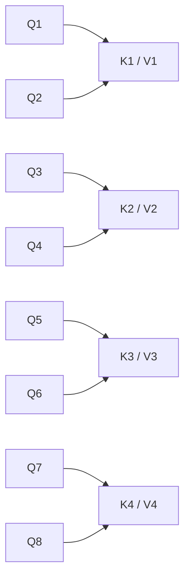
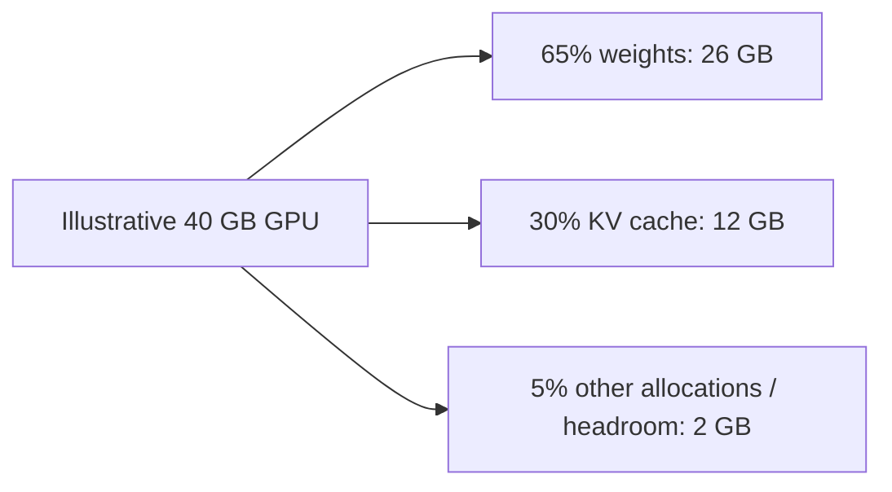
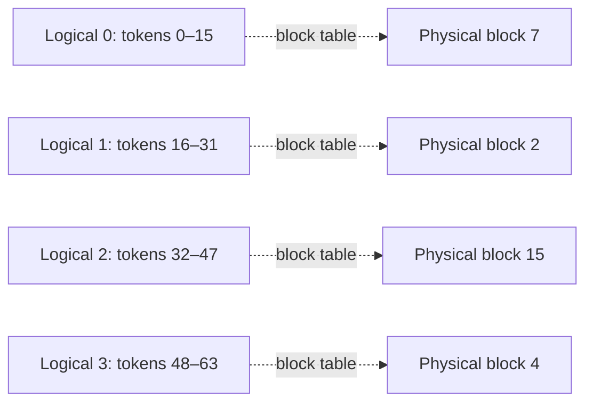
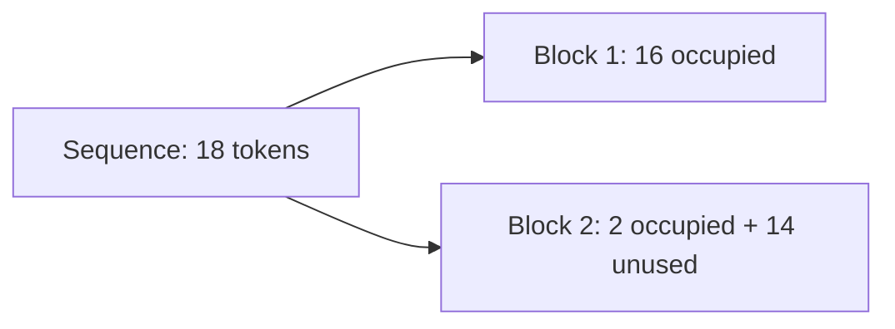
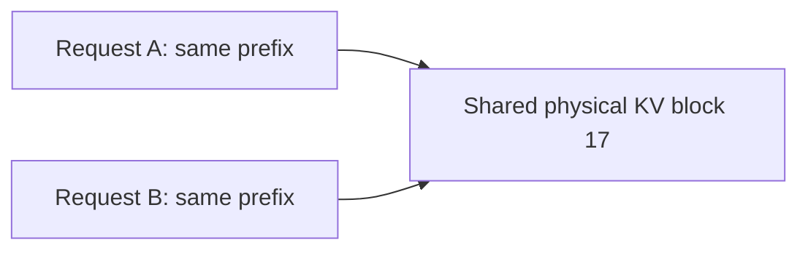
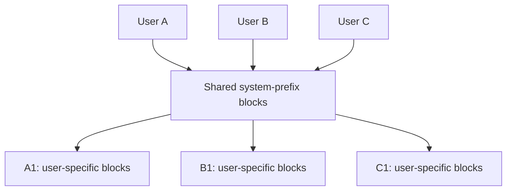
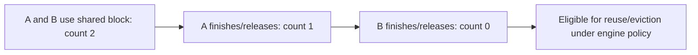
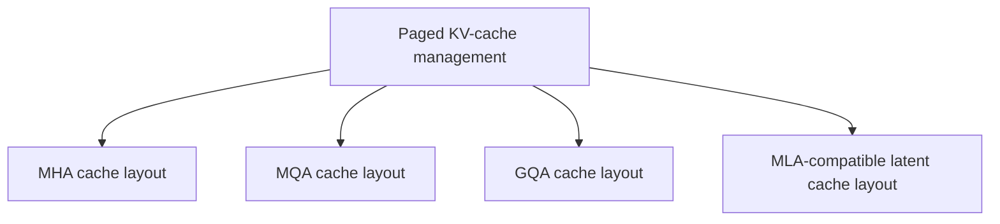
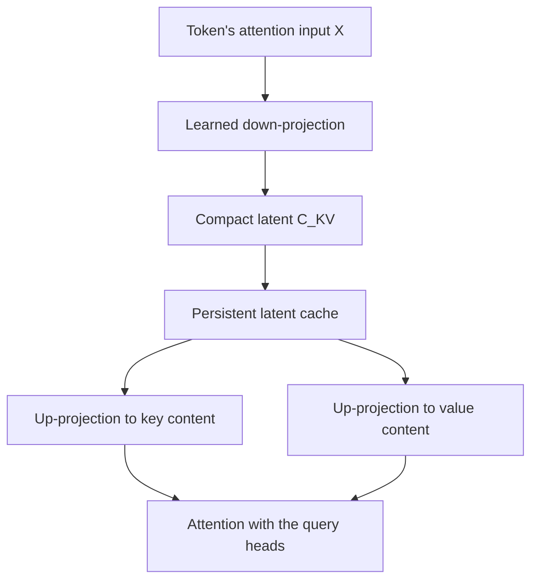

# 🧠 Class 21: Attention Variants — GQA, PagedAttention, and the MLA Introduction
### 📋 Production AI / LLM Engineering | Krish Naik Academy

**🎙️ Mentor:** Sourangshu Pal (Paul)  
**⏱️ Duration:** 2 hours 56 minutes 56 seconds | **📅 Session:** Class 21 — 4 October 2026  
**🔗 Recording:** [4 Oct Kv cache](https://learn.krishnaikacademy.com/web/courses/6a16f8935e281281cd6b1128?chapter=6ac32d52b2a6f8546fbbdc2f)

---

## 📰 Quick Updates

Paul asked students to review the previous session's KV cache, prefill/decode distinction, MHA, and MQA before continuing. The same [KV cache and attention variants repository](https://github.com/sourangshupal/kv-cache-attention-variants/tree/main) remained the practical companion.

The class actually covered **GQA**, **PagedAttention and prefix sharing**, and **MLA's low-rank projection idea**. RoPE was introduced as the next positional mechanism, but its mathematical treatment and the complete MLA/RoPE connection were explicitly deferred.

Paul discussed an upcoming travel period and a plan for another mentor to handle familiar RAG material. He also proposed introducing LoRA/QLoRA before the break where scheduling permitted. These were course plans rather than completed topics.

The accompanying **Attention Variants.pdf** has 23 whiteboard pages. The diagrams below follow its head-sharing groups, block mappings, shared-prefix branches, reference counter, and latent projection sketches.

---

## 🔁 Recap: Keep Query Heads, Reduce Cached Key/Value Heads

The starting point was the previous class's comparison of multi-head attention and multi-query attention. With eight attention heads in MHA, each query head has its own projected key and value head. MQA retains the eight query heads but shares one key/value head among them.

The goal is to reduce the persistent KV cache used during autoregressive generation. It is not to remove the query computations needed for the current token.

| Variant | Query heads in the example | Cached KV heads | Sharing |
|---|---:|---:|---|
| MHA | 8 | 8 | One KV head for each query head |
| MQA | 8 | 1 | All query heads share one KV head |
| GQA example | 8 | 4 | Two query heads share each KV head |

“KV head” means a corresponding key head and value head, not one combined scalar. In the class's standard example, each key and value head has width 64. The width remains compatible with the attention computation while the number of distinct cached projections changes.

Sharing keys does not make all query heads identical. Their query projections differ, so their attention scores can differ even when they attend over a shared key representation. Sharing values likewise does not imply that every query head produces the same weighted output.

Paul described the expressive tradeoff as attention diversity: fewer independent KV projections can constrain the representations available to the query heads. This is a model-design consideration. A 50% cache reduction does **not** establish a 50% loss of information or answer quality; quality is an empirical result measured after training and evaluation.

---

## 👥 GQA: Group the Queries Around Shared KV Heads

Grouped-query attention provides the middle ground. Divide query heads into groups, then give each group one key/value head.

The whiteboard's eight-head example forms four pairs:



This follows PDF page 2. Query-head count stays eight; the cache stores four independent KV heads. It therefore uses half the MHA cache under matched sequence length, head width, layer count, precision, and batch size.

GQA includes the two familiar extremes. If the number of KV heads equals the number of query heads, each group contains one query and the structure becomes MHA. If there is one KV head, the structure becomes MQA.

The class uses two related terms:

- **Number of groups / KV heads:** how many independent KV projections are stored.
- **Sharing ratio / group size:** how many query heads use one KV head.

For equal groups,

\[
\text{sharing ratio} = \frac{H_Q}{H_{KV}}.
\]

Do not confuse “four groups” with “four queries per group.” With eight query heads and four KV heads, the sharing ratio is two. With thirty-two query heads and eight KV heads, it is four.

The GQA paper motivates this compromise by seeking quality near MHA with inference efficiency near MQA. Its results are specific to the trained/uptrained models and tasks in the study; the architecture alone does not promise an identical quality result for every application. [Original GQA paper](https://arxiv.org/abs/2305.13245).

---

## 📐 Choosing Head Counts and Maintaining Compatible Shapes

Paul's illustrative design used hidden width 4096, thirty-two query heads, and per-head width 128:

\[
4096/32 = 128.
\]

His suggested starting point was four query heads per KV head, giving:

\[
H_{KV} = 32/4 = 8.
\]

He explicitly acknowledged that this is not a universally optimal ratio. Treat it as a starting experiment. The architecture, quality target, serving workload, and available memory determine which configurations are useful.

Equal grouping requires integer group sizes. If a hypothetical model had twenty-seven query heads, dividing by four would not work. A compatible choice could use nine KV heads with a sharing ratio of three, or another valid divisor. Odd head counts are not intrinsically forbidden; incompatible tensor shapes are the problem.

The companion GQA implementation makes the divisibility requirements explicit:

```python
assert d_model % num_heads == 0, "d_model must divide evenly by num_heads"
assert num_heads % num_kv_groups == 0, "num_heads must divide evenly by num_kv_groups"
self.num_heads = num_heads
self.num_kv_groups = num_kv_groups
self.head_dim = d_model // num_heads
self.group_size = num_heads // num_kv_groups
```

Its query projection creates all query heads, while its key and value projections create only the selected KV groups:

```python
self.q_proj = nn.Linear(d_model, num_heads * self.head_dim, bias=False)
self.k_proj = nn.Linear(d_model, num_kv_groups * self.head_dim, bias=False)
self.v_proj = nn.Linear(d_model, num_kv_groups * self.head_dim, bias=False)
```

These are exact companion-source excerpts, not code reconstructed from the spoken lecture.

Query and key widths must agree for their dot product. The teaching implementation also gives values the same per-head width; attention implementations can use a different value width if the output path handles it. The important distinction is the shape contract, not a blanket claim that every Q, K, and V dimension must always be identical.

---

## 🧮 Cache Fractions: Memory Retained Versus Memory Reduced

For MHA, MQA, and GQA with equal key/value head widths, the cache formula from the prior class is:

\[
M =
2 \times L \times H_{KV} \times d_h \times T \times B \times s,
\]

where \(L\) is layer count, \(H_{KV}\) is the number of stored KV heads, \(d_h\) is head width, \(T\) is cached sequence length, \(B\) is batch size, and \(s\) is bytes per stored element. The factor two accounts for separate K and V.

For unequal request lengths, sum their lengths rather than assuming that every request occupies the same \(T\). Shared prefix blocks can further change the physical storage count.

At matched settings, the GQA/MHA cache ratio is \(H_{KV}/H_Q\). The PDF's thirty-two-head table is therefore:

| Stored KV heads | Variant | MHA cache retained | Cache reduction |
|---:|---|---:|---:|
| 32 | MHA | 100% | 0% |
| 16 | GQA | 50% | 50% |
| 8 | GQA | 25% | 75% |
| 4 | GQA | 12.5% | 87.5% |
| 1 | MQA | 3.125% | 96.875% |

The board sometimes used “drop” while quoting the retained fraction. Keep the two columns distinct. In the earlier eight-head example, MQA retains **12.5%** and reduces the KV cache by **87.5%**.

These ratios are cache-storage ratios, not total-GPU-memory ratios. Model weights, temporary activations, kernels, scheduler overhead, and other allocations still exist.

The companion GQA notebook sweeps one, two, four, and eight groups at a fixed small model configuration. Its stored chart grows linearly with group count, and its table reports 64, 128, 256, and 512 binary kilobytes per layer. The example isolates cache arithmetic; it does not measure trained-model quality or production throughput.

---

## 🛠️ What the GQA Companion Actually Caches

The source constructs grouped K and V tensors and appends new tokens to their cached sequence dimension. It preserves the grouped cache before expanding it for the attention call:

```python
cached_kv = (k, v)  # this is what gets stored — num_kv_groups heads only
k = k.repeat_interleave(self.group_size, dim=1)  # expand for attention math
v = v.repeat_interleave(self.group_size, dim=1)
```

This answers a frequent conceptual doubt. The query computations still have the full query-head count, but persistent cached tensors have only the KV-group count. Repeating tensors for a teaching attention implementation is not the same as persistently storing that expanded representation.

Optimized kernels can handle grouped heads without materializing the same repeats in the same way. The class did not benchmark such a kernel; the source is useful for tracing shapes.

The notebook's boundary checks use separately initialized MHA/MQA/GQA modules. They check cached-head counts and shape compatibility. They do **not** establish numerical equality of outputs under different random weights.

Architectural selection also belongs to the checkpoint's design. Ordinary fine-tuning generally preserves its attention structure. However, Murtaza's question about converting MHA to GQA has a research-level exception: the original GQA work specifically describes conversion and additional uptraining from multi-head checkpoints. This is a deliberate weight transformation and training procedure, not a safe inference-time configuration toggle. [GQA conversion and uptraining](https://arxiv.org/abs/2305.13245).

---

## 🖥️ The GPU Budget: Weights, Cache, and Headroom

Uttam asked how to choose a sharing configuration in relation to memory. Paul used a 40 GB GPU with a hypothetical allocation of 65% for weights, 30% for KV cache, and 5% for other needs.



This reconstructs PDF page 5 while keeping the percentages illustrative. They are not standard percentages for every model or a general rule for GPU utilization.

Weights depend on parameter count, dtype, quantization, and placement. KV cache depends strongly on cached tokens, concurrent sequences, layers, head configuration, and cache precision. Temporary memory depends on the implementation and workload.

This is why serving concurrency matters. A model fitting comfortably by itself can run out of memory when many long requests accumulate caches. Conversely, reducing cache size may allow more requests without changing the weight allocation.

Paul connected this to the familiar **OOM, out-of-memory**, error and shape mismatch. Understanding both the memory budget and tensor shapes makes failures easier to diagnose.

The Q tensor also uses temporary device memory during attention. It usually is not retained as the growing historical cache used by later decode steps. “We cache only K/V” should not be interpreted as “Q needs no GPU allocation.”

The serving engine normally handles block management. Users configure compatible models, memory limits, maximum lengths, concurrency, and related serving settings. Knowing the mechanism helps justify those choices even when they do not manually write the allocator.

---

## 🏨 Why Large Contiguous Reservations Waste Memory

Paul moved from the size of one cache entry to how caches are allocated across requests. The motivating whiteboard has four requests with token-state counts of 2000, 500, 300, and 1000.

A naive strategy reserves enough space for the maximum supported length for each request. If the illustrative limit is 4096 cached token positions, four reservations create 16,384 slots while the listed states use 3,800.

| Request | Listed occupied token slots | Reservation under the example |
|---|---:|---:|
| A | 2000 | 4096 |
| B | 500 | 4096 |
| C | 300 | 4096 |
| D | 1000 | 4096 |
| Total | 3800 | 16,384 |

The arithmetic shows **12,584 unused reserved slots** in that snapshot. The exact waste depends on how the allocator works and whether reserved slots will later be used, but the motivation is clear: a worst-case reservation can block otherwise useful capacity.

Paul's hotel analogy was that reserving the whole hotel for one guest wastes rooms that other guests could use.

The final output length is not known in advance. A generation cap bounds it; it does not tell the allocator the exact eventual length. Also, a context limit usually constrains the prompt plus generated continuation, not just the number of output tokens. Maximum output length and total context length should not be used interchangeably.

The cache accumulates token states as generation proceeds. A long-lived request may grow, while other requests finish and release their allocations. This dynamic mixture is what makes serving memory management more demanding than allocating one fixed tensor.

---

## 🧩 Internal Fragmentation, External Fragmentation, and Capacity

The class distinguished two allocation problems.

**Internal fragmentation** is unused space inside an allocated region. Reserving sixteen slots for ten tokens leaves six allocated slots unused. With large worst-case reservations, the waste can be substantial.

**External fragmentation** is free space split into pieces that cannot satisfy a required contiguous allocation even when the total free space would be sufficient.

Paul illustrated a request finishing and leaving a small hole that cannot fit a larger new request. Clearing the old request does release memory; it does not make that one hole larger. With several suitable holes, a paged allocator can use them together.

The board also gives nine free units and a new request requiring ten. That particular arithmetic is **insufficient capacity**, not external fragmentation: even perfectly organized memory cannot supply ten units from nine.

This distinction clarifies the class's statement that paging cannot solve every memory failure. Fixed-size paging can eliminate external fragmentation in its managed block pool because any free block can serve the next logical block. It cannot create extra physical capacity. Tail-block internal waste and metadata overhead remain. [PagedAttention paper, memory-management method](https://arxiv.org/html/2309.06180v1).

If demand exceeds capacity, the server still needs a scheduling decision: queue, preempt, reduce the admitted batch, recompute later, or use another supported memory strategy. Those policies sit above the fact that logical cache blocks can be mapped to scattered physical blocks.

---

## 📄 PagedAttention: Preserve Logical Order, Scatter Physical Storage

PagedAttention divides a sequence's KV cache into fixed-size token blocks and maps those logical blocks to physical storage. The class used sixteen tokens per block:

| Logical block | Token positions |
|---:|---|
| 0 | 0–15 |
| 1 | 16–31 |
| 2 | 32–47 |
| 3 | 48–63 |

The logical order is consecutive. The physical block identifiers need not be consecutive or adjacent.

The PDF's block-table example maps logical blocks 0, 1, 2, and 3 to GPU blocks 7, 2, 15, and 4:



This follows PDF pages 8–9. The board later uses one-based key labels K1–K16 and K17–K32. Those labels describe the same sixteen-entry grouping with a different indexing convention.

The GPU attention kernel follows the table to access the needed keys and values. Physical scattering does not scramble token order or remove positional meaning. It changes how storage is located.

The illustrative identifiers are arbitrary examples of a mapping, not a claim that the allocator assigns blocks randomly without policy. A free-block pool and scheduler determine actual allocation.

The name “PagedAttention” combines memory layout with a kernel capable of attending over that layout. It is not a change from causal attention to a different semantic task. The class's architecture variants change the cached representation; paging changes how that representation is managed.

---

## 📦 Bounded Tail Waste: The Eighteen-Token Example

With a block size of sixteen and a sequence length of eighteen, the allocator needs two blocks:

- The first holds sixteen token states.
- The second holds two token states and has fourteen unused slots.



The figure mirrors PDF page 12. The remaining internal waste is in the partially filled final block rather than a huge worst-case reservation.

For block size \(b\) and a positive sequence length \(T\), allocated token capacity is:

\[
b\left\lceil T/b\right\rceil.
\]

Unused slots are that capacity minus \(T\), at most \(b-1\). In this example, the bound is fifteen slots per sequence, and the actual waste is fourteen.

The exact source notebook uses ceiling division for its allocation simulation:

```python
paged_total = sum(
    kv_cache_bytes(num_layers, num_kv_heads, head_dim, seq_len=-(-length // block_size) * block_size)
    for length in actual_lengths
)
```

Its stored results compare thirty-two random request lengths against a naive fixed-length reservation. They demonstrate the allocation arithmetic on CPU; they are not a live CUDA kernel or a production vLLM throughput benchmark.

Smaller blocks can reduce unused tail space but require more block-table entries and bookkeeping. Larger blocks reduce that bookkeeping while increasing possible tail waste. The useful choice depends on the engine and hardware implementation, rather than a universal requirement that every application use sixteen.

---

## 🔗 Prefix Sharing: Store a Common Beginning Once

The next problem was duplication. If two requests have the same prefix under the same relevant model configuration, independently storing that prefix's KV state wastes memory.

The PDF first shows users A and B with the same prompt. A block-sharing arrangement lets their logical tables point to one physical block, illustrated as block 17, rather than separate copies at blocks 17 and 25.



Paul then used a chatbot's shared system prompt. Each request begins with SP, followed by user-specific content. Cache the common beginning once, and diverge when the user content differs:



This reproduces PDF pages 13–15. The shared region can contain multiple blocks even though the sketch draws one box.

Prefix reuse saves recomputation of already available prompt states and can save physical storage. It does not mean reusing a previous complete answer. After requests diverge, their new token states require their own storage or an appropriate sharing mechanism.

Two continuations can produce different responses from the same prompt because of sampling and other generation settings. Reusing correct cached prefix states preserves the computation's context; it does not force identical generated text.

---

## #️⃣ Exact Prefixes, Block Hashes, and Partial Matches

Paul introduced block hashes as a way to identify reusable prefix states. A request can find an already computed block rather than treating every incoming prefix as new.

The important boundary is **an exact compatible prefix**, not semantic similarity between arbitrary passages. A repeated phrase in a different preceding context generally has different token states.

The current vLLM design hashes the block's exact token IDs together with the preceding prefix hash and relevant extra identity such as adapter or multimodal context. Its automatic prefix cache reuses full blocks. In the class's “fifty shared tokens” example with sixteen-token blocks, forty-eight tokens form three complete matching blocks; the remaining two do not form another full-block hit by themselves. [vLLM prefix-cache design](https://docs.vllm.ai/en/latest/design/prefix_caching/).

Hash lookup and logical-to-physical mapping are related but different jobs. Lookup finds a reusable cached prefix block. The block table tells an attention kernel where a request's logical blocks reside.

Paul used prefill sharing, prefix caching, and KV sharing while explaining this. The terms have connected meanings:

| Term | Focus |
|---|---|
| Prefill | Compute prompt-token states before generating the continuation |
| Prefix caching | Reuse previously computed states for a compatible common beginning |
| Physical block sharing | Let multiple logical sequences reference the same stored block |
| Block table | Map logical sequence blocks to physical cache locations |

Caching is an optimization with configuration boundaries. The class did not establish the internal clearing policy of any proprietary provider. Those policies should not be inferred from the lecture's illustrative request counts.

---

## 🔢 Reference Counts and Safe Reuse

Sharing storage requires tracking who still needs it. Paul returned to the two-user example and introduced a reference counter:



This reconstructs PDF pages 16–17. The counter tracks active references. It does not decrease merely because a token state was read once; a decoding request may need that prefix repeatedly until it releases its reference.

When A finishes, B's reference protects the block. Only when no active request needs it can the engine reclaim or evict it according to its policy.

Reference count zero and “the cache contents were erased immediately” are not always the same. An unused block may remain discoverable for prefix reuse until overwritten or evicted. The current vLLM design uses a free-block queue with LRU-style eviction of eligible cached blocks. [vLLM free and eviction operations](https://docs.vllm.ai/en/latest/design/prefix_caching/).

Paul's suggestions about clearing after hundreds of requests or high utilization were intuitive capacity-management examples. They are not a standard requirement to delete the entire cache after a fixed count. Clearing actively referenced blocks would invalidate requests; the engine coordinates allocation, release, and eviction.

If cached states have been removed, a later request needs recomputation. This explains the tradeoff between retaining useful prefixes and leaving capacity for new work. Traffic patterns matter, but raw GPU utilization alone does not specify which cache blocks are safe or useful to evict.

---

## 🧭 The Four Optimizations Work on Different Axes

Before moving to MLA, Paul repeatedly distinguished representation changes from cache management.

| Mechanism | Main question |
|---|---|
| MQA/GQA | How many independent KV heads should be stored? |
| MLA | Can a smaller learned latent represent the needed KV content? |
| PagedAttention | How should growing sequences occupy physical cache blocks? |
| Prefix caching | Which already computed common-prefix blocks can be reused? |

These mechanisms can be combined when the model and serving implementation support the combination. A grouped or latent representation can still be stored in pages.

PDF page 23 shows paging branching to MHA, MQA, GQA, and MLA. A faithful translation is:



The diagram states compatibility at the conceptual level. An actual engine needs kernels and cache-management support for each layout; it is not a promise that any arbitrary model class can be switched into any engine unchanged.

Paging also does not remove the decode dependency on previously generated tokens. Storage can be scattered while the autoregressive generation process still advances in dependency order. Physical noncontiguity should not be confused with generating a sequence's future tokens independently.

---

## 🗜️ MLA: Change the Stored Representation

Multi-head latent attention, introduced in the DeepSeek-V2 family, takes a different route from sharing whole KV heads. It creates a compact latent representation of the token's attention input and uses that to produce the needed key/value content.

Paul called the latent \(\mathbf{c}^{KV}\). “Latent” means an internal representation rather than something directly observed in the original input. It need not always mean a higher-dimensional vector; here its purpose is lower-dimensional storage.

The central workflow on the board is input X → projection/compression → latent C → cache C → expand for attention:



This follows PDF pages 19–22. The expansion diagram explains the mathematical relationship; it is not a requirement to keep every expanded key/value tensor permanently in the cache.

The class initially used language suggesting that all full KV heads were computed and then compressed. Murtaza and Ramendra revisited this, and Paul clarified the actual intended flow: **apply the smaller projection directly to the attention input**, rather than first constructing the complete KV cache and compressing it afterward.

The companion module reflects that direct projection:

```python
self.kv_down_proj = nn.Linear(d_model, latent_dim, bias=False)
self.k_up_proj = nn.Linear(latent_dim, num_heads * self.head_dim, bias=False)
self.v_up_proj = nn.Linear(latent_dim, num_heads * self.head_dim, bias=False)
```

These are learned architecture parameters. The latent width is a design choice trained with the model; it is not a generic zip-style compression setting applied to an arbitrary pretrained cache.

---

## 🧱 What “Compression and Expansion” Mean Mathematically

Paul illustrated an eight-number vector projected to three numbers by a smaller matrix. This is a dimensionality-reducing linear map.

In the row-vector convention used by the sketches, the relationships can be written as:

\[
\mathbf{c}^{KV} = \mathbf{x}W^{DKV}, \qquad
\mathbf{k}^{C} = \mathbf{c}^{KV}W^{UK}, \qquad
\mathbf{v}^{C} = \mathbf{c}^{KV}W^{UV}.
\]

The transposed column-vector convention in a paper expresses the same shape relationship. The essential point is matching matrix dimensions.

A lower-rank projection generally cannot reconstruct every arbitrary original vector exactly. The expansion produces the model's learned key/value content; it should not be described as universal lossless recovery of an unrelated MHA cache. Quality depends on the trained architecture and its evaluation.

Debajyoti's closing question led Paul to restate “compression” as a smaller learned **projection**. Anirudh's SVD comparison was accepted only as an intuition for lower-rank representation, not as the actual algorithm used in this module.

The source's forward path shows the compact value being produced directly:

```python
latent = self.kv_down_proj(x)  # (batch, seq, latent_dim)
k_rope = self.k_rope_proj(x)  # (batch, seq, rope_head_dim) — shared across heads
```

It later derives content K and V with the up-projections. A standard attention calculation can expand keys to match the query width. An optimized implementation can transform the computation so it operates with the latent and compatible projected queries instead.

DeepSeek-V2 specifically describes absorbing content-key and value up-projections into other projections during inference. It also compresses queries to reduce training activation memory, although query compression does not itself shrink the persistent KV cache. Thus the lecture's “Q remains” is best read as preserving query heads and their role, not as a universal rule that MLA never has a query bottleneck. [DeepSeek-V2 attention equations](https://arxiv.org/html/2405.04434v5).

---

## 📉 The MLA Memory Example and Its Limits

The whiteboard compares an eight-head configuration with width 64:

| Representation | Per-token, per-layer values in the simplified example |
|---|---:|
| MHA: \(8 \times 64\) keys + \(8 \times 64\) values | 1024 |
| GQA: \(4 \times 64\) keys + \(4 \times 64\) values | 512 |
| MQA: \(1 \times 64\) keys + \(1 \times 64\) values | 128 |
| Illustrative joint MLA latent, width 64 | 64 |

Paul explicitly used 64 as an **illustrative latent dimension**. Earlier he also mentioned 128. Those numbers should not be mistaken for the exact production DeepSeek model configuration.

The example highlights the removal of a separate K-plus-V storage term in the joint latent. It does not prove that every MLA implementation must have a smaller cache than every possible MQA model.

Real MLA must account for its positional component as well. The DeepSeek-V3 report specifies a KV latent width of 512 and a separate rotary key width of 64. A complete cache estimate includes both, with the appropriate layer count and element size. [DeepSeek-V3 configuration](https://arxiv.org/html/2412.19437v2).

There is a practical companion-source gotcha: the generic `kv_cache_bytes` helper includes a factor two for separate K and V. The MLA notebook passes a **joint latent-plus-rotary width** into that same helper, doubling what those two stored tensors represent. For its toy widths 8+8, length 4096, one layer, batch one, and two-byte elements, those stored tensors occupy 131,072 bytes, or 128 KiB, rather than the printed 256 KiB.

The notes leave the supplied code intact and state the counting issue. For a joint latent cache, count the actual stored tensors; do not automatically reuse the standard two-cache formula.

Paul emphasized good research performance as motivation for MLA. Strong benchmark results support the architectural idea, but a learned bottleneck still carries a task-dependent tradeoff. “No performance loss” is not a universal guarantee.

---

## 🌀 RoPE Was a Preview, and the MLA Story Is Still Incomplete

Near the close, Paul contrasted additive positional encoding at the embedding stage with injecting positional information into attention. RoPE rotates query/key representations according to position so their attention interaction can express relative position. It is not the ordinary addition of a positional vector to token embeddings. [RoFormer paper](https://arxiv.org/abs/2104.09864).

The detailed rotations, sine/cosine calculations, and the complete MLA connection were deferred. The class's final statement was explicit: **MLA was not yet complete**.

The companion source already has a small separate rotary-key cache alongside the latent, but that implementation goes beyond the day's simplified diagram. It prepares the next discussion rather than proving that the full derivation was taught here.

The open issue is how position-dependent transformations interact with low-rank content projections. The next class was to connect the relevant paper equations and explain the decoupled positional path.

Students were encouraged to review basic matrix multiplication, projection shapes, sine/cosine values, and rotation before that session. The full RoPE notebook was available for preparation; its context-extension strategies should not be counted as topics completed in this class.

---

## 🏭 Managed Deployment and Self-Hosted Serving

Mangesh's final exchange connected the theory to a voice application deployed through Azure Machine Learning. He had used a Hugging Face model on managed GPU compute and wondered why the overall deployment process felt similar to other application deployments.

Paul's useful clarification was that managed infrastructure hides some serving decisions. Selecting compute still implies model placement, available memory, cache capacity, and cost, even when the service configures many details.

Self-hosting exposes more of those choices. A team may need to justify the weight footprint, expected concurrent token load, cache budget, memory headroom, and serving engine. Knowing which optimization changes each term helps explain why a particular accelerator configuration is needed.

MLOps and DevOps overlap in packaging, deployment, observability, and automation. The relevant difference here is the model-serving workload and its hardware/runtime requirements, not a categorical rule that all machine learning is CPU-only or all deep learning must run on a GPU.

Managed versus self-hosted cost also depends on utilization, scale, staffing, operations, and the chosen hardware. The class did not calculate a universal break-even point. Its practical lesson was to understand the decisions behind a managed interface rather than assume they disappear.

---

## 🗺️ What's Next

Paul planned to finish the **MLA and RoPE connection**, including a concrete projection example and relevant paper equations. He also named FlashAttention, PyTorch SDPA, and scaling laws as remaining topics.

LoRA/QLoRA and other fine-tuning variants were upcoming work. RAG versus fine-tuning, mixture of experts, knowledge distillation, and speculative decoding belonged to later modules or plans.

Other attention families were mentioned as directions to explore after the foundations. They were not derived or implemented today.

---

## 💬 Live Q&A Highlights

| Question | Answer |
|---|---|
| **In-flow discussion:** Does GQA change query-head count? | In the class examples it keeps the query heads and reduces distinct cached KV heads through grouping. |
| **In-flow discussion:** Is a 50% cache reduction also 50% quality loss? | No. Cache size is arithmetic; model quality requires evaluation after training. |
| **In-flow discussion:** How should KV-group count be chosen? | Paul suggested a sharing ratio of four as a starting point, while explicitly acknowledging that it is not universally optimal. |
| **In-flow discussion:** What if the head count is not divisible by four? | Choose a compatible integer grouping. The source requires query heads to divide evenly by KV groups. |
| **Uttam, relayed:** Should memory availability or performance determine the ratio? | Consider both the serving memory budget and measured quality. The 40 GB allocation was an illustrative budgeting exercise. |
| **Gaurav, relayed:** Is 65% for weights a standard rule? | No. It was the class's example; the actual fraction depends on model size, precision, placement, and other allocations. |
| **Murtaza, relayed:** Can an MHA checkpoint become GQA during fine-tuning? | Ordinary fine-tuning preserves architecture, but dedicated conversion/uptraining procedures exist in the GQA research. It is not a drop-in serving toggle. |
| **Prahlad, relayed:** What is OOM? | Out of memory: a requested allocation exceeds what the runtime can provide. |
| **Yogesh, relayed:** Can output token count be controlled? | A generation cap can be set, subject to the model and total context constraints. It does not reveal the exact eventual length. |
| **Abhishek / Dilshan, relayed:** Why cannot cleared memory immediately fit the next larger request? | A small freed contiguous region may be too small. Paging can combine suitable free blocks; it cannot overcome insufficient total capacity. |
| **Pooja Satish, relayed:** Why do logical and GPU block numbers differ? | They are linked by a block table. Logical order need not equal physical identifiers or placement. |
| **Rajeswari / Aishwarya, relayed:** Are block placements random? | The sketch used arbitrary IDs to show noncontiguity. Actual allocation follows the engine's pool and scheduling policy. |
| **Vivek, relayed:** Must users program hardware block allocation themselves? | Serving engines manage it. Users configure compatible models and practical serving/memory limits. |
| **In-flow discussion:** Does Q need device memory even though it is not cached? | Yes, for current computations. It generally is not retained as the growing historical KV cache. |
| **Uttam, relayed:** Can LRU help manage cached blocks? | Eligible unused prefix blocks can be managed with eviction policies; current vLLM documents an LRU-style free-queue policy. |
| **Swati, relayed:** Can two requests use one physical KV block? | Yes, for a compatible shared prefix, with reference tracking protecting actively used storage. |
| **Swati / Prithvi / Vivek, relayed:** What similarity is required for prefix sharing? | Exact compatible token prefixes, not approximate semantic similarity. The current full-block policy reuses completed matching blocks. |
| **Bhaskar / Yogesh, relayed:** What if the cached prefix was already cleared? | Recompute it. If another request still references a block, the engine must preserve it until that reference is released. |
| **Subhash, relayed:** Why not keep a system-prompt cache forever? | Retention competes with other memory needs. Eviction should follow engine policy and reuse value, rather than a mandatory fixed request count. |
| **Prasan, relayed:** Is a common 2K-token system prompt stored once for concurrent chats? | Matching shareable prefix blocks can be stored once and referenced by multiple requests, subject to configuration and block boundaries. |
| **In-flow discussion:** Does sharing a prompt cache force the same generated answer? | No. It reuses input states; continuation generation can differ with sampling. |
| **Aishwarya, relayed:** Do hosted providers use exactly this clearing policy? | Their complete serving strategies were not established in class. Do not assume the lecture's examples describe a provider's internal policy. |
| **Ankit, relayed:** Does MLA add repeated compression stages? | The illustrated attention layer has a down-projection and corresponding content projections. A multi-layer model repeats its architecture across layers; the class did not propose arbitrary extra compression stages. |
| **Gaurav / Yogesh, relayed:** Does expansion remove the memory benefit or reduce quality? | Keep the compact persistent cache separate from temporary computation. Optimized implementations can absorb projections; quality is empirical, not guaranteed by dimensionality alone. |
| **Bhaskar, relayed:** Can paging be combined with MLA? | Conceptually yes. The actual serving engine must support the latent layout and corresponding attention kernels. |
| **Mangesh / Vivek, relayed:** Do all query heads use the same latent? | They share the token's cached latent, while learned projections provide the per-head content used by attention. |
| **Sai, relayed:** Where is RoPE applied? | The preview placed positional transformations on query/key attention representations. Detailed equations were deferred. |
| **Murtaza, relayed:** Does MLA first compute all full KV heads and then compress them? | Paul corrected that interpretation: the compact projection is applied directly to the attention input. |
| **Ramendra Tyagi:** Is MLA compression taken from all already-created KV heads? | His audio was unclear, then he repeated the question in chat. Paul clarified the direct-input projection rather than post-processing a full KV cache. |
| **Ramendra Tyagi:** Can KV cache be quantized? | Yes, cache values can use lower-precision storage in compatible implementations. Precision, scaling, kernel support, and quality must be evaluated. |
| **Debajyoti Mukhopadhyay:** What does compression mean, and what should I read? | It means a learned projection to a smaller representation. Paul pointed to DeepSeek papers and deferred a worked matrix example to the next class. |
| **Anirudh, relayed:** Is this SVD? | SVD provides a lower-rank intuition, but the companion implementation uses learned projection matrices rather than an SVD step. |
| **Alok, relayed:** Is the prefill→cache→decode→new-token→new-KV sequence correct? | Yes. New token states extend the cache during decoding; the layout depends on the model and serving engine. |
| **MANGESH KHANDARE:** Why did managed Azure model deployment resemble ordinary application deployment? | Managed compute hides some infrastructure decisions. Model-serving memory, hardware, and runtime choices still exist underneath. |
| **MANGESH KHANDARE:** What changes when self-hosting the model? | More responsibility for capacity, serving configuration, monitoring, and operational cost becomes visible. The class did not establish that self-hosting is always cheaper. |

---

## 🔑 Key Pointers to Remember

- GQA changes KV sharing while preserving the query-head role in the illustrated architecture.
- Distinct query heads can produce distinct attention patterns over shared keys.
- Sharing ratio is query-head count divided by KV-head count.
- The ratio of four was a design starting point, not a universal law.
- Memory retained and memory reduced are complementary percentages.
- Eight-head MQA retains 12.5% of matched MHA cache; thirty-two-head MQA retains 3.125%.
- Cache reduction is not a measured percentage of information or quality loss.
- Persistent KV cache and temporary query memory are different allocations.
- A model fitting by itself does not establish serving capacity under concurrent long requests.
- Total context length includes the prompt and continuation.
- Paging preserves logical order while allowing noncontiguous physical blocks.
- Internal tail waste is bounded by fewer than one block per sequence.
- Insufficient total capacity is different from external fragmentation.
- Prefix reuse requires compatible exact prefixes and relevant model identity.
- Hash lookup finds reusable blocks; block tables map logical locations.
- Reference counters protect active users of a shared block.
- Counter zero can make storage eligible for reuse without requiring immediate erasure.
- Prefix caching reuses prompt states, not a cached final response.
- MLA uses a learned low-rank projection directly from the attention input.
- Latent expansion is not universal lossless reconstruction of arbitrary original vectors.
- Count MLA's actual latent and positional tensors rather than blindly multiplying a joint width by two.
- Paging and latent/head-sharing mechanisms operate on different axes.
- RoPE's full derivation and the complete MLA integration remained next-class work.

---

## ✅ Action Items After Class 21

- [ ] Draw the eight-query/four-KV grouping and label every shared head.
- [ ] Recalculate the thirty-two-head retained/reduced table without interchanging its percentages.
- [ ] Inspect the GQA source's divisibility checks and grouped cached tensor shapes.
- [ ] Separate persistent weights/cache from transient allocations in a serving-memory estimate.
- [ ] Reproduce the four-request reservation example using total cached token lengths.
- [ ] Explain internal fragmentation, external fragmentation, and capacity exhaustion with different examples.
- [ ] Trace logical token blocks through the PDF's physical mapping 7, 2, 15, 4.
- [ ] Calculate allocated capacity and unused slots for eighteen tokens with block size sixteen.
- [ ] Explore the companion paging simulation without interpreting it as a CUDA throughput benchmark.
- [ ] Draw the common system-prefix branch and its separate user continuations.
- [ ] Check exact-token/full-block reuse rules in the serving engine being used.
- [ ] Walk through the reference count from two active requests to one and then zero.
- [ ] Inspect the MLA source's direct down-projection and actual cached tuple.
- [ ] Verify MLA memory from stored tensor dimensions, including its positional component.
- [ ] Review projection shapes and basic rotations before the remaining RoPE/MLA discussion.

---

*📝 Notes compiled from the full Class 21 transcript — “4 Oct Kv cache,” Production AI / LLM Engineering, Krish Naik Academy. Original transcript: “GMT20261004-143211_Recording.cutfile.20261005045357448.transcript.vtt.” All 23 pages of “Attention Variants.pdf” were visually reviewed. Companion sources: [kv-cache-attention-variants](https://github.com/sourangshupal/kv-cache-attention-variants/tree/main), including the GQA, MLA, RoPE, and PagedAttention notebooks and the relevant attention/memory modules. Exact code excerpts are companion-source supplements; no production serving benchmark was run while preparing these notes. RoPE and full MLA implementation details are identified as deferred material.*
