# 📚 Production AI / LLM Engineering — Course Notes

**Provider:** Krish Naik Academy
**Course:** Advanced Route — Production AI Engineering, Research to Production: LLMs, RAG & Agents, GenAIOps
**Available live recordings:** 19 July–4 October 2026 · 21 classes · 80 hours 6 minutes (dashboard total)
**Notes completed:** 21 of 21 classes · 932 live Q&A entries · 85 diagrams

[Course dashboard](https://learn.krishnaikacademy.com/web/courses/details/6a16f8935e281281cd6b1128) · [Instructor resource hub](https://krishnaikacademy.notion.site/Production-AI-Engineering-3a8eba9593d080d7b876e8ced7d541f1)

Each completed class file follows the class-notes-generator format: explanations in teaching order, supplied examples, relevant diagrams, live Q&A, key pointers, upcoming topics, and a practice checklist. Full transcripts and substantive closing question sessions are the primary sources. Class-matching instructor PDFs, notebooks, and repositories supply diagrams and verified code. Official documentation and research qualify technical claims where needed.

This set covers the live recordings currently posted through 4 October. The induction describes a broader future roadmap; it does not mean every planned RAG, agent, or operations module has already been taught. Session announcements and product examples retain their historical context. Code excerpts are identified by their supplied source; partial methods and illustrative snippets are described as such.

Read the notes in class order, then use each class’s key pointers and action checklist for revision. The live Q&A tables preserve substantive follow-ups and merge repeated questions.

## Classes in this book

- [Class 01: Induction and the Research-to-Production Roadmap](#class-01)
- [Class 02: Software Setup and the Engineering Workflow](#class-02)
- [Class 03: PyTorch Fundamentals — From Data to a Trained Model](#class-03)
- [Class 04: Transformers 101, Part 1 — Embeddings, Context, and Self-Attention Intuition](#class-04)
- [Class 05: Transformers 101, Part 2 — Queries, Keys, Values, and Contextualized Vectors](#class-05)
- [Class 06: Multi-Head Attention and the Transformer Encoder](#class-06)
- [Class 07: Decoder Masking, Positional Encoding, and Cross-Attention](#class-07)
- [Class 08: Annotated Transformer Implementation — Designing the Encoder and Decoder](#class-08)
- [Class 09: Assembling and Training a Transformer from Scratch](#class-09)
- [Class 10: Training and Evaluating the Transformer Translation Model](#class-10)
- [Class 11: Tokenization Foundations — BPE, Bytes, and Model Compatibility](#class-11)
- [Class 12: Byte-Level BPE, WordPiece, and SentencePiece](#class-12)
- [Class 13: Custom Domain Tokenization and Vocabulary Trade-offs](#class-13)
- [Class 14: Offset Mapping, Custom BPE Decisions, and Prompting Foundations](#class-14)
- [Class 15: Prompt Engineering — Reasoning, Structured Outputs, and Evaluation](#class-15)
- [Class 16: Structured Generation with Instructor and Outlines](#class-16)
- [Class 17: DSPy Part 1 — Signatures, Modules, and Code Execution](#class-17)
- [Class 18: DSPy Part 2 — Bootstrap, MIPROv2, and Reflective Prompt Evolution](#class-18)
- [Class 19: Fine-Tuning Encoder, Decoder, and Encoder-Decoder Models](#class-19)
- [Class 20: KV Cache — Inference, Memory Math, and Multi-Query Attention](#class-20)
- [Class 21: Attention Variants — GQA, PagedAttention, and the MLA Introduction](#class-21)

---

<a id="class-01"></a>

# 🚀 Class 1: Induction and the Research-to-Production Roadmap
### 📋 Production AI / LLM Engineering | Krish Naik Academy

**🎙️ Mentors:** Krish Naik; Sourangshu Pal (Paul); Divesh Jadhwani  
**⏱️ Duration:** ~5 hours 14 minutes | **📅 Session:** Day 1 (19 July 2026)

---

## 📰 Quick Updates

This was the induction session for the **Advanced Route: Production AI and LLM Engineering—Frontier AI from Research to Production** bootcamp. Krish introduced the course and learning platform; Paul discussed the curriculum, projects, learning expectations, and most of the extended Q&A. Divesh introduced himself and helped monitor questions. The [course resources hub](https://krishnaikacademy.notion.site/Production-AI-Engineering-3a8eba9593d080d7b876e8ced7d541f1) confirms the mentor names used above.

| Item | Arrangement described during induction |
|---|---|
| Live sessions | Saturdays and Sundays, beginning at 8 PM IST |
| Teaching window | Advertised around 8–11 PM; Paul allowed that teaching could run later, followed by Q&A |
| Expected course length | Roughly 7–8 months, with possible extension depending on concepts, projects, and interruptions |
| Live platform | Zoom, accessed through the dashboard's Workshop section or the emailed invitation |
| Recordings | Course dashboard; the team aimed for upload within 24 hours after processing, often sooner |
| Dashboard access | Two years for the course as described; a possible additional six months was explicitly conditional, not guaranteed |
| Transcripts | Planned alongside recordings for this cohort; older batches might not have them |
| Certification | Krish said the academy would emphasize demonstrated project work rather than issue a completion certificate |
| Assignments | Coding tasks with test cases, grading, and deadlines; exact scheduling was still being finalized |
| Hackathons | A separate platform and approximately monthly events were planned after suitable modules |
| Additional expenses | API, cloud, and GPU use could add costs beyond enrollment; no single compulsory spending total was established |

The academy dashboard was the main communication and learning location. Krish initially discouraged scattered unofficial groups. Later, Paul described plans for a dedicated course Discord with controlled access to paper/model updates and discussion channels. Read these as evolving communication plans: the induction did not establish that an arbitrary WhatsApp or public Discord group was the official course channel.

The curriculum shown in the session had **16 modules, five capstone projects, and roughly 25 or more linked papers**. A student mentioned an earlier document with 24 modules; Paul said an earlier draft had been revised before launch. Use the current course page and announcements rather than assume that a prelaunch draft determines the final scope.

---

## 🏗️ The Course Goal: Understand and Operate the Whole System

Krish distinguished a working local demonstration from an application ready to serve real users. Generating an agent's code, getting one input/output example to work, and running it on a laptop are useful steps. They do not answer the production questions: how it is deployed, how it behaves under load, how failures are detected, how permissions work, and how its output is evaluated.

The roadmap therefore connected model knowledge with software and operational concerns. The intended projects would include modular code, containers, deployment workflows, evaluations, observability, guardrails, and security boundaries. Scaling demonstrations and load tests were planned, with example targets such as thousands of users. Those targets were part of the course's planned experiments; no application was load-tested during induction.


The teaching team's career and enterprise-readiness claims were ambitious expectations, not guaranteed job, salary, or production outcomes.

The distinction matters throughout these notes: **the induction explained the learning journey and its scope; it did not deliver the later implementation lessons.** Technical terms below are the subjects Paul planned to cover, accompanied by the limited intuition he gave for why they matter.

---

## 🧭 Prerequisites and How to Close Gaps

Python was the clearest prerequisite. Learners needed to read and work with functions, classes, libraries, type hints, and docstrings, and understand a project's general flow. Paul expected some familiarity with APIs and databases as part of normal development practice. The course would not spend its main teaching time on introductory Python syntax.

Basic deep-learning knowledge was also expected. In repeated Q&A, Paul made that more concrete: know what a neural network, activation function, loss, and optimizer do; have some intuition for training and backpropagation; and preferably have tried a small CNN, RNN, or LSTM exercise. Deep-learning expertise was not required, but arriving without any understanding of these components would make the early modules harder.

PyTorch was the framework intended for the foundational implementations and assignments. Students who knew deep learning through Keras could still join, but were encouraged to become familiar with PyTorch. Paul proposed a poll in the next class to decide whether a refresher was needed. At induction, this was a proposal—not a refresher already taught.

The practical preparation sequence was:

1. Make sure you can read Python functions and classes and run a small script.
2. Review the main components of a neural-network training task.
3. Work through a small PyTorch example and inspect how the model, loss, and optimization fit together.
4. Change one component, such as an activation function, and observe the effect.
5. Review the course prerequisite links and ask about a specific gap rather than try to learn every term in the syllabus at once.

Paul favored official documentation, with videos and starter repositories as supplements. Older examples may need dependency/API updates.

Classical ML was useful but not the immediate prerequisite bottleneck for this transformer-focused path. Its importance—and that of statistics—still depends on the target role/task.

Several learners asked whether they should change courses because they did not know PyTorch. Paul distinguished a limited framework gap from a missing foundation. A developer with the underlying concepts could begin closing the PyTorch gap. Someone seeking a complete zero-to-foundations path might prefer a beginner course; a requested enrollment change would be discussed separately with the academy. No student transfer was carried out during this class.

---

## 📚 The Roadmap at a Glance

Paul expected the early model-oriented part to be the most demanding and to occupy a substantial share of the course. Later RAG and agent topics were described as easier for this cohort to adopt because they build applications around model capabilities. This was a pacing judgment; production retrieval and agent systems still require engineering, evaluation, and operational work.

The table preserves the actual order and subject groups of the walkthrough without inventing a fixed week-by-week calendar or assigning uncertain module numbers.

| Roadmap block | Planned coverage | Why Paul placed it there |
|---|---|---|
| AI foundations / Transformers 101 | Embeddings, attention, self-attention, multi-head attention, tokenization, transformer implementation | Establish the underlying computation before studying newer model variations |
| Prompts to programs | Prompt basics, structured output, Instructor, Outlines, DSPy | Make model interactions more controllable and useful in later pipelines |
| Transformer architectures and efficient attention | Encoder/decoder families, introductory adaptation, KV cache, attention variants, scaling laws | Connect foundation architecture to memory, compute, and serving behavior |
| Fine-tuning landscape | Data preparation, continued training concepts, PEFT, SFT, preference alignment, tooling, serving preparation | Build and assess adapted models rather than only call hosted APIs |
| Mixture-of-experts and small models | Architecture ideas, SLM design, pruning/compression topics | Explore models suited to specific workloads and resource budgets |
| Knowledge distillation | Teacher/student methods, data generation, evaluation | Transfer useful capabilities into a smaller model |
| Multimodal and speech systems | Vision transformers, vision-language models, speech-to-text, Whisper-related architecture | Extend the model perspective beyond text |
| Representation learning and embeddings | Domain adaptation, Matryoshka representations, embedding evaluation | Build the representations needed by retrieval applications |
| RAG systems | Basic/hybrid/advanced retrieval, document parsing, multimodal and graph approaches, caching, security | Build applications grounded in a knowledge source |
| Agent systems and protocols | LangGraph, PydanticAI, tool calling, MCP, A2A, production orchestration | Use model capabilities in controlled workflows |
| Context and harness engineering | Context assembly/pruning, tool execution, sandboxing | Manage what the application supplies to and permits the model |
| LLMOps, cloud, and security | Tracing, evaluations, budgets, caching, AWS deployment, RBAC, identity/security topics | Operate and assess the complete application |

Framework and model choices were explicitly flexible. A listed model family or tool could be replaced if support, compatibility, the task, or new research made another option more appropriate. The concepts and learning objectives were more stable than every item in the proposed stack.

---

## 🧠 Foundations, Tokenization, and Efficient Attention

The first conceptual sequence was intended to start with embeddings and the attention mechanism, develop the matrix operations by hand, and then connect them to **[Attention Is All You Need](https://arxiv.org/abs/1706.03762)**. Paul referred to the original machine-translation task and planned a PyTorch implementation from the underlying blocks. The induction itself did not derive attention or supply that implementation.

Tokenization would receive a dedicated deep dive. Paul highlighted byte-pair encoding and SentencePiece and emphasized that tokenization choices differ among models. Later lessons would examine the actual schemes instead of assuming a tokenizer solely from a model-family name.

The architecture block would compare encoder-oriented, decoder-oriented, and encoder–decoder models. Familiar model families such as BERT, GPT-style models, and T5 were presented as useful starting points for introductory adaptation before moving into more recent architectures.

Paul then previewed **KV caching and memory calculations**, including the decoding problem, multi-head/grouped-query/multi-query/multi-head-latent attention, FlashAttention, and paged serving approaches. The motivation was to understand how model architecture affects memory and runtime. His example allocation of a portion of GPU memory to a cache was a personal configuration illustration, not a universal percentage required for every model.

FlashAttention was grouped with efficient-attention techniques, but its important distinction is that it computes exact attention with an IO-aware implementation rather than simply approximate attention. The [original paper](https://arxiv.org/abs/2205.14135) supports that clarification. The induction did not benchmark implementations or select a kernel for a real workload.

Scaling laws, including Chinchilla-related compute/data considerations and newer RL work, were planned paper discussions. Future research trends were Paul's expectations, not established predictions.

Two cache-related topics appeared in the roadmap: the internal model KV cache and provider-facing prompt-cache features/billing. They should not be treated as the same configuration problem. The course would later examine their details; the induction supplied no exact provider limit or current universal billing rule.

---

## 🛠️ Prompts to Programs and Controllable Outputs

Paul positioned the prompts-to-programs block early because later data-generation and application pipelines need predictable interfaces. The goal was not to collect prompt tricks in isolation. It was to turn a model interaction into a component whose output and behavior can be checked and used by another part of a program.

Instructor, Outlines, and DSPy were named as intended tools. Structured outputs and prompt/program optimization would support later synthetic-data and application work. This class did not define a schema, configure constrained decoding, run a DSPy optimizer, or supply code for these libraries.

He also mentioned context engineering, harness engineering, and emerging “loop engineering” terminology. The roadmap used them to describe increasingly broad concerns around model use: the prompt, the context supplied, and the surrounding workflow that makes a model useful. These names were not presented as a rigorously standardized sequence that every application must follow.

A framework-vulnerability question did not identify an advisory/version or receive a verified assessment. The exchange cannot establish that a whole framework is free of vulnerabilities.

---

## 🧪 Fine-Tuning: Data, Objectives, and Tooling

Fine-tuning was described as a major and potentially lengthy part of the course. Paul emphasized that preparing useful data is often harder than launching the training operation. Domain selection, annotation, cleaning, the model's expected format, and evaluation all influence whether a training run produces a useful result.

The planned progression included foundational/continued-training ideas, supervised fine-tuning, parameter-efficient methods such as LoRA/QLoRA and variants, preference alignment, quantization, adapter handling, and serving. PPO, GRPO, DPO, and other alignment methods were mentioned as future topics. Reinforcement learning would be covered as needed for those tasks, not as a complete standalone RL curriculum.

The terminology needs one important clarification. **SFT is a training objective/workflow; PEFT describes a way to adapt a model while training fewer parameters. They can be used together.** They are not obligatorily separate sequential stages called “first PEFT, then SFT.” The [PEFT documentation](https://huggingface.co/docs/peft/index) and [TRL SFT Trainer documentation](https://huggingface.co/docs/trl/sft_trainer) explicitly support supervised adapter training. Similarly, DPO is a preference-learning approach with a different formulation from a PPO-style RL loop; the [DPO paper](https://arxiv.org/abs/2305.18290) explains that distinction.

Gaurav's question clarified a practical scope boundary. The capstone would begin with a **pretrained foundation model**, then adapt it to the selected task. It was not a promise to pretrain a frontier-scale model from random initialization. The live terminology around “full fine-tuning,” adapters, and an “own model” was not perfectly consistent, so the exact trainable-parameter recipe remained something to establish in the later project. The clear commitment was a usable adapted artifact and an end-to-end workflow.

Paul planned datasets larger than 100,000 examples for several demonstrations and sometimes mentioned around 300,000. Those were proposed project sizes. They are **not a universal minimum below which fine-tuning has no value**. The appropriate amount depends on the model, task, data quality, training method, and evaluation target. Official TRL examples demonstrate adaptation workflows without prescribing that blanket threshold.

Axolotl was Paul's preferred intended framework. Hugging Face Transformers/TRL, Unsloth, and LlamaFactory were discussed as alternatives. He explained that a framework's support and compatibility affect the workflow and welcomed equivalent implementations using another stack. His preference did not mean that every method is supported by every version of his chosen framework.

Managed fine-tuning services, including Together AI and AWS SageMaker, were acknowledged, but Paul wanted learners to see more of the preparation and execution process. A managed service can simplify the operational steps; the teaching plan favored inspecting the pipeline rather than making a dataset upload the whole exercise.

---

## 🧬 Small Models, Distillation, and Multimodal Learning

The roadmap moved from broader architecture ideas toward **small language models** and **knowledge distillation**. Paul viewed domain-specific smaller models as a more practical project scale than attempting to construct a trillion-parameter general-purpose model for a course or ordinary organization.

Mixture-of-experts was an intended architecture topic, along with related research mentioned in passing. It should not be read as a statement that every current language model uses MoE. Models and architectures differ, and the course would examine the actual design of its selected examples.

For distillation, Paul used the teacher/student picture: use a more capable model to help transfer useful behavior into a smaller model, then evaluate what the student has retained. He described a possible larger teacher and a student below roughly four billion parameters. These were selection examples, not a model pair fixed during induction.


Distillation was linked with synthetic data, and a later catastrophic-forgetting demonstration was promised. Uninvestigated allegations about company training data are not treated as established facts.

The multimodal block would introduce the shift from CNN-based examples toward vision transformers and vision-language models. Speech-to-text and Whisper-related architecture were also planned. Paul expected this portion to mix conceptual explanation with selected practical work and said that large multimodal training could require substantial GPU resources.

Research students also asked about world models. Paul suggested exploring modern vision/transformer and language-model research, but said world-model/JEPA/SSM material was not a major committed part of this cohort. A course roadmap is a starting point for studying existing work; it is not a PhD thesis proposal or a guarantee of research novelty.

---

## 🗃️ Embeddings and RAG: Build the Information Pipeline

The representation-learning block would study custom/domain embedding models, embedding evaluation, and **Matryoshka representations**, where a representation can be useful at multiple supported dimensions. Paul named embedding benchmarks/leaderboards as part of model selection. The induction did not train an embedding model, establish a required dataset size, or prove that every embedding model uses that approach.

RAG coverage would begin with familiar frameworks such as LangChain and LlamaIndex, then move through basic and hybrid retrieval, reranking, corrective/advanced approaches, and scaling concerns. Paul preferred learners to understand the underlying components so they could eventually build or modify a system beyond a high-level wrapper.

Document ingestion would cover layout detection, OCR, parsing, chunking, multimodal representations/reranking, and single-/dual-stage parsing. Azure Document Intelligence, AWS Textract, Google Document AI, and LlamaParse were possibilities. Salman was told OCR was already included.

Graph-based retrieval and structured/vectorless document approaches were also planned. Paul described their relevance to certain structured financial/legal documents and allowed that the database/framework choice might change. These were intended experiments, not a demonstration that one retrieval method is best for every corpus.

RAG security, PII masking, input/output guardrails, prompt-injection concerns, normal/semantic caches, vector quantization, and large-corpus behavior were part of the later roadmap. No universal vector-count threshold was established at which quantization suddenly becomes useful; the class's large-scale example motivated the topic rather than define its applicability.

A late chat question asked why fine-tuning remains useful if RAG exists. Paul's decision intuition was that frequently updated external information often favors retrieval, while a more stable domain task may justify adapting a model. The accurate conclusion is **a tradeoff to evaluate on the actual task**, not a guarantee that an SLM always has lower hallucination or higher accuracy than RAG. The [original RAG paper](https://arxiv.org/abs/2005.11401) itself combines parametric and retrieved information and reports task-specific improvements, demonstrating why blanket rankings are inappropriate.

Atharva's existing project provided a practical preparation example. A working ingestion/retrieval pipeline is only part of a mature application. Paul suggested inspecting latency, data volume, retrieval choices, permissions, guardrails, and evaluation, and being able to explain the underlying concepts. RRF and RSF were mentioned as examples of hybrid-search knowledge a learner should be able to discuss; they were not derived during induction.

---

## 🤝 Agents, Context, and the Harness Around the Model

LangGraph and PydanticAI were the two main intended agent frameworks. Paul liked the Pydantic ecosystem's validation, evaluation, and Logfire-related tooling, and wanted substantial work to stay within a coherent stack. His opinions about framework complexity and adoption were personal experience, not measured market-share findings from this session.

The planned protocol work included custom MCP servers, gateways, and A2A. Their roles are worth distinguishing: **MCP connects AI applications to tools/data and external systems; A2A supports communication and interoperability between independent agent systems.** The [MCP introduction](https://modelcontextprotocol.io/docs/getting-started/intro) and [official A2A overview](https://a2a-protocol.org/latest/) support that distinction. They are related pieces of the roadmap, not interchangeable names for every multi-agent interaction.

Function/tool calling and multi-agent workflow structures would appear in the application work. In Swati's discussion, Paul described a coordinator checking work from several agents and possible sub-agents. The design would be chosen for the task; adding more agents was not itself the objective.

Context engineering would examine how to assemble, transform, prune, or compress the information supplied to a model. Paul noted that a large context window is still finite and that bigger capacity can add cost and computation. His favored context sizes were personal choices, not guarantees that every task fits a particular token budget.

Harness engineering was described as the surrounding system that makes the model useful. Coding agents were the easiest familiar examples, but the concept was not limited to code generation. Tool execution, workflow control, and sandbox environments were planned topics. The class did not install a sandbox or configure a production agent harness.

Portable framework-based application design and cloud-managed agent services were contrasted. Paul favored understanding a workflow that could be moved rather than committing the entire design to one vendor's specialized service. This was a design preference; the actual migration effort depends on the implementation and its dependencies.

---

## 🔍 Evaluation, Observability, Deployment, and Security

Krish's initial production emphasis reappeared in the final roadmap blocks. A deployed system needs evidence about what it does, where its time and cost go, and how it responds to undesirable or invalid input. Planned tools included Ragas, Phoenix, Inspect AI or other evaluation frameworks, and tracing platforms such as Langfuse, LangSmith, and Logfire.

Self-hosting, span-level traces, token/cost budgets, and caching were planned. AWS was primary, with Azure/GCP for possible services; suitable alternatives and Terraform/Pulumi/CloudFormation were accepted.

Docker and Kubernetes were tools the course intended to use for relevant deployment work, not complete standalone subjects to teach from first principles. Paul said deployment documentation and commands would accompany projects. Learners were encouraged to know the basics, inspect logs, and understand the steps they were executing. A short command list is useful preparation but should not be confused with complete operational proficiency.

Enterprise security planning included RBAC, guardrails, and SAML/identity-related concepts. Nazan asked specifically about identities for multi-agent governance. Paul did **not** commit to a full vendor-specific Auth0/Okta implementation for the cohort; he favored accessible, often open-source tools and said future product choices could be revisited. This limitation belongs alongside the security roadmap, rather than implying every identity system would be taught.

Issac's healthcare question made evaluation requirements concrete. He wanted to reduce hallucinations and assess an existing chatbot/application. Paul said evaluation would be covered across model, RAG, and agent systems, and highlighted data preparation, annotations, and metadata errors as possible contributors to poor output. No particular healthcare system was audited in this class.

The discussion used very high accuracy figures to illustrate the seriousness of healthcare work. There is **no universal single accuracy percentage that establishes clinical safety or acceptance**. Assessment has to match the intended use, population, failure consequences, and relevant validation. The [FDA's good machine-learning-practice principles](https://www.fda.gov/medical-devices/artificial-intelligence-enabled-medical-devices/good-machine-learning-practice-medical-device-development-guiding-principles) frame medical-device development across the product lifecycle; that is a more appropriate reference than turning a classroom example into a clinical threshold.

---

## 🧱 The Five Planned Capstone Projects

These were **proposed end-to-end projects**, not products completed during induction. Paul said the stack, model family, and ordering could change, and estimated that an individual large project might occupy several sessions or weeks.

| Project | Planned outcome | Important scope details |
|---|---|---|
| Domain-specific model / **MedScript AI** | Adapt a pretrained model using a medical-domain dataset, evaluate it, and serve it | Intended to connect data preparation, adaptation/alignment, checkpoints, serving with vLLM or a compatible alternative, and self-hosted cloud deployment |
| Small reasoning model and edge deployment | Use distillation and compression/quantization to make a smaller model usable in a constrained serving setup | Teacher/student learning, experiment tracking, GGUF/llama.cpp-related export, and possible LM Studio/Ollama use were discussed; exact model/hardware was not fixed |
| Legal multimodal RAG / **LexisGraph** | Build retrieval over legal material with production-oriented controls | A RAG/agent application with ingestion, multimodal/graph-related components, security, and RBAC refinements |
| Agentic/hybrid RAG system | Combine retrieval and agent workflows in a larger application | Described as distinct from the legal RAG project; the transcript did not clearly preserve a separate branded project title |
| Large-scale synthetic instruction-data factory | Generate and prepare reusable domain training data through a configurable pipeline | Quality filtering, deduplication, multiple model/data formats, data-engineering integration, and an intended open-source contribution workflow |

The synthetic-data factory could feed the model projects; the RAG/agent projects were separate application examples.

An eventual public contributor project was planned; no repository or contributor count was established here.

Ashok Perumal asked whether synthetic examples are automatically equivalent to real data. Paul wanted generated data checked and mixed with original examples, and suggested an illustrative 50:50 split. That ratio was not validated as a universal requirement. Generated examples need task-appropriate verification; generation volume alone does not establish quality, realism, or suitability.

For data engineers, this project was especially relevant. The course would involve cleaning, transforming model-specific formats, orchestration, filtering, and preparing data for downstream training. Airflow/Prefect-style orchestration was mentioned as a possibility. None was implemented during the induction.

---

## 💻 Hardware, APIs, and Spending: Plan for the Workload

The ordinary local-development target mentioned in Q&A was around **16GB RAM**. Paul did not require every learner to own a powerful GPU. The intended demanding training demonstrations would use rented GPU environments; the laptop could remain the interface to the code and remote machine.

Vast.ai, Thunder Compute, Lightning AI, cloud instances, and several other providers were discussed. The invariant was a suitable Linux/Ubuntu environment with the needed GPU resources, not one permanently required vendor. Provider pricing, available machines, region, internet performance, and managed setup convenience could affect the decision.

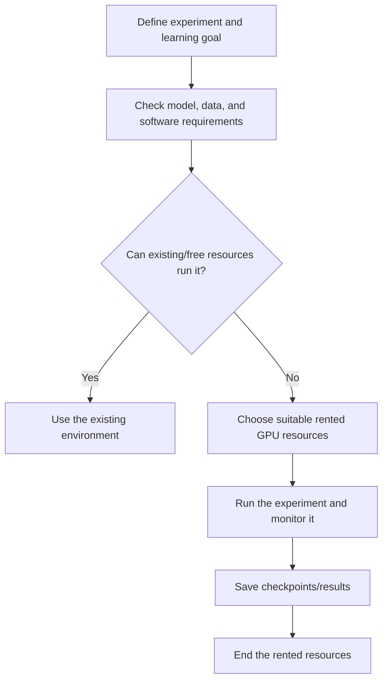

Paul's planned fine-tuning demonstrations often targeted A100/H100-class machines and around 80GB VRAM or more. This was **his intended workload scale**, not the minimum memory needed for every possible fine-tuning exercise. Students with consumer GPUs could reduce the workload or use a parameter-efficient approach where supported. Memory capacity and computational throughput both matter; neither a GPU model name nor VRAM alone predicts the whole training runtime.

Single- and multi-GPU execution were options. The timing illustrations did not establish linear speedup; a suitable GPU could come from any provider.

Google Colab and Kaggle were options for early exercises. Paul anticipated needing a more controlled environment for larger codebases, deployment/container workflows, and the demanding model work. This did not mean every learning experiment requires paid infrastructure.

API access and coding agents were separate concerns from GPU rental. Paul encouraged inexpensive access when the task did not need an expensive model, and allowed existing OpenAI, Anthropic, Copilot, or other supported workflows. The session's quoted promotional prices and model rankings are historical examples, not current purchasing guidance. Model origin alone does not determine task suitability, and corporate restrictions or model licenses still apply to the learner's context.

For synthetic data, check generation volume, API support, usage terms, limits, and token consumption. A coding subscription does not imply unlimited arbitrary API use.

Students could study the pipeline or run a smaller workload. Suggested budgets reflected Paul's learning preference, not a compulsory experience-based spending schedule.

---

## 🧑‍💻 How Classes, Projects, and Assignments Would Work

There was no fixed theory/practical ratio for every session. Transformers could need several conceptual explanations followed by a separate implementation class; RAG topics could combine explanation and code more closely within the same session. Class length and module pace would follow the material rather than a rule such as two modules every month.

Dishant asked how project delivery would work. Paul described a sequence: first demonstrate the completed behavior, help learners get the same project running, discuss the files and components, and then move into deployment and troubleshooting. Code and data would be shared through GitHub, with learners supplying their own environment variables and service access as needed.


Concept assignments were distinct from merely running the capstone. Paul mentioned a possible first task involving backpropagation calculations in Python. Test cases and Git/CI-style submission were planned. A deadline before the next Saturday was an example under consideration, not a finalized deadline for every future assignment.

AI coding assistance was allowed. Salman and Swati asked directly whether assignments and code study should be manual. Paul's requirement was to understand the result: what a function/class does, which components matter, and whether the behavior is correct. An agent can solve syntax friction or help explore a codebase, but passing tests does not by itself establish conceptual understanding.

Learners were not expected to copy tens of thousands of source lines during a live lecture. Instead, study the important components deliberately, reproduce key calculations or small implementations, and inspect the code shared after class. Interview preparation may still require writing short pieces of code unaided; that is a separate practice goal from transcribing a large project line by line.

Krish suggested around 6–7 hours of weekend class time plus roughly **10–12 hours of weekday practice**. These were study expectations rather than a claim that everyone reaches the same skill level after the same number of hours. The repeated request was to attend consistently, complete exercises, and keep working when a concept or deployment step becomes difficult.

---

## 🌱 Portfolio Building, Career Fit, and Research Direction

Krish used his own teaching/consulting journey to argue for sharing work publicly. He described gaining opportunities after he started communicating what he knew, and encouraged learners to post useful explanations, experiments, and demos rather than leave all the learning private.

> “Share knowledge before it becomes meaningless.”

The point was timely, useful communication—not a claim that foundational knowledge loses all value as soon as it ages. A portfolio can show what was built, why a decision was made, which tests were run, and what changed after an experiment. 

The extended Q&A gave a more nuanced view of career fit than the opening promotional language. Paul repeatedly asked learners to define a goal and connect it to their current experience.

| Background or objective | Direction discussed | Qualification to retain |
|---|---|---|
| Backend/software developer | Model/RAG/agent application development after closing Python/deep-learning gaps | Existing software experience helps, but it does not substitute for the model foundations |
| Data engineer | Training-data and synthetic-data pipelines, document ingestion, formatting, quality checks | The course covers some overlap; a whole data-engineering role is not replaced by a new title |
| DevOps/SRE/DevSecOps | AI platform engineering, model hosting, deployment, observability, security | A more model-development-focused switch needs additional model/data practice |
| Mobile developer | Smaller-model/edge integration and application performance | A transition toward model engineering requires learning beyond the mobile UI layer |
| Senior architect | Decisions spanning data, models, and operations | One course alone does not cover every expectation of a broad AI architect role |
| Student seeking an internship | RAG/agent projects, fundamentals, measurable implementation understanding | No mandatory years-of-experience rule for all employers was established |
| Prospective research student | Read relevant papers, investigate a specific question, evaluate newer architectures | A research goal and thesis contribution must be developed separately |

Paul's discussion of forward-deployed engineering was explicit about limitations: some relevant foundations were included, while more infrastructure, inference, and other role-specific work could be needed. Remarks about typical experience or hiring patterns were his observations, not universal eligibility requirements.

Scope excluded complete beginner data science, dedicated full-length RAG training, every agent framework, full inference engineering/RL, quantum computing, and substantial world-model/SSM/JEPA specialization. Related fundamentals could still appear.

---

## 🗺️ What's Next

- The next live meeting was planned for the following Saturday at 8 PM IST.
- Paul intended to take a poll to assess the cohort's familiarity with PyTorch, coding agents, and relevant foundations.
- A starter repository and additional prerequisite material were proposed in response to requests for clearer preparation guidance. Their actual contents were not supplied in this induction transcript.
- The first main topic would be the motivation for transformers and attention, followed by the foundational implementation sequence.
- Access to the dedicated course Discord channels was planned for a later session, with paper/model updates to follow.
- Hardware selection would be explained with the actual GPU-requiring lessons; learners did not need to rent a training GPU immediately after induction.

---

## 💬 Live Q&A Highlights

| Question | Answer |
|---|---|
| **Anupam Mishra:** Are the listed prerequisites enough if much of the syllabus is unfamiliar? | Python and deep-learning fundamentals were the starting requirements. PyTorch familiarity could grow through the course, and a poll/refresher was proposed. |
| **Albert V, Venkat Reddy, Ashok Kumar Rajpoot, Janani K, Dileep Kumar Chilukuru:** What should a learner from another background review first? | Python, neural-network components, activation/loss/optimization ideas, and a small PyTorch exercise. Official documentation and prerequisite resources were recommended; deep-learning expertise was not required. |
| **Venkat Reddy:** How soon would coding begin? | Paul expected implementation within the early weeks and advised beginning PyTorch preparation promptly. The precise class calendar remained flexible. |
| **Bheem Sen Yadav:** Does “Python prerequisite” mean first completing NumPy/Pandas and all ML? | Paul focused on reading Python, APIs/databases, and basic deep learning rather than requiring a whole introductory data-science sequence first. This was preparation for this course, not a universal role requirement. |
| **Bheem Sen Yadav:** Is this a zero-to-complete-AI course? | No. It is advanced and assumes some foundations; a beginner-oriented course would cover the missing base separately. |
| **Prashant Yadav:** How should a DevOps engineer prepare to move toward development? | Start with PyTorch and model/deep-learning foundations, then the relevant NLP/application work. Existing infrastructure experience remains useful, but a development-focused transition requires deeper model work. |
| **Salman:** Is OCR excluded from the RAG scope? | No. OCR and document-parsing topics were already included in the syllabus walkthrough. |
| **Sudhir Varanasi:** Will there be a coding-agent setup session or prior resource? | Paul proposed polling the cohort before choosing a demonstration and mentioned Mayank's resource. No fixed setup session or exact resource URL was established here. |
| **Salman:** Can coding agents be used for assignments? | Yes. The learner still needs to understand the code and satisfy the task/test requirements. Manual implementation was also acceptable. |
| **Swati Gupta:** Must every line of a large project be written and understood during class? | Paul planned component/function/class explanations rather than live transcription of a huge codebase. Learners should practice important small implementations separately and understand the core behavior. |
| **Swati Gupta:** Are multi-agent architectures and system design included? | Multi-agent workflow designs would be discussed where the chosen task needs them. The course does not imply that every AI engineer builds the same agent architecture. |
| **Swati Gupta:** Should Docker/Kubernetes be mastered before the project? | Basic familiarity was useful, and project deployment instructions would be provided. The objective was to use the tools for the AI project, not teach their entire ecosystems. |
| **Swati Gupta:** Are transcripts available? | Transcripts were planned for this cohort; availability differed across older batches. |
| **Nazan:** Will vendor-specific agent identity/governance systems be taught? | Paul did not commit to a full Auth0/Okta-style implementation for the cohort and preferred accessible tools. Later choices could be revisited. |
| **Albert V:** What if company restrictions prevent using a particular model family? | Alternatives could be selected; the course did not mandate one model origin. Actual organizational restrictions and license terms still govern the learner's use. |
| **Albert V:** Will LangChain and LangGraph be taught? | Yes, within the stated curriculum, alongside the broader model/application scope. |
| **Salman:** Is a particular paid/local model required, and is Phoenix included? | Model access was flexible; existing suitable API access could be used. Phoenix was acknowledged among the evaluation/observability options. |
| **Rahul Chouhan:** Is a local GPU required, and which cloud must be known? | No local high-end GPU was required; demanding work would use cloud resources. Be comfortable with one suitable cloud; AWS was the intended primary teaching cloud. |
| **robhatna:** How does this overlap with the dedicated agent course? | Paul described overlap in RAG/agent application topics, with this cohort putting more emphasis on model engineering. Exact overlap percentages were approximate. |
| **Gaurav Garg:** Does the first capstone pretrain a new foundation model from scratch? | No. It starts from pretrained weights and adapts them. The precise adapter/full-parameter recipe was not settled unambiguously in this induction exchange. |
| **Gaurav Garg:** Can resulting checkpoints be hosted on Hugging Face? | Checkpoint creation and sharing were part of the planned workflow. Nothing was uploaded during induction. |
| **Gaurav Garg:** Will a fixed number of modules finish each month? | No. The conceptual and practical difficulty determines the pace; fine-tuning could take substantially longer than some application blocks. |
| **Gaurav Garg:** Can Oracle/cloud and Copilot access already held be used? | Yes, suitable existing resources were accepted. The course did not require every learner to replicate Paul's vendors. |
| **Saurabh Agrawal:** How is this relevant to data engineering? | The synthetic-data factory involves cleaning, transformation, formats, quality checks, and possible orchestration. Those are useful connections to the existing role. |
| **Amrita Trivedi:** Are free cloud accounts enough for everything? | Early work might use free resources, but the proposed large training and deployment tasks can incur costs. A rented GPU was an option; students could also study or reduce a workload rather than repeat every expensive run. |
| **Amrita Trivedi:** Must everyone use an A100/H100? | Those were Paul's planned demonstration resources. Any suitable provider/hardware could be used for a chosen experiment; this was not a universal minimum for all exercises. |
| **Prashanth Nayak:** Does this fully prepare someone for an FDE role? | Some relevant material is included, but additional role-specific infrastructure/inference and other skills may be necessary. Paul offered to discuss an exact target separately. |
| **Alok Anand:** Are eight H100s always required? | No. Device count depends on the task. Paul could use a single GPU or a larger setup when throughput needs justified it; timing examples were illustrative. |
| **Alok Anand:** Can learners select their own SLM use cases or use a consumer GPU? | Yes, with a suitable dataset and configuration. Hardware limits may require smaller or parameter-efficient experiments. |
| **Rahul Soni:** Can a data engineer combine current skills with AI applications? | Paul pointed to dataset-formatting, quality, ingestion, and decision/automation components. The useful overlap should be defined by a concrete pipeline problem rather than only a new title. |
| **Rahul Soni:** Will extra topic references and agent implementation be available? | University/documentation/book references were discussed, and agent implementation was in the syllabus. No complete new reading list was produced in the exchange. |
| **Dishant:** Is theory mixed with code in every class? | It depends on the topic. Transformer theory and implementation could be in separate sessions; RAG explanation and practical work could be interleaved. |
| **Dishant:** How will project code be delivered and explained? | GitHub code/data, a working demo, replication, component discussion, and deployment troubleshooting were the planned sequence. |
| **Dishant:** Are assignments just completing the project scaffold? | No. Assignments would test concepts; a backpropagation task was mentioned. Capstone code was intended to be runnable with the learner's own configuration. |
| **Nandan:** Should urgent agent learning wait for the late course modules? | Paul suggested parallel self-study of a relevant framework through documentation and experiments. Buying another course was not necessary merely to learn one overlapping module. |
| **Nandan:** Are existing Claude/Codex subscriptions acceptable? | Yes, useful existing access could be retained. Whether its allowance suffices depends on actual use and the product's terms. |
| **Saurabh:** How can a mobile developer use the course? | Smaller-model/edge deployment and app integration were potential directions. A shift into model engineering requires learning the actual model stack, not only mobile presentation. |
| **Ashok Perumal:** Can synthetic data replace original domain data, and is 50:50 required? | Paul wanted original data and verified generated examples together, using 50:50 as an illustration. The class did not validate that ratio or prove generated examples equivalent to real data. |
| **Ranjeev Tiwari:** Is another course needed if deep learning was learned before? | Paul recommended refreshing the relevant foundations/PyTorch rather than automatically enrolling elsewhere. |
| **Ranjeev Tiwari:** How large would project datasets be, and could a 24GB GPU help? | Paul proposed more than 100,000 examples for major demonstrations. A smaller/local configuration could be attempted with a reduced workload; dataset size and GPU runtime were not universal rules. |
| **Ranjeev Tiwari:** Will there be preparation resources before modules? | Existing prerequisite links and later articles/Discord updates were planned. A complete fixed prerequisite pack for every future class was not supplied. |
| **Atharva:** What should a student with a RAG project do next? | Inspect retrieval concepts, latency, data volume, security, guardrails, and evaluation, and make sure the underlying design can be explained. Paul offered more focused follow-up. |
| **Atharva:** Is an overview of an AI-generated project enough? | No. The core concepts must be understood well enough to reproduce/explain important calculations and debug the system. |
| **Ashwin George:** How much mathematics is needed? | Basic training/backpropagation intuition and small worked calculations were useful. Some research formulas would need focused explanation; no comprehensive advanced-math prerequisite was specified. |
| **Ashwin George:** Could this support an internal fintech SLM journey? | That was aligned with the planned data/model adaptation work, provided suitable enterprise data and foundations were available. His actual system was not assessed live. |
| **Ashwin George:** Will there be breakout rooms or guided peer practice? | Assignments were definite plans; Discord/voice-channel possibilities would depend on participation and moderation. Dedicated breakout/voice arrangements were not guaranteed. |
| **Sanjay Bhati:** What is a plausible direction from DevOps architecture? | Paul suggested AI platform engineering as a close use of existing skills. A broad AI architect role also needs strong data/model/operations decisions; this course is one part of that preparation. |
| **Sanjay Bhati:** Is this primarily a dedicated agent course? | No. It emphasizes model/LLM building and adaptation first, with RAG/agents later. It would teach selected frameworks rather than survey every agent stack. |
| **Sanjay Bhati:** Does learning the fine-tuning workflow mean the next role will assign fine-tuning work? | No such role assignment was promised. Paul distinguished specialist training work from platform responsibilities and asked learners to consider their existing experience. |
| **Phanindra:** Is RAG/agent depth the same as a dedicated six-month RAG cohort? | No. That dedicated course can explore its narrower subject further. This cohort balances models, retrieval, and agents; focused additional resources could be discussed. |
| **Janani K:** Is a small neural-network review plus PyTorch hands-on enough to begin? | Paul accepted it as a starting foundation. It was not a guarantee of readiness for every MLOps interview question such as drift or classical algorithms. |
| **Nikhil:** Where are live lectures hosted? | Zoom, with dashboard/email access to the meeting. |
| **Sudarsan:** What differs from the Modern Route? | Paul highlighted prompt automation, attention/cache depth, SLMs, distillation, custom embeddings, security, and different projects. He had not reviewed every other mentor lecture, so the exact fine-tuning comparison was uncertain. |
| **Sudarsan:** Is deep-learning expertise necessary? | Foundations were required; expertise was not. Prior course experience could provide a useful base while unfamiliar concepts were reviewed. |
| **Jeet Agrawal:** Should the batch be changed if PyTorch is missing? | A framework gap can be addressed with practice. If broader foundations are missing, a beginner path may fit better; define the goal and discuss an enrollment change separately. |
| **Prabu, displayed as Nilan Electronicist:** Which existing courses should a legacy developer review? | Choose prerequisite/foundation resources according to the goal; topic-specific RAG or agent recordings were options. Older recordings might not include transcripts. |
| **Prabu:** Does long legacy experience directly qualify someone for AI architect work? | No direct qualification was established. Data pipelines, modeling, operations, and system-design decisions still need study; a tailored path requires a clearer target. |
| **Herender:** How should a prospective higher-studies student use the course? | Develop a specific research interest and explore relevant language-model, attention, efficiency, and RL literature. The course is an advanced learning path rather than an automatically defined thesis. |
| **Herender:** Are the original transformer/GPT papers enough for modern research direction? | They provide foundations, while newer relevant literature also needs study. AI-assisted explanations can help break down unfamiliar papers; the research question still comes from the learner. |
| **Dileep Kumar Chilukuru:** Can data-engineering experience support a transition without current LLM knowledge? | Yes as a starting point, while closing Python/deep-learning prerequisite gaps. Completing the course does not select a job role automatically. |
| **Athira P T:** Does LLM study determine a world-model PhD direction? | No. Paul suggested considering modern vision/transformer work and developing a research question from prior study. A world-model specialization was not a committed course outcome. |
| **Srini K:** Can five projects plus senior SAP experience prepare every AI/architect role? | No. Paul explicitly said this course covers one part of the wider data/model/operations stack. Role-specific gaps, including deeper inference work, can remain. |
| **Srini K:** Does the course fully cover FDE preparation? | Only some relevant components; additional skills would be required for the exact role. |
| **Sudhanshu Kumar:** Is it a complete GenAI architect package, and must ML/RL also be learned? | The needed breadth depends on the target project. RL has applications in generative-model alignment, while classical ML remains useful for suitable tasks; one course does not settle every specialization. |
| **Issac Abraham:** Will evaluation/guardrails help improve a healthcare chatbot? | Evaluation across model/RAG/agent systems was planned, with attention to data and metadata quality. No actual clinical validation or universal 100%/99.9% acceptance threshold was established. |
| **Issac Abraham:** Could hallucination problems come from the data pipeline? | Paul mentioned annotation, preparation, and incorrect metadata as things to inspect. The actual application was not diagnosed during the class. |
| **Hemant Pawar:** Can preparation topics be listed ahead of class? | Paul proposed a cohort poll and a starter repository, with additional prerequisite material if needed. Those deliverables were still planned. |
| **Arun Karnik:** Can GPU/cloud choices be included in the starter material? | Paul said selection criteria would be explained with the GPU lessons. Early transformer work could use existing/free resources; renting a large GPU was not an immediate task. |
| **Vijay, in chat:** Should statistics and DSA be part of preparation? | Their importance depends on the role and employer. Paul described interview examples, but the session did not establish a universal first-round format or that statistics is unnecessary for GenAI. |
| **Sanu/Anupinder, in chat:** Why study adaptation when RAG can supply knowledge? | Retrieval and adaptation address different needs. Frequency of data changes was one consideration; quality and hallucinations need task-specific evaluation rather than a blanket ranking. |

---

## 🔑 Key Pointers to Remember

- Induction establishes the roadmap and expectations; it does not count as the implementation lesson for every term mentioned.
- The course assumes Python and basic deep learning and plans to build PyTorch familiarity through practice.
- Read functions/classes and the flow of data; do not rely only on copying a large codebase.
- Model foundations come before the broad retrieval/agent/production application work.
- A pretrained starting point and an adapted model are different from frontier-scale pretraining from scratch.
- SFT and PEFT can be combined; they describe different aspects of adaptation.
- Data preparation and validation are central to both model adaptation and synthetic-data projects.
- Project dataset sizes and 80GB-class GPU examples describe planned workloads, not universal lower bounds.
- Use a suitable existing or rented environment and choose spending according to the experiment.
- MCP and A2A have different integration roles.
- RAG and model adaptation have task-dependent benefits and failure modes; evaluate the actual system.
- Deployment is not the end of the work: latency, cost, permissions, observability, and quality matter afterward.
- Assignments permit AI assistance, while the learner remains responsible for understanding and correctness.
- Scope, exact stacks, pacing, and future research additions were flexible.
- Course completion, public posting, or a capstone does not guarantee a job, salary, clinical safety, or research outcome.
- Define the role or use case you want, then close the relevant gaps across data, models, software, and operations.

---

## ✅ Action Items After Class 1

- [ ] Confirm dashboard access and locate Workshop, Courses, Feed, and community messages.
- [ ] Locate the current curriculum and linked research-paper list rather than use an older draft.
- [ ] Plan time for weekend classes and regular weekday implementation/review.
- [ ] Review the prerequisite Python and deep-learning resources for the concepts you have not used.
- [ ] Work through a small PyTorch example and inspect model, loss, activation, and optimizer behavior.
- [ ] Review Git basics and how to run a repository with a project-specific environment.
- [ ] Decide on a concrete learning target: a model task, retrieval application, agent workflow, platform skill, or research question.
- [ ] List gaps between that target and your current experience instead of selecting a role only from a course title.
- [ ] Keep existing suitable model/cloud access; postpone large GPU rental until there is a defined workload.
- [ ] Start a portfolio of useful experiments, decisions, and measured results, keeping company/private data within its permitted use.
- [ ] Attend the next session for the cohort poll, preparation guidance, and start of the transformer sequence.
- [ ] When assignments arrive, follow their actual submission deadline and test requirements.
- [ ] Use the course forum for specific questions and follow official announcements for later resource/community access.

---

*📝 Notes compiled from the full Class 1 transcript — “19 July Day - 1 induction Session,” Production AI / LLM Engineering, Krish Naik Academy — with mentor names checked against the course resources hub.*

*Primary source: [Class 1 recording page](https://learn.krishnaikacademy.com/web/courses/6a16f8935e281281cd6b1128?chapter=6a5d4b077296ab39d924f5b8). Original transcript filename: `GMT20260719-141510_Recording.transcript.vtt`. All eight transcript parts, including the extended late Q&A, were read. No supplementary class PDF or code notebook was supplied. No code implementation has been reconstructed from the roadmap. Caption speaker labels remain “Krish Naik” through much of Paul's handed-over discussion; attribution follows the explicit handoff and conversational context. Official documentation/paper links clarify nuanced claims without implying those later methods were implemented in induction.*

[Back to course index](Course_Notes_Index.md)

---

<a id="class-02"></a>

# 🛠️ Class 2: Software Setup and the Engineering Workflow
### 📋 Production AI / LLM Engineering | Krish Naik Academy

**🎙️ Mentor:** Sourangshu Pal (addressed as Paul in the transcript)  
**⏱️ Duration:** ~3 hours 41 minutes (3hr 41min 23s) | **📅 Session:** Day 2 (25 July 2026)

---

## 📰 Quick Updates

- The previous induction recording was available through the course dashboard. The dashboard also contained the course Notion link, which was intended to be the ongoing home for notes, resources, code links, and workshop information.
- Paul shared the public Discord server invitation. Access to the course's private channels was planned for the following week; joining the public server did not immediately grant access to those channels. The planned channels included research papers, model releases, and relevant news, and were intended to remain available after the course.
- An embedded Docker cheat sheet was failing to load during the session. Paul refreshed its embedding and added a direct documentation link as an alternative.
- A cohort poll assessed Python, PyTorch, Git/GitHub, cloud usage, deployment experience, paper reading, and study availability. It was a planning exercise rather than a test. The responses led Paul to schedule a PyTorch refresher for the next class before beginning Transformers 101.
- This session primarily established the development setup. It did **not** teach PyTorch, transformers, Docker deployment, Kubernetes, or fine-tuning in depth; these appeared as preparation advice and future-course context.

---

## 🧭 What You Need Now—and What Comes Later

The class included a broad tour of tools, but the immediate setup was small. Paul repeatedly returned to the same practical outcome: have Python available, be able to create an isolated environment, open notebooks or source files, use a terminal, and work with GitHub. Familiar tools were acceptable. Matching every application in his personal setup was unnecessary.

The accompanying [Software & Tools Checklist](https://krishnaikacademy.notion.site/Software-Tools-Checklist-1f0eba9593d0804a8ab2cf17762d2b1b) lists Python, an IDE, Git/Git Bash, Docker, and the AWS CLI as course requirements. It labels Warp and Postman as optional, treats pip as the major package-management route, uv as optional, and Conda as less frequently used. Paul's live emphasis was more specific: **Python and uv were the first installation steps**, while Docker and AWS work would become relevant later. Those statements describe different stages of preparation rather than a requirement to run the whole stack on day one.

| Layer | Purpose | Session guidance |
|---|---|---|
| Python interpreter | Executes Python scripts and notebook code | Required; Paul's preferred line was Python 3.12 |
| Environment/package management | Keeps each project's dependencies together | uv was his preferred workflow; pip, native venv, or an existing Conda workflow could also work |
| Git and GitHub | Version control, code distribution, assignments, contributions | Install Git and have a GitHub account |
| IDE/editor | Reads and edits files; opens notebooks | VS Code was sufficient; Cursor, PyCharm, or another familiar editor was acceptable |
| Terminal | Executes commands, scripts, and later cloud workflows | One working terminal was enough; native and integrated terminals were accepted |
| Coding agent/harness | Helps inspect, explain, modify, and explore codebases | Useful for independent learning; no particular paid subscription was compulsory |
| Docker | Packages applications for reproducible execution and deployment | In the broader checklist; substantial use was deferred to project work |
| AWS CLI | Performs AWS operations from the command line | Install when preparing the broader stack; account/user configuration was not needed in this class |
| GPU/cloud environment | Handles workloads beyond the local machine | Needed for specific later experiments rather than every session |

Velu's request for a tool-category table exposed the main source of confusion: editors, terminals, coding agents, and model providers were being discussed together. They perform different jobs. An application may combine several of them, but the roles still matter when configuring a project or troubleshooting an error.

The organizing principle was Paul's reminder that a developer's established workflow should remain usable. Keep a working setup, add the capabilities the course needs, and install project-specific dependencies when the corresponding code arrives.

---

## 🐍 Choosing and Installing Python

Paul opened the Python release information and discussed the tradeoff between a stable interpreter and compatibility with newer libraries. His own preferred version for the course was **Python 3.12.9**, with the **3.12 or 3.13 lines** recommended to new joiners. Students who already had a functioning 3.10 or 3.11 setup were not asked to replace it immediately. A student on 3.14 was told to use an older project environment if a later library failed to support that version.

The lesson is to choose Python according to the actual project stack. Being the newest interpreter does not guarantee that a specialized training library already publishes compatible packages for it. Paul specifically anticipated possible integration friction in later work with fine-tuning tools such as Unsloth and Axolotl. He did not demonstrate a failure with either tool in this session, so this was compatibility planning rather than a verified incompatibility matrix.

Python's lifecycle labels also need careful interpretation. A security-only release line still receives applicable security fixes, but that does not mean every bug has been eliminated. End-of-life means upstream support has ended. **For later readers:** Python 3.10 reached end-of-life in October 2026; the session's acceptance of an existing 3.10 installation should not be read as a current recommendation for new environments. Check the [official Python version-status table](https://devguide.python.org/versions/) when selecting a supported interpreter.

Two installation routes were discussed:

1. **Direct Python installation:** obtain the interpreter through the Python distribution appropriate to your operating system.
2. **A distribution or environment manager:** an existing Anaconda installation could supply Python; uv could also manage Python versions and environments.

The requirement was usable Python, not a particular brand of distribution. Paul personally had moved away from Anaconda and intended to use uv throughout the course. That preference was intended to simplify his teaching workflow, not to establish that a Conda-based Python interpreter cannot execute the material.

For beginners, the live recommendation was straightforward: install Python first, then uv. More experienced users could manage Python through uv itself. The [uv Python-version documentation](https://docs.astral.sh/uv/concepts/python-versions/) confirms that uv can locate a compatible interpreter and download a managed Python version when one is unavailable, unless automatic downloads are disabled.

---

## ⚡ uv: A Small Command Set for Everyday Work

uv was introduced as a Python package and project manager written in Rust. Paul favored it for speed and for a workflow that made interpreter selection, environment creation, and dependency management convenient. The course was not intended to become a complete uv tutorial: he expected learners to use a few recurring operations and refer to the documentation when needed.

Install uv using the instructions for the actual operating system and shell. Paul demonstrated on macOS and a Linux-based cloud environment; Windows students were directed to the PowerShell instructions on the [official installation page](https://docs.astral.sh/uv/getting-started/installation/). Installation through pip was accepted too, although the standalone tool was his preference.

The spoken commands, with obvious caption errors normalized, were:

| Command | Meaning in the session |
|---|---|
| `uv --version` | Checks that the uv executable is available and reports its version |
| `uv self update` | Updates a standalone-installer uv installation |
| `uv venv` | Creates the default `.venv` environment in the current project location |
| `uv venv .venv` | Makes the environment name explicit |
| `uv venv --python 3.11` | Requests a particular Python version for an environment |
| `uv init` | Initializes project metadata and starter files |

The update command depends on how uv was installed. When a package manager installed it, use that package manager's update mechanism instead of assuming self-update will work. This distinction is documented in the [uv installation guide](https://docs.astral.sh/uv/getting-started/installation/).

When participant **136** reported an error after trying an additional pip installation, Paul narrowed the task: first check that uv itself reports its version. Successfully installing uv was the immediate requirement. An unrelated extra installation was not a necessary step in verifying that uv worked.

A useful troubleshooting habit emerges from that exchange: verify one layer at a time. Establish that the tool runs before adding project dependencies. Otherwise, an error in a later operation may be mistaken for a failed installation of the earlier tool.

---

## 📦 Virtual Environments, Project Initialization, and Dependency Files

Paul demonstrated creating a project folder and then creating a virtual environment inside it. An environment isolates the packages needed by one project from those used by other projects or the operating system. The conventional name `.venv` also makes it easy to exclude the environment directory from Git.

Two related uv operations were discussed, and Sameer explicitly asked whether creating an environment should produce `pyproject.toml`. The precise distinction is:

- **`uv venv` creates an environment.** It does not, by itself, initialize the project's metadata file.
- **`uv init` initializes a project.** It creates `pyproject.toml` and starter files. The exact generated layout can vary with uv version and options.
- **Project commands manage the environment and resolved dependencies.** The project workflow creates or updates the environment as required; the live demo's `main.py` was an example of the scaffold Paul had at the time, not a universal filename guaranteed by every later version.

These distinctions are confirmed in the [uv environment guide](https://docs.astral.sh/uv/pip/environments/) and [project guide](https://docs.astral.sh/uv/guides/projects/).

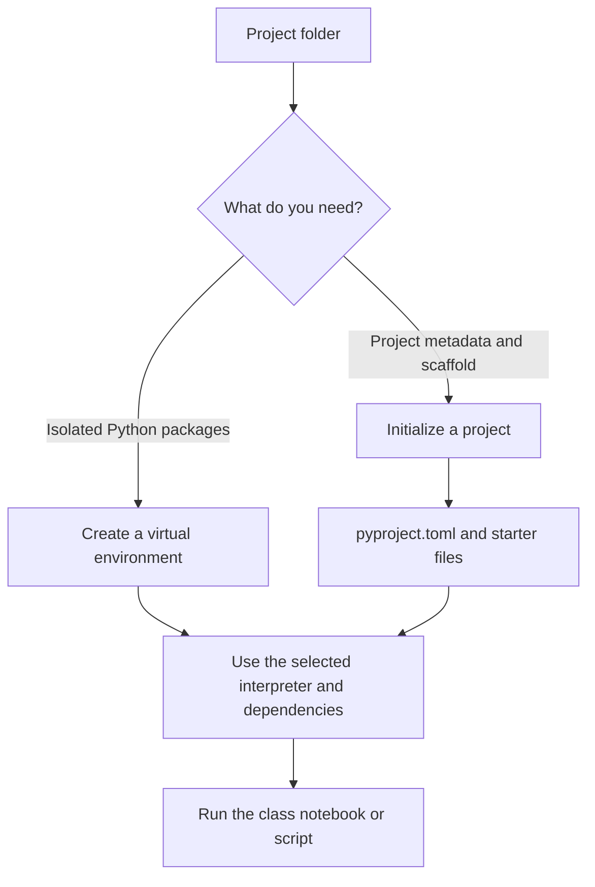

Paul used a personal shell alias named `activate`. That shorthand belonged to his own configuration. Students should use the activation mechanism for their shell rather than expect a command named `activate` to exist everywhere. The following exact example is supplied by the **course checklist**, not reconstructed from an unseen terminal screen:

```bash
uv venv myenv
source myenv/bin/activate
uv pip install -r requirements.txt
deactivate
```

This activation example is for a compatible macOS/Linux shell. Windows uses scripts under the environment's `Scripts` directory; the script differs between PowerShell and Command Prompt. The [Python venv documentation](https://docs.python.org/3/library/venv.html) explains the platform-specific activation paths and confirms that environments should be recreated from their requirements rather than copied between machines.

The same checklist supplies a native Python alternative:

```bash
python -m venv myenv
source myenv/bin/activate
deactivate
```

It also gives these project/dependency operations:

```bash
uv sync
uv add -r requirements.txt
```

Treat the two lines as distinct operations rather than a compulsory sequence for every class. `uv sync` synchronizes the project's environment; importing a requirements file with `uv add -r requirements.txt` adds those requirements to the project workflow. The provided project instructions determine which route to use.

Paul said he would share either **`requirements.txt` or `pyproject.toml`** with the codebase. Installing every framework mentioned in the future syllabus was unnecessary. Use the dependency definition supplied with the actual exercise.

The companion checklist includes the familiar pip operations below:

```bash
pip freeze
pip freeze > requirements.txt
pip list
pip list --format=freeze > req.txt
pip install -r file_name.txt
```

Here, `file_name.txt` is the checklist's placeholder for the actual dependency file. Listing packages and exporting package versions are useful for inspecting or recording an environment; installing from a file is a different operation. The terminal's working directory, the active interpreter, and the chosen file all matter.

A student whose uv environment was using Anaconda Python was advised to simplify the setup. The actionable diagnostic is to select the intended interpreter deliberately and understand which environment is active. Removing an entire distribution is not a prerequisite for understanding the environment-selection issue: uv recognizes activated virtual and Conda environments, as described in its [environment-discovery documentation](https://docs.astral.sh/uv/pip/environments/).

---

## 🌿 Git, GitHub, and Reproducible Sharing

Git and GitHub were more important to the course workflow than the choice of editor. Paul intended to distribute code through GitHub, use it for assignments, and accept useful learner contributions. A local Git installation and a GitHub account therefore belonged in the basic setup.

Students unfamiliar with Git were advised to learn the small set of operations needed to initialize a repository, make a commit, and push changes. Paul did not attempt a full Git lesson. GUI tools such as GitHub Desktop were acceptable, although he personally used command-line tools, including the GitHub CLI.

The environment folder should not become part of the code contribution. Paul preferred `.venv` partly because it could be consistently excluded through `.gitignore`; a custom environment name was fine if it was excluded too. When a learner asked whether broadly adding a folder would pick up everything, the useful distinction was between the files Git tracks and files deliberately ignored by the repository. Check the repository's ignore rules before staging dependencies or local environment directories.

Code and dependency definitions serve different purposes. Sharing the code tells another learner what to run; sharing its requirements tells them what environment to recreate. The environment itself is a local artifact that can be rebuilt.

Coding agents were linked to this workflow too. If a learner explored a notebook, found a useful improvement, or implemented an additional feature, an agent could help inspect and modify the code before a pull request. Paul still expected the learner to understand the contribution. The point was to make experimentation practical, not to eliminate responsibility for the code.

---

## 🖥️ Picking an Editor and a Terminal

An editor helps when reading several files, modifying a function, or opening a Jupyter notebook. A terminal executes the scripts and commands. Paul intended to be strongly **CLI-centric**, so learners needed to be comfortable with the terminal even when their editor included one.

For the editor, **VS Code was sufficient**. Cursor was acceptable, and students already using it did not need another editor. Paul also mentioned PyCharm and other editors or VS Code-derived products. His memory-related advice was to keep the setup light on a constrained laptop; a large IDE was an option when the machine had sufficient resources. These were his practical preferences rather than benchmarked minimum memory requirements for every application.

For notebook work, Ankit's combination of VS Code, a Jupyter extension, and Copilot was accepted. There was no special paid integration required to connect Python, uv, Git, GitHub, and the editor. Install the components, select the appropriate Python environment, and use the project instructions.

Paul recommended **Warp** to beginners for its command history and completion experience. He personally used several terminals and could edit files from some of them. The tour included native terminals, integrated terminals, WezTerm, Ghostty, and other tools whose names were sometimes unclear in the captions. This was a tour of alternatives, not a list of things everyone needed to install.

Several students asked whether a separate terminal was necessary when VS Code already had one. His answer was ultimately that an integrated or native terminal was fine. A familiar terminal and keyboard shortcuts were useful assets. There was no need to copy his habit of keeping terminal applications separate from the IDE.

For an 8GB MacBook, Himani was specifically advised to keep the setup light and use the default terminal if that worked. The same principle applies to the entire toolkit: convenience features should improve the experience without consuming resources needed by the exercise.

Warp's terminal functionality and its AI agent were also separated. A student reporting exhausted credits was told that conversational AI use could consume the agent allowance. Running ordinary shell commands was the workflow intended for class. Product plans change, so the session's pricing comments are historical observations rather than current plan guarantees.

---

## 🤖 Coding Agents, Harnesses, Providers, and BYOK

The coding-agent discussion introduced a useful separation between **the application that works on code** and **the model it calls**. Paul used the term *harness* for the surrounding application that makes the LLM useful in a coding workflow. Albert asked what that meant, and Paul explained it as using the model's capabilities through an application.

| Term | Meaning in this discussion | Examples discussed |
|---|---|---|
| Editor/IDE | Displays and edits the codebase | VS Code, Cursor, PyCharm |
| Coding harness/agent | Provides a workflow for an LLM to inspect or change code | Claude Code, Codex, OpenCode, Copilot, and other agents |
| Model | Produces the reasoning or generated content | Different model families offered by providers |
| Provider | Supplies access to models | A direct vendor or a multi-model service |
| API key and base URL | Authentication and endpoint configuration for supported API access | Credentials configured in a compatible harness |
| BYOK | Bring your own key | Use supported provider credentials with the chosen application |
| Subscription | A product's access plan and usage allowance | Plan-specific model access; not necessarily interchangeable with API credits |

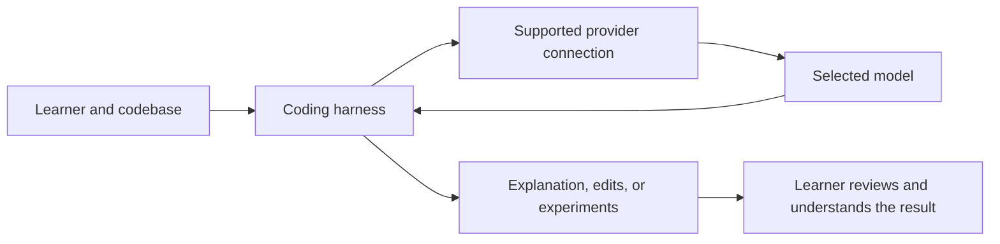

This separation explains several repeated questions. Buying an editor subscription is not the same action as purchasing arbitrary API access. Using a model-provider key does not guarantee that every harness supports every provider or every feature. A cheap plan may require using that provider's own application, while another product may allow a supported subscription connection or BYOK.

Paul discussed OpenCode as an open-source option and compared it with closed-provider workflows. OpenRouter was mentioned as a place to explore models from multiple providers. Students who already had Claude Code, Codex, Cursor, or Copilot could use their existing setup. A learner without a coding-agent subscription could still run the supplied code; a particular paid service was not compulsory.

The role of the agent was to help with independent exploration of codebases that could contain thousands of lines. Paul expected to explain a function's purpose and the surrounding concepts, not narrate every source line. The learner therefore still needed enough Python to read a function, understand its inputs and outputs, and recognize what the agent had changed.

Sameer raised image input as a potential limitation. Paul warned that a model's multimodal capability and a harness's ability to accept an image are separate compatibility questions. Check the specific model, product, and workflow rather than infer image support from a model-family name.

---

## 💸 Match Model Cost to the Task

Paul's main purchasing advice was to spend modestly while learning. He felt the course's routine coding and experimentation did not require everyone to buy an expensive top-tier subscription. Existing access was acceptable; learners considering a new service were encouraged to begin with a small allowance and expand only when their actual usage justified it.

He quoted examples such as a roughly **$1 entry plan** from a service transcribed as **Command Code**, and an **OpenCode Go first-month promotion around $5**, followed by a higher recurring charge. These were session-specific examples. The exact Command Code URL was not captured, and model lists, introductory pricing, renewal terms, quotas, and supported harnesses can change. The [OpenCode Go documentation](https://opencode.ai/docs/go/) is the appropriate place to inspect that product's current terms.

The durable cost questions were:

- What task will the model perform, and how much quality does that task need?
- What are the input and output token charges or plan limits?
- Does the service expose the model through the harness you want to use?
- Does it support required features such as images or tool calls?
- How frequently will you use it, and will a small allowance be enough?

Paul used different models for different stages of his work: a more capable option for planning, research, and brainstorming, and a cheaper option for routine implementation where it met the task's needs. This was a workflow preference, not a guarantee that every lower-cost model is equally suitable for every coding task.

Generating synthetic data changes the cost calculation. A learner running occasional exercises may use relatively little API capacity. Producing hundreds of thousands of samples can consume substantial input and output tokens, so the budget must reflect the volume. His recurring point was that more generation means more consumption; a subscription label alone does not describe the full economics.

The discussion included many model-family and version names, along with personal quality judgments. These notes retain the selection principles rather than turn those rapidly changing rankings into a permanent recommended-model list.

---

## ☁️ Local Hardware, Cloud Machines, and GPU Work

Paul discussed RAM, processors, storage, and GPUs in response to many different machines. His preferred comfortable development target was around **32GB RAM**, while **16GB or 24GB** could handle much of the ordinary work. Students with **8GB** were not told to stop taking the course or immediately buy a replacement laptop. They were told to use fewer heavy applications and move demanding exercises to a cloud machine.

These numbers were practical class guidance, not a universal capacity formula. A notebook's requirements depend on what it loads, whether a model runs locally, and what other applications are open. CPU capability matters for CPU-intensive work; additional system RAM does not replace the GPU resources needed by a GPU-intensive training run.

Rahul Soni's question made the cloud alternative concrete. A remote machine provides the CPU, memory, and possibly GPU that the local laptop lacks. The laptop becomes the interface to that environment. Paul mentioned Lightning AI, ordinary cloud instances, and dedicated GPU providers; he intended to demonstrate the specific services when the course needed them.

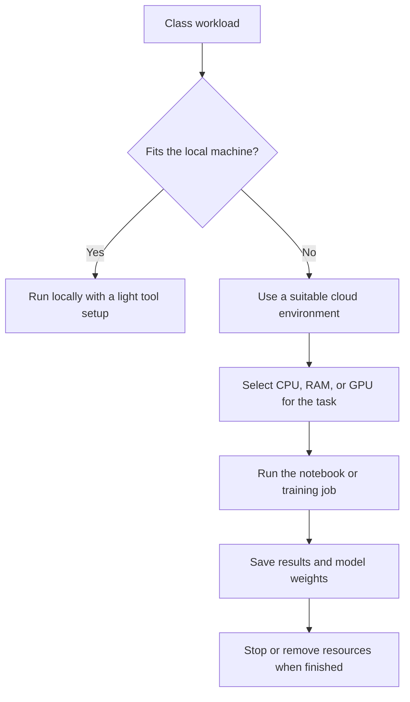

The final steps matter to the class workflow. Paul described renting the hardware for a bounded task, bringing the resulting weights back, and closing the remote environment. Dedicated hardware was not needed permanently merely because a later exercise required a powerful GPU for a few hours.

Managed environments trade some infrastructure control for convenience. In md toufik's exchange, Paul contrasted a platform with ready editors, containers, and easy CPU/GPU switching against a cheaper provider that could require more manual setup. Choose according to both the hardware requirement and the setup effort you can handle.

Amlan asked whether recurring cloud instances could install the same tools automatically. Paul suggested a startup/bootstrap script: obtain the code, install the needed software and project dependencies, then begin work. No actual startup script was supplied during the class, so these notes do not invent one.

Google Colab was acceptable for simple notebooks and scripts. Paul expected its usefulness to diminish when the course reached larger codebases, container workflows, and fine-tuning workloads needing a more controlled GPU environment. His timeline was a course plan, not a claim that Colab cannot run any fine-tuning experiment.

Storage advice varied because different workloads were being discussed. Paul initially suggested substantial free space and later accepted a student's smaller allocation for the early work. There was no measured dataset or complete storage estimate in this class. Large model weights, environments, container images, and data determine the actual requirement; a single free-space number should not be treated as a guarantee for the full course.

---

## 🐳 Docker, AWS, and Windows Compatibility

Docker would matter when an application had been built and was ready for packaging or deployment. The initial Python and notebook exercises did not need to begin with containerization. The AWS CLI was included because Paul expected much of the cloud work to use AWS and intended to perform operations such as repository creation and image publishing through the command line. Azure or GCP tools would be introduced if those platforms became relevant.

He emphasized using the **Docker CLI** instead of relying on the Desktop GUI. The underlying architecture is important: the CLI sends requests to a Docker daemon/Engine, which builds and runs containers. That daemon can be local or remote. Docker Desktop bundles the client and engine-related components; installing only a client does not, on its own, provide a local container runtime. See the [official Docker architecture overview](https://docs.docker.com/get-started/docker-overview/).

Kubernetes installation was not required at this stage. Paul mentioned a later project involving EKS, but no Kubernetes implementation was taught in this class.

Windows, macOS, and Linux were all acceptable course platforms. Paul's demonstrations were primarily macOS/Linux, so learners needed to recognize differences in shell syntax, paths, and environment activation. WSL was an option for Windows users rather than a mandatory first-day install.

For later GPU work, **WSL 2 does support CUDA on compatible NVIDIA hardware and supported drivers**, with documented limitations. A general concern raised in the live discussion should therefore be interpreted as workload-specific compatibility caution, not as a blanket statement that Windows or WSL cannot run Linux GPU applications. The [NVIDIA CUDA on WSL guide](https://docs.nvidia.com/cuda/wsl-user-guide/) documents support and constraints. Consumer NVIDIA GPUs can be useful for AI experiments too; whether one is suitable depends on model size, memory, and runtime requirements.

Sugan Gowtham reported a Windows launch failure described as **LoadLibrary error 87** after installing Warp. Paul suggested investigating the local software/driver setup and mentioned graphics drivers as a possible cause. This remained a troubleshooting hypothesis; no diagnosis was confirmed and no successful fix was demonstrated. Using a working native terminal was an acceptable way to continue the class while investigating the application issue.

---

## 📚 Reading Research Papers as an Engineer

Research papers were a substantial part of the open discussion. Paul pointed learners toward arXiv, Hugging Face papers, and the course's linked paper list. He distinguished broad discovery from learning a concept: finding many new papers is useful, but the immediate task is to understand what a relevant paper contributes and how that contribution affects an implementation.

For a paper, look for the problem it addresses, the central method, the comparison baselines, and the evidence in its experiments or benchmarks. Those elements help determine whether the result is relevant to the data and system you are building. A paper is not useful merely because its title contains a fashionable term.

For beginners following this course, Paul eventually gave a concrete starting point: **[Attention Is All You Need](https://arxiv.org/abs/1706.03762)**, after establishing basic deep-learning knowledge. He showed that the course syllabus already included paper links for the concepts it would teach, including attention and later topics such as FlashAttention and mixture-of-experts methods. Those topics were linked for future study, not taught during the setup class.

Kalyan asked specifically about agentic-AI papers. Paul suggested arXiv's relevant computer-science categories, including artificial intelligence and machine learning, and described the possibility of filtering recent papers with a small program. The proposed paper-monitoring program was not written during the class.

The engineering reading workflow Paul described was:

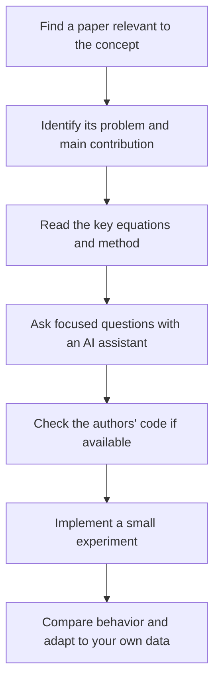

He sometimes used a Markdown representation of a paper as the input to a coding agent with relevant skills installed. The transcript does not preserve a complete conversion URL or reproducible command, so appending an unexplained suffix to a paper link is not included as an instruction here. The useful idea is to obtain readable structured text and analyze it step by step rather than assume that uploading a PDF produces understanding by itself.

NotebookLM was accepted as a tool for theoretical questions and beginner exploration. Paul personally used Claude or GPT for more implementation-oriented discussion. These were learning preferences. In every case, ask concrete questions about the paper and then test the implementation.

Ankit asked how to handle formulas that are difficult to understand intuitively. Paul's first coding step was **NumPy**: can the equation be represented in a small numerical experiment? Once the operation and shapes make sense, moving the implementation into PyTorch or another numerical framework becomes easier. He described trying several experiments and adjusting the implementation to the actual data rather than expecting the first translation to be final.

Pandian clarified whether the course would recreate all the listed papers. Paul said the goal was to teach the central concept and relevant mathematics, use implementations and frameworks where appropriate, and let learners read the surrounding literature further. It was not a commitment to repeat every research experiment. Some papers do not release code, and a paper's related-work comparisons can be much longer than the few pages needed for a particular class concept.

---

## 🧠 Foundations: Why PyTorch Still Matters

The poll suggested that many learners had heard of PyTorch but had little practical experience. Paul consequently changed the next session to a refresher. It would cover the fundamentals needed by this course, not produce complete PyTorch mastery in a few hours.

Debajyoti asked why deep PyTorch knowledge was useful when many industry solutions appear to be RAG or agent systems. Paul's answer focused on what happens below a high-level library: debugging model behavior, understanding a network, and modifying an implementation are difficult if its underlying operations are unfamiliar. The planned learning path included PyTorch, Hugging Face Transformers, and later training-oriented frameworks such as TRL.

The framework comparison should be understood accurately. PyTorch provides automatic differentiation through `torch.autograd`; a training loop typically invokes the forward computation, loss, backward gradient calculation, and optimizer update. Learners do not ordinarily hand-code every derivative in a normal PyTorch training loop. Keras also allows custom training loops and custom training steps, despite its convenient high-level interfaces. See the [PyTorch autograd tutorial](https://docs.pytorch.org/tutorials/beginner/basics/autogradqs_tutorial.html) and [Keras custom-loop guide](https://keras.io/guides/writing_a_custom_training_loop_in_tensorflow/). Paul's practical emphasis was learning to inspect and control the computation, not a universal limitation of the other frameworks.

For learners from mathematics backgrounds, he suggested a concrete preparation exercise: take a simple two-layer neural network, work out its forward pass and backward pass on paper, and then translate the calculation into code. Review the chain rule and derivatives if needed. The exercise was assigned as foundational practice; an exact network, dataset, or worked code solution was not supplied in this session.

Deep learning is part of machine learning, and most modern LLM-based generative systems build on deep-learning models. An agent application often consumes model capabilities through an API rather than training a new model itself. That relationship creates substantial overlap between agent research, model research, and engineering—but it does not make every solution a neural-network problem. Paul's broader decision principle was to inspect the use case and data before choosing a method. Unstructured data does not categorically rule out all non-deep-learning methods.

---

## 🍎 Local Models, Apple Silicon, and Quantization

Ollama and LM Studio were discussed as ways to experiment with local models. Paul clarified that his earlier Ollama reference was to the local setup, while also acknowledging cloud options. He did not intend to run substantial local models on his own laptop during the course because they could compete with the rest of his development environment for resources.

Billy, who had a high-memory Mac, asked about using Apple-oriented model stacks instead of NVIDIA/CUDA. Paul discussed MLX, Metal/MPS support, and unified memory. Apple's [MLX overview](https://opensource.apple.com/projects/mlx/) describes MLX as optimized for the unified-memory architecture of Apple silicon. That architecture is useful, but available memory alone does not guarantee that a particular training framework, operation, or model is supported.

The discussion also distinguished original weights from alternative formats and lower-precision variants. **GGUF is a model file format**, not itself a promise of a particular bit width or a fixed quality loss. It supports multiple tensor types, including floating-point and quantized types, as shown in the [Hugging Face GGUF documentation](https://huggingface.co/docs/hub/gguf). Model size, precision, runtime support, and the task all affect what can run locally. There is no universal rule that every quantized model loses exactly a fixed percentage of performance.

Billy observed different response quality from local and hosted versions of apparently similar models. Paul suggested that a provider's surrounding inference stack could matter. No controlled comparison was performed, so these notes do not assign a confirmed cause. A fair comparison would need to establish that weights, precision, prompts, and generation configuration really match before drawing a conclusion about hosting.

For the course's later training demonstrations, Paul preferred temporary access to capable NVIDIA GPUs because class time was limited. A slow run that takes many hours may be technically possible but awkward to demonstrate live. He mentioned A100/H100/H200-class hardware as options for his own demonstrations; this was not a requirement that every learner own such a GPU. H100s can serve inference as well—the recommendation to use temporary access for fine-tuning reflected the learning opportunity, not a hardware restriction.

---

## 🧩 Applying the Course: Small Models, RAG, and Architecture Decisions

The final Q&A broadened the setup discussion into how learners could use the course. Paul described the initial model foundations as useful even for architects who guide teams rather than spend every day writing model code. Better system decisions come from understanding the options, testing them on the actual data, and explaining why a particular approach is appropriate.

For an existing enterprise system, he discussed adding retrieval over internal knowledge bases, using models for domain-specific tasks, and introducing agents where a workflow can usefully call tools or automate repeated work. These were examples of possible applications, not guarantees of an automation percentage or a promised job outcome.

Atharva had already built a custom RAG project but was dissatisfied with generation quality. Paul suggested investigating **parsing and chunking** and briefly inspected the repository's organization. He did not establish a complete root cause, and the detailed review was deferred. The learning point is to examine how information enters the retrieval pipeline before assuming model fine-tuning is the first remedy. Atharva was also reminded to understand the code and core concepts behind a project generated with AI assistance, particularly when explaining it in an interview.

For a student seeking an internship sooner than the end of the course, Paul suggested building on RAG and exploring agents. He named LangGraph and PydanticAI as starting points and offered to share a project reference separately. The promised repository link was not present in the transcript, so no substitute project has been invented here.

Dishant asked whether small, fine-tuned models could handle narrow tasks such as intent classification, query decomposition, or tool selection rather than calling a large reasoning model for everything. Paul said the course would include foundational model work and classification/Q&A examples, with distilled model families discussed later. This was future scope. The session did not provide a specialist-model training pipeline.

When Dishant mentioned temporary access to one or two H100s, Paul suggested experimenting with fine-tuning, including multimodal/vision-language models using available datasets, and looking at Hugging Face, Unsloth notebooks, or Axolotl configuration-based workflows. The important prerequisite in his response was **data**: hardware access becomes useful when there is a defined task and a suitable dataset. No exact model/dataset recipe was selected live.

For highly specific career-transition or advanced mathematics questions, Paul requested more background or an exact topic list before giving tailored advice. These exchanges ended with a request for follow-up rather than a complete individualized roadmap. Course completion alone was not presented as mastery; sustained implementation and experimentation remained necessary.

---

## 🗺️ What's Next

- **Next class:** a PyTorch refresher, including installation and the course-relevant basics. Learners were not required to install PyTorch independently before that demonstration.
- **Following week:** Transformers 101. Paul expected to build intuition for attention and the motivation behind the transformer paper before moving into the paper itself.
- **After the initial conceptual sessions:** practical transformer implementation. The exact pacing was flexible; he did not promise that every topic or project would finish within a fixed number of classes.
- **Later course work mentioned explicitly:** model training/fine-tuning, Hugging Face Transformers and TRL-related workflows, specialist/small-model applications, RAG, agents, AWS deployment, and a project involving EKS/Kubernetes. These were future plans, not completed content from Class 2.

---

## 💬 Live Q&A Highlights

The table includes questions from the setup discussion and the extended open floor. Repeated setup questions are consolidated; named follow-ups are preserved where they add a different issue.

| Question | Answer |
|---|---|
| **Akarshan, Amlan:** What is the minimum setup for the first few weeks? | Python, a way to manage an isolated environment, an editor that can open notebooks, Git/GitHub, and a working terminal. Paul preferred uv; a specific paid tool or special cross-tool integration was not compulsory. |
| **Nithin Sharma:** Should every future library be installed immediately? | No. Paul would share `requirements.txt` or `pyproject.toml` with the relevant code. Install the dependencies for the actual exercise rather than every framework in the syllabus. |
| **Shashank, in chat:** Can newly learned AI skills be included when transitioning roles? | Paul accepted listing relevant skills, while emphasizing that claimed experience must be supported by the actual work, responsibilities, and projects the learner can explain. The hiring role determines which skills matter. |
| **Aditya and other chat questions:** Is an existing newer or older Python installation acceptable? | A working setup could be retained, with a compatible environment created for a project when needed. Paul's new-install preference was 3.12/3.13; current support status should be checked separately. |
| **Vivek Joshi:** Must the environment have a custom name? | No. `.venv` was Paul's convention. A custom name was acceptable if the directory was excluded from Git. |
| **Sameer Nandan:** Does creating a virtual environment also create `pyproject.toml`? | Environment creation and project initialization are separate. Use `uv venv` for an environment and `uv init` for project metadata and scaffold. |
| **Participant 136:** uv reports a version, but a later pip step fails—is installation incomplete? | Paul confirmed that reporting the uv version satisfied the immediate uv check. The extra pip step was not required to verify uv's installation. |
| **Saravana, in chat:** Why did the uv environment use Anaconda Python? | The active/discovered interpreter affects environment selection. Paul wanted a simpler uv-centered setup; deliberately selecting the intended interpreter is the key diagnostic. |
| **Krishna Chaitanya:** Are uv projects and Docker projects alternatives? | They serve different purposes. uv manages Python projects/environments; Docker packages an application for execution and deployment. Docker usage was planned for later projects. |
| **Aman, in chat:** Will a broad Git add operation include the environment folder? | Check the repository's ignore rules before staging. Paul preferred excluding `.venv` through `.gitignore`; custom environment names need equivalent handling. |
| **Dishant Ghai:** Does OpenCode require its own subscription, or can it use other credentials? | Paul discussed supported BYOK and subscription connections. Nothing was compulsory to buy; the exact connection options depend on the product/provider. |
| **Dishant Ghai:** Does the quoted OpenCode Go plan include model access, or require a second API payment? | In Paul's described plan, access was included through that subscription with usage limits. The quoted promotion and allowance were historical; inspect the current product terms before purchasing. |
| **Sameer Nandan:** Is BYOK the same as a Claude subscription? | No. BYOK configures supported API credentials; a product subscription gives the models and allowances of that product. Paul preferred flexible provider access, but accepted existing subscriptions. |
| **Prashant Yadav:** Are the low-cost provider and the coding agent the same thing? | A provider supplies model access, while a harness uses that access in a coding workflow. Some products bundle both; their supported model list still needs checking. |
| **Prashant Yadav:** Would the quoted low-cost plan give OpenAI models? | Paul did not claim that. He had used the entry plan and had not verified the higher-tier plan being asked about; he directed the learner to its actual model list. |
| **Albert V:** What is a coding harness? | The application that makes the LLM useful for the coding workflow—Paul described it as harnessing the model's capabilities. It is distinct from the model itself. |
| **Akarshan:** Why use a coding agent if an editor already opens the files? | To explore a larger codebase, investigate a function, try an improvement, and prepare useful contributions. The editor remains useful for reading and reviewing the code. |
| **Ankit Anand:** Must we use models from the lower-cost providers discussed? | No. Paul's motive was to keep student costs low. An existing VS Code/Copilot setup was accepted. |
| **Raghav Joshi and subscription questions:** Is a large monthly plan needed to learn? | Paul thought modest access was enough for ordinary exercises. Actual usage, model cost, and task complexity should determine spending; synthetic-data generation can increase consumption. |
| **Pritham/Rita Mandal:** Why use a different model for planning and implementation? | Paul preferred more capable models for research and planning, then a cheaper model for routine implementation when it met the task's needs. |
| **Sameer Nandan:** Does a multimodal model automatically mean image paste works in the CLI? | No. Harness support and model support are separate. Paul advised checking the particular workflow and relevant product issues. |
| **Sameer Nandan:** Was the Ollama reference to local Ollama or its cloud service? | He clarified that he meant local Ollama, while explaining that he did not plan to run substantial models locally on his own laptop. |
| **Smruti Dash, in chat:** Must coding agents have a VS Code plugin? | Paul favored terminal use and did not require an editor plugin. Use the interface supported by the chosen agent. |
| **Akarshan, Prashant Yadav, Ankit Anand:** Is a separate terminal mandatory? | No. A native or integrated terminal was acceptable. Paul's separate-terminal preference was about his own developer experience. |
| **Himani:** Should an 8GB MacBook install Warp just because it was recommended? | No. Keep the machine light and use the default terminal if it works; Warp was a convenience option. |
| **Sugan Gowtham:** How should Warp's Windows LoadLibrary error 87 be handled? | Paul suggested investigating the local installation and drivers, with graphics-driver problems as one possibility. No confirmed cause or successful fix was established. |
| **Sugan Gowtham:** What terminal alternative was suggested? | WezTerm was named, and a working native terminal remained acceptable. Python/uv and the editor were sufficient to continue preparing for the next class. |
| **Rahul Soni:** How does cloud execution help an 8GB laptop? | The remote environment supplies the memory/CPU/GPU; the laptop accesses it. Rent resources for the demanding practical rather than assume a new laptop is necessary. |
| **Albert V:** Does 64GB system RAM solve GPU-intensive work? | It helps local CPU-oriented workloads but does not replace the required GPU capability. Paul would use a cloud GPU where the exercise needed one. |
| **Bhaskar, in chat:** Can access to a DGX Spark help when the laptop is modest? | Paul regarded the external machine as useful for local model work, especially inference, while warning that training runtime can differ from a larger datacenter GPU. The class did not establish a benchmark or validate a particular model configuration. |
| **md toufik:** Are a 16GB Mac or Ryzen 7/24GB machine usable? | Paul accepted them for ordinary code execution. Dedicated GPU work would be handled separately when required. |
| **md toufik:** How difficult is moving beyond Colab to a GPU provider? | Paul planned to demonstrate it. Managed platforms simplify setup and switching; cheaper infrastructure may require more manual configuration. |
| **Amlan:** Can existing AWS credits be used for the cloud environment? | Yes, a suitable CPU or GPU instance could be used. The hardware and configuration should match the exercise. |
| **Amlan:** Can every new instance install the same development tools automatically? | Paul suggested a startup/bootstrap script to obtain the code and install requirements. He did not provide the script in this class. |
| **Amlan:** Would a separate small local computer run models? | It depends on the exact model and hardware. Paul mentioned Ollama, LM Studio, and direct Transformers loading, but did not validate an unspecified device/model combination. |
| **Gaurav Garg:** Is a smaller storage allocation or WSL enough? | Early work could proceed, while later GPU work might use a common cloud platform. No full-course storage benchmark was established; WSL 2's actual GPU support is documented by NVIDIA. |
| **Kamlesh Patel:** Is Windows acceptable instead of Mac/Linux? | Yes. Any of those operating systems was acceptable; a compatible cloud environment was the fallback for a workload that would not run locally. |
| **Sudhanshu Kumar:** Can Colab be used for practice? | Yes, for simple notebooks and scripts. Paul expected a more controlled GPU environment for larger codebases, Docker-related work, and later fine-tuning. |
| **Nilesh, in chat:** Why install the AWS CLI? | Paul intended to perform AWS operations from the command line, including later repository/image workflows. User/account setup was deferred. |
| **Vijay, in chat:** Is Kubernetes required now? | No. It was mentioned for a later EKS-related project. |
| **Ankit Anand:** Is VS Code with notebook support, Copilot, and its integrated terminal enough? | Yes. Paul accepted the familiar setup and did not require a switch to every tool he used. |
| **Pratyush Singh Kushwah:** Is there a beginner paper starter list? | That early exchange did not produce a specific starter list. Later, Phanindhar's question led to the course-linked paper list and *Attention Is All You Need* as a starting point after the prerequisites. |
| **PHANINDHAR GOLLA:** Which paper should a beginner start with for this course? | *Attention Is All You Need*, after reviewing deep-learning fundamentals. Paul showed that paper links were already attached to the syllabus. |
| **Kalyan Rad:** Where can agentic-AI papers be found? | arXiv's relevant CS categories and paper-discovery pages were suggested. Paul also proposed filtering recent papers programmatically, without writing that program live. |
| **Kalyan Rad:** Is there a skill/workflow to get a paper's crux first? | Paul described converting it to readable Markdown and analyzing it with a coding agent and relevant skills. The transcript did not preserve a reproducible conversion instruction. |
| **Kalyan Rad:** How do agent papers intersect with ML/deep-learning papers? | Modern agents often consume generative-model capabilities built on deep learning. The overlap is substantial, while method selection still depends on the use case and data. |
| **Ankit Anand:** How can difficult paper mathematics become understandable? | Translate an equation into a small NumPy experiment, inspect the behavior, and then move toward the framework implementation. AI assistants can help ask focused questions, but experimentation remains necessary. |
| **Pandian G:** Will the course recreate all of the listed papers? | No. Paul planned to explain core ideas, mathematics, and relevant implementations, not reproduce every experiment or related-work comparison. |
| **Pandian G:** Does every paper include code? | No. Author implementations are useful when released, but publication of a paper does not guarantee a public codebase. |
| **Pandian G:** Which Stanford course did Paul mention? | CS231n. He also mentioned other university lectures as supplementary resources and said he would provide topic-specific references during teaching. |
| **Debajyoti Mukhopadhyay:** Why learn PyTorch when the target is RAG/agents? | Understanding the underlying model operations helps when high-level frameworks fail or need modification. The next refresher would build those course-relevant foundations. |
| **shivamkumar:** How should the weekdays be used to prepare? | Explore PyTorch if unfamiliar; if deep-learning basics are solid, begin looking at transformers. The next class would handle the refresher. |
| **shivamkumar:** What mathematics should be reviewed? | Derivatives, the chain rule, and backpropagation. Paul suggested manually calculating a simple two-layer network's forward and backward passes, then coding it. |
| **Prabu Manickam:** Is Python practice a sensible starting point from a legacy background? | Yes. Python was the initial priority because the coming PyTorch work depended on it; Python and environment setup were the immediate steps. |
| **Velu, Sudhanshu Kumar:** How should beginners handle the unfamiliar jargon? | Paul said concepts would be developed step by step with references, especially through the early foundations. Learners were encouraged to ask about unfamiliar terms and allow time for practice. |
| **Billy:** Can a high-memory Mac use MLX/MPS instead of CUDA? | Apple-oriented workflows can be useful when the specific stack supports them. Paul's later training demonstrations would favor capable cloud NVIDIA GPUs for runtime and compatibility reasons. |
| **Billy:** Are GGUF and original model weights the same capacity requirement? | No. Format and precision matter. Quantized variants may use less memory, but GGUF supports multiple types and does not imply a fixed accuracy loss. |
| **Billy:** Why can local and hosted responses differ? | Paul suggested differences in the surrounding inference stack, but no controlled test established the cause. Treat the observation as a comparison to investigate. |
| **Manoranjan Pani:** How does this help a senior Java/solutions architect? | Foundations can improve choices about retrieval, domain-specific models, agents, and deployment. Paul emphasized experiments and informed team guidance rather than a role determined solely by course completion. |
| **Manoranjan Pani:** Is a MacBook Air sufficient? | It could be used for the development work, with temporary cloud resources for the demanding training tasks. |
| **Amlan:** How should a domain architect become more hands-on? | Paul requested fuller background before giving a tailored path. The exchange did not produce a complete individualized roadmap. |
| **Atharva Pagar:** What can help with an internship before the course ends? | Paul suggested building on RAG and exploring agents, rather than waiting for the whole syllabus. This was learning advice, not a guarantee of placement. |
| **Atharva Pagar:** Should poor RAG generation immediately lead to fine-tuning? | Paul first suspected parsing/chunking issues and requested a fuller review of the repository. The cause remained unconfirmed. |
| **Atharva Pagar:** Is an AI-generated project with only a general overview enough? | The learner still needs to understand the core concepts and implementation well enough to debug and explain it. |
| **Atharva Pagar, Gurminder Singh Malhotra:** Where should agent learning begin? | Paul suggested LangGraph; PydanticAI was another option for Atharva. He referred to tutorials/documentation and shared a LangGraph learning link in class, whose exact URL is not preserved here. |
| **Gurminder Singh Malhotra:** How should someone start with Claude Code? | Paul referred to Mayank's webinar/resource and official documentation, focusing on useful plugins and skills. The exact webinar URL was not captured. |
| **Dishant Ghai:** Will narrow models for intent, Q&A, or tool-related tasks be covered? | Paul said foundational/classification model work and distilled-model examples were part of the course plan. This session did not build that pipeline. |
| **Dishant Ghai:** What should temporary H100 access be used for? | Paul suggested fine-tuning experiments, potentially with a vision-language model and an available dataset, using a suitable framework. No exact model/dataset recipe was selected. |
| **Dishant Ghai:** Are Hugging Face and framework tutorials relevant preparation? | Yes, especially because the course would use Transformers. Paul also pointed toward Unsloth's notebooks and Axolotl's configuration-oriented workflow. |
| **Dishant Ghai:** Which resources cover manifolds and high-dimensional geometry? | Paul requested an exact topic/domain list before recommending math-heavy material. The discussion did not settle on a specific geometry resource. |

---

## 🔑 Key Pointers to Remember

- The first objective is a working Python development workflow; every tool mentioned is not an immediate installation requirement.
- Follow the dependency file for the exercise instead of installing the future syllabus in advance.
- `uv venv` and `uv init` have different purposes: environment creation versus project initialization.
- `.venv` is a convention that helps keep local environments out of Git; custom names are acceptable with correct ignore rules.
- Paul's `activate` command was a personal alias. Activation syntax depends on the shell and platform.
- Preserve a familiar editor and terminal when they already do the job.
- A coding harness, a model, a provider, and a subscription are distinct layers.
- BYOK support and multimodal support must be checked for the actual product/model combination.
- Buy model access according to usage and task needs; promotional prices quoted in class are not permanent terms.
- System RAM, GPU memory, software support, and runtime are different constraints.
- Use cloud hardware when a task outgrows the laptop; save artifacts and end the resource when finished.
- Docker's client needs access to an engine/daemon to build and run containers.
- WSL 2 can support CUDA; evaluate the documented constraints rather than reject it categorically.
- Read papers for their problem, main contribution, evidence, and relevance to your data.
- Turn difficult equations into small experiments before scaling the implementation.
- Learn the underlying PyTorch computation so high-level framework failures are easier to investigate.
- Before fine-tuning for RAG quality, inspect the ingestion and retrieval pipeline and establish the actual cause.
- AI assistance makes experimentation faster, but you still need to understand and review the code.

---

## ✅ Action Items After Class 2

- [ ] Locate the course Notion page and the previous recording through the dashboard.
- [ ] Verify that a suitable supported Python interpreter is available; use the course project's version requirements when supplied.
- [ ] Install or verify uv if following Paul's workflow, using the instructions for your operating system and shell.
- [ ] Practice creating one isolated environment and distinguish that operation from initializing a uv project.
- [ ] Confirm that your editor can open a notebook and use the intended Python environment.
- [ ] Install Git, have a GitHub account, and review the basic commit/push workflow if unfamiliar.
- [ ] Check that the environment directory is excluded from the project repository.
- [ ] Keep one working terminal; avoid adding several applications merely because they were demonstrated.
- [ ] If using a coding agent, test it on a small code-reading task and review its explanation. Reuse existing access or begin with a modest allowance if new access is needed.
- [ ] Bookmark the project's dependency instructions rather than installing all later libraries now.
- [ ] Review derivatives, the chain rule, and a small network's forward/backward calculation if those foundations are unfamiliar.
- [ ] Prepare for the next PyTorch session; let that session establish its installation and exercise requirements.
- [ ] Locate the syllabus's paper links and begin *Attention Is All You Need* after reviewing the required foundations.
- [ ] Identify a suitable cloud fallback if local RAM, GPU resources, or software support become limiting.
- [ ] Treat Docker/AWS CLI as the broader preparation checklist, with configuration and deeper usage following the relevant project sessions.

---

*📝 Notes compiled from the full Class 2 transcript — “25 July Software Requirements & Tools Installation,” Production AI / LLM Engineering, Krish Naik Academy — and the course-linked Software & Tools Checklist.*

*Primary class source: [Class 2 course recording page](https://learn.krishnaikacademy.com/web/courses/6a16f8935e281281cd6b1128?chapter=6a651ae9893a14772ed56f79). Original transcript filename: `GMT20260725-142803_Recording.transcript.vtt`. The transcript includes the entire setup discussion and late open-floor Q&A; no supplementary PDF or class code notebook was supplied for this session. Exact command blocks above come from the companion checklist. Documentation links clarify nuanced behavior; they do not imply those additional documentation examples were executed in class.*

[Back to course index](Course_Notes_Index.md)

---

<a id="class-03"></a>

# 🔥 Class 3: PyTorch Fundamentals — From Data to a Trained Model
### 📋 Production AI / LLM Engineering | Krish Naik Academy

**🎙️ Mentor:** Sourangshu Pal (addressed as Paul in the transcript)  
**⏱️ Duration:** ~4 hours 27 minutes (4hr 26min 56s) | **📅 Session:** Day 3 (26 July 2026)

**Class recording:** [26 July PyTorch Fundamentals](https://learn.krishnaikacademy.com/web/courses/6a16f8935e281281cd6b1128?chapter=6a668f79893a14772e6b1318)  
**Primary source:** `GMT20260726-143017_Recording.transcript.vtt`

---

## 📰 Quick Updates

- The agenda displayed “Transformers 101,” but Paul explicitly changed this session to a **PyTorch refresher**, based on the previous class’s poll. Transformer theory was deferred to the following week.
- The live walkthrough used the official PyTorch **Learn the Basics** notebooks in Google Colab. The instructor also shared his [PyTorch primer repository](https://github.com/sourangshupal/pytorch-primer) for practice.
- Recordings and the course Notion resource page were available through the course dashboard. The team aimed to upload recordings within 12 hours, with a stated maximum window of 24 hours.
- There was **no formal assignment for this week**. The immediate expectation was revision, executing the notebooks, and building several small neural networks.
- Colab’s available T4 GPU was sufficient for this demonstration. Paul did not require a paid Colab subscription at this stage; available GPU time depends on the service and account.

The examples below are drawn from the full transcript and the matching notebooks in the course repository. Repository excerpts are labeled as companion code; their toy examples and helper functions should not be confused with the exact live notebook or its numerical results.

---

## 🧭 Why This Course Starts With PyTorch

The central reason for this session was preparation for **implementing Transformers and understanding model training**. An attention block is ultimately a collection of tensor operations and trainable parameters. Knowing what data enters the block, how its output is computed, and how gradients update its parameters makes the later implementation easier to follow.

Paul distinguished two kinds of work during the discussion:

| Work being done | Why PyTorch knowledge matters |
|---|---|
| Calling an existing LLM through an API | You can build many applications without writing a neural network |
| Implementing a Transformer component | You need a framework for tensor calculations and model parameters |
| Training or fine-tuning a model | You need forward passes, losses, gradients, and parameter updates |
| Debugging a training run | You need to recognize shape, device, data, and optimization problems |
| Serving an application at scale | You also need infrastructure and dependency-level performance knowledge |

He emphasized PyTorch’s explicit programming model: define a class, specify its layers, write the forward computation, and control the training loop. This exposes steps that a high-level training API can package behind a shorter call.

The introductory comparison also touched on TensorFlow, Keras, JAX, the older Lua-based Torch project, and ONNX. Paul showed a framework comparison paper to motivate the choice of PyTorch, but the transcript does not identify the paper precisely enough to reproduce its adoption percentages or performance claims as general facts. A benchmark reflects its particular model, hardware, versions, and settings.

**A useful framework distinction:** Keras offers a convenient high-level API, while PyTorch makes the class’s lower-level workflow especially visible. Modern Keras also supports TensorFlow, JAX, and PyTorch backends, custom layers, and custom training loops. The comparison is therefore about the workflow chosen for this course, rather than an inability to customize Keras. [Keras 3 overview](https://keras.io/keras_3/)

**Inference** means running a model to obtain predictions. It can happen locally, inside a notebook, or in a deployed service, and it can operate on one sample or many. Deployment is not part of the definition.

---

## 🛠️ Setting Up a Working Environment

Paul demonstrated both a local installation and a hosted notebook environment so participants could choose a practical route.

### Local workflow

The local sequence was:

1. Create or clone the project directory.
2. Create a virtual environment with UV.
3. Activate the environment.
4. Install the required packages for the chosen platform.
5. Import PyTorch and inspect its version.
6. Check which hardware is available before running the model.

The class’s important habit was **isolating each project’s dependencies**. A repository’s packages should be installed in its own environment, rather than assuming that whatever happens to be installed globally is suitable.

The installation selector on PyTorch’s website varies by operating system, package manager, and compute platform. The exact version numbers spoken in the transcript are not reliable installation targets: use the command appropriate to your machine and project rather than copying a historical number from the captions.

The current course repository documents this quick start:

```bash
uv sync
uv run main.py
uv run jupyter lab notebooks/
```

*Companion code source: [repository README](https://github.com/sourangshupal/pytorch-primer/blob/main/README.md). Run these from the cloned repository; its configuration supplies the dependencies.*

### Colab workflow

For the live Quickstart, Paul opened the tutorial in Colab, changed the runtime to a **T4 GPU**, connected the runtime, and inspected the hardware. The notebook environment already had PyTorch available, so checking the installed package came before considering any upgrade.

The GPU report was useful for inspecting the model of GPU, available memory, driver, and CUDA information. Those details matter when a local installation fails or a package build does not match the intended accelerator. A hosted GPU session also has a lifecycle: disconnecting or deleting the runtime can remove its in-memory model and other temporary state.

### Choose a device, then use it consistently

The session focused on CPU, NVIDIA CUDA, and Apple MPS. PyTorch also supports other accelerators, including supported Intel GPUs through XPU; hardware support depends on the device and installed build. [PyTorch Intel GPU guide](https://docs.pytorch.org/docs/2.14/notes/get_start_xpu.html)

Paul repeatedly returned to the same operational rule: **the model and the tensors used in its computation must be on compatible devices**. Detecting a GPU is only the first step. The model, input features, and labels must then be moved appropriately.

The repository’s GPU notebook describes the practical changes clearly: select a device, move the model to it, and move each batch’s features and labels to that device inside the loop. Simply selecting a GPU in Colab does not relocate every tensor automatically.

---

## 🧺 The First Full Example: FashionMNIST

The first notebook covered an entire model workflow before the class revisited its components individually.


### Dataset facts and why this example is manageable

FashionMNIST contains **60,000 training images and 10,000 test images**, with ten categories of clothing and accessories. Each image is **28 × 28 pixels with one grayscale channel**.

The class labels are T-shirt/top, trouser, pullover, dress, coat, sandal, shirt, sneaker, bag, and ankle boot. Integer labels map to those names; they are not the image pixels themselves.

Paul used the small image resolution to make the dimensions easy to reason about. He also briefly introduced MNIST, CIFAR-10, CIFAR-100, and COCO as familiar datasets for experiments and benchmarking. This was background context, not a lesson implementing object detection or segmentation.

### What the imports contribute

| Component | Role in the example |
|---|---|
| `torch` | Tensor operations and core PyTorch functionality |
| `torch.nn` | Layers, model building blocks, and loss functions |
| `torch.utils.data.DataLoader` | Iteration and batching over a dataset |
| `torchvision.datasets` | The provided FashionMNIST dataset implementation |
| `torchvision.transforms.v2` | Converting and preprocessing images |

TorchVision is a vision package in the PyTorch ecosystem. Its transforms overlap in purpose with some Pillow and OpenCV image operations, but it is not simply another name for OpenCV.

### Loading the two splits

The demonstrated dataset arguments had separate jobs:

- **`root="data"`:** where the dataset is stored.
- **`train=True`:** select the dataset’s training split.
- **`train=False`:** select its test split.
- **`download=True`:** download the files when needed.
- **`transform`:** a callable applied to each image.

The `train` argument here selects data. It does **not** set the model’s training mode and does **not** enable or disable gradients.

The matching repository notebook contains:

```python
training_data = datasets.FashionMNIST(
    root="data",
    train=True,
    download=True,
    transform=v2.Compose([v2.ToImage(), v2.ToDtype(torch.float32, scale=True)]),
)

test_data = datasets.FashionMNIST(
    root="data",
    train=False,
    download=True,
    transform=v2.Compose([v2.ToImage(), v2.ToDtype(torch.float32, scale=True)]),
)
```

*Companion excerpt: [10_official_quickstart.ipynb](https://github.com/sourangshupal/pytorch-primer/blob/main/notebooks/10_official_quickstart.ipynb). It depends on the imports in that notebook.*

The live discussion stressed consistent preprocessing across training and prediction. An image presented to the trained model should use the expected size, channel arrangement, numeric representation, and scaling.

---

## 📐 Batches, Labels, and the Shape You Must Understand

The batch size used in the Quickstart was **64**. A batch contains a group of examples processed together; it does not change the total number of categories in the dataset.

The printed feature shape was **`[64, 1, 28, 28]`**, following the **N, C, H, W** arrangement:

| Position | Meaning | Value in the demo |
|---|---|---|
| N | Number of examples in this batch | 64 |
| C | Channels per image | 1 |
| H | Image height | 28 |
| W | Image width | 28 |

The corresponding label shape was **`[64]`**. There is one target label for each of the 64 images. There are still only **ten possible categories**; “64 labels in a batch” does not mean “64 unique classes.”

Paul used repeated shape checks to show why these details must become familiar. A batch size, an image’s pixel dimensions, and the number of output classes answer different questions and cannot be substituted for one another.

### Choosing batch size

Batch size is a **hyperparameter**. Hardware memory, model size, input size, throughput, and training behavior all influence a sensible choice. Paul recommended experimenting with familiar powers of two such as 32, 64, and 128.

That is a practical starting convention, not a PyTorch requirement. A batch of 51 is valid; `DataLoader` does not automatically turn it into 64 examples padded with zeros. Its `batch_size` argument specifies the number of samples to load. [DataLoader reference](https://docs.pytorch.org/docs/2.14/data.html)

A loader can also produce a smaller final batch when the dataset size is not divisible by the batch size. The companion data-loader notebook demonstrates this explicitly with five examples and a batch size of two.

### Feature and label types differ

The image transform uses `float32`. The class-index labels in this example use `int64`, also called `long`.

These types are part of the model’s interface. In particular, `CrossEntropyLoss` requires long integer targets when labels are supplied as class indices; changing them to `int8` or `int16` for speed would break that contract. [CrossEntropyLoss reference](https://docs.pytorch.org/docs/2.14/generated/torch.nn.CrossEntropyLoss.html)

### Print before guessing

When a shape looks unclear, inspect the actual object, its shape, its dtype, and its device. Paul’s repeated debugging advice was to print the variable rather than infer its meaning only from its name.

This habit later helps distinguish:

- a single image from a batch;
- image features from target labels;
- a CPU tensor from an accelerator tensor;
- an input-width mismatch from an output-class mismatch.

---

## 🧱 Defining the Neural Network

The live model was a **fully connected network**, not a CNN. Using images as the dataset does not require convolution or pooling; this example flattens each image and feeds its pixels to linear layers.

Paul explained the model through a Python class inheriting from `nn.Module`:

- **`__init__` defines the components** that belong to the model.
- **`forward` defines the computation** performed on input data.
- **`nn.Sequential` chains modules** in order.
- **`model.to(device)` places the model** on the chosen device.

The matching course notebook contains:

```python
class NeuralNetwork(nn.Module):
    def __init__(self):
        super().__init__()
        self.flatten = nn.Flatten()
        self.linear_relu_stack = nn.Sequential(
            nn.Linear(28 * 28, 512),
            nn.ReLU(),
            nn.Linear(512, 512),
            nn.ReLU(),
            nn.Linear(512, 10),
        )

    def forward(self, x):
        x = self.flatten(x)
        return self.linear_relu_stack(x)
```

*Companion excerpt: [10_official_quickstart.ipynb](https://github.com/sourangshupal/pytorch-primer/blob/main/notebooks/10_official_quickstart.ipynb).*

### Follow the dimensions through the network

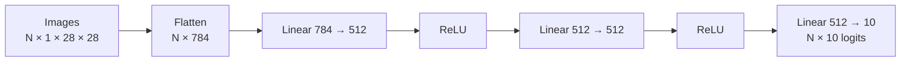

The product **28 × 28 = 784** gives the feature width for each grayscale image. The batch dimension remains separate.

A generic RGB image of 30 × 30 pixels would contain **30 × 30 × 3 = 2,700 values** when flattened per image. Paul used this separate example to explain the multiplication; it was not the input size of the FashionMNIST model.

The default `nn.Flatten()` begins at dimension 1, preserving the batch axis. It does not collapse the entire batch into one long vector. Also, **`unsqueeze` is a different operation**: it inserts a dimension of size one rather than merging dimensions. [Flatten reference](https://docs.pytorch.org/docs/2.14/generated/torch.nn.modules.flatten.Flatten.html), [unsqueeze reference](https://docs.pytorch.org/docs/2.14/generated/torch.unsqueeze.html)

### Linear layers and hidden widths

“Dense” and “fully connected” commonly refer to the kind of layer represented by `nn.Linear`. A hidden layer describes its position in a network; it is not always a synonym for a linear layer.

For the first linear layer, 784 is the input feature width and 512 is the output feature width. The next linear layer accepts the previous layer’s 512 outputs. The last layer outputs ten scores because the dataset has ten categories.

The hidden width of 512 is a hyperparameter. It can be changed, provided that adjacent dimensions remain compatible. A larger width adds parameters and generally increases computation and memory requirements.

### ReLU and logits

Activation functions introduce **nonlinearity**. The ReLU layers keep positive inputs and map negative inputs to zero. Dropout serves a different purpose; it is not the explanation for this nonlinearity.

The final layer returns **logits**, which are raw scores. They need not be positive or add up to one. The class’s multiclass cross-entropy loss accepts logits directly, so a separate softmax should not be added before that loss. [CrossEntropyLoss reference](https://docs.pytorch.org/docs/2.14/generated/torch.nn.CrossEntropyLoss.html)

### How `forward` actually gets called

Sumanth asked why the code did not explicitly invoke the forward method. The precise answer is that calling **`model(X)`** uses `nn.Module`’s call machinery to invoke the defined forward computation. Calling the module instance is the standard approach and also handles registered hooks. Merely defining a method inside a Python class would not, by itself, make it run automatically. [nn.Module reference](https://docs.pytorch.org/docs/2.14/generated/torch.nn.Module.html)

---

## 🔁 Training: Loss, Backpropagation, and Parameter Updates

Paul framed the training setup around four ingredients: **data, model, loss function, and optimizer**.

For the live multiclass problem, the selected loss was **cross entropy**, and the optimizer was **stochastic gradient descent (SGD)**. Adam and RMSprop were mentioned as alternatives; the class did not compare them experimentally.

### A batch-level training step

The loop performed these operations for each batch:

1. Put the model in training mode.
2. Obtain features and labels from the loader.
3. Move both to the selected device.
4. Run the model on the features to obtain predictions.
5. Compare predictions with labels using the loss function.
6. Compute gradients through backpropagation.
7. Let the optimizer update the model’s parameters.
8. Clear old gradients for the next update.

Here is the exact inner-loop order in the repository’s FashionMNIST Quickstart:

```python
pred = model(X)
loss = loss_fn(pred, y)

loss.backward()
optimizer.step()
optimizer.zero_grad()
```

*Companion excerpt: [10_official_quickstart.ipynb](https://github.com/sourangshupal/pytorch-primer/blob/main/notebooks/10_official_quickstart.ipynb); `X` and `y` have already been moved to the selected device.*

The companion toy training notebook uses the equally familiar arrangement of clearing gradients **before** calling `backward`. The essential condition is that gradients intended for a fresh update do not accidentally include the preceding update.

### Keep these three operations separate

| Operation | What it does |
|---|---|
| `loss.backward()` | Computes gradients of the loss with respect to relevant parameters |
| `optimizer.step()` | Uses those gradients to update the parameters |
| `optimizer.zero_grad()` | Clears the stored gradients; it does not reset learned weights |

The optimizer needs the gradients to make its update. Backpropagation computes them; it does not independently perform the optimizer’s update.

This distinction resolves Vidyasagar’s question about continuing training. Learned parameters remain in memory after an update. Clearing gradients allows new derivatives to be computed from the current parameter values. Continuing with the existing model instance therefore continues from its learned weights, while restarting the runtime can lose that state.

By default, repeated backward calls **accumulate** gradients. In ordinary minibatch training, clearing is done for each optimizer update, not merely once at the end of an epoch. Deliberate gradient accumulation is also a valid technique, including for large models; it must be an intentional loop design. [PyTorch guide to zeroing gradients](https://docs.pytorch.org/tutorials/recipes/recipes/zeroing_out_gradients.html)

### What “loss” and “learning rate” mean here

Loss measures how predictions compare with the targets under a chosen mathematical objective. Cross entropy is not simply “actual minus predicted”; the subtraction analogy in class was a high-level explanation of error, rather than its formula.

The learning rate controls the scale of the optimizer’s update. Paul warned that an excessively high value can make training unstable. A smaller value may require more updates, but a larger value does not guarantee faster convergence or better results.

The goal is to reduce the objective while retaining useful behavior on unseen data. An optimizer is not guaranteed to discover a global minimum in a neural network’s nonconvex loss landscape.

### Epochs, steps, and printed losses

An **epoch** is a pass through the training dataset. A **step** normally processes one minibatch and performs one update. An epoch can therefore contain many forward/backward/update steps.

The condition involving `batch % 100` controlled **logging frequency**. Several printed losses in one epoch do not mean several epochs occurred, nor do they mean the dataset was divided into only ten training steps.

The live run used **five epochs**. Paul observed decreasing loss and improving test accuracy, starting around 50% accuracy in the first epoch. He had not fixed a random seed, so participants were not expected to reproduce exactly the same values.

---

## 🧪 Evaluation, Argmax, and Reading Results

The evaluation loop served a different purpose from training: measure performance using the current parameters, without updating them.

Paul used two controls together:

- **`model.eval()`** selects evaluation behavior for modules such as dropout and batch normalization.
- **`torch.no_grad()`** prevents the enclosed operations from being recorded for gradient computation.

These are independent mechanisms. Evaluation mode does not switch off autograd by itself. The simple linear/ReLU model has no dropout or batch-normalization layer, so changing the mode does not alter those particular layers’ behavior, but it remains a useful practice for models that later gain them. [nn.Module reference](https://docs.pytorch.org/docs/2.14/generated/torch.nn.Module.html)

### Argmax returns a position

Paul paused over a ten-score example to make one point clear: **argmax returns the index of the largest score, not the largest score itself**.

If the greatest score is at the last position of a ten-element vector, its zero-based index is **9**. That index can then be mapped to the corresponding class name.

For a prediction tensor arranged as batch × classes, `argmax(1)` chooses one class index per example. Comparing those indices with the labels gives the number of correct predictions.

Softmax and argmax are not interchangeable. Softmax converts scores into normalized class probabilities; argmax chooses the winning index. The repository also demonstrates that argmax over logits produces the same winning class as argmax after softmax.

### Loss and accuracy tell different parts of the story

The live output reported both **accuracy** and **average loss**. The tutorial averaged batch losses and divided the count of correct predictions by the number of examples.

Paul’s practical check was to look for loss falling and accuracy improving. A sudden spike prompted questions about the learning rate, data quality, mislabeled examples, or the architecture.

That observation is a starting point for investigation, not proof that a model is robust. More epochs are a hyperparameter choice rather than an automatic improvement. A perfect result is a reason to inspect the evaluation setup and task difficulty; 100% accuracy is not inherently impossible, and zero loss is not the definition of 100% accuracy.

The live tutorial checked the provided test split repeatedly to illustrate the loop. The repository’s training notebook adds the practical separation: use a **validation split** for tuning and reserve the test split for final evaluation. Avoid choosing settings by repeatedly optimizing against the final test results.

### One correct sample is a demonstration

After saving and reloading the model, Paul predicted the first test image. The reported predicted and actual label were both **ankle boot**.

He explicitly cautioned that the model was still basic and could make mistakes. Correctly predicting one image shows that the save/load/predict path works; it does not establish dependable performance across the task.

---

## 💾 Saving, Loading, and Resuming a Model

Paul emphasized that a usable trained model needs both:

1. **Architecture:** the layers and computation that define the model.
2. **Learned state:** the trained parameter values, plus relevant persistent buffers.

For the workflow demonstrated, the saved object was a **state dictionary**, which is loaded into an instance of the matching architecture.


The matching repository code is:

```python
torch.save(model.state_dict(), "model.pth")
print("Saved PyTorch Model State to model.pth")

model = NeuralNetwork().to(device)
model.load_state_dict(torch.load("model.pth", weights_only=True))
```

*Companion excerpt: [10_official_quickstart.ipynb](https://github.com/sourangshupal/pytorch-primer/blob/main/notebooks/10_official_quickstart.ipynb).*

The “all keys matched” message indicated that the stored entries fit the receiving model. A different output width or changed parameter names can cause loading to fail. The companion saving notebook deliberately demonstrates an architecture mismatch.

### File extensions are conventions

**`.pt` and `.pth`** are common PyTorch filename extensions. They do not, by themselves, specify whether a file contains a state dictionary, a general checkpoint, or another serialized object.

Saving a state dictionary is a recommended workflow, not an automatic rule that every PyTorch save contains only weights. A state dictionary can also contain registered buffers, such as batch-normalization statistics. PyTorch serialization uses pickle machinery internally even when a file has a `.pth` extension. [Saving and loading guide](https://docs.pytorch.org/tutorials/beginner/saving_loading_models.html)

### Checkpointing makes interrupted training recoverable

Vikki asked about training stopping midway. Paul described periodically saving checkpoints—for example, after every five, ten, or twenty epochs—and retaining a limited set of recent checkpoints.

Saving every epoch is possible, but storage and saving overhead influence the chosen frequency. The retention count and interval are policies to choose, not fixed requirements.

For **resuming training**, preserve more than an inference-only state dictionary: optimizer state and the current epoch/step are important, along with other training state where applicable. Restoring only weights does not necessarily recreate the same optimization trajectory. [Saving and loading guide](https://docs.pytorch.org/tutorials/beginner/saving_loading_models.html)

The repository’s saving notebook also demonstrates `map_location` for loading state saved on one device onto another. This is useful when a training-server checkpoint is later opened on a CPU laptop.

Netron and TorchViz were mentioned for inspecting models. Safetensors and other checkpoint/export formats were acknowledged, but the class did not implement those formats.

---

## 🧮 Returning to Tensor Fundamentals

After completing the end-to-end example, Paul revisited tensors and their operations. This ordering was deliberate: first see the whole model workflow, then understand the structures that support it.

A **tensor** is a multidimensional numeric structure. A scalar has rank zero, a vector rank one, a matrix rank two, and higher-rank tensors add axes. A tensor’s **rank** is the number of axes; its **shape** gives the size along each axis. For example, shape `(2, 3)` is more informative than merely saying “two-dimensional.”

PyTorch tensors support accelerator execution and automatic differentiation. They also work on CPUs; a tensor does not become a tensor only after being moved to a GPU.

### Ways the session created tensors

| Operation | Purpose |
|---|---|
| `torch.tensor(data)` | Construct a tensor from supplied Python data |
| `torch.from_numpy(array)` | Create a tensor linked to a compatible NumPy array |
| `torch.ones` / `torch.zeros` | Create a specified shape filled with ones or zeros |
| `torch.rand` | Create random values with a specified shape |
| A “like” constructor | Use another tensor’s shape and appropriate properties |

The discussion used small 2 × 2 and 2 × 3 examples to inspect the results. Those shapes were teaching examples; real model tensors can be much larger.

The companion tensor notebook gives this dtype demonstration:

```python
tensor1d = torch.tensor([1, 2, 3])
print(tensor1d.dtype)          # torch.int64

floatvec = torch.tensor([1.0, 2.0, 3.0])
print(floatvec.dtype)          # torch.float32
```

*Companion excerpt: [02_tensors.ipynb](https://github.com/sourangshupal/pytorch-primer/blob/main/notebooks/02_tensors.ipynb).*

**Precision terminology:** float16, float32, and float64 describe the number of **bits** in the representation, not the number of digits after the decimal point. Precision, supported operations, memory use, and hardware performance must be considered together. Smaller types are not universally interchangeable or faster. [Tensor attributes reference](https://docs.pytorch.org/docs/2.14/tensor_attributes.html)

### Inspect three attributes

Paul focused on **shape, dtype, and device**. These tell you the dimensions, numeric type, and location of the tensor. The tensor notebook was run on a CPU runtime because its small operations did not need a GPU.

### Indexing, slicing, and concatenation

The session then inspected rows and columns using NumPy-like indexing, selected portions with slicing, and joined tensors using **`torch.cat`**. Understanding which axis is being selected or concatenated matters more than memorizing an isolated result.

Matrix multiplication was highlighted as particularly relevant to upcoming attention implementations. It is a different operation from elementwise multiplication; the input shapes must satisfy the chosen operation.

### NumPy sharing is a CPU bridge

Compatible CPU tensors and NumPy arrays can share underlying storage, so modifying one can affect the other. That is the important meaning of the “bridge” shown in the tutorial. [PyTorch tensor tutorial](https://docs.pytorch.org/tutorials/beginner/basics/tensorqs_tutorial.html)

It does not mean ordinary NumPy arrays execute CUDA kernels, nor does it mean transferring data from CPU to a separate GPU requires no copying. CPU-to-GPU transfers remain a real part of the workflow and can cost time. [CUDA semantics](https://docs.pytorch.org/docs/stable/notes/cuda.html)

Ajinkya’s practical question was when to use `from_numpy`: use it when the existing data is a NumPy array. If starting directly from Python data or PyTorch operations, that conversion step may not be necessary. The distinction between `torch.tensor` and `as_tensor` concerns copying and reuse of storage where possible; the required dtype and device also affect what happens. [as_tensor reference](https://docs.pytorch.org/docs/2.14/generated/torch.as_tensor.html)

---

## 🗃️ Dataset and DataLoader: Two Different Responsibilities

Paul returned to data loading in a separate notebook because this interface is needed when working with your own training data.

**Dataset answers:** “What is the example at this index, and what is its label?”

**DataLoader answers:** “How should examples be selected, grouped into batches, and supplied to the loop?”

Downloading a dataset, representing its samples, and moving a batch to a GPU are distinct operations.

### The custom dataset contract

The class examined a directory of images and an annotation file that maps image names to labels. The key methods were:

| Method | Responsibility |
|---|---|
| `__init__` | Store paths, annotation data, and transform callables |
| `__len__` | Return the dataset’s number of samples |
| `__getitem__` | Load and return one sample and its target for a supplied index |

Annotations can be simple classification labels. In other vision tasks they may include bounding boxes or more detailed structures. The implementation must match the actual task and annotation schema.

For the illustrated file-backed dataset, the companion notebook’s item loader is:

```python
def __getitem__(self, idx):
    # Loads and returns exactly one (image, label) pair, given an index.
    img_path = os.path.join(self.img_dir, self.img_labels.iloc[idx, 0])
    image = decode_image(img_path)
    label = self.img_labels.iloc[idx, 1]
    if self.transform:
        image = self.transform(image)
    if self.target_transform:
        label = self.target_transform(label)
    return image, label
```

*Companion excerpt: [12_official_datasets_and_dataloaders.ipynb](https://github.com/sourangshupal/pytorch-primer/blob/main/notebooks/12_official_datasets_and_dataloaders.ipynb). This is a method from its dataset class, not a standalone function. The notebook explicitly says that the example requires your own image directory and annotation file.*

### Data quality becomes a shape problem

Paul gave several examples of real training failures:

- A predominantly RGB collection contains a few grayscale images.
- A few images have unexpected width or height.
- Some images have the wrong orientation.
- Samples contain duplicates or unsuitable content.
- An annotation is wrong or points to the wrong sample.

If a fixed-shape model or a batch-stacking operation receives incompatible shapes, training can fail. Collecting resolution, channel count, and other sample information during inspection makes debugging easier.

A grayscale image can be converted or replicated into a three-channel representation as part of preprocessing, but simply editing the stated channel count does not create missing color information. The transformation and model interface must agree.

### Iterate over batches rather than requiring everything in GPU memory

Paul connected data loaders with iterators, generators, and lazy loading. The useful principle is to prepare and process data in manageable portions.

A loader does not guarantee that every dataset is lazy: a dataset may already hold tensors in memory, or its `__getitem__` may read from disk on demand. The benefit comes from the combined dataset/loading design.

The expression **`next(iter(train_dataloader))`** obtains one batch for inspection. An ordinary loop can also iterate over the loader; iteration is not forbidden just because a dataset is large.

The class briefly mentioned `num_workers` and pinned memory. Worker count affects data-loading processes and should be tuned to the task and hardware. Pinned-memory use was deferred rather than demonstrated in depth.

---

## 🎨 Transforms: Prepare Features and Targets Deliberately

Transforms make raw data suitable for the model. Paul discussed resizing, cropping, zooming, and the broader topic of augmentation, without teaching a complete augmentation strategy.

A resize can increase or decrease an image’s dimensions. It is not automatically a pooling operation; pooling is a separate model operation with its own purpose.

### Two transform interfaces

- **`transform` modifies the feature**, such as an image.
- **`target_transform` modifies the label**, such as converting an integer category into a vector.

For the FashionMNIST images, the important sequence was:

1. Convert the image to the image-tensor representation.
2. Convert it to `float32` and scale its pixel range.

For the usual uint8 images in this example, **`v2.ToDtype(torch.float32, scale=True)`** converts the 0–255 representation to 0–1. This is dtype-based image scaling, not fitting a min/max scaler separately to each dataset. `v2.ToImage()` performs the image representation conversion; it does not supply that scaling itself. [ToDtype reference](https://docs.pytorch.org/vision/stable/generated/torchvision.transforms.v2.ToDtype.html)

### One-hot encoding was a separate demonstration

The transforms notebook showed a target label becoming a ten-element vector containing a one at the category’s index and zeros elsewhere. A lambda transform supplied the label conversion.

That does not mean the Quickstart’s integer labels should be replaced blindly. The main training example used class-index labels with cross entropy. Target representation, output shape, and loss function must be compatible.

Cross entropy can also accept properly formed floating-point class-probability targets, but that is a different target interface from the integer-index case used in the live model. [CrossEntropyLoss reference](https://docs.pytorch.org/docs/2.14/generated/torch.nn.CrossEntropyLoss.html)

### Fixed shape is a property of the demonstrated architecture

The linear model requires 784 features per example after flattening. Standardizing the image dimensions therefore makes sense for this model.

This should not be generalized into “no neural network can accept dynamic shapes.” PyTorch supports dynamic dimensions in appropriate models and export workflows; the permitted shapes still depend on the architecture and operations. [Dynamic shapes in torch.export](https://docs.pytorch.org/docs/stable/export.html)

Paul briefly revisited the “Build Model” notebook, noting that much of it repeated the architecture already explained and added print statements for inspection. A deeper optimization notebook and extensive hyperparameter tuning were deferred.

---

## 🧠 Autograd and the Computational Graph

The final technical topic was **automatic differentiation**. Paul treated backpropagation as foundational to training and urged participants to work through at least a small example by hand.

The class’s simple model was expressed as:

**z = xW + b**

Here, x is the input, W the weights, b the bias, and z the output of that affine operation. The loss compares the model output with target y. “Parameters” in this discussion referred primarily to weights and biases.

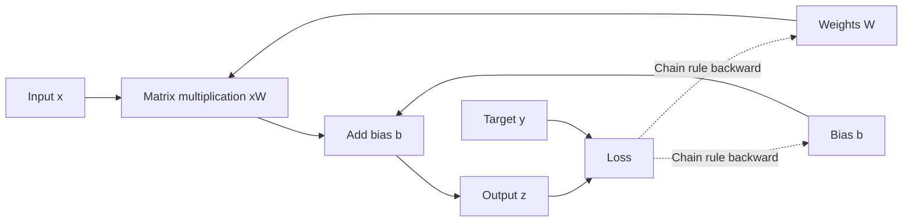

### What requires_grad enables

Setting **`requires_grad=True`** on relevant tensors allows PyTorch to record their differentiable computations. Trainable `nn.Module` parameters normally already have gradient tracking enabled.

For a training pass, the forward computation both calculates results and builds the operation history that the later backward pass needs. Gradients are computed during backward, but **the training forward pass must still be tracked**. Wrapping the training forward pass in `no_grad` would remove the history required to differentiate it. [Autograd tutorial](https://docs.pytorch.org/tutorials/beginner/basics/autogradqs_tutorial.html)

This is the precise distinction behind the class’s discussion of “gradients during backward” and “no gradients for prediction.”

### grad_fn, backward, and grad

The session inspected gradient-related objects and then called `loss.backward()`. The computation graph records how results were obtained, allowing the chain rule to propagate derivatives backward.

- **`grad_fn`** identifies the tracked operation that produced a non-leaf result.
- **`backward()`** initiates derivative computation.
- **`W.grad` and `b.grad`** hold gradients for relevant leaf parameters after backward.
- The optimizer then uses those values to update the parameters.

PyTorch creates these graphs dynamically as operations run. The computation graph is a record of a particular computation; it is related to the model’s implementation, but it is not simply another name for every persistent model object.

### Disable tracking when the task calls for it

The class introduced three related ideas:

| Mechanism | Intended meaning |
|---|---|
| `requires_grad` | Whether a tensor participates in gradient tracking |
| `torch.no_grad()` | Disable tracking for operations within a block |
| `detach()` | Obtain a tensor detached from the existing autograd history |

Paul demonstrated no-grad use for evaluation and mentioned detach without developing a practical use case. The deeper Jacobian-product material was explicitly skipped.

Autograd saves substantial implementation work, but understanding the chain rule still helps diagnose training. The instructor’s expectation was that participants should be able to explain a small forward pass, loss calculation, derivative, and weight update rather than treat a training call as an unexplained event.

---

## 🏗️ The Open-Floor Discussion: SLMs, RAG, and Production Scale

The dedicated Q&A expanded beyond PyTorch into why the course emphasizes model engineering.

### Specialized models and hybrid systems

Paul described adapting an existing model to a **domain-specific task**, including specialized tool calling. Good task data is a prerequisite: for a tool-selection model, examples need to connect queries with the appropriate tool or response.

He argued that a specialized model can sometimes reduce repeated use of a general-purpose model and simplify part of a system. Those benefits need to be established for the actual workload. Small-model size does not automatically guarantee adequate quality, low total cost, or fewer reasoning tokens.

The conversation also explicitly included **hybrid systems**: a RAG pipeline can retrieve information and call a self-hosted specialized model. An SLM and RAG do not have to be alternatives.

The model families mentioned for future practical work included Qwen, Llama, and Microsoft Phi. The instructor intended to use models that fit the available compute, rather than train a frontier-scale model from scratch. Parameter-count and dollar figures in the discussion were rough illustrations, not hardware-sizing formulas.

### Retrieval quality and dependency bottlenecks

Shashank, Amit, and Nilesh explored the limits of RAG. Paul’s useful systems point was that a RAG application involves several components: retrieval/storage, embedding, optional reranking, generation, and possibly extra validation.

If retrieval returns the wrong context, a larger generator alone may not repair the answer. More processing stages can also add latency. The instructor described metadata filtering and tenant separation as ways he had seen larger document collections managed; he did not give a universal document-count limit.

Anuragh then asked what production-grade means beyond deploying to a cloud. Paul emphasized testing the **whole dependency chain**.

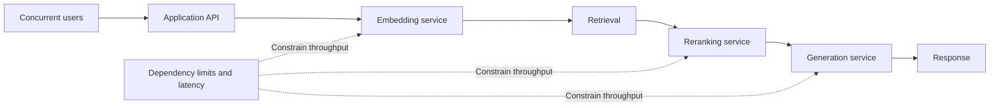

An application accepting 10,000 concurrent requests is not sufficient if a downstream service only permits a fraction of that traffic. Load tests must operate within actual capacity and rate limits. Locust was mentioned as a testing tool; caching and semantic caching were acknowledged, but not implemented.

### Continual updates, freezing, and retained capability

Vijayadevan asked how an enterprise model stays current and whether fine-tuning can damage its existing language ability. Paul proposed periodic retraining and freezing some parameters while updating others.

Freezing is a real mechanism, but **there is no universal 80:20 layer rule** and no guarantee that fine-tuning preserves all previous capabilities. Catastrophic forgetting has been observed during continual fine-tuning, so evaluate both the new domain behavior and capabilities you need to retain. [Empirical study of forgetting during continual fine-tuning](https://arxiv.org/abs/2308.08747)

His follow-up asked whether a layer can be identified as containing “sports knowledge” and then selectively excluded when training a finance model. The practical answer is that layers are not a neat catalog of domains. However, locating and editing factual associations is an existing research area, so this is a nuanced interpretability question rather than an unexplored impossibility. [ROME research project](https://rome.baulab.info/)

These were conceptual Q&A discussions. The session did not train an SLM, build RAG, implement load balancing, or demonstrate continual learning.

---

## 🗺️ What's Next

Paul said the **following week would begin Transformer theory**, with the theoretical explanation likely taking at least two sessions. Coding would follow after that theory.

Participants were encouraged to read **Attention Is All You Need** ahead of time and strengthen PyTorch and deep-learning fundamentals during the interval.

The broader roadmap he described was an initial emphasis on model/LLM engineering, followed by consumption through RAG, agentic RAG, agents, and security. These were future course topics, not work completed in this class.

---

## 💬 Live Q&A Highlights

The table includes in-flow clarifications and the extended open-floor discussion. Closely related questions are combined. One speaker labeled “Vidyasagar Sasumana” later introduced themselves as “Ritika”; the attribution below preserves that uncertainty.

| Question | Answer |
|---|---|
| **Abhishek: What is inference?** | Running a model to obtain predictions. It does not require deployment and can process one sample or a batch. |
| **Kalyan: Is TorchVision connected to OpenCV?** | They have overlapping vision capabilities, but TorchVision is its own package. The class also discussed Pillow/PIL image handling. |
| **Abhilash: What does scale=True do?** | In the demonstrated uint8-to-float image conversion, it rescales pixels from 0–255 to 0–1. It is distinct from fitting a statistical scaler. |
| **Salman: Does train=False disable gradients?** | It selects the dataset’s test split. Model mode and autograd controls are separate. |
| **Chat: What does [64, 1, 28, 28] mean?** | Batch size, channels, height, and width. Labels have shape [64] because each image has one target; the dataset still has ten categories. |
| **Priya: How do input size and batch size differ?** | Input size reflects each example and the architecture’s expected features. Batch size specifies how many examples are processed together. |
| **Chat: Why flatten before the linear stack?** | This model takes each 28 × 28 grayscale image as 784 features, while preserving the batch axis. Unsqueeze does not perform the same operation. |
| **Chat: Why 512 and why ten outputs?** | 512 is a tunable hidden width. Ten outputs correspond to ten target categories. Adjacent feature widths must match. |
| **Rushi: Why no pooling?** | The example is a fully connected baseline. Pooling is not required to demonstrate this workflow; a CNN would be a separate architecture. |
| **Sumanth K: Why is forward not called explicitly?** | Calling model(X) invokes nn.Module’s forward machinery. Use the module instance so PyTorch also handles its hooks. |
| **sunny: Can we cover vanishing/exploding gradients?** | Paul deferred these to deep-learning prerequisite study; they were raised but not explained in this session. |
| **Thomas: Why multiple losses per epoch and a modulo condition?** | An epoch contains many batch steps. The modulo condition selects which steps print progress; it does not define the number of epochs. |
| **Vidyasagar: Why zero_grad during training, and are learned weights retained?** | Clear stored derivatives between fresh optimizer updates. It does not erase weights, so continuing with the existing model retains learning; restarting the runtime can lose in-memory state. |
| **Abhilash / Rushi: zero_grad versus no_grad?** | zero_grad clears stored gradients for subsequent training updates. no_grad prevents recording operations in a block, typically for inference/evaluation. |
| **Gaurav: What if accuracy plateaus or loss becomes unstable?** | Inspect the loss behavior, learning rate, data, labels, and affected batches before changing settings. Switching an activation is an experiment, not an automatic remedy. |
| **Chat: Why do participants get different results?** | Paul had not fixed a random seed. Random initialization and other randomness can produce different metrics. |
| **Himani Dadem: Why PyTorch in a production LLM course?** | Transformer implementations and training need a framework for tensors and parameters. The initial modules expose these mechanics; later higher-level tooling builds on them. |
| **Raj: What is autograd?** | Automatic differentiation computes derivatives through the recorded operations using the chain rule. Other major deep-learning frameworks also provide automatic differentiation. |
| **Akhil: Can architecture be saved too?** | Yes, there are multiple persistence/export workflows. The demonstrated state-dictionary approach keeps the architecture definition and learned state separate. |
| **Ajinkya: When use from_numpy?** | When the starting data is a NumPy array. If data is created directly as tensors, that conversion may not be needed. |
| **Raj Raghur: tensor versus as_tensor?** | tensor constructs a copy; as_tensor reuses storage or the existing tensor when possible, subject to dtype/device requirements. |
| **MBI Pramod Kumar: Will these concepts help train/debug LLMs?** | Yes. Transformers are neural networks, and the tensor, training, and debugging foundations carry into LLM work. |
| **Gaurav Garg: Transformer theory or implementation next?** | Theory first, expected to take at least two sessions, followed by coding. Paul recommended using the intervening time to strengthen fundamentals. |
| **S Anoop: Are GPU and VRAM the same, and is 80 GB always needed?** | A GPU is the processor; VRAM is its device memory. The amount needed depends on the model and task, not a universal 80 GB requirement. |
| **Nilan Electronicist: Why local VS Code/UV if today uses Colab?** | Both routes are useful. The repository can run locally or in Colab, and later remote-GPU workflows may use SSH. |
| **Vikki: Can interrupted training resume, and how often save?** | Use checkpoints at a chosen frequency. Save appropriate training state and retain checkpoints according to storage/recovery needs; saving every epoch is possible but costs resources. |
| **Vidyasagar / self-identified Ritika: Are dropout, normalization, and skip connections available?** | Yes. PyTorch provides common layers and supports residual connections. LocalResponseNorm also remains available, even though it was not used here. [LocalResponseNorm](https://docs.pytorch.org/docs/2.14/generated/torch.nn.LocalResponseNorm.html) |
| **Vidyasagar / Ritika: Why researchers choose PyTorch despite extra code?** | Paul emphasized control over blocks, tensor operations, and the training process. Modern Keras also supports customization, so assess the concrete workflow. |
| **Shashank Gajawada: What can model engineering add beyond RAG?** | Specialized models may improve parts of a domain workload or reduce dependencies. Paul emphasized retrieval latency and scaling costs; actual quality/cost gains need experiments. |
| **Shashank: Can a custom model replace GPT in a RAG pipeline?** | A suitable specialized model can be the generator, and hybrid RAG-plus-SLM designs are possible. Match the model to the task rather than assume parity. |
| **Shashank: How much RAG is in the course?** | The roadmap includes both model engineering and RAG, with model foundations/fine-tuning prioritized first. Complex document structure affects RAG implementation difficulty. |
| **Shashank: Which open models will be fine-tuned?** | Paul mentioned Qwen, Llama, and Phi families within practical compute limits. The session did not establish a benchmark-matched substitute for any proprietary frontier model. |
| **Sai Kiran Akula: How are initial weights/biases chosen?** | Initialization schemes supply initial parameter values; Xavier and He/Kaiming were mentioned. Consult the layer’s actual initialization and test relevant choices. |
| **Sai Kiran: Where are initialization references?** | Paul shared a resource on initialization techniques. The precise paper/link is not recoverable from the transcript. |
| **Nilesh: How build deeper understanding with an application background?** | Combine theory with repeatedly training models and resolving actual failures. Paul suggested prerequisite material, MIT deep-learning resources, and Hands-On Machine Learning. |
| **Nilesh: Is autonomous-vehicle work the same stack?** | It includes vision/sensor pipelines and multiple engineering units. Deep-learning foundations carry over, but prepare for the specific role’s visual-computing and systems needs. |
| **Nilesh: What about physical AI and hardware-level roles?** | Hardware/robotics requirements can differ substantially from application work. Inspect the responsibilities in the job description rather than infer them from a broad title. |
| **Nilesh: What is a forward-deployed engineer?** | The discussion framed it around helping customers adopt and scale solutions. Paul emphasized that the actual job description matters more than the title. |
| **Kalyan Rad: Are vision Transformers simply the next CNN?** | They are another architecture family and were identified as a future syllabus topic. This class did not teach either architecture in detail or establish that CNN research has ended. |
| **Kalyan: Where start with LiDAR/point-cloud work?** | Paul suggested visual-computing foundations and resources such as Stanford CS231n, then more specialized courses. No point-cloud dimensionality lesson was developed. |
| **Kalyan: Why export for a CPU deployment/container?** | ONNX was discussed as a deployment option. ONNX Runtime supports CPU, GPU, and other providers; an export is not automatically faster, so benchmark the actual configuration. [Execution providers](https://onnxruntime.ai/docs/execution-providers/) |
| **Kalyan: Can inference be accessed outside Python, including JavaScript?** | The answer acknowledged deployment/inference tooling but did not demonstrate a JavaScript implementation. The exact integration remained unspecified in the session. |
| **Kalyan: How does LLM engineering relate to complex agents?** | The course emphasizes building/adapting models as well as consuming them. A specialized tool-calling model can become an agent component; voice agents also have interruption/context-handling problems. |
| **Amit Kumar: What should an organization consider before choosing an SLM?** | Start with usable task data, then evaluate quality, hosting/training cost, maintenance, and the intended time horizon. Paul favored a long-term view; savings are workload-dependent. |
| **Amit: Can SLM hosting be on-premises or private cloud?** | Yes, those are possible deployment choices. The discussion’s SLM examples concerned self-hosted models. |
| **Amit / Nilesh: Can RAG and a specialized model be combined?** | Yes. A retrieval pipeline can call the specialized model; complex or broader tasks may still need a larger model or additional components. |
| **Nilesh: Why did small local models fail at routing/tool calls?** | Task-specific training data and evaluation matter. A small pretrained model does not automatically know the organization’s tools or routing rules. |
| **Nilesh: Is RAG limited to a few hundred PDFs?** | No universal limit was given. Paul described much larger systems using tenancy and metadata filtering, while noting growing retrieval/correctness/latency challenges. |
| **Amit: How choose a generator for RAG?** | Run experiments against the use case. Paul offered rough parameter-count heuristics, but retrieval correctness, context handling, output quality, and measured constraints should drive selection. |
| **AG / Anuragh: What is an efficient route to model-engineering intuition?** | Implement several important papers or models, understand training and inference, then choose one to scale and deploy. Select the NLP or vision direction that matches the intended work. |
| **AG / Anuragh: How does Paul learn new technology?** | Track relevant papers and releases, test promising GitHub projects, and assess their specific benefit to an existing solution rather than adopt them solely because they trend. |
| **AG / Anuragh: Does production mean scaling and load testing too?** | Yes. Tests must cover real dependencies and their quotas. Locust can generate load, but it cannot remove service limits or infrastructure bottlenecks. |
| **AG / Anuragh: Can caching solve scale, and how describe projects in interviews?** | Caching can help some requests, but the full pipeline still needs measured capacity. State the concurrency tested, subscriptions/limits, and actual user requirements rather than claim unsupported scale. |
| **Nilesh: GPU alternatives to free Colab?** | Paul mentioned Kaggle. The session did not compare current quotas or pricing. |
| **Vijayadevan Rajendiran: How keep a specialized model’s knowledge current?** | Paul proposed periodic continual training on a chosen schedule. The appropriate update strategy depends on the use case and must be evaluated. |
| **Vijayadevan: Can fine-tuning harm grammar or earlier capability?** | Freezing some parameters can constrain updates, but retained capability is not guaranteed. Evaluate for catastrophic forgetting as well as domain improvement. |
| **Vijayadevan: Can we isolate a layer’s sports/finance knowledge?** | There is no simple one-domain-per-layer map. Interpretability and model-editing research exists, but selecting layers and measuring effects remains more nuanced than reading a layer’s label. |

Komal and Sanket did not contribute a separate substantive unanswered question. LD McCoy’s dashboard/resource-access question is reflected in Quick Updates; audio checks and repeated requests to be unmuted are omitted.

---

## 🔑 Key Pointers to Remember

- Understand the full path: dataset → transform → batch → model → loss → backward → optimizer → evaluation.
- FashionMNIST uses 28 × 28 grayscale images, ten categories, 60,000 training examples, and 10,000 test examples.
- N, C, H, W describes the image batch; label count and unique class count are different.
- Batch size, learning rate, epoch count, and hidden widths are choices to test.
- The class’s fully connected model flattens each image to 784 features and returns ten logits.
- Default nn.Flatten preserves the batch dimension; unsqueeze adds an axis instead.
- Cross entropy accepts logits; integer class-index targets require long/int64.
- Backward computes gradients, the optimizer updates parameters, and zero_grad clears stored derivatives.
- Clear gradients for fresh optimizer updates; deliberate accumulation is a separate strategy.
- The training forward pass records the history needed by backward.
- eval controls layer behavior; no_grad controls autograd recording.
- Argmax returns an index, which is then mapped to a class.
- More epochs or a single correct prediction does not establish generalization.
- A saved state dictionary needs a compatible receiving architecture.
- Training recovery needs appropriate checkpoint state, including the optimizer when resuming its trajectory.
- Tensor dtype numbers describe bits, not decimal places.
- CPU NumPy/tensor memory sharing does not remove CPU-to-GPU transfer costs.
- Inspect shape, dtype, device, labels, and data quality before guessing at a training error.
- RAG and specialized models can be combined; benchmark the complete workload.
- Production throughput depends on the whole service chain, including downstream limits.
- Fine-tuning quality includes retained capabilities as well as newly learned behavior.

---

## ✅ Action Items After Class 3

- [ ] Run the official Quickstart or the matching course repository notebook from beginning to end.
- [ ] Verify your environment, package availability, and detected device.
- [ ] Print a feature batch and label batch; explain every axis, their dtypes, and their devices.
- [ ] Trace 28 × 28 → 784 → 512 → 512 → ten outputs through the demonstrated model.
- [ ] Explain model(X), loss.backward(), optimizer.step(), and optimizer.zero_grad() in your own words.
- [ ] Build at least **five small network variants**, as Paul suggested, while keeping layer dimensions compatible.
- [ ] Experiment with a few hidden widths, batch sizes, learning rates, or epoch counts and record observations.
- [ ] Use a validation split for choosing settings and retain a final test split for evaluation.
- [ ] Save a state dictionary, recreate its architecture, reload it, and predict several samples.
- [ ] Inspect the custom dataset example using your own file paths before attempting to run it.
- [ ] Work through one small forward/backward calculation on paper.
- [ ] Review Python classes, indexing, iterators, generators/yield, NumPy basics, and deep-learning prerequisites where needed.
- [ ] Revisit the notebooks two or three times during the week; prioritize repetition and experiments.
- [ ] Read Attention Is All You Need before the upcoming Transformer theory sessions.

---

*📝 Notes compiled from the full Class 3 transcript — “26 July PyTorch Fundamentals,” Production AI / LLM Engineering, Krish Naik Academy — and matching companion notebooks in Sourangshu Pal’s PyTorch primer repository. Original transcript: `GMT20260726-143017_Recording.transcript.vtt`. No supplementary PDF was supplied for this class. Official documentation and research links clarify technical nuances; examples added from repository companions are identified in place.*

[Back to course index](Course_Notes_Index.md)

---

<a id="class-04"></a>

# 🧠 Class 04: Transformers 101, Part 1 — Embeddings, Context, and Self-Attention Intuition
### 📋 Production AI / LLM Engineering | Krish Naik Academy

**🎙️ Mentor:** Sourangshu Pal (addressed as Paul in the transcript)  
**⏱️ Duration:** 4 hours 11 minutes 34 seconds | **📅 Session:** Day 4 (1 August 2026)

**Class recording:** [1 Aug Transformers 101](https://learn.krishnaikacademy.com/web/courses/6a16f8935e281281cd6b1128?chapter=6a6e6a8149d9f2e46cc7a3d5)

This session builds the intuition for turning isolated numerical representations into representations that incorporate surrounding information. Paul starts with familiar NLP representations, uses exponential smoothing as an analogy for reweighting, explores embedding visualizations, and works through a four-token self-attention calculation. The substantial open-floor discussion revisits the distinction between calculated attention coefficients and learned model parameters.

The full Transformer architecture was **not** completed in this class. Query/key/value projections, multi-head attention, and the research-paper walkthrough were left for subsequent sessions. The calculation here is deliberately a simplified, parameter-free illustration; the notes distinguish its properties from those of a trained Transformer.

---

## 📰 Quick Updates

- The course dashboard contains live recordings; the course Notion page holds the syllabus, handwritten notes, and supporting links. Paul recommended bookmarking Notion so resources are easier to revisit.
- A Discord discussion space was opened for the batch, with separate areas for general discussion, paper drops, model drops, and news. Course-related doubts could be raised there or through the dashboard.
- The handwritten PDF for this session was uploaded under the 1 August entry at the end of class. The supplied companion, **Note.pdf**, contains the whiteboard diagrams used below.
- Earlier software-installation and PyTorch sessions remain the starting prerequisites. Paul emphasized that the first Transformer lessons would move slowly to establish the concepts before the practical implementation.

---

## 🔢 From Word IDs to Useful Numerical Representations

Machines operate on numbers, so text needs a numerical representation before a model can process it. Paul began with the simplest possible assignment: give words such as **dog**, **car**, **house**, and **bus** integer labels. This identifies the words, but the labels do not themselves describe what the words mean.

If dog receives ID 1 and car receives ID 2, the numerical gap between those IDs is an arbitrary consequence of the lookup table. It does not establish that a dog is semantically closer to a car than to a bus. Changing the IDs would change that numerical gap without changing any meaning. This becomes a poor basis for semantic comparison as the vocabulary grows.

The useful distinction is between **an identifier** and **a representation**:

| Object | What it tells us | What it does not establish by itself |
|---|---|---|
| Token ID | Which vocabulary entry is present | Semantic similarity to another vocabulary entry |
| One-hot vector | Which entry is active in a shared vocabulary space | Graded semantic relationships between different words |
| Count or TF-IDF vector | Which terms occur and how strongly they are weighted | The complete meaning or word order of a sentence |
| Learned dense embedding | A compact numerical representation learned from data | A guarantee that each coordinate has an obvious human label |
| Contextual representation | A representation informed by the particular surrounding sequence | A complete model prediction without further processing |

The whiteboard contrasts discrete IDs with decimal-valued representations, then shows one-hot encodings for a small vocabulary. For three distinct entries, the illustrated vectors are **dog = [1, 0, 0]**, **cat = [0, 1, 0]**, and **car = [0, 0, 1]**. Each word is distinguishable, but the representation supplies no special shared feature for dog and cat.

Paul's broader objective was to move toward a continuous vector space in which numerical operations can capture useful relationships. This does **not** mean that discrete IDs disappear from modern models: IDs remain the usual way to select vectors from an embedding table. PyTorch explicitly separates the dictionary size from the size of each retrieved embedding. [PyTorch embedding documentation](https://docs.pytorch.org/docs/2.14/generated/torch.nn.Embedding.html)

### The prerequisite techniques revisited

The discussion surveyed older approaches rather than deriving each algorithm:

| Technique | Place in the class discussion |
|---|---|
| One-hot encoding, or OHE | The basic sparse representation; useful for understanding vocabulary-based encoding, and sometimes for a small set of target classes |
| Bag of Words | A count-based text representation that improves on arbitrary labels but loses ordering information |
| TF-IDF | A lexical weighting method Paul highlighted as still useful; BM25 was mentioned as another established lexical-retrieval approach |
| N-grams | Local combinations of consecutive words, used to introduce how adding neighboring words can reveal more information |
| Co-occurrence matrices | Representations based on which words appear together in a corpus |
| Word2Vec | A familiar learned representation, with CBOW and Skip-gram named as its two variants |
| GloVe and fastText | Additional established word-representation methods discussed by the class |
| ELMo | Mentioned as part of the movement toward contextual representations, beyond the simpler classical techniques |

CBOW and Skip-gram were treated as complementary directions: the surrounding words can be used to predict a center word, or a center word can be used to predict surrounding words. Their training objectives were not implemented here. Likewise, the lecture did not reproduce the GloVe algorithm; its official project describes learning from aggregated global word-word co-occurrence statistics. [Stanford GloVe project](https://nlp.stanford.edu/projects/glove/)

A recurring clarification was that **a vector is a mathematical form**, while an embedding is a particular use of that form to represent an item. Merely converting text into numbers does not guarantee that the numbers encode rich semantics. For this class, Paul asked learners to accept that suitable input vectors already existed and concentrate on the operation that combines their information.

---

## 🪟 Sequences, Sliding Windows, and the Limits of Local Context

Language is sequential: order helps determine meaning. Paul illustrated this with **“My name is Paul”** and a rearrangement of the same words. The vocabulary stays the same, while the sentence's grammatical interpretation changes. This is why identifying words alone does not solve language understanding.

He then used **“I am going to London”** to explain local context. From the full sentence, one can answer **who** is going and **where** they are going. A question about **when** cannot be answered from the sentence because no date or time is supplied. This small example ties context to the information that is actually present, rather than to information a reader might assume.

Choose **going** as a center word and examine neighboring positions. Looking left and right produces a bidirectional neighborhood; looking in one direction produces a unidirectional neighborhood. A **sliding window** moves that center through the sequence, so the next center might be **to**, followed by **London**.

The PDF's sketch has arrows from the center word toward its neighbors:

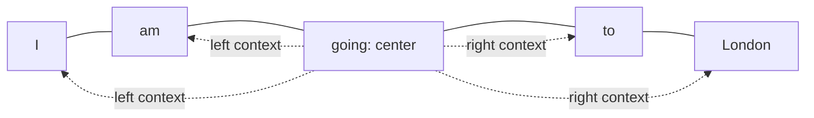

The class used **window size 2** for two positions on each side. Conventions differ across implementations, so always check whether a window parameter means a radius around the center or a total number of positions. An n-gram is also a different object: a bigram contains two consecutive tokens; a center plus two neighbors on each side is not, by definition, a bigram.

### Why adding nearby words helps, but is not enough

One neighboring word may leave an expression ambiguous. Expanding a window can supply a subject, a qualifier, or an object that makes the phrase easier to interpret. Paul asked the class to consider progressively larger windows and stressed that there is no universally perfect window size.

The limitation is that an important dependency may lie outside the chosen neighborhood. Increasing the window helps only until the relevant information is included, and a fixed local rule cannot know in advance which distant word will matter most. The lesson's main direction is therefore to **connect representations using relevance**, rather than to rely only on physical adjacency in the sentence.

The discussion of two-, three-, and larger-word neighborhoods should be retained as intuition, not as a rule that three is always optimal for GloVe or for language modeling. A useful window depends on the corpus, objective, and representation method.

### The same idea across other data types

Paul briefly compared modalities to make the meaning of “sequence” concrete:

- **Time series:** observations have a temporal order. Changing their order changes the process being described.
- **Audio:** sound evolves over time. A mel spectrogram was shown as a way of visualizing time-frequency information, and earlier CNN-based audio classification was mentioned as an example of working with that visual representation.
- **Video:** the order of frames matters; a frame can be treated as an image, but the video adds a temporal sequence.
- **Images:** the whiteboard divides an image into patches, with several pixels inside each patch. This emphasizes spatial structure rather than an inherent reading order like a sentence.

For precision, images **can** be represented as a sequence of patches in a vision Transformer; the fact that an image starts as a spatial grid does not prohibit a sequence representation. [Hugging Face glossary: image patches](https://huggingface.co/docs/transformers/glossary#image-patch)

The modality discussion was a conceptual bridge. No audio-processing, vision, or time-series model was implemented in this session.

---

## 🌊 Exponential Smoothing as an Analogy for Reweighting

Before moving to attention, Paul introduced a familiar time-series operation: use weighted information from current and past observations to form a smoother representation. The idea is that a data point need not be interpreted entirely in isolation; previous information can affect the value used to describe the current state.

The formula actually written in the companion PDF is:

$$
s_t = \beta x_t + (1-\beta)s_{t-1}
$$

Here:

- \(x_t\) is the current observation.
- \(s_{t-1}\) is the previous smoothed value.
- \(s_t\) is the new smoothed value.
- \(\beta\) determines the balance between current and previous information.

With the board's example **β = 0.9**, the current term receives a coefficient of 0.9 and the previous smoothed term receives 0.1. Increasing one coefficient reduces the other because the two add to one. This is the “control” intuition: choose how strongly each source influences the result.

The class referred to exponential weighted averages, exponential moving averages, and simple exponential smoothing. The important object here is the recurrence shown above; a plain moving average is a related smoothing idea but uses a different weighting rule.

### What the noisy-curve sketch was intended to show

The PDF draws a noisy time series, an intermediate bell-shaped weighting illustration, and a final curve with less noise. Nearby points are described as receiving stronger influence, while far-away points receive weaker influence. Paul repeatedly made clear that the bell-shaped result was an **assumed illustration**, not a claim that arbitrary time-series data becomes normally distributed after smoothing.

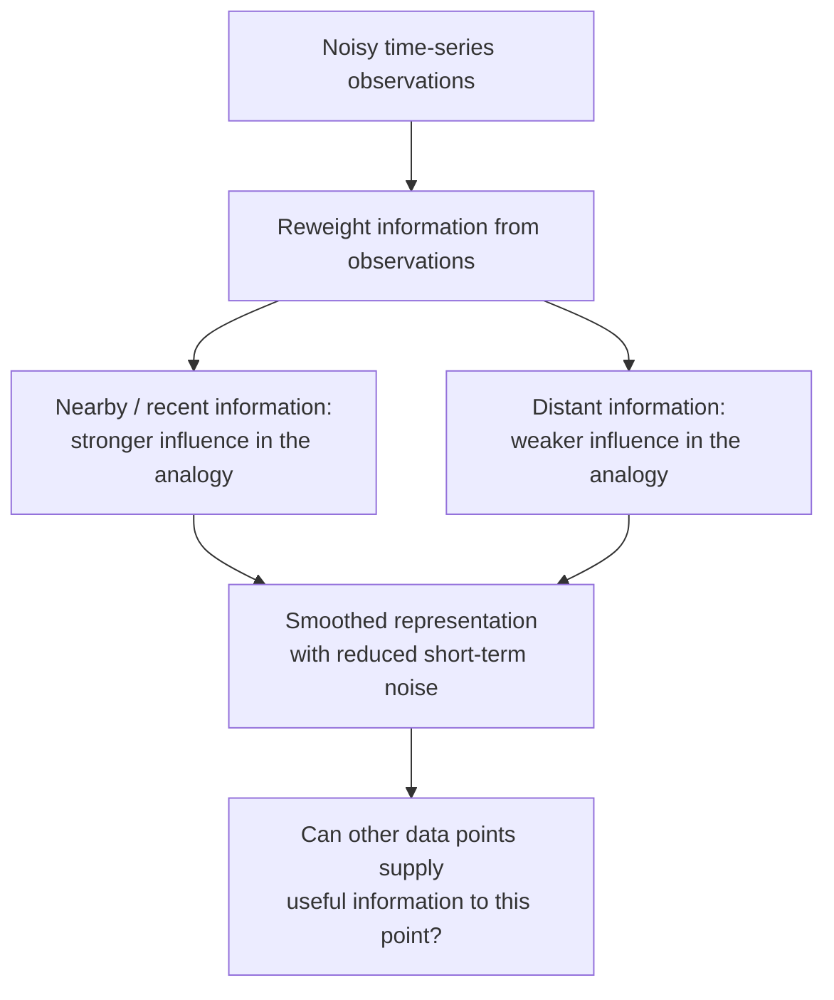

The arrows reproduce the whiteboard's teaching structure: noisy observations → reweighting → a smoother representation → a question about context. They are not a new algorithm or a guarantee about the final shape of the data.

In response to questions, Paul also explained that the time-series process moves from past observations toward the present and future. The recurrence above uses the previous smoothed state; it does not revise the past using an unseen future observation. The bidirectional arrows in the broader whiteboard analogy should not be confused with that causal recurrence.

### The bridge to NLP

The transferable idea is **weighted influence**. If one representation contributes to another representation, the latter can contain information that was absent when it was considered alone. The time-series example offers an intuitive way to see that mechanism before dealing with a sentence's vectors.

The proximity rule does not transfer unchanged to language. A word close to the center may be less informative than a distant word. Paul explicitly returned to this distinction: in NLP, the useful relation can span a large gap. Attention must be able to express that relation rather than automatically suppress it because of distance.

---

## 🐈 Long-Range Context: “Noa Can Be Annoying, but She Is a Great Cat”

The central language example in the handwritten notes is **“Noa can be annoying, but she is a great cat.”** It creates a useful ambiguity: the beginning and the pronoun **she** do not by themselves establish what kind of entity Noa is. The final word **cat** supplies the answer.

Paul first chose **annoying** as a base word and expanded its neighborhood. A fragment such as **“be annoying but”** tells us little. A larger fragment such as **“can be annoying but she”** tells us more, and including still more of the sentence continues to reveal structure. Yet a narrow local window can still fail to connect **Noa** at the start with **cat** at the end.

The PDF's dependency arrows connect the center with its nearby words and also highlight the distant subject and the final identifying phrase:

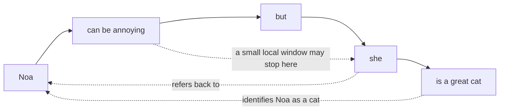

This example explains **why distance matters to a local method**. The needed evidence is present, but a short neighborhood may exclude it. A system working only with a fragment might treat the pronoun as referring to a person or to a generic female entity. Reading the complete sentence resolves that interpretation.

The point is not that every classical NLP method is incapable of representing a long dependency. It is that a fixed local representation has a limited information path, and simply enlarging a window does not provide a learned rule for which relationships deserve emphasis.

### The proposed transformation

Paul converted the conceptual sentence into tokens and then into vectors, using the notation **V₁, V₂, …**. He proposed a reweighting operation that would produce **Y₁, Y₂, …**, where each output is intended to carry more information about the surrounding sequence.

The supplied PDF shows this as parallel token/vector columns feeding a reweighting block and continuing to contextual output vectors. Its token columns are schematic, so the number of drawn columns should not be treated as the exact output of a real tokenizer.

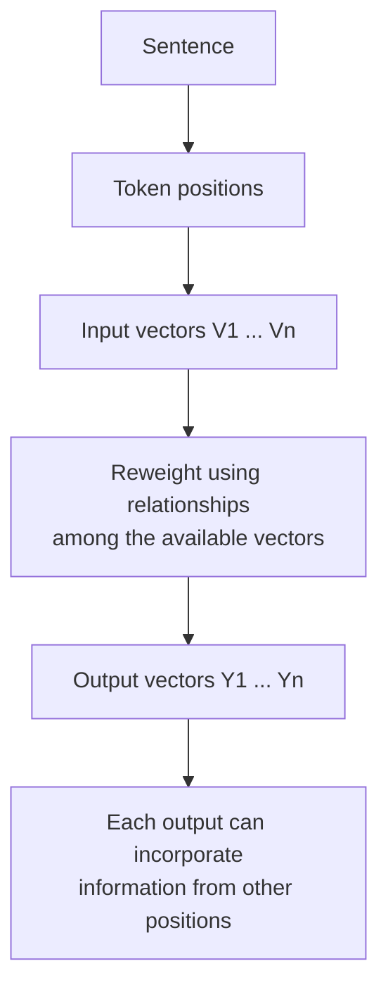

This is a **forward transformation**, not yet an account of training. The class has not introduced a prediction target, a loss function, an optimizer step, or learned query/key/value projections. Its question is narrower: given vectors, how can a calculation mix information between positions?

Tokenization was deliberately simplified to one word per token in the examples. Real tokenizers may emit whole words, subwords, punctuation, or special tokens, so neither “one word is always one token” nor a fixed characters-per-token estimate is a general definition. [Hugging Face tokenization algorithms](https://huggingface.co/docs/transformers/tokenizer_summary)

---

## 🌌 Exploring Embedding Spaces and Reading Their Visualizations

Paul paused the whiteboard explanation to show what numerical representations look like when projected into a form humans can inspect. The demonstration is useful because “vectors are close” is otherwise easy to repeat without understanding what is being compared.

### Word2Vec data in a 3D projector

One example used roughly **10,000 word vectors with 200 dimensions**. The screen allowed the class to rotate a 3D view, zoom, and select words. Paul looked at geographical terms, numbers, related words, and alternative spellings to see whether their neighborhoods appeared sensible.

There are two separate quantities:

| Quantity | Meaning in the demonstration |
|---|---|
| Number of points | How many represented items are displayed: approximately 10,000 words |
| Original vector dimension | How many coordinates describe each item: 200 |
| Display dimension | How many coordinates the plotted view uses: two or three |

A 200-dimensional vector does not become a three-coordinate original representation merely because the browser displays it in 3D. The view is a projection. Paul stressed that a dense cloud of points is difficult to interpret without selecting items and examining their nearest neighbors.

### Familiar words make relationships easier to inspect

Another visualization used examples such as **husband**, **wife**, **father**, **mother**, **daughter**, **son**, **prince**, and **princess**. Selecting husband returned a neighborhood containing several family and relationship terms. The class compared such neighbors with a word such as **computer**, whose context is different from the family examples.

The lesson is to ask whether a neighborhood is useful for the represented task, not merely whether two labels look close on the screen. A projected gap between prince and princess does not necessarily contradict a nearest-neighbor result computed in the original space.

The display also included axes with labels such as age and a residual direction. These were visualization choices; they do not establish that every learned embedding comes with a clearly named semantic coordinate. The later king/queen drawing uses named attributes as a teaching analogy, not as a recovered list of the model's actual dimensions.

### PCA, t-SNE, and UMAP

Paul changed the projection method from PCA to t-SNE and discussed the different visual density. UMAP was also mentioned. They are useful ways to explore high-dimensional data, but t-SNE is not simply an “advanced version of PCA,” and a denser-looking plot is not proof that the underlying embeddings improved.

PCA uses a linear projection. t-SNE emphasizes local neighborhoods and does not explicitly preserve global structure; its appearance also depends on its settings. A 2D or 3D view should therefore support inspection, while the original vectors and their chosen similarity measure remain the basis for numerical comparisons. [Scikit-learn manifold-learning documentation](https://scikit-learn.org/stable/modules/manifold.html#t-distributed-stochastic-neighbor-embedding-t-sne)

### An atlas of an entire dataset

The Apple Embedding Atlas demonstration moved beyond individual word labels to a large wine-review dataset, with approximately **160,000 points**. The class inspected metadata such as country, province, and price. Coloring points by price let Paul observe that much of the displayed data fell in the 10–100 range. This was an observation about that demo dataset, not a conclusion about wine prices generally.

An atlas combines a projected embedding map with the ability to inspect the original items and their metadata. It can reveal regions worth exploring without requiring the viewer to read the full dataset line by line. The official Apple project supports this general workflow of visualizing embeddings, exploring subsets, and examining individual points. [Apple Embedding Atlas](https://apple.github.io/embedding-atlas/)

Paul also mentioned Nomic Atlas as another route for building such a view and suggested that learners could start with an available embedding model rather than train one from scratch. No atlas-building code was supplied in this class.

### The leaderboard discussion

The class briefly looked at the MTEB leaderboard and model dimensions including **128**, **768**, and **4096**, with **1536** mentioned by students as another familiar size. These are examples of differing model outputs, not a universal minimum or a rule that larger vectors always perform better. Leaderboard entries and rankings are time-dependent; the session's comparison should not be treated as a current ranking.

The practical exercise is to compare the **representation dimension**, the **task**, and the **quality of the resulting neighborhoods**. Dimension describes capacity and resource use; it does not directly tell a learner how much useful context a model captured.

**Class companion resources:** The course's [Transformers 101 resource page](https://krishnaikacademy.notion.site/Transformers-101-3afeba9593d0804fa8e1e301f12ae2ff) supplies the [Embedding Projector](https://projector.tensorflow.org/), [Apple Embedding Atlas examples](https://apple.github.io/embedding-atlas/examples/), and [MTEB leaderboard](https://huggingface.co/spaces/mteb/leaderboard). The [TensorBoard projector guide](https://www.tensorflow.org/tensorboard/tensorboard_projector_plugin) explains the visualization workflow. These companion links recover useful resources whose exact URLs were not retained in the transcript.

---

## ⚖️ Generating Reweighting Coefficients from the Vectors Themselves

Returning to the PDF, Paul compared vectors for **king** and **queen**. The drawing labels possible shared attributes such as family, royalty, power, history, and gender. The purpose is to explain why two words can have a useful relationship even when they are not next to one another in a sentence.

The numbers in a learned vector are not normally a hand-written checklist of these attributes. The named features make the intuition accessible: related concepts can share patterns in their numerical representations, and those patterns can be compared.

Instead of introducing an unrelated external coefficient, Paul proposed deriving a score from two available vectors through their **dot product**. The board illustrates this for king and queen, then develops the same idea for each pair of token vectors in a short sentence.

### Keep the two meanings of “weight” separate

This distinction became the most repeated clarification in the session:

| Term | How it is obtained | Role |
|---|---|---|
| Calculated attention coefficient | Computed from the current input representations and then normalized | Determines how strongly one position contributes to an output |
| Trainable model parameter | Initialized or loaded, then adjusted through training when unfrozen | Defines transformations such as embedding lookup and linear projections |

Paul initially used **W** for the calculated coefficients. Students understandably associated this with the weights and biases of a neural network and began asking about Xavier or He initialization. He changed the notation to **A** to emphasize that the letter was arbitrary and that **this toy calculation was not initializing or updating parameters**.

A calculated coefficient can change when the input changes, even when all model parameters remain fixed. Conversely, during training, a model can update the parameters that help produce those coefficients. These are connected ideas, but they describe different parts of the computation.

The class's distinction should not be extended into the claim that real self-attention has no trainable parameters. A standard Transformer uses learned projections to create the representations used for attention. [Attention Is All You Need, model architecture](https://arxiv.org/html/1706.03762v7#S3)

### A dot product produces a scalar score

For two equal-length vectors, the dot product multiplies corresponding coordinates and sums them. Its result is a **scalar**. That scalar can then scale a vector; the scaled result is again a vector. Summing several such scaled vectors produces the final output vector.

The class uses these operations in two distinct places:

1. **Compare two input vectors** to obtain one score.
2. **Multiply a normalized scalar coefficient by a vector**, then add the contributions.

Although the spoken explanation sometimes uses “vector multiplication” broadly, these are not all the same operation. In particular, the dot product is not a cross product, and scalar-vector multiplication is not a second vector-vector dot product.

### Dot product versus cosine similarity

Several students asked whether the calculated score was cosine similarity. Paul directed them to the denominator of the cosine formula. A dot product supplies the numerator; cosine similarity additionally divides by the product of the vector lengths:

$$
\operatorname{cosine}(u,v)=\frac{u\cdot v}{\|u\|\,\|v\|}
$$

Thus, an ordinary dot product can reflect both direction and magnitude, while cosine similarity removes the magnitude factor. They coincide when the compared vectors have unit norm. Numerical implementations also protect against a zero denominator. [PyTorch cosine-similarity documentation](https://docs.pytorch.org/docs/2.14/generated/torch.nn.functional.cosine_similarity.html)

Cosine similarity was discussed as a familiar tool for embedding comparison and retrieval. It is not the definition of semantic search, and it is not the exact operation used at every stage of attention. The present example is about producing and using attention coefficients.

---

## 🏦 The Complete Four-Token Walkthrough: “Bank of a River”

To reduce the amount of writing, Paul replaced the longer cat example with **“Bank of a river.”** Here the surrounding words can help resolve the meaning of **bank**. The whiteboard maps the four words to four vectors and sends them through a block labeled **REWEIGH**, producing four contextual outputs.

| Position | Word in the teaching example | Input representation | Output representation |
|---|---|---|---|
| 1 | Bank | V₁ | Y₁ |
| 2 | of | V₂ | Y₂ |
| 3 | a | V₃ | Y₃ |
| 4 | river | V₄ | Y₄ |

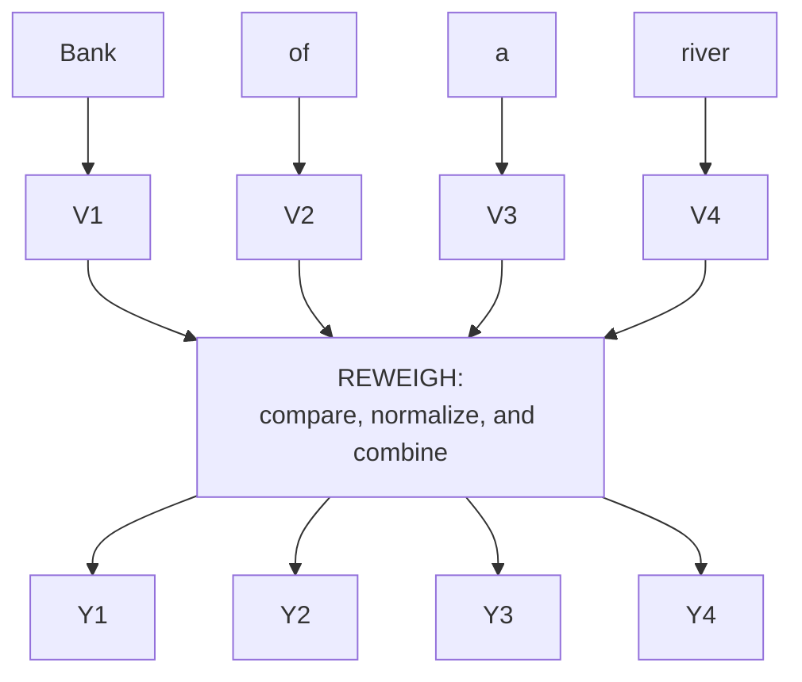

### Step 1: Fix the first base vector and compare it with all positions

For V₁, the board calculates:

$$
s_{11}=V_1\cdot V_1,\quad
s_{12}=V_1\cdot V_2,\quad
s_{13}=V_1\cdot V_3,\quad
s_{14}=V_1\cdot V_4
$$

The board calls these unnormalized values **W₁₁, W₁₂, W₁₃, W₁₄**. Here, the letter **s** makes it easier to distinguish the raw scores from the final normalized coefficients. This is a notation clarification of the same calculation, not a separate implementation.

The first index identifies the position whose output is being formed. The second index identifies the position that may contribute information. Every row holds a different base position fixed.

Including V₁·V₁ is allowed. In an unmasked self-attention example, the current position is one of the available sources. It is not excluded merely because its information might also be present elsewhere in the calculation.

### Step 2: Normalize the scores for that base position

Paul wrote that the final row of coefficients should **sum to one**. With the normalized coefficients denoted by a₁₁ through a₁₄:

$$
a_{11}+a_{12}+a_{13}+a_{14}=1
$$

The normalization is performed for each base position's row. It does not mean that every coefficient equals one, and it does not mean that the entire matrix has a single total sum of one.

The class used “normalization” broadly and mentioned min-max scaling during Q&A. For actual scaled dot-product attention, the standard operation is **softmax across the source positions**, which gives nonnegative coefficients summing to one. Ordinary min-max scaling alone does not impose that sum-to-one property. Scaling and normalization support the numerical behavior of attention; they do not simply make matrix multiplication cheaper because the numbers lie between zero and one. [PyTorch scaled dot-product attention](https://docs.pytorch.org/docs/2.14/generated/torch.nn.functional.scaled_dot_product_attention.html)

### Step 3: Use the coefficients to combine the vectors

The first output is the weighted sum shown in the PDF:

$$
Y_1=a_{11}V_1+a_{12}V_2+a_{13}V_3+a_{14}V_4
$$

Each coefficient scales the corresponding source vector, and the scaled vectors are added. The result is one output vector for the first position. It can therefore incorporate information from **river**, rather than represent **bank** in isolation.

The score calculation and the weighted sum serve different purposes. The first determines **how much** a source should contribute; the second carries the source vector's actual numerical information into the output. This answers the repeated question of why a score is calculated and then multiplied by a vector again.

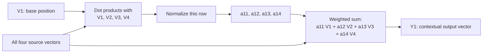

### Step 4: Repeat with each other base vector

Next, hold V₂ fixed, obtain its coefficients, and form Y₂. Repeat for V₃ and V₄:

$$
\begin{aligned}
Y_2 &= a_{21}V_1+a_{22}V_2+a_{23}V_3+a_{24}V_4 \\
Y_3 &= a_{31}V_1+a_{32}V_2+a_{33}V_3+a_{34}V_4 \\
Y_4 &= a_{41}V_1+a_{42}V_2+a_{43}V_3+a_{44}V_4
\end{aligned}
$$

The last line on the handwritten board repeats the label Y₃; the four-output calculation and surrounding explanation establish that this final row corresponds to **Y₄**.

The coefficients are **not randomly assigned to source vectors**. For output row i, aᵢⱼ multiplies source Vⱼ. Changing that association would change the operation. This is the indexing issue Paul clarified when students asked about W₂₁ and whether it should multiply V₁ or V₂.

The raw toy scores have a useful mathematical nuance: V₁·V₂ and V₂·V₁ are equal. Their normalized coefficients need not be equal, because the two rows can have different normalization denominators. In a full model, different learned query and key projections add another reason that attention need not be symmetric.

### What the outputs do, and what they do not yet do

Y₁ through Y₄ are **intermediate representations**. They are not a translation, a next-token probability, or an answer to a question. Other blocks and a task-specific objective are needed to turn those representations into a trained system's output.

Paul used “more context” to describe the intended result: an output includes a mixture of available information rather than only its original vector. That is a structural property of the calculation. It does not prove that arbitrary input vectors will produce a correct semantic interpretation. For example, mutually orthogonal one-hot vectors do not automatically reveal that **it** refers to **animal** in a sentence.

This is why the toy example is valuable as a mechanism while still leaving learned representation quality and the rest of the Transformer architecture for later lessons.

---

## 🧩 Understanding the Four Whiteboard Observations Correctly

After the calculation, Paul wrote four observations: no weights had been trained, order had no influence, proximity had no influence, and the calculation was shape independent. They summarize the intended toy example, but each needs a precise scope.

| Whiteboard observation | Meaning for this class's simplified calculation | Boundary to remember |
|---|---|---|
| “I have not trained any weights” | The coefficients were calculated from supplied vectors; no optimization step was performed | A real model can contain learned embeddings and learned attention projections |
| “Order has no influence” | No positional information was supplied to the bare all-to-all calculation | Full language models require a way to represent order; changing word order can change meaning |
| “Proximity has no influence” | A position is not restricted to its immediate neighbors in the illustrated unmasked block | Allowed connections depend on the attention mask and architecture; access does not imply equal importance |
| “Shape independent” | Combining equal-width vectors can preserve the vector width in the output | Dimensions must still be compatible; intermediate tensors do not all have the same shape |

### Order independence is a property of the bare operation

The all-to-all toy block has no instruction saying “this word is first” or “this word is ten positions away.” Reordering its inputs therefore reorders the associated outputs rather than creating a representation of grammar on its own. The technical term is **permutation equivariance**.

Paul's answer to Kalyan made a useful distinction between that small block and a complete network trained on ordered language. For a full Transformer, positions still matter. The original architecture explicitly adds positional information because attention without recurrence or convolution otherwise lacks sequence order. [Attention Is All You Need, positional encoding](https://arxiv.org/html/1706.03762v7#S3.SS5)

A model's ability to cope with a slightly scrambled phrase is not evidence that language order is irrelevant. It may use other clues to recover an interpretation.

### All-to-all access does not mean all sources receive the same weight

The distant **cat** can contribute to the representation of **Noa** because the illustrated block lets the positions interact. A nearby function word can receive less weight than a more informative distant word. The removal of a fixed locality restriction is the point; the model still needs to decide the importance of allowed sources.

For an autoregressive decoder, future positions are masked. “Every position can see every other position” applies to the unmasked teaching example, not to every attention layer used in production. [PyTorch attention-mask behavior](https://docs.pytorch.org/docs/2.14/generated/torch.nn.functional.scaled_dot_product_attention.html)

### Shape preservation does not erase dimensional constraints

If all four source vectors have d coordinates, scaling and summing them produces another d-coordinate vector. But the collection of four vectors, the table of pairwise scores, and one individual vector are different objects. A scalar coefficient is also different from a vector.

A token vector is not a matrix merely because it has many features; stacking several token vectors creates a matrix. Likewise, vocabulary size and embedding width need not be equal. Vocabulary size controls the number of entries in a lookup table; embedding width controls the length of each entry. [PyTorch embedding shapes](https://docs.pytorch.org/docs/2.14/generated/torch.nn.Embedding.html)

There is no general rule requiring a width to be a power of two. Paul mentioned 128, 256, and related values as common practical choices, but model design and implementation determine the actual constraints.

---

## 🛠️ Training, Batches, and the Boundary of Today's Example

Many open-floor questions concerned training, fine-tuning, multiple attention blocks, and very large corpora. Paul kept returning to the session's limited objective: understand one reweighting operation before adding the full network.

### Calculating a representation is different from training a model

The toy block takes existing vectors and produces new vectors. No parameter update happens in that demonstration. Training introduces an objective and updates trainable parameters to improve it. Backpropagation computes gradients for that process; it is not something that must run whenever an already trained model processes a prompt.

This distinction matters for Swati Gupta's example, **“The animal did not cross the road because it was tired.”** The sentence supplies context, and a forward attention computation can mix that information. A trained model's ability to use the relation meaningfully depends on learned representations and transformations. A parameter-free calculation can be executed without backpropagation, but that fact alone does not establish correct pronoun resolution.

Paul also used a RAG analogy: an existing vector representation can retrieve a relevant chunk without retraining the model for each retrieval. Retrieval and model training are separate operations. This was an analogy in the Q&A, not a RAG implementation or a demonstration that raw, untrained vectors understand the sentence.

### Batches, steps, and epochs

For a dataset too large to fit into memory at once, Paul explained breaking work into batches. Processing one batch is a step; completing a pass over the training dataset is an epoch. His simple illustration divides a dataset into ten batches, requiring ten steps for one pass.

An epoch, however, does not create direct attention links across separately processed examples. It exposes the model to the dataset through parameter updates. For a particular forward pass, a token can attend only to positions included in the permitted input sequence. Gaurav's question about a dependency in a much later chunk therefore concerns input construction and context handling as well as batching; that solution was not worked through in this lesson.

### Sentence boundaries and context windows

Paul mentioned start/end markers and punctuation while explaining how multiple sentences can be represented. Real tokenizers and models have their own special tokens, and punctuation is not automatically a reserved special token. A delimiter indicates a boundary; the attention mask determines which connections are permitted. Multiple sentences can share a sequence and interact when the architecture allows it. [Hugging Face glossary: token IDs and attention masks](https://huggingface.co/docs/transformers/glossary)

A model's context capacity constrains the token sequence it can process. It should not be confused with the width of an individual vector or with the number of examples in a training batch. The session did not implement long-context processing, cross-chunk memory, or a cache.

### What to watch during training

Swati Deepak Kumar asked whether loss alone could decide when to stop or whether to continue fine-tuning. Paul advised tracking loss over successive epochs, looking for a plateau, and also examining validation loss and validation accuracy. A decreasing training loss can coexist with disappointing validation behavior, so the model's actual task performance still matters.

He mentioned incorrect annotations and an unsuitable learning rate as possible explanations for problematic results. His practice was to inspect early training behavior and decide whether the configuration looked promising. The discussion did not establish a universal number of epochs, a requirement that loss reach zero, or a single criterion suitable for every task.

### GPU execution and recurrent models

The hand calculation writes pairwise operations one after another so a learner can follow them. Matrix-based implementations can express many of those operations together, and GPUs are designed to execute such numerical work efficiently. The point is about the hardware and the matrix formulation, not about self-attention “helping the GPU.”

In response to a question about LSTMs and GRUs, Paul distinguished their recurrent gates from the attention calculation. He also said that he still considers recurrent models for smaller-data problems. His example data-size thresholds were personal heuristics, not architecture-selection rules. The useful principle is to consider the task and available data instead of assuming that the newest architecture is always required.

---

## 🗺️ What's Next

Paul said the next class would begin by revising this self-attention calculation, then move toward **multi-head attention** and attention as part of the larger architecture. He also intended to begin the **Attention Is All You Need** paper walkthrough and introduce the **query/key/value** idea using a database analogy.

He mentioned learned linear layers as the point at which actual model weights and biases would enter the explanation. Detailed implementation was planned after the initial conceptual sessions. The transcript did not complete those topics here; diagrams suggesting additional attention blocks were briefly sketched and then set aside to keep this class focused.

The Illustrated Transformer and the 3Blue1Brown attention explanation were mentioned as supporting material. The course's [Transformers 101 resource page](https://krishnaikacademy.notion.site/Transformers-101-3afeba9593d0804fa8e1e301f12ae2ff) supplies [The Illustrated Transformer](https://jalammar.github.io/illustrated-transformer/) as further reading. The exact 3Blue1Brown video link was not preserved in the transcript or this resource entry.

---

## 💬 Live Q&A Highlights

The table covers both in-flow questions and the extended open floor. Near-duplicate doubts are merged, while substantive follow-ups are retained. Speaker names follow the transcript; **Urna** also identified herself orally as **Udnaya**, and **136** and **iPhone** are transcript display labels.

| Question | Answer |
|---|---|
| **Pralad:** What makes a window “sliding”? | The chosen center advances through the sequence, and its neighborhood changes with it. A window's width and the movement of its center are separate ideas. |
| **Question relayed in chat; name unclear:** Can a mel spectrogram be converted to an embedding? | Yes, with an appropriate representation model for that input. Paul distinguished this from directly applying a normal text embedding pipeline; the audio example was only a conceptual illustration. |
| **Kulkarni, first name unclear / Manoj:** Where do V₁ and V₂ come from? | For the toy calculation, assume an agreed numerical representation produced by a vectorization method. The class did not implement the conversion; useful semantic vectors and arbitrary numeric encodings are not interchangeable in quality. |
| **Sai:** How can high-dimensional embeddings be shown in 3D? | Reduce or project them into three display coordinates, then plot them. Paul mentioned Plotly and Matplotlib; the display does not retain every relationship of the original high-dimensional space. |
| **Shiv Prakash:** Is reweighting the same as gradient descent or backpropagation? | No. Reweighting is the forward combination of available representations; gradient-based training changes trainable parameters. |
| **Nandan:** Is importance based on Euclidean distance, and does reweighting edit the vector directly? | The class's attention example derives dot-product scores and uses normalized coefficients to scale source vectors. Similarity or distance choices depend on the representation and task; the lecture did not establish a universal metric. |
| **Vivek:** Does semantic search mean using contextual vectors? | Contextual representations can support semantic retrieval, but semantic search is a retrieval objective rather than a synonym for one vector type or for cosine similarity. |
| **Ritam / Kalyan Rad / Urna:** How can order be irrelevant when language needs order? | The bare calculation has no position input and connects the available vectors without a local ordering rule. A complete Transformer still represents positions; Kalyan's follow-up distinguished the small block from the full network. |
| **Shiva:** Is this logistic regression? | No. The demonstrated operation calculates pairwise scores and weighted sums to produce contextual vectors; it does not fit a logistic-regression classifier. |
| **Umesh:** Where is the query vector? | Query/key/value projections had not yet been taught. Paul asked learners to understand the mixing operation first and deferred that terminology. |
| **Bansur / Shivam Kumar:** Are the coefficients normalized, and is that min-max scaling? | The final coefficients in each output row are intended to sum to one. Standard attention uses softmax; min-max scaling alone does not guarantee that sum. |
| **Durga Rao:** How many attention blocks should be used? | The number is an architectural choice or hyperparameter. Paul did not select an optimum here and removed the multi-block sketch before teaching it in detail. |
| **Sarita / Athira:** Do these W values require Xavier or He initialization? | No initialization occurs for the calculated coefficients in this illustration. Initialization concerns trainable parameters; Paul switched the coefficient notation from W to A to reduce the confusion. |
| **Prem / Praveen Kumar:** Are vectors multiplied randomly? | No. The chosen base position is compared with every permitted source, and each coefficient remains matched to its source vector. The written calculation follows a consistent indexing scheme. |
| **Question relayed in chat; name unclear:** Why multiply a calculated coefficient by a vector again? | The pairwise score estimates a contribution, while the subsequent weighted sum carries source information into the output. These are different stages of the attention operation. |
| **Hemanth / S Anoop / Sridhar K:** Is the operation a cross product or cosine similarity? | It is a dot product for scoring. Cosine similarity includes vector-length normalization in its denominator; the weighted output is a sum of scalar-scaled vectors. |
| **Anusha:** Is including V₁'s contribution to Y₁ redundant? | A position can attend to itself as well as to other allowed positions. Self-information is a valid source; repeated information is not a reason to omit it automatically. |
| **Chandhruv:** Could the vectors simply be added instead? | The illustrated mechanism uses data-dependent coefficients, which an unweighted sum would not provide. Addition is nevertheless essential in the final weighted sum and is used elsewhere in neural networks. |
| **Anoop / Ritam Ghosh:** Is the result of a dot product a scalar or a vector? | The pairwise dot product is a scalar. Multiplying that scalar by a source vector gives a vector, and adding the scaled vectors produces Yᵢ. GPU use does not change these mathematical object types. |
| **Shivam:** Is there a metric that says how much context was captured? | No such metric was defined in class. Paul treated “more context” as intuition for the mixed representation; assessing usefulness requires a task and an evaluation method. |
| **Manoj / Shivam Kumar / RANJEEV TIWARI:** What is attention versus self-attention? | The class treated self-attention as the first attention block to understand. Precisely, self-attention relates positions within the same input; attention is the broader mechanism and can also connect different sources. |
| **Sachin Srivastava:** How should prerequisites be revised, and are paper drops implemented in class? | Paul pointed to the supplied deep-learning prerequisites and the ordered syllabus. Shared research papers do not automatically imply an in-class implementation; an implementation also depends on released material and session scope. |
| **Sachin Srivastava:** How can a learner pursue LLM research? | Paul said a useful recommendation needs the learner's background and did not give a specific research roadmap during this exchange. |
| **Kalyan Rad:** Do additional attention blocks explain next-word prediction or modern reasoning behavior? | Paul deferred the question to the complete architecture and its objective. One self-attention block is insufficient to explain a trained language model's entire behavior. |
| **Sridhar K:** What prerequisites are enough to get started? | Paul referred to the earlier PyTorch class and the shared prerequisite repository. The current lesson was the first actual Transformer-intuition session. |
| **Nitish Singh:** What information does each Y vector contain? | Each output mixes source information with its own row of coefficients. Different outputs can emphasize different sources; the complete collection is more informative than interpreting one coefficient as the entire sentence. |
| **Nitish Singh / Aishwarya:** Are these Y vectors already what gets stored in a vector database? | They are intermediate outputs in today's model illustration. An embedding visualization, an internal hidden state, and a vector-database entry serve different roles; no storage pipeline was demonstrated. |
| **Nitish Singh:** How can the same word, such as apple, have different meanings? | Surrounding words supply disambiguating context. Paul deferred the fuller account to later attention and representation lessons rather than treating the isolated word as sufficient. |
| **Nitish Singh / Sumit Mamtani:** What determines a vector's dimension? | The representation method or model defines its width. Vocabulary-based one-hot width depends on vocabulary size, while a learned embedding's width is a separate design choice; vectors compared by the dot product need compatible lengths. |
| **Vikas Gupta / Praveen:** Does a token mean a word, four characters, or three-quarters of a word? | A word was used as a token in the teaching example. Actual tokenization is model-dependent and may produce words, subwords, punctuation, and special tokens; average length estimates are not definitions. |
| **136:** Does “close points amplified, far points filtered” apply equally to time series and NLP? | It was introduced through the smoothing analogy. In language, a distant word may be crucial, and a nearby word may be less informative; the proximity heuristic is not the attention rule. |
| **Urna:** What does “no trained weights” mean? | No neural-network training or parameter update was performed in the toy block. The inputs were supplied, and the coefficients were derived from them. |
| **Urna:** Does shape preservation also apply beyond this example? | The current weighted sum preserves the common source-vector width. Later architecture must maintain compatible shapes, but intermediate projections and score matrices can have different dimensions. |
| **Ritam Ghosh / S Anoop:** Must input stop at one sentence, and must a 15-word sentence be split? | Fifteen words was treated as a very small example. Inputs can span sentences or paragraphs within model limits; the paper's translation setting was discussed as a dataset of paired sequences. |
| **Sameer Nandan:** How would medical or finance fine-tuning alter the model? | Fine-tuning was deferred until the actual trainable architecture was introduced. The current coefficient calculation is not a fine-tuning procedure. |
| **Sameer Nandan:** What is downloaded with a pretrained model? | The learned parameters are a central part of the checkpoint. The class did not inspect a checkpoint's files or loading code. |
| **Ilesh:** Are the example sentences a training dataset or input features? | They are inputs used to explain the transformation; no end task or training objective was defined in the demonstration. |
| **Ilesh:** Are V₁, V₂, and so on related to a model's context window? | They represent token positions within a supplied sequence. Context length concerns how many token positions can be processed, whereas an individual vector's width is a different quantity. |
| **Gaurav Garg:** What happens when a huge corpus does not fit in memory? | Paul explained batches, steps, and epochs. Processing the dataset in batches permits training, but an epoch does not directly connect tokens in separate examples through attention. |
| **Gaurav Garg:** How does a first chunk obtain context from a much later chunk? | The concern was raised, but no cross-chunk method was demonstrated. Input construction, memory, retrieval, or another architecture choice would be needed; batching alone does not answer it. |
| **RANJEEV TIWARI:** Are W₁₂ and W₂₁ the same, and which vector gets multiplied? | Raw dot products are symmetric in this toy case, but separately normalized coefficients can differ. For row 2, the coefficient associated with source 1 multiplies V₁; the base/source indices must stay consistent. |
| **RANJEEV TIWARI:** Can one vector represent several words, and do word counts cause different shapes? | A vector may represent a token, sentence, or larger item depending on the system. In this walkthrough each token uses the same width; text length and representation width are different concepts. |
| **RANJEEV TIWARI:** Does a larger vector guarantee all coordinates are useful? | No. Paul used the possibility of unused or less useful features to introduce pruning as a future topic. The class did not measure coordinate usefulness or establish a minimum training-data threshold. |
| **Swati Deepak Kumar:** Can forward and backward propagation be calculated manually? | Paul suggested revisiting deep-learning fundamentals and using a small two-layer network for a pen-and-paper exercise. Such a calculation was not performed in this class. |
| **Swati Deepak Kumar:** Is falling loss enough to decide when to stop or fine-tune? | Track its trend and also inspect validation loss and task metrics. Paul mentioned plateaus, annotation problems, and learning rate as factors; no universal stopping rule was established. |
| **iPhone:** Does self-attention help GPUs process faster, and how does it differ from LSTM/GRU? | GPUs efficiently execute parallel numerical operations; the attention calculation can use matrix operations. Recurrent models use a different gated, sequential structure, and their suitability still depends on the problem. |
| **Sai:** Are two sentences always processed in isolation? | Paul discussed boundary markers. More precisely, special tokens indicate structure, while masks and input construction control interaction; multiple sentences can share attention when allowed. |
| **Phanindhar Golla:** How does near/far influence work in the smoothing sketch? | The explanation concerned the sequential use of past information in exponential smoothing. Distant observations influence the present through the recurrence; the sketch was an intuition, not a literal instruction to delete distant points. |
| **Phanindhar Golla:** How were papers converted to Markdown for AI-assisted reading? | Paul referred to the Hugging Face paper-reading workflow he had used earlier and said other PDFs may need conversion. No conversion command or exact page link was preserved here. |
| **Subbu:** Will bias or linear layers be added later? | Yes, Paul planned to introduce a linear-layer block and its learned parameters later. The current calculation contains no learned linear transformation; whether a specific layer includes bias is configurable. [PyTorch linear layer](https://docs.pytorch.org/docs/2.14/generated/torch.nn.Linear.html) |
| **Arun Karnik:** What does “proximity has no influence” mean? | The Noa/cat example shows that a relevant distant token can contribute when all permitted positions are compared. The illustrated block is not restricted to a short neighboring window. |
| **Swati Gupta:** Are the input vectors necessarily learned embeddings? | The toy demonstration accepts numerical vectors and does not train their source. Actual models can use learned or pretrained embeddings; a simple encoding is mathematically usable without guaranteeing semantic quality. |
| **Swati Gupta:** Must pronoun resolution run backpropagation every time? | No parameter update is required for a forward pass or retrieval. Learned representations can still be crucial to meaningful resolution; the animal/road example did not demonstrate that arbitrary untrained vectors solve it. |
| **Swati Gupta:** Does today's Y already encode the final, exact importance of every word? | No. Paul emphasized that it is a mixed intermediate representation and that more of the architecture remained to be taught. The demonstration supplies no final task-level validation. |
| **Harsh:** Do embedding values learn during training or remain fixed? | It depends on whether the embedding parameters are trainable or frozen. Today's example performed neither case's training; it assumed available input vectors. |
| **Question relayed in chat:** How can papers be prioritized for reading? | Paul used adoption as a practical signal when selecting papers to read. This was his prioritization heuristic; the session did not develop a broader literature-review method. |

---

## 🔑 Key Pointers to Remember

- A token ID identifies an item; its arbitrary numerical value is not its meaning.
- A vector's width, the vocabulary size, the sequence length, and the training batch size are different quantities.
- A sliding window exposes neighboring positions; a useful dependency may still lie outside it.
- “Noa … great cat” demonstrates why a distant word can be essential context.
- Exponential smoothing introduces weighted influence; its proximity intuition is not a universal NLP rule.
- A 2D or 3D embedding plot is a projection of the original representation.
- Named attributes such as royalty or gender are teaching aids, not guaranteed labels for individual embedding coordinates.
- A pairwise dot product produces a scalar score.
- A normalized coefficient scales a source vector; the weighted sum produces an output vector.
- Each output row has its own coefficients and normalization.
- Attention coefficients calculated for an input are different from parameters learned during training.
- Self-attention is attention within the same sequence; its definition does not depend on the absence of learned weights.
- Bare attention has no position information; complete Transformers still need to represent order.
- Access to every allowed position does not assign every position equal importance.
- Y₁ through Yₙ are intermediate contextual representations, not final predictions.
- Processing an epoch does not create direct attention across separate chunks.
- Backpropagation is part of parameter learning; inference does not require updating weights for every input.
- The next lesson must add the missing architecture before training and model behavior can be understood fully.

---

## ✅ Action Items After Class 04

- [ ] Bookmark the course Notion page and locate the 1 August handwritten notes and resource links.
- [ ] Revise OHE, Bag of Words, TF-IDF, co-occurrence representations, CBOW, and Skip-gram where needed.
- [ ] Draw a sliding window over “I am going to London,” marking the center separately from its neighbors.
- [ ] Recreate the Noa/cat dependency sketch and explain which fact a short window can miss.
- [ ] Rewrite the PDF's exponential-smoothing recurrence and explain what β = 0.9 means under that notation.
- [ ] Reproduce all four rows of the bank/river calculation, keeping base and source indices consistent.
- [ ] Mark raw dot-product scores as scalars, final coefficients as normalized scalars, and Y outputs as vectors.
- [ ] Check that every coefficient row sums to one and that each coefficient scales the intended source vector.
- [ ] Explore an embedding projector: select a word, inspect its neighbors, and compare the projected view with the original representation dimension.
- [ ] Write a short explanation of the difference between a calculated attention coefficient and a trainable model parameter.
- [ ] Review the four whiteboard observations with their scopes, especially positional information and shape compatibility.
- [ ] Bring remaining doubts to the next revision session before moving into query/key/value and multi-head attention.

---

*📝 Notes compiled from the full Class 04 transcript — **GMT20260801-143026_Recording.cutfile.20260801214748976.transcript.vtt** — and the accompanying **Note.pdf**, for “[1 Aug Transformers 101](https://learn.krishnaikacademy.com/web/courses/6a16f8935e281281cd6b1128?chapter=6a6e6a8149d9f2e46cc7a3d5),” Production AI / LLM Engineering, Krish Naik Academy. All 13 PDF pages were visually inspected; the final page is blank. The diagrams above translate the supplied whiteboard structures. No executable class code or notebook was provided for this session, so no reconstructed code is presented. Linked primary documentation supplies concise technical clarifications where the live explanation was simplified.*

[Back to course index](Course_Notes_Index.md)

---

<a id="class-05"></a>

# 🔎 Class 5: Transformers 101, Part 2 — Queries, Keys, Values, and Contextualized Vectors
### 📋 Production AI / LLM Engineering | Krish Naik Academy

**🎙️ Mentor:** Sourangshu Pal (Paul)  
**⏱️ Duration:** ~3 hours 46 minutes (3hr 45min 39s) | **📅 Session:** Day 5 (2 August 2026)

**Class recording:** [2 Aug Transformers 101](https://learn.krishnaikacademy.com/web/courses/6a16f8935e281281cd6b1128?chapter=6a6fb7c0c43020b1fd512819)  
**Primary transcript:** `GMT20260802-143040_Recording.cutfile.20260802213313073.transcript.vtt`  
**Companions:** the six-page whiteboard PDF `self2.pdf` and [Attention → Contextualized Vectors notebook](https://colab.research.google.com/drive/1jLgUqimlbbTc4xCDn28OjBG5w8K_M4Fy?usp=sharing)  
**Course resources and assignment:** [Transformers 101 Notion page](https://krishnaikacademy.notion.site/Transformers-101-3afeba9593d0804fa8e1e301f12ae2ff?pvs=25)

The transcript’s instructor turns are labeled “Krish Naik,” but participants address the lecturer as Paul. These notes use the course instructor’s name, Sourangshu Pal.

---

## 📰 Quick Updates

- The session began with a recap of the previous class’s self-attention intuition, then introduced **query/key/value projections** and demonstrated them in NumPy and PyTorch.
- A course hackathon announcement was shared for interested participants. The transcript does not preserve a usable announcement URL.
- Discord was designated the main channel for discussion, paper drops, and model drops. The course dashboard links to Notion, where the whiteboard notes and notebook were added.
- Loop engineering and graph engineering were mentioned as additions for the later agentic portion of the course, not as topics taught today.
- A practical assignment was set: replace the notebook’s initial embeddings with **GloVe or Word2Vec**, examine cosine similarities, and share a viewable Colab link with the instructor.
- Multi-head attention received a **brief preview and a one-head library demonstration**. Its detailed explanation and the full Transformer architecture were deferred to the following week.

The notebook contains untrained embeddings and untrained projection matrices. Its numerical examples demonstrate how the mechanism works; they do not establish that every output vector has better semantic meaning.

---

## 🧭 The Goal: Give Each Token Information About Its Context

Paul started with a simple question: how can a vector for one word incorporate information about the other words in its sentence?

A static lookup assigns a vector to a word. If the same lookup table is used twice, the word **bank** starts with the same vector in both:

- “bank of the river”
- “bank account has money”

The surrounding words differ, so the desired representation should reflect a different context. Attention provides a way to create an output for each token by combining information from the sequence.

The first whiteboard page shows four token vectors entering one self-attention block and four vectors emerging. The diagram below preserves that structure:

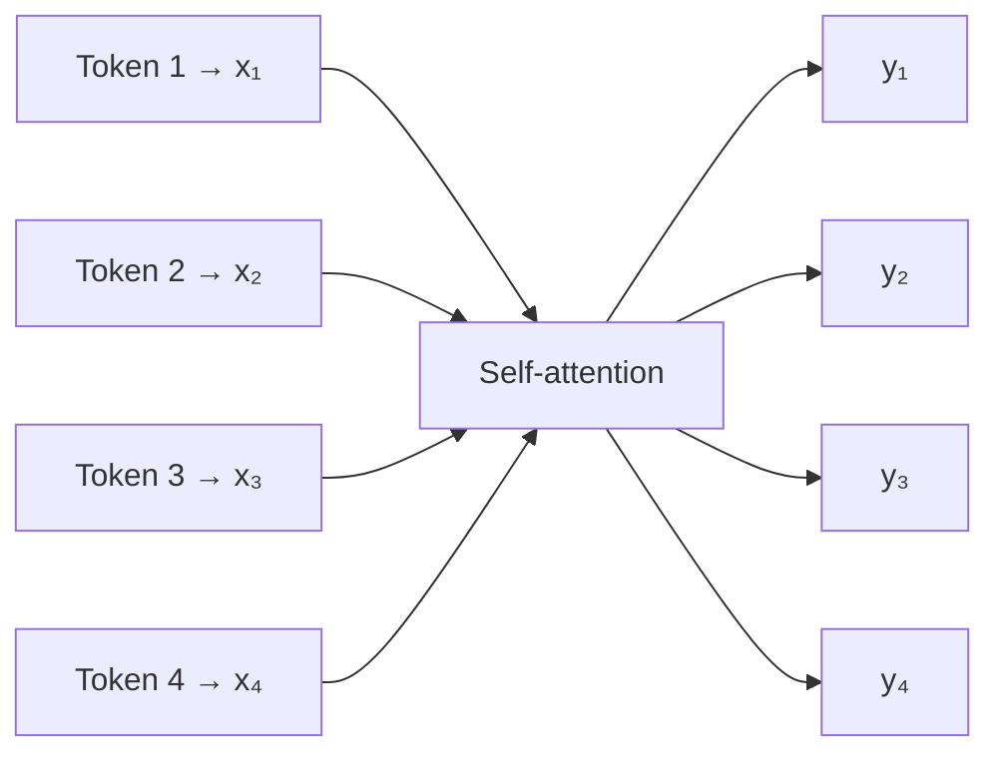

*Based on the token-to-vector-to-attention sketch in self2.pdf, page 1.*

There is still one output per input position. This operation does not automatically reduce the sentence to one vector. Each output is a new token representation.

Paul’s repeated phrase was that the outputs are **more contextualized**: their calculation depends on other tokens. Whether that context improves a particular task also depends on learned parameters, the training objective, and evaluation.

### Vectorization comes before the attention calculation

The class deliberately separated “convert words to numbers” from “use a sophisticated embedding model.” To study the mechanics, numbers can come from a random lookup table or an untrained embedding layer. Pretrained Word2Vec or GloVe vectors can be substituted later.

One-hot encoding and TF-IDF were mentioned as other numerical representations. Their properties differ from dense learned embeddings, but all serve the broader purpose of representing text numerically.

This matters for reading the example: the calculation is valid on the toy numbers even when those numbers have not learned a linguistic relationship.

---

## 📚 Vocabulary Size, Sequence Length, and Embedding Width

A substantial live discussion concerned dimensions. Keeping three quantities separate resolves the confusion:

| Quantity | Meaning | Notebook example |
|---|---|---|
| Vocabulary size | Number of entries in the lookup table | 8 |
| Sequence length | Number of tokens in the current sentence | 4 |
| Embedding width, d_model | Number of numeric features for each token | 8 |

The vocabulary contains **bank, of, the, river, account, money, has, today**. Only four of these occur in the first sentence.

The example happens to use eight vocabulary entries and eight features per vector. **Those two eights are independent choices.** Raising the embedding width to 16 does not require a vocabulary with 16 words.

A dense embedding table has shape **vocabulary size × embedding width**. Looking up four tokens gives a matrix with shape **4 × embedding width**. PyTorch names the two independent constructor arguments `num_embeddings` and `embedding_dim`. [Embedding reference](https://docs.pytorch.org/docs/2.14/generated/torch.nn.Embedding.html)

### Why one-hot encoding can create confusion

A one-hot vector over a vocabulary has one coordinate per vocabulary entry. Its width therefore equals the vocabulary size.

Dense embeddings do not follow that rule. A vocabulary of 10,000 words can have a 300-feature vector per word. Sauvik’s later question used exactly this separation: a 10,000-word vocabulary with a 300-dimensional representation is compatible with projections that consume 300 input features.

The statement is not a difference between “old” and “new” NLP. Word2Vec and GloVe also use dense widths chosen separately from vocabulary size. The GloVe project, for example, publishes different vector widths for the same vocabulary. [GloVe project](https://nlp.stanford.edu/projects/glove/)

### What the code actually stacks

The notebook’s `np.stack` collects four individual token vectors into **X**, a matrix with shape **(4, 8)**. It does not merge their information or create a single pooled sentence embedding at this step.

The number of rows follows the sentence; the number of columns follows the embedding width. This distinction is the basis for every later shape check.

---

## 🔄 Recapping the Parameter-Free Attention Intuition

The first part revisited the previous class’s simplified calculation. For each token, compare it with all tokens, turn its scores into normalized weights, and use those weights to combine the token vectors.

Paul changed the notation from the previous session’s `W` to **S** and **A**, because students had confused attention weights with trainable neural-network weights:

- **Sᵢⱼ:** an unnormalized compatibility score for token i attending to token j.
- **Aᵢⱼ:** the normalized attention weight obtained from those scores.
- **yᵢ:** the output created from the weighted combination.

These are different stages of the computation.

### Four tokens produce sixteen scalar scores

With four inputs, each token compares with all four. The score matrix therefore has shape **4 × 4** and contains sixteen scalar entries.

For a pair of vectors, the inner product gives **one scalar**. Stacking many vectors into matrices and multiplying the appropriate matrices gives **a matrix of pairwise scalar scores**.

This was an important live clarification: Ayesha/Ayush and Sauvik questioned the use of “vector” for the intermediate result. Paul later explicitly distinguished a vector dot product from a matrix product.

| Operation | Result |
|---|---|
| Inner product of two equal-length vectors | One scalar score |
| Elementwise multiplication of two equal-length vectors | A vector of products |
| Q @ K.T for token matrices | A matrix of pairwise scores |
| Scalar attention weight × a value vector | A scaled vector |
| Sum of scaled value vectors | One output vector |

An elementwise product is not the same as an inner product. The inner product includes summation over the feature dimension.

### Normalize a row, then form one output

For token 1, the simplified output is:

**y₁ = A₁₁x₁ + A₁₂x₂ + A₁₃x₃ + A₁₄x₄**

The same process applies to token 2, token 3, and token 4. A complete matrix implementation performs these calculations together.

```mermaid
flowchart LR
    A["Base token x₁"] --> B["Compare with x₁, x₂, x₃, x₄"]
    B --> C["Scores S₁₁, S₁₂, S₁₃, S₁₄"]
    C --> D["Softmax over this row"]
    D --> E["Weights A₁₁, A₁₂, A₁₃, A₁₄"]
    E --> F["Scale the corresponding vectors"]
    G["x₁, x₂, x₃, x₄"] --> F
    F --> H["Add the four contributions"]
    H --> I["Output y₁"]
```

*Based on the score, normalization, and weighted-sum sketches across self2.pdf, pages 1–3.*

The weight assigned to a token is not necessarily largest when it attends to itself. In the projected example, relevance depends on different query and key representations; the notebook’s own rows demonstrate that another token can receive the largest weight.

### Four properties from the recap, stated precisely

Paul summarized the earlier toy system as requiring no training, not depending directly on proximity or order, and being shape-independent.

For this session’s **parameter-free toy calculation**, that means:

- It has no newly introduced projection parameters to optimize.
- Every token can directly compare with every other token.
- No explicit distance or position information is supplied.
- The same calculation can be applied to different sequence lengths, provided the feature widths and operations remain compatible.

Standard Transformer self-attention **is trainable**. The earlier property described the simplified starting point, not all self-attention mechanisms.

Without positions or masks, reordering the input tokens reorders corresponding outputs rather than teaching the operation their original order. Positional encoding was identified as the future solution for injecting order information. Its implementation was deferred.

---

## 🔑 Queries, Keys, and Values: Three Roles for the Same Input

Paul first introduced Q, K, and V as names for three roles in the calculation, then made those roles trainable with projections.

### Query: the token requesting information

In the whiteboard example, **token 3** was selected as the base token. Its query is compared with all keys to decide how strongly its output should use each value.

Selecting token 3 was a drawing convenience. In the full calculation, every token produces a query and receives its own output.

### Key: the representation used for matching

Each token contributes a key. Query–key compatibility determines the attention scores.

The database analogy gives intuition: a query is matched against keys. The calculation is a soft numerical matching operation, not a database lookup that selects only one exact record.

### Value: the information that can be passed onward

Each token also contributes a value. After computing the attention weights, the output combines those values.

The query and key decide **how much to use**; the value supplies **what gets combined**. That separation explains why a value projection is useful.

In self-attention, all three originate from the **same input sequence**, but their projections generally differ. Q, K, and V are not three unrelated sentences, nor are they generated one after another as a pipeline Q → K → V.

The following diagram translates the single-query drawing in the PDF:

```mermaid
flowchart LR
    X["Input tokens x₁ … x₄"] --> K["Key projection Mₖ"]
    X --> V["Value projection Mᵥ"]
    X3["Base token x₃"] --> Q["Query projection Mq"]
    K --> S["Compare q₃ with every key"]
    Q --> S
    S --> N["Normalize score row"]
    N --> A["A₃₁, A₃₂, A₃₃, A₃₄"]
    A --> P["Weight corresponding values"]
    V --> P
    P --> Y["Sum → y₃"]
```

*Based on self2.pdf, pages 4–5. The base token is x₃ here; the full computation repeats the role for all positions.*

### Values exist before they are aggregated

Phani and Ranjeev both asked why V is calculated from the original input when the drawing shows value contributions near the end.

There are **two distinct operations**:

1. Create the projected values: **V = XWᵥ**.
2. Aggregate those values using the normalized attention weights: **Y = AV**.

The second operation depends on the attention weights. The first does not. The arrows near the end of the diagram represent using values in the weighted sum, not generating values from A.

---

## 🧱 Making the Block Trainable With Projection Matrices

The original toy calculation reused the token vectors directly. Paul introduced matrices **Mₖ, Mq, Mᵥ**, later written in code as **W_k, W_q, W_v**, to create trainable transformations.

Using row-oriented token vectors:

**Q = XW_q**  
**K = XW_k**  
**V = XW_v**

The same query matrix is applied across the tokens, and likewise for the key and value matrices. There is not a separate independent W_q for each vocabulary word.

### Linear layers supply parameters

In PyTorch, the class implemented these projections as three `nn.Linear` modules. The modules hold parameters and provide the corresponding linear transformations.

A linear layer can change feature width; a square matrix is only one case. Paul used square projections to keep the example easy to inspect:

**(1 × 8) @ (8 × 8) → (1 × 8)**

For the whole four-token sentence:

**(4 × 8) @ (8 × 8) → (4 × 8)**

More generally, an input width d_model can be projected to d_k for queries/keys or d_v for values. Query and key feature widths must match for their dot product. The final weighted-sum width follows the value width.

The individual scores do **not** retain the embedding width: they are scalars, and the full score matrix is sequence length × sequence length.

### A layer is not its activation

The notes on the PDF use “hidden,” “linear,” “fully connected,” and “dense” together to identify the projection layer. Here, dense/fully connected describes the kind of transformation. A hidden layer is a layer’s position in a network, not a guarantee that it is linear.

`nn.Linear` applies an affine transformation and does not insert ReLU automatically. The notebook set `bias=False`, so the demonstrated Q/K/V projections have no additive bias. [Linear reference](https://docs.pytorch.org/docs/2.14/generated/torch.nn.Linear.html)

The attention computation still has nonlinearity through softmax. A separate activation after every projection is not a condition for making its parameters trainable.

### What training would change

The gradient arrows on PDF page 5 show information flowing backward through the normalized scores and the value aggregation toward the projection layers.

```mermaid
flowchart LR
    X["Input X"] --> Q["Linear → Q"]
    X --> K["Linear → K"]
    X --> V["Linear → V"]
    Q --> S["QKᵀ"]
    K --> S
    S --> A["Scale and softmax"]
    A --> Y["AV → output Y"]
    V --> Y
    Y -. "Gradient from downstream objective" .-> A
    Y -. "Gradient" .-> V
    A -. "Gradient" .-> S
    S -. "Gradient" .-> Q
    S -. "Gradient" .-> K
```

*Based on the forward arrows and backward gradient arrows in self2.pdf, page 5. Scaling is shown because it is used by the accompanying notebook.*

The parameter values would be learned under a task objective, such as a loss for named-entity recognition or question answering. Dimensions and head count are **hyperparameters**; numerical projection weights are **parameters**.

The session explained this possibility but did **not train the attention block**. It supplied no complete task dataset, target labels, optimizer loop, or loss-driven update in the demonstrated attention notebook.

---

## 🧮 NumPy Walkthrough: Build X, Q, K, and V

Paul then moved from the whiteboard to the supplied notebook. NumPy was used to expose the operations directly before replacing them with PyTorch layers.

### Create one reproducible vector per vocabulary entry

The notebook begins with a four-word sentence and a small d_model of eight. It builds the lookup table with this actual code:

```python
def build_embeddings(vocab_words, d_model, seed=0):
    # Toy embedding table: one random vector per unique word.
    # Shape returned: (len(vocab_words), d_model)
    rng = np.random.default_rng(seed)
    vocab = sorted(set(vocab_words))
    table = {w: rng.normal(size=d_model) for w in vocab}
    return table
```

*Source: supplied attention notebook, cell 4.*

The set removes duplicate vocabulary entries, sorting makes the order stable, and each word receives a random vector. The sentence is lowercased when looking up its entries.

The output X has shape **(4, 8)**. The vocabulary can contain words absent from this sentence; those unused entries do not create extra rows in X.

The seeds are used for reproducibility. Importantly, the explicit generators are initialized with their own seeds; a global NumPy seed and the generator’s seed are distinct settings.

### Initialize three projection matrices

```python
d_k = d_model  # keep same dim for simplicity (common choice for single-head)

rng = np.random.default_rng(1)
W_q = rng.normal(scale=0.5, size=(d_model, d_k))
W_k = rng.normal(scale=0.5, size=(d_model, d_k))
W_v = rng.normal(scale=0.5, size=(d_model, d_k))

Q = X @ W_q   # (seq_len, d_k)
K = X @ W_k   # (seq_len, d_k)
V = X @ W_v   # (seq_len, d_k)
```

*Source: supplied attention notebook, cell 6.*

The `@` operator performs matrix multiplication. In this example, each projection matrix is **(8, 8)**, and each projected token matrix is **(4, 8)**.

The `normal` call samples from a Gaussian distribution. **`scale=0.5` is the distribution’s standard deviation**, not a min/max normalization step applied after sampling. [NumPy normal generator](https://numpy.org/doc/stable/reference/random/generated/numpy.random.Generator.normal.html)

Although the values are stored in matrices corresponding to trainable projections, NumPy does not train them here. They remain fixed sampled numbers during the demonstrations.

### Read shapes at every stage

Paul repeatedly asked participants to inspect printed values. A useful shape check should answer:

- Which axis indexes tokens?
- Which axis indexes features?
- Is this a parameter matrix or a representation matrix?
- Does the operation’s inner dimension match?
- Is the result a token vector, a scalar score, or all pairwise scores?

These checks are more reliable than inferring shape from a label such as “embedding,” “vector,” or “weight.”

---

## ⚖️ Scores, Scaling, and Row-Wise Softmax

The single-head calculation implemented in class is:

**scores = QKᵀ / √d_k**  
**A = softmax(scores), across each row**  
**Y = AV**

For the four-token example, Q is **4 × 8**, Kᵀ is **8 × 4**, and the score matrix is therefore **4 × 4**.

### Why transpose K?

Each row of Q is one query. Each row of K is one key. Transposing K aligns the feature dimension for multiplication, so the product contains one query–key comparison for every pair of token positions.

Row i corresponds to the **query token**; column j corresponds to the **key token it attends to**. Different query and key projections also mean the resulting score matrix need not be symmetric.

### Why divide by √d_k?

The live explanation described scaling as helpful for stable training and left a fuller paper discussion for later. The paper’s rationale is more specific: dot products tend to grow in magnitude as query/key width increases, which can push softmax into regions with very small gradients. Dividing by the square root of the key width counteracts that growth. [Attention Is All You Need, section 3.2.1](https://arxiv.org/html/1706.03762v7)

This scale factor is separate from the random generator’s standard deviation. It also is not the step that makes the attention weights sum to one; **softmax** performs that normalization.

### One softmax step, not normalization followed by softmax

Several questions treated “normalization” and “softmax” as two operations. Paul clarified that in this diagram the normalization box is implemented **by softmax**.

For each score row, softmax produces nonnegative weights adding to one. A min/max scaler or standard scaler is not an interchangeable substitute merely because it is also called normalization.

The exact notebook function is:

```python
def softmax(x, axis=-1):
    x = x - np.max(x, axis=axis, keepdims=True)
    e = np.exp(x)
    return e / np.sum(e, axis=axis, keepdims=True)

scores = Q @ K.T / np.sqrt(d_k)          # (seq_len, seq_len)
attn_weights = softmax(scores, axis=-1)  # (seq_len, seq_len), rows sum to 1
```

*Source: supplied attention notebook, cell 8.*

Subtracting the row maximum improves numerical stability without changing the mathematical softmax result. The last axis contains the keys for a given query, so `axis=-1` normalizes over that axis.

The PDF’s handwritten probability example illustrates the sum-to-one property. Its chosen values are illustrative, rather than an exact numerical softmax calculation for the written input list.

### Read the recorded attention matrix correctly

The supplied notebook records:

| Query ↓ / attends to → | Bank | of | the | river |
|---|---:|---:|---:|---:|
| Bank | 0.215 | 0.251 | 0.388 | 0.145 |
| of | 0.074 | 0.255 | 0.161 | 0.509 |
| the | 0.004 | 0.129 | 0.029 | 0.838 |
| river | 0.071 | 0.223 | 0.450 | 0.256 |

The notebook prints unrounded row sums of **1.0**. The displayed three-decimal entries can sum slightly differently because of rounding.

The heatmap shows this same matrix: the vertical axis is the query and the horizontal axis is the token attended to. It is a visualization of the calculation, not a separate model.

For Bank, the largest recorded weight is on **the**, not river or Bank itself. With random untrained projections, the weights should not be read as reliable linguistic relevance.

---

## 🧩 Compute the Outputs: Project Values, Then Mix Them

The final matrix multiplication is:

```python
Y = attn_weights @ V   # (seq_len, d_k)  <-- this is y1, y2, y3, y4 stacked
```

*Source: supplied attention notebook, cell 11.*

The attention matrix is **4 × 4** and V is **4 × 8**, so Y is **4 × 8**.

For one token:

**yᵢ = Aᵢ₁v₁ + Aᵢ₂v₂ + Aᵢ₃v₃ + Aᵢ₄v₄**

Each A entry is a scalar that scales a value vector. Adding those contributions gives an eight-feature output.

### Raw input vectors versus projected values

The earlier whiteboard recap mixed the raw vectors directly. The notebook makes the distinction explicit:

- **General projected calculation:** Y = AV, where V = XW_v.
- **Literal simplified formula:** Y_literal = AX.

The simplified version corresponds to using the original representations as values, or an identity value projection. It is helpful intuition but should not obscure the learned V projection in the implemented block.

### Matrix multiplication equals the expanded weighted sum

The notebook verifies the simplified first output both ways:

```python
Y_literal = attn_weights @ X   # exactly y_i = sum_j w_ij * x_j, matching the image

y1_manual = (attn_weights[0,0]*X[0] + attn_weights[0,1]*X[1]
             + attn_weights[0,2]*X[2] + attn_weights[0,3]*X[3])
```

*Source: supplied attention notebook, cell 13.*

The recorded first three values are **[0.3247, 0.5943, 0.2543]** for both forms, and `np.allclose` returns **True**.

This equality check compares the manual formula with the corresponding matrix formula. It does not say AX and AV are equal for an arbitrary W_v.

Also, `allclose` checks elementwise agreement **within a tolerance**, rather than exact bit-for-bit equality. [NumPy allclose](https://numpy.org/doc/stable/reference/generated/numpy.allclose.html)

### Parallelizable does not mean dependency-free

All queries can be processed together through matrix operations, making the implementation suitable for efficient tensor computation. Q, K, and V projections can be formed from the same input.

The later operations still depend on earlier results: scores need Q/K, softmax needs scores, and the weighted sum needs weights/V. Matrix parallelism does not erase those dependencies.

---

## 🏦 The “Bank” Experiment: Context Dependence Versus Semantic Quality

The next part asked whether the new vectors were better than the starting vectors. Paul used cosine similarity and two sentences to inspect this quantitatively.

For nonzero vectors, cosine similarity ranges from **−1 to 1**. A value of one indicates the same direction; it is not a general “probability of matching meaning.”

The supplied function is:

```python
def cosine(a, b):
    return float(a @ b / (np.linalg.norm(a) * np.linalg.norm(b)))
```

*Source: supplied attention notebook, cell 15.*

### The first comparison does not show an improvement

The recorded outputs are:

| Comparison | Recorded cosine |
|---|---:|
| Raw x_bank versus raw x_river | −0.5045 |
| Projected/contextual y_bank versus raw x_river | −0.6063 |

The second value is **lower**, so this particular output does not support a claim that Bank moved closer to river.

There is an additional interpretive issue: y_bank has passed through a value projection, while x_river is in the original input space. Equal vector lengths do not establish that their coordinate systems preserve semantic cosine comparisons.

Paul noted that random numbers did not provide learned relationships and turned this limitation into the homework. The appropriate takeaway is to inspect the actual evidence rather than accept a surrounding claim of improvement. Some notebook narrative labels describe the intended effect more strongly than these recorded numbers support.

### The two-sentence comparison isolates context dependence

The reusable function uses the same embedding table and projection matrices for both sentences:

```python
def attention(sentence_words, embedding_table, W_q, W_k, W_v):
    X = np.stack([embedding_table[w.lower()] for w in sentence_words])
    Q, K, V = X @ W_q, X @ W_k, X @ W_v
    scores = Q @ K.T / np.sqrt(W_q.shape[1])
    weights = softmax(scores, axis=-1)
    Y = weights @ V
    return X, Y, weights
```

*Source: supplied attention notebook, cell 18.*

The recorded comparison of the first token, bank, is:

| Check | Recorded result |
|---|---|
| Raw bank vectors equal across the sentences? | True |
| Cosine between the raw bank vectors | 1.0 |
| Contextual bank vectors equal across the sentences? | False |
| Cosine between contextual bank vectors | 0.3625 |

The raw similarity of **1.0 is expected**: both sentences retrieve the same word entry from the same table. This would also happen with a shared static Word2Vec or GloVe lookup, not only with random numbers.

The contextual vectors differ because their weights and value mixtures depend on different surrounding tokens. That is evidence of **context dependence**.

It is not by itself proof that the block has correctly separated two meanings. An untrained random transformation can also change outputs when inputs change.

### The additional recorded similarities reveal the limitation

The notebook also records:

| Contextual bank vector | Similarity to raw river | Similarity to raw money |
|---|---:|---:|
| From “bank of the river” | −0.6063 | 0.6502 |
| From “bank account has money” | −0.2282 | 0.3902 |

The river-context output is more similar to raw money than raw river under this calculation. The plotted bars visualize those values; their title should not be treated as proof that each output has moved toward the intended meaning.

The useful experiment separates three questions:

1. **Does attention change a token’s output when context changes?** Yes, this example demonstrates that.
2. **Do the inputs already carry trained linguistic relationships?** Not in the random lookup version.
3. **Do the attention projections improve a semantic task?** No training or task evaluation here establishes that.

Replacing embeddings with pretrained vectors addresses the second question. Untrained projection matrices remain a limitation for the third.

---

## 🔥 PyTorch: The Same Calculation With Trainable Modules

Paul repeated the calculation using an embedding layer and linear layers. This version makes the parameters available to PyTorch’s training machinery while keeping the same operations visible.

The supplied notebook defines the vocabulary mapping and lookup as follows:

```python
vocab = ["bank", "of", "the", "river", "account", "money", "has", "today"]
word2idx = {w: i for i, w in enumerate(vocab)}

d_model = 8
embedding = nn.Embedding(num_embeddings=len(vocab), embedding_dim=d_model)

sentence = ["bank", "of", "the", "river"]
idx = torch.tensor([word2idx[w] for w in sentence])   # shape: (seq_len,)
X = embedding(idx)                                     # shape: (seq_len, d_model)
```

*Source: supplied attention notebook, cell 23. The preceding lines import torch/nn/F and set torch.manual_seed(0).*

The integer IDs select rows from the lookup table; they are not themselves the final embedding features. The result has shape **(4, 8)**.

A newly created `nn.Embedding` is a trainable lookup table with randomly initialized values. Using that layer does not automatically give the toy words better learned meanings than the NumPy random table. Pretrained state or training is needed for that claim. [Embedding reference](https://docs.pytorch.org/docs/2.14/generated/torch.nn.Embedding.html)

### Three linear projections

```python
d_k = d_model

W_q = nn.Linear(d_model, d_k, bias=False)
W_k = nn.Linear(d_model, d_k, bias=False)
W_v = nn.Linear(d_model, d_k, bias=False)

Q = W_q(X)   # (seq_len, d_k)
K = W_k(X)   # (seq_len, d_k)
V = W_v(X)   # (seq_len, d_k)

scores = Q @ K.T / (d_k ** 0.5)          # (seq_len, seq_len)
attn_weights = F.softmax(scores, dim=-1)  # rows sum to 1
Y = attn_weights @ V                      # (seq_len, d_k)  <- y1..y4 stacked
```

*Source: supplied attention notebook, cell 24.*

Here, `W_q` names a **module**, whereas the NumPy version’s `W_q` names a numerical array. Calling the module on X applies its stored transformation. The meaning of the variable follows the code context.

`F` is the alias for `torch.nn.functional`, used here for softmax. The exponent **0.5** computes the same square-root scaling as the NumPy version.

The printed shapes again are:

- Q, K, V: **(4, 8)**
- attention weights: **(4, 4)**
- Y: **(4, 8)**

The values differ from the NumPy run because the parameter initializations differ. Equivalent algorithms do not require independently initialized runs to produce identical numbers.

### The second bank comparison

Using the same embedding and projection modules for both sentences, the PyTorch example records:

- raw bank vectors equal: **True**;
- cosine between the two contextual bank outputs: **0.814038…**.

The same limitation applies: outputs depend on context, but a high or low cosine from untrained parameters is not a validated measure of sense disambiguation.

The function in this notebook uses the input width in its denominator because d_k equals d_model in the demonstrated configuration. If changing projection widths, the scale should continue to follow the **query/key width**.

---

## 🧰 A Library Demonstration: One-Head MultiheadAttention

The class showed PyTorch’s built-in module after the manual implementation:

```python
mha = nn.MultiheadAttention(embed_dim=d_model, num_heads=1, bias=False, batch_first=True)

X_batched = X.unsqueeze(0)   # (batch=1, seq_len, d_model) - nn.MultiheadAttention wants a batch dim
Y_mha, attn_weights_mha = mha(X_batched, X_batched, X_batched)  # self-attention: Q=K=V=X
```

*Source: supplied attention notebook, cell 26. The comment reflects the notebook’s chosen batched example; the API also supports unbatched inputs.*

The recorded shapes are:

| Quantity | Shape |
|---|---|
| Input X_batched | (1, 4, 8) |
| Output Y_mha | (1, 4, 8) |
| Returned attention weights | (1, 4, 4) |

The leading one is the **batch size**, not the number of heads or tokens. `unsqueeze(0)` adds that axis; it does not flatten the sentence.

With `batch_first=True`, batched input follows **batch, sequence, features**. Batch size and head count are independent. [MultiheadAttention reference](https://docs.pytorch.org/docs/2.14/generated/torch.nn.MultiheadAttention.html)

### Why pass X three times?

For this self-attention call, query, key, and value input come from the same sequence. The module applies its internal projections. Passing the same tensor does not mean its internal projected Q, K, and V must be identical.

The MHA module is an independent demonstration. Later comparison cells use the manually defined W_q/W_k/W_v modules, not Y_mha.

### Built-in output is not automatically the manual output

The built-in module has independently initialized parameters and includes an **output projection** after combining heads. Even with one head, numerical equality with the preceding manual **AV** output should not be expected without matching the parameters and accounting for that projection.

The notebook calls the examples architecturally equivalent to convey the attention pattern. For an exact equivalence check, the full parameterization matters.

### A batching detail to carry forward

The hand-written examples use two-dimensional matrices. They should not be made batched merely by changing X to three dimensions and leaving every `.T` unchanged.

For a higher-rank NumPy array, a plain transpose reverses all axes by default. Batched attention needs the **last two key axes** swapped while preserving the batch axis. The rest of the broadcasting and matrix shapes must agree. [NumPy transpose reference](https://numpy.org/doc/stable/reference/generated/numpy.transpose.html)

This is a practical clarification to the notebook’s concluding shape note, not an additional batched implementation taught in class.

---

## 👥 Multi-Head Attention: What Was Previewed, What Was Deferred

Near the end, Paul drew multiple parallel linear representations and introduced **head count** as a hyperparameter. The final whiteboard page sketches four parallel heads.

The intended intuition is that several attention calculations can run in parallel using different learned projections. **A head is a complete attention path**, including Q/K/V and the score/weight/value calculation; it is not simply any extra linear layer.

Four stacked attention blocks also are not the same as four heads. Stacking refers to depth; multiple heads operate in parallel within a block.

The session did not fully derive head splitting, concatenation, and the output projection. Those were for the next class.

### Choosing head count

Paul mentioned common choices such as 8, 16, and 32 and emphasized experimentation. Powers of two are conventions, not a universal head-count rule.

The original paper’s base configuration used eight heads. In PyTorch’s standard MHA arrangement, the model width is divided across the heads, so choose a head count compatible with that width. [Attention Is All You Need](https://arxiv.org/html/1706.03762v7), [MultiheadAttention reference](https://docs.pytorch.org/docs/2.14/generated/torch.nn.MultiheadAttention.html)

More heads do not automatically mean a proportionate increase in parameters or cost when total model width is held fixed. The actual width, sequence length, implementation, and configuration matter.

### What to learn before changing a pretrained model

Debajyoti asked where this granularity becomes useful in real projects. Paul’s answer was that application projects often consume the whole model, while model work may require understanding or modifying its internal blocks.

Changing the number of heads in a pretrained model is an architecture change, not merely a routine fine-tuning setting. Check how its parameters and operations will remain compatible; unfreezing layers alone does not solve every such change.

This class provides the mechanics needed to reason about those decisions. It does not supply a complete recipe for changing an existing model’s architecture.

---

## 🧪 Assignment: Replace the Initial Embeddings and Examine the Evidence

The assignment was recorded both in the live discussion and on the course Notion page:

1. Start from the shared attention notebook.
2. Replace the random/untrained initial embedding source with **GloVe or Word2Vec**.
3. Run the attention calculation and inspect the cosine similarities.
4. Share a **Google Colab view link** with the instructor at **app@krishnaik.in**.

This is the instructor’s submission instruction. These notes do not perform the assignment or send anything.

Paul asked participants to retain the rest of the experiment. That means preserve the conceptual pipeline while updating dimensional dependencies where necessary. If the selected pretrained vectors have width 300, the input/projection shapes must consume that width; leaving hard-coded eights throughout is not compatible.

### What to record for a useful submission

- The embedding source and actual vector width.
- Whether each toy vocabulary word is present in that source.
- The shapes of X, projection matrices, Q/K/V, scores, A, and Y.
- The attention matrix and its row sums.
- The raw bank comparison across the two sentences.
- The contextual bank comparison and the other cosine checks.
- Which parameters remain untrained.

The raw bank vectors should still be identical across contexts when they come from a shared static lookup. Pretrained static word vectors supply better starting relationships, but the remaining random attention projections do not guarantee a semantic improvement.

Report the actual results, including a result that conflicts with the expected narrative. The point of the exercise is to inspect how the representation behaves, not force a similarity to a predetermined value.

---

## 🗺️ What's Next

Paul said the following week would cover **multi-head attention in detail**, followed by the **Attention Is All You Need paper** and construction of the full Transformer architecture.

Positional encoding had been identified as the mechanism for adding order information, but its details were not implemented in this session.

For revision, he recommended spending regular daily time on the notebook and foundational material. Books mentioned included **Hands-On Large Language Models** and **Build a Large Language Model (From Scratch)** by Sebastian Raschka. The discussion also referred to 3Blue1Brown’s neural-network material and deep-learning refresher lectures.

The prerequisites he emphasized were matrix operations, shapes, activation functions, optimizers, and the broad training process. A complete CNN revision was not required for this immediate attention topic.

---

## 💬 Live Q&A Highlights

The table covers the full transcript, including all substantive speakers in the final two parts and their follow-ups. Similar in-flow doubts are combined.

| Question | Answer |
|---|---|
| **Ayesha/Ayush / Sauvik: Does a vector dot product return a scalar?** | Yes. Each pairwise inner product gives one score; multiplying the stacked token matrices gives a matrix of those scores. Elementwise multiplication is a different operation. |
| **Chat: Where does A come from S?** | A is the row-wise softmax of the score matrix. The diagram’s normalization box is implemented by softmax, not by a second separate scaler. |
| **Manan: How are weights introduced?** | The Q/K/V projections add parameter matrices. PyTorch linear layers store and apply them; attention weights computed for an input are different from those persistent parameters. |
| **Athira: What dimensions should the linear layers have?** | Match their input width to the embeddings and choose compatible output widths. The demo keeps widths at eight; score-matrix axes instead follow sequence length. |
| **Athira: What do projection weights learn?** | Under task training, gradients would change them to improve the objective. The session’s demonstration did not perform that learning. |
| **Ayush Mishra / Rushi: Why linear projections, and where is nonlinearity?** | Linear layers implement the projections; softmax is nonlinear. The class did not add an activation after each Q/K/V layer. |
| **Shivam / Subrahmanyam: Why is only V3 shown as the query?** | It is the chosen example token in the drawing. Every position supplies a query in the full matrix calculation. |
| **Ashwa / Sai Kiran / Swati Gupta: Who initializes the matrices?** | Initialization provides starting values. NumPy samples them explicitly here; PyTorch modules initialize their own parameters unless configured otherwise. |
| **Thomas: How is this parallelized?** | Matrix operations compute many token comparisons together. Later stages still depend on earlier results; parallelism does not remove the score→softmax→aggregation chain. |
| **Subhash: Why dot product rather than another comparison?** | It is the compatibility function used by this calculation and supports efficient matrix operations. Other attention formulations exist; this class implements scaled dot-product attention. |
| **Aryan Parekh: Which side is the query?** | The base token seeking information supplies the query. The row of QKᵀ represents that query compared with all keys. |
| **Shiv Prakash: Why three matrices; can one matrix do it?** | The standard roles have distinct projections. They can be combined in a larger packed projection that still produces distinct Q/K/V representations. [PyTorch packed projections](https://docs.pytorch.org/tutorials/intermediate/transformer_building_blocks.html) |
| **S Anoop: What is the V1…VN column at the left?** | It denotes the collection of input token vectors feeding the block, not another learned matrix or an additional layer. |
| **Nithin: Can we derive the full backward pass by hand?** | Paul recommended starting with a smaller network/example because a full attention derivative is lengthy. No complete attention backward derivation was performed. |
| **Bhavani Shankar: What is NER above the stacked block?** | Named-entity recognition was an example downstream NLP task. QA and other objectives were also mentioned; no task head was implemented. |
| **Phani Kulkarni: Why are values connected to the initial input if used later?** | V is projected from the same original input. Its later use is the separate weighted aggregation AV. |
| **Chat: Does d_model have to equal vocabulary size?** | No. The toy example has eight entries and width eight by choice. Dense embedding width is independent of vocabulary size; one-hot width follows the vocabulary. |
| **Chat: Why is the score shape 4 × 4 rather than 4 × 8?** | Each query is compared with four keys. The feature dimension is summed out in each dot product, producing sixteen scalar scores. |
| **Pradhav: Is normalization done before softmax as another step?** | No additional min/max or standard scaling occurs in that box. The scores are scaled by √d_k, then row-wise softmax provides the normalized weights. |
| **Ankit / CS: Should the numerical weights show obvious word relationships or self-attention dominance?** | Not with the untrained random parameters used here. A token need not assign itself the largest attention weight. |
| **Nithin: Y_literal versus Y_manual?** | They compute the same raw-vector weighted sum, once by matrix multiplication and once by spelling out the terms. allclose confirms approximate numerical agreement. |
| **Vidyasagar: What changes if the embedding width changes?** | Adapt the projections and other dimensional dependencies. Width and vocabulary size are separate; the hard-coded demo widths are not a universal rule. |
| **Kalyan Rad: Does a smaller cross-context cosine show attention brings meaning?** | It shows that output representations changed with context. Untrained weights and the contradictory recorded similarities prevent treating this alone as proven semantic improvement. |
| **Gaurav Garg: Why Q/K/V, and could there be fourth/fifth representations?** | These are the conventional roles in the attention mechanism being taught. Renaming them does not change the algorithm; additional architectural components would need their own definition. |
| **Gaurav: Is this already in PyTorch, and why break it down?** | Yes, built-in modules exist. The manual breakdown explains the mechanics before later work uses higher-level functions. |
| **sridhar k: Are the matrices hyperparameters?** | Their numerical values are learned parameters. Their sizes, the architecture, and head count are hyperparameters selected as part of model design. |
| **sridhar: Does cosine around 0.8 imply river and money are related?** | It indicates geometric closeness under this particular untrained calculation, not a reliable linguistic relationship. The assignment asks for a more meaningful embedding source. |
| **Debajyoti Mukhopadhyay: Where does this help beyond an API/RAG project?** | Whole models are commonly consumed in applications. Internal knowledge helps with model analysis, customization, and debugging; changing a pretrained architecture needs more than a simple fine-tuning switch. |
| **Sai Kiran Akula: NumPy or PyTorch—and was Pandas used?** | The examples used NumPy and PyTorch. NumPy exposes the operations; PyTorch supplies trainable modules and built-in implementations. Pandas was not part of this notebook. |
| **Sai Kiran: Is multi-head attention only for batching?** | No. Batch size counts sequences; heads are parallel attention paths. The added leading axis demonstrates batching independently of the one-head configuration. |
| **Sai Kiran: Should we focus on softmax and both frameworks?** | Understand the operation and shapes first, then how the libraries express them. This attention calculation specifically normalizes scores with softmax. |
| **Sauvik Chattopadhyay: With vocabulary 10,000 and width 300, do projections follow width?** | Yes. A token supplies 300 features, so the projection input width is 300. A square 300 × 300 projection is one valid choice, not a consequence of vocabulary size. |
| **LearnMath: Does the course lead to agentic or deep-learning work?** | Paul described coverage of LLM/NLP model work, fine-tuning, RAG, and agents. He also identified limits in GPU optimization and reinforcement-learning depth. |
| **LearnMath: How do job opportunities differ by location?** | Paul shared his observations about agent/RAG demand and model-engineering roles. These were class-time opinions, not a current job-market survey or guaranteed transition. |
| **Kalyan: Does the original paper specify head count?** | Yes, its base model used eight heads. That configuration is not a universal standard; choose compatible settings and evaluate them. |
| **Kalyan: What does forward-deployed engineering involve?** | The discussion emphasized solution architecture, latency, scalability, fault tolerance, integration with legacy systems, and the application lifecycle. Coverage depends on the actual role. |
| **Kalyan: What should I revise with limited time?** | Prioritize deep-learning foundations such as optimizers, activations, and matrix operations. Paul suggested a focused refresher rather than revisiting every CNN topic now. |
| **Kalyan: Which teaching resources should I use?** | Paul mentioned several lectures and books and advised using a resource whose explanation works for you. The core concepts matter more than a particular teacher. |
| **Kalyan: What value does dictation add to coding-agent work?** | Paul uses it for long explanations, examples, and frequent text entry. He said its usefulness depends on the amount and kind of typing in the workflow. |
| **Adithyan Ramesh: Is softmax in the paper or only a teaching choice?** | It is part of the scaled dot-product attention formula. The class’s normalization box corresponds to it. |
| **Adithyan: Why the square-root divisor?** | The explanation connects it to stable training; the paper specifies controlling dot-product magnitude so softmax gradients do not become extremely small. |
| **Adithyan: Which math/video prerequisites help?** | Matrix multiplication, dimensions, and activation functions were emphasized. The 3Blue1Brown channel was mentioned; a precise video URL was not retained in the transcript. |
| **Ranjeev Tiwari: Should V be computed from attention weights instead of X?** | No. V = XW_v forms value representations; Y = AV then uses normalized weights to mix them. These two multiplications have distinct purposes. |
| **Narayan Jena: Will the course teach MLOps?** | Paul explicitly excluded general machine-learning operations, while stating that deployment related to LLM models and RAG/AI systems would be taught. |

AI learner was invited to speak but did not provide a substantive question. Requests for links, microphone checks, and dashboard navigation are represented in Quick Updates where useful.

---

## 🔑 Key Pointers to Remember

- Attention creates one context-dependent output per token; it does not automatically pool a sentence.
- Vocabulary size, sequence length, and embedding width are independent.
- A vector inner product yields one scalar; QKᵀ collects all pairwise scalar scores.
- Attention weights A are input-dependent outputs, not the persistent projection parameters.
- Q/K/V originate from the same sequence in self-attention but have different roles.
- The query requests information, keys support matching, and values supply content.
- The projection matrices are shared across token positions within a block.
- Values are projected before aggregation; the final operation is AV.
- Square projections preserve width in the demo; other compatible widths are possible.
- Projection weights are parameters; dimensions and head count are hyperparameters.
- scale=0.5 in the random generator is a standard deviation.
- √d_k scales compatibility scores; softmax makes each attention row sum to one.
- Normalize across the key dimension for each query.
- AX is the simplified raw-vector mixture; AV uses projected values.
- allclose checks tolerance-based agreement.
- A shared static bank lookup naturally has cosine one across the two sentences.
- A changed contextual vector proves context dependence, not automatic semantic quality.
- Newly created nn.Embedding and nn.Linear modules are untrained.
- Compare the numerical outputs with the claim being made; some notebook narrative labels overstate the recorded evidence.
- Batch size and head count are different concepts.
- Built-in MultiheadAttention has its own projections, including an output projection.
- Batched attention needs the correct key-axis transpose.
- Multi-head attention and the full Transformer architecture were deferred for fuller treatment.
- Replacing embeddings in the assignment requires updating incompatible hard-coded widths.

---

## ✅ Action Items After Class 5

- [ ] Reproduce the four-token X → Q/K/V → scores → softmax → Y calculation.
- [ ] Explain the difference between an inner product, elementwise multiplication, and matrix multiplication.
- [ ] Draw the single-query x₃ example from the whiteboard and identify its keys, weights, and values.
- [ ] Print every intermediate shape and identify its token/feature axes.
- [ ] Check the attention row sums and read the heatmap’s row/column meanings.
- [ ] Compare Y_literal with the manual first-row formula using allclose.
- [ ] Run both bank sentences with one shared table and the same projection parameters.
- [ ] Record the actual cosine results and separate context dependence from semantic improvement.
- [ ] Replace the embedding source with **GloVe or Word2Vec**, as assigned.
- [ ] Update d_model and projection shapes to the pretrained vector width.
- [ ] Note missing vocabulary entries and any preprocessing changes in the notebook.
- [ ] Inspect the PyTorch version and the independent one-head MHA example.
- [ ] Distinguish the added batch dimension from the number of heads.
- [ ] Prepare a **viewable Google Colab link** for the instructor’s requested submission to **app@krishnaik.in**.
- [ ] Review matrix operations, activation functions, optimizers, and training foundations before the next class.
- [ ] Continue with the detailed multi-head attention and Transformer-paper discussion next week.

---

*📝 Notes compiled from the full Class 5 transcript, all six pages of the accompanying self2.pdf, and all 29 cells of the supplied attention notebook — “2 Aug Transformers 101,” Production AI / LLM Engineering, Krish Naik Academy. Code excerpts and recorded numerical results come from that notebook. Mermaid diagrams translate the class’s actual whiteboard processes. Official documentation and the original paper clarify mathematical/API details and the limitations of the untrained experiment.*

[Back to course index](Course_Notes_Index.md)

---

<a id="class-06"></a>

# 🎛️ Class 06: Multi-Head Attention and the Transformer Encoder
### 📋 Production AI / LLM Engineering | Krish Naik Academy

**🎙️ Mentor:** Sourangshu Pal (Paul in the transcript)  
**⏱️ Duration:** 4 hours 1 minute 50 seconds | **📅 Session:** Day 6 (8 August 2026)

**Class recording:** [8 Aug Transformers 101](https://learn.krishnaikacademy.com/web/courses/6a16f8935e281281cd6b1128?chapter=6a77978f4c8953aff8c50efa)

This class extends the previous query/key/value explanation into **multi-head attention**, connects the handwritten diagrams to **Attention Is All You Need**, and builds the encoder block from attention, residual connections, layer normalization, and a position-wise feed-forward network. Paul also demonstrates an older Tensor2Tensor attention visualizer and uses its colored connections to distinguish heads from layers.

The session reaches the encoder's output. Detailed positional-encoding calculations, the internals of layer normalization, decoder masking, and the complete decoder are reserved for later discussion. The substantial closing Q&A revisits dimensions, parallel computation, concatenation, and both residual additions.

---

## 📰 Quick Updates

- The opening poll favored **explanations of prepared functional code blocks** over typing every line live. Paul intended to share notebooks in advance so learners could inspect them before the practical sessions.
- Learners who found the earlier coding difficult were asked to revise NumPy and PyTorch foundations, especially array operations and matrix shapes.
- The course Notion page remains the resource and assignment reference. The current assignments were ungraded; an automated, Git-based assessment workflow with passing tests was planned for later.
- A refreshed Discord invitation was shared. Paul encouraged discussion in the batch's general-discussion channel and asked students to check Notion for resource updates.
- One of the following weekend's sessions would be a holiday; the exact choice was still undecided during this class.
- Paul emphasized spending time after class exploring the examples and answering one's own smaller foundational questions, rather than relying only on attendance.

---

## 🔁 Recap: From Context Mixing to Trainable Attention

The recap begins with the familiar sequence: **words → tokens → numerical vectors → contextual output vectors**. Self-attention combines information between positions so that a representation need not describe its token in isolation.

In the earliest toy calculation, scores were obtained directly from supplied vectors. The following lesson introduced learned query, key, and value transformations. In this session, Paul treats those transformations as **linear layers** whose parameter matrices can be trained.

The same input representation supplies three different roles:

| Role | Question it answers in the class's database analogy |
|---|---|
| Query | What information is this position looking for? |
| Key | How should an available position be compared with that query? |
| Value | What numerical information will the position contribute? |

The input is reused along three paths; it is not three unrelated datasets. A linear projection transforms it differently for each role. The calculated attention coefficients then determine how value information is mixed.

### Scores are scalars; score tables are matrices

Paul recalls comparing four positions with all four positions. That creates **16 pairwise scores**, arranged in a 4 × 4 table. It does not create 16 new token vectors. Each individual dot product is a scalar, while the collection of such scalars is a score matrix.

After normalizing each query's row, the coefficients multiply the corresponding value vectors. The result is one contextual output vector for each query position. The distinction between **trainable projection parameters** and **coefficients calculated for a particular input** remains essential: both are sometimes called weights, but they are different objects.

### Why K is transposed

For an input sequence with n positions and a query/key width dₖ, both Q and K can be represented with shape **n × dₖ**. Transposing K gives **dₖ × n**, allowing the inner dimensions to match:

$$
QK^T:\quad (n\times d_k)(d_k\times n)\rightarrow n\times n
$$

Each resulting entry compares one query with one key. The general multiplication rule is **columns of the first matrix = rows of the second**. Equal-shaped matrices are not inherently impossible to multiply—for example, square matrices can be multiplied—but QKᵀ expresses the intended pairwise comparison of row vectors.

Paul also distinguished three operations that should not be conflated: vector dot products, matrix multiplication, and elementwise multiplication. The matrix formulation packages many dot products into one operation; it does not change what each pairwise score represents.

The recap's earlier “no order” observation is scoped to attention without position information. This class explicitly identifies **positional encoding** as the component needed to supply order to the full Transformer.

---

## 🐕 Why More Than One Attention Head?

The whiteboard sentence is **“I gave my dog Tommy some food.”** Paul uses it to identify several relationships: **who** gave, **to whom** something was given, **what** was given, and the relation between **dog** and **Tommy**.

The PDF draws multiple attention arcs over that one sentence. Their purpose is to show that the same input can contain several useful relations:

```mermaid
flowchart LR
    I["I"] --> G["gave"] --> D["my dog Tommy"] --> F["some food"]
    G -. "who gave?" .-> I
    G -. "recipient" .-> D
    G -. "what was given?" .-> F
```

A single attention head produces one pattern of contributions for each query. Some connections may receive substantial weight; others may receive very little. If the representation must support several kinds of relations simultaneously, one pattern may be a restrictive way to mix them.

Paul's recurring question was:

> “Do we have enough attention?”

Multiple heads supply multiple learned projections and attention patterns. One head may emphasize one relation while another emphasizes something different. The combined output can retain several perspectives instead of forcing every useful relation through a single weighted mixture.

### The CNN filter analogy

Paul compared heads with the use of several CNN filters. A model designer does not normally know in advance which exact filter will capture every useful feature. Multiple filters create opportunities to learn different patterns, though some may prove redundant.

The analogy is about **parallel learned views**. An attention head is not literally a CNN kernel, and it is not assigned a named grammatical job by the developer. The dog/food/subject arcs are an illustration of possible relationships, not proof that particular trained heads always specialize in those roles.

Increasing capacity also introduces trade-offs. More heads do not guarantee unique, nonoverlapping behavior, perfect generalization, stable optimization, or loss approaching zero. The practical question is whether the chosen architecture improves the task's measured results.

---

## 🛤️ Building Multi-Head Attention from the Single-Head Diagram

Paul redraws the prior diagram with three branches: input vectors go through **key**, **query**, and **value** linear transformations. Query and key outputs feed the first matrix multiplication, its scores are normalized, and the normalized coefficients combine the value outputs through a second multiplication.

To extend this to multiple heads, he draws several projection blocks along each branch. The notation **h** identifies the number of heads. For every head, the calculation produces its own score table, normalized attention coefficients, and output vectors.

The supplied diagram labels the raw scores Sᵢⱼ and the normalized coefficients Aᵢⱼ, with superscripts to distinguish heads. Those superscripts are identifiers, not exponentiation of the scores.

```mermaid
flowchart TB
    X["Input sequence representations"] --> P1["Head 1:<br/>query, key, value projections"]
    X --> P2["Head 2:<br/>query, key, value projections"]
    X --> PH["Head h:<br/>query, key, value projections"]
    P1 --> A1["Scores → scale → softmax<br/>→ weighted values"]
    P2 --> A2["Scores → scale → softmax<br/>→ weighted values"]
    PH --> AH["Scores → scale → softmax<br/>→ weighted values"]
    A1 --> H1["Head 1 output"]
    A2 --> H2["Head 2 output"]
    AH --> HH["Head h output"]
    H1 --> C["Concatenate head outputs"]
    H2 --> C
    HH --> C
    C --> O["Dense / linear output projection"]
    O --> Y["Final contextual output sequence"]
```

This translates the actual whiteboard's structure: replicated Q/K/V paths → per-head computations → several output sequences → **Concat** → **Dense** → final output. The scaling and softmax labels make explicit the later paper explanation of the board's original **NORM** block.

### Concatenation and output projection are separate steps

Concatenation joins the heads' output features along an existing dimension. It does not add corresponding values, average the heads, or select a single winning word. Stacking, in contrast, introduces another axis. These differences matter when checking shapes. [NumPy concatenation documentation](https://numpy.org/doc/stable/reference/generated/numpy.concatenate.html)

After concatenation, the learned output projection mixes the joined information and produces the width required by the next component. Paul called this a dense, fully connected, or linear layer. In this context, those names refer to the same kind of learned projection; “hidden layer” describes where a layer sits in a network rather than a different operation.

The linear projection itself is an affine transformation and does not supply a nonlinear activation automatically. ReLU appears later in the separate feed-forward sublayer. [PyTorch linear-layer documentation](https://docs.pytorch.org/docs/2.14/generated/torch.nn.Linear.html)

### A head is a computation, not just one linear layer

The lecture sometimes uses a projection block as shorthand for a head. More precisely, one head includes its Q/K/V projections and its attention calculation. Implementations can package the parameters into a small number of larger linear modules, then reshape their outputs into heads. Counting calls to a linear-layer constructor therefore does not reveal the head count by itself.

---

## 🎨 How Heads Differ: Initialization, Learning, and Visualization

Students asked why Sᵢⱼ from head 1 would differ from Sᵢⱼ from head 2. Paul traced the difference back to each head's learned projection parameters. Different initial values create different starting transformations, and training adjusts those transformations based on the loss.

The **number of heads** and the **initialization strategy** are separate choices. Xavier/Glorot and He initialization were mentioned as familiar strategies; changing h does not define a new initialization algorithm. The exact defaults depend on the layer implementation being used.

During training, gradients propagate through the final output projection, the heads' weighted mixtures, and their projection parameters. An optimizer uses those gradients to update trainable parameters. Multiple heads participate in that same network optimization; they are not separately retrained models.

Different learned parameters permit different behavior but do not prove that every head discovers a unique semantic relation. Heads can overlap or become redundant. The class's central claim is the opportunity to attend through multiple representation subspaces, rather than a guarantee of complete information preservation.

### The Tensor2Tensor demonstration

Paul opened the older [Tensor2Tensor hello_t2t notebook](https://colab.research.google.com/github/tensorflow/tensor2tensor/blob/master/tensor2tensor/notebooks/hello_t2t.ipynb) and went directly to its attention display. The example sentence is **“The animal didn't cross the street because it was too tired.”** He selected words such as **animal** and **cross**, changed the chosen layer, and hid or showed colored head connections.

Three controls describe different things:

| Control or display | What it means |
|---|---|
| Input-to-input attention | Connections between positions on the source side; the encoder view used in the demonstration |
| Layer selector | Which depth in the model is being inspected |
| Colored head toggles | Which attention heads are visible within that selected layer |

A layer can contain several heads. Thus, selecting layer 3 is not selecting head 3, and the number of layers need not equal the number of heads. The notebook's stored display uses layer indices **0–5**, which correspond to six choices; the numeral 5 does not establish that the network has only five layers.

The colors expose different patterns of attention strength. Hiding a color hides that head's visualization; it does not retrain the model or remove a head from its architecture. Paul used “activation” conversationally for switching visible heads on and off, not for adding an activation-function layer.

The verified visualization cell collects the attention arrays and passes them to the display:

```python
enc_atts, dec_atts, encdec_atts = get_att_mats()

call_html()
attention.show(inp_text, out_text, enc_atts, dec_atts, encdec_atts)
```

These are exact lines from the linked notebook, shown to identify what supports the demonstrated view. They depend on the notebook's earlier model, input, and helper setup. Its legacy TensorFlow APIs were explicitly described in class as outdated; this session did not migrate or execute a modern replacement. The notebook's unrelated MNIST training sections were not taught. [Original notebook source](https://github.com/tensorflow/tensor2tensor/blob/master/tensor2tensor/notebooks/hello_t2t.ipynb)

---

## 📄 Reading the Original Paper: What Changed in 2017?

Paul next opens **Attention Is All You Need** and reads its abstract before dissecting the architecture. The starting term is **sequence transduction**: transform an input sequence into another sequence. Machine translation is the central example—an English sequence is mapped to a corresponding sequence in another language.

Encoder–decoder models and attention existed before the Transformer. Paul references the earlier **Sequence to Sequence Learning with Neural Networks** paper, which uses LSTMs, and discusses attention connecting an encoder to a decoder. The important historical change is the architecture's removal of recurrence and convolution from the sequence-processing backbone, while relying on attention to connect positions.

The sequence-to-sequence reference was published in 2014; its arXiv submission is September, rather than the April date spoken in the transcript. Its purpose here is historical context, not an implementation exercise. [Original sequence-to-sequence paper](https://arxiv.org/abs/1409.3215)

### Why parallelizable does not mean every step is independent

The heads within one multi-head operation can be computed in parallel: head 2 does not need the output of head 1. This differs from serial depth, where the next encoder block needs the previous block's output. The Transformer also reduces the recurrent dependency across input positions.

GPU matrix execution benefits from that formulation, but hardware alone does not explain the architecture's improvement. Paul discussed both hardware and architecture while estimating historical training costs. His informal GPU and dataset-size guesses are not measurements from the paper.

### The reported results, kept in their task context

| Paper example discussed in class | Reported result |
|---|---|
| WMT 2014 English-to-German translation | 28.4 BLEU; more than two BLEU above earlier best results, including ensembles |
| WMT 2014 English-to-French translation | The abstract reports 41.8 BLEU for a single model |
| Hardware and training duration | Eight NVIDIA P100 GPUs; the big-model run used about 3.5 days |
| Another evaluated task | English constituency parsing with large and limited training data |

These figures describe the original experiments, not current model rankings. **Single model** does not mean **single GPU**, and “including ensembles” refers to earlier systems used for comparison. English–German and English–French BLEU scores should not be subtracted as though they measure an improvement on the same task. [Attention Is All You Need](https://arxiv.org/html/1706.03762v7)

BLEU was introduced here as a translation evaluation metric rather than derived in detail. Paul emphasized that a seemingly modest benchmark gain can be meaningful. There is no universal ceiling such as 65 or 70 imposed on the metric, and its score must be interpreted against the dataset, references, and evaluation setup. WMT is the machine-translation benchmark/workshop context; the session did not establish a single download size for all its language pairs.

The class also distinguished broad model families: BERT uses an encoder backbone, GPT-style language models use a causal decoder backbone, and the original Transformer combines an encoder and decoder. Detailed architecture selection belongs to the task; many popular generative LLMs are decoder-based, but that does not describe every language model.

---

## 📐 Scaled Dot-Product Attention, One Operation at a Time

Paul takes the paper's formula into the handwritten notes:

$$
\operatorname{Attention}(Q,K,V)=
\operatorname{softmax}\left(\frac{QK^T}{\sqrt{d_k}}\right)V
$$

The equation is the familiar two-multiplication workflow with two distinct steps in between. It is best read from the inside outward:

1. **QKᵀ:** compare queries with keys to create scores.
2. **Divide by √dₖ:** scale those scores.
3. **Softmax:** turn each query's score row into normalized coefficients.
4. **Multiply by V:** form a weighted combination of value information.

```mermaid
flowchart LR
    Q["Q"] --> M1["MatMul: Q K transpose"]
    K["K"] --> M1
    M1 --> S["Scale by 1 / sqrt d_k"]
    S --> Mask["Mask if required<br/>not developed in today's encoder example"]
    Mask --> SM["Softmax across key positions"]
    SM --> M2["MatMul with V"]
    V["V"] --> M2
    M2 --> Y["Attention output"]
```

The mask box is shown because it appears in the paper's figure, but Paul set decoder masking aside for this session. Encoder attention can still require a padding mask; “optional” does not mean masks are unnecessary in every encoder input.

### Why scaling comes before softmax

The whiteboard illustrates a row with one larger score and several smaller scores, using numbers such as **[8, 1, 1, 1]**. Large gaps can make softmax concentrate most of its weight on a small number of positions. Very saturated softmax outputs have small derivatives, making useful gradient-based adjustment harder.

The role of **1/√dₖ** is to control the score scale as query/key width grows. It does not guarantee equal attention and does not specify a fixed percentage reduction in variance. Also, a high output probability does not automatically mean a large softmax gradient; saturation can make its derivative small. The official attention implementation applies scaling before softmax and value aggregation. [PyTorch scaled dot-product attention](https://docs.pytorch.org/docs/2.14/generated/torch.nn.functional.scaled_dot_product_attention.html)

### What dₖ measures

dₖ is the **query/key feature width used for one head's dot products**. It is not the number of words in the sentence, the batch size, or necessarily the full model width. Query and key feature widths must match for those dot products. Value width dᵥ can be a separate choice; the original paper's base setting uses dᵥ = dₖ.

The lecture initially used illustrative dimensions interchangeably, then arrived at the paper's actual per-head value of 64. That distinction resolves the later notebook question about dividing by a query-projection width versus a key width: compatible query and key widths are equal, even if their numbers of positions differ.

Softmax coefficients are normalized **per query row**. The sum is one for that row, not “at most one” and not one across the entire score table. No additional normalization turns them into learned parameters; they are computed values that depend on inputs and projection parameters.

---

## 🧮 Head Width, Projection Matrices, and the 512 ÷ 8 Calculation

The paper's multi-head expression, copied into MHA.pdf, is:

$$
\operatorname{MultiHead}(Q,K,V)=
\operatorname{Concat}(\operatorname{head}_1,\ldots,\operatorname{head}_h)W^O
$$

$$
\operatorname{head}_i=
\operatorname{Attention}(QW_i^Q,KW_i^K,VW_i^V)
$$

Wᵢᴽ, Wᵢᴷ, and Wᵢⱽ are the head's learned projection matrices. Wᴼ is the learned projection after concatenation. The **ℝ** in the paper's matrix notation indicates real-valued entries, and the superscripts identify the matrix's role.

Paul then calculates the original base-model dimensions:

| Quantity | Base-model value | Interpretation |
|---|---:|---|
| d_model | 512 | Width at the encoder block's input and output |
| h | 8 | Number of heads within one multi-head attention operation |
| dₖ = dᵥ = d_model / h | 64 | Feature width of each head's query/key/value representation |
| Concatenated output width | 8 × 64 = 512 | Features joined from the eight head outputs |
| Feed-forward inner width | 2048 | Wider intermediate representation inside the later FFN |

The per-head projection matrices therefore have the base setting **512 × 64**. The whiteboard's earlier **512 × 512** estimate was explicitly labeled rough; it is not the per-head base-model matrix after dividing the width among eight heads.

### This is learned projection, not a visualization algorithm

Each head projects the **full input representation** into its own smaller feature space. It does not receive only one sentence fragment or only 64 selected raw coordinates. UMAP and t-SNE do not perform this transformation. An efficient implementation may reshape projected features into head axes, but that is different from slicing the original embedding as the explanation of learned head content.

The reduction in per-head width keeps the total concatenated width manageable. At fixed d_model and the usual equal-width head arrangement, changing h does not multiply the projection parameter count by h, because each head becomes correspondingly narrower. More independently full-width heads would be a different design with different costs. [PyTorch multi-head attention dimensions](https://docs.pytorch.org/docs/2.14/generated/torch.nn.MultiheadAttention.html)

### The trade-off illustrated on the board

| Fixed model width | Heads | Width per head |
|---:|---:|---:|
| 512 | 8 | 64 |
| 512 | 16 | 32 |
| 512 | 32 | 16 |
| 768 | 12 | 64 |

More heads at a fixed total width mean narrower individual views. Increasing the total model width can preserve a wider per-head view, but increases other resource costs. Paul recommended keeping the width around 50 or above as a personal practical heuristic. It is not a mathematical minimum, a guarantee against forgetting, or a substitute for evaluation.

The number of heads is an architecture hyperparameter. It stays fixed for a constructed model; the model does not automatically add heads when a user supplies a longer paragraph. A common implementation also requires the total width to divide evenly across heads. Twelve heads and 768 dimensions show why a power-of-two count is not a general requirement.

---

## 🧱 The Position-Wise Feed-Forward Network

After attention, the paper applies a feed-forward network at every position. Paul points to **ReLU**, **512**, and **2048** in the paper to connect familiar deep-learning concepts with its notation.

The formula discussed is:

$$
\operatorname{FFN}(x)=\max(0,xW_1+b_1)W_2+b_2
$$

The base-model flow is **512 → 2048 → 512**: one learned linear transformation expands the feature width, ReLU supplies nonlinearity, and another learned transformation returns it to the model width. Calling the whole FFN simply “one linear layer” hides that two-stage structure.

**Position-wise** means that the same FFN is applied separately to each position. Within one encoder layer, its parameters are shared across token positions. Different encoder layers have their own parameters. Attention mixes information across positions; this FFN then transforms each position's already contextual representation.

Paul also reads the paper's comparison with two kernel-size-one convolutions. That describes an equivalent position-wise mapping, not the return of recurrent sequence processing to the architecture.

The output width returns to 512 so that the residual path and the next encoder layer can remain compatible. The layer's inner width, the number of heads, and the number of tokens are separate choices; the repeated discussion of 2048 does not introduce 2048 additional tokens.

---

## 🔀 Residual Connections and the Two “Add & Norm” Steps

Paul isolates the encoder side of the paper's figure and follows its arrows. At the input, token embeddings are added to positional encodings. Both have compatible dimensions, so this is an addition operation, not head concatenation. Detailed sinusoidal values are not calculated in this class.

The resulting representation travels in two directions: through the multi-head attention sublayer and along a shortcut to its **Add & Norm** block. The shortcut preserves the sublayer's input for addition to the sublayer's output.

The residual expression is:

$$
x+f(x)
$$

For the first sublayer, f(x) is the attention transformation. For the second, it is the feed-forward transformation. Paul connects this pattern to the [ResNet paper](https://arxiv.org/abs/1512.03385), where layers learn a residual transformation relative to their inputs. The idea supports optimization of deeper networks; it does not guarantee that every possible gradient problem disappears.

### First residual path: around attention

Treat the embeddings-plus-position information as X:

$$
X' = X + \operatorname{MHA}(X)
$$

$$
X'' = \operatorname{LayerNorm}(X')
$$

The board's X′ and X″ distinguish addition from its normalized result. The bypassed input is the current input to the attention sublayer, not a stale earlier training example.

### Second residual path: around the feed-forward network

The next transformation uses X″:

$$
X'''=\operatorname{FFN}(X'')
$$

$$
Y=\operatorname{LayerNorm}(X''+X''')
$$

The second addition uses the input to **that** sublayer, X″. It does not add the attention output to itself. During the closing Q&A, Rajeswari and Ashwin asked about this exact sequence, prompting Paul to rewrite the final addition and normalization explicitly.

```mermaid
flowchart TB
    I["Input token embeddings"] --> P["Add positional encoding"]
    PE["Position information"] --> P
    P --> X["X"]
    X --> M["Multi-head self-attention"]
    X --> A1["Add: X + MHA X"]
    M --> A1
    A1 --> N1["Layer normalization: X double-prime"]
    N1 --> F["Position-wise FFN<br/>Linear → ReLU → Linear"]
    N1 --> A2["Add: FFN input + FFN output"]
    F --> A2
    A2 --> N2["Layer normalization"]
    N2 --> Y["Encoder-layer output Y"]
```

This reproduces the shortcut structure visible in MHA.pdf. It is the original paper's **normalization after the residual addition** layout. Other variants exist, but they were not the subject of this session.

Layer normalization is distinct from the softmax normalization inside attention and from batch normalization. Paul corrected the batch-normalization wording when a student asked and deferred the layer-normalization calculation to the next lesson. This class explains **where** it is applied, rather than deriving its mean, variance, and learned scale/shift.

---

## 🏗️ Encoder Depth: What “N×” Actually Repeats

The large outer rectangle in the paper's encoder figure encloses the attention sublayer, its residual addition and normalization, the FFN, and the second residual addition and normalization. **N×** indicates repeating that block in a stack.

The original paper uses six encoder layers. They have the same structure but separate learned parameter values. Embeddings and positional information are supplied at the start; the next encoder layer receives the previous layer's output rather than starting again from the original words.

```mermaid
flowchart LR
    E["Embeddings + position information"] --> L1["Encoder layer 1"]
    L1 --> L2["Encoder layer 2"]
    L2 --> D["..."] --> L6["Encoder layer 6"]
    L6 --> Y["Final encoder output sequence"]
    Y --> Next["Decoder interface<br/>reserved for the next discussion"]
```

Two counts must remain separate:

- **h = 8:** parallel heads inside one multi-head attention sublayer.
- **N = 6:** encoder layers arranged serially in the stack.

This yields 48 encoder head computations across six layers, not 48 heads operating together as one layer. It also does not include the decoder's attention components in that count.

Repeating the block is not repeating an epoch or retraining a model six times. It is a deeper sequence of transformations in one forward pass. Increasing N can increase representation capacity, computation, and optimization challenges; better generalization is not guaranteed merely by adding depth.

The final encoder output is a sequence of contextual representations. It goes to the decoder side in the original encoder–decoder architecture; no averaging or winner selection across encoder layers was introduced here. Encoder and decoder depths can be chosen separately, so their counts do not inherently have to match.

---

## 🗺️ What's Next

Paul planned to use **The Illustrated Transformer** to consolidate the architecture, then examine the decoder side. He also said the next discussion would explain **layer normalization** and later the details of **positional encoding**. Cross-attention and decoder masking remained future topics.

He shared [Understanding Transformers and Attention Mechanisms: An Introduction for Applied Mathematicians](https://arxiv.org/abs/2604.00965), dated 1 April 2026, as optional supporting reading. The paper was recommended, not worked through in this session; its later topics should not be counted as material taught today.

The original [Transformer paper](https://arxiv.org/pdf/1706.03762), [ResNet paper](https://arxiv.org/pdf/1512.03385), [2014 sequence-to-sequence paper](https://arxiv.org/pdf/1409.3215), and Tensor2Tensor notebook were added or referenced through the course resources. Practical implementation was planned after the architecture foundations.

---

## 💬 Live Q&A Highlights

The dedicated open floor continues through the end of the recording. All substantive questioners in the last two transcript parts are represented below; Vineet explicitly said he had no question and is therefore not given an invented exchange. Names follow the transcript's display labels, including **Attention Seeker**.

| Question | Answer |
|---|---|
| **Dhruv / Aishwarya P.S.V.S.:** Can extra heads or repeated operations overfit a small dataset? | Yes, overfitting remains a concern. Repeated numerical values or overlapping head behavior are not the same as duplicated training examples; evaluate the chosen capacity against held-out results. |
| **Divya / Gaurav:** Is head count fixed, and does a longer input cause more heads? | Head count is a design hyperparameter, then stays fixed for the constructed model. Sequence length changes the amount of attention computation, not the architecture's head count automatically. |
| **S Anoop:** Is concatenation the same operation as a dense layer? | No. Concatenation joins head outputs; the learned output projection subsequently transforms them. Neither is ordinary elementwise addition of corresponding head values. |
| **Sridhar / Anirudh / Pavan, name unclear:** Why do separate heads produce different outputs? | They have separate learned projection parameters and can learn different attention patterns. Different initialization and training permit diversity, but do not guarantee completely unique roles. |
| **Abhishek / Rajeswari, in chat:** Is initialization controlled by h? | Initialization strategy and head count are different choices. Parameters are initialized when the model is constructed and adjusted during training; changing h is not itself an initialization method. |
| **Kunal / Mohan, names relayed unclearly:** Where does learning happen? | The learned projection matrices and other trainable layers are updated through gradient-based optimization. S and A are computed score/attention arrays rather than independently optimized parameters for each sentence. |
| **Varun:** What are Sᵢⱼ and Aᵢⱼ? | S denotes the raw score associated with a query–key pair; A denotes its normalized coefficient. The superscript used for a head identifies that head's version. |
| **Bhaskar, in chat:** Does the order of the two matrix operations matter? | Yes. First compute and normalize query–key scores, then use those coefficients to combine values. Swapping their roles changes the intended operation. |
| **Vivesh:** Which loss function is used? | It depends on the task and output. Cross-entropy was mentioned for classification or token prediction; regression and other objectives require their own appropriate losses. No training loss was implemented here. |
| **Neeraj:** Why the names query, key, and value? | Paul used a database lookup analogy: ask with a query, compare against keys, and return a mixture of value information. Variable names can differ, but the roles should remain clear. |
| **Abhishek:** Does “feed-forward” mean an RNN remains in the architecture? | No. The original Transformer removes recurrence. Its position-wise FFN is a different component consisting of learned linear transformations with an activation between them. |
| **Sivasai, in chat:** What do layer selection and colored “activations” mean in the visualizer? | Layers are model depth; colors represent heads within the selected layer. Hiding a color changes what is displayed, not the trained architecture or an activation-function layer. |
| **Gaurav:** Why use 1/√dₖ as the scale? | It controls dot-product magnitude as head width grows and reduces the tendency toward saturated softmax behavior. It is not an arbitrary fixed percentage reduction or a function of sentence length. |
| **Athira P.:** Is Add & Norm using batch normalization? | The paper uses layer normalization. Paul corrected the wording and referred to the original normalization reference; its detailed calculation was deferred. |
| **Manoj:** What does “512 reduced to 64 per head” represent? | Sixty-four is the width of one head's projected representation, not its number of tokens. All heads use the sequence; their learned views are combined, giving 8 × 64 = 512 features before the output projection. |
| **Manoj:** Is the input split into sentences or distributed as a paragraph? | Attention operates on the token sequence supplied to the model. A paragraph can contain several sentences; tokenization and boundaries describe its structure, while masks govern permitted interactions. |
| **Attention Seeker:** Does N× multiply the encoder result? | No. It means N encoder layers arranged serially. The layers repeat the architecture and transform the previous layer's output; it is not scalar multiplication or repeating training epochs. |
| **Attention Seeker:** Why repeat the block, and which output is final? | Extra depth provides successive learned transformations and opportunities to represent more complex information. The final layer's output is passed to the decoder in the original architecture; no layer-average was demonstrated. |
| **Pandian G:** Are encoder layers serial while heads are parallel? | Yes. Each encoder layer needs the previous layer's output; heads within its attention sublayer can compute their own outputs in parallel. |
| **Pandian G:** Was positional encoding already derived? | No. Only its role and addition to compatible input embeddings were introduced. The sinusoidal calculation remained a later topic. |
| **Aishwarya P.S.V.S.:** Can duplicated values make the embedding dimension exceed 512? | No. The dimension specifies the number of coordinates, which remains fixed in that representation. Duplicate coordinate values do not add coordinates, and vocabulary size is a separate quantity. |
| **Bhaskar:** How does scaling affect backpropagation? | It changes the logits entering softmax, helping avoid highly saturated distributions with small derivatives. Backpropagation then differentiates the full computation; a high attention probability does not by itself imply a high gradient. |
| **Sivasai Bhavanasi:** Why not start with a 64-dimensional representation and send it to every head? | That is a different architecture and needs an experiment. The original design gives each head a learned projection of the richer common input; repeating a smaller representation is not automatically equivalent. |
| **Sivasai Bhavanasi:** Is the 512 → 64 transformation a slicing algorithm? | The conceptual transformation is a learned linear projection. Implementations can reshape projected features into heads, but literal slices of the raw embedding do not explain the paper's learned head projections. |
| **Sivasai Bhavanasi:** How many attention blocks and heads are there with N encoder layers? | Each encoder layer has its own multi-head self-attention sublayer. With N = 6 and h = 8, there are six such sublayers containing eight heads each; N and h are separate hyperparameters. |
| **Sivasai Bhavanasi:** Does each encoder need its own paired decoder, or equal decoder depth? | No. The encoder stack produces a representation sequence for the decoder interface. Encoder and decoder layer counts can be selected independently. |
| **Rajeswari:** What exactly happens after the first Add & Norm? | Its normalized output enters the FFN; that FFN output is added to the FFN's input and normalized again. The second residual path bypasses the FFN, not the entire earlier sequence indiscriminately. |
| **Ashwin George:** Why did the earlier notebook scale with a query-projection shape rather than dₖ? | Paul said the example used matching dimensions and confirmed dₖ as the intended scaling quantity. Query and key feature widths must match for their dot product, even if their sequence lengths differ; inspect the notebook's actual axes before reusing a shape expression. |
| **Ashwin George:** Was the final normalization omitted in the handwritten notation? | He noticed that addition alone had initially been written as the final Y. The encoder sequence requires normalization after that residual sum in the paper's original layout, and Paul restated that step. |
| **Shubham Goel:** Do heads choose a correct word, and do extra encoders increase opportunities? | Attention produces representations rather than selecting one final word. Additional heads and depth provide more learned views; they create capacity, not a guaranteed increase in prediction correctness. |
| **Sunny Singh:** When should encoder-only, decoder-only, or encoder–decoder models be used? | Paul framed the choice around the task and available context: bidirectional encoders for whole-input understanding or masked-token tasks, causal decoders for generation, and encoder–decoder systems for sequence-to-sequence mappings such as translation. These are useful design patterns, not exclusive capability boundaries. |
| **Gaurav Garg:** Why concatenate rather than average or multiply head outputs? | The original architecture preserves the head features through concatenation and learns how to combine them with an output projection. Paul did not cite a direct experiment ruling out every alternative; averaging heads is a distinct design choice, not a universally invalid NLP operation. |
| **Gaurav Garg:** Must encoder depth be controlled? | Yes. Depth is an architectural hyperparameter affecting capacity, cost, and optimization. The class did not derive an automatic selection rule. |
| **Navin Khilnani:** Does joining the heads recover the actual context perfectly? | It restores the required feature width and combines learned views. Paul emphasized the aim of a better contextual representation rather than proof of exact, complete semantic recovery. |
| **Sibasis:** How should a new learner catch up? | Revisit the earlier recordings and foundational examples, then locate the assignments in Notion. Paul advised taking time with the smaller calculations before working with much deeper architectures. |

---

## 🔑 Key Pointers to Remember

- Multi-head attention provides several learned views of the same sequence.
- A head includes Q/K/V projections and attention; it is not simply one linear layer.
- S is a raw score table; A is a normalized attention table; each pairwise score is scalar.
- QKᵀ compares query rows with key rows, using matching feature widths.
- Softmax normalizes a query row across the allowed key positions.
- Scaling controls logit magnitude before softmax; saturated probabilities can have small derivatives.
- dₖ refers to the per-head query/key width, not the token count.
- In the base paper: d_model = 512, h = 8, and dₖ = dᵥ = 64.
- Per-head representations come from learned projections of the full input.
- Concatenation joins features; the output projection mixes them and restores the required width.
- More heads at fixed model width mean narrower heads, not automatically h times as many projection parameters.
- The FFN is Linear → ReLU → Linear, with base widths 512 → 2048 → 512.
- Encoder attention mixes positions; the FFN operates separately at each position.
- Each encoder layer has two residual additions and two layer-normalization steps.
- Residual paths add a sublayer's input to that sublayer's output.
- N× describes serial encoder depth; h describes parallel heads within attention.
- Six layers with eight heads do not constitute a single 48-head layer.
- Visualization controls reveal stored attention behavior; they do not modify model training.
- Complete decoder mechanics, positional formulas, and layer-normalization internals were not finished today.

---

## ✅ Action Items After Class 06

- [ ] Revisit the prior single-head example and label queries, keys, values, raw scores, coefficients, and outputs separately.
- [ ] Draw the Tommy/food relationships and explain why several learned attention patterns may be useful.
- [ ] Recreate the PDF's three projection branches, head outputs, Concat block, and final linear projection.
- [ ] Check the multiplication shapes for QKᵀ and the later weighted-value calculation.
- [ ] Explain the scaled dot-product formula from the inside outward without memorizing it as one opaque expression.
- [ ] Calculate per-head widths for the board's 512/8, 512/16, 512/32, and 768/12 examples.
- [ ] Distinguish reshaping projected outputs into heads from slicing raw input features.
- [ ] Inspect the Tensor2Tensor visualization as a historical teaching resource, identifying layer controls and head colors correctly.
- [ ] Trace the encoder's two residual paths and include normalization after each addition.
- [ ] Reproduce the FFN's 512 → 2048 → 512 flow and identify exactly where ReLU appears.
- [ ] Read the relevant Transformer-paper attention and encoder sections alongside the handwritten notes.
- [ ] Bring remaining questions about layer normalization, position information, and decoder interfaces to the next class.

---

*📝 Notes compiled from the full Class 06 transcript — **GMT20260808-143032_Recording.transcript.vtt** — the accompanying **MHA.pdf**, and matching course-linked resources for “[8 Aug Transformers 101](https://learn.krishnaikacademy.com/web/courses/6a16f8935e281281cd6b1128?chapter=6a77978f4c8953aff8c50efa),” Production AI / LLM Engineering, Krish Naik Academy. All ten PDF pages were inspected visually. Mermaid diagrams translate the actual attention paths, head combination, encoder shortcuts, and stack structure. The only code excerpt reproduces verified visualization lines from the original Tensor2Tensor notebook; the prior week's custom notebook was discussed but not supplied with this class, so its implementation was not reconstructed. Primary-source links provide concise clarifications of live simplifications.*

[Back to course index](Course_Notes_Index.md)

---

<a id="class-07"></a>

# 🧩 Class 7: Decoder Masking, Positional Encoding, and Cross-Attention
### 📋 Production AI / LLM Engineering | Krish Naik Academy

**🎙️ Mentor:** Sourangshu Pal (Paul)  
**⏱️ Duration:** ~4 hours 19 minutes (4hr 19min 27s) | **📅 Session:** Day 7 (9 August 2026)

---

## 📰 Quick Updates

- Paul reshared the course Discord invitation. Learners watching recordings who had missed access were asked to contact him through the established course channel.
- The class completed the remaining conceptual pieces of the original transformer: causal decoder attention, positional encodings, encoder–decoder cross-attention, and the vocabulary/output path. It also used two interactive visualizations to revisit the full flow.
- The **Annotated Transformer** resource was shared ahead of the planned implementation sessions so learners could review it during the week.
- A late poll supported holding the next week's single class on **15 August**, with **no class on 16 August**. This was the decision announced in this session; subsequent scheduling announcements would govern any later changes.
- The supplied materials for these notes are the full transcript, the ten-page handwritten **Note 2.pdf**, and the seven-cell **Mask.ipynb** notebook. The notebook contains masking/attention demonstrations and a partial inference example; it is not a complete standalone transformer.

---

## 🗺️ Start with the Architecture You Are Actually Looking At

Paul began with [Transformer Explainer](https://poloclub.github.io/transformer-explainer/) and then [Brendan Bycroft's LLM Visualization](https://bbycroft.net/llm). The first used a GPT-2-style model; the second let the class inspect a small GPT-style network and larger variants. These are different from the original paper's complete encoder–decoder machine-translation architecture.

This distinction was corrected explicitly during the walkthrough. Paul initially spoke of encoder blocks, then noticed the masked attention in the visualization and clarified that it was **decoder-only**. The useful reading habit is to inspect the computation, masking, and information path rather than assume that a box labeled “transformer” contains both stacks.

| Example | Dimensions/structure discussed | What to compare |
|---|---|---|
| Original transformer base model | Width 512, feed-forward width 2048, six encoder and six decoder layers | The encoder–decoder translation design |
| Transformer Explainer | Width 768, feed-forward width 3072, 12 heads and 12 decoder blocks, vocabulary 50,257 | A GPT-2-style next-token model |
| Small GPT visualization | Smaller width/head/layer choices; three blocks shown in the tiny example | The same kinds of operations with a different configuration |

The numbers are configuration choices, not interchangeable meanings. **Model width** is the size of a token's hidden vector; **feed-forward width** is an intermediate expansion; **vocabulary size** is the number of token scores the output head produces; **head count** and **layer count** describe different aspects of the architecture.

The visualizations were valuable because each made a different part visible. Paul asked learners to change heads, hover over values, inspect connections, and follow the tensor shapes. Seeing a number in a diagram is most useful when you can explain which axis or operation it belongs to.

---

## 🔄 The Full Token-to-Output Flow

The input text becomes token IDs, then learned token embeddings. Token IDs and embeddings are different objects: an ID selects a vocabulary entry; its embedding is a vector used by the model. Position information is combined with those vectors before they enter the stack in the original architecture.

The attention blocks form query/key/value projections, calculate attention distributions, and combine values. Feed-forward transformations, residual connections, and normalization then update the token representations. Stacked blocks repeat these operations with their own parameters. Finally, the output head maps the hidden representation to vocabulary scores.

```mermaid
flowchart TD
    A[Text] --> B[Token IDs]
    B --> C[Token embeddings]
    C --> D[Add position information]
    D --> E[Attention and value combination]
    E --> F[Residual and normalization paths]
    F --> G[Feed-forward transformation]
    G --> H[Further transformer blocks]
    H --> I[Vocabulary projection]
    I --> J[Logits and generation rule]
    J --> K[Next token]
```

A residual addition requires compatible shapes. For example, an MLP may expand 768 features to 3072 internally, but it projects back to the residual stream's width before the residual addition. Do not read an expanded intermediate tensor as being added directly to an unexpanded tensor merely because a visualization places them nearby.

Similarly, normalization placement can vary. Paul contrasted the original paper's Add & Norm presentation with a GPT-style visualization that applied normalization before attention. These are architecture variants. The important task was to follow the actual sequence of operations, not assume every model uses the same ordering.

Residual paths help information and gradients flow through a deep stack; they do not prove that every vanishing-gradient or optimization problem is eliminated. Dropout was discussed as a training-time regularization mechanism, again as part of the model's generalization behavior rather than a guarantee of improved quality in every configuration.

---

## 🎲 Logits, Temperature, Top-k, and Top-p

The output projection in the first visualization produced **50,257 logits** for a token position. That large number came from vocabulary size, not from concatenating attention heads. A logit is a score. Applying a suitable softmax turns scores into a normalized distribution over candidate tokens.

Paul used the prompt “Data visualization empowers users to” and inspected candidates such as “visualize,” “see,” “create,” and “make.” Similar context can make several continuations plausible. The visualization's highest-probability candidate is not a proof that only that continuation is linguistically valid.

For temperature \(T>0\), the familiar scaling is:

\[
p_i = \frac{\exp(z_i/T)}{\sum_j \exp(z_j/T)}.
\]

At \(T=1\), the logits are unchanged by this scaling. Lower positive temperatures sharpen the distribution; higher temperatures flatten it. The session's initial “0 to 1” description was a simplified range, not a universal API restriction—positive temperatures above one are meaningful too. A literal zero is not used in the division formula; an API may interpret it specially or provide a separate greedy-decoding mode.

| Control | What it keeps | Why the candidate count can change |
|---|---|---|
| Top-k | The k highest-scoring/probability tokens | k is a fixed requested count, subject to the vocabulary and implementation |
| Top-p / nucleus sampling | The smallest high-probability set reaching the chosen cumulative probability mass | The number depends on how concentrated the distribution is |

Top-p is **not** “keep each token whose individual probability is above p.” It is a cumulative-mass criterion. If the selected set is sampled from, its probabilities must be interpreted over that retained set. Top-k filtering before a softmax also yields a normalized distribution over the retained candidates; normalization is not exclusive to top-p. These definitions are documented in the [Hugging Face generation reference](https://huggingface.co/docs/transformers/main_classes/text_generation).

Paul changed k and p in the visualization to show their different effects. His personal preference for top-k was a task preference, not evidence that top-k always improves reasoning. **Sampling** can select a candidate according to its probability; **greedy decoding** chooses the highest-scoring candidate. They should not be merged into one rule saying that a model always emits the most probable token.

---

## 🚫 Why the Decoder Needs a Causal Mask

The original decoder predicts a target token using an already-known target prefix. During training, the whole target example may be present in memory, but the model must not use later target tokens to predict the current one. During ordinary autoregressive inference, those future tokens have not yet been generated.

Paul illustrated the rule with four or five token positions: the first position can attend to itself; the second can attend to itself and the first; the third can attend to the first three; and so on. This creates a lower-triangular allowed region. The correct term is **causal**, despite the captions repeatedly rendering it as “casual.”

For the causal self-attention used here:

\[
Q=XW^Q,\qquad K=XW^K,\qquad V=XW^V
\]

\[
\operatorname{Attention}(Q,K,V)
=\operatorname{softmax}\!\left(\frac{QK^T}{\sqrt{d_k}}+M\right)V.
\]

\(M\) has zero for permitted positions and \(-\infty\) for future positions. The ten-page PDF shows this exact progression: project Q/K/V, calculate and scale scores, construct a mask, apply it before softmax, and finally combine V.

```mermaid
flowchart LR
    A[Q times K transpose] --> B[Divide by square root of head width]
    B --> C[Apply causal mask to scores]
    C --> D[Row-wise softmax]
    D --> E[Future positions have zero probability]
    E --> F[Multiply by values]
```

The essential purpose is **preventing information leakage**. A decoder that sees the answer token through future context during training can learn a shortcut unavailable at generation time. The mask makes the training computation respect the intended conditional prediction task.

“Mask” is broader than “causal decoder mask.” Encoders and cross-attention can use padding or other masks too. In this lesson, the specific mask separating past from future was the decoder's causal mask; the presence of any mask whatsoever does not prove an architecture is decoder-only.

---

## 🧮 Why Minus Infinity Is Applied Before Softmax

The masked scores must become zero **probabilities**, not merely zero raw logits. Softmax exponentiates scores, and \(e^0=1\). Replacing a forbidden raw score with zero would therefore leave it capable of receiving probability mass.

In contrast, \(e^{-\infty}=0\). Adding \(-\infty\) to a finite score suppresses that position before the distribution is calculated. A very negative finite value is often used as a practical sentinel in demonstration code.

Paul's first worked row was:

\[
[1,2,3,4]+[0,-\infty,-\infty,-\infty]
=[1,-\infty,-\infty,-\infty].
\]

Its softmax is \([1,0,0,0]\). His second row left scores 5 and 6 visible and the two future positions blocked. With the actual softmax calculation, the distribution is approximately:

\[
\operatorname{softmax}([5,6,-\infty,-\infty])
=[0.26894,0.73106,0,0].
\]

The live 0.4/0.6 values were a rough illustration of the normalization property, not the exact softmax of 5 and 6. The notes retain the same source example with its calculated values.

A mathematical detail in the boardwork also needs precision: a finite value **plus** negative infinity tends to negative infinity; subtracting negative infinity is a different operation. The attention path uses addition of the mask, which is the operation relevant here.

Masking after softmax is not automatically equivalent. If disallowed probabilities are zeroed afterward, the remaining values generally need renormalization to recover the same distribution. The class notebook's score-mask-before-softmax order avoids that ambiguity.

---

## 🧑‍💻 The Supplied Mask Notebook: Read Its Conventions Carefully

The [Mask notebook](https://colab.research.google.com/drive/16OdOBEbZGqIG6LOmLZgsQVP2M8-j39OL?usp=sharing) begins with the exact lower-triangular construction below:

```python
import torch

# Example sequence length
seq_len = 5
mask = torch.tril(torch.ones(seq_len, seq_len))  # Lower triangular mask

mask
```

Its output is:

```text
tensor([[1., 0., 0., 0., 0.],
        [1., 1., 0., 0., 0.],
        [1., 1., 1., 0., 0.],
        [1., 1., 1., 1., 0.],
        [1., 1., 1., 1., 1.]])
```

The next cell changes this to a **blocked-position Boolean mask**:

```python
mask = mask == 0
mask # Convert to boolean mask (True for positions to mask)
```

Now True means “future position to block.” A later `subsequent_mask(size)` demonstration builds an upper triangle, converts it to Boolean, then inverts it. That function returns the **allowed-position** convention: True on/below the diagonal, False above it. Both are useful representations, but they mean opposite things.

The third cell demonstrates a large negative value:

```python
seq_len = 5
mask = torch.tril(torch.ones(seq_len, seq_len))
mask = mask.masked_fill(mask == 0, -1e9)
mask
```

Here `-1e9` means negative one billion. It is not “e to the power minus nine,” and it is not a small number close to zero. Its **exponential contribution to softmax** is tiny. This demonstration leaves allowed entries at 1; an additive mask that preserves existing allowed scores would normally use 0 there, as Paul's boardwork did. The actual attention function below instead overwrites blocked scores and preserves allowed ones.

From the notebook's attention cell:

```python
def attention(query, key, value, mask=None, dropout=None):
    "Compute 'Scaled Dot Product Attention'"
    d_k = query.size(-1)
    scores = torch.matmul(query, key.transpose(-2, -1)) / (d_k ** 0.5)
    if mask is not None:
        scores = scores.masked_fill(mask == 0, -1e9)
    p_attn = F.softmax(scores, dim=-1)
    if dropout is not None:
        p_attn = dropout(p_attn)
    return torch.matmul(p_attn, value), p_attn
```

The source cell imports `torch.nn.functional as F` before this function. It expects an **allowed-position mask**: zero/False gets blocked. Passing the earlier blocked-position Boolean mask into this function without inversion would hide the wrong positions.

The convention is API-specific. PyTorch's functional scaled-dot-product attention treats Boolean True as allowed, while `nn.MultiheadAttention`'s Boolean attention/padding masks use True for blocked positions. Check the [functional API](https://docs.pytorch.org/docs/stable/generated/torch.nn.functional.scaled_dot_product_attention) and [MultiheadAttention API](https://docs.pytorch.org/docs/stable/generated/torch.nn.MultiheadAttention) before transferring a mask between implementations.

The notebook also logs a multi-head shape example with batch 2, sequence length 10, width 512, and eight heads:

| Stage | Logged shape |
|---|---|
| Input Q/K/V | `(2, 10, 512)` |
| Projected, split, and transposed Q/K/V | `(2, 8, 10, 64)` |
| Attention weights | `(2, 8, 10, 10)` |
| Per-head output | `(2, 8, 10, 64)` |
| Recombined output | `(2, 10, 512)` |

These are source-recorded outputs, not newly executed results. Head projection is a learned transformation of the input; a head is not permanently assigned a named raw feature such as “water” or “height.”

Two source limitations matter before using the notebook as implementation code. Its `clones` helper repeats the **same module object**, so the Q/K/V/output projection entries share parameters; the canonical Annotated Transformer creates independent copies. Also, the final inference cell references helpers such as `make_model` and `show_example` that are not defined in the seven supplied cells. Its saved traceback records **`NameError: name 'make_model' is not defined`** at the start of the first inference test. Study the snippets for the demonstrated mechanics; the file alone does not establish a successful complete transformer run.

---

## ⏱️ Parallel Training and Sequential Generation Are Different

The class repeatedly asked whether masking makes the entire computation sequential. The distinction is between **the dependency of predictions** and **how known training positions are computed**.

With a complete training example available, target inputs can be shifted and all their positions processed in a matrix operation. The causal mask makes each prediction depend only on its permitted prefix. Multiple heads and batches can be processed in parallel; the mask does not require a Python loop over every target position during training.

At ordinary autoregressive generation time, the next token must be selected before it can be part of the prefix for the following prediction. That outer generation loop is sequential, even though the neural-network operations inside each step are highly parallel.

| Stage | Available target information | Main computation |
|---|---|---|
| Supervised training | The reference target sequence is known | Shift it, mask future target positions, predict known labels in parallel |
| Autoregressive inference | Start token/prompt plus generated prefix | Predict a next token, append it, repeat |

This also explains Athira's question about **outputs shifted right**. Shifting and masking solve related but different parts of leakage prevention. The input at a target prediction position is the earlier token rather than the token being predicted; the causal mask prevents access to later positions. The [Annotated Transformer](https://nlp.seas.harvard.edu/annotated-transformer/) explicitly combines both.

Multi-token prediction was briefly previewed in response to a question about current models. It was not taught in this class. The fact that some later methods predict or propose multiple tokens does not invalidate the ordinary autoregressive workflow being studied here.

---

## 📍 Positional Encoding: Separate Token Position from Vector Dimension

The original transformer contains neither recurrence nor convolution to supply the same kind of sequence order as an RNN or CNN. Content-based self-attention alone does not provide the original architecture with a full position representation. Paul therefore returned to the paper's addition of positional information at the bottom of both stacks.

Two independent indices must be kept separate:

- **`pos`** is the token's place in the sequence: 0, 1, 2, and so on.
- **The feature coordinate** chooses one component of the positional vector. Sine/cosine alternate across those coordinates.
- **`i` in the paired formula** indexes a sine/cosine pair: coordinates `2i` and `2i+1` share a frequency.

It is not “use sine for an even token position and cosine for an odd token position.” **Every token position gets a complete vector**, containing both kinds of coordinates.

The formulas shown in the PDF and original paper are:

\[
PE(pos,2i)=\sin\!\left(\frac{pos}{10000^{2i/d_{model}}}\right)
\]

\[
PE(pos,2i+1)=\cos\!\left(\frac{pos}{10000^{2i/d_{model}}}\right).
\]

For a four-dimensional model, the coordinate pairs are `(0,1)` and `(2,3)`. Their pair indices are 0 and 1, so their exponents are 0 and 1/2. The denominators are consequently 1 and 100.

| Feature coordinate | Pair index i | Function | Exponent `2i/4` |
|---|---|---|---|
| 0 | 0 | sine | 0 |
| 1 | 0 | cosine | 0 |
| 2 | 1 | sine | 1/2 |
| 3 | 1 | cosine | 1/2 |

Paul revisited this pairing after the break because many students were mixing token position, feature coordinate, and exponent. The second explanation correctly emphasized shared wavelengths within a pair. Keep the pair index above to avoid double-counting the factor of two in the exponent.

---

## ✏️ The Four-Dimensional Worked Example

At token position zero, every angle is zero. The resulting positional vector is:

\[
PE(0)=[\sin(0),\cos(0),\sin(0),\cos(0)]=[0,1,0,1].
\]

Paul's illustrative token embedding was `[0.6, 0.7, 0.8, 0.9]`. Adding the position vector gives `[0.6, 1.7, 0.8, 1.9]`. The operation is elementwise addition, preserving model width.

At position one:

\[
PE(1)=[\sin(1),\cos(1),\sin(0.01),\cos(0.01)]
\]

\[
\approx[0.841471,0.540302,0.010000,0.999950].
\]

Angles here are in **radians**. The last value is approximately 0.99995; the classroom's rough 0.995/0.0995 annotations should not be treated as exact evaluations. With the same formula, positions two, three, and later can be calculated without changing the pair exponents.

For width 512, this construction supplies 256 sine coordinates and 256 cosine coordinates per token position. Even widths are convenient for complete pairs and are common in transformer configurations. They are not a universal mathematical requirement for all embeddings: PyTorch's [Embedding documentation](https://docs.pytorch.org/docs/stable/generated/torch.nn.Embedding) includes an ordinary width-three example.

The fixed sinusoidal encoding needs no separately trained neural network to produce these numbers. Learned position embeddings are an alternative, typically represented by trainable parameters/lookup vectors; they do not inherently require a separate complete model dedicated to “learning positions.”

---

## 🌊 Why Sine and Cosine Come in Frequency Pairs

The encoding supplies multiple scales of position variation. Lower-index pairs vary faster; later pairs have larger denominators and slower variation. The paper describes geometrically spaced wavelengths. The base 10,000 is the chosen scale in that design, not a maximum allowed sequence index.

Paul used the angle-addition identities to motivate relative-position behavior:

\[
\sin(a+b)=\sin(a)\cos(b)+\cos(a)\sin(b)
\]

\[
\cos(a+b)=\cos(a)\cos(b)-\sin(a)\sin(b).
\]

For a fixed position offset, each same-frequency sine/cosine pair can be transformed into the pair for the shifted position with a linear operation whose coefficients depend on that offset. This is the reason the pair is useful: absolute-position vectors retain a structured relationship between positions.

The original design hypothesized that this helps attention learn relative-position relationships. It does not mean that adding sinusoidal numbers automatically teaches language grammar or guarantees extrapolation to arbitrary lengths. The formula can be evaluated beyond the training positions; the model's quality on longer sequences still needs evaluation.

The class's explanation that 10,000 was selected after testing specific smaller/larger bases was not accompanied by evidence for those experiments. Retain the paper's documented design and motivation rather than treat those unstated experimental details as an established derivation.

RoPE, ALiBi, and learned position methods were previewed as later alternatives. They are other ways of supplying/managing positional structure—not evidence that modern models universally lack position information. Their detailed mechanisms and comparisons were deferred.

---

## 🔗 Cross-Attention: Decoder Queries Read Encoder Memory

Self-attention gets Q/K/V from the same sequence representation. In encoder–decoder cross-attention, the decoder's current hidden representation supplies queries and the final encoder representation supplies keys and values through the cross-attention layer's learned projections.

For translation, Paul used an English source and German/French target. The encoder contextualizes the source. The decoder uses its target prefix and attends to that source information while predicting the next target token.

```mermaid
flowchart TD
    A[Source tokens] --> B[Encoder stack]
    B --> C[Final encoder memory]
    D[Target prefix] --> E[Masked decoder self-attention]
    E --> F[Decoder hidden state supplies Q]
    C --> G[Cross-attention projections supply K and V]
    F --> H[Attention over source memory]
    G --> H
    H --> I[Residual, normalization, feed-forward]
    I --> J[Next target-token scores]
```

“Encoder–decoder attention” and “inter-sequence attention” were other names used in the class. “Fusion” described the decoder incorporating information from another sequence; it does **not** imply that the encoder's internal K/V matrices are added to the decoder's internal K/V matrices.

This distinction resolves the long questions from Sanket, Manoj, and Prithwi. The encoder output is not a container that preserves separately labeled Q, K, and V from all earlier layers. It is the final contextual hidden tensor after the encoder's attention, feed-forward, residual, and normalization paths. The decoder's cross-attention derives its K/V projections from that tensor. The preceding decoder self-attention used its own Q/K/V to produce the decoder state; that state then supplies cross-attention queries.

The attention operation itself remains scaled dot-product attention. With a target length \(T\), source length \(S\), and shared projected query/key width \(d_k\), \(QK^T\) has shape \(T\times S\). Multiplying its attention distribution by source V yields one output vector per target position. **Source and target lengths need not match.** Compatible feature projections and correct masks matter; translation sentences can have different token counts.

The original architecture supplies encoder memory to every decoder layer's cross-attention. Each such layer has its own projections. There is no requirement to add a new “K-to-K fusion formula” or manually transpose arbitrary dimensions until shapes happen to fit. The [Annotated Transformer decoder implementation](https://nlp.seas.harvard.edu/annotated-transformer/) shows the source-attention call using decoder state plus encoder memory.

Cross-attention over the source generally does not require the target's future-token causal triangle, because the source sentence is available. It can still require a **source padding mask** or another task-specific mask. “No causal target mask” is more precise than “cross-attention never uses masking.”

---

## 🏁 Encoder–Decoder Inference and Decoder-Only Models

During supervised translation training, source and reference target examples are both known. The target prefix is supplied in shifted form, and predictions are compared with reference tokens. Training teaches the projections and representations how source information relates to the target task; an untrained cross-attention block does not already know a translation mapping.

At translation inference, the **encoder still runs on the new source**, and the decoder still uses its memory through cross-attention. Paul initially described the cross-attention flow as training-specific, then clarified in Kalyan's Q&A that it also operates during inference. The supplied notebook's inference function supports the clarified account: it encodes `src` into `memory`, then passes that memory to `test_model.decode` inside the token-generation loop.

A frozen encoder is not a removed encoder. “Frozen” usually describes whether parameters are updated during training; the module can still perform its forward computation. Deleting the source path of a trained encoder–decoder translation system does not automatically turn it into an equivalent GPT-style decoder-only model. Manoj's proposed decoupling experiment led to an uncertain discussion and a suggested follow-up, not a demonstrated transformation preserving translation quality.

A decoder-only language model instead uses its causal stack to process a prompt and continuing prefix. It can answer questions because the prompt/response behavior is learned through its training, not because each inference necessarily contains a separate encoder or because multi-token prediction is required to explain question answering.

KV caching was briefly discussed as a later efficiency topic. In ordinary decoder inference, caching can reuse computed keys/values for earlier prefix positions rather than recompute them at every step. It is not freezing every future token's K/V to one shared value, and it is not the same thing as turning off parameter updates. The details were deferred to later modules.

The specific text examples should also not be generalized to “attention only works for text.” Attention can operate over suitable non-text representations; image-patch sequences are one prominent example, documented in the [Vision Transformer paper](https://arxiv.org/abs/2010.11929). Image preprocessing and representations differ, while the attention idea remains relevant.

---

## 🧪 Experimentation and Questions Beyond the Architecture

Aishwarya asked how to choose head counts, widths, layers, and training settings from a paper. Paul described experimentation: start with a manageable subset, monitor behavior, compare configurations, and scale only after the smaller run is informative. Learning rate, gradients, loss, and resource use were examples of signals to inspect.

There is an important distinction between choosing an architecture **before training from scratch** and adapting an existing pretrained model. The latter already has structural dimensions encoded in its weights. Changing head count or model width is not the same operation as changing a fine-tuning learning rate or choosing LoRA target modules. The future adaptation lessons would make that distinction practical.

Paul's suggested numbers of trials/epochs described his approach, not a universal quota. A stable or decreasing training loss is useful evidence but not the only goal: the chosen evaluation needs to assess the actual task and generalization. Hyperparameter names and supported choices come from the selected framework's documentation.

The class ended with some career/research questions. Umaid was encouraged to consider graduate study or an R&D path for a research-focused goal. Asante's existing software experience was discussed as relevant to a transition, without a guaranteed senior job or salary outcome. M P was advised to study existing dedicated RAG material rather than wait several months for that part of the current course.

Paul also mentioned arXiv endorsement. Its exact eligibility rules depend on the endorsement domain; there is no universal “two or three papers” rule for every potential endorser. The [official endorsement guidance](https://info.arxiv.org/help/endorsement.html) explains that endorsement is a submission/community mechanism, not peer review or proof of research quality.

---

## 🗺️ What's Next

- The next class was planned to begin the **Annotated Transformer** practical: construct the encoder–decoder model, run a small training task, save weights, and use them for prediction with limited resources.
- Review the shared implementation resource and this class's masking/position examples during the week.
- Encoder-only, decoder-only, and encoder–decoder model examples were planned for later, including BERT/DistilBERT-like, GPT/DistilGPT-like, and T5/BART/translation families.
- RoPE/ALiBi, KV caching, multi-token prediction, and detailed fine-tuning were mentioned as later topics; they were not implemented in this class.

---

## 💬 Live Q&A Highlights

| Question | Answer |
|---|---|
| **Prem Kumar, in chat:** Is the explainer showing encoder or decoder blocks? | Inspecting its masked attention prompted Paul to clarify that it was GPT-style decoder-only. Its configuration differs from the original encoder–decoder paper. |
| **Swati and mask questions:** What is the final attention step after masking? | Mask the scores, apply row-wise softmax, then multiply that distribution by V. The mask makes forbidden attention probabilities zero. |
| **Anunna, in chat:** If future tokens are known in training, why hide them? | They are unavailable during normal generation. Allowing them while predicting an earlier target token leaks information and changes the learning task. |
| **Mask/parallelism questions:** Is causal attention sequential or parallel? | Known training positions can be computed in parallel with the mask. Ordinary autoregressive generation still appends one selected token at a time. |
| **Athira, in chat:** Why shift decoder inputs right if masking is already applied? | The question was not resolved clearly in that initial exchange. Shifting excludes the label from its own input position; causal masking excludes later positions—both are used in the reference architecture. |
| **Alok and positional-index questions:** Why do neighboring coordinates share an exponent? | They form a same-frequency sine/cosine pair. For width four, coordinates0/1 use pair index0, and coordinates2/3 use pair index1; the exponents are0 and1/2. |
| **Position questions:** Does sinusoidal encoding require training another network? | No. Its values are fixed by the formula. Learned position vectors are an alternative, not part of this fixed calculation. |
| **Nitesh, in chat:** Which problem is cross-attention addressing here? | It lets the decoder use the encoder's source representation while forming target predictions. It is an information path rather than a separate output-comparison operation. |
| **Phani Kulkarni:** Does each head focus on a predetermined set of raw features? | Head projections offer learned representation subspaces; their semantic roles are not fixed beforehand. They are not permanent manual assignments of named features. |
| **Phani Kulkarni:** Is cross-attention comparing directly with the final target output? | No. It combines the decoder's current query with source-memory keys/values. The training loss separately compares predictions with labels. |
| **Kalyan Rad:** Is cross-attention used during encoder–decoder inference too? | Yes. Paul clarified that it must be present to bring new source information to the decoder. The encoder processes the source and the decoder reads its memory during generation. |
| **Kalyan Rad:** Is the same flow relevant to summarization/Q&A? | Encoder–decoder versions of those tasks use the same source-memory/target-prefix pattern. The actual selected architecture matters. |
| **Sanket:** Are the decoder's own keys/values merged with the encoder's? | The self-attention and cross-attention sublayers use different sources. Decoder self-attention builds its state; cross-attention projects Q from that state and K/V from encoder memory. |
| **Savan Jain:** How can English source context help generate German? | Paired supervised training teaches the whole system the relationship. Source and target examples both participate; cross-attention is not already a language translator before training. |
| **Vidyasagar Sasumana:** Where is added positional information used without a separate processing unit? | It changes the vectors passed into the stack, so learned projections and subsequent layers receive it as part of their input. A separate position-processing unit is not required. |
| **Vidyasagar Sasumana:** What if positions are omitted from the shown model? | Its content-only attention lacks the explicit position signal being added here. Alternatives can encode position differently; do not conclude that every model must use this exact sinusoidal addition. |
| **Sridhar K:** How do encoding and decoding work for a long translation? | Training can use complete paired examples with causal target masking. Generation computes source memory and produces a target prefix step by step; practical length limits still matter. |
| **Sridhar K:** Does decoder-only mean an encoder has already done the work? | No separate encoder is implied. A decoder-only model processes its prompt/prefix through a causal stack. |
| **Sridhar K:** Where does the next token come from? | The output head scores the vocabulary, then the configured decoding rule chooses a token. Context influences those scores; the result is not restricted to copying the input words. |
| **Sridhar K:** What gets tuned for an organization's SLM? | Begin with pretrained parameters and adapt using relevant data and a chosen method. Paul's partial-unfreezing example was illustrative; the exact method/settings were deferred. |
| **Gaurav Garg:** Does a wrong or disordered sequence still produce output? | It may, but correctness is not guaranteed. The model predicts from the representation supplied, including its order. |
| **Gaurav Garg:** Can mathematical/scientific material be processed? | Textual forms such as LaTeX can be inputs to an appropriately trained text model. Screenshot/image input requires a model/interface that supports that modality. |
| **Gaurav Garg:** Is the transformer decoder an RNN? | No. Earlier encoder–decoder systems could contain RNNs, but the transformer studied here does not use recurrence. |
| **Gaurav Garg:** Are encoders replaced by decoder-only models for every task? | No. Architecture choice depends on the task; bidirectional and causal representations have different roles. Later examples would compare the families. |
| **Manoj:** What is the mathematical formula for merging encoder and decoder K/V? | Paul requested a follow-up after an uncertain discussion. The reference computation has no extra K-to-K merge: cross-attention uses decoder Q and projections of encoder memory as K/V. |
| **Manoj:** Can the trained translation encoder be frozen/removed and only the decoder used? | Freezing does not remove forward computation. Deleting the source path is not an equivalent conversion; the suggested decoupling idea was not demonstrated or validated in class. |
| **Manoj:** How will decoder-only training be handled? | Paul said a GPT-style task would be covered later with a suitable dataset/use case. No full decoder-only training recipe was supplied here. |
| **Mangesh Khandare:** Why discuss KV caching for inference rather than just freezing K/V in training? | Training recomputes activations under the current parameters; inference can reuse prior-prefix K/V to save work. Caching is not making all K/V identical or disabling model learning. |
| **Aishwarya P.S.V.S:** How are architecture/training hyperparameters chosen? | Compare experiments on the actual data, starting small. Monitor loss, gradients, learning rate/resource behavior and task evaluations; there is no fixed rule or compulsory trial count. |
| **Aishwarya P.S.V.S:** Where are the supported fine-tuning options listed? | In the chosen Transformers/TRL/framework documentation. Architecture changes and ordinary fine-tuning settings should be distinguished. |
| **Prithwi, including the repeated late follow-up:** Does the feed-forward output reach the decoder, and how does it become K/V? | The final encoder memory includes the encoder's completed transformations. Cross-attention applies learned K/V projections to that memory; it is not recovering separate internal K/V objects preserved inside the feed-forward output. |
| **Charan Teja:** Is attention only for text? | The class focused on text, but attention also applies to other representations, including image patches. Input representation/preprocessing changes; the attention mechanism is not text-exclusive. |
| **Bhaskar:** Must source and target sequences have the same shape? | Their token lengths may differ. Projected Q/K feature widths and valid matrix/mask shapes must be compatible; incorrect dimensions can produce errors. |
| **Umaid Jawed:** How should an AI engineer move toward research? | Paul suggested graduate study or an R&D route for that goal. This was career guidance, not a universal degree requirement or guaranteed research placement. |
| **Asante Richard:** Will the course lead directly to a high-end job? | Paul asked about prior experience and discussed it as relevant to the transition. No specific senior role or salary outcome was guaranteed. |
| **M P:** Should existing dedicated RAG material be studied now or only when this course reaches RAG? | Paul advised using the available material now, especially the later projects, rather than waiting. Exact compatibility of old code still needs checking. |

---

## 🔑 Key Pointers to Remember

- Identify whether a diagram is encoder-only, decoder-only, or encoder–decoder before comparing its numbers.
- Token IDs, hidden width, MLP expansion, vocabulary size, head count, and layer count are different quantities.
- Causal masking hides later **target positions**; padding masks can appear in other attention layers too.
- Zero logits are not zero probabilities. Mask forbidden scores before softmax with a suitable negative sentinel.
- Boolean mask meaning depends on the API and the implementation using it.
- Training positions can be computed in parallel while generation remains dependent on the growing prefix.
- Shifted target input and causal masking both prevent target leakage.
- `pos` is token position; `2i`/`2i+1` are paired feature coordinates.
- Each token gets the whole positional vector, containing both sine and cosine.
- At width four, pair exponents are0 and1/2; `PE(0)=[0,1,0,1]`.
- The position-one last coordinate is approximately0.99995, not0.0995.
- Fixed sinusoidal vectors are generated from a formula; learned positions and newer position methods are alternatives.
- Cross-attention projects decoder Q and encoder-memory K/V; it does not add the two stacks' internal K/V matrices.
- Source and target lengths can differ; the attention matrix is target-length by source-length.
- Encoder–decoder inference still uses encoder memory and cross-attention.
- KV caching, freezing parameters, and removing a module are different operations.
- The supplied notebook shares projection module references and has undefined final helpers; its complete standalone execution is not established.
- Choose configurations through task-specific experiments and evaluate more than training-loss stability alone.

---

## ✅ Action Items After Class 7

- [ ] Use both visualization resources and follow token embedding, attention, MLP, residual, and vocabulary paths.
- [ ] Label every tensor axis in the eight-head notebook example.
- [ ] Inspect the notebook's allowed-mask and blocked-mask conventions before connecting cells together.
- [ ] Work through the four-token masked-score example and verify that rows normalize over permitted positions.
- [ ] Calculate `PE(0)` and `PE(1)` at width four, using radians and the correct pair indices.
- [ ] Explain why sine/cosine coordinates in a pair share a frequency.
- [ ] Trace an encoder–decoder layer: target self-attention, cross-attention over source memory, then feed-forward work.
- [ ] Distinguish source/target token counts from projected feature widths.
- [ ] Explain the training versus generation difference without calling the whole process either entirely sequential or entirely parallel.
- [ ] Review the Annotated Transformer before the next practical session.
- [ ] Keep the mask notebook's shared-module/undefined-helper limitations in mind before treating it as a full implementation.

---

*📝 Notes compiled from the full Class 7 transcript, the ten-page Note 2.pdf, and all seven cells of Mask.ipynb — “9 Aug Transformers 101,” Production AI / LLM Engineering, Krish Naik Academy.*

*Primary source: [Class 7 recording page](https://learn.krishnaikacademy.com/web/courses/6a16f8935e281281cd6b1128?chapter=6a78ef06835acfc8a5203730). Original transcript: `GMT20260809-143044_Recording.transcript.vtt`. Companion [Mask notebook](https://colab.research.google.com/drive/16OdOBEbZGqIG6LOmLZgsQVP2M8-j39OL?usp=sharing). All transcript parts and PDF pages were reviewed; quoted code comes from the supplied notebook. Numeric examples correct rough classroom arithmetic using the same source inputs. The complete model-training practical remained future work in this session.*

[Back to course index](Course_Notes_Index.md)

---

<a id="class-08"></a>

# 🏗️ Class 8: Annotated Transformer Implementation — Designing the Encoder and Decoder
### 📋 Production AI / LLM Engineering | Krish Naik Academy

**🎙️ Mentor:** Sourangshu Pal (Paul)  
**⏱️ Duration:** ~3 hours 44 minutes (3hr 44min 8s) | **📅 Session:** Day 8 (16 August 2026)

**Class recording:** [16 Aug Transformer practical](https://learn.krishnaikacademy.com/web/courses/6a16f8935e281281cd6b1128?chapter=6a828b92ec908cbc02f344c8)  
**Primary transcript:** `GMT20260816-143020_Recording.cutfile.20260817041629504.transcript.vtt`  
**Companions:** [instructor’s Annotated Transformer notebook](https://colab.research.google.com/drive/1gvIGksp7ujaAT7HvDc7lVWRVboFO9SYa#scrollTo=e1e641e0) and `Annotated TF.pdf`

---

## 📰 Quick Updates

- The class moved from Transformer theory to **implementing its components**. Paul divided the practical into architecture design first, then model assembly, data, and training.
- The main reference was Harvard NLP’s **The Annotated Transformer**, with a small set of instructor changes for the environment and dependencies.
- The notebook had been shared in Notion in advance. Participants were asked to read it before class and revisit it afterward, especially the next ten to fifteen cells.
- The live walkthrough reached **positional encoding**. Full model assembly, initialization, inference examples, and training were deferred to the next session.
- A paid GPU was not required for studying the component definitions. GPU-utilization and distributed-training imports were introduced as future infrastructure, rather than used for a distributed run today.
- Discord invite issues were handled through the instructor’s email. No additional formal assignment was announced; the immediate task was to study and execute the relevant notebook content.

The supplied notebook contains later training code and saved results. Those sections were read for coverage, but they are not presented as demonstrations completed in this class. The PDF also includes target-shifting sketches from the later practical stage; they are used below only as labeled companion clarification of questions raised today.

---

## 🔗 Cross-Attention: Connect Decoder Queries to Encoder Memory

Paul began by revisiting the relationship between the encoder and decoder in a translation model.

In **decoder self-attention**, queries, keys, and values originate from decoder-side representations. A causal mask prevents each position from using later target positions.

In **encoder–decoder cross-attention**:

- the decoder-side representation supplies the **query input**;
- the encoder output supplies the **key and value inputs**;
- source padding must remain hidden during that matching operation.

The scaled dot-product formula remains the same. What changes is the origin of the query and key/value inputs.

| Attention operation | Query source | Key/value source | Mask used in this implementation |
|---|---|---|---|
| Encoder self-attention | Encoder input/state | Same encoder input/state | Source padding mask |
| Decoder self-attention | Decoder input/state | Same decoder input/state | Target padding plus causal mask |
| Decoder cross-attention | Decoder state | Encoder memory | Source padding mask |

### Memory is an encoder representation, not a mask

The notebook calls the encoder’s output **memory**. It is a tensor containing contextual source representations.

The cross-attention module then applies its own projections to its inputs. Thus, passing memory for both key and value does not mean that the final K and V tensors must be identical. They receive different learned transformations.

Similarly, the encoder does not simply export its last self-attention module’s local K/V pair as the entire memory. The memory is the encoder stack’s output, which the decoder uses as the source of its cross-attention keys and values.

The variable **m** in `src_attn(x, m, m, src_mask)` means memory. It is not a shorthand for a mask.

### Decoder-only architectures

Paul contrasted the translation architecture with an ordinary decoder-only language model. A standard decoder-only model uses causal self-attention and has no encoder–decoder cross-attention block to connect to an encoder.

That comparison explains why this full encoder–decoder example is a useful foundation: it exposes both self-attention and attention to a separate memory sequence. It should not be generalized into a claim that every possible decoder or multimodal design has the same structure.

---

## 🎭 Padding Masks and Causal Masks Have Different Jobs

The source/target masks occupied a large part of the class because they turn the theoretical architecture into a practical batched implementation.

Paul used a short sequence such as **Hello World** inside a four-position example. Two additional slots contain padding so that the tensor can be stacked with other examples.

Padding is a data-representation choice, not meaningful language. The attention calculation needs to know which token positions are real.

### Source mask

The source mask marks valid positions in the source sequence. It is used:

1. in encoder self-attention;
2. again in decoder cross-attention over the encoder memory.

The second use matters even if the encoder also received the mask. A mask does not physically delete tensor positions. Cross-attention still receives memory with those positions present, so it must avoid selecting padded source keys.

The PDF’s first page demonstrates a padding ID of **2**, rather than assuming every pad token is zero:

| Source IDs | Valid-position mask |
|---|---|
| [1, 3, 2, 4] | [True, True, False, True] |
| [2, 8, 1, 0] | [False, True, True, True] |

The exact IDs are just the companion’s example. The important rule is **compare with the configured pad ID**.

```mermaid
flowchart LR
    A["Source token IDs<br/>pad ID = 2"] --> B["Compare each ID with pad"]
    B --> C["Valid-token mask<br/>True = usable"]
    C --> D["Add a broadcast axis"]
    D --> E["Encoder self-attention"]
    D --> F["Decoder cross-attention"]
    G["Source representations remain in tensor"] --> E
    E --> H["Encoder memory"]
    H --> F
```

*Based on the source-mask comparison and (batch, length) → (batch, 1, length) sketch in Annotated TF.pdf, page 1, together with the live explanation of its two uses.*

### Target mask

The target mask has **two jobs**:

- ignore target padding positions;
- prevent a decoder query from attending to future target positions.

Source padding and target padding belong to different sequences. Knowing which English positions are padded does not identify padded positions in the corresponding German sequence.

For this class’s language example, source meant English and target meant German. The later supplied data-loading example is configured in the reverse translation direction; the generic source/target roles work in either direction.

### A causal mask is not the only kind of mask

The phrase “masking is only in decoders” applies here to **causal masking**, not to padding masks generally. The class’s own source-mask implementation is used by the encoder.

A padding token also can receive an embedding lookup, and positional encoding may be added to it. In this notebook, `nn.Embedding` is not constructed with a special `padding_idx` argument. A pad entry is therefore not automatically a neutral zero vector that attention can safely ignore.

### Sequence length is not an automatic chunking policy

The four-slot illustration explained shape compatibility. In practice, a batch can be padded to an appropriate selected length, such as its longest example; it need not always be padded to the model’s maximum context capacity.

For a sequence longer than the chosen limit, truncation, chunking, or another strategy must be selected explicitly. Dividing six tokens into a four-token chunk and a padded two-token chunk is one illustration, not an automatic rule of every Transformer.

---

## 🧭 The EncoderDecoder Wrapper: Map the Overall Data Flow

The notebook first defines the top-level object before implementing all its components.

Its constructor accepts:

- an encoder stack;
- a decoder stack;
- source embedding machinery;
- target embedding machinery;
- a generator.

The embedding modules later combine learned token embeddings with positional encoding. At the wrapper stage, those objects are passed in as components.

The actual forward path is:

```python
def forward(self, src, tgt, src_mask, tgt_mask):
    "Take in and process masked src and target sequences."
    return self.decode(self.encode(src, src_mask), src_mask, tgt, tgt_mask)

def encode(self, src, src_mask):
    return self.encoder(self.src_embed(src), src_mask)

def decode(self, memory, src_mask, tgt, tgt_mask):
    return self.decoder(self.tgt_embed(tgt), memory, src_mask, tgt_mask)
```

*Exact excerpt from the supplied notebook, cell 14.*

Read it from the inside out:

1. Embed the source and encode it with its mask.
2. Take the resulting memory into the decoder.
3. Embed the decoder’s target-side input.
4. Decode using memory, source mask, and target mask.

The return value is the **decoder representation**. The wrapper’s `forward` does not call the generator automatically.

### Why the decoder needs an input sequence

Several students associated “target” only with the desired answer. In this wrapper, **tgt is the sequence supplied to the decoder**.

During training, that is typically the shifted target sequence: known preceding target tokens are inputs, and following target tokens are prediction labels.

During autoregressive inference, the full correct target is not available. The decoder starts with a beginning token and then consumes the generated prefix. The prefix is still a target-side input; it is not the unknown complete answer.

### Companion clarification: shifted inputs and labels

Sridhar asked how “outputs shifted right” in the paper’s diagram starts decoding. The later notebook/PDF make the distinction concrete:

```mermaid
flowchart LR
    A["Target sequence<br/>〈s〉, the, cat, sat"] --> B["Drop final token"]
    A --> C["Drop first token"]
    B --> D["Decoder input<br/>〈s〉, the, cat"]
    C --> E["Prediction labels<br/>the, cat, sat"]
    D --> F["Decoder under causal mask"]
    G["Encoder memory"] --> F
    F --> H["Generator predicts next-token scores"]
    H --> I["Compare each prediction with aligned label"]
    E --> I
```

*Companion clarification based on Annotated TF.pdf, pages 2–5, and the supplied notebook’s later Batch implementation. Building that Batch object was deferred rather than completed live in Class 8.*

A position can include its current **input** token while predicting the next token. The shift is what prevents the correct next-token label from becoming that same position’s input.

---

## 🎯 Generator: Decoder Features to Vocabulary Scores

Paul identified the paper’s final linear transformation and output distribution as the **generator**.

The actual notebook implementation is:

```python
class Generator(nn.Module):
    "Define standard linear + softmax generation step."

    def __init__(self, d_model, vocab):
        super(Generator, self).__init__()
        self.proj = nn.Linear(d_model, vocab)

    def forward(self, x):
        return log_softmax(self.proj(x), dim=-1)
```

*Source: supplied notebook, cell 15.*

The linear layer maps a decoder feature vector of width d_model to one score per **target vocabulary entry**.

A practical detail worth retaining: the code returns **log-softmax values**, not ordinary softmax probabilities. The lecture often used “softmax” as a high-level description of this output step.

For a batched decoder representation shaped **B × T × d_model**, the generator returns **B × T × target_vocab_size**.

The generator’s output width follows the vocabulary; its input width follows the model representation. Those are different quantities.

The later notebook’s loss and decoding routines call this module explicitly. That later usage does not change what the wrapper returns.

---

## 🧬 Cloning Stacks Without Sharing Every Parameter

The paper describes repeated encoder and decoder layers. The class used a helper to create the repetitions:

```python
def clones(module, N):
    "Produce N identical layers."
    return nn.ModuleList([copy.deepcopy(module) for _ in range(N)])
```

*Source: supplied notebook, cell 19.*

The deep copies are separate module instances with separate parameter storage. They can learn independently.

“Identical” refers to the repeated structure. A deep copy initially also copies the parameter values; it does not itself generate new random values. Subsequent initialization or independent training updates can make the values different.

Reusing one module object repeatedly would intentionally share its parameters across uses. That is a different architecture choice, rather than an equivalent way to construct this stack.

### Encoder stack

The encoder loops through its N layers, passing **x and the source mask** to each, then applies a final normalization.

The first pass creates a new x representation, which becomes the input to the next layer. The mask still describes source-token positions, so it follows the data through the stack.

### Decoder stack

The decoder loop carries additional inputs:

- current target representation x;
- encoder memory;
- source mask;
- target mask.

Each decoder layer therefore can perform masked self-attention and cross-attention. A final normalization is applied after the stack.

### Two distinct kinds of cloning

The session used cloning at different scales:

| Clone operation | What is repeated |
|---|---|
| N encoder/decoder layers | Complete blocks in the stack |
| Two encoder sublayer connections | Residual/normalization wrappers for attention and FFN |
| Three decoder sublayer connections | Wrappers for masked attention, cross-attention, and FFN |
| Four linear modules inside MHA | Q projection, K projection, V projection, output projection |

The number of sublayer wrappers is not the number of attention heads.

---

## 🧪 Layer Normalization: Statistics, Scale, and Shift

Paul paused to connect the implementation to normalization papers. The calculation uses the mean and standard deviation of an input representation, with an epsilon for numerical stability and learnable scale/shift parameters.

The supplied class is:

```python
class LayerNorm(nn.Module):
    "Construct a layernorm module (See citation for details)."

    def __init__(self, features, eps=1e-6):
        super(LayerNorm, self).__init__()
        self.a_2 = nn.Parameter(torch.ones(features))
        self.b_2 = nn.Parameter(torch.zeros(features))
        self.eps = eps

    def forward(self, x):
        mean = x.mean(-1, keepdim=True)
        std = x.std(-1, keepdim=True)
        return self.a_2 * (x - mean) / (std + self.eps) + self.b_2
```

*Source: supplied notebook, cell 22.*

### What each part means

- **`mean(-1)` and `std(-1)`:** compute statistics along the feature axis.
- **`keepdim=True`:** retain a singleton feature axis so broadcasting works.
- **`a_2`:** learnable scale, corresponding to gamma, initialized to ones.
- **`b_2`:** learnable shift, corresponding to beta, initialized to zeros.
- **epsilon:** avoids dividing by an unstable very small denominator.

For **B × L × d_model**, the statistics have shape **B × L × 1**. Each token representation is normalized across its features in this implementation.

Layer normalization and batch normalization do not become the same operation merely because both use statistics and affine parameters. Their normalization axes and behavior differ. Layer norm is also not softmax: it does not convert a token’s features into probabilities summing to one.

### Manual implementation versus built-in LayerNorm

The code should be read exactly as written. It is not numerically identical to current `nn.LayerNorm` in every detail:

- this custom class adds epsilon to the **standard deviation**;
- the built-in formula uses the square root of **variance plus epsilon**;
- `torch.std` defaults to a sample correction of one, while built-in layer norm uses the biased variance estimator.

The pedagogical structure is similar, but replacing one with the other can change values. [LayerNorm reference](https://docs.pytorch.org/docs/2.14/generated/torch.nn.LayerNorm.html), [torch.std reference](https://docs.pytorch.org/docs/2.14/generated/torch.std.html)

The notebook preserves the annotated implementation rather than silently rewriting its mathematics.

---

## ➕ Residual Connections, Dropout, and Pre-Norm

The sublayer wrapper is reused for different operations. Its forward method is:

```python
def forward(self, x, sublayer):
    "Apply residual connection to any sublayer with the same size."
    return x + self.dropout(sublayer(self.norm(x)))
```

*Source: supplied notebook, cell 24.*

Follow the actual sequence:

1. Normalize x.
2. Run the selected sublayer on that normalized representation.
3. Apply dropout to the sublayer output.
4. Add the original x through the residual path.

The residual addition requires matching shapes. This explains the architecture’s consistent d_model width.

### Pre-norm and post-norm are different placements

The live explanation compared pre-norm with post-norm, but swapping the order of the two operands in an addition is not what distinguishes them.

Ignoring dropout for this comparison:

| Arrangement | Structure |
|---|---|
| Pre-norm, used by this code | x + Sublayer(LayerNorm(x)) |
| Post-norm | LayerNorm(x + Sublayer(x)) |

Moving normalization changes the computation and gradient path. Current PyTorch exposes this placement through `norm_first`; it is not merely a naming preference for identical arithmetic. [TransformerEncoderLayer reference](https://docs.pytorch.org/docs/2.14/generated/torch.nn.TransformerEncoderLayer.html)

The supplied notebook itself notes that the norm is placed first for code simplicity, while the surrounding paper prose describes post-norm.

### Why the residual path matters

Paul connected residual connections with the difficulty of training deeper networks. The original input has a direct route around a sublayer, which helps information and gradients pass through the stack.

The lecture’s numerical percentages for vanishing versus exploding gradients were illustrative and are not reproduced as measured rates. Residual connections help optimization; they do not guarantee that every gradient or training problem disappears.

### Dropout is a probability, not a Boolean switch

The example commonly uses **0.1**, meaning a probability of zeroing elements during training. Choosing **0.0** disables that effect.

During evaluation, `nn.Dropout` acts as the identity. During training, it also scales surviving outputs appropriately. `model.train()` and `model.eval()` therefore matter once these layers exist. [Dropout reference](https://docs.pytorch.org/docs/2.14/generated/torch.nn.Dropout.html)

Dropout regularizes the model; it does not change the tensor’s shape.

---

## 🧱 Encoder and Decoder Layers: Read the Three Attention Inputs

The encoder layer contains two sublayers: self-attention and the position-wise feed-forward network.

Its forward method is:

```python
def forward(self, x, mask):
    "Follow Figure 1 (left) for connections."
    x = self.sublayer[0](x, lambda x: self.self_attn(x, x, x, mask))
    return self.sublayer[1](x, self.feed_forward)
```

*Source: supplied notebook, cell 26.*

The lambda captures the mask while letting the reusable residual wrapper supply its normalized x. Passing x three times provides the input sources for query, key, and value; internal projections make the projected representations distinct.

The intermediate attention/residual output becomes the FFN input. These operations have an order; they are not all simultaneous.

### Decoder: three sublayers

The decoder layer adds encoder–decoder attention between masked self-attention and FFN:

```python
def forward(self, x, memory, src_mask, tgt_mask):
    "Follow Figure 1 (right) for connections."
    m = memory
    x = self.sublayer[0](x, lambda x: self.self_attn(x, x, x, tgt_mask))
    x = self.sublayer[1](x, lambda x: self.src_attn(x, m, m, src_mask))
    return self.sublayer[2](x, self.feed_forward)
```

*Source: supplied notebook, cell 30.*

| Decoder sublayer | Role |
|---|---|
| 0 | Causal self-attention over the target-side input |
| 1 | Cross-attention: current decoder query input attends to encoder memory |
| 2 | Position-wise feed-forward transformation |

The source mask protects source padding in sublayer 1. The target mask handles target padding and future positions in sublayer 0.

### Memory dimensions need not match target sequence length

For cross-attention, target queries can have length T while source memory has length S. The score matrix has **T × S** positions per head.

The feature widths must be compatible with their projection layers, but translation does not require the source and target sentences to contain the same number of tokens.

---

## 🔺 Build a Causal Mask, Then Apply It to Scores

The notebook’s helper constructs an allowed-position mask:

```python
def subsequent_mask(size):
    "Mask out subsequent positions."
    attn_shape = (1, size, size)
    subsequent_mask = torch.triu(torch.ones(attn_shape), diagonal=1).type(
        torch.bool
    )
    return subsequent_mask == 0
```

*Source: supplied notebook, cell 32.*

The strictly upper triangle marks future positions. Comparing it with zero inverts it, leaving the lower triangle **including the diagonal** allowed.

For a four-token sequence:

| Query position ↓ / key position → | 0 | 1 | 2 | 3 |
|---|---|---|---|---|
| 0 | True | False | False | False |
| 1 | True | True | False | False |
| 2 | True | True | True | False |
| 3 | True | True | True | True |

The rows are query positions, not separate sentences. The last row can attend to all positions because none lies in its future.

A direct lower-triangular construction can express the same allowed set. Upper/lower triangle choices are not interchangeable without paying attention to the diagonal, inversion, and mask polarity.

### Mask polarity depends on the function

In this **custom attention function**, zero/False means blocked. Current `nn.MultiheadAttention` Boolean masks instead use True to mean blocked for their padding/attention-mask interfaces. A mask should not be moved between APIs without checking its meaning. [MultiheadAttention reference](https://docs.pytorch.org/docs/2.14/generated/torch.nn.MultiheadAttention.html)

### The attention implementation

```python
def attention(query, key, value, mask=None, dropout=None):
    "Compute 'Scaled Dot Product Attention'"
    d_k = query.size(-1)
    scores = torch.matmul(query, key.transpose(-2, -1)) / math.sqrt(d_k)
    if mask is not None:
        scores = scores.masked_fill(mask == 0, -1e9)
    p_attn = scores.softmax(dim=-1)
    if dropout is not None:
        p_attn = dropout(p_attn)
    return torch.matmul(p_attn, value), p_attn
```

*Source: supplied notebook, cell 37.*

The last two key axes are swapped while batch and head axes remain in place. The compatibility scores are scaled, blocked entries receive a large negative penalty, and softmax is applied over the key positions.

The exact supplied code uses **−1e9**, a finite penalty, rather than literal minus infinity. It is preserved here. Rows with no valid keys require special handling; the simple helper does not define that edge case safely merely by applying the same finite penalty everywhere.

Dropout is applied after softmax. During training, the returned post-dropout attention values need not retain an exact row sum of one.

---

## 👥 Multi-Head Attention: Project, Split, Attend, Merge

This was the session’s densest shape walkthrough. Paul repeatedly decomposed the compact line that projects and reshapes query/key/value tensors.

The constructor checks:

**d_model % h == 0**

Then:

**d_k = d_model // h**

For the original base example:

**512 = 8 heads × 64 features per head**

The implementation assumes d_v equals d_k. That is this module’s design, not a mathematical requirement that every attention mechanism use equal key and value widths.

### Four linear modules

The module makes four linear transformations:

1. query projection;
2. key projection;
3. value projection;
4. output projection after merging heads.

Those four modules are not four heads. Head count is h.

A learned linear layer also is not the identity function. Even if input/output widths match and no activation follows, its stored weight matrix and bias can change the values.

### The projection line

```python
query, key, value = [
    lin(x).view(nbatches, -1, self.h, self.d_k).transpose(1, 2)
    for lin, x in zip(self.linears, (query, key, value))
]
```

*Source: supplied notebook, cell 41.*

For each input, the operations happen in this order:

| Stage | Shape |
|---|---|
| Input and linear output | B × L × d_model |
| view into heads | B × L × h × d_k |
| transpose(1, 2) | B × h × L × d_k |

After the view, axes 1 and 2 are **sequence and heads**. This transpose swaps those axes, not sequence with d_k or batch.

The **−1** in the view asks PyTorch to infer the sequence dimension from the other sizes. It is part of maintaining the element count.

`nbatches = query.size(0)` reads the **batch size** for the current input tensor. It is not the total number of batches in an epoch.

### Broadcasting a mask across heads

A source mask may start as **B × 1 × S**. Adding axis 1 makes it **B × 1 × 1 × S**, compatible with per-head scores **B × h × L × S**.

The causal/target mask similarly can use a singleton head axis. Broadcasting lets the same allowed-position rules apply to all heads.

The mask’s token axes follow sequence lengths. It is not a “512-feature mask” split into chunks of 64 when embeddings are split into heads.

### Merge the heads

```python
x = (
    x.transpose(1, 2)
    .contiguous()
    .view(nbatches, -1, self.h * self.d_k)
)
```

*Source: supplied notebook, cell 41.*

The output changes from:

**B × h × L × d_k → B × L × h × d_k → B × L × d_model**

The final linear module then mixes the merged features.

`transpose` changes how axes are accessed. `contiguous` provides the appropriate contiguous memory layout when needed; `view` changes shape while retaining element count. Contiguous is not itself the shape-selection operation. [Tensor view](https://docs.pytorch.org/docs/2.14/generated/torch.Tensor.view.html), [Tensor contiguous](https://docs.pytorch.org/docs/2.14/generated/torch.Tensor.contiguous.html)

Deleting the local query/key/value variable names at the end does not guarantee that all their storage disappears immediately. Autograd or other references may still retain tensors needed for computation.

---

## 🧮 Position-Wise Feed-Forward Network

After attention, each token passes through the same two-layer FFN within its block.

The base widths were:

**512 → 2048 → 512**

The implementation is:

```python
class PositionwiseFeedForward(nn.Module):
    "Implements FFN equation."

    def __init__(self, d_model, d_ff, dropout=0.1):
        super(PositionwiseFeedForward, self).__init__()
        self.w_1 = nn.Linear(d_model, d_ff)
        self.w_2 = nn.Linear(d_ff, d_model)
        self.dropout = nn.Dropout(dropout)

    def forward(self, x):
        return self.w_2(self.dropout(self.w_1(x).relu()))
```

*Source: supplied notebook, cell 44.*

The first linear expands features, ReLU introduces nonlinearity, dropout regularizes the intermediate result, and the second linear returns to d_model.

“Position-wise” means the same transformation is applied separately to each token’s feature vector. It does not introduce another token-to-token attention operation.

The parameters are shared across positions within that FFN instance. Different Transformer layers have separate instances.

Paul mentioned GELU as a possible later experiment. The supplied code remains the ReLU version being studied. An architecture change should be described and tested rather than silently substituted into the original explanation.

---

## 🔢 Embeddings and Sinusoidal Positional Encoding

The embedding class wraps a learned lookup and scales its output:

```python
def forward(self, x):
    return self.lut(x) * math.sqrt(self.d_model)
```

*Source: supplied notebook, cell 46.*

This multiplies embeddings by **√d_model**. It is different from dividing attention scores by **√d_k**.

spaCy is used later in the notebook for **tokenization**—splitting text into tokens. The learned vector lookup in this architecture is `nn.Embedding`. The spaCy language models are not the source of these trainable embedding vectors. [spaCy tokenization documentation](https://spacy.io/usage/linguistic-features#tokenization)

### Positions are added to token features

The sinusoidal encoding must have the same feature width as the embeddings so that they can be added.

The supplied implementation constructs:

- a positional table **max_len × d_model**;
- positions **max_len × 1**;
- a frequency/divisor vector over alternating feature coordinates;
- a leading singleton batch dimension.

The exact construction is:

```python
pe = torch.zeros(max_len, d_model)
position = torch.arange(0, max_len).unsqueeze(1)
div_term = torch.exp(
    torch.arange(0, d_model, 2) * -(math.log(10000.0) / d_model)
)
pe[:, 0::2] = torch.sin(position * div_term)
pe[:, 1::2] = torch.cos(position * div_term)
pe = pe.unsqueeze(0)
self.register_buffer("pe", pe)
```

*Source: supplied notebook, cell 48.*

Even **embedding coordinates** receive sine; odd embedding coordinates receive cosine. These are not “sine for even-numbered tokens and cosine for odd-numbered tokens.” Every token position receives a complete vector.

For d_model = 512, there are 256 sine/cosine pairs using the paired frequency structure.

### What the forward pass adds

The positional table is sliced to the current sequence length, added to x, and passed through dropout.

With the default max_len of 5000, the stored table has shape **1 × 5000 × d_model**. For a current input **B × L × d_model**, the selected **1 × L × d_model** slice broadcasts across the batch.

The fixed sinusoidal entries are not learned by backpropagation in this example.

### Why register a buffer?

A registered buffer is **non-parameter module state**. It can move with the module between devices and, by default, appears in the state dictionary.

This is why positional encoding belongs there: it needs to follow the model’s device and saved state but is not an optimizer-updated parameter. The purpose is not a special slower memory tier or a requirement caused simply by having 5000 positions. [nn.Module buffer reference](https://docs.pytorch.org/docs/2.14/generated/torch.nn.Module.html)

Paul ended the architecture walkthrough here. Constructing the final model from these components was left for the next class.

---

## 🗺️ What's Next

The next session was to assemble the complete model, inspect its initialization, and move into forward/inference examples and training using the same notebook.

Paul asked participants to examine the next **ten to fifteen cells**, including the full-model and training material, before that session.

Later plans included replacing the spaCy tokenization route with a learned subword tokenizer such as BPE, exploring larger configurations/datasets, and then studying encoder-only and decoder-only models. BERT/DistilBERT and a nanoGPT-style implementation were mentioned as future directions.

The broader course emphasis remained model/SLM work first, followed later by RAG and agents. The class-time estimate for those later modules was roughly four to five months into the course; it was a roadmap statement, not a new dated schedule.

---

## 💬 Live Q&A Highlights

The table includes the extended final discussion and substantive in-flow doubts. The detailed Hindi/English exchange with Sachin is condensed around its actual question about causal masking during inference.

| Question | Answer |
|---|---|
| **Chat: What changes from self-attention to cross-attention?** | Decoder states supply queries; encoder memory supplies key/value inputs. The scaled score→softmax→weighted-value formula remains the same. |
| **Shiv Prakash: What happens to decoder K/V?** | Decoder self-attention uses its own projected K/V. Cross-attention is a separate module using encoder memory; local variables being used differently is not a general statement that decoder KV is never retained. |
| **Chat: Does a decoder-only model need encoder cross-attention?** | An ordinary decoder-only language model has no encoder memory connection. It still requires causal self-attention semantics. |
| **Chat: Why source masking if padded embeddings have no meaning?** | Padding positions can still receive numeric representations and influence attention. The mask identifies which source keys should not contribute. |
| **Gaurav: Why was padding absent from the theory diagram?** | The practical must support variable-length sequences in batches. The diagram simplified that detail; the implementation makes it explicit. |
| **Mohammed / Chat: Source versus source mask?** | Source is the token sequence. The mask is separate information identifying valid positions; it does not replace the sequence. |
| **Manuj / Rushi: Why does the decoder receive the source mask again?** | Cross-attention sees encoder memory at source positions, including padded slots. It must ignore those slots independently of target padding. |
| **Chat: Why target input in forward if target is the output?** | Here tgt means the decoder input sequence. Training uses shifted target prefixes; inference uses a beginning token and the generated prefix. |
| **Chat: Is memory a mask or cached K/V?** | In this wrapper memory is the encoder output tensor. Cross-attention projects it into keys and values. It is distinct from src_mask/tgt_mask. |
| **Vivek: Decoder-only inputs would omit encoder memory/source mask?** | For the ordinary decoder-only case, the encoder connection is absent. The notebook’s full encoder–decoder wrapper is the translation example. |
| **Jatindra: Is there usually a causal mask in cross-attention?** | Not for the standard full-source translation cross-attention here. The causal constraint applies to decoder self-attention; source padding remains masked. |
| **Pranal: Can the forward pass be mapped to the architecture?** | The inner encode produces memory; decode consumes it plus target input and both masks. The generator is a separate later output step. |
| **Ritham Ghosh: What is “layer” in the stack?** | It is a repeated Transformer block with sublayers. Encoder blocks have attention/FFN; decoder blocks add cross-attention. |
| **Chat: Why deep rather than shallow copies?** | Independent module instances have separate parameter storage. Deep copy itself preserves initial values; repeating a shared module would tie parameters. |
| **Sivasai: Is layer normalization the same as softmax?** | No. Layer norm uses feature statistics and learned scale/shift; softmax converts scores into normalized weights. |
| **Yogesh / Chat: Why pass x three times?** | The self-attention module derives query/key/value projections from the same sequence. The three input sources are the same; projected Q/K/V can differ. |
| **Srini Jagadeesh: How does x reach the FFN?** | The attention/residual sublayer returns an updated x, which is then passed to the second residual/FFN sublayer. |
| **Gaurav: Are the two sublayer clones the attention heads?** | No. They are residual/normalization wrappers for attention and FFN. Head count is set inside the attention module. |
| **Chitrash: self_attn versus src_attn in the decoder?** | self_attn attends within target-side states under tgt_mask. src_attn is cross-attention to encoder memory under src_mask. |
| **Mohan Rao: Why x, m, m?** | x supplies query input, while m supplies key/value input from encoder memory. Each goes through the cross-attention module’s corresponding projection. |
| **Chat: What do residual connections do?** | They add the original representation around a sublayer and help optimization/information flow. The lecture did not establish numerical rates for gradient pathologies. |
| **Anirudh / Chat: Upper triangle versus lower triangle?** | Match the final allowed set. This helper creates the future upper triangle and inverts it, yielding the lower triangle including the diagonal. |
| **Yogesh: Does the “last sentence” have all values?** | It is the last mask row, corresponding to the final query position. It can attend to all earlier/current positions. |
| **Supriyo Chakraborty: Why transpose −2 and −1?** | Swap the key’s token/feature axes for QKᵀ while preserving leading batch/head dimensions. |
| **Chat: Why d_model divisible by heads?** | This implementation splits the representation evenly into h heads of width d_model/h. The default 512/8 produces 64. |
| **Una / Chat: Why mask.unsqueeze(1)?** | It adds a singleton head axis so the token-position mask broadcasts over all attention heads. The mask is not split along embedding features. |
| **Aayush / Chat: What does view do?** | It presents the same element count with compatible new dimensions. After projection, it separates the head and per-head feature axes. |
| **Chat: What does contiguous add when merging heads?** | It provides a compatible contiguous layout after transposing, so the subsequent view can merge head features. |
| **Chat: Can we use GELU in the FFN?** | Paul allowed later experiments. The demonstrated notebook uses ReLU; changing it is a modification to evaluate. |
| **Chat: Why register_buffer for positions?** | Store fixed positional state with the module, enabling device movement and checkpoint persistence without treating it as a trainable parameter. |
| **Sai Kiran Akula: Is this only a translation architecture?** | It follows the encoder–decoder translation paper. Many component ideas carry to other models; ordinary decoder-only designs omit the encoder/cross-attention path. |
| **Sai Kiran: Will decoder-only/BERT practicals follow?** | Paul mentioned later BERT/DistilBERT use and a nanoGPT-style decoder-only implementation. They were not built today. |
| **Kumar Shantanu: Can prerequisites be more specific before class?** | Paul said he would share the actual upcoming notebook/content rather than an exhaustive list of functions. He asked for preparation and six to eight hours of weekly revision. |
| **Sachin Srivastava: Why causal masking at inference if future generated tokens do not exist?** | Causal behavior is needed when a prefix is processed in parallel, including prompt/prefill positions. A one-token step with only valid past/current cached keys may satisfy that constraint without the same explicit square mask; inference still must preserve causality. |
| **sridhar k: How does shifted-right decoder input begin?** | Training supplies the beginning token and prior ground-truth tokens; inference starts with the beginning token and grows a generated prefix. The later companion sketches show the input/label alignment. |
| **Navin K: How does this help an AI engineer building RAG?** | Internal model knowledge is directly useful for building/adapting models. An external API RAG application generally cannot edit that model’s internal weights; its own retrieval, context, and generation setup remain separate debugging surfaces. |
| **Navin: If RAG answers are wrong, does internal attention knowledge fix them?** | It does not grant access to modify an API model. Diagnose the actual pipeline and use case; this session’s architecture work targets a different level of model development. |
| **Navin: Are organizations building SLMs, and are they cheaper?** | Paul expressed a preference for longer-term model-cost analysis. Adoption and savings were discussed as his experience; no universal cost comparison was demonstrated. |
| **sridhar: Does adapting a base model still require experiments?** | Yes. Paul described trying candidate base models and tuning them against the available data and task. Freezing alone does not choose the best model. |
| **Durga Rao Pillam: How should I prioritize SLM/vision learning?** | The class follows its curriculum. For an existing vision project, Paul asked for a concrete input→output statement, tested models, data/benchmark results, and the specific failure. |
| **Durga: Which fine-tuning/platform tooling should I explore?** | Axolotl, TRL, and Unsloth were mentioned as preferences. Paul acknowledged limited direct exploration of Vertex AI; no comparative platform benchmark was provided. |
| **Durga: What about a restaurant-camera multimodal task?** | Clarify the exact prediction and evaluation problem before choosing improvements. The discussion did not supply a full solution or validate a model for that deployment. |
| **nitish singh: When will RAG, agents, and evaluation be covered?** | Later in the course, after the initial model-engineering emphasis, with an estimate around four to five months. The syllabus rather than today’s practical defines that scope. |
| **Sanket: Is a small model’s quality necessarily due to distillation?** | Distillation/synthetic-data generation was discussed, but the specific model’s training method was not verified. Quality or origin alone does not establish it. |
| **Sanket: Does paying an API make distillation unrestricted?** | No blanket permission follows from payment. Provider terms can restrict training competing models; the particular agreement and use matter. [Example: Anthropic Commercial Terms, D.4](https://www.anthropic.com/legal/commercial-terms) |
| **Sanket: Is API data generation cheaper than training from scratch?** | API calls can help create training data, but a student model still must be trained. The class did not calculate the combined data-generation/training cost. |
| **Sai Kiran: What career direction—RAG or SLM—and why PyTorch?** | The roadmap includes both, with models first. PyTorch supports the model work and underlies many higher-level model workflows; API consumption alone may not require custom PyTorch code. |
| **Ashok Dadhich: How start Transformer/diffusion super-resolution research?** | Paul advised narrowing the problem with the supervisor and reading relevant papers. ESRGAN and diffusion-based approaches were mentioned, but no specific research implementation was taught. |
| **suman: Where does Transformer knowledge fit into NLP/SLM work?** | The base model being adapted has an architecture; understanding it helps explain, modify, and debug model behavior. The lesson concerns that underlying model layer. |
| **Nithin: Where does a referenced Z after masked attention/layer norm come from?** | The notation was not clear enough in the final chat exchange for Paul to resolve it. No definite answer is invented here. |

---

## 🔑 Key Pointers to Remember

- Encoder self-attention, decoder self-attention, and decoder cross-attention have different input sources.
- Memory is the encoder output; it is not a mask or simply the last encoder K/V pair.
- The source mask is needed by encoder attention and decoder cross-attention.
- Target masking combines padding exclusion and causal constraints.
- Masking blocks contributions; it does not necessarily remove tensor rows.
- Pad IDs are configurable and are not always zero.
- Decoder input is a prefix; the unknown complete target is not required at inference.
- EncoderDecoder.forward returns decoder features; the generator is called separately.
- This generator returns log probabilities.
- Deep copies provide independent parameter storage but initially copy values.
- Layer norm uses feature statistics; it is not softmax.
- The custom LayerNorm differs numerically from built-in nn.LayerNorm.
- Pre-norm and post-norm differ in placement, not in addition order.
- Dropout probability and training/evaluation mode control its effect.
- The notebook’s Boolean mask uses True for allowed positions.
- The causal diagonal is allowed for the shifted-input next-token task.
- Keys transpose along the last two axes, retaining batch/head axes.
- Four MHA linears are Q/K/V/output projections, not four heads.
- Projection → view → transpose produces B × h × L × d_k.
- Masks broadcast over heads using token axes, not embedding-feature partitions.
- Merge heads with transpose → contiguous → view, then output projection.
- The position-wise FFN returns to d_model for residual shape compatibility.
- Token embeddings multiply by √d_model; attention scores divide by √d_k.
- Sine/cosine alternate across feature coordinates, not across token positions.
- Positional buffers are non-parameter model state.
- Full assembly and training were deferred; saved notebook results do not show work completed live today.

---

## ✅ Action Items After Class 8

- [ ] Trace the top-level encode→memory→decode path and identify all four forward inputs.
- [ ] Explain why source masking is passed to the decoder as well as the encoder.
- [ ] Compare padding masks with causal masks, including their Boolean polarity.
- [ ] Inspect the PDF’s pad-ID example and confirm that pad need not be zero.
- [ ] Trace one encoder layer’s attention and FFN through their residual wrappers.
- [ ] Trace the decoder’s self-attention, cross-attention, and FFN paths.
- [ ] Explain x, m, m without treating memory as a mask.
- [ ] Read the custom LayerNorm and distinguish its formula from built-in LayerNorm.
- [ ] Write out the pre-norm and post-norm structures.
- [ ] Construct and inspect the four-position subsequent mask.
- [ ] Follow all head-splitting shapes for 512 features, eight heads, and width 64.
- [ ] Follow the mask broadcasting shapes and head-merging operations.
- [ ] Identify the Q/K/V and output projection modules separately.
- [ ] Inspect the 512→2048→512 FFN and its ReLU/dropout placement.
- [ ] Trace positional table construction, slicing, addition, and registered-buffer state.
- [ ] Study the next **ten to fifteen notebook cells** before the continuation.
- [ ] Revisit the content during the week, including the six to eight hours of preparation/revision discussed in Q&A.
- [ ] Continue into full model construction and training in the next session.

---

*📝 Notes compiled from the full Class 8 transcript, the supplied 124-cell Annotated Transformer notebook, and all five pages of Annotated TF.pdf — “16 Aug Transformer practical,” Production AI / LLM Engineering, Krish Naik Academy. The notebook was read in full, but only the components taught and clearly labeled companion clarifications are included. Later notebook/PDF training material is distinguished from the live session. Code blocks reproduce source excerpts; official documentation clarifies implementation/API nuances.*

[Back to course index](Course_Notes_Index.md)

---

<a id="class-09"></a>

# 🏋️ Class 09: Assembling and Training a Transformer from Scratch
### 📋 Production AI / LLM Engineering | Krish Naik Academy

**🎙️ Mentor:** Sourangshu Pal (Paul in the transcript)  
**⏱️ Duration:** 3 hours 21 minutes 49 seconds | **📅 Session:** Day 9 (22 August 2026)

**Class recording:** [22 Aug Transformer practical](https://learn.krishnaikacademy.com/web/courses/6a16f8935e281281cd6b1128?chapter=6a8a82223ba992c9d997bfcd)

This session connects the previous class's components into an encoder–decoder model, checks its forward path with untrained greedy decoding, constructs batch masks and shifted target labels, and explains the training loop and learning-rate schedule. The longest discussion concerns aligning decoder inputs with next-token labels through two slices of the same target.

The lesson stops at the warmup schedule, before detailed label smoothing and real dataset training. The companion notebook contains later sections and stored results; their presence does not mean they were taught or rerun today.

---

## 📰 Quick Updates

- Paul shared an updated Annotated Transformer notebook, including an inference cell with extra print statements. The exact 22 August version supplies the code below: [class notebook](https://drive.google.com/file/d/1y9MZUINtAG3a3SwcfnKrPHro18uUpvEe/view?usp=sharing).
- Learners were asked to inspect shapes, masks, data types, and intermediate outputs while debugging. Repeated reading and small experiments were presented as the way to make scratch code familiar.
- Graded assignments would start after tokenization. A later task would replace the current tokenizer with a subword approach and work toward the larger WMT task.
- A transition to the academy's Forward Deployment Engineering course was discussed for learners whose goals favored consulting and adoption work over implementation depth. Eligibility and logistics belong with the academy.
- GPU-provider and API-credit discussions remained exploratory. The class did not establish a guaranteed credit allocation, a universal cheapest provider, or a measured runtime for the proposed larger training job.

---

## 🧩 Reconnecting the Earlier Components

Paul starts with the architecture code. The encoder processes source tokens; the decoder processes target-side tokens while attending to the encoder output, called **memory**. The generator converts decoder features into target-vocabulary scores.

| Component | Responsibility |
|---|---|
| Source embedding and position information | Represent source IDs as position-aware vectors |
| Encoder stack | Produce the source representation sequence |
| Decoder stack | Combine target-prefix information with source memory |
| Target embedding and position information | Represent the decoder's input IDs |
| Generator | Project features to vocabulary scores and apply log-softmax |
| Source mask | Exclude padded source positions from attention |
| Target mask | Combine target padding and causal restrictions |

The **generator** is a neural-network module, not Python's lazy-iteration generator. Its actual forward method uses log-softmax, so it returns **log-probabilities**, rather than raw logits or ordinary probabilities.

The encoder has two sublayers: self-attention and feed-forward. The decoder has three: masked self-attention, source attention, and feed-forward. **Source attention** is the implementation's name for cross-attention: queries come from the decoder, while keys and values come from source memory. These counts explain why the encoder and decoder have different numbers of residual sublayer connections.

### Deep copies preserve separate layer objects

The cloning helper uses deepcopy and a ModuleList. Repeated structure should not unintentionally reuse one mutable parameter set. Deep copies begin with copied values but have separate parameter objects that can subsequently learn independently.

The code also differs from the paper's pictured normalization order. Its SublayerConnection normalizes before the sublayer, then adds the residual. The notebook explicitly says this is for code simplicity. Reading the forward method is more reliable than assuming its “residual followed by layer norm” docstring describes execution order.

In the recap, Paul identifies layer normalization's learned scale and shift, initially ones and zeros, and epsilon for stable division. Normalization does not generally place all features between zero and one. Similarly, the sine/cosine recap concerns alternating **feature dimensions**, rather than even and odd token positions.

---

## 🏭 The Factory Function: Constructing the Model

The make_model function assembles the previously defined components. Paul calls it a **factory function**: configuration values go in, and a connected model object comes out.

The exact class source is:

```python
def make_model(
    src_vocab, tgt_vocab, N=6, d_model=512, d_ff=2048, h=8, dropout=0.1
):
    "Helper: Construct a model from hyperparameters."
    c = copy.deepcopy
    attn = MultiHeadedAttention(h, d_model)
    ff = PositionwiseFeedForward(d_model, d_ff, dropout)
    position = PositionalEncoding(d_model, dropout)
    model = EncoderDecoder(
        Encoder(EncoderLayer(d_model, c(attn), c(ff), dropout), N),
        Decoder(DecoderLayer(d_model, c(attn), c(attn), c(ff), dropout), N),
        nn.Sequential(Embeddings(d_model, src_vocab), c(position)),
        nn.Sequential(Embeddings(d_model, tgt_vocab), c(position)),
        Generator(d_model, tgt_vocab),
    )

    # This was important from their code.
    # Initialize parameters with Glorot / fan_avg.
    for p in model.parameters():
        if p.dim() > 1:
            nn.init.xavier_uniform_(p)
    return model
```

The short name c means **deep copy**; c(attn) does not mean cross-attention. The decoder receives two independent attention copies, one for target self-attention and one for source attention. Source and target embeddings use their respective vocabulary sizes.

| Argument | Default | Meaning |
|---|---:|---|
| N | 6 | Depth used for both stacks by this factory |
| d_model | 512 | Common representation width |
| d_ff | 2048 | Feed-forward inner width |
| h | 8 | Attention head count |
| dropout | 0.1 | Configured dropout probability |
| src_vocab / tgt_vocab | Supplied | Number of entries in each vocabulary |

The paper's **base** and **big** configurations were mentioned. They are not the encoder versus decoder halves, and they are not the names of the smaller Multi30k versus larger WMT datasets. Architecture scale and data choice are separate experimental decisions.

### What the initialization condition checks

The condition p.dim() > 1 checks the number of **axes** of a parameter tensor. It does not check whether an embedding width is greater than one or reject a “zero-dimensional model.” Matrix-like parameters receive Xavier initialization; one-dimensional parameters, such as many biases and normalization coefficients, keep their earlier initialization.

Paul suggested experimenting with other initializations. Their impact is not universally restricted to a tiny change in a final decimal: initialization can materially affect optimization. The practical lesson is to inspect and test the selected scheme.

---

## 🧪 Untrained Inference: Checking the Wiring

Before loading actual data, Paul tests whether the components can process an input and produce an output. This is a **structural check**, not a translation-quality test or proof that the model has learned to copy numbers.

The example uses vocabulary sizes 11 and 11, stack depth two, and source IDs 1 through 10. Torch's long type is the integer representation needed for token indices; the retrieved embedding vectors have a different, floating-point representation.

The source mask contains ones because this sample has no padded positions. Its shape is **1 × 1 × 10**; it is not merely a flat ten-item vector. Its singleton axis supports attention broadcasting.

The actual test is:

```python
def inference_test():
    test_model = make_model(11, 11, 2)
    test_model.eval()
    src = torch.tensor([[1, 2, 3, 4, 5, 6, 7, 8, 9, 10]], dtype=torch.long)
    src_mask = torch.ones(1, 1, 10)

    memory = test_model.encode(src, src_mask)
    ys = torch.zeros(1, 1).type_as(src)

    for i in range(9):
        out = test_model.decode(
            memory, src_mask, ys, subsequent_mask(ys.size(1)).type_as(src.data)
        )
        prob = test_model.generator(out[:, -1])
        _, next_word = torch.max(prob, dim=1)
        next_word = next_word.data[0]
        ys = torch.cat(
            [ys, torch.full((1, 1), next_word, dtype=ys.dtype)], dim=1
        )

    print("Example Untrained Model Prediction:", ys)
```

Paul adds a second version with print statements to expose every step. Both versions and their outputs are preserved in the class notebook.

### One start symbol, then a growing prefix

The initial ys contains one zero. In **this test**, ID 0 acts as a start symbol supplied by the program. It is not predicted. Special-token IDs are vocabulary choices, so zero is not a universal starting requirement.

The encoder produces memory once. The decoder then receives that memory and the current prefix. Its final position goes through the generator, the highest-scoring ID is selected, and that ID is appended. The next pass consumes the expanded prefix.

```mermaid
flowchart LR
    S["Source IDs"] --> E["Encode once"] --> M["Memory"]
    Z["ys starts with token 0"] --> D["Decode current prefix<br/>with causal mask"]
    M --> D
    D --> G["Generator on final position"]
    G --> Max["Choose highest-scoring ID"]
    Max --> A["Append ID to ys"]
    A --> D
```

The printed example starts **[0] → [0, 9] → [0, 9, 1]** and continues growing. Those particular IDs come from untrained random parameters, not useful facts to memorize. The outer test creates a model ten times, so new initial parameters can yield different outputs.

### The last position is not the last vocabulary word

The decoder returns a representation for each prefix position. The slice out[:, -1] selects its final **position**, used to predict the next token. It does not imply that the last vocabulary entry has the highest probability.

Log-softmax preserves the ranking of probabilities, so selecting the largest log-probability chooses the same ID as selecting the largest probability. Torch's max operation along a dimension returns both a maximum value and its index; this code discards the value and keeps the index. The older data[0] expression selects the first batch element.

This is **greedy decoding**: choose one best-scoring candidate at each step. The test runs nine iterations and contains no end-token stopping condition. That range is a demonstration choice, not a universal output length.

### Evaluation mode and gradient recording

Evaluation mode changes modules such as dropout; it does not itself disable autograd. The provided test has no no-grad or inference-mode context, so it is not an optimized inference implementation. These are separate PyTorch controls. [Module evaluation mode](https://docs.pytorch.org/docs/2.14/generated/torch.nn.Module.html#torch.nn.Module.eval), [autograd modes](https://docs.pytorch.org/docs/2.14/notes/autograd.html#locally-disabling-gradient-computation)

---

## 📦 The Batch Object: Data, Masks, and Token Counts

The next section constructs a batch manually. Besides source IDs, training needs decoder input IDs, next-token labels, and masks specifying allowed attention connections.

The exact class implementation is:

```python
class Batch:
    """Object for holding a batch of data with mask during training."""

    def __init__(self, src, tgt=None, pad=2):  # 2 = <blank>
        self.src = src
        self.src_mask = (src != pad).unsqueeze(-2)
        if tgt is not None:
            self.tgt = tgt[:, :-1]
            self.tgt_y = tgt[:, 1:]
            self.tgt_mask = self.make_std_mask(self.tgt, pad)
            self.ntokens = (self.tgt_y != pad).data.sum()

    @staticmethod
    def make_std_mask(tgt, pad):
        "Create a mask to hide padding and future words."
        tgt_mask = (tgt != pad).unsqueeze(-2)
        tgt_mask = tgt_mask & subsequent_mask(tgt.size(-1)).type_as(
            tgt_mask.data
        )
        return tgt_mask
```

The optional target permits source-only construction. When a target exists, the object prepares the decoder input, its labels, the combined mask, and a non-padding label count.

### Padding is a selected ID

For this example, **pad = 2**. The comparison src != pad returns True for real tokens and False for padding. Paul draws the Boolean result before discussing its shape:

| Source row in the PDF | Comparison with pad = 2 |
|---|---|
| [1, 3, 2, 4] | [True, True, False, True] |
| [2, 8, 1, 0] | [False, True, True, True] |

Under that rule, zero is not padding. The chosen vocabulary and padding configuration must agree; changing one alone changes which positions are excluded.

### Unsqueeze inserts an axis

The PDF follows a **(2, 4)** array through unsqueeze(-2) to **(2, 1, 4)**. Its values do not change. A singleton axis is inserted at the second-from-last position so the mask can broadcast across query positions.

```mermaid
flowchart LR
    S["Source IDs<br/>batch × sequence"] --> B["Compare with padding ID<br/>True = non-padding"]
    B --> U["unsqueeze -2"]
    U --> M["Source mask<br/>batch × 1 × sequence"]
    M --> A["Broadcast across queries<br/>during attention"]
```

This translates the source-mask sketch in **Annotated TF (1).pdf**. The comparison supplies Boolean information; unsqueeze supplies shape compatibility. They are separate operations.

### Why count non-padding labels?

The ntokens field counts labels that should contribute to loss and reporting. Padding supports compatible batch shapes but is not a real prediction target in this setup. Including padding in the denominator would make batch comparisons misleading.

The count comes from tgt_y, the shifted **labels**, not just the source or unshifted target. Paul revisits this during the loop explanation: the useful count is the number of non-padding target tokens.

---

## ↔️ Target Shifts: Predict the Next Token

The class spends substantial time on:

```python
self.tgt = tgt[:, :-1]
self.tgt_y = tgt[:, 1:]
```

These slices create two aligned sequences from the **same full target**. The first excludes the last token and supplies decoder input; the second excludes the first token and supplies the next-token label at each position.

The whiteboard's two-row numerical example is:

| Full target | Decoder input | Next-token labels |
|---|---|---|
| [1, 2, 3, 4] | [1, 2, 3] | [2, 3, 4] |
| [5, 6, 7, 8] | [5, 6, 7] | [6, 7, 8] |

At the first output position, the model should predict the label following the first input token. At the second position, it predicts the next label. Causal masking prevents inspection of later target inputs.

The PDF also uses **[start, the, cat, sat]**. Decoder input becomes **[start, the, cat]**, and labels become **[the, cat, sat]**. The token offset is the point, rather than any particular numerical IDs.

```mermaid
flowchart TB
    T["Full target:<br/>start, the, cat, sat"] --> I["Decoder input:<br/>start, the, cat"]
    T --> L["Labels:<br/>the, cat, sat"]
    I --> D["Causally masked decoder<br/>using source memory"]
    D --> P["Predictions at aligned positions"]
    P --> C["Compare each prediction<br/>with its next-token label"]
    L --> C
    C --> Loss["Compute loss"]
```

This preserves the whiteboard's input-versus-label structure while clarifying its occasional loose use of “encoder phase.” These slices change target-side decoder inputs and labels; they do not shift the encoder's source sentence.

### More than shape matching

Both slices have equal length, permitting comparison. Their offset also defines the objective: **given preceding target context, predict the next target token**. Aligning each token with itself would change the task.

Paul uses **“I love …” → “dogs”** as an analogy. The prediction must be compared with the actual next word in the dataset. Another ground-truth word changes the loss; a plausible example is not automatically a correct model output.

This is **teacher forcing**: during training, true preceding target tokens are supplied. During free-running inference, the prefix contains the model's own generated tokens. The fill-in-the-blank analogy does not make this causal next-token objective identical to BERT-style masked language modeling.

Ground truth means the intended labels in the data. The model produces a distribution over candidates, and loss evaluates that distribution against aligned labels; loss is not limited to comparing two lists of argmax IDs.

With a causal mask, training can compute predictions for all target positions together while respecting the permitted context at each position. Generation still extends a prefix one token at a time. Keeping those two procedures distinct resolves much of the confusion in this section.

---

## 🎭 Combining Padding and Causal Restrictions

The target mask requires an allowed source position on the target side to be both **non-padding** and **not in the future** relative to the query. The Boolean tensor AND operation combines those restrictions. Paul explicitly distinguishes it from addition.

The helper constructs future locations using an upper triangle and returns their complement:

```python
def subsequent_mask(size):
    "Mask out subsequent positions."
    attn_shape = (1, size, size)
    subsequent_mask = torch.triu(torch.ones(attn_shape), diagonal=1).type(
        torch.bool
    )
    return subsequent_mask == 0
```

Its final True values form a lower triangle, including the diagonal. “Upper triangular” refers to locations identified for blocking, not the final allowed positions.

The target padding mask starts at **batch × 1 × target length**. Combining it with the causal mask supplies restrictions for query/key pairs. The attention code later expands it for heads and suppresses blocked scores before softmax.

The static make_std_mask method uses explicit target and padding arguments without needing instance state. It belongs to the class namespace and can be called through the class without passing self.

Masking does not itself replace IDs with zero or generate tokens. It restricts attention. Tokenization, special-token IDs, target alignment, and attention masks remain separate responsibilities.

---

## 🔄 The Epoch Loop: Forward, Loss, Backward, Update

Paul next reads TrainState and run_epoch. The state records processed batches, examples, tokens, and optimizer updates. Increasing those counters is bookkeeping, not a weight update.

Each batch passes through the complete model. The custom loss helper returns:

- **loss:** a detached reporting quantity for totals.
- **loss_node:** a differentiable tensor attached to the graph for backward propagation.

These are notebook-specific names, not required dual outputs of every PyTorch criterion. Its later helper confirms the relationship: it returns sloss.data multiplied by the token count, and sloss itself. The first supports totals; the second is the token-normalized differentiable loss.

The actual inner training block is:

```python
out = model.forward(
    batch.src, batch.tgt, batch.src_mask, batch.tgt_mask
)
loss, loss_node = loss_compute(out, batch.tgt_y, batch.ntokens)
# loss_node = loss_node / accum_iter
if mode == "train" or mode == "train+log":
    loss_node.backward()
    train_state.step += 1
    train_state.samples += batch.src.shape[0]
    train_state.tokens += batch.ntokens
    if i % accum_iter == 0:
        optimizer.step()
        optimizer.zero_grad(set_to_none=True)
        n_accum += 1
        train_state.accum_step += 1
    scheduler.step()
```

This excerpt removes only outer indentation for display; it remains the code inside the batch loop.

| Action | Responsibility |
|---|---|
| backward | Differentiate the graph and accumulate gradients |
| optimizer step | Change parameters using those gradients |
| zero_grad | Clear gradient storage |
| scheduler step | Advance the learning-rate schedule |

Paul connects backward to automatic differentiation and the chain rule. **Autograd** is PyTorch's name for that machinery, not an alternative to automatic differentiation. The optimizer performs updates after gradients exist.

In the function's eval mode, its training branch is skipped, so it does not call backward or the optimizer. That string does not independently call model.eval or disable graph recording; callers handle those controls.

---

## 🧠 Gradient Accumulation: Intent and Actual Loop Behavior

Accumulation processes several smaller microbatches before updating parameters. It can approximate a desired larger batch when that batch's activations do not fit in GPU memory simultaneously.

The intended cycle is: forward/backward on successive microbatches → retain gradient contributions → update at the chosen boundary → clear gradients for the next group. It does not require retaining a separate old model for each microbatch.

The count is configurable. More accumulation changes update frequency and effective-batch behavior; it is not automatically faster or mandatory for every task. Loss scaling and scheduler step units must be specified consistently.

### Read the supplied example literally

Its code differs in several ways from a simple “update after four batches” description:

1. Enumeration starts at **i = 0**, so the condition is true for the first batch. With accumulation count four, updates occur at indices **0, 4, 8, …**; the first update includes only one batch.
2. Division of loss_node by accum_iter is commented out. Gradients are summed, not automatically averaged over equally weighted microbatches.
3. The scheduler advances every training batch, outside the less frequent optimizer-update boundary.
4. No explicit final incomplete-group flush appears. Remaining gradients can persist into another call if surrounding code does not clear them.

These are observations from the exact companion source. Check them before reusing the teaching function as a precise large-batch implementation. No repaired code is substituted for the original.

### None versus zero gradients

The set_to_none=True option clears gradient fields to **None**, not zero-filled tensors. PyTorch documents possible memory benefits and behavioral differences for parameters without gradients. “Clear gradient storage” is the accurate description. [PyTorch zero_grad documentation](https://docs.pytorch.org/docs/2.14/generated/torch.optim.Optimizer.zero_grad.html)

Deleting local loss variables removes references, but does not guarantee immediate release of all GPU allocations if other references or allocator caches remain.

---

## 📊 Progress Reporting: What the Counters Mean

Paul reads the loop's loss, token throughput, elapsed time, and current-learning-rate logging. Several counters describe different quantities:

| Counter | Meaning |
|---|---|
| Batch step | Batches processed |
| Accumulation/update step | Optimizer updates under the selected boundary logic |
| Samples | Examples seen |
| Tokens | Non-padding target labels seen |
| Epoch | A pass through the selected training data iterator |

Large jobs often emphasize steps, but epochs still make sense when data traversal is defined. Neither concept is restricted to a particular model size.

The actual logging condition is **i % 40 == 1**, giving printed indices 1, 41, 81, and so on. The number is a reporting choice; odd-numbered logging intervals are not invalid.

The epoch returns **total reporting loss divided by total non-padding tokens**, along with TrainState. Interpreting that average requires knowing the criterion and the helper's normalization.

Stored later Multi30k logs demonstrate the eventual report format, but the transcript does not show that dataset-training section being taught or rerun today. This lesson prepares the machinery needed for it.

---

## 📈 Adam and the Warmup Schedule

The final topic translates the paper's learning-rate formula into code. The referenced Adam settings are **β₁ = 0.9**, **β₂ = 0.98**, and **ε = 10⁻⁹**. Epsilon should not be read as 10.9.

The schedule is:

$$
\operatorname{lr}(s)=d_{model}^{-0.5}
\min\left(s^{-0.5},\ s\,w^{-1.5}\right)
$$

The original warmup length w is **4000 steps**. The lecture briefly says 400 before returning to 4000; the source and plotted original configuration establish the intended value.

The first branch decreases with inverse square root of the step number. The second grows linearly while warmup length remains fixed. Their minimum produces an initial rise, a peak at the warmup boundary, and decay afterward.

Warmup begins at a **small** rate and raises it. It does not mean starting with the maximum rate or running a separate pretraining phase before training.

The exact helper is:

```python
def rate(step, model_size, factor, warmup):
    """
    we have to default the step to 1 for LambdaLR function
    to avoid zero raising to negative power.
    """
    if step == 0:
        step = 1
    return factor * (
        model_size ** (-0.5) * min(step ** (-0.5), step * warmup ** (-1.5))
    )
```

The zero-step guard avoids a negative power of zero. Factor scales the curve. Model size also changes the overall scale and should not be ignored because it sits outside the minimum.

Paul compares **512:4000**, **512:8000**, and **256:4000** configurations. Longer warmup delays the peak; model width changes the scale. The curve is predetermined by steps, rather than an automatic detector of convergence or a local minimum.

LambdaLR multiplies the optimizer's initial rate by the returned factor. In the plotting example, base lr=1 makes the numerical multiplier equal the displayed rate. Another base rate changes the actual rate. [PyTorch LambdaLR](https://docs.pytorch.org/docs/2.14/generated/torch.optim.lr_scheduler.LambdaLR.html)

---

## 🖥️ Moving from the Teaching Model to Larger Jobs

The closing hardware discussion emphasizes choosing compatible resources and considering the total job cost. Paul discusses local hardware, hosted notebooks, A100/H100-class resources, and task-based serverless execution.

The reusable decisions are to distinguish **system RAM from VRAM**, check the code's supported backend, and compare the cost of completion. An hourly price alone omits duration, billing increments, storage, and teardown behavior.

Serverless execution was proposed to avoid retaining an instance after a job completes and its outputs are saved. It is not guaranteed cheaper for every workload. Historical provider prices, rankings, and unmeasured runtime estimates are therefore not turned into current purchasing recommendations here.

The final substantive questions arrive after an initial goodbye. Sai Kiran asks whether this full pipeline is universal practice; Paul identifies it as a paper-oriented teaching implementation whose optimization differs from production systems. Prabu asks why local tools were installed if execution is remote; editing and environment management still matter, and compatible local hardware can also execute the work.

The future WMT English–German task uses approximately **4.5 million sentence pairs**, not the five-billion figure spoken near the end. The companion's later configured Multi30k pipeline actually uses **German source and English target**, although some live explanations describe English-to-German. Check the actual language pipelines rather than assuming the direction.

---

## 🗺️ What's Next

Paul planned to resume with **label smoothing** and KL-divergence-based loss, then work through synthetic data, reusable greedy decoding, data loading, and Multi30k training.

Label smoothing received only an introduction: avoid concentrating the target entirely on one class. Its implementation was deferred. The remaining probability mass concerns other vocabulary classes, not necessarily neighboring words in the sentence.

Tokenization would follow, including BPE, SentencePiece, and WordPiece. Learners would then revisit this architecture, replace parts of its tokenizer/data setup, and attempt a larger task. Larger-scale training and post-training projects remained future work.

---

## 💬 Live Q&A Highlights

Most doubts were relayed through chat. Arsha spoke during the break; **Sai Kiran Akula** and **Prabu Manickam** asked the final open-floor questions after the first sign-off. All substantive late follow-ups are retained.

| Question | Answer |
|---|---|
| **Debal:** Is the practical teaching another attention idea? | It implements the earlier concepts and connects their components. Shapes, data flow, masking, and training machinery add the practical detail. |
| **Yogesh:** What is Xavier uniform? | A parameter initialization scheme used here for multi-axis tensors. The factory's condition checks rank, and later experiments can compare initialization choices. |
| **Kuman, name unclear:** Why exclude dim ≤ 1? | The selected scheme targets matrix-like parameters. One-dimensional biases and normalization coefficients retain their earlier initialization; this is not a check that a model has no features. |
| **Uday / Udna, name unclear:** Why do repeated IDs appear? | The model is untrained, so repetition has no demonstrated semantic meaning. Each chosen ID extends the current prefix; recreating parameters may change the output. |
| **Yogesh:** Does the last word have the highest probability? | The final decoder position predicts the next token. The winning vocabulary ID depends on the distribution, not its place at the end of a vocabulary. |
| **Nithin:** What do the final loop lines do? | They extract the selected ID and append it to ys. The next call sees that larger prefix and a matching causal mask. |
| **Sarvichith:** Why does padding ID 2 become False? | The comparison excludes IDs equal to the configured padding value. Another tokenizer can assign a different ID. |
| **Chat question:** What changes with unsqueeze(-2)? | A singleton axis is inserted: the board's (2, 4) becomes (2, 1, 4). Values and Boolean meanings stay the same. |
| **Gaurav:** Why use both target slices? | Excluding the last token creates decoder input; excluding the first creates next-token labels. Their offset defines the prediction alignment. |
| **Thomas:** Is one shift for forward and one for backward? | Both prepare the forward input/label relation. Backward begins after differentiable loss is computed. |
| **Ganesh:** Is this teacher forcing? | During training the decoder receives true preceding targets. During generation it instead extends its own selected prefix. |
| **Anhu / Paritosh:** Why a static mask method? | It uses the arguments supplied directly and does not require instance state. It can be invoked through the class namespace. |
| **Navalita, name unclear:** Are steps only for large networks? | Steps describe loop work or updates, while epochs describe data passes. Both are useful across model sizes. |
| **Chat questions:** Why accumulate gradients? | To process a larger effective batch as memory-fitting microbatches. Update boundaries, scaling, and scheduler units must match the intended training behavior. |
| **Gaurav:** What does the scheduler control? | Learning rate according to a selected schedule. The shown function follows steps, not a loss-based convergence detector. |
| **Satha, name unclear:** How should a paper be read? | Paul suggested component breakdown, comparison with alternatives, and benchmark inspection before deeper reading. This was his workflow rather than a universal rule. |
| **Arsha:** How can missed classes be caught up? | Recordings and resources are organized in Notion. Revisit theory and code, then practice tracing and debugging small examples. |
| **Rushi and hardware questions:** Why serverless? | Paul wanted execution and teardown after outputs were saved. The actual cost advantage depends on the workload and provider. |
| **Arun:** Can local hardware run the job? | Yes, if resources and the supported backend are suitable. Clarify RAM versus VRAM; the mentioned Intel hardware was not validated in class. |
| **Chat questions:** Must everyone use one provider or eight GPUs? | No common provider was required, and students were not asked to rent an eight-GPU cluster for the upcoming task. Plan around the actual job. |
| **Sai Kiran Akula:** Is every production pipeline like this notebook? | It is a research teaching implementation. Production systems can package and optimize the responsibilities differently; it is not a universal standard. |
| **Prabu Manickam:** Why install local VS Code and uv for cloud training? | Local development and environment work remain useful. Execution can be local with suitable hardware or remote when that fits the task. |

---

## 🔑 Key Pointers to Remember

- A factory connects existing modules; c(attn) means deep copy here.
- N is stack depth; h is head count; vocabulary size is another quantity.
- The companion's residual helper normalizes before its sublayer.
- The generator returns log-probabilities over target vocabulary entries.
- Untrained inference checks wiring, not task quality.
- The start ID is specific to the vocabulary and demonstration.
- Memory is encoder output; the decoder extends its prefix.
- Last decoder position does not mean last vocabulary word.
- Padding comparisons create Booleans; unsqueeze adds an axis.
- Target input and label slices define a next-token offset.
- Those slices do not shift the encoder's source.
- AND combines padding and causal restrictions.
- Non-padding labels supply the meaningful loss denominator.
- Backward calculates gradients; the optimizer changes parameters.
- The shown zero-based accumulation condition triggers on the first batch.
- Accumulation scaling and schedule step units require inspection.
- Clearing gradients to None is distinct from setting zero tensors.
- Warmup rises from a low rate before inverse-square-root decay.
- LambdaLR's factor multiplies the optimizer's base rate.
- Detailed regularization and dataset training were deferred.

---

## ✅ Action Items After Class 09

- [ ] Open the exact class notebook and separate today's cells from later examples.
- [ ] Trace the factory from vocabulary sizes to each major module.
- [ ] Print prefix, output shape, and mask size at successive decoding steps.
- [ ] Explain why untrained outputs cannot validate translation quality.
- [ ] Recreate the PDF's padding comparison and shape change.
- [ ] Apply both target slices to its numerical and text examples.
- [ ] Trace a target position's permitted context and next-token label.
- [ ] Inspect the final causal mask, including the diagonal.
- [ ] Separate reporting loss, differentiable loss, backward, update, and clearing.
- [ ] Trace optimizer indices for accumulation count four.
- [ ] Check loss scaling, incomplete groups, and scheduler batch/update units.
- [ ] Read the warmup function alongside all three plotted configurations.
- [ ] Revise before the next label-smoothing and data-training lesson.

---

*📝 Notes compiled from the full Class 09 transcript — **GMT20260822-143017_Recording.cutfile.20260823051524431.transcript.vtt** — the accompanying **Annotated TF (1).pdf**, and the exact [22 August notebook](https://drive.google.com/file/d/1y9MZUINtAG3a3SwcfnKrPHro18uUpvEe/view?usp=sharing), for “[22 Aug Transformer practical](https://learn.krishnaikacademy.com/web/courses/6a16f8935e281281cd6b1128?chapter=6a8a82223ba992c9d997bfcd),” Production AI / LLM Engineering, Krish Naik Academy. All eight transcript parts, all 125 notebook cells, and all five PDF pages were read or inspected fully. Code preserves actual companion source; only outer indentation is removed from the loop excerpt. PDF structures supply the mask and target-alignment diagrams. No training was performed while compiling the notes; stored outputs are not represented as a new run.*

[Back to course index](Course_Notes_Index.md)

---

<a id="class-10"></a>

# 🧪 Class 10: Training and Evaluating the Transformer Translation Model
### 📋 Production AI / LLM Engineering | Krish Naik Academy

**🎙️ Mentor:** Sourangshu Pal (Paul)  
**⏱️ Duration:** ~3 hours 35 minutes (3hr 34min 57s) | **📅 Session:** Day 10 (23 August 2026)

---

## 📰 Quick Updates

- The session completed the current **Annotated Transformer** practical sequence: regularization/loss, a synthetic copy-task check, real translation data, training/checkpointing, and qualitative inference results.
- Missing meeting emails could be bypassed by using the dashboard's Workshop section. Expired Discord invitations could be renewed through the course's established contact channel.
- Paul asked learners to reserve regular weekday revision time. The immediate practice task was to compare **10-, 20-, and 30-epoch** translation runs; optional extensions were modular Python code and Weights & Biases logging.
- The next topic would be tokenization, followed by an upgraded implementation. The architecture built here was a small encoder–decoder trained from scratch, **not** fine-tuning an existing pretrained LLM.
- These notes use the entire class transcript, all four pages of **AT 2.pdf**, and the complete 124-cell shared annotated-transformer notebook. Only its class-matching material is incorporated below. Saved notebook outputs are source evidence, not new executions performed while compiling these notes.

---

## 🏗️ The Architecture Is Ready—Now Train Its Parameters

Paul first revisited the components assembled in the earlier practicals. `EncoderDecoder` connects source embeddings/encoder memory to target embeddings/decoder output. `Generator` turns a final hidden vector into vocabulary scores and log-probabilities. `make_model` is the factory function that constructs this network; the **returned instance** is the model, rather than the function itself being a model object.

| Component revisited | Role in this class's training pipeline |
|---|---|
| Encoder/decoder layers | Transform source and target-prefix representations |
| Residual and normalization wrappers | Connect each sublayer with its input representation |
| Self/source attention | Respect target causality and let the decoder use source memory |
| Token/position embeddings | Convert token IDs to model-width vectors with positional information |
| Generator | Project decoder vectors to target-vocabulary log-probabilities |
| Batch | Hold source, shifted target inputs/labels, masks, and non-padding token count |
| Loss compute object | Turn generated log-probabilities and labels into a differentiable loss |
| Optimizer/scheduler | Update parameters and set the learning rate |

The source uses width 512, eight attention heads, feed-forward width 2048, and six layers per stack for the real translation model. The smaller copy example uses two layers. These are architectural choices, not hard limits on transformer depth.

Paul emphasized that the backbone can already produce numbers before training. That is a wiring check, not evidence that it has learned translation. Training changes the parameters so that those numbers become useful conditional predictions.

The supplied notebook explicitly uses a normalization-before-sublayer wrapper for implementation simplicity. Its surrounding prose also describes the original paper's Add & Norm ordering. Read the **actual function** when following the code; this practical is an educational adaptation of the paper, not a claim that every detail is an identical benchmark reproduction.

---

## 📏 Perplexity and BLEU Measure Different Things

Paul used two metrics to frame the next discussion. **Perplexity** concerns how much probability the model gives to reference tokens. **BLEU** compares generated translations with reference translations using lexical sequences. Neither is simply a synonym for “the model is correct.”

| Metric | Better direction in a comparable evaluation | What to retain from the class |
|---|---|---|
| Perplexity | Lower | The reference continuation is less surprising under the model |
| BLEU | Higher | More reference-compatible n-gram precision, with length effects accounted for |

Perplexity is the exponential of average negative log-likelihood. It uses the assigned probabilities, not only whether the most probable token happened to be correct. Tokenization and available context affect comparisons; a score is meaningful only with its evaluation setup. The [Hugging Face perplexity guide](https://huggingface.co/docs/transformers/perplexity) gives the formal definition and explains these dependencies.

The PDF contrasted lower/higher perplexity and lower/higher BLEU, then used the short example “The cat eats fish” versus “The cat is eating fish.” Paul used the overlap to build intuition. The complete BLEU metric uses **modified n-gram precision and a brevity penalty**, rather than only a count of individual overlapping words. See the [original BLEU paper](https://aclanthology.org/P02-1040/).

This distinction becomes important in the later output examples: a sentence can share many words with its reference while changing who did what, substituting a location, or producing an implausible event. A high-looking word overlap is not a guarantee of semantic fidelity or natural language quality.

ROUGE and METEOR were mentioned as other comparison metrics, but were not implemented. They should not be treated as merely stricter versions of one identical BLEU formula. In the final Q&A, Paul explicitly said **no full metric evaluation had been performed in this notebook**. The displayed translations were inspected qualitatively; no measured BLEU, perplexity, or “50% accuracy” result was established during this session.

---

## 🎯 Label Smoothing Softens the Target Distribution

Ordinary hard labels assign all target mass to one correct class. Label smoothing replaces that hard target with a softer training distribution. It discourages the model from fitting every training label with extreme confidence and can act as regularization.

Paul's three-class example was:

| Target | Cat | Dog | Bird |
|---|---|---|---|
| Hard label |1|0|0|
| Smoothing 0.1, distributed over the other classes |0.9|0.05|0.05|

The important correction is **where the change occurs**. The implementation does not examine the model's highest predicted probability and deduct 10% from that prediction. It constructs a new distribution around the **ground-truth target token** and compares the model with it. The predicted argmax can be wrong; the smoothing operation still uses the known label.

```mermaid
flowchart LR
    A[Ground-truth target token] --> B[Construct smoothed target distribution]
    C[Decoder hidden output] --> D[Generator produces log-probabilities]
    B --> E[KL-based training loss]
    D --> E
    E --> F[Backpropagation and parameter update]
```

The paper used smoothing 0.1. The visualization in this notebook used 0.4 to make the distribution easier to see, while the copy-task check used 0.0. These settings serve different demonstrations. Paul's suggested small practical range was a heuristic, not a framework law requiring every task to remain below 15% or to use label smoothing at all.

The original paper reports that smoothing **hurt perplexity while improving accuracy/BLEU** in its experiments: softer confidence can worsen a likelihood-based metric while helping another task measure. “Hurts perplexity” should not be read as “makes perplexity lower.” The benefit is an empirical tradeoff to evaluate, not a guarantee that smoothing improves every metric.

---

## 🧮 KL Divergence and the Generator's Log-Probabilities

The notebook implements smoothing using `nn.KLDivLoss`. KL divergence compares distributions in a directed way; it is not a symmetric distance. The generator returns **log-probabilities**, matching the loss's expected model input.

From the supplied notebook:

```python
class Generator(nn.Module):
    "Define standard linear + softmax generation step."

    def __init__(self, d_model, vocab):
        super(Generator, self).__init__()
        self.proj = nn.Linear(d_model, vocab)

    def forward(self, x):
        return log_softmax(self.proj(x), dim=-1)
```

`nn.Linear` produces logits; `log_softmax` gives the log of their normalized distribution. Although the class often called these “probabilities,” the distinction matters when choosing a loss function. Passing ordinary probabilities into a function expecting log-probabilities changes the calculation.

The [PyTorch KLDivLoss documentation](https://docs.pytorch.org/docs/stable/generated/torch.nn.modules.loss.KLDivLoss.html) specifies log-space model input and, by default, probability-space targets. In mathematical terms, this call evaluates target-versus-model divergence. `reduction="sum"` sums the loss elements; it does **not** force the scalar loss to equal one. The sum-to-one property belongs to a valid non-padding target distribution.

The class contrasted KL divergence with cross-entropy. That was motivation for this implementation, not proof that cross-entropy accepts only hard one-hot labels. PyTorch's [CrossEntropyLoss](https://docs.pytorch.org/docs/stable/generated/torch.nn.CrossEntropyLoss.html) supports class-probability targets and label smoothing too. What matters is matching each loss's input format and normalization to the intended objective.

`criterion` was the convention used for the loss object. It could refer to KL divergence, cross-entropy, MSE, or another appropriate objective; the variable name itself does not select the mathematics.

---

## 🧑‍💻 Read the LabelSmoothing Forward Pass in Order

The exact supplied implementation is:

```python
class LabelSmoothing(nn.Module):
    "Implement label smoothing."

    def __init__(self, size, padding_idx, smoothing=0.0):
        super(LabelSmoothing, self).__init__()
        self.criterion = nn.KLDivLoss(reduction="sum")
        self.padding_idx = padding_idx
        self.confidence = 1.0 - smoothing
        self.smoothing = smoothing
        self.size = size
        self.true_dist = None

    def forward(self, x, target):
        assert x.size(1) == self.size
        true_dist = x.data.clone()
        true_dist.fill_(self.smoothing / (self.size - 2))
        true_dist.scatter_(1, target.data.unsqueeze(1), self.confidence)
        true_dist[:, self.padding_idx] = 0
        mask = torch.nonzero(target.data == self.padding_idx)
        if mask.dim() > 0:
            true_dist.index_fill_(0, mask.squeeze(), 0.0)
        self.true_dist = true_dist
        return self.criterion(x, true_dist.clone().detach())
```

The sequence of operations explains the design:

1. Check that the prediction's vocabulary axis equals `size`.
2. Clone a tensor with the required shape, then overwrite its values with the uniform smoothing amount.
3. Place `confidence` at the **target-label index** using `scatter_`.
4. Zero the padding class's column.
5. Zero entire rows whose **ground-truth label** is padding, excluding them from loss.
6. Compare the model's log-probabilities with the detached target distribution.

The clone initially copies values as well as shape; the subsequent fill/scatter operations replace them. Detaching the target ensures this constructed supervision is not itself optimized through the prediction graph. The source's use of `.data` is part of the provided implementation, not an additional modern autograd pattern introduced by these notes.

Why `size - 2`? In this particular construction, the smoothing mass goes to all vocabulary classes except the correct class and the padding class. For a five-class vocabulary, padding index 0, correct class 2, and smoothing 0.1:

\[
q=[0,\;0.1/3,\;0.9,\;0.1/3,\;0.1/3].
\]

The non-padding row sums to one. If a task truly has no padding class, a corresponding different construction could distribute mass over four incorrect classes. Merely having no padding **positions in one batch** does not remove the padding class from this implementation's vocabulary or change its denominator automatically.

A padding label is different from a model accidentally predicting padding for a real target word. The former is deliberately excluded; the latter remains a prediction error. EOS is also distinct from padding: EOS marks sequence termination, while padding fills a batched representation.

---

## 🎨 The Saved Distribution Visualization

Paul walked through the example with vocabulary 5, padding index 0, smoothing 0.4, and labels `[2,1,0,3,3]`. The correct class receives 0.6 and each of the three other non-padding classes receives approximately 0.13333.

| Target label | Class 0 / pad | Class 1 | Class 2 | Class 3 | Class 4 |
|---|---|---|---|---|---|
|2|0|0.13333|0.6|0.13333|0.13333|
|1|0|0.6|0.13333|0.13333|0.13333|
|0 / padding|0|0|0|0|0|
|3|0|0.13333|0.13333|0.6|0.13333|
|3|0|0.13333|0.13333|0.6|0.13333|

These values agree with the notebook's recorded chart data. The dark padding column and all-zero padding-label row are different effects. The colored correct-class cells follow the labels, not the model's highest predicted score.

The separate confidence-penalization chart was not developed further; Paul said it was not needed for this walkthrough. The focus was the target distribution used by the translation loss.

---

## 🧱 Synthetic Copy Data: Check the Pipeline Before Translation

The first training task used a small integer vocabulary. It did not yet require German/English text or spaCy. The source generator was:

```python
def data_gen(V, batch_size, nbatches):
    "Generate random data for a src-tgt copy task."
    for i in range(nbatches):
        data = torch.randint(1, V, size=(batch_size, 10))
        data[:, 0] = 1
        src = data.requires_grad_(False).clone().detach()
        tgt = data.requires_grad_(False).clone().detach()
        yield Batch(src, tgt, 0)
```

`batch_size` counts sequences per batch; `nbatches` counts how many batches the generator yields. Each sequence has ten positions. `torch.randint(1,V,...)` uses an exclusive upper bound, so generated IDs range from 1 toV-1. The first column is overwritten with 1 as the demo's start convention.

Source and target are copies because the task is to reproduce the input symbols. Integer input data is not a learned parameter; gradients train the network processing it. `yield` makes batches available incrementally rather than requiring the function to construct one giant result list.

The copy-model function used vocabulary 11, two stack layers, batch 80, and a nominal 20-epoch loop. It checked training and evaluation passes with the previously defined loss/optimizer/scheduler helpers. Paul began the run, saw loss/logging activity, and stopped it once the wiring check was satisfied. The saved notebook records a **KeyboardInterrupt**, so it does not establish that this copy run completed all 20 epochs or produced the final expected copy output.

---

## 🔢 Vocabulary: Text In, Token IDs Through the Model, Text Out

The real task was **German-to-English**. The source dataset was loaded through `bentrevett/multi30k`; German and English spaCy tokenizers split the text. This is the word/token-level preparation used in the demonstration, not the BPE implementation planned for the next topic.

The custom `Vocab` object replaced vocabulary utilities used in an earlier version of the tutorial. Paul explained its two mappings as dictionaries:

- **`stoi`: string to index.** Convert a token into its numeric vocabulary ID.
- **`itos`: index to string.** Convert a generated ID back into a readable token.
- **Default index:** return the unknown-token ID when an input token is absent from the vocabulary.

The callable method converts a whole token sequence to IDs; `__getitem__` performs a lookup; `__len__` reports vocabulary size. These are normal Python protocol methods used to make the data path convenient.

| Reserved token | ID in this notebook | Purpose |
|---|---|---|
|`<s>`|0|Beginning of sequence|
|`</s>`|1|End of sequence|
|`<blank>`|2|Padding|
|`<unk>`|3|Unknown input token|

Reserved tokens count toward vocabulary size. Their IDs are a notebook convention, not universal IDs for every model. The separate source and target vocabularies may have different sizes; an English output index must be interpreted through the target vocabulary.

The recorded vocabulary sizes were **19,953 German/source tokens and 11,158 English/target tokens**. They are built from the tokenized dataset, not fixed sizes inherited from spaCy's language models. spaCy supplies the tokenization behavior; the counters and vocabulary code construct this experiment's mapping.

The notebook stores the mappings in `vocab.pt` and reuses them if that file exists. A model's embedding/output weights depend on those mappings; keeping compatible vocabularies is part of reproducible reload, not an optional display detail.

---

## 📚 From Sentence Pairs to Padded Batch Tensors

The dataset split sizes shown were 29,000 training examples,1,014 validation examples, and 1,000 test examples. `Multi30kDataset` exposes one German/English pair by index. Materializing its data as a list makes example indexing straightforward; that is different from the token-to-ID lookup inside `Vocab`.

`collate_batch` turns a list of those pairs into tensors. For each side, it tokenizes the sentence, maps tokens to IDs, creates an integer tensor, prepends the start ID and appends the EOS ID, and pads to the configured length. Finally, `torch.stack` combines the sequences into a batch.

```mermaid
flowchart TD
    A[German / English sentence pair] --> B[Language-specific tokenization]
    B --> C[Source / target vocabulary lookup]
    C --> D[Integer token tensors]
    D --> E[Add start and end IDs]
    E --> F[Pad to configured length]
    F --> G[Stack sequences into batches]
    G --> H[Shift targets and build masks]
```

The helper's default padding length was 128. **The final training configuration overrode it to 72.** Similarly, a large default batch-size argument in a helper was not the batch size actually used by the run. Follow the values passed from the final config, not only the defaults in function definitions.

The `Batch` wrapper then takes `tgt[:, :-1]` as decoder inputs and `tgt[:, 1:]` as labels. Its source mask hides source padding, and its target mask combines padding exclusion with the causal triangle. `ntokens` counts non-padding target labels for loss normalization.

Padding makes tensor shapes compatible for batching; masking prevents those filler positions from being treated as ordinary evidence or target supervision. This code uses a fixed length, so long examples also need deliberate handling. The supplied padding call is not an unlimited-length document-processing strategy.

---

## 🔥 Loss Computation Connects the Forward Pass to Backpropagation

The class defined a callable loss helper so the training loop could treat it like a function:

```python
class SimpleLossCompute:
    "A simple loss compute and train function."

    def __init__(self, generator, criterion):
        self.generator = generator
        self.criterion = criterion

    def __call__(self, x, y, norm):
        x = self.generator(x)
        sloss = (
            self.criterion(
                x.contiguous().view(-1, x.size(-1)), y.contiguous().view(-1)
            )
            / norm
        )
        return sloss.data * norm, sloss
```

The decoder output is first passed through the generator. Flattening combines batch and target-position axes so each row is a vocabulary distribution, while the labels become a matching flat list of target IDs. The criterion sums contributions, and division by `norm` gives a per-non-padding-token loss.

The two returned values have different jobs. The detached/raw value multiplied back by token count supports aggregate logging; the differentiable `sloss` stays connected to the computation graph so `backward()` can calculate parameter gradients.

Generation does not require a reference label or loss to choose the next token. **Validation can still calculate loss without updating parameters**, because reference examples are available there. “No optimizer update during evaluation” is not the same as “evaluation never computes loss.” The notebook's validation pass does compute it.

`model.train()` and `model.eval()` select module behavior such as dropout. Neither, by itself, disables autograd. A no-grad/inference context separately avoids recording unnecessary gradients, as explained in [PyTorch's autograd guide](https://docs.pytorch.org/docs/stable/notes/autograd). This matters when comparing saved checkpoints through the reload helpers.

---

## 📈 Optimizer, Warm-Up, and Gradient Accumulation

The tutorial uses Adam with beta values 0.9/0.98 and epsilon 1e-9, plus a schedule based on model width and step number. Although the live recap initially described starting with a high learning rate, the actual schedule **increases linearly during warm-up, then decays with inverse square root of step**.

The source function is:

```python
def rate(step, model_size, factor, warmup):
    """
    we have to default the step to 1 for LambdaLR function
    to avoid zero raising to negative power.
    """
    if step == 0:
        step = 1
    return factor * (
        model_size ** (-0.5) * min(step ** (-0.5), step * warmup ** (-1.5))
    )
```

The step-zero guard avoids raising zero to a negative power. The original paper's warm-up was 4,000; the real demonstration's config used 3,000. `LambdaLR` applies the function to the optimizer's base rate, so a config label such as `base_lr=1.0` does not mean every observed training step uses learning rate 1.

Gradient accumulation was introduced to obtain an update from several smaller microbatches when processing one larger batch at once would use too much memory. Each backward pass contributes gradients; the optimizer updates on the chosen schedule, then clears the accumulated gradients. This is distinct from simply saying “one update for every batch.”

However, **inspect the supplied loop before treating it as a general accumulation template**. It uses `i % accum_iter == 0`, which also triggers at the first zero-indexed batch. Its loss division by `accum_iter` is commented out, and its scheduler advances per loop iteration. Those choices affect update timing/scaling when `accum_iter>1`; they are source behavior rather than a newly verified equivalent-large-batch implementation.

A well-controlled comparison should keep update accounting and loss normalization consistent. Paul's conceptual memory-saving explanation is useful, but it does not make every loop labeled “accumulation” mathematically identical to one large-batch run.

---

## 🖥️ The Real Training Worker and Its Configuration

The worker detects CUDA, places the model/criterion on the selected device, obtains training/validation loaders, and invokes `run_epoch`. Each epoch is followed by validation. This reveals whether improving training loss is accompanied by useful held-out behavior.

The recorded run used:

| Config entry | Value in the supplied notebook |
|---|---|
|`batch_size`|32|
|`distributed`|False|
|`num_epochs`|8|
|`accum_iter`|10|
|`base_lr`|1.0|
|`max_padding`|72|
|`warmup`|3,000|
|`file_prefix`|`multi30k_model_`|

Paul sometimes referred to “seven epochs” while discussing the examples. The code runs indices 0 through 7: **eight epochs**. The saved output confirms those eight labeled runs. Likewise, the final config says accumulation 10 even when a different rough interval was spoken during the log walkthrough.

The notebook contains a distributed branch with `DistributedSampler`, process initialization, DDP, and NCCL, but **the demonstration used one GPU**. The distributed path was explained, not established as an executed multi-GPU result.

In data parallelism, each worker has a model replica and a data shard, and gradients are synchronized across workers. Rank 0 is used here for main-process duties such as writing a checkpoint; it does not alone calculate every worker's gradient update. The [PyTorch DDP overview](https://docs.pytorch.org/docs/main/notes/ddp.html) documents the replica/communication behavior. GPU count and interconnect affect runtime, but no exact speedup or equal-dollar-cost rule was demonstrated.

The source includes `print(..., flush=True)`, GPUtil reporting, and `torch.cuda.empty_cache()`. Their purposes differ:

- **`flush=True`** flushes the text output stream so logs appear promptly. It does not flush GPU tensors. See [Python's print documentation](https://docs.python.org/3/builtins/functions.html#print).
- **GPUtil** reports GPU activity/memory observations; the displayed values are measurements of that recorded run.
- **`empty_cache()`** releases unused cached allocator memory, not the memory of live model tensors. See [PyTorch's cache documentation](https://docs.pytorch.org/docs/main/generated/torch.cuda.memory.empty_cache.html).

The “Tokens / Sec” field in this training loop measures processed training tokens over elapsed time. It should not be reported as the model's autoregressive inference-generation speed just because inference systems use a similarly named metric.

---

## 💾 Checkpoints: Save Weights, Recreate the Network, Then Load

The worker saves `module.state_dict()` after epochs and writes `multi30k_model_final.pt` when finished. The state dictionary contains parameters/buffers; the Python architecture is recreated by `make_model` when loading.

```mermaid
flowchart LR
    A[Train model] --> B[Save state dictionary]
    C[Compatible architecture and vocabularies] --> D[Create fresh model instance]
    B --> E[Load saved values into instance]
    D --> E
    E --> F[Set evaluation behavior]
    F --> G[Decode examples]
```

Matching widths, stack structure, source/target vocabulary sizes, and token-ID mappings is essential. Loading numbers into a different architecture or vocabulary does not automatically reproduce the same translation system.

`load_trained_model` checks whether the final file exists. If it does, it loads it instead of training again. This matters for the assigned epoch experiment: **changing `num_epochs` alone may do nothing if the old final checkpoint is reused**. Keep distinct run artifacts/configurations so 10-, 20-, and 30-epoch results actually correspond to their respective runs.

The inference helper shown loads the state dictionary to CPU, allowing a trained GPU model's parameters to be used in a CPU-side instance. The source example separates this model instance from its saved weights, making the distinction visible instead of relying on an opaque hosted API.

---

## 🗣️ Greedy Decoding and What the Translations Showed

The source greedy decoder encodes the source once, starts a target sequence with `start_symbol`, and repeatedly decodes the current prefix. It takes the last target-position representation, sends it through the generator, chooses `torch.max`'s index, and appends it.

```python
def greedy_decode(model, src, src_mask, max_len, start_symbol):
    memory = model.encode(src, src_mask)
    ys = torch.zeros(1, 1).fill_(start_symbol).type_as(src.data)
    for i in range(max_len - 1):
        out = model.decode(
            memory, src_mask, ys, subsequent_mask(ys.size(1)).type_as(src.data)
        )
        prob = model.generator(out[:, -1])
        _, next_word = torch.max(prob, dim=1)
        next_word = next_word.data[0]
        ys = torch.cat(
            [ys, torch.zeros(1, 1).type_as(src.data).fill_(next_word)], dim=1
        )
    return ys
```

The variable `prob` contains generator log-probabilities. Their argmax is the same as the underlying probabilities' argmax, so choosing the index this way is valid. The start symbol is an argument; in the translation vocabulary it is 0, rather than zero being an immutable rule for every decoder.

This loop runs to `max_len`; it does not itself break upon EOS. The display helper later splits decoded text at the EOS marker. That difference matters when interpreting the hard-coded 72-token limit and inference cost.

| Reference meaning/example | Recorded model behavior | What Paul highlighted |
|---|---|---|
| A person with long blue hair standing behind a large crowd of people | “A person with a long blue hair stands behind a large crowd.” | Fairly close content despite omitted/changed wording |
| A man in the distance by a Buddhist temple | The location became “a movie store” | Substantial meaning changed despite overlap |
| A couple talking while a woman walks a dog in the background | The output said the woman “is a dog” | Similar words can form a different, incorrect relation |
| A couple and two girls looking over a clear railing | The railing became “stone” | An unsupported attribute was introduced |
| A man making shish kabob | The output involved “spinning a pair of cookies” | A recognizable sentence pattern did not preserve the action/object |

The goal achieved was an end-to-end model that performed recognizable translation after a small educational training run. It was **not** a benchmark-quality claim. Paul specifically asked learners to compare more training rather than assume these outputs were fully correct.

Attention visualizations were available after the examples, but were treated as optional exploration. They expose matrices by layer/head; they do not by themselves score translation correctness.

---

## 🔎 Source Details to Check Before Controlled Experiments

The notebook is useful precisely because its mechanics are visible. Several details need attention before treating its outputs as a rigorous model comparison:

- The vocabulary builder counts tokens from train, validation, **and test** splits. A strict evaluation protocol should isolate preprocessing decisions from held-out data rather than silently inherit that demonstration choice.
- The accumulation loop's boundary/scaling behavior needs review when increasing `accum_iter`, as described above.
- The translation reload helper creates a fresh model but does not explicitly call `eval()` or enter no-grad mode before the displayed decode calls. Dropout/evaluation behavior and graph tracking should be controlled for repeatable checkpoint comparisons.
- The helpers' default arguments differ from the final config. Record the values actually passed.
- The final-checkpoint existence check can skip a requested retraining run.
- The qualitative sample output contains genuine errors, and the notebook does not compute a full BLEU/perplexity evaluation.

These are concrete properties of the provided source, not hypothetical failures or a rewritten implementation. No new replacement code is invented here. They explain why reproducing a demonstration and measuring a model carefully are different tasks.

---

## 📚 Revision Resources and the Assigned Experiments

Paul advised revising the **three annotated-transformer practical sessions**, not only this final day. The goal was to connect the original model explanation to its tensor operations, data path, loss, and trained behavior.

He also showed two author-maintained code repositories: [Hands-On Large Language Models](https://github.com/HandsOnLLM/Hands-On-Large-Language-Models), associated with Jay Alammar and Maarten Grootendorst, and [LLMs from Scratch](https://github.com/rasbt/LLMs-from-scratch), associated with Sebastian Raschka. He described the former as a more accessible high-level application resource and favored the latter for deeper from-scratch study. These were supplementary reading suggestions, not implementations completed in this session.

The immediate experiment was to train the same model for 10, 20, and 30 epochs, save the weights, reload them, and compare outputs. Keep the data/architecture/preprocessing and inference settings fixed enough that differences can be interpreted. More epochs do not guarantee better held-out performance; monitor both training and validation and inspect translations.

Optional tasks followed in priority order: convert the notebook into modules in a GitHub repository, then try Weights & Biases tracking if time allowed. Paul said logging integration would also be discussed later; these notes do not supply an unseen logging implementation.

---

## 🗺️ What's Next

- **Tokenization** was the next planned subject, including byte-pair encoding, WordPiece, and SentencePiece-related schemes and visualizations.
- After tokenization, learners would revisit/upgrade the current data path, replacing the spaCy-based tokenizer and considering a more paper-like dataset assignment.
- A nanoGPT-style decoder-only implementation was planned after the tokenizer foundations.
- RoPE, newer attention variants, scaling-law discussions, controlled generation libraries, and model adaptation would follow according to course pacing.
- BPE, beam search, and model averaging were acknowledged as additional components; they were not implemented during this class's main training walkthrough.
- An inference-engineering/RL extension was discussed as a possibility depending on later interest. It was not a committed additional module delivered here.

---

## 💬 Live Q&A Highlights

| Question | Answer |
|---|---|
| **Suryhir and early questions:** Is today's task fine-tuning? | No. The class assembled and trained a small encoder–decoder from scratch. Later adaptation work would begin from pretrained foundation weights. |
| **Swati, learning-rate discussion:** Should this schedule start high or low? | The implemented warm-up begins small, rises linearly, then decays. Follow the source schedule/logs rather than the initial simplified “high first” explanation. |
| **Paritosh:** What is the purpose of label smoothing? | Construct a softer target distribution so training discourages excessive confidence. The amount is a task-dependent setting;0.1 was the paper's example. |
| **Reduction questions / Abhijay:** Does `reduction="sum"` make the loss sum to one? | No. It sums loss elements. A target probability row sums to one; token normalization is a separate division in `SimpleLossCompute`. |
| **Smoothing/padding questions:** Which class gets the confidence mass? | The ground-truth label index, not whichever class the model currently predicts most strongly. |
| **Vivek:** What if several target positions are padding? | Their ground-truth padding rows are zeroed and excluded from loss. The padding class column is also zero in non-padding target distributions. |
| **Rushi and non-padding questions:** Is every zero-probability cell a padding token? | No. A vocabulary class/ID and its probability are different. The designated padding ID determines exclusion. |
| **No-padding question:** Would the smoothing denominator change? | A different vocabulary without a padding class could use the other-class count. No padding positions in one batch does not automatically change this implementation's `size-2`. |
| **Arun:** Are start/end markers used only for targets? | This notebook adds them on both source and target sequences. That is the supplied data-processing convention, not a universal requirement for every architecture. |
| **Manish, in chat:** When is validation performed? | The worker validates after each training epoch, allowing held-out behavior to be monitored through the run. |
| **Mangesh Khandare:** Where should the practical revision start? | Review all three annotated-transformer implementation sessions and the shared notebook, including the earlier architecture/training pieces. |
| **Mangesh Khandare:** Will open-weight models be adapted later? | Paul named suitable Qwen/Llama/Liquid-family possibilities. Exact model selection would depend on the later task/support. |
| **Nilesh:** Why six encoder/decoder layers? | The educational configuration followed the paper's six-layer stacks. Depth is a hyperparameter that can be explored with controlled experiments. |
| **Nilesh:** Does doubling depth guarantee better optimization or translation? | No guarantee was established. More depth changes compute/capacity/optimization behavior; compare actual loss and task evaluation under the chosen budget. |
| **Swati Gupta:** Is this AI engineering or LLM engineering? | This early from-scratch block is model/LLM-oriented, with broader RAG/agent applications later. Completing one block does not automatically establish a role qualification. |
| **Swati Gupta:** How does Paul follow updates? | He described his use of X, Substack, and relevant subreddits. This was his information workflow, not a verified list of mandatory sources. |
| **Swati Gupta:** How is meaning checked when word overlap looks high? | The displayed examples showed overlap's limits. No full metric evaluation was computed here; a task-appropriate evaluation must examine fidelity beyond surface matches. |
| **Swati Gupta:** Is the next topic independent, and how can backlog be managed? | Tokenization can be studied as its own topic but is still part of the first module and will feed the upgraded model. Use the coming sessions to catch up with the practical sequence. |
| **Prabu Manickam:** Must this be aligned with Databricks/Azure service wrappers? | The current lesson teaches the model/data mechanics directly. Those services could supply infrastructure or other workflows, but were not prerequisites for this implementation. |
| **Prabu Manickam:** Could a service's coding assistant generate the implementation? | Paul accepted experimentation with it but had not tested that assistant for the task. Generated code does not replace understanding the pipeline. |
| **Mangesh Khandare, final follow-up:** Do organizations normally pretrain or adapt an existing model? | It depends on the role/task. Paul expected most learners' domain work to start from a base model and use adaptation/post-training rather than repeat frontier-scale pretraining. |
| **Mangesh Khandare:** Must a domain task begin from an already domain-specific base model? | Paul preferred a relevant base as an option. A general model is not categorically incapable of domain adaptation; compare candidate models and data against the actual task. |
| **Pavani and interview questions:** Must the entire source be memorized? | Paul advised revisiting/running the practical and understanding components. Interview formats vary; no universal full-transformer coding question or guaranteed outcome was established. |
| **Anirudh:** What does “build an SLM” mean in the later course plan? | Paul clarified that he often means adapting an existing base/foundation model. This class's small scratch translation model is a different learning exercise. |
| **Deraraj, RAG/SLM discussion:** When might retrieval be preferred over adaptation? | Data-update frequency was one consideration Paul gave. It is a decision input, not a blanket rule that either approach is always cheaper or better. |

---

## 🔑 Key Pointers to Remember

- This practical trains an educational encoder–decoder from scratch; later foundation-model adaptation is a different task.
- Perplexity uses reference-token probabilities; BLEU uses reference n-gram matching with length effects.
- Overlapping words do not guarantee that the translated meaning is correct.
- Label smoothing changes the ground-truth target distribution, not the model's argmax output after generation.
- KLDivLoss expects log-space model input in this implementation.
- `reduction="sum"` sums loss values; it does not make the loss equal one.
- Padding labels are excluded from training loss; a wrong padding prediction for a real word is not automatically ignored.
- EOS and padding have different meanings.
- The copy generator has an exclusive randint upper bound and yields one batch at a time.
- German is the source and English is the target for the supplied Multi 30k run.
- Preserve vocabulary mappings together with compatible model weights.
- Default helper arguments can differ from the config actually passed.
- Warm-up begins small, rises, and then decays; a base rate is not the observed rate at every step.
- Check accumulation boundaries/scaling before claiming equivalence to a larger batch.
- `.eval()`, no-grad, log flushing, and releasing unused CUDA cache are separate operations.
- Epoch indices 0–7 mean eight epochs, not seven.
- A saved final checkpoint may bypass retraining when comparing changed epoch counts.
- Greedy decoding chooses an argmax; its displayed `prob` variable contains log-probabilities.
- The source's qualitative translations are imperfect and do not establish a measured benchmark score.

---

## ✅ Action Items After Class 10

- [ ] Revisit the three annotated-transformer practicals and trace the complete data/model/loss path.
- [ ] Work through the five-class smoothing example and distinguish class-column padding from padding-label rows.
- [ ] Check that generator outputs match the KL loss's required representation.
- [ ] Trace target shifting, causal/padding masks, and the non-padding token count.
- [ ] Record the actual config passed to the real run, including batch 32, padding 72, warm-up 3,000, and accumulation 10.
- [ ] Review the source accumulation and evaluation-mode details before conducting controlled comparisons.
- [ ] Run the assigned 10-, 20-, and 30-epoch experiments when resources permit, keeping distinct checkpoints/results.
- [ ] Compare validation behavior and example translations rather than assume more epochs always help.
- [ ] Preserve the exact vocabularies/token IDs used by each checkpoint.
- [ ] If time remains, convert the notebook into Python modules and share the work through the course GitHub workflow.
- [ ] Optionally explore Weights & Biases logging; the course would revisit this later.
- [ ] Prepare for tokenization and the later upgraded/decoder-only implementation.

---

*📝 Notes compiled from the full Class 10 transcript, all four pages of AT 2.pdf, and the complete shared annotated-transformer notebook—“23 Aug Transformer practical,” Production AI / LLM Engineering, Krish Naik Academy.*

*Primary source: [Class 10 recording page](https://learn.krishnaikacademy.com/web/courses/6a16f8935e281281cd6b1128?chapter=6a8bde0020b08f689d47d6ac). Original transcript: `GMT20260823-143137_Recording.cutfile.20260824060017362.transcript.vtt`. The exact excerpts use the course-linked 16 August [AnnotatedTransformer.ipynb](https://colab.research.google.com/drive/1gvIGksp7ujaAT7HvDc7lVWRVboFO9SYa#scrollTo=e1e641e0), supplied locally as `annotated_transformer_class08.ipynb`, from the [Annotated Transformers course hub](https://krishnaikacademy.notion.site/Annotated-Transformers-3bfeba9593d080f881b6dec3fe17aec7). All 124 cells were read; the relevant training/helper code also matches the supplied 22 August version. The notebook derives from [The Annotated Transformer](https://nlp.seas.harvard.edu/annotated-transformer/). Exact code blocks come from that supplied source. Saved outputs and source limitations are described without claiming a new execution or a computed translation benchmark.*

[Back to course index](Course_Notes_Index.md)

---

<a id="class-11"></a>

# 🧩 Class 11: Tokenization Foundations — BPE, Bytes, and Model Compatibility
### 📋 Production AI / LLM Engineering | Krish Naik Academy

**🎙️ Mentor:** Sourangshu Pal (Paul)  
**⏱️ Duration:** ~5 hours 18 minutes (5hr 17min 55s) | **📅 Session:** Day 11 (29 August 2026)

**Class recording:** [29 Aug Tokenization - 1](https://learn.krishnaikacademy.com/web/courses/6a16f8935e281281cd6b1128?chapter=6a93c924568d1b8c7bf73265)  
**Primary transcript:** `GMT20260829-143104_Recording.cutfile.20260830060933765.transcript.vtt`  
**Companions:** `Token.pdf` and [BPE Explained notebook](https://colab.research.google.com/drive/1qICL7sEYR4B1EMYajIFTfi0GbxlqKY7m?usp=sharing)

---

## 📰 Quick Updates

- The class began the tokenization module after the annotated Transformer practical. Paul checked whether participants had experimented with the earlier training/epoch assignment and asked them to share their work.
- The main topic actually covered was **BPE**, from intuition and whiteboard examples to plain Python, tiktoken, and a small Hugging Face Tokenizers example.
- WordPiece and a fuller SentencePiece discussion were planned but deferred. SentencePiece was introduced as a library that supports different tokenization models.
- Participants were encouraged to practice several merges by hand, test a non-English language with the supplied tokenizer examples, and inspect the BLT paper.
- A larger corpus, custom tokenizer training, and publishing a tokenizer to Hugging Face were proposed for upcoming sessions. No production tokenizer was completed or published in this class.
- A historical batch-transfer announcement set the following day as the final transfer date. That was session administration, not an ongoing deadline.
- The extended Q&A included model/tokenizer compatibility, domain knowledge, costs, RAG design, grants agents, evaluation, and using coding agents responsibly.

These notes preserve the demonstrations while clarifying several distinctions that became blurred in the live discussion: tokenizer fitting versus model training, unseen words versus unrepresentable symbols, and algorithm similarity versus compatible token IDs.

---

## 🧭 Where Tokenization Fits in the Model Pipeline

Tokenization determines the units in which a model receives text. Those units are assigned integer IDs, which select learned embedding vectors. The model then processes the vectors and predicts outputs in its own token vocabulary.

```mermaid
flowchart LR
    A["Text"] --> B["Tokenizer<br/>segment and assign IDs"]
    B --> C["Token ID sequence"]
    C --> D["Embedding lookup"]
    D --> E["Model layers"]
    E --> F["Output scores over vocabulary"]
    F --> G["Selected token IDs"]
    G --> H["Tokenizer decoding → text"]
```

Paul repeatedly separated **tokenization** from **embedding**. Word2Vec creates word representations; it is not the BPE algorithm being studied.

TF-IDF also produces numerical features. A TF-IDF implementation can contain a tokenization stage, but TF-IDF weighting itself is not synonymous with tokenization.

### Four terms to keep separate

| Term | Meaning |
|---|---|
| Token piece | A unit of text/bytes represented by a vocabulary entry |
| Token ID | The integer assigned to that entry in a particular tokenizer |
| Vocabulary | The supported entries and their ID mapping |
| Embedding | The model’s numeric vector associated with an ID |

IDs are not universal Unicode numbers or semantic scores. Different tokenizers can assign different IDs to the same visible piece, and the same numeric ID can mean different pieces in different vocabularies.

The model’s embedding width also is not its vocabulary size. The lookup has one row per vocabulary entry, with a separately chosen feature width.

A Transformer can process varying sequence lengths within its implementation limits. The fixed vocabulary/feature interfaces do not imply that every input sentence must have exactly the same length.

---

## 🌳 Word, Character, and Subword Tokenization

The first whiteboard page classified tokenizers into three levels and described their tradeoffs.

```mermaid
flowchart TD
    A["Tokenization units"] --> B["Whole words"]
    A --> C["Characters"]
    A --> D["Subwords"]
    B --> B1["Many forms become separate entries"]
    B --> B2["Unseen whole words can become UNK"]
    C --> C1["Small alphabet"]
    C --> C2["Longer sequences"]
    D --> D1["Reuse frequent chunks"]
    D --> D2["Balance vocabulary and sequence length"]
```

*Based on the tokenizer taxonomy and vocabulary/OOV sketch in Token.pdf, page 1.*

### Whole-word tokenization

Splitting “The car is running” into words is straightforward. The difficulty is the number of distinct forms: run, ran, running, low, lower, lowest, and many other variations.

A whole-word vocabulary can grow large while still missing a new spelling, name, or technical term. A tokenizer with an unknown-token mechanism may replace an unsupported word with **UNK**, losing its exact identity.

### Character tokenization

A character-level tokenizer breaks cat into c, a, t. It can represent a new word if its characters are supported, but usually needs more positions than a subword tokenizer.

The tradeoff is sequence length and the learning burden of composing characters. Character/byte models are not inherently unable to learn meaning. Models such as ByT5 demonstrate competitive byte-level approaches, with explicit compute/speed tradeoffs. [ByT5 paper](https://arxiv.org/abs/2105.13626)

A limited character alphabet also does not guarantee coverage of every writing system. Coverage depends on the supported alphabet or fallback mechanism.

### Subword tokenization

Subwords reuse pieces such as low and est instead of requiring every whole-word variant to be a separate entry.

Paul called this a **“LEGO blocks”** idea: construct a useful sequence from reusable smaller pieces.

BPE learns frequent combinations statistically. It is not given an English grammar rule saying that est is a suffix. A learned piece can resemble a prefix/suffix, a whole word, punctuation, or an arbitrary fragment.

WordPiece remains an available tokenizer algorithm used by models such as BERT. T5/SentencePiece also are not universally deprecated merely because BPE is popular. The important choice is the tokenizer designed for the model and task. [Hugging Face tokenizer overview](https://huggingface.co/docs/transformers/main/tokenizer_summary)

---

## 🔤 Unicode, UTF-8 Bytes, and Tokens Are Different Representations

Paul demonstrated Python’s `ord` and `bytearray` before the BPE implementation.

### Unicode code points

The notebook includes:

```python
text = "Today, I want to start my day with a cup of coffee"

result = [(char, ord(char)) for char in text]

for char, token_id in result:
  print(f"Character: {char}, Token ID: {token_id}")
```

*Source: supplied notebook, cell 17.*

The printed label says “Token ID,” but the value here is a **Unicode code point** returned by ord. It is not an ID produced by a learned BPE vocabulary.

For the ASCII characters in this example, T maps to 84, a comma to 44, and a space to 32. ord supports Unicode characters beyond ASCII as well. [Python ord documentation](https://docs.python.org/3/builtins/functions.html#ord)

### UTF-8 bytes

The later example creates:

```python
text = "This is some text"
byte_ary = bytearray(text, "utf-8")
print(byte_ary)
```

*Source: supplied notebook, cell 18.*

Converting that bytearray to a list produces byte values. The ASCII-only example records **17 characters and 17 bytes**, so the counts happen to agree.

That does not establish a one-character/one-byte rule. Non-ASCII Unicode characters can require several UTF-8 bytes, and a visible grapheme can contain multiple code points.

### Why bytes help coverage

A byte-oriented tokenizer can start from the 256 possible byte values and merge frequent byte sequences. This base can represent arbitrary valid UTF-8 text without requiring every word or character to have a separate learned whole-piece entry.

A learned token can span several bytes, while a token also can stop inside a multi-byte character. This becomes important when inspecting the Bengali/emoji outputs later.

The session’s rough Unicode character counts were illustrative. They are not tokenizer vocabulary limits or a current Unicode inventory.

---

## 🔁 BPE on the Whiteboard: Maintain Segmentation and Vocabulary

Paul used several interactive examples—hello world, lower/low/lowest, a short sentence, and “The quick brown fox”—then wrote the process explicitly.

The whiteboard sequence was:

1. Initialize base symbols.
2. Represent the current text as a sequence of those symbols.
3. Count pair frequencies.
4. Merge a selected pair into a new symbol.
5. Update the segmentation and learned vocabulary/rules.
6. Repeat under a stopping criterion.

The PDF emphasizes **current segmentation** and **vocabulary status** as distinct states.

```mermaid
flowchart LR
    A["Corpus and initial symbols"] --> B["Current segmentation"]
    B --> C["Count adjacent symbol pairs"]
    C --> D["Select a maximum-frequency pair"]
    D --> E["Create merged symbol"]
    E --> F["Replace matching adjacent occurrences"]
    F --> G["Record rule and vocabulary update"]
    G --> B
    G --> H["Stop at merge/vocabulary budget<br/>or when no pairs remain"]
```

*Based on the initialize→segment→count→merge→repeat sketches in Token.pdf, pages 2–5.*

### Pair means adjacent symbols

BPE combines **two consecutive symbols in the current segmentation**. At first, those symbols may be characters. Later, a symbol may already be a multi-character piece.

For example:

- t + h → th;
- th + e → the;
- q + u → qu;
- qu + i → qui, if that pair is selected.

This does not permit merging arbitrary non-neighboring characters while skipping intervening content.

The live examples discussed arbitrary choices when frequencies tie. That freedom concerns **which equally frequent adjacent pair is selected**, not whether adjacency is required. [BPE explanation](https://huggingface.co/learn/llm-course/chapter6/5)

### A token can contain many characters

Merging two symbols does not restrict the resulting token to two characters. A pair such as new + est can create a longer piece because both inputs can already be merged symbols.

Conversely, BPE is not obliged to choose the longest visible subword at every training step. Its frequent-pair objective and learned rule order determine the result.

### Recompute after each merge

After a merge, some adjacent pairs disappear and new adjacent pairs arise. The next selection uses the **updated pair statistics**.

There is no separate standard rule saying “finish this entire word before moving to another word.” The notebook repeatedly computes the best pair across the current corpus.

The small visualizer sometimes continued until a sentence was reconstructed. Real tokenizer fitting ordinarily uses a controlled vocabulary/merge budget; it is not required to merge every training sentence into one token.

### Order and boundaries still matter

Tokenization is not semantic attention, but it does preserve and inspect an ordered sequence. Adjacent pairs, whitespace, punctuation, and boundary rules influence its output.

Whitespace handling depends on the tokenizer’s preprocessing and representation. The class’s spaces/underscore illustrations should not be read as a universal rule that every BPE tokenizer merges across all word boundaries.

---

## 🐍 Plain-Python Example: A Corpus With Word Frequencies

The supplied notebook uses:

| Word | Corpus frequency |
|---|---:|
| low | 5 |
| lower | 2 |
| newest | 6 |
| widest | 3 |

These counts mean the word occurs that many times in the imagined corpus. They are not the number of letters in the word.

Each word starts as characters plus an end-of-word marker:

```python
def word_to_symbols(word):
    return list(word) + ["</w>"]

# vocab maps: tuple-of-symbols -> frequency
# e.g. ('l', 'o', 'w', '</w>') -> 5
vocab = {tuple(word_to_symbols(word)): freq for word, freq in corpus.items()}
```

*Source: supplied notebook, cell 4.*

The marker in the actual code is **`</w>`**, not a slash-w character literal. The transcript’s spoken notation is simplified.

### What the marker does here

The marker records the end of each pre-separated word. A piece such as est</w> can distinguish a word-final occurrence from an internal fragment.

The helper already processes each word separately, so it does not merge one word’s last symbol with the next word’s first symbol. The end marker reinforces useful boundary information.

This marker is a teaching convention, not mandatory syntax for all BPE implementations. Byte-level tokenizers and other implementations use their own boundary/pre-tokenization rules.

### Count weighted adjacent pairs

```python
def get_pair_frequencies(vocab):
    """
    Look at every word in the vocabulary and count how many times each
    ADJACENT pair of symbols occurs, weighted by that word's frequency.

    Example: if ('n','e','w','e','s','t','</w>') has frequency 6,
    then the pair ('e','w') gets +6, the pair ('w','e') gets +6, etc.
    """
    pair_counts = defaultdict(int)
    for symbols, freq in vocab.items():
        for i in range(len(symbols) - 1):
            pair = (symbols[i], symbols[i + 1])
            pair_counts[pair] += freq
    return pair_counts
```

*Source: supplied notebook, cell 5; the cell imports defaultdict from collections.*

The word’s frequency contributes to every adjacent pair it contains. If a pair appears multiple times in a word, each occurrence is counted.

For e + s:

**newest contributes 6, widest contributes 3 → total 9**

For l + o:

**low contributes 5, lower contributes 2 → total 7**

Ignoring these weights and counting only the two dictionary entries would change the algorithm’s choice.

`defaultdict(int)` gives a missing pair a default **count value of zero**. It does not require the dictionary key to be zero. [Python defaultdict documentation](https://docs.python.org/3/library/collections.html#collections.defaultdict)

The range stops at length−1 because the final symbol has no next symbol to form a pair with.

---

## 🛠️ Apply a Merge Everywhere, Then Record the Rule

The merge helper scans each word and either combines the selected adjacent pair or copies the next symbol unchanged.

```python
merged_symbol = "".join(pair_to_merge)
vocab_out = {}
for symbols, freq in vocab_in.items():
    new_symbols = []
    i = 0
    while i < len(symbols):
        # If the current position matches the pair we're merging, combine them
        if i < len(symbols) - 1 and (symbols[i], symbols[i + 1]) == pair_to_merge:
            new_symbols.append(merged_symbol)
            i += 2  # skip both symbols we just merged
        else:
            new_symbols.append(symbols[i])
            i += 1
    vocab_out[tuple(new_symbols)] = freq
return vocab_out
```

*Exact body excerpt from merge_pair_in_vocab in supplied notebook cell 5. It belongs inside that function and is not a standalone script.*

The bounds check avoids reading past the sequence. After a successful merge, the index advances by two because both input symbols have been consumed. Otherwise, it advances by one.

The word-frequency value is retained. Changing the segmentation does not invent additional occurrences of the word.

### Select the best pair

The training loop’s selection is:

```python
# Pick the single most frequent adjacent pair across the whole corpus
best_pair = max(pair_counts, key=pair_counts.get)
best_pair_freq = pair_counts[best_pair]

# Apply that merge everywhere in the vocabulary
current_vocab = merge_pair_in_vocab(best_pair, current_vocab)
merge_history.append(best_pair)
```

*Source: supplied notebook, cell 6.*

The rules are appended in order. Later pieces can depend on earlier pieces, so keeping the order is necessary for encoding new text.

### Ties are not random in this notebook

The initial maximum count is nine for **e+s, s+t, and t+</w>**. The first selected pair is e+s because it is the first tied maximum encountered in the dictionary traversal.

Python’s max returns the first maximal item encountered. No random generator is called in this implementation. A different implementation may define a different tie break and therefore learn different rules. [Python max documentation](https://docs.python.org/3/builtins/functions.html#max)

The class’s visualizer observations do not establish that all BPE fitting randomly selects pairs.

---

## 📊 Eight Recorded Merges and the Final Segmentation

The supplied notebook’s eight-merge run records:

| Step | Selected pair | New piece | Weighted count |
|---:|---|---|---:|
| 1 | e + s | es | 9 |
| 2 | es + t | est | 9 |
| 3 | est + </w> | est</w> | 9 |
| 4 | l + o | lo | 7 |
| 5 | lo + w | low | 7 |
| 6 | n + e | ne | 6 |
| 7 | ne + w | new | 6 |
| 8 | new + est</w> | newest</w> | 6 |

The resulting word segmentations are:

| Original word | Current symbols after eight merges |
|---|---|
| low | low, </w> |
| lower | low, e, r, </w> |
| newest | newest</w> |
| widest | w, i, d, est</w> |

The notebook’s variable `current_vocab` maps segmented word tuples to corpus frequencies. It is not itself a complete production token-to-ID dictionary.

### Merge budget and stopping

The example sets **num_merges = 8**. Paul increased it live to inspect later merges, including a run that stopped early when no pairs remained.

That is a useful experiment. In production, vocabulary size or merge count is a meaningful budget controlling compactness, coverage, and model interface size. Removing every limit is not inherently more optimal.

The tokenizer can retain base symbols and intermediate merged entries even when the current segmentation no longer uses each one separately.

### Statistical fitting is still tokenizer training

No neural-network weights are optimized in this BPE loop. It fits a statistical tokenizer by learning merge rules.

Calling this **tokenizer training** is appropriate. It is distinct from training/fine-tuning an LLM’s parameters, but “training” is not restricted to neural networks.

---

## 🆕 New Words Reuse Existing Rules

The next experiment applied the learned rules to **lowest** and **newer**, which were absent from the training corpus.

The recorded result is:

| New word | Output pieces |
|---|---|
| lowest | low, est</w> |
| newer | new, e, r, </w> |

The word is first represented as base symbols plus its end marker, then the existing rules are applied in learned order.

```mermaid
flowchart LR
    A["Unseen word: lowest"] --> B["l, o, w, e, s, t, 〈/w〉"]
    C["Existing ordered rules"] --> D["Apply matching adjacent merges"]
    B --> D
    D --> E["low + est〈/w〉"]
    E --> F["Reuse learned pieces<br/>without fitting new rules"]
```

*Based on the class’s reconstruction/reuse explanation and the supplied notebook’s second example.*

This is the practical benefit: a new whole word does not need to be a single vocabulary entry if it can be represented by existing smaller units.

### Encoding does not automatically extend the vocabulary

Applying the tokenizer to a new word does not append new training merges. The output uses the existing rules and available base representation.

If a base symbol is unsupported in a character-based tokenizer, a production implementation may use an unknown token or another fallback. The toy `apply_bpe` helper returns symbol strings and does not implement a complete token-ID/UNK policy.

A byte-level tokenizer with full byte coverage avoids this particular unknown-character problem for valid text.

### Tokenizable does not mean known by the model

An unfamiliar medicine name can be represented as subword/byte pieces even if the model has never learned what the medicine is.

There are separate questions:

1. Can the tokenizer represent the spelling?
2. How many tokens does it need?
3. Does the model know the term’s meaning?
4. Can supplied context, retrieval, or model adaptation provide needed information?

A missing **whole-word token** does not prove the LLM is blind to that word. An actual UNK replacement does lose identity, but ordinary subword decomposition does not.

---

## 🔬 Research Detour: Byte Latent Transformer

Paul introduced Meta’s **Byte Latent Transformer (BLT)** as a research direction beyond fixed subword tokenization.

BLT is a **byte-level language-model architecture**, not merely a separately trained tokenizer that produces a one-time tokenization file. It groups bytes into dynamically sized patches using predicted next-byte entropy, then allocates computation to those patches. [BLT paper](https://arxiv.org/abs/2412.09871)

The lecture connected familiar encoder/decoder/attention components with this architecture and showed scaling/benchmark material at a high level.

The appropriate takeaway was an alternative way to handle raw bytes and variable computation units. The class did not implement BLT, prove that it solves every BPE limitation, or compare it under a production deployment.

It also does not eliminate model training or guarantee that every benchmark improves. Paul invited interested students to read the paper as optional exploration.

SentencePiece was discussed separately: it is a library supporting BPE and Unigram models, including training directly from raw text without mandatory whitespace-based pre-tokenization. This is useful for languages whose word boundaries are not reliably represented by spaces. [SentencePiece repository](https://github.com/google/sentencepiece)

---

## 🧮 tiktoken: Compare Existing Encodings

The notebook then compared **cl100k_base** with **o200k_base** using OpenAI’s tiktoken.

It loaded existing encodings, encoded each sample, and printed IDs/pieces. This was **encoding with pretrained tokenizer rules**, not learning new rules from the sample.

The recorded results include:

| Sample | cl100k_base count | o200k_base count |
|---|---:|---:|
| tokenization | 2 | 2 |
| unhappiness | 3 | 3 |
| lowest newest | 2 | 2 |
| বাংলা | 7 | 2 |
| 👋 | 3 | 2 |

The recorded vocabulary counts were **100,277** and **200,019**, including each encoding’s defined entries. Names such as “100k” are convenient labels, not an assertion that every vocabulary has exactly that integer count.

For “tokenization,” both runs printed token + ization. For “lowest newest,” the second piece included a leading space. Such whitespace grouping is part of the encoding.

### Select the model’s encoding

For the class’s named model family, official OpenAI documentation maps GPT-4o/GPT-4o-mini to **o200k_base**, and the GPT-4/GPT-3.5 examples to cl100k_base. Use model-specific selection rather than treating all GPT versions as the same tokenizer. [OpenAI tiktoken guide](https://developers.openai.com/cookbook/examples/how_to_count_tokens_with_tiktoken)

Larger vocabulary alone does not guarantee fewer tokens for every string. The table shows improvements for particular non-English/emoji inputs, with no change for some English inputs.

### The replacement-character output is not proof of failed tokenization

The sample printing code decodes each individual token separately:

```python
ids = enc.encode(s)
pieces = [enc.decode([i]) for i in ids]
```

*Source: supplied notebook, cell 13.*

For Bengali and the emoji, some token pieces were printed as **�** because a token can contain only part of a UTF-8 character. Decoding that incomplete byte sequence alone can be lossy.

To inspect one token safely, tiktoken provides `decode_single_token_bytes`. Decode the **complete token sequence** when checking the original string. The issue here is not resolved merely by installing a language font or treating � as an UNK token. [OpenAI decoding guidance](https://developers.openai.com/cookbook/examples/how_to_count_tokens_with_tiktoken)

The newer encoding remains byte-based; the change in its vocabulary does not mean GPT-4o removed byte-level representation.

### Counting and cost

Paul connected token counts with cost estimation and routing. Input/output rates depend on the selected model and provider, and total cost also depends on how much output is generated.

A plain-text token count is not automatically the complete billed request count: message structure, tools, multimodal inputs, and model-specific formatting can add tokens. Provider-reported usage and supported request-counting APIs resolve those details. [OpenAI token-counting documentation](https://developers.openai.com/api/docs/guides/token-counting)

No class-time price is reproduced as a current quote.

---

## 🧰 A Tiny Hugging Face BPE Tokenizer

The next demonstration used **Hugging Face Tokenizers** to fit BPE on a small text corpus.

The supplied code configures:

```python
hf_bpe = Tokenizer(BPE(unk_token="[UNK]"))
hf_bpe.pre_tokenizer = Whitespace()
trainer = BpeTrainer(
    special_tokens=["[UNK]", "[PAD]", "[CLS]", "[SEP]"],
    vocab_size=120,
    min_frequency=1,
    show_progress=False,
)
hf_bpe.train([CORPUS_PATH], trainer)
```

*Source: supplied notebook, cell 14. The same cell imports the required Tokenizers classes and writes tiny_corpus.txt.*

The corpus contains low, lower, newest, widest, lowest, newer, unhappiness, and tokenization.

The recorded output vocabulary size is **54**, although the requested budget is 120. The tiny corpus cannot produce an unlimited supply of distinct useful merges.

### What the components mean

| Component | Role |
|---|---|
| BPE model | Defines the subword algorithm and unknown-token behavior |
| Whitespace pre-tokenizer | Splits the input into preliminary chunks |
| BpeTrainer | Fits vocabulary/merge rules from the corpus |
| Special-token list | Reserves entries for configured control symbols |
| vocab_size | Requested vocabulary budget |
| min_frequency | Minimum frequency criterion used during fitting |
| encode | Apply the trained tokenizer to new text |

Whitespace is a **pre-tokenization strategy**, not an “unknown data” mechanism. The BPE model’s unk_token supplies that behavior.

The listed CLS/SEP/PAD symbols are chosen for this example. They are not automatically a universal GPT special-token set.

### Recorded IDs belong to this fitted tokenizer

| Piece | Recorded ID |
|---|---:|
| lower | 45 |
| newest | 46 |
| unhappiness | 52 |
| tokenization | 53 |

These IDs are categorical indexes, not random embedding values and not semantic scores.

The fitted vocabulary/merges and configuration must be saved with the model that uses them. The next class was to expand this exercise toward a larger corpus and portfolio artifact.

---

## 🔒 The Extended Compatibility Discussion: Same Algorithm Is Not Enough

Rachit, Murtuza, Debajyoti, Abhishek, Anunay, Dishant, and Prashanth explored whether custom tokenizers could be used with existing models.

The key rule is **preserve the model’s interpretation of token IDs**.

A model trained with token ID 100 representing one piece does not suddenly understand ID 100 as a different piece merely because both tokenizers use BPE or have the same number of entries.

### Why arbitrary replacement fails

Tokenizer/model compatibility includes:

- the token-to-ID mapping;
- special IDs and their roles;
- preprocessing/normalization and merge rules;
- embedding and output-vocabulary dimensions;
- the learned interpretation of those IDs.

The same vocabulary size is necessary for some tensor interfaces, but it does not establish semantic compatibility.

Training a new BPE tokenizer on the same type of algorithm can change IDs and segmentation. Swapping it into a pretrained model can therefore cause much more than a minor efficiency difference.

### What controlled vocabulary extension involves

For an editable model, added tokens require matching model support. Hugging Face documents adding tokens and resizing the model’s embedding matrix accordingly. New representations also need suitable learning; changing only a JSON file does not supply it. [Tokenizer extension documentation](https://huggingface.co/docs/transformers/main_classes/tokenizer)

PEFT can participate in adaptation, but an ordinary LoRA configuration does not automatically train every newly added embedding row. Methods that explicitly train selected token embeddings can be combined with LoRA. [PEFT Trainable Tokens](https://huggingface.co/docs/peft/package_reference/trainable_tokens)

The class did not demonstrate a complete compatible pretrained-model vocabulary migration. Its custom tokenizer example was standalone.

### Domain data does not always require a new tokenizer

A byte/subword tokenizer can often represent technical text using more pieces. First measure fragmentation, coverage, task quality, and cost.

A glossary or relevant retrieved context can explain an unfamiliar term without retraining the tokenizer. Tokenizer efficiency and a model’s knowledge are different issues; tokenizing a term successfully does not teach its definition.

For a hosted proprietary API, a local tokenizer file does not replace the server model’s tokenizer. Local counting/preprocessing and the provider’s model interface must be distinguished.

### Deploy the matching artifacts together

Prashanth asked whether uploading an updated tokenizer changes the public original. Creating a separate model/tokenizer repository does not itself merge changes into the upstream model.

Keep a compatible model and tokenizer revision together. Repository visibility and authorized access determine who can obtain the uploaded artifacts. Publishing a tokenizer alone does not make an unrelated pretrained model compatible with its IDs.

---

## 🏢 The Open-Floor Systems Discussion

The later discussion widened into application architecture. These were conceptual exchanges, not implementations added to the BPE notebook.

### Costs and routing

Mangesh asked about showing users a cost estimate. Paul described maintaining model pricing and recording usage at a gateway or observability layer.

Debajyoti asked whether routing depends only on prompt length. Paul also considered task complexity and whether reasoning/decomposition was needed.

The transferable idea is to choose routing criteria against workload quality, latency, and cost. The class did not establish that every short prompt should use one named model or that every long prompt should use another.

### Parsing before document-aware chunking

Sachin asked about replacing a generic recursive splitter with document-aware chunking. Paul emphasized first extracting structure: headings, paragraphs, tables, formulas, images, and other layout elements.

A layout-aware parser can supply that structure; chunking can then respect it. The selected tool depends on the document and compute constraints. Several parsers were mentioned, without a live comparison.

### Swati’s organization-wide RAG system

Swati described starting with a grant-writing team, combining keyword and semantic retrieval, and planning to add other departments.

Paul supported incremental rollout and emphasized:

- department/project metadata;
- collection/tenant structure;
- routing queries to the appropriate data;
- separately testing retrieval, reranking, and generation.

The purpose of metadata filters is to restrict the candidate search space. A numeric threshold such as “one billion vectors” is not a universal point at which all systems fail; the actual index, filters, hardware, and query workload determine behavior.

### Vector quantization is different from model quantization

The discussion recommended exploring compression of **stored embedding vectors**. Swati initially understood this as quantizing the LLM, so Paul explicitly distinguished the two.

Vector quantization can reduce storage and accelerate search, while introducing approximation and potential recall loss. Compare retrieval quality and resource use for the chosen database/configuration. [Qdrant quantization guide](https://qdrant.tech/documentation/manage-data/quantization/)

### An agent for external grants and internal project details

The proposed grant-research workflow combined:

1. internal project priorities via an API;
2. external web research;
3. retrieval of detailed internal project documentation;
4. matching grant questions with grounded project information.

Paul described exposing the RAG system as an agent tool. He suggested drawing the blocks and connections before selecting a large framework, and considering FAQ-style project summaries as entry points into deeper documents.

```mermaid
flowchart LR
    A["Internal project/priorities API"] --> B["Grant-research agent"]
    B --> C["External search tool"]
    B --> D["Internal RAG tool"]
    C --> E["Candidate grants and requirements"]
    D --> F["Project context and evidence"]
    E --> G["Match requirements to project"]
    F --> G
    G --> H["Draft grounded answers"]
```

*Based on Swati’s stated use case and the tool connections explained in the live exchange.*

AWS AgentCore was discussed because her organization used AWS. It is a set of deployment/services capabilities that can work with frameworks such as LangGraph; these are not necessarily mutually exclusive alternatives. [AWS AgentCore overview](https://docs.aws.amazon.com/bedrock-agentcore/latest/devguide/what-is-bedrock-agentcore.html)

### Evaluation and coding-agent validation

Swati asked about generated evaluation references and multiple LLM judges. Paul described multi-model review and voting/averaging.

Generated references still need validation: agreement among judges is not proof of factual ground truth. Models from one family also can share errors.

Ragas is not just a BLEU comparison against an expected answer. Different metrics assess retrieval, faithfulness, relevancy, correctness, and other aspects, with different required inputs. [Ragas metric overview](https://docs.ragas.io/en/stable/concepts/metrics/overview/)

For coding-agent output, the session emphasized software-engineering validation as well as AI evaluation: check logic, failure cases, integrations, concurrency, and adherence to the organization’s design conventions.

---

## 🗺️ What's Next

Paul proposed continuing with **WordPiece**, the **SentencePiece library**, and more detailed custom tokenizer construction.

A larger corpus, comparison of general versus domain-specific tokenizer behavior, and saving/uploading a tokenizer to Hugging Face were discussed for upcoming work. The exact timing shifted between “tomorrow” and the following Saturday during Q&A; these remained future plans.

The annotated Transformer’s spaCy tokenizer was to be revisited using BPE. Andrej Karpathy’s tokenizer-building material was also identified as a forthcoming practice/reference route.

BLT remained optional research reading. Domain-specific tokenizer/model adaptation, fine-tuning, and later RAG projects were future course work rather than completed deliverables today.

---

## 💬 Live Q&A Highlights

The table includes the full open-floor segment, with special attention to Dishant, Prashanth, Sachin, and Swati’s extended exchanges in the last two transcript parts.

| Question | Answer |
|---|---|
| **Abhishek / Anirudh: Is Word2Vec another tokenizer?** | No. It creates word embeddings; tokenization determines the units and IDs that representation/model stages consume. |
| **Chat: Does character-level input make semantic learning impossible?** | No. Longer sequences can increase cost and learning burden, but character/byte models can learn meaning. |
| **Swati: Must a merge choose the longest subword?** | No. BPE fitting selects a maximum-frequency adjacent pair in the current segmentation. |
| **Gaurav: Can three characters be merged at once?** | The operation merges two symbols. One can already contain several characters, so th+e is a two-symbol merge producing three characters. |
| **Chat: Must pairs be neighbors?** | Yes, in standard BPE. An arbitrary tie choice still selects among adjacent pairs; it does not permit skipping intervening symbols. |
| **Chat: How are merges stored?** | The example records an ordered Python list. A production tokenizer also needs its vocabulary/IDs and full configuration. |
| **Phani: Can tokens across a space be combined?** | Boundary behavior depends on preprocessing and the tokenizer. The plain-Python notebook handles each word separately; the visualizer’s space behavior is not universal. |
| **Omkar: Can any combination of pieces become a token?** | Only selected adjacent pairs are merged under the fitting rules/budget. Having pieces available does not permit arbitrary recombination during encoding. |
| **Vishwan: Why positional encoding after tokenization?** | Tokenization creates an ordered ID sequence. Embeddings and positional information are model-side stages with different jobs. |
| **Chat: Does defaultdict start with key zero?** | No. defaultdict(int) supplies a missing pair’s count value as zero. The keys here are symbol-pair tuples. |
| **Chat: Why are e+s counts nine rather than two?** | Counts are weighted by the word frequencies: newest six plus widest three. Counting distinct word types alone would give a different objective. |
| **Chat: Are tied best pairs selected randomly?** | This code selects the first maximal pair encountered by max. Other implementations can have different tie rules; randomness is not required. |
| **Chat: When does BPE fitting stop?** | The notebook uses a merge budget or stops if no pairs remain. Real fitting generally controls vocabulary/merge size rather than endlessly merging full sentences. |
| **Rachit: Does an unseen word get added to the rules automatically?** | No. Encoding applies existing rules. A new whole word can use existing smaller pieces; unsupported base symbols require fallback handling. |
| **Rushi: Is strawberry→straw/berry an unavoidable semantic failure?** | A split does not force the model to interpret the pieces as two separate meanings. The tokenizer preserves the spelling; the model must reason over its pieces. No universal error rate was established. |
| **Sarvajase: Is there training without a neural network here?** | Yes, fitting BPE merge statistics is tokenizer training. It does not update an LLM’s neural parameters. |
| **Paritosh: When create our own vocabulary?** | Measure whether a domain/language benefits from a new tokenizer and whether the model can support it. General subword/byte decomposition often already represents technical terms. |
| **Arun: Can a custom tokenizer replace a pretrained model’s tokenizer?** | Not arbitrarily. Keep the ID mapping and model interface compatible or perform a planned tokenizer/model adaptation. The BPE algorithm alone is insufficient. |
| **Rachit Shah: If a medicine name is not a whole token, is the model blind?** | Not necessarily: it can be decomposed into supported pieces. Representability is different from whether the model knows the medicine’s meaning. |
| **Rachit: What if an actual UNK replacement occurs?** | The exact spelling is lost at that stage. External context/tools may help an application, but a model does not automatically perform a web search just because a tokenizer emits UNK. |
| **Rachit: Does keeping the same tokenizer algorithm ensure model compatibility?** | No. Exact IDs, entries, preprocessing, special tokens, and embeddings matter. Use the model’s matching tokenizer unless adaptation is deliberately implemented. |
| **Mangesh Khandare: How show an upfront token cost?** | Count relevant input with the appropriate encoding, estimate output, and apply the selected model’s rates. Gateway/observability layers can record usage; final billing includes provider-specific details. |
| **Mangesh: Can routing save cost?** | Paul described lighter/heavier model routing. Validate routing against task quality and latency as well as price. |
| **Ramakrishna: What to study for a vision-focused master’s?** | Paul suggested Stanford CS231n and relevant visual-computing literature. Edge deployment constraints were discussed; no current model/course ranking was established. |
| **Murtuza Saifee: Can OpenAI BPE rules be used directly with Qwen/Kimi?** | Not as a compatible replacement for pretrained weights merely because both use BPE. The token ID mapping and learned model state must align. |
| **Murtuza: Are tokenizer internals always separately released?** | Inspect the actual model/tokenizer artifacts. A separate tokenizer-library project is not required if the release includes the necessary vocabulary, merges, and configuration. |
| **Murtuza: Does BLT retain context during its tokenization?** | BLT is a neural byte-level model using adaptive patches, not the same standalone preprocessing stage as fixed BPE. Context processing and patch selection belong to that architecture. |
| **Ranjeev Tiwari: Deeper engineering course or broad FDE overview?** | Paul contrasted implementation depth with a faster holistic overview and advised matching study goals/time to intended work. These were class-specific course comparisons. |
| **Ranjeev: How should a data engineer move toward AI work?** | Build on data/cloud experience with model/application design, deployment, and measured POCs. Paul emphasized systems and architecture understanding. |
| **Ranjeev: Why read papers rather than only implementations?** | Papers explain design choices needed for informed customization. Start with the relevant abstract, implementation, and evidence rather than treating every paper as equally necessary. |
| **Ranjeev: Are encoder k/v just key/value labels?** | K and V are the conventional attention roles. Cross-attention derives them from encoder memory; they are not target labels and expected answers. |
| **Sai Kiran Akula: Where was the 3D embedding visualizer?** | Paul identified the TensorFlow Embedding Projector and shared it again. It is separate from the tokenization algorithm. |
| **Debajyoti Mukhopadhyay: Can training an o200k tokenizer locally alter hosted GPT-4o?** | A local tokenizer does not replace the hosted API model’s tokenizer. Domain adaptation and provider-supported model operations are separate from a local fitting exercise. |
| **Debajyoti: Would a self-hosted fine-tuned model need serving?** | Yes, an adapted model can be served through an inference service. The class did not deploy one or establish a specific cloud configuration. |
| **Debajyoti: Does routing depend only on prompt length?** | Paul also considered task complexity and reasoning needs. Character count, token count, and semantic difficulty are different inputs to routing. |
| **Abhishek: How know a model understands a domain term?** | Evaluate its behavior on representative tasks. Token presence or successful encoding alone does not prove knowledge or detect hallucination. |
| **Abhishek: Could we explain the term in text instead of fine-tuning?** | Yes, supplying a definition/context can help without changing tokenizer rules. Prompt/context augmentation and statistical tokenizer fitting should not be conflated. |
| **Abhishek: Does changing a corpus require retraining the tokenizer?** | Not whenever text is added to an application prompt or retrieval corpus. Retraining is relevant when deliberately fitting a new tokenizer; existing encoders can process new text. |
| **Anunay: Is custom tokenization “tokenizer on tokenizer” in an embedding model?** | An embedding model already uses a matching tokenizer. Do not pre-tokenize with unrelated IDs and expect compatibility; choose or adapt the complete text-to-model pipeline. |
| **Anunay: Can we edit tokenizer.json freely?** | The file is editable, but edits must preserve or deliberately adapt model compatibility. File access does not make arbitrary changes valid. |
| **Anunay: How handle German/Italian classification or embeddings?** | Choose representations/tokenizers supporting those languages and evaluate the actual classification task. TF-IDF is one feature baseline, not a tokenizer algorithm. |
| **Anunay: Is language detection mandatory before every multilingual tokenizer?** | No. Many multilingual tokenizers handle mixed-language text directly. Detection/routing is an optional design depending on the pipeline. |
| **Anunay: Which multilingual embedding model?** | Paul pointed to multilingual evaluation resources and checking the specific language coverage. No model was selected/tested for the stated task. |
| **Prabu Manickam: Which recordings help with missing prerequisites?** | Paul suggested the provider’s deep-learning material for foundations and separate RAG/agent recordings for those application topics. |
| **Dishant Ghai: Is the model trained only on individual tokens?** | It learns patterns over sequences and can process/generate new combinations of supported tokens. Vocabulary coverage and learned sequence knowledge are distinct. |
| **Dishant: Must a new domain word lead to new tokenizer training?** | Not automatically. It may already decompose into pieces; definitions, retrieval, and model adaptation can address knowledge without changing the vocabulary. |
| **Dishant: Can a new tokenizer be used with full fine-tuning or PEFT?** | Both can participate in a planned adaptation, but preserve IDs or explicitly adapt embeddings/output state. LoRA alone does not guarantee compatibility with a newly remapped vocabulary. |
| **Dishant: Must old token IDs remain stable?** | Preserving them is central to reusing learned weights. Replacing “unused” entries at the same IDs is not harmless merely because vocabulary size stays fixed. |
| **Dishant: Does adapter training learn newly added tokens automatically?** | Only if the necessary token representations/modules are made trainable or otherwise adapted. The class did not demonstrate that complete setup. |
| **Prashanth Nayak: Is tokenizer work relevant to a private specialized model?** | It can be relevant, but the tokenizer and model should be designed/adapted together. Paul proposed a later general-versus-domain comparison. |
| **Prashanth: Does uploading my revision override the public model?** | A separate repository/revision is its own artifact, not an automatic upstream merge. Deploy the compatible model and tokenizer together. |
| **Prashanth: Who can access the uploaded artifacts?** | Repository visibility and granted access control availability. Keep the chosen configuration aligned with the organization’s requirements. |
| **Sachin Srivastava: Which book/course sequence should I follow?** | Paul preferred Sebastian Raschka’s foundations before more advanced reasoning material, and suggested CS336/other lectures selectively. These were personal study preferences. |
| **Sachin: How avoid spending days on every paper?** | Triage by relevance, abstract, implementation, and benchmarks; prioritize a small set tied to current work. Use assistance to explain details after inspecting the source. |
| **Sachin: Generic splitter or custom heading/table chunking?** | Extract document layout/content first, then choose document-aware/hierarchical chunking as appropriate. The data and compute budget determine the approach. |
| **Sachin: What advantage remains when nontechnical founders use coding agents?** | Paul emphasized product architecture, intent, maintainability, integration, and validation. Tool use does not remove those engineering responsibilities. |
| **Swati: Is starting with one department and expanding sensible?** | Paul supported staged rollout. Plan metadata, collections/tenancy, routing, and separate evaluation as departments/data grow. |
| **Swati: Must embeddings be separated by department?** | Separate collections or filtered shared collections are design choices. Ensure routing and metadata enforce the intended search scope. |
| **Swati: Where does quantization apply—LLMs or vectors?** | The recommendation concerned stored embedding vectors in the vector database. Measure compression/speed versus retrieval quality. |
| **Swati: Adopt PipesHub or build everything ourselves?** | Paul valued its connector capabilities for distributed sources, while advising a longer-term maintainability view. No production review or endorsement audit was performed. |
| **Swati: How connect grant research with internal project details?** | Expose internal priorities/API access and RAG as tools, then use external search to gather candidates and requirements. Draw the workflow before implementing it. |
| **Swati: Could RAG be an agent tool?** | Yes. Retrieve project evidence conditionally when a grant question requires it, rather than loading all internal context into every step. |
| **Swati: AWS AgentCore or LangGraph?** | They can serve different layers and work together. AgentCore supports open frameworks; pick an initial POC and deployment design suited to the actual AWS workflow. |
| **Swati: How start implementing the agent?** | Begin with the smallest complete tool workflow, verify connections, and expand. Paul mentioned lightweight frameworks as POC options. |
| **Swati: How generate questions and fetch technical project context?** | Analyze recurring grant questions and consider FAQ summaries linked to deeper documents. Retrieve evidence for each actual requirement. |
| **Swati: Should we inspect coding-agent output line by line?** | Verify critical logic, tests, validations, integrations, and design conventions. Boilerplate assistance is useful, but maintain engineering ownership of the result. |
| **Swati: Is RAG evaluation enough for software correctness?** | No. AI-task metrics and software/integration/failure tests answer different questions; retrieval, reranking, and generation also need separate checks. |
| **Swati: How generate evaluation references at scale?** | Paul described model-generated candidates reviewed by several judges. Validate those references; a generated label is not automatically ground truth. |
| **Swati: Does Ragas simply use BLEU against reference answers?** | No. Its metrics cover different retrieval/generation properties and can require different inputs. Inspect the metric selected. |
| **Swati: Can three LLMs vote on answers?** | Multi-judge review is a possible method. Agreement can still share systematic errors, so measure judge reliability rather than treating votes as proof. |
| **Swati: Anthropic versus DeepSeek/other families?** | Paul shared task/version-dependent preferences for complex planning and implementation. The session did not provide a controlled benchmark or current pricing comparison. |
| **Dishant, follow-up: What exactly fails if we swap two BPE tokenizers?** | IDs and segmentations can change, so the pretrained model can read different pieces than intended. This is a compatibility problem, not just a small speed/benchmark penalty. |
| **Dishant: Do open weights include enough tokenizer details?** | Inspect the release. Tokenizer files may include merges/vocabulary/configuration without a standalone tokenizer project; no blanket claim covers every release. |
| **Dishant: Can future classes begin with the “what/why/where” picture?** | Paul acknowledged the request to connect detailed operations with the final objective. Repeated study and relating layers of the pipeline were emphasized. |

---

## 🔑 Key Pointers to Remember

- Tokenization, token IDs, embeddings, and semantic knowledge are different.
- Vocabulary size differs from embedding width and sequence length.
- BPE fitting merges adjacent symbols, including previously merged pieces.
- Count occurrences weighted by corpus word frequency.
- Recompute pair statistics after each merge.
- This notebook’s tied choices are deterministic, not random.
- The merge history is ordered because later rules depend on earlier ones.
- The end-of-word marker belongs to the toy implementation, not every BPE tokenizer.
- A vocabulary/merge budget is a real design choice.
- Statistical tokenizer fitting is training, but not neural-model fine-tuning.
- New words can reuse existing pieces without changing tokenizer rules.
- A missing whole-word entry does not necessarily produce UNK.
- Full byte coverage can encode valid text without unknown-word fallback.
- Unicode code points, UTF-8 bytes, and learned token IDs are not interchangeable.
- Decoding one token can show � when its bytes do not form a complete character.
- Bigger vocabularies can change token counts, but do not guarantee every string becomes shorter.
- WordPiece remains distinct from BPE; SentencePiece is a library supporting multiple models.
- BLT is a language-model architecture using adaptive byte patches.
- Same BPE algorithm or vocabulary size does not establish model compatibility.
- Keep token IDs, special-token meaning, embeddings, and output dimensions aligned.
- Adding entries requires matching model adaptation; editing JSON alone is insufficient.
- Domain knowledge can be supplied through context/retrieval without changing a tokenizer.
- Plain-text token counts may omit request-format/tool/multimodal overhead.
- Retrieval, reranking, generation, and software correctness require different evaluation.
- Vector quantization and LLM quantization are different operations.
- Multiple model judges can help review; their agreement is not automatically truth.

---

## ✅ Action Items After Class 11

- [ ] Trace text → pieces/IDs → embedding → model → output IDs → decoding.
- [ ] Practice a few BPE merges by hand using the low/lower/newest/widest corpus.
- [ ] Calculate weighted counts and identify the initial tied maximum pairs.
- [ ] Run the supplied pure-Python functions and inspect current segmentation after each merge.
- [ ] Change the merge budget and observe where/how the run stops.
- [ ] Apply learned rules to lowest, newer, and other unseen words.
- [ ] Keep tokenizer fitting separate from applying a fitted tokenizer.
- [ ] Compare cl100k_base and o200k_base on a language you know **other than English**, as Paul requested.
- [ ] Check full encode/decode behavior and inspect bytes when individual pieces show �.
- [ ] Run the tiny Hugging Face BPE example and distinguish requested from actual vocabulary size.
- [ ] Identify the pre-tokenizer, model, trainer, special tokens, vocabulary, and rules.
- [ ] For any pretrained-model experiment, first inspect its matching tokenizer and ID mapping.
- [ ] Avoid treating a standalone custom tokenizer as a compatible drop-in replacement.
- [ ] Read BLT optionally and distinguish its architecture from conventional BPE preprocessing.
- [ ] Review the planned WordPiece/SentencePiece and larger-corpus work before the continuation.
- [ ] If using the RAG/agent Q&A for your project, sketch the tools/data flow and define measurable test cases first.

---

*📝 Notes compiled from the full Class 11 transcript, all six pages of Token.pdf, and all 21 cells of the BPE Explained notebook — “29 Aug Tokenization - 1,” Production AI / LLM Engineering, Krish Naik Academy. Code/results come from the supplied notebook; the plain-Python merge outputs were independently reproduced. Mermaid diagrams translate the whiteboard’s tokenizer taxonomy and BPE process, plus the explicitly discussed application workflow. Primary documentation clarifies byte decoding, tokenizer/model compatibility, and the extended systems questions.*

[Back to course index](Course_Notes_Index.md)

---

<a id="class-12"></a>

# 🧬 Class 12: Byte-Level BPE, WordPiece, and SentencePiece
### 📋 Production AI / LLM Engineering | Krish Naik Academy

**🎙️ Mentor:** Sourangshu Pal (Paul)  
**⏱️ Duration:** 3 hours 22 minutes 51 seconds | **📅 Session:** Day 12 (30 August 2026)

**Class recording:** [30 Aug Tokenization - 2](https://learn.krishnaikacademy.com/web/courses/6a16f8935e281281cd6b1128?chapter=6a9494ce2d26b133ba162b1d)

The class revisits BPE merges, separates Unicode characters from UTF-8 bytes, demonstrates why a complete byte alphabet avoids missing-character failures, works through WordPiece-style pair scores, and trains SentencePiece Unigram and BPE tokenizers. It finishes with vocabulary-size experiments, sampled segmentations, evaluation questions, and a network-packet example.

The notes use the full transcript, **Token Continues .pdf**, and all four matching notebooks. A transcript label changes from PAUL to Krish Naik after a reconnection, while students continue addressing the instructor as Paul; the teaching flow is treated as one continuous session.

---

## 📰 Quick Updates

- Paul switched the BPE visualization tool after finding inconsistent behavior in the earlier tool. He compared its results with the algorithm's actual frequency rule rather than treating every animation as authoritative.
- Comparison notebooks for character/byte BPE, Unicode/byte representation, and SentencePiece were shared through the course resources.
- The next practical session would train a tokenizer on custom data, probably healthcare text, and discuss why it cannot simply replace a pretrained model's original tokenizer.
- Schedule and course-transfer options were discussed, but no class-time change was finalized. Dates, access, and administrative requests should be checked in the course dashboard and Notion.

---

## 🔁 BPE Recap: The Merge Engine Stays Familiar

Paul starts with a small corpus containing words such as **low**, **lower**, **lowest**, and **wide**. The initial representation consists of atomic symbols. The algorithm counts adjacent pairs, merges the highest-frequency pair into a new symbol, updates the segmentation, and repeats.

The visible example has ties: **l + o** and **o + w** can have the same frequency. Either can be selected under the implementation's tie-breaking rule. If l + o is selected first, **lo + w** can subsequently form low. If o + w is selected first, **l + ow** can form the same word.

Different tie choices can produce different learned merge orders and sometimes different final segmentations. The important requirement is that the selected pair obey the frequency criterion and a consistent tie policy, not that every demonstration tool show identical intermediate steps.

The class also discusses visible boundary symbols. A marker used by a visualizer should be interpreted according to that tool's convention; it is not automatically a literal newline or a universal tokenizer delimiter.

### Training merges and inference are distinct

During training, the corpus supplies pair statistics and new pieces are added. During inference, a fixed tokenizer applies its learned segmentation scheme to new text. It does not normally retrain its vocabulary or add a fresh merge rule for every prompt.

The companion comparison notebook illustrates this with a frequency-weighted corpus:

| Word | Frequency |
|---|---:|
| low | 5 |
| lower | 2 |
| newest | 6 |
| widest | 3 |

Its first merges are **e + s → es**, **es + t → est**, **l + o → lo**, and **lo + w → low**. Those counts differ from the opening live visualizer because the supplied examples are not the same corpus. The lesson is to calculate from the actual input, including word frequencies.

Stopping rules also differ. A requested vocabulary size, a merge-count limit, and lack of remaining adjacent pairs are possible controls. “Stop when no pair appears more than once” is a teaching rule, not a universal requirement; the supplied engine itself stops for no remaining pairs or the requested merge count.

---

## 🔤 Unicode, UTF-8, Bytes, and Tokens Are Different Units

Paul uses ordinary English, accented Latin text, Hindi, Japanese, emojis, a flag, and mathematical symbols to make the representation distinction concrete.

**Unicode** assigns code points to text elements. **UTF-8** encodes those code points into byte sequences. A byte has eight bits and 256 possible values, from **0 through 255**. A **token** is a tokenizer's unit, which can correspond to one byte, several bytes, a character, or a larger text piece depending on its vocabulary.

| Quantity | What is being counted |
|---|---|
| Python string length | Unicode code points in that string |
| UTF-8 byte length | Bytes used to encode those code points |
| Token count | Pieces/IDs emitted by a particular tokenizer |
| Vocabulary size | Number of token entries available to that tokenizer |

The distinction is especially visible in **café**. The exact companion experiment is:

```python
word = "café"

# ---------- Unicode character view ----------
print("UNICODE CHARACTERS")
print("Characters:", list(word))
print("Count     :", len(word))
print()

# ---------- Raw byte (UTF-8) view ----------
utf8_bytes = word.encode("utf-8")
print("RAW BYTES (UTF-8 encoded)")
print("Bytes     :", list(utf8_bytes))
print("Count     :", len(utf8_bytes))
```

Its output gives four code points and five bytes:

| Text element | UTF-8 bytes |
|---|---|
| c | 99 |
| a | 97 |
| f | 102 |
| é | 195, 169 |

The transcript briefly says 167 before returning to 169; the supplied code and output establish the latter for é. Raw bytes are **more numerous** than code points here. Byte-level representation does not automatically shorten a sequence; learned merges are what group byte sequences into larger tokens.

The India flag in the notebook has eight UTF-8 bytes and is composed of two regional-indicator code points. A visible symbol is therefore not necessarily one code point or one token. Emoji sequences and combining marks make “character” an ambiguous counting unit.

The useful distinction is a trained tokenizer's character alphabet versus the Unicode standard itself. An emoji can be valid Unicode while absent from the alphabet learned from an English-only corpus. UTF-8 is a Unicode encoding, so switching to bytes does not mean abandoning Unicode. [Python Unicode HOWTO](https://docs.python.org/3/howto/unicode.html)

---

## 📏 Sequence Length and Vocabulary Size Create Different Costs

The whiteboard presents two concerns: a representation can generate many positions, and a vocabulary can make the model's final output projection large.

The example assumes **50 token positions** and a model window of **32**. If processing truncates to the first 32, positions 33–50 are omitted. Splitting the remaining text into a fresh request does not automatically transfer the first request's information; some explicit method must preserve or resupply it.

```mermaid
flowchart LR
    T["Example text → 50 token positions"] --> C["One request permits 32 positions"]
    C --> I["Positions 1–32 can fit"]
    C --> O["Positions 33–50 omitted<br/>if the input is truncated"]
    O --> N["Another chunk needs an explicit<br/>way to carry earlier context"]
```

This translates the supplied PDF's 50-versus-32 example. The exact counts are assumptions for teaching, not measurements of a particular model. Overflow behavior can also be an error or an application-level truncation policy, rather than a model silently reading the first 32 every time.

Vocabulary size creates another cost: a vocabulary-level output vector has a score for every candidate token. A larger vocabulary increases the width of that output and affects embedding/output-projection storage and computation.

The discussion's rough Unicode-character totals illustrate a large alphabet, but a character-level tokenizer does not have to allocate an entry for every Unicode code point. It can use a selected corpus alphabet, with an unknown or fallback policy. Assigned characters, possible code points, scripts, and languages are different counts.

There is a trade-off: larger learned vocabularies can shorten many sequences, but cost more model storage and vocabulary-level computation. Neither “always maximize vocabulary” nor “always minimize it” is an adequate design rule.

---

## 🧱 Byte-Level BPE: Change the Atoms, Keep the Pair Merges

The comparison notebook runs the **same BPE engine** twice. In one run, atomic symbols are Unicode characters. In the other, they are individual UTF-8 bytes.

The exact transformation used in the byte run is:

```python
def word_to_bytes_symbols(word):
    '''
    THIS is the one-line algorithmic difference between byte-level and
    character-level BPE. Instead of list(word) [-> characters], we do:
    '''
    utf8_bytes = word.encode("utf-8")          # str -> raw bytes
    return [bytes([b]) for b in utf8_bytes]    # split into single-byte symbols
```

The next stages still count adjacent pairs, choose the frequent pair, concatenate its two symbols, and update the sequences. The toy English corpus produces similar merges because ASCII letters occupy single bytes.

| Property in the experiment | Character atoms | Byte atoms |
|---|---|---|
| Initial unit | One Unicode code point | One byte |
| Base alphabet | Characters included from the corpus | All 256 byte values |
| Unseen emoji | May be unavailable in the trained alphabet | Its bytes remain representable |
| Larger learned pieces | Character sequences | Byte sequences |
| Merge counting mechanism | Adjacent-pair frequency | Adjacent-pair frequency |

**256 is the base alphabet, not the complete final BPE vocabulary.** Learned merged pieces and special tokens add entries. Full token IDs can exceed 255 even though an individual byte value cannot.

### The unseen-symbol experiment

The character run can encode **lowest** as low + est, but the simulated encoder rejects **low🙂** because the emoji was not in its base character set. In this notebook, that branch prints an unknown warning and returns None; it illustrates an unknown-token policy rather than inserting a literal UNK ID.

The byte run emits:

**[b'low', b'\xf0', b'\x9f', b'\x99', b'\x82']**

The learned merge covers low, while the unseen emoji remains individual bytes. Joining them and decoding UTF-8 recovers the original string. With a complete byte alphabet, valid UTF-8 text has this representation route even when its character was absent from tokenizer training.

This avoids the specific missing-character representation failure. It does **not** guarantee that the language model understands every script, emoji, or binary payload, or that tokenization can never encounter other errors.

---

## 🔌 The Tokenizer–Model Boundary and Byte Decoding

Paul emphasizes that the language model receives the token sequence supplied by its tokenizer. It does not normally receive a Python text string and independently choose a new encoding scheme.

The Tokenization reference notebook includes an explanatory image with **raw Unicode text**, a **Tokenizer**, a **token sequence**, and the **LLM**. Its actual structure is:

```mermaid
flowchart TB
    R["Raw text<br/>Unicode code-point sequence"] --> T["Tokenizer: encode"]
    T --> S["Token ID sequence"] --> L["Language model"]
    S --> D["Tokenizer: decode"] --> RT["Decoded text"]
```

Byte-oriented pieces are still mapped to token IDs. Their vocabulary entries retain the corresponding byte sequences. At decoding, those sequences can be joined and interpreted as UTF-8.

Individual pieces need not contain a complete UTF-8 character. The supplied tiktoken example shows an emoji split into byte chunks that are not each printable text independently. The full sequence can decode correctly even when a single piece cannot.

The comparison notebook's actual inspection lines are:

```python
token_ids = enc.encode(text)
token_pieces = [enc.decode_single_token_bytes(t) for t in token_ids]
```

The tiktoken encoding in that experiment is cl100k_base. The shown IDs and grouping belong to that particular encoding; another trained vocabulary can group the same bytes differently.

Model parameters are learned after or alongside the choice of representation. Stable UTF-8 byte encoding establishes recoverable text information; it does not by itself teach its meaning. A model can process the resulting IDs while still performing poorly on an unfamiliar language or task.

---

## 🧮 WordPiece-Style Scoring: Frequency Is Not the Only Priority

The next whiteboard example uses **“the cat sat on the mat”**. Paul switches from choosing the most frequent pair to a normalized pair score:

$$
\operatorname{score}(a,b)=
\frac{\operatorname{freq}(a,b)}
{\operatorname{freq}(a)\operatorname{freq}(b)}
$$

The numerator counts the adjacent pair; the denominator contains the separate frequencies of its two components. A pair can score well when its components occur mainly together, even if another pair has a larger raw frequency.

The PDF counts t five times, h twice, e twice, and five spaces. Its initial hand calculations are:

| Pair | Pair count | First-symbol count | Second-symbol count | Score |
|---|---:|---:|---:|---:|
| t, h | 2 | 5 | 2 | 2/(5×2) = 0.2 |
| h, e | 2 | 2 | 2 | 2/(2×2) = 0.5 |
| o, n | 1 | 1 | 1 | 1/(1×1) = 1 |
| c, a | 1 | 1 | 3 | 1/3 |
| s, a | 1 | 1 | 3 | 1/3 |
| m, a | 1 | 1 | 3 | 1/3 |

Under this illustrative rule, o + n becomes **on** first. After updating the segmentation and counts, h + e is a high-scoring next pair and becomes **he**. Later comparisons include c + a. Paul repeats the cycle rather than changing the score definition after each step.

```mermaid
flowchart LR
    C["Current symbol segmentation"] --> F["Count symbols and adjacent pairs"]
    F --> S["Compute pair frequency /<br/>product of component frequencies"]
    S --> H["Choose highest score<br/>resolve ties consistently"]
    H --> M["Merge chosen pair:<br/>on, then he in the illustration"]
    M --> U["Update segmentation and counts"]
    U --> C
```

The PDF's screenshots label changing sets as “vocabulary.” For accuracy, distinguish the **pieces currently used in the example segmentation** from a retained tokenizer vocabulary: adding a merged piece does not inherently require deleting its component entries.

The table also contains repeated pair rows and a jump to a final whole-word segmentation. It is an illustration of the scoring process, not a complete verified production merge trace. The reliable hand-worked comparisons above are sufficient to explain the mechanism.

Hugging Face's official course presents the same score in its WordPiece reconstruction and notes that the original training internals are not fully public. Thus “likelihood score” here is a teaching description, not proof that the ratio itself is a calibrated probability. Runtime WordPiece segmentation also differs from BPE merge replay. [WordPiece explanation](https://huggingface.co/learn/llm-course/en/chapter6/6)

### Statistical pieces are not guaranteed linguistic morphemes

Paul tests strawberry-related words in both visualizers. Some outputs look meaningful; others split at places a human would not prefer. Both algorithms select pieces from statistics, not from a guarantee of linguistically correct boundaries.

Byte coverage solves representability, not every spelling, character-counting, or segmentation-quality problem. WordPiece does not automatically solve a “strawberry” reasoning example either. The observed output depends on the corpus, preprocessing, vocabulary, and training rules.

---

## 🧰 Algorithms, Libraries, and Matching Tokenizers to Models

The class distinguishes **an algorithm** from **a library that implements algorithms**:

| Name | Role in the discussion |
|---|---|
| BPE | A pair-merging subword algorithm |
| Byte-level BPE | BPE with byte atoms and a complete byte base alphabet |
| WordPiece | A subword scheme associated with models such as BERT |
| Unigram language model | A probabilistic segmentation model over candidate pieces |
| SentencePiece | A library supporting Unigram, BPE, character, and word modes |
| tiktoken | A BPE tokenizer library with named OpenAI-related encodings |

SentencePiece is not another name for WordPiece. Its Unigram model is also not merely “WordPiece with another label”: its candidate selection and probabilistic segmentation differ.

Paul recommends concentrating on BPE and compares tiktoken's byte approach with SentencePiece's character-oriented approach. The useful precise distinction is that SentencePiece can also be configured with **byte fallback** for unknown characters. The supplied Tokenization notebook explicitly enables this option.

SentencePiece's official options confirm that fallback can decompose out-of-vocabulary characters into UTF-8 byte pieces. Its use is not confined to models made by one company. Choose the tokenizer configuration belonging to the model, rather than replacing it based solely on the publisher's name. [SentencePiece options](https://github.com/google/sentencepiece/blob/master/doc/options.md)

Tiktoken supports named trained BPE encodings. Hugging Face's tokenizer interfaces support several algorithms; they are not universally byte-level merely because they share a library. [tiktoken repository](https://github.com/openai/tiktoken)

Changing a pretrained tokenizer changes the meaning of input IDs and the mapping of output IDs back to text. Matching vocabulary sizes alone does not preserve those meanings. Any intentional vocabulary adaptation must also address the model's embedding/output parameters and learned token associations.

---

## 🏗️ SentencePiece Practical: Train, Save, Load, Encode, Decode

Paul next uses SentencePiece directly on **botchan.txt**, an English corpus used in the project's examples. The library learns from raw text rather than requiring a language-specific word tokenizer first.

Its supported model types are **unigram**, **bpe**, **char**, and **word**. Unigram is the default. The class focuses on Unigram and BPE, while the simpler modes are left largely as notebook references.

The exact saved Unigram training cell is:

```python
spm.SentencePieceTrainer.train(
    input=corpus_path,
    model_prefix="unigram_model",
    vocab_size=5500,
    model_type="unigram",
    character_coverage=1.0,
)
```

The requested size was changed repeatedly during the live demonstration. The final saved code shows 5500; some older cell outputs still show 2000. Those stale outputs should not be treated as a synchronized execution of the final notebook.

| Argument | Meaning |
|---|---|
| input | Corpus file used to learn pieces |
| model_prefix | Prefix of saved tokenizer artifacts |
| vocab_size | Requested vocabulary size |
| model_type | Algorithm/mode selection |
| character_coverage | Coverage of characters in the training corpus |

The model prefix is an output filename choice, not the algorithm selector. Character coverage 1.0 concerns the observed training corpus; it does not promise representation of all characters in every future input.

### Two output files have different purposes

- **.model:** serialized tokenizer configuration, vocabulary, and segmentation information used by the processor.
- **.vocab:** readable pieces and scores useful for inspection.

The model file is essential for loading the learned tokenizer; it is not disposable because it is less human-readable. The readable file can show negative **scores**. Those are different from token IDs and are not a minus sign used merely to render whitespace.

The processor is loaded with the model file, then the sample **“I saw a girl with a telescope.”** is encoded as pieces and as integer IDs. The exact source uses:

```python
pieces = sp_unigram.encode(sample_sentence, out_type=str)
ids = sp_unigram.encode(sample_sentence, out_type=int)
```

For the stored sample, telescope is split into several pieces. Its precise IDs depend on the learned vocabulary, so they should not be memorized as universal constants.

The decoding check is:

```python
decoded = sp_unigram.decode(ids)
print("Decoded IDs back to text:", decoded)
print("Matches original?        ", decoded == sample_sentence)
```

It succeeds for the displayed example. Round-trip testing is more meaningful than judging pieces only by appearance.

---

## ␣ Whitespace, Special Tokens, and Text Alignment

SentencePiece makes spaces visible with **▁**, the U+2581 lower-one-eighth-block character. It is not an ordinary underscore. A prefix such as ▁with indicates a space-bearing piece.

A leading marker can also come from the library's **dummy-prefix** convention, so it does not prove that the original text began with a literal space. Other tokenizers use different visible conventions; a GPT-style Ġ is not interchangeable with every whitespace scheme.

The default IDs shown in the notebook are unknown = 0, beginning = 1, end = 2, and padding = -1, meaning disabled. These are the example configuration's settings; other models may override them.

Whitespace markers help reconstruct text, but exact original-byte recovery depends on normalization and unknown handling. The default normalization can alter compatible forms and collapse extra spaces. The supplied broader Tokenization notebook shows identity normalization and preserved extra whitespace as explicit options when those properties are desired. [SentencePiece normalization options](https://github.com/google/sentencepiece/blob/master/doc/options.md)

The SentencePiece notebook also includes an offset-mapping reference. It maps pieces back to spans in the original input, useful for highlighting, annotations, or entity boundaries. The exact cell requests:

```python
text = "I saw a girl with a telescope."
result = sp_unigram.encode(text, return_type="offset_mapping")
```

The official Python API documents that return format. This was mentioned briefly rather than developed into an annotation application. [SentencePiece Python API](https://github.com/google/sentencepiece/blob/master/python/README.md)

---

## ⚖️ Comparing Algorithms and Vocabulary Sizes

The BPE training cell uses the same corpus but requests **5000** pieces, while the saved Unigram cell requests **5500**. The comparison therefore does not isolate algorithm choice perfectly.

Stored examples show:

| Example | Unigram tokens | BPE tokens |
|---|---:|---:|
| I saw a girl with a telescope. | 13 | 11 |
| Tokenization is the first step of any NLP pipeline. | 18 | 19 |
| Mixed English/Japanese example | 22 | 20 |

BPE is shorter in one example and longer in another. A single short result does not establish that one algorithm always compresses better.

The Japanese surface text appears as an unknown span in the printed piece output of this English-trained setup. Seeing that text printed as a piece does not prove its original content survives when converted to unknown **IDs** and decoded. Test the IDs and round trip, especially when byte fallback is not enabled.

### Vocabulary granularity experiment

Paul separately trains Unigram models of sizes 300, 1000, and 4000. For the sentence about an NLP pipeline, the saved outputs are:

| Vocabulary size | Tokens emitted |
|---:|---:|
| 300 | 27 |
| 1000 | 24 |
| 4000 | 18 |

Larger vocabularies can retain longer pieces, reducing positions for familiar text. Smaller vocabularies force more splitting. This says something about segmentation, not a universal runtime guarantee.

The class's discussion of “more or fewer merges” should be scoped to the algorithm. Unigram does not train by the same repeated merge sequence as BPE; it selects a probabilistic piece vocabulary. A larger target BPE vocabulary generally requires more learned vocabulary additions, even if encoding later yields fewer pieces.

The live request for a very large vocabulary produced a size-limit error. The corpus must contain enough candidate pieces for the requested size under the trainer's settings. The official hard-vocabulary-limit option explains this condition; it is not a universal ceiling of 8000 for Unigram. [SentencePiece training limits](https://github.com/google/sentencepiece/blob/master/doc/options.md)

---

## 🎲 Subword Regularization: Several Valid Segmentations

The final practical experiment samples **telescope** several times with the Unigram tokenizer. The saved loop is:

```python
for i in range(5):
    pieces = sp_unigram.encode(word, out_type=str, enable_sampling=True, alpha=0.15, nbest_size=-2)
    print(f"  sample {i+1}: {pieces}")
```

The samples can use different pieces while reconstructing the same word. This gives downstream training varied segmentations of the same text, similar in purpose to data augmentation.

The alpha value is a sampling parameter, not literally “15% of characters,” and nbest_size does not mean the number of words in the input. The saved experiment uses -2; the official examples commonly show a negative value to permit broader sampling.

Deterministic encoding returns its chosen segmentation; sampling introduces variation on purpose. Regularization does not change a fixed pretrained model's ID meanings. It changes which valid sequences from the same tokenizer vocabulary are seen during training.

Unigram is not deprecated merely because Paul gives BPE higher priority. SentencePiece also supports BPE-dropout for sampled BPE segmentation, so stochastic segmentation is not exclusive to Unigram in every implementation. [SentencePiece sampling support](https://github.com/google/sentencepiece)

---

## 🧪 Evaluating a Tokenizer and the Network-Packet Question

Vinay asks how to measure the quality of a custom tokenizer. Paul recommends an evaluation set relevant to its intended corpus, including inputs that expose unknown-character behavior, and comparisons between tokenization schemes on the same data.

He particularly emphasizes **compression efficiency**. The reference notebook calculates:

```python
print("tokens length:", len(tokens))
print("ids length:", len(ids))
print(f"compression ratio: {len(tokens) / len(ids):.2f}X")
```

In that experiment, the numerator counts original UTF-8 bytes and the denominator counts merged token IDs. It is a **bytes-per-token ratio**, not a file-size compression measurement including storage cost of IDs and vocabulary tables.

Higher ratio can indicate fewer model positions for a given text, but does not alone prove semantic quality, multilingual fairness, or better downstream accuracy. Define the measurement before applying a rule such as “greater than one is good.”

Vinay follows up with downstream model A/B testing. Tokenizer-only properties and language-model task performance are both useful, but they answer different questions. Downstream comparisons must account for training and model compatibility rather than attributing every result to the tokenizer alone.

### Hex dumps are not the same as internal byte tokenization

Prem asks about a PCAP file, IP headers, and percent-encoded URL payloads such as **%2F**. Paul distinguishes the textual representation of hexadecimal data from bytes used inside a text tokenizer.

Typing a hex dump into a prompt supplies text characters representing bytes. It is not the same input as supplying the decoded structure. Token count may increase substantially, and byte coverage does not establish that a general model can interpret the network protocol.

Paul recommends parsing or decoding to a useful representation before analysis and testing the result on real examples from the task. Specialized models trained on packet or hex representations may behave differently. The session does not demonstrate a PCAP analysis pipeline or prove that all general models fail such inputs.

---

## 🗺️ What's Next

The next class would create a tokenizer on a custom dataset, probably healthcare data, compare it with an existing tokenizer, and discuss how to adapt a model without blindly swapping token IDs.

Paul planned to save the tokenizer through Hugging Face for later project use. Training was described as CPU work, with runtime depending on corpus and available cores; it was not a demonstrated guarantee that every job finishes in four or five hours.

Prompt engineering and structured-output tooling such as Instructor and Outlines were mentioned as subsequent topics. For revision, he recommended BPE from scratch, followed by a library implementation, and optional tokenizer-building material from Andrej Karpathy and Sebastian Raschka.

---

## 💬 Live Q&A Highlights

The late open floor includes Rajeswari, Vinay, Swati, Prem, Savan, and Vivek. Muhammad Arslan's exchange concerns access and course logistics, so it is summarized in the resource updates rather than given a technical question.

| Question | Answer |
|---|---|
| **Nitish:** If a tied BPE run starts with ow instead of lo, what happens next? | The merge order changes; l + ow can still form low. Follow the actual statistics and tie policy rather than expecting one universal animation. |
| **Sivasai / chat questions:** Why distinguish Unicode from UTF-8? | Unicode code points identify text; UTF-8 encodes them as bytes. Missing tokenizer characters are a trained-alphabet issue, not a failure of Unicode to represent a valid emoji. |
| **Tom:** Can an LLM simply use two context windows for one overflowing input? | Separate chunks or requests are possible, but context transfer must be supplied explicitly. A fresh request does not automatically include an earlier omitted chunk. |
| **Shantang:** Is byte-level tokenization model quantization? | No. Token representation and model parameter precision are different operations. |
| **Vivek:** Can one character require different numbers of bytes? | UTF-8 uses variable-length byte sequences. Token pieces can then group or split those bytes according to learned merges. |
| **Dishant:** Can encoded byte data be read directly, and can Hindi use more positions? | Decoding recovers text; raw pieces are often less readable. Multi-byte scripts can use more byte positions before merging, but actual token counts depend on the vocabulary. |
| **Prabu Manickam:** How are byte/token boundaries known? | Learned pieces have byte sequences and IDs. Tokenization determines the pieces; decoding joins their bytes and interprets the resulting text. |
| **Yogesh / Rajit:** Does the LLM know to switch to raw-byte decoding? | The tokenizer supplies the IDs and their representation scheme. The model does not independently select a new encoding for an unknown character during the forward pass. |
| **Aishwarya, name transcribed unclearly:** Is vocabulary size fixed for each language? | A trained tokenizer has its own vocabulary and ID mapping. Another tokenizer or custom corpus can yield a different vocabulary; there is no universal language-specific size. |
| **Rashmi:** Does the WordPiece-style score indicate symbols that tend to occur together? | The ratio favors pair frequency relative to separate component frequency. It is a ranking rule in the teaching example, not a calibrated next-token probability. |
| **Chat question:** Is SentencePiece an algorithm? | It is a library. Unigram, BPE, character, and word modes are separate options; WordPiece is another tokenization scheme. |
| **Rajeswari:** What happens when a learned byte merge does not cover an emoji? | With a complete byte alphabet, the representation can use individual UTF-8 byte pieces. The emoji's exact code-point sequence has a stable byte encoding. |
| **Vinay Pallerla:** How can a custom tokenizer be evaluated? | Use a relevant held-out corpus, compare segmentations, count unknowns, test round trips, and define compression measurements. Domain coverage matters when interpreting another dataset's results. |
| **Vinay:** Is compression ratio the benchmark? | Paul used it as an efficiency indicator. In the provided reference it means original byte count divided by merged token count; it is not sufficient proof of overall tokenizer quality. |
| **Vinay:** Should downstream language models be compared too? | Controlled downstream tests can assess task effects, while tokenizer-only checks isolate representation behavior. Other model/training factors must be accounted for. |
| **Swati Gupta:** What is the best revision path? | Paul recommended a BPE scratch implementation, then a library implementation, plus reusable personal notes that explain the same concepts in one's own words. |
| **Prem Kumara:** Will a PCAP or hex dump cause token explosion? | It may produce many textual tokens; the session did not measure a PCAP example. Parsing to a useful representation first was suggested. |
| **Prem:** What about percent-encoded URLs and IP-header hex values? | Textual hex/percent encodings differ from a tokenizer's internal byte pieces. Decode or parse deliberately, and test the representation appropriate to the network-analysis task. |
| **Prem:** Could a specialized model understand hex directly? | A domain-specific training corpus can change performance. Byte representability alone does not establish protocol understanding in a general model. |
| **Savan Jain:** Is the advanced course appropriate for a program manager with prior AI study? | Paul framed the choice around existing foundations, study time, and whether the learner needs implementation-level judgment for their own or their team's work. The broader course provides less depth. |
| **Savan:** Will coding complexity continue increasing sharply? | Paul said many later topics would use higher-level frameworks, although mixture-of-experts and distillation would still require study. This was a course-plan answer, not a technical property of tokenizers. |
| **Vivek Chetanbhai Chavda:** Can someone revise earlier foundations alongside this course? | Paul emphasized available time and the ability to connect new material with prior concepts, recommending the references where prerequisites need review. |

---

## 🔑 Key Pointers to Remember

- Unicode code points, UTF-8 bytes, token IDs, and vocabulary entries are different units.
- Café has four code points and five UTF-8 bytes.
- The byte alphabet has 256 values; the learned BPE vocabulary can be much larger.
- Byte atoms change the starting representation, not the core pair-frequency merge loop.
- Unknown learned characters are different from invalid or unsupported text representation.
- Byte coverage preserves information without guaranteeing language-model understanding.
- Individual token byte sequences may split a UTF-8 character.
- Sequence length and vocabulary size create different model costs.
- Tied training pairs can produce different merge orders.
- WordPiece-style scoring compares pair frequency with component frequencies.
- Training-time pair selection and runtime segmentation are separate procedures.
- Statistical subwords need not match human linguistic boundaries.
- SentencePiece is a library with several algorithms, and supports optional byte fallback.
- A .model file is needed to use the learned tokenizer; .vocab aids inspection.
- Negative piece scores are not negative token IDs.
- Whitespace marker ▁ is not an ordinary underscore.
- Normalization can affect exact original-text recovery.
- Larger vocabularies often shorten familiar inputs, but increase other costs.
- Sampling changes valid segmentation, not a fixed vocabulary's ID meanings.
- A pretrained model and tokenizer must retain compatible token associations.
- Compression efficiency is one evaluation dimension, not the whole objective.
- A textual hex dump is different from internal byte-level tokenization.

---

## ✅ Action Items After Class 12

- [ ] Reproduce a tied BPE merge and explain the tie-breaking behavior.
- [ ] Compare code-point counts, raw-byte counts, and token counts for the notebook's scripts and emojis.
- [ ] Run the character-versus-byte comparison on low🙂 and inspect its round trip.
- [ ] Separate byte values 0–255 from learned token IDs above that range.
- [ ] Recalculate th, he, on, and ca scores in the whiteboard sentence.
- [ ] Distinguish current segmentation pieces from the retained tokenizer vocabulary.
- [ ] Train/load the SentencePiece examples and inspect both saved artifact types.
- [ ] Verify each example's actual current vocabulary size rather than trusting stale labels.
- [ ] Test integer-ID round trips for out-of-corpus scripts and whitespace cases.
- [ ] Compare vocabulary sizes on the same held-out text and report the measurement definition.
- [ ] Sample telescope repeatedly and compare with deterministic encoding.
- [ ] Create an evaluation set covering ordinary domain text, uncommon symbols, and unknown handling.
- [ ] Keep the pretrained tokenizer/model compatibility issue in view before the custom-tokenizer lesson.

---

*📝 Notes compiled from the full Class 12 transcript — **GMT20260830-143125_Recording.cutfile.20260830203953777.transcript.vtt** — the accompanying **Token Continues .pdf**, and all four matching notebooks: [SentencePiece tutorial](https://colab.research.google.com/drive/1boq04-MpkYJeYNcmQuQFj_qAkO0-D7nK), [character/byte BPE comparison](https://colab.research.google.com/drive/1Ao2EYc35MI9d8sEXpVJgz7MhSrtc0vzK), [Unicode/byte examples](https://colab.research.google.com/drive/1cer2LwOWDfn4SEcjyy7KfJGlCU4M7BwO), and [Tokenization reference](https://colab.research.google.com/drive/1y0KnCFZvGVf_odSfcNAws6kcDD7HsI0L), for “[30 Aug Tokenization - 2](https://learn.krishnaikacademy.com/web/courses/6a16f8935e281281cd6b1128?chapter=6a9494ce2d26b133ba162b1d),” Production AI / LLM Engineering, Krish Naik Academy. All seven PDF pages and the reference notebook's tokenizer/LLM diagram were visually inspected. All code/Markdown cells were read, including recovery of ranges obscured by an embedded image payload. Excerpts reproduce actual notebook source; stored outputs are identified as examples rather than a new execution.*

[Back to course index](Course_Notes_Index.md)

---

<a id="class-13"></a>

# 🧬 Class 13: Custom Domain Tokenization and Vocabulary Trade-offs
### 📋 Production AI / LLM Engineering | Krish Naik Academy

**🎙️ Mentor:** Sourangshu Pal (Paul)  
**⏱️ Duration:** 3 hours 54 minutes 16 seconds | **📅 Session:** Day 13 (5 September 2026)

---

## 📰 Quick Updates

Paul shared two practical projects for investigating domain tokenization: the initial medical-versus-general comparison in **tokener**, followed by the larger controlled experiment in **tokenization-explainer**, on its **vocab-size-sweep** branch. The branch matters because the vocabulary sweep and its supporting files are part of this session’s exercise.

The class continued beyond the originally expected tokenization coverage. The final decision framework, Hugging Face packaging and upload, and a closer walkthrough of the training script were carried into the following class. Prompt engineering was planned after those remaining topics; it was not taught here. Paul also invited volunteers to help administer the course Discord and said most earlier track-switch issues had been resolved.

The session’s central question was practical: **when does a tokenizer trained on your own domain save enough tokens to justify its vocabulary and model costs?** The demonstrations trained and evaluated tokenizers. They did not train a medical language model or establish clinical accuracy.

---

## 🔍 Why a Domain Tokenizer Can Matter

The same text can require very different numbers of tokens depending on the vocabulary and segmentation rules. General text training exposes a tokenizer to frequent everyday fragments. Medical abstracts repeatedly contain specialized drug names, conditions, biochemical terms, and units. A tokenizer trained on those abstracts can spend its vocabulary budget on pieces that occur often in that domain.

Paul began with this contrast rather than treating medical terminology as inherently impossible for a general tokenizer. A general tokenizer can usually represent a long technical word through multiple subword pieces. The cost is that it consumes more sequence positions. A word split into eight pieces is not an invalid word, and the model can still learn relationships involving those pieces. The experiment measures fragmentation and compression, not a direct inability to understand medicine.

With a fixed model context limit, fewer tokens can let more of the original document fit into the input. Fewer positions may also reduce parts of training and inference work. Those benefits must be weighed against a larger vocabulary, which increases the embedding table and output vocabulary computation. Token count alone does not determine total latency, memory, quality, or price.

```mermaid
flowchart LR
    T[Same medical text] --> G[General vocabulary]
    T --> M[Medical vocabulary]
    G --> GS[More fragments on some domain terms]
    M --> MS[Fewer fragments on frequent domain terms]
    GS --> C[Compare corpus token counts]
    MS --> C
    C --> E[Measure compression, context use and vocabulary cost]
```

The domain examples in the class are a method you can transfer to finance, legal documents, code, or another specialized corpus. The correct starting point is representative text from the intended application. A medical result does not establish what happens on financial abbreviations, Hindi clinical notes, or a mixed-language corpus.

---

## 🛠️ Repositories, Environments, and the Actual Data

The first project is [tokener on its master branch](https://github.com/sourangshupal/tokener/tree/master). It compares GPT-2 and BioGPT tokenizers and includes a small tokenizer-training experiment. The second is [tokenization-explainer on vocab-size-sweep](https://github.com/sourangshupal/tokenization-explainer/tree/vocab-size-sweep), which adds equal-size controls, curated probes, held-out evaluation, and several vocabulary budgets.

The live setup followed the familiar sequence of getting the repository, entering its project directory, and synchronizing its environment with uv. Several problems came from the surrounding environment rather than the tokenization algorithm:

- The terminal must be in the directory containing the project configuration before synchronizing dependencies.
- A notebook must use the project’s Python environment as its kernel. An installed package in one environment is not automatically available in another kernel.
- Paul’s personal activation shortcut was an alias, not a universal command students could assume existed.
- Some students needed notebook-kernel support; others encountered corporate restrictions on GitHub or Hugging Face access.
- A copied command used the wrong output option. The second project’s training script accepts **`--out`**, not `--output`. The first project’s own CLI uses a different interface, so its options should not be mixed with the second project’s scripts.

Public Hugging Face resources may be accessible without an access token. Gated resources can require an accepted agreement and authorized access. Authentication can also affect access limits; this does not mean every tokenizer download requires credentials.

The first experiment used **PubMed abstracts** from the scientific-papers dataset for medical text and **WikiText-2** for general text. Its companion notebook uses 2,000 medical texts for the initial metric table, 5,000 for training a custom tokenizer, and a separate 1,500 for held-out medical evaluation, with a shuffle seed of 42. The distinction between these slices is essential: evaluating on tokenizer-training text makes the custom artifact’s result less informative.

The larger lab used roughly **50,000 medical records**, divided into **45,000 training records and 5,000 held-out records**, and a corresponding general-text control based on WikiText-103. The live discussion briefly used other rounded training counts; the supplied split script establishes the 45,000/5,000 arrangement for a 50,000-record input.

Paul referred to NIH/PubMed downloading during the session. The **current companion downloader** first reads a Hugging Face dataset and can fall back to NCBI compressed XML files, converting title and abstract text into JSONL records. It should not be described as proof that the original PubMed FTP format is Parquet. That source behavior is visible in the [supplied downloader](https://github.com/sourangshupal/tokenization-explainer/blob/vocab-size-sweep/scripts/download_pubmed_sample.py).

```mermaid
flowchart TD
    P[Medical source records] --> J[JSONL text corpus]
    J --> S[Deterministic medical split]
    S --> TR[45,000 training records]
    S --> HE[5,000 held-out records]
    W[General WikiText source] --> GT[General training records]
    W --> GH[General held-out records]
    TR --> MT[Medical byte-level BPE]
    GT --> CT[General byte-level BPE with same budget]
    MT --> EV[Evaluate all tokenizers on identical test text]
    CT --> EV
    HE --> EV
    GH --> EV
```

These are record counts, not vocabulary sizes or encoded-token counts. An abstract may contain many whitespace words and more subword tokens. Keeping those units separate becomes especially important in the later corpus-size discussion.

---

## 🧩 Reading Tokens, IDs, and Boundary Markers

The tokenizer turns text into token pieces and integer IDs. A language model subsequently uses those IDs to look up learned embedding rows. The tokenizer artifact and the neural model weights are separate objects. Learning a BPE vocabulary is not the same process as learning model embeddings or fine-tuning a transformer.

The visible token strings contained several boundary conventions:

| Representation | Meaning in the demonstrated tokenizer |
|---|---|
| `Ġ` in GPT-style byte-level BPE | A displayed representation associated with a preceding space. |
| `</w>` in BioGPT’s vocabulary | A word-ending marker used by its BPE representation. |
| `##` in BERT WordPiece | A continuation piece within a word. |
| A leading underscore-like marker in SentencePiece examples | A displayed word/space-boundary convention in that tokenizer family. |

These marks are not typographical noise to delete from tokenizer internals. The decoder uses the tokenizer’s corresponding rules to reconstruct the text. Read the pieces to understand segmentation; verify the decoded string to check the round trip.

In the first example, the sentence about **amoxicillin-clavulanate**, **community-acquired pneumonia**, and **echocardiography** took **28 GPT-2 pieces** and **18 BioGPT pieces** in the supplied comparison notebook, with special tokens excluded. BioGPT retained larger medical pieces, including echocardiography as a word-sized unit, while GPT-2 fragmented several specialist terms.

That example establishes a local difference. It does not establish that every medical term receives one token, that every general tokenizer loses on every medical sentence, or that a shorter segmentation necessarily yields better downstream answers.

---

## 📊 Fertility and the First Medical-versus-General Comparison

**Fertility** in this class means:

\[
\text{fertility} = \frac{\text{total encoded tokens}}{\text{total whitespace-separated words}}
\]

A fertility of 1.4 means approximately 1.4 tokenizer pieces per whitespace word across the evaluated corpus. The calculation aggregates token and word totals. It is not necessarily the unweighted average of each document’s individual ratio. Whitespace word counting is a convenient convention here, not a language-independent definition of a word.

The class also used token count per character budget. The first project reports **tokens per 1,000 characters**; the second reports **tokens per 100 characters**. A tenfold difference in units should not be mistaken for a tenfold change in tokenizer quality.

Paul emphasized a crossover test: evaluate both tokenizers on both domains. If a medical tokenizer compresses medical text better but needs more pieces on ordinary prose, that helps reveal its specialization. The supplied first notebook’s saved results are:

| Tokenizer | PubMed fertility | WikiText-2 fertility |
|---|---:|---:|
| GPT-2 | 1.337 | 1.167 |
| BioGPT | 1.134 | 1.298 |

The medical tokenizer wins on the medical corpus; the general tokenizer wins on the general corpus. This is the domain-mismatch effect the lesson was illustrating. These are saved companion results, not a newly rerun benchmark. Details such as data version, filtering, tokenizer files, and evaluation sample affect the values.

The same notebook’s separate held-out medical slice gives:

| Tokenizer | Held-out PubMed fertility |
|---|---:|
| GPT-2 | 1.345 |
| BioGPT | 1.137 |
| Custom BPE trained on 5,000 abstracts | 1.183 |

The small custom tokenizer recovered much of the compression gap in this particular experiment. The held-out slice was excluded from **this custom training run**. It is not established that none of the pretrained baselines encountered the same documents during their original training.

Lower fertility is useful for compression comparisons, but there is no universal ideal value that makes every tokenizer good. Language, punctuation, domain terms, normalization, and word-count conventions affect it. A smaller fertility score alone does not rank model accuracy. This distinction also matches the research paper [Tokenization Is More Than Compression](https://arxiv.org/abs/2402.18376), which investigates why minimizing token count does not by itself establish improved downstream performance.

---

## 🏷️ A Medical Model Does Not Automatically Have a Medical Vocabulary

Paul compared BERT-family tokenizers to make a subtle but useful point: a model can acquire medical knowledge through domain pretraining while retaining a general-purpose vocabulary.

The supplied notebook compares:

- **bert-base-cased**, the general BERT vocabulary;
- **Bio_ClinicalBERT**, a model adapted to clinical text;
- **BiomedBERT/PubMedBERT**, using a vocabulary created for biomedical text.

Its saved vocabulary equality check shows BioClinicalBERT’s vocabulary matches bert-base-cased’s vocabulary. The tokenization example fragments **myocardial infarction** into eight WordPiece components with those vocabularies, while the demonstrated biomedical vocabulary represents it with two word-sized tokens. The notebook loads the actual biomedical model identifier `microsoft/BiomedNLP-BiomedBERT-base-uncased-abstract-fulltext`; the informal “PubMedBERT” label should not obscure the artifact being used.

The decision to retain an existing vocabulary is not automatically a mistake. It preserves compatibility with pretrained embedding rows and lets a model continue learning from domain text without replacing its token-ID system. Retraining the vocabulary introduces other work and risks. Inspect the tokenizer’s actual files and behavior rather than inferring vocabulary changes from the model name.

This comparison also helps separate **medical pretraining**, **medical vocabulary construction**, and **task fine-tuning**. They affect different parts of the system, and this class primarily investigated the second.

---

## 🧪 The Small Colab Experiment: Three Tokenizers on One Sentence

The separately supplied [Idea_Exploration notebook](https://colab.research.google.com/drive/18w8B-hRM0HOtCvUwjDKXFrWObT-MZl7E?usp=sharing) loaded two already-published custom medical artifacts, GPT-2, and BioGPT. It did not create those published medical vocabularies from scratch inside this notebook.

The test sentence was: **Acetylcholinesterase inhibitors are used in Alzheimer's disease treatment.** Its saved outputs show:

| Tokenizer/artifact | Vocabulary size | Encoded pieces in this notebook |
|---|---:|---:|
| `ashutran63/medical-bpe-16k` | 16,000 | 15 |
| `paulvision/medical-bpe-pubmed` | 16,000 | 15 |
| GPT-2 | 50,257 | 17 |
| `microsoft/biogpt` | 42,384 | 12, including an initial special token |

The two custom artifacts produced the same pieces and IDs for this sentence. That observation does not establish that all files or all possible tokenizations in their repositories are identical.

The custom tokenizer represented **Acetylcholinesterase** using three components, `A`, `cetyl`, and `cholinesterase`; GPT-2 used eight. However, the custom tokenizer fragmented **Alzheimer** more than GPT-2. It improved one specialist term while losing on another. Inspecting the entire sentence prevents cherry-picking a single favorable word.

The BioGPT output includes `</s>` at the start because the encoding call adds its special token. Its 12-piece count therefore should not be treated as a perfectly controlled comparison to the other calls without aligning special-token handling. The first repository’s comparison deliberately avoids this difference.

Loading BioGPT required **sacremoses**, supporting its Moses-based tokenization behavior. This was a tokenizer dependency issue, not a requirement to train a PyTorch model. The scripts can perform tokenization experiments without transformer weight training.

Each custom artifact successfully decoded its IDs back to the original sentence. That round-trip check verifies reconstruction for the tested string; it does not evaluate the quality of a language model attached to those IDs.

---

## 📏 `model_max_length` Is Metadata, Not a New Context Window

The custom tokenizer reported an enormous value near \(10^{30}\) for `model_max_length`. Paul investigated it and saved a corrected tokenizer configuration. That value is a **sentinel for an unspecified limit**, not evidence of a functioning trillion-token context window. Hugging Face documents the default as a very large integer when an associated limit is not supplied. [Tokenizer reference](https://huggingface.co/docs/transformers/main_classes/tokenizer).

The supplied Colab notebook contains this exact configuration example:

```python
from transformers import PreTrainedTokenizerFast
tok = PreTrainedTokenizerFast.from_pretrained("paulvision/medical-bpe-pubmed")
tok.model_max_length = 2048   # or 2048, 8192 — whatever your model uses
tok.save_pretrained("./my-medical-model-tokenizer")
```

The value must be chosen to match the intended model and application. Assigning 2,048 in the tokenizer configuration controls relevant preprocessing metadata; it does not train positional behavior, change the model architecture, or extend a pretrained model’s supported context.

Chitresh’s follow-up focused on synchronizing these limits. The practical sequence is to identify the model’s supported input length, configure tokenization and truncation accordingly, save the tokenizer artifact, and verify the reloaded settings. A tokenizer trained independently has no neural model whose context limit it can automatically infer.

---

## ⚙️ What Training Byte-Level BPE Actually Learns

The class trained new tokenizers on domain text and then inspected their segmentation. The process begins with byte-level pieces and learns useful merges from repeated patterns. It constructs vocabulary entries and token IDs. It does not optimize transformer attention weights, learn the embedding values used by a future LM, or create a trained SLM simply because a tokenizer JSON file now exists.

The first comparison notebook provides the real configuration used for its 30,000-token experiment:

```python
med_tokenizer = Tokenizer(BPE())
med_tokenizer.pre_tokenizer = ByteLevel(add_prefix_space=False)  # match GPT-2's own setting
med_tokenizer.decoder = ByteLevelDecoder()     # must pair with the ByteLevel pre-tokenizer

trainer = BpeTrainer(
    vocab_size=30000,
    min_frequency=2,
    initial_alphabet=pre_tokenizers.ByteLevel.alphabet(),  # all 256 bytes -> lossless decoding
    special_tokens=["<|endoftext|>"],
    show_progress=True,
)
```

This is an excerpt from the supplied notebook, which imports these classes and trains from `medical_train_texts` in the surrounding cell. It is not a standalone script. Its byte-level pre-tokenizer and decoder work together; seeding the complete byte alphabet supports representation of rare characters. Any preprocessing or normalization still needs consideration when assessing exact round trips.

The larger lab uses the same general byte-level BPE idea, with an initial alphabet and **two special tokens**, `<|endoftext|>` and `<pad>`. Its training script reads either text lines or JSONL `text` records and writes `tokenizer.json`. The 16,000 budget is a target vocabulary size, not a promise that any tiny corpus can produce 16,000 useful merges.

The minimum-frequency requirement can stop expansion before the requested budget. A tiny corpus may not contain enough eligible repeated pairs. The official [BPE trainer reference](https://huggingface.co/docs/tokenizers/v0.23.2/api/trainers) documents vocabulary size, minimum frequency, special tokens, and initial alphabet as distinct controls.

This matters for Ranjeev’s late debugging report: his actual vocabulary was only **258** despite a much larger request. In this implementation, 256 byte symbols plus two special tokens explain why 258 is a meaningful clue: little or no additional learned vocabulary was present. The live class did not establish the cause. An empty or wrong corpus, restrictive training settings, or an unexpected artifact requires inspection; the notes should not claim one of those possibilities was confirmed.

---

## 🧫 A Stronger Experiment: Domain Control, Probes, and Held-out Evaluation

The second lab compares four tokenizer columns:

| Column | Role |
|---|---|
| `cl100k` | General-purpose tiktoken baseline. |
| `o200k` | Another larger general-purpose tiktoken baseline. |
| `custom-med` | Medical byte-level BPE, initially at a 16,000 vocabulary budget. |
| `general-bpe` | General-text byte-level BPE with the same 16,000 budget and algorithm. |

The equal-budget control is particularly helpful. Comparing custom-med only against much larger pretrained vocabularies mixes domain, corpus, and budget differences. Comparing it against general-bpe keeps the algorithm and requested vocabulary budget aligned while changing the training corpus. Differences in the resulting held-out segmentation give more direct evidence about the benefit of domain matching.

Paul first examined **20 curated medical probes**. The probes expose the mechanism: which terms fragment, where punctuation and doses add tokens, and where the medical vocabulary helps. They are not enough to establish a broad pass criterion because they were selected for illustration and may overlap with training text.

The saved companion lab shows a mixture of wins, ties, and losses. For **acetylcholinesterase inhibitor**, custom-med uses three pieces against seven for cl100k, six for o200k, and ten for general-bpe. On **empagliflozin 10 mg daily**, custom-med ties cl100k at ten while o200k uses nine. Other strings favor a general baseline. The class explicitly examined these exceptions rather than assuming every drug receives a single token.

A count of strings won and a corpus average are different statistics. A tokenizer can win on more selected phrases yet lose the average because another tokenizer saves more pieces on the remaining phrases. Likewise, a phrase-level fertility result does not substitute for the held-out corpus result.

The lab reserves **5,000 medical records** as a held-out file. The current saved notebook evaluates the **first 2,000 held-out records** for its displayed medical table. That difference matters: reserving 5,000 is not the same as evaluating every one of them in every companion output. Its saved 2,000-record results are:

| Tokenizer | Medical fertility | General fertility |
|---|---:|---:|
| cl100k | 1.470 | 1.176 |
| o200k | 1.439 | 1.166 |
| custom-med, 16k | 1.381 | 1.575 |
| general-bpe, 16k | 1.759 | 1.207 |

These values belong to the supplied **current notebook’s saved run**. The live discussion and other repository tables show slightly different values; they are not silently combined into one run. In the session, the medical custom score was around **1.375**, with the same directional lesson: medical training improves compression on medical held-out text, while the general control does better on general prose.

The effect concerns the selected corpora. A crossover is useful evidence of specialization, but a tokenizer that wins in both domains is not automatically contaminated or invalid. Corpus size, algorithm choices, and preprocessing may create broader improvements. Evaluate the controls rather than turning an expected pattern into a universal rule.

---

## 🎯 Single-Token Rate: A Coverage Probe, Not an Accuracy Score

The lab separately measures the fraction of selected domain terms that encode as exactly one piece:

\[
\text{single-token rate} = \frac{\text{terms encoded as one piece}}{\text{number of tested terms}}
\]

Its 20-term test produced a **10% rate for custom-med**, corresponding to two terms, **hemoglobin** and **lymphocyte**, and 0% for the displayed general baselines. This test uses isolated terms, rather than counting complete abstracts that happen to contain some whole-word pieces.

A 0% rate means none of those 20 isolated strings was encoded as a single token under that call. It does not mean the model fails on all 20 terms or understands 0% of medicine. A multi-piece representation remains usable. A single vocabulary entry is also not an automatically correct or clinically reliable concept embedding.

Boundary context matters. A word at the beginning of a string can be segmented differently from the same word after a space. Case, punctuation, plural forms, and normalization also affect the result. Evaluate the exact strings used by the application, and define whether a leading space or special tokens are included.

Paul returned to this metric in Gaurav’s late question about unlimited GPU resources. He suggested checking fertility and single-token coverage across vocabulary sizes, then balancing them against cost. The remarks about higher coverage were guidance for additional experiments; the class did not present a complete sweep of downstream LM quality or prove that a larger vocabulary always improves this rate.

---

## 📉 Vocabulary Sweep: Diminishing Returns on Compression

The next experiment held the medical training corpus fixed and compared requested budgets of **16k, 32k, 50k, 64k, and 100k**. This separates the vocabulary-budget question from the earlier domain-selection question.

The instructor’s accompanying PDF, **Token Domain.pdf**, records the live comparison:

| Requested vocabulary | Average tokens per document | Change versus previous budget |
|---|---:|---:|
| 16k | 188.8 | — |
| 32k | 177.2 | −6.2% |
| 50k | 173.1 | −2.3% |
| 64k | 171.5 | −0.9% |
| 100k | 169.7 | −1.1% |

The percentages are the displayed experiment’s rounded values. Recomputing from already-rounded averages can give a slightly different final decimal. The saved newer notebook has a different sequence, **186.3, 174.8, 170.8, 169.2, 167.4**, and a fallback worked example uses **1250, 1050, 980, 960, 950**. Those are separate examples; the fallback table is not a PubMed measurement to substitute for the live result.

The largest first gain is the jump from 16k to 32k. Later budget increases buy progressively smaller reductions in sequence length. The final 64k-to-100k jump increases the requested vocabulary substantially for about a one-percent improvement relative to the previous row.

“Versus previous” and “versus 16k” answer different questions. The first measures the marginal gain from the latest increase. The second measures the cumulative improvement from the starting budget. Do not add relative percentages as though they were absolute token counts.

The experiment also reports actual vocabulary size. If the corpus and minimum-frequency setting cannot support more merges, a request for 100k can yield less than 100k. The actual artifact is what determines its usable token IDs and embedding-row requirement.

---

## 💾 The Other Side of the Sweep: Embedding and Output Cost

The PDF pairs the compression table with an embedding-cost calculation using a fixed hidden width of **1,024**:

\[
\text{embedding parameters} = V \times d_{model}
\]

| Vocabulary | Parameters in one embedding table | Relative to 16k |
|---|---:|---:|
| 16,000 | 16,384,000 | 1× |
| 32,000 | 32,768,000 | 2× |
| 50,000 | 51,200,000 | 3.125× |
| 64,000 | 65,536,000 | 4× |
| 100,000 | 102,400,000 | 6.25× |

Increasing vocabulary size adds **rows**, while the width of each row stays fixed in this comparison. It does not make every token embedding wider. The calculation counts parameters, not bytes: storage also depends on datatype, and training memory includes gradients, optimizer state, and other model components.

A language model’s output head also covers the vocabulary. Input embeddings and output weights may be tied, so it is not universally correct to double the table’s parameter count. Even with tied weights, evaluating a larger output vocabulary has computation implications.

Paul’s practical concern was that the 100k table is 6.25 times the 16k table, while the last step saves relatively few sequence positions. That is the trade-off: shorter sequences versus more vocabulary-related parameters and work. It is not enough to ask which row has the lowest tokens per document.

```mermaid
flowchart LR
    V[Increase vocabulary budget] --> S[Often shorten encoded documents]
    V --> R[Increase embedding rows]
    V --> O[Increase output vocabulary work]
    S --> D[Compare marginal savings against model and corpus costs]
    R --> D
    O --> D
```

For a small model, vocabulary tables can represent a large share of total parameters. For a larger model, the same absolute table increase may be easier to accommodate. The session used a fixed width to make the cost visible; it did not calculate a complete end-to-end training budget for every candidate architecture.

---

## ⚖️ The Knee Rule, Corpus Size, and the Unfinished Decision

One helper chooses the **smallest vocabulary whose average encoded length is within 2% of the best tested result**. This is an experiment-selection heuristic, not a universal optimum theorem.

For the live table, the best displayed average is 169.7. A 2% allowance gives:

\[
169.7 \times 1.02 = 173.094
\]

The **64k row at 171.5** clearly qualifies, as does 100k. The **50k row at 173.1** is borderline and very slightly outside when only those rounded numbers are used. Paul explored that boundary during the discussion. Use the unrounded experiment values for a strict automated decision; do not declare the rounded 50k value definitely inside the threshold. The supplied notebook’s own helper reports a 64k compression knee for its saved run.

The second consideration was the size of the training corpus. The class discussed roughly **6.3 million corpus units**, which the current script counts as **whitespace-separated words**. It is a proxy for corpus scale, not a vocabulary of 6.3 million unique entries, not 6.3 million abstracts, and not necessarily 6.3 million encoded tokens under every tokenizer.

Dividing that rounded corpus count by vocabulary size yields:

| Vocabulary budget | 6.3 million ÷ budget |
|---|---:|
| 16k | 393.75 |
| 32k | 196.875 |
| 50k | 126 |
| 64k | 98.4375 |
| 100k | 63 |

The ratio indicates how corpus scale compares with vocabulary capacity. It does **not** mean a single token compresses 394 words. It does not guarantee every vocabulary item appears 394 times either: frequencies are highly uneven, and the numerator uses a different unit from actual subword occurrence counts.

The corpus-size guidance in the lab suggests smaller vocabularies for smaller corpora and larger budgets for very large pretraining corpora. Treat its bands and tenfold rule-of-thumb discussion as classroom heuristics requiring validation. The class’s papers do not establish one exact ratio as a universally sufficient condition for stable vocabulary learning.

This produced a genuine tension: the compression-only rule favored a larger budget, whereas the small-corpus and embedding-cost considerations favored a smaller one. Ranjeev raised that conflict explicitly. Paul said the final balancing framework was not yet complete and would continue next class. He identified **32k and 50k** as practical candidates to investigate, rather than declaring one irrevocable winner for every corpus.

More data also did not yield identical numbers on every student machine. The discussion included runs with different fertility scores after changing the sample count. Extra records can change frequencies and merge choices; they do not mathematically guarantee improvement on a particular test set. Reproducibility requires the same input records, filtering, split, training settings, tokenizer artifact, and metric calls. In the current sweep script, existing artifacts can be reused, so a changed corpus does not necessarily retrain an already-existing tokenizer automatically.

The two research readings were [How Good is Your Tokenizer?](https://arxiv.org/abs/2012.15613) and [Tokenization Is More Than Compression](https://arxiv.org/abs/2402.18376). Paul introduced them as deeper background for the continuation, rather than teaching all their experiments in this session.

---

## 🔗 Tokenizer Compatibility with Pretrained Models and APIs

The most consequential deployment clarification was that a custom tokenizer is not interchangeable with a pretrained model’s tokenizer. Token IDs index learned embedding rows. If a new tokenizer assigns a different meaning to ID 500, a model trained with the old mapping still interprets row 500 according to its original training.

```mermaid
flowchart LR
    OLD[Original tokenizer: meaning of ID 500] --> E[Pretrained embedding row 500]
    NEW[New tokenizer: different meaning of ID 500] --> X[Mapping mismatch]
    E --> X
    X --> B[Resizing alone does not restore the original meaning]
```

Keeping the original mapping and **adding selected new tokens** is a different operation from replacing the entire vocabulary. Added tokens require compatible embedding dimensions and a training strategy for their new rows. Hugging Face documents the need to resize token embeddings after vocabulary extension. LoRA applied only to attention layers is not an automatic training solution for newly added embedding rows; selective embedding training or another appropriate configuration must be considered. [Tokenizer reference](https://huggingface.co/docs/transformers/main_classes/tokenizer), [PEFT troubleshooting](https://huggingface.co/docs/peft/en/developer_guides/troubleshooting).

The supplied lab includes this compatibility warning, but the complete model-adaptation process was not implemented here. A full replacement tokenizer can be paired with a new model trained accordingly; adapting existing weights is a more involved task than changing a filename.

Shantan’s API question concerned sending custom token IDs to a closed model service. A locally trained tokenizer does not change the service’s internal vocabulary or billing tokenizer. Where an API accepts text, the service encodes that text using its own model-compatible tokenization. Compressing the text under your local vocabulary does not make the remote model reinterpret its embedding rows.

Likewise, an SLM or agent does not inherently require a custom tokenizer. Debajyoti asked whether every SLM workflow had to pass through this step. Paul clarified that this exercise was a domain-specific experiment, trained from scratch, not an operation that appended medical terms to a general vocabulary. Reusing the model’s existing tokenizer is the sensible starting point when it already serves the application well.

---

## 🗺️ What's Next

Paul explicitly carried forward the vocabulary-selection balance between compression, corpus size, and embedding cost. The remaining practical steps were to wrap the tokenizer in a Hugging Face-compatible format, upload it to each learner’s own repository, reload and test it in Colab, and inspect the main medical-tokenizer training script more closely.

Prompt-engineering basics, including chain-of-thought concepts, were planned after completing that work. The class ended before those lessons. The discussion of medical data for a future fine-tuning project was a course plan, not evidence that a medical LM had been trained during this session.

---

## 💬 Live Q&A Highlights

| Question | Answer |
|---|---|
| Why use a medical tokenizer when a general one can encode the text? | Repeated medical patterns can need fewer pieces with a domain vocabulary. Evaluate compression and model costs; multiple general subwords are still valid representations. |
| Does training the tokenizer train embeddings or an LLM? | No. It learns vocabulary and segmentation artifacts. Neural embedding values and transformer weights require model training. |
| Why does BioGPT need sacremoses? | Its demonstrated tokenizer uses Moses-style preprocessing and BPE. Installing that dependency resolves the tokenizer-loading requirement shown here. |
| What are `Ġ`, `</w>`, and `##`? | Display conventions for spaces, word endings, or subword continuation in different tokenizer families. Keep the matching decoder rules. |
| Is a medical model guaranteed to have a medical vocabulary? | No. The supplied BioClinicalBERT comparison retains BERT’s vocabulary, whereas the demonstrated biomedical vocabulary differs. Inspect the artifact. |
| What does fertility mean, and is a lower value always better? | It measures encoded tokens per whitespace word here. Lower means fewer pieces under that convention; it does not alone establish downstream accuracy. |
| Why not decide from one impressive medical sentence? | A selected probe can favor one vocabulary. Test representative held-out medical text and general-text controls as well. |
| Why do token-count-per-character results look different across the projects? | One uses 1,000 characters and the other 100. Align the units before comparing. |
| **Pravat Mishra:** Can this approach work for finance? | Yes as an experiment on a representative finance corpus. Measure the relevant abbreviations and text rather than assuming medical results transfer unchanged. |
| **Chitresh Kaushik / Deepak:** How should tokenizer maximum length relate to the model? | Read the model’s supported length and configure preprocessing accordingly. The tokenizer’s huge unspecified sentinel is not a real context window. |
| Does assigning `model_max_length = 2048` extend the model? | No. It saves tokenizer metadata; the model’s architecture and learned context behavior are separate. |
| **shantan.talla:** Can a custom tokenizer reduce token use in a closed API by sending its own IDs? | A local vocabulary cannot replace the service model’s token-ID mapping. Remote tokenization and billing follow the service’s model. |
| **Gaurav Garg:** Can custom tokenizers be attached to niche SLMs? | Tokenizer and model mappings must remain compatible. Specific model examples and full adaptation details were deferred. |
| **sridhar k:** Is replacement equivalent to resizing during fine-tuning? | No. Resizing adds capacity; replacing meanings of existing IDs breaks compatibility. Training new rows and preserving the mapping are separate considerations. |
| Can fewer input tokens automatically make the cheapest model suitable? | Compression can help costs, but model capability, output quality, latency, and the vocabulary computation still matter. |
| **Rushi:** What about English and Hindi medical text? | Use a representative multilingual corpus and test both languages. A custom tokenizer is not, by itself, a trained multilingual model. |
| **Shashank:** Do cloud-platform concepts transfer between Azure Foundry and Bedrock? | Many architecture concepts transfer, while service-specific interfaces still need study. This was guidance, not a hiring guarantee. |
| Why compare two BPE tokenizers with the same 16k budget? | It controls the algorithm and budget while changing training domain, making the domain effect easier to assess. |
| Why do some medical probes tie or favor a general tokenizer? | Frequency, vocabulary allocation, punctuation, case, and prior coverage differ. Specialization does not imply winning every string. |
| What does a 10% single-token rate mean? | Two of the 20 tested isolated terms encoded as one piece. It is not a 10% medical accuracy score. |
| How can a tokenizer win more phrases yet lose the average fertility comparison? | Win counts and aggregate token totals measure different things; savings on individual phrases can have different magnitudes. |
| Why can actual vocabulary be smaller than the requested size? | Training can exhaust eligible merges under corpus and minimum-frequency constraints. Inspect actual vocabulary size. |
| Why did a student’s larger corpus produce a different fertility result? | Dataset selection, preprocessing, artifacts, settings, and evaluation calls can differ. More records do not guarantee a particular score. |
| **Harsh / Manish:** What is the sweep comparing? | Encoded length on the same evaluated documents across vocabulary budgets, alongside the separate increase in embedding cost. |
| Does a 100k vocabulary make each embedding vector larger? | It adds rows at the fixed hidden width used in the example. Width and vocabulary size are separate dimensions. |
| What is the 2% knee rule? | Choose the smallest tested vocabulary whose encoded length is within 2% of the best result. It is a compression heuristic, not the complete decision. |
| Is 50k definitely within 2% in the live rounded table? | It is borderline: 173.1 is slightly above 169.7 × 1.02. Use unrounded values for a strict choice; 64k clearly qualifies. |
| **Alok:** Does the corpus-to-vocabulary ratio mean 394 words become one token? | No. It compares a corpus-scale proxy with vocabulary capacity. It neither represents one-token compression nor guarantees uniform frequency per entry. |
| **RANJEEV TIWARI:** Why does the knee favor 64k/100k while corpus scale favors less? | They optimize different considerations. Paul deferred the final balance and named 32k/50k as practical candidates requiring further experiments. |
| **RANJEEV TIWARI:** Why is my actual vocabulary only 258? | The cause was not resolved live. In this trainer, 256 initial byte symbols plus two special tokens explain the clue; inspect the corpus, settings, and loaded artifact. |
| **Gaurav Garg:** If GPU budget is unlimited, will a larger vocabulary guarantee better quality? | No. Check fertility and domain coverage, then account for parameter and training-time costs. The session did not measure downstream LM quality across the sweep. |
| **Gaurav Garg:** What exactly is a single token in that metric? | The implemented test encodes a selected term as exactly one piece. Define term boundaries and leading-space behavior consistently. |
| **Rushi:** Can we publish the trained tokenizer? | Packaging into the Hugging Face format was the remaining step. The full upload and reload exercise was scheduled for the following class. |
| **DEBAJYOTI MUKHOPADHYAY:** Must every SLM or SLM agent build a custom tokenizer? | No. Start with a compatible general tokenizer unless domain evidence justifies additional work. The medical exercise trained a new tokenizer rather than appending terms. |
| **DEBAJYOTI MUKHOPADHYAY:** Which no-API-key test-data-generation framework had been mentioned earlier? | Paul could not identify the remembered tool. Names discussed in the exchange were possibilities, not a confirmed answer to that requirement. |
| **DEBAJYOTI MUKHOPADHYAY:** The actual need is test data inferred from GitHub PySpark/Python joins—how to approach it? | Paul suggested a coding-agent skill that reads the relevant code and generates data, followed by independent checks or multiple judges. This was an architectural suggestion, not a working demonstrated pipeline. |
| **DEBAJYOTI MUKHOPADHYAY:** Could Copilot be used for that code-driven workflow? | Paul said a coding agent could be used. No specific local-only, key-free framework was established or tested during the exchange. |

---

## 🔑 Key Pointers to Remember

- Domain matching changes segmentation efficiency; it does not automatically establish model or clinical quality.
- Tokenizer vocabulary learning, embedding learning, domain pretraining, and task fine-tuning are different operations.
- Use actual tokenizer files and IDs rather than assuming a model’s domain label implies a custom vocabulary.
- Report fertility with its exact word-count convention and token-per-character metrics with their units.
- Curated probes explain mechanisms; held-out corpora test whether the pattern persists.
- Hold algorithm and vocabulary budget constant when testing the training-domain effect.
- A single-token rate is defined over selected strings and boundaries, not over model correctness.
- Requested vocabulary size can exceed the number of merges the data supports.
- A vocabulary increase adds embedding rows; it does not automatically increase hidden width.
- The compression knee, corpus scale, and embedding cost can favor different choices.
- The roughly 6.3 million count is a corpus-scale proxy, not the number of unique vocabulary items.
- Preserve tokenizer-to-embedding ID compatibility with any pretrained model.
- An enormous `model_max_length` sentinel does not establish a real long-context capability.
- The final selection and publishing walkthrough were deferred, and the no-key test-data framework question remained unresolved.

---

## ✅ Action Items After Class 13

- [ ] Open the exact class repository and branch, and select the project environment as the notebook kernel.
- [ ] Reproduce the GPT-2/BioGPT comparison with consistent special-token handling and a round-trip check.
- [ ] Inspect a medical model’s actual vocabulary before assuming it differs from its base tokenizer.
- [ ] Keep training and held-out records separate; record the dataset, split, seed, and filtering used.
- [ ] Compare custom-med against both the general baselines and an equal-budget general BPE control.
- [ ] Report probe wins, held-out fertility, tokens per character budget, and single-token rate as separate measures.
- [ ] Check the actual vocabulary count and the actual artifact loaded, especially if the result is only 258 entries.
- [ ] Run or inspect the vocabulary sweep on the same evaluation text and calculate marginal savings alongside V × d_model.
- [ ] Identify cached artifacts before assuming a changed corpus triggered retraining.
- [ ] Record a provisional vocabulary choice and the evidence for it; revisit the final balancing framework next class.
- [ ] Match tokenizer length metadata to the intended model and verify it after saving and reloading.
- [ ] Read the two tokenizer papers for their research questions, without treating classroom heuristics as universal formulas.

---

*📝 Notes compiled from the full Class 13 transcript — “5 Sept Tokenization - 3,” Production AI / LLM Engineering, Krish Naik Academy. Primary recording: [Class 13 course page](https://learn.krishnaikacademy.com/web/courses/6a16f8935e281281cd6b1128?chapter=6a9cf34c57524d8c54ee138f); original transcript: `GMT20260905-143109_Recording.cutfile.20260906050040470.transcript.vtt`. Companions: all three pages of `Token Domain.pdf`; the complete [Idea_Exploration Colab notebook](https://colab.research.google.com/drive/18w8B-hRM0HOtCvUwjDKXFrWObT-MZl7E?usp=sharing); the supplied [tokener comparison notebook](https://github.com/sourangshupal/tokener/blob/master/notebooks/medical_tokenizer_comparison.ipynb) and [pipeline](https://github.com/sourangshupal/tokener/blob/master/src/tokener/pipeline.py); and the full [custom-versus-general lab notebook](https://github.com/sourangshupal/tokenization-explainer/blob/vocab-size-sweep/notebooks/04_custom_vs_general.ipynb), README, student guide, and matching trainer, comparison, downloader, split, sweep, and wrapper sources. Current companion outputs are identified separately from the live tables. No notebook or repository code was executed to create these notes.*

[Back to course index](Course_Notes_Index.md)

---

<a id="class-14"></a>

# 🧭 Class 14: Offset Mapping, Custom BPE Decisions, and Prompting Foundations
### 📋 Production AI / LLM Engineering | Krish Naik Academy

**🎙️ Mentor:** Sourangshu Pal (Paul)  
**⏱️ Duration:** ~3 hours 23 minutes (3hr 22min 54s) | **📅 Session:** Day 14 (6 September 2026)

**Class recording:** [6 Sept Tokenization-4 & Prompting](https://learn.krishnaikacademy.com/web/courses/6a16f8935e281281cd6b1128?chapter=6a9df1e98623f011527d222c)  
**Primary transcript:** `GMT20260906-143212_Recording.cutfile.20260906230543410.transcript.vtt`  
**Companions:** `Token Domain 2.pdf`; [offset-mapping notebook](https://colab.research.google.com/drive/1c_JdOVPuwymMcDNKK_SqywKVRMsDZive?usp=sharing); [medical tokenizer lab](https://github.com/sourangshupal/tokenization-explainer/tree/vocab-size-sweep); [prompt foundations notebook](https://github.com/sourangshupal/prompt-engineering-notebooks/blob/master/01_prompt_foundations.ipynb).

---

## 📰 Quick Updates

- The session completed the custom-tokenizer discussion before beginning prompting. The practical sequence was vocabulary-size decisions, wrapping and publishing an already trained tokenizer, reading its trainer, and then the first prompting notebook.
- Students uploaded their tokenizer directories to Hugging Face and shared repository links for inspection. Paul checked the files and tested medical text; the exercise was also framed as the beginning of a Hugging Face portfolio.
- The supplied offset notebook isolates two trainer settings: trimming character offsets and including the complete byte alphabet.
- Only `01_prompt_foundations.ipynb` was taught. Reasoning/output control and advanced prompting were left for the following Saturday.
- The module assignment was to replace the earlier annotated Transformer's spaCy tokenization with custom BPE. Students were also encouraged to repeat the medical experiment with a larger sample, working toward 500K–1M abstracts if resources permitted.
- SFT and alignment were mentioned as future project work. No SFT, GRPO, or language-model training was implemented here.

The numerical examples below preserve the live board values. Current repository outputs sometimes differ because they come from another saved run; they are identified separately rather than blended into the lecture's experiment.

---

## 📉 Choosing Vocabulary Size: Compression Has a Cost

A vocabulary budget determines how much room BPE has for learned pieces. Small vocabularies may split a recurring technical term into several pieces; a larger budget can retain additional merges and longer pieces. This often reduces sequence length, but the saving must be compared with the cost of additional model vocabulary rows.

The board's intuition was:

```mermaid
flowchart TD
    A["More vocabulary slots"] --> B["Room for more BPE merges"]
    B --> C["Longer learned pieces"]
    C --> D["Fewer tokens per document, often"]
    A --> E["More embedding and output rows"]
    D --> F["Compare compression benefit with model cost"]
    E --> F
```

This reproduces the chain drawn in the supplied PDF. It is a useful trend for a controlled sweep, not a guarantee that every individual string becomes shorter. All candidates should use the same corpus, pre-tokenization, special tokens, and evaluation texts.

The live sweep compared these displayed averages:

| Requested vocabulary | Average tokens per document | Change from previous size, as discussed |
|---|---:|---:|
| 16K | 188.8 | Baseline |
| 32K | 177.2 | About −6.2% |
| 50K | 173.1 | About −2.3% |
| 64K | 171.5 | About −0.9% |
| 100K | 169.7 | About −1.1% |

The major first saving was moving from 16K to 32K: **11.6 tokens per document**. Across 1,000 documents with the same average lengths, that is about **11,600 fewer tokens**. Using the rounded displayed numbers gives a 6.14% reduction; the lecture's 6.2% is an approximate figure. Later jumps still improve compression, but the improvement per added vocabulary row falls.

Paul used a medical compound to explain the mechanism: a smaller tokenizer may retain pieces such as `acetyl` and `cholinesterase`; with additional suitable merges, a longer term can become one piece. The illustration explains why bigger budgets can help. It does not mean every medical word must become atomic before the tokenizer is useful.

For a model with width `d_model`, one vocabulary matrix has approximately:

**vocabulary parameters = V × d_model**

The companion uses `d_model=1024` to make the scale visible:

| Vocabulary | Parameters in one V × 1024 matrix |
|---|---:|
| 16K | 16,384,000 |
| 32K | 32,768,000 |
| 50K | 51,200,000 |
| 64K | 65,536,000 |
| 100K | 102,400,000 |

A separate output projection introduces another vocabulary-sized matrix when input and output weights are untied. Tied weights share parameters, so do not count two independent matrices automatically. The decision is therefore broader than “the largest vocabulary has the smallest token count.”

---

## ⚖️ The Knee Rule and Corpus Rule Can Disagree

The session revisited two practical selection rules. They answer different questions, so disagreement between them is expected.

**The knee rule** asks: what is the smallest tested vocabulary whose average sequence length is close to the best observed length? The class used a 2% tolerance:

- Best displayed average: 169.7 tokens/document at 100K.
- Two percent of 169.7: 3.394.
- Near-best threshold: 169.7 × 1.02 = **173.094** tokens/document.
- 64K at 171.5 is within that threshold and uses fewer rows than 100K.

The board rounded the threshold to 173.1. The displayed 50K value also rounds to 173.1, so its exact inclusion cannot be decided from rounded numbers alone. The helper compares unrounded averages; the instructor's selected knee was **64K**.

The current repository expresses the rule directly in `sweep_vocab_size.py`. This is a source excerpt, with `Sequence` and `KNEE_THRESHOLD` defined earlier in that script:

```python
def recommend_vocab(
    rows: Sequence[tuple[int, float]],
    threshold: float = KNEE_THRESHOLD,
) -> int:
    """Smallest vocab whose avg tokens/doc is within threshold of the best (lowest)."""
    if not rows:
        raise ValueError("rows must be non-empty")
    best = min(avg for _, avg in rows)
    near = [(size, avg) for size, avg in rows if avg <= best * (1.0 + threshold)]
    return min(size for size, _ in near)
```

The **corpus rule** asks whether the training material and model budget justify that many vocabulary entries. The live corpus contained about **6.3 million whitespace words**, drawn from approximately 45,000 training abstracts. That is neither 6.3 million abstracts nor 6.3 million unique vocabulary terms.

The board divided this proxy corpus count by candidate vocabulary sizes:

| Vocabulary | 6.3M whitespace words ÷ V |
|---|---:|
| 16K | 393.75 |
| 32K | 196.875 |
| 50K | 126 |
| 64K | 98.4375 |
| 100K | 63 |

Paul described the ratio as average examples per vocabulary “slot.” Interpret it as a rough measure of corpus scale relative to budget. It does **not** show that every learned token was observed that many times. Frequencies are uneven, a whitespace word can contain several BPE pieces, and some frequent substrings receive many more observations than rare terms.

The teaching repository places a corpus of this scale in a **16K–32K band**. Its bands and the spoken “10× vocabulary” suggestion are exploratory heuristics, not universal laws for stable tokenization. The lecture also switched between character counts, whitespace words, and model tokens while estimating data requirements; those units must be recorded separately in an experiment.

A worked correction matters here: 16,000 × 10 is **160,000**, not 1.6 million. Likewise, 200 tokens/document × roughly 3 characters/token × 1,000 documents gives 600,000 characters only as a rough length estimate. It is not a tokenizer quality test or a reliable conversion for every language.

The decision chain drawn across the PDF can be condensed as:

```mermaid
flowchart TD
    A["Same medical train corpus; held-out evaluation"] --> B["Knee rule: near-best compression"]
    A --> C["Corpus rule: scale and vocabulary budget"]
    B --> D["Live knee: 64K"]
    C --> E["Teaching band: 16K–32K"]
    D --> F["Inspect diminishing returns and model cost"]
    E --> F
    F --> G["Class compromise: 32K; test alternatives"]
```

The class chose **32K as a practical middle ground**, retaining the large first compression gain while limiting matrix size. This was an experimental choice for that corpus. It was not a proof that 32K is optimal for every medical model.

The current companion notebook stores another sweep: 186.3, 174.8, 170.8, 169.2, and 167.4 tokens/document for the five sizes. Its knee helper also selects 64K. Keep that run separate from the board table above. The notebook additionally has synthetic fallback values for missing artifacts; a fallback caption is not a measured PubMed result.

---

## 🌱 More Documents Do Not Automatically Require More Tokens

The instructor initially connected larger datasets with larger vocabulary budgets, then refined the point: **what matters is whether the new material introduces useful recurring patterns**.

Imagine a tokenizer trained on 500K documents using an 8K budget. If another 500K documents repeat essentially the same terminology, doubling the document count alone does not establish a need for 16K vocabulary. If the new collection contains many recurring drug names, procedures, or new technical forms, it becomes sensible to test a larger budget.

The class suggested comparing old and new collections by:

- identifying newly occurring terms;
- measuring their frequency rather than treating every new spelling equally;
- checking whether existing byte-level pieces already represent them efficiently;
- repeating held-out fertility and sequence-length comparisons.

Spoken examples such as “30% new terms” or “less than 1% change” were decision illustrations. They were not validated universal thresholds. A rare word appearing once and a recurring term appearing thousands of times place very different demands on BPE's frequency-driven merges.

This also resolved a production-input question. You know the corpus used to train a tokenizer; you need not know every future user message in advance. A properly configured byte-level tokenizer can represent unseen valid UTF-8 text through its byte alphabet. Representation coverage and useful compression are separate: a term can be encodable yet require many pieces.

Changing a tokenizer is also a model change. Newly assigned IDs may no longer refer to the embedding rows a pretrained model learned. Do not publish a new `tokenizer.json`, attach it to old weights, and assume compatibility. Controlled vocabulary extension is possible, but requires preserving existing IDs, resizing the relevant matrices, and training the new rows; a completely changed vocabulary needs an appropriate adaptation or training strategy. The instructor's “retraining” remark conveyed this coupling, not a mandatory calendar schedule.

---

## 🧪 Evaluating a Domain Tokenizer Fairly

The session ordered the goals as **domain fertility first**, **single-token rate second**, and a **general-text check third**.

**Fertility** in this lab is total token pieces divided by total whitespace words over the evaluated collection. It answers how much text fragmentation the tokenizer produces. Evaluate on held-out material, not the training subset.

The source metric uses corpus totals:

```python
def fertility(pieces_per_text: Sequence[list[str]], texts: Sequence[str]) -> float:
    """Mean tokens / whitespace-words."""
    token_n = sum(len(p) for p in pieces_per_text)
    word_n = sum(n_words(t) for t in texts)
    return token_n / word_n
```

This excerpt comes from `compare_tokenizers.py`; `n_words` is the script's whitespace-count helper. The ratio of totals is word-weighted; it is not the arithmetic mean of each document's separate fertility ratio.

**Single-token rate** is the fraction of selected probe terms that encode as exactly one piece. It is useful for seeing whether important terms gained vocabulary entries, but it depends on the probe set, spelling, capitalization, and leading-space convention. A zero score does not mean the model cannot represent or understand the term.

**General-text evaluation** measures the tradeoff. The medical tokenizer's English compression may regress because a limited merge budget favors medical patterns. The live discussion briefly reversed “high” and “low” fertility, then clarified that lower is desirable on medical data. A higher general-text fertility was an observed specialization tradeoff. Deliberately making general English worse is not a required objective or proof of a good domain tokenizer.

The instructor mentioned an aspirational domain fertility around 1–1.5. Treat that as a preference for this English medical experiment. Whitespace words, punctuation, languages without space-delimited words, and special-token handling change what a comparable number means.

The lab compared four tokenizers:

| Tokenizer | Role |
|---|---|
| `custom-med` | Byte-level BPE trained on medical text |
| `general-bpe` | Same requested 16K budget and algorithm, trained on general text |
| `cl100k_base` | Existing general-purpose reference |
| `o200k_base` | Another existing general-purpose reference |

The equal-size general BPE is the useful control. It helps separate a corpus-domain effect from vocabulary size. Both training and evaluation setup still matter; the tokenizers do not differ only in a single abstract word called “domain.”

The current notebook's saved example illustrates the lesson:

| Tokenizer | Medical held-out fertility | General held-out fertility |
|---|---:|---:|
| custom-med | 1.381 | 1.575 |
| general-bpe | 1.759 | 1.207 |
| cl100k | 1.470 | 1.176 |
| o200k | 1.439 | 1.166 |

These are stored companion results, not a fresh rerun. The code evaluates **up to 2,000 documents**, although some surrounding markdown mentions the full 5,000-document held-out split. The ordinary-English 40-sentence spot-check produces another custom-med value, about 1.711; it is a different evaluation set.

Do not interpret a tokenizer fertility win as “a medical LLM beat GPT-4.” No medical question-answering model was trained or evaluated. Also, the held-out split is disjoint from this lab's custom training set; the lab cannot verify that proprietary reference tokenizers never encountered related public material during their original training.

Paul revisited several probe strings through the notebook's colored token chips. The saved `acetylcholinesterase inhibitor` example uses 3 pieces for custom-med, 7 for cl100k, and 10 for the equal-size general BPE. Conversely, `empagliflozin 10 mg daily` ties custom-med and cl100k at 10 pieces. A good aggregate result can include losses or ties on individual examples.

---

## 📦 Wrapping, Publishing, and Testing the Tokenizer

A raw Hugging Face Tokenizers `tokenizer.json` contains the trained vocabulary, merges, and pipeline configuration. The Transformers wrapper supplies the interface and special-token configuration needed to load it through `PreTrainedTokenizerFast`.

The class's practical sequence was:

1. Locate the correct trained artifact; a sweep may have created several directories.
2. Wrap that `tokenizer.json` into a Transformers-compatible directory.
3. Configure a Hugging Face token with permission to create or upload to the intended repository.
4. Upload the wrapped directory.
5. Open the Hub repository, inspect its files, and load/tokenize a medical example.

The following command is taken from the companion student guide and verified against the actual wrapper's arguments:

```bash
uv run python scripts/wrap_medical_tokenizer.py \
  --tokenizer-json artifacts/medical-bpe-pubmed/tokenizer.json \
  --out artifacts/medical-bpe-pubmed-hf
```

The live upload showed `tokenizer.json` and `tokenizer_config.json`. Exact saved files can vary with the Transformers version and configuration. Upload the complete output directory rather than relying on a fixed two-file count.

The wrapper's core is:

```python
    hf_tok = PreTrainedTokenizerFast(
        tokenizer_file=str(tokenizer_json),
        bos_token=None,
        eos_token=eos_token,
        pad_token=pad_token,
        unk_token=None,
    )
    output_dir.mkdir(parents=True, exist_ok=True)
    hf_tok.save_pretrained(output_dir)
```

This is an indented excerpt inside `wrap_tokenizer`, not a standalone script. Its defaults are EOS `<|endoftext|>` and padding `<pad>`; the trainer reserves those same strings. The byte alphabet supplies ordinary text coverage, while special tokens carry designated control roles. Merely listing EOS in the vocabulary does not by itself prove that every encode call appends EOS.

The source push command is:

```bash
uv run python scripts/push_to_hub.py \
  --tokenizer-dir artifacts/medical-bpe-pubmed-hf \
  --repo-id YOUR_HF_USERNAME/medical-bpe-16k
```

`YOUR_HF_USERNAME` is a placeholder to replace. The repository name must describe the artifact actually uploaded; do not call a 32K tokenizer “16k” without changing its documentation. The push script reads `HF_TOKEN` from the environment or the repository's `.env`, creates/verifies a model repository, then calls `upload_folder`. It also supports `--private`.

A read-only token cannot perform an upload. The lecture recommended a write token after students hit permission errors. Fine-grained tokens are also valid when their resource scope grants the required write permissions; they are not categorically incompatible. [Hugging Face's access-token documentation](https://huggingface.co/docs/hub/security-tokens) defines these scopes.

The guide's post-upload check is:

```python
from transformers import PreTrainedTokenizerFast

tok = PreTrainedTokenizerFast.from_pretrained("YOUR_HF_USERNAME/medical-bpe-16k")
print(tok.tokenize("acetylcholinesterase inhibitor"))
```

This verifies loading and segmentation. It does not create a language model. The wrapper makes an API-compatible tokenizer, not a tokenizer that is automatically weight-compatible with every Hugging Face model.

The live lesson also stressed directory consistency. Training, wrapping, and uploading must refer to the same selected artifact. An old default output path can silently make a student inspect a different tokenizer than the one just trained.

---

## 🔬 Reading the Byte-Level BPE Trainer

The main trainer was then unpacked from paths and generators down to the Tokenizers configuration. The exact matching source is [train_medical_tokenizer.py on the vocab-size-sweep branch](https://github.com/sourangshupal/tokenization-explainer/blob/vocab-size-sweep/scripts/train_medical_tokenizer.py).

**Paths and arguments.** The repository root comes from the script location. The default input is `data/medical_corpus.txt`, and the default output is `artifacts/medical-bpe/tokenizer.json`. Defaults are starting values, not proof that the PubMed run used the tiny authored corpus. Command-line arguments override them. The actual output flag is **`--out`**, not an older spoken or copied `--output`.

The verified arguments are `--corpus`, `--out`, `--vocab-size`, and `--min-frequency`. `expanduser()` expands a home-directory shorthand; `resolve()` obtains a resolved path. The arrow in `def find_root() -> Path` is a **return type annotation**, not a lambda.

**Batches.** `iter_corpus_batches` yields lists of up to 64 nonempty texts, then yields the final shorter batch if one remains. It opens the file as UTF-8, strips line edges, and skips blank lines. If a line looks like JSON, it attempts to extract the object's `text` field; malformed JSON falls back to raw text. `strip()` removes leading/trailing whitespace, not all repeated spaces inside a document.

This lets `train_from_iterator` consume documents incrementally. The separate nonempty-line count provides a progress length. It is not the number of unique words or BPE merges.

**Tokenizer pipeline.** The source builder is:

```python
def build_byte_level_bpe() -> Tokenizer:
    """Empty byte-level BPE with GPT-style pretokenizer/decoder."""
    tokenizer = Tokenizer(models.BPE())
    tokenizer.pre_tokenizer = pre_tokenizers.ByteLevel(add_prefix_space=False)
    tokenizer.decoder = decoders.ByteLevel()
    tokenizer.post_processor = processors.ByteLevel(trim_offsets=True)
    return tokenizer
```

An empty BPE object initially lacks learned vocabulary and merge rules. The ByteLevel pre-tokenizer supplies byte representations and boundaries. `add_prefix_space=False` avoids artificially inserting a space before an input that does not already start with one. Existing spaces remain part of the representation. The matching decoder reconstructs text from those byte representations.

The supplied offset demo instead calls `ByteLevelPreTokenizer()` with defaults, so its first token is displayed as `ĠMy`. That first-token appearance is not evidence that the medical trainer used the same prefix-space setting.

**Trainer.** Inside `train_byte_level_bpe`, the source configuration is:

```python
    trainer = trainers.BpeTrainer(
        vocab_size=vocab_size,
        min_frequency=min_frequency,
        special_tokens=SPECIAL_TOKENS,
        initial_alphabet=pre_tokenizers.ByteLevel.alphabet(),
        show_progress=True,
    )
```

`min_frequency=2` means a candidate pair must meet a count threshold before it can be merged. It is a hyperparameter, not a grammatical rule about “plural” words. Raising it changes which low-frequency patterns can enter the learned vocabulary. The target budget includes the initial alphabet and special tokens; training can finish below a requested size if no eligible merges remain. [The versioned Tokenizers trainer reference](https://huggingface.co/docs/tokenizers/v0.23.2/api/trainers) confirms the parameter meanings.

Finally, the code calls `train_from_iterator`, creates the output parent directory, and saves the trained JSON. Corpus acquisition, splitting, wrapping, comparisons, and Hub upload are separate helper scripts. The session briefly reviewed them, but the current downloader's implementation should not be retroactively described as the exact NIH FTP operation used in an earlier live demonstration.

---

## 📍 Offset Mapping: Token Pieces and Text Spans Are Different

A token string is the tokenizer's representation. An **offset** is the span in the original input that corresponds to that piece. For the English examples, the pair `(start, end)` uses a start-inclusive, end-exclusive convention, so `text[start:end]` retrieves the original span.

ByteLevel uses visible symbols to represent byte values. The common `Ġ` marker represents a leading space. It is not an unexplained letter G inserted into a patient's name, and it should not be stripped from a model's token vocabulary.

The offset notebook trains a tiny BPE on “My name is John.”, “John likes AI.”, and “Hello world.” It then encodes **“My name is John.”** with and without offset trimming. Its stored output is:

| Token | Without trimming | Extracted text | With trimming | Extracted text |
|---|---|---|---|---|
| ĠMy | (0, 2) | `My` | (0, 2) | `My` |
| Ġname | (2, 7) | ` name` | (3, 7) | `name` |
| Ġis | (7, 10) | ` is` | (8, 10) | `is` |
| ĠJohn | (10, 15) | ` John` | (11, 15) | `John` |
| . | (15, 16) | `.` | (15, 16) | `.` |

The lesson's key correction is **`trim_offsets=True` changes the offsets, not the visible token string or token ID**. Both runs still display `ĠJohn`; the extracted span changes from space-plus-name to the name itself. [Hugging Face's ByteLevel post-processor reference](https://huggingface.co/docs/tokenizers/v0.23.2/api/post-processors) describes whitespace trimming of offsets.

The actual comparison is a short repeatable notebook experiment:

```python
# WITHOUT trimming
tokenizer.post_processor = ByteLevelProcessor(trim_offsets=False)
enc = tokenizer.encode(text)

for token, (start, end) in zip(enc.tokens, enc.offsets):
    if "John" in token:
        print("WITHOUT trim_offsets")
        print("Token :", token)
        print("Offset:", (start, end))
        print("Extracted Span:", repr(text[start:end]))

# WITH trimming
tokenizer.post_processor = ByteLevelProcessor(trim_offsets=True)
enc = tokenizer.encode(text)

for token, (start, end) in zip(enc.tokens, enc.offsets):
    if "John" in token:
        print("\nWITH trim_offsets")
        print("Token :", token)
        print("Offset:", (start, end))
        print("Extracted Span:", repr(text[start:end]))
```

This is cell 2 of the supplied notebook and depends on its earlier imports, trained `tokenizer`, and `text`. It is not a complete tokenizer implementation.

Offsets matter when downstream predictions must be mapped back to the user's text: named entities, an extractive QA answer, highlighting, or annotation alignment. An entity label belongs to an original span, not to the decorative marker in a displayed token. Offsets are useful for many tokenizer types; they are not needed only when `Ġ` appears.

When moving beyond the ASCII examples, inspect the fast tokenizer's documented alignment behavior and test Unicode inputs. UTF-8 byte length, Python string indexing, and token counts are different quantities. The visible byte alphabet is an encoding mechanism, not a claim that the text is “outside Unicode.”

---

## 🔤 Why Include the Complete Byte Alphabet?

The second offset-notebook experiment trains two tiny tokenizers on English-only text and tests **“Hello 😊 中”**. One trainer starts from only the symbols observed in its corpus; the other explicitly includes `ByteLevel.alphabet()`.

Without the full initial alphabet, the stored output contains `[UNK]` pieces for byte symbols missing from training. With it, the emoji and Chinese character are represented by sequences of byte-level symbols, and the example contains no `[UNK]`.

The setting taught is:

```python
trainer_with = BpeTrainer(
    vocab_size=100,
    special_tokens=["[UNK]"],
    initial_alphabet=pre_tokenizers.ByteLevel.alphabet()
)
```

This is an exact excerpt from cell 3. The helper returns the **256 visible symbols corresponding to byte values**, including bytes that never appeared in the English training strings. That behavior is documented in [the ByteLevel pre-tokenizer API](https://huggingface.co/docs/tokenizers/v0.23.2/api/pre-tokenizers).

There is a deliberate tiny-demo wrinkle: **100 vocabulary entries cannot hold all 256 byte symbols plus a special token**. The alphabet requirement dominates that requested budget, leaving little or no merge budget. That is why the full-alphabet example also splits “Hello” into small pieces rather than preserving `ĠHello`. In a real experiment, set a vocabulary budget large enough for the mandatory base alphabet and special tokens, then inspect the actual saved size.

The no-unknown result demonstrates representability, not equal efficiency across languages or semantic competence. Four byte pieces for an emoji still consume four tokens if no learned merges combine them. Conversely, a language model trained appropriately can learn from subword or byte representations; a technical term split into several pieces does not necessarily cause a wrong answer. [ByT5's byte-to-byte study](https://arxiv.org/abs/2105.13626) provides a concrete research example of capable models using byte inputs.

This distinction was central to Gaurav's final question. Fragmentation can increase sequence length and affect learning or task performance, but only an end-to-end evaluation can establish whether the model actually fails. A missing learned vocabulary entry is different from an unrecoverable unknown symbol.

---

## 🧱 Prompt Anatomy: Give the Model the Task, Context, Input, and Format

The session then moved from tokenizer code to the first prompting notebook. Its provider setup reads one of `OPENAI_API_KEY`, `GROQ_API_KEY`, or `GEMINI_API_KEY` from `.env`. The source priority is **OpenAI → Groq → Gemini** when several keys are present. It uses the OpenAI-compatible client interface and alternate base URLs for the latter two providers.

Students were told to clone the repository, create the environment, configure a key, and execute setup before the examples. If dependencies were already installed through `uv sync`, Paul said not to rerun the install cell unnecessarily. A “compare is not defined” error in the live example was resolved by executing the earlier helper setup.

The repository's stored model IDs and package versions are companion configuration, not guaranteed current provider availability. The live discussion itself noticed an older Gemini model ID. Select an available model supported by the chosen provider and record it when comparing results.

The first teaching pattern labels four components:

| Component | Purpose |
|---|---|
| Instruction | The action to perform |
| Context | Background, audience, and relevant constraints |
| Input | The actual message, code, document, or question |
| Output format | The requested structure of the answer |

Paul contrasted a vague request such as “Help customer” with a support reply that explains the situation and expected response. The notebook's example concerns a SaaS customer on a free plan who reaches a monthly API limit shortly before reset and sees 429 errors before a demo.

The stronger request supplies the company/plan context, the customer's actual message, and four output requirements: acknowledge the problem, explain its cause, offer two concrete options, and close reassuringly. That helps the model produce a reply for the intended situation rather than generic support prose. It still cannot invent product policy or promise an upgrade option the company does not offer; the context must supply any facts needed for those claims.

Two further examples made the same pattern concrete:

- **Code explanation:** explain a memoized Fibonacci function to a beginner who knows variables, loops, and functions but not recursion or dynamic programming. The output asks for a plain-English summary, at most five walkthrough steps, a `fib(4)` trace, and one gotcha. The mutable default dictionary in the supplied function is an appropriate issue to notice; the lesson was prompt construction, not a recommendation to copy that implementation into production.
- **Document summarization:** provide the earnings paragraph, identify a reader unfamiliar with financial jargon, and request a headline plus specified positives, negatives, and a concluding sentence. The paragraph is notebook input, not independently verified financial reporting.

The anatomy is a checklist, not a requirement to add four redundant headings to every trivial prompt. Its practical purpose is to supply the information a model needs and make success observable.

The connection to RAG was **context assembly**: retrieved passages must be placed into a request alongside the task and answer requirements. Prompt structure improves how evidence is presented; it cannot repair missing or irrelevant retrieval.

Students were given a notebook exercise to rewrite “Write an email about the project delay” by specifying sender, recipient, reason, duration, tone, and structure.

---

## 🎯 Zero-Shot, One-Shot, and Few-Shot Examples

A **shot** is an input/output example included in the prompt. It is not a training epoch, parameter update, or separate fine-tuning job.

| Prompt strategy | Examples supplied |
|---|---|
| Zero-shot | None |
| One-shot | One |
| Few-shot | A small number of examples |
| Many-shot | A larger example collection; the notebook uses 6+ as its classroom label |

The lesson compared sentiment classification for the same mixed product review: a long-lasting battery but a poor camera. The zero-shot version names the allowed labels. The one-shot version demonstrates a mixed review. The few-shot version supplies positive, negative, and mixed cases before the target review.

The purpose is to show the expected mapping and format. More examples consume more input tokens, and example selection matters. Adding arbitrary or conflicting demonstrations does not guarantee a better answer; choose representative examples and compare results on held-out cases. “Few-shot is always better” and a fixed universal five-example cutoff are stronger claims than the demonstration supports.

Next came **entity extraction**. The notebook supplies examples with entity types such as Person, Organization, Location, Date, and Money. Its output pattern uses explicitly marked entity/type fields. The target paragraph mentions Apple, Tim Cook, Munich, Germany, a date, and an investment amount. Examples make the intended schema clearer than the open-ended instruction “Extract all named entities.”

This is a demonstration of format guidance. The target paragraph and its corporate details are sample input. Generated extraction must still be checked against that text, especially for missing entities, wrong types, or hallucinated values. A high-capacity model can handle the example while a smaller one may miss details; compare actual outputs rather than rely on a provider ranking.

The third example is **code generation**. Examples demonstrate type hints, docstrings, validation, and error handling, then request an email-validation function in the same style. The model is learning a pattern from context. The generated function still requires review and testing; reproducing a docstring style is different from proving correctness.

The notebook's support-ticket exercise asks for zero-shot and few-shot prompts for Bug, Feature Request, Billing, Account Access, and Other. The test ticket combines a duplicate charge with account lockout, exposing ambiguity about whether one or multiple categories should be returned. A useful prompt should make that decision explicit.

The session also mentioned prompt versioning through observability tools such as LangSmith and Langfuse. Prompts should be reassessed when the model or task changes. Temperature zero can reduce sampling variation but is not a general guarantee of identical responses or valid structure.

The companion contains precise percentage claims about format compliance and an 800-token system-prompt cutoff without a verified primary experiment. Those numbers are not treated as general rules here. The underlying taught ideas—clear task boundaries, useful examples, and measured evaluation—remain the practical takeaways.

---

## 🎭 System Prompts, Roles, and Multi-Turn Conversation

The final notebook section made the assistant's role explicit. Paul recommended setting persona, audience, tone, constraints, and default output. These are instructions about desired behavior; a persona does not create new knowledge, grant professional credentials, or automatically activate every coding-agent skill.

The tutor example compares “You are a helpful assistant” with **CodeMentor**, a beginner-friendly Python tutor. The crafted version defines its audience, asks for encouraging language, explains jargon, includes a runnable example, and ends with a practice task. The legal-review example requests plain-language risk analysis for nonlawyers. That is a role/format demonstration, not legal advice validated by the class.

Constraints narrow an otherwise open-ended request. Examples discussed included a word limit, an academic audience, and a particular tone. When requirements are incomplete, asking the assistant to request clarification can help planning, but the user still supplies and checks core facts.

The last experiment uses **Chef Marco** across three turns:

1. Ask for the secret to a good carbonara.
2. Ask whether bacon can replace guanciale.
3. Ask the assistant to forget the chef role and become a normal assistant.

The notebook sends the system message on the first call and keeps it in the accumulated `conversation` list. Each assistant response is appended before the next user message, so subsequent requests include the earlier context. This is conversation state supplied by the application, not magical persistence after discarding the messages.

In the live result, the assistant retained the Chef Marco persona even after the user's third request. The intended lesson is that higher-priority role instructions can govern multiple turns. One successful persona test is not a security proof. System instructions are not a secrecy mechanism, and prompt-level “guardrails” do not imply that every attempted override is impossible.

OpenAI's [prompt-engineering documentation](https://developers.openai.com/api/docs/guides/prompt-engineering) explains role priority, example-based prompting, and the need to evaluate behavior across model changes. Current OpenAI guidance uses developer instructions for application behavior; the class notebook uses its providers' system-message convention. Follow the specific model/API's supported roles.

Gaurav also asked about extracting a provider's hidden system prompt. Paul discussed leaks and protective layers, but no extraction was demonstrated. The broad aside that assembly language can “hack anything” is not a technical guarantee. The useful distinction is between application instructions, model behavior, and actual access controls.

Coding-agent **skills** were mentioned alongside persona design. The instructor highlighted brainstorming and debugging workflows in [obra/superpowers](https://github.com/obra/superpowers). A skill is a reusable set of workflow instructions integrated with a compatible agent. Its installation and activation depend on the tool; simply saying “you are an expert” is not equivalent to loading that skill. Star counts, personal rankings, and claims that every developer uses it are incidental to the lesson.

---

## 🗺️ What's Next

The instructor explicitly deferred `02_reasoning_and_output.ipynb` and `03_advanced_strategies.ipynb` to the next session. Chain-of-thought and step-back prompting were named as upcoming topics, but were not implemented here.

Instructor, Outlines, and DSPy were also named for the following week's applied work. Outlines was connected with the later synthetic-data project; DSPy was introduced as a way to build and optimize language-model programs. This class did not implement those libraries.

Continue the tokenizer experiment during the intervening week: increase corpus size if practical, compare the same held-out metrics, and inspect whether gains justify vocabulary/model cost. The first major post-training project was described as beginning with SFT and then alignment; pretraining was not part of this session's task.

---

## 💬 Live Q&A Highlights

Names follow the transcript where clear. Short chat clarifications are combined when they address the same issue; all substantive open-floor questions and follow-ups are included.

| Question | Answer |
|---|---|
| **Gaurav: Why can larger vocabulary reduce token count?** | More vocabulary capacity can retain additional useful merges and longer pieces. Measure the effect on the same held-out set and weigh it against matrix cost. |
| **Vignesh: Is “2.3 million” the corpus-token count?** | The cited figure referred to available abstract rows in that dataset snapshot. The approximately 6.3M figure was the lab's whitespace-word proxy. |
| **Gaurav: Future user input size is unknown; how can a tokenizer be designed?** | Start from a known representative training corpus. The complete byte alphabet handles unseen valid text; compression and domain coverage must still be measured. |
| **Gaurav, Prashant, and chat: Should vocabulary grow whenever documents grow?** | Compare newly recurring terminology and frequency. More documents with the same patterns do not automatically require a larger vocabulary. |
| **Bhavesh, as read from chat: Are we building the tokenizer for unknown input data?** | Training data supplies the starting distribution; future messages can contain unseen words that byte-level encoding represents. Keep coverage separate from new merge allocation. |
| **Krishna, as read from chat: How do we inspect vocabulary size?** | Inspect the actual tokenizer artifact or its API-reported size. Do not assume that the requested trainer budget was completely reached. |
| **Siva: Does increasing the sample mean increasing abstracts? What about their lengths?** | Yes, those sample counts were document/abstract counts. Length affects average tokens/document; compare like-for-like evaluation texts rather than mixing size units. |
| **Sravan and chat: Where did 6.3M come from? What is divided by 64K?** | It is an estimated whitespace-word count divided by vocabulary budget. The resulting ratio is a scale proxy, not measured frequency for each learned entry. |
| **Nitish: Important terms appear, but increasing V saves little. What should we do?** | Inspect term frequency, compression, and cost together. If all larger candidates offer only minor savings, retaining the smaller starting candidate can be reasonable. |
| **Nitish: What does the 6.2% reduction mean?** | The 16K→32K jump removes about 11.6 average tokens/document in the live table. It is a token-length change, not an accuracy improvement. |
| **Chat: Are corpus, knee, and 2% three rules?** | The 2% tolerance is part of the knee helper. The other discussion concerns corpus scale and vocabulary cost. |
| **Chat: Does the “98 per slot” number describe 16K?** | About 98 comes from 6.3M÷64K; 16K gives about 394. The board corrected its denominators, and the ratio should not be read as uniform per-token support. |
| **Sai Durga and Raj: Should fertility be high or low?** | Lower is desirable on the target domain. The class's medical tokenizer had a general-text regression; worse general-text scores are not a universal success requirement. |
| **Supriyo: Can one or two new technical words be added manually?** | Byte-level encoding already represents unseen spellings. Manual vocabulary extension is possible, but it changes token IDs/embedding requirements and is not the same as rerunning BPE training. |
| **Chat: How big must the corpus be?** | The class offered rough starting heuristics and corrected multiplication errors. There is no size-only guarantee; clean representative data and held-out metrics decide whether the tokenizer is useful. |
| **Sidhams, as read from chat: Where is the training notebook?** | The core trainer being explained was a script. The exploration notebook loads the trained artifacts and provides comparisons and visual displays. |
| **Gaurav and Shantanu: What is the Hub task and where are the commands?** | Use the student guide: wrap the chosen artifact, upload the resulting folder, and test loading. Match every command to the actual artifact and current argument names. |
| **Chat: Why does Hub upload fail with an access token?** | Check that the token grants write access to the intended repository. Fine-grained permissions can work; a read-only scope cannot upload. |
| **Chat: What does the arrow in a Python function declaration mean?** | A return type annotation, used for type hints. It is not a lambda expression. |
| **Raj: Must minimum frequency depend on vocabulary size?** | They are separate trainer choices. The example uses a pair-frequency threshold of 2; increasing it can reduce eligible merges and actual vocabulary size. |
| **Shantanu: Repeat prompting setup. Is one API key enough?** | Clone the repo, prepare its environment, configure one provider key in `.env`, then run setup/helpers before the examples. |
| **Miraj, as read from chat: Advice on freelancing specifically for MCP/agents?** | Paul said he lacked direct experience in that particular niche; he did not supply a validated freelancing roadmap. |
| **Chat: Must production applications always use OpenAI?** | No. The notebook demonstrates a common client interface; provider/model selection depends on the task and measured results. |
| **Gaurav: Can a hidden provider system prompt be extracted?** | No extraction was demonstrated. Paul mentioned published/leaked examples and protective layers; ordinary prompt requests do not establish access to protected instructions. |
| **Nitish Singh: RAG for multiple legacy microservice codebases—how should it be designed?** | First parse and filter the repositories carefully. Code relationships can justify graph retrieval; documentation can use vector search, and a hybrid may be appropriate. Evaluate the chosen design on real questions. |
| **Nitish Singh: How does this compare with Copilot or passing the entire codebase to Claude?** | Repeatedly sending a whole large repository can be costly and impractical. A search tool can retrieve the relevant code context first, then pass that context to the assistant; no benchmark against those products was performed. |
| **Sridhar K: How can updated policies replace old vector-store content?** | Track source-document versions and map documents/chunks to stable IDs. Paul suggested a relational store such as Postgres for change tracking. |
| **Sridhar K: Do we need another vector database?** | No. A relational database can hold version/change records. Keep the retrieval index associated with that source-of-truth metadata. |
| **Sridhar K: How do context-based queries map back to the changed document?** | Store document/version/chunk identifiers as metadata on indexed chunks. Use that mapping to filter or remove obsolete chunks and insert replacements. |
| **Sridhar K: What about deleted sections, links, or just deleting the whole document?** | Deletions require locating affected chunks. Paul gave no dedicated reference link; deleting/reindexing the document was the simpler but costlier fallback. Filtering alone does not physically delete stale vectors. |
| **Rajeswari: What does Superpowers do, and can it work with Claude Code?** | It provides reusable workflows such as brainstorming and debugging for compatible coding agents. Check the repository's integration instructions; the class did not perform an installation. |
| **Gaurav Garg: Does subword splitting guarantee wrong answers or only higher cost?** | Paul emphasized domain-learning difficulty, while Gaurav reported correct outputs despite splitting. Fragmentation can affect cost and performance but does not necessarily make a model wrong; evaluate the actual task with compatible tokenizer/model weights. |

Amad and Chakri were invited to speak, but the transcript records no substantive audible question from them. Requests for shared links and upload-success acknowledgments are captured in the resource/practical sections.

---

## 🔑 Key Pointers to Remember

- A tokenizer compression improvement is not a language-model accuracy result.
- The knee rule uses unrounded held-out averages; rounded boundary values can mislead.
- Corpus words, characters, document counts, token pieces, and unique vocabulary entries are different units.
- The 32K decision was a compromise for the lab, not a universal domain-model default.
- A byte alphabet supplies representability; learned merges supply compression.
- `Ġ` represents a space byte. Offset trimming changes spans, not token identity.
- The complete 256-byte alphabet needs a sufficient vocabulary budget.
- Wrapping a tokenizer changes its loading interface, not compatibility with arbitrary model weights.
- `--out` is the verified trainer/wrapper output flag.
- Prompt anatomy makes requirements visible; examples show the desired input/output pattern.
- Persona and system-message tests guide behavior, but one successful test does not establish security or determinism.
- RAG source versions must map to indexed chunk metadata if outdated content is to be removed reliably.

---

## ✅ Action Items After Class 14

- [ ] Reproduce the vocabulary sweep with one fixed held-out set; record requested and actual vocabulary sizes.
- [ ] Recalculate the knee using full-precision values and explain any conflict with corpus/model cost.
- [ ] Record fertility, tokens/document, tokens/100 characters, and single-token probe rate separately.
- [ ] Repeat a general-text check and state the actual compression tradeoff without requiring failure on general English.
- [ ] Compare larger clean corpus samples if practical, focusing on new recurring terms rather than document count alone.
- [ ] Wrap the chosen tokenizer, publish it as instructed in class, and verify loading/segmentation from its Hub repository.
- [ ] Run both supplied offset experiments; explain why `ĠJohn` stays visible while its span changes.
- [ ] Check actual vocabulary size when including a full byte alphabet; test an emoji and non-English text.
- [ ] Complete the module assignment: integrate custom BPE into the annotated Transformer, matching vocabulary dimensions, special tokens, encoding, and decoding.
- [ ] Rewrite the project-delay email prompt using task, context, input, and output requirements.
- [ ] Compare zero-shot and representative few-shot prompts on the same support-ticket examples.
- [ ] Test a system persona across several turns while explicitly retaining the conversation history.
- [ ] Prepare the reasoning/output and advanced-strategies notebooks for the next class.

---

*📝 Notes compiled from the full Class 14 transcript, all nine pages of `Token Domain 2.pdf`, the complete supplied offset-mapping notebook, and matching medical-tokenizer and prompt-foundations source code — “6 Sept Tokenization-4 & Prompting,” Production AI / LLM Engineering, Krish Naik Academy. Current repository excerpts are companion verification; saved outputs and live board values are labeled separately.*

[Back to course index](Course_Notes_Index.md)

---

<a id="class-15"></a>

# 🧩 Class 15: Prompt Engineering — Reasoning, Structured Outputs, and Evaluation
### 📋 Production AI / LLM Engineering | Krish Naik Academy

**🎙️ Mentor:** Sourangshu Pal (Paul)  
**⏱️ Duration:** 3 hours 25 minutes 9 seconds | **📅 Session:** Class 15 — 12 September 2026  
**🔗 Recording:** [12 Sept Promoting](https://learn.krishnaikacademy.com/web/courses/6a16f8935e281281cd6b1128?chapter=6aa5b8f90104bbfb894b5831)

---

## 📰 Quick Updates

The session continued the instructor's [prompt engineering notebooks](https://github.com/sourangshupal/prompt-engineering-notebooks/tree/master). Notebook 1's prompt anatomy, examples, and system instructions were recap material. The substantial new work came from Notebook 2, **Reasoning and Output Control**, and Notebook 3, **Advanced Prompting Strategies**.

Students could reuse the environment from the previous session. Paul asked everyone to try the notebooks with their own permitted provider because the live results differed across models. The setup supports an OpenAI client and OpenAI-compatible endpoints, but provider support, model identifiers, quotas, and pricing need checking when running the examples.

Paul reiterated that upcoming structured generation materials had already been shared. He also discussed plans to accommodate October travel and a Diwali break. These were scheduling updates; the technical commitment for the next session was Instructor, Outlines, and subsequently DSPy.

---

## ⚙️ Reusing the Client and Understanding What the Helpers Do

The notebook separates infrastructure from experiments. Environment loading and provider selection happen first; later cells call a shared helper. This makes the experiment readable: a cell can concentrate on the instruction, input, temperature, and output rather than repeating client construction.

The provider detection order in the supplied source is OpenAI, then Groq, then Gemini. If multiple keys exist, that order determines the selected branch. It is therefore possible to believe that an experiment used one provider while the environment actually selected another. The notebook prints the provider and model, and those values belong in an experiment log.

This is the exact shared helper from Notebook 2:

```python
def chat(messages: list[dict], model: str = MODEL, temperature: float = 0.3,
         response_format: dict | None = None) -> str:
    kwargs = dict(model=model, messages=messages, temperature=temperature)
    if response_format:
        kwargs["response_format"] = response_format
    response = client.chat.completions.create(**kwargs)
    return response.choices[0].message.content
```

The helper returns the message content. It does not execute Python returned by the model, inspect a database, call a browser, or attach a sandbox. Those capabilities require application code or tools beyond this helper. Most of the class's “review,” “verify,” and “critique” stages are additional text generation calls.

Paul's debugging exchange with Mohan illustrated why the full error matters. The discussion initially concerned helper definitions, notebook cells, and environment selection, but the actual blocking error was an incorrect API key. Defining a helper is also different from calling it: the assignment to a result variable occurs only after the relevant call succeeds.

The Rich panels, table formatting, and syntax highlighting improve inspection. A green border is chosen by the programmer; it is not a validation result. A neatly printed answer can be incorrect, incomplete, or inconsistent with the request.

---

## 🧠 Reasoning Prompts: Make the Task Inspectable

Paul compared a direct request with a request for intermediate steps and an explicitly labelled solution. The intent was to reduce premature answers and make mistakes visible. A generated explanation can expose a missing assumption or arithmetic error, but a convincing explanation is still generated text. It is not proof that the model's answer is correct, and it should not be treated as a faithful disclosure of private internal reasoning.

The class used three broad styles:

| Style | What changes | What to inspect |
|---|---|---|
| Direct request | Ask for the solution with little additional structure | Correctness and any unstated assumptions |
| Stepwise request | Ask for a worked solution | Whether each stated step follows from the input |
| Labelled solution | Specify sections such as given values, equation, calculation, and answer | Both the final result and section consistency |

For learning and debugging, a concise worked explanation can be useful. For production, the requested public output should contain the facts, calculations, or justification needed by the consumer. More explanation also means more generated tokens; every extra section should serve a purpose.

The examples used GPT-4o. The closing discussion distinguished this from dedicated reasoning models. OpenAI's guidance for its reasoning models recommends direct instructions and says explicit step-by-step prompts are unnecessary; examples may help when a particular output convention needs demonstrating. This is model-specific guidance, rather than a universal prohibition on explanations or a claim that few-shot prompting always beats other techniques. [Official reasoning guidance](https://developers.openai.com/api/docs/guides/reasoning-best-practices).

Paul also mentioned product-specific “thinking” keywords. Such words are not a portable API control. Budget and reasoning settings should be taken from the documentation of the actual product being used.

---

## 🚆 The Train Problem: Correct Arithmetic Still Needs a Clear Clock

The supplied problem has a train leaving Chicago at 8:00 AM at 80 mph and another leaving New York at 9:30 AM at 100 mph. They travel toward each other across 790 miles. The desired answer is a meeting time in the Chicago timezone.

The classroom calculation treats both departure times as belonging to the same clock:

1. The first train has a 1.5-hour head start.
2. It covers \(80 \times 1.5 = 120\) miles.
3. Once both are moving, their closing speed is \(80 + 100 = 180\) mph.
4. The remaining distance is \(790 - 120 = 670\) miles.
5. They meet \(670/180\) hours after the second departure, approximately 3 hours 43 minutes 20 seconds later.

Under that assumption, the answer is approximately **1:13 PM** on the common clock.

The wording is ambiguous because it names two cities with different local timezones without explicitly stating the timezone of each departure. If the New York departure means 9:30 AM local New York time, the common-clock setup changes. A reliable answer should state its clock assumption or ask for clarification. A prompt that demands a time-only answer can conceal this ambiguity.

This was a useful connection to the earlier tokenization and Transformer work: the model conditions its output on the supplied text, but it cannot recover an unstated business convention with certainty. Output formatting is downstream of problem specification. Labelled steps make that specification easier to inspect; they do not supply missing facts.

---

## 🐟 The Pet Puzzle: Check Every Constraint Against the Answer

The next demonstration used Alice, Bob, Carol, and Dan, each with one of four pets: cat, dog, rabbit, or fish. The clues include Alice not owning the fish, Bob owning the dog or rabbit, Carol owning the cat, and Dan not owning the rabbit.

During the live run, an answer assigned the fish to Alice, contradicting an explicit clue. Paul noticed the contradiction rather than accepting the confidence of the explanation. Changing temperature did not provide a dependable correction.

Under the intended one-to-one assignment, **Dan owns the fish**: Alice cannot, Bob has a dog or rabbit, and Carol has the cat. Other parts of the assignment may still have more than one valid arrangement, but the fish owner is determined by elimination.

The error was not a JSON or parsing failure. It was a semantic failure: an output violated a rule in the input. This distinction will recur throughout the class. A schema can require an owner field to be a string, while a separate check must decide whether that owner satisfies the puzzle.

Some students obtained the correct answer from other models. These observations were useful prompts for experimentation, not a controlled model ranking. Different providers, model versions, instructions, and repeated runs can change the result.

Low temperature reduces sampling variation; it does not make an incorrect model correct or guarantee identical hosted responses. OpenAI's reproducibility example explicitly describes best-effort consistency and residual nondeterminism, even with matched parameters. Its archived model examples should not be taken as current model recommendations. [Official reproducibility discussion](https://developers.openai.com/cookbook/examples/reproducible_outputs_with_the_seed_parameter).

---

## 🔭 Step-Back Prompting: General Principles Before the Specific Case

The step-back pattern begins with an abstraction. Instead of answering a detailed question immediately, the first call asks what principles govern that kind of problem. The second call includes those principles and then asks about the original case.

Paul demonstrated this with a database performance question involving roughly 10,000 users, two million rows, and an eight-second query. The first response discussed scaling considerations; the specific response considered indexing, query efficiency, caching, read replicas, and sharding.

```mermaid
flowchart LR
    G["General database-scaling question"] --> P["Call 1: relevant principles"]
    P --> H["Include principles in message history"]
    S["Specific slow-query case"] --> H
    H --> A["Call 2: case-specific recommendation"]
```

The second call depends on the first, so these two stages are sequential. A separate direct answer can serve as a baseline, but it is not an upstream stage of the step-back chain.

An important live detail was that the direct and step-back answers both suggested examining cheaper and simpler causes before sharding. The class initially leaned toward sharding, then accepted that the diagnosis might not support it yet. Row count alone does not establish the bottleneck. The notebook's scenario is an illustration, not a benchmark of a real database.

Step-back prompting can improve organization by bringing a framework into the context. It can also repeat a misleading framework or add latency without improving the answer. Compare the final recommendation against the original constraints and available evidence. The number of calls is part of the tradeoff: here, the two-stage path spends more requests and input/output tokens than a single direct call.

The debugging example similarly asked a model to review an averaging function and consider the empty-list case. Its textual diagnosis can explain division by zero. Actual execution, test coverage, and runtime behavior are separate evidence.

---

## 🧾 Output Contracts: Syntax, Shape, and Meaning Are Different

The class then moved from how to ask a question to how to consume the answer. An application often needs stable fields rather than an essay: a job extractor needs salary and skills; a recipe needs ingredients and steps; a pull-request analyzer needs breaking changes.

There are three distinct checks:

| Check | Example | What it does not establish |
|---|---|---|
| Syntax | The text is valid JSON | That required keys are present |
| Schema | A field is an integer and a list contains ingredient objects | That the integer or ingredients are correct |
| Meaning | The extracted salary matches the supplied posting | That JSON was produced in the required shape |

Paul's job-posting example supplied text with an employer, role, experience requirement, salary range, and deadline. The model was asked to return exact keys, then the application used JSON parsing and displayed selected fields.

The central API setting was:

```python
raw = chat(
    [{"role": "user", "content": extract_prompt}],
    response_format={"type": "json_object"},
    temperature=0.0
)
```

This is **JSON mode**. It is stronger than merely saying “write JSON,” but it does not promise the exact schema described in the prompt. Applications must still handle incomplete responses, refusals, and other edge cases. The notebook comment that parsing will “NEVER fail” is too absolute. Structured Outputs provides schema adherence for supported schemas and models, while factual correctness remains separate. [Official Structured Outputs documentation](https://developers.openai.com/api/docs/guides/structured-outputs).

The job posting is a supplied teaching input, not a verified current vacancy. Its salary and deadline should not become career advice or a live job listing. The same principle applies to the battery article and pull-request description later in the notebook: extraction reproduces the input; it does not authenticate it.

---

## 🏷️ XML Tags and Regex: Readable Boundaries Need Stable Names

The XML demonstration asked for a headline, category, facts, stakeholders, timeline, and impact scores inside explicit tags. This gives a human-readable nested structure and makes the expected sections clear.

The source extracted the headline with:

```python
headline = re.search(r'<headline>(.*?)</headline>', result, re.DOTALL)
if headline:
    print(f"\n📰 Extracted headline: {headline.group(1).strip()}")
```

The parentheses capture the text between the matching tags. `group(1)` returns that first captured subgroup; `strip()` removes surrounding whitespace. `re.DOTALL` allows the match to span line breaks.

Paul pointed out the fragility: if the model changes `headline` to a plural or uses a different tag, the expression no longer matches. The parser is exact even if the output looks almost right to a person.

A prompt requesting XML is not an XML-aware constrained decoder. Regex extraction of one simple section also does not validate the whole document. For the classroom's controlled example the pattern is easy to understand; more complex nested formats require a parser and appropriate validation.

This stage uses ordinary local string processing rather than another LLM call. Its behavior is predictable for a given input, but the upstream generator can still vary. The battery article was demonstration text, so its statements about research, commercial timelines, and partnerships are not independently verified news.

---

## 🧱 Pydantic: Turn Output Shape Into Python Types

Paul introduced `BaseModel` as the foundation of a typed output contract. Instead of informally naming keys in prose, the application describes the object with classes, fields, and nested types. The recipe example is useful because the outer object contains a list of inner objects.

The exact source defines:

```python
class Ingredient(BaseModel):
    name: str
    quantity: str
    unit: Optional[str] = None

class Recipe(BaseModel):
    name: str = Field(description="Name of the dish")
    cuisine: str = Field(description="Cuisine type e.g. Italian, Japanese")
    prep_time_minutes: int
    cook_time_minutes: int
    difficulty: str = Field(description="Easy / Medium / Hard")
    servings: int
    ingredients: list[Ingredient]
    steps: list[str] = Field(description="Cooking steps in order")
    calories_per_serving: Optional[int] = None
```

The recipe's `name` identifies the dish; each ingredient's `name` identifies an ingredient. Reusing a field name at different nesting levels is normal. The object structure supplies the context.

`Optional[str] = None` means the unit may be absent or null in this model. `list[Ingredient]` means each list element is validated as an ingredient object. Once parsing succeeds, the notebook reads attributes such as `recipe.name` and iterates over `recipe.ingredients`.

Descriptions help communicate meaning and customize the schema. They are not additional validation rules: `difficulty: str` with “Easy / Medium / Hard” in its description still accepts other strings as far as that annotation is concerned. Similarly, the integer fields shown here do not impose a nonnegative bound. Pydantic distinguishes descriptive schema metadata from enforceable constraints. [Official field documentation](https://pydantic.dev/docs/validation/latest/concepts/fields/).

Ordinary dataclasses and TypedDict annotations should not be assumed to provide the same runtime parsing and validation behavior. The lesson's useful point is the move from an informal expectation to an explicit contract, with validation behavior understood rather than inferred from the class name.

---

## 🔌 Provider Branches: Similar Return Objects, Different Guarantees

The notebook wraps the provider differences in `parse_pydantic`. For OpenAI, it uses the SDK's parsing helper with the Pydantic class as the response format:

```python
response = client.beta.chat.completions.parse(
    model=MODEL,
    messages=[{"role": "user", "content": prompt}],
    response_format=schema,
    temperature=0.3,
)
return response.choices[0].message.parsed
```

That is the exact class source, including its API spelling. Check the installed SDK and the selected model's support when reproducing it.

The alternate branch serializes the model's JSON schema into the prompt, requests JSON mode, parses the returned string, and calls Pydantic validation. The relevant final source lines are:

```python
raw = chat(
    [{"role": "user", "content": augmented_prompt}],
    response_format={"type": "json_object"},
    temperature=0.3,
)
return schema.model_validate(json.loads(raw))
```

Both successful paths can return a Pydantic object. However, **post-generation validation is different from constraining generation to a schema**. The fallback can reject a structurally unsuitable response; it has not prevented that response from being generated. The source's “same result” comment should be understood as the successful return type, not an equivalence of all failure modes.

The nested pull-request extraction then requested lists of security fixes, bugs, test changes, breaking changes, deprecated endpoints, and a risk level. Its formatted JSON was easier to inspect than a free-form paragraph. Nevertheless, a risk label is a model judgment, and the supplied CVE identifier is part of demonstration text rather than a verified security advisory.

This provides the bridge to the next class: declarative structure improves integration, but robust generation also needs failure handling, validation, and evaluation. This session introduced that bridge; it did not yet implement Instructor, Outlines, or DSPy.

---

## 🧪 Prompt Fragility: Equivalent Intent, Different Wording

Paul defined prompt fragility through small wording changes that produce materially different outputs. The sentiment experiment used the same review—roughly “okay, not great, not terrible”—with different instructions for classifying its sentiment.

These phrasings were variants of one task, not few-shot input/output demonstrations. Changing “sentiment” to “feeling,” altering word order, or changing the instruction's phrasing tests whether the classifier maintains the intended behavior.

The class also explored a return-policy bot. Its task was to respond in English and apply a policy permitting returns within 30 days for unused items with a receipt. The user message tried to override the instructions and demand French while asking about a used item.

The important live result was that the supposedly fragile prompt also resisted the attempted override. The experiment did not prove that the attack always succeeds, nor that adding repeated rules creates complete security. It showed how to compare instructions and inspect behavior on a particular attack.

Positive constraints specify the desired behavior directly. In the HTTPS explanation example, the stronger prompt asked for three paragraphs, one familiar analogy, definitions of technical terms, and prose rather than bullets. Both variants produced usable output. Because the revised prompt also added specificity, the comparison cannot isolate “positive wording” as the sole cause of any difference.

Prompt text changes the model's context and can change its token scores and output distribution. Temperature adjusts sampling from that distribution. Neither ordinary prompt rewriting nor temperature changes train the model's weights. This distinction matters when explaining why a synonym, an added example, or an output rule changes the response.

---

## 📊 The Robustness Harness: A Useful First Test With a Limited Grader

The notebook turns prompt testing into a repeatable loop. It fills a template with each variant, makes a call, checks the result, and displays a table. The essential source is:

```python
results = []
for v in variants:
    prompt = base_prompt_template.format(input=v["input"])
    output = chat([{"role": "user", "content": prompt}], temperature=0.0)
    passed = expected_contains.lower() in output.lower()
    results.append((v["label"], output.strip()[:80], passed))
```

The test checks the **full output**. Only the displayed output is shortened to 80 characters. Those are different operations: presentation truncation should not be confused with evaluation truncation.

Six clearly positive reviews varied enthusiasm, formality, understatement, emojis, and a mixture of English and Spanish. The live examples passed the simple “contains Positive” check.

The score means exactly that: the chosen grader passed the chosen examples. It does not establish general robustness across neutral, negative, sarcastic, adversarial, or domain-specific inputs. A substring grader can even accept text such as “not Positive,” because the expected word still appears.

The price-extraction exercise makes this limitation concrete. A dollar amount, a written-out amount, a pound price with an approximate dollar equivalent, and a subscription described as “free” require a clear policy for what counts as the target price. A grader expecting the same digits for every case can itself be wrong.

The practical workflow is to define the task, curate varied examples with meaningful expected outcomes, inspect failures, change the prompt, and test again. Keep a separate set of examples for evaluating improvements so a prompt does not merely become tailored to its development cases. The class's tables are the start of an evaluation process, not its completion.

---

## ⛓️ Sequential Chains: Decompose and Inspect the Intermediate Results

Notebook 3 changed the unit of design from one prompt to a workflow. In a sequential chain, a stage's output becomes context for the next stage. This allows specialized instructions and makes intermediate results visible.

Paul's business-memo example had three stages:

```mermaid
flowchart LR
    M["Supplied Q3 memo"] --> E["Extract numerical metrics as JSON"]
    E --> C["Identify concerning trends"]
    C --> R["Write board summary"]
    M --> R
```

The supplied memo included revenue of $42.3 million, acquisition cost rising to $1,847, churn moving from 4.1% to 6.2%, an enterprise tier ahead of forecast, growing engineering headcount, and margin compressing from 22% to 14%.

The first call extracted metrics and parsed JSON. The second call used those metrics to identify concerns and suggest investigations. The third call used the raw memo plus the generated concerns to produce a headline, positives, risks, and board action.

Although a source comment describes “verify facts,” the implemented second stage is a generated analysis of trends. It does not consult an independent data source or mechanically compare every extraction against the memo. Naming a stage “verification” does not create evidence.

The chain can still be useful: if the final report misstates churn, the developer can inspect whether the extraction, interpretation, or summary introduced the error. Including the raw memo in the final step also gives the model access to the original input rather than only the transformed metrics.

The cost is three calls, additional tokens, and dependency latency. Chaining is a design choice to evaluate for a task. Agent frameworks do not remove the need for instructions, data boundaries, or intermediate contracts; a fixed chain remains a legitimate workflow when its sequence is known.

---

## 🗂️ Map-Reduce and Conditional Routing

The map-reduce example summarized four router reviews separately, then synthesized their summaries into one product assessment. The map stage captures each review's positives, negatives, and verdict. The reduce stage requests an overall rating, recurring strengths and weaknesses, and the audiences that should buy or avoid the product.

Conceptually, the summaries are independent. In the supplied teaching implementation, a normal `for` loop makes them **one after another**. It demonstrates the map-reduce dependency structure without implementing asynchronous concurrency.

The reducer must receive the required summaries before it can aggregate them. Joining strings with clear review labels preserves which intermediate result came from which input. The final synthesis should respect disagreement: one reviewer reporting easy setup and another reporting difficult setup are both observations, not a reason to erase one.

The support-ticket example introduces a gate. A first call selects Billing, Technical Bug, Feature Request, Account Access, or Other. A dictionary then supplies category-specific instructions, and a second call generates a response.

The exact routing lines are:

```python
category = chat([{"role": "user", "content": classify_prompt}], temperature=0.0).strip()

# Route to specialized handler (or fallback to generic)
system_prompt = HANDLERS.get(category, "You are a helpful customer support agent.")
```

The fallback prevents an unknown category from causing a dictionary lookup error. It does not prove that the category was correct. Exact spelling matters because the dictionary keys are exact strings.

The second model call receives the selected system instruction and the original ticket. It can draft a response suitable for billing or a technical bug, but a sentence such as “add to the feedback database” is only an instruction in text here. The notebook does not attach a database-writing tool. Likewise, an account-access handler does not actually verify a customer or change their account.

This distinction separates a routed text workflow from an operational agent with tools and permissions. Both can use specialized roles, but only the latter can perform external actions when the application supplies those capabilities.

---

## 🔀 Independent Reviewers and a Merge Stage

Paul next used three perspectives on the same Python snippet: security, performance, and code quality. Each reviewer received an instruction to focus on its own scope, then a final call merged the findings, removed duplicates, and ordered them by severity.

```mermaid
flowchart LR
    X["Same code input"] --> S["Security review"]
    X --> P["Performance review"]
    X --> Q["Code-quality review"]
    S --> M["Merge and prioritize findings"]
    P --> M
    Q --> M
    M --> V["Action list and ship verdict"]
```

The code illustrated issues such as logging a password hash, using an HTTP endpoint, creating a cache inside the function on every call, and fetching users sequentially. Different reviewer prompts make different concerns easier to surface.

The source explicitly describes this as a synchronous demonstration of a pattern that could use concurrency in production. The three calls run through a regular loop. Its architecture is independent-then-merge; the teaching code does not measure a parallel speedup.

The merge stage is another model-generated transformation, so it can omit a finding or alter its severity. Inspect the original reviews as well as the final action list. A “ship it” verdict printed by the model is a recommendation, not an approval from a human reviewer or a passed test suite.

Paul discussed a possible supervisor arrangement and converting the examples to agents. Those were design extensions. No autonomous tool execution was demonstrated in this review pipeline. The concrete lesson was decomposition: independent perspectives can be generated separately, and a subsequent stage can synthesize them.

---

## ✍️ Meta-Prompting: A Generated Template Needs Its Own Contract

Meta-prompting asks the model to write or improve a prompt. Paul started with a vague desire for help writing marketing emails. The meta-prompt requested a persona, specific task, placeholders, output structure, examples, and quality constraints, with the template enclosed in `<prompt>` tags.

The notebook extracts the generated template and performs literal substitutions:

```python
generated_prompt = re.search(r'<prompt>(.*?)</prompt>', result, re.DOTALL)
if generated_prompt:
    print("\n✓ Prompt extracted. Testing it...")
    test_input = generated_prompt.group(1).strip()
    # Replace placeholders with actual values for a quick test
    test_prompt = test_input.replace("{product}", "CloudSync Pro").replace("{audience}", "small business owners")\
                            .replace("{goal}", "free trial signup").replace("{tone}", "professional but friendly")
```

This live example exposed a practical integration failure. The generated template introduced different placeholders and contextual details from those the replacement code expected. The test output drifted toward a course-related marketing example rather than reliably grounding itself in CloudSync Pro.

The extraction succeeding only proves that a matching tagged section existed. The substitutions succeeding only prove that string replacement ran; they may replace nothing if the names differ. A green panel showing the test result proves neither correct binding nor correct business content.

The meta-prompt itself asks for doubled-brace placeholder syntax, while the replacement code searches for specific single-brace names. This reinforces the need to define one binding convention and inspect the produced template before using it.

A generated prompt can invent assumptions, required inputs, or examples. Treat it as a proposed artifact to evaluate. The useful automation is assistance with prompt construction; the application still needs a consistent input contract, a check for unresolved placeholders, and representative task tests.

---

## 🔁 Generate, Critique, Revise: Improvement at Inference Time

The essay demonstration used curiosity in scientific discovery as its topic. A first call generated a draft; a second call judged it against thesis clarity, evidence, flow, originality, and conclusion; a third call revised it using the feedback.

```mermaid
flowchart LR
    T["Topic and constraints"] --> G["Generate initial draft"]
    G --> C["Critique against explicit criteria"]
    C --> R["Revise using draft and critique"]
    R --> C
    R --> F["Final draft after chosen rounds"]
```

The supplied notebook runs **two refinement rounds**, using `range(1, 3)`. The transcript discusses multiple rounds and a later exercise asks for three. There is no special requirement for an odd number of rounds; the count should follow the task's quality and cost needs.

The critique requested a specific actionable revision for criteria scoring below seven. This makes the feedback easier to apply than a generic instruction to “improve the essay.” The reviser receives both the current draft and the critique so it can change the relevant parts.

Self-critique can miss the same factual error as generation. The same model in a new call is not an independent ground-truth authority. A higher self-assigned score or a more polished paragraph does not establish measured improvement.

This is inference-time iteration. It does not update model weights, implement a reinforcement-learning optimizer, or train a reward model. Likewise, critiquing against a list of principles is a useful prompting pattern but does not by itself implement an entire constitutional training method.

The presentation exercise asks students to run three rounds for a five-slide introduction to LLMs, checking purpose, progression, interaction, and audience level. Print each intermediate version and assess whether the specified criteria actually improve.

---

## 🗳️ Self-Consistency: Agreement Is a Signal, Not Ground Truth

The self-consistency example makes several separate generation calls and uses Python's `Counter` to choose the most frequent extracted numerical answer. The vote is performed by program logic, not by asking another LLM to choose the winner.

The key source lines are:

```python
number = re.search(r'-?\d+\.?\d*', answer.strip())
if number:
    answers.append(number.group())
print(f"  Sample {i+1}: {answer.strip()[:30]}")
```

After collection, the exact aggregation is:

```python
vote_counts = Counter(answers)
winner, count = vote_counts.most_common(1)[0]
confidence = count / len(answers)
return {"answer": winner, "confidence": confidence, "all_votes": dict(vote_counts)}
```

The discount problem starts at $200, applies 20% off, then 15% off the discounted price, then subtracts a $10 coupon. The arithmetic is:

\[
200 \times 0.80 \times 0.85 - 10 = 126.
\]

The live majority did not reliably recover this result. Paul discussed outputs around 136 with an 80% vote share, while Mangesh reported getting 126 consistently. This was the strongest reminder that repeated agreement can preserve a shared error.

The returned “confidence” is simply the winner's fraction of successfully parsed samples. It is not a calibrated probability that the answer is true. Failed parses are excluded from the denominator; if every parse fails, the winner lookup also needs handling. Different string forms such as `126` and `126.0` can split the vote unless normalized.

The regex takes the first matching number. If the model ignores the output instruction and includes numbered steps, that number may not be the final answer. Stronger parsing and an independent arithmetic check would address a different problem from sampling diversity.

---

## 🛠️ Prompt Optimization and Code Review: Measure the Right Outcome

The urgency-classification experiment tests five supplied emails, compares the result with an expected label, and asks a model to improve the prompt. The examples include service failure, planning, minor display issues, payment failure, and a low-priority profile update.

The evaluation again uses substring matching. Its displayed percentage therefore measures that local heuristic on five examples. Even a perfect score leaves questions about medium-priority cases, novel inputs, ambiguous language, and generalization.

The source notebook includes a request for an improved prompt and a second evaluation even when the initial score is high. The live discussion reported a small test set already performing well. Neither observation establishes a broad accuracy improvement. Reusing the same cases to develop and assess a prompt can reward overfitting.

The final code exercise requested `find_duplicates(lst)`: return repeated items once each, preserve their order of first occurrence, and handle an empty list. The chain generated code, critiqued correctness and edge cases, and produced a revision.

Paul clarified in the closing Q&A that **the LLM was generating code and had no attached execution sandbox**. The supplied notebook also contains a separate local `exec` block and five Python tests. These are compatible facts: Python in the notebook can execute returned code, while the text-only model call itself has no execution tool.

The source's local tests cover empty input, unique numbers, repeated numbers, repeated strings, and a singleton. They do not exhaust the specification “any comparable items,” and no execution was performed while preparing these notes. A textual critic's assurance and an actual runtime assertion are different forms of evidence.

The larger engineering lesson is to define an outcome that can be checked. If a workflow needs correct calculations, evaluate calculations. If it needs working code, execute appropriate tests in a controlled environment. If it needs a valid typed object, validate the object. Each additional LLM call should have a role tied to that outcome.

---

## 🗺️ What's Next

Paul said the next session would move into **structured generation**, beginning with Instructor, then Outlines, and finally DSPy across the upcoming work. He asked students to review Pydantic's `BaseModel`, fields, and validators.

He also planned to revisit the larger prompting workflows through agent-oriented implementations. Those implementations were future work; today's examples established their prompting and orchestration patterns.

---

## 💬 Live Q&A Highlights

| Question | Answer |
|---|---|
| **In-flow discussion:** Does adding worked steps guarantee the correct answer? | No. The pet puzzle contradicted a clue, and the voting example agreed on a wrong result. Check the answer against constraints or an independent calculation. |
| **In-flow discussion:** Why use low temperature? | To reduce sampling variation for these experiments. It does not ensure correctness or absolute reproducibility. |
| **In-flow discussion:** Should the slow database immediately be sharded? | The answers suggested examining queries, indexes, caching, and other bottlenecks first. The class accepted that the supplied counts alone did not settle the decision. |
| **In-flow discussion:** Did the model run the averaging function while reviewing it? | The prompt asked for analysis and proposed fixes. Text generation is separate from attaching an execution tool or running tests locally. |
| **In-flow discussion:** Does JSON mode validate all requested fields? | It primarily controls JSON syntax; schema checking and factual validation are additional layers. |
| **In-flow discussion:** Why can regex extraction fail on a readable answer? | The pattern expects exact tags. A changed tag name prevents a match even when a person understands the answer. |
| **In-flow discussion:** Are recipe and ingredient name fields conflicting? | No. Their nesting identifies whether the field belongs to the dish or an ingredient. |
| **In-flow discussion:** Does a Pydantic description restrict a string to three allowed values? | No. Descriptive metadata is different from an explicit enum or validation constraint. |
| **Mohan:** Why does the notebook fail despite selecting the environment? | The eventual error identified an incorrect API key. Check the actual authentication error and run setup/helper cells before dependent calls. |
| **Vivek, relayed from chat:** Will DSPy be covered? | Yes. Paul placed it after the Instructor and Outlines material in the structured-generation sequence. |
| **In-flow discussion:** Are the mapped reviews running concurrently? | The conceptual work is independent, but the teaching notebook uses synchronous loops. Concurrency would require an additional implementation. |
| **In-flow discussion:** Does the support router act on accounts or databases? | It selects instructions and generates a response. No external action tools are attached in that example. |
| **In-flow discussion:** What does `group(1).strip()` do? | It selects the regex's first captured subgroup and removes surrounding whitespace. |
| **In-flow discussion:** Does a green meta-prompt test panel mean the template worked? | No. The generated placeholders and replacement names did not align reliably, so the content still needed inspection. |
| **Mangesh, relayed from chat:** Why did my samples all produce 126 while the live run differed? | Repeated outputs differed across runs/providers. The actual problem computes to 126; a majority vote can still favor an incorrect value. |
| **Debajyoti Mukhopadhyay:** What does prompt-to-code mean here, and is it executed by the model? | Here it means asking the model to generate code text. The model call has no attached execution tool; local execution is separate. |
| **Debajyoti Mukhopadhyay:** Is few-shot prompting more relevant than explicit CoT for reasoning models? | Dedicated reasoning models already reason internally. Use examples when they help specify the task or output; choose based on the model and measured task behavior. |
| **MANGESH KHANDARE:** How do multi-agent workflows control token costs? | Specify bounded outputs and the structure each stage needs; avoid unconstrained responses. Include each call and repeated context in the budget. |
| **MANGESH KHANDARE:** Is making a repository AI-ready only a DevOps problem? | Automation still needs integration, CI, and tests. DevOps or MLOps can support the infrastructure, alongside development work. |
| **MANGESH KHANDARE:** Will the course deploy complete solutions? | Paul said project work would include cloud deployment and the AWS services required by those projects. |
| **MANGESH KHANDARE:** Does successful automation eliminate the whole development team? | Paul cautioned against assuming complete replacement and discussed productivity, integration, cost, and continued human engineering work. His staffing observations were experience-based opinions, not employment forecasts. |
| **Asante Richard:** Can materials be shared early for setup and preparation? | Paul said the current and upcoming repositories had already been shared and encouraged students to inspect them before class. |
| **sridhar k:** Can nontechnical colleagues use meta-prompting through an organizational assistant? | A technical person can prepare templates and integration. Confirm the organization's actual assistant features, licensing, permissions, and administrator setup; the product names discussed do not establish automatic entitlement. |
| **sridhar k:** Does the suggested workplace integration require setup? | Paul described administrator enablement and connected workplace context. The exact capabilities depend on the organization's chosen product and configuration. |
| **Praveen:** How should a banking team scope natural-language-to-SQL across several databases? | Start from actual data sources, schema context, approved tools/models, and representative golden question–SQL examples. Paul suggested an initial 20–30 useful examples as a starting point, not a sufficiency guarantee. |
| **Praveen:** Which text-to-SQL tools and database integrations should be investigated? | Paul mentioned Vanna and database-native offerings, then explicitly asked for compatibility checks. He had not recently explored every option, so these were research leads rather than a validated stack recommendation. |
| **Praveen:** What if open-source models are not approved in the bank's platform? | Evaluate within the organization's permitted platform and model policy. Establish database compatibility and deployment constraints before making a commitment. |

---

## 🔑 Key Pointers to Remember

- A formatted answer, a valid schema, and a correct answer are three different outcomes.
- Worked explanations make assumptions and contradictions visible; they do not guarantee correctness.
- A low-temperature run can still produce a wrong answer or vary across hosted requests.
- State the clock convention in the train example; output-only formatting can hide ambiguity.
- JSON mode does not guarantee the exact keys and types requested in prose.
- Pydantic descriptions communicate meaning; enforceable constraints must be represented explicitly.
- The OpenAI parsing path and a JSON-mode-plus-validation fallback have different generation guarantees.
- A regex subgroup is an exact match operation, not semantic understanding.
- Measure the full output even when the displayed table truncates it.
- A substring grader can pass an incorrect label or a negated statement.
- A sequential chain cannot execute dependent stages simultaneously.
- Map-reduce and reviewer decomposition can be conceptually parallel while their teaching code is synchronous.
- A routed “agent” producing text does not automatically perform external actions.
- Generated templates must match the application's placeholder convention.
- Self-refinement changes prompts and outputs at inference time; it does not train weights.
- Majority agreement is a vote share, not a calibrated truth probability.
- The discount calculation is $126 regardless of how many samples vote otherwise.
- Model-generated code, local Python execution, and model-accessible execution tools are separate layers.

---

## ✅ Action Items After Class 15

- [ ] Reuse the course environment and confirm the printed provider/model before comparing runs.
- [ ] Run Notebook 2's examples with an approved provider and record failures as well as successes.
- [ ] Check the pet-puzzle result against every clue and state a clock assumption for the train problem.
- [ ] Compare direct and step-back answers using the same task criteria, recording call count and latency.
- [ ] Inspect the recipe schema and distinguish descriptions, types, optional defaults, and validation constraints.
- [ ] Test missing tags, changed tags, incomplete JSON, and schema-validation failures in the relevant parsing paths.
- [ ] Expand the sentiment test set to include negative, mixed, ambiguous, and adversarial cases.
- [ ] Inspect the grader itself; use expected outcomes appropriate to each price-extraction example.
- [ ] Trace the business chain's intermediate metrics and concerns back to the original memo.
- [ ] Identify which stages could run independently and which must wait for upstream outputs.
- [ ] Check a generated marketing template for unresolved or mismatched placeholders before using it.
- [ ] Run the presentation self-refinement exercise and compare versions against the stated criteria.
- [ ] Independently calculate the voting problem and treat vote share as agreement rather than truth.
- [ ] Review Pydantic BaseModel, fields, and validators before the structured-generation session.

---

*📝 Notes compiled from the full Class 15 transcript — “12 Sept Promoting,” Production AI / LLM Engineering, Krish Naik Academy. Original transcript: “GMT20260912-143051_Recording.cutfile.20260912204049743.transcript.vtt.” Companion source: Sourangshu Pal's [prompt-engineering-notebooks](https://github.com/sourangshupal/prompt-engineering-notebooks/tree/master), with all three notebooks read and exact excerpts drawn from Notebooks 2 and 3. No companion PDF was supplied for this class. External links above clarify API and validation guarantees; the notebooks' unverified numerical improvement claims have not been adopted as class results.*

[Back to course index](Course_Notes_Index.md)

---

<a id="class-16"></a>

# 🧱 Class 16: Structured Generation with Instructor and Outlines
### 📋 Production AI / LLM Engineering | Krish Naik Academy

**🎙️ Mentor:** Sourangshu Pal (Paul)  
**⏱️ Duration:** 3 hours 24 minutes 41 seconds | **📅 Session:** Day 16 (13 September 2026)

---

## 📰 Quick Updates

The session moved from the previous class’s prompting exercises to **structured generation**: producing machine-readable outputs that applications can parse, validate, and use. Paul covered all four Instructor notebooks and the first two Outlines notebooks in the [structured-llm-notebooks repository](https://github.com/sourangshupal/structured-llm-notebooks).

The repository had received provider-configuration changes, so existing users were asked to update their checkout. OpenAI, Anthropic, Gemini, Groq, and local Ollama configurations appeared in the examples, though Paul said his main prior testing had been with OpenAI. Students using other providers exposed differences during the class.

The remaining Outlines notebooks, covering context-free grammars and vision extraction, were deferred. **DSPy was introduced as the next major topic, not implemented in this class.** Its notebooks were initially missing from the shared repository because of an ignore configuration; Paul addressed that during the closing discussion. A separate serverless fine-tuning webinar was also mentioned, but its demonstration was outside this session.

---

## 🎯 The Goal: Outputs an Application Can Reliably Consume

An LLM’s free-form answer can be useful to a person while being awkward for software. A backend might need a customer name, an age, a ticket category, or an invoice total in predictable fields. Extra explanations, missing keys, inconsistent types, or malformed JSON can break the next processing step.

Paul’s opening whiteboard put **valid JSON** at the center and connected it with Pydantic typing, validation, retries, and client wrappers. He listed information extraction, agent workflows, RAG pipelines, tool calling, and APIs around LLMs as places where this matters. The two-page companion PDF, **Note 6.pdf**, captures that structure.

```mermaid
flowchart TD
    I[Text or application input] --> L[LLM call with an output contract]
    L --> P[Parse generated output]
    P --> V[Validate types, fields and application rules]
    V --> O[Typed data for the next step]
    O --> E[Information extraction]
    O --> A[Agent and tool workflows]
    O --> R[RAG pipelines]
    O --> B[Backend APIs]
```

Three different properties should be distinguished:

| Property | What it establishes |
|---|---|
| Valid JSON syntax | A parser can read the serialization. |
| Schema and rule compliance | The expected fields, types, allowed values, and implemented rules are satisfied. |
| Correct extraction or decision | The values faithfully reflect the source and the intended task. |

The class repeatedly showed why the third property does not follow automatically from the first two. A category can belong to an allowed list while being the wrong category. A positive price can pass a numeric constraint while contradicting the input. A `redacted_text` string can exist while still containing sensitive information.

Structured generation makes the **output contract** explicit. It does not remove all task instructions: the examples still send messages such as “extract this invoice” or “classify this ticket.” Paul’s advice to reduce dependence on prompts meant replacing fragile format instructions with programmatic contracts where appropriate, rather than literally eliminating every instruction to the model.

---

## 🧰 Two Mechanisms: Validate After Generation or Constrain During It

**Instructor** wraps a provider client, translates a response model into the appropriate request, parses the response, applies Pydantic validation, and can re-ask with error feedback. Its convenient call site returns a typed object when the operation succeeds.

**Outlines** supports constrained output types, including JSON schemas, Pydantic schemas, regular expressions, and fixed choices. With a compatible local backend, it can restrict which token continuations are allowed during decoding. With a hosted backend, enforcement depends on the endpoint’s supported structured-output behavior.

```mermaid
flowchart LR
    S[Schema or output constraint] --> IN[Instructor request and parsing]
    IN --> VR[Validate and retry on failure]
    S --> OU[Outlines compatible decoding backend]
    OU --> TC[Restrict allowed continuations]
    VR --> AV[Application validation and source checks]
    TC --> AV
```

The class’s “guaranteed” language should be read in this precise sense: supported structural constraints can be enforced by the compatible decoding system. It does not guarantee a successful network request, an untruncated response, support for every JSON Schema feature, or factually correct values. A constraint only protects what it actually expresses and the backend actually enforces.

Instructor also performs post-generation validation. The explicit `model_validate_json` call in the Outlines examples is therefore **not an exclusive double-check feature that Instructor lacks**. It is the application’s Pydantic parsing and validation step. Instructor normally supplies that step through its wrapper. Its official architecture describes both the validation and re-ask paths, including an exception when retries are exhausted. [Instructor architecture](https://python.useinstructor.com/architecture/).

The choice between these libraries depends on the needed output types, backend support, retry behavior, and application requirements. Paul expressed a preference for Outlines in some workflows and for Instructor’s straightforward client integration in others. His preference was not a measured universal ranking.

---

## ⚙️ Configuration: Provider, Model, Key, and Endpoint Must Agree

The examples share `src/config.py`, which reads environment settings and creates the relevant clients. The important settings include provider selection, API credentials, small-model selection, local Ollama mode, and endpoint overrides.

A recurring debugging lesson was simple: **a provider selection and a model name must describe a compatible request**. Choosing Gemini or Groq in the environment does not make a hardcoded OpenAI model name valid on that provider. Some early cells contain hardcoded model strings, so the configuration helper alone does not make every cell automatically portable.

Paul asked students to inspect their error before pasting it into the chat. The practical checks were:

- Is the intended provider selected?
- Is the credential for that provider present?
- Does the call use a model that the selected endpoint supports?
- Is the notebook kernel using the project environment?
- Does the backend support the required schema features and request mode?

The supplied configuration uses **Groq**, despite caption spellings such as “Grok.” Gemini model-version strings in the captions and companion configuration should be treated as historical example settings, not a current list of available models. The notes do not turn those strings or the README’s free-tier and price estimates into present-day guarantees.

The repository’s current configuration also contains an outer retry wrapper for transient provider errors. That is separate from re-asking because a response failed Pydantic validation. A network failure and an invalid output are different failure categories, even if both eventually cause another API call.

A student asked whether one router could cover all providers. Paul said this would need a gateway or custom routing logic. The shared configuration illustrates centralized selection; it is not a complete load-balancing, failover, or production gateway implementation.

---

## 👤 Instructor Basics: Define the Data You Want

The first notebook begins with a Pydantic `BaseModel` for a user and requests an extraction from a short sentence about John Smith. The response contains a name, an integer age, and an email string. Instructor returns an instance of that model, so application code can access attributes such as `user.name` directly.

The response model is a **Pydantic data model**, not the neural model being queried. These two uses of “model” refer to different objects: one defines the data contract, while the other generates the candidate values.

Paul then removed field descriptions to show that simple extraction can work without them. Descriptions provide additional context; they are not the only reason the wrapper can extract data. Their value grows when field names are ambiguous or a complex task needs clearer interpretation.

The product-review example adds richer fields and constraints. This exact schema excerpt comes from the supplied core-extraction notebook:

```python
class ProductReview(BaseModel):
    """Extract structured data from a product review."""

    product_name: str = Field(description="Name of the product being reviewed")
    rating: int = Field(ge=1, le=5, description="Star rating from 1 to 5")
    pros: list[str] = Field(description="List of positive aspects mentioned")
    cons: list[str] = Field(description="List of negative aspects mentioned")
    would_recommend: bool = Field(description="Whether the reviewer would recommend this product")
```

`ge` means **greater than or equal to**, and `le` means **less than or equal to**. The interval here includes 1 and 5. `gt` and `lt`, used elsewhere, are strict inequalities. The descriptions explain what the fields mean, while the bounds supply machine-checkable constraints.

The headphone review yielded the product name, positive aspects, negative aspects, a recommendation flag, and a five-star rating. Paul acknowledged that the source did not explicitly state a numeric star rating: the model inferred it from favorable language. That is a useful demonstration of **classification or inference**, but it should not be mislabeled as extraction of an explicitly stated number.

A string annotation alone does not validate an email address’s real-world existence. A rating interval does not prove that the inferred rating is justified. Design the response model to express the application’s actual contract, including a missing or unknown value when the task requires one.

---

## 🪆 Nested Models, Optional Values, and Type Safety

The customer example uses an `Address` model inside a `Customer` model. Shipping address is required; billing address can be absent. The address includes a regular-expression check for a five-digit ZIP code with an optional four-digit extension. Passing the parent customer model includes the nested address schema in the expected structure.

```mermaid
flowchart TD
    C[Customer] --> N[Name and email]
    C --> S[Required shipping Address]
    C --> B[Nullable billing Address]
    S --> F[Street, city, state, ZIP code]
    B --> F
```

Students using Groq reported failures around the nested ZIP-code pattern. Paul suggested testing another model or isolating the pattern constraint, and students reported differing outcomes. The class did not establish one definitive root cause for all provider failures. Removing a constraint can help isolate incompatibility, but it also weakens the contract; it is not proof that the original schema has been successfully enforced.

The contact example introduces email, phone, and company fields that may be missing. Alice’s company can be populated without a phone number; Bob can have a phone but no company; Charlie can have none of the optional details.

Pydantic V2 distinguishes **nullable** from **omittable**:

- `str | None` allows a string or null but, without a default, still requires the field.
- `str | None = None` additionally supplies a default, allowing omission at the Pydantic model boundary.

The Instructor contact example uses defaults. The Outlines contact example uses required nullable fields to match its hosted structured-output path. These are deliberate differences in schema shape, not contradictory Python behavior. [Pydantic field defaults](https://docs.pydantic.dev/latest/concepts/fields/).

The typed customer object also improves IDE completion and permits static type checking. A function annotated to accept `Customer` can access its nested attributes in a clear way. Python type hints alone do not enforce every function argument at runtime; Pydantic validation and a static checker such as mypy serve different purposes. The class’s function consumes an already-constructed model.

One print label in the notebook equates an absent billing address with “billing same as shipping.” The actual condition only checks whether billing address is `None`; it does not prove the addresses are the same. Missing information should not silently become a factual equivalence.

---

## ✅ Field Validators: Express Rules in Python

The second Instructor notebook moves beyond basic types to custom validation. Its email-address model checks whether the address contains `@`, lowercases it, and verifies that the separately supplied domain matches the part after `@`.

This is a small teaching validator, not a complete specification of valid email syntax or evidence that a mailbox exists. Its purpose is to show how ordinary Python conditions can reject an LLM-generated value.

The code deliberately constructs an invalid address without `@`. Pydantic raises a `ValidationError` containing the custom message. The important division of responsibilities is:

1. The model generates a candidate value.
2. Pydantic runs local validation logic.
3. Instructor handles the failure and can communicate relevant error feedback in another request.
4. The LLM generates a revised candidate.

It is not necessary to send a custom Python validator’s executable function body to the remote model. Built-in schema information can be serialized into the request, while local Python rules run in the application and their error messages can be used in the re-ask path.

Paul used a URL example to demonstrate the correction loop. The supplied validator is:

```python
class StrictURL(BaseModel):
    url: str

    @field_validator("url")
    @classmethod
    def must_be_https(cls, v):
        if not v.startswith("https://"):
            raise ValueError(f"URL must start with https://, got: {v}")
        return v
```

The rule accepts only values beginning with `https://`. It does not establish whether the destination exists or whether its content is safe. The narrow rule is exactly what this example validates.

In Paul’s live description, earlier candidates failed before the HTTPS value was accepted. Other students succeeded on the first call or saw a different number of attempts. The companion’s saved trace shows its own calls and should not be treated as proof that every learner made the same number of requests.

Pydantic performed the check; the LLM supplied the corrected output. Validators can themselves transform data when programmed to do so, as the email validator’s lowercasing demonstrates. The claim that “Pydantic never changes anything” would therefore be too broad. Here, the URL validator only rejects or returns the value; it does not rewrite HTTP into HTTPS.

---

## 🔁 Validation Retries, Exhaustion, and Backoff

The examples specify a bounded retry setting. A successful first response finishes immediately; a maximum setting does not force three calls on every input. The retry mechanism can also fail to obtain an acceptable value within its configured budget.

```mermaid
flowchart TD
    R[Request a structured response] --> P[Parse and validate]
    P -->|Pass| D[Return typed object]
    P -->|Fail| E[Capture validation error]
    E --> B{Attempt budget remains?}
    B -->|Yes| F[Re-ask with error feedback]
    F --> R
    B -->|No| X[Raise or handle the failure]
```

Instructor’s parameter naming and retry-count behavior should be interpreted with the installed version. The underlying concept is a bounded number of attempts, not endless self-correction. When retries are exhausted, Instructor exposes an error rather than manufacturing a successful typed result. [Instructor error handling](https://python.useinstructor.com/architecture/).

Every extra model request can add latency and token usage. A schema can reduce unwanted free-form output, but transmitting the schema and re-asking after failures also have costs. The class did not measure a universal cost reduction from adding structured output.

Paul introduced **Tenacity** to avoid repeatedly hitting a busy service without delay. The notebook wraps extraction with this exact decorator and function header:

```python
@retry(stop=stop_after_attempt(3), wait=wait_exponential(multiplier=1, min=4, max=10))
def resilient_extract(text: str):
    return client.chat.completions.create(
        model="gpt-4o-mini" if not USE_OLLAMA else "ollama/llama3.1",
        response_model=EmailAddress,
        messages=[{"role": "user", "content": text}],
    )
```

The surrounding notebook imports `retry`, `stop_after_attempt`, and `wait_exponential`. This configuration stops after three outer attempts and uses bounded exponential waiting. It does not continue for twenty or thirty minutes by default, and `wait_exponential` does not itself add random jitter. Tenacity documents separate jitter strategies for spreading retries from concurrent clients. [Tenacity waiting and retry controls](https://tenacity.readthedocs.io/en/latest/).

An outer resilience retry can wrap an inner validation-retry loop, so total provider requests may exceed the outer attempt count. Choose the total budget and error categories deliberately. A malformed credential or unsupported model is not normally fixed by repeatedly making the same request.

---

## 📅 Model Validators and Relationships Between Fields

A field validator checks a specified value. A model validator can inspect the constructed object and apply rules involving multiple fields. Paul used an event with a name, start date, and end date.

The supplied rule parses the date strings and rejects an end date earlier than the start date. Its actual condition is `end < start`, so **equal dates are accepted**, despite the error message using “after.” This is a useful reminder to read the condition when deciding whether the rule is strict or inclusive.

`mode="before"` and `mode="after"` describe stages of **Pydantic parsing and validation**. They do not mean before or after the remote API call. A before model validator sees raw input before instantiation; an after validator sees the validated model instance and should return it. [Pydantic validators](https://docs.pydantic.dev/latest/concepts/validators/).

Cross-field rules become valuable in invoices, bookings, and application records. The schema can constrain each field individually while a Python validator checks relationships between them. Even then, a locally consistent record can be factually wrong; consistency and source fidelity require distinct checks.

Paul also highlighted structured synthetic-data generation. A schema can make generated examples easier to consume. However, the utilities actually used in this repository to create sentiment samples and invoices are **local Python generators drawing from templates and random choices**. The later LLM call classifies or extracts from those samples. The existence of a helper named `generate_sentiment_data` is not evidence that an LLM generated its dataset.

---

## 🌊 Partial Objects: Streaming Structured Data to a UI

The third Instructor notebook demonstrates a progressively filled object rather than waiting for the complete extraction. An order contains customer, items, total, and status. `create_partial` yields snapshots while the response is arriving.

The saved output starts with missing values, then a partial customer name, the complete customer name, one item, two items, and finally the total. The number itself appears first as **429** and later as **4298** and **4298.0**. That example makes the danger of treating an early value as final especially clear.

```mermaid
flowchart LR
    B[Empty or incomplete snapshot] --> N[Partial customer name]
    N --> I[Items become available]
    I --> T[Total fills in progressively]
    T --> F[Final completed result]
```

The snapshots are updates from a streaming response. They are not one independent API request for every printed line. Providers and parsers can deliver different chunk sizes, so another student may see “John Doe” appear together rather than “John” followed by “John Doe.” Model speed is one influence, but buffering and parsing also affect visible updates.

A UI can show useful progress, provided it keeps updating the displayed fields. Early snapshots can be incomplete, and an initially visible number can change as more characters arrive. The class’s important design warning was to avoid taking an intermediate snapshot and freezing it as the final answer.

The notebook uses truthy fallbacks such as a total value “or” a placeholder. In that display expression, a legitimate zero total would also look missing. The code illustrates streaming behavior; it is not a complete handling of every business value.

Paul used a Gradio interface to connect the generator to a live display. The generator serializes each current partial model and yields it to the UI. The input in class was small, so the update sequence sometimes completed too quickly to be visually obvious. A larger schema or response can make the progression easier to observe, though it can also increase latency.

For a background batch job, streaming may add little value. For a user waiting on a long answer, earlier visible progress can improve perceived responsiveness. It does not inherently reduce total model generation time.

---

## 📚 Iterable Streaming and Async Batch Calls

`create_iterable` addresses a different output shape: a series of items such as invoice line items. The demo extracts a MacBook, AirPods, and a cable as successive typed entries. This is useful when an application can process completed entries as they arrive instead of displaying a progressively changing single object.

Partial-object streaming and iterable streaming should not be conflated. One revises the fields of an incomplete object; the other yields entries from a collection. Select the output contract according to whether the application needs one evolving record or multiple records.

The notebook also includes asynchronous extraction of several user descriptions. Its batch helper builds tasks and awaits `asyncio.gather`, so these calls can overlap rather than being processed one at a time. They are ordinary async structured calls in that cell; the cell does not itself demonstrate partial streaming of each document.

Python’s async syntax permits concurrent waiting on I/O. It is not automatically CPU parallelism, and using `await` in a sequential loop alone would not make every call concurrent. The actual `gather` construction is what makes the supplied batch example relevant.

Provider clients differ in their underlying request and response formats. Instructor’s adapter supplies a similar extraction call site, but provider setup and supported parameters still matter. The class’s matching OpenAI and Anthropic sample objects show the same selected fields on one simple input; they do not prove every provider produces identical values on every request.

---

## ⏱️ The Streaming Benchmark—and the Counterexample

The notebook compares a completed non-streaming result with the first visible title field in a **separate** streaming request. Its saved example reports:

| Measurement | Saved time |
|---|---:|
| Non-streaming complete result | 1.79 seconds |
| Streaming first visible field | 1.10 seconds |

This gives earlier usable display information in that run. It does not measure the total time to finish the streaming response because the benchmark breaks out once the title is visible. It also measures a parsed field, which is not necessarily the first raw token received from the server.

Ranjeev shared a contrary result: the non-streaming request completed around **2.18 seconds**, while the first streaming field appeared around **2.36 seconds** in one reported run. Re-execution produced varying values, and the class did not resolve the provider-specific cause. Paul said he would inspect the implementation later.

There is no contradiction in separate requests having those times. Different queueing, network conditions, buffering, reasoning behavior, generation lengths, and parser behavior can affect independent calls. Within one particular response, its first token precedes completion of that same response; that does not impose an ordering on two separate requests.

A robust interpretation is therefore: streaming can improve time to visible progress, but **measure that benefit for the actual provider, model, and interface**. The session’s single-run ratio is an illustration, not a guaranteed speedup.

Ranjeev also tried a two-person input against a one-person schema. Paul explained why only one person appeared: the response model described one object. Streaming does not change the cardinality of the output contract. Multiple people require an appropriate collection or iterable shape.

---

## 🦙 Local Structured Extraction with Ollama

The fourth Instructor notebook points an OpenAI-compatible client at a local Ollama endpoint and applies the same typed extraction approach. The supplied default endpoint is **`http://localhost:11434`**, with the compatible API path under `/v1`.

Paul demonstrated the command concepts: list downloaded models, pull a model, run it interactively, and exit the chat. His Docker analogy concerned the familiarity of “pull” and “run” commands. Ollama is a model runner; the analogy does not mean its models are Docker images.

The supplied notebook creates the local client this way:

```python
# Connect to Ollama via OpenAI-compatible API
ollama_client = OpenAI(base_url=f"{OLLAMA_BASE_URL}/v1", api_key="ollama")
client = instructor.from_openai(ollama_client)
```

The API-key value in this local example is a placeholder accepted by the client interface, not a paid cloud credential. The compatibility surface is documented by [Ollama](https://docs.ollama.com/api/openai-compatibility).

An `ollama list` result establishes which models are in the local inventory; it is not a complete server-health check. The model name in the actual request must match an available local artifact. Endpoint compatibility does not guarantee that a small model follows every extraction task well.

The simple person extraction succeeded. Other calls were slow on Paul’s laptop, and the sentiment benchmark was interrupted. Although the notebook heading refers to 50 examples, the actual code requests **20** samples. Its saved output contains a `KeyboardInterrupt`, so there is no completed local-accuracy result to report from that run.

The class included suggestions to use small models and to consider Apple-oriented inference tooling. **MLX is an Apple-silicon array and machine-learning framework**, not a generic model-file format that can automatically be substituted into every Ollama call. The session did not demonstrate an MLX backend or a successful conversion. [Apple MLX project](https://opensource.apple.com/projects/mlx/).

Hardware, model size, quantization, and inference implementation affect speed. A local model is not guaranteed to be faster than a hosted API simply because sufficient hardware exists. The class offered possibilities to test, not a controlled local-versus-cloud speed comparison.

The notebook’s zero-dollar local-cost example omits electricity, hardware amortization, operations, and opportunity cost. Its API cost is a classroom estimate, not a current quote. Local inference removes per-call cloud billing in the configured local path, but that is different from having no operating cost.

---

## 🔐 Local Processing Did Not Guarantee Successful Redaction

The local pipeline included a PII extraction and redaction example. It supplied fields for names, emails, phone numbers, addresses, and redacted text, and asked that sensitive information be redacted. The source contained a social-security-number example explicitly marked for redaction.

The lighter model returned a structurally usable object but **retained the sensitive number**. Paul noticed the failure live and said the result was not correct. The saved notebook likewise includes the number in `redacted_text`. This is a failed redaction demonstration, not proof that the example provides a privacy-protection layer.

Keeping a request on a genuinely local endpoint can avoid sending that input to a hosted provider. Redaction accuracy is a separate property. A field named `redacted_text` and a valid schema do not check whether the intended information was removed.

Paul mentioned dedicated PII masking tools and guardrail services as related approaches. The class did not install or benchmark them. Its lesson is to verify the redaction outcome, including the exact sensitive categories the application intends to remove, rather than treating the existence of an extraction object as success.

RunPod and a production-compatible endpoint were present as commented guidance in the notebook. Paul skipped that deployment path because the class did not have an endpoint to use. There was no serverless deployment completed in this session.

---

## 🔒 Outlines: Schemas, Regex, and Allowed Choices

The first Outlines notebook uses a hosted schema path for JSON examples and a **local Transformers model** for regular-expression and choice examples. This distinction matters more than whether the machine is physically local: a compatible server can expose guided decoding, while an ordinary remote text API may not expose arbitrary logits control.

Constrained decoding applies rules to the candidate next-token scores. It can rule out continuations that cannot lead to a permitted output. This is an inference-time operation; it does not inherently rewrite the model’s learned output-layer weights or require retraining.

A finite-state automaton is a useful way to understand regex-compatible constraints. The current output prefix determines a state, and that state limits valid continuations. Context-free grammar support can express other structures, but the implementation notebook for that topic was deferred. The class introduced the terms without deriving all the algorithms.

```mermaid
flowchart TD
    P[Current output prefix] --> S[Constraint state]
    S --> A[Identify allowed token continuations]
    L[Model next-token scores] --> M[Mask disallowed continuations]
    A --> M
    M --> T[Choose next permitted token]
    T --> P
```

Outlines offers several backend integrations and output types. The exact supported combinations differ by backend; the official model documentation lists this capability distinction. It is too broad to say regex masking is possible only through Ollama, or that every hosted backend has the same guarantees. The class’s regex cells specifically load Transformers directly. [Outlines model integrations](https://dottxt-ai.github.io/outlines/1.0.0/features/models/).

The support-ticket JSON example limits priority and category to named choices, bounds the summary length, and includes an escalation flag. The returned JSON is then parsed with Pydantic. Another example passes a raw JSON Schema with properties, required fields, and `additionalProperties: false`, showing that the library need not start with a Pydantic class in every case.

The profile-generation example supplied a name and age but also produced an illustrative email and tags. That was generated profile content, not verified extraction of an email absent from the input.

For regex generation, the code loads **`Qwen/Qwen2.5-0.5B-Instruct`** and constrains a phone number to a particular international-style pattern. The saved phone output matches the source. The date and ID prompts did not provide actual source values, so their generated strings should not be interpreted as extracted facts. The saved UUID-like output is incomplete; it does not establish a successful complete UUID result.

The fixed-choice example constrains the category to a list, but the tiny model chose **account** for “My payment failed.” Paul expected billing and identified the semantic error. The output obeyed the allowed vocabulary while failing the intended classification. “Zero hallucination” in this narrow example can at most mean that an out-of-list category is prevented; it does not establish zero classification errors.

Python’s `Literal` is a typing construct for specified values. Pydantic uses it to validate allowed values and represent them in a schema. It is not a runtime list or an independent enforcement mechanism merely because it appears in a type hint. [Python Literal reference](https://docs.python.org/3/library/typing.html#typing.Literal).

---

## 🧾 Outlines Pipelines: Nested Invoices, Dangerous Corrections, and Throughput

The second Outlines notebook builds invoices with line items, subtotal, tax rate, total, and payment status. It also demonstrates deeper nesting: company → departments → employees → addresses. Passing the parent schema defines the nested structure; the application then validates and accesses the result as typed data.

The most revealing experiment changed a product’s input price and quantity to negative values while the output schema required a positive price and a nonnegative quantity. Paul watched the model make values fit the range, sometimes by changing the sign or choosing a nearby allowed value. The supplied notebook’s saved output changes **$−2** into approximately **$0.0651** and **−10** into **0**.

That output satisfies the numeric ranges but **does not faithfully extract the source values**. The class called this risky. A constraint can pressure generation toward an allowed value rather than expressing that the source itself violates the rule. The task contract must specify whether invalid source data should be rejected, reported, or corrected under an explicit policy.

Field and model validators can express additional application checks, but they do not automatically recover the original text or prove source fidelity. A validator checking `price > 0` still accepts an invented positive price. A source-aware check or an explicit invalid-input outcome is needed for that concern; no complete production implementation of this policy was supplied in class.

The invoice adherence comparison checked how often outputs passed the selected Pydantic model. Paul and the saved notebook got **10/10 for Outlines and 10/10 for raw prompting**. Students reported other combinations, including failures under both approaches. These small counts do not establish a general failure rate or universal improvement.

The current code also hardcodes a raw model while resolving the Outlines model through configuration, so the two paths need not use the same underlying model. It strips a JSON code fence before validating some raw outputs. The demonstrated count is therefore a small application-validity check, not a rigorously controlled accuracy benchmark.

The batch example requests **20 invoices**, despite the section heading referring to 100. It extracts them in a normal sequential loop. Its saved output reports **42.4 seconds** and **0.5 invoices per second**. That corresponds to about **2.12 seconds per invoice**, not half a second per invoice. Throughput and time per item are reciprocal measures.

The helper creates invoice text locally from random templates. Some associated metadata fields are selected independently from their displayed-text counterparts, so those helper records should not automatically be treated as a clean correctness label set. The class’s adherence loop does not compare every extracted value with ground truth anyway.

The useful lesson is to measure schema adherence, extraction correctness, latency, throughput, and provider failures separately. A single “success” counter hides which property was checked.

---

## 🧭 Engineering Choices and the Closing Discussion

During the break, Paul discussed choosing libraries according to the requirement and dependency footprint. He prefers lightweight direct integrations in many RAG workflows and described larger orchestration frameworks as a personal trade-off. RAG can be assembled from retrieval, chunking, storage, and model calls without adopting one particular orchestration framework; the class did not prove that all framework use is unsuitable for production.

He also mentioned the Pydantic ecosystem, observability options, and self-hosting as considerations. These were engineering preferences and course context, not a deployment or a comparative performance study in this session.

Sridhar’s brokerage SLM question received a high-level starting workflow: inspect representative datasets, use a suitable training format such as JSONL, evaluate a base model, and explore PEFT approaches and existing cookbooks. JSONL is a file representation, while an Alpaca-style instruction/input/output arrangement is an example schema. Neither selects the right financial task or guarantees a useful model.

Gaurav asked about watermarking an SLM’s output and protecting it from copying. Paul said he had read about watermarking but had not implemented it. The topic was not part of the planned syllabus. **Text watermarking and cryptographic document signatures are different mechanisms**: watermarking can alter statistical patterns in generated text for later detection, whereas a signature authenticates a signed artifact under a particular key. Neither establishes universal AI-text detection or complete prevention of copying. [A Watermark for Large Language Models](https://arxiv.org/abs/2301.10226).

The session offered no implementation of either mechanism. The watermarking exchange should be preserved as a research discussion with acknowledged limits, rather than turned into a tested feature of every generated document.

---

## 🗺️ What's Next

Paul deferred the remaining Outlines **CFG/code-and-SQL generation** and **vision structured-output** notebooks to the following class. DSPy’s programming and optimization workflow was the next major planned topic.

The later course sequence was to cover lighter transformer fine-tuning exercises, including DistilBERT/DistilGPT-style tasks, before moving further into architecture and inference upgrades. Mangesh’s KV-cache question was answered as part of that future sequence; KV-cache implementation was not taught in this session.

Paul also said he would investigate the streaming benchmark behavior reported by students using Gemini. The cause remained unresolved when the class ended.

---

## 💬 Live Q&A Highlights

| Question | Answer |
|---|---|
| **Abhishek:** What is the actual target for a translation model’s loss? | The ground-truth target-language sequence, aligned with the predicted target positions. This was a recap, not a new training exercise. |
| What is structured generation for? | It produces outputs under an explicit contract for extraction, APIs, RAG, and tool or agent workflows. Structure and factual correctness remain different properties. |
| Is a field description the same as a function docstring? | No. Field descriptions explain schema fields and can inform the model’s task interpretation. A function docstring documents the function. |
| Must descriptions exist for extraction to work? | No. Paul removed them in a simple example and still obtained values; descriptions can add useful context for harder cases. |
| What is `response_model`? | The Pydantic data contract that Instructor uses to request, parse, and validate the response. It is separate from the LLM’s model name. |
| Why does the model infer a five-star rating? | The source review was favorable but did not explicitly provide a star number. The value was inferred within the allowed range, not extracted as a stated fact. |
| Why does a selected provider reject the model name? | The call may still hardcode a model from another provider. Provider, endpoint, credentials, and call-level model must agree. |
| Can one router serve all model providers? | A gateway or custom router can centralize that behavior. The shared configuration is not a full production routing system. |
| Why did some nested ZIP-code examples fail on Groq? | Provider/model/schema behavior differed. Students tested another model or isolated the pattern. No single cause for every failure was confirmed. |
| Does removing the ZIP-code constraint fix the complete contract? | It can isolate the issue but also removes the check. It does not prove the original pattern was enforced. |
| **JP:** Does the product schema capture all reviews automatically? | The demo sends one review. Multiple reviews require an appropriate input/output flow, such as repeated calls or a collection contract. |
| How should missing contact data be handled? | Use nullable fields and suitable defaults; do not invent a phone or company merely to fill the object. |
| **Vivek:** Where did the customer function’s Jane Doe value come from? | The earlier nested-customer extraction created the object. The typed function then reads its attributes. |
| Are Python annotations alone runtime type checks? | No. Static type checking and Pydantic model validation are separate mechanisms. The example consumes an already-validated model. |
| **Karthik:** How are token usage and costs tracked? | Inspect provider usage information and the actual calls, including retries. This class did not measure a universal reduction from structured generation. |
| Why not put the HTTPS requirement only in a prompt? | A prompt can request it; the local validator also supplies an explicit acceptance check and a re-ask path on failure. |
| Did Pydantic or the LLM repair the URL? | In this example Pydantic rejected invalid values, Instructor managed feedback, and the LLM supplied the new URL. The validator did not rewrite it. |
| Does a maximum of three attempts force three requests? | No. A successful first attempt finishes. Failure can consume the configured budget and ultimately raise an error. |
| **Abhishek:** What do before and after validators mean? | Before and after Pydantic parsing/model validation, not before and after the remote API call. |
| Why add Tenacity? | It offers bounded retry and waiting policies for resilience. The supplied exponential wait is capped and has no random jitter by itself. |
| Can structured data support synthetic datasets or distillation? | Yes as a pattern, but quality and cost still need evaluation. The class’s dataset helpers generate template samples locally. |
| Must a production solution avoid LangChain or LlamaIndex? | Paul prefers lightweight direct integrations in some workflows. This was a design preference, not a universal prohibition. |
| **Paritosh:** Can observability use Logfire or another tool? | Paul discussed that ecosystem and his preference for self-hosted options. No observability implementation was demonstrated here. |
| What is the benefit of partial streaming? | A UI can display progress before the final object is ready. Intermediate fields may be incomplete and must continue updating. |
| **Chavan:** How do earlier partial values stay current? | Consume successive snapshots and update the UI; do not freeze an intermediate object as the final result. |
| Are printed partial snapshots separate LLM calls? | No. They can be updates from a single streaming request. Separate batch requests and retries are different operations. |
| Why do some users skip intermediate names or item counts? | Chunking, buffering, parsing, and model behavior vary. The visible snapshot sequence need not match across providers. |
| Does streaming guarantee a faster complete answer? | No. It can improve time to visible progress; total completion and separate-request latency must be measured. |
| **RANJEEV TIWARI:** Why was my first streaming field slower than a non-streaming result? | The two measurements came from separate calls and measured different milestones. The live cause was not resolved, and Paul planned further inspection. |
| **RANJEEV TIWARI:** Why does a two-person input yield one person? | The schema described one person. Use a collection or iterable output contract for multiple people. |
| **Naveen:** What does Ollama do? | It downloads and runs supported models through local interfaces. The request still needs the correct model and endpoint. |
| **Anirudh:** Are MLX and MPS the same thing? | No. MLX is an Apple-silicon framework; MPS is a backend used by frameworks such as PyTorch. The class did not demonstrate an MLX pipeline. |
| **Dishant:** Can local inference be faster with better hardware? | It can be, but that is workload-dependent. The class did not establish a controlled speed comparison. |
| Did the local sentiment benchmark complete? | No. Its actual 20-sample loop was interrupted, and there is no completed accuracy result to report. |
| Did the local PII example redact the SSN? | No. Paul observed the failure, and the saved output retains the number. A valid object did not guarantee redaction. |
| Does Outlines only work with local models? | No. It has hosted and server integrations. Arbitrary constraint support and enforcement depend on the backend; the class’s regex/choice cells used local Transformers. |
| What does token masking change? | Allowed next-token continuations during inference. It does not inherently retrain or rewrite output-layer weights. |
| **Saurabh:** What was the extra `model_validate_json` check? | Explicit application-side Pydantic parsing/validation of the returned JSON. Instructor also validates through its wrapper. |
| Why did Choice return account instead of billing? | It selected an allowed but semantically wrong option. Restricting the list does not guarantee correct classification. |
| Why did negative price/quantity values become positive or zero? | The model generated values that fit the schema. That can violate source fidelity; do not silently treat range compliance as correct extraction. |
| Does the 10/10 invoice result prove Outlines is always better? | No. Both paths passed in the instructor’s run, students differed, and the current code can use different underlying models. |
| Was the invoice batch parallel, and was it half a second per invoice? | The supplied loop is sequential. About 0.5 invoices per second means about two seconds per invoice in the saved run. |
| **sridhar k:** How should a brokerage SLM hackathon start? | Define the task and representative data, inspect suitable sample formats and base-model cookbooks, then evaluate a PEFT workflow. This was guidance, not a completed financial model. |
| **Gaurav Garg:** Can an SLM output be watermarked? | Paul said the literature supports watermarking but he had not implemented it. No method was demonstrated. |
| **Gaurav Garg:** Does watermarking prevent copying, and will it be covered? | It does not automatically prevent copying. Watermarking and artifact signatures differ; the topic was outside the planned syllabus. |
| **Jatinder Bali:** Where is the separate fine-tuning workshop notebook? | Paul shared a separate example link in chat. It was not the structured-generation repository’s implemented lesson. |
| **Jatinder Bali:** Why was the DSPy workbook absent? | Paul said it had been excluded by an ignore configuration and addressed publishing it. DSPy implementation remained for the next class. |
| **MANGESH KHANDARE:** When will KV cache be covered relative to fine-tuning? | After the lighter transformer fine-tuning exercises in the later sequence. It was not implemented here. |
| **Sai Kiran Akula:** Was today mainly about structured LLM outputs? | Yes: schemas, validation, streaming, and the demonstrated Instructor/Outlines extraction patterns. |
| **Sai Kiran Akula:** Is Ollama Docker? | The analogy only concerned pull/run command familiarity. Ollama’s model-running role is distinct. |
| **Sagar:** What were the SLM starting resources and data formats? | Paul recapped Hugging Face datasets, JSONL, Alpaca-style examples, and fine-tuning cookbooks. JSONL is a format, not a complete training method. |

---

## 🔑 Key Pointers to Remember

- Valid JSON, schema compliance, and correct source extraction are separate checks.
- Instructor validates parsed outputs and can re-ask with error feedback; attempts can still be exhausted.
- Outlines can constrain generation through a compatible backend; supported output types differ by backend.
- A schema does not eliminate all task instructions or automatically reduce total cost.
- Custom Python validator logic runs locally; relevant error feedback can guide a subsequent request.
- `ge`/`le` include the boundary, while `gt`/`lt` exclude it.
- Pydantic V2 nullable fields remain required unless a default permits omission.
- Before/after validation modes describe Pydantic processing stages.
- Partial snapshots are provisional; a changing number should not be committed as final data.
- Time to a visible parsed field is different from first-token latency and total completion time.
- Separate streaming and non-streaming requests have no guaranteed latency ordering.
- The local sentiment benchmark was interrupted and the redaction example failed.
- A fixed Choice list prevents out-of-list values, not incorrect in-list decisions.
- Range constraints can produce source-inconsistent “corrections.”
- The batch result was about 0.5 invoices per second, using a sequential loop.
- CFG, vision, DSPy, and KV-cache implementation were future topics.

---

## ✅ Action Items After Class 16

- [ ] Select the intended provider and ensure the model name, endpoint, key, and kernel agree in each cell.
- [ ] Reproduce the user, review, nested-address, and optional-contact examples, distinguishing extracted from inferred values.
- [ ] Read the actual field bounds and conditions, including the event validator’s acceptance of equal dates.
- [ ] Test an invalid value and inspect the local validation error and any re-ask attempts.
- [ ] Set a bounded request budget and distinguish validation retries from transient API resilience retries.
- [ ] Consume partial snapshots as UI updates and validate the completed result before downstream use.
- [ ] Compare first visible field and total completion latency across repeated runs with clear measurement definitions.
- [ ] Inspect local model availability and endpoint behavior before running the Ollama cells.
- [ ] Verify whether the intended sensitive strings were actually removed in the redaction example.
- [ ] Compare structural adherence and semantic correctness separately for the Outlines examples.
- [ ] Test contradictory source values and define an explicit invalid-input outcome instead of silently accepting invented replacements.
- [ ] Read benchmark loops and actual sample counts rather than relying on notebook headings.
- [ ] Review the deferred CFG and vision notebooks when their class is delivered, then continue to DSPy.

---

*📝 Notes compiled from the full Class 16 transcript — “13 Sept Promoting,” Production AI / LLM Engineering, Krish Naik Academy. Primary recording: [Class 16 course page](https://learn.krishnaikacademy.com/web/courses/6a16f8935e281281cd6b1128?chapter=6aa70820d8217ed78f434df5); original transcript: `GMT20260913-143152_Recording.transcript.vtt`. Companions: both pages of `Note 6.pdf`; the complete README, all four [Instructor notebooks](https://github.com/sourangshupal/structured-llm-notebooks/tree/main/notebooks/01_instructor), the first two [Outlines notebooks](https://github.com/sourangshupal/structured-llm-notebooks/tree/main/notebooks/02_outlines), and matching `src/config.py` and `src/datasets.py` from the main branch of [the instructor’s repository](https://github.com/sourangshupal/structured-llm-notebooks). Saved outputs, interrupted runs, and unresolved live behavior are identified explicitly. No notebook code, API call, model download, or repository example was executed to produce these notes.*

[Back to course index](Course_Notes_Index.md)

---

<a id="class-17"></a>

# 🧠 Class 17: DSPy Part 1 — Signatures, Modules, and Code Execution
### 📋 Production AI / LLM Engineering | Krish Naik Academy

**🎙️ Mentor:** Sourangshu Pal (Paul)  
**⏱️ Duration:** ~3 hours 30 minutes (3hr 29min 53s) | **📅 Session:** Day 17 (19 September 2026)

**Class recording:** [19 Sept DSPY Part - 1](https://learn.krishnaikacademy.com/web/courses/6a16f8935e281281cd6b1128?chapter=6aaf5841e3af737a79b8f2d1)  
**Primary transcript:** `GMT20260919-143307_Recording.cutfile.20260920035021608.transcript.vtt`  
**Companions:** `DSPY.pdf`; [structured LLM teaching repository](https://github.com/sourangshupal/structured-llm-notebooks/tree/main); [course DSPy resource page](https://krishnaikacademy.notion.site/DSPY-3e1eba9593d080c1932bf14dd648ce64).

---

## 📰 Quick Updates

- The first part completed the remaining Outlines notebooks: grammar-constrained code/SQL generation and image-to-structured-output extraction. DSPy began after the break.
- Students were asked to update the existing repository rather than clone an unrelated codebase. The matching paths are `notebooks/02_outlines/03_cfg_codegen.ipynb`, `04_vision_structure.ipynb`, and `notebooks/06_dspy/01_signatures_modules.ipynb`.
- Paul introduced [Archify](https://github.com/tt-a1i/archify) as a diagram-generating agent skill and showed diagrams for the teaching repository. It was a resource suggestion, not a coding-agent installation exercise.
- Experimental typed-output models and alternative model architectures were briefly discussed as research interests. No replacement Transformer architecture was built during the session.
- DSPy coverage stopped after signatures, basic module examples, code-execution details, and a conceptual RLM preview. Optimizers, RAG, and ReAct implementations were deferred.
- In response to Mangesh's calendar question, Paul stated that classes would run through 1 November and that 7–8 November would be a Diwali break. This was the schedule announced in this recording, not an independently updated calendar.
- The dedicated Q&A explored migrating complex prompts, integrating DSPy with LangGraph/vLLM, maintaining business rules, and separating program execution from gateway routing.

These notes preserve the live implementations while distinguishing format constraints, task correctness, and program optimization. Source excerpts are from the current matching companion notebooks; version differences are called out where they affect reproducibility.

---

## 🔒 Outlines CFG: Constrain the Next Token During Generation

A **context-free grammar**, or CFG, defines which strings belong to a language. In the class, the grammar was a generation blueprint: arithmetic expressions, a small SQL subset, or a custom query DSL.

The Outlines demonstration loaded a small local instruction model so the generation pipeline could directly control logits:

```python
import outlines
import torch
from outlines.types import CFG
from transformers import AutoModelForCausalLM, AutoTokenizer
import warnings

warnings.filterwarnings("ignore")

# CFG constraints require token-level masking, so they need a LOCAL model —
# hosted APIs (OpenAI etc.) only support JSON-schema constraints.
# First run downloads ~1 GB (Qwen2.5-0.5B); it's cached afterwards.
LOCAL_MODEL = "Qwen/Qwen2.5-0.5B-Instruct"
tokenizer = AutoTokenizer.from_pretrained(LOCAL_MODEL)
hf_model = AutoModelForCausalLM.from_pretrained(LOCAL_MODEL, dtype=torch.float32)
model = outlines.from_transformers(hf_model, tokenizer)
```

This is the notebook's setup cell, including its original comments. The broad hosted-API comment is a limitation of that example's path, not a universal current rule. A small model still needs enough system memory and supported dependencies; “0.5B” does not guarantee that every laptop will run it comfortably.

**Token masking** means assigning disallowed next tokens no usable probability before sampling. The decoder tracks the generated prefix and the grammar's possible continuations. It selects from tokens whose decoded content can continue that valid prefix.

This differs from completing a wrong output and then repeatedly asking the model to regenerate it. The live explanation sometimes used “regeneration,” but the central benefit is preventing invalid continuations during decoding. Outlines' [logits-processor documentation](https://dottxt-ai.github.io/outlines/latest/features/advanced/logits_processors/) describes this inference-time control.

Token boundaries and character boundaries need not match. A single token may contain several characters, punctuation, or whitespace. The constraint implementation must relate the tokenizer's decoded pieces to the grammar; application code does not simply compare one token with one grammar character. That is the technical issue behind Uttam's “character misalignment” question.

The previous class's FSM discussion is useful for regular constraints. A general CFG can require parsing state and a stack; an ordinary finite-state automaton alone does not recognize every context-free language. The relevant backend supplies the appropriate constraint machinery.

Grammar validation also has practical limits: unsupported constructs, an invalid grammar, truncation, or an inference failure can prevent a complete result. Once a supported constrained generation completes successfully, syntactic membership still does not prove factual or task correctness.

---

## ➗ Arithmetic Grammar: A Valid Expression Can Miss the Requested Meaning

The notebook's arithmetic example begins with `start: expr`. Expressions permit addition/subtraction; terms permit multiplication/division; factors permit numbers or parenthesized expressions.

```python
# A simple arithmetic grammar in Lark format
arithmetic_grammar = r"""
    start: expr
    expr: expr "+" term
        | expr "-" term
        | term
    term: term "*" factor
        | term "/" factor
        | factor
    factor: NUMBER
          | "(" expr ")"
    NUMBER: /[0-9]+(\.[0-9]+)?/
"""

result = model("Write a mathematical expression for compound interest:", CFG(arithmetic_grammar))

print(f"Generated expression: {result}")
print("✅ Always syntactically valid arithmetic")
```

The stored result is the numeric string **1.105436875697257636**. Paul used it to show that the model's response stays within the supplied output language even when the natural-language request asks for something the grammar cannot express fully.

One clarification matters: the grammar does **not** allow only a single number. Its start rule also permits compound arithmetic expressions and parentheses. However, it contains no identifiers such as principal, rate, or time, and no exponentiation operator. It therefore cannot express the usual symbolic compound-interest formula with named variables. The generated number is one permitted arithmetic expression, not a computed answer to a fully specified finance problem.

Likewise, `NUMBER: /[0-9]+(\.[0-9]+)?/` accepts digits **0 through 9**, followed by an optional decimal part. It does not restrict values to the interval zero to one.

The example separates three questions:

| Question | What this demo establishes |
|---|---|
| Does the response fit the grammar? | The stored numeric string does. |
| Does the grammar express the requested concept? | It lacks the variables/operators needed for a general symbolic formula. |
| Is the response a correct numerical answer? | No principal/rate/time inputs were supplied, so the class did not establish that. |

The later Python-expression grammar required a number followed by one or more operator/number pairs. For “three plus four,” the stored response was **3+4.0**. That is a generated expression; it is not automatically an evaluated result of 7. The class was demonstrating syntax control, not running an arithmetic evaluator.

The useful design rule is to define an output language that actually includes the forms your task needs. A strict but incomplete grammar can force a clean-looking wrong answer.

---

## 🗃️ SQL and a Custom DSL: Syntax Is Only One Layer

The first SQL grammar was intentionally small:

```python
simple_sql_grammar = r"""
    start: "SELECT " columns " FROM " table_name
    columns: "*" | column ("," column)*
    column: /[a-z_]+/
    table_name: /[a-z_]+/
"""
```

It permits a SELECT clause, either a star or comma-separated column names, and a table name containing lowercase letters/underscores. The stored example generated **SELECT * FROM users**.

The next version added an optional WHERE condition, comparisons using `=`, `>`, and `<`, and numeric or single-quoted values. “Users older than 18” produced **SELECT * FROM users WHERE age>18**.

These examples do not constitute a complete SQL grammar. They exclude joins, grouping, aggregate syntax, subqueries, many identifier forms, dialect-specific features, and most operators. Their regex also does not establish that a generated table or column exists in a real database.

The multi-prompt example is especially instructive. It uses the **simple grammar**, even for requests about filtered orders and counting by status. Saved outputs include long invented names such as a table identifier that narrates an “orders” requirement. The string can satisfy the demo grammar while failing the request and the actual database schema.

The notebook labels this section a raw-versus-CFG syntax-error comparison, but the supplied cell shows only the constrained generation loop. It does not execute a matching raw baseline, parse each result against a real SQL dialect, or report measured accuracy/error-rate statistics. Do not turn its “100%” print statement into a performance benchmark.

Next came a small **domain-specific language**:

```python
# Define a simple query DSL
query_dsl = r"""
    start: query
    query: "FIND " entity (" WHERE " condition)?
    entity: "users" | "products" | "orders"
    condition: field "=" value
    field: "name" | "status" | "price" | "date"
    value: /[a-zA-Z0-9_]+/
"""
```

This is a custom `FIND` language, not SQL. The stored response was **FIND products WHERE status=ACTIVE**. Entity and field choices are constrained; the value regex still admits many arbitrary strings. Whether `ACTIVE` is a valid business value depends on the receiving system.

Paul emphasized internal tools or custom languages for which an organization already has a grammar. The same principle can also help ordinary language subsets when reliable syntax matters; it is not restricted to compiler researchers or proprietary frameworks.

**Grammar size is separate from prompt size.** A decoding grammar may be compiled and enforced outside the model's text context. A large grammar file does not automatically need to be inserted into the prompt, and it does not imply that switching to RLM is the only solution. Grammar complexity instead affects backend support, compilation time, memory, and generation overhead. RLM was a later conceptual discussion about large input data.

---

## 🌐 Local Models, Serving Frameworks, and Version-Sensitive APIs

The class distinguished a model running in an accessible inference environment from a hosted service whose logits the application cannot directly edit. A web frontend does not itself supply low-level decoding control; it can call a backend that performs constrained generation.

vLLM and SGLang were introduced as serving frameworks. The notebook's final vLLM example was an illustrative string containing an OpenAI-compatible client and `guided_grammar`, not a live server deployment. The instructor deferred deeper serving internals to later modules.

Two current compatibility details should accompany that historical example:

- vLLM's documentation says the old `guided_json`, `guided_regex`, `guided_choice`, and `guided_grammar` fields were removed in v0.12.0. Current integrations use `structured_outputs` and an appropriate supported backend. Copying the notebook's old request unchanged can fail. [vLLM structured-output reference](https://docs.vllm.ai/en/latest/features/structured_outputs/).
- The lecture's blanket statement that proprietary APIs cannot support CFG is too broad. OpenAI currently supports grammar-constrained custom-tool inputs on compatible models/APIs, including supported Lark syntax. That is provider-side constraint enforcement, not arbitrary client access to logits. It does not prove that the class's Outlines wrapper supports every such capability. [OpenAI function-calling guide](https://developers.openai.com/api/docs/guides/function-calling).

Outlines itself documents that output-type support varies by model/backend. Select the backend according to the required constraints rather than assuming JSON-schema, regex, CFG, and multimodal behavior are interchangeable. [Outlines output types](https://dottxt-ai.github.io/outlines/latest/features/core/output_types/).

The notebook's comment that one serving version used Outlines “under the hood” belongs to that version. Modern serving backends can differ. No particular hosting framework is universally required for production, and no universal claim that Transformers is only suitable for teaching follows from this demonstration.

---

## 🖼️ Vision Inputs to Structured Python Objects

The final Outlines notebook changed the input modality from text to images while keeping the output schema explicit. It used `Chat` and `Image`, Pillow to load images, and a configured vision-capable model.

The invoice schema was:

```python
class LineItem(BaseModel):
    description: str
    quantity: float
    price: float


class Invoice(BaseModel):
    vendor: str
    invoice_number: str
    date: str
    currency: str
    line_items: list[LineItem]
    total: float
```

This excerpt depends on the notebook's earlier `BaseModel` import. It declares a nested line-item list, but plain `str` and `float` types do not establish a valid currency code, an actual calendar date, nonnegative quantities, or arithmetic consistency.

The generation/parsing sequence is:

```python
prompt = Chat(
    [
        {"role": "system", "content": "Extract structured data from document images."},
        {"role": "user", "content": ["Extract the itemized table from this bill:", Image(img)]},
    ]
)

result = model(prompt, Invoice)
invoice = Invoice.model_validate_json(result)
```

This is an excerpt from the image cell, after `img`, `model`, and the schemas are defined. Outlines returns structured text in this path; `model_validate_json` converts it into a validated Python object. A syntactically correct object can still contain a mistaken reading.

The live **Green Tangerine restaurant bill** demonstrated that limitation. The class compared descriptions, quantities, prices, currency, and the total, noticing inconsistent interpretations of handwriting and trailing zeros. Students using other vision models reported different values. The discrepancy was useful evidence that a structure guarantee cannot recover information the model misreads.

Paul then sought a clearer digital invoice. Several attempts appeared to keep producing the synthetic widget invoice. The underlying issue was the **file/path and fallback condition**: if the requested file does not exist, the notebook generates a stand-in. Changing a filename without checking what image actually loaded can make an apparent model test compare the wrong input.

The current notebook's first image path points to `sample.png`, and its stored output is a different invoice from the original restaurant bill. It lists six line items at 100 each but a total of 440. That saved inconsistency further illustrates the need for business validation; it should not be silently “fixed” in notes as if the model had produced a correct total.

The class briefly attributed a failure to WebP. The recorded debugging did not establish a universal WebP prohibition; supported formats depend on the vision provider and image wrapper, and the fallback/path problem was also active. Check the loaded image and the actual error before changing formats.

A second example extracted an **energy-safety chart**. Its schema included chart type, title, axis labels, unit, source, and typed label/value points. The saved response recognized a bar chart and extracted multiple death-rate/emissions series, but some labels and the title were inferred or rephrased. The purpose was chart-to-schema extraction; the energy statistics were not an independent scientific claim established by this lecture.

Base64 was explained as a reversible way to transport binary image bytes through a text field. Encoding does not improve image quality, perform OCR, or supply semantic understanding. In the raw provider call, the Base64 content was placed in an image data URL.

---

## ✅ Format Validation, Extraction Accuracy, and Batch Processing

The raw vision comparison asked for JSON without the Outlines schema path. Its stored answer arrived inside Markdown code fences; calling `json.loads` directly on that whole string failed. That is a **format-parsing failure**, separate from whether the extracted invoice values were correct.

The constrained path gave predictable structure, but both paths could misread the same low-quality image. This creates two independent evaluation axes:

| Axis | Example check |
|---|---|
| Structural validity | Is the JSON complete and compatible with the required fields/types? |
| Extraction accuracy | Do vendor, currency, amounts, quantities, and descriptions match the image? |

For production document work, the session suggested comparing fields with OCR output. Additional natural checks include required-field completeness, arithmetic consistency, and rules from the business domain. OCR can also misread text; an OCR layer is another source of evidence to evaluate, not a guarantee of correctness.

Paul preferred an OCR stage when documents were complex or image quality was poor, and direct vision extraction when the format was simple and stable. The examples support testing that tradeoff on representative scans. They do not establish a universal cost multiplier for vision calls or that every OCR system is cheaper/better in every workload.

The batch cell scans three matching sample filenames and applies the extraction schema to each. **The actual source runs a normal synchronous `for` loop**. It is sequential, despite the live discussion describing parallel calls. Batch processing means processing a collection; it does not by itself imply concurrency.

The document schema allows `total_amount: float | None`, useful for documents such as purchase orders that may not carry a total. The saved results include two invoices and a historical purchase-order confirmation. A null value records absent information more honestly than inventing an amount, although the model must still identify absence correctly.

The exercise was to test a good-quality invoice from students' own examples, keep the schema comparable, and check the values. The class did not measure a large extraction benchmark or deploy an asynchronous service.

---

## 🧩 DSPy's Three Parts: Signatures, Modules, and Optimizers

DSPy introduces a programmatic way to express language-model tasks. The instructor's three-part map was:

| Part | Main question |
|---|---|
| Signature | What is the task, what goes in, and what comes out? |
| Module | How should the task execute? |
| Optimizer | How can prompts/demonstrations or other supported program parameters improve against a metric? |

Older materials may call optimizers **teleprompters**. That terminology still appears in some package paths; it is not a fourth conceptual component.

The session described DSPy as “programming, not prompting.” The useful interpretation is that you declare tasks and compose reusable modules rather than manually maintain every prompt string. **The model still receives prompts/messages internally.** DSPy's adapter formats instructions, fields, and examples into requests and parses outputs back into typed values. [Official adapter explanation](https://dspy.ai/current/diving-deeper/adapters/).

This is visible in the supplied notebook's saved execution history: it contains system/user messages, field markers such as `[[ ## question ## ]]`, generated code, and final-answer instructions. A Python docstring is Python syntax, but DSPy also uses its content as task instructions for the LM.

That distinction answers Thomas's in-class challenge and Phani's open-floor follow-up. Programs provide a better interface for composition and optimization; they do not eliminate the need to communicate a task to the model.

The class used the common `dspy.LM` integration and discussed LiteLLM as the provider layer. The repository's `get_dspy_lm` helper selects provider-prefixed model identifiers and uses `.env` settings. The setup cell is:

```python
import dspy

from src.config import get_dspy_lm, print_config

print_config()

# Configure DSPy with our unified LM
lm = get_dspy_lm()
dspy.configure(lm=lm)

print(f"\n✅ DSPy configured with: {lm.model}")
```

This assumes the repository and its dependencies are installed and its provider settings are configured. Defining a signature alone does not contact an LLM; invoking a configured predictor/module does.

The discussion included personal concerns about gateway reliability and past incidents. It did not establish a current security assessment of LiteLLM or alternative gateways. Keep gateway selection, authentication, routing, and observability responsibilities separate from the DSPy task program.

---

## 📝 Signatures: A Typed Task Contract

The PDF defines a signature as a **typed contract** containing three things:

1. **Task:** a concise description of what the LM should accomplish.
2. **Inputs:** named fields and their types.
3. **Outputs:** named fields and the expected forms of their values.

A class-based example was:

```python
# Class-based signature (recommended for production)
class QuestionAnswering(dspy.Signature):
    """Answer questions with short factual responses."""

    question: str = dspy.InputField()
    answer: str = dspy.OutputField(desc="A concise, factual answer")
```

The class inherits DSPy's signature behavior. `question` is input supplied by the caller; `answer` is output returned by the predictor. The docstring and field description tell the model what “answer” means.

Printing `QuestionAnswering.fields.keys()` shows both **question** and **answer**. The notebook labels that print as “Input,” but it is listing all fields, not claiming both are inputs.

The signature should state the task and useful rules, rather than accumulate a persona/role essay unrelated to it. Paul recommended class-based signatures because field types and descriptions remain clear. Multiple input fields are allowed: an actual workflow can supply a question, context, business rules, or other information separately.

An email/support-ticket triage illustration used typed text input and controlled urgency labels. The transcript suggested that a connector might supply the email; no Outlook or Gmail connector was implemented during this class. A signature describes processing the input it receives, not fetching mail automatically.

Python typing and parsing are valuable, but an output type does not prove business correctness. A string can still contain the wrong label unless the type/validation restricts it, and a concise factual-answer instruction cannot make an unknown fact true.

DSPy hides much of the explicit Pydantic setup in this interface; it does not mean that Pydantic concepts or internal typed validation vanish. Its [class-based signature guide](https://dspy.ai/current/getting-started/class-based-signatures/) explains the task/field pattern.

---

## 📞 Predict and ChainOfThought: Same Task, Different Execution

**Predict** is the simplest LM-backed module in the class. Instantiate it with a signature, then supply the input field values:

```python
# Basic prediction module
predictor = dspy.Predict(QuestionAnswering)

result = predictor(question="What is the capital of India?")
print("Question: What is the capital of India?")
print(f"Answer: {result.answer}")
```

The stored answer was **New Delhi**. This makes the division concrete: the signature defines the task, the module supplies the execution pattern, the input call provides the question, and the Prediction object exposes the answer.

“Predict” here is not the same operation as `predict()` on a trained XGBoost estimator. It invokes an LM program; it does not fit a conventional tabular model. LLMs themselves are trained machine-learning models, so the live aside that there is “no machine learning” should be understood as distinguishing the interfaces rather than excluding generative AI from machine learning.

**ChainOfThought** adds a generated reasoning field before the answer:

```python
# ChainOfThought automatically adds a 'reasoning' field (dspy 3.x renamed 'rationale')
cot = dspy.ChainOfThought(QuestionAnswering)

result = cot(question="If a train travels 60 km/h for 2.5 hours, how far does it go?")

print("Rationale:")
print(result.reasoning)
print(f"\nAnswer: {result.answer}")
```

The saved reasoning uses distance = speed × time, giving **150 kilometers**. The same QuestionAnswering signature is used; changing the module changes how the task is requested and the fields available in the returned result.

This is a generated explanation/rationale. It should not be equated with unrestricted access to a proprietary model's hidden internal reasoning. Nor does the extra field guarantee correct reasoning. Treat both explanation and final answer as outputs to evaluate. [ChainOfThought API](https://dspy.ai/current/api/modules/ChainOfThought/).

Paul connected such outputs with synthetic-data or fine-tuning workflows. That was a future-use suggestion. The class did not validate a reasoning dataset, train a student model, or establish that every generated explanation is appropriate training material.

Additional output text can increase token consumption and latency. Use ChainOfThought when the task benefits from explicit intermediate reasoning; do not assume that changing every Predict call to ChainOfThought improves a product.

---

## 🧮 ProgramOfThought: Generate Code, Execute It, Then Answer

ProgramOfThought introduced a different tool-assisted pattern. For an arithmetic task, the LM generates Python, an interpreter executes it, and the computed result is used to produce the final answer.

The supplied PDF's flow becomes:

```mermaid
flowchart TD
    A["User question"] --> B["DSPy ProgramOfThought"]
    B --> C["LM generates Python code"]
    C --> D["Interpreter executes code"]
    D --> E["Computed result"]
    E --> F["LM formats final answer"]
    F --> G["Returned prediction"]
    D -->|"Execution error; bounded retry"| C
```

The class example was the average of **45, 67, 89, and 23**. The source call is:

```python
# ProgramOfThought generates and executes Python code
pot = dspy.ProgramOfThought(QuestionAnswering)

result = pot(question="What is the average of 45, 67, 89, and 23?")

print(f"Answer: {result.answer}")
print("\nThis answer was computed by generated Python code, not guessed by the LLM.")
```

The stored answer is **56**, matching 224÷4. The notebook history records generated Python using `sum`, `len`, division, and a `SUBMIT` call to return an answer dictionary. That is evidence of the execution pipeline in the saved demonstration, not just a prompt asking for a numerical answer.

An LM generates text/code; it is the attached runtime that executes that code. The operation is not simply running arbitrary code inside the language model.

The live explanation suggested continuing until the code succeeds. The actual module has a **bounded iteration limit**; the current API's default `max_iters` is 3. It can terminate with an error instead of indefinitely repairing every program. A successfully executed program can also use the wrong formula or data, so execution is not a correctness proof. [ProgramOfThought reference](https://dspy.ai/current/api/modules/ProgramOfThought/).

A significant version note: current documentation marks **ProgramOfThought deprecated**, with removal planned in DSPy 3.5 and RLM preferred as its replacement. The session noticed CodeAct's deprecation but still taught ProgramOfThought. Preserve the historical example when studying the recording and check the installed version before implementing a new project.

---

## 🛠️ The Interpreter, Dependencies, and Inspecting Generated Code

The whiteboard moved from the high-level flow to **Deno**, `runner.js`, JSON-RPC, WebAssembly, and **Pyodide**.

The precise default-runtime picture is:

- DSPy's Python process communicates with a Deno subprocess.
- Deno hosts the runner.
- Pyodide executes Python within a WebAssembly environment.
- Messages and results cross the boundary through the interpreter protocol.

Deno is a JavaScript/TypeScript runtime; it is not itself a native Python compiler. The Python execution environment inside this stack is Pyodide. “Local” means it runs on the local host, not that it automatically shares the notebook kernel's modules and filesystem.

The default interpreter restricts host filesystem, environment, and network access. Explicit configuration or an appropriate custom interpreter is needed to expose those resources. The class's hypothetical “read sales.csv and compute an average” therefore requires access to that file or its content; a filename in a question does not magically mount the host file.

Paul used the CSV example to challenge an automatic dependency on pandas/Polars. For a simple average, Python's `csv` and built-in operations may suffice. If generated code imports an unavailable library, execution reports the error, and a bounded repair loop may produce another approach.

The live “pure Python only” claim is a practical restriction of the basic example, not a universal statement that Pyodide cannot use third-party packages. Pyodide supports compatible pure-Python and WebAssembly packages, while ordinary native-extension wheels and unrestricted host package installation are different matters. Availability depends on runtime setup and permissions. [DSPy PythonInterpreter](https://dspy.ai/current/api/tools/PythonInterpreter/), [Pyodide package loading](https://pyodide.org/en/stable/usage/loading-packages.html).

No Docker container was launched in this notebook. Docker can be part of a deployment strategy, but it is not what the shown default execution path required.

**Inspecting generated code** became a live correction. Paul initially thought the intermediate code was not exposed in the returned result. Sahil pointed to `dspy.inspect_history`, and the instructor added an example calling **`dspy.inspect_history(n=5)`**. The saved notebook contains both generation messages and the final-answer stage.

The return object's `answer` is not the entire execution trace. Inspecting LM history is the useful route shown here; do not treat a reasoning string as the exact executed program. The generated trace also contains runtime-provided helpers such as `SUBMIT`, so copying it into an unrelated Python interpreter without those helpers may fail.

In the side-by-side comparison, all three modules were asked to explain Transformer attention in one sentence. Paul pointed out that ProgramOfThought was a poor match: code execution adds overhead to a straightforward explanatory task. A clean answer from the extra module does not justify its additional calls.

---

## 🔁 RLM Preview: Explore Large Context Through a Program

The RLM discussion was conceptual. No RLM notebook was executed in this class.

The board imagined a **500MB document** or a codebase with more text than the LM can use in one request. Rather than place the whole collection in the prompt, keep the data in a Python environment, let the LM inspect it through code, and bring selected information back into the model's working context.

The actual sketch can be reconstructed as:

```mermaid
flowchart TD
    A["Large source data"] --> B["Store data as variables in a Python environment"]
    B --> C["LM writes code to inspect data"]
    C --> D["Search, filter, slice, or summarize"]
    D --> E["Focused subqueries or model calls"]
    E --> F["Combine evidence into final answer"]
    D --> C
```

The critical idea is **external context plus iterative access**, not an unlimited context window. Python can select pieces, compute statistics, and help decompose a task. The LM still sees limited messages/results at each step and must decide which information to inspect.

The current DSPy implementation also supports sub-LM queries from its interpreter, explaining the “recursive” part. RLM is an inference-time program/strategy around an LM; it does **not** necessarily replace the underlying Transformer with a new neural architecture or require a different model family. [DSPy RLM explanation](https://dspy.ai/current/diving-deeper/rlm/).

Paul linked the discussion with “context rot”—quality can deteriorate as a prompt grows even before the nominal maximum context size is reached. The recommended [Chroma context-rot study](https://www.trychroma.com/research/context-rot) examines such length-related effects. It is motivation for careful context handling, not proof that RLM always finds every relevant detail.

The instructor mentioned text-to-SQL, RAG, and large custom codebases as possible applications. Those were directions to test, not implemented examples. Selection quality, runtime access, call budgets, and final validation still determine success.

CodeAct was shown as another code-and-tools module but skipped after the instructor saw its deprecation notice. Current [CodeAct documentation](https://dspy.ai/current/api/modules/CodeAct/) likewise points toward RLM. Other modules—BestOfN, MultiChainComparison, Parallel, Flex, and ReAct—were named or browsed; their implementations remained outside this class's scope.

---

## 🏷️ Inline Versus Class-Based Signatures

The last live exercise compared two sentiment definitions on **“This product is amazing!”**

The class-based version declared:

```python
# Class-based (recommended)
class SentimentClassification(dspy.Signature):
    """Classify the sentiment of the given text."""

    text: str = dspy.InputField()
    sentiment: str = dspy.OutputField(desc="positive, negative, or neutral")
    confidence: float = dspy.OutputField(desc="confidence score between 0 and 1")
```

The stored class-based output was **positive, confidence 0.95**. The simple inline version used `dspy.Predict("text -> sentiment, confidence")` and produced **positive, confidence high**.

The difference came from specification, not an inherent inability of inline signatures to express types. The first inline definition did not tell the parser that confidence must be a float. The notebook then built a richer `dspy.Signature` with typed outputs and instructions, and its saved inline result also gave 0.95.

Class-based syntax provides room for descriptions and explicit fields; inline syntax is convenient for rapid experiments. Choose a clear, sufficiently specified contract. A long signature is not automatically better.

Two further limits remain:

- `sentiment: str` with a description naming labels is less restrictive than an actual enum/Literal type.
- A float field with “between 0 and 1” in its description is not, by itself, a hard numeric bound.

The generated 0.95 is a model-reported confidence value, not a calibrated probability or measured 95% correctness. Evaluate confidence calibration separately if a product relies on it.

The notebook redefines `QuestionAnswering` in a later cell for code execution. When rerunning or experimenting out of order, watch which class binding subsequent modules receive. The class name staying the same does not mean the task instructions stayed unchanged.

---

## 🗺️ What's Next

Paul planned the following day for additional DSPy modules, optimizers, a RAG pipeline, and a ReAct agent. BootstrapFewShot, MIPROv2, and GEPA were named as upcoming optimizer work; none was compiled or benchmarked here.

RLM examples were promised for the follow-up. Fine-tuning integration was deliberately moved to the later fine-tuning module, where its place in the training workflow would be clearer.

The next course module was described broadly as research on Transformer improvements, attention/position-related changes, and other listed syllabus topics. The instructor checked scope informally and did not give a finalized implementation sequence in this recording.

---

## 💬 Live Q&A Highlights

All substantive dedicated questions and follow-ups from the last two transcript parts are included. Earlier chat questions are condensed where they introduced distinct implementation issues.

| Question | Answer |
|---|---|
| **Yogi: What does early access mean?** | Limited initial access, often through a waitlist. The mentioned experimental service was a resource aside, not part of the live implementation. |
| **Chat: Can CFG control run in a frontend or through any API?** | It needs an inference backend that supports the required constraints. The local demo exposes decoding control; provider-side grammar support and backend compatibility must be checked separately. |
| **Chitresh: Where did the generated compound-interest number come from?** | It was the model's permitted output, not an established calculation. The grammar allowed numeric arithmetic but lacked symbolic variables for the requested general formula. |
| **Sidhartha and chat: Can SELECT use columns instead of star?** | The grammar permits comma-separated column names; adjust the task and grammar for required forms. It does not validate names against a real database. |
| **Chat: Can CFG input be converted into arbitrary prose instead?** | This example uses CFG to restrict generated output. Grammar-to-text explanation is a different task, not what this constrained call demonstrated. |
| **Uttam: How is character/token misalignment handled?** | The decoding backend must map token pieces to grammar-valid continuations. The session did not implement that mechanism manually. |
| **Ashish and Vivek: When is CFG useful, and what about a huge grammar?** | Useful when explicit output syntax matters, including custom languages. Grammar support/compilation costs matter; grammar files need not be placed entirely in the prompt. |
| **Chat: Does using LangChain require writing such a grammar?** | No. A framework integration does not imply a CFG requirement; define constraints according to the output task and backend. |
| **Abhishek: Can rules restrict an if/else-style output?** | Yes, if the allowed output language is clearly expressible. Restricting syntax does not establish that the correct branch was selected. |
| **Ashwin and chat: Is vLLM the same as Azure Foundry?** | vLLM is an inference-serving framework. The class compared it with consuming already hosted model services; the full serving topic was deferred. |
| **Chat: Can this image path use a text-only model or audio directly?** | Use a vision-capable model for the shown image task. Audio could first pass through ASR, but no audio pipeline was implemented here. |
| **Chat: What is Base64?** | A reversible transport encoding for binary bytes. It does not perform OCR or improve an image. |
| **Chat: How can extracted document fields be validated in production?** | Define business checks and compare with source evidence, potentially including OCR. Schema parsing alone does not verify the readings or totals. |
| **Arun Kumar: Is DSPy an agent orchestration framework or a DSL?** | It is a Python framework for composing/optimizing LM programs. It can be used inside RAG/agent workflows; it does not replace all orchestration/state responsibilities. |
| **Chat: Is the LiteLLM integration safe given reported past incidents?** | Paul said the issue discussed had been addressed but could not predict future incidents. No current security assessment or alternative-gateway benchmark was performed. |
| **Chat: Can signatures have multiple input fields or images?** | Multiple fields are supported. Multimodal use also needs compatible types/adapters and a capable model; today's DSPy examples were text-based. |
| **Chat: Where are the LM and API key configured?** | In the separate repository config/LM setup, before predictor calls. The signature defines the task contract, not the provider credentials. |
| **Thomas: Why call this programming when instructions still reach the LM?** | DSPy provides signatures/modules as the programming interface. Its adapters still convert those definitions into model messages internally. |
| **Rishabh and Uttam: Can DSPy be used with domain tasks, RAG, and agents?** | Yes, as an LM-program component, with appropriate data, model, and integration checks. It does not guarantee quality merely by replacing a prompt. |
| **Chitresh: Can we supply functions or business logic?** | Task instructions/input fields can provide relevant rules. Callable tools and interpreter integrations are separate capabilities; a prose rule is not an executed Python function. |
| **Sahil: Can we inspect the Python ProgramOfThought generated?** | Yes, the class added `dspy.inspect_history(n=5)`. History reveals LM generation/answer stages; the final Prediction is not the whole trace. |
| **Chat: Can two signatures be used together?** | Compose separate modules/calls, passing one stage's results to another or running independent work appropriately. Multiple contracts need an explicit program structure. |
| **Alok, as read from chat: Can RLM help text-to-SQL with many tables?** | It can explore schema/context through code, but requires usable schema/relationship information and evaluation. No RLM SQL implementation was demonstrated. |
| **Mangesh Khandare: Which weekends are off for Diwali?** | Paul checked November and announced classes through 1 November and a 7–8 November break. Treat that as the recorded announcement. |
| **Saikiran: Why aren't Prometheus/Grafana listed, and what alternatives will be used?** | Paul said those exact tools were not compulsory and the later project's stack was not finalized. He deferred a concrete alternative to that module. |
| **Phani: Does Predict internally turn the signature/question into a prompt?** | Yes, the adapter assembles model messages from the signature and values. The live answer emphasized signatures; the notebook history and official docs clarify the internal prompt layer. |
| **Sridhar K: Better query-generation approaches after RAG/fine-tuning?** | Review text-to-SQL approaches and Spider-family benchmarks. Paul explicitly said he did not know the current leader and recommended checking recent results. |
| **Sridhar K: Is “text-to-SQL” a site or a model?** | It is a task/solution category: generating database queries from natural language. There are specialized models, systems, and benchmarks; it is not one particular tool. |
| **Chitresh Kaushik: Can DSPy handle email classes with overlapping descriptions/exceptions?** | Express task rules and compose logic as needed, then test real ambiguous cases. DSPy does not automatically resolve contradictory category definitions. |
| **Yogi: What about many questions or a large signature?** | Decompose into modules/signatures, sequence dependent work, and consider suitable module strategies. ChainOfThought was suggested; it is not a substitute for an explicit multi-stage program. |
| **Yogi: Is Predict comparable with ML predict/fit, or automatically faster/better?** | DSPy Predict makes an LM-backed call. Optimizers are the later feature for measured improvement; names shared with estimator APIs do not make the operations equivalent. |
| **Saurabh Lalwani: Where do business rules and complex solution logic go?** | Stable task instructions and field descriptions can hold rules; dynamic rules can be inputs. Split distinct stages across signatures and put deterministic control logic in the program. |
| **Gaurav Garg: Will DSPy train our SLM or be used in agents?** | Paul suggested using it for data generation or LM components within the larger project. This class did not train an SLM. |
| **Gaurav Garg: When prefer DSPy over Outlines?** | Paul preferred DSPy for more involved multi-step/optimization workflows and Outlines for output-structure tasks. Choose according to actual requirements rather than treat them as interchangeable. |
| **Pritam C: Is there automatic migration of complex production prompts?** | No automatic converter was shown. Analyze tasks/fields/rules, build signatures, compare expected behavior on representative cases, and migrate after evaluation. The suggested 50–100 cases was a starting sample, not a universal acceptance criterion. |
| **Arunkumar Abimanyu: Can a RunPod-hosted SQL model use DSPy within LangGraph?** | Yes, an LM-program call can fit inside a graph node. Adjust the call interface and map graph state to signature inputs and predictions back to state. |
| **Arunkumar Abimanyu: Does DSPy support our vLLM endpoint?** | Use an appropriate OpenAI-compatible LM/backend configuration pointing at the server. vLLM hosts inference; DSPy expresses the task above it. |
| **Arunkumar Abimanyu: Can dynamic few-shot examples be retained?** | Demonstrations and optimizers such as BootstrapFewShot are relevant; their implementation was deferred. Test example selection against the actual SQL workload. |
| **Arunkumar Abimanyu: Is DSPy stable, and will it improve latency/cost/accuracy?** | Paul reported favorable experience but did not benchmark this use case. Measure it; reasoning, execution retries, and optimization calls can increase cost and latency. |
| **Pritam C: Which layer selects models when a smart gateway exists?** | The gateway/router owns model selection; DSPy can call the chosen model through the integrated LM layer. Wire the layers explicitly so the program does not bypass the router. |
| **Pritam C: Should routing happen before DSPy's final model invocation?** | That was the agreed design for his scenario. The important distinction is routing policy versus task-program execution, not a mandatory single order for every architecture. |
| **Chat: Will optimizers and fine-tuning be completed next?** | Optimizers, RAG, and agent examples were planned for the next day. Fine-tuning integration was moved to the later fine-tuning module. |

For Sridhar's follow-up reading, [Spider 2.0's official project](https://spider2-sql.github.io/) is one relevant benchmark resource. The class did not choose or certify a current best text-to-SQL model.

---

## 🔑 Key Pointers to Remember

- A grammar restricts allowed syntax; it does not verify database identifiers, formulas, or facts.
- Decode-time masking prevents disallowed continuations; it is not ordinary post-generation retry.
- A grammar used by the decoder and source data used in a prompt have different size constraints.
- Hosted-API constraint support varies; the local notebook's limitations are not universal.
- A structured invoice can contain wrong readings and inconsistent totals.
- Inspect the actual loaded image before attributing a fallback result to model quality.
- The shown image batch is sequential.
- Signatures define tasks; modules define execution; optimizers seek improvement against metrics.
- DSPy still builds model messages internally.
- Predict is the simplest call; ChainOfThought adds generated reasoning; code-execution modules add a runtime.
- The default interpreter is Deno plus Pyodide/WASM, separate from the notebook kernel.
- Code execution and repair are bounded and do not guarantee task correctness.
- Current ProgramOfThought and CodeAct documentation marks them deprecated.
- RLM is a programmatic context-access strategy, not necessarily a new neural model architecture.
- Typed confidence is not calibrated confidence; production migrations need representative evaluations.

---

## ✅ Action Items After Class 17

- [ ] Update the structured-LLM repository and record installed library versions.
- [ ] Run the arithmetic grammar and explain which requested forms it cannot represent.
- [ ] Compare SELECT-only and WHERE-capable grammars on the same SQL requests.
- [ ] Check generated identifiers and task semantics separately from grammar membership.
- [ ] Test the vision extraction on a clear invoice, verifying the loaded file rather than a fallback.
- [ ] Compare schema validity and field accuracy; add checks for totals, currencies, and missing fields.
- [ ] Inspect the batch source and explain why it is sequential.
- [ ] Define a class-based signature with a clear task, explicit inputs, and explicit outputs.
- [ ] Run Predict and ChainOfThought on suitable tasks and compare useful output, token consumption, and latency.
- [ ] Inspect the saved ProgramOfThought history; identify code generation, interpreter output, and final-answer stages.
- [ ] Review current ProgramOfThought/CodeAct deprecation before selecting a module for a new project.
- [ ] Explain Deno, Pyodide, and WebAssembly roles, including the interpreter's access restrictions.
- [ ] Compare class-based and typed inline sentiment signatures; distinguish a typed score from a calibrated probability.
- [ ] Read the referenced context-rot material and prepare RLM/optimizer questions for the follow-up.
- [ ] If migrating an existing prompt, start with one bounded task and an evaluation set before changing the whole product.

---

*📝 Notes compiled from the full Class 17 transcript, all four pages of `DSPY.pdf`, and all cells/text outputs of the three matching Outlines/DSPy notebooks — “19 Sept DSPY Part - 1,” Production AI / LLM Engineering, Krish Naik Academy. Repository examples and current official compatibility notes are distinguished from work actually completed live.*

[Back to course index](Course_Notes_Index.md)

---

<a id="class-18"></a>

# 🧬 Class 18: DSPy Part 2 — Bootstrap, MIPROv2, and Reflective Prompt Evolution
### 📋 Production AI / LLM Engineering | Krish Naik Academy

**🎙️ Mentor:** Sourangshu Pal (Paul)  
**⏱️ Duration:** 4 hours 11 minutes 16 seconds | **📅 Session:** Class 18 — 20 September 2026  
**🔗 Recording:** [20 Sept DSPY Part - 2](https://learn.krishnaikacademy.com/web/courses/6a16f8935e281281cd6b1128?chapter=6ab0bf36a7be26461cd03267)

---

## 📰 Quick Updates

The class continued the [structured-llm-notebooks repository](https://github.com/sourangshupal/structured-llm-notebooks/tree/main). The practical core was Notebook 2's comparison of BootstrapFewShot and MIPROv2. Paul expanded the session into GEPA's research motivation, Pareto examples, and reflection workflow, then previewed other notebooks for independent exploration.

A feedback survey was shared to identify topics needing revision and possible extra sessions. Paul proposed a later poll for an additional DSPy session; this was a tentative plan rather than a confirmed weekday class.

The first major project discussed was MedScript AI, after the relevant fine-tuning module. SageMaker was being considered, but a final deployment choice was not made here. The next regular technical work would begin Transformer fine-tuning practice, followed by attention variants and KV cache.

The companion materials include the 13-page whiteboard PDF **Note (1).pdf** and the separately linked **Dspy2.pdf**. Their rendered pages contain the same diagrams. The figures below reconstruct those sketches, with implementation details clarified from the actual notebook sources and official references.

---

## 🎯 What DSPy Optimization Changes

The previous class established signatures and modules. This session asked what can improve **after the program structure is defined**.

A signature specifies inputs, outputs, and an instruction. In a class-based signature, the docstring provides the task instruction. Demonstrations supply examples of inputs and desired outputs, sometimes including the intermediate fields generated by a module.

Paul used a simple decomposition throughout:

\[
\text{prompt content} \approx \text{instruction} + \text{demonstrations}.
\]

This is a useful classroom model of the optimizable content. The actual adapter also renders input values, field descriptions, separators, and other formatting into the model request.

Different optimizers change different parts. BootstrapFewShot gathers demonstrations without rewriting the instruction. MIPROv2 searches over instructions and demonstration sets. GEPA uses feedback from execution traces to propose instruction changes and retain complementary candidates during search.

“Replace prompts with programs” therefore means expressing a task and workflow declaratively, then letting an optimizer manage some of the instruction and example choices. A language model still receives prompts. DSPy does not eliminate context, model calls, evaluation, or application design.

Optimization also assumes a task definition. If a mathematics system suddenly becomes a genetic-engineering system, its old examples and metric may no longer describe the intended behavior. Gaurav's early question brought out this boundary: an optimizer improves a specified task; it does not infer an entirely new specification merely because the surrounding business changes.

---

## 🏗️ Compilation: A Search Procedure With Inputs and a Budget

DSPy calls optimizer-driven program preparation **compilation**. For the prompt optimizers discussed here, compilation searches for better instructions or demonstrations while using the selected language model to run candidate programs.

Paul broke the process into six concrete ingredients:

1. Define a signature and module.
2. Prepare task examples.
3. Define what counts as a good prediction.
4. Measure the unoptimized baseline.
5. Compile with an optimizer.
6. Evaluate the compiled program and inspect what changed.

This is not the same as compiling Python source into machine code. It also is not neural-network training for these three prompt optimizers. Their ordinary runs change prompt-related program state while the underlying LM weights stay fixed.

The signature remains the task contract. The program remains the workflow. The dataset gives the search observations, and the metric supplies its objective. If the metric rewards the wrong thing, the optimizer can become better at the wrong thing.

Paul emphasized that a small API call can hide an extensive algorithm. A one-line `compile` invocation may make many model calls, collect traces, evaluate candidates, and consume a meaningful budget. Understanding the algorithm is necessary to interpret both the result and its cost.

The session's “run the program” language referred to calling the DSPy workflow and receiving model predictions. Python executes the orchestration and metric functions. The basic QA program does not execute arbitrary Python generated by the LM; that would require a different module or an attached execution tool.

---

## 🗃️ Dataset Preparation: Inspect the Generator Before Trusting Its Labels

The optimizer notebook requests 40 QA records, converts them to DSPy examples, and splits them into 28 training examples and 12 development examples:

```python
qa_data = generate_qa_pairs(40)

examples = [
    dspy.Example(question=d["question"], answer=d["expected"]).with_inputs("question")
    for d in qa_data
]

# Split: 70% train, 30% dev
split = int(len(examples) * 0.7)
trainset = examples[:split]
devset = examples[split:]
```

`with_inputs("question")` marks the question as the input. The answer stays in the record as the expected output for evaluation. Without distinguishing inputs from labels, an evaluator or optimizer cannot reliably know which fields to pass to the program.

The transcript sometimes described these records as LLM-generated. The shared source resolves the implementation: **this particular generator uses seeded Python sampling from fixed topic–definition pairs**. It makes no LLM call. The eight topics include RAG, DSPy, prompt engineering, fine-tuning, vector databases, chain-of-thought, attention, and Transformers.

Its central construction is:

```python
topic, context = random.choice(topics)
qa_pairs.append(
    {
        "id": i,
        "question": f"What is {topic}?",
        "context": context,
        "expected": context,
        "category": topic.lower().replace(" ", "_"),
        "difficulty": random.choice(["easy", "medium", "hard"]),
    }
)
```

Repeated topics produce repeated questions and answers. More generated rows therefore do not mean more distinct knowledge. The randomly assigned difficulty label does not turn the same definition question into a genuinely harder problem.

The live split is suitable for showing the mechanics, but duplicates can cross the train/development boundary. That limits what the resulting score says about unseen tasks. For a realistic evaluation, deduplicate or group related examples before splitting and include genuinely new cases.

Paul's practical advice was to validate expected answers, including when an LLM really is used to generate them. Human review, a reliable task checker, or a carefully evaluated judge can contribute. Synthetic generation is an economical starting point, not automatic ground truth.

---

## 📏 The Custom Metric: Word Coverage With a Pass Threshold

The metric receives an expected example and a prediction, normalizes both answers, and compares their word sets. The denominator is the number of unique expected words:

\[
\text{coverage} =
\frac{|\text{expected words} \cap \text{predicted words}|}
{|\text{expected words}|}.
\]

The exact current optimizer-notebook source is:

```python
def answer_metric(example, prediction, trace=None):
    """Check if predicted answer covers the expected answer's content.

    Word-overlap ratio (expected words found in prediction). A plain substring
    check scores 0 on paraphrases, which leaves optimizers with nothing to
    bootstrap from.
    """
    expected = set(example.answer.lower().split())
    predicted = set(prediction.answer.lower().split())
    if not expected:
        return 0.0
    return 1.0 if len(expected & predicted) / len(expected) >= 0.3 else 0.0
```

Paul discussed a **0.5** threshold during the session. The repository version above uses **0.3**; the later optimizer catalog still illustrates 0.5. Keep that difference visible when reproducing scores. A changed threshold changes the meaning of “pass,” even if the rest of the code is unchanged.

This metric checks overlap, not semantic correctness. It ignores word order and repeated words, treats punctuation-attached strings literally, and can reward shared function words. It can reject a correct paraphrase while accepting an incorrect statement containing enough reference words.

The stored optimizer output makes that limitation unusually concrete: a bootstrapped answer described DSPy as “tailored PyTorch for specific domain applications.” That is not the framework definition intended by the source label, yet the weak overlap criterion admitted it as a demonstration. **Metric success is not necessarily factual success.**

Paul stressed using a task-appropriate scoring function, possibly combining several checks. Code tasks may need syntax, runtime tests, and specification coverage. RAG tasks may need supported claims and completeness. Classification may need exact labels and balanced coverage.

Changing a threshold is valid when the acceptance rule is demonstrably miscalibrated. Lowering it merely to display improvement changes the target rather than proving better behavior. A strict metric can also be inappropriate if it penalizes valid paraphrases. The goal is a trustworthy objective, not maximum strictness or a pleasing percentage.

---

## 🧪 Testing the Metric Is Different From Evaluating the Model

Before optimization, Paul fabricated an example and a prediction to show that the metric function could be called. This triggered several questions about why a prediction was supplied manually.

A fabricated prediction tests **the checker**. If the expected answer and supplied answer agree, the score should reflect that. Changing the supplied answer tests whether the checker notices the change. No model needs to be called in this step.

A model evaluation does something additional: it passes each example's input to the program, receives a real prediction, and then calls the checker on that prediction.

These two activities answer different questions:

| Activity | Main question |
|---|---|
| Metric self-test | Does this scoring function behave as intended on known cases? |
| Baseline evaluation | How does the unoptimized program score on the chosen data? |
| Candidate evaluation | Does a proposed optimized program improve the objective? |
| Independent test | Does the selected program generalize to cases not used for selection? |

The class's simple self-test was useful but insufficient to validate the metric broadly. Include both valid and invalid answers, paraphrases, contradictions, and empty responses when testing a real checker.

A continuous score can be used instead of a binary result where the optimizer supports it. Cosine similarity, F1, programmatic constraints, and judge scores were discussed as possibilities. Applying sigmoid or softmax to a number does not itself make the result a calibrated probability of correctness; the semantics of the score still need defining.

---

## 🧩 The Baseline Program and Its Evaluation

The QA signature asks for a short factual answer. A custom `Module` contains a `ChainOfThought` predictor and forwards the incoming question to it:

```python
class QA(dspy.Signature):
    """Answer questions with short factual responses."""

    question: str = dspy.InputField()
    answer: str = dspy.OutputField()


class SimpleQA(dspy.Module):
    def __init__(self):
        super().__init__()
        self.generate = dspy.ChainOfThought(QA)

    def forward(self, question):
        return self.generate(question=question)
```

Paul related this syntax to PyTorch's module pattern. The analogy helps explain composition and `forward`, but this module's body orchestrates an LM call rather than a differentiable tensor computation. Calling the module invokes its forward behavior through the framework; constructing an object alone does not evaluate the dataset.

The evaluator receives the development set, the custom metric, and a concurrency setting:

```python
evaluator = Evaluate(devset=devset, metric=answer_metric, num_threads=4, display_progress=True)
baseline_score = evaluator(baseline).score
```

The live baseline was **58.33**, corresponding to approximately 7 passes out of 12 with the binary checker. That is the starting measurement, not a theoretical lower bound on the program's performance.

Students reported different scores. Provider/model choices, generated output variation, caching, source revisions, and metric settings can affect the comparison. Record those details before interpreting differences.

The thread count controls concurrent work in the evaluator. It should respect the provider's limits and the environment's practical capacity; more threads do not increase answer quality.

---

## 🌱 BootstrapFewShot: Add Successful Traces Without Rewriting Instructions

The first whiteboard sketch separates an unchanged instruction from examples added underneath it. Paul contrasted this with the normal query → prompt → LLM → answer path.

His English-to-French illustration uses training pairs E1→F1, E2→F2, and E3→F3. The program predicts translations, the metric accepts the first two and rejects the third, and accepted traces become demonstrations.

```mermaid
flowchart TD
    T["Training examples: E1, E2, E3"] --> P["Run original DSPy program / LM"]
    P --> O["Collect predicted French outputs"]
    O --> M{"Pass the metric?"}
    M -- yes --> S["Retain successful traces"]
    M -- no --> R["Reject these candidate traces"]
    S --> N["Select up to the requested demo count"]
    N --> I["Attach demos to unchanged instruction"]
    I --> C["Compiled program"]
```

This preserves the actual structure of PDF pages 2–4. “Successful” means accepted by the supplied metric. It should be read with the earlier warning about metric quality.

The source initializes and compiles the optimizer as follows:

```python
teleprompter = BootstrapFewShot(metric=answer_metric, max_bootstrapped_demos=4)

optimized_bootstrap = teleprompter.compile(SimpleQA(), trainset=trainset)
```

`teleprompter` reflects the framework's historical terminology for an optimizer. The variable name does not add a separate component to the algorithm.

The transcript initially described stopping after the dataset had been processed, then Jatindra correctly noted that the run stopped early after reaching its demonstration target. Budget, rounds, successful-demo limits, errors, and dataset exhaustion all matter; it is not necessary to consume every example.

The basic BootstrapFewShot procedure is not a global ranking algorithm that evaluates every successful trace and sorts a top-N leaderboard. Its purpose is to gather acceptable demonstrations within configured limits. Random-search variants add a different search over candidate programs.

---

## 🔍 Demo Limits and Inspecting the Actual Prompt

The classroom parameter `max_bootstrapped_demos=4` limits **bootstrapped** demonstrations. It is not necessarily a four-example cap on the complete prompt.

The API also has `max_labeled_demos`, and it can combine labelled training examples with accepted bootstrapped traces. The official defaults shown in the reference are four bootstrapped and sixteen labelled demonstrations. The current notebook explicitly prints both categories. [BootstrapFewShot API](https://dspy.ai/current/api/optimizers/BootstrapFewShot/).

The supplied stored output reports **16 attached demonstrations**, including repeated topics. This does not contradict the four-bootstrap limit. It illustrates why inspecting the compiled artifact matters more than inferring its size from one constructor argument.

The demonstrations live on the inner `Predict` wrapped by `ChainOfThought`. The source retrieves them with:

```python
demos = optimized_bootstrap.generate.predict.demos
```

The unchanged instruction is accessible on that predictor's signature. To inspect what the LM actually sees, the notebook first invokes the compiled program and then prints recent history:

```python
optimized_bootstrap(question="What is Attention?")
dspy.inspect_history(n=1)
```

The history shows rendered field markers, examples, and the final query. It helps answer the recurring question “Where is the prompt?” The program state and adapter create it; a separate hand-written `prompt.py` file is not required.

The displayed `augmented=True` marker identifies a bootstrapped/augmented example. It is metadata about its origin, not an independent guarantee that its answer is correct or that instructions were rewritten.

Compilation is an explicit operation. The program does not automatically continue learning from every later production request. Save the compiled state and recompile deliberately when the task data or requirements justify it.

---

## 📈 Bootstrap's Live Improvement and What It Establishes

The notebook evaluated the compiled bootstrap program with the same evaluator used for the baseline. The live score rose from **58.33 to 83.33**, or approximately 7/12 to 10/12.

That is an improvement of **25 percentage points** on this development set. It is not a 25% relative improvement, and it is not a measured improvement on a large independent benchmark.

Paul demonstrated the accepted examples and saved state to show that the change was inspectable. The improvement came from demonstrations, while the initial instruction stayed the same.

There are several practical limits:

- The dataset contains repeated topic–definition pairs.
- Train and development slices can share equivalent questions.
- The checker rewards word overlap rather than establishing truth.
- Only twelve development rows determine the score.
- The compiled prompt may include more examples than the bootstrap-only parameter suggests.

These limitations do not erase the lesson. They define it: DSPy can automatically assemble a different prompt state, and the provided evaluator can measure its effect. Production claims require a stronger dataset, checker, and independent evaluation.

Paul recommended starting with bootstrap because it offers a simple, relatively economical entry point. More demonstrations can help explain the task, but they can also add irrelevant context, repeat errors, or increase inference tokens. “Few-shot” is a strategy, not a universal maximum number of examples mandated by the framework.

---

## 🔎 MIPROv2: Jointly Search Instructions and Demonstration Sets

The second optimizer changes the question from “Which examples should I include?” to “Which instruction and example combination works best?”

Paul read the MIPRO research motivation and emphasized downstream tasks such as classification, question answering, and summarization. The optimizer seeks better end-to-end behavior without requiring gradient access to the LM or labels for every intermediate module.

The paper separates free-form instructions and few-shot demonstrations and uses program/data-aware proposals plus a statistical search. Its reported results concern the paper's evaluated tasks and models; they do not promise that MIPROv2 will beat bootstrap on every application. The original paper used Llama-3-8B and reported wins on five of seven programs. [MIPRO paper](https://arxiv.org/abs/2406.11695).

The PDF divides the process into stages:

```mermaid
flowchart TD
    T["Training examples"] --> D["Stage 1: bootstrap candidate demo sets"]
    D --> I["Stage 2: propose candidate instructions"]
    I --> X["Stage 3: instruction × demo-set search space"]
    X --> B["Stage 4: Bayesian optimization trials"]
    B --> E["Evaluate proposed combinations"]
    E --> B
    E --> F["Select best evaluated instruction + demos"]
```

Different demo sets may contain different accepted examples. A proposal model writes multiple instruction variants using the task, program, and data context. The joint search then chooses combinations to evaluate.

The instruction proposer and task model can be configured differently. A stronger proposer may be useful, but the budget and task should guide that choice. Producing a candidate instruction does not itself prove that it is better; the subsequent evaluation supplies that evidence.

---

## 🧮 Bayesian Search and the Surrogate: Spend Calls Where They Are Useful

The whiteboard illustrates I1+D1, I1+D2, I2+D1, and other combinations. With several instruction candidates and demonstration sets, the number of possible combinations grows quickly.

Paul explained why exhaustive evaluation becomes costly. An optimizer uses earlier trial results to guide later trials instead of testing every possible configuration. The illustrative board scores—78%, 80%, 81%, and a later 85%—are hypothetical explanations, not class measurements.

The statistical **surrogate** models the relationship between configuration choices and their observed objective values. It supports choosing promising trials. It is not a second language model or merely a deep copy of the original program. Candidate programs may be copied for testing, but that operation and the search's statistical model play different roles.

The conceptual search space exists even if every configuration is not explicitly materialized or evaluated. Bayesian search does not imply a guarantee of finding the global optimum. The final result is the best candidate found under the chosen procedure, objective, and budget.

Separate trials are separate model requests. Their entire candidate pool is not inserted into one enormous LM context. Nevertheless, a single trial's instruction, demonstrations, input, and generated fields still need to fit the model's context constraints.

The primary MIPRO explanation establishes the surrogate as an approximation of the optimization objective. This is the more precise interpretation of the classroom copy analogy. [MIPRO methodology](https://arxiv.org/abs/2406.11695).

---

## ⚙️ MIPROv2 Parameters and the Actual Result

The source deliberately opts out of automatic budgeting and chooses a small manual search:

```python
mipro = MIPROv2(
    metric=answer_metric,
    auto=None,  # dspy 3.3: opt out of auto budget to set candidates/trials manually
    num_candidates=5,  # Reduced for cost
    init_temperature=1.0,
)

optimized_mipro = mipro.compile(
    SimpleQA(),
    trainset=trainset,
    num_trials=DSPY_OPTIMIZER_TRIALS,  # Configurable via .env
    valset=devset,
    minibatch=False,  # Small valset (12) — default minibatch size is 35
)
```

The notebook's configured trial count was ten. The candidate count bounds the proposal pools, and the initialization temperature supports proposal variation. Automatic light, medium, and heavy modes were also discussed as alternative budgeting choices.

`minibatch=False` fits this small twelve-example validation set. For larger validation data, minibatching can trade evaluation cost against a noisier estimate. It does not change the need for representative examples.

The live result was **83.33**, matching bootstrap rather than improving on it:

| Program | Class development score | Difference from baseline |
|---|---:|---:|
| Unoptimized SimpleQA | 58.33 | — |
| BootstrapFewShot | 83.33 | +25.00 percentage points |
| MIPROv2 | 83.33 | +25.00 percentage points |

Paul explicitly retained this lack of additional gain. Students reported cases where MIPROv2 improved, tied, or underperformed bootstrap. These were informal reports using differing models, not a controlled benchmark.

The optimized instruction expanded the short factual-answer instruction into a detailed workplace scenario asking for a concise informative technical response. The instruction visibly changed, but more text alone is not an improvement criterion. Its value has to come from the measured behavior.

---

## 💾 Saving, Reloading, and Keeping Evaluation Honest

The notebook inspects MIPRO's instructions and demonstrations separately, then saves the compiled state:

```python
optimized_mipro.save("optimized_qa.json")
print("✅ Saved to optimized_qa.json")

# Reload
loaded = SimpleQA()
loaded.load("optimized_qa.json")

# Verify it works
result = loaded(question="What is DSPy?")
print(f"\nReloaded program answer: {result.answer}")
```

Reloading restores prompt-related program state into a compatible program definition. This is different from saving newly trained language-model weights. Keep the program code, dependency versions, model configuration, metric, data split, and compiled artifact together for reproducibility.

The class used “dev,” “validation,” and “test” somewhat interchangeably. The code passes `devset` to MIPRO as its validation set, so that set participates in candidate selection. Its later reported score is a development score. A separate unseen test set is needed for a final generalization claim.

A baseline of 100% prompted a long discussion about weak metrics. A saturated result is a reason to examine the checker, duplicated data, task difficulty, and coverage. It is not proof that the metric must be wrong: an easy, correctly specified small task can genuinely be solved perfectly.

Likewise, prompt search can overfit its evaluation examples even though it does not update neural weights. The independent-test principle still applies. Avoid making the metric harsher solely to manufacture room for improvement; identify a real requirement that the existing evaluation misses.

---

## 🧰 Where DSPy Fits in RAG, Agents, and Data Generation

Paul briefly toured other repository notebooks to show how the same optimization ideas extend to application workflows. These were introductions and self-study pointers, not complete live production implementations.

The RAG source uses an in-memory keyword retriever. It collects passages, joins them into context, and calls a context/question→answer predictor:

```python
def forward(self, question):
    passages = self.retrieve(question).passages
    context = "\n".join(passages)
    return self.generate(context=context, question=question)
```

There is no vector database connection in that demonstration. A production retriever could be substituted while preserving the surrounding module contract. Paul encouraged relating DSPy to an existing retrieval stack rather than assuming an additional framework layer is mandatory.

The notebook also shows multiple retrieval hops, a length warning, and a basic grounding assertion. Its word-overlap assertion is an illustrative check, not proof that every answer claim is supported. Fuller grounding metrics were deferred to the RAG work.

The agent preview introduces a ReAct loop with tools. The companion source's search and weather functions return simulated strings; printing a tool definition is not the same as connecting an MCP server. Treat the notebook as a pattern for wiring capabilities, not as live current-information retrieval.

The fine-tuning preview generates answers with a DSPy program and exports instruction/input/output records in an Alpaca-style format. That source really does make LM calls to produce outputs, unlike the earlier fixed QA generator. The generated samples still require validation. No GPU fine-tuning result was established in today's lecture.

The additional catalogs cover modules, embeddings, adapters, evaluation, images, audio, history, and tools. Paul urged students to begin with prompt optimization before exploring the whole ecosystem. Dependency versions and experimental features should be checked before adopting later examples.

---

## 🧬 GEPA: Use Failure Feedback to Evolve Instructions

The final major topic was **GEPA, Genetic-Pareto**. Paul introduced it through the research paper and the idea that natural-language feedback can communicate much more than a pass/fail number.

A trace can contain the input, intermediate output, tool calls, tool results, and final answer. A reflection model reads the relevant traces and feedback, diagnoses failure patterns, and proposes an instruction change. The candidate is then tested rather than accepted because its explanation sounds convincing.

This differs from the earlier classroom comparison: bootstrap mainly collects acceptable examples, MIPRO searches candidate instructions and example combinations, and GEPA directly incorporates reflective feedback into proposed revisions. This is a distinction among the discussed methods, not a claim that no other optimizer uses reflection.

The paper first appeared in **July 2025**, with a later revision. Its abstract reports GEPA outperforming the evaluated GRPO setup by six points on average across six tasks, with larger gains on some tasks and up to 35 times fewer rollouts. Those are research-specific results, not a universal replacement for reinforcement learning or a promised saving on every project. [GEPA paper](https://arxiv.org/abs/2507.19457).

Prompt evolution and reinforcement-learning weight updates are different optimization targets. A prompt optimizer can be very effective on a fixed model while leaving its weights unchanged. The paper's comparisons should be read with their tasks, model choices, budgets, and metrics.

Paul recommended progressing from a baseline to bootstrap, then MIPROv2, then considering GEPA if the additional search addresses useful failure modes. This is his practical starting sequence, not a requirement to run all three before GEPA can be used.

---

## ⚖️ Pareto Tradeoffs: Retain Complementary Strengths

The PDF explains Pareto reasoning with four hypothetical laptops:

| Laptop | Price | Performance stars |
|---|---:|---:|
| A | 50K | 3 |
| B | 70K | 5 |
| C | 60K | 4 |
| D | 70K | 4 |

D is dominated by B: the price is the same and performance is worse. A, B, and C each offer a tradeoff. A is cheaper, B performs best, and C lies between them.

The instruction analogy then uses hypothetical math and coding scores:

| Prompt | Math score | Coding score | Classroom interpretation |
|---|---:|---:|---|
| A | 95 | 70 | Stronger at math |
| B | 80 | 95 | Stronger at coding |
| C | 90 | 90 | Balanced |
| D | 75 | 60 | Dominated; discard |

Keeping only the highest aggregate candidate too early can lose a useful specialist. Retaining complementary strengths gives later search more diversity.

```mermaid
flowchart TD
    P["Candidates A, B, C, D"] --> T["Compare measured task strengths"]
    T --> D["Discard dominated D"]
    T --> F["Retain A, B, C as complementary candidates"]
    F --> M["Select a parent to improve during search"]
    M --> R["Reflection proposes a changed candidate"]
```

This follows PDF pages 9–10. The price/performance and math/coding numbers are teaching examples, not measurements of hardware or prompts.

For GEPA's standard search, the frontier retains candidates with useful performance across evaluation instances. It is not automatically a price-versus-token-cost graph. Additional objectives can be explicitly incorporated, but the cost-quality plot in the companion GEPA notebook is labelled **simulated data**, not output from the class run.

“Keep all solutions” should therefore mean retain useful nondominated or complementary candidates under the chosen criterion. It does not mean storing every inferior candidate as an equally good production choice.

---

## 🔄 The Reflection Workflow and Its Stopping Budget

The final whiteboard starts with a normal DSPy program, training examples, execution of the current prompt, and a metric. The reflection model then examines the current instruction, question, original model answer, and correct answer to produce feedback.

```mermaid
flowchart TD
    P["Current DSPy program and instruction"] --> R["Run examples with task LM"]
    T["Training inputs"] --> R
    R --> A["Task-model answers and traces"]
    A --> M["Metric evaluation"]
    G["Expected answers / task checks"] --> M
    I["Current instruction + question + model answer + reference"] --> F["Reflection LM"]
    M --> F
    F --> B["Feedback and improved instruction"]
    B --> E["Run proposed candidate"]
    E --> V["Evaluate and update candidate pool"]
    V --> Q{"Optimization budget left?"}
    Q -- yes --> R
    Q -- no --> S["Select compiled program"]
```

This reconstructs PDF pages 11–12. The LM used for the task and the LM used for reflection are distinct **roles**. They can use different models, but the source also allows the same LM configuration to serve both roles.

The actual companion initialization illustrates that:

```python
gepa = GEPA(
    metric=math_metric,
    auto="light",  # dspy 3.3 budget presets: 'light' | 'medium' | 'heavy'
    reflection_lm=lm,  # dspy 3.3 requires an explicit reflection LM
)
```

The class explained GEPA conceptually; it did not establish a live GEPA score on this notebook. The more detailed companion notebook adds feedback-bearing metrics, explicit validation data, and recorded candidate statistics for self-study.

Feedback can say what failed rather than just returning zero. A specific format mismatch or failed calculation is more actionable than an undifferentiated score. However, incorrect feedback can drive the search in the wrong direction, just as a broken answer key can.

The loop stops under an explicit budget or stopping condition. Rewriting prompts over multiple iterations is not an always-running background improvement service. Light, medium, or heavy labels bound an optimization procedure; they are not universal dollar-price guarantees.

---

## 🚦 Optimization-Time Selection Versus Production Inference

Gaurav's closing question asked how GEPA chooses among prompts A, B, and C when a new request arrives. Sridhar then asked whether every simple request must pass through the refinement loop.

The key implementation distinction is that **GEPA selects parents from its frontier while optimizing**. Standard DSPy compilation ultimately returns the candidate with the best aggregate validation performance. Invoking that compiled program does not automatically classify each unseen request and select a different frontier prompt.

A production application may add a conditional router, maintain an ensemble, or deliberately perform an inference-time search. Those are separate designs with their own scoring and latency costs. They should not be inferred from the mere existence of a Pareto candidate pool.

The official overview distinguishes ordinary compilation from explicitly configured batch inference-time search and identifies the final return as the best validation candidate. [GEPA API and algorithm overview](https://dspy.ai/current/api/optimizers/GEPA/overview/).

This also resolves the saving question: compile and evaluate a program, save its state, and deploy the selected artifact when appropriate. Recompiling every request is often unnecessary. A simple task with a reliable fixed workflow may need no optimizer at runtime at all.

Paul's conditional-routing answer usefully emphasized proportionality: reserve expensive processing for cases that need it. The router itself must be designed; no automatic “genetic predictor” router was implemented in today's examples.

---

## 🗺️ What's Next

Paul planned to begin practical Transformer fine-tuning with a simpler pretrained model such as DistilBERT and NLP downstream tasks. Attention variants, KV cache, and serving concepts would follow in Module 3, before the broader fine-tuning work.

RAG and agents would revisit DSPy in concrete application pipelines. The additional module, optimizer, adapter, embeddings, and primitive notebooks were shared for self-study.

An extra DSPy session remained dependent on a later poll and scheduling. The class did not complete the full RAG, ReAct, GEPA implementation, or GPU fine-tuning curriculum.

---

## 💬 Live Q&A Highlights

| Question | Answer |
|---|---|
| **Gaurav, early chat:** Does optimization adapt to an entirely changed task? | Its examples and metric describe a task. A different domain or goal may require new data, signatures, workflow, and evaluation. |
| **Raj / Sandeep, relayed:** Where do the repeated QA examples come from? | The supplied shared generator samples fixed topic–definition templates. Repetition reflects that small pool; this generator has no LLM call. |
| **Urna / Sridhar / Sivas, relayed:** Why supply a prediction manually to the metric? | That cell tests the metric function. Later evaluation obtains real model predictions before scoring them. |
| **Alok / Thomas, relayed:** Can one metric combine several checks? | Yes. Define meaningful task checks and aggregate or threshold them deliberately; the optimizer needs an interpretable objective. |
| **Abhishek / Debajyoti, relayed:** Can the metric be continuous or probabilistic? | A continuous score is possible. A transformed score is not automatically a calibrated probability of correctness. |
| **Rushi, relayed:** Can examples include images? | DSPy has multimodal types and compatible-model paths. Today's optimizer demonstration used text. |
| **Thomas, relayed:** Can different models generate and evaluate outputs? | Yes, model roles can be configured separately. Their quality, bias, and cost still require evaluation. |
| **Komal, relayed:** When is `forward` called? | Calling a DSPy Module invokes its forward behavior. It wires the predictor call; constructing the module alone is different. |
| **Nitin, relayed:** What does the baseline evaluator compare? | It calls the unoptimized program on development inputs and compares its predictions with references using the chosen metric. |
| **Dhruvanka, relayed:** Can several optimizers be tried or chained? | Yes, compatible optimization stages or separate comparisons are possible. Compare the resulting programs with a consistent objective and independent final test. |
| **Vishu / Thomas, relayed:** Does bootstrap improve continuously after compilation? | No. Compilation is explicit. Re-run it when new data or changed requirements justify the budget. |
| **Jatindra, relayed:** Why did bootstrap stop before all 28 examples? | It can reach the configured successful-demo target early. Dataset exhaustion is not its only stopping condition. |
| **Ranjiv / Bhaskar, relayed:** What if labels are wrong or no ground truth is available? | Validate data and define a trustworthy evaluator. A task checker or calibrated judge can help; a misleading label or score misdirects optimization. |
| **Swathi, relayed:** What if no trace passes? | Inspect model failures, data, and the metric. Recalibrate a defective checker rather than relaxing it solely to obtain a higher score. |
| **Arun / Abhishek, relayed:** Are accepted demos added to the model context, and where are they stored? | Yes, they become predictor state rendered into prompts. Inspect `.demos` and the LM history, then save compiled state if needed. |
| **Shantal, relayed:** Why are demonstrations repeated? | The small synthetic dataset repeats topics. Duplicate rows can produce repeated demos and overlap across splits. |
| **Bhaskar / Sridhar, relayed:** Does optimization cost additional calls and tokens? | Yes. Compilation calls the program repeatedly, and extra demonstrations can increase later inference input tokens. |
| **Gaurav, relayed:** Does the overlap metric assess the full content meaning? | No. It is a simple coverage heuristic; the stored wrong DSPy definition shows why semantic validation matters. |
| **Abhishek, relayed:** How is this different from manually adding few-shot examples? | The effect is still examples in the prompt. DSPy automates trace collection and selection using the supplied evaluator. |
| **Sandeep, relayed:** Are proposed MIPRO instructions already evaluated in Stage 2? | Proposal generation creates candidates. Their joint performance with demonstration sets is measured during the search. |
| **Rushi, relayed:** Do all combinations overflow one context window? | No. Trials are separate calls. Each individual prompt must still fit its selected model's context limit. |
| **Abhishek, relayed:** What remains to optimize when the baseline is 100%? | Check coverage, duplicates, difficulty, and the metric. A genuinely solved easy task may need no optimization; do not change the objective merely to create improvement. |
| **Vivek / Sridhar, relayed:** Can DSPy be integrated into existing RAG and agents? | Yes, compatible modules can sit in the workflow. The class's RAG preview used keyword retrieval, with real vector retrieval left for later work. |
| **Gaurav Garg:** Does GEPA automatically select a frontier prompt for each new runtime question? | Standard compilation selects a program after search. Frontier parent selection occurs during optimization; per-request routing requires an explicit application design. |
| **Gaurav Garg:** What about requests spanning two specialties? | Define routing, ensemble, or scoring behavior if that is needed. The class did not implement an automatic mixed-topic router. |
| **Gaurav Garg:** Can a Java or other-language application use the result? | The demonstrated DSPy program is Python. An application can expose it through an integration boundary; no native Java implementation was demonstrated. |
| **Debajyoti Mukhopadhyay:** Where is the GEPA paper? | The paper is linked from the DSPy resources and is available as arXiv:2507.19457. |
| **Debajyoti Mukhopadhyay:** Does listing frameworks on a résumé establish project skill? | Paul emphasized explaining the problem, failed approaches, decisions, and measured outcome. Package names alone do not show that experience. |
| **sridhar k:** Is the instruction optional in GEPA, and should it be saved? | GEPA's reflective updates target instructions; examples can be carried by the program without being its main search target. Save the compiled state and inspect instructions when deploying. |
| **sridhar k:** Must each simple request run the whole refinement loop? | No. Invoke a saved compiled program where appropriate. Conditional routing or deliberate inference-time optimization is an additional design and cost choice. |
| **Arun Kumar RV:** Can GEPA fit a custom harness for a small language model? | A compatible adapter and program boundary can integrate it. Define data, evaluation, tools, and the harness behavior; optimization alone does not supply missing tools. |
| **Arun Kumar RV:** Does the harness still need tool and MCP access? | Yes, if the task needs those capabilities. They are separate from prompt optimization and should be wired explicitly. |
| **Arun Kumar RV:** How can a statistical-analysis module improve its failing coverage target? | The project details and metric were not available in class. Paul requested details for investigation; no specific fix or performance guarantee was given. |

---

## 🔑 Key Pointers to Remember

- A signature defines the task; an optimizer improves a specified program against a specified objective.
- Compilation can make many calls even when the invocation is one line.
- These prompt optimizers do not train the underlying LM's weights.
- Mark example inputs with `with_inputs`; keep labels available to the evaluator.
- The class QA generator is seeded template sampling, not LLM generation.
- Forty repeated rows do not equal forty distinct problems.
- Word overlap can admit factually wrong demonstrations.
- The live 0.5 threshold and current notebook's 0.3 threshold should not be silently conflated.
- Test the metric itself before treating its score as meaningful.
- Bootstrap preserves instructions and adds demonstrations.
- Four bootstrapped demos does not necessarily mean four total demos.
- Inspect the inner predictor state and the actual rendered request.
- Bootstrap can stop early when its target is reached.
- The class improvement was 25 percentage points on twelve development rows.
- MIPROv2 changed the instruction but did not beat bootstrap in the live run.
- A Bayesian surrogate models the search objective; it is not a cloned LLM.
- Validation data used to select candidates is not an untouched final test.
- Prompt optimization can overfit even with frozen neural weights.
- A 100% score warrants inspection, not an automatic declaration that the checker is wrong.
- GEPA learns from trace-grounded textual feedback while retaining complementary candidates during search.
- The task and reflection roles can use the same or different models.
- A Pareto pool does not automatically become a runtime request router.
- Save compiled state and re-optimize deliberately.

---

## ✅ Action Items After Class 18

- [ ] Read the actual QA generator and count distinct questions before reproducing the split.
- [ ] Deduplicate or group related cases when preparing a realistic training, validation, and test split.
- [ ] Define a metric that detects the important errors in your application, including plausible wrong answers.
- [ ] Self-test that metric on correct answers, paraphrases, contradictions, and empty outputs.
- [ ] Record provider, model, dependency version, threshold, and dataset when measuring the baseline.
- [ ] Compile with BootstrapFewShot, evaluate it, and inspect both labelled and bootstrapped demos.
- [ ] Print LM history after invoking the compiled program to understand the complete rendered prompt.
- [ ] Compare MIPROv2 against the same baseline and report development changes in percentage points.
- [ ] Save and reload the compiled program, keeping the compatible code and configuration.
- [ ] Use an independent final test before claiming generalization.
- [ ] Reproduce the laptop and math/coding Pareto examples by identifying dominated choices.
- [ ] Read the MIPRO and GEPA papers with attention to their specific models, tasks, budgets, and reported results.
- [ ] Explore GEPA's companion notebooks after understanding the simpler optimizer workflow.
- [ ] Keep compilation separate from serving requests unless deliberately designing inference-time search.
- [ ] Relate DSPy to one existing workflow and identify which module, data, metric, and artifact would change.

---

*📝 Notes compiled from the full Class 18 transcript — “20 Sept DSPY Part - 2,” Production AI / LLM Engineering, Krish Naik Academy. Original transcript: “GMT20260920-143155_Recording.cutfile.20260921052238565.transcript.vtt.” Whiteboards: “Note (1).pdf” and [Dspy2.pdf](https://drive.google.com/file/d/1CCcsgL_kAZy72GNtFLfTeDvVme0xgfCc/view?usp=sharing), with all 13 rendered pages reviewed. Companion code: Sourangshu Pal's [structured-llm-notebooks](https://github.com/sourangshupal/structured-llm-notebooks/tree/main), especially the optimizer notebook, shared datasets/metrics, and the GEPA/RAG/agent/fine-tuning previews. All matching notebook source cells were read; later implementation examples are distinguished from work actually demonstrated in this class.*

[Back to course index](Course_Notes_Index.md)

---

<a id="class-19"></a>

# 🏋️ Class 19: Fine-Tuning Encoder, Decoder, and Encoder-Decoder Models
### 📋 Production AI / LLM Engineering | Krish Naik Academy

**🎙️ Mentor:** Sourangshu Pal (Paul)  
**⏱️ Duration:** 2 hours 53 minutes 19 seconds | **📅 Session:** Day 19 (26 September 2026)

---

## 📰 Quick Updates

This class opened Module 3 with conventional **full fine-tuning using Hugging Face Transformers**. Paul positioned it as a practical revisit of earlier transformer concepts before the course’s later attention and inference upgrades.

The live work covered **DistilBERT sentiment classification** and **DistilGPT2 news classification**. Paul then introduced the **FLAN-T5 summarization notebook**, showed its architecture and saved results, and assigned the complete notebook for further study. It was not a third step-by-step live training walkthrough.

These exercises update the trainable model parameters directly. They do not implement LoRA, QLoRA, PEFT adapters, or a new alignment method. Advanced adaptation and serving topics remained for later sessions. Paul confirmed that additional DSPy notebooks had been shared after the earlier class.

Because Paul was unwell, he said the next class’s availability would be announced separately. The next technical agenda was naive decoding, KV cache, attention variants, and positional-encoding upgrades such as RoPE.

---

## 🧭 Three Architectures, Three Concrete Exercises

The opening whiteboard in **Transformers Pracs (1).pdf** groups the exercises by architecture. That distinction changes how input, target, attention, and inference are handled.

| Architecture | Actual supplied model | Exercise | Training interface | Output |
|---|---|---|---|---|
| Encoder only | `distilbert-base-uncased` | Three-class tweet sentiment | `Trainer` with a sequence-classification model | Three class logits. |
| Decoder only | `distilgpt2` | Four-class AG News topic classification | `Trainer` with a sequence-classification model | Four class logits. |
| Encoder and decoder | `google/flan-t5-large` | CNN/DailyMail summarization | `Seq2SeqTrainer` | Generated summary tokens. |

```mermaid
flowchart TD
    T[Choose the downstream task] --> C[Sequence classification]
    T --> S[Source-to-target text generation]
    C --> E[Encoder example: DistilBERT]
    C --> D[Decoder example: DistilGPT2]
    E --> L[Classification logits and labels]
    D --> L
    S --> ED[Encoder-decoder example: FLAN-T5]
    ED --> G[Generate text and compare with reference summaries]
```

BERT-family encoders use bidirectional self-attention over visible input tokens. GPT-family decoders use causal self-attention: a position can attend to itself and earlier positions, while future positions are masked. Encoder-decoder models combine an encoder’s representation of the source with a decoder that generates the target and attends to that encoded source through cross-attention.

These are useful architecture tendencies, not absolute task prohibitions. A decoder can classify, as demonstrated here. Question answering can be formulated as span extraction with an encoder or as text generation; it does not always require an encoder-decoder model. A model’s head and task formulation matter alongside its backbone.

The two classification scores in this class **cannot rank encoder and decoder architectures fairly**. They use different datasets, label sets, sample counts, and batch sizes. A controlled architecture comparison would use the same task, data, and evaluation protocol.

---

## 🔬 Start Small, Inspect the Model, and Know What Is Being Updated

Paul chose distilled models to make the classroom runs manageable. DistilBERT and DistilGPT2 have fewer transformer blocks than their respective larger reference models, but distillation is more than simply deleting layers: the smaller models were pretrained using a teacher-guided process. The original [DistilBERT paper](https://arxiv.org/abs/1910.01108) reports efficiency and benchmark-retention results under its own evaluation, not a universal less-than-one-percent accuracy drop on every task.

The whiteboard mentioned BERT, DistilBERT, RoBERTa, ALBERT, ELECTRA, DeBERTa, sentence-oriented BERT models, and ModernBERT as architectures or related model families to explore. Its arrows organize the discussion; they should not be read as a literal genealogy in which every model was derived from the preceding one.

Paul’s preference was to establish a lightweight baseline, then test other variants if the task justified more complexity. Model popularity and download counts can help identify candidates, but they do not replace measurement on the intended data. A newer or larger model is not automatically the best deployment choice.

He demonstrated **Netron** as a way to inspect tensor names, shapes, and model components. Netron supports several formats, including safetensors, but what can be visualized depends on the artifact. A safetensors file stores tensors; it is not, by itself, the complete executable architecture. Hugging Face reloads the model using compatible code and configuration alongside those weights. [Netron project](https://github.com/lutzroeder/netron), [Safetensors documentation](https://huggingface.co/docs/safetensors/index).

The supplied models report:

| Model in its selected task form | Total parameters | Trainable parameters |
|---|---:|---:|
| DistilBERT, three-class classifier | 66,955,779 | 66,955,779 |
| DistilGPT2, four-class classifier | 81,915,648 | 81,915,648 |
| FLAN-T5-large summarizer | 783,150,080 | 783,150,080 |

The equality of total and trainable counts supports the class’s **full fine-tuning** description. There is no freezing or adapter-only configuration in these exercises. Attention projection weights, feed-forward layers, embeddings, normalization parameters, and the selected task head can all be updated where trainable.

Q, K, and V are activations computed from inputs and learned projections. Training updates the model parameters that produce those activations; it does not treat one fixed Q/K/V tensor as the permanent set of model weights.

---

## 🛠️ Environment, Devices, and Memory Choices

The examples use PyTorch models through Transformers, together with Datasets, Evaluate, NumPy, pandas, scikit-learn, and plotting tools. The runtime was checked before training, and `evaluate` was missing in some notebooks until installed. The summarization notebook also needed ROUGE and tokenization-related dependencies.

The saved notebook checks report a particular runtime, including Transformers 5.17.0 and Datasets 4.8.5. Those are recorded source outputs, not a promise that they are the current latest versions. Comments labeled “2026 standard” should not substitute for checking the actual installed interface.

The device helper permits CUDA, MPS, or CPU. Its supplied setting **forces CUDA**, so it does not automatically fall back when a GPU is unavailable. The fallback logic is reached only when the force setting is disabled. Model parameters and the tensor batches used by the model must be on compatible devices.

Paul discussed reducing batch size and using gradient accumulation to manage memory. Accumulation combines gradients across smaller microbatches before an optimizer update, letting an effective batch be larger than the physical batch. It does not remove the model’s parameter or optimizer-memory requirements and does not automatically improve quality.

The classifier notebooks do not explicitly enable accumulation; the FLAN-T5 notebook does. Its physical batch of **2** and accumulation factor of **8** give a nominal effective batch of **16 examples per optimizer update** on one device, apart from a final partial batch.

The source selects BF16 if a CUDA support check succeeds and otherwise FP16. A detail worth preserving is that `torch.cuda.is_bf16_supported` can include **emulation** in its support result. A true value is not proof of native BF16 hardware throughput or a guaranteed speed advantage over FP16. Use the actual device’s capabilities and a measured workload when deciding precision. [PyTorch BF16 support reference](https://docs.pytorch.org/docs/main/generated/torch.cuda.is_bf16_supported.html).

Similarly, the CUDA path selects fused AdamW, while the other paths use ordinary AdamW. Kernel support and workload affect the benefit. There is no universal rule that any one datatype or optimizer implementation is always fastest on every device.

GPU utilization and memory occupancy are also different measures. A UI memory figure does not by itself tell whether the compute cores are efficiently used. Paul mentioned monitoring tools and leaving headroom; his percentages were operational suggestions, not a theorem that every model must run at one exact utilization target.

---

## 🐦 DistilBERT Exercise: English Tweet Sentiment

The first notebook uses `cardiffnlp/tweet_sentiment_multilingual` with the **English** subset. Its existing splits contain:

| Split | Examples |
|---|---:|
| Training | 1,839 |
| Validation | 324 |
| Test | 870 |

The labels are **0 = negative, 1 = neutral, 2 = positive**. The training split is balanced at 613 examples per class; the saved test report contains 290 per class.

Paul inspected the dataset viewer, text and label columns, and class distribution. Converting a Datasets object to pandas is useful for familiar dataframe operations and visualization. It is an explicit representation change, not a requirement to train every Hugging Face dataset through pandas.

The notebook loads a Parquet export using `revision="refs/convert/parquet"` and a language directory. This is the supplied solution for that dataset layout and runtime. It is not a universal requirement that every dataset must be loaded with that revision string.

The actual configuration is:

| Setting | Value |
|---|---:|
| Learning rate | 0.00002 |
| Per-device batch size | 32 |
| Epochs | 3 |
| Weight decay | 0.01 |
| Maximum tokenized input length | 128 |

Weight decay is regularization in this setup. It is not a general-purpose mechanism for speeding up training or pushing an optimizer out of any plateau. Its value needs tuning with the optimizer, learning rate, data, and task.

The model is **uncased**, meaning its tokenizer normalizes case according to that artifact’s rules. Paul contrasted this with retaining capitalization, especially when capitalization gives clues for named entities. The companion PDF uses London/london to illustrate the lost signal. Lowercasing does not make NER universally impossible; it removes one potentially useful feature. Likewise, capitalization can sometimes matter in sentiment, even though this exercise uses an uncased baseline.

```mermaid
flowchart LR
    X[Input text] --> K{Tokenizer variant}
    K --> C[Cased: retain case distinctions]
    K --> U[Uncased: normalize case]
    C --> Q[Select according to task and compatible pretrained model]
    U --> Q
```

The class keeps the model’s original tokenizer. It does not retrain a vocabulary or create a custom tokenizer for this generic task.

---

## 🔤 Tokenization, Labels, and Masks Have Different Roles

The classification preprocessing tokenizes each split, truncates to at most 128 tokens, and pads to that fixed length. It removes the original text column, renames the target column to `labels`, and formats the selected data as PyTorch tensors.

| Field | Role |
|---|---|
| `input_ids` | Vocabulary IDs for token pieces and applicable special tokens. |
| `attention_mask` | Marks real input positions versus padding under the demonstrated convention. |
| `labels` | The supervised class target for the whole text in these classification exercises. |
| `token_type_ids`, when supported | Segment-related inputs used by some model architectures. |

A label mapping such as 0 → negative is **not tokenizer offset mapping**. Class IDs, vocabulary IDs, and character offsets are separate concepts. `id2label` and `label2id` let a prediction’s class index be interpreted and saved with the classifier configuration.

The BERT-style tokenizer example includes `[CLS]` and `[SEP]`; token ID 101 represents `[CLS]` in this selected vocabulary. Such numbers are artifact-specific, not universal IDs for all tokenizers.

The DistilBERT notebook’s saved dataset display includes a `token_type_ids` column. However, the actual DistilBERT architecture does not require segment IDs; its official documentation explicitly distinguishes it from original BERT on that point. Do not infer that every encoder must accept that field merely because a tokenizer or saved display includes it. Check the selected model’s input signature and runtime behavior. [DistilBERT notes](https://huggingface.co/docs/transformers/main/model_doc/distilbert).

An encoder can need a **padding mask** even though it does not use a causal future-token mask. The class revisited this distinction after students initially said encoders had no mask. Visible text positions have mask value 1 and padded positions 0 in these notebook examples. An all-ones prefix means that displayed prefix contains real positions, not that the entire architecture has no masking.

Setting `tokenizer.model_max_length = 128` records the exercise’s preprocessing choice. It does not change the pretrained architecture’s physical capacity. Fixed 128-token padding is also not mandatory for every transformer application; dynamic padding is demonstrated in the third notebook.

---

## 🧠 Attach the Classifier and Configure the Trainer

The first model is loaded as a **sequence classifier**, rather than as a masked-language-model head. This exact excerpt comes from the DistilBERT notebook:

```python
# Load model with classification head
model = AutoModelForSequenceClassification.from_pretrained(
    MODEL_NAME,
    num_labels=NUM_LABELS,
    id2label=id2label,
    label2id=label2id
)
```

The load report lists some pretraining-head parameters as unexpected and the new classifier parameters as missing. Those missing classifier parameters are newly initialized and need downstream training. This is expected for this deliberate task-head change; it should not lead to a blanket rule that every missing or unexpected key can be ignored.

`TrainingArguments` holds the hyperparameters, evaluation schedule, saving schedule, precision, optimizer, logging settings, and seed. `Trainer` combines those arguments with the model, tokenized training data, validation data, and metric function.

The selected metric function uses the argmax of class logits and computes accuracy, weighted F1, and macro F1. During training, `eval_dataset` refers to the **validation** split. The notebook later passes the test split explicitly to a separate evaluation call.

Both classifier notebooks evaluate and save each epoch and set `load_best_model_at_end=True`. Their checkpoint criterion is **weighted F1**, not minimum training loss or automatically minimum validation loss. The chosen metric determines what “best” means in this run.

The seed supports repeatable sampling and initialization, but it does not guarantee identical numerical results across all hardware, kernels, versions, and training settings.

The DistilBERT notebook prints 57 steps per epoch by using floor division. Its actual progress display shows **174 steps over three epochs**, corresponding to 58 batches per epoch when the final partial batch is included. Printed estimates and the actual dataloader need not match if the calculation drops the remainder.

Early stopping was discussed through a patience example: stop if the monitored metric does not improve for several evaluations and retain the best checkpoint. The supplied classifier run **does not add an early-stopping callback**. Do not describe that discussion as a feature already enabled in this notebook.

---

## 📊 DistilBERT Results: Read the Weak Class, Not Just Overall Accuracy

The saved training table gives these validation results:

| Epoch | Training loss | Validation loss | Validation accuracy | Weighted F1 |
|---|---:|---:|---:|---:|
| 1 | 1.0498 | 0.8737 | 0.6080 | 0.5529 |
| 2 | 0.8304 | 0.7226 | 0.6975 | 0.6881 |
| 3 | 0.6785 | 0.7117 | 0.6821 | 0.6736 |

Training loss decreases, but the selected F1 metric is highest at **epoch 2**. More epochs do not automatically improve the metric of interest. Paul suggested trying other hyperparameters or longer runs; those suggestions need validation rather than assuming seven epochs will necessarily win.

The supplied test output reports **accuracy 0.6598**, **weighted F1 0.6493**, **macro F1 0.6493**, and **loss 0.7470**. Its recorded training runtime is about **142 seconds** for that saved run; it is not a future runtime guarantee.

| Class | Precision | Recall | F1 |
|---|---:|---:|---:|
| Negative | 0.62 | 0.89 | 0.73 |
| Neutral | 0.57 | 0.43 | 0.49 |
| Positive | 0.80 | 0.66 | 0.73 |

The confusion matrix shows many neutral examples classified as negative: **128 out of 290** neutral examples land in the negative column. The neutral class’s weakness is obscured by looking only at a single overall number.

The notebook labels the diagonal divided by each true-class row total as “per-class accuracy.” In this multiclass setting that calculation is **recall for each class**. It is not a separate one-versus-rest accuracy including true negatives.

Macro F1 gives each class equal weight; weighted F1 uses class support. The values are equal here because test support is equal for all three classes. Neither metric is universally superior. Precision-versus-recall priorities depend on the cost of false positives and false negatives. Paul’s preference for recall was a preference, not a universal real-world rule.

The short custom examples also reveal mistakes. The model classified “Not impressed. Expected much better quality.” as positive with a score around 43%, and classified a mild “okay” statement as positive by a very narrow margin over neutral. The earlier correct examples should not erase those failures.

Validation and test numbers alone do not establish underfitting or overfitting from an arbitrary fixed threshold. Interpret learning curves, selected metrics, errors, and representative held-out data together.

---

## 🔮 Manual Inference and the High-Level Pipeline

The prediction helper tokenizes a new input, moves the input tensors to the selected device, switches the model to evaluation mode, and avoids gradient tracking. It applies softmax to the class logits, chooses the largest class score, and returns the label and scores.

This exact excerpt appears in the supplied inference function:

```python
    inputs = {k: v.to(device) for k, v in inputs.items()}

    # Predict
    model.eval()
    with torch.no_grad():
        outputs = model(**inputs)
        probs = torch.softmax(outputs.logits, dim=-1)
        pred_class = torch.argmax(probs, dim=-1).item()
        confidence = probs[0][pred_class].item()
```

**The `k` and `v` in that dictionary comprehension mean dictionary key and value. They are not the attention K and V tensors.** The line transfers each tokenizer-output tensor to the device. This distinction is essential: the function does not manually construct or retrieve an attention KV cache.

`model.eval()` affects behaviors such as dropout; `torch.no_grad()` disables gradient recording for the enclosed computation. They serve different purposes. Transformers models are PyTorch modules, so these calls are available on the loaded model; a custom helper is not required because Transformers somehow lacks evaluation mode.

The softmax score is the model’s assigned class score, not a calibrated guarantee that the classification is correct. A wrong prediction can have a high score. Examine all class scores, margins, and calibration if the application needs reliable confidence estimates.

The `pipeline("text-classification", ...)` example wraps tokenization and model inference in a convenient task interface. It still needs the appropriate model, tokenizer, and device. It is not another training algorithm or a replacement for evaluation.

---

## 📰 DistilGPT2 Exercise: Four-Class News Classification

The second notebook uses **`distilgpt2` as a sequence classifier**, with four classes: **World, Sports, Business, Sci/Tech**. It does not train a next-token news generator during this session.

The underlying `fancyzhx/ag_news` dataset has 120,000 training examples and 7,600 official test examples. The classroom subset uses **2,400 training**, **400 validation**, and **1,000 test** examples.

Its source code makes a detail clearer than the spoken walkthrough: the 2,400 training examples come from the original training split, while a balanced **1,400-example sample from the official test split** is shuffled and divided into 400 validation and 1,000 final test examples. Those latter subsets are disjoint. The official test benchmark has therefore been repurposed for both selection and final evaluation; this is not a pristine evaluation on the untouched full official test set.

The training sample is exactly balanced at 600 per class. The pooled 1,400 held-out sample is balanced before splitting, but the later random slices are not guaranteed to contain exactly 100 or 250 of every class. The saved final supports are **245, 250, 257, and 248**, despite the print labels showing the intended 250-per-class count.

The actual training configuration uses learning rate **0.00002**, batch size **16**, three epochs, weight decay **0.01**, and input cap **128**. The batch size differs from DistilBERT’s 32; comments saying the configurations are identical are therefore not literally accurate.

The selected model has six decoder blocks, 768-dimensional hidden states, a 50,257-entry token vocabulary, and a newly initialized four-output classification head. Its saved load report shows that new score-head weight rather than an already-trained news-classification head.

---

## ↔️ GPT Padding: Preserve the Actual Mechanism

The GPT-2 tokenizer in this exercise begins without a configured padding token. The notebook reuses `<|endoftext|>` as padding and chooses left padding. The supplied code is:

```python
# GPT FIX 1: Set pad token = EOS token
# GPT has no pad token by default, so we reuse the EOS token for padding.
tokenizer.pad_token = tokenizer.eos_token

# GPT FIX 2: Use left-padding
# This ensures the actual text ends at the last position (where GPT makes its prediction).
tokenizer.padding_side = "left"

tokenizer.model_max_length = MAX_LENGTH
```

The model configuration separately sets `pad_token_id` to match the tokenizer. In the saved example, the first 68 positions of a 128-token input are padding, with token ID **50256** and attention-mask value 0. The remaining positions carry content, with the last mask value 1.

```mermaid
flowchart LR
    S[Tokenized news text] --> P[Pad to exercise length]
    P --> Z[Leading pad positions: attention mask 0]
    P --> R[Real text positions: attention mask 1]
    R --> C[Causal transformer states]
    C --> H[Sequence-classification head]
```

A key correction to the broad classroom explanation is that **GPT2ForSequenceClassification can locate the last non-padding token when its padding ID is configured**. Therefore left padding is not an unconditional requirement for all GPT classification. Right padding need not force that implementation to classify a meaningless last padded position. GPT-2 also uses absolute position embeddings, so padding and position handling should be tested consistently. [GPT-2 classification documentation](https://huggingface.co/docs/transformers/main/model_doc/gpt2).

Reusing the EOS ID as the padding ID does not automatically append an EOS token to every text. The special-token settings and the actual encoded sequence are separate. Padding identity, causal masking, and the attention mask each have a different role.

Nor is every GPT-family tokenizer universally missing a pad token. This is the behavior of the selected artifact, with this task setup. Use the model’s actual tokenizer and configuration rather than applying the same fix blindly to every decoder.

The token-count plot has a median near **50**, with only about 0.5% of the sampled training examples at the 128 cap. A 50-token input padded to 128 has 78 padded positions. Reducing the cap can save work but may truncate longer texts. An example at the cap is not proof of how many original tokens were discarded; inspect pre-truncation lengths when quantifying information loss.

The single-input helper later uses `padding=True`, whereas training uses fixed 128-token padding. For a lone input, that need not yield the same number of padded positions. Because GPT-2’s position handling matters, this is a concrete consistency point to check when investigating custom-input errors. The class did not establish it as the cause of those errors.

---

## 📈 DistilGPT2 Results and What They Do—and Do Not—Show

The recorded validation table improves across the three epochs:

| Epoch | Validation loss | Accuracy | Weighted F1 |
|---|---:|---:|---:|
| 1 | 0.4915 | 0.8300 | 0.8288 |
| 2 | 0.4087 | 0.8650 | 0.8642 |
| 3 | 0.3754 | 0.8775 | 0.8769 |

The saved test output reports **loss 0.2710**, **accuracy 0.8980**, **weighted F1 0.8982**, and **macro F1 0.8984**. Its recorded training runtime is about **212 seconds** for the supplied run.

The matrix and per-class recall show Sports as the strongest class, around 96%. World is around 90.2%, while Business and Sci/Tech are around 86.4% and 86.7%. The matrix contains confusion between Business and Sci/Tech, a plausible boundary for this news-labeling task.

Custom headlines were a useful countercheck. The four-example test got **two correct and two wrong**. A football-match headline was labeled World with about **69.4%**, and an interest-rate headline was also labeled World. The pipeline’s SpaceX example likewise returned World. Those are saved observations, not successful examples merely because inference completed.

This contrast does not invalidate the measured benchmark score, but it limits what can be claimed about deployment behavior. Dataset-specific evaluation and the application’s actual inputs can differ. Four headlines are also too small to estimate a robust error rate; use them to identify failure patterns and design a larger representative evaluation.

Gaurav reported that increasing batch size increased both training and validation loss. Paul clarified that batch size is a hyperparameter and needs experimentation. More GPU memory permits a larger batch, but it does not make the larger batch automatically better. Larger batches also change update frequency and optimization behavior for a fixed epoch count.

Power-of-two batch sizes are convenient trial values, not a hard law that a batch size of 50 is invalid or necessarily unoptimized. Select by actual memory, throughput, and task metrics. The class supplied no controlled experiment establishing a universal best batch size.

---

## 💾 Save, Reload, and Publish with the Correct Artifact Contract

Both classifier notebooks save the trained model and the tokenizer to a local directory. The saved examples include weights in `model.safetensors`, model configuration, tokenizer files, and training-argument information. Reloading uses the correct task-specific AutoModel class and the corresponding tokenizer.

The reloaded examples demonstrate that the artifact can be loaded and run. They are smoke checks, not proof that the full model’s quality is preserved under every input or deployment setting. Save the label mappings and padding configuration with the model, and verify the reloaded settings.

The class also asked learners to publish their artifacts and share repository links. Students reported doing so; Paul did not complete every student’s publication on their behalf. The decoder and summarizer companions retain optional upload switches, while the sentiment companion’s saved source has publishing enabled.

A code-interface issue deserves attention before copying those publishing cells: **the first positional argument of `Trainer.push_to_hub` is a commit message**, not the repository ID. A repository-looking string passed in that position does not select that repository. The Trainer uploads to its configured `hub_model_id`; tokenizer/model Hub methods have their own signatures. Configure the intended destination deliberately and check the returned repository, rather than inferring it from a printed URL. [Trainer publishing reference](https://huggingface.co/docs/transformers/main_classes/trainer#transformers.Trainer.push_to_hub).

Hub storage and inference serving are separate. A repository can hold weights and configuration, while an API deployment needs a runtime that loads those artifacts and handles requests. Venu’s closing questions made that distinction explicit.

---

## 📝 Assigned Companion: FLAN-T5 Summarization

Paul introduced the third notebook after completing the two classifiers and asked learners to inspect it after class. The detailed steps below summarize the **provided companion**, whose complete source and saved outputs were reviewed; they should not be read as every line being executed live during this recording.

The actual checkpoint is **`google/flan-t5-large`**, not a small generic T5. The supplied configuration and model printout show **24 encoder layers and 24 decoder layers**, hidden width 1,024, and about 783 million trainable parameters. The larger parameter count, longer sequences, and generation-based evaluation make it substantially heavier than the two classifiers.

The CNN/DailyMail configuration is **3.0.0**, with article text as source and human-written highlights as target. The selected subsets contain **3,000 training articles, 400 validation articles, and 300 test articles** drawn separately from their original splits.

The notebook’s training articles average around **685 whitespace words**, but inputs are capped at **512 tokenizer tokens**. Those units differ. Truncation can remove information needed by the reference summary, so a shorter model input is not always a harmless efficiency change.

Targets are capped at **128 tokens**. The input uses the chosen task prefix **`summarize: `**. That prefix is the notebook’s consistent task formulation, not a claim that every FLAN-T5 request must always begin with the same string.

```mermaid
flowchart LR
    A[Article plus summarize prefix] --> ST[Source tokenization up to 512]
    H[Reference highlights] --> TT[Target tokenization up to 128]
    ST --> EN[Encoder states]
    TT --> DI[Shifted decoder inputs for training]
    EN --> CA[Decoder cross-attention]
    DI --> CA
    CA --> P[Predict target tokens]
    TT --> LO[Loss on non-ignored target positions]
    P --> LO
```

Source and target are tokenized separately. This exact excerpt is from the supplied preprocessing function:

```python
    inputs = [PREFIX + doc for doc in examples["article"]]
    model_inputs = tokenizer(inputs, max_length=MAX_SOURCE_LENGTH, truncation=True)

    # text_target= tokenizes the summaries; they become the decoder's labels
    labels = tokenizer(text_target=examples["highlights"], max_length=MAX_TARGET_LENGTH, truncation=True)

    model_inputs["labels"] = labels["input_ids"]
    return model_inputs
```

There is no fixed padding at that stage. The collator pads each batch to appropriate batch lengths and pads target labels with **−100**, which the loss ignores. Dynamic padding reduces unnecessary padding relative to a fixed global cap; it does not make padding work disappear entirely.

During training, T5 prepares right-shifted decoder inputs from the target labels when needed. It predicts the target sequence conditioned on the source and preceding target tokens. The source article itself is not the class label or a copy of the summary target. [T5 reference](https://huggingface.co/docs/transformers/main/model_doc/t5), [sequence-to-sequence collator](https://huggingface.co/docs/transformers/main_classes/data_collator).

The tokenizer’s saved vocabulary count is 32,100 while the model configuration has 32,128 embedding rows. Those two values need not be identical; the model can reserve additional rows. The saved load report also warns that its shared input weight and LM-head weight are not tied because the checkpoint values differ. Do not repeat the notebook’s generic “LM head is tied” comment as a verified fact about that loaded run.

---

## 📐 Summarization Training, ROUGE, and Generation

The companion uses batch size 2, accumulation factor 8, learning rate 0.00002, two epochs, and gradient checkpointing. Checkpointing trades activation storage for recomputation; its speed and memory effect depends on the workload. It is distinct from gradient accumulation.

Its optimizer-step estimate uses a ceiling calculation: 3,000 examples divided by an effective batch of 16 gives **188 steps per epoch**, or 376 across two epochs. It evaluates each epoch but uses **`save_strategy="no"`**, saving the final artifact manually. It does not use the classifiers’ best-checkpoint-loading configuration.

The saved warning disables training-time cache use because it conflicts with gradient checkpointing in that path. This is not a lesson that inference KV caching is universally undesirable. The class’s KV-cache lesson was still upcoming.

With **`predict_with_generate=True`**, evaluation runs generation to obtain summary-token IDs, decodes them, and compares the resulting text with references. Classification argmax accuracy is not the appropriate replacement for that evaluation.

The ROUGE function replaces ignored padding values with the real padding ID **before decoding**, for both predictions and labels in this supplied implementation. It attempts sentence splitting and falls back if the sentence-tokenizer resources are unavailable, then computes stemmed overlap scores.

| Metric | What it measures here |
|---|---|
| ROUGE-1 | Unigram overlap with reference summaries. |
| ROUGE-2 | Bigram overlap. |
| ROUGE-L | Longest-common-subsequence overlap. |
| ROUGE-Lsum | A summary-level variant using sentence-aware structure. |

ROUGE is an overlap measure, not a comprehensive factuality, fluency, or safety score. Similar wording can score well while a summary misstates a detail; different valid wording can score less well. Reading summaries remains necessary.

The saved companion test output reports **ROUGE-1 0.4224**, **ROUGE-2 0.1941**, **ROUGE-L 0.2944**, **ROUGE-Lsum 0.2943**, and loss **1.4824**. ROUGE-1 0.4224 may also be displayed on a 0–100 scale as 42.24; it is **not 42.24% classification accuracy**.

The notebook contains later saved evaluation and reload outputs, but its training progress display is partially captured and extends beyond two hours. It does not provide a clean completed-runtime metric to substantiate the cell’s 20–40-minute estimate. Its stored validation outputs also differ slightly between the progress table and a later text table. Treat them as preserved companion outputs rather than one freshly verified uniform run.

For inference, the helper calls `model.generate` with **four beams**, a 128-token maximum, length penalty 2.0, a repeated-three-gram restriction, and early stopping. These are decoding controls, not guarantees of the best factual summary. Generation can end at EOS or a configured limit; the saved third article’s summary ends mid-word at the cap.

A custom library-renovation paragraph produces a concise summary preserving the main budget, duration, and mayor’s statement. Other examples differ from the reference’s emphasis. The examples illustrate why automatic overlap scores and qualitative source checking answer different questions.

The companion uses a direct generation helper instead of `pipeline("summarization")`. The official Transformers V5 migration guide confirms removal of the older text-to-text/summarization pipeline classes. That change concerns the convenience interface, not removal of the underlying T5 models or their ability to summarize. [V5 migration guide](https://github.com/huggingface/transformers/blob/main/MIGRATION_GUIDE_V5.md#pipelines).

---

## ⚖️ Model Selection, Evaluation, Serving, and Data Quality

The open-floor questions extended beyond the notebook into practical design decisions. Paul recommended starting with an approved model family, then comparing manageable candidates on representative data and considering latency, hardware, and longer-term operating cost. Download counts and architecture names are starting signals, not acceptance criteria.

An organization’s permitted model families and deployment options can narrow the search. That does not mean any particular family is accepted by every organization, or that one self-hosting arrangement is always cheaper. The actual application, resource use, operational workload, and contracts determine the comparison.

For evaluation without paid LLM calls, the key distinction is **deterministic or statistical checks versus model-based judgments**. Custom metrics can compare known targets, validate schemas, check tool outcomes, or measure task-specific properties without a remote judge. Local model-based judges can avoid paid API token fees but still require compute and validation. A stronger judge is a useful hypothesis to test, not a guarantee that its judgments match human ground truth.

Venu asked how a saved SLM could be used by agents. The answer separated artifact storage from serving: a deployment needs an inference runtime or application process and an interface for requests. Frameworks such as vLLM or SGLang were discussed as serving options, subject to support for the selected architecture and task. They were not deployed here.

The scaling exchange discussed replicas, traffic routing, and infrastructure capacity. Adding replicas and load balancing can increase capacity, but throughput depends on model size, precision, context length, generated length, batching, hardware, and concurrency. The class did not establish that a named model can automatically handle 100,000 simultaneous users or that every serving framework enables an entire autoscaling system by default.

Thomas and Arun Kumar RV raised retention and financial-domain adaptation. Fine-tuning starts from pretrained weights, but it can still reduce previously learned capabilities. The fact that a task is English or broadly generic does not eliminate catastrophic-forgetting risk. Keeping and testing representative earlier tasks is part of assessing retention.

Changing language does not automatically require replacing the tokenizer; check language coverage and compatibility first. Replacing its ID mapping is a separate model-adaptation problem, revisiting the course’s earlier tokenizer lessons.

Arun’s longer discussion concerned adapting a FinBERT-related model to Indian-equity data and the difficulty of reliable labeling. The exact variant name is unclear in the captions. Paul discussed continued pretraining, supervised labels, assisted annotation, and possible reward-based approaches, but supplied no complete solution. **Continued pretraining can use unlabeled text, whereas supervised classification needs target labels or another explicit source of supervision.** Reward-based learning still needs a meaningful feedback signal; it does not automatically create accurate labels from nothing.

Arun reported that LLM-generated labels had many mistakes when manually inspected. That concern remained unresolved. Larger row counts alone do not guarantee a better model, and the class’s suggested sample counts are not universal minimums. A representative, reliable evaluation set can be valuable even when smaller than a training dataset.

Prasanna asked about reading claim forms directly with a multimodal model and DSPy instead of a separate OCR/RAG workflow. Paul said the approach could be tested when document complexity is manageable, with attention to parsing accuracy. DSPy optimization is not proof that every form field is correctly read. No replacement claim-form pipeline was implemented in this class.

---

## 🗺️ What's Next

Paul asked learners to complete the FLAN-T5 notebook, explore the saved summaries and metrics, and optionally reproduce the artifact-sharing exercise. He also suggested trying a decoder language-model head for actual text generation as an extension to the classification notebook; that extension was not implemented live.

The next planned lessons were **naive autoregressive decoding, KV caching, attention variants such as MHA/GQA and the later discussed DeepSeek-related changes, and positional encoding upgrades such as RoPE**. Serving concepts, including paged attention and deployment frameworks, were also part of the later course sequence. This class did not implement those optimizations.

---

## 💬 Live Q&A Highlights

| Question | Answer |
|---|---|
| Are these LoRA/PEFT exercises? | No. All listed model parameters are trainable in these full fine-tuning exercises. Adapter-based methods are later topics. |
| **Vrinda:** Does the BERT exercise have a decoder? | No. The selected DistilBERT classifier is encoder only. FLAN-T5 has both components. |
| Why start with distilled variants? | They make a useful lightweight baseline. Distillation does not guarantee one exact accuracy gap for every downstream task. |
| **Thomas:** Can a BERT-family model be used in production? | Yes if it meets the task and deployment requirements. The class’s exercise is a baseline, not a production qualification. |
| How can the architecture and parameter count be inspected? | Print the loaded module and count its parameters; Netron can help inspect supported artifacts. Safetensors stores weights rather than complete executable code. |
| Why use uncased text for sentiment but discuss cased text for NER? | Case can be a useful feature, especially for entities. The demonstrated sentiment baseline uses an uncased tokenizer; neither task imposes one universal choice. |
| Why are some loaded classifier weights missing? | A new task head is initialized when loading a pretrained backbone into a different task form. Verify the expected head change rather than ignoring every warning. |
| Does every encoder require `token_type_ids`? | No. DistilBERT does not use them, despite the saved dataset display showing a column. Check the chosen model’s supported inputs. |
| Are class label mappings the same as token offsets? | No. Class IDs, vocabulary token IDs, and character offsets serve different purposes. |
| **Vigneshwar:** Must data be moved to the device as well as the model? | Yes, tensors used in the forward computation must be on compatible devices. Trainer manages its batches; the manual helper moves tokenizer tensors. |
| Does the dictionary helper’s `k`/`v` calculate attention KV? | No. They are ordinary dictionary keys and values in a tensor-device transfer. Attention projections are computed inside the model. |
| Is BF16 always faster than FP16? | No. Hardware and kernels matter, and the support query may include emulation. Measure the selected workload. |
| **Thomas:** How should out-of-memory be handled? | Reduce physical batch size or sequence work and consider accumulation or other appropriate memory techniques. These settings do not automatically improve quality. |
| **Nithin:** Should model selection use loss or the computed metrics? | Define the metric that reflects the task. The supplied classifiers select the best checkpoint by weighted F1, while losses remain diagnostic. |
| **Arun:** Can training stop when improvement stalls? | An early-stopping callback with a chosen patience can do that. It was discussed but not enabled in these classifier runs. |
| **Abhishek:** How can trainable parameters be checked? | Count parameters whose `requires_grad` is true. Here the count equals the total, supporting full fine-tuning. |
| Is higher recall always better than higher precision? | No. The error costs determine the balance; Paul’s recall preference was contextual. |
| Why does the sentiment helper return a score for a wrong label? | Softmax scores reflect the model’s distribution, not guaranteed correctness or calibration. The supplied custom examples include mistakes. |
| What does the classification pipeline do? | It wraps preprocessing and inference for the task. It does not train or establish accuracy. |
| Why are validation and test separate? | Validation guides choices; the final test should remain disjoint and be interpreted under its actual sampling protocol. |
| Where did the AG News validation set come from? | The supplied code splits a shuffled 1,400-example sample of the official test split into 400 validation and 1,000 test examples. |
| Is the final AG News test exactly balanced? | No. The pooled sample is balanced, but the later slices have saved supports of 245/250/257/248. |
| Why assign the GPT tokenizer’s pad token to EOS? | The selected GPT-2 tokenizer has no configured padding token. Reusing an existing ID supplies one, with the corresponding model configuration. |
| Is left padding compulsory for all GPT classifiers? | No. The demonstrated choice is left padding; GPT2ForSequenceClassification can select the last non-pad token when the pad ID is set. Position handling also matters. |
| **Abhishek:** Could padding be omitted? | A batch still needs compatible tensor shapes or another supported batching strategy. One fixed global length is not mandatory for every application. |
| Does an encoder have any mask? | Yes, it can mask padding even without a causal future-token mask. The class revisited this explicitly. |
| Why is GPT vocabulary size around 50k? | The selected DistilGPT2 artifact has 50,257 entries. Other model tokenizers can have different counts. |
| Why does the first part of the GPT input contain 50256 repeatedly? | Those are the leading padding positions using the reused EOS ID, with attention-mask value 0. |
| **Aishwarya:** How should GPU use be checked? | Inspect device memory and actual utilization separately using the runtime or GPU-monitoring tools. A memory percentage alone does not prove efficient computation. |
| **Gaurav Garg:** Increasing batch size increased both losses—what was missing? | Batch size changes optimization and needs tuning. It is not guaranteed to improve metrics merely because it fits memory. |
| **Gaurav Garg:** Should production therefore always use the lower batch? | No. Compare candidate settings under the application’s quality, latency, and throughput requirements. |
| Does a power-of-two batch guarantee the best performance? | No. It is a convenient trial grid, not a universal hardware or quality requirement. |
| Why does the decoder score near 90% while the encoder scores near 66%? | The tasks and datasets differ. Those numbers do not establish an architecture ranking. |
| Was FLAN-T5 trained step by step in the live class? | No. Paul introduced it, inspected its heavier architecture and saved results, and assigned the complete notebook for further study. |
| Why does summarization need different targets and metrics? | It predicts a summary sequence from an article, with generation-based evaluation such as ROUGE rather than class argmax accuracy. |
| What is −100 doing in the summarizer labels? | It marks target padding that the loss ignores. It is replaced with a valid pad ID before decoding for metrics. |
| Does ROUGE establish faithful summaries? | No. It measures overlap. Read the generated text against the source and references, including capped or incomplete outputs. |
| Why not use the old summarization pipeline? | The supplied V5 path uses direct generation; the official migration guide removes the old text-to-text pipeline classes while retaining the models. |
| Does a repository-looking positional argument select the Trainer upload destination? | No. `Trainer.push_to_hub` takes a commit message first; its repository is configured through `hub_model_id`. |
| **sridhar k:** How should a custom classifier/SLM versus another system approach be chosen? | Compare task quality, latency, deployment conditions, and long-term operating cost. Paul suggested beginning with a smaller baseline and testing alternatives. |
| **sridhar k:** How can the many Hub models be narrowed down? | Filter by task and approved family, then inspect suitable checkpoints and evaluate candidates on a representative subset. Popularity is a starting signal only. |
| **Debajyoti Mukhopadhyay:** Can agent evaluation avoid paid judge tokens? | Custom non-LLM metrics can avoid remote judge calls. Local judges also avoid paid API fees but require compute and validation. |
| **Debajyoti Mukhopadhyay:** Should a free/local judge simply replace a stronger judge? | Judge quality must be checked against the task and human references. Paul favored a stronger judge, but strength alone does not establish reliable judgments. |
| **AISHWARYA P.S.V.S:** What drives SLM selection for an agent workflow? | First identify deployment hardware and latency needs, then compare a shortlist on the intended data and operating-cost assumptions. |
| **AISHWARYA P.S.V.S:** How are candidate models and judges compared? | Use a defined evaluation set and task metrics. Ground-truth examples help calibrate conclusions rather than relying on names or architecture alone. |
| **Rajeswari:** Is there one model-selection guide or link? | Paul did not provide a single bookmarked decision document. He discussed family approval, candidate selection, and application testing. |
| **Rajeswari:** How does enterprise approval affect model choice and interview reasoning? | Approved providers/families can narrow the choices before benchmarking. No family is guaranteed approval everywhere; state the actual organization’s constraints. |
| **Venu T:** Is saving a model on Hugging Face sufficient for agent calls? | Storage is separate from serving. A runtime/API needs to load the artifact and accept requests. |
| **Venu T:** Must only an organization afford inference hosting? | Local or self-hosted experiments and managed services are different options. Their actual costs and operational requirements determine suitability. |
| **Venu T:** What is inference, and will serving be covered? | Inference runs the trained model on new inputs; serving exposes that capability to callers. Deployment/serving topics were planned later. |
| **Debajyoti Mukhopadhyay:** Is a GPU needed only for training, or also for local execution? | CPU inference can be possible, while accelerators often improve feasible latency and throughput. Fit depends on model, precision, context, and hardware. |
| **Debajyoti Mukhopadhyay:** Can a tool help judge hardware fit? | A hardware-fit utility was suggested in chat. The class did not establish universal RAM/VRAM or tokens-per-second guarantees for every model. |
| **Thomas-IND-NH000010:** Can the DistilBERT result be improved without another architecture? | Tune and validate hyperparameters, inspect errors and data, and test changes. No setting was shown to guarantee a desired accuracy. |
| **Thomas-IND-NH000010:** Would retraining the tokenizer help? | This generic exercise retains the compatible pretrained tokenizer. Replacing the vocabulary changes the model-ID contract and is not an automatic improvement. |
| **Thomas-IND-NH000010:** Does full fine-tuning destroy all pretraining? | It need not, but retained abilities can degrade. Assess both the new task and relevant earlier capabilities. |
| **Thomas-IND-NH000010:** Must a language change force a tokenizer replacement? | No. Check existing coverage and the intended multilingual model first; preserve compatible IDs. |
| **Arunkumar Abimanyu:** How can a large model cope with more concurrent requests? | The discussion proposed replicas, traffic routing, and appropriate capacity. No concrete architecture or concurrency benchmark was supplied. |
| **Arunkumar Abimanyu:** Can containers/serverless workers scale up and down? | That is a deployment design option with platform-specific configuration. It is not automatically achieved merely by selecting an inference library. |
| **Arun Kumar RV:** Can a FinBERT-related model ingest newer Indian-equity data without losing prior learning? | Continued training was discussed, but retention is not guaranteed. The exact model tag and complete adaptation setup were not established. |
| **Arun Kumar RV:** What if raw data exists but labeling is expensive? | Supervised targets need reliable supervision. Assisted labeling or annotation teams were discussed; reward-based methods still need meaningful feedback. No finished labeling pipeline was provided. |
| **Arun Kumar RV:** Is a manually labeled evaluation subset the same as a training requirement? | No. Training-data needs and evaluation-set quality differ. There is no universal minimum row count established by the session. |
| **Arun Kumar RV:** LLM labels were biased and often wrong—what is the solution? | Paul suggested more domain-specific approaches and human validation, but the reliability problem remained unresolved. The class did not establish a guaranteed automated substitute. |
| **Arun Kumar RV:** Does U.S. data automatically suit Indian market requirements? | No. Data and labels must reflect the intended context. No suitable local dataset or compliance mapping was identified in the class. |
| **prasanna sivaneni:** Can a multimodal model plus DSPy populate claim-form fields without a separate OCR/RAG workflow? | It can be tested for manageable forms. Correct parsing and field-level evaluation remain necessary; no replacement workflow was implemented. |
| **prasanna sivaneni:** Can DSPy optimization remove OCR even for difficult forms? | Optimization does not guarantee perfect document reading. Paul tied the suggestion to complexity and recommended evaluating parsing behavior. |

---

## 🔑 Key Pointers to Remember

- These are full fine-tuning exercises, with all listed parameters trainable.
- The two classifiers use different tasks, so their scores do not compare architectures fairly.
- Model head, tokenizer, label mappings, and input contract must match the task.
- Class label IDs are different from vocabulary IDs and character offsets.
- DistilBERT does not require original BERT’s token-type inputs.
- Encoders can mask padding without using a causal mask.
- The dictionary variables `k` and `v` are unrelated to attention KV.
- Best-checkpoint selection follows weighted F1 in the classifier notebooks.
- Macro F1, weighted F1, precision, and recall answer different questions.
- Row-normalized confusion-matrix diagonals are class recall.
- Batch size, precision, and accumulation need measurement; they are not automatic quality upgrades.
- GPT-2’s configured pad ID lets its classifier find the last non-padding token.
- The AG News validation/test subsets both originate from the official test pool and are not individually exactly balanced.
- The custom inference outputs include incorrect predictions even with confident scores.
- The FLAN-T5 lesson was assigned companion study after a brief live introduction.
- Summarization needs source/target tokenization, ignored target padding, and generated-text evaluation.
- ROUGE is overlap, not a factuality guarantee.
- Saving a model is different from publishing it, and publishing is different from serving it.
- `Trainer.push_to_hub` takes a commit message before repository-selection configuration.
- Retention, annotation quality, hardware fit, and scaling remained design questions requiring application-specific evidence.

---

## ✅ Action Items After Class 19

- [ ] Reproduce the classifier workflow with an actual available device and recorded library versions.
- [ ] Verify dataset splits and label mappings before training or interpreting metrics.
- [ ] Inspect the selected model’s accepted tokenizer fields and head-load report.
- [ ] Preserve the model-compatible vocabulary and understand any padding changes.
- [ ] Compare validation metrics across epochs and identify the checkpoint selected by weighted F1.
- [ ] Read per-class errors and custom examples instead of relying only on aggregate accuracy.
- [ ] Test batch sizes with both quality and measured throughput; use accumulation when appropriate for memory.
- [ ] Verify inference preprocessing, model evaluation mode, and tensor-device alignment.
- [ ] Save model and tokenizer together, reload them, and test the restored configuration.
- [ ] If publishing, configure the intended Hub destination and use each method’s actual signature.
- [ ] Complete the assigned FLAN-T5 notebook, including dynamic padding, ignored target labels, generated evaluation, and qualitative summary checks.
- [ ] Record truncation effects and capped outputs; do not equate a ROUGE value with overall correctness.
- [ ] Build an application-specific comparison set before selecting a model, local judge, annotation approach, or deployment arrangement.
- [ ] Continue to the planned decoding and KV-cache lessons after completing these architecture exercises.

---

*📝 Notes compiled from the full Class 19 transcript — “26 Sept Fine-Tuning Transformer Architectures in Practice,” Production AI / LLM Engineering, Krish Naik Academy. Primary recording: [Class 19 course page](https://learn.krishnaikacademy.com/web/courses/6a16f8935e281281cd6b1128?chapter=6ab83a1981df1d0fe9bce716); original transcript: `GMT20260926-143141_Recording.cutfile.20260926213235637.transcript.vtt`. Companions: both pages of `Transformers Pracs (1).pdf`; all 60 cells of the [DistilBERT notebook](https://colab.research.google.com/drive/1oliWg-Mx_wPYDtYi99Vi9XY3LBk2XwWJ?usp=sharing), all 86 cells of the [DistilGPT2 notebook](https://colab.research.google.com/drive/14DPDU7ikgN-y50dDAmVjBX7mZmKg2Hpr?usp=sharing), and all 77 cells of the [FLAN-T5 notebook](https://colab.research.google.com/drive/1h22ftO5bYkXdXSiUicqdLnJO2eoV676R?usp=sharing), including saved metric tables and plots, linked through the course’s [fine-tuning resource page](https://krishnaikacademy.notion.site/Finetuning-Transformers-3e7eba9593d08030aedaeedd07002e65). Companion outputs are reported as supplied observations; unresolved discussions and limits are retained. No model training, model API call, credential use, or publication was performed to produce these notes.*

[Back to course index](Course_Notes_Index.md)

---

<a id="class-20"></a>

# ⚡ Class 20: KV Cache — Inference, Memory Math, and Multi-Query Attention
### 📋 Production AI / LLM Engineering | Krish Naik Academy

**🎙️ Mentor:** Sourangshu Pal (Paul)  
**⏱️ Duration:** ~3 hours 25 minutes (3hr 25min 10s) | **📅 Session:** Day 20 (3 October 2026)

**Class recording:** [3 Oct Kv cache](https://learn.krishnaikacademy.com/web/courses/6a16f8935e281281cd6b1128?chapter=6ac1d6e475542d6fe935b179)  
**Primary transcript:** `GMT20261003-143207_Recording.cutfile.20261004043252705.transcript.vtt`  
**Companions:** `KVCACHE.pdf`; [KV-cache and attention-variant repository](https://github.com/sourangshupal/kv-cache-attention-variants/tree/main); [KVCACHE-DEMO notebook](https://colab.research.google.com/drive/18O1pldhzzjxt802ysnom8X7mGu_vAlFR?usp=sharing); [MQA paper](https://arxiv.org/pdf/1911.02150).

---

## 📰 Quick Updates

- The class moved from the preceding fine-tuning work to inference engineering. Its main sequence was attention recap, naive decoding, prefill/decode, the memory wall, KV-cache sizing, MQA, and a cached-versus-uncached generation benchmark.
- The repository was added to the course Notion page. The instructor repaired links for earlier tokenizer resources and shared access information for newly joined participants.
- The first five teaching notebooks supply small calculations and attention wrappers. Their toy examples illustrate shapes and costs; they are not trained language models or production serving systems.
- The actual text-generation practical used SmolLM2-1.7B in Colab, with `use_cache=False` and `use_cache=True`.
- GQA and MLA were deferred to the following day. RoPE, PagedAttention, and a fuller prefix-caching discussion were named as later topics.
- A possible future cohort on scaling/inference was discussed as a plan, not an added requirement or a confirmed part of this class.

The notation below keeps **query-head count**, **KV-head count**, **per-head width**, and **total projection width** separate. The lecture sometimes used “heads” or “dimension” for more than one of these quantities; that distinction is essential for understanding MQA.

---

## 🧱 Attention Recap: What a Token Produces

The foundations notebook starts with a tiny vocabulary and a random embedding table. “The cat sat” becomes IDs `[0, 1, 2]` and three vectors of width 8. This is a hand-built word lookup, not BPE, WordPiece, or a tokenizer borrowed from GPT/BERT. The random vectors demonstrate indexing and shapes, not meaningful learned similarity.

Inside attention, representations are projected into:

- **Q, query:** what a position is looking for.
- **K, key:** the features against which queries are compared.
- **V, value:** information mixed into the attention output.

The correct operation order is:

**Attention(Q, K, V) = softmax(QKᵀ / √dₖ + mask) V**

Compute query/key scores, apply the relevant score mask, normalize across keys, then multiply the resulting weights by V. A masked score of negative infinity receives zero softmax weight. Ordinary elementwise multiplication by a zero/one mask is not interchangeable with this additive masking operation.

The source's small unmasked example is:

```python
scores = Q @ K.T / math.sqrt(d_k)
print("raw scores (3x3, one row per query token):\n", scores)

weights = torch.softmax(scores, dim=-1)
print("\nattention weights (each row sums to 1):\n", weights)
print("row sums:", weights.sum(dim=-1))

output = weights @ V
print("\noutput (3 tokens x d_k):\n", output)
```

This excerpt depends on the earlier imports and random Q/K/V tensors. It makes the score/softmax/value order visible without claiming that those random scores represent language understanding.

For causal self-attention, query position `i` can use positions `j ≤ i`. It cannot use future positions. Thus Q₀ may use K₀/V₀; Q₄ may use K₀/V₀ and K₄/V₄. The direction is **a query attending to keys/values**, not a key independently deciding to access another query.

The notebook's upper-triangular Boolean mask uses **True = blocked**. This convention belongs to that mask implementation; other APIs can use different Boolean meanings.

The lecture mentioned left padding for decoder-only batched generation. Left padding is common in that setting because generation continues from the last meaningful position, but **padding still needs an attention mask**. Causal masking and padding masking address different problems. Left padding does not make padding tokens harmless automatically. [Transformers text-generation guide](https://huggingface.co/docs/transformers/llm_tutorial).

---

## 🔁 Naive Autoregressive Decoding Repeats Prefix Work

Autoregressive decoding generates a continuation using the prompt plus already generated tokens. The simple greedy loop chooses the highest-scoring next token, appends it, and repeats.

Without a cache, the teaching implementation embeds and forwards the **whole prefix again**:

```python
    ids = prompt_ids
    for _ in range(max_new_tokens):
        x = embed(ids)  # recompute embeddings for the WHOLE sequence, every step
        hidden = model(x)  # recompute attention over the WHOLE sequence, every step
        next_id = lm_head(hidden[:, -1, :]).argmax(dim=-1, keepdim=True)
        ids = torch.cat([ids, next_id], dim=1)
    return ids
```

This is an excerpt inside `generate_naive` in `naive_decode.py`. The supplied attention block is a small pedagogical module; the initial foundations loop even uses an identity transform as a stand-in. Neither is a complete trained decoder with all normal Transformer components.

With a four-token prompt, the first five forwards process sequence lengths **4, 5, 6, 7, 8**. Each step repeats projections and attention for positions already handled.

The board illustrated this with a growing prefix beginning at BOS and continuing through “The capital of France is.” K and V for BOS and earlier words were repeatedly recalculated. A BOS token is meaningful input when the model's format uses it; it is not a substitute for padding. EOS is generally a stopping token, not something to append to an unfinished question merely to illustrate the next-token slot.

For a fixed prompt length P and N output-generation calls, the number of token positions processed by this naive loop is:

**P + (P+1) + … + (P+N−1) = NP + N(N−1)/2**

The class used **1+2+…+N = N(N+1)/2** as a simplified projection/repeated-position count: 8 gives 36, 32 gives 528, and 128 gives 8,256. That is quadratic growth, not exponential or logarithmic growth.

Be precise about what is counted. The notebook calls this “total attention work,” but its triangular sum is not a full FLOP count for dense attention. Recomputing every query against every key in each prefix has additional pairwise work. KV caching removes redundant **old-position processing**; it does not remove the need for the latest query to attend over history.

This was the motivation for caching: once a causal prefix has been processed under unchanged model settings, its past layer representations cannot depend on later tokens. Their projected K/V can be reused.

---

## 🧠 KV Cache: Store Past Keys and Values, Compute the New Position

A KV cache stores the attention **keys and values for processed positions**, usually separately for each layer.

At the next step:

1. Compute the current position's Q/K/V.
2. Append its K/V to the cached past K/V.
3. Compare the current query with the combined keys.
4. Mix the corresponding values.
5. Produce the representation used to predict the next token.

Old queries are not needed to answer a new position's query, so the ordinary cache stores K/V rather than the whole history of Q tensors or attention outputs. That does not mean Q is unimportant; the current Q drives the new attention calculation.

The per-layer data flow can be represented as:

```mermaid
flowchart TD
    A["Current token representation"] --> B["Current Q, K, V"]
    B --> C["Append current K/V to layer cache"]
    D["Past cached K/V"] --> C
    B --> E["Current query"]
    C --> F["Attention over past and current positions"]
    E --> F
    F --> G["Output for next-token prediction"]
```

The full source's MHA helper demonstrates the update:

```python
        if past_kv is not None:
            past_k, past_v = past_kv
            k = torch.cat([past_k, k], dim=2)
            v = torch.cat([past_v, v], dim=2)

        is_causal = past_kv is None  # single growing prompt: causal only on first pass
        out = torch.nn.functional.scaled_dot_product_attention(q, k, v, is_causal=is_causal)
        out = out.transpose(1, 2).reshape(x.shape[0], x.shape[1], -1)
        return self.out_proj(out), (k, v)
```

This is an excerpt inside the helper's `forward`, after Q/K/V projection and head splitting. The returned pair must be passed back into the next call.

A source limitation is worth preserving: **the cached path assumes one new token**. Disabling the causal mask is safe for that single latest query because all available keys are past/current. Passing multiple new tokens with a past cache would require an offset-aware mask within the new chunk. The helper does not implement that general case or padding masks.

Its repeated concatenation also copies/grows tensors. Production caches often use preallocated or paged storage; this simple source is a shape/behavior demonstration, not an optimized cache allocator.

The MHA notebook's example uses `d_model=32`, four heads, and per-head width 8:

| Stage | Input shape | Cached K shape |
|---|---|---|
| Five-token prefill | (1, 5, 32) | (1, 4, 5, 8) |
| One new token | (1, 1, 32) | (1, 4, 6, 8) |
| After five new-token steps | (1, 1, 32) for each step | (1, 4, 10, 8) |

V has the same layout in this example. A four-layer example stores a separate cache for every layer; all grow from three cached positions to five after two incremental steps.

Cached dense attention still reads/uses earlier keys and values. Per-step work for the latest query grows with history length, even though only one position's projections and feed-forward path are new. [Transformers' cache explanation](https://huggingface.co/docs/transformers/cache_explanation) documents per-layer reuse and the past-plus-current mask requirements.

---

## 📥 Prefill and Decode: Two Different Workloads

The supplied PDF divides inference into **prefill → decode → response**.

**Prefill** processes the prompt. Because the prompt is already known, its token positions can be processed together within each layer, while causal attention prevents future-position leakage. Layers remain dependent on earlier layers. Large prompts may be chunked by the serving implementation; “parallel” does not mean every token in every layer executes simultaneously.

Prefill builds the initial cache and computes logits from which the first continuation token can be selected. After that first token is chosen, it is fed back to compute the next one.

**Decode** continues the sequence. Ordinary autoregressive generation has a dependency between successive output tokens. Within a step, operations across heads, batches, and tensor dimensions can still run in parallel. Techniques such as speculative decoding can alter the execution schedule, but were not implemented here.

The board's flow becomes:

```mermaid
flowchart LR
    A["User prompt"] --> B["Prefill: process known prompt positions"]
    B --> C["Per-layer prompt K/V ready"]
    C --> D["Select first continuation token"]
    D --> E["Decode: process new token using cached past"]
    E --> F["Select next token"]
    F --> E
    F -->|"EOS or stopping limit"| G["Completed response"]
```

The instructor's analogy was reading a newspaper before writing a summary: processing the input and producing the answer have different workload shapes. A long prompt can make prefill expensive even when the answer is short. A short prompt with a long answer can make decoding dominate.

The cache contains processed **prompt and generated positions**, not just output tokens. At the instant generation stops, the very last sampled token may not have been forwarded again; cache accounting should use the number of positions actually processed.

The class concerns inference. During teacher-forced training, target tokens are known and causal computation can be parallelized across positions. Training still stores activations/intermediate values for differentiation; “nothing is saved during training” is not literally true. The persistent autoregressive cache discussed here is an inference mechanism, not a replacement for training activations.

---

## ⏱️ TTFT, TPOT, and Streaming

The session introduced three useful serving measurements:

| Metric | Meaning |
|---|---|
| TTFT | Time to first output token |
| TPOT | Time per subsequent output token, often summarized as an average |
| Tokens/second | Output rate; specify per request or aggregate throughput |

The two board scenarios were:

| Request | Prompt | Output | Likely dominant work |
|---|---:|---:|---|
| A | 10,000 tokens | 20 tokens | Prompt processing/prefill |
| B | 20 tokens | 10,000 tokens | Long sequential decode |

All else equal, A has more prompt work before the first token; B has many more continuation steps. These examples describe a workload tradeoff, not a measured latency guarantee.

TTFT includes more than prefill: queueing, routing/network time, scheduling, and model execution can contribute. TPOT varies with model, sequence length, batch, hardware, and serving policy. The class's approximate 20–30ms/token figures were illustrative observations; they are not universal constants.

Lower latency is desirable for both metrics. Paul emphasized the first visible response for an interactive product, but TTFT is not always more important than decode speed. A long report may be dominated by total completion time, whereas a brief conversational reply may make the initial delay more noticeable.

**Streaming** exposes generated tokens as they arrive. It lets users start reading earlier; it does not eliminate prefill or make the model compute every output token in parallel.

`max_new_tokens` controls an upper bound on continuation length. It differs from `top_k`/`top_p`, which guide token selection, and from the model/server's total supported context. EOS or other stopping criteria can end a response before that limit.

---

## 🚧 The Memory Wall: Fast Arithmetic Still Needs Data

Paul introduced the memory wall using a chef who can cook 100 dishes per second while the kitchen supplies ingredients for only 20. The chef's capability is not fully used because data supply is limiting.

The technical distinction is:

| Quantity | What it measures |
|---|---|
| Compute throughput | Arithmetic operations per second |
| Memory bandwidth | Bytes moved per second at a particular memory boundary |
| Memory capacity | How much data can be resident |
| Arithmetic intensity | Operations performed per byte accessed |

**FLOP** means a floating-point operation. **FLOPS** means operations per second. One **TFLOPS** is 10¹² floating-point operations/second; 1,000 TFLOPS is 10¹⁵, not 10⁹.

The board used hypothetical peak compute and a 2GB/s transfer rate, then compared more or fewer operations on the same amount of data. Its low/high arithmetic-intensity intuition is useful, but a large amount of free VRAM does not itself make arithmetic intensity high.

For example, 10 billion operations per decimal 1GB accessed gives about **10 operations/byte**. Increasing computation for the same traffic increases that ratio. To judge whether it is compute- or bandwidth-limited, compare it with the hardware's compute/bandwidth ratio and inspect actual execution.

**Memory bandwidth is not only CPU RAM → GPU transfer.** In GPU-resident inference, weights and cache can already be in device memory, while repeated movement from GPU memory toward its compute units still limits decoding. Host/device transfer is another boundary, with its own bandwidth.

Likewise, K/V projection normally executes on the device where the model's weights and tensors reside. In a GPU forward pass, Q/K/V are computed on the GPU; they are not necessarily computed on the CPU and copied into VRAM each token. The notebook's `.to(device)` establishes device placement.

MQA can reduce bytes read for cached K/V. It does not increase a GPU's physical bandwidth rating or peak FLOPS. The benefit is less traffic and a smaller persistent cache for the same query-head arrangement.

Software also matters: reuse, batching, tensor layout, kernel fusion, attention tiling, and cache allocation affect data movement/utilization. The live “software can do nothing” remark overstates the hardware limit. Hardware establishes ceilings; implementation determines how efficiently the workload approaches them. [NVIDIA's GPU performance guide](https://docs.nvidia.com/deeplearning/performance/dl-performance-gpu-background/index.html) explains arithmetic-intensity limits.

The lecture's 95% memory-use/5% headroom example was an operating heuristic. It is not a universal safe allocation and is not equivalent to 95% compute utilization. Model weights, cache, workspaces, temporary activations, framework reservations, and other processes all affect usable memory. Model weights do not universally occupy 40% of a GPU.

---

## 🧮 Deriving the KV-Cache Memory Formula

For ordinary full-attention caching with equal key/value head widths:

**Bytes per cached token = 2 × Hₖᵥ × dₕ × L × b**

**Total cache bytes = bytes/token × S × B**

Where:

| Symbol | Meaning |
|---|---|
| 2 | Store K and V |
| Hₖᵥ | Number of distinct cached KV heads per layer |
| dₕ | Width of one KV head |
| L | Number of relevant attention layers |
| b | Bytes per cached element |
| S | Number of cached sequence positions |
| B | Concurrent sequences for the equal-length example |

The cached-element precision matters. FP16 and BF16 use 2 bytes/element; FP32 uses 4; FP64 uses 8. These are **storage bytes per scalar**, not bytes per floating-point operation.

The PDF's hand calculation assumed **8 KV heads, width 64, 32 layers, FP16/BF16, batch 1**:

1. K: 8 × 64 = 512 scalar values per token per layer.
2. V: another 512 scalar values.
3. K+V: 1,024 values × 2 bytes = **2,048 bytes**, or 2KiB/token/layer.
4. Across 32 layers: **65,536 bytes**, or 64KiB/token.

The 32-layer choice is hypothetical; it is not the six-layer base model of the original Transformer paper. Width 64 comes from 512÷8 in the familiar teaching example.

The board wrote about 640MB for 10,000 tokens and 6.4GB for 100,000. Keeping binary and decimal units separate gives:

| Cached positions | Exact bytes | Decimal units | Binary units |
|---|---:|---:|---:|
| 1 | 65,536 | 65.536KB | 64KiB |
| 10,000 | 655,360,000 | 655.36MB | 625MiB |
| 100,000 | 6,553,600,000 | 6.5536GB | About 6.10GiB |

The approximate board values communicate scale, but should not be used as exact capacity calculations. **Cache grows linearly with S**, holding architecture, precision, and batch fixed. It does not grow exponentially.

FP32 doubles these values. A batch of ten equal-length sequences multiplies them by ten. With variable-length requests, sum their cached lengths; with paging/allocation granularity, rounding and metadata add overhead.

The companion's exact calculator returns:

```python
    per_token = 2 * num_kv_heads * head_dim * num_layers * dtype_bytes
    return per_token * seq_len * batch_size
```

This is the body of `kv_cache_bytes` in `memory_calc.py`. It estimates tensor payload under the stated assumptions, not total process VRAM. Weight memory, attention workspaces, allocator overhead, and temporary expanded tensors are additional.

The source's `human_bytes` divides by 1,024 while labeling results “KB/MB/GB.” Those output labels are binary quantities in these examples; the notes use KiB/MiB/GiB to avoid ambiguity.

---

## 📊 Model Configuration Matters More Than Parameter Count Alone

The repository supplies full-MHA examples at 4,096 cached positions, FP16, batch 1:

| Hypothetical configuration | Layers | KV heads | Head width | KV payload |
|---|---:|---:|---:|---:|
| 7B-ish | 32 | 32 | 128 | 2GiB |
| 13B-ish | 40 | 40 | 128 | 3.125GiB |
| 70B-ish full-MHA | 80 | 64 | 128 | 10GiB |

These are specified **teaching configurations**, not a guarantee of actual cache sizes for every model sold under those parameter labels. A real large model may use GQA or another representation, so its KV-head count must be read from the actual configuration.

Parameter count can grow through layer count, model width, feed-forward width, vocabulary size, experts, and other changes. It does not grow **only** by adding layers. Two models with the same total parameters can have different cache sizes.

The class looked for reducible factors in the formula:

- Sequence length and concurrency depend on the workload and serving limits.
- Layers and head dimensions are part of a fixed checkpoint's architecture.
- Cache precision may be reduced with a supported quantized-cache strategy.
- Distinct KV-head count can be reduced by an architecture designed to share K/V.

Paul postponed quantization to focus on attention-head sharing. That is this lesson's order, not a universal requirement that cache quantization must always be the last optimization.

Quantization and offloading can reduce memory but introduce their own tradeoffs. Cache precision need not be identical to weight precision; changing model-weight quantization does not automatically quantize its KV cache. Sliding-window or chunked layers also need different length accounting. [Transformers cache strategies](https://huggingface.co/docs/transformers/kv_cache) documents these variations.

---

## 🔗 MQA: Keep Query Heads, Share One KV Head

In MHA, each query head has its own projected key/value head. In **multi-query attention**, multiple query heads attend to **one shared K head and one shared V head** per layer.

The class's eight-head diagram becomes:

```mermaid
flowchart LR
    Q1["Query head 1"] --> KV["One shared K head<br/>One shared V head<br/>for all sequence positions"]
    Q2["Query head 2"] --> KV
    Q3["Query head 3"] --> KV
    Q8["Query head 8"] --> KV
```

“One KV head” does not mean one vector for the entire prompt. It contains a K vector and V vector for **every cached position**, but eliminates the separate KV-head axis entries that MHA would keep for all query heads.

Use two counts:

| Architecture | Query heads Hq | KV heads Hkv |
|---|---:|---:|
| MHA | H | H |
| MQA | H | 1 |
| GQA, preview only | H | A compatible intermediate group count |

For `d_model=512`, Hq=8, and per-head width 64:

| Projection | MHA total width | MQA total width |
|---|---:|---:|
| Q | 8×64 = 512 | 8×64 = 512 |
| K | 8×64 = 512 | 1×64 = 64 |
| V | 8×64 = 512 | 1×64 = 64 |

**Per-query-head Q remains width 64**, not 512. The 512 is its total concatenated projection width. K still matches each query's dot-product width of 64. The aggregate K/V width shrinks by reducing the number of distinct KV heads, not by making an incompatible 512-dimensional query attend directly to a 64-dimensional key.

The paper/source keeps distinct learned K and V projections. Sharing them across query heads does not make **K identical to V**. Different Q projections can produce different attention distributions against the same keys; sharing K/V does not force identical attention patterns. Conversely, there is no mathematical guarantee that two heads can never coincidentally produce equal scores.

The current repository implements MQA as a one-group specialization of its shared attention helper. Its projections are:

```python
        self.q_proj = nn.Linear(d_model, num_heads * self.head_dim, bias=False)
        self.k_proj = nn.Linear(d_model, num_kv_groups * self.head_dim, bias=False)
        self.v_proj = nn.Linear(d_model, num_kv_groups * self.head_dim, bias=False)
        self.out_proj = nn.Linear(num_heads * self.head_dim, d_model, bias=False)
```

This is a constructor excerpt from the implementation used by the MQA wrapper, with `num_kv_groups=1`. It verifies today's MQA shapes; the general GQA lesson was deferred.

Its cache stays compact before the helper expands K/V for the attention calculation:

```python
        cached_kv = (k, v)  # this is what gets stored — num_kv_groups heads only
        k = k.repeat_interleave(self.group_size, dim=1)  # expand for attention math
        v = v.repeat_interleave(self.group_size, dim=1)
```

This excerpt explains persistent cache storage. `repeat_interleave` may materialize expanded tensors; a pedagogical expansion does not establish the same bandwidth efficiency as an optimized MQA-aware kernel.

The source shape comparison uses batch 1, sequence length 5, model width 32, Hq=4, dₕ=8:

- MHA cached K: **(1, 4, 5, 8)**.
- MQA cached K: **(1, 1, 5, 8)**.

V matches the corresponding shape. For fixed dₕ/L/S/B/precision, the KV payload reduction from MHA to MQA is **Hq-fold**: 8 query heads give 8×; 32 give 32×. This is not an H-fold reduction in total model memory or necessarily an H-fold speedup.

The notebook's “MQA cache size never changes when you change heads” exercise needs a qualifier. Its helper defines dₕ=`d_model/num_heads`; changing heads while holding d_model fixed also changes dₕ. MQA's payload is independent of Hq **only when per-head width and the other factors are held fixed**.

---

## ✍️ MQA Inference Reads Shared Values; Training Learns Shared Projections

Murtuza's open-floor question exposed a key confusion: if eight query heads share K/V, do they conflict while updating the same memory?

**During inference**, the shared K and V for a new position are computed once by the K/V projection paths, appended to the cache, and read by all query heads. The model is not training those weights on each request. Old cached values are not independently rewritten by Q₁, Q₄, or whichever head is selected.

The lecture briefly suggested that one query head could update the shared values first. A clearer implementation description is **one shared K projection and one shared V projection produce the values**. Query heads then consume them. No arbitrary query head owns the write.

**During training**, the shared projection parameters are learned through backpropagation. Gradient contributions from paths using those shared tensors are accumulated by the differentiation system. Sharing changes the architecture/parameterization; it does not preserve eight independently trained KV heads and merely erase seven at inference.

This connects to Arun's final question: an MHA checkpoint cannot become an MQA model by toggling `use_cache=True` or changing a tensor shape during generation. The checkpoint must have the appropriate architecture and learned weights, or undergo a deliberate conversion/adaptation procedure. Caching is an inference option; MQA is an attention design.

MQA reduces distinct KV subspaces, which can affect quality. The class called this lower attention diversity and clarified that “hallucination” is not the precise name for that architectural tradeoff. It also does not follow that every task becomes worse by a fixed percentage.

GQA was introduced as the next middle ground: several KV groups rather than one or a fully separate KV head for every query. Its implementation and results were left for the following class.

---

## 📚 What the MQA Paper Actually Shows

Paul opened Noam Shazeer's 2019 **Fast Transformer Decoding: One Write-Head is All You Need** and compared quality with inference benefit.

The paper's result tables report:

| Reported metric | MHA | MQA |
|---|---:|---:|
| Translation dev BLEU | 26.7 | 26.5 |
| Translation test BLEU, beam 1 | 27.7 | 27.5 |
| Translation test BLEU, beam 4 | 28.4 | 28.5 |
| Billion-Word dev perplexity | 29.9 | 30.2 |
| Amortized greedy decoder time, µs/output token | 46 | 3.8 |

These are the paper's task-specific experiments, not current chatbot accuracy or a universal quality drop. Its comparisons equalize total parameter counts by widening feed-forward layers. Timing uses TPUv2 and the stated workload; it is not individual-user latency on Colab. Higher BLEU and lower perplexity are preferable. [Original paper, results tables](https://arxiv.org/pdf/1911.02150).

The practical takeaway was a large decoding benefit with comparatively small quality changes in those experiments. The lecture's “1–2%” remark should not be generalized to every model or task.

Beam search keeps multiple candidate continuations; greedy decoding keeps the immediate highest-scoring choice. Sampling with top-k/top-p is another strategy. Beam search remains available for suitable tasks; it is not impossible or universally obsolete merely because many chat systems use sampling.

The paper's title uses **write-head**, referring to shared KV production; it does not remove the multiple query heads.

---

## 🧪 Colab Benchmark: Caching Faster Generation with the Same Model

The practical used **HuggingFaceTB/SmolLM2-1.7B**, a four-token prompt **“The red cat was”**, and greedy generation with up to 300 new tokens.

The source setup selects CUDA when available and otherwise CPU:

```python
MODEL_NAME = "HuggingFaceTB/SmolLM2-1.7B"

device = "cuda" if torch.cuda.is_available() else "cpu"

print("Device:", device)

tokenizer = AutoTokenizer.from_pretrained(MODEL_NAME)

model = AutoModelForCausalLM.from_pretrained(
    MODEL_NAME,
    torch_dtype=torch.float16 if device == "cuda" else torch.float32
).to(device)

model.eval()
```

This excerpt depends on the notebook's imports. The saved output reports CUDA, but does not record the exact GPU model. Paul recommended a Colab GPU such as T4; do not turn that recommendation into a verified hardware label for the stored results.

`model.eval()` sets inference behavior for modules such as dropout. It does not disable autograd by itself. The benchmark wraps generation in `torch.no_grad()` to avoid recording gradients. The saved notebook warns that `torch_dtype` is deprecated in its Transformers version in favor of `dtype`; preserve the original code when comparing the recording, then follow the installed version's supported keyword.

The timing helper performs one warm-up before three timed runs:

```python
def measure_generation_time(use_cache, runs=3, max_new_tokens=300):
    times = []

    # Warm-up run
    with torch.no_grad():
        _ = model.generate(
            **inputs,
            max_new_tokens=max_new_tokens,
            use_cache=use_cache,
            do_sample=False
        )

    if device == "cuda":
        torch.cuda.synchronize()

    # Actual benchmark
    for _ in range(runs):

        if device == "cuda":
            torch.cuda.synchronize()

        start_time = time.perf_counter()

        with torch.no_grad():
            output = model.generate(
                **inputs,
                max_new_tokens=max_new_tokens,
                use_cache=use_cache,
                do_sample=False
            )

        if device == "cuda":
            torch.cuda.synchronize()

        end_time = time.perf_counter()

        times.append(end_time - start_time)

    avg_time = sum(times) / len(times)

    return avg_time, output
```

This is the exact supplied helper. `inputs`, `model`, `device`, `torch`, and `time` come from setup. CUDA work can be asynchronous, so synchronization before/after timing waits for the relevant queued work rather than measuring only dispatch. [PyTorch synchronization reference](https://docs.pytorch.org/docs/2.14/generated/torch.cuda.synchronize.html).

The saved notebook reports:

| Saved benchmark | Time |
|---|---:|
| Cache disabled | 17.617 seconds |
| Cache enabled | 8.171 seconds |
| Time saved | 9.446 seconds |
| Reduction | 53.62% |
| Speedup | 2.16× |

The recording's rerun instead discussed about **15.773 seconds uncached**, about **8 seconds cached**, roughly **48.8% reduction**, and about **1.9× speedup**. These are different runs. “1.9” is a speed ratio, not minutes.

The stored generated texts match and contain repetitive prose. That demonstrates reuse-related speed improvement for this workload; it does not show that caching improved language quality or that MQA was benchmarked. The **same checkpoint's caching option** was changed; its attention architecture was not converted.

These timings include the complete generation call, not a separate TTFT/TPOT measurement. They exclude model download/loading and the warm-up. The helper averages three runs but does not report variance, exact GPU details, peak memory, or actual output-token counts. Because 300 is an upper bound, compare output lengths when reproducing the experiment.

Many supported decoder-generation configurations enable caching by default, but inspect the model/generation configuration rather than assert it for every Transformers model and mode. The demonstration explicitly set both values.

---

## 🗄️ Cache Lifetime, Prefix Reuse, and Conversation Memory

The late discussion repeatedly returned to “when should the cache be cleared?” Three different things must be separated:

| Mechanism | Stores/reuses |
|---|---|
| Active-generation KV cache | Intermediate attention state needed while continuing a sequence |
| Prefix/prompt computation cache | Reusable state for a matching prompt prefix across requests |
| Application response/history store | Text, messages, results, or other application data, potentially in Redis |

An active cache is tied to **specific model computation and token positions**. Another user's unrelated prompt cannot use those tensors as though they were generic memory. But matching prefixes can be reused by a serving engine that implements prefix caching.

Sridhar's example of a team querying the same codebase therefore has a real opportunity: place the same reusable content in a consistent prefix, process it once when supported, then handle different suffix questions separately. Reuse requires matching tokenization/prefix, compatible weights/settings, and correct handling of divergent continuations. A cache is not automatically invalid solely because the user identity changes; the engine's isolation and reuse policy determine the allowed sharing.

The lecture deferred this detail to PagedAttention/prefix caching. Current vLLM documentation explicitly describes sharing cached KV for matching prefixes. It primarily saves **prefill**, not the work of generating new answer tokens. [vLLM Automatic Prefix Caching](https://docs.vllm.ai/en/latest/features/automatic_prefix_caching/).

Likewise, there is no universal rule to clear all cache after 4, 10, 200, or 1,000 requests. Those numbers were illustrative policies. Serving systems manage active-request state, reuse candidates, allocation pressure, and eviction. Sequential independent `generate()` calls do not automatically retain every old KV tensor forever unless the application/runtime preserves that state. Reserved GPU memory also differs from live cached tensors.

The instructor said KV must stay on GPU and cannot return to CPU. That is too absolute: supported cache **offloading** can move state to CPU and prefetch it back, trading speed/traffic for GPU capacity. CPU inference can also use a cache. Quantized cache, offload, and paging are different strategies, not the same option.

Prasanna asked about “cached prompt tokens” in OpenRouter. Such API usage fields report provider prompt-cache reads/writes; they are not necessarily a report of GPU bytes allocated for that user's active cache. Prompt/prefix caching can reuse underlying model computation rather than merely retrieve a saved answer from Redis.

The class mentioned short TTLs. Lifetimes are provider-specific: for example, Anthropic documents 5-minute and 1-hour options. Do not infer that prompt cache is always shorter-lived than active KV state. [Anthropic prompt caching](https://platform.claude.com/docs/en/build-with-claude/prompt-caching), [OpenRouter cache usage](https://openrouter.ai/docs/guides/best-practices/prompt-caching).

This is a clarification of the questions, not a prefix-cache implementation completed during the session.

---

## 🏛️ Decoder-Only, Encoder–Decoder, and Context Limits

Gaurav asked whether caching explains why decoder-only models omit an encoder or cross-attention. It does not. **Model architecture and caching strategy are separate choices.**

A decoder-only LM processes its prompt and continuation through causal self-attention. It has no separate text encoder whose outputs must be read through standard encoder–decoder cross-attention.

An encoder–decoder system, such as T5-style sequence-to-sequence generation, processes source text with an encoder. Its decoder has:

- a causal self-attention cache for growing target positions;
- potentially cached cross-attention projections derived from the fixed encoder output.

Those cross-attention K/V are not simply the encoder's own self-attention K/V transferred unchanged. They are produced by the decoder's cross-attention projections over encoder hidden states. Caching does not remove the need for the cross-attention mechanism. [Transformers encoder–decoder cache explanation](https://huggingface.co/docs/transformers/kv_cache).

An ordinary bidirectional encoder cannot treat a growing text prefix's internal states as unchanged in the same way: newly added tokens can affect earlier representations. The relevant condition for simple append-only reuse is fixed past causal context, not merely “this model has Q/K/V somewhere.”

**Context capacity** also has several constraints. A server can configure a lower maximum than the model supports. Increasing a number in configuration does not prove that a model remains accurate or that its position scheme/runtime supports arbitrary lengths. Memory capacity is one limit, not the definition of the model's learned context behavior.

For an external API, the user can request an output limit within supported bounds; that does not enlarge the provider's context window. For a self-hosted checkpoint, adjust serving/model settings only with compatible position handling and validation. `max_new_tokens`, cache capacity, and total model context are related but different quantities.

---

## 🗺️ What's Next

The instructor planned to start the following session with **GQA**, then **MLA**, and possibly the RoPE position-encoding upgrade. PagedAttention and prefix-cache details were also named, with the exact sequence still tentative.

FlashAttention was mentioned as a future topic for data movement and attention efficiency. No FlashAttention tiling algorithm, PagedAttention allocator, GQA/MLA notebook, or production multi-user cache policy was implemented in this class.

---

## 💬 Live Q&A Highlights

All substantive open-floor questions and follow-ups from the last two transcript parts are included, along with distinct earlier chat clarifications. Caption-only names are identified cautiously.

| Question | Answer |
|---|---|
| **Sanjay: Will domain-specific LM work be covered?** | Paul said domain adaptation/fine-tuning would return in future work. Today's topic was inference and KV caching. |
| **Abhishek: Does top-k control how many tokens are generated?** | No. Top-k/top-p affect selection; `max_new_tokens` and stopping criteria control continuation length. |
| **Chat: Do BOS/EOS tokens have K/V? Should BOS be padding?** | Tokens actually processed by attention produce projections, including meaningful special tokens. Padding has a separate role and mask; EOS normally stops generation. |
| **Sudhi and Abhishek: Where is Q, and do later queries use old queries?** | Current Q is still computed. New positions attend to past/current K/V, so historical Q tensors are not the ordinary reusable cache. |
| **Chat: Can key position 4 access query 0?** | State the direction correctly: Q₄ may attend to K₀/V₀. Causal visibility is a query-to-key relation. |
| **Shridhar/Shiraz, as captioned: Why build TinyCausalAttention?** | It supplies a small causal-attention example to show repeated prefix processing. It is a teaching wrapper, not a trained model. |
| **Octavia, as read from chat: Why recalculate if tokens did not change?** | The naive loop reruns the full prefix because it carries no reusable state. Caching is the alternative; repeated work is not an unavoidable Transformer rule. |
| **Divankar: Why is the triangular count quadratic?** | Summing increasing processed lengths gives a quadratic total. It counts repeated token positions/projections, not all dense-attention FLOPs. |
| **Karthik: Why is decoding expensive for a short prompt?** | A long answer requires many dependent continuation steps. Cache reuse reduces repeated work but does not remove those dependencies. |
| **Chat: Why prioritize TTFT over TPOT?** | Paul emphasized initial user-visible delay. Both matter according to product workload; TTFT is strongly influenced by prefill but also queueing/scheduling/network. |
| **Chat: What if the GPU has no data to process?** | Available compute cannot help without the required data. Memory traffic can become the limiting factor even with GPU-resident tensors. |
| **Arun: What is a context window?** | The supported token context for the model/runtime. It differs from requested output length and cannot be enlarged arbitrarily without compatibility/quality checks. |
| **Kumar/Kumal: RAM versus VRAM?** | Host memory and device memory serve different locations. Ordinary host RAM is generally DRAM; it should not all be labeled SRAM. |
| **Shivam: Does context length depend on KV capacity?** | Available cache memory can limit served context/concurrency, but model/position/runtime limits also apply. |
| **Ayush: Can software improve KV-block storage/fetching and memory parallelism?** | The lecture stressed hardware, but software layout, scheduling, batching, and kernels also affect traffic and utilization. Hardware limits are real; “software can do nothing” is too strong. |
| **MP: Why is embedding dimension fixed?** | It is part of the checkpoint's model width. Individual vectors/hidden states differ by token and context; a fixed width does not imply identical values. |
| **Sridhar: Would a smaller summarizer before a long input reduce cost?** | It can reduce the later model's input length but adds its own work and possible information loss. Paul reiterated that processing a long source can raise TTFT; no comparative pipeline was tested. |
| **Viraj: Can KV be compressed?** | Yes, supported cache quantization/offloading strategies exist. They trade memory against latency, traffic, or quality and were not implemented here. |
| **Rushi: Does image generation have TTFT?** | The text-token metric does not directly describe every image-generation architecture. Time to first preview/image may be useful, but no image model was studied here. |
| **Ramdas: What exactly is a KV head?** | A distinct key/value projection head stored for each position. In MHA its count matches query heads; MQA shares one KV head across many queries. |
| **Rahul: Why is Q absent from the memory formula?** | That formula measures persistent K/V payload. Current Q still participates in attention, but old Q is not the normal cache state. |
| **Murtaza: Does cache expire by TTL?** | Active state and reusable prefix entries have different lifecycles. Free/evict state according to engine needs and capacity; there is no universal request-count or TTL rule. |
| **Ashwini/Acharya: Does sharing K/V reduce information richness?** | It reduces distinct KV subspaces and can affect quality. Keep multiple Q heads and measure task performance rather than equate the change with a fixed hallucination rate. |
| **Paritosh, in chat: Is the tradeoff hallucination?** | Paul corrected the term to attention diversity/representational capacity. Whether an output hallucinates requires separate task evaluation. |
| **BV/Neha and chat: How can 512-wide Q interact with 64-wide K/V?** | Q's aggregate width is 8×64. Each query head is width 64 and uses the shared width-64 K/V; outputs concatenate back to model width. |
| **Alok: Is a 32-head MHA→MQA reduction 32×?** | Yes for the KV tensor payload at matched per-head width/layers/length/precision. Total memory and speed do not necessarily shrink by 32×. |
| **Abhishek: How are shared Wk/Wv trained?** | Their parameterization changes; gradients through the shared tensors accumulate during training. Inference appends projected K/V without learning from each request. |
| **Devajoshi: Is cache size determined by model parameter volume?** | Use actual layers/KV heads/head width/precision and cached lengths. Parameter count alone is insufficient, and larger models need not grow only through depth. |
| **Saravana: Must cache remain on GPU?** | GPU-resident cache is common for fast inference, but supported CPU offloading and CPU inference exist. Moving state introduces a speed/memory tradeoff. |
| **Prasanna and Ramesh: When should we evict/offload users' caches?** | Inspect live lengths, concurrency, allocation pressure, and reuse policy. The examples of clearing after N requests were not a production algorithm. |
| **Ramesh: Is the 2019 MQA paper still useful?** | Yes, it motivates shared-KV decoding. Paul preferred studying the next GQA middle ground; no universal claim that MQA is unused today was established. |
| **Chat: How much quality degradation did MQA cause?** | The paper shows small task-specific differences, including dev BLEU 26.7→26.5 and a beam-4 test result slightly favoring MQA. There is no universal 1–2% penalty. |
| **Murtuza Saifee: Do eight query heads race while updating shared KV?** | At inference, shared projections compute K/V once per new position; query heads read them. They do not independently train or overwrite the same values. |
| **Murtuza Saifee: Does one selected query head perform the update?** | No arbitrary query head is responsible. The dedicated shared K/V projections write the new state; the distinction is inference computation versus training parameter updates. |
| **Sridhar K: Will cache help short input that produces a long website/code output?** | Reuse is useful during long continuation. Supported serving frameworks generally manage it; the benchmark explicitly disabled it for comparison. |
| **Sridhar K: Can a team's identical codebase prefix be shared across sessions?** | A serving engine can reuse matching prefix computation when configured. It is not necessary to dedicate an entire GPU permanently to every user; different suffixes still require their own continuation state. |
| **Sridhar K: Is another user's request overwriting my session cache?** | Engines must keep active sequences correct while freeing/evicting reusable state under policy. “New user means overwrite everything” is not a general cache design. |
| **Gaurav Garg: Why not reduce Q as well? Is Q the user's sentence?** | MQA specifically keeps query-head structure and changes KV sharing. Q is a learned projection of each token/layer representation, not the raw user sentence; other architecture changes require compatible shapes/training. |
| **Gaurav Garg: Should encoder and decoder be combined for richer output?** | Choose architecture for the task. Encoder–decoder systems already use both; cache reuse does not decide whether a separate encoder is needed. |
| **Gaurav Garg: Does KV cache replace cross-attention in GPT/T5?** | No. Decoder-only causal self-attention and encoder–decoder cross-attention are different structures. The latter can cache projections of fixed encoder output alongside target self-attention state. |
| **Gaurav Garg: Can unrelated requests keep using the same KV?** | Only compatible matching computation is reusable. Conversation text/response storage is a separate application mechanism; prefix-cache policy determines intermediate-state reuse. |
| **Gaurav Garg: Can max-new-token/context size be changed in ChatGPT?** | Output limits are adjustable only within the supported interface/bounds; they do not enlarge the provider's context. Self-hosted limits also need model/position/runtime compatibility. |
| **Paritosh Gupta: Is an HPC resource-estimation assistant a viable hackathon idea?** | Paul considered it possible: use formulas as a starting point, measure actual jobs, and produce practical configuration guidance. He did not validate the hackathon's criteria or a specific resource estimate. |
| **Paritosh Gupta: How should distillation/config experiments scale?** | Start with one bounded workload and GPU, inspect memory/runtime, then expand configurations and parallelism. Communication/efficiency must be measured; scaling is not guaranteed linear. |
| **Paritosh Gupta: Could starter scripts become a skill or MCP tool for cluster newcomers?** | Yes, expose measured configuration choices and launch/setup logic through such an interface. The class did not build the tool or establish whether cluster access would persist after the event. |
| **Paritosh Gupta: Which research direction might use the supercomputer?** | Paul suggested exploring scaling studies, including reinforcement-learning work, and refining the problem statement. This was an idea discussion, not a tested project plan. |
| **Prasanna Sivaneni: Are OpenRouter cached prompt tokens active KV or Redis response cache?** | They report provider prompt-cache usage. They are not a direct GPU-memory report and do not imply Redis stores the whole answer or user KV state. |
| **Prasanna Sivaneni: How does prefix caching relate to prefill?** | It reuses matching prompt-prefix computation, principally saving prefill. Paul deferred implementation details to the later PagedAttention discussion. |
| **Arun Subramanian: Must the model be trained/adapted for MQA before generation?** | Yes. MQA's shared projections are architectural; toggling cache or reshaping an ordinary MHA checkpoint at inference is insufficient. |

Ahmad was invited and an issue was said to be resolved, but no substantive audible question is preserved. Shivam was called repeatedly without a recorded spoken question. Their names are not used to invent missing exchanges.

---

## 🔑 Key Pointers to Remember

- Cache old K/V because a fixed causal prefix's representations do not change when later tokens arrive.
- Cached attention still attends over history; all decoding is not constant-cost.
- Prefill handles known prompt positions; ordinary output generation has successive-token dependencies.
- TTFT, TPOT, throughput, and complete generation time are different measurements.
- KV memory is a product of architecture, precision, cached lengths, and concurrency.
- Cache payload grows linearly with sequence length, holding the other factors fixed.
- Use exact bytes and distinguish MB/GB from MiB/GiB.
- MQA preserves multiple query heads and shares one KV head per layer/position.
- Total Q width and per-query-head width are different.
- K and V are separate projections, even when shared across query heads.
- No weight updates occur during ordinary inference; shared training gradients are a separate mechanism.
- MQA requires compatible learned architecture; `use_cache` does not convert MHA.
- Smaller cache reduces traffic/capacity pressure, not the hardware's bandwidth ceiling.
- Prompt-prefix reuse, active KV state, and conversation/response storage have different lifecycles.
- A measured cache speedup for one model/run is not a universal benchmark or an MQA quality result.

---

## ✅ Action Items After Class 20

- [ ] Reproduce the naive prefix-length trace for a four-token prompt and explain repeated work.
- [ ] Draw current-query attention over cached past K/V, with one cache per layer.
- [ ] Recalculate the 8-head/64-width/32-layer example in bytes, MiB, and decimal MB.
- [ ] Read a real checkpoint's KV-head count before using its parameter label in a memory estimate.
- [ ] Vary cached length, batch size, and precision separately and verify linear scaling.
- [ ] Draw MHA and MQA shapes, labeling Hq, Hkv, and per-head width.
- [ ] Explain why eight query heads can read one shared KV head without independent inference updates.
- [ ] Inspect the companion helper's single-new-token assumption and compact cache before expansion.
- [ ] Run the supplied Colab benchmark with a compatible environment; record model/version/device and actual output length.
- [ ] Compare both cache settings with the same prompt, decoding parameters, warm-up, and timing procedure.
- [ ] Report speedup and time reduction separately; do not interpret them as better language quality.
- [ ] Read the MQA paper's quality and timing tables with their task/hardware context.
- [ ] Distinguish active sequence state, shared-prefix reuse, and application conversation storage.
- [ ] Prepare questions on GQA, MLA, RoPE, and PagedAttention for the following session.

---

*📝 Notes compiled from the full Class 20 transcript, all twelve pages of `KVCACHE.pdf`, the complete supplied five-cell benchmark notebook, all cells/text outputs of the five matching teaching notebooks, and verified attention/memory helpers — “3 Oct Kv cache,” Production AI / LLM Engineering, Krish Naik Academy. Live timings, saved companion results, hypothetical configurations, and current documentation clarifications are identified separately.*

[Back to course index](Course_Notes_Index.md)

---

<a id="class-21"></a>

# 🧠 Class 21: Attention Variants — GQA, PagedAttention, and the MLA Introduction
### 📋 Production AI / LLM Engineering | Krish Naik Academy

**🎙️ Mentor:** Sourangshu Pal (Paul)  
**⏱️ Duration:** 2 hours 56 minutes 56 seconds | **📅 Session:** Class 21 — 4 October 2026  
**🔗 Recording:** [4 Oct Kv cache](https://learn.krishnaikacademy.com/web/courses/6a16f8935e281281cd6b1128?chapter=6ac32d52b2a6f8546fbbdc2f)

---

## 📰 Quick Updates

Paul asked students to review the previous session's KV cache, prefill/decode distinction, MHA, and MQA before continuing. The same [KV cache and attention variants repository](https://github.com/sourangshupal/kv-cache-attention-variants/tree/main) remained the practical companion.

The class actually covered **GQA**, **PagedAttention and prefix sharing**, and **MLA's low-rank projection idea**. RoPE was introduced as the next positional mechanism, but its mathematical treatment and the complete MLA/RoPE connection were explicitly deferred.

Paul discussed an upcoming travel period and a plan for another mentor to handle familiar RAG material. He also proposed introducing LoRA/QLoRA before the break where scheduling permitted. These were course plans rather than completed topics.

The accompanying **Attention Variants.pdf** has 23 whiteboard pages. The diagrams below follow its head-sharing groups, block mappings, shared-prefix branches, reference counter, and latent projection sketches.

---

## 🔁 Recap: Keep Query Heads, Reduce Cached Key/Value Heads

The starting point was the previous class's comparison of multi-head attention and multi-query attention. With eight attention heads in MHA, each query head has its own projected key and value head. MQA retains the eight query heads but shares one key/value head among them.

The goal is to reduce the persistent KV cache used during autoregressive generation. It is not to remove the query computations needed for the current token.

| Variant | Query heads in the example | Cached KV heads | Sharing |
|---|---:|---:|---|
| MHA | 8 | 8 | One KV head for each query head |
| MQA | 8 | 1 | All query heads share one KV head |
| GQA example | 8 | 4 | Two query heads share each KV head |

“KV head” means a corresponding key head and value head, not one combined scalar. In the class's standard example, each key and value head has width 64. The width remains compatible with the attention computation while the number of distinct cached projections changes.

Sharing keys does not make all query heads identical. Their query projections differ, so their attention scores can differ even when they attend over a shared key representation. Sharing values likewise does not imply that every query head produces the same weighted output.

Paul described the expressive tradeoff as attention diversity: fewer independent KV projections can constrain the representations available to the query heads. This is a model-design consideration. A 50% cache reduction does **not** establish a 50% loss of information or answer quality; quality is an empirical result measured after training and evaluation.

---

## 👥 GQA: Group the Queries Around Shared KV Heads

Grouped-query attention provides the middle ground. Divide query heads into groups, then give each group one key/value head.

The whiteboard's eight-head example forms four pairs:

```mermaid
flowchart LR
    Q1["Q1"] --> A["K1 / V1"]
    Q2["Q2"] --> A
    Q3["Q3"] --> B["K2 / V2"]
    Q4["Q4"] --> B
    Q5["Q5"] --> C["K3 / V3"]
    Q6["Q6"] --> C
    Q7["Q7"] --> D["K4 / V4"]
    Q8["Q8"] --> D
```

This follows PDF page 2. Query-head count stays eight; the cache stores four independent KV heads. It therefore uses half the MHA cache under matched sequence length, head width, layer count, precision, and batch size.

GQA includes the two familiar extremes. If the number of KV heads equals the number of query heads, each group contains one query and the structure becomes MHA. If there is one KV head, the structure becomes MQA.

The class uses two related terms:

- **Number of groups / KV heads:** how many independent KV projections are stored.
- **Sharing ratio / group size:** how many query heads use one KV head.

For equal groups,

\[
\text{sharing ratio} = \frac{H_Q}{H_{KV}}.
\]

Do not confuse “four groups” with “four queries per group.” With eight query heads and four KV heads, the sharing ratio is two. With thirty-two query heads and eight KV heads, it is four.

The GQA paper motivates this compromise by seeking quality near MHA with inference efficiency near MQA. Its results are specific to the trained/uptrained models and tasks in the study; the architecture alone does not promise an identical quality result for every application. [Original GQA paper](https://arxiv.org/abs/2305.13245).

---

## 📐 Choosing Head Counts and Maintaining Compatible Shapes

Paul's illustrative design used hidden width 4096, thirty-two query heads, and per-head width 128:

\[
4096/32 = 128.
\]

His suggested starting point was four query heads per KV head, giving:

\[
H_{KV} = 32/4 = 8.
\]

He explicitly acknowledged that this is not a universally optimal ratio. Treat it as a starting experiment. The architecture, quality target, serving workload, and available memory determine which configurations are useful.

Equal grouping requires integer group sizes. If a hypothetical model had twenty-seven query heads, dividing by four would not work. A compatible choice could use nine KV heads with a sharing ratio of three, or another valid divisor. Odd head counts are not intrinsically forbidden; incompatible tensor shapes are the problem.

The companion GQA implementation makes the divisibility requirements explicit:

```python
assert d_model % num_heads == 0, "d_model must divide evenly by num_heads"
assert num_heads % num_kv_groups == 0, "num_heads must divide evenly by num_kv_groups"
self.num_heads = num_heads
self.num_kv_groups = num_kv_groups
self.head_dim = d_model // num_heads
self.group_size = num_heads // num_kv_groups
```

Its query projection creates all query heads, while its key and value projections create only the selected KV groups:

```python
self.q_proj = nn.Linear(d_model, num_heads * self.head_dim, bias=False)
self.k_proj = nn.Linear(d_model, num_kv_groups * self.head_dim, bias=False)
self.v_proj = nn.Linear(d_model, num_kv_groups * self.head_dim, bias=False)
```

These are exact companion-source excerpts, not code reconstructed from the spoken lecture.

Query and key widths must agree for their dot product. The teaching implementation also gives values the same per-head width; attention implementations can use a different value width if the output path handles it. The important distinction is the shape contract, not a blanket claim that every Q, K, and V dimension must always be identical.

---

## 🧮 Cache Fractions: Memory Retained Versus Memory Reduced

For MHA, MQA, and GQA with equal key/value head widths, the cache formula from the prior class is:

\[
M =
2 \times L \times H_{KV} \times d_h \times T \times B \times s,
\]

where \(L\) is layer count, \(H_{KV}\) is the number of stored KV heads, \(d_h\) is head width, \(T\) is cached sequence length, \(B\) is batch size, and \(s\) is bytes per stored element. The factor two accounts for separate K and V.

For unequal request lengths, sum their lengths rather than assuming that every request occupies the same \(T\). Shared prefix blocks can further change the physical storage count.

At matched settings, the GQA/MHA cache ratio is \(H_{KV}/H_Q\). The PDF's thirty-two-head table is therefore:

| Stored KV heads | Variant | MHA cache retained | Cache reduction |
|---:|---|---:|---:|
| 32 | MHA | 100% | 0% |
| 16 | GQA | 50% | 50% |
| 8 | GQA | 25% | 75% |
| 4 | GQA | 12.5% | 87.5% |
| 1 | MQA | 3.125% | 96.875% |

The board sometimes used “drop” while quoting the retained fraction. Keep the two columns distinct. In the earlier eight-head example, MQA retains **12.5%** and reduces the KV cache by **87.5%**.

These ratios are cache-storage ratios, not total-GPU-memory ratios. Model weights, temporary activations, kernels, scheduler overhead, and other allocations still exist.

The companion GQA notebook sweeps one, two, four, and eight groups at a fixed small model configuration. Its stored chart grows linearly with group count, and its table reports 64, 128, 256, and 512 binary kilobytes per layer. The example isolates cache arithmetic; it does not measure trained-model quality or production throughput.

---

## 🛠️ What the GQA Companion Actually Caches

The source constructs grouped K and V tensors and appends new tokens to their cached sequence dimension. It preserves the grouped cache before expanding it for the attention call:

```python
cached_kv = (k, v)  # this is what gets stored — num_kv_groups heads only
k = k.repeat_interleave(self.group_size, dim=1)  # expand for attention math
v = v.repeat_interleave(self.group_size, dim=1)
```

This answers a frequent conceptual doubt. The query computations still have the full query-head count, but persistent cached tensors have only the KV-group count. Repeating tensors for a teaching attention implementation is not the same as persistently storing that expanded representation.

Optimized kernels can handle grouped heads without materializing the same repeats in the same way. The class did not benchmark such a kernel; the source is useful for tracing shapes.

The notebook's boundary checks use separately initialized MHA/MQA/GQA modules. They check cached-head counts and shape compatibility. They do **not** establish numerical equality of outputs under different random weights.

Architectural selection also belongs to the checkpoint's design. Ordinary fine-tuning generally preserves its attention structure. However, Murtaza's question about converting MHA to GQA has a research-level exception: the original GQA work specifically describes conversion and additional uptraining from multi-head checkpoints. This is a deliberate weight transformation and training procedure, not a safe inference-time configuration toggle. [GQA conversion and uptraining](https://arxiv.org/abs/2305.13245).

---

## 🖥️ The GPU Budget: Weights, Cache, and Headroom

Uttam asked how to choose a sharing configuration in relation to memory. Paul used a 40 GB GPU with a hypothetical allocation of 65% for weights, 30% for KV cache, and 5% for other needs.

```mermaid
flowchart LR
    G["Illustrative 40 GB GPU"] --> W["65% weights: 26 GB"]
    G --> K["30% KV cache: 12 GB"]
    G --> O["5% other allocations / headroom: 2 GB"]
```

This reconstructs PDF page 5 while keeping the percentages illustrative. They are not standard percentages for every model or a general rule for GPU utilization.

Weights depend on parameter count, dtype, quantization, and placement. KV cache depends strongly on cached tokens, concurrent sequences, layers, head configuration, and cache precision. Temporary memory depends on the implementation and workload.

This is why serving concurrency matters. A model fitting comfortably by itself can run out of memory when many long requests accumulate caches. Conversely, reducing cache size may allow more requests without changing the weight allocation.

Paul connected this to the familiar **OOM, out-of-memory**, error and shape mismatch. Understanding both the memory budget and tensor shapes makes failures easier to diagnose.

The Q tensor also uses temporary device memory during attention. It usually is not retained as the growing historical cache used by later decode steps. “We cache only K/V” should not be interpreted as “Q needs no GPU allocation.”

The serving engine normally handles block management. Users configure compatible models, memory limits, maximum lengths, concurrency, and related serving settings. Knowing the mechanism helps justify those choices even when they do not manually write the allocator.

---

## 🏨 Why Large Contiguous Reservations Waste Memory

Paul moved from the size of one cache entry to how caches are allocated across requests. The motivating whiteboard has four requests with token-state counts of 2000, 500, 300, and 1000.

A naive strategy reserves enough space for the maximum supported length for each request. If the illustrative limit is 4096 cached token positions, four reservations create 16,384 slots while the listed states use 3,800.

| Request | Listed occupied token slots | Reservation under the example |
|---|---:|---:|
| A | 2000 | 4096 |
| B | 500 | 4096 |
| C | 300 | 4096 |
| D | 1000 | 4096 |
| Total | 3800 | 16,384 |

The arithmetic shows **12,584 unused reserved slots** in that snapshot. The exact waste depends on how the allocator works and whether reserved slots will later be used, but the motivation is clear: a worst-case reservation can block otherwise useful capacity.

Paul's hotel analogy was that reserving the whole hotel for one guest wastes rooms that other guests could use.

The final output length is not known in advance. A generation cap bounds it; it does not tell the allocator the exact eventual length. Also, a context limit usually constrains the prompt plus generated continuation, not just the number of output tokens. Maximum output length and total context length should not be used interchangeably.

The cache accumulates token states as generation proceeds. A long-lived request may grow, while other requests finish and release their allocations. This dynamic mixture is what makes serving memory management more demanding than allocating one fixed tensor.

---

## 🧩 Internal Fragmentation, External Fragmentation, and Capacity

The class distinguished two allocation problems.

**Internal fragmentation** is unused space inside an allocated region. Reserving sixteen slots for ten tokens leaves six allocated slots unused. With large worst-case reservations, the waste can be substantial.

**External fragmentation** is free space split into pieces that cannot satisfy a required contiguous allocation even when the total free space would be sufficient.

Paul illustrated a request finishing and leaving a small hole that cannot fit a larger new request. Clearing the old request does release memory; it does not make that one hole larger. With several suitable holes, a paged allocator can use them together.

The board also gives nine free units and a new request requiring ten. That particular arithmetic is **insufficient capacity**, not external fragmentation: even perfectly organized memory cannot supply ten units from nine.

This distinction clarifies the class's statement that paging cannot solve every memory failure. Fixed-size paging can eliminate external fragmentation in its managed block pool because any free block can serve the next logical block. It cannot create extra physical capacity. Tail-block internal waste and metadata overhead remain. [PagedAttention paper, memory-management method](https://arxiv.org/html/2309.06180v1).

If demand exceeds capacity, the server still needs a scheduling decision: queue, preempt, reduce the admitted batch, recompute later, or use another supported memory strategy. Those policies sit above the fact that logical cache blocks can be mapped to scattered physical blocks.

---

## 📄 PagedAttention: Preserve Logical Order, Scatter Physical Storage

PagedAttention divides a sequence's KV cache into fixed-size token blocks and maps those logical blocks to physical storage. The class used sixteen tokens per block:

| Logical block | Token positions |
|---:|---|
| 0 | 0–15 |
| 1 | 16–31 |
| 2 | 32–47 |
| 3 | 48–63 |

The logical order is consecutive. The physical block identifiers need not be consecutive or adjacent.

The PDF's block-table example maps logical blocks 0, 1, 2, and 3 to GPU blocks 7, 2, 15, and 4:

```mermaid
flowchart LR
    L0["Logical 0: tokens 0–15"] -. "block table" .-> P7["Physical block 7"]
    L1["Logical 1: tokens 16–31"] -. "block table" .-> P2["Physical block 2"]
    L2["Logical 2: tokens 32–47"] -. "block table" .-> P15["Physical block 15"]
    L3["Logical 3: tokens 48–63"] -. "block table" .-> P4["Physical block 4"]
```

This follows PDF pages 8–9. The board later uses one-based key labels K1–K16 and K17–K32. Those labels describe the same sixteen-entry grouping with a different indexing convention.

The GPU attention kernel follows the table to access the needed keys and values. Physical scattering does not scramble token order or remove positional meaning. It changes how storage is located.

The illustrative identifiers are arbitrary examples of a mapping, not a claim that the allocator assigns blocks randomly without policy. A free-block pool and scheduler determine actual allocation.

The name “PagedAttention” combines memory layout with a kernel capable of attending over that layout. It is not a change from causal attention to a different semantic task. The class's architecture variants change the cached representation; paging changes how that representation is managed.

---

## 📦 Bounded Tail Waste: The Eighteen-Token Example

With a block size of sixteen and a sequence length of eighteen, the allocator needs two blocks:

- The first holds sixteen token states.
- The second holds two token states and has fourteen unused slots.

```mermaid
flowchart LR
    S["Sequence: 18 tokens"] --> B1["Block 1: 16 occupied"]
    S --> B2["Block 2: 2 occupied + 14 unused"]
```

The figure mirrors PDF page 12. The remaining internal waste is in the partially filled final block rather than a huge worst-case reservation.

For block size \(b\) and a positive sequence length \(T\), allocated token capacity is:

\[
b\left\lceil T/b\right\rceil.
\]

Unused slots are that capacity minus \(T\), at most \(b-1\). In this example, the bound is fifteen slots per sequence, and the actual waste is fourteen.

The exact source notebook uses ceiling division for its allocation simulation:

```python
paged_total = sum(
    kv_cache_bytes(num_layers, num_kv_heads, head_dim, seq_len=-(-length // block_size) * block_size)
    for length in actual_lengths
)
```

Its stored results compare thirty-two random request lengths against a naive fixed-length reservation. They demonstrate the allocation arithmetic on CPU; they are not a live CUDA kernel or a production vLLM throughput benchmark.

Smaller blocks can reduce unused tail space but require more block-table entries and bookkeeping. Larger blocks reduce that bookkeeping while increasing possible tail waste. The useful choice depends on the engine and hardware implementation, rather than a universal requirement that every application use sixteen.

---

## 🔗 Prefix Sharing: Store a Common Beginning Once

The next problem was duplication. If two requests have the same prefix under the same relevant model configuration, independently storing that prefix's KV state wastes memory.

The PDF first shows users A and B with the same prompt. A block-sharing arrangement lets their logical tables point to one physical block, illustrated as block 17, rather than separate copies at blocks 17 and 25.

```mermaid
flowchart LR
    A["Request A: same prefix"] --> P["Shared physical KV block 17"]
    B["Request B: same prefix"] --> P
```

Paul then used a chatbot's shared system prompt. Each request begins with SP, followed by user-specific content. Cache the common beginning once, and diverge when the user content differs:

```mermaid
flowchart TD
    A["User A"] --> S["Shared system-prefix blocks"]
    B["User B"] --> S
    C["User C"] --> S
    S --> A1["A1: user-specific blocks"]
    S --> B1["B1: user-specific blocks"]
    S --> C1["C1: user-specific blocks"]
```

This reproduces PDF pages 13–15. The shared region can contain multiple blocks even though the sketch draws one box.

Prefix reuse saves recomputation of already available prompt states and can save physical storage. It does not mean reusing a previous complete answer. After requests diverge, their new token states require their own storage or an appropriate sharing mechanism.

Two continuations can produce different responses from the same prompt because of sampling and other generation settings. Reusing correct cached prefix states preserves the computation's context; it does not force identical generated text.

---

## #️⃣ Exact Prefixes, Block Hashes, and Partial Matches

Paul introduced block hashes as a way to identify reusable prefix states. A request can find an already computed block rather than treating every incoming prefix as new.

The important boundary is **an exact compatible prefix**, not semantic similarity between arbitrary passages. A repeated phrase in a different preceding context generally has different token states.

The current vLLM design hashes the block's exact token IDs together with the preceding prefix hash and relevant extra identity such as adapter or multimodal context. Its automatic prefix cache reuses full blocks. In the class's “fifty shared tokens” example with sixteen-token blocks, forty-eight tokens form three complete matching blocks; the remaining two do not form another full-block hit by themselves. [vLLM prefix-cache design](https://docs.vllm.ai/en/latest/design/prefix_caching/).

Hash lookup and logical-to-physical mapping are related but different jobs. Lookup finds a reusable cached prefix block. The block table tells an attention kernel where a request's logical blocks reside.

Paul used prefill sharing, prefix caching, and KV sharing while explaining this. The terms have connected meanings:

| Term | Focus |
|---|---|
| Prefill | Compute prompt-token states before generating the continuation |
| Prefix caching | Reuse previously computed states for a compatible common beginning |
| Physical block sharing | Let multiple logical sequences reference the same stored block |
| Block table | Map logical sequence blocks to physical cache locations |

Caching is an optimization with configuration boundaries. The class did not establish the internal clearing policy of any proprietary provider. Those policies should not be inferred from the lecture's illustrative request counts.

---

## 🔢 Reference Counts and Safe Reuse

Sharing storage requires tracking who still needs it. Paul returned to the two-user example and introduced a reference counter:

```mermaid
flowchart LR
    S["A and B use shared block: count 2"] --> A["A finishes/releases: count 1"]
    A --> B["B finishes/releases: count 0"]
    B --> F["Eligible for reuse/eviction under engine policy"]
```

This reconstructs PDF pages 16–17. The counter tracks active references. It does not decrease merely because a token state was read once; a decoding request may need that prefix repeatedly until it releases its reference.

When A finishes, B's reference protects the block. Only when no active request needs it can the engine reclaim or evict it according to its policy.

Reference count zero and “the cache contents were erased immediately” are not always the same. An unused block may remain discoverable for prefix reuse until overwritten or evicted. The current vLLM design uses a free-block queue with LRU-style eviction of eligible cached blocks. [vLLM free and eviction operations](https://docs.vllm.ai/en/latest/design/prefix_caching/).

Paul's suggestions about clearing after hundreds of requests or high utilization were intuitive capacity-management examples. They are not a standard requirement to delete the entire cache after a fixed count. Clearing actively referenced blocks would invalidate requests; the engine coordinates allocation, release, and eviction.

If cached states have been removed, a later request needs recomputation. This explains the tradeoff between retaining useful prefixes and leaving capacity for new work. Traffic patterns matter, but raw GPU utilization alone does not specify which cache blocks are safe or useful to evict.

---

## 🧭 The Four Optimizations Work on Different Axes

Before moving to MLA, Paul repeatedly distinguished representation changes from cache management.

| Mechanism | Main question |
|---|---|
| MQA/GQA | How many independent KV heads should be stored? |
| MLA | Can a smaller learned latent represent the needed KV content? |
| PagedAttention | How should growing sequences occupy physical cache blocks? |
| Prefix caching | Which already computed common-prefix blocks can be reused? |

These mechanisms can be combined when the model and serving implementation support the combination. A grouped or latent representation can still be stored in pages.

PDF page 23 shows paging branching to MHA, MQA, GQA, and MLA. A faithful translation is:

```mermaid
flowchart TD
    P["Paged KV-cache management"] --> A["MHA cache layout"]
    P --> B["MQA cache layout"]
    P --> C["GQA cache layout"]
    P --> D["MLA-compatible latent cache layout"]
```

The diagram states compatibility at the conceptual level. An actual engine needs kernels and cache-management support for each layout; it is not a promise that any arbitrary model class can be switched into any engine unchanged.

Paging also does not remove the decode dependency on previously generated tokens. Storage can be scattered while the autoregressive generation process still advances in dependency order. Physical noncontiguity should not be confused with generating a sequence's future tokens independently.

---

## 🗜️ MLA: Change the Stored Representation

Multi-head latent attention, introduced in the DeepSeek-V2 family, takes a different route from sharing whole KV heads. It creates a compact latent representation of the token's attention input and uses that to produce the needed key/value content.

Paul called the latent \(\mathbf{c}^{KV}\). “Latent” means an internal representation rather than something directly observed in the original input. It need not always mean a higher-dimensional vector; here its purpose is lower-dimensional storage.

The central workflow on the board is input X → projection/compression → latent C → cache C → expand for attention:

```mermaid
flowchart TD
    X["Token's attention input X"] --> D["Learned down-projection"]
    D --> C["Compact latent C_KV"]
    C --> Cache["Persistent latent cache"]
    Cache --> UK["Up-projection to key content"]
    Cache --> UV["Up-projection to value content"]
    UK --> A["Attention with the query heads"]
    UV --> A
```

This follows PDF pages 19–22. The expansion diagram explains the mathematical relationship; it is not a requirement to keep every expanded key/value tensor permanently in the cache.

The class initially used language suggesting that all full KV heads were computed and then compressed. Murtaza and Ramendra revisited this, and Paul clarified the actual intended flow: **apply the smaller projection directly to the attention input**, rather than first constructing the complete KV cache and compressing it afterward.

The companion module reflects that direct projection:

```python
self.kv_down_proj = nn.Linear(d_model, latent_dim, bias=False)
self.k_up_proj = nn.Linear(latent_dim, num_heads * self.head_dim, bias=False)
self.v_up_proj = nn.Linear(latent_dim, num_heads * self.head_dim, bias=False)
```

These are learned architecture parameters. The latent width is a design choice trained with the model; it is not a generic zip-style compression setting applied to an arbitrary pretrained cache.

---

## 🧱 What “Compression and Expansion” Mean Mathematically

Paul illustrated an eight-number vector projected to three numbers by a smaller matrix. This is a dimensionality-reducing linear map.

In the row-vector convention used by the sketches, the relationships can be written as:

\[
\mathbf{c}^{KV} = \mathbf{x}W^{DKV}, \qquad
\mathbf{k}^{C} = \mathbf{c}^{KV}W^{UK}, \qquad
\mathbf{v}^{C} = \mathbf{c}^{KV}W^{UV}.
\]

The transposed column-vector convention in a paper expresses the same shape relationship. The essential point is matching matrix dimensions.

A lower-rank projection generally cannot reconstruct every arbitrary original vector exactly. The expansion produces the model's learned key/value content; it should not be described as universal lossless recovery of an unrelated MHA cache. Quality depends on the trained architecture and its evaluation.

Debajyoti's closing question led Paul to restate “compression” as a smaller learned **projection**. Anirudh's SVD comparison was accepted only as an intuition for lower-rank representation, not as the actual algorithm used in this module.

The source's forward path shows the compact value being produced directly:

```python
latent = self.kv_down_proj(x)  # (batch, seq, latent_dim)
k_rope = self.k_rope_proj(x)  # (batch, seq, rope_head_dim) — shared across heads
```

It later derives content K and V with the up-projections. A standard attention calculation can expand keys to match the query width. An optimized implementation can transform the computation so it operates with the latent and compatible projected queries instead.

DeepSeek-V2 specifically describes absorbing content-key and value up-projections into other projections during inference. It also compresses queries to reduce training activation memory, although query compression does not itself shrink the persistent KV cache. Thus the lecture's “Q remains” is best read as preserving query heads and their role, not as a universal rule that MLA never has a query bottleneck. [DeepSeek-V2 attention equations](https://arxiv.org/html/2405.04434v5).

---

## 📉 The MLA Memory Example and Its Limits

The whiteboard compares an eight-head configuration with width 64:

| Representation | Per-token, per-layer values in the simplified example |
|---|---:|
| MHA: \(8 \times 64\) keys + \(8 \times 64\) values | 1024 |
| GQA: \(4 \times 64\) keys + \(4 \times 64\) values | 512 |
| MQA: \(1 \times 64\) keys + \(1 \times 64\) values | 128 |
| Illustrative joint MLA latent, width 64 | 64 |

Paul explicitly used 64 as an **illustrative latent dimension**. Earlier he also mentioned 128. Those numbers should not be mistaken for the exact production DeepSeek model configuration.

The example highlights the removal of a separate K-plus-V storage term in the joint latent. It does not prove that every MLA implementation must have a smaller cache than every possible MQA model.

Real MLA must account for its positional component as well. The DeepSeek-V3 report specifies a KV latent width of 512 and a separate rotary key width of 64. A complete cache estimate includes both, with the appropriate layer count and element size. [DeepSeek-V3 configuration](https://arxiv.org/html/2412.19437v2).

There is a practical companion-source gotcha: the generic `kv_cache_bytes` helper includes a factor two for separate K and V. The MLA notebook passes a **joint latent-plus-rotary width** into that same helper, doubling what those two stored tensors represent. For its toy widths 8+8, length 4096, one layer, batch one, and two-byte elements, those stored tensors occupy 131,072 bytes, or 128 KiB, rather than the printed 256 KiB.

The notes leave the supplied code intact and state the counting issue. For a joint latent cache, count the actual stored tensors; do not automatically reuse the standard two-cache formula.

Paul emphasized good research performance as motivation for MLA. Strong benchmark results support the architectural idea, but a learned bottleneck still carries a task-dependent tradeoff. “No performance loss” is not a universal guarantee.

---

## 🌀 RoPE Was a Preview, and the MLA Story Is Still Incomplete

Near the close, Paul contrasted additive positional encoding at the embedding stage with injecting positional information into attention. RoPE rotates query/key representations according to position so their attention interaction can express relative position. It is not the ordinary addition of a positional vector to token embeddings. [RoFormer paper](https://arxiv.org/abs/2104.09864).

The detailed rotations, sine/cosine calculations, and the complete MLA connection were deferred. The class's final statement was explicit: **MLA was not yet complete**.

The companion source already has a small separate rotary-key cache alongside the latent, but that implementation goes beyond the day's simplified diagram. It prepares the next discussion rather than proving that the full derivation was taught here.

The open issue is how position-dependent transformations interact with low-rank content projections. The next class was to connect the relevant paper equations and explain the decoupled positional path.

Students were encouraged to review basic matrix multiplication, projection shapes, sine/cosine values, and rotation before that session. The full RoPE notebook was available for preparation; its context-extension strategies should not be counted as topics completed in this class.

---

## 🏭 Managed Deployment and Self-Hosted Serving

Mangesh's final exchange connected the theory to a voice application deployed through Azure Machine Learning. He had used a Hugging Face model on managed GPU compute and wondered why the overall deployment process felt similar to other application deployments.

Paul's useful clarification was that managed infrastructure hides some serving decisions. Selecting compute still implies model placement, available memory, cache capacity, and cost, even when the service configures many details.

Self-hosting exposes more of those choices. A team may need to justify the weight footprint, expected concurrent token load, cache budget, memory headroom, and serving engine. Knowing which optimization changes each term helps explain why a particular accelerator configuration is needed.

MLOps and DevOps overlap in packaging, deployment, observability, and automation. The relevant difference here is the model-serving workload and its hardware/runtime requirements, not a categorical rule that all machine learning is CPU-only or all deep learning must run on a GPU.

Managed versus self-hosted cost also depends on utilization, scale, staffing, operations, and the chosen hardware. The class did not calculate a universal break-even point. Its practical lesson was to understand the decisions behind a managed interface rather than assume they disappear.

---

## 🗺️ What's Next

Paul planned to finish the **MLA and RoPE connection**, including a concrete projection example and relevant paper equations. He also named FlashAttention, PyTorch SDPA, and scaling laws as remaining topics.

LoRA/QLoRA and other fine-tuning variants were upcoming work. RAG versus fine-tuning, mixture of experts, knowledge distillation, and speculative decoding belonged to later modules or plans.

Other attention families were mentioned as directions to explore after the foundations. They were not derived or implemented today.

---

## 💬 Live Q&A Highlights

| Question | Answer |
|---|---|
| **In-flow discussion:** Does GQA change query-head count? | In the class examples it keeps the query heads and reduces distinct cached KV heads through grouping. |
| **In-flow discussion:** Is a 50% cache reduction also 50% quality loss? | No. Cache size is arithmetic; model quality requires evaluation after training. |
| **In-flow discussion:** How should KV-group count be chosen? | Paul suggested a sharing ratio of four as a starting point, while explicitly acknowledging that it is not universally optimal. |
| **In-flow discussion:** What if the head count is not divisible by four? | Choose a compatible integer grouping. The source requires query heads to divide evenly by KV groups. |
| **Uttam, relayed:** Should memory availability or performance determine the ratio? | Consider both the serving memory budget and measured quality. The 40 GB allocation was an illustrative budgeting exercise. |
| **Gaurav, relayed:** Is 65% for weights a standard rule? | No. It was the class's example; the actual fraction depends on model size, precision, placement, and other allocations. |
| **Murtaza, relayed:** Can an MHA checkpoint become GQA during fine-tuning? | Ordinary fine-tuning preserves architecture, but dedicated conversion/uptraining procedures exist in the GQA research. It is not a drop-in serving toggle. |
| **Prahlad, relayed:** What is OOM? | Out of memory: a requested allocation exceeds what the runtime can provide. |
| **Yogesh, relayed:** Can output token count be controlled? | A generation cap can be set, subject to the model and total context constraints. It does not reveal the exact eventual length. |
| **Abhishek / Dilshan, relayed:** Why cannot cleared memory immediately fit the next larger request? | A small freed contiguous region may be too small. Paging can combine suitable free blocks; it cannot overcome insufficient total capacity. |
| **Pooja Satish, relayed:** Why do logical and GPU block numbers differ? | They are linked by a block table. Logical order need not equal physical identifiers or placement. |
| **Rajeswari / Aishwarya, relayed:** Are block placements random? | The sketch used arbitrary IDs to show noncontiguity. Actual allocation follows the engine's pool and scheduling policy. |
| **Vivek, relayed:** Must users program hardware block allocation themselves? | Serving engines manage it. Users configure compatible models and practical serving/memory limits. |
| **In-flow discussion:** Does Q need device memory even though it is not cached? | Yes, for current computations. It generally is not retained as the growing historical KV cache. |
| **Uttam, relayed:** Can LRU help manage cached blocks? | Eligible unused prefix blocks can be managed with eviction policies; current vLLM documents an LRU-style free-queue policy. |
| **Swati, relayed:** Can two requests use one physical KV block? | Yes, for a compatible shared prefix, with reference tracking protecting actively used storage. |
| **Swati / Prithvi / Vivek, relayed:** What similarity is required for prefix sharing? | Exact compatible token prefixes, not approximate semantic similarity. The current full-block policy reuses completed matching blocks. |
| **Bhaskar / Yogesh, relayed:** What if the cached prefix was already cleared? | Recompute it. If another request still references a block, the engine must preserve it until that reference is released. |
| **Subhash, relayed:** Why not keep a system-prompt cache forever? | Retention competes with other memory needs. Eviction should follow engine policy and reuse value, rather than a mandatory fixed request count. |
| **Prasan, relayed:** Is a common 2K-token system prompt stored once for concurrent chats? | Matching shareable prefix blocks can be stored once and referenced by multiple requests, subject to configuration and block boundaries. |
| **In-flow discussion:** Does sharing a prompt cache force the same generated answer? | No. It reuses input states; continuation generation can differ with sampling. |
| **Aishwarya, relayed:** Do hosted providers use exactly this clearing policy? | Their complete serving strategies were not established in class. Do not assume the lecture's examples describe a provider's internal policy. |
| **Ankit, relayed:** Does MLA add repeated compression stages? | The illustrated attention layer has a down-projection and corresponding content projections. A multi-layer model repeats its architecture across layers; the class did not propose arbitrary extra compression stages. |
| **Gaurav / Yogesh, relayed:** Does expansion remove the memory benefit or reduce quality? | Keep the compact persistent cache separate from temporary computation. Optimized implementations can absorb projections; quality is empirical, not guaranteed by dimensionality alone. |
| **Bhaskar, relayed:** Can paging be combined with MLA? | Conceptually yes. The actual serving engine must support the latent layout and corresponding attention kernels. |
| **Mangesh / Vivek, relayed:** Do all query heads use the same latent? | They share the token's cached latent, while learned projections provide the per-head content used by attention. |
| **Sai, relayed:** Where is RoPE applied? | The preview placed positional transformations on query/key attention representations. Detailed equations were deferred. |
| **Murtaza, relayed:** Does MLA first compute all full KV heads and then compress them? | Paul corrected that interpretation: the compact projection is applied directly to the attention input. |
| **Ramendra Tyagi:** Is MLA compression taken from all already-created KV heads? | His audio was unclear, then he repeated the question in chat. Paul clarified the direct-input projection rather than post-processing a full KV cache. |
| **Ramendra Tyagi:** Can KV cache be quantized? | Yes, cache values can use lower-precision storage in compatible implementations. Precision, scaling, kernel support, and quality must be evaluated. |
| **Debajyoti Mukhopadhyay:** What does compression mean, and what should I read? | It means a learned projection to a smaller representation. Paul pointed to DeepSeek papers and deferred a worked matrix example to the next class. |
| **Anirudh, relayed:** Is this SVD? | SVD provides a lower-rank intuition, but the companion implementation uses learned projection matrices rather than an SVD step. |
| **Alok, relayed:** Is the prefill→cache→decode→new-token→new-KV sequence correct? | Yes. New token states extend the cache during decoding; the layout depends on the model and serving engine. |
| **MANGESH KHANDARE:** Why did managed Azure model deployment resemble ordinary application deployment? | Managed compute hides some infrastructure decisions. Model-serving memory, hardware, and runtime choices still exist underneath. |
| **MANGESH KHANDARE:** What changes when self-hosting the model? | More responsibility for capacity, serving configuration, monitoring, and operational cost becomes visible. The class did not establish that self-hosting is always cheaper. |

---

## 🔑 Key Pointers to Remember

- GQA changes KV sharing while preserving the query-head role in the illustrated architecture.
- Distinct query heads can produce distinct attention patterns over shared keys.
- Sharing ratio is query-head count divided by KV-head count.
- The ratio of four was a design starting point, not a universal law.
- Memory retained and memory reduced are complementary percentages.
- Eight-head MQA retains 12.5% of matched MHA cache; thirty-two-head MQA retains 3.125%.
- Cache reduction is not a measured percentage of information or quality loss.
- Persistent KV cache and temporary query memory are different allocations.
- A model fitting by itself does not establish serving capacity under concurrent long requests.
- Total context length includes the prompt and continuation.
- Paging preserves logical order while allowing noncontiguous physical blocks.
- Internal tail waste is bounded by fewer than one block per sequence.
- Insufficient total capacity is different from external fragmentation.
- Prefix reuse requires compatible exact prefixes and relevant model identity.
- Hash lookup finds reusable blocks; block tables map logical locations.
- Reference counters protect active users of a shared block.
- Counter zero can make storage eligible for reuse without requiring immediate erasure.
- Prefix caching reuses prompt states, not a cached final response.
- MLA uses a learned low-rank projection directly from the attention input.
- Latent expansion is not universal lossless reconstruction of arbitrary original vectors.
- Count MLA's actual latent and positional tensors rather than blindly multiplying a joint width by two.
- Paging and latent/head-sharing mechanisms operate on different axes.
- RoPE's full derivation and the complete MLA integration remained next-class work.

---

## ✅ Action Items After Class 21

- [ ] Draw the eight-query/four-KV grouping and label every shared head.
- [ ] Recalculate the thirty-two-head retained/reduced table without interchanging its percentages.
- [ ] Inspect the GQA source's divisibility checks and grouped cached tensor shapes.
- [ ] Separate persistent weights/cache from transient allocations in a serving-memory estimate.
- [ ] Reproduce the four-request reservation example using total cached token lengths.
- [ ] Explain internal fragmentation, external fragmentation, and capacity exhaustion with different examples.
- [ ] Trace logical token blocks through the PDF's physical mapping 7, 2, 15, 4.
- [ ] Calculate allocated capacity and unused slots for eighteen tokens with block size sixteen.
- [ ] Explore the companion paging simulation without interpreting it as a CUDA throughput benchmark.
- [ ] Draw the common system-prefix branch and its separate user continuations.
- [ ] Check exact-token/full-block reuse rules in the serving engine being used.
- [ ] Walk through the reference count from two active requests to one and then zero.
- [ ] Inspect the MLA source's direct down-projection and actual cached tuple.
- [ ] Verify MLA memory from stored tensor dimensions, including its positional component.
- [ ] Review projection shapes and basic rotations before the remaining RoPE/MLA discussion.

---

*📝 Notes compiled from the full Class 21 transcript — “4 Oct Kv cache,” Production AI / LLM Engineering, Krish Naik Academy. Original transcript: “GMT20261004-143211_Recording.cutfile.20261005045357448.transcript.vtt.” All 23 pages of “Attention Variants.pdf” were visually reviewed. Companion sources: [kv-cache-attention-variants](https://github.com/sourangshupal/kv-cache-attention-variants/tree/main), including the GQA, MLA, RoPE, and PagedAttention notebooks and the relevant attention/memory modules. Exact code excerpts are companion-source supplements; no production serving benchmark was run while preparing these notes. RoPE and full MLA implementation details are identified as deferred material.*

[Back to course index](Course_Notes_Index.md)

---
